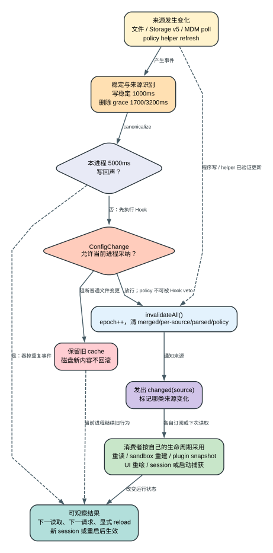

# Claude Code CLI 2.1.235 Settings 解析、合并与热重载

> 版本：`2.1.235` | 证据：`Static` + 精确二进制 `Probe` | 边界：服务端 entitlement、远端 feature 实时值和组织后台下发逻辑不在本地 bundle 内。

## 先回答最常见的问题

**读者问题：** 我已经修改了 settings，为什么当前 Claude Code 仍然沿用旧值，或者只改了一部分行为？

**一句话模型：** `2.1.235` 由一个进程级 settings store 持有来源缓存和合并缓存；变更先经过文件稳定、来源识别与 `ConfigChange`，获准后才整体失效缓存，而每个消费者再按“重新读取、订阅重建、UI 重绘或启动时捕获”决定什么时候采用新值。



这张图的结论不是“settings 支持热更新”，而是：**watcher 只负责制造一次可信的失效事件，真正的生效时间由下游状态 owner 决定。**

## 一个贯穿场景

假设当前进程已经启动：

- user settings 选择 `model=claude-haiku-4-5`；
- project settings 增加 hooks 和 MCP；
- local settings 把 model 改成 `claude-opus-4-5`；
- `--settings` 又提供 `claude-opus-4-6`；
- 企业 policy 固定 sandbox、MCP allowlist 和可用模型。

此时修改 `.claude/settings.json` 不会直接改写一个全局 JavaScript object。客户端先等文件稳定，判断是不是自己刚写出的回声，执行 `ConfigChange` Hook，然后把整个 settings store 的派生缓存失效。下一次读取时，五层来源重新解析和合并；sandbox 订阅者会重建配置，React/TUI 订阅者会重绘，plugin hooks 只在 plugin 相关快照真的变化时 reload，而已经发出的 API request、已经运行的工具、已有 subagent 或启动时构造的 client 不会被倒推重写。

## 变更前后到底改变了什么

| 对象 | 变更前 | 转换 | 变更后 | 用户可见效果 |
| --- | --- | --- | --- | --- |
| 磁盘文件 | 旧 JSON | 外部编辑或程序原子写 | 新 JSON | 文件内容先变化，当前进程未必已采纳 |
| `parsedFiles` | 路径对应旧解析结果 | `epoch` 失效或文件重新解析 | 新解析结果或错误 | 非法文件可能整层跳过 |
| `perSource` | 每个 source 的缓存对象 | 清空并按需重建 | user/project/local/flag/policy 新快照 | `--setting-sources` 只筛普通三层 |
| `mergedSettings` | 旧有效合并对象 | `invalidateAll()` 置空 | 下一次读取时惰性重算 | 不是每次文件事件都立刻完成全部 merge |
| consumer state | sandbox、plugin、UI、client 等旧状态 | 重读、订阅重建、重绘或保持 | 各自的新状态 | 同一设置可能立即、下一请求或重启后生效 |
| 已发生副作用 | 已写文件、已执行命令、已发网络请求 | settings 变更不做回滚 | 继续存在 | 热更新不是事务回滚系统 |

## 1. 真正的状态 owner：`Dko`

`reverse/javascript/cli.readable.js:1303-1360` 的 `Dko` 不是普通配置对象，而是 settings 系统的进程级状态容器。

| 字段 | 持有的状态 | 为什么需要 |
| --- | --- | --- |
| `mergedSettings` | 最终合并结果，初始为 `null` | 避免每次读取都重新访问所有来源；失效后惰性重算 |
| `perSource` | source -> 已解析 settings | 让 `get_settings`、专用 resolver 和 merge 复用单层结果 |
| `parsedFiles` | 路径 -> 文件解析结果 | 避免同一路径因 user/project 重合或多入口被重复解析 |
| `policy` | admin tier、来源、错误、env composition 等 policy 派生缓存 | policy 不只是一个文件，需要组合 remote、MDM、file、helper、parent |
| `lastPolicyEnvComposition` | 最近一次 admin env 联合结果及来源统计 | 解释多层 policy 的 env 为什么与单一 winner 不同 |
| `internalWrites` | 路径 -> 本进程写入时间 | 抑制原子写完成后 watcher 收到的自身回声 |
| `enabledSources` | 当前 `--setting-sources` 选择结果 | 避免重复解析 source selector，同时保留 flag/policy |
| `epoch` | 全局失效代次 | 防止异步文件解析结果在一次新失效后倒灌旧数据 |
| `changed` | source-specific 变更 signal | 让消费者知道是哪类 source 发生变化 |
| `invalidated` | 全局缓存失效 signal | 让只关心“有效设置可能变了”的缓存清理 |
| `pluginBase` | plugin 提供的基础 settings | plugin surface 在五层文件之前参与通用 merge |

`invalidateAll()` 的动作是固定的：

```text
epoch++
mergedSettings = null
perSource.clear()
parsedFiles.clear()
policy = {}
emit invalidated
```

它没有删除磁盘文件，也没有主动重建每个 provider client。它只宣布：**旧派生状态不能再作为权威结果。**

### `epoch` 解决的竞态

文件解析可能异步完成。`seedParsedFile(path, source, parsed, epoch)` 只在调用方携带的 epoch 仍等于当前 epoch 时写回；如果期间又发生一次配置变更，旧解析结果会被拒绝。否则一次慢读就可能在新文件已经生效后重新塞回旧内容。

## 2. 五层来源不是五次简单覆盖

### 普通来源选择

source 顺序在 readable JS `39176-39215`：

```text
userSettings
< projectSettings
< localSettings
< flagSettings
< policySettings
```

`--setting-sources` 只接受 `user,project,local`。构造 enabled sources 时，`flagSettings` 和 `policySettings` 会被无条件补回，因此：

- `--setting-sources user` 会排除 project/local；
- 它不会移除 `--settings`/inline flag 层；
- 它不会移除 managed policy；
- `flagSettings` 没有文件 watcher，因为它来自本进程参数或 control request，不是外部文件生命周期。

精确二进制 Probe 已观察到：flag model 压过 local/project/user；去掉 flag 后 local 胜出；限定 user 后只发送 user model。完整输入、请求模型和 exit status 在 [`settings-resilience.json`](runtime-probes/settings-resilience.json)。

### project 与 user 指向同一路径时

loader 会记录已处理的 resolved path；同一真实路径不会因为两个 source 名称重复 merge。专用最高优先级 resolver 也会在 project/user 路径重合时跳过 project 视图。这个细节防止一个文件被计算两次，但也意味着诊断时不能只按 source 名推断“加载了两份”。

### policy 内部还有 tier

`policySettings` 自身不是单一来源。`41421-41676` 的组合路径至少区分：

| tier / overlay | 主要来源 | 组合语义 |
| --- | --- | --- |
| local helper | `policyHelper` / per-OS `policyHelpers` | 非 remote-armed helper 成功后可作为当前 policy 输出；refresh 有独立状态机 |
| remote | remote managed settings / remote-armed helper | admin tier 的第一候选；危险内容需要 verification + consent |
| MDM / registry | macOS profile、Windows HKLM | remote 缺失时的 admin 候选，并参与限制性/env 组合 |
| managed file | 固定管理员文件 | remote/MDM 缺失时的 admin 候选 |
| parent SDK settings | host/parent managed settings | 默认不合；`parentSettingsBehavior=merge` 时只提取限制性 slice |
| HKCU | Windows user registry fallback | 没有 admin winner 时才可能成为 policy settings |
| host model overlay | host-managed provider model/allowlist | 与普通安全 policy 分开，避免 host 注入任意 helper/env |

这里有两个容易误读的点：

1. `admin` winner 通常取 remote -> MDM/registry -> managed file 中第一个有效对象，但某些限制性位和 env 可以跨 tier 组合；不能只展示 winner 文件名。
2. parent `merge` 只提取 deny/ask、managed-only 开关、sandbox 收紧项、MCP deny 等限制性子集。它不是把 parent 任意设置覆盖到设备 policy 上。

## 3. 解析顺序：alias、salvage、schema、fail-closed

### alias 在 schema 之前改写

`40951-40967` 固定了两个 alias：

```text
additionalMarketplaces -> extraKnownMarketplaces
allowedMarketplaces    -> strictKnownMarketplaces
```

解析单个文件时：

- 只有 alias：把值搬到 canonical key，再删除 alias；
- alias 与 canonical 同时存在：canonical 保留，alias 忽略，并产生 warning；
- alias 不会作为第二份独立设置进入 merge。

所以跨版本比较必须同时记录 schema surface 和 parse-time canonicalization。仅比较最终对象会误以为 alias 从未存在；仅比较 schema 又会误以为两者可同时生效。

### 普通配置允许局部 salvage

普通 settings 会尽量保留可解释部分：

- permission 数组中的非字符串或非法规则逐项删除；
- 未知 Hook event 或错误 Hook 结构被删除并产生诊断；
- marketplace/MCP 列表可以逐项过滤非法 entry；
-某些字段使用 `catch -> undefined`，非法值等于该层未设置；
- 整个 JSON 语法错误或根对象不可解析时，该文件无法提供有效 settings。

这就是为什么“settings 有 warning”不一定等于整层失效。诊断必须读取 error 的 `file` 和 `path`，再确认 effective/sources 中是否还包含剩余字段。

### managed policy 有更严格的失败语义

policy 不能把所有错误都静默当 unset。`availableModels`、`enforceAvailableModels`、managed-only lock、静态 `policyHelpers.defaultSettings` 等路径存在 fail-closed 或 startup-fatal 处理。尤其 per-OS static default payload 一旦结构非法，客户端会拒绝启动，避免 helper 失败时落到一份无法验证的“默认政策”。

## 4. 通用 merge 的四条真实规则

通用 cascade 使用带 customizer 的深合并。`41697-41703` 的 `HOe` 给出三条显式例外，其余对象继续走深合并：

| 输入类型 / 字段 | 低层与高层如何组合 | 例子 | 诊断含义 |
| --- | --- | --- | --- |
| 普通数组 | 拼接后去重 | 多层列表型设置 | 高层数组通常不会自动清空低层全部项 |
| `fallbackModel` 数组 | 高层整数组替换 | user 两个 fallback，flag 一个 fallback | 最终只保留高层序列，顺序具有运行语义 |
| `extraKnownMarketplaces` map | 按 marketplace key 浅合并 | project 注册 A，user 注册 B | A/B 共存；同 key 高层替换 |
| 其他 object | lodash `mergeWith` 深合并 | nested UI、sandbox 普通子对象 | 子字段可来自不同层，不能把对象归因给单一文件 |

合并完成后，policy 的 `availableModels` 和 `enforceAvailableModels` 会再次 pin 回 admin 值，防止普通深合并路径稀释模型治理。

更重要的是，很多安全设置根本不使用这个通用结果：

- `J0e` 只从 `policy -> flag -> user` 读取可信设置，排除 project/local；
- permissions、hooks、MCP allow/deny、sandbox 子字段有自己的集合和裁决顺序；
- `disableClaudeAiConnectors` 使用 any-source-true；
- managed-only 开关只能收紧，普通层不能反向关闭；
-最终 model、effort、advisor、provider、env 还会在 request/client/session 层二次解析。

因此“effective JSON 看起来是什么”与“这次 API request/工具调用真正采用什么”是两个问题。

## 5. 外部文件变更的精确状态机

核心 watcher 在 readable JS `137179-137355`。

### 固定阈值

| 项目 | `2.1.235` 值 | 目的 |
| --- | ---: | --- |
| `awaitWriteFinish.stabilityThreshold` | 1000 ms | 等待编辑器/原子替换写稳定 |
| `awaitWriteFinish.pollInterval` | 500 ms | 检查稳定状态 |
| 普通删除 grace | 1700 ms | `1000 + 500 + 200`，避免 atomic rename 被当永久删除 |
| Storage v5 user settings 删除 grace | 3200 ms | `max(1700, 2000 observation lag + 1000 + 200)` |
| 自身写回声抑制 | 5000 ms | 程序写入后忽略 watcher echo |
| MDM poll | 1,800,000 ms，即 30 分钟 | 没有文件事件的管理员来源定期探测 |

### 普通 change/add

```text
文件稳定
-> 解析 canonical path / symlink target
-> 若命中 5000ms internalWrites：吞掉回声
-> 执行 ConfigChange(source, file_path)
-> Hook 阻断：当前进程保留旧 cache
-> Hook 放行：Nw() 全局失效
-> emit changed(source)
```

`ConfigChange` 阻断的是**当前进程采纳**，不是磁盘回滚。文件已经被外部编辑器写成新内容；新进程、另一个 session 或下一次未被阻断的变更仍可能读取它。把这个 Hook 描述成“撤销配置修改”是错误的。

### delete/unlink

删除先进入 grace timer。若文件在窗口内重建，timer 被取消并按 change 处理；若持续缺失，客户端再执行 `ConfigChange`。这正是兼容编辑器 `write temp -> rename old -> rename temp` 的关键，否则每次保存都会短暂清空配置。

### policy 变更的例外

Hook 协议允许普通 `ConfigChange` 用 blocking result 阻止当前 session 采纳，但 `policy_settings` 会被强制改成 non-blocking。管理员 policy 不能由普通 Hook veto。MDM poll 检测到 hash 变化后直接失效 `policySettings`。

### symlink 与目录监听

watcher 会同时保存 realpath -> canonical path 映射，并监听 symlink target 所在目录，从而捕捉编辑器对目标文件做 atomic save 的场景。macOS 收到 unlink 后还会重新把父目录加入 watcher，避免 rename 序列后丢失监听。

## 6. 程序写 settings 的路径

`42766-42863` 的写 API 与外部 watcher 不是同一路径：

1. `policySettings` 和 `flagSettings` 直接拒绝通过这个文件写 API 修改；
2. 每个目标文件进入串行队列，避免两个 UI 操作交错覆盖；
3. 优先读取已验证对象；若字段验证失败但原始 JSON 仍是 object，可用 raw object 作为 patch seed，尽量不毁掉未知/暂时非法字段；
4. JSON 语法本身无效时停止写入；
5. patch 对数组采用高层数组替换，对 marketplace map 采用 key merge；
6. 写前记录 `internalWrites[path]=now`；
7. Storage v5 使用对应 write discipline，普通文件使用 staging/atomic write 和 symlink/parent 检查；
8. 写成功后 `Nw()`，随后发出 source-specific `changed`；
9. watcher 稍后收到的文件事件在 5000 ms 内被识别为自身回声，不再触发第二轮 Hook/重载。

写入成功只说明目标文件和当前 settings cache 已更新。legacy local revocation、gitignore 维护、订阅者 rebuild 仍有自己的失败结果，不能压成一个 boolean。

## 7. 消费者为什么不会同时刷新

把所有字段写成“支持热更新”会掩盖真实差异。`2.1.235` 至少存在五种消费模式：

| 模式 | 典型 owner | 变更后发生什么 | 什么时候看到新值 |
| --- | --- | --- | --- |
| 每次读取 / 惰性重算 | `Ra()`、`Vd()`、settings resolver | 下一次调用发现 `mergedSettings=null` 后重算 | 下一次读该字段时 |
| subscriber 重建 | sandbox | `vL.subscribe` 后重新构建 sandbox config | 已启动 runtime 接受 update 后；正在跑的命令不回滚 |
| 相关快照变化才 reload | plugin hooks | 只比较 enabledPlugins/marketplace/policy 等相关快照 | 无关设置变化不会重载 plugin hooks |
| React/TUI 重绘 | theme、tips、quota、部分 input 设置 | state/version 变化触发组件重新 render | 通常当前界面内 |
| startup/session/client 捕获 | provider/auth client、process wrapper、已有 subagent/daemon | watcher 本身不重建对象 | 下一请求、显式 reload、新 session 或重启，取决于 owner |

已确认例子：

- sandbox 在 `139109-139115` 订阅 settings change，并调用 runtime update；
- plugin hooks 在 `185468-185483` 先比较 plugin-affecting snapshot，不变则明确跳过 reload；
- quota、skills、多个 UI selector 另有 `vL.subscribe`；
- Agent SDK `get_settings` 同时返回 `effective`、raw `sources`、parse `errors` 和可选 `applied`。`applied` 才接近 model/effort/advisor 等当前 session 真正采用的值。

### 不能承诺热更新的对象

- 已经发送到 API 的 request body；
- 正在执行的 tool 或 hook；
- 已完成的文件/网络/进程副作用；
- 已复制上下文和工具集的 subagent；
- 已建立连接的 remote/cloud session；
- 初始化时缓存环境或凭据的第三方 SDK client。

## 8. Remote managed settings 的本地恢复路径

remote settings 同时支持 Storage v5 view 和磁盘 probe。`40764-40883` 的顺序是：

1. 尝试订阅 Storage v5 `state/remote-settings`；
2. subscription 被拒、读取失败或 view stand down 时，继续使用 disk probe；
3. 单次读取上限 2 MiB，多于 `2,097,152` bytes 的 cache 直接 stand down；
4. cache file 命中 `ELOOP` 时按 absent 处理，而不是跟随 symlink；
5. account change 增加 reset epoch、清空 session/verified/consented payload，并让旧 backend view stand down；
6. 未验证 remote payload 的 `env` 只保留 allowlist，危险代理、认证、HOME/config 路径等变量被剥离；
7. shell/helper/hook/`claudeMd` 等危险内容只有在 verification 和 consent 状态匹配时才能进入更高权限路径。

关键等式是：

```text
sessionCache === verifiedPayload === consentedPayload
```

只有三者是同一个 payload，remote-armed helper 才满足执行前提。账号变化、payload 变化或用户撤销 consent 都会破坏这个等式。

## 9. Policy helper 的执行与恢复状态机

helper 默认值和边界在 `41850-42466`：

| 项目 | 行为 |
| --- | --- |
| 默认 timeout | 10 秒 |
| stdout 上限 | 1 MiB；多 1 byte 即拒绝 |
| refresh interval | `0` 表示不刷新；非 0 必须至少 60 秒 |
| 并发刷新 | `refreshInFlight` 阻止重叠执行 |
| stdout envelope | 可含 `managedSettings`、`claudeMd`、`appendSystemPrompt` |
| singular helper | 不支持 inline script |
| remote-armed helper | 必须是绝对规范 path；禁止 inline script、UNC/network automount/kernel magic-link 等高风险路径 |

### 首次运行与 refresh 不是同一种失败

| 失败时刻 | 有 static default | 无 static default | 当前有效 policy |
| --- | --- | --- | --- |
| 启动首次 helper 失败 | 应用第一个 on-chain 合法 default | 返回启动错误或 status warning，取决于来源/错误类型 | 不会伪造 helper 成功 |
| 定时 refresh 失败 | 从 helper 切到 default，并发 `changed(policySettings)` | 保留当前有效 helper policy | 不会清空成无 policy |
| helper 后续恢复 | helper 输出替换 default | 新输出替换旧 policy | 触发 invalidate + changed |
| static default 非法 | startup-fatal | 不适用 | 客户端拒绝启动 |

### remote-armed helper 的 TOCTOU 防护

helper 启动前记录 `remoteArmGeneration`。执行期间若 payload/consent 改变，generation 会推进；即便子进程已经返回成功 JSON，输出仍被丢弃。后续 refresh 也会持续比较当前 consented subject 与 helper config，不再匹配就停 timer、清状态并失效 policy。

这套机制防的是“用户同意了 A，执行或刷新时却变成 B”。它仍不能证明 helper 本身可信；helper 是管理员/用户明确授予的本地代码执行边界。

## 10. 156 个 direct setting 的消费者家族

完整逐字段语义在 [Settings 全字段参考](settings-reference.md)。下表不是重新堆 key，而是说明九组字段由谁拥有、主要采用哪种刷新方式。九组字段数严格相加为 `156`。

| 家族 | 字段数 | 主要 owner | 典型生命周期 | 详细表 |
| --- | ---: | --- | --- | --- |
| 配置基础、凭据与 policy 装载 | 13 | loader、credential/provider、policy helper | 启动捕获 + helper refresh + request/client 重建 | [第 1 组](settings-reference.md#1-配置基础凭据与策略装载) |
| 文件发现、健康提醒、持久化与 Skills | 11 | file index、active-time ledger、storage、skill registry | 周期 flush、registry refresh、下次 listing | [第 2 组](settings-reference.md#2-文件发现健康提醒持久化与-skills) |
| Git、权限、模型与 MCP | 15 | VCS prompt、permission engine、model resolver、MCP registry | 下一决策/请求，部分需 registry refresh | [第 3 组](settings-reference.md#3-git权限模型与-mcp) |
| Hooks、Worktree、Workflows 与企业锁定 | 24 | hook registry、worktree manager、workflow/permission policy | Hook/plugin reload、下一 workflow/tool decision | [第 4 组](settings-reference.md#4-hooksworktreeworkflows-与企业锁定) |
| Plugins、登录、OTEL 与输出 | 18 | plugin manager、auth/provider、exporter、output resolver | plugin reload、client/exporter 重建、下一输出 | [第 5 组](settings-reference.md#5-plugins登录otel-与输出) |
| Sandbox、交互、模型行为与 Agent 入口 | 25 | sandbox runtime、TUI/input、model/session resolver | subscriber update、UI 重绘、下一 request/session | [第 6 组](settings-reference.md#6-sandbox交互模型行为与-agent-入口) |
| Cloud、更新、TUI、Voice 与通知渠道 | 12 | cloud session、updater、TUI renderer、audio/channel manager | 新 cloud/update 操作、UI 重绘、连接重建 | [第 7 组](settings-reference.md#7-cloud更新tuivoice-与通知渠道) |
| Agent 完成条件、上下文、Memory 与组织记忆 | 14 | Agent Loop、context budget、memory/checkpoint、managed prompt | 下一 loop/context build、后台 consolidation | [第 8 组](settings-reference.md#8-agent-完成条件上下文memory-与组织记忆) |
| 持久 UI 偏好、Compact、Checkpoint 与跨会话协作 | 24 | AppState、compact controller、checkpoint store、daemon/remote | UI 重绘、下一 compact/checkpoint/message | [第 9 组](settings-reference.md#9-持久-ui-偏好compactcheckpoint-与跨会话协作) |

证据等级也必须互斥：

| 等级 | 数量 | 字段 |
| --- | ---: | --- |
| `Probe` | 2 | `model` 的 settings source winner；`fallbackModel` 的真实 fallback request sequence |
| `Alias -> Static consumer` | 2 | `additionalMarketplaces`、`allowedMarketplaces` |
| `Declaration only` | 3 | `$schema`、`quietHours`、`sshConfigs` |
| `Static consumer` | 149 | 其余字段均已定位到读取、决策、状态持有或用户可见 consumer；仍不等于本账户成功触发 |

## 11. 故障诊断：按状态 owner 查，不按文件名猜

| 症状 | 先查什么 | 真实判断 |
| --- | --- | --- |
| 文件已经变了，当前 session 没变 | `ConfigChange` 是否阻断；source 是否被 watcher 识别 | Hook 可保留当前旧 cache，但不会回滚磁盘 |
| `--setting-sources user` 仍受限制 | policy/flag 是否存在 | selector 从不移除 policy/flag |
| 修改 project sandbox 无效 | 该子字段是否拒绝 project/local；managed pin 是否存在 | 不是 precedence 输掉，而是来源根本不合格 |
| 数组出现低层旧项 | 字段是否走普通数组去重并集 | 只有 `fallbackModel` 是通用 merge 的整数组替换特例 |
| plugin setting 改了但 hooks 未 reload | plugin-affecting snapshot 是否真的变化 | subscriber 会跳过无关变更 |
| provider/model 仍用旧值 | 查看 `get_settings.applied`、当前 request、client 构造时机 | `effective` 不等于已发 request |
| policy helper 暂时失败但限制仍在 | 当前 serving 是 helper/default/retained | refresh failure 不会一律清空 policy |
| remote settings 突然退回 disk | storage subscription/read 是否 stand down，账号是否变化，cache 是否 >2 MiB | disk probe 是设计内 fallback，不等于 remote policy 被删除 |
| 修改后另一个进程生效、本进程不生效 | 本进程 Hook/cache/consumer 生命周期 | 每个进程有独立 store 和订阅状态 |

## 12. 成本、安全与恢复边界

- **延迟**：settings cache 减少重复磁盘和 policy 组合；代价是必须精确失效，不能直接读取旧 object。
- **安全**：project/local 来源隔离阻止仓库关闭 sandbox、启动危险 helper 或开启远控；managed pin 又阻止普通层放宽。
- **可用性**：删除 grace、Storage v5 -> disk fallback、helper refresh 保留当前 policy 都是为了避免瞬时故障清空配置。
- **一致性**：全局 `epoch` 防旧异步读回灌；per-file 写队列防本进程交错覆盖；它们不解决多个独立进程同时编辑同一文件的所有冲突。
- **隐私**：remote 未验证 env 被 allowlist 过滤；helper stdout、Hook、`claudeMd` 和 settings env 仍可能携带敏感数据，日志和文档不能复制真实值。
- **不可回滚副作用**：settings 失效、Hook 阻断和 session restart 都不能撤销已经执行的命令、文件写入、MCP 调用、网络请求或远端状态变化。

## 证据索引

- Store 与失效：readable JS `1303-1360`。
- source selector 与 internal write TTL：`39176-39228`。
- remote payload trust、Storage v5、2 MiB 与 env filter：`40495-40883`。
- alias 与 parse salvage：`40951-41179`。
- source path、policy tier composition：`41400-41676`。
- 通用 merge 与惰性 cache：`41697-41760`。
- policy helper 选择、refresh、fallback、执行 envelope：`41850-42466`。
- programmatic write：`42766-42863`。
- trusted-source resolver：`42936-43103`。
- watcher 与 `ConfigChange`：`137179-137355`。
- sandbox subscriber：`139109-139115`。
- plugin hooks snapshot reload：`185468-185483`。
- exact-binary source precedence 与 fallback：[`settings-resilience.json`](runtime-probes/settings-resilience.json)。

客户端可以证明这些本地状态和分支。当前组织远端究竟下发了什么、服务端 feature/entitlement 如何求值、Anthropic 账户风控如何裁决，仍然是 `Boundary`。
