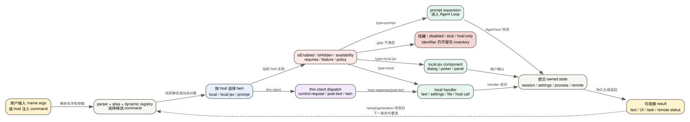

# Claude Code CLI 2.1.235 的 103 个 Slash Command 生命周期

Slash command 不是一组同质“快捷键”。在 `2.1.235` 中，同一个 `/name` 可能打开本地 TUI、调用无 UI handler、生成一段 prompt 进入 Agent Loop，或者交给 thin client/remote host 执行。判断命令是否存在、是否成功，必须同时看 command object、当前 host、feature/policy gate、handler 返回和它改变的状态。

## 60 秒理解命令路由

**读者问题：** 为什么 `/model` 在交互终端打开选择器，在 SDK/print mode 却直接返回文本？为什么 `/version` 的 command object 明明存在，菜单里却没有？为什么 `/workflow-launch-exec` 只能由特定远端事件会话调用？

**一句话模型：** parser 先解析名字和参数，再从同名 command twin 中选择当前 host 可执行的实现；可见性、可手输、模型可调用和远端可分发是四个独立条件，handler 最终只修改它负责的 session、settings、进程、文件或远端对象。

贯穿场景：用户在交互终端输入 `/model opus`。router 选择 `local-jsx` twin，检查当前模型目录、provider、policy 和账户能力，更新 session model，并让下一次 request 使用新模型；SDK/print host 则选择支持非交互的 `local` twin。若只有 command 名存在但 `isEnabled` 为 false，命令不会因为 inventory 收录就变成可用功能。

| 阶段 | 输入/状态 | 关键判断 | 输出 |
| --- | --- | --- | --- |
| Parse | `/name args`、alias、dynamic command registry | 名字、argument hint、completion、冲突 | command candidate |
| Select twin | interactive、print、SDK、thin client、remote | `local` / `local-jsx` / `prompt`、`supportsNonInteractive`、`thinClientDispatch` | 当前 host implementation |
| Gate | `isEnabled`、`isHidden`、availability、requires、feature、provider、policy | 能否执行、是否展示、是否需要 workspace/Ink | 执行、隐藏或拒绝 |
| Execute | handler、prompt builder 或 host RPC | 输入校验、permission、busy/session ownership | 本地结果、Agent turn 或 control request |
| Commit | App state、settings、transcript、文件、进程、远端对象 | 持久化、reload、reconnect、不可逆副作用 | 用户可观察状态 |

## 三种 command type

### `local`

`local` 装载一个 handler，适合无 UI 或可文本化的动作。它可以支持 noninteractive，返回 `text`，写 settings/session 文件，或通过 `fleetHostCall` 请求宿主执行。`clear`、`compact`、`reload-skills`、`recap` 属于这一类。

`supportsNonInteractive:true` 只表示 handler 允许在相应 host 被调用，不表示动作没有副作用。例如 `design-consent`、`import`、`auto-mode-setup` 都能写持久状态。

### `local-jsx`

`local-jsx` 打开 Ink/TUI component 或交互 dialog。component 的“打开”只是中间状态，用户取消不会提交最终值。`config`、`permissions`、`tasks`、`plugin`、`resume` 属于此类。

同名 twin 常见于 `model`、`usage`、`effort`、`config`、`color`、`autocompact`、`skill-doctor`：交互 host 选 JSX，print/SDK host 选 local。两条实现要共享业务语义，但返回 envelope 和交互步骤不同。

### `prompt`

`prompt` 把命令展开成 prompt/context，再进入 Agent Loop；它不是本地设置函数。`init`、`insights`、`statusline`、`team-onboarding` 属于这一类。它们可声明 allowed tools、model/effort、workspace requirement、是否允许非交互和是否允许模型自行调用。

执行成功的定义是 Agent Loop 收到展开后的消息并完成后续 turn；prompt command 本身不能保证模型实际写文件或完成目标。

## 四个经常混淆的布尔面

| 问题 | 主要字段 | 例子 |
| --- | --- | --- |
| 菜单里看得到吗 | `isHidden`、availability、requires | `workflow-launch-exec`、`design-consent` 隐藏 |
| 用户手动输入能执行吗 | parser、`isEnabled`、host twin | `version` object 存在但本版 `isEnabled:false` |
| 模型能自行调用吗 | `disableModelInvocation`、listing budget | `statusline`、host handoff command 禁止模型调用 |
| thin client 在哪执行 | `thinClientDispatch`、control schema、twin | `btw`/`context` 走 control request，`reload-skills` 走 post-text |

因此 103 是**静态 command identifier 集合**，不是菜单数量，也不是 103 个当前账号都可用的能力。

## 状态所有权总图

| 状态 owner | 典型命令 | 生命周期 |
| --- | --- | --- |
| 当前 render/App state | `color`、`focus`、`theme`、`tui`、`scroll-speed` | 当前进程或 session；部分值再写 settings |
| 当前 conversation/session | `clear`、`compact`、`branch`、`rename`、`goal` | transcript/message graph 或 session metadata |
| Settings/policy-aware config | `config`、`autocompact`、`model`、`effort`、`permissions` | 按 source/merge 写入；consumer 可能要下一 request/reload |
| 文件 | `export`、`keybindings`、`init`、`statusline`、`heapdump` | 文件写入成功后独立于对话 rewind |
| 进程/registry | `mcp`、`reload-plugins`、`reload-skills`、`daemon`、`voice` | process-local generation、socket、server 或 background registry |
| 后台 Agent/task | `fork`、`subtask`、`background`、`tasks`、`workflows` | task/session registry + transcript/worktree |
| 远端 account/service | `login`、`teleport`、`remote-control`、`upgrade`、`artifacts`、`design` | 客户端只持 credential、URL、status；权威状态在服务端 |

## 一、会话、上下文、历史与目录

| 命令 | 类型 | 改变的状态、成功与失败边界 |
| --- | --- | --- |
| `/add-dir` | `local-jsx` | 把额外目录加入当前 session 的 working-directory/permission context；路径必须可解析并经过 trust/permission。它不会移动 primary cwd，也不会自动把目录内容送给模型。 |
| `/autocompact` | twin | 读写 auto-compact window；交互版选择阈值，非交互版解析 `auto` 或 token 数。新值影响后续 context pressure 判断，不会重新压缩已经生成的 summary。 |
| `/branch` | `local-jsx` | 在当前消息点创建 conversation branch；复制的是消息图/会话状态，不是 Git branch。新分支写入独立 session identity，已发生外部副作用仍共享现实世界。 |
| `/brief` | `local-jsx` | 在 feature gate 开启时切换 brief-only response/view state；gate 不满足时 command 不可达。它不是模型 `max_tokens` 的通用硬限制。 |
| `/btw` | `local-jsx`, control request | 启动不打断主 conversation 的 side question surface；回答归 side channel/host 状态，不应冒充主 transcript 的新业务 turn。thin client 由宿主返回结果。 |
| `/cd` | `local-jsx` | 请求迁移当前 session cwd；busy tool、worktree/allowed directory、trust 或 host relocation 可使它失败。成功后后续相对路径改变，之前启动的进程不会自动迁移。 |
| `/clear` | `local`, noninteractive | 建立空上下文的新 session，旧 session 仍落盘并可 `/resume`。它不删除 transcript、memory、文件修改或远端副作用。 |
| `/compact` | `local`, noninteractive | 进入客户端 compact 流程，生成 summary/compact boundary 并重建上下文；详细状态机见 [compact 图文专题](compact-visual-guide.md)。失败会保留旧上下文或进入 reactive recovery，不能把半份 summary 当成功。 |
| `/context` | twin/control | 计算当前 context 各组成部分；交互版画网格，非交互版输出文本。它读取估算/客户端结构，不等于服务端最终计费账单。 |
| `/export` | `local-jsx` | 把 conversation 导出到文件或 clipboard；导出的 transcript 可能含源码、路径、tool output 和账户元数据。文件写入后不受 rewind 影响。 |
| `/focus` | `local-jsx` | 切换只显示 prompt、summary、response 的 view mode；若 settings 固定 viewMode，handler可拒绝临时覆盖。它不删除隐藏消息。 |
| `/fork` | `local-jsx` twins | 按当前 surface 创建继承完整 conversation 的后台 agent/session。coordinator session 禁止某些 fork 路径；首轮前也可能无 fork point。子任务外部副作用独立完成。 |
| `/goal` | twin/post-text | 设置或清除 active goal，Agent Loop 在停止前检查；它改变终止条件，不是另起一个模型。无 UI host 通过 post-text 返回状态。 |
| `/import` | twin | 从其他 AI coding agent 导入可识别配置；受 feature、source trust、冲突和写权限约束。成功意味着本地配置写入，不保证所有 consumer 热刷新。 |
| `/memory` | `local-jsx` | 打开 CLAUDE.md 和 memory settings 编辑面；分别处理项目指令文件与 automemory 配置。保存文件会影响未来 context 装配，当前已生成 request 不会倒改。 |
| `/pause-memory` | `local`, disabled | 注册了暂停 automemory 的 handler，但本版 command object `isEnabled:false`；存在 identifier 只证明保留 surface/兼容代码，不能宣称菜单可用。 |
| `/recap` | `local`, post-text | 立即复用 Away Summary 的单轮无工具生成器，并把一行 recap 作为命令文本返回；该 wrapper 不追加 `away_summary` system event，也不更新 session metadata。它是一次性短摘要，不替代 compact summary 或完整 transcript。 |
| `/rename` | twin | 更新 conversation display name/session metadata；不改变 session ID、目录或远端 URL。写入失败时原名继续有效。 |
| `/resume` | `local-jsx` | 按 ID/搜索选择旧 conversation，重建持久消息图与相关附件；进程内 socket、pending permission、watch 和已退出子进程不会复活。 |
| `/rewind` | `local` | 打开 checkpoint 恢复，选择 code、conversation 或两者；详细边界见 [Session/Checkpoint/Memory](sessions-checkpoints-memory.md)。文件 checkpoint 不能回滚 Git、进程和远端系统。 |
| `/session` | `local-jsx` | 在 cloud session 中展示 URL/QR；本地非 cloud session 不应由这个 object 推断出远端身份。URL 是访问句柄，不是 transcript 副本。 |
| `/exit` | twin | 请求当前 host 完成清理并退出；应等待 transcript flush、task/telemetry teardown 的实际结果。退出不等于删除 session 或终止所有远端任务。 |

## 二、模型、权限与执行模式

| 命令 | 类型 | 改变的状态、成功与失败边界 |
| --- | --- | --- |
| `/advisor` | `local-jsx`, control | 配置/触发在关键时刻咨询更强模型；受 feature、账号、模型可用性和 host capability 约束。一次 advisor 调用是额外模型成本，不是当前主模型被永久替换。 |
| `/auto-mode-setup` | twin | wizard 先生成 proposal；apply 要求 canonical UUID request ID、绝对 proposal path 和精确 SHA-256，且 scope/save target 必须匹配。hash 不一致时拒绝，避免批准后文件被换。 |
| `/effort` | twin/control | 更新当前 model request 的 effort level；下一次 request 才消费。provider/model 不支持时会降级或拒绝，不能从 UI 选项推断上游一定接受。 |
| `/fast` | twin/control | 切换 fast mode；受 entitlement/model/feature gate。它调整模型/服务路径与延迟偏好，不会让本地 tools 绕过 permission，也不保证每轮更快。 |
| `/model` | twin/control | 从 allowlist、provider、policy 和账号可用模型中选择 session model；下一 request 可观察。fallback model 与 subagent override 是独立状态。 |
| `/permissions` | `local-jsx` | 编辑 allow/ask/deny 规则和 permission mode；保存时遵守 settings source 与 managed lock。已有外部副作用不会因后来加入 deny 而撤销。 |
| `/plan` | `local-jsx` | 进入/查看/分享 plan mode，改变 tool permission context 和 plan file 流程。plan mode 禁止的写操作不会因命令名字被允许而执行。 |
| `/powerup` | `local-jsx` | 打开功能教学流程；主要改变 onboarding/UI 状态，不是新的 Agent 能力或权限绕过。 |
| `/ultraplan` | `local-jsx` | 把计划草拟交给 Claude Code on the web；受 remote/account gate，返回远端 session/plan 状态。未推送本地改动是否存在于远端取决于 handoff 协议。 |
| `/ultrareview` | twin | 在 web/远端 review surface 执行更深审查；交互和非交互 twin 不同。远端发现要回到本地证据验证，不能自动视为已修复。 |
| `/autofix-pr` | `local-jsx` | 在允许 remote sessions 的账号上监控并处理当前 PR；需要 repo/PR 身份和远端 entitlement。监控启动不代表修复已合并。 |
| `/passes` | `local-jsx` | 展示邀请/赠送资格和使用积分 UI；`isHidden` 由 eligibility cache 决定。它不改变模型执行权限。 |
| `/brief` | 已在会话组说明 | 同时属于 response mode，但状态 owner 是 session view/response policy，而不是模型目录。 |

## 三、Agent、Task、Background 与 Schedule

| 命令 | 类型 | 改变的状态、成功与失败边界 |
| --- | --- | --- |
| `/agents` | `local` stub | wizard 已移除；handler 返回如何通过 `.claude/agents/` 或自然语言管理 subagent 的说明。identifier 存在不代表旧 wizard 仍运行。 |
| `/background` | `local-jsx` | 把当前 session 交给 background supervisor 并释放终端；可附 prompt。成功后 transcript/worktree 继续由后台 owner 管理，终端退出不等于任务完成。 |
| `/list-agents` | `local`, noninteractive | 列出可消息的 subagent/其他 Claude sessions；受 agent view/team/channel gate。列表是当前 registry snapshot，不保证远端仍在线。 |
| `/loops` | `local-jsx`, disabled | 注册“列出、创建、删除 loops”的 UI，但 `isEnabled:false`；不能把 inventory 计数写成本版已开放 scheduler UI。Cron tools/remote schedule 是另一个 surface。 |
| `/stop` | twin | 只在 background session 可达；停止 worker，但保留 transcript 与 worktree。已经完成的工具/网络副作用不撤销，停止确认失败时状态可能仍需重新读取。 |
| `/subtask` | `local-jsx` | 用完整 context 启动 subagent并把结果回主会话；首轮前/coordinator mode 有限制。结果回传与子 Agent transcript 是两份状态。 |
| `/tasks` | `local-jsx` | 查看和管理 shell、agent、workflow 等后台对象；UI 派生状态必须与 task registry/worker status 对齐。删除或 stop 需要实际确认，不能只改列表行。 |
| `/team-onboarding` | `prompt` | 在 feature gate 下分析使用数据并生成 onboarding guide；允许的 tools 被限制到指定 Edit/Bash/tool surface。生成 prompt 成功不保证文件通过人工验收。 |

Cron/loops/channels 的运行时不只由 slash command 承载，详见 [Cloud、Background 与 Channels](cloud-background-channels.md) 和 [内置工具参考](builtin-tools-reference.md)。

## 四、MCP、Plugin、Skill 与 Hook

| 命令 | 类型 | 改变的状态、成功与失败边界 |
| --- | --- | --- |
| `/hooks` | `local-jsx` | 展示当前有效 hook 配置和来源；查看不执行 hook，也不能证明每个外部命令可启动。31 类事件见 [Hooks 全事件参考](hooks-event-reference.md)。 |
| `/mcp` | twin | reconnect/enable/disable server，改变 MCP client registry/generation；连接成功后还要 fetch tools/resources/prompts。server 进程或 OAuth 失败不会被“enabled”布尔值掩盖。 |
| `/plugin` | `local-jsx` | list/install/enable/disable/uninstall/marketplace/stats；修改 registry/settings/cache。安装 bytes、enabled decision 和当前 session loaded generation 是三份状态。 |
| `/reload-plugins` | `local`, control | 清 caches，重建 command/agent/hook/MCP/LSP registry；MCP set 改变可能提示 prompt-cache 成本，`--force` 才直接应用。单组件失败进入 errors，其余可继续。 |
| `/reload-skills` | `local`, post-text | 清 skill cache、重新扫描、发 command-change signal并返回 added/removed；不安装 plugin、不重连 MCP/LSP。safe mode 可返回 custom skills disabled。 |
| `/skill-doctor` | twin | 统计 listing footprint、使用记录和长期未用 Skill；结果是成本诊断，不会自动删除或禁用内容。thin client twin 分别走 post-text/交互。 |
| `/skills` | `local-jsx` | 列当前 registry 的 Skills，受 source、policy、override、sync 和 listing gate；“未列出”不等于磁盘文件不存在。 |

完整动态扩展链见 [Plugins、Skills、Commands 与 LSP](plugins-skills-commands-lsp.md)。

## 五、IDE、Browser、Remote 与 Daemon

| 命令 | 类型 | 改变的状态、成功与失败边界 |
| --- | --- | --- |
| `/chrome` | `local-jsx` | 打开/配置 Claude in Chrome surface；只在交互 Claude-account host 可达。它不等于 Chrome bridge 已连接或页面权限已授予。 |
| `/daemon` | `local-jsx` | 管理后台 services/routines；操作的是 supervisor/worker registry，不是一个普通 shell PID 列表。start/stop 需看实际确认。 |
| `/desktop` | `local-jsx` | 把当前 session handoff 到 Claude Desktop；受 availability 和 Desktop 接收能力。handoff 成功不表示本地进程状态、socket和所有 UI 状态被复制。 |
| `/ide` | `local-jsx` | 管理 IDE discovery/socket/status；selection、diagnostics、diff panel 和 focus 是独立消息。连接 object 存在不等于 IDE state 新鲜。 |
| `/mobile` | `local-jsx` | 显示下载 Claude mobile app 的 QR；只生成 UI/链接，不建立 Remote Control session。 |
| `/remote-control` | `local-jsx` | 连接或断开手机/claude.ai/code 对本机 session 的控制；受 managed disable、账号、custom endpoint 和 reconnect gate。服务端成功路径仍需真实账号 Probe。 |
| `/remote-env` | `local-jsx` | 选择 cloud agents 默认 environment；写的是未来远端启动选择，不迁移已运行 session。 |
| `/teleport` | `local-jsx` | 上传/发送当前 session 到 cloud 或恢复 web session；受 remote entitlement。文件/未推送 Git state 是否传输取决于具体 handoff，不可由名字推断。 |
| `/web-setup` | `local-jsx` | 在多重 feature + remote gate 下通过 GitHub 设置 web Claude Code；OAuth/app install 未完成时本地 command 打开不等于远端可用。 |

这些接口的正反向消息、UI 竞态和重连见 [TUI、IDE、Chrome 与媒体](tui-input-accessibility-media-ide-chrome.md) 与 [Cloud、Background 与 Channels](cloud-background-channels.md)。

## 六、Workflow、Artifact 与 Design

| 命令 | 类型 | 改变的状态、成功与失败边界 |
| --- | --- | --- |
| `/artifacts` | `local-jsx` | 浏览 mine/shared Artifact 列表；title/metadata 可来自其他用户，是数据不是指令。列表为空不能证明从未有人分享。 |
| `/design` | 同名双表面 | bundle 同时发布 bundled `prompt` hub 和 builtin `local` noninteractive 对象。命令装配把 bundled skills 放在 builtin table 之前，查找返回第一个进入有效候选集的精确同名项：hub gate 通过时，它处理 free-form/create/import/export/status，并把 sync/login/consent/revoke 路由到专用表面；`HEi()` 为 false 或 bundled-skill kill switch 让 hub 不进入候选时，builtin fallback 只接受 consent/revoke。`skillOverrides.design=off` 发生在同名解析之后，会对已选中的 hub 报 disabled，不会继续回落。两个对象都在产物中，但只占一个唯一 identifier。 |
| `/design-consent` | hidden `local` | host/flow 用于授予 Design agent access；隐藏不等于不存在。必须区分 consent 与 claude.ai login credential。 |
| `/design-login` | `local-jsx` | 为 `/design-sync` 获取 claude.ai 授权；登录成功只解决 credential，不保证项目权限、配额或 bundle 合法。 |
| `/design-revoke` | hidden `local` | 撤销 Design agent access；已同步远端数据的 retention/删除不由本地 revoke object 证明。 |
| `/workflow-launch-exec` | hidden `local`, noninteractive | 只消费 `workflow_launch` event session 的 server handoff，禁止模型调用；普通用户手输缺少可信 event payload时不应执行。 |
| `/workflows` | `local-jsx` | 浏览 local workflow task 的实时/历史状态；remote CCR workflow 的权威进度在 session URL，不一定进入本地列表。 |

动态 `/design-sync` 不在这 103 个静态 identifier 中；它由 bundled Skill 构造。`/design` 则提醒了反向解读的另一个边界：唯一名称集合不等于 command object 数量，要继续跟装配顺序、enable gate、override 检查位置和 first-match 查找。`Static`：builtin 对象在 `reverse/javascript/cli.readable.js:334687-334724`，bundled hub 在 `542350-542373`，装配与查找在 `369428-369442`、`156619-156625`，`skillOverrides` 命中后终止在 `276526-276539`。完整数据链见 [Workflow、Artifact 与 Design](workflow-artifact-design.md)。

## 七、安装、账户、Provider、升级与用量

| 命令 | 类型 | 改变的状态、成功与失败边界 |
| --- | --- | --- |
| `/config` | twin | 交互 UI 或非交互 `key=value` 写 settings；字段有不同 source/merge/consumer。文件写入成功不代表初始化对象全部热刷新。 |
| `/extra-usage` | hidden twin | 兼容旧名字，转到 `/usage-credits`；存在是迁移 surface，不是第二套额度系统。 |
| `/install` | `local-jsx` | 安装 native Claude Code build；涉及目标路径、版本、签名/下载和旧安装迁移。command 完成后要用实际 `claude --version` 验证新入口。 |
| `/install-github-app` | `local-jsx` | 为 repo 配置 GitHub Actions/App；受 disable setting、provider availability、repo 权限和 OAuth。打开网页不等于 app 已安装。 |
| `/install-slack-app` | `local` | 启动 Claude Slack app 安装；依赖 claude.ai availability，非交互不支持。远端 workspace 授权是服务端状态。 |
| `/login` | `local-jsx` | 选择 Claude account、Console 或 provider auth 路径并写 credential/session；登录类型决定 Artifact/remote 等能力。credential helper/host injection 可覆盖本地登录。 |
| `/logout` | `local-jsx` | 清理当前可注销 credential/account state；可被 `DISABLE_LOGOUT_COMMAND` 禁用。它不撤销已发出的 OAuth app grant 或远端分享。 |
| `/privacy-settings` | `local-jsx` | 查看/修改账号或客户端隐私选项；受 availability。各 telemetry/exporter 仍有独立 env/policy gate，不能简化成一个总开关。 |
| `/pro-trial-expired` | hidden `local-jsx` | 由 trial-expired host 状态打开选择 UI；普通菜单隐藏。它不改变本地模型实现。 |
| `/rate-limit-options` | hidden `local-jsx` | 由 rate-limit 状态打开升级/等待等 UI；命令 object 存在不证明当前请求真的被限流。 |
| `/setup-bedrock` | `local-jsx` | 仅 Bedrock provider 时显示，重配 credential、region、model pin；配置成功后下一 client/request 才验证 AWS 权限。 |
| `/setup-vertex` | `local-jsx` | 仅 Vertex provider 时显示，重配 GCP auth、project、region、model pin；本地 schema通过不等于远端 IAM 允许。 |
| `/update` | hidden disabled `local` | 保留 relaunch/update handler，但本版 command object `isEnabled:false`；真实更新仍由 installer/auto-updater lifecycle承担。 |
| `/upgrade` | `local-jsx` | 打开 Max/plan upgrade flow；服务端订阅成功需重新读取 account entitlement。 |
| `/usage` | twin/control | 展示本 query/session cost、plan usage、activity；本地 token/cost 是累计估算，plan额度权威状态来自服务端。resume 新 query 不应把累计值重复相加。 |
| `/usage-credits` | twin | 配置或申请 usage credits；受账号/组织 gate。请求提交、管理员批准和额度生效是不同状态。 |

安装、迁移与 rollback 见 [Install/Update/Doctor](install-update-doctor-lifecycle.md)，认证与 request 见 [Models/Auth/Providers](models-auth-providers-request.md)。

## 八、TUI、输入、可访问性与媒体

| 命令 | 类型 | 改变的状态、成功与失败边界 |
| --- | --- | --- |
| `/color` | twin | 设置当前 session prompt bar color；交互/非交互实现不同。它是本地展示元数据，不改变 agent name 或权限。 |
| `/copy` | `local-jsx` | 把最近第 N 条 assistant response 写 clipboard；clipboard 是系统外部状态，失败时不应假装已复制。tool result/hidden text不一定属于“response”。 |
| `/keybindings` | `local` | 打开用户 keyboard shortcuts 文件；受 keybinding feature/平台。编辑后的 remap 需 parser/reload 成功，文件存在不等于所有 chord 有效。 |
| `/radio` | `local`, gated | 在 feature flag 下启动 Claude FM 流；非交互不支持。它创建媒体/网络状态，与 Agent Loop 无关。 |
| `/scroll-speed` | `local-jsx` | 调整 mouse wheel scroll，受 terminal/IDE 支持判断。它不改变键盘分页或输出 buffer。 |
| `/status` | `local-jsx` | 聚合 version、model、account、API、tools 状态；各项采样时间不同，页面成功打开不代表所有远端 probe成功。 |
| `/statusline` | `prompt` | 让模型读取并编辑 `~/.claude/settings.json` 中 statusLine；allowed tools受限。模型生成脚本仍需用户检查执行成本和敏感输出。 |
| `/stickers` | `local` | 打开/执行贴纸订购流程；非交互不支持，是外部网页/履约边界。 |
| `/terminal-setup` | `local-jsx` | 根据终端配置 Option+Enter、Shift+Enter 等输入支持；修改终端配置后需新事件验证，不能由写文件成功推断终端已重载。 |
| `/theme` | `local-jsx` | 改 theme/settings并重绘；explicit light/dark 与 system 跟随是不同状态。已发布 Artifact theme 是 viewer 侧另一条链。 |
| `/tui` | `local-jsx` | 切换 default/fullscreen renderer；会改变 alternate screen、mouse tracking和重绘策略，不改变 transcript。 |
| `/voice` | `local`, hidden by capability | 切换 hold/tap/off voice mode；需要 native/audio permission、账号和 circuit breaker。启动 capture不等于转写成功。 |
| `/wellbeing` | `local-jsx`, disabled | 注册 break reminder/quiet hours UI，但 `isEnabled:false`；settings schema仍存在，不等于该 slash UI 在本版开放。 |

完整 composer、screen reader、IDE panel、voice/audio/image/spellcheck 见 [TUI、IDE、Chrome 与媒体](tui-input-accessibility-media-ide-chrome.md)。

## 九、帮助、诊断、信息与反馈

| 命令 | 类型 | 改变的状态、成功与失败边界 |
| --- | --- | --- |
| `/bug` | `local-jsx` | 打开 bug/share flow，可附 conversation；发送前要区分报告文本、transcript 和诊断附件。远端 ticket成功由服务响应证明。 |
| `/diff` | `local-jsx`, control | 展示/切换未提交 Git diff panel；读取的是当前 repo snapshot，后台修改会使旧 view 过期。它不执行 `git commit`。 |
| `/feedback` | `local-jsx` | 发送反馈或问题报告；与 `/bug` 的 share/transcript UI 路径不同，均是显式数据外发。 |
| `/heapdump` | hidden `local` | 在 `allow_heap_dump` gate 下把 JS heap dump 写到 Desktop；文件高度敏感且可能很大。写入失败不影响主会话继续。 |
| `/help` | `local-jsx` | 根据当前 registry/gates 展示命令，不是静态 103 清单原样输出。hidden、dynamic、host-only command可能不显示。 |
| `/init` | `prompt` | 让模型初始化 CLAUDE.md 及可选 skills/hooks；进入 Agent Loop 后仍需 Read/Write/Edit permission。生成文件是项目持久状态。 |
| `/insights` | `prompt` | 读取历史 session、对长内容分块总结并生成使用报告；会处理项目路径和用户/assistant片段，输出与缓存均按会话数据保护。 |
| `/release-notes` | `local-jsx` | 展示客户端携带/获取的 release notes；不证明本地二进制已升级到页面最新版本。 |
| `/version` | disabled twins | 保留“当前 session version，而非 updater 下载版本”的实现，但本版 command objects `isEnabled:false`；应使用 CLI `--version` 或 status surface验证。 |

## 失败恢复顺序

| 症状 | 优先检查 | 原因 |
| --- | --- | --- |
| command 不在菜单 | `isHidden`、requires、availability、feature/account/policy | inventory 有名字不代表可见 |
| 手输后 unknown | dynamic registry generation、alias 冲突、host parser | 磁盘 plugin/Skill可能未 reload |
| 交互能用、SDK不能 | 是否有 `local` twin、`supportsNonInteractive`、dispatch mode | JSX component无法直接序列化 |
| thin client卡住 | control request ID、host response/cancel、post-text回流 | 本地 command object不是执行 owner |
| 设置显示已改但行为未变 | 字段 source/merge、consumer读取时机、client/registry重建 | file write和runtime consume是两步 |
| 命令返回成功但目标没完成 | 区分 dialog/prompt/task launch/remote request 与最终业务终态 | 打开 UI 或启动后台只是中间状态 |
| resume 后命令状态消失 | state是否只在 process/App state/socket | transcript不会复活进程对象 |

## 成本、隐私与安全

- `prompt` command 会增加至少一个 Agent turn，并可能执行工具；`insights` 还会分块总结长 session。
- `reload-plugins`、MCP tool set、Skill listing变化会改变 prompt prefix/cache；命令本身的本地开销不是全部成本。
- `bug`、`feedback`、`export`、`insights`、`login`、Artifact/Design/remote commands都可能处理 transcript、路径、账户或源码。
- `heapdump`、keybindings、statusline、import、init 会读写本地文件；rewind 不保证撤销这些文件。
- background、fork、subtask、Workflow、ultra/remote命令会产生额外模型调用或远端执行；“后台”不等于免费。
- managed settings 可以隐藏或禁用 command surface，但不能撤销命令禁用前已发生的外部副作用。

## 103/103 机器覆盖标记

下面区块严格跟随 `slash-command-identifiers.txt` 的排序。它只用于 validator 核对集合；机制解释以正文九个生命周期族为准。

<!-- SLASH_COMMAND_COVERAGE_BEGIN -->
001 add-dir
002 advisor
003 agents
004 artifacts
005 auto-mode-setup
006 autocompact
007 autofix-pr
008 background
009 branch
010 brief
011 btw
012 bug
013 cd
014 chrome
015 clear
016 color
017 compact
018 config
019 context
020 copy
021 daemon
022 design
023 design-consent
024 design-login
025 design-revoke
026 desktop
027 diff
028 effort
029 exit
030 export
031 extra-usage
032 fast
033 feedback
034 focus
035 fork
036 goal
037 heapdump
038 help
039 hooks
040 ide
041 import
042 init
043 insights
044 install
045 install-github-app
046 install-slack-app
047 keybindings
048 list-agents
049 login
050 logout
051 loops
052 mcp
053 memory
054 mobile
055 model
056 passes
057 pause-memory
058 permissions
059 plan
060 plugin
061 powerup
062 privacy-settings
063 pro-trial-expired
064 radio
065 rate-limit-options
066 recap
067 release-notes
068 reload-plugins
069 reload-skills
070 remote-control
071 remote-env
072 rename
073 resume
074 rewind
075 scroll-speed
076 session
077 setup-bedrock
078 setup-vertex
079 skill-doctor
080 skills
081 status
082 statusline
083 stickers
084 stop
085 subtask
086 tasks
087 team-onboarding
088 teleport
089 terminal-setup
090 theme
091 tui
092 ultraplan
093 ultrareview
094 update
095 upgrade
096 usage
097 usage-credits
098 version
099 voice
100 web-setup
101 wellbeing
102 workflow-launch-exec
103 workflows
<!-- SLASH_COMMAND_COVERAGE_END -->

## 证据与版本边界

主要 command objects 与 handlers 位于 [329343-369315](../reverse/javascript/cli.readable.js#L329343)；`add-dir` 的共享 command 位于 [157267](../reverse/javascript/cli.readable.js#L157267)，native install command 位于 [442068](../reverse/javascript/cli.readable.js#L442068)。三种 command 路由、prompt expansion、allowed/disallowed tools 和 command permission attachment 位于 readable JS 181560-185186；dynamic workflow command 构造位于 [369315](../reverse/javascript/cli.readable.js#L369315)。权威集合见 [slash-command-identifiers.txt](source-inventory/slash-command-identifiers.txt)。

Static 证据能证明 command object、type、gate、handler 和本地状态分支；真实账号 entitlement、远端服务成功、宿主是否实现某 control request、第三方 OAuth/app安装结果保持 Probe/Boundary。`isEnabled:false`、hidden、stub 和 host-only command 已在正文逐项标出，不能把源码中保留的兼容 surface包装成当前菜单功能。
