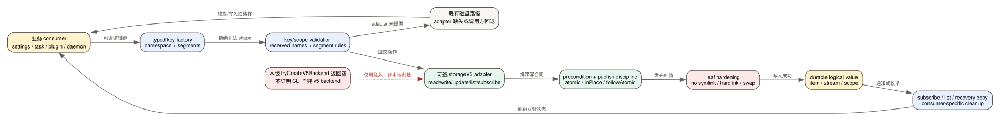

# Claude Code CLI 2.1.235 Storage v5：32 个 namespace、写入合同与真实边界

> 版本：`2.1.235` | 证据：目标版本 readable bundle 的 `Static` consumer 和 key/adapter 合同

Storage v5 不是一个“新数据库目录”的同义词。它首先是一套逻辑存储接口：业务代码用 typed key 描述 settings、task、plugin cache、mailbox、daemon 等状态，再由可选 adapter 实现 read、write、update、list、subscribe 和发布纪律。这个版本最关键的边界是：bundle 内的 `tryCreateV5Backend()` 函数体直接返回空，不能据此声称独立本地 CLI 已经自行创建并全面启用 v5 backend。

## 60 秒理解这套存储层

**读者问题：** 为什么源码里到处能看到 `storageV5` 和 32 个 namespace，本机文件却仍在原来的 `.claude` 路径；为什么有的写入叫 atomic，有的又是 in-place？

**一句话模型：** 业务 consumer 先把状态编码成受校验的逻辑 key，在收到外部注入的 adapter 时用前置条件和 publish discipline 更新值，否则按各 consumer 的既有磁盘路径回退；namespace 只定义寻址和边界，不自动提供统一锁、迁移或保留策略。



贯穿场景：Claude Code 更新全局配置。consumer 先读 `globalConfig`，在进程内写队列中合并变化；有 adapter 时用 `followAtomic` 写逻辑 key，并订阅外部变化，同时保留 backup/corrupted recovery copies 和裁剪旧副本；没有 adapter 时继续使用既有配置文件路径。这里的可靠性来自 globalConfig consumer 自己的队列、备份和恢复逻辑，不是所有 32 个 namespace 自动共享这些能力。

| 对象 | 操作前 | 转换 | 操作后 | 用户可见效果 |
| --- | --- | --- | --- | --- |
| 业务状态 | settings/task/plugin 等对象 | key factory 编码 namespace 和 segments | 形成不依赖物理路径的 logical key | 同一 consumer 可在 adapter 与旧磁盘路径间切换 |
| key segments | 任意字符串或 relPath | 拒绝空、点段、分隔符、NUL、保留名 | 只留下可安全映射的 segment | 降低路径穿越和保留文件碰撞 |
| 单次写入 | 旧值或未知值 | precondition + publish discipline | 成功、新旧冲突或失败 | 调用方能区分“已存在”“已被改动”“发布失败” |
| 并发更新 | 多个 writer 读同一逻辑对象 | `update/updateText` 或 consumer 写队列 | 原子读改写，或按条件拒绝 | mailbox/globalConfig 等避免常见 lost update |
| 物理叶值 | 可能被 symlink/hardlink/换位攻击 | lstat/open/fstat 与 no-follow hardening | 只接受仍位于 key 的普通单链接文件 | 拒绝把受信写入重定向到其他文件 |
| adapter 生命周期 | feature flag 可能开启 | 进程首次 pin；尝试创建 backend | 本版自建函数仍返回空 | flag 存在不等于本地 backend 已启用 |

## 一、先划清“存在”和“启用”

### `tengu_hover_rest` 只决定是否尝试使用

`pinStorageV5()` 读取 `tengu_hover_rest`，要求布尔值，并把本进程第一次决定 pin 住。后续再次读取到不同值只记录 conflict，仍保留首次决定。这样能避免同一进程前半段写旧路径、后半段突然切换 backend。

但 pin 后调用的 `tryCreateV5Backend()` 在 `2.1.235` 中是：

```text
function tryCreateV5Backend() {
  if (!storageV5Enabled) return;
  return;
}
```

因此本版可证结论只有：

1. 客户端拥有完整 typed-key 与 adapter consumer；
2. feature flag 会在进程内 pin；
3. 许多调用链接受从外部 context 传入的 `storageV5`；
4. 本地独立构造函数没有创建 backend；
5. adapter 缺失时，大量 consumer 继续走既有文件路径或跳过 v5 专属分支。

不能从 namespace 清单倒推出“所有状态已经迁移”“本机存在一个隐藏数据库”“远端自动同步所有 `.claude` 文件”。adapter 的实际提供者、服务端实现和 rollout 条件需要 host/运行探针证明，保持 `Boundary`。

证据：feature pin 与空函数见 [`cli.readable.js`](../reverse/javascript/cli.readable.js) 410908-410919；可选 adapter 在 Agent、compact、plugin、task、daemon 等 context 中向下传递。

## 二、typed key 解决什么问题

### 1. key 不是可拼接的路径字符串

key factory 返回形如：

```json
{
  "namespace": "pluginCache",
  "marketplace": "source",
  "plugin": "name",
  "version": "version",
  "relPath": [".claude-plugin", "plugin.json"]
}
```

adapter 接收结构化 key，再决定怎样映射物理存储。业务代码不能把 `../../`、绝对路径或带分隔符的单 segment 混进 key。`relPath` 也不是一条未经解析的字符串，而是 segment array。

### 2. 通用 segment 拒绝规则

每个必填 segment 必须是非空字符串，并拒绝：

- 只由点或空格组成的值；
- `/`、反斜线和 NUL；
- 大小写/尾随点空格归一化后命中保留设备名或 set-aside 形状；
- 内部临时形状 `.<16 hex>.aside`；
- `relPath`/`agentRelPath` 中任一非法 segment。

这不是普通输入美化，而是物理映射前的安全合同。Windows 设备名、大小写折叠、尾随点/空格、JSONL stream 与 session sibling 文件都可能让两个表面不同的 key 指到同一叶值，所以校验在 namespace 层统一完成。

### 3. namespace 专属校验

| Namespace | 专属约束 |
| --- | --- |
| `globalConfig` | recovery copy 的 `kind` 仅 `backup/corrupted`，并携带 `stamp` |
| `settings` | layer 仅 user/project/local；project 与 local 使用不同 scope key |
| `task` | item、meta、high-water mark 三种形状互斥；task ID 不能碰撞 `.meta` |
| `recording` | `stamp` 为 1-16 位十进制 epoch 毫秒 |
| `userConfigDir` | dir 必须属于固定 allowlist |
| `pluginRegistry` | file 仅 installed/marketplaces/flagged/catalog/inUseSweep |
| `marketplaceCache` | form 仅 manifest/catalog |
| `fileHistory` | backup filename 必须符合引擎实际生成的 `hex@v version` 形状 |
| `history` | 无附加 key segment；全局 prompt history 使用单一 stream |
| `log` | channel 仅 `debug/telemetry/apiDump`；agentId/runId 只能缩到单个 stream，不能冒充 scope |
| `sessionLog` | year/month/day 为 YYYY/MM/DD；log stem 有长度、slug 和设备名限制 |
| `sidecar`/`transcript` | 禁止把 JSONL stream、recording `.cast` 或项目 sibling 文件伪装成普通 relPath |
| `job` | `timeline.jsonl` 必须走 `jobTimeline`，不能从普通 job relPath 打开 |
| `jobsRoot` | pins 与 draft 两种形状互斥；draft key 为 8 位小写 hex |
| `agentMemory` | layer 与 projectKey 关系固定；必须命名 agent type |

### 4. scope 和 key 是两种操作

key 精确指向一个值；scope 用于 list/deleteScope/listSubkeys 等集合操作。scope 不能携带已经把范围缩到一个 leaf 的字段，例如 task scope 只能按 list ID 缩小，不能带 task ID；mailbox scope 不能指定 teammate；cache scope 必须指定 store，但不能同时把 id 当范围。

这种区分防止一个看似“列目录”的 API 被偷偷用成跨项目或跨 session 的任意前缀扫描。

## 三、写协议：atomic 不是万能标签

### 1. 三种 publish discipline

| 值 | 可证语义 | 典型 consumer | 不能推断什么 |
| --- | --- | --- | --- |
| `atomic` | 以原子发布方式替换完整叶值 | theme、workflow、job adopt、stats cache、jobs pins | 不等于多个 key 组成一个事务 |
| `inPlace` | 允许直接更新当前叶值 | task high-water、plugin marker、daemon/job content、状态标记 | 写进程中断时的底层耐久性取决于 backend |
| `followAtomic` | 跟随该逻辑值的原子发布/订阅语义 | `globalConfig` | 不是所有 namespace 的默认值 |

publish discipline 由每次 write 传入，而不是 namespace 固定属性。同一 namespace 的不同文件可以选择不同纪律。

### 2. 四类前置条件

| precondition | 作用 |
| --- | --- |
| `ifAbsent` | 只有 key 尚不存在时写入，适合 create-only workflow 等对象 |
| `ifMatch` | 只有当前版本/etag 匹配时写入，避免覆盖已变化值 |
| `ifUnchangedThrough` | 只有 stream/观察点在给定位置后未变化时写入 |
| `none` | 显式不要求内容条件；仍需 key/权限/物理发布成功 |

没有传 precondition 不应自动解释成 compare-and-swap。要判断并发安全，必须看具体 consumer 是否使用 `update/updateText`、显式 precondition、进程内队列或外部锁。

### 3. `update`/`updateText` 是原子读改写入口

`mailbox` 使用 `updateText` 把“读 inbox、合并/ack/清坏记录、写回”放进一次 adapter 更新。`globalConfig` 也有 update 路径，并在进程内串行化写请求。它们比“先 read 再 write”更能避免 lost update。

但不能把这个结论扩展到全部 namespace：大量 callsite 直接 `write`，有的写 item、有的 append stream、有的靠业务 owner 保证单 writer。2.1.235 没有证据显示每个 namespace 都有独立锁文件、统一 lease 或跨 key transaction。

## 四、物理叶值硬化

即使 logical key 合法，物理文件仍可能在检查与打开之间被替换。底层文件路径可见以下防护：

1. `lstat` 拒绝非普通文件；
2. `open` 使用 no-follow 能力，symlink 返回 `ELOOP`；
3. 拒绝目录、设备和其他非普通节点；
4. 拒绝 link count 表明存在第二个名字的 hard link；
5. 打开后再次核对对象仍位于原 key，拒绝 `LeafMoved`；
6. host 无法验证 hardened read 时返回 `HardeningUnavailable`，而不是假装成功；
7. value leaf 有 mode 和大小上限。

这类防护保护“某个 key 的 bytes 没被重定向到另一文件”，不等于内容可信。Plugin manifest、settings、mailbox 和 remote-settings 仍需各自 schema、来源和 policy 校验。

证据：key/scope 校验与 hardening 见 `cli.readable.js` 110185-110229、110250-110560；segment 基础规则见 38040-38090。

## 五、32 个 namespace 逐项参考

“真实 consumer”列只写目标 bundle 中能定位到的 reader/writer。没有足够 active callsite 的条目标 `Boundary`，不按名字补故事。

<!-- STORAGE_NAMESPACE_COVERAGE_BEGIN -->
<!-- storage-namespace:agentMemory -->
<!-- storage-namespace:bridgePointer -->
<!-- storage-namespace:cache -->
<!-- storage-namespace:daemon -->
<!-- storage-namespace:feedbackDraft -->
<!-- storage-namespace:fileHistory -->
<!-- storage-namespace:globalConfig -->
<!-- storage-namespace:history -->
<!-- storage-namespace:identity -->
<!-- storage-namespace:job -->
<!-- storage-namespace:jobTimeline -->
<!-- storage-namespace:jobsRoot -->
<!-- storage-namespace:log -->
<!-- storage-namespace:mailbox -->
<!-- storage-namespace:marketplaceCache -->
<!-- storage-namespace:memory -->
<!-- storage-namespace:paste -->
<!-- storage-namespace:plan -->
<!-- storage-namespace:pluginCache -->
<!-- storage-namespace:pluginRegistry -->
<!-- storage-namespace:recording -->
<!-- storage-namespace:scratch -->
<!-- storage-namespace:session -->
<!-- storage-namespace:sessionAliases -->
<!-- storage-namespace:sessionLog -->
<!-- storage-namespace:settings -->
<!-- storage-namespace:sidecar -->
<!-- storage-namespace:state -->
<!-- storage-namespace:task -->
<!-- storage-namespace:team -->
<!-- storage-namespace:transcript -->
<!-- storage-namespace:userConfigDir -->
<!-- STORAGE_NAMESPACE_COVERAGE_END -->

| Namespace | Key shape | 真实 reader/writer 与状态 owner | 并发、迁移、retention | 敏感度 / 证据强度 |
| --- | --- | --- | --- | --- |
| `agentMemory` | layer；user 无 projectKey，project/local 有；agentType；relPath[] | Agent memory priming/写入，已见用户层 memory key 和子 Agent system prompt consumer | 可用 adapter updateText；没有 namespace-wide lock/migration 证据 | 高：长期记忆和项目内容；`Static consumer` |
| `bridgePointer` | projectKey | Remote Control/bridge reattach pointer，按 project 找当前 bridge/session 关系 | 单 key 状态；服务端 pointer 生命周期和冲突裁决为 Boundary | 高：远端会话身份；`Static consumer` |
| `cache` | store + id | 已见 gateway models、model capabilities、org-memory discovery、changelog、my closed issues | 每个 store 自己决定 TTL/刷新；cache 可重建，但无统一 retention | 中到高；`Static consumer` |
| `daemon` | relPath[] | daemon roster、PTY PID、dispatch/rejected、host-managed、daemon log | 有 daemon lock/status 等协作状态，但不是 namespace 自动锁；清理由 supervisor 路径负责 | 高：进程与调度控制；`Static consumer` |
| `feedbackDraft` | draftId | feedback draft 的单条读写、分页列举和批量读取 | 列表/批读已见；无统一锁、迁移和保留期证据 | 高：用户未发送文本；`Static consumer` |
| `fileHistory` | sessionId + backupFileName | file checkpoint/rewind 的备份对象；文件名必须是引擎生成的 hash/version 形状 | checkpoint consumer 负责 cap、裁剪与恢复；不是 namespace 自带 retention | 极高：源码历史；`Static consumer` |
| `globalConfig` | 主 key；或 kind=backup/corrupted + stamp | `.claude.json` 等全局配置读取、写入、subscribe、恢复副本 | 明确有进程内写队列、`followAtomic`、update、backup/corrupted copy 和旧副本裁剪 | 极高：账户/项目索引/配置；`Static deep` |
| `history` | 无附加 segment 的全局 stream | prompt 输入历史倒序分页读取、paste 内容回填、去重与追加写；V5 reader/writer 位于 156893、157045 | V5 用 stream append；legacy `history.jsonl` 用锁后追加，锁 stale 10 秒、最多 3 次获取重试；连续失败最多 6 次写尝试、间隔 500ms | 极高：用户原始 prompt 与 paste 引用；`Static deep` |
| `identity` | 无字段 | key 与校验存在，但本 bundle 未找到 `An.identity()` active consumer | lock/migration/retention 均未证实 | 可能极高；`Boundary` |
| `job` | jobId + relPath[] | daemon/background job 的 order、stateOrder、group、adopt、state/content 等 | 单文件可 atomic/inPlace；job owner、lease、sweep 在业务层；无跨文件事务 | 高：任务、命令、输出；`Static consumer` |
| `jobTimeline` | jobId | append job timeline stream | append 有 stream 顺序合同；裁剪/保留期未证实 | 高：任务轨迹；`Static consumer` |
| `jobsRoot` | `file:pins` 或 8-hex draftKey | job pins 用 updateText 原子维护；daemon/job draft create/read/delete | pins 有 cap/heal；draft 有 create/delete；没有全 namespace 迁移证据 | 中到高；`Static consumer` |
| `log` | sessionId + channel(debug/telemetry/apiDump)；可选 agentId/runId | 一方 telemetry 失败队列、旧 flat batch 迁移与 `/debug` 日志读取；consumer 见 77567、77726、542224 | stream append/list/delete；telemetry 按 runId 隔离，默认最多 8 次发送尝试后删除旧失败批；debug/apiDump 没有共享 retention | 极高：诊断、请求与事件数据；`Static deep` |
| `mailbox` | team + teammate | 多 Agent inbox，读取、投递、ack、协议帧清理 | `updateText` 原子读改写；校验并丢弃坏记录；redelivery/大小语义由 mailbox consumer 管理 | 极高：Agent 间消息；`Static deep` |
| `marketplaceCache` | marketplace + form(manifest/catalog) | plugin marketplace manifest/catalog 缓存 | 更新/失效跟 marketplace loader；无统一 TTL/迁移证明 | 中：远端元数据；`Static consumer` |
| `memory` | projectKey + relPath[] | 项目 memory、skills/rules 下的持久内容与 auto-memory 更新 | 部分写入用 updateText；目录结构和预算由 memory consumer 管理 | 极高：长期项目知识；`Static consumer` |
| `paste` | id | 大段 paste/clipboard 内容按 ID 存取 | retention/清理未在 namespace 合同中证明 | 极高：原始用户输入；`Static consumer` |
| `plan` | name | named plan 文件/内容 | 单 key 写入；冲突、版本和 retention 未见统一机制 | 高：计划与业务上下文；`Static consumer` |
| `pluginCache` | marketplace + plugin + version + relPath[] | plugin 文件、manifest、`.in_use/<pid>`、`.orphaned_at` | 明确有 in-use 建立/删除、orphan timestamp、sweep 与 stat；不等于 plugin bytes 已受信 | 高：可执行扩展；`Static deep` |
| `pluginRegistry` | file=installed/marketplaces/flagged/catalog/inUseSweep | 插件安装/市场/flagged/catalog/清扫 registry | 每个文件独立更新；registry 与 cache 是两份状态，需 consumer 对齐 | 高：扩展信任和启用状态；`Static consumer` |
| `recording` | projectKey + sessionId + 1-16 位 stamp | key/scope 把 `<stamp>.cast` 定义为 terminal recording stream；未找到足够 active factory callsite | writer、retention、压缩和回放流程未证实 | 极高：终端录制；`Boundary` |
| `scratch` | sessionId + relPath[] | key/scope 存在，但本 bundle 未找到足够 active `An.scratch()` consumer | 临时性不能由名字推断；清理与 crash recovery 未证实 | 高：可能含中间内容；`Boundary` |
| `session` | file | 当前进程/session registry 文件读写和删除，已见 PID JSON 等 | consumer 负责启动/退出清理；不是 transcript 本身 | 高：session/process metadata；`Static consumer` |
| `sessionAliases` | projectKey | 项目级 session alias 映射 | 单 key 映射；别名冲突和保留由 consumer 处理 | 中：名称到会话关系；`Static consumer` |
| `sessionLog` | projectKey + YYYY/MM/DD + logName | 完整 key 校验存在，但未找到足够 active `An.sessionLog()` consumer | 日志 rotation/retention/reader 未证实 | 极高：会话日志；`Boundary` |
| `settings` | layer=user/project/local；projectKey 或 consentRootKey | user settings 通过独立 factory 读写/subscribe；project/local 也有结构化 key | 写入纪律按 consumer；merge/policy 优先级在 settings 层，不由 namespace 提供 | 极高：权限、hooks、MCP、sandbox；`Static consumer` |
| `sidecar` | projectKey + sessionId + relPath[] | workflow scripts/state、MCP task meta、subagent/journal metadata 等 session 附属文件 | 不同 sidecar 各选 atomic/inPlace；禁止伪装 JSONL/recording sibling；无统一 retention | 极高：恢复与执行 metadata；`Static consumer` |
| `state` | id | 已见 remote-settings、policy-limits、keybindings、loop-file、PR cache、computer-use lock、user-memory、daemon auth/config/status/lock、update lock/result、scheduled status、active-time ledger、stats cache、deep-link failure 等 | 只是 generic per-ID store；每个 ID 自己选择 atomic/inPlace、TTL、lock 和清理 | 混合但总体高；`Static deep surface` |
| `task` | listId + taskId，或 meta/highWaterMark | task item、列表 meta、高水位读写/删除 | high-water 用 inPlace；item/meta 分离；没有跨三类 key 的统一事务证据 | 高：任务分配、状态、依赖；`Static consumer` |
| `team` | team | team config/成员状态，供多 Agent 生命周期读取写入 | mailbox 与 team 是不同 key；成员/清理由 team consumer 负责 | 高：协作身份和配置；`Static consumer` |
| `transcript` | projectKey + sessionId；可选 agentId/agentRelPath；run journal 用同 namespace 加 `journal:true` | 主会话、subagent transcript、run journal、feedback transcript 检查与 session import；consumer 见 268062、295765、401773、420118 | 逻辑上 append，物理层会 tombstone 删除与 compact 重写；V5 用 guarded `replaceRecords` 保留并发尾，legacy 用快照校验、临时文件和原子替换 | 极高：完整对话、工具结果、路径和附件；`Static deep` |
| `userConfigDir` | allowlisted dir + relPath[] | commands、agents、output-styles、skills、workflows、routines、themes、rules、session-env、uploads、mcp-skill-archives、usage-data、mcp-discovery-cache | 每个目录/文件自定 write discipline 与清理；allowlist 防止变成任意 home 路径 API | 极高：代码、配置、上传和使用数据；`Static deep surface` |

## 六、几个需要单独下钻的 namespace

### `transcript`：逻辑追加流，物理文件会被条件重写

把 transcript 写成“append-only JSONL”只描述了正常写入接口，没有描述磁盘生命周期。`2.1.235` 的 writer 先按 entry 类型决定怎样追加，再在本地 GC 开启时执行 UUID 删除和 transcript compact；所以消息语义仍是事件流，物理 bytes 却会被截断、重组和原子替换。

#### 两张策略表分别控制“追加什么”和“压实时留下什么”

| 策略层 | 枚举 | 精确作用 |
| --- | --- | --- |
| entry append policy | `dedup-transcript` | user/assistant/attachment/system/progress 进入 transcript，但 writer 可按已有记录去重 |
| entry append policy | `always` | summary、title、mode、permission、checkpoint metadata 等控制记录每次都追加 |
| entry append policy | `route-by-agent` | content replacement、fork ref、observer ref 按主会话或 agent transcript 路由 |
| compact reduction | `transcript` | user/assistant/system/attachment 保留为压实后的对话主干 |
| compact reduction | `boundary-cleared` | progress、file-history delta、last-prompt 等遇到 compact boundary 后清掉旧值 |
| compact reduction | `accumulate` | content replacement、fork/frame ref 等累计保留 |
| compact reduction | `last-wins` | title、tag、mode、permission、worktree、bridge 等只保留最后有效值 |

策略表证据在 `cli.readable.js` 404545-404547。它解释了为什么压实不能简单写成“删除旧行”：某些消息要去重，某些状态要跨 boundary 保留最后值，某些引用要累计，错误裁剪会破坏 resume、fork、checkpoint 或 UI 状态。

#### 触发阈值和自适应 backstop

- 实际文件小于 **5 MiB** 时不压实；这是 legacy `stat.size` 与 V5 `size + torn tail` 共用的最低门槛。
- writer 统计当前 session 自上次 compact 后新增的 bytes；初始 backstop 是 **20 MiB**。
- compact 若回收不到旧大小的 10%，backstop 翻倍，最高 **160 MiB**；回收达到 10% 则重置为 20 MiB，避免低收益频繁全文件扫描。
- 写入 compact boundary 一类需要立即清理的记录时，writer 会把 backstop 重置到 20 MiB 并在同一串行写队列请求 compact；普通追加则在累计 bytes 达阈值后触发。
- 慢速 UUID tombstone 清理只处理不超过 **50 MiB** 的 transcript；V5 慢路径按 **1 MiB** 分页。V5 fast path 用版本条件最多重试 **3 次**，随后放弃而不是覆盖并发 writer。

这些值分别对应 `DEm=5 MiB`、`xfr=20 MiB`、`MEm=160 MiB`、`OEm=50 MiB`、`UlT=1 MiB`，见 401217-401328、404491。

#### Legacy 文件路径：快照、保留完整尾行、fsync、原子换位

legacy compactor 先记录 inode/size，并抽样读取头部、中部、尾部各 4 KiB。快照尾字节不是换行时，它以 `snapshot_mid_line` 放弃，避免把 torn tail 当完整 JSONL。随后它只读取最初 size 范围，按策略表写入权限 `0600` 的临时文件；发布前再次检查 inode、size 未缩小且三段抽样未变化。

如果原文件在压实期间只发生尾部追加，compactor 会读取 snapshot 之后的增量，只把截止到最后一个换行的完整记录附到临时文件。这样可以保留**并发尾追加**，同时不发布半条 JSON。临时文件 fsync 后，它再次核对 inode 与抽样；任何中段修改、截断或文件替换都记为 source-changed（遥测值 `source_changed`）并删除临时文件。最后才通过原子 rename 替换目标，并重新追加 session metadata。这个协议保护的是同一文件的完整发布，不是跨文件事务。

#### Storage v5 路径：witness + 条件原子 replace

V5 先用 witness stat 取得 `size`、`version` 和 `tornTailBytes`。`tornTailBytes > 0` 直接按 `snapshot_mid_line` 放弃；否则按 **4 MiB** 页向前读取，只处理 snapshot size 之前的 records。生成新流后调用：

```text
replaceRecords(
  key,
  compactedRecords,
  preserveFrom: snapshotSize,
  precondition: ifUnchangedThrough(lastReadSeq, witnessVersion),
  publishDiscipline: atomic,
  mode: 0600,
  parent: mustExist
)
```

`preserveFrom` 要求 backend 把 snapshot 后的新 records 接到新主体后面；`ifUnchangedThrough` 则保证已读取区间没被别的 writer 改掉。前置条件失败映射为 `source_changed`，backend 检测同一 inode 有其他硬链接时映射为 `SharedInode`，非法 token/参数、publish rename fallback 和普通 I/O 也分别落到不同诊断。V5 compact 本身只做一次受保护 replace；“最多 3 次”属于 UUID tombstone 的 fast path，不应混写成 compact 自动重试三次。

证据：legacy/V5 compact 主路径 401330-401498；阈值和策略常量 404491、404545-404547；串行写队列与 backstop 触发 401023-401100、401520-401548。

### `history` 与 `log`：两个被旧提取窗口漏掉的活跃 stream

`history` 是 prompt 输入历史，不是 session transcript。reader 从尾到头分页，合并当前进程尚未落盘的 pending entries，按 timestamp/session 去重，并按 paste hash 回填文本；writer 等待 paste 存储完成后才 append。V5 append 失败会保留 pending entries；失败计数从 0 到 5 都会执行写入，因此是初始尝试加最多 5 次重试、最多 6 次写尝试，每轮间隔 500ms。legacy 路径对 `history.jsonl` 取锁，锁 stale 10 秒，获取最多重试 3 次。证据见 156893-157085。

`log` 是按 session/channel 寻址的诊断 stream。`channel` 只允许 `debug`、`telemetry`、`apiDump`；一方 telemetry 失败队列按 runId append，启动时 list 旧 run stream，迁移 legacy flat JSON batch，发送成功后删除，部分失败时重建剩余 records。默认发送参数是 batch 200、delay 100ms、base backoff 500ms、最大 30s、最多 8 次；达到上限会删除旧失败 batch。`/debug` 则把当前 session 的 debug key交给日志读取器。两类 channel 内容和 retention 不同，不能用“log namespace 会自动轮转”概括。证据见 77534-77755、542220-542244。

### `globalConfig`：真正有完整恢复链

globalConfig 的可靠性不是“写 JSON”四个字：

1. 初次从 adapter 或旧路径读文本；
2. parse 后更新进程内 snapshot；
3. 所有写请求进入进程内串行队列；
4. adapter 可 subscribe key 变化，外部更新触发 reload；
5. 正常写使用 `followAtomic`；
6. 写前/错误时创建 `backup` 或 `corrupted` recovery copy；
7. 列举 recovery copies，按时间保留并删除超额旧副本；
8. update 路径再次读取并合并，降低覆盖并发变化的概率。

因此它可以被描述为“consumer-level 恢复链”。不能把 backup/retention 复制到 `task`、`paste` 或 `identity`。

证据：`cli.readable.js` 89674-90156。

### `mailbox`：原子 inbox，而不是消息数据库

mailbox key 指向一个 teammate inbox 文本。consumer 用 `updateText`：解析现有记录、验证 sender/recipient/protocol frame、合并新消息或 ack、清除 malformed/stale 记录，再一次性写回。

这样能避免两个 teammate 同时投递时简单 read/write 覆盖，但仍没有跨多个 inbox 的事务。broadcast 若要写多个 teammate key，中途失败可能形成部分投递；恢复要靠 message ID、ack/redelivery 语义，而不是 storage namespace 自动回滚。

证据：`cli.readable.js` 279148-279245。

### `pluginCache`：bytes、使用租约和 orphan 是三份状态

Plugin cache 不只存下载后的文件：

- `.in_use/<pid>` 表示某进程正在使用该 version；
- 退出或卸载时删除对应 in-use marker；
- `.orphaned_at` 记录版本何时成为孤儿；
- sweep 读取 marker/stat 后决定是否删除；
- manifest 仍需 schema、来源和 policy 校验。

一个 plugin version 在磁盘存在，不等于 registry enabled；registry enabled 也不等于当前 session 已 load；`.in_use` 存在还要考虑进程已崩溃的 stale marker。三者必须分别观察。

证据：`cli.readable.js` 184850-185860。

### `task`：item、meta 和 high-water mark 分开

task namespace 把三种逻辑值拆开：

- item：`listId + taskId`；
- list metadata：`listId + meta:true`；
- high-water mark：`listId + highWaterMark:true`。

校验拒绝一个 key 同时扮演两种角色，也拒绝 task ID 伪装 `.meta`。高水位能帮助分配新 ID 或追踪列表进度，但三个 key 不构成自动事务；创建 item 后高水位写失败、删除多 item 中途失败等情况仍要由 task consumer 修复。

证据：`cli.readable.js` 202100-202330。

### `state`：一个 namespace，不是一个数据模型

`state(id)` 只是 generic single-value key factory。`remote-settings` 与 `stats-cache`、`update-lock`、`daemon-auth-status`、`active-time-ledger` 的生命周期完全不同。跨版本比较不能写“state namespace 改了”就结束，必须比较具体 ID、reader/writer、publish discipline 和失效条件。

已观察 ID 至少包括：

- remote settings、policy limits、keybindings、loop file；
- GitHub PR/status cache、model/daemon auth cache；
- computer-use lock、daemon config/status/lock/log；
- update lock、last update result、scheduled status；
- active-time ledger、last cleanup、stats cache；
- deep-link register failure、user-memory。

这个列表是目标 bundle callsite，不保证 remote config 在运行时只会返回这些值，也不保证每个 ID 在当前账号可达。

## 七、失败、恢复和诊断矩阵

| 失败 | 检测点 | 状态保留 | 恢复/回退 | 用户影响 |
| --- | --- | --- | --- | --- |
| adapter 未提供 | consumer 收到 `storageV5=undefined` | 旧磁盘状态仍在 | 多数 consumer 走旧路径或跳过 v5 分支 | 功能可继续，但不能宣称 v5 生效 |
| feature flag 二次冲突 | process pin 检测 | 首次决定保留 | 记录 warning，不热切 backend | 避免半进程双写 |
| key/segment 非法 | adapter 前校验 | 无写入 | 修 key shape；不会自动清洗危险值 | 操作明确失败 |
| symlink/non-file/hardlink/换位 | lstat/open/fstat hardening | 原目标不变 | 拒绝并报告具体 failure class | 安全优先，功能暂时不可用 |
| `ifAbsent` 冲突 | write precondition | 已存在值保留 | reader 重新读取，决定 update 或换 ID | 避免静默覆盖 |
| compare/unchanged 条件失败 | version/stream guard | 并发 writer 的新值保留 | 重读并重新合并 | 可能增加一次 I/O/延迟 |
| update callback/parse 失败 | `update/updateText` | 旧值保留，取决于 adapter 合同 | consumer 清坏记录、备份或报错 | mailbox/globalConfig 行为不同 |
| atomic publish 失败 | backend publish | 旧值通常应保持，但精确耐久性取决于 backend | consumer retry/recovery copy/旧路径 | 不应只看进程 exit 0 |
| subscribe 中断 | subscription/consumer | durable value仍在，进程 snapshot 可能变旧 | 重订阅或主动 reload | UI/settings 可短暂陈旧 |
| 多 key 业务中途失败 | consumer | 已完成 key 写入保留 | 业务补偿、sweep、reconcile | 没有跨 key rollback |
| recovery copy 裁剪失败 | globalConfig cleanup | 主值和旧副本保留 | 下次清理重试 | 磁盘增长，不等于主配置损坏 |

## 八、性能、成本、隐私与安全

| 维度 | Storage v5 能改善什么 | 代价和边界 |
| --- | --- | --- |
| 一致性 | typed key、update/precondition、subscribe 降低随意路径和 lost update | 只有使用这些 API 的 consumer 获益；跨 key 仍非事务 |
| I/O | batch read/list、cache namespace、in-place 写可减少重复扫描 | generic `state/cache` 若无 TTL 仍会积累；adapter 延迟由实现决定 |
| 启动延迟 | 可从统一 adapter 批量加载 settings/plugin/session 状态 | 本版自建 backend 为空，不能量化真实收益 |
| 恢复 | globalConfig copies、plugin markers、task high-water 等提供业务恢复线索 | 恢复策略分散在 consumer，不是全局 WAL |
| 隐私 | namespace 让敏感面可分类审计 | 内容仍包括 prompt、memory、源码、日志、插件、远端 token metadata；logical key 不脱敏 bytes |
| 安全 | segment/leaf hardening 阻止路径穿越、symlink/hardlink/换位 | 不验证内容来源；恶意 settings/plugin/message 仍需 schema/trust/policy |
| 迁移 | adapter 抽象允许将 consumer 与物理布局解耦 | 本版没有完整 migration runner 证据；不能声称旧文件已自动删除或双写完成 |

## 九、如何验证某台机器是否真的在用

不要只搜索 `tengu_hover_rest`。需要同时拿到：

1. 该进程 pin 的 flag 值；
2. `storageV5` adapter 的实际非空来源；
3. 目标 consumer 是否选择 adapter 分支；
4. 具体 key、operation、publish discipline 与 result；
5. 旧磁盘路径是否仍被读写；
6. subscribe/update/list 的可观察结果；
7. 重启后 durable value 是否仍存在；
8. 并发 writer 下 precondition/update 是否按合同拒绝或合并。

最小正向探针应使用一个可逆的低敏感 key，在 adapter 分支写入、读取、条件冲突、删除，再重启验证；同时监控旧路径，证明没有把 fallback 误判成 v5。当前仓库未把这样的 exact-binary backend 正向探针登记为 Probe，所以本文保持 `Static`。

## 十、证据范围

| 结论 | 目标版本证据 |
| --- | --- |
| 32 个 Claude namespace 权威集合 | [`source-inventory/claude-storage-namespaces.txt`](source-inventory/claude-storage-namespaces.txt)；完整 key factory 38080-38091，`journal` 复用 `transcript` namespace |
| 通用 segment 与 set-aside 校验 | 38040-38090 |
| key/scope 逐 namespace 校验 | 110250-110560 |
| symlink、普通文件、hardlink、打开后换位防护 | 110185-110229 |
| feature flag 首次 pin 与空 backend factory | 410908-410919 |
| globalConfig 队列、subscribe、recovery copies、裁剪 | 89674-90156 |
| plugin cache in-use/orphan lifecycle | 184850-185860 |
| task item/meta/high-water mark | 202100-202330 |
| mailbox atomic read-modify-write | 279148-279245 |
| feedback draft list/batch | 295594-295635 |
| active key factory callsites | `An.<factory>` callsites throughout readable bundle |

这些 `Static` 证据能证明 logical key、adapter API、写选项、真实 consumer 和本地文件硬化。它不能证明 Anthropic 服务端 storage 实现、账号 rollout、物理加密、远端 replication、quota、retention SLA 或 crash consistency；也不能证明本机独立 CLI 已创建 backend。没有 active consumer 的 `identity`、`recording`、`scratch`、`sessionLog` 保持 `Boundary`，后续版本出现 callsite 时再升级证据等级。
