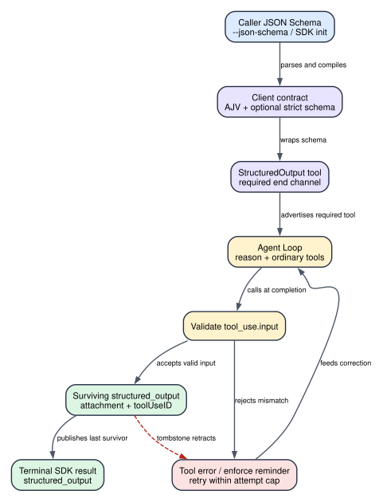

# Claude Code CLI 2.1.235 Structured Output：`--json-schema` 怎样变成一次可验证的 Agent Loop 终态

> 版本：Claude Code CLI `2.1.235` | 证据：Static | 范围：主线程 `--print` / SDK structured output

## 60 秒模型

**读者问题：** 为什么传了 `--json-schema` 以后，Claude Code 不是等模型输出一段 JSON 再 `JSON.parse`，而是多出一个 `StructuredOutput` 工具、可能继续一轮，甚至以 `error_max_structured_output_retries` 结束？

**一句话模型：** 客户端把调用方的 JSON Schema 编译成本地验证器并包装成一个强制收尾工具；模型只有用符合 schema 的参数调用该工具，客户端才会保存 `structured_output` attachment、结束当前 Agent turn，并把最后一个仍存活的对象放进最终 `result`。

贯穿场景：调用方要求 Claude 分析一次构建失败，并必须返回：

```json
{
  "type": "object",
  "properties": {
    "cause": { "type": "string" },
    "fixes": { "type": "array", "items": { "type": "string" } }
  },
  "required": ["cause", "fixes"],
  "additionalProperties": false
}
```

模型可以先读文件、运行测试和修正判断；但准备结束时不能只写一段看起来像 JSON 的文字，而要调用 `StructuredOutput({cause, fixes})`。客户端对这份参数做 AJV 校验，成功后把对象保存为结构化附件并让工具 `endsTurn: true`。



图的结论：schema 不直接替代 Agent Loop。它新增了一条“必须通过本地验证的结束通道”；普通推理和工具执行仍在前面发生。

| Object | Before | Transformation | After | User-visible effect |
| --- | --- | --- | --- | --- |
| CLI 参数 | JSON 字符串 | 解析并要求 schema 文档本身是 object | 内存中的 schema object | 非法 JSON 或数组在启动阶段直接失败 |
| schema 合同 | 调用方原始 JSON Schema | AJV 编译；另尝试生成受限 strict schema | 本地 validator + 可选 wire strict schema | 本地始终校验；服务端 strict 取决于 model/provider/gate |
| tools surface | 普通工具集合 | 追加 `StructuredOutput` | 当前请求可见的收尾工具 | 工具 schema 占用上下文，模型被告知结尾必须调用一次 |
| model 结果 | 文本、普通工具调用或收尾调用 | 对 `StructuredOutput.input` 做 schema 校验 | attachment 或 tool error | 不合格参数进入修正轮次，不会冒充有效对象 |
| persisted result | 尚无结构化终态 | 保存 attachment，追踪 tombstone | 最后一个仍存活的 `structured_output` | JSON/stream-json result 直接带对象；fallback 撤回的对象不会泄漏到终态 |

## 状态所有权

| 状态 | Owner | 生命周期 | 为什么不能混为一谈 |
| --- | --- | --- | --- |
| 原始 `jsonSchema` | CLI 参数解析器或 SDK initialize | 当前进程/session 配置 | 它只是调用方意图，还没有证明 schema 合法 |
| AJV validator | `z2r` / `Xzb` 的 WeakMap cache | schema object 身份存活期间复用 | 它验证最终 tool input，不是模型生成质量评分器 |
| `strictInputJSONSchema` | strict 转换器 `jZo` | 随生成的工具对象存在 | 只是一份可选的 wire 优化；生成失败会回落原 schema |
| `requiresStructuredOutput` | SDK/main Agent Loop options | 当前 query | 只有 schema 存在且工具仍在实际 tools 集合中才为 true |
| 当前 turn 尝试数 | SDK result assembler | 当前用户 turn | 排除历史调用，计入本轮普通调用和被 fallback tombstone 的调用 |
| `structured_output` attachment | transcript/message graph | 可持久化，并受 tombstone/eviction 管理 | 它是最终结果的权威来源，普通 assistant 文本不是 |
| 最终 `result.structured_output` | stdout/SDK result envelope | turn terminal frame | 取最后一个仍存活 attachment；没有对象时不能靠文本补造 |

关键区别是：**schema、strict schema、tool schema、tool call、attachment、terminal result 是六个不同状态。** 把它们缩成“开启 JSON 模式”会丢掉失败位置，也无法解释为什么 fallback 后已经出现过的对象最终消失。

## 完整调用顺序

1. **解析 JSON Schema。** `--json-schema <schema>` 只在 non-interactive / background 路径进入 structured-output 初始化。客户端先 `JSON.parse`；语法错误返回 `--json-schema is not valid JSON`，解析值若不是非数组 object，则返回 `--json-schema must be a JSON object`。
2. **编译本地 validator。** `z2r(schema)` 以 schema object 为 WeakMap key 复用 `Xzb` 结果。`Xzb` 先执行大小/深度保护，再以 AJV `allErrors:true, validateFormats:false` 校验 schema 自身并编译验证函数。这里关闭 format 校验意味着 `format: email` 一类约束即使能出现在原 schema，也不会由这份 AJV validator 执行格式语义；而 strict 转换器本身又不接受 `format` keyword。
3. **尝试派生 strict schema。** `jZo` 只接受能规范化为 root object 的受限子集。成功时工具同时保存 `inputJSONSchema` 和 `strictInputJSONSchema`；失败不会关闭 structured output，而是记录 `converted` / `fallback` 遥测并继续使用原 schema 的本地 AJV validator。
4. **把 schema 包装成工具。** 客户端基于内置 `StructuredOutput` object 创建本次专用工具，替换其输入 schema 和 `call`。工具声明为 read-only、concurrency-safe、permission always allow，prompt 明确要求“在响应结尾恰好调用一次”。它不写业务文件，也不跳过之前的 Agent Loop。
5. **确认工具真的进入当前 tools surface。** CLI 将专用工具追加到已加载工具集合；SDK query 只有在 `jsonSchema` 存在且刷新后的工具集合仍包含 `StructuredOutput` 时，才设置 `requiresStructuredOutput:true`。这避免只有 schema 配置、没有收尾工具时仍声称强制成功。
6. **序列化 wire schema。** 普通路径发送原 `input_schema`。当模型支持相应 tool schema、`tengu_structured_output_strict` gate 开启且 strict 转换成功时，wire tool 可带 `strict:true` 和规范化 schema。Foundry 若以 400 表明 workspace 不支持 `structured_outputs`，客户端会记住该 deployment 的 capability 缺口，后续重试移除 `strict`，但保留本地验证路径。
7. **模型执行普通 Agent Loop。** 模型仍可调用 Read、Bash、Grep 等工具并吸收结果。若它准备结束却还没调用 `StructuredOutput`，Stop 阶段注入一次带 `[structured-output-enforce]` sentinel 的 meta user message：`You MUST call the StructuredOutput tool ... Call this tool now.`，从而让 Agent Loop继续，而不是接受普通文字作为结构化终态。
8. **校验 `tool_use.input`。** 专用 `call(input)` 用已编译 AJV validator 校验参数。失败抛出 `Output does not match required schema`，并保留具体 instance path、message 和 keyword 供工具错误链反馈；成功返回 `{structured_output: input, endsTurn: true}`。
9. **形成 attachment 并结束。** 工具结果映射层把 `structured_output` 转成带 `toolUseID` 的 attachment。SDK result assembler保存该 attachment；因为 `endsTurn:true`，Agent Loop可以结束当前 turn，而不需要模型再把对象复制成自然语言。
10. **处理 fallback 回撤。** 若模型 fallback tombstone 覆盖了一条含 `StructuredOutput` 的 assistant message，客户端记录对应 tool-use ID、删除与之关联的 attachment，并把该次调用计入 retracted attempt。晚到的同 ID attachment也会直接丢弃。
11. **发布 terminal result。** 成功 result 的 `structured_output` 取 `tr.at(-1)?.data`，即最后一个仍存活对象；当普通 `result` 文本为空时，客户端还会把该对象 `JSON.stringify` 成 text result，兼容只消费 `result` 字符串的调用方。

### 为什么这不是“最后 JSON.parse 一下”

如果只在最终文字上做 `JSON.parse`，客户端无法可靠完成四件事：

- 在模型准备停止时强制它改走结构化通道；
- 把 schema 错误作为带 `tool_use_id` 的可修正反馈送回下一轮；
- 在 model fallback 撤回旧 assistant message 时同步撤回旧对象；
- 用 `endsTurn` 把“通过验证的对象”定义成 Agent Loop 的结束条件。

代价是它至少增加一个工具 schema 和一次工具调用，并可能触发额外模型轮次；收益是终态与消息图、fallback 和工具错误协议保持一致。

## Gate、优先级与阈值

### 入口与优先级

1. `--json-schema` 是 `--print` / non-interactive structured result 入口；CLI 先于普通 query 验证 JSON 文本和 schema。
2. SDK initialize 也可传 `jsonSchema`。动态 bridge 若收到 init schema，会在当前工具集合没有固定 CLI schema 时尝试添加；失败只记录一次并禁用该动态 structured-output tool。
3. `requiresStructuredOutput` 不是只看配置字段，而是 `jsonSchema !== undefined && tools contains StructuredOutput`。
4. strict wire schema 低于本地 AJV 合同：strict 不可生成、gate 关闭、model 不支持或 provider stripping 时，本地 AJV 仍是成功必要条件。
5. Foundry capability 记忆优先于之后的 wire tool serialization；一旦 deployment 已被识别为不支持 `structured_outputs`，`strict` 会被剥离。

### schema 限制

| 限制 | `2.1.235` 值 | 作用 |
| --- | --- | --- |
| CLI schema 文档 | 必须是 JSON object，不能是 `null` 或 array | 拦截无效 CLI 输入 |
| AJV options | `allErrors:true`、`validateFormats:false` | 一次返回多个结构错误；不执行 format validator |
| 预检查 node budget | `100,000` | 防止超大 schema 遍历/编译 |
| 预检查 recursion depth | `10,000` | 防止极端嵌套耗尽调用栈/CPU |
| strict conversion depth | `32` | 超过后回落 non-strict，不使整个功能失败 |
| strict conversion nodes | `100,000` | 限制规范化工作量 |
| strict keywords | `$schema,type,description,title,properties,required,additionalProperties,items,enum,const,anyOf` | 其他 keyword 触发 strict fallback |
| object properties | 必须存在且为 object | strict root/object 子节点不能是空声明式 object |
| `additionalProperties` | 缺省或 `false`；输出统一写成 `false` | strict schema 不允许开放字段 |
| `required` | 唯一字符串，且必须指向真实 property | 避免不可满足/悬空 required |
| array `items` | 必须是单个 schema，不能是 tuple array | tuple schema 触发 fallback |
| `enum` | 非空、值唯一、仅 primitive/null | 复杂 enum 触发 fallback |
| 默认尝试数 | `5` | 本轮达到上限且没有存活对象时输出专用错误 |
| override | `MAX_STRUCTURED_OUTPUT_RETRIES` integer | 内部环境覆盖；该字段在这里没有额外 `min` 约束 |
| tool result display cap | `100,000` chars | 限制工具结果呈现规模，不等于 schema node budget |

`anyOf` 还有一条容易漏掉的约束：strict 转换时，包含 `anyOf` 的节点只能再带 `$schema`、`description`、`title`；不能把 `type`、`properties` 等并列进去。原 schema仍可能通过 AJV，但 strict 派生会记录 fallback。

### 尝试数怎样计算

SDK result assembler在 query 开始时记录历史 `StructuredOutput` 调用基线 `Ft`。之后计算：

```text
current attempts
  = current message graph 中的 StructuredOutput 调用数
  + 本轮被 tombstone 的 StructuredOutput 调用数
  - query 开始前的历史调用数
```

因此 resume 进来的历史结构化调用不会消耗当前 turn 的 5 次额度；fallback 撤掉的调用却仍消耗，因为那次模型/API工作已经真实发生。这个定义比简单数 attachment 更准确：无效输入不会形成 attachment，但仍是一轮失败尝试。

## 失败与恢复

| Failure | Detection | Retry/change | State retained | Final user effect |
| --- | --- | --- | --- | --- |
| `--json-schema` 不是合法 JSON | CLI `JSON.parse` 抛错 | 不启动 Agent Loop | 无 session query side effect | 立即返回 `not valid JSON` |
| JSON 值不是 object | CLI type guard | 不启动 Agent Loop | 无模型调用 | 立即返回 `must be a JSON object` |
| schema 自身无效或过大 | size guard / AJV `validateSchema` | 不创建专用工具 | 已完成的启动加载可能存在；尚未执行用户 query | CLI 返回 `not a valid JSON Schema` |
| strict 子集转换失败 | `jZo` 返回 reason 或抛错 | 回落原 schema，本地 AJV 继续 | 原 schema、compiled validator | 用户通常无可见错误；wire 可能没有 `strict:true` |
| provider 不支持 strict structured tool | Foundry 400 capability classifier | 记忆 capability，重试时剥离 `strict` | messages、原 tool、本地 validator | 多一次 API attempt/延迟，仍可走本地验证 |
| 模型只写文字不调用工具 | Stop 阶段发现本 turn 无调用 | 注入一次 enforce meta message并继续 | 原推理、普通工具结果 | 多一轮 token/延迟；调用方不会把普通文字误认成对象 |
| tool input 不匹配 schema | AJV validator false | 标准 tool error 回灌，让模型修正 | transcript、已完成的普通工具副作用 | 可在剩余额度内重试；错误含 instance path/keyword |
| fallback 撤回已验证调用 | tombstone扫描 assistant tool_use ID | 删除关联 attachment，晚到结果也丢弃 | retracted attempt counter、其他存活消息 | 旧对象不进入最终 result；模型必须再产出 |
| 失败尝试达到上限且无存活对象 | 当前 turn attempts `>= 5`，可被 env 覆盖 | 不再继续 Agent Loop | transcript 与已发生外部副作用保留 | `error_max_structured_output_retries` |
| 只有被 fallback 撤回的调用，loop 最终结束 | `Ct > 0 && tr.length === 0` | 终态兜底拒绝成功 | tombstone后的消息图 | 同一专用错误，说明结果被 retracted |
| Agent Loop abort / budget / max turns | 各自更高层 terminal reason | 按对应终态结束 | 已持久化消息、已完成工具副作用 | 不保证拿到 structured output |

### 两类“重试”不能混为一谈

1. **schema 修正轮次**：模型已经调用 `StructuredOutput`，但参数不匹配。工具错误成为下一条 user/tool result，模型再调用一次；每次都消耗模型输出、一次 tool call 和当前 turn attempt。
2. **provider capability 重试**：请求在模型生成前就因 Foundry capability 400 失败。客户端剥离 wire `strict` 后重发；它增加 API attempt，但不是一次模型产出的 structured-output attempt。

### 外部副作用不会回滚

Structured Output 通常出现在工作尾声。此前 Bash、Edit、MCP、网络请求或部署可能已经成功。schema 失败、尝试耗尽或 fallback tombstone只能改变 transcript和终态对象，不能撤销那些动作。调用方若把“拿到结构化报告”和“业务操作成功”绑定成原子事务，必须自行提供幂等键、checkpoint 或补偿操作。

## 用户影响：token、成本、隐私与副作用

### Token 与缓存

- 专用工具的 name、description 和完整 input schema进入 tools surface；schema 越大，输入 token越多。
- tool schema cache key 包含序列化后的 `inputJSONSchema`。同一 schema object/内容可复用序列化结果；改变字段、描述或 required 会改变缓存身份。
- 每次失败修正都增加 assistant tool call、tool error user message和下一次模型请求。默认 5 次是终止上限，不是免费重试额度。
- strict 转换成功不代表一定减少 token；它主要把更多约束放到 wire schema和服务端解码，客户端仍保存原 schema与本地 validator。

### 延迟与成本

普通成功路径至少多一次收尾 tool call，但不必再追加一轮自然语言复制。模型忽略工具、schema mismatch、provider capability strip或 fallback都会增加 API attempt或 Agent iteration。最终 `num_turns`、usage、modelUsage和 `total_cost_usd` 仍由标准 result envelope报告。

### 隐私

schema 会进入模型请求的 tool definition，因此 property name、description、enum 和业务术语都会发送给所选 provider。成功对象会进入本地 transcript attachment和 stdout/SDK result；其中若含密钥、个人数据或内部路径，它们会同时出现在持久会话和调用方日志。`structured_output` 是格式保障，不是脱敏器。

### 安全与副作用

`StructuredOutput` 自身声明 read-only、permission always allow、closed-world；其直接 side effect 是本地消息/结果状态，而不是文件或网络写入。但它不会限制前置工具，也不会验证业务真实性。例如 `{ "testsPassed": true }` 通过 boolean schema，只证明类型正确，不证明测试真的运行或成功。

### 调用方消费建议

- 以 result subtype 和 `structured_output` 字段为权威，不要只解析 `result` 字符串。
- 单独处理 `error_max_structured_output_retries`、`error_max_turns`、budget和 execution error。
- schema description避免放秘密；输出对象在进入日志前另做脱敏。
- 需要业务级正确性时，在 schema验证之外增加枚举约束、交叉字段验证和外部事实检查。

## 证据索引

| 结论 | `2.1.235` readable source | 证据等级 |
| --- | --- | --- |
| strict schema 规范化规则、32 depth、100k nodes | `reverse/javascript/cli.readable.js:155369-155447` | Static / consumer |
| schema size guard、AJV options、strict fallback、专用 call | `reverse/javascript/cli.readable.js:155464-155493` | Static / runtime |
| `StructuredOutput` 工具属性、prompt、permission、result mapping | `reverse/javascript/cli.readable.js:155494-155532` | Static / runtime |
| Stop 阶段强制收尾 reminder | `reverse/javascript/cli.readable.js:270482-270507`、`270595-270596` | Static / runtime |
| 默认 5 次与 terminal error text | `reverse/javascript/cli.readable.js:287100-287103` | Static / constant |
| tool result 转 attachment | `reverse/javascript/cli.readable.js:316371` | Static / consumer |
| wire strict gate 与 Foundry capability stripping | `reverse/javascript/cli.readable.js:154389-154449`、`408317-408340` | Static / runtime |
| CLI JSON/object guard与工具注入 | `reverse/javascript/cli.readable.js:592685-592697`、`592760-592774` | Static / runtime |
| query-level `requiresStructuredOutput` gate | `reverse/javascript/cli.readable.js:597607-597614` | Static / consumer |
| tombstone删除、晚到丢弃、attempt计数、终态 | `reverse/javascript/cli.readable.js:597686-597701`、`597754-597760`、`597826-597884` | Static / runtime |
| hidden CLI option与 SDK initialize schema | `reverse/javascript/cli.readable.js:603757-603768`、`595960-595971` | Static / surface + consumer |

对应结构化机制 claim 将记录为 `structured-output-*`，由 `analysis/mechanism-evidence.jsonl` 对源码 anchor和证据类型做机器校验。现有总协议章节 [CLI、SDK 与输出协议](cli-sdk-output-protocol.md) 继续负责 stdout subtype、control frame和 session terminal envelope；本文负责 schema到终态对象的完整状态机。

## Boundary

1. 本文证明的是 `2.1.235` 发布客户端的静态可达路径，没有伪装成一次真实 Anthropic 服务端 structured-output 成功 Probe。
2. `strict:true` 在服务端怎样约束 token生成、不同 provider如何实现 constrained decoding，不存在于客户端发布物中。
3. 当前公开 API 的 `output_config.format` 是另一条 API原生 structured-output surface。主 CLI `--json-schema` 在这里采用 `StructuredOutput` 工具收尾；不能把 side query 的 `output_config.format` 行为静默回填成主 Agent Loop实现。
4. AJV `validateFormats:false` 和 strict keyword子集只能说明客户端校验合同；调用方业务规则、事实正确性、数据库一致性和跨字段语义仍需额外验证。
5. 远程 feature flag、provider deployment capability和模型实际遵循率是运行时变量。本文只记录客户端 gate、fallback和 fail terminal，不把某个账号必然获得 strict wire path写成静态事实。
