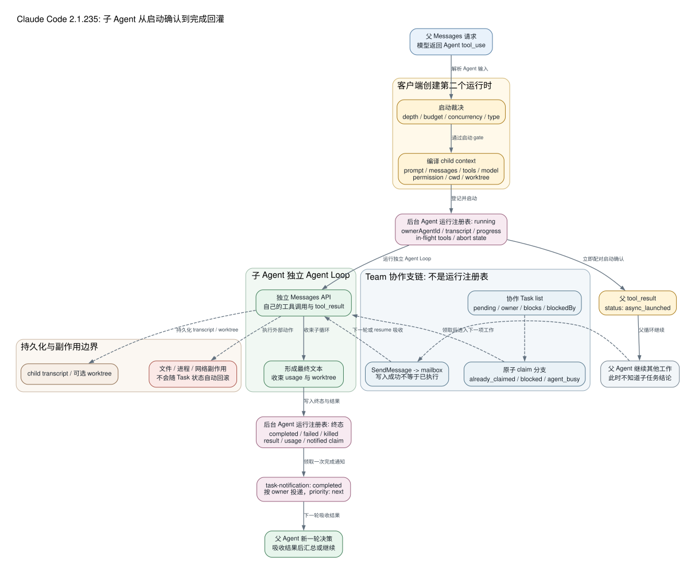

# Claude Code CLI 2.1.235 子 Agent、Team 与 Task Runtime：父循环怎样启动、监督并接回独立工作

先看一条真实运行记录。目标不是根据字符串猜架构，而是让 SHA-256 固定为 `83b8f806f6f2eea316cfe246628e6c23374711d868f1fd0409db551b877b7748` 的 `2.1.235` 二进制实际启动一个子 Agent。

Probe 给父循环的输入只有 `SUBAGENT_PARENT_PROMPT_MARKER`，受控模型随后发出下面这次调用：

```json
{
  "name": "Agent",
  "id": "toolu_subagent_probe",
  "input": {
    "description": "Run an isolated child-loop probe",
    "prompt": "SUBAGENT_CHILD_PROMPT_MARKER",
    "subagent_type": "general-purpose"
  }
}
```

捕获结果不是“父模型替子模型读了几份文件”，而是四个先后发生的状态变化：

```text
父 Messages 请求 #1
  -> Agent tool_use
  -> 父循环收到 tool_result: async_launched

子 Messages 请求 #1
  -> 含 SUBAGENT_CHILD_PROMPT_MARKER
  -> 不含 SUBAGENT_PARENT_PROMPT_MARKER
  -> 带有独立装配的 tools

父循环随后收到 task-notification: completed
  -> 携带 SUBAGENT_CHILD_RESULT_MARKER
  -> 父模型再作最终判断
  -> 输出 SUBAGENT_PARENT_OK
```

整次 Probe 记录了 3 个父请求、1 个子请求，父模型和子模型在这个受控输入里都解析为 `claude-sonnet-4-5`，最终进程 exit 0。两者模型名相同，不代表它们共用一次请求；子请求拥有自己的 prompt 和工具集合。更关键的是，父循环先看到 `async_launched`，后来才看到 `completed`。**启动确认和任务结论是两种消息，任何把前者当成后者的实现都会过早汇报、重复派发或丢失结果。**



## 父 Agent 只提出委派，客户端负责创建第二个运行时

`2.1.235` 中模型看到的规范名称是 `Agent`，旧的 `Task` 名称会先被归一化到它。调用至少提供 `description` 和 `prompt`，还可以指定 `subagent_type`、`model`、`run_in_background`、`name`、`isolation` 或 `cwd`。这些字段不是直接拼进父对话的一段文本；客户端先把它们交给本地 launcher。

Launcher 在真正创建子循环前依次检查：

- 当前嵌套深度是否达到 `CLAUDE_CODE_MAX_SUBAGENT_SPAWN_DEPTH` 解析出的上限；
- 当前并发子 Agent 数是否达到并发上限；
- session 的美元预算是否已经耗尽；
- 指定的 Agent 类型是否存在、是否被 `Agent(type)` 权限规则拒绝；
- `cwd` 与 `isolation: "worktree"` 是否互斥，目标路径和 Git 根是否可用；
- 当前角色是否允许创建 teammate 或后台 child。

这些检查失败时不会生成一个“半启动”的子循环。例如并发达到上限会明确要求不要重试；预算耗尽会要求父 Agent 用现有结果收尾；类型被 deny 时，错误中会保留命中的规则来源。这里的状态 owner 是客户端，不是模型对自己工具调用的文字解释。

通过检查后，客户端才计算子运行时的六个核心对象。

### Prompt 与 Messages：默认子 Agent 不继承父对话

普通 named/general-purpose child 的初始逻辑消息是它自己的 `prompt`，system prompt 来自选中的 Agent definition 和运行环境。Probe 直接证明 child request 包含 child marker，却没有 parent marker。

这和 `fork` 是两个合同。内置 fork 明确把父 transcript 作为“继承的参考资料”，同时追加 worker 指令，要求它只完成一个 directive；本版 fork definition 的静态默认值是 `maxTurns: 200`、`model: "inherit"`、`permissionMode: "bubble"`。因此不能把“普通子 Agent 有独立上下文”写成“所有子 Agent 都完全看不到父历史”，也不能反过来把 fork 的继承行为泛化给普通 child。

### Tools：子 Agent 拿到的是重新过滤后的能力面

客户端从当前 AppState、核心工具、Skill 工具和 Agent definition 重新计算 child 的 `availableTools`。它不是把父请求的 `tools[]` 原样复制过去，也不是只把父 Agent 读过的文件名交给 child。Agent definition 可以进一步收窄工具；子 Agent 限制、permission mode 和当前 host 又会继续过滤。

Probe 里的 child request 实际携带了独立工具集合，检查项 `childHasIndependentTools` 为 true。它证明“另一次请求、另一份工具装配”这条客户端链，不证明任意自定义 Agent 一定获得某个具体工具。

### Model 与 Permission：继承是求值规则，不是共享状态

模型先按 Agent definition 求值，再处理调用参数 override，最后回落到父主循环模型。解析完成的 model ID 被写入 child metadata，后续 child 自己发生 fallback 或 model change 时，运行任务记录还会维护 `modelsUsed`。

权限模式同样在创建 child context 时重新求值：普通 child 使用 Agent definition 的 `permissionMode`，未指定时继承当前父模式；fork 使用 `bubble` 合同。父 Agent 获准调用 `Agent`，只说明“允许创建这个 worker”，不等于 child 的 `Bash`、`Edit` 或网络动作已经获得批准。每个 child tool call 仍走自己的 schema、hook、permission、policy 和 sandbox 管线。

源码把 `Agent` tool object 标成 `isReadOnly() = true`，这是调度器对 launcher 本身的分类，不应被解释为“委派没有副作用”。Launcher 可以创建 task、transcript 和 worktree；特定 teammate/backend 还会创建独立进程，child 随后也可能改变文件或远端系统。

### Cwd 与 Worktree：隔离工作目录，不隔离整个世界

指定 `cwd` 后，child 的文件和 Shell 操作以该绝对路径为项目目录。指定 `isolation: "worktree"` 时，客户端先创建临时 Git worktree，把 `worktreePath`、branch 和原始 head 绑定到 Agent 记录，再用 `session.withProject({cwd})` 构造 child session。

这能避免两个 worker 同时改同一 checkout，却不能隔离共享 Git stash、账号、API 配额、网络服务、数据库或仓库外路径。完成时客户端只在 worktree 相对初始 head 没有需要保留的变化时尝试清理；有变更或清理失败时会保留路径并把它放进完成结果。恢复 parked child 时还会重新检查目录、realpath 和 isolation fences，不能验证的路径不会被悄悄采用。

## `async_launched` 只关闭启动调用，不关闭子任务

本版 Agent output schema 把结果分成三类：同步 `completed`、本地 `async_launched` 和远端 `remote_launched`。本地后台路径先在运行任务注册表建立 Agent 记录，然后让 child loop 异步运行，马上给原始 `tool_use_id` 返回配对结果：

```text
status: async_launched
agentId: <内部 ID>
description: <任务摘要>
resolvedModel: <启动时模型>
outputFile: <进度/转录元数据路径>
```

这个 `tool_result` 的作用是让父 Agent Loop 保持 API 消息合法，并告诉父模型“委派已经登记”。它特意提醒父模型：在 completion notification 到达前，它对结果一无所知，不应猜测或复述内部 ID。

对于 local agent，`outputFile` 不是一份适合父模型反复 `Read` 的精简报告；相关提示明确说明它可能指向完整 subagent JSONL transcript，直接读取会把大量内部轮次重新灌入父上下文。正常结果通道是完成通知，不是父 Agent tail 子 transcript。旧 `TaskOutput` 工具因此也被标成 deprecated：local agent 应使用 Agent result，而不是把 output file 当作结果正文。

同步启动也不是完全不同的引擎。它运行同一个 child loop，只是父 `Agent` 工具调用等待 child 结束，再把 `status: completed`、内容、token、工具次数、持续时间和可选 worktree 信息一次性映射为原 tool result。运行超过策略条件时，同步 child 还可以转入后台，返回同样的 `async_launched` 合同。

## 两种“Task”必须分开：运行任务与协作清单

仓库里容易把两个同名概念混成一张表。

第一种是**运行任务注册表**。`Agent` 启动时写入的记录包含 `agentId`、`ownerAgentId`、`parentAgentId`、spawn depth、description、prompt、resolved model、Agent definition、tool-use ID、cwd、abort controller 和开始时间。child 每产生 assistant/user/tool 消息，注册表就镜像 transcript、正在执行的 tool ID、token/tool progress 和最后活动时间。它回答的是“这个 worker 现在还在不在跑、结果应该通知谁”。

第二种是 `TaskCreate`、`TaskGet`、`TaskList`、`TaskUpdate` 操作的**协作任务清单**。新任务从 `pending`、无 owner、空 dependencies 开始；它只是工作分解记录，不会因为 `TaskCreate` 成功就自动执行。`owner`、`blockedBy` 和 `blocks` 用来让 Team worker 协调领取顺序。

Team 的 in-process runner 会寻找第一个 `pending`、无 owner、且没有未完成 blocker 的任务，然后走专门的 claim 路径。Claim 在锁内重新读取记录，并显式区分：

- `task_not_found`：目标已经不存在；
- `already_claimed`：owner 是另一个 worker；
- `already_resolved`：任务已经完成；
- `blocked`：仍有未完成依赖；
- `agent_busy`：启用 busy check 时，同一 owner 还有另一项未完成任务。

成功 claim 后才写 owner，再把状态改成 `in_progress`。这条路径避免两个 in-process teammate 静默拿到同一任务。另一方面，模型直接调用 `TaskUpdate` 时，主字段 patch 与后续 dependency edge 是分阶段写入的；后半段失败可能留下已经生效的 owner/status。**“存在加锁 claim”不等于整个 TaskUpdate 是跨记录事务。**

当 teammate 退出或被终止时，客户端会把仍由它持有的未完成任务重新设为无 owner、`pending`，并生成通知提示 lead 重新分配。这恢复的是协调所有权，不会撤销 teammate 已写入文件或发往远端的动作。

## Team 与普通子 Agent 的差别是可寻址协作，不是更大的上下文

普通 child 可以匿名运行，也可以用 `name` 注册为可寻址 Agent。处于 Team context 且满足条件时，带 `name` 的启动会进入 teammate spawn 路径，登记 team roster、颜色、backend 和 task identity。Team roster 是扁平的：teammate 不能再创建另一层 named teammate；in-process teammate 也不能创建后台 child，但仍可按合同启动同步 subagent。

Team worker 有自己的 prompt、messages、tools 和模型调用。Lead 不会自动看到它的普通文本输出，worker 也不会自动看到 lead 后来想到的补充要求。两边通过 `SendMessage` 和完成通知交换有限信息。

### Mailbox 不是共享聊天数组

`SendMessage` 先解析收件人：优先使用当前 in-process identity，也可以使用 spawn 返回的 `agentId`。成功写入后返回 message ID 和 routing 摘要；失败则明确说“nothing was sent”，不能靠在自己 transcript 里写一句相同文本来冒充投递。

in-process runner 在轮次间轮询 mailbox。它优先处理 shutdown request，再吸收普通未读消息；收到多条普通消息时会一起 drain，并标为已读。没有消息时，它还会检查协作任务清单并尝试 claim 下一项工作。也就是说，mailbox 改变的是 receiver 下一轮的输入，不会修改已经发送中的 Messages request。

向已经完成的 named agent 再发消息时，客户端可以从它自己的 transcript 恢复 child，再追加新消息。因此同一个 Agent ID 并不天然“一次完成后永久失效”。这也解释了完成通知中的一句关键说明：同一 task ID 在 Agent 被再次唤醒并再次停止后，可能产生不止一次 completion notification。

`SendMessage` 不是权限中继。工具提示明确禁止让 peer 执行本 session 已被拒绝的动作；跨边界消息还可能要求单独批准。即使 mailbox 写入成功，含义也只是“消息已排队”，不证明 receiver 已读、已执行或执行成功。

## Child 完成后，为什么父 Agent 会再运行一轮

后台 child 的执行器独立消费流式消息，并持续维护 in-flight tool-use ID。默认 stall watchdog 是 600,000 ms；只要仍有工具在执行，它会延后 watchdog，而不是把长工具误判为模型无进展。没有消息和工具进展达到超时后，child 被 abort，任务进入 failed，并形成失败通知。

正常结束时，客户端先汇总 child 的最终文本、总 token、工具次数、持续时间和 worktree 结果，再把运行任务从 `running` 转为 `completed`。通知生成器通过一次 registry update 领取“尚未通知”的完成状态；如果记录已经通知或已经不在 registry，就跳过重复投递。领取成功后，它创建 `mode: "task-notification"`、`priority: "next"` 的队列项，目标优先是 `ownerAgentId`，否则回到 main Agent。

通知正文包含状态、结果、usage 和可选 worktree，不是原始 child transcript。父 Agent 下一次 turn 把它作为 task-notification 来源的 meta 输入吸收，再由模型决定：直接汇总、要求 child 继续、检查外部状态，还是启动新的工作。Probe 中的第三个父请求正是这一步，最终才得到 `SUBAGENT_PARENT_OK`。

如果 child 自己还有 live background children，注册表会保留 keepalive reason，当前 child 可以先 parked，并把 owner notification 推迟到这些后代收束之后。完成事件因此不是“任意模型 stop_reason 一出现就立即通知”，而是客户端确认当前 worker 没有需要维持的后台所有权后才交接。

## 后台不等于跨进程永生

本地异步 child 首先是当前 Claude Code runtime 管理的 Agent Loop。注册表和 child transcript 提供恢复材料，恢复路径会重建 prompt messages、tool context、model、permission mode、available tools、abort state 和 worktree binding；它不会复活旧 Promise、socket 或已经退出的任意子进程。

Team teammate 还可能由 in-process、tmux/split-pane 等不同 backend 承载。UI 看到 teammate、task 和 output file，只是这些 owner 的投影，不能反推出 worker 一定在当前进程内，更不能把“任务记录仍在”当作“执行进程仍存活”。

当前官方资料描述了由 per-user supervisor 承载后台 session 的产品路径，但本仓库这组精确 Probe 没有执行“关闭父 CLI、重启后继续同一 child”的正向实验。因此对 `2.1.235` 能确定的是：客户端具备 transcript、registry、resume 和 worktree 重绑逻辑；不能据此声称每个本地后台 Agent 都已通过目标版本 Probe 证明跨进程耐久。远端 cloud Agent 的 worker、调度和数据保留也不在本文的本地 runtime 结论内。

## 失败、成本和副作用应该怎样判断

| 现象 | 实际状态 | 正确处理 |
| --- | --- | --- |
| 收到 `async_launched` | launcher 与 registry 已完成登记 | 继续其他工作，等待 notification；不猜结果 |
| `already_claimed` | 另一个 teammate 已拥有协作任务 | 读取最新 TaskList，选择其他可用任务 |
| child 长时间无文本 | 可能在运行工具，也可能 stall | 看 registry/in-flight 状态；600 秒 watchdog 不在工具进行中强杀 |
| mailbox send 成功 | 消息已写入收件通道 | 不等同于已读或完成 |
| notification 为 completed | child loop 已形成终态结果 | 父 Agent 仍需验证外部副作用和用户目标 |
| worktree 被保留 | 隔离目录仍有变化或清理未完成 | 检查 branch/path，再决定合并或清理 |
| 父 CLI 退出 | 内存执行对象消失；持久材料可能仍在 | 通过受支持 resume 路径重建，不能假设自动续跑 |

独立上下文减少了父窗口被搜索轨迹、工具输出和试错过程占满的概率，但不会免费。每个 child 都会建立自己的 system、messages、tools 和 Messages API 调用；并发通常缩短墙钟时间，却可能提高总 token、cache write、工具调用和远端费用。完成通知只把 child 的最终发现和 usage 压回父循环，它压缩的是交接内容，不抹掉 child 已经消费的成本。

副作用也不会随着任务状态回滚。Agent notification、Task owner 和 mailbox 都属于协调状态；child 已经修改的文件、启动的进程、发出的请求或创建的远端资源属于外部状态。把任务重新设为 pending、停止 child、删除 task 或 rewind 父消息，都不能自动撤销这些动作。Worktree 只改善仓库文件冲突，不提供跨 API、数据库和 Git 的事务。

## 本版证据能证明到哪里

| 结论 | 证据 |
| --- | --- |
| 普通 child 有自己的 prompt、tools 和 Messages call | `probe.subagent-isolation`；[`runtime-probes/subagent-loop.json`](runtime-probes/subagent-loop.json) |
| 启动 ACK 与 completed notification 分离 | `probe.subagent-notification-feedback`；同一 Probe 的 `parentFeedbackSequence` |
| fork 默认 200 turns、继承 model、bubble permission | `subagent.fork-defaults`；`cli.readable.js:156518` |
| 恢复会重建 prompt/messages/tools/model/permission/worktree | `agents.isolated-state`；`cli.readable.js:306880-306956` |
| Team claim 有 already-claimed、blocked 和 busy 分支 | `teams.task-claim`；`cli.readable.js:202460-202513`、`290106-290133` |
| runtime completion 先 claim notification，再按 owner 排队 | `cli.readable.js:204241-204257`、`280164-280223` |
| SendMessage 写 mailbox，receiver 在轮次间 drain | `cli.readable.js:290139-290207`、`307040-307206` |

这组证据没有证明模型内部为什么决定委派、任意账号的服务端 Agent 配额、cloud worker 的调度实现、后台 supervisor 的跨重启成功率，也没有恢复 Anthropic 构建前的 TypeScript 模块名。Probe 使用 `bypassPermissions` 来稳定观察子循环隔离，不应被改写成“所有真实 child 都绕过 permission”。Team claim、mailbox 与 worktree 的结论来自目标 bundle 静态可达路径；它们尚未全部获得与 subagent isolation 同等级的端到端二进制正向 Probe。

理解这套 runtime 最后只需抓住三次交接：父模型用 `Agent tool_use` 提出委派；客户端用 `async_launched` 确认另一个运行时已经登记；child 完成后，客户端用 `task-notification` 把有限结果交回父 Agent 再作决定。Team、Task list 和 mailbox 增加的是协调协议，不会把多个独立 Agent 变成一个共享大脑。
