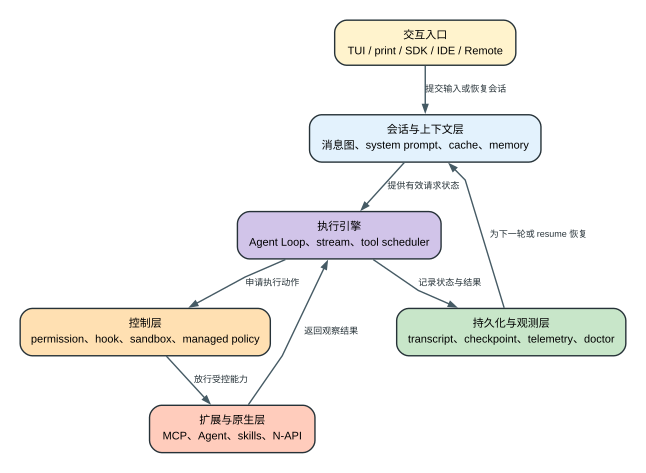

# Claude Code CLI 2.1.235 技术架构导读

这是一份面向人的入口。它先解释 Claude Code CLI 作为一个本地 Agent harness 如何运行，再把读者带到完整机器证据。不要从 71 个 inventory 文件开始读，也不要把一个 313 MB 可执行文件误解成“只有一段聊天 CLI”。

第一次阅读先看 [技术机制总图](technical-mechanism-atlas.md)：它按九个子系统和三条闭环解释一次请求。本文负责组件与发布物分层；Agent Loop、会话/checkpoint、工具权限、MCP/Agents 和恢复语义分别由专题展开。官方公开原理与 `2.1.235` 实现的版本边界见 [验证矩阵](public-claims-validation.md)。

## 60 秒理解这套架构

**读者问题：** 为什么 Claude Code 不能被理解成“一个 TUI 加一次 Messages API 调用”，以及某个功能卡住时应该先查哪一层？

**一句话模型：** 交互入口只负责接收和展示；会话与上下文层构造模型可见状态；Agent Loop 驱动决策；权限、hook 和 sandbox 控制副作用；MCP、Agent 与原生模块提供能力；transcript、checkpoint 和遥测负责延续与诊断。



贯穿场景：用户在 IDE 中发起“修改配置并运行测试”。IDE 只提供输入与编辑器上下文，真正的消息图和 Agent Loop 在 CLI 运行时中；Edit/Bash 仍要经过权限和 sandbox；结果写入 transcript，文件修改留在工作区；即使 Remote viewer 断开，执行 owner 和恢复边界也不能靠 UI 外观判断。

| 层 | 进入前持有什么 | 本层改变什么 | 交给下一层什么 | 典型故障表象 |
| --- | --- | --- | --- | --- |
| 交互入口 | 用户输入、显示状态 | 输入格式和呈现协议 | 标准化消息或控制帧 | UI 卡住、stream-json 消费错误 |
| 会话与上下文 | transcript、memory、工具目录 | 有效消息视图、cache marker、compact | 请求所需 messages/system/tools | token 暴涨、resume 像失忆 |
| Agent Loop | 模型状态和循环计数 | tool_use、tool_result、继续/结束条件 | 动作请求或 terminal reason | 工具后不继续、maxTurns 提前结束 |
| 控制与扩展 | 工具输入、策略、运行边界 | 是否执行、如何执行、输出结构 | 真实观察或结构化错误 | 反复审批、sandbox 拒绝、MCP schema 旧 |
| 持久化与观测 | 事件、文件变化、计时 | transcript/checkpoint/telemetry | resume、rewind 和诊断材料 | 历史在但文件未恢复、只知慢不知慢在哪 |

后文先拆发布物，再按上述层次下沉；机器清单和源码位置留在每个机制之后，用来证明结论，而不是替代架构解释。

## 一张图看完整请求

```text
用户输入 / SDK 消息 / resume transcript
                    |
                    v
        会话消息图与运行状态
        UUID / parent / compact boundary
                    |
                    +-----------------------+
                    |                       |
                    v                       v
          System prompt 装配          User/System context
      固定规则 + 动态机器段      CLAUDE.md / Git / memory / MCP
                    |                       |
                    +-----------+-----------+
                                v
                         工具与 Agent 目录
              内置工具 / MCP / skills / commands / agents
                    完整 schema 或 defer_loading
                                |
                                v
                       消息规范化与风险门控
        permission / policy / hook / sandbox / provider capability
                                |
                                v
                       Prompt cache 分段与 marker
              stable system / org tail / message / fork pin
                                |
                                v
                          Anthropic Messages 请求
       model / betas / thinking / tools / context_management / metadata
                                |
                    +-----------+-----------+
                    |                       |
                    v                       v
              流式模型输出             tool use 循环
          usage / stop / retry       审批 -> 执行 -> tool result
                    |                       |
                    +-----------+-----------+
                                v
                   JSONL transcript / telemetry / UI
                                |
                    context 接近阈值时
                                v
       tool result microcompact -> precompute -> auto/manual compact
                                |
                                v
                 compact boundary + summary + resume 链修复
```

## 它是什么

Claude Code CLI 是一个本地 Agent 运行时，职责至少包括：

- 收集用户输入、项目说明、Git/IDE/终端状态；
- 构造模型请求和长会话上下文；
- 管理工具、MCP、skills、commands、hooks 和 Agent；
- 在本机执行文件、Shell、浏览器、IDE、Computer Use 等能力；
- 实施权限、沙箱、企业 policy、凭据和扩展信任控制；
- 保存 transcript、memory、任务、worktree 和恢复信息；
- 处理流式响应、重试、fallback、compact、费用和 token；
- 提供 TUI、SDK JSON/stream JSON、Remote Control、cloud session 等入口；
- 产生一方事件、可配置 OTEL、debug、profile 和本地诊断。

这也是为什么发布产物内同时存在大段 JavaScript、JSC bytecode、Rust/Swift `.node` 模块、Chart.js、Highlight.js、Mermaid 和 HTML payload。

## 发布物分层

| 层 | 目录 | 能回答什么 | 不能冒充什么 |
| --- | --- | --- | --- |
| 原始打包层 | `extracted/` | 可执行文件实际携带了哪些 packed bytes | Anthropic 原始 TypeScript 仓库 |
| 字节码层 | `reverse/bytecode/` | 发布物携带的完整 JSC 执行缓存 | TypeScript/JavaScript 源码 |
| 可读分析层 | `reverse/javascript/` | 调用链、条件、常量和请求构造 | 原始格式、变量名、模块树 |
| 原生静态分析 | `reverse/native/` | Mach-O 架构、符号、依赖、字符串、反汇编 | 原始 Rust/Swift/C++ 文件 |
| 兼容重建层 | `reconstructed/` | 可编译替代实现和行为契约 | Anthropic 原生源码仓库 |
| 确定性清单 | `analysis/source-inventory/` | 每版本可重跑的稳定语义表面 | 人类架构说明 |
| 人类解释层 | `analysis/*.md` | 为什么、怎么工作、用户影响和边界 | 机器证据本身 |

## 启动与运行模式

### 交互式 TUI

默认 `claude` 启动终端 UI，维护输入框、消息列表、tool progress、permission dialog、任务/Agent 状态、context/费用显示、model/effort/permission mode 等会话状态。

### Print/SDK 模式

`--print` 用于非交互执行，支持 text、JSON、stream JSON、partial message、JSON Schema output、预算、最大轮数、session ID、resume/fork、allowed/disallowed tools 和 permission prompt tool。

SDK wire 不只是 assistant 文本。`output-protocol-event-identifiers.txt` 和 `sdk-control-subtypes.txt` 记录 init、assistant、user、stream_event、result、compact_boundary、control request/response、permission、hook、MCP 等协议面。

### Remote/Cloud/Thin client

代码包含 cloud session、teleport/resume、Remote Control、自托管环境、CCR/BYOC、后台 cloud task 和 thin-client adapter。thin client 会采用 worker 下发的真实 model/cwd/tools/MCP/autocompact 状态，并对 malformed frame fail closed，而不是盲目信任任意字段。

## 会话不是数组，是消息图

每个主要 transcript entry 有 UUID，通常还有 parent UUID。fork、resume、compact 和保留消息会改变逻辑父节点。会话恢复需要：

- 逐行解析 JSONL；
- 丢弃 malformed/无 UUID 的不合格记录；
- 找到消息图叶节点；
- 根据 `compact_boundary` 修复 preserved segment/messages；
- 选择主链或 fork 链；
- 恢复未完成 task、deferred tool、Agent 状态和 UI 展开状态。

因此 `--resume` 不是把文本拼回 prompt。它恢复一个有分支、边界和元状态的执行历史。

详细 compact/resume 见 [`context-governance-and-caching.md`](context-governance-and-caching.md)。

## 上下文系统

### 常驻内容

每轮可能常驻：

- system prompt 固定规则；
- CLAUDE.md/rules/memory；
- 当前项目/Git/环境提醒；
- built-in tool schema；
- 未延迟的 MCP schema；
- Agent、skill、command listing；
- 历史 user/assistant/tool 消息；
- 附件及 compact summary。

### 治理手段

| 问题 | 机制 |
| --- | --- |
| system prompt 每机不同导致 cache miss | stable/dynamic 分段、移动动态段到首条 user message |
| 工具目录太大 | tool search、`defer_loading` |
| 旧工具输出太大 | context hint、本地 microcompaction、持久化旧结果 |
| 长会话逼近窗口 | precomputed/reactive/manual compact |
| resume 时历史过长 | compact boundary、summary、logical parent |
| skill/command listing 失控 | 单 skill description 上限和 context 比例预算 |
| 用户不知道 token 花在哪 | context category 统计、usage、诊断命令/事件 |

完整阈值、TTL、cache scope、成本算例和失败回退见 [`context-governance-and-caching.md`](context-governance-and-caching.md)。

## 模型与请求构造

### Baked model catalog

2.1.235 内置 17 个 model entry、6 个 pricing tier 和 4 个 alias family。每个 entry 可以包含：

- 各 provider model ID；
- context window 和 1M 能力；
- default/upper max output；
- effort、adaptive thinking、fast mode、mid-conversation system 等 capability；
- prompt cache 读写价格；
- advisor rank、image limit 和 fallback provider model。

catalog 是客户端离线基线。代码也存在动态 model config fetch，成功时可获取服务端 `max_input_tokens` 和 `max_tokens`；失败则记录原因并退回已有信息。

### 请求字段

最终 Messages 请求可包含：

- `model`、`messages`、`system`、`tools`、`tool_choice`；
- `betas`、`metadata`、`max_tokens`；
- `thinking`、`temperature`、`output_config`；
- `context_management`、`context_hint`；
- `speed`、server fallback、task budget；
- prompt-cache `cache_control` 和 evict-on-complete。

这些字段都受模型 capability、provider、认证类型、query source、feature/client data 和错误 latch 影响。字段存在不等于每次发送。

## Agent Loop 是执行引擎，不是一个 API 调用

主链 `USe -> HGS -> tdf` 用异步生成器维护一个显式状态机。每轮先吸收队列消息并检查 compact，再调用模型；完整 `tool_use` content block 一出现就加入 streaming tool executor，不必等待整个 response 结束。执行器只让 `concurrency-safe` 工具重叠，非安全工具形成顺序屏障。

单个工具依次经过 input parse/schema、工具自定义校验、PreToolUse、permission/policy/classifier、updatedInput 复验、实际调用、PostToolUse 和 output schema 复验。成功、拒绝和异常最终都变成按 `tool_use_id` 配对的 `tool_result`。工具批次完成后，循环再检查 abort、defer、hook stop、tool endsTurn、PostToolBatch、MCP/tool refresh、中途用户消息和 `maxTurns`，最后才决定结束或再次请求模型。

`maxTurns` 统计模型轮次，不统计每次 HTTP retry。Stop hook blocking 会增加轮次并重入，默认连续超过 8 次时被客户端覆盖。模型 fallback 会 tombstone 当前消息并 abort 未完成工具，但不能撤销已发生的文件或远端副作用。主 Agent 和子 Agent 共享这套核心循环，各自拥有 model、tools、permissions、worktree、abort 和 transcript 状态。

完整状态字段、流式时序、并发规则、失败恢复、terminal reason 和源码证据见 [`agent-loop.md`](agent-loop.md)。

## 工具、MCP、Skill 与 Agent

### 内置工具

机器清单中的 29 个 built-in identifier 来自提取器维护的 core name allowlist 与 bundle 静态 assignment 交集，是跨版本核心参考，不是从 `_Z()/j7()` 完整装配数组自动推导。另有 188 个 known-tool catalog 项，其中可能混入内嵌依赖/文档或条件能力；实际本轮工具集合还受模式、provider、权限和 feature gate 过滤。

### MCP

MCP 支持 stdio、HTTP 等 transport，工具、resources、prompts、auth、XAA、server status 和动态刷新。安全面包括：

- strict MCP config；
- allowed/disallowed tools；
- server config source 和企业 policy；
- OAuth/XAA 凭据处理；
- deferred schema 与 tool search；
- server 断开后的可用性 delta。

### Skills 与 commands

slash command/skill listing 不是免费元数据。描述会进入上下文，因此设置提供 1536 字符单项 description cap 和默认 1% 字符预算。完整 SKILL.md 通常按触发需要读取，不应把所有 skill 正文常驻。

### Agent 与团队

支持 custom Agent、主线程/子 Agent、background Agent、worktree 隔离、跨会话 `SendMessage`、团队/任务状态和 cloud review。子 Agent 有独立 query source、model/effort、权限上下文和 token usage，主会话会记录 fork 的 cache read/write 比例和耗时。

## 工具执行与风险控制

风控不是一张 allow/deny 表，而是多道决策链：

```text
工具是否存在
  -> 当前 mode 是否允许
  -> allow/deny rule 是否命中
  -> managed policy 是否覆盖
  -> path/network/domain/sandbox 是否允许
  -> hook 是否审批、修改或阻断
  -> 是否需要用户确认
  -> 执行期间是否触发 timeout/output/size guard
  -> 结果是否需要清理、截断或标为 error
```

### 权限模式

规范化后的权限模式是 `default`、`acceptEdits`、`auto`、`bypassPermissions`、`dontAsk`、`plan`；输入表面还接受 `manual` 作为 `default` 的兼容 alias。最终决策会携带 decision reason/source，permission dialog 还区分本次允许、会话允许和持久规则。

### 本地执行边界

可证实的控制面包括：

- 文件读写路径、additional directories、worktree 隔离；
- Bash sandbox、网络/domain、危险参数和超时；
- symlink/path traversal、外部 CLAUDE.md import trust；
- MCP/plugin/skill/hook/agent 的来源和企业治理；
- credential helper、keychain、AWS/GCP/Azure auth；
- Safe mode、Bare mode 和 managed settings；
- fail-closed 配置解析与 malformed wire frame 处理。

详细证据见 [`risk-control-surface.txt`](risk-control-surface.txt) 和 [`source-surface.md`](source-surface.md)。这些是 CLI 本地执行治理，不等于服务端账号滥用评分或封禁系统。

## 流式响应、重试与 fallback

请求层维护：

- client request ID 与服务端 request ID；
- stream event 解析和 content block 生命周期；
- idle/stall/watchdog；
- stale connection 和 529 retry；
- 流式失败转非流式；
- model fallback、consent fallback、refusal fallback；
- fallback credit 的 mint/use/forfeit；
- partial output salvage 和 tombstone/retraction；
- usage 合并、费用计算和 stop reason。

失败路径会区分 400 beta 不支持、cache-control rejection、provider 特性不兼容、model blocked、rate limit、网络超时和 malformed response，不能把“有重试”概括成一个固定次数。

## 持久化

### Transcript

JSONL 保存消息图、工具结果、compact boundary、系统状态和恢复元数据。`cleanupPeriodDays` 默认 30；`--no-session-persistence` 才停止写入。

### Memory

memory 包括用户/项目 CLAUDE.md、rules 和 auto-memory。`autoMemoryDirectory` 不能由 checked-in project settings 任意指定，避免仓库把记忆写到不受信任路径。auto-dream 是后台记忆整合路径。

### Storage v5

bundle 中存在 namespaced stream/storage 抽象，用于 transcript、telemetry、任务和其他状态的迁移/持久化。`claude-storage-namespaces.txt` 比全 bundle namespace 更接近 Claude Code 自有存储面，但仍需要结合 callsite 判断生命周期。

## 遥测与诊断

### 一方事件

一方事件有两级初始化前队列、采样、batch、磁盘失败持久化、二次 backoff、401 无认证重试和 v5 stream 迁移。它不是每次 `H()` 都立即发一个 HTTP 请求。

### 第三方 OTEL

用户/管理员可显式启用 metrics/logs/traces，并选择 console、OTLP、Prometheus 及 gRPC/HTTP 协议。内容字段默认收缩，user prompt、assistant response、tool content 和 raw API body 有独立开关及长度上限。

### Datadog 与 GrowthBook

Datadog 只转发 allowlist 事件并删除/归一化一部分字段；GrowthBook experiment 复用一方 transport。Datadog 的 redacted field 表不能代表所有遥测通道。

### 本地诊断

还包括 debug log、diagnostics file、JSONL/SDK/PTY recording、startup/query profiling、Perfetto bridge/integration surface（recorder/file 未观察）、frame timing、heap/CPU/process telemetry。看到本地 profile 标识不等于文件会自动上传。

完整通道、默认值、privacy gate 和字段见 [`telemetry.md`](telemetry.md) 与 [`inventory-field-guide.md`](inventory-field-guide.md)。

## 原生模块

| 模块 | 语言证据 | 作用 |
| --- | --- | --- |
| `audio-capture.node` | Rust/N-API | 麦克风授权、录音、播放、音频状态 |
| `image-processor.node` | Rust/N-API | 图片读取、resize、格式编码、剪贴板 |
| `url-handler.node` | Rust/N-API | macOS URL/Apple Event 监听 |
| `computer-use-input.node` | Rust/N-API | 键鼠事件、滚轮、辅助功能权限 |
| `computer-use-swift.node` | Swift/N-API | 屏幕/窗口捕获、应用枚举、ESC event tap |

每个原版模块都保留 Mach-O 静态证据；`reconstructed/` 提供兼容重建、N-API contract 和原版/重建双跑。可编译不代表恢复了原始源文件，证据等级见 [`reconstructed/EVIDENCE.md`](../reconstructed/EVIDENCE.md)。

## UI 与用户体验不是“壳”

TUI 处理：

- Markdown、代码高亮、Mermaid、图表和 artifact HTML；
- 输入法、多行编辑、Vim mode、history、suggestion、spellcheck；
- permission、plan、task、Agent、MCP、model、effort、context 面板；
- terminal size、alternate screen、mouse、screen reader、accessibility；
- IDE/VS Code/Chrome integration；
- voice/audio 与 Computer Use。

2.1.235 的多个 release fix 正发生在这些状态交互处，例如方向键后 Enter 的选择竞态、Shift+Tab 权限范围、列表悬挂缩进、Vim 光标保持和多 panel focus。

## 机器清单如何覆盖全产品面

71 类 inventory 可归为 12 组：

| 组 | 主要文件 | 用途 |
| --- | --- | --- |
| 环境 | environment schema/access | 类型、读取点、动态 key |
| Settings | root schema/keys/descriptions/enums | 用户和企业配置表面 |
| 一方遥测 | event callsites/events/fields | 业务事件和 payload |
| OTEL/Datadog | events/metrics/spans/allowlist/redaction | 外部观测出口 |
| Feature/experiment | feature/GrowthBook callsites | 客户端门控候选 |
| 模型 | catalog/pricing/aliases/identifiers | provider、窗口、能力、价格 |
| 工具/命令 | registrations/builtins/catalog/components/slash | Agent 执行表面与宿主候选对象 |
| 协议/hooks | SDK subtypes/output events/hook events | SDK/MCP/扩展生命周期 |
| 存储 | namespaces/config dirs | transcript/memory/task/telemetry 候选 |
| API/runtime | paths/routes/requires | 网络和依赖边界 |
| 错误/诊断 | callsites/templates/literals | 失败分支和用户可见消息 |
| 全词法/网络 | strings/templates/URLs/hosts | 发现候选并回源码验证 |

每个字段的读法见 [`inventory-field-guide.md`](inventory-field-guide.md)。

## 建议阅读顺序

1. [`technical-mechanism-atlas.md`](technical-mechanism-atlas.md)：先建立九层机制和三条闭环。
2. 本文：理解组件、请求路径和发布物分层。
3. [`public-claims-validation.md`](public-claims-validation.md)：区分官方当前主张、本版静态证据、运行 probe 和边界。
4. [`agent-loop.md`](agent-loop.md)：理解模型、工具、结果反馈、重试和终止如何组成持续执行状态机。
5. [`context-governance-and-caching.md`](context-governance-and-caching.md)：理解上下文、缓存、压缩和成本。
6. [`sessions-checkpoints-memory.md`](sessions-checkpoints-memory.md)：理解消息图、transcript、resume、rewind 和 memory。
7. [`tools-permissions-hooks.md`](tools-permissions-hooks.md)：理解动作前后的完整控制管线。
8. [`mcp-agents-background.md`](mcp-agents-background.md)：理解动态扩展、独立 Agent context 和协作状态。
9. [`resilience-and-recovery.md`](resilience-and-recovery.md)：理解 retry/fallback 和不可撤销副作用。
10. [`telemetry.md`](telemetry.md)：理解网络出口、默认值和隐私控制。
11. [`inventory-field-guide.md`](inventory-field-guide.md)：学会读机器记录。
12. [`source-surface.md`](source-surface.md) 与 [`risk-control-surface.txt`](risk-control-surface.txt)：按能力面查机器证据。
13. `reverse/javascript/cli.readable.js`：沿专题给出的函数/行定位实现。
14. `extracted/cli.js`：最终 canonical packed bytes。

## 证据等级

- **Observed**：发布 bundle、CLI 输出、schema、请求字段、错误分支或运行 probe 直接证实。
- **Derived**：由多个 observed 事实推导的结构/算法解释，推导过程可复核。
- **Compatible**：重建实现满足观察到的契约，但不能证明和原实现逐行相同。
- **Heuristic**：广义正则/词法候选，必须回 callsite 验证。

本仓库的目标不是把所有字符串都贴到 README，而是让每个重要结论都能从人类解释跳到结构化记录，再跳到 canonical 发布字节。
