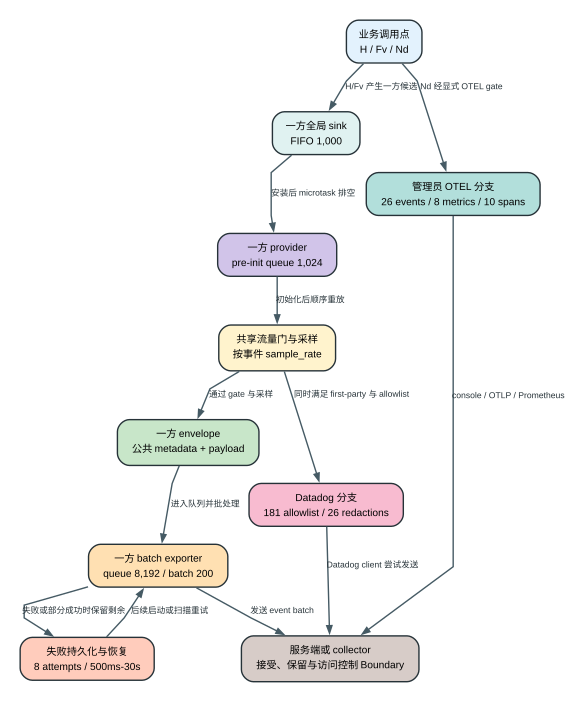

# Claude Code 2.1.235 遥测事件目录

> 版本证据：`Static`（已发布 bundle 的 AST 清单）+ `Derived`（确定性聚合）+ `Heuristic`（字段名启发式）+ `Boundary`（静态包无法证明的运行时/服务端状态）。

<!-- TELEMETRY_EVENT_CATALOG_BEGIN -->
<!-- first-party-events:1441 -->
<!-- first-party-callsites:2194 -->
<!-- resolved-callsites:2151 -->
<!-- dynamic-callsites:43 -->
<!-- datadog-allowlist:181 -->
<!-- otel-events:26 -->
<!-- otel-callsites:52 -->
<!-- otel-metrics:8 -->
<!-- otel-spans:10 -->
<!-- TELEMETRY_EVENT_CATALOG_END -->

## 60 秒看懂：一条事件如何走到不同出口

**读者问题：** Claude Code 里一次工具调用、API 请求、压缩或错误到底会留下什么事件？事件从哪个客户端通道产生、携带哪些静态可见字段、是否具备 Datadog 转发资格，又有哪些信息仅凭发布包无法证明？

这份目录把 1,441 个静态一方事件和 43 个动态事件名调用点分开：前者可以按名字聚合，后者只能保留表达式与位置，不能伪装成已经解析的产品事件。

**一句话模型：** 业务组件在本地调用通道专属 logger 形成事件候选，客户端再按门控、采样、队列、批处理和 exporter 配置决定是否尝试发送；静态事件名或 Datadog allowlist 命中都不等于运行时已经上报，更不证明服务端接受或保留。



贯穿场景：用户发起一次请求，Agent 调用工具，权限层作出决定，工具返回结果，随后上下文触发 compact。这个场景可以同时遇到两组互不等价的记录面：

1. 一方业务代码可能调用 `H` / `Fv` 记录 `tengu_tool_use_success`、`tengu_api_success`、`tengu_compact` 等候选事件。它们先进入一方队列，再受共享非必要流量门、远程采样和 batch exporter 控制。
2. 管理员显式启用 OTEL 后，代码中的 `Nd` 调用点可形成 `tool`、`tool_decision`、`tool_result`、`compaction` 等 structured event，并交给管理员配置的 exporter。
3. 若一方事件名位于 Datadog 的 181 项 allowlist，它只获得进入该转发分支的资格；first-party provider、feature gate、killswitch、初始化、限流与发送成功仍是额外条件。
4. 同一动作没有“一条万能遥测记录”。不同通道拥有不同 gate、字段处理、队列和目的地，不能拿一个通道的开关或删除字段推断另一个通道。

### 通道所有权表

| 状态 owner / 通道组件 | 客户端拥有的状态 | 本目录能证明 | 本目录不能证明 |
| --- | --- | --- | --- |
| 业务调用点 | 事件名表达式、payload 表达式、所在函数与源码位置 | `H` / `Fv` / `Nd` 的静态调用形状 | 某次真实会话一定执行到该分支 |
| 一方 `H` / `Fv` 流水线 | sink、预初始化队列、采样结果、batch queue、失败批次 | 2,194 个调用点和 1,441 个可静态聚合的名字 | 当前账号/组织最终是否允许发送 |
| Datadog 转发分支 | allowlist、字段删除、tag 归一化、分支限流 | 181 个允许名、26 个删除字段、34 个 tag 字段 | allowlist 命中的事件已实际到达 Datadog |
| 第三方 OTEL | enable gate、signal exporter、content gate、resource attributes | 26 个事件、52 个调用点、8 个 metric、10 个 span | 管理员 collector 的落盘、转发和保留策略 |
| 服务端/collector | 接受、拒绝、二次处理、保留和访问控制 | 客户端请求形状之外没有静态证据 | Anthropic 服务端或管理员 collector 的最终处理 |

family 层的 `tengu_other` 只表示事件名没有命中 release-local family 规则。它不是产品 owner、模块边界或服务端分类；后文 caller projection 只给 140 个逐项复核的 exact callsite 归属，剩余 891 个事件保持 `Unresolved`。像 `tengu_background` 这类 singleton label 仍只匹配同名事件，不会自动吞并所有同前缀名字。

## 字段怎么读

| 字段 | 证据等级 | 正确解释 |
| --- | --- | --- |
| event name | `Static` | AST 已把第一个参数解析成固定字符串；同名调用点可聚合 |
| family projection | `Derived` | 复现 release-local extractor：eligible family prefixes 做最长匹配，singleton labels 只做 exact match；仅用于导航和跨版本统计 |
| caller owner/topic/scenario | `Derived` from `Static` | 只有 event、readable line、function、consumer、comparison key 与证据指纹同时命中逐 caller allowlist 才投影本地状态 owner；导航区间不参与分类；不是原始源码模块名 |
| call count | `Derived` from `Static` | 发布包中同名静态调用点数量，不是生产上报次数 |
| logger role / callee | `Static` | 稳定角色和版本本地短符号；`H` 与 `Fv` 分别是一方同步/异步入口 |
| function | `Static` | AST 记录的词法函数；压缩名用于定位，不等于原始 TypeScript 名 |
| line / column / offset | `Static` | canonical 位置取最小 offset；所有位置仍列出，便于回到 `extracted/cli.js` |
| direct keys | `Static` | payload 顶层对象中直接出现的属性 |
| expanded keys | `Static` | direct keys 加上能在词法作用域解析的 object/identifier spread；与事件字段 TSV 精确对齐 |
| shorthand keys | `Static` | `{foo}` 这类简写属性；它们也属于 direct/expanded 字段 |
| unresolved spread | `Boundary` | 表达式被完整保留，但静态分析不能列出运行时展开字段；这不等于运行时没有字段 |
| Datadog allowlist | `Static` | 事件名存在于允许集合，只代表分支资格，不证明 gate、采样、初始化或发送结果 |
| field-name sensitivity | `Heuristic` | 只按字段名 token 命中 identity、path/content、credential/network、identifier/hash、operational 词表；命中不证明值敏感，未命中也不证明安全 |

## 隐私、采样、批处理、失败和服务端边界

- **隐私：** 一方 envelope、Datadog 归一化和 OTEL content gate 是不同层。Datadog 的 26 个删除字段只约束 Datadog 分支；OTEL prompt/tool/response 正文还受独立开关和长度上限控制；字段名启发式不能替代值级审计。
- **采样：** 一方事件可按事件名读取 `sample_rate`。缺少/非法/等于 1 时不额外采样，`<= 0` 丢弃，`0 < rate < 1` 才随机判定。目录中的调用点不会因为运行时未采中而消失。
- **队列与批处理：** 一方 sink 安装前 FIFO 上限 1,000，logger 初始化前队列上限 1,024；默认 provider queue 8,192、batch 200、flush 10 秒、请求 timeout 10 秒。Datadog 默认 batch 100、flush 15 秒、timeout 5 秒。
- **失败：** 一方 exporter 的连续失败周期默认最多 8 attempts，二次 backoff 在 500 ms 到 30 s 之间；剩余 batch 可写入本地 telemetry storage，部分成功时只重写未发送部分。HTTP 401 还存在去认证头的单次 fallback。OTEL 默认 flush timeout 5 s、shutdown timeout 2 s；超时只说明客户端停止等待，不能证明 collector 最终收到了积压。调用点清单本身不记录某次发送结果。
- **服务端边界：** bundle 能证明客户端分支、字段和 transport 形状，不能证明服务端接收、去重、聚合、告警、保留期限、账号风控或人工访问。任何此类结论都需要 wire capture、服务端配置或服务端证据。

## 从事件产生到各出口的有序生命周期

下面按一次真实业务动作可能经过的顺序拆开状态。`H` / `Fv` 的一方通道与 `Nd` 的 OTEL 通道可以由同一业务动作分别调用，但没有证据表明一个 logger 自动复制成另一个 logger。

| Phase | 输入与 owner | 状态变化 | 成功后交给谁 | 失败/边界 |
| ---: | --- | --- | --- | --- |
| 1 | 业务分支调用 `H(name, payload)`、`Fv(name, payload)` 或 `Nd(name, attributes)` | 固定 name 被记录为 `Static`；动态 name 保留表达式 | 对应通道的本地 logger | 代码分支未执行时不会产生候选事件；静态存在不等于运行时发生 |
| 2 | 一方全局 sink | sink 未安装时写入 FIFO，最多 1,000，满时删除最旧项并累计 dropped | sink 安装后以 microtask 排空 | 被 FIFO 淘汰的候选不会由后续安装恢复 |
| 3 | 一方 logger provider | provider 尚未初始化时进入第二层 pre-init queue，最多 1,024；初始化完成后顺序重放 | sampling / provider logger | 超限的新事件不进入队列；provider 重建时先 force-flush，失败则恢复旧 provider/logger |
| 4 | 一方共享流量门与远程采样 | `DISABLE_TELEMETRY`、`DO_NOT_TRACK`、nonessential-traffic 状态和 event sampling config 决定保留/丢弃 | 一方 exporter；同一 sampling 结果也约束 Datadog 候选 | `rate <= 0` 丢弃；`0 < rate < 1` 随机；缺失/非法/1 不额外采样 |
| 5 | 一方 envelope builder | 合并 session/model/environment/process/identity 等公共 metadata 与 event-specific payload | BatchSpanProcessor / exporter queue | 本目录的 direct/expanded keys 只描述 event payload，不等于完整 envelope 每次都填满 |
| 6 | 一方 batch exporter | 默认 queue 8,192、batch 200、flush 10 s、HTTP timeout 10 s | `event_logging/v2/batch` 请求 | queue/batch 配置可被远程 config 改写；目录不记录某次采用的运行时值 |
| 7 | 一方 HTTP 与认证 fallback | 带基础 headers 和可用认证发送；401 时去掉认证头再试一次 | 成功会清零 exporter 当前连续失败计数 | 服务端接受、去重、存储和风控不可由客户端调用点证明 |
| 8 | 一方失败恢复 | 剩余 batch 写入 telemetry storage；部分成功只重写未发送事件 | 启动/后续扫描重试 legacy 文件或 v5 stream | 默认连续失败周期 8 attempts；二次 backoff 500 ms 到 30 s；进程重启不会继承内存 attempt counter |
| 9 | Datadog forwarding 分支 | first-party provider + feature gate + killswitch + 181 allowlist + sampling 共同决定资格；删除 26 字段并构造 34 个 tags | 默认 batch 100、flush 15 s、timeout 5 s 的 Datadog client | allowlist 命中不是发送证据；分支还有 peer-rate-bound 和 key 淘汰 |
| 10 | OTEL `Nd` 与 SDK | `CLAUDE_CODE_ENABLE_TELEMETRY`、signal exporter、protocol/endpoint/header 与 content gates 决定构造和导出 | console、OTLP 或 Prometheus（metrics）等管理员目的地 | 默认 prompt 正文可被 redaction；collector 的保存/转发是管理员边界 |
| 11 | flush / shutdown | 一方、Datadog、OTEL 各自处理积压；OTEL 默认 flush timeout 5 s、shutdown timeout 2 s | 进程退出 | timeout 后不能由静态目录证明积压是否到达目的地；已发生的工具/API 外部副作用不会因遥测失败回滚 |

### 可读源码证据锚点

以下链接指向同一 2.1.235 readable view，不使用本机绝对路径：

1. [全局 sink/FIFO 与排空路径](../reverse/javascript/cli.readable.js#L5310-L5352)。
2. [错误上报的 provider/auth/policy/compliance gates](../reverse/javascript/cli.readable.js#L73690-L73880)。
3. [一方 batch endpoint 与 exporter 构造](../reverse/javascript/cli.readable.js#L77540-L77570)。
4. [失败 batch 文件/stream 持久化与恢复](../reverse/javascript/cli.readable.js#L77920-L77970)。
5. [一方 provider、pre-init queue、flush/rebuild](../reverse/javascript/cli.readable.js#L77970-L78100)。
6. [sampling config 与 batch config 读取](../reverse/javascript/cli.readable.js#L78090-L78110)。
7. [Datadog endpoint、client 和默认 batch 参数](../reverse/javascript/cli.readable.js#L90820-L90850)。
8. [Datadog feature gate、allowlist、字段归一化与限流](../reverse/javascript/cli.readable.js#L90880-L90910)。
9. [OTEL structured events 与内容字段处理](../reverse/javascript/cli.readable.js#L93720-L94360)。
10. [OTEL/Perfetto span 构造与关联](../reverse/javascript/cli.readable.js#L93980-L94360)。
11. [OTEL metrics/logs/traces exporter bootstrap](../reverse/javascript/cli.readable.js#L361450-L361710)。
12. [观测环境变量、content gates、flush/shutdown 配置入口](../reverse/javascript/cli.readable.js#L17097-L17120)。

### Token、成本、延迟、隐私和副作用

| 影响面 | 本版本客户端行为 | 读者应如何判断 |
| --- | --- | --- |
| Model tokens | 事件可记录 input/output/cache token 计数，但目录没有证据表明事件被插回模型 prompt | 报告 token usage 不等于额外消耗同等模型 token；模型调用本身的 token 成本与遥测 transport 分开计算 |
| Money | `cost_usd` / `cost_usd_micros` 等字段报告已计算的使用成本 | 字段是观测值，不是额外收费动作；第三方 collector、Datadog 或 OTEL 后端的存储/查询费用属于部署边界 |
| Latency | 主要路径使用 microtask、queue 和 batch；force-flush、shutdown、磁盘恢复和网络重试会产生客户端工作 | 不能用“异步”推断零延迟；尤其退出、provider 重建和故障恢复会等待 timeout/flush |
| Privacy | 一方 envelope 可承载 identity/session/environment/process；OTEL 另有 prompt/response/tool/raw-body content gates；Datadog 只删除自己的 26 字段 | 必须按出口审计实际 gate、字段值与 collector；字段名启发式只做排查导航 |
| Local side effects | 失败 batch、v5 telemetry stream、debug/profile 文件可写盘；2.1.235 未观察到 Perfetto recorder/file writer，Perfetto 文件创建仍为 Boundary | 禁止远端发送不自动删除既有本地诊断或失败批次；需要分别检查 retention/purge |
| External side effects | 遥测通常观察已经发生的 model/tool/API 生命周期 | 遥测失败、丢队列或 server reject 不会撤销已经完成的文件写入、命令、网络请求或其他工具副作用 |

## 按排障场景阅读：事件名、字段和状态变化

<!-- TELEMETRY_SCENARIO_SEMANTIC_INDEX -->

下面不是再造一套事件 taxonomy，而是把最常用的调用点放回真实状态机。箭头表示同一业务场景中可能出现的先后关系，不保证每次都经过所有节点；例如预授权工具不会显示 permission dialog，API 首次成功也不会产生 retry。

| 场景 | 事件顺序或分支 | 状态 owner 与真正变化 | 关键字段怎样读 | 排障结论与深读入口 |
| --- | --- | --- | --- | --- |
| API 请求 | `tengu_api_query` -> `tengu_api_retry`（0..N） -> `tengu_api_success` 或 `tengu_api_error` | request controller 拥有一次模型请求及其重试 attempt；retry 增加网络 attempt，不自动增加 Agent Loop turn | `attempt` 是本请求内序号；`delayMs/status/errorType` 解释为何等待；`durationMsIncludingRetries` 是跨 attempt 总时长；token/cost 字段只在成功面有完整值；`requestId/clientRequestId` 用于关联，不是业务成功标志 | query 之后没有 success/error，先查 abort、进程退出或日志丢失；有 retry 要区分 429/5xx、fallback 与用户新一轮。见 [请求装配](models-auth-providers-request.md)、[韧性与恢复](resilience-and-recovery.md)，源码 215719、232156-232244 |
| 工具授权与执行 | `tengu_tool_use_show_permission_request`（可选） -> `...can_use_tool_allowed` 或 `...rejected` -> `...success` / `...error` / `...cancelled` | permission pipeline 决定是否允许，tool executor 才拥有实际调用；allowed 只证明通过权限层，不证明 `tool.call` 成功 | `messageID/toolUseID` 分别关联 assistant message 和具体调用；`decisionReasonType/deniedBy/permissionMode` 解释决策来源；`durationMs/permissionDurationMs/preToolHookDurationMs` 拆开等待；`errorCode/phase/abortKind` 区分校验、执行和中断 | 有 rejected 时工具没有进入正常 call；有 allowed 后仍可能 validation/error/cancel；success 也不等于外部副作用可回滚。见 [Agent Loop](agent-loop.md)、[工具/权限/Hooks](tools-permissions-hooks.md)，源码 289754、315978-316476 |
| Permission 解释器 UI | `tengu_permission_explainer_generated` 或 `...error`；用户选择记录 `tengu_permission_request_option_selected` | explainer 只生成风险说明和记录界面选择，不拥有最终 allow/deny；最终决策仍看上一行的 tool permission 事件 | `risk_level/tool_name/latency_ms/error_type` 描述说明生成；`option_index` 只是 UI 选项位置，必须结合当时选项集合解释 | 不能用 explainer success 断言工具获批，也不能用 option_index 跨版本推断固定语义。见 [工具/权限/Hooks](tools-permissions-hooks.md)，源码 530713、530993、532684 |
| Reactive compact | `tengu_reactive_compact_triggered` -> `...attempt`（1..N） -> `...succeeded` 或 `...failed` | compactor 拥有“总结前缀、保留合法后缀、恢复附件、写 boundary”的表示切换；它不回滚既有工具副作用 | `groupsToSummarize/groupsToPreserve/tokenGap` 描述每次选择；`attempts/preCompactTokens/postCompactTokens/preservedMessageCount/restoredAttachmentCount` 描述结果；`trigger/thresholdSource/precomputed` 解释入口 | family 仍是 `tengu_other`，caller projection 则落到 `model-request` / compact 场景；success 才证明 rebuilt context 已形成，failed 后旧历史仍是当前表示。见 [`/compact` 图文专题](compact-visual-guide.md)，源码 232819-232876、262267 |
| Session 启动、恢复与持久化 | `tengu_session_start`；resume 分支产生 `tengu_session_resumed{success}`；远端/内部镜像失败另记 `tengu_session_persistence_failed` | session loader 拥有恢复视图，transcript/remote mirror 各自拥有持久化；启动成功和后续每次写入成功不是同一状态 | `previous_session_id/source/permissionMode` 描述启动来源；`entrypoint/success/failure_reason/resume_duration_ms` 描述恢复；persistence failure 当前无 payload，必须回源码/diagnostic 定位 owner | resumed success 不证明之后 transcript 永不丢写；persistence failure 也不等于当前模型回答失败。见 [Sessions/Checkpoint/Memory](sessions-checkpoints-memory.md)，源码 401679-401697、587827-594803、591606 |
| MCP 认证与工具失败 | `tengu_mcp_server_needs_auth` -> `tengu_mcp_oauth_flow_start` -> `...success` / `...failure` / `...error`；调用期仍可出现 `tengu_mcp_tool_call_auth_error` | MCP connection/auth controller 拥有发现、OAuth 和 token；tool executor 只消费当时连接状态 | `transportType/cause` 说明在哪个发现阶段需要认证；`flowAttemptId/authMethod/http_status/error_code/reason` 关联 OAuth；`authErrorKind` 区分未连接和 token 过期 | OAuth success 只完成该 flow，不保证 tools/list 或下一次 tool call 成功；调用期 auth error 需要重新连接/授权。见 [MCP、Agents 与后台协作](mcp-agents-background.md)，源码 381285-381456、384086、385348 |
| 后台任务派发 | `tengu_bg_dispatch`；失败前后可见 `...rejected`、`...fallback`、`...rescued`；最终工作结果另看 `tengu_bg_agent_terminal` | dispatcher/daemon 拥有进程与消息投递，agent registry 拥有最终 outcome；dispatch ACK 不是任务完成 | `source_* / via / has_worktree / has_agent` 解释入口；fallback 的 reason flags 解释 transport；rescued 表示 ACK 不确定但 worker 被 readback 找到；terminal 的 `outcome/durationMs` 才接近任务终态 | 只有 dispatch 没有 terminal 时查 daemon、roster、worker crash 或会话仍运行；rescued 不是重复启动证据。见 [Runtime Supervision](runtime-supervision-and-processes.md)，源码 270118、480234-480323、631031 |
| CLI 登录 | `tengu_oauth_flow_start` -> `tengu_oauth_auth_code_received`（浏览器流） -> `tengu_oauth_token_exchange_success` -> `tengu_oauth_success` 或 `tengu_oauth_error` | login controller 拥有 UI/flow，token exchange/storage 和 profile/account check 是后续独立阶段 | `loginWithClaudeAi/automatic` 区分入口；`account_on_hold/ssl_error` 是特定失败分类；token-exchange success 不携带账号完整状态 | 不要把 token exchange success 当作最终登录；最终 success 之后仍可能有 profile、role 或持久化告警。见 [认证与账号生命周期](auth-account-and-subscription-lifecycle.md)，源码 78277、299879、441642-441703 |
| 错误终态层级 | tool 层用 `tengu_tool_use_error`；Agent/query wrapper 用 `tengu_query_error`；未捕获进程错误用 `tengu_uncaught_exception` / `tengu_unhandled_rejection` | 不同 owner 决定错误能否作为 tool_result 回到模型、结束当前 query，或升级为进程级异常 | tool 的 `errorCode/toolName` 可操作；query error 只给 assistant/tool-use 数量和 chain 深度；uncaught/rejection 的 `error_name` 已经过错误封装，不能替代原始 stack | 同一次根因可能在多层留下记录，但不能把多条事件统计成多个独立故障。`tengu_query_error` 的 family 是 `tengu_other`，但本版尚无逐 caller 人工 allowlist，owner 保持 `Unresolved`。见 [错误与诊断图谱](error-diagnostic-atlas.md)，源码 272115、316183-316476、78172、111364-111403 |
| Transcript 写入恢复 | `tengu_transcript_write_failed` -> 后续成功写同一路径时 `tengu_transcript_writer_recovered` | transcript writer 拥有本地落盘和 degraded latch；模型/API 请求可以已经成功，而持久化单独失败 | `errno_code/errno_enospc/errno_emfile/consecutive_failures/degraded/source` 用于判断磁盘、fd 和连续退化；recovered 只说明 writer 清除了对应 degraded state | family 仍是 `tengu_other`，caller projection 已解析为 `workspace-state` / transcript storage；recovered 不补证失败窗口内每条记录都已重放。见 [Sessions/Checkpoint/Memory](sessions-checkpoints-memory.md)，源码 400287-400292 |

### 为什么 family `tengu_other` 不能再承担语义归属

`tengu_other` 不能当作语义兜底或低价值垃圾桶；它只表示当前 family 前缀规则没有命中。独立 caller projection 已逐项复核 compact、transcript 写入/压实、tool hook、remote review、fast mode、daemon recall、GitHub setup、官方 Marketplace、remote stage file 与 File History rewind 等 exact caller；`tengu_query_error` 等未映射事件继续标成 `Unresolved`。排障先看 exact caller 证据，再用 family 做名字导航；family 和行区间都不能决定产品所有权。

## 精确覆盖摘要

| Surface | 精确数量 | 读法 |
| --- | ---: | --- |
| 一方 unique static events | 1,441 | 可按固定事件名聚合 |
| 一方 callsites | 2,194 | `H` 2,162 + `Fv` 32 |
| 一方 resolved string callsites | 2,151 | 第一个参数为静态字符串 |
| 一方 truly dynamic callsites | 43 | identifier 24 + conditional 9 + member-or-call 7 + template 3 |
| 一方 unique lexical functions | 940 | 压缩后的定位名 |
| 一方 static-object payloads | 1,860 | 顶层对象形状可解析 |
| 一方 not-static-object payloads | 334 | 仅保留原参数/边界 |
| 一方 unresolved spreads | 524 | 保留表达式，字段集合是下界 |
| family `tengu_other` caller projection | 911 events / 1297 callsites | 19 single-owner + 1 cross-owner + 0 partial + 891 unresolved |
| Datadog allowlist | 181 | 只代表分支资格 |
| OTEL unique static events | 26 | structured event 名字 |
| OTEL callsites | 52 | 49 string + 2 identifier + 1 template |
| OTEL unique lexical functions | 35 | 压缩后的定位名 |
| OTEL static-object payloads | 51 | 顶层对象形状可解析 |
| OTEL not-static-object payloads | 1 | 静态字段集合不完整 |
| OTEL unresolved spreads | 72 | 保留表达式，字段集合是下界 |
| OTEL metrics | 8 | metric instruments |
| OTEL spans | 10 | span names |

## 字段名启发式总览

1,441 个事件的静态 expanded field 集合共有 2,292 个唯一字段名。下面只是字段名命中，不读取运行时值，也不表示字段一定会发送。一个字段可以命中多个组。

| Heuristic group | 命中字段数 | 关键词口径 |
| --- | ---: | --- |
| identity | 24 | `account`, `customer`, `device`, `email`, `identity`, `member`, `org`, `organization`, `owner`, `profile`, `tenant`, `user`, `username` |
| path/content | 223 | `body`, `command`, `content`, `cwd`, `detail`, `directory`, `file`, `filename`, `input`, `message`, `output`, `path`, `prompt`, `query`, `response`, `result`, `text`, `transcript` |
| credential/network | 66 | `api`, `auth`, `bearer`, `certificate`, `cookie`, `credential`, `endpoint`, `header`, `host`, `hostname`, `ip`, `jwt`, `key`, `network`, `password`, `port`, `proxy`, `secret`, `token`, `url` |
| stable identifier/hash | 122 | `fingerprint`, `hash`, `id`, `identifier`, `request`, `session`, `sha`, `uuid` |
| operational | 580 | `attempt`, `build`, `code`, `cost`, `count`, `duration`, `error`, `event`, `failure`, `latency`, `mode`, `model`, `provider`, `reason`, `status`, `success`, `time`, `timestamp`, `type`, `usage`, `version` |

Datadog 的删除字段和 tag 字段在后文独立列出。`redacted` 是该分支的静态处理集合，`tag` 是归一化/索引集合；两者都不能被外推成所有遥测通道的统一隐私策略。

## `tengu_other` caller/owner 场景投影

<!-- TELEMETRY_CALLER_OWNER_PROJECTION -->
<!-- caller-owner-target-events:911 -->
<!-- caller-owner-target-callsites:1297 -->
<!-- caller-owner-single:19 -->
<!-- caller-owner-cross:1 -->
<!-- caller-owner-partial:0 -->
<!-- caller-owner-unresolved:891 -->
<!-- caller-owner-allowlist-entries:140 -->
<!-- caller-owner-mapped-callsites:140 -->
<!-- caller-owner-unresolved-callsites:1157 -->

family projection 有 911 个名字、1,297 个静态调用点落入 `tengu_other`。生成器先把它们与同哈希 readable view 逐个对齐，再只接受 140 条逐 caller 人工 allowlist：这些调用点完整覆盖 20 个事件，其余 891 个事件、1,157 个调用点保持 `Unresolved`。family 继续承担名字导航；caller projection 不会用邻近行替未审阅 caller 猜 owner。

### 分类合同

1. **输入不是事件名清单。** 每条 allowlist 同时固定 event name、readable line、词法 function、consumer parent/relation/role、inventory comparison key 和 16 位证据指纹；缺一项都不能命中。
2. **owner 由 exact caller allowlist 决定。** readable range 只帮助人阅读附近代码，分类器完全不读取 range；扩大导航区间不会吸收同区间的其他 caller，事件前缀也不会自动成为 owner。
3. **同名事件按全部调用点聚合。** 全部 caller 都有 exact mapping 且落在同一 owner 才是 `Single-owner`；跨 host/owner 的同名事件标成 `Cross-owner`；只有一部分 caller 命中时标成 `Partially resolved`；所有调用点都没有 exact mapping 才是 `Unresolved`。
4. **双重身份校验防止静默换义。** inventory comparison key 参与初筛；event/function/consumer/payload/canonical position/readable line/rule 生成的 16 位 SHA-256 前缀再做复核。整个 140 条 allowlist 连同 rule 的状态变化与 Boundary 另有完整 SHA-256，删除或篡改都会让生成失败。
5. **这是客户端 Derived 投影。** 它说明 2.1.235 中 logger caller 的状态 owner，不证明分支实际执行、采样命中、网络送达、服务端保留，也不声称这些 owner 是 Anthropic 原始源码模块名。

### 覆盖结果

| Projection status | unique events | 正确读法 |
| --- | ---: | --- |
| `Single-owner` | 19 | 全部静态调用点逐项命中 allowlist，且落在同一个 caller owner；topic/scenario 仍可有多个 |
| `Cross-owner` | 1 | 同名事件由多个本地 owner/host 调用，不能强塞进单一模块 |
| `Partially resolved` | 0 | 至少一个调用点命中 exact mapping，至少一个调用点没有 mapping |
| `Unresolved` | 891 | 所有调用点都没有经过逐项复核的 exact mapping |
| **Total** | **911** | 对应 family `tengu_other` 的全部 unique static events、共 1297 个静态调用点 |

### Caller owner buckets

| Derived caller owner | member events | callsites | topics | rules | representative events |
| --- | ---: | ---: | ---: | ---: | --- |
| `Unresolved` | 891 | 1157 | 1 | 0 | `tengu_end_conversation_tool_call`, `tengu_heap_dump`, `tengu_streaming_fallback_to_non_streaming`, `tengu_update_refused` |
| `identity-account` | 1 | 2 | 2 | 2 | `tengu_fast_mode_toggled` |
| `input-context` | 1 | 6 | 1 | 1 | `tengu_at_mention_mcp_resource_error` |
| `mcp-runtime` | 1 | 8 | 1 | 1 | `tengu_claudeai_mcp_eligibility` |
| `model-request` | 3 | 15 | 3 | 3 | `tengu_quota_auto_resume_cancelled`, `tengu_reactive_compact_succeeded`, `tengu_streaming_error` |
| `plugin-runtime` | 1 | 8 | 1 | 1 | `tengu_official_marketplace_auto_install` |
| `remote-runtime` | 2 | 10 | 2 | 2 | `tengu_copper_lantern`, `tengu_stage_file_completed` |
| `terminal-host` | 1 | 1 | 1 | 1 | `tengu_fast_mode_toggled` |
| `tool-runtime` | 1 | 1 | 1 | 1 | `tengu_post_tool_hook_error` |
| `workflow-product` | 7 | 67 | 4 | 5 | `tengu_fast_mode_toggled`, `tengu_install_github_app_step_completed`, `tengu_plan_exit`, `tengu_review_remote_precondition_failed`, `tengu_review_remote_precondition_recovery`, `tengu_setup_github_actions_failed`, `tengu_ultraplan_create_failed` |
| `workspace-state` | 4 | 22 | 3 | 4 | `tengu_file_history_rewind_restore_file_failed`, `tengu_resume_parked_permission`, `tengu_transcript_compact_failed`, `tengu_transcript_write_failed` |

`Unresolved` bucket 是未完成人工归属的显式欠账，不是一个产品 owner。事件 membership 可以在 `Cross-owner` 情况下进入多个已解析 owner bucket，所以 owner 表的 member-event 列不能相加后当作 911；上面的 status 表才是互斥覆盖。callsites 按真实调用点计数。

### 代表性因果链

| event | status | caller owner | topic / scenario | 观测到的状态变化 | Boundary | caller evidence |
| --- | --- | --- | --- | --- | --- | --- |
| `tengu_reactive_compact_succeeded` | `Single-owner` | `model-request` | `limits, teleport and compact`<br>`request watchdog, quota, teleport and reactive compact` | request watchdog 将 reactive compact 记为成功，request loop 因而可以带着压实后的会话状态继续。 | 静态 caller 不证明用户会话实际触发了 compact、删掉多少上下文，或后续请求成功。 | named:Smi @ readable L232876 / SequenceExpression/expressions/other / ed0e3fc8361b6e11 |
| `tengu_transcript_write_failed` | `Single-owner` | `workspace-state` | `transcript storage`<br>`transcript writes, compaction and graph repair` | transcript writer 进入写失败分支；本次记录没有获得 durable 确认，连续性仍交给后续 graph repair 或 recovery。 | caller 只证明本地失败处理，不证明运行时文件错误、实际保留字节、后续恢复结果或遥测送达。 | named:VBt @ readable L400287 / ExpressionStatement/expression/other / 12f0d75e82351f99 |
| `tengu_post_tool_hook_error` | `Single-owner` | `tool-runtime` | `tool hooks and subagents`<br>`subagent execution, tool hooks and MCP tool calls` | post-tool hook 路径在 tool/subagent 执行后记录错误，并把控制权交回外层 tool runtime。 | 映射不证明具体执行了哪个 hook、工具副作用是否已经完成，或后续 hook/model turn 是否恢复。 | named:Tcr @ readable L292451 / SequenceExpression/expressions/other / 437e45b5ec5debcb |
| `tengu_review_remote_precondition_failed` | `Single-owner` | `workflow-product` | `remote review and Ultraplan`<br>`remote review gates, recovery and Ultraplan` | remote-review workflow 拒绝或恢复 launch precondition，或在推进本地 gate/launch 状态时记录 fast-mode 选择。 | 静态 caller 不证明 remote session 已创建、quota 已接受、cloud review 已执行、findings 已送达或 PR comment 已完成。 | named:v1i @ readable L363040 / SequenceExpression/expressions/other / 4bcd7bc9ec6b5a3f; named:v1i @ readable L363048 / SequenceExpression/expressions/other / dab82b5e72ab975e; named:v1i @ readable L363052 / SequenceExpression/expressions/other / d1ec8824e31cf1d7; +14 more callsites in the exhaustive entry |
| `tengu_fast_mode_toggled` | `Cross-owner` | `identity-account`, `terminal-host`, `workflow-product` | `identity, limits and model access`, `input and refusal UI`, `remote review and Ultraplan`, `usage and credits`<br>`credential locks, account limits and fast mode`, `hotkeys, paste, mode cycling and refusal retraction`, `remote review gates, recovery and Ultraplan`, `usage-credit approval, extra usage and fast-mode selection` | identity/model-access surface 在应用本地 access 与 account-limit 检查后记录所选 fast-mode 状态。<br>message UI 应用并记录由输入处理触发的 fast-mode toggle。<br>remote-review workflow 拒绝或恢复 launch precondition，或在推进本地 gate/launch 状态时记录 fast-mode 选择。<br>usage picker 把 fast-mode 选择与本地 usage-credit approval 状态一起记录。 | 映射不证明 billing 已接受、账号余额、后续请求模式或服务端实际扣费。<br>映射不证明下一次模型请求使用该模式、服务端接受该模式，或事件离开本地队列。<br>映射不证明当前 entitlement、服务端 policy、模型可用性、实际 request routing 或遥测送达。<br>静态 caller 不证明 remote session 已创建、quota 已接受、cloud review 已执行、findings 已送达或 PR comment 已完成。 | named:GW @ readable L69298 / ExpressionStatement/expression/other / f86f1d5f8048b76f; named:$1i @ readable L364739 / SequenceExpression/expressions/other / e49adb6d17c58782; named:des @ readable L487764 / SequenceExpression/expressions/other / f84c72f348ead43c; +1 more callsites in the exhaustive entry |
| `tengu_copper_lantern` | `Single-owner` | `remote-runtime` | `daemon supervisor`<br>`service recall, worker drain and supervisor shutdown` | daemon supervisor 进入 service recall，开始 drain workers、卸载 service，并转向 supervisor shutdown。 | exact caller 不证明每个 worker 都已干净退出、OS service 删除成功，或 exit event 到达 collector。 | named:Ehy @ readable L632061 / ExpressionStatement/expression/other / a575093a2f5cb62f |
| `tengu_install_github_app_step_completed` | `Single-owner` | `workflow-product` | `GitHub App and Actions setup`<br>`install wizard validation, repository selection, credentials and workflow setup` | GitHub setup UI 推进一个具名 wizard milestone，更新 repository/credential/workflow 选择，或在 setup 返回后进入 success。 | 这些静态 UI 转移不证明 browser authorization、GitHub App 安装、远端仓库写入、secret 持久化，或部分远端副作用已回滚。 | named:z1w @ readable L490752 / SequenceExpression/expressions/other / c787d2e4f0d8d30d; named:J1w @ readable L490772 / SequenceExpression/expressions/other / 695eede1f623e0ee; named:nHw @ readable L490821 / SequenceExpression/expressions/other / bca052604411955e; +11 more callsites in the exhaustive entry |
| `tengu_setup_github_actions_failed` | `Single-owner` | `workflow-product` | `GitHub App and Actions setup`<br>`repository checks, branch and workflow creation, secret write and error propagation` | GitHub Actions setup 在 repository、branch、workflow file 或 secret 操作后进入具名失败分支，并抛出或继续传播错误。 | 更早的 GitHub 写入可能已经存在；caller 不证明网络操作实际结果、远端回滚、最终仓库状态或事件送达。 | named:I1w @ readable L490533 / SequenceExpression/expressions/other / ad57dc7cc37b177f; named:I1w @ readable L490534 / ExpressionStatement/expression/other / 307872d6d38bf420; named:moc @ readable L490548 / SequenceExpression/expressions/other / bfbdb255a5223a54; +5 more callsites in the exhaustive entry |
| `tengu_official_marketplace_auto_install` | `Single-owner` | `plugin-runtime` | `plugin marketplace lifecycle`<br>`policy gates, GCS or git install, retry scheduling and terminal outcome` | plugin owner 在 auto-install 状态机中记录 policy skip、安装成功、可重试失败与 backoff，或 xcrun-shim 终态。 | xcrun-shim 分支只返回分类结果，没有同样的 retry 持久化更新；caller 不证明未来重试、marketplace 完整性、网络成功或遥测保留。 | named:z3g @ readable L583888 / SequenceExpression/expressions/other / 9ff854b2c2860ef3; named:z3g @ readable L583890 / SequenceExpression/expressions/other / 83fc8ab134541dce; named:z3g @ readable L583896 / SequenceExpression/expressions/other / 7b2cd7863a1aff56; +5 more callsites in the exhaustive entry |
| `tengu_stage_file_completed` | `Single-owner` | `remote-runtime` | `remote staged files`<br>`runner gate, existing-file no-op, fetch, atomic publish and terminal result` | remote file stager 到达一个终态：unsupported runner、existing/read-only no-op、gated fetch、mkdir/write failure，或 atomic rename 成功发布到 stage root。 | 映射不证明远端文件真实存在、字节符合服务端意图、后续 consumer 打开了 staged path，或事件已发送。 | named:vKE @ readable L599468 / SequenceExpression/expressions/other / 63dbedacc0ac1779; named:vKE @ readable L599479 / SequenceExpression/expressions/other / a74e07db5afe6059; named:vKE @ readable L599489 / SequenceExpression/expressions/other / c264867695d091a2; +6 more callsites in the exhaustive entry |
| `tengu_file_history_rewind_restore_file_failed` | `Single-owner` | `workspace-state` | `file history and rewind`<br>`dry-run diff failure, restore refusal, path identity guard and missing backup` | rewind owner 在 backup lookup、path type、link count、parent identity 或 file I/O guard 失败时丢弃 dry-run row，或拒绝/跳过 restore。 | 同一轮 rewind 的其他文件可能已经恢复或删除；这些 caller 不证明事务级回滚、运行时文件系统最终状态或 recovery 完成。 | anonymous:<anonymous> @ readable L194746 / SequenceExpression/expressions/other / 2071d66a3476fad0; anonymous:<anonymous> @ readable L194752 / SequenceExpression/expressions/other / f732b548809adc05; named:uiS @ readable L194766 / SequenceExpression/expressions/other / b798ca4d3e932154; +6 more callsites in the exhaustive entry |
| `tengu_transcript_compact_failed` | `Single-owner` | `workspace-state` | `transcript storage`<br>`file and V5 transcript compaction validation, source race and I/O abort` | file/V5 transcript compaction 在 torn tail、invalid plan、source race 或 I/O error 时放弃 publish；文件路径未发布 replacement 时还会尝试清理临时文件。 | 映射不证明源 transcript 其余部分健康、没有 concurrent append、cleanup 成功，或后续 compaction 已恢复。 | named:performCompactTranscript @ readable L401362 / ExpressionStatement/expression/other / cb5cd5aaecf08771; named:performCompactTranscript @ readable L401369 / ExpressionStatement/expression/other / 97f0e934b5a93c03; named:performCompactTranscript @ readable L401385 / ExpressionStatement/expression/other / 0854318d84a65772; +3 more callsites in the exhaustive entry |
| `tengu_review_remote_precondition_recovery` | `Single-owner` | `workflow-product` | `remote review and Ultraplan`<br>`remote review precondition recovery offer, acceptance and outcome` | remote-review workflow 拒绝或恢复 launch precondition，或在推进本地 gate/launch 状态时记录 fast-mode 选择。 | 静态 caller 不证明 remote session 已创建、quota 已接受、cloud review 已执行、findings 已送达或 PR comment 已完成。 | named:L @ readable L363045 / ExpressionStatement/expression/other / a2c4414504f6c712; named:v1i @ readable L363068 / SequenceExpression/expressions/other / b747fa5486e73a79; named:v1i @ readable L363076 / ExpressionStatement/expression/other / e5bd2ed8cebbab25; +10 more callsites in the exhaustive entry |
| `tengu_plan_exit` | `Single-owner` | `workflow-product` | `plan mode and human approval`<br>`plan exit choice, context retention, permission mode and Ultraplan handoff` | ExitPlanMode UI 消费精确选择，并据此拒绝退出、切换 permission mode、保留或清空上下文、恢复 Auto Mode，或把 plan 交给 Ultraplan。 | 事件只证明本地选择与状态转移；不证明计划已经实施、Artifact 发布成功、远端 Ultraplan 已启动，或后续工具获得授权。 | named:pwr @ readable L527024 / SequenceExpression/expressions/other / acd011364c7a668e; named:pwr @ readable L527043 / SequenceExpression/expressions/other / 53d8226133a20a21; named:pwr @ readable L527057 / SequenceExpression/expressions/other / 155a3d1500100036; +5 more callsites in the exhaustive entry |
| `tengu_streaming_error` | `Single-owner` | `model-request` | `assistant stream parser`<br>`content-block state, delta type and stop validation` | assistant SSE parser 在 delta/stop 与当前 content block 或 partial message 不一致时抛错，不把不合法 fragment 继续 yield 给 Agent Loop。 | 静态 caller 不证明上游真实发送过该坏序列、retry/fallback 的后续结果或遥测送达；错误前已经 yield 的 block 与外部副作用仍可能存在。 | named:vAm @ readable L409871 / SequenceExpression/expressions/other / 4037e7ea5c6f4508; named:vAm @ readable L409876 / SequenceExpression/expressions/other / 5eba3363ee2408fd; named:vAm @ readable L409877 / SequenceExpression/expressions/other / 312ae9a3523c51ff; +5 more callsites in the exhaustive entry |
| `tengu_claudeai_mcp_eligibility` | `Single-owner` | `mcp-runtime` | `claude.ai connector discovery`<br>`safe-mode, provider, auth, scope and remote-config fetch gates` | claude.ai connector owner 按 safe mode、provider、auth precedence、OAuth scope 和 fetch 结果返回空配置或规范化 server map；fetch failure 还清空缓存 promise 以允许后续重试。 | eligibility 事件不证明账号实时 scope、远端配置完整性、MCP transport 已连接、schema 已进入请求，或任何 connector tool 已执行。 | named:w8S @ readable L273565 / SequenceExpression/expressions/other / 0015222b5386774f; named:w8S @ readable L273566 / SequenceExpression/expressions/other / 78f68e06234b86b5; named:w8S @ readable L273567 / SequenceExpression/expressions/other / 51687ca911ac2005; +5 more callsites in the exhaustive entry |
| `tengu_at_mention_mcp_resource_error` | `Single-owner` | `input-context` | `input and MCP resource mentions`<br>`mention parsing, connector lookup, resource lookup and read failure` | 输入展开器在 mention 语法、connector、resource、reader 或实际 read 任一环节失败时丢弃该 MCP resource attachment，并留下失败观察。 | caller 不证明用户界面一定展示错误、远端 resource 内容、后续输入是否仍提交，或遥测送达；该读取也不拥有 MCP 下游状态。 | anonymous:<anonymous> @ readable L322434 / SequenceExpression/expressions/other / bb2c0a501c39379f; anonymous:<anonymous> @ readable L322436 / SequenceExpression/expressions/other / 544c6d2dd24c23b7; anonymous:<anonymous> @ readable L322438 / SequenceExpression/expressions/other / 0d8420cb73a5dac1; +3 more callsites in the exhaustive entry |
| `tengu_quota_auto_resume_cancelled` | `Single-owner` | `model-request` | `quota and automatic continuation`<br>`auto-resume cancellation, disablement, horizon and continuation cleanup` | quota auto-resume owner 记录取消原因，并在适用分支把 episode 退回 idle、清理 pending continuation/claim/dedupe，或发出 disabled、horizon-exceeded、continuation-dropped 状态。 | 事件不证明服务端 quota 已重置、continuation 曾送模或账号计费状态；某些 idle 分支只记录取消观察而没有新的 phase 转移。 | named:Hxi @ readable L332156 / ExpressionStatement/expression/other / addcfe7c5c028fa2; named:a8r @ readable L332209 / ExpressionStatement/expression/other / 6335e66cc6f3e7f1; named:f4f @ readable L332261 / SequenceExpression/expressions/other / 9b87ab0383298853; +3 more callsites in the exhaustive entry |
| `tengu_resume_parked_permission` | `Single-owner` | `workspace-state` | `session resume and parked permission`<br>`persisted response, hold, supersede, retire, re-ask and late-answer handling` | resume owner 将继承的 parked permission 分流为 held、superseded、retired unanswered、fallback re-ask、consumed persisted 或 late answer discarded，并按分支修 transcript/control state。 | 这些分支不会重放被中断工具，也不证明 transcript 写入、用户答复或外部副作用可回滚；迟到 response 可以被明确丢弃。 | named:kl @ readable L601531 / SequenceExpression/expressions/other / afc2b59940cc077a; named:hd @ readable L601542 / SequenceExpression/expressions/other / c50ab3b90aec7100; named:hd @ readable L601547 / SequenceExpression/expressions/other / f5b8a5dba71a6323; +3 more callsites in the exhaustive entry |
| `tengu_ultraplan_create_failed` | `Single-owner` | `workflow-product` | `remote plan and Ultraplan`<br>`policy, duplicate, precondition, remote-create and orphan-cleanup failure` | Ultraplan launch owner 在 policy、重复 launch、precondition、remote create/null 或 unexpected error 上形成具名失败，清除 launching latch，并在已有 session ID 时尝试归档 orphan。 | caller 不证明远端 session 从未创建或已经归档、task registry 没有残留、cloud 状态最终一致，或 task-notification 已送达。 | named:mKr @ readable L363966 / SequenceExpression/expressions/other / 34209160d65523b7; named:mKr @ readable L363968 / SequenceExpression/expressions/other / f3e1a7b838c6e8aa; named:Gzv @ readable L363978 / ExpressionStatement/expression/other / e40bd6a016b4818a; +3 more callsites in the exhaustive entry |

**不靠名字猜的代表：** `tengu_copper_lantern` 的名字和空 payload 都不提供产品语义；其唯一 caller 位于 daemon supervisor 的 service-recall 条件，紧邻 worker drain、service uninstall 和 `tengu_daemon_exit{cause=service_recall}`。因此 exact identity `event + L632061 + named:Ehy + ExpressionStatement/expression/other + comparison key + fingerprint` 才绑定到 `remote-runtime / daemon supervisor`；`L632000-L632084` 仅供阅读上下文。

**不能强行单归属的代表：** `tengu_fast_mode_toggled` 有四个 caller，分别位于身份/模型访问、remote review、usage picker 和消息 UI。目录把它保留为 `Cross-owner`，说明同名事件可以是共享观测词，而不是共享状态 owner。

### Cross-owner events

这些同名事件的 caller 确实跨 owner；把它们按名字强制归入一个功能，会丢掉 host 或状态所有权差异。

| event | owners | topics | rules | readable lines |
| --- | --- | --- | --- | --- |
| `tengu_fast_mode_toggled` | `identity-account`, `terminal-host`, `workflow-product` | `identity, limits and model access`, `input and refusal UI`, `remote review and Ultraplan`, `usage and credits` | `identity-and-model-access`, `input-and-refusal-ui`, `remote-review`, `usage-and-credits` | `364739`, `487764`, `524166`, `69298` |

### 真正未收口的调用点

当前明确欠账是 **891 个 Unresolved events / 1,157 个 callsites**。`Unresolved` 不是低价值事件，而是当前没有逐 caller 复核结果承担语义归属。即便调用点恰好落在某个已解释机制附近，也不会自动继承邻近 owner。

**高频仍不等于可批量认领。** 本批只有在逐 caller 复核后才收口 `tengu_review_remote_precondition_recovery`：前 12 个 caller 位于 remote-review gate/recovery 链，最后 1 个 caller 则以独立 exact identity 绑定 `/ultrareview` 的 branch/no-merge-base continuation；它不是从前一段导航区间继承 owner。相反，`tengu_feedback_survey_event` 的 13 个 caller 仍分布在多种 survey/feedback surface，`tengu_left_arrow_blocked` 的 10 个 caller 仍跨输入编辑、inflight guard 与不同 TUI 路径，`tengu_git_operation` 的 10 个 caller 仍同时观察 shell command 与 MCP tool name；这三组继续保持 `Unresolved`。

下列四个反例仍必须保持 `Unresolved`：前三个证明宽行区间不能赋 owner；`tengu_streaming_fallback_to_non_streaming` 则与已映射 parser event 共享 `named:vAm`，但 event/line/consumer/comparison identity 不同，证明同名函数也不能赋 owner。即使把 allowlist 导航区间扩大到全文件，它们仍不会命中：

| regression counterexample | callsites | functions | readable lines | result |
| --- | ---: | --- | --- | --- |
| `tengu_end_conversation_tool_call` | 3 | `named:call` | `302042`, `302043`, `302044` | `Unresolved`; no exact mapping |
| `tengu_heap_dump` | 2 | `named:Xil` | `365737`, `365742` | `Unresolved`; no exact mapping |
| `tengu_update_refused` | 6 | `named:i`, `named:o`, `named:tqv` | `366326`, `366335`, `366341`, `366346`, `366353`, `366367` | `Unresolved`; no exact mapping |
| `tengu_streaming_fallback_to_non_streaming` | 4 | `named:vAm` | `410051`, `410086`, `410095`, `410124` | `Unresolved`; no exact mapping |

<details>
<summary>完整 Unresolved caller 证据（891 events / 1,157 callsites）</summary>

完整表保留 function、consumer、payload、canonical/readable 双位置和 fingerprint，作为后续逐 caller 人工收口的输入；默认折叠，避免机器清单打断正文。

| event | status | functions | consumer contexts | payload keys | canonical / readable positions | evidence fingerprints |
| --- | --- | --- | --- | --- | --- | --- |
| `tengu_1m_credits_clamp_activated` | `Unresolved` | `named:U_v` | `SequenceExpression/expressions/other` | none | `L18084:C20199@12308460 / readable L324220` | `14038b42dbdd5b92` |
| `tengu_accept_feedback_mode_collapsed` | `Unresolved` | `named:M0E` | `SequenceExpression/expressions/other` | `isMcp`, `toolName` | `L23697:C7059@21350994 / readable L530891` | `b2c651221ceaa3ec` |
| `tengu_accept_feedback_mode_entered` | `Unresolved` | `named:M0E` | `SequenceExpression/expressions/other` | `isMcp`, `toolName` | `L23697:C7126@21351061 / readable L530892` | `d21fb3757b05ec10` |
| `tengu_adopt_claim` | `Unresolved` | `named:l1m` | `SequenceExpression/expressions/other` | `frame_live_stale`, `result` | `L21953:C44872@16290328 / readable L425607`, `L21953:C44977@16290433 / readable L425609`, `L21953:C45330@16290786 / readable L425614`, `L21953:C45547@16291003 / readable L425619`, `L21953:C45603@16291059 / readable L425620`, `L21953:C46232@16291688 / readable L425628`, `L21953:C46347@16291803 / readable L425630`, `L21953:C46456@16291912 / readable L425632` | `2800739281cd3d61`, `442e5c7dd28cc0aa`, `83b9d2f75d9e97c5`, `92332d1fcd150eaa`, `b30ced3b8af69c05`, `d08de136877a0c70`, `d471f1e0d25818d7`, `f0617ca1b71173f5` |
| `tengu_adopt_exit_handoff` | `Unresolved` | `anonymous:<anonymous>` | `SequenceExpression/expressions/other` | `adopted_agents`, `adopted_frame_live`, `adopted_shells`, `adopted_workflows` | `L21958:C7420@16313455 / readable L426256` | `147d59724e916703` |
| `tengu_adopt_exit_reap` | `Unresolved` | `named:ODh` | `ExpressionStatement/expression/other` | `reaped_shells` | `L23027:C1406@19363248 / readable L479382` | `072330462a4ed53b` |
| `tengu_adopt_link` | `Unresolved` | `anonymous:<anonymous>`, `named:g1m` | `ArrowFunctionExpression/body/other`, `ExpressionStatement/expression/other`, `SequenceExpression/expressions/other` | `error_code`, `fallback_code`, `kind`, `method` | `L21953:C49908@16295364 / readable L425768`, `L21953:C50033@16295489 / readable L425771`, `L63608:C35976@24867071 / readable L587890` | `3e239f50180d003f`, `d039b9e48cc8a7c5`, `d14f858f22ff3f14` |
| `tengu_adopt_relink` | `Unresolved` | `named:QST` | `SequenceExpression/expressions/other` | `copied`, `left`, `linked` | `L21953:C57209@16302665 / readable L425953` | `b81f6396a2a81cc0` |
| `tengu_advisor_command` | `Unresolved` | `named:Uao` | `SequenceExpression/expressions/other` | `advisor`, `remote` | `L22816:C1919@18782882 / readable L464120` | `a994455be85b2757` |
| `tengu_advisor_dialog_shown` | `Unresolved` | `named:KQT` | `ExpressionStatement/expression/other` | none | `L22816:C1848@18782811 / readable L464116` | `dc8573d728e448a2` |
| `tengu_advisor_settings_sync` | `Unresolved` | `named:u` | `ExpressionStatement/expression/other` | `applied` | `L63883:C3801@25522397 / readable L600027` | `c9a4c5ab84ce6710` |
| `tengu_advisor_strip_retry` | `Unresolved` | `named:onError` | `SequenceExpression/expressions/other` | `query_source` | `L21700:C18465@15714564 / readable L409712` | `bb7a7452cdd60a05` |
| `tengu_advisor_tool_call` | `Unresolved` | `named:vAm` | `SequenceExpression/expressions/other` | `advisor_model`, `model` | `L21700:C26074@15722173 / readable L409849` | `04c2a06aa96b5e78` |
| `tengu_advisor_tool_error` | `Unresolved` | `named:vAm` | `SequenceExpression/expressions/other` | `advisor_model`, `error_code`, `model` | `L21700:C26536@15722635 / readable L409861` | `a9918c5159f9955f` |
| `tengu_advisor_tool_interrupted` | `Unresolved` | `named:vAm` | `ExpressionStatement/expression/other` | `advisor_model`, `model` | `L21700:C34830@15730929 / readable L409965`, `L21700:C38378@15734477 / readable L410014` | `3ce90da4fab6cc7e`, `71af7a8364f4db79` |
| `tengu_advisor_tool_result` | `Unresolved` | `named:vAm` | `ExpressionStatement/expression/other` | `advisor_model`, `model`, `stop_reason` | `L21700:C26640@15722739 / readable L409862` | `bd284dc537ac9bc4` |
| `tengu_advisor_tool_token_usage` | `Unresolved` | `named:Hke` | `SequenceExpression/expressions/other` | `advisor_model`, `cache_creation_input_tokens`, `cache_read_input_tokens`, `cost_usd_micros`, `input_tokens`, `output_tokens` | `L2034:C1396@5960253 / readable L163745` | `f63b232d17529a72` |
| `tengu_advisor_unknown_content` | `Unresolved` | `named:v9i` | `SequenceExpression/expressions/other` | none | `L22736:C6447@18427378 / readable L454731` | `27406ab0f7e6f113` |
| `tengu_alias_migration` | `Unresolved` | `named:o7g` | `SequenceExpression/expressions/other` | `from_model`, `has_1m`, `to_model` | `L63856:C28503@25149941 / readable L595183` | `e8b182c997c29e9c` |
| `tengu_ant_overly_broad_bash_detected` | `Unresolved` | `named:Xza` | `ExpressionStatement/expression/other` | `categories`, `count`, `entrypoint`, `willStrip`, `yoloEquivEnabled` | `L14994:C2089@10155510 / readable L277862` | `67a2fb6b81e3fec8` |
| `tengu_apiKeyHelper_missing_trust11` | `Unresolved` | `named:znb` | `SequenceExpression/expressions/other` | none | `L351:C7637@3172491 / readable L86622` | `ccab35a9aa8cf0a4` |
| `tengu_ask_user_question_accepted` | `Unresolved` | `named:pEE` | `ExpressionStatement/expression/other` | `answerCount`, `isInPlanMode`, `questionCount`, `source_hash` | `L23678:C3285@21330929 / readable L530364` | `f80342b0ed5118d2` |
| `tengu_ask_user_question_afk_auto_advance` | `Unresolved` | `anonymous:<anonymous>` | `SequenceExpression/expressions/other` | `hadPartialAnswers`, `isInPlanMode`, `questionCount`, `timeoutMs` | `L23678:C5796@21333440 / readable L530424` | `6e7a7a17ec1f4e3f` |
| `tengu_ask_user_question_rejected` | `Unresolved` | `named:lEE` | `ExpressionStatement/expression/other` | `isInPlanMode`, `questionCount`, `source_hash` | `L23678:C1884@21329528 / readable L530341` | `acc1e60310b4a35d` |
| `tengu_ask_user_question_respond_to_claude` | `Unresolved` | `named:cEE` | `ExpressionStatement/expression/other` | `isInPlanMode`, `questionCount`, `source_hash` | `L23678:C2374@21330018 / readable L530348` | `cfba89777fb37c9d` |
| `tengu_ask_user_question_skipped` | `Unresolved` | `named:uEE` | `ExpressionStatement/expression/other` | `isInPlanMode`, `questionCount`, `reason`, `skippedCount` | `L23678:C2745@21330389 / readable L530358` | `c0af065a9b0f7278` |
| `tengu_ask_user_question_timeout_changed` | `Unresolved` | `named:onChange` | `ExpressionStatement/expression/other` | `source`, `value` | `L18879:C35502@12742747 / readable L332757` | `bd298e5d8c0c7846` |
| `tengu_assistant_output_harness_content` | `Unresolved` | `named:pGS` | `ExpressionStatement/expression/other` | `match_count`, `patterns` | `L14924:C3707@9889487 / readable L271015` | `44c1b6a0fcd31bc6` |
| `tengu_async_agent_stall_timeout` | `Unresolved` | `anonymous:<anonymous>` | `SequenceExpression/expressions/other` | `agent_type`, `last_message_type`, `message_count`, `stall_ms` | `L15099:C2317@10239948 / readable L280100` | `ff27669b02f0ae3c` |
| `tengu_async_agent_stranded_tools_cleared` | `Unresolved` | `named:N5e` | `ExpressionStatement/expression/other` | `cleared_count`, `in_flight_remaining`, `is_built_in_agent` | `L15099:C3434@10241065 / readable L280131` | `3699adb7e8d64f05` |
| `tengu_at_mention_agent_not_found` | `Unresolved` | `anonymous:<anonymous>` | `SequenceExpression/expressions/other` | none | `L18071:C788@12245997 / readable L322414` | `fd07a2f983cac73f` |
| `tengu_at_mention_agent_success` | `Unresolved` | `anonymous:<anonymous>` | `SequenceExpression/expressions/other` | none | `L18071:C878@12246087 / readable L322415` | `baf881cbde8f45cd` |
| `tengu_at_mention_extracting_directory_error` | `Unresolved` | `anonymous:<anonymous>` | `SequenceExpression/expressions/other` | none | `L18071:C214@12245423 / readable L322397` | `72702bc24d6cce7d` |
| `tengu_at_mention_extracting_directory_success` | `Unresolved` | `anonymous:<anonymous>` | `SequenceExpression/expressions/other` | none | `L18071:C11@12245220 / readable L322395` | `ce430a3743db1db6` |
| `tengu_at_mention_extracting_filename_error` | `Unresolved` | `anonymous:<anonymous>` | `SequenceExpression/expressions/other` | none | `L18071:C532@12245741 / readable L322405` | `45f511c35d9a312e` |
| `tengu_at_mention_mcp_resource_success` | `Unresolved` | `anonymous:<anonymous>` | `SequenceExpression/expressions/other` | none | `L18071:C2417@12247626 / readable L322443` | `210ea61933d9b12d` |
| `tengu_attachment_compute_duration` | `Unresolved` | `named:vw` | `ExpressionStatement/expression/other` | `attachment_count`, `attachment_size_bytes`, `duration_ms`, `error`, `label` | `L18069:C6404@12232739 / readable L322029`, `L18069:C6580@12232915 / readable L322034` | `2cee2595aa5dd7dd`, `ad30a6ef9700f6e6` |
| `tengu_attachment_file_too_large` | `Unresolved` | `named:g5r` | `SequenceExpression/expressions/other` | `mode`, `size_bytes` | `L18075:C8241@12259170 / readable L322789` | `232286466940fb20` |
| `tengu_attachment_unc_read_blocked` | `Unresolved` | `named:qme` | `SequenceExpression/expressions/other` | none | `L18077:C7396@12267157 / readable L323005` | `a13b23bb7b1b6713` |
| `tengu_attention_budget_cycle` | `Unresolved` | `anonymous:<anonymous>` | `SequenceExpression/expressions/other` | `to` | `L23605:C2563@21032860 / readable L521924` | `1b48fb009b8c25e2` |
| `tengu_auq_park_interrupted_at_stream_close` | `Unresolved` | `anonymous:<anonymous>` | `SequenceExpression/expressions/other` | `stream_closed` | `L63860:C4883@25372610 / readable L596451` | `9b7c5fe54db0f3e0` |
| `tengu_auq_park_preserve_reverted` | `Unresolved` | `named:retractPreservedPark` | `ExpressionStatement/expression/other` | `reason` | `L63856:C235800@25357238 / readable L596084` | `738fe924e7c78b4d` |
| `tengu_auq_park_preserved_at_shutdown` | `Unresolved` | `anonymous:<anonymous>`, `named:a` | `SequenceExpression/expressions/other` | `stream_closed` | `L63860:C4609@25372336 / readable L596443`, `L63860:C802@25368529 / readable L596378` | `aed6a9e0f73bb344`, `b2da339a4dfbce39` |
| `tengu_autocompact_command` | `Unresolved` | `named:o8r` | `SequenceExpression/expressions/other` | `action` | `L18875:C723@12688107 / readable L331414` | `59f9fa65831d0529` |
| `tengu_autocompact_dialog_opened` | `Unresolved` | `named:fow` | `SequenceExpression/expressions/other` | `source` | `L22906:C6802@18896688 / readable L467509` | `2855b3b57152928d` |
| `tengu_autofix_pr_result` | `Unresolved` | `named:AKi`, `named:dot`, `named:gow` | `SequenceExpression/expressions/other` | `error_code`, `result` | `L22908:C1686@18899443 / readable L467575`, `L22911:C480@18900056 / readable L467581`, `L22915:C14@18901433 / readable L467607`, `L22916:C122@18901678 / readable L467615`, `L22916:C268@18901824 / readable L467618` | `3c0fc98c70676590`, `4089ff89acea5f1d`, `45d5100e91817516`, `714bbe71cfef48e2`, `f754952970c1b699` |
| `tengu_autofix_pr_started` | `Unresolved` | `named:gow` | `ExpressionStatement/expression/other` | `action`, `has_pr_number`, `has_repo_path`, `has_repo_ref` | `L22906:C7156@18897042 / readable L467530` | `92bdc841e95a1dfb` |
| `tengu_autoupdate_channel_changed` | `Unresolved` | `anonymous:<anonymous>`, `named:onChoice` | `SequenceExpression/expressions/other` | `channel`, `minimum_version_set` | `L22955:C1815@19072863 / readable L472248`, `L22955:C9614@19080662 / readable L472342` | `18b887953f114080`, `5cde335cf1585912` |
| `tengu_autoupdate_enabled` | `Unresolved` | `named:onChange` | `SequenceExpression/expressions/other` | `channel` | `L22955:C8548@19079596 / readable L472337` | `ac23c87d7cb94d9d` |
| `tengu_awsAuthRefresh_missing_trust` | `Unresolved` | `named:Vnb` | `SequenceExpression/expressions/other` | none | `L351:C9090@3173944 / readable L86660` | `8393c573c71ee7f0` |
| `tengu_awsCredentialExport_missing_trust` | `Unresolved` | `named:Ynb` | `SequenceExpression/expressions/other` | none | `L351:C10915@3175769 / readable L86706` | `07937755623499d9` |
| `tengu_background_already_bg` | `Unresolved` | `named:Gvw` | `SequenceExpression/expressions/other` | none | `L23112:C5133@19449648 / readable L481446` | `7f2355bb244020c0` |
| `tengu_background_declined` | `Unresolved` | `named:$Xi` | `SequenceExpression/expressions/other` | `inflight_count` | `L23112:C3976@19448491 / readable L481419` | `d9da794d0244743b` |
| `tengu_background_fork` | `Unresolved` | `anonymous:<anonymous>` | `SequenceExpression/expressions/other` | `carryover_count`, `confirmed`, `had_prompt`, `had_worktree`, `inflight_count`, `mid_turn`, `worktree_handed_off` | `L23112:C2613@19447128 / readable L481403` | `94607272ee6da35f` |
| `tengu_background_spawn_failed` | `Unresolved` | `named:Y_r` | `SequenceExpression/expressions/other` | `via` | `L23106:C9163@19436400 / readable L481195`, `L23106:C9517@19436754 / readable L481203`, `L23108:C608@19438937 / readable L481210` | `9d0e376a3fb4dfc9`, `e1dc13465582374e`, `efc5d57441b63b5f` |
| `tengu_bash_ast_too_complex` | `Unresolved` | `named:esT` | `SequenceExpression/expressions/other` | `nodeTypeId` | `L21030:C3545@15111243 / readable L394476` | `0121e7373d835b70` |
| `tengu_bash_command_clamp_denied` | `Unresolved` | `named:C9n` | `SequenceExpression/expressions/other` | `groupCount` | `L21030:C2030@15109728 / readable L394456` | `3f4178aa7d6a528f` |
| `tengu_bash_command_explicitly_backgrounded` | `Unresolved` | `named:hiT` | `SequenceExpression/expressions/other` | `command_type` | `L21007:C2101@15061969 / readable L393080` | `79af9249a5b97a49` |
| `tengu_bash_dangerous_rm_too_complex` | `Unresolved` | `named:XiT` | `ExpressionStatement/expression/other`, `SequenceExpression/expressions/other` | none | `L21026:C4020@15105817 / readable L394356`, `L21028:C380@15106323 / readable L394364` | `9c12f4364e8d67f6`, `b56fd77d196c12c6` |
| `tengu_bash_tool_command_executed` | `Unresolved` | `named:call` | `ExpressionStatement/expression/other` | `command_type`, `dangerously_disable_sandbox`, `destructive_category`, `destructive_target_scope`, `executor_shell`, `executor_shell_overridden`, `exit_code`, `filesystem_policy`, `git_destructive_target`, `had_sandbox_violation`, `interrupted`, `permission_mode`, `sandbox_enabled`, `sandboxed`, `stderr_length`, `stdout_length`, `tool_use_id`, `was_backgrounded` | `L21021:C3114@15075548 / readable L393342` | `f0a9541b1b6a2c43` |
| `tengu_bash_tool_command_failed` | `Unresolved` | `named:call` | `SequenceExpression/expressions/other` | `command_type`, `dangerously_disable_sandbox`, `destructive_category`, `destructive_target_scope`, `executor_shell`, `executor_shell_overridden`, `exit_code`, `filesystem_policy`, `git_destructive_target`, `had_sandbox_violation`, `interrupted`, `permission_mode`, `sandbox_enabled`, `sandboxed`, `stderr_length`, `stdout_length`, `tool_use_id` | `L21021:C2138@15074572 / readable L393328` | `747604c0c4dfac0a` |
| `tengu_bash_tool_kill_error` | `Unresolved` | `named:lAd` | `SequenceExpression/expressions/other` | `stage` | `L445:C620@3369803 / readable L92693` | `ba4379614aa9158e` |
| `tengu_bash_tool_reset_to_original_dir` | `Unresolved` | `named:oai` | `SequenceExpression/expressions/other` | none | `L2860:C1065@7189019 / readable L201510` | `3bfbb8f8c262adf5` |
| `tengu_bash_tool_simple_echo` | `Unresolved` | `named:_Em` | `ExpressionStatement/expression/other` | none | `L21695:C1716@15665777 / readable L408480` | `8f5c805c4627c865` |
| `tengu_bedrock_default_check` | `Unresolved` | `named:BCv` | `ExpressionStatement/expression/other` | `unpinned_tiers` | `L19236:C8641@12847988 / readable L335126` | `bb875b18dc2c2074` |
| `tengu_bedrock_default_fallback` | `Unresolved` | `named:KCv` | `SequenceExpression/expressions/other` | `cross_tier`, `default_key`, `fallback_key`, `tier` | `L19236:C20280@12859627 / readable L335425` | `8a2b9fb73f7c3561` |
| `tengu_bedrock_probe_result` | `Unresolved` | `anonymous:<anonymous>` | `SequenceExpression/expressions/other` | `accessible`, `model_id`, `tier` | `L19236:C8237@12847584 / readable L335114`, `L19236:C8893@12848240 / readable L335137` | `20bc8165846863f2`, `541f135c4ba7802d` |
| `tengu_bedrock_setup_complete` | `Unresolved` | `named:DPT` | `SequenceExpression/expressions/other` | `auth_method`, `pinned_models`, `verified` | `L22065:C50444@16766710 / readable L438547` | `c3409fd9c2ff5e17` |
| `tengu_bedrock_setup_started` | `Unresolved` | `named:FKw` | `SequenceExpression/expressions/other` | none | `L23535:C4137@20341420 / readable L504519` | `4822b28e9df32547` |
| `tengu_bedrock_upgrade_accepted` | `Unresolved` | `named:D6E` | `SequenceExpression/expressions/other` | `from_key`, `tier`, `to_key` | `L63855:C53542@25118363 / readable L594291` | `531a8eeee6b3d251` |
| `tengu_bedrock_upgrade_check` | `Unresolved` | `named:FCv` | `ExpressionStatement/expression/other` | `stale_tiers` | `L19236:C7726@12847073 / readable L335097` | `25b4c8de4be82ef3` |
| `tengu_bedrock_upgrade_declined` | `Unresolved` | `named:D6E` | `SequenceExpression/expressions/other` | `from_key`, `tier`, `to_key` | `L63855:C53739@25118560 / readable L594293` | `51743e398bd8f48c` |
| `tengu_bedrock_upgrade_relaunch` | `Unresolved` | `named:D6E` | `SequenceExpression/expressions/other` | none | `L63855:C53840@25118661 / readable L594294` | `b1e22ece944fce47` |
| `tengu_bedrock_upgrade_save_failed` | `Unresolved` | `named:D6E` | `ExpressionStatement/expression/other` | `tier` | `L63855:C53228@25118049 / readable L594286` | `4f783ea5b6106454` |
| `tengu_began_setup` | `Unresolved` | `anonymous:<anonymous>` | `ExpressionStatement/expression/other` | `oauthEnabled` | `L63855:C17107@25081928 / readable L593380` | `52abfe470cf1ab32` |
| `tengu_binary_content_persisted` | `Unresolved` | `named:EHS`, `named:gme` | `SequenceExpression/expressions/other` | `ext`, `sizeBytes` | `L3256:C9422@8357491 / readable L233065`, `L3256:C9839@8357908 / readable L233075` | `037d8cee0a8fc9be`, `869d97a3ceba9eb5` |
| `tengu_binary_download_attempt` | `Unresolved` | `named:qfT` | `ExpressionStatement/expression/other` | none | `L21729:C12377@15837746 / readable L412506` | `99988937fe0592f7` |
| `tengu_binary_download_failure` | `Unresolved` | `named:qfT` | `SequenceExpression/expressions/other` | `attempt`, `http_status`, `is_checksum_mismatch`, `is_timeout`, `latency_ms`, `platform` | `L21729:C14084@15839453 / readable L412537` | `4037ba9f12be7486` |
| `tengu_binary_download_success` | `Unresolved` | `named:qfT` | `ExpressionStatement/expression/other` | `latency_ms` | `L21729:C13653@15839022 / readable L412530` | `789f45c4c92f89ec` |
| `tengu_binary_manifest_fetch_failure` | `Unresolved` | `named:qfT` | `SequenceExpression/expressions/other` | `http_status`, `is_timeout`, `latency_ms`, `platform` | `L21729:C12805@15838174 / readable L412518` | `b231a9ca4f7930a6` |
| `tengu_binary_platform_not_found` | `Unresolved` | `named:qfT` | `SequenceExpression/expressions/other` | none | `L21729:C13089@15838458 / readable L412521` | `358e04116dc8f402` |
| `tengu_brief_mode_enabled` | `Unresolved` | `named:bwo` | `ExpressionStatement/expression/other` | `enabled`, `gated`, `source` | `L63836:C2881@25038031 / readable L592325` | `a2cb45169bc80dcc` |
| `tengu_brief_mode_toggled` | `Unresolved` | `named:BnE`, `named:call` | `SequenceExpression/expressions/other` | `enabled`, `gated`, `source` | `L19682:C9251@14002479 / readable L367148`, `L19682:C9481@14002709 / readable L367149`, `L23547:C8652@20586052 / readable L510666` | `25e5228ab46cde0b`, `38cd95aea5035f5b`, `ec03529ff8341ce5` |
| `tengu_brief_send` | `Unresolved` | `named:call` | `SequenceExpression/expressions/other` | `attachment_count`, `proactive`, `upload_lane` | `L16062:C257@10778237 / readable L292336` | `8722852b628f1858` |
| `tengu_bug_report_failed` | `Unresolved` | `named:Zhr` | `SequenceExpression/expressions/other` | `first_attempt_too_large`, `reason`, `remote_workspace`, `status_code`, `surface` | `L22687:C6732@17219226 / readable L449057` | `e9af79d6a81a0557` |
| `tengu_bug_report_submitted` | `Unresolved` | `named:Zhr` | `SequenceExpression/expressions/other` | `feedback_id`, `last_assistant_api_message_id`, `last_assistant_message_id`, `last_interrupted_assistant_api_message_id`, `remote_workspace`, `retried_after_too_large`, `strip_level`, `surface`, `third_party_transcripts_dropped` | `L22687:C5866@17218360 / readable L449051` | `2d57998a6e1d56c8` |
| `tengu_builtin_mcp_toggle` | `Unresolved` | `named:wlr` | `ExpressionStatement/expression/other` | `enabled`, `serverName` | `L14944:C40967@10038719 / readable L274734` | `6c037b4586c99739` |
| `tengu_bypass_permissions_mode_dialog_accept` | `Unresolved` | `named:Lwo` | `SequenceExpression/expressions/other` | none | `L63855:C34127@25098948 / readable L593867` | `098051533534ebb1` |
| `tengu_bypass_permissions_mode_dialog_shown` | `Unresolved` | `named:o6E` | `ExpressionStatement/expression/other` | none | `L63855:C33778@25098599 / readable L593853` | `c3962d48ea727c0f` |
| `tengu_byte_watchdog_fired_late` | `Unresolved` | `anonymous:<anonymous>` | `ExpressionStatement/expression/other` | `idle_ms`, `late_ms`, `readable_errored` | `L3232:C2105@8270215 / readable L230935` | `9c5a429f35394087` |
| `tengu_c4e_slash_upsell_shown` | `Unresolved` | `named:call` | `SequenceExpression/expressions/other` | `command` | `L19667:C5845@13955124 / readable L365922` | `f1c66c19245e848e` |
| `tengu_cache_eviction_hint` | `Unresolved` | `named:V5a`, `named:hVn`, `named:shutdown` | `ExpressionStatement/expression/other` | `last_request_id`, `scope` | `L15090:C7282@10232208 / readable L279972`, `L18772:C1945@12632672 / readable L330001`, `L807:C2243@4034806 / readable L111539` | `3c1db8631bbd9bb2`, `947930d89041e17d`, `ca59d6825336b742` |
| `tengu_cc_memory_tag_stripped` | `Unresolved` | `named:$qg` | `ExpressionStatement/expression/other` | `block_chars`, `cited_injected_body_count`, `cited_listed_count`, `cited_read_count`, `cited_resolved_count`, `cited_surfaced_count`, `cited_unknown_count`, `cited_written_count`, `close_tag_count`, `memory_file_count`, `messageID`, `missing_filenames_attr`, `open_tag_chars_bucket`, `open_tag_count`, `request_id`, `seam`, `surface`, `tagged_content_chars` | `L63596:C1472@24817737 / readable L586720` | `1efb9b28fd6655e9` |
| `tengu_ccr_bundle_upload` | `Unresolved` | `named:Uxa` | `SequenceExpression/expressions/other` | `has_wip`, `max_bytes`, `outcome`, `scope`, `size_bytes` | `L2959:C5716@7476965 / readable L209432`, `L2959:C6335@7477584 / readable L209436`, `L2959:C6923@7478172 / readable L209441`, `L2959:C7171@7478420 / readable L209443`, `L2959:C7367@7478616 / readable L209444` | `1dbcd4268381d379`, `29545b13836971b0`, `5db4e63829b15866`, `63192cbbd30f081c`, `c3c0877260f2a9a4` |
| `tengu_ccr_preserved_event_ids_clamped` | `Unresolved` | `named:writeInternalEvent` | `SequenceExpression/expressions/other` | `cap`, `originalCount`, `payloadClamped` | `L17093:C26329@11291117 / readable L303945` | `53a394875808c03d` |
| `tengu_ccr_session_link` | `Unresolved` | `named:JHp` | `SequenceExpression/expressions/other` | `ccr_session_id`, `create_effort_level`, `create_endpoint`, `grouped`, `source` | `L2983:C294@7537292 / readable L210951` | `dd57fe064c73344f` |
| `tengu_ccr_unsupported_default_mode_ignored` | `Unresolved` | `named:PRd` | `SequenceExpression/expressions/other` | `mode_hash` | `L475:C2020@3421665 / readable L94459`, `L476:C464@3422713 / readable L94469` | `0dda063e4f574da7`, `a0f36e408cf281d6` |
| `tengu_cd_command` | `Unresolved` | `named:e7i` | `SequenceExpression/expressions/other` | `source` | `L22938:C13116@18958642 / readable L468833` | `afcf7ea38ba220fa` |
| `tengu_chain_parallel_tr_recovered` | `Unresolved` | `named:DcT` | `ExpressionStatement/expression/other` | `recovered_count` | `L21484:C1768@15404518 / readable L402660` | `1bfeda06e4e48d4e` |
| `tengu_chain_parent_cycle` | `Unresolved` | `named:A_t` | `SequenceExpression/expressions/other` | none | `L21483:C2875@15401577 / readable L402558` | `4225457e445d3097` |
| `tengu_chain_self_reference_write` | `Unresolved` | `anonymous:<anonymous>` | `ExpressionStatement/expression/other` | none | `L21474:C303@15373750 / readable L401544` | `5c04e62bab056965` |
| `tengu_chain_timestamp_fallback` | `Unresolved` | `named:A_t` | `ExpressionStatement/expression/other` | none | `L21483:C3024@15401726 / readable L402566` | `54409bdfb5b2c121` |
| `tengu_claude_api_skill_loaded` | `Unresolved` | `named:getPromptForCommand` | `SequenceExpression/expressions/other` | `detected_lang`, `has_args`, `subcommand` | `L61939:C428@24256738 / readable L574253` | `a678c16af6135ae8` |
| `tengu_claude_code_skill_loaded` | `Unresolved` | `named:getPromptForCommand` | `ExpressionStatement/expression/other` | `has_args` | `L62240:C354@24352309 / readable L574645` | `22d58f0744394663` |
| `tengu_claude_in_chrome_onboarding_shown` | `Unresolved` | `named:d6E` | `SequenceExpression/expressions/other` | none | `L63855:C37285@25102106 / readable L593954` | `148211a0051654e9` |
| `tengu_claude_in_chrome_setting_changed` | `Unresolved` | `named:onChange` | `SequenceExpression/expressions/other` | `enabled` | `L18879:C38051@12745296 / readable L332784` | `1c28e3ba80224451` |
| `tengu_claude_in_chrome_setup` | `Unresolved` | `named:Lb0`, `named:ZGg` | `ExpressionStatement/expression/other` | `platform` | `L63844:C1443@25051115 / readable L592583`, `L65279:C2098@26925834 / readable L630266` | `29d2e1b21da654e8`, `90e8305b7b31ea79` |
| `tengu_claude_in_chrome_setup_failed` | `Unresolved` | `named:Lb0`, `named:ZGg` | `SequenceExpression/expressions/other` | `platform` | `L63846:C28@25051302 / readable L592589`, `L65281:C19@26925978 / readable L630272` | `6910de1b59a733e5`, `be9df33a83950982` |
| `tengu_claude_install_command` | `Unresolved` | `named:a` | `ExpressionStatement/expression/other` | `forced`, `has_version` | `L22068:C19614@16900378 / readable L442040` | `ae7a5a142f34584a` |
| `tengu_claude_md_includes_dialog_shown` | `Unresolved` | `named:Xcw` | `ExpressionStatement/expression/other` | none | `L22953:C37848@19049815 / readable L471773` | `954e702bdf64ebf7` |
| `tengu_claude_md_permission_error` | `Unresolved` | `named:CFp` | `ExpressionStatement/expression/other` | `has_home_dir`, `is_access_error` | `L3081:C2330@7660536 / readable L214096` | `92d0b4071ebc8136` |
| `tengu_claude_rules_md_permission_error` | `Unresolved` | `named:oir` | `ExpressionStatement/expression/other` | `has_home_dir`, `is_access_error` | `L3081:C7248@7665454 / readable L214275` | `373dfaec712cf6e4` |
| `tengu_claudeai_limits_status_changed` | `Unresolved` | `named:emitStatusChange` | `ExpressionStatement/expression/other` | `hoursTillReset`, `isUsingOverage`, `previousStatus`, `rateLimitType`, `status`, `unifiedRateLimitFallbackAvailable` | `L3233:C16288@8288222 / readable L231459` | `0b3b028cf057da45` |
| `tengu_claudeai_mcp_auth_completed` | `Unresolved` | `anonymous:<anonymous>` | `SequenceExpression/expressions/other` | `success` | `L23377:C47866@19859614 / readable L492378`, `L23377:C48381@19860129 / readable L492385` | `8a001da3226c35dc`, `faf6cc6fb041524a` |
| `tengu_claudeai_mcp_auth_started` | `Unresolved` | `anonymous:<anonymous>`, `named:RHT`, `named:onMcpAuthenticate` | `AwaitExpression/argument/other`, `SequenceExpression/expressions/other` | none | `L22078:C349@16911902 / readable L442269`, `L23377:C50093@19861841 / readable L492430`, `L23550:C66093@20675849 / readable L513245`, `L63922:C13146@25616543 / readable L602096` | `76350b821c165710`, `c184a8e5e6e8e1c9`, `c389a64852294ffd`, `f47fbf667ec17e97` |
| `tengu_claudeai_mcp_clear_auth_completed` | `Unresolved` | `anonymous:<anonymous>` | `SequenceExpression/expressions/other` | none | `L23377:C48851@19860599 / readable L492393` | `7a86b1a2d660fb6a` |
| `tengu_claudeai_mcp_clear_auth_started` | `Unresolved` | `anonymous:<anonymous>` | `SequenceExpression/expressions/other` | none | `L23377:C50191@19861939 / readable L492432` | `4ca0dd156b4b2e67` |
| `tengu_claudeai_mcp_reconnect` | `Unresolved` | `named:onChange` | `ExpressionStatement/expression/other` | `success` | `L23377:C60578@19872326 / readable L492536`, `L23377:C60756@19872504 / readable L492540` | `9fe5f98c940a6f64`, `a8db82034dd0ca24` |
| `tengu_claudeai_mcp_toggle` | `Unresolved` | `anonymous:<anonymous>` | `ExpressionStatement/expression/other` | `new_state` | `L23377:C50361@19862109 / readable L492436` | `9cf95359e2136dc6` |
| `tengu_claudemd__initial_load` | `Unresolved` | `named:yTS` | `SequenceExpression/expressions/other` | `automem_count`, `duration_ms`, `file_count`, `local_count`, `managed_count`, `project_count`, `total_content_length`, `user_count` | `L3081:C10513@7668719 / readable L214371` | `77fc9577128d63f5` |
| `tengu_cleanup_throttle_marker` | `Unresolved` | `named:p0h` | `ExpressionStatement/expression/other` | `code`, `errno`, `marker`, `verdict` | `L22948:C34244@19005575 / readable L470443` | `a73358b2ebe12192` |
| `tengu_cli_flags` | `Unresolved` | `named:ZGg` | `ExpressionStatement/expression/other` | `flag_count`, `flags` | `L63837:C3006@25042273 / readable L592411` | `ca2439acd13d7b52` |
| `tengu_client_data_cache_key` | `Unresolved` | `named:L_t` | `SequenceExpression/expressions/other` | `legacy_fallback`, `slot_changed`, `slot_hit`, `slot_stale` | `L18875:C7560@12694944 / readable L331567` | `70dcf993db6e6bc6` |
| `tengu_closed_issue_notice_shown` | `Unresolved` | `named:jlE` | `SequenceExpression/expressions/other` | `newClosedIssueCount`, `totalClosedIssueCount` | `L23575:C51248@20775598 / readable L515835` | `111a8d6acd5e8db6` |
| `tengu_code_indexing_tool_used` | `Unresolved` | `named:U2i`, `named:call`, `named:m2i` | `ExpressionStatement/expression/other` | `source`, `success`, `tool` | `L20860:C2809@14744871 / readable L385321`, `L20867:C2751@14913583 / readable L389446`, `L21021:C3741@15076175 / readable L393344` | `051f26dcc91ef974`, `1720c2713b3ddcb1`, `2827cb0702d0ac4e` |
| `tengu_code_prompt_ignored` | `Unresolved` | `named:ZGg` | `SequenceExpression/expressions/other` | none | `L63837:C2511@25041778 / readable L592398` | `6a098a60c3ca9de3` |
| `tengu_code_review_routed` | `Unresolved` | `named:kIE` | `ExpressionStatement/expression/other` | `agent_tool_available`, `effort_level`, `effort_source`, `finder_budget`, `has_comment`, `has_fix`, `has_target`, `is_ultra_fallback`, `low_variant`, `model_family`, `routed_to_workflow`, `threaded_effort`, `uses_report_findings_tool` | `L28366:C2790@21727064 / readable L539239` | `abfd414fbef038e5` |
| `tengu_concurrent_onquery_detected` | `Unresolved` | `anonymous:<anonymous>` | `ExpressionStatement/expression/other` | none | `L63617:C13342@24887493 / readable L588276` | `6679785e03bcddba` |
| `tengu_concurrent_onquery_enqueued` | `Unresolved` | `anonymous:<anonymous>` | `SequenceExpression/expressions/other` | none | `L63617:C14427@24888578 / readable L588293` | `61b15bdfe48a2c58` |
| `tengu_concurrent_sessions` | `Unresolved` | `anonymous:<anonymous>` | `ExpressionStatement/expression/other` | `num_sessions` | `L63855:C4722@25069543 / readable L592921` | `f74096acd4eddab0` |
| `tengu_content_block_healed` | `Unresolved` | `anonymous:<anonymous>` | `SequenceExpression/expressions/other` | `action`, `blockType`, `messageID`, `missingSignature`, `missingText`, `missingThinking`, `request_id` | `L21153:C1622@15248177 / readable L398298`, `L21153:C2074@15248629 / readable L398304` | `525c31195e1ed67b`, `dec3e460dd8734da` |
| `tengu_context_hint_busy_fallback` | `Unresolved` | `named:LBi` | `ExpressionStatement/expression/other` | `requestId`, `status` | `L21696:C1108@15676292 / readable L408903` | `098f54d9efb8374d` |
| `tengu_context_hint_reject` | `Unresolved` | `named:oAm` | `ExpressionStatement/expression/other` | `mcApplied`, `mcTokensSaved`, `postCompactTokenEstimate`, `preCompactTokenEstimate`, `requestId`, `tokensSaved` | `L21696:C851@15676035 / readable L408900` | `76db877c52ff74d3` |
| `tengu_context_size` | `Unresolved` | `named:Ekm` | `ExpressionStatement/expression/other` | `claude_md_size`, `git_status_size`, `has_user_email`, `mcp_servers_count`, `mcp_tools_count`, `mcp_tools_tokens`, `non_mcp_tools_count`, `non_mcp_tools_tokens`, `project_file_count_rounded`, `total_context_size` | `L21695:C851@15664912 / readable L408457` | `a8629e0da2d08adc` |
| `tengu_context_window_exceeded` | `Unresolved` | `named:vAm` | `SequenceExpression/expressions/other` | `max_tokens`, `output_tokens` | `L21700:C34068@15730167 / readable L409948` | `52eeef1523dc3d80` |
| `tengu_continue_print` | `Unresolved` | `named:NQg` | `ExpressionStatement/expression/other` | none | `L63927:C202@25655211 / readable L602896` | `c872d7a7068c05ae` |
| `tengu_conversation_forked` | `Unresolved` | `named:Bnm` | `SequenceExpression/expressions/other` | `has_custom_title`, `message_count` | `L19651:C3286@13923552 / readable L365128` | `0140872dd6b24f1b` |
| `tengu_conversation_rewind` | `Unresolved` | `anonymous:<anonymous>` | `SequenceExpression/expressions/other` | `messagesRemoved`, `postRewindMessageCount`, `preRewindMessageCount`, `rewindToMessageIndex`, `source` | `L63622:C17534@24909524 / readable L588694` | `69763a628a05d796` |
| `tengu_convolute_arcades_retry` | `Unresolved` | `named:tdf` | `ExpressionStatement/expression/other` | `armed_at_trigger`, `continuation`, `credit_minted`, `had_empty_input_tool_use`, `had_partial_text`, `partial_text_chars`, `queryChainId`, `queryDepth`, `querySource`, `request_id`, `salvaged_tool_use_count` | `L14943:C28187@9934672 / readable L271953` | `a8ef97130f4e22fd` |
| `tengu_convolute_arcades_retry_outcome` | `Unresolved` | `named:tdf` | `SequenceExpression/expressions/other` | `outcome`, `queryChainId`, `queryDepth`, `querySource` | `L14943:C33811@9940296 / readable L272050`, `L14943:C35140@9941625 / readable L272070` | `128e74cc6ad58b71`, `830108218b3a420e` |
| `tengu_convolute_arcades_tools` | `Unresolved` | `named:q5n` | `ExpressionStatement/expression/other` | `aborted`, `compensated_removes`, `completed_before_event`, `queued_never_started` | `L14594:C2530@9724980 / readable L267077` | `4571f603516b6041` |
| `tengu_coordinator_mode_switched` | `Unresolved` | `named:C5b` | `SequenceExpression/expressions/other` | `to` | `L1634:C13247@5688992 / readable L156162` | `ae546c1689abcd45` |
| `tengu_cost_threshold_acknowledged` | `Unresolved` | `named:bug` | `SequenceExpression/expressions/other` | none | `L23547:C28284@20605684 / readable L511165` | `4d67cfce316a739b` |
| `tengu_cost_threshold_reached` | `Unresolved` | `anonymous:<anonymous>` | `SequenceExpression/expressions/other` | none | `L63611:C720@24871765 / readable L588004` | `099fa3e59b167628` |
| `tengu_cross_session_inbound_changed` | `Unresolved` | `named:onChange` | `ExpressionStatement/expression/other` | `source`, `value` | `L18879:C40024@12747269 / readable L332818` | `db31e80583328eb8` |
| `tengu_custom_keybindings_loaded` | `Unresolved` | `named:fha` | `SequenceExpression/expressions/other` | `user_binding_count` | `L1297:C104084@5584277 / readable L153547` | `b5b984e6245071d0` |
| `tengu_dead_probe_adopt_ticks_token` | `Unresolved` | `named:fire` | `SequenceExpression/expressions/other` | `site` | `L21953:C34190@16279646 / readable L425340` | `cd9ca9d78af428ff` |
| `tengu_dead_probe_bg_legacy_op` | `Unresolved` | `named:_Dh` | `ExpressionStatement/expression/other` | `op` | `L23010:C1058@19323668 / readable L478525` | `d37cb4b92c943e76` |
| `tengu_dead_probe_hook_updated_mcp_tool_output` | `Unresolved` | `named:kuT` | `SequenceExpression/expressions/other` | `with_new_field` | `L21538:C1751@15509149 / readable L405478` | `e3f7489298903372` |
| `tengu_dead_probe_include_coauthored_by` | `Unresolved` | `named:fire` | `SequenceExpression/expressions/other` | `site` | `L18777:C180@12666943 / readable L330950` | `cc333e432f826ba6` |
| `tengu_dead_probe_iterm2_crash_restore` | `Unresolved` | `named:eBm` | `SequenceExpression/expressions/other` | `has_backup_path` | `L22031:C425@16504088 / readable L432033` | `ff12c823ca1548c6` |
| `tengu_dead_probe_legacy_local_settings` | `Unresolved` | `named:fire` | `SequenceExpression/expressions/other` | `site` | `L211:C52907@1529437 / readable L42501` | `8637568f700eca65` |
| `tengu_dead_probe_legacy_plugin_tip_counts` | `Unresolved` | `named:fire` | `SequenceExpression/expressions/other` | `changes_max`, `changes_outcome` | `L63590:C4542@24713207 / readable L583439` | `5ef919d433cb5170` |
| `tengu_dead_probe_legacy_progress_bridge` | `Unresolved` | `named:HEm` | `ExpressionStatement/expression/other` | `signal` | `L21458:C15036@15341466 / readable L400398` | `8fd56feab918de00` |
| `tengu_dead_probe_tool_alias_exec` | `Unresolved` | `named:X1t` | `SequenceExpression/expressions/other` | `alias`, `tool` | `L17845:C7725@11954146 / readable L316099` | `7b2438d475acbfc0` |
| `tengu_deep_link_opened` | `Unresolved` | `named:bVc` | `SequenceExpression/expressions/other` | `has_prefill`, `has_repo` | `L65282:C1526@26928028 / readable L630312` | `560051796483fe35` |
| `tengu_default_view_setting_changed` | `Unresolved` | `named:onChange` | `SequenceExpression/expressions/other` | `value` | `L18879:C34373@12741618 / readable L332741` | `3017dcfad073b10b` |
| `tengu_defer_cap_refused_queued` | `Unresolved` | `anonymous:<anonymous>` | `ExpressionStatement/expression/other` | `queue_len`, `wait_ms` | `L63622:C13539@24905529 / readable L588598` | `ad631f1851c9bc3b` |
| `tengu_defer_cap_refused_restartable` | `Unresolved` | `anonymous:<anonymous>` | `SequenceExpression/expressions/other` | `restartable_count`, `wait_ms` | `L63622:C13667@24905657 / readable L588603` | `6b15f9d7684d699c` |
| `tengu_deferred_tool_schema_not_sent` | `Unresolved` | `named:jpv` | `SequenceExpression/expressions/other` | `isMcp`, `toolName` | `L17851:C55@11960612 / readable L316202` | `c6d36322811f70cf` |
| `tengu_deferred_tools_pool_change` | `Unresolved` | `named:YYa` | `SequenceExpression/expressions/other` | `addedCount`, `attachmentCount`, `attachmentTypesSeen`, `callSite`, `dtdCount`, `failedChanged`, `failedCount`, `lastFailedCount`, `lastNeedsAuthCount`, `lastPendingCount`, `messagesLength`, `needsAuthChanged`, `needsAuthCount`, `pendingChanged`, `pendingCount`, `priorAnnouncedCount`, `querySource`, `readdedCount`, `removedCount`, `unlistedCount` | `L20749:C16869@14145668 / readable L370280` | `1bd0944a20846505` |
| `tengu_design_oauth_login_error` | `Unresolved` | `named:vgw` | `SequenceExpression/expressions/other` | none | `L22971:C5953@19218036 / readable L475292` | `16d124eaae8126d4` |
| `tengu_design_oauth_login_success` | `Unresolved` | `named:vgw` | `SequenceExpression/expressions/other` | none | `L22971:C5776@19217859 / readable L475289` | `90afcca716270595` |
| `tengu_design_oauth_manual_entry` | `Unresolved` | `named:DJi` | `SequenceExpression/expressions/other` | none | `L22971:C4470@19216553 / readable L475254` | `100a171f54e577ae` |
| `tengu_device_bash_cancelled` | `Unresolved` | `named:U1p` | `SequenceExpression/expressions/other` | `duration_ms` | `L2966:C129@7484024 / readable L209568` | `375d38977aacaf06` |
| `tengu_device_bash_failed` | `Unresolved` | `named:Wxa` | `SequenceExpression/expressions/other` | none | `L2966:C1525@7485420 / readable L209587` | `e67588adc628b16b` |
| `tengu_device_bash_output_limit` | `Unresolved` | `named:rbS` | `SequenceExpression/expressions/other` | none | `L2961:C122@7483150 / readable L209553` | `64864539c6db5e98` |
| `tengu_device_bash_refused` | `Unresolved` | `named:_Ze` | `SequenceExpression/expressions/other` | `reason` | `L2966:C33@7483928 / readable L209565` | `6c8a32eb10cb3f77` |
| `tengu_device_bash_served` | `Unresolved` | `named:rbS` | `SequenceExpression/expressions/other` | `duration_ms`, `exit_zero`, `output_lost`, `output_truncated` | `L2965:C157@7483663 / readable L209559` | `3c2589b621001a24` |
| `tengu_device_bash_timed_out` | `Unresolved` | `named:rbS` | `SequenceExpression/expressions/other` | `timeout_ms` | `L2963:C186@7483418 / readable L209556` | `a77a05a6020e2f11` |
| `tengu_device_bind_account` | `Unresolved` | `named:GbS` | `ExpressionStatement/expression/other` | `source` | `L2972:C34291@7520991 / readable L210610` | `9be0b46ccd7d320b` |
| `tengu_device_bind_attach` | `Unresolved` | `named:Imy`, `named:cCo`, `named:gb0` | `SequenceExpression/expressions/other` | `outcome` | `L65274:C10105@26902204 / readable L629928`, `L65274:C10710@26902809 / readable L629943`, `L65274:C11358@26903457 / readable L629957`, `L65274:C11480@26903579 / readable L629960` | `344db9e9d7132c11`, `7f6db03a546eb6ba`, `c88a1d3e52ddf59d`, `d211ac0b901a9eda` |
| `tengu_device_bind_failed` | `Unresolved` | `named:cIa`, `named:rNp` | `SequenceExpression/expressions/other` | `limit_reached`, `phase`, `reason`, `registration_unavailable`, `status` | `L2972:C34924@7521624 / readable L210636`, `L2990:C3363@7545267 / readable L211146`, `L2990:C3715@7545619 / readable L211150` | `15f0504c64da3ad2`, `18c6f9d7fec282f7`, `4cd1f1dc526ea419` |
| `tengu_device_bind_prepared` | `Unresolved` | `named:rNp` | `ExpressionStatement/expression/other` | `dropped_env_vars`, `dropped_events` | `L2990:C2953@7544857 / readable L211140` | `678207be74ef22df` |
| `tengu_device_bind_skipped` | `Unresolved` | `named:Hb0`, `named:aci`, `named:dIa` | `SequenceExpression/expressions/other` | `reason` | `L2972:C34847@7521547 / readable L210633`, `L2990:C2180@7544084 / readable L211109`, `L65284:C174@26938491 / readable L630416` | `2e927eb479b5b46e`, `9df6f672261ee831`, `d1aed6d9aff351ba` |
| `tengu_device_bind_title_latched` | `Unresolved` | `named:ZHp` | `SequenceExpression/expressions/other` | `success` | `L2990:C1411@7543315 / readable L211090` | `07d7dbb68a403491` |
| `tengu_device_bridge_closed` | `Unresolved` | `named:_Hp` | `ExpressionStatement/expression/other` | `code`, `phase`, `superseded` | `L2972:C26343@7513043 / readable L210391` | `0441ff3abaf1fff8` |
| `tengu_device_bridge_connect_failed` | `Unresolved` | `named:_Hp` | `ExpressionStatement/expression/other` | `cause` | `L2972:C26510@7513210 / readable L210396`, `L2972:C26594@7513294 / readable L210399` | `1aa57e83f627042f`, `32ef8c1bdd14ea80` |
| `tengu_device_bridge_connected` | `Unresolved` | `named:_Hp` | `ExpressionStatement/expression/other` | `hb_interval_ms`, `protocol_version`, `rpc_timeout_ms`, `staleness_ms` | `L2972:C25990@7512690 / readable L210385` | `f55acf6db126c567` |
| `tengu_device_bridge_heartbeat_unsupported` | `Unresolved` | `named:NbS` | `ExpressionStatement/expression/other` | `protocol_version` | `L2972:C26915@7513615 / readable L210414` | `17cdf738db424e23` |
| `tengu_device_bridge_pong_timeout` | `Unresolved` | `named:NbS` | `ExpressionStatement/expression/other` | `consecutive` | `L2972:C26733@7513433 / readable L210408` | `7b514c9c98f7cb93` |
| `tengu_device_bridge_reannounce` | `Unresolved` | `named:NbS` | `ExpressionStatement/expression/other` | `drain_timed_out`, `drained_ms`, `inflight_at_start`, `outcome`, `reason` | `L2972:C27027@7513727 / readable L210417` | `4227d9c9d9e2f150` |
| `tengu_device_bridge_reannounce_contended` | `Unresolved` | `named:NbS` | `ExpressionStatement/expression/other` | `reason` | `L2972:C27232@7513932 / readable L210420` | `ef539ba36482d6de` |
| `tengu_device_bridge_reconnect_exhausted` | `Unresolved` | `named:NbS` | `ExpressionStatement/expression/other` | none | `L2972:C26832@7513532 / readable L210411` | `b6ccf762ef29e42d` |
| `tengu_device_bridge_rejected` | `Unresolved` | `named:_Hp` | `ExpressionStatement/expression/other` | `phase`, `reason`, `slot_contention`, `status` | `L2972:C26195@7512895 / readable L210388` | `405b3ab7630975c7` |
| `tengu_device_bridge_skipped` | `Unresolved` | `named:m` | `SequenceExpression/expressions/other` | `account_mismatch`, `missing_account`, `missing_org` | `L2972:C23452@7510152 / readable L210321` | `7217dcc89215fb4a` |
| `tengu_device_bridge_start_failed` | `Unresolved` | `anonymous:<anonymous>` | `SequenceExpression/expressions/other` | none | `L2972:C25459@7512159 / readable L210360` | `93ce019451f02005` |
| `tengu_device_bridge_started` | `Unresolved` | `named:m` | `SequenceExpression/expressions/other` | `account_source` | `L2972:C24942@7511642 / readable L210339` | `c750dcac697b28c2` |
| `tengu_device_bridge_stopped` | `Unresolved` | `named:f` | `ExpressionStatement/expression/other` | `reason` | `L2972:C23084@7509784 / readable L210313` | `2979b6fe7b25c8f8` |
| `tengu_device_tool_refused` | `Unresolved` | `named:PbS` | `SequenceExpression/expressions/other` | `reason`, `tool` | `L2972:C20723@7507423 / readable L210253` | `3574482088e79fd1` |
| `tengu_dialog_expiry_changed` | `Unresolved` | `named:onChange` | `ExpressionStatement/expression/other` | `source`, `value` | `L18879:C39470@12746715 / readable L332810` | `6cc3d5411cfcecf0` |
| `tengu_dialog_waiting_in_transcript` | `Unresolved` | `anonymous:<anonymous>` | `ExpressionStatement/expression/other` | none | `L63608:C15245@24846340 / readable L587485` | `fb4bd85849258ae0` |
| `tengu_dialoghost_suppressed` | `Unresolved` | `named:kRE` | `ExpressionStatement/expression/other` | `reason` | `L23712:C15863@21453894 / readable L533587` | `d786db0c785a491d` |
| `tengu_diff_tool_changed` | `Unresolved` | `named:onChange` | `SequenceExpression/expressions/other` | `source`, `tool` | `L18879:C37136@12744381 / readable L332778` | `0ea085724e7130c5` |
| `tengu_dir_search` | `Unresolved` | `named:faT` | `SequenceExpression/expressions/other` | `durationMs`, `managedFilesFound`, `projectDirsSearched`, `projectFilesFound`, `subdir`, `userFilesFound` | `L21039:C3014@15195859 / readable L396765` | `d531f9c0a5de062d` |
| `tengu_dir_sync_apply_start` | `Unresolved` | `named:vVE` | `ExpressionStatement/expression/other` | `file_count`, `total_bytes` | `L63879:C10506@25459565 / readable L598664` | `3ed83bb93f4704d8` |
| `tengu_dir_sync_inventory` | `Unresolved` | `named:OMp`, `named:VhS`, `named:Xjr` | `ExpressionStatement/expression/other`, `SequenceExpression/expressions/other` | `bundle_scope`, `carried_bytes`, `carried_count`, `duration_ms`, `eligible_untracked_count`, `origin_kind`, `outcome`, `skipped_changed`, `skipped_dependency_dir`, `skipped_filtered`, `skipped_hard_link`, `skipped_not_regular_file`, `skipped_outside_root`, `skipped_over_budget`, `skipped_read_denied`, `skipped_rules_unreadable`, `skipped_sensitive`, `skipped_symlink`, `skipped_too_large`, `skipped_unreadable`, `untracked_count` | `L2945:C39617@7370988 / readable L206765`, `L2945:C39772@7371143 / readable L206768`, `L2945:C41254@7372625 / readable L206780` | `07b706506a0b07f2`, `da8b9ce6488ec950`, `e5e4089372360754` |
| `tengu_dir_sync_mode_prompt` | `Unresolved` | `named:tat` | `SequenceExpression/expressions/other` | `choice` | `L63856:C7699@25129137 / readable L594595` | `51d58cc7516375f7` |
| `tengu_dir_sync_mode_prompt_shown` | `Unresolved` | `named:mqE` | `ExpressionStatement/expression/other` | none | `L63856:C7369@25128807 / readable L594583` | `5179433bc65575e8` |
| `tengu_dir_sync_mode_prompt_skipped` | `Unresolved` | `named:ELp` | `SequenceExpression/expressions/other` | `reason` | `L2945:C78843@7410214 / readable L207712`, `L2945:C78950@7410321 / readable L207714`, `L2945:C79066@7410437 / readable L207715` | `2f72296a7220e7bf`, `d879c2fb33ee8099`, `f65ef421a25baa38` |
| `tengu_dir_sync_mode_set` | `Unresolved` | `named:Sxa` | `SequenceExpression/expressions/other` | `mode`, `previous` | `L2945:C79323@7410694 / readable L207722` | `f514091fd1a29523` |
| `tengu_dir_sync_pull` | `Unresolved` | `named:Nli` | `SequenceExpression/expressions/other` | `already_equal`, `applied`, `bytes_written`, `case_collisions`, `conflicts`, `considered`, `deferred`, `duration_ms`, `failed`, `filtered`, `lane_lost`, `outcome`, `reason`, `stale_entries`, `trigger`, `worker_skipped` | `L2945:C75902@7407273 / readable L207654` | `2a5fed45b643f13f` |
| `tengu_dir_sync_push` | `Unresolved` | `named:gxa` | `SequenceExpression/expressions/other` | `bytes_written`, `changed`, `conflicts_deferred`, `conflicts_resolved`, `created`, `deferred_this_turn`, `deleted_locally`, `duration_ms`, `files_listed`, `journal_put`, `lane_full`, `listing_skipped`, `outcome`, `raced`, `rules_unreadable`, `skipped_excluded`, `skipped_lane_path`, `skipped_over_budget`, `skipped_too_large`, `skipped_withheld`, `transient`, `unchanged`, `unreadable`, `written` | `L2945:C71653@7403024 / readable L207574` | `e8ea709801c0e15b` |
| `tengu_dir_sync_seed_complete` | `Unresolved` | `named:O_S` | `SequenceExpression/expressions/other` | `bytes_uploaded`, `duration_ms`, `files_skipped_at_inventory`, `files_skipped_at_upload`, `files_upload_failed`, `files_uploaded`, `halt_reason`, `lane_unavailable`, `manifest_written`, `origin_kind`, `outcome` | `L2949:C23849@7458019 / readable L209019` | `207ebd7321f86655` |
| `tengu_dir_sync_upload_complete` | `Unresolved` | `named:f` | `ExpressionStatement/expression/other` | `bytes_uploaded`, `device_proof`, `duration_ms`, `files_failed`, `files_uploaded`, `puts`, `retries`, `status_409`, `status_429`, `status_501` | `L2949:C15564@7449734 / readable L208748` | `1cf3fe1ed108ecfe` |
| `tengu_dir_sync_upload_start` | `Unresolved` | `named:c` | `SequenceExpression/expressions/other` | `device_proof` | `L2949:C14321@7448491 / readable L208718` | `9a836ab2aae117ad` |
| `tengu_dir_sync_worker_base` | `Unresolved` | `named:k` | `ExpressionStatement/expression/other`, `SequenceExpression/expressions/other` | `duration_ms`, `entries`, `in_repository`, `restored`, `since_start_ms`, `startup_agreed`, `startup_deleted`, `startup_dirty`, `trusted` | `L63880:C25908@25490686 / readable L599304`, `L63880:C26135@25490913 / readable L599306` | `48e55ae748eff6d2`, `d6ac7c02ec61fdd5` |
| `tengu_dir_sync_worker_pull` | `Unresolved` | `named:cKE` | `ExpressionStatement/expression/other` | `duration_ms`, `outcome` | `L63880:C20167@25484945 / readable L599175` | `5498fdf56d54de3a` |
| `tengu_dir_sync_worker_push` | `Unresolved` | `named:pKE` | `ExpressionStatement/expression/other` | `auth_refused`, `duration_ms`, `files_considered`, `files_deferred`, `files_deleted_locally`, `files_failed`, `files_filtered`, `files_inserted`, `files_laptop_won`, `files_pushed`, `files_skipped_other`, `files_skipped_over_budget`, `files_truncated`, `files_unchanged`, `inserts_refused`, `journal`, `listing_failed`, `session_refused`, `tracked_considered` | `L63880:C21874@25486652 / readable L599215` | `f466c9c96aebfb0b` |
| `tengu_dir_sync_worker_rehome` | `Unresolved` | `named:E` | `SequenceExpression/expressions/other` | `outcome`, `published_entries`, `seeded_entries` | `L63880:C24996@25489774 / readable L599288` | `9a73387d5c380ac3` |
| `tengu_dispatch_header_fallback` | `Unresolved` | `named:onError`, `named:vAm` | `SequenceExpression/expressions/other` | `error_code`, `model`, `reason`, `request_id`, `status` | `L21700:C18228@15714327 / readable L409710`, `L21700:C43008@15739107 / readable L410054` | `51e36d8244d0059e`, `f8e402d96cd320f5` |
| `tengu_doctor_command` | `Unresolved` | `named:CHT` | `ExpressionStatement/expression/other` | none | `L22071:C1160@16905472 / readable L442118` | `8bc9b1aa00255ae9` |
| `tengu_duplicate_tool_use_id` | `Unresolved` | `named:U_v` | `ExpressionStatement/expression/other` | none | `L18084:C23717@12311978 / readable L324277` | `e317141b6fe9436d` |
| `tengu_dynamic_skills_changed` | `Unresolved` | `named:K7a`, `named:Thv` | `ExpressionStatement/expression/other`, `SequenceExpression/expressions/other` | `addedCount`, `directoryCount`, `newCount`, `previousCount`, `source` | `L17956:C16055@12131667 / readable L319726`, `L17956:C16991@12132603 / readable L319748` | `8288546bb25883eb`, `fdcfd110793ebbe5` |
| `tengu_edit_string_lengths` | `Unresolved` | `named:ZiS` | `SequenceExpression/expressions/other` | `newStringBytes`, `oldStringBytes`, `replaceAll` | `L2696:C1823@6969671 / readable L196069` | `eaef75e916c16339` |
| `tengu_edit_tool_not_read_hypothetical` | `Unresolved` | `named:validateInput` | `SequenceExpression/expressions/other` | `guardSkipped`, `isFilePathAbsolute`, `isPartialView`, `modelBucket`, `wouldHaveResult` | `L2696:C6236@6974084 / readable L196227` | `fbf932bc8bef1506` |
| `tengu_edit_tool_stale_read` | `Unresolved` | `named:validateInput` | `SequenceExpression/expressions/other` | `recovered`, `wouldHaveResult` | `L2696:C6698@6974546 / readable L196233` | `0b9e18d1c4fa3827` |
| `tengu_editor_mode_changed` | `Unresolved` | `named:onChange` | `SequenceExpression/expressions/other` | `mode`, `source` | `L18879:C34974@12742219 / readable L332749` | `15b081b3ba730ce1` |
| `tengu_effort_command` | `Unresolved` | `named:Tqv`, `named:vqv`, `named:wqv` | `ExpressionStatement/expression/other` | `effort`, `is_remote` | `L19682:C2527@13995755 / readable L366988`, `L19682:C3753@13996981 / readable L367005`, `L19682:C937@13994165 / readable L366962` | `b893405543c7d242`, `e1703e580fd9f397`, `ee866e3c1e2fd41b` |
| `tengu_effort_unsupported_retry` | `Unresolved` | `named:ai` | `SequenceExpression/expressions/other` | `model` | `L21700:C9615@15705714 / readable L409591` | `d2a5c7075860e7d1` |
| `tengu_end_conversation_tool_call` | `Unresolved` | `named:call` | `ExpressionStatement/expression/other`, `SequenceExpression/expressions/other` | `is_non_interactive`, `phase`, `surface` | `L17084:C1474@11221901 / readable L302042`, `L17084:C1626@11222053 / readable L302043`, `L17084:C1751@11222178 / readable L302044` | `28dd86195817b8a4`, `5b659a6b7542d25d`, `a2098d50a954a345` |
| `tengu_event_loop_stall` | `Unresolved` | `anonymous:<anonymous>` | `SequenceExpression/expressions/other` | `actual_interval_ms`, `cumulative_stall_ms`, `expected_interval_ms`, `likely_sleep`, `stall_duration_ms`, `total_stalls` | `L63833:C11213@25031723 / readable L592209` | `62330e26ca80ce22` |
| `tengu_exit_background_work_prompt` | `Unresolved` | `named:J_r` | `ExpressionStatement/expression/other` | `chose_background`, `chose_exit`, `item_count` | `L23112:C6357@19450872 / readable L481506` | `201ccb7b02fc019d` |
| `tengu_exit_plan_mode_called_outside_plan` | `Unresolved` | `named:validateInput` | `SequenceExpression/expressions/other` | `hasExitedPlanModeInSession`, `mode`, `model` | `L15072:C1908@10221012 / readable L279696` | `2550ecef2fcf3e33` |
| `tengu_ext_at_mentioned` | `Unresolved` | `anonymous:<anonymous>` | `SequenceExpression/expressions/other` | none | `L23602:C1311@21029880 / readable L521846` | `4776fb94beb0e32c` |
| `tengu_ext_diff_accepted` | `Unresolved` | `anonymous:<anonymous>` | `SequenceExpression/expressions/other` | `editCount`, `ideName`, `isNewFile`, `toolName` | `L15385:C5516@10342450 / readable L282456` | `4b471e49075340b5` |
| `tengu_ext_diff_rejected` | `Unresolved` | `anonymous:<anonymous>` | `SequenceExpression/expressions/other` | `editCount`, `ideName`, `isNewFile`, `toolName` | `L15385:C5226@10342160 / readable L282450` | `694f532698368a17` |
| `tengu_ext_ide_command` | `Unresolved` | `named:jDw` | `ExpressionStatement/expression/other` | none | `L23225:C4489@19742110 / readable L489294` | `85bc7a02326bb491` |
| `tengu_ext_install_error` | `Unresolved` | `named:YQb` | `SequenceExpression/expressions/other` | `error_code`, `ide_type` | `L2107:C1906@6443579 / readable L180530` | `92da80a96302187d` |
| `tengu_ext_installed` | `Unresolved` | `named:YQb` | `SequenceExpression/expressions/other` | `ide_type`, `installed_version` | `L2107:C1672@6443345 / readable L180527` | `396b6a6378b8ff41` |
| `tengu_ext_will_show_diff` | `Unresolved` | `named:Lgf` | `SequenceExpression/expressions/other` | none | `L15385:C5031@10341965 / readable L282446` | `61027ecf93e2ac0b` |
| `tengu_external_editor_context_changed` | `Unresolved` | `named:onChange` | `SequenceExpression/expressions/other` | `enabled` | `L18879:C36238@12743483 / readable L332766` | `a5d25dc4fe3da6b0` |
| `tengu_external_editor_hint_shown` | `Unresolved` | `named:scE` | `SequenceExpression/expressions/other` | none | `L23575:C53562@20777912 / readable L515913` | `68ca5c87e808f136` |
| `tengu_external_editor_used` | `Unresolved` | `anonymous:<anonymous>` | `SequenceExpression/expressions/other` | none | `L23603:C76@21030186 / readable L521859` | `16b34e369cfda66a` |
| `tengu_extra_usage_inline_dialog_adjust_limit` | `Unresolved` | `named:A` | `SequenceExpression/expressions/other` | `currency`, `new_cents`, `old_cents`, `unlimited` | `L23129:C11775@19635919 / readable L486783` | `da833f54e1e93ed5` |
| `tengu_extra_usage_inline_dialog_auto_reload` | `Unresolved` | `named:C` | `ExpressionStatement/expression/other` | `currency`, `enabled`, `reload_to_cents`, `threshold_cents` | `L23129:C10187@19634331 / readable L486747` | `ae895ea2cc00aa7c` |
| `tengu_extra_usage_inline_dialog_buy_confirm` | `Unresolved` | `named:R` | `SequenceExpression/expressions/other` | `amount_cents`, `currency`, `preset` | `L23129:C10590@19634734 / readable L486762` | `e533b76e36a35c93` |
| `tengu_extra_usage_inline_dialog_buy_result` | `Unresolved` | `named:R`, `named:tes` | `ExpressionStatement/expression/other`, `SequenceExpression/expressions/other` | `status` | `L23129:C10977@19635121 / readable L486771`, `L23129:C11238@19635382 / readable L486773`, `L23129:C11619@19635763 / readable L486779`, `L23131:C28453@19671447 / readable L487513` | `0348df3bf60a5e09`, `42168599ca7c88c1`, `7c52b970ac51af9b`, `b99252b5a4571632` |
| `tengu_extra_usage_inline_dialog_cancel` | `Unresolved` | `named:b` | `SequenceExpression/expressions/other` | `from_step` | `L23129:C8947@19633091 / readable L486709` | `3a80bd075f9000c2` |
| `tengu_extra_usage_inline_dialog_enable_confirm` | `Unresolved` | `named:S` | `SequenceExpression/expressions/other` | none | `L23129:C9049@19633193 / readable L486712` | `1fedcaf5f49b67e8` |
| `tengu_extra_usage_inline_dialog_enable_result` | `Unresolved` | `anonymous:<anonymous>` | `SequenceExpression/expressions/other` | `success` | `L23129:C9150@19633294 / readable L486713` | `fdb9dc4d744cdc38` |
| `tengu_extra_usage_inline_dialog_fallback_browser` | `Unresolved` | `anonymous:<anonymous>`, `named:E` | `SequenceExpression/expressions/other` | `reason` | `L23129:C8419@19632563 / readable L486690`, `L23129:C9609@19633753 / readable L486731`, `L23129:C9891@19634035 / readable L486738` | `271c03cc1408e9a2`, `6600195a312420e1`, `e64f353e82914850` |
| `tengu_extra_usage_inline_dialog_shown` | `Unresolved` | `anonymous:<anonymous>` | `SequenceExpression/expressions/other` | `entry_reason` | `L23129:C8848@19632992 / readable L486706` | `ae9a7fae8ad9dbb9` |
| `tengu_extract_memories_coalesced` | `Unresolved` | `named:l` | `SequenceExpression/expressions/other` | none | `L14606:C6888@9754946 / readable L267917` | `a94678469c77c6c0` |
| `tengu_extract_memories_error` | `Unresolved` | `named:a` | `SequenceExpression/expressions/other` | `duration_ms` | `L14606:C6370@9754428 / readable L267904` | `3a1cd636e5e1acd8` |
| `tengu_extract_memories_extraction` | `Unresolved` | `named:a` | `SequenceExpression/expressions/other` | `cache_creation_input_tokens`, `cache_read_input_tokens`, `duration_ms`, `files_written`, `input_tokens`, `memories_saved`, `message_count`, `output_tokens`, `team_memories_saved`, `turn_count` | `L14606:C5774@9753832 / readable L267898` | `58928f2c705ae185` |
| `tengu_extract_memories_skipped_direct_write` | `Unresolved` | `named:a` | `ExpressionStatement/expression/other` | `message_count` | `L14606:C4366@9752424 / readable L267874` | `82db55bf18c36f59` |
| `tengu_extract_memories_skipped_no_prose` | `Unresolved` | `named:a` | `ExpressionStatement/expression/other` | `message_count` | `L14606:C4564@9752622 / readable L267881` | `430faf8359190279` |
| `tengu_fabricated_turn_candidate` | `Unresolved` | `named:Buf` | `ExpressionStatement/expression/other` | `block_type`, `looks_fabricated`, `matched_fragment`, `message_id`, `model`, `request_id`, `shape`, `suffix`, `tail_marker`, `tail_sha256` | `L14928:C1039@9892234 / readable L271120` | `14885017a54ebf7e` |
| `tengu_fallback_credit_forfeited` | `Unresolved` | `named:tdf` | `ExpressionStatement/expression/other` | `mint_model`, `mint_request_id`, `reason` | `L14943:C26324@9932809 / readable L271926` | `021a0bb599e76310` |
| `tengu_fallback_credit_minted` | `Unresolved` | `named:vAm`, `named:wi` | `ExpressionStatement/expression/other`, `SequenceExpression/expressions/other` | `cache_creation_1h_input_tokens`, `cache_creation_5m_input_tokens`, `cache_creation_input_tokens`, `cache_read_input_tokens`, `fallback_target_model`, `input_tokens`, `model`, `output_tokens`, `query_source`, `request_id`, `service_tier`, `speed`, `token_length` | `L21700:C11127@15707226 / readable L409621`, `L21700:C29719@15725818 / readable L409917` | `28b612eb57b8a82d`, `cfb37bed9f8d118c` |
| `tengu_fallback_credit_outcome` | `Unresolved` | `named:Pe` | `SequenceExpression/expressions/other` | `client_request_id`, `mint_model`, `mint_request_id`, `model`, `outcome`, `query_source`, `request_id` | `L21700:C910@15697009 / readable L409462` | `c371f4ef98387c39` |
| `tengu_fallback_credit_skipped` | `Unresolved` | `named:vAm` | `ExpressionStatement/expression/other` | `mint_model`, `mint_request_id`, `model`, `query_source`, `reason` | `L21700:C477@15696576 / readable L409459` | `c932bf7c8159a487` |
| `tengu_fallback_credit_strip_as_mint_model` | `Unresolved` | `named:vAm` | `ExpressionStatement/expression/other` | none | `L21698:C16978@15693618 / readable L409411` | `5d203199c3dfeeed` |
| `tengu_fallback_sweep_tools` | `Unresolved` | `named:q5n` | `ExpressionStatement/expression/other` | `aborted`, `compensated_removes`, `completed_before_event`, `lane`, `queued_never_started` | `L14594:C2718@9725168 / readable L267078` | `82a22d39ed4fc9ee` |
| `tengu_fast_mode_fallback_triggered` | `Unresolved` | `named:Pid` | `SequenceExpression/expressions/other` | `cooldown_duration_ms`, `cooldown_reason` | `L286:C39892@2565588 / readable L69363` | `13af40aefb17d827` |
| `tengu_fast_mode_overage_rejected` | `Unresolved` | `named:Mid` | `SequenceExpression/expressions/other` | `overage_disabled_reason` | `L286:C41526@2567222 / readable L69406` | `6804c4a6a46d537d` |
| `tengu_fast_mode_picker_shown` | `Unresolved` | `named:dPw` | `SequenceExpression/expressions/other` | `unavailable_reason` | `L23133:C4386@19681196 / readable L487826` | `354c0af176f3e7cb` |
| `tengu_feature_bad` | `Unresolved` | `named:Uc`, `named:pe` | `AwaitExpression/argument/other`, `ExpressionStatement/expression/other` | `error_code`, `feature_name` | `L152:C8785@1061136 / readable L31274`, `L152:C9037@1061388 / readable L31283` | `07f2d2f7c38c7a75`, `d2a3b2b326187809` |
| `tengu_feature_ok` | `Unresolved` | `named:_e`, `named:zv` | `AwaitExpression/argument/other`, `ExpressionStatement/expression/other` | `feature_name` | `L152:C8718@1061069 / readable L31271`, `L152:C8957@1061308 / readable L31280` | `3762e1db6bade67a`, `5a3aa1724c94d849` |
| `tengu_feature_sad` | `Unresolved` | `named:Ce`, `named:WR` | `AwaitExpression/argument/other`, `ExpressionStatement/expression/other` | `error_code`, `feature_name` | `L152:C8866@1061217 / readable L31277`, `L152:C9129@1061480 / readable L31286` | `854244456d7f5024`, `f9256cb983edc0f3` |
| `tengu_feedback_card_send` | `Unresolved` | `named:k` | `SequenceExpression/expressions/other` | `success`, `type` | `L63588:C8251@24685892 / readable L582983` | `c68792a151b859ab` |
| `tengu_feedback_draft_call_capped` | `Unresolved` | `named:call` | `SequenceExpression/expressions/other` | `cap` | `L16671:C2554@10938311 / readable L296005` | `019657c0d15f5932` |
| `tengu_feedback_draft_created` | `Unresolved` | `named:call` | `SequenceExpression/expressions/other` | `assistant_turn_count`, `effort`, `evicted_count`, `failure_mode`, `message_count`, `presentation`, `request_id_count`, `subagent_count`, `task_category`, `thinking_budget`, `thinking_type`, `trigger`, `type` | `L16671:C4539@10940296 / readable L296014` | `1114329611c8ecc7` |
| `tengu_feedback_draft_delete_failed` | `Unresolved` | `named:Hrn` | `SequenceExpression/expressions/other` | `phase` | `L22814:C877@18732840 / readable L462895` | `a2150055ae2a2900` |
| `tengu_feedback_draft_discarded` | `Unresolved` | `named:xao` | `ExpressionStatement/expression/other` | `discarded_via`, `trigger`, `type` | `L22814:C2423@18734386 / readable L462910` | `483b83eb6c290e71` |
| `tengu_feedback_draft_expired` | `Unresolved` | `named:met` | `SequenceExpression/expressions/other` | `age_days`, `trigger`, `type` | `L16649:C3161@10926142 / readable L295752` | `cb31c08cdb9b9a3e` |
| `tengu_feedback_draft_invalid_id` | `Unresolved` | `named:met` | `ExpressionStatement/expression/other` | `count` | `L16649:C3412@10926393 / readable L295757` | `0ba7894ce3f8cfc8` |
| `tengu_feedback_draft_oversized_file` | `Unresolved` | `named:met` | `ExpressionStatement/expression/other` | `count` | `L16649:C3470@10926451 / readable L295758` | `065d0a77043c56df` |
| `tengu_feedback_draft_submitted` | `Unresolved` | `named:Hrn` | `SequenceExpression/expressions/other` | `failure_mode`, `feedback_id`, `from_this_session`, `last_request_id`, `task_category`, `transcript_available`, `transcript_included`, `transcript_requested`, `transcript_trimmed`, `trigger`, `type` | `L22814:C1002@18732965 / readable L462899` | `3297b2b68ac761a8` |
| `tengu_feedback_drafts_setting_changed` | `Unresolved` | `named:onChange` | `SequenceExpression/expressions/other` | `value` | `L18879:C24650@12731895 / readable L332644` | `ba413e9a8bac17cf` |
| `tengu_feedback_notice_shown` | `Unresolved` | `anonymous:<anonymous>` | `ExpressionStatement/expression/other` | `form`, `type` | `L63588:C7515@24685156 / readable L582961` | `24c02d7d871e87c9` |
| `tengu_feedback_queue_opened` | `Unresolved` | `anonymous:<anonymous>` | `ExpressionStatement/expression/other` | `queued_count`, `this_session_count` | `L22933:C5348@18934459 / readable L468311` | `eace99223a8ee44e` |
| `tengu_feedback_survey_event` | `Unresolved` | `anonymous:<anonymous>`, `named:e6c`, `named:rBc` | `ExpressionStatement/expression/other`, `SequenceExpression/expressions/other` | `appearance_id`, `char_count`, `error_code`, `event_type`, `last_assistant_message_id`, `prompt_index`, `response`, `skip_method`, `surface`, `survey_type`, `trigger` | `L63583:C10382@24625689 / readable L581518`, `L63583:C10744@24626051 / readable L581524`, `L63583:C11666@24626973 / readable L581539`, `L63583:C12027@24627334 / readable L581542`, `L63583:C12328@24627635 / readable L581546`, `L63583:C12810@24628117 / readable L581549`, `L63583:C7698@24623005 / readable L581479`, `L63583:C8620@24623927 / readable L581499`, `L63583:C8944@24624251 / readable L581501`, `L63583:C9283@24624590 / readable L581503`, `L63583:C9982@24625289 / readable L581515`, `L63587:C40382@24675212 / readable L582788`, `L63878:C47557@25442339 / readable L598099` | `1125b82038d81ad2`, `243244691522c876`, `3fc5fbf1612c7aa3`, `580f761810c90c26`, `5c3fc3ba04d0474f`, `5dc0fa6807d0a760`, `6400c4dda76e3dd4`, `9cd042326ae11693`, `b24b38d06683f42f`, `c490c965efa6cdf7`, `c566dcce2a41a2b7`, `e741c770b6095b53`, `f0374d16447c97ec` |
| `tengu_file_activity` | `Unresolved` | `named:fRn` | `ExpressionStatement/expression/other` | `activity`, `deliverChannel`, `fileExtension`, `isNewFile`, `messageID`, `toolName` | `L310:C20063@2821984 / readable L77334` | `50694e5888b34dee` |
| `tengu_file_changed` | `Unresolved` | `named:u$n` | `SequenceExpression/expressions/other` | `lines_added`, `lines_removed` | `L2649:C650@6922764 / readable L194558` | `b10ba14a4d6acb5e` |
| `tengu_file_history_backup_deleted_file` | `Unresolved` | `anonymous:<anonymous>` | `SequenceExpression/expressions/other` | `version` | `L2649:C6163@6928277 / readable L194706` | `a36524ff6cfd2eac` |
| `tengu_file_history_backup_file_created` | `Unresolved` | `named:Qkp` | `SequenceExpression/expressions/other` | `fileSize`, `version` | `L2649:C12487@6934601 / readable L194918` | `ad9fe3c72be37977` |
| `tengu_file_history_backup_file_failed` | `Unresolved` | `anonymous:<anonymous>` | `SequenceExpression/expressions/other` | none | `L2649:C6680@6928794 / readable L194716` | `20b4830da727e770` |
| `tengu_file_history_resume_copy_failed` | `Unresolved` | `named:h$n` | `ExpressionStatement/expression/other` | `failedSnapshots`, `numSnapshots` | `L2649:C18607@6940721 / readable L195138` | `eb43eec2aa885d24` |
| `tengu_file_history_rewind_failed` | `Unresolved` | `named:p$n` | `SequenceExpression/expressions/other` | `snapshotFound`, `trackedFilesCount` | `L2649:C7002@6929116 / readable L194726`, `L2649:C7479@6929593 / readable L194732` | `f50d31bfdb5815df`, `f8663006cf8df90d` |
| `tengu_file_history_rewind_success` | `Unresolved` | `named:p$n` | `SequenceExpression/expressions/other` | `filesChangedCount`, `skippedLinksCount`, `trackedFilesCount` | `L2649:C7315@6929429 / readable L194730` | `1c938bd0c4a1e2ab` |
| `tengu_file_history_snapshot_failed` | `Unresolved` | `named:jXe` | `SequenceExpression/expressions/other` | none | `L2649:C3673@6925787 / readable L194621` | `8e5dd845a48bde3f` |
| `tengu_file_history_snapshot_success` | `Unresolved` | `named:jXe` | `SequenceExpression/expressions/other` | `snapshotCount`, `trackedFilesCount` | `L2649:C3535@6925649 / readable L194619` | `46030a31119122f7` |
| `tengu_file_history_snapshots_setting_changed` | `Unresolved` | `named:onChange` | `SequenceExpression/expressions/other` | `enabled` | `L18879:C26200@12733445 / readable L332659` | `48cc17a26cd6c01a` |
| `tengu_file_history_track_edit_failed` | `Unresolved` | `named:bht`, `named:jXe` | `SequenceExpression/expressions/other` | none | `L2649:C2667@6924781 / readable L194600`, `L2649:C4882@6926996 / readable L194661`, `L2649:C5227@6927341 / readable L194676` | `06d8c26e4c1a42ab`, `e44c6be286fe8e7e`, `fecc3361218caa83` |
| `tengu_file_history_track_edit_success` | `Unresolved` | `named:jXe` | `SequenceExpression/expressions/other` | `isNewFile`, `version` | `L2649:C2486@6924600 / readable L194598` | `56f5f3e5cb9c4d59` |
| `tengu_file_operation` | `Unresolved` | `named:Eze` | `ExpressionStatement/expression/other` | `filePathHash`, `operation`, `tool` | `L2649:C20872@6942986 / readable L195229` | `8d71bf4b8fd7d52b` |
| `tengu_file_read_dedup` | `Unresolved` | `named:Mhv` | `SequenceExpression/expressions/other` | `source` | `L17958:C3951@12142354 / readable L320037`, `L17958:C4222@12142625 / readable L320045` | `3db441edfd070bc2`, `5fde4fbb03791dc9` |
| `tengu_file_read_limits_override` | `Unresolved` | `named:Mhv` | `ExpressionStatement/expression/other` | `hasMaxSizeBytes`, `hasMaxTokens` | `L17958:C3297@12141700 / readable L320025` | `b4e023b37b45c5dd` |
| `tengu_file_read_reread` | `Unresolved` | `named:Mhv` | `ExpressionStatement/expression/other` | `priorOp` | `L17958:C3505@12141908 / readable L320029` | `6f6916bb0c9ec767` |
| `tengu_file_suggestions_git_ls_files` | `Unresolved` | `named:_wv` | `SequenceExpression/expressions/other` | `duration_ms`, `file_count`, `tracked_count`, `untracked_count` | `L18771:C477@12625638 / readable L329773` | `e81670b3df76ca49` |
| `tengu_file_suggestions_query` | `Unresolved` | `named:fVn` | `SequenceExpression/expressions/other` | `cache_hit`, `duration_ms`, `query_length`, `result_count` | `L18771:C4594@12629755 / readable L329898` | `42dc8732e7f61726` |
| `tengu_file_suggestions_ripgrep` | `Unresolved` | `named:vwv` | `SequenceExpression/expressions/other` | `duration_ms`, `file_count` | `L18771:C1831@12626992 / readable L329812` | `9e4e193a5daccf85` |
| `tengu_file_upload_failed` | `Unresolved` | `anonymous:<anonymous>`, `named:N1p` | `SequenceExpression/expressions/other` | `error_type` | `L2949:C36437@7470607 / readable L209298`, `L2949:C36559@7470729 / readable L209301`, `L2959:C1147@7472396 / readable L209337`, `L2959:C524@7471773 / readable L209324`, `L2959:C663@7471912 / readable L209325`, `L2959:C782@7472031 / readable L209326` | `471a8dfffa7d828d`, `566bb7ce27b4da0b`, `8951b8f65be6dd6f`, `a0c89eaa96a4b0f0`, `c2130d3af86b0907`, `f641d34d5c72b6cf` |
| `tengu_filtered_orphaned_thinking_message` | `Unresolved` | `named:tur` | `SequenceExpression/expressions/other` | `blockCount`, `messageId`, `messageUUID` | `L21399:C8692@15301838 / readable L399623` | `9c5d90281782545f` |
| `tengu_filtered_trailing_thinking_block` | `Unresolved` | `named:wlT` | `ExpressionStatement/expression/other` | `blocksRemoved`, `messageUUID`, `remainingBlocks` | `L21399:C4864@15298010 / readable L399468` | `c94c26763acb37ba` |
| `tengu_filtered_whitespace_only_assistant` | `Unresolved` | `anonymous:<anonymous>` | `SequenceExpression/expressions/other` | `messageUUID` | `L21399:C5970@15299116 / readable L399511` | `cc0128fb6ae1edef` |
| `tengu_fixed_empty_assistant_content` | `Unresolved` | `named:ElT` | `SequenceExpression/expressions/other` | `messageIndex`, `messageUUID` | `L21399:C6396@15299542 / readable L399528` | `ca747f52047052a3` |
| `tengu_fleet_nudge_state` | `Unresolved` | `anonymous:<anonymous>` | `SequenceExpression/expressions/other` | `done_count`, `increased`, `needs_input_count`, `succeeded_count` | `L21953:C33115@16278571 / readable L425289` | `c6302671cc3e6ac1` |
| `tengu_fleetview_earlier_loaded` | `Unresolved` | `anonymous:<anonymous>` | `ExpressionStatement/expression/other` | `count` | `L63532:C15557@24475418 / readable L577812` | `32bf6696bc9700f6` |
| `tengu_fleetview_earlier_open` | `Unresolved` | `named:nee` | `SequenceExpression/expressions/other` | `ms_since_mount`, `via` | `L63536:C22535@24506320 / readable L578554` | `9fe9e1716c9729b9` |
| `tengu_fleetview_empty_state_shown` | `Unresolved` | `anonymous:<anonymous>` | `SequenceExpression/expressions/other` | `has_origin`, `skeleton` | `L63536:C27811@24511596 / readable L578688` | `0248dc03fcfcdb79` |
| `tengu_fleetview_fold_expand` | `Unresolved` | `named:C0r`, `named:onClick` | `SequenceExpression/expressions/other` | `hidden_count`, `ms_since_mount`, `via_click` | `L63540:C2275@24528737 / readable L579219`, `L63541:C10744@24541340 / readable L579442` | `5c35c2288076d2a3`, `8951a6db28d23896` |
| `tengu_fleetview_fold_shown` | `Unresolved` | `named:CBg` | `SequenceExpression/expressions/other` | `done_count`, `hidden_count`, `k`, `terminal_rows` | `L63536:C14265@24498050 / readable L578323` | `0cf7237d95a71e1d` |
| `tengu_fleetview_stdin_contention` | `Unresolved` | `anonymous:<anonymous>` | `ExpressionStatement/expression/other` | `listeners` | `L63532:C11108@24470969 / readable L577691` | `92a538a3e37f736d` |
| `tengu_fork_agent_query` | `Unresolved` | `named:kzS` | `ExpressionStatement/expression/other` | `cacheCreationEphemeral1hTokens`, `cacheCreationEphemeral5mTokens`, `cacheCreationInputTokens`, `cacheHitRate`, `cacheReadInputTokens`, `durationMs`, `forkLabel`, `inputTokens`, `messageCount`, `outputTokens`, `querySource`, `serviceTier` | `L14289:C6491@9493938 / readable L261835` | `afe2fd60a981a509` |
| `tengu_forked_agent_default_turns_exceeded` | `Unresolved` | `named:O5` | `ExpressionStatement/expression/other` | `forkLabel`, `querySource`, `turnCount` | `L14289:C6044@9493491 / readable L261830` | `fd62b7631d8e7279` |
| `tengu_fotw_nudge_shown` | `Unresolved` | `named:m0w` | `ExpressionStatement/expression/other` | `audience`, `campaign`, `feature` | `L23121:C48370@19525191 / readable L483692` | `221b425d2da87d82` |
| `tengu_fullscreen_downsell_persisted` | `Unresolved` | `named:XHh` | `ExpressionStatement/expression/other` | `seen_count` | `L23121:C51665@19528486 / readable L483779` | `faf6d9bd23a1f065` |
| `tengu_fullscreen_downsell_shown` | `Unresolved` | `named:XHh` | `SequenceExpression/expressions/other` | `seen_count` | `L23121:C51426@19528247 / readable L483773` | `607ab7ee744ce58e` |
| `tengu_fullscreen_upsell_dialog_accepted` | `Unresolved` | `named:Whs` | `SequenceExpression/expressions/other` | none | `L63590:C64008@24772673 / readable L585432` | `6263ba34c973dfc7` |
| `tengu_fullscreen_upsell_dialog_dismissed` | `Unresolved` | `named:mEr` | `SequenceExpression/expressions/other` | none | `L63590:C64589@24773254 / readable L585448` | `ea2ab853700a0df4` |
| `tengu_fullscreen_upsell_dialog_shown` | `Unresolved` | `named:tUE` | `ExpressionStatement/expression/other` | none | `L63590:C62695@24771360 / readable L585379` | `2199db6840d421d3` |
| `tengu_gcpAuthRefresh_missing_trust` | `Unresolved` | `named:Qnb` | `SequenceExpression/expressions/other` | none | `L351:C13671@3178525 / readable L86786` | `df1b63d2bef2a3f1` |
| `tengu_gh_pr_status_auth_state` | `Unresolved` | `named:logAuthState` | `SequenceExpression/expressions/other` | `auth_state` | `L1967:C5769@5903283 / readable L162153` | `8c471a71d8f4ebb2` |
| `tengu_git_index_lock_error` | `Unresolved` | `named:call` | `ExpressionStatement/expression/other` | none | `L21021:C1597@15074031 / readable L393315` | `d19a9c8a178d3922` |
| `tengu_git_operation` | `Unresolved` | `named:Wei`, `named:YHi` | `ExpressionStatement/expression/other`, `SequenceExpression/expressions/other` | `operation` | `L1983:C2135@5921354 / readable L162788`, `L1983:C2206@5921425 / readable L162788`, `L1983:C2291@5921510 / readable L162791`, `L1983:C2411@5921630 / readable L162793`, `L1983:C2501@5921720 / readable L162796`, `L1983:C2606@5921825 / readable L162796`, `L1983:C2735@5921954 / readable L162797`, `L1983:C3677@5922896 / readable L162820`, `L1983:C3966@5923185 / readable L162822`, `L20762:C2930@14168070 / readable L370984` | `00bf63ceb384c416`, `1ac17266134b4a74`, `4253ccb894b41ad2`, `552d94f1efd0d604`, `5d0ca3019b146f42`, `8d4a29e916fec423`, `b813290075e30921`, `c6a187b5125f32c8`, `c736e5967f3527a0`, `ea49ec6eddc5abca` |
| `tengu_goal_achieved` | `Unresolved` | `named:Vcf` | `SequenceExpression/expressions/other` | `durationMs`, `iterations`, `origin`, `promptLength`, `tokens` | `L14921:C13579@9873187 / readable L270557` | `32393acbe543f7dc` |
| `tengu_goal_checkin_injected` | `Unresolved` | `named:jqS` | `SequenceExpression/expressions/other` | `activeAgents`, `activeShells`, `checkinCount`, `deferredMs`, `trigger` | `L14599:C258@9737713 / readable L267418` | `a75abe5fa2ed9fc6` |
| `tengu_goal_cleared` | `Unresolved` | `named:uHe` | `ExpressionStatement/expression/other` | `durationMs`, `iterations`, `origin`, `reason` | `L14599:C4371@9741826 / readable L267568` | `2d845e960784b841` |
| `tengu_goal_evaluated` | `Unresolved` | `named:Vcf` | `ExpressionStatement/expression/other` | `activeAgents`, `activeShells`, `durationMs`, `iterations`, `origin`, `outcome`, `parentAborted` | `L14921:C17833@9877441 / readable L270645` | `4fe0597065172947` |
| `tengu_goal_failed` | `Unresolved` | `named:Vcf` | `SequenceExpression/expressions/other` | `durationMs`, `iterations`, `origin`, `promptLength`, `reasonLength`, `tokens` | `L14921:C13284@9872892 / readable L270556` | `17b28ffbc8c61014` |
| `tengu_goal_proposal_available` | `Unresolved` | `named:Onv` | `SequenceExpression/expressions/other` | `setting` | `L17022:C1114@11092794 / readable L299498` | `98268f48ee8d11af` |
| `tengu_goal_proposal_decided` | `Unresolved` | `anonymous:<anonymous>` | `SequenceExpression/expressions/other` | `decision` | `L17022:C5077@11096757 / readable L299563` | `c0ace9311c13ae0e` |
| `tengu_goal_proposed` | `Unresolved` | `named:call` | `SequenceExpression/expressions/other` | `askUser`, `forcedAsk`, `promptLength` | `L17022:C4578@11096258 / readable L299559` | `28dbe43800c27e7c` |
| `tengu_goal_restored_on_resume` | `Unresolved` | `named:ASE` | `SequenceExpression/expressions/other` | `promptLength` | `L23668:C1495@21228046 / readable L527464` | `cae78ef5d0842935` |
| `tengu_grove_policy_dismissed` | `Unresolved` | `named:uqt` | `ExpressionStatement/expression/other` | `state` | `L23515:C9889@20219127 / readable L501038` | `369aa8149b4728f8` |
| `tengu_grove_policy_escaped` | `Unresolved` | `named:uqt` | `ExpressionStatement/expression/other` | none | `L23515:C9959@20219197 / readable L501042` | `9a33d9dafb4b1359` |
| `tengu_grove_policy_exited` | `Unresolved` | `named:BVg` | `SequenceExpression/expressions/other` | none | `L63855:C49117@25113938 / readable L594206` | `40593554a0987730` |
| `tengu_grove_policy_submitted` | `Unresolved` | `named:uqt` | `SequenceExpression/expressions/other` | `dismissable`, `state` | `L23515:C9648@20218886 / readable L501030`, `L23515:C9780@20219018 / readable L501034` | `622e0d97f2ced706`, `ccba713188896ee8` |
| `tengu_grove_policy_toggled` | `Unresolved` | `named:a` | `ExpressionStatement/expression/other` | `location`, `state` | `L23525:C728@20224631 / readable L501187` | `77020a7edb9d6e7e` |
| `tengu_grove_policy_viewed` | `Unresolved` | `named:wYh` | `SequenceExpression/expressions/other` | `dismissable`, `location` | `L23515:C9237@20218475 / readable L501015` | `345b483ae0c52d17` |
| `tengu_grove_print_viewed` | `Unresolved` | `named:Azf` | `SequenceExpression/expressions/other` | `dismissable` | `L19230:C6157@12838918 / readable L334798` | `4a2962dc4f50dfeb` |
| `tengu_grove_privacy_settings_viewed` | `Unresolved` | `named:r9w` | `ExpressionStatement/expression/other` | none | `L23515:C5413@20214651 / readable L500950` | `d8585f74fcad1cbc` |
| `tengu_guest_passes_link_copied` | `Unresolved` | `anonymous:<anonymous>` | `SequenceExpression/expressions/other` | none | `L23459:C17888@20143287 / readable L499144` | `f1a1b7aad062e04f` |
| `tengu_guest_passes_upsell_shown` | `Unresolved` | `named:LHh` | `SequenceExpression/expressions/other` | `seen_count` | `L23121:C45618@19522439 / readable L483590` | `2d6814ccd5dc90e8` |
| `tengu_guest_passes_visited` | `Unresolved` | `named:K3w` | `SequenceExpression/expressions/other` | `is_first_visit` | `L23459:C23225@20148624 / readable L499266` | `25e69259bd49171f` |
| `tengu_headless_fatal_error` | `Unresolved` | `named:LQg` | `SequenceExpression/expressions/other` | `control_subtype`, `drained_message_count`, `message_type`, `outstanding_stdout_bytes`, `site`, `stdout_destroyed` | `L63924:C7795@25653856 / readable L602843` | `3416dc8edd7af38a` |
| `tengu_headless_latency` | `Unresolved` | `named:Xja` | `ExpressionStatement/expression/other` | `turn_number` | `L14593:C53762@9711171 / readable L266632` | `d672014bb0bd98a6` |
| `tengu_headless_mcp_prewait` | `Unresolved` | `named:x6c` | `ExpressionStatement/expression/other` | `deadlineMs`, `localOnly`, `mcpNonBlocking`, `pendingAfter`, `pendingBefore`, `pendingWaitedAfter`, `pendingWaitedBefore`, `permissionPromptServerPendingAfter`, `permissionPromptServerPendingBefore`, `permissionPromptWaitedMs`, `toolsAfter`, `toolsBefore`, `waitForDeferrable`, `waitedMs`, `willDeferMcp` | `L63922:C39852@25643249 / readable L602657` | `9e1a0658b77078a1` |
| `tengu_headless_plugin_install` | `Unresolved` | `named:o6c` | `ExpressionStatement/expression/other` | `delisted_count`, `marketplaces_installed` | `L63878:C53803@25448585 / readable L598295` | `b8fc9257c793a6e5` |
| `tengu_headless_team_teardown_park_timeout` | `Unresolved` | `named:Wo` | `SequenceExpression/expressions/other` | `prompt_injected` | `L63918:C28682@25563237 / readable L600999` | `8d0272821aac3daf` |
| `tengu_heap_dump` | `Unresolved` | `named:Xil` | `SequenceExpression/expressions/other` | `dumpNumber`, `success`, `triggerAuto15GB`, `triggerManual` | `L19664:C338@13947560 / readable L365737`, `L19664:C585@13947807 / readable L365742` | `0159ebb53762ae40`, `ce7c78acf2663762` |
| `tengu_help_toggled` | `Unresolved` | `anonymous:<anonymous>` | `SequenceExpression/expressions/other` | none | `L23599:C17068@21020822 / readable L521570` | `f18137132c103d3d` |
| `tengu_heron_brook_applied` | `Unresolved` | `named:ldT` | `SequenceExpression/expressions/other` | `fromClientData`, `len` | `L21579:C1982@15622953 / readable L407955`, `L21579:C2121@15623092 / readable L407960`, `L21579:C2204@15623175 / readable L407962` | `32239f75bef456e0`, `861f25cf3424025a`, `e1a4f9f029ac8757` |
| `tengu_history_picker_scope` | `Unresolved` | `anonymous:<anonymous>` | `SequenceExpression/expressions/other` | `from`, `to` | `L23591:C720@20932171 / readable L519134` | `6695d89a2df3a1e3` |
| `tengu_history_picker_select` | `Unresolved` | `named:onSelect` | `SequenceExpression/expressions/other` | `query_length`, `result_count` | `L23591:C1519@20932970 / readable L519146` | `cb14ab5288dc9194` |
| `tengu_hooks_command` | `Unresolved` | `named:tDw` | `ExpressionStatement/expression/other` | none | `L23224:C18919@19732962 / readable L489031` | `c7b448850a748f2c` |
| `tengu_human_origin_presumed` | `Unresolved` | `named:bad` | `ExpressionStatement/expression/other` | `consumer`, `count_bucket` | `L287:C5860@2648518 / readable L72210` | `0d4d6fd4ded2e284` |
| `tengu_idle_return_action` | `Unresolved` | `anonymous:<anonymous>` | `SequenceExpression/expressions/other` | `action`, `contextTokens`, `idleMinutes`, `messageCount` | `L63622:C1817@24893807 / readable L588409`, `L63624:C9952@24923302 / readable L588987` | `4c4768cf33f59c2f`, `c7968d71c05e5134` |
| `tengu_image_api_validation_failed` | `Unresolved` | `named:Zof` | `SequenceExpression/expressions/other` | `base64_size_bytes`, `max_bytes` | `L14568:C23522@9571153 / readable L263552` | `75e6543f1e0e5eba` |
| `tengu_image_compress_failed` | `Unresolved` | `named:PPp` | `SequenceExpression/expressions/other` | `error_message_hash`, `error_type`, `max_bytes`, `original_size_bytes` | `L2853:C7735@7184263 / readable L201358` | `f7bcc067042f4bf1` |
| `tengu_image_resize` | `Unresolved` | `named:Oht` | `SequenceExpression/expressions/other` | `original_height`, `original_size_bytes`, `original_width`, `over_byte_limit`, `over_dimension_limit` | `L2853:C2647@7179175 / readable L201244`, `L2853:C3074@7179602 / readable L201250` | `db0b3ef373e34b8d`, `dc06513abfc0abae` |
| `tengu_image_resize_degraded` | `Unresolved` | `named:yN` | `SequenceExpression/expressions/other` | none | `L2853:C6521@7183049 / readable L201315` | `b8ca340a390270bc` |
| `tengu_image_resize_failed` | `Unresolved` | `named:Oht` | `ExpressionStatement/expression/other` | `error_message_hash`, `error_type`, `original_size_bytes` | `L2853:C5020@7181548 / readable L201284` | `96581a2b3bb1a227` |
| `tengu_image_resize_fallback` | `Unresolved` | `named:Oht` | `SequenceExpression/expressions/other` | `base64_size_bytes`, `error_type`, `original_size_bytes` | `L2853:C5457@7181985 / readable L201288` | `5f1c64ad94c0e08e` |
| `tengu_immediate_command_executed` | `Unresolved` | `anonymous:<anonymous>`, `named:ke`, `named:pps` | `SequenceExpression/expressions/other` | `bridgeOrigin`, `commandName`, `fromKeybinding` | `L23550:C49928@20659684 / readable L512867`, `L23672:C12864@21248523 / readable L527996`, `L63622:C2841@24894831 / readable L588424` | `6ac411098cb01e6c`, `8fe3ad4bde5f8a07`, `ed2345d16104b542` |
| `tengu_import_apply` | `Unresolved` | `named:ait`, `named:oCv` | `ExpressionStatement/expression/other` | `dry_run`, `imported` | `L18969:C721@12801512 / readable L334124`, `L23227:C1123@19748394 / readable L489510` | `0ed8410ce439c6d7`, `15d2469d1d31489c` |
| `tengu_import_scan` | `Unresolved` | `named:tIi` | `SequenceExpression/expressions/other` | `codex`, `gemini`, `item_count`, `source_count` | `L18966:C3738@12796286 / readable L334039` | `fe799e11f07383f3` |
| `tengu_inject_control_response_unknown_id` | `Unresolved` | `named:injectControlResponse` | `SequenceExpression/expressions/other` | `pending_control_requests` | `L63857:C3079@25361940 / readable L596222` | `9f89527b7b997084` |
| `tengu_input_bash` | `Unresolved` | `named:gZT` | `ExpressionStatement/expression/other` | `powershell`, `respond` | `L22783:C12592@18712228 / readable L462404` | `f28d227692b0d6e5` |
| `tengu_input_command` | `Unresolved` | `named:ee` | `ExpressionStatement/expression/other` | `input`, `invocation_trigger` | `L14964:C6802@10096583 / readable L276510` | `9b5d21a82fb8f41b` |
| `tengu_input_prompt` | `Unresolved` | `named:GVm`, `named:h` | `ExpressionStatement/expression/other`, `SequenceExpression/expressions/other` | `is_keep_going`, `is_negative`, `is_wakeup`, `prompt_index`, `prompt_length` | `L14964:C2476@10092257 / readable L276427`, `L22687:C14954@17227448 / readable L449304` | `25147c13e774c68f`, `82026da0d88221c7` |
| `tengu_input_slash_invalid` | `Unresolved` | `named:BVS` | `SequenceExpression/expressions/other` | `had_suggestion`, `input_length`, `is_mcp_template_unmatched`, `suggestion_distance` | `L14964:C4563@10094344 / readable L276483`, `L14964:C5062@10094843 / readable L276488`, `L14964:C7431@10097212 / readable L276514` | `82f07cea43bec095`, `ed6e05f17d3ef7e5`, `f1240155061ccbef` |
| `tengu_input_slash_missing` | `Unresolved` | `named:BVS` | `SequenceExpression/expressions/other` | none | `L14964:C2849@10092630 / readable L276433` | `37edcc2a3acd4ccb` |
| `tengu_install_github_app_completed` | `Unresolved` | `named:Vbr` | `ExpressionStatement/expression/other` | none | `L23375:C2941@19811473 / readable L490963` | `15d6da9da7978b2a` |
| `tengu_install_github_app_error` | `Unresolved` | `named:J1w`, `named:nHw`, `named:pHw` | `SequenceExpression/expressions/other` | `reason` | `L23373:C7261@19802834 / readable L490764`, `L23373:C7797@19803370 / readable L490776`, `L23373:C7882@19803455 / readable L490777`, `L23374:C3411@19808227 / readable L490872`, `L23375:C963@19809495 / readable L490903` | `43c0cf063b85174e`, `77fba359848bf44f`, `eed15d8ce1d894b5`, `f9675ce88d8a4485`, `fd3b74d389ddc0bb` |
| `tengu_install_github_app_started` | `Unresolved` | `named:PHw` | `ExpressionStatement/expression/other` | none | `L23373:C2796@19798369 / readable L490644` | `f62942c709af1408` |
| `tengu_install_slack_app_clicked` | `Unresolved` | `named:T3v` | `SequenceExpression/expressions/other` | none | `L19301:C8811@13783108 / readable L362012` | `6ffd39f1fcb2c49c` |
| `tengu_jediterm_scroll_bug_detected` | `Unresolved` | `named:V8l` | `SequenceExpression/expressions/other` | none | `L22973:C11892@19248499 / readable L476220` | `660e825790431e82` |
| `tengu_juniper_shoal_shown` | `Unresolved` | `named:kFf`, `named:s` | `ExpressionStatement/expression/other`, `SequenceExpression/expressions/other` | `delivered`, `everyNTurns`, `listedCount`, `maxNames`, `skipReason`, `turnsSinceLastReminder`, `undiscoveredCount` | `L18077:C3854@12263615 / readable L322920`, `L18077:C4441@12264202 / readable L322936` | `0faffcb9faf1130c`, `7d3cf461f795d103` |
| `tengu_kairos_loop_persistent_activated` | `Unresolved` | `named:Uha` | `ExpressionStatement/expression/other` | `variant` | `L1454:C716@5641555 / readable L154934` | `5aaa33caf886c237` |
| `tengu_keybinding_fallback_used` | `Unresolved` | `anonymous:<anonymous>`, `named:KB` | `SequenceExpression/expressions/other` | `action`, `context`, `fallback`, `reason` | `L1298:C2221@5596156 / readable L153900`, `L2106:C13990@6425153 / readable L179955`, `L2106:C4866@6416029 / readable L179669` | `337707ba63672fc5`, `50caa4ca1cda43e8`, `83684e2553527053` |
| `tengu_keybinding_fired` | `Unresolved` | `named:qRe` | `SequenceExpression/expressions/other` | `action_id` | `L21953:C8477@16253933 / readable L424336` | `718ab94ac51c9393` |
| `tengu_known_marketplaces_fallback_write` | `Unresolved` | `anonymous:<anonymous>` | `ExpressionStatement/expression/other` | none | `L2548:C30415@6651368 / readable L186222` | `e4c3ded7437a4091` |
| `tengu_language_changed` | `Unresolved` | `named:onComplete` | `SequenceExpression/expressions/other` | `language`, `source` | `L22955:C6010@19077058 / readable L472321` | `bbff73773681ad61` |
| `tengu_left_arrow_blocked` | `Unresolved` | `anonymous:<anonymous>`, `named:Ze`, `named:ci` | `ExpressionStatement/expression/other`, `SequenceExpression/expressions/other` | `inflight_count`, `inflight_kinds`, `ms_since_stamp`, `reason` | `L22011:C1278@16389650 / readable L428690`, `L22011:C1495@16389867 / readable L428694`, `L22011:C1703@16390075 / readable L428696`, `L22011:C1937@16390309 / readable L428698`, `L63544:C110@24562052 / readable L579873`, `L63622:C10040@24902030 / readable L588539`, `L63622:C10418@24902408 / readable L588548`, `L63622:C10681@24902671 / readable L588552`, `L63622:C12202@24904192 / readable L588577`, `L63622:C12638@24904628 / readable L588583` | `2612f4f59f198b01`, `28f42bea33bd921d`, `3440f4b530c2bde0`, `3e6b60b0f4a2a6ea`, `6db033c61ccb7061`, `75da1fb1539d0623`, `7bd8915289e98aef`, `b25396cd8e2836cd`, `d42fba8bc69ad1b8`, `f071bc20c80f04bd` |
| `tengu_left_arrow_confirm` | `Unresolved` | `named:onCancel`, `named:onConfirm` | `SequenceExpression/expressions/other` | `accepted`, `carryover_count`, `count`, `kinds` | `L63627:C8111@24932979 / readable L589094`, `L63627:C8292@24933160 / readable L589096` | `53b64e4519644f50`, `8289dee78b0aab20` |
| `tengu_legacy_opus_migration` | `Unresolved` | `named:u7g` | `SequenceExpression/expressions/other` | `from_model` | `L63856:C30559@25151997 / readable L595247` | `14db8aa96e311034` |
| `tengu_live_model_switch` | `Unresolved` | `named:tdf` | `SequenceExpression/expressions/other` | `entrypoint`, `from_model`, `queryChainId`, `queryDepth`, `query_source`, `to_model` | `L14943:C11043@9917528 / readable L271712` | `d53af57ebde2a7d0` |
| `tengu_login_from_refresh_token` | `Unresolved` | `named:Yy0` | `ExpressionStatement/expression/other` | none | `L65067:C61@26818287 / readable L627857` | `ca85f7a1acd42bca` |
| `tengu_lone_surrogate_sanitized` | `Unresolved` | `named:Tme`, `named:ot` | `SequenceExpression/expressions/other` | `querySource`, `source` | `L21700:C5591@15701690 / readable L409528`, `L21700:C62155@15758254 / readable L410368` | `7f7b61c9121b23a2`, `d99e36066c6119a1` |
| `tengu_long_context_survey_event` | `Unresolved` | `named:JFE`, `named:ZFE`, `named:t2E` | `SequenceExpression/expressions/other` | `appearance_id`, `cumulative_tokens`, `event_type`, `last_assistant_message_id`, `question_variant`, `response`, `survey_probability`, `threshold`, `token_count_at_trigger`, `trigger_mode`, `virtual_context_tokens` | `L63587:C25156@24659986 / readable L582424`, `L63587:C25768@24660598 / readable L582430`, `L63587:C26408@24661238 / readable L582436` | `3d2d9316d2cbb05d`, `cfa33825e068d482`, `d38bc91faba6f1ca` |
| `tengu_loop_command` | `Unresolved` | `named:getPromptForCommand` | `ExpressionStatement/expression/other` | `has_args`, `is_interval_only` | `L52188:C905@23270019 / readable L564034` | `656b2695c2b59170` |
| `tengu_loop_dynamic_wakeup_aged_out` | `Unresolved` | `named:Yop` | `SequenceExpression/expressions/other` | `loop_age_ms`, `max_age_ms` | `L1495:C1986@5648606 / readable L155136` | `7c790801b5ddaed6` |
| `tengu_loop_dynamic_wakeup_ends_turn` | `Unresolved` | `named:tdf` | `SequenceExpression/expressions/other` | `queryChainId`, `queryDepth` | `L14943:C50836@9957321 / readable L272339` | `5ab009e8473572aa` |
| `tengu_loop_dynamic_wakeup_scheduled` | `Unresolved` | `named:Yop` | `SequenceExpression/expressions/other` | `chosen_delay_seconds`, `clamped_delay_seconds`, `reason_length`, `superseded_count`, `was_clamped` | `L1495:C2837@5649457 / readable L155141` | `a87cba20d3877eff` |
| `tengu_loop_ended` | `Unresolved` | `named:Xtr` | `SequenceExpression/expressions/other` | `reason` | `L1495:C403@5647023 / readable L155095` | `1496983396cf1dee` |
| `tengu_loop_keepalive_fired` | `Unresolved` | `named:Yop` | `SequenceExpression/expressions/other` | `clamped_delay_seconds`, `prompt_is_sentinel` | `L1495:C2517@5649137 / readable L155140` | `d74d7297cccb3650` |
| `tengu_loops_command` | `Unresolved` | `named:CNw` | `ExpressionStatement/expression/other` | none | `L23377:C15663@19827411 / readable L491365` | `52b3e7b9adcd2622` |
| `tengu_malformed_tool_use_response` | `Unresolved` | `named:tdf` | `SequenceExpression/expressions/other` | `clean_retry_enabled`, `model`, `text_has_leaked_invoke`, `will_retry` | `L14943:C44014@9950499 / readable L272227` | `92468e01a21e0ce2` |
| `tengu_malformed_tool_use_retry_outcome` | `Unresolved` | `named:tdf` | `ExpressionStatement/expression/other` | `clean_retry_enabled`, `model`, `outcome` | `L14943:C39047@9945532 / readable L272161` | `58ead9af1255c2ad` |
| `tengu_managed_settings_loaded` | `Unresolved` | `named:NzE` | `ExpressionStatement/expression/other` | `keyCount`, `keys` | `L63836:C284@25035434 / readable L592307` | `8f16c10f0d53f129` |
| `tengu_managed_settings_security_dialog_shown` | `Unresolved` | `named:Nzf` | `ExpressionStatement/expression/other`, `SequenceExpression/expressions/other` | none | `L19236:C3917@12843264 / readable L334947`, `L19236:C4052@12843399 / readable L334950`, `L19236:C4164@12843511 / readable L334953` | `8bbe35a6337eb02e`, `cad12be84c879a47`, `e19d6846e6306f69` |
| `tengu_managed_settings_validation_errors` | `Unresolved` | `named:N$s` | `SequenceExpression/expressions/other` | `error_count`, `fatal`, `remote_error_count` | `L214:C4@1535314 / readable L42761` | `29138a7cae14b8ca` |
| `tengu_mantle_default_check` | `Unresolved` | `named:GCv` | `ExpressionStatement/expression/other` | none | `L19236:C14986@12854333 / readable L335293` | `888aa9006e9fb7dd` |
| `tengu_mantle_default_fallback` | `Unresolved` | `named:JCv` | `SequenceExpression/expressions/other` | `admin_pin_refuted`, `default_key`, `fallback_key` | `L19236:C22101@12861448 / readable L335448`, `L19236:C22559@12861906 / readable L335453`, `L19236:C22771@12862118 / readable L335454` | `b7cabb2fb9e49711`, `c2eda50afe8c70e8`, `d3e45fdf14753989` |
| `tengu_mantle_probe_result` | `Unresolved` | `anonymous:<anonymous>`, `named:GCv` | `ExpressionStatement/expression/other`, `SequenceExpression/expressions/other` | `accessible`, `model_key` | `L19236:C14750@12854097 / readable L335288`, `L19236:C15043@12854390 / readable L335295`, `L19236:C15488@12854835 / readable L335301` | `437a950bbb5066b0`, `7bcce8a7be02f8bb`, `b35335a261d26a8b` |
| `tengu_marketplace_added` | `Unresolved` | `anonymous:<anonymous>`, `named:y` | `SequenceExpression/expressions/other` | `_PROTO_marketplace_name`, `is_official_marketplace`, `repo_hash`, `source_type` | `L22226:C1156@17019758 / readable L444746`, `L23377:C103314@19915062 / readable L493674` | `1d579f04af6eeef3`, `7a3746b127424957` |
| `tengu_marketplace_background_install` | `Unresolved` | `named:a6g` | `SequenceExpression/expressions/other` | `failed_count`, `installed_count`, `up_to_date_count`, `updated_count` | `L63590:C70076@24778741 / readable L585621` | `ecb93238562f5e97` |
| `tengu_marketplace_removed` | `Unresolved` | `named:Y`, `named:zNT` | `SequenceExpression/expressions/other` | `marketplace_name`, `plugins_uninstalled` | `L22228:C305@17022132 / readable L444814`, `L23397:C10290@19979246 / readable L495289` | `45a9355782a20bab`, `567d8ce1634bf501` |
| `tengu_marketplace_updated` | `Unresolved` | `anonymous:<anonymous>`, `named:Y` | `SequenceExpression/expressions/other` | `marketplace_name` | `L22229:C275@17022924 / readable L444839`, `L23397:C10492@19979448 / readable L495294` | `5770f75475b1de2c`, `8490c08f3990c841` |
| `tengu_marketplace_updated_all` | `Unresolved` | `anonymous:<anonymous>` | `SequenceExpression/expressions/other` | `count` | `L22229:C870@17023519 / readable L444852` | `5e571ea6a7b88040` |
| `tengu_max_tokens_context_overflow_adjustment` | `Unresolved` | `named:mui` | `SequenceExpression/expressions/other` | `adjustedMaxTokens`, `attempt`, `contextLimit`, `inputTokens` | `L3105:C25912@7717632 / readable L215710` | `96f89baaf26dc0e4` |
| `tengu_max_tokens_reached` | `Unresolved` | `named:vAm` | `SequenceExpression/expressions/other` | `max_tokens` | `L21700:C33751@15729850 / readable L409947` | `68ed191301ddc748` |
| `tengu_max_version_config_invalid` | `Unresolved` | `named:sUt` | `SequenceExpression/expressions/other` | `raw_value` | `L21718:C432@15794648 / readable L411560` | `f271209db21ec0c8` |
| `tengu_media_block_strip_retry` | `Unresolved` | `named:onError` | `SequenceExpression/expressions/other` | `carrier_idx`, `content_idx`, `kind`, `message_idx`, `targeted` | `L21700:C19016@15715115 / readable L409722`, `L21700:C19440@15715539 / readable L409725` | `08ed6f3baeb1f475`, `c4a99a61a17d6c1c` |
| `tengu_media_byte_cap_stripped` | `Unresolved` | `named:hpT` | `ExpressionStatement/expression/other` | `byteLimit`, `removedBytes`, `removedCount`, `totalBytes` | `L21698:C12322@15688962 / readable L409262` | `862f5c3223352d47` |
| `tengu_memdir_accessed` | `Unresolved` | `named:Xwv` | `SequenceExpression/expressions/other` | `file_class`, `injected`, `prior_access`, `tool` | `L18774:C453@12663802 / readable L330816` | `6c1c395929e605c7` |
| `tengu_memdir_disabled` | `Unresolved` | `named:rDn` | `SequenceExpression/expressions/other` | `disabled_by_env_var`, `disabled_by_setting` | `L945:C47@4202710 / readable L115078` | `6c75228b8dd74514` |
| `tengu_memdir_file_edit` | `Unresolved` | `named:Xwv` | `SequenceExpression/expressions/other` | `file_class`, `injected`, `prior_access` | `L18774:C594@12663943 / readable L330821` | `333397db131f8e5f` |
| `tengu_memdir_file_read` | `Unresolved` | `named:Xwv` | `SequenceExpression/expressions/other` | `file_class`, `injected`, `prior_access` | `L18774:C525@12663874 / readable L330818` | `63e5f8a357150f2c` |
| `tengu_memdir_file_write` | `Unresolved` | `named:Xwv` | `SequenceExpression/expressions/other` | `file_class`, `injected`, `prior_access` | `L18774:C721@12664070 / readable L330824` | `80f5fe2d523ce747` |
| `tengu_memdir_index_assembled` | `Unresolved` | `named:iFp` | `ExpressionStatement/expression/other` | `byte_count`, `byte_truncated`, `capped`, `disk_index_superseded`, `duration_ms`, `fallback_description_count`, `fallback_name_count`, `file_count`, `kindling`, `listing_failed`, `memory_scope`, `missing_description_count`, `missing_type_count`, `read_error_count`, `scanned_count`, `walk_truncated` | `L3074:C220@7647105 / readable L213730` | `59797a7c1813ea59` |
| `tengu_memdir_loaded` | `Unresolved` | `anonymous:<anonymous>` | `ArrowFunctionExpression/body/other`, `ExpressionStatement/expression/other` | `total_file_count`, `total_subdir_count` | `L942:C260@4195449 / readable L114964`, `L942:C305@4195494 / readable L114964`, `L942:C441@4195630 / readable L114972`, `L942:C519@4195708 / readable L114974` | `1c719881de5d7f77`, `5ab3ec0713d1141d`, `990c78730a69a918`, `bee3d9573fcbf882` |
| `tengu_memdir_pin_write` | `Unresolved` | `named:Ajf` | `ExpressionStatement/expression/other` | `pinned_state`, `stone_shell_served`, `tool` | `L18772:C32187@12662914 / readable L330795` | `944ac0ff5bf27423` |
| `tengu_memdir_pinned_injected` | `Unresolved` | `named:cTS` | `SequenceExpression/expressions/other` | `index_hidden`, `pinned_file_count`, `pinned_injected_chars`, `pinned_injected_count`, `pinned_malformed_count`, `pinned_truncated_count` | `L3081:C490@7658696 / readable L214058` | `a8ded00fabdc7e3a` |
| `tengu_memdir_prefetch_blocking_wait` | `Unresolved` | `named:C3a` | `SequenceExpression/expressions/other` | `attachment_count`, `blocking_wait_ms`, `deadline_fired`, `outcome`, `result_in_time` | `L18075:C1583@12252512 / readable L322586` | `0c093fc00aee1286` |
| `tengu_memdir_prefetch_collected` | `Unresolved` | `anonymous:<anonymous>` | `ExpressionStatement/expression/other` | `blocking_consume`, `cache_creation_input_tokens`, `cache_read_input_tokens`, `consumed_on_iteration`, `hidden_by_first_iteration`, `latency_ms`, `selector_turn_count` | `L18075:C789@12251718 / readable L322563` | `20c51ff03b78b0f8` |
| `tengu_message_delta_usage_missing` | `Unresolved` | `named:Fza` | `ExpressionStatement/expression/other` | `is_subagent` | `L21155:C4444@15258639 / readable L398719` | `ebb26c4960c7d0af` |
| `tengu_message_display_hooks` | `Unresolved` | `named:l` | `SequenceExpression/expressions/other` | `errorCount`, `flushCount`, `maxDurationMs`, `totalDurationMs` | `L63594:C19931@24815683 / readable L586653` | `6f7dc2b984e6c270` |
| `tengu_message_level_tool_result_budget_enforced` | `Unresolved` | `named:D9b` | `SequenceExpression/expressions/other` | `messagesOverBudget`, `reapplied`, `replacedSizeBytes`, `resultsPersisted` | `L1964:C3929@5864744 / readable L161232` | `abc047c962e99268` |
| `tengu_message_rated` | `Unresolved` | `anonymous:<anonymous>`, `named:messageRated` | `ExpressionStatement/expression/other` | `cleared`, `message_uuid`, `sentiment`, `surface` | `L22814:C23416@18755379 / readable L463289`, `L63922:C26035@25629432 / readable L602364` | `63e47d9010da3487`, `f436ff15df20793f` |
| `tengu_message_selector_cancelled` | `Unresolved` | `anonymous:<anonymous>` | `SequenceExpression/expressions/other` | none | `L23558:C68@20694947 / readable L513749` | `ead312d2f14f4bc3` |
| `tengu_message_selector_opened` | `Unresolved` | `anonymous:<anonymous>` | `ExpressionStatement/expression/other` | none | `L23550:C83594@20693350 / readable L513669` | `3e75dd0dc5e3f99e` |
| `tengu_message_selector_restore_option_selected` | `Unresolved` | `named:Z` | `SequenceExpression/expressions/other` | `option` | `L23551:C331@20693858 / readable L513698` | `dbfb31ad8425404c` |
| `tengu_message_selector_selected` | `Unresolved` | `named:ne` | `SequenceExpression/expressions/other` | `index_from_end`, `is_current_prompt`, `message_type` | `L23551:C110@20693637 / readable L513686` | `6e309524d1e57edf` |
| `tengu_mid_conv_system_fallback_retry` | `Unresolved` | `named:ko` | `SequenceExpression/expressions/other` | `per_turn_effort` | `L21700:C8881@15704980 / readable L409580` | `d90437c4255b7c75` |
| `tengu_migrate_autoupdates_error` | `Unresolved` | `named:s7g` | `SequenceExpression/expressions/other` | `has_error` | `L63856:C29222@25150660 / readable L595206` | `3932dd504d975ea4` |
| `tengu_migrate_autoupdates_to_settings` | `Unresolved` | `named:s7g` | `SequenceExpression/expressions/other` | `already_had_env_var`, `was_user_preference` | `L63856:C28869@25150307 / readable L595201` | `f05e6020d8abefce` |
| `tengu_migrate_bypass_permissions_accepted` | `Unresolved` | `named:l7g` | `SequenceExpression/expressions/other` | none | `L63856:C29595@25151033 / readable L595224` | `2db7055e9b185245` |
| `tengu_migrate_mcp_approval_fields_error` | `Unresolved` | `named:t7g` | `SequenceExpression/expressions/other` | none | `L63856:C27938@25149376 / readable L595156` | `318bcc4d09bbe1ea` |
| `tengu_migrate_mcp_approval_fields_success` | `Unresolved` | `named:t7g` | `SequenceExpression/expressions/other` | `migratedCount` | `L63856:C27811@25149249 / readable L595154` | `e56f1feaac4c64dd` |
| `tengu_migrate_reset_auto_opt_in_for_default_offer` | `Unresolved` | `named:E7g` | `SequenceExpression/expressions/other` | none | `L63856:C34037@25155475 / readable L595375` | `2c92b92c8c6e5740` |
| `tengu_migrate_user_intent_to_settings` | `Unresolved` | `named:T7g` | `SequenceExpression/expressions/other` | `migrated_count` | `L63856:C33411@25154849 / readable L595354` | `1cca9bb904921bc2` |
| `tengu_mode_cycle` | `Unresolved` | `anonymous:<anonymous>` | `SequenceExpression/expressions/other` | `to` | `L23605:C2800@21033097 / readable L521929`, `L23605:C3608@21033905 / readable L521953` | `16c213ff452e726c`, `e9b4210dc421bf7e` |
| `tengu_model_capability_from_client_data` | `Unresolved` | `named:Tki` | `SequenceExpression/expressions/other` | `capability` | `L17843:C5902@11943143 / readable L315797` | `17a5fdbe0440bbd9` |
| `tengu_model_command_inline` | `Unresolved` | `named:k3w`, `named:oqv` | `ExpressionStatement/expression/other`, `SequenceExpression/expressions/other` | `args_hash`, `args_length` | `L19672:C59@13972834 / readable L366438`, `L23459:C15064@20140463 / readable L499046` | `29712b94d03614be`, `813b38a98e5294a3` |
| `tengu_model_command_inline_help` | `Unresolved` | `named:k3w` | `SequenceExpression/expressions/other` | `args` | `L23459:C14847@20140246 / readable L499041` | `5a7a82cc9db7d6c8` |
| `tengu_model_command_menu` | `Unresolved` | `named:h`, `named:y`, `named:zlc` | `ExpressionStatement/expression/other`, `SequenceExpression/expressions/other` | `action`, `from_model`, `to_model` | `L23459:C6610@20132009 / readable L498829`, `L23459:C6955@20132354 / readable L498849`, `L23459:C9702@20135101 / readable L498932` | `64eae0a97b1bdaf9`, `82f4cf3343b6392b`, `83a9af636a5d1786` |
| `tengu_model_command_menu_effort` | `Unresolved` | `named:sco` | `SequenceExpression/expressions/other` | `effort` | `L22953:C31460@19043427 / readable L471628` | `5340368037f885bd` |
| `tengu_model_fallback_triggered` | `Unresolved` | `named:Gof`, `named:tdf` | `SequenceExpression/expressions/other` | `chain_index`, `entrypoint`, `fallback_model`, `original_model`, `queryChainId`, `queryDepth`, `query_source`, `reason` | `L14568:C10719@9558350 / readable L263164`, `L14943:C36365@9942850 / readable L272103` | `5e6d00b00d41ec63`, `a83806b8bddba24f` |
| `tengu_model_picker_hotkey` | `Unresolved` | `anonymous:<anonymous>` | `SequenceExpression/expressions/other` | `model` | `L23606:C496@21041561 / readable L522182` | `a24bd2bf04a64517` |
| `tengu_model_proposed_goals_changed` | `Unresolved` | `named:onChange` | `ExpressionStatement/expression/other` | `source`, `value` | `L18879:C35906@12743151 / readable L332764` | `19bb90ba9079eeb5` |
| `tengu_model_response_keyword_detected` | `Unresolved` | `named:tdf` | `ExpressionStatement/expression/other` | `is_suggests_break`, `queryChainId`, `queryDepth` | `L14943:C38212@9944697 / readable L272130` | `6ea5a9edbd5faa9c` |
| `tengu_model_whitespace_response` | `Unresolved` | `anonymous:<anonymous>` | `ExpressionStatement/expression/other` | `length`, `messageID`, `request_id` | `L21153:C1829@15248384 / readable L398299` | `be2b3490a1fc8629` |
| `tengu_native_auto_updater_fail` | `Unresolved` | `named:f` | `SequenceExpression/expressions/other` | `error_av_quarantine`, `error_checksum`, `error_code`, `error_disk_full`, `error_exec_format`, `error_network`, `error_not_found`, `error_npm`, `error_permission`, `error_swap_failure`, `error_timeout`, `latency_ms` | `L23575:C29359@20753709 / readable L515161` | `aaede15163bed08d` |
| `tengu_native_auto_updater_lock_contention` | `Unresolved` | `named:f` | `ExpressionStatement/expression/other` | `latency_ms` | `L23575:C28102@20752452 / readable L515148` | `69eea4035c3a99da` |
| `tengu_native_auto_updater_start` | `Unresolved` | `named:f` | `ExpressionStatement/expression/other` | none | `L23575:C27614@20751964 / readable L515144` | `b32173f0f49f335e` |
| `tengu_native_auto_updater_success` | `Unresolved` | `named:f` | `SequenceExpression/expressions/other` | `latency_ms` | `L23575:C28382@20752732 / readable L515151` | `04348c6d5189324f` |
| `tengu_native_auto_updater_up_to_date` | `Unresolved` | `named:f` | `ExpressionStatement/expression/other` | `latency_ms` | `L23575:C28615@20752965 / readable L515156` | `242ec5c3767e23d8` |
| `tengu_native_install_binary_failure` | `Unresolved` | `named:ZfT` | `SequenceExpression/expressions/other` | `error_binary_not_found`, `error_code`, `error_move_failed`, `stage_atomic_move`, `stage_binary_exists` | `L21729:C22370@15847739 / readable L412847`, `L21729:C22724@15848093 / readable L412852` | `22ef05de18a3657d`, `f1240aa7a5d796f9` |
| `tengu_native_install_binary_success` | `Unresolved` | `named:ZfT` | `SequenceExpression/expressions/other` | `install_attempts` | `L21729:C22589@15847958 / readable L412850` | `5d5abdcfff53543b` |
| `tengu_native_install_package_failure` | `Unresolved` | `named:XfT` | `SequenceExpression/expressions/other` | `error_binary_not_found`, `error_move_failed`, `error_package_not_found`, `stage_atomic_move`, `stage_binary_exists`, `stage_find_package` | `L21729:C21287@15846656 / readable L412824`, `L21729:C21495@15846864 / readable L412829`, `L21729:C21913@15847282 / readable L412835` | `16b1169cc58960f2`, `8d149947f0684749`, `9dd4c3e0df104fb1` |
| `tengu_native_install_package_success` | `Unresolved` | `named:XfT` | `SequenceExpression/expressions/other` | `install_attempts` | `L21729:C21716@15847085 / readable L412832` | `bec8de0b2091ef0b` |
| `tengu_native_staging_cleanup` | `Unresolved` | `named:nJr` | `SequenceExpression/expressions/other` | `cleaned_count` | `L21731:C3353@15861222 / readable L413163` | `e4675d5baedd347b` |
| `tengu_native_stale_locks_cleanup` | `Unresolved` | `named:nJr` | `SequenceExpression/expressions/other` | `cleaned_count` | `L21731:C3557@15861426 / readable L413169` | `bf943a5ef3762952` |
| `tengu_native_temp_files_cleanup` | `Unresolved` | `named:nJr` | `SequenceExpression/expressions/other` | `cleaned_count` | `L21731:C4268@15862137 / readable L413197` | `3c5810ea372eb2d7` |
| `tengu_native_update_complete` | `Unresolved` | `named:emT` | `SequenceExpression/expressions/other` | `latency_ms`, `was_already_running`, `was_force_reinstall`, `was_new_install` | `L21729:C26856@15852225 / readable L412905`, `L21729:C28508@15853877 / readable L412929` | `31a361435673ef2d`, `46af4aa3f97bd4fa` |
| `tengu_native_update_forced_downgrade` | `Unresolved` | `named:emT` | `ExpressionStatement/expression/other` | `from_version`, `to_version` | `L21729:C27189@15852558 / readable L412907` | `607110fd13af3531` |
| `tengu_native_update_lock_failed` | `Unresolved` | `named:emT` | `SequenceExpression/expressions/other` | `latency_ms`, `lock_holder_pid` | `L21729:C28117@15853486 / readable L412922` | `36c0f875febfcf84` |
| `tengu_native_update_skipped_max_version` | `Unresolved` | `named:emT` | `SequenceExpression/expressions/other` | `available_version`, `latency_ms`, `max_version` | `L21729:C26217@15851586 / readable L412902` | `0d4953a09201b9eb` |
| `tengu_native_update_skipped_minimum_version` | `Unresolved` | `named:emT` | `SequenceExpression/expressions/other` | `latency_ms`, `target_version` | `L21729:C27045@15852414 / readable L412906` | `1ba06b97090126ae` |
| `tengu_native_version_cleanup` | `Unresolved` | `named:nJr` | `SequenceExpression/expressions/other` | `deleted_count`, `error_count`, `lock_failed_count`, `protected_count`, `retained_count`, `total_count` | `L21731:C5337@15863206 / readable L413230`, `L21731:C5793@15863662 / readable L413243` | `16e3730f5546ebdd`, `2f54dbb0e088338e` |
| `tengu_node_warning` | `Unresolved` | `named:r` | `SequenceExpression/expressions/other` | `classname`, `is_internal`, `occurrence_count` | `L63856:C24239@25145677 / readable L595050` | `7ca800aac20ffff7` |
| `tengu_nonstreaming_fallback_error` | `Unresolved` | `anonymous:<anonymous>` | `SequenceExpression/expressions/other` | `attempt`, `error`, `model`, `request_id`, `timeout_ms` | `L21698:C10131@15686771 / readable L409182` | `e314492898566da0` |
| `tengu_nonstreaming_fallback_started` | `Unresolved` | `named:vAm` | `SequenceExpression/expressions/other` | `fallback_cause`, `model`, `request_id` | `L21700:C46257@15742356 / readable L410095`, `L21700:C48538@15744637 / readable L410124` | `32c8411949edae39`, `9d898c447cf194f3` |
| `tengu_nonstreaming_fallback_success` | `Unresolved` | `named:vAm` | `SequenceExpression/expressions/other` | `attempt`, `fallback_cause`, `model`, `originating_request_id`, `request_id` | `L21700:C47177@15743276 / readable L410110`, `L21700:C49433@15745532 / readable L410141` | `82778a4c54f70b9c`, `d3ed7d26388b149c` |
| `tengu_notification_method_used` | `Unresolved` | `named:hH` | `ExpressionStatement/expression/other` | `attacher_term`, `configured_channel`, `method_used`, `notification_type`, `term` | `L22065:C24846@16741112 / readable L437847` | `887a6a588d05a59e` |
| `tengu_off_switch_query` | `Unresolved` | `named:vAm` | `SequenceExpression/expressions/other` | `outcome`, `tier` | `L21698:C14645@15691285 / readable L409356`, `L21698:C14886@15691526 / readable L409366`, `L21698:C15015@15691655 / readable L409367` | `2a2aa156b49a4bea`, `5d635800f2cfed46`, `c683ba3b32d357cd` |
| `tengu_onboarding_step` | `Unresolved` | `named:c` | `SequenceExpression/expressions/other` | `oauthEnabled`, `stepId` | `L63855:C17222@25082043 / readable L593386` | `5895ef003da346a6` |
| `tengu_open_agents_via_left` | `Unresolved` | `anonymous:<anonymous>` | `SequenceExpression/expressions/other` | `confirmed_interstitial`, `defer_cap_fired`, `defer_wait_ms`, `has_boundary_uuid`, `has_prefill`, `inflight_count`, `inflight_kinds`, `nudge_active`, `nudge_needs_input_count`, `partial_chars`, `prefill_truncated`, `restartable_count`, `undisclosed_frame_live`, `via`, `was_empty` | `L63544:C2047@24563989 / readable L579892` | `b426c0284ccfe1ce` |
| `tengu_opus_to_opus1m_migration` | `Unresolved` | `named:m7g` | `SequenceExpression/expressions/other` | none | `L63856:C31389@25152827 / readable L595280` | `9768967d125cd309` |
| `tengu_org_memory_connected_mode` | `Unresolved` | `named:start` | `ExpressionStatement/expression/other` | `active` | `L18772:C17131@12647858 / readable L330454` | `7f211a25f4468824` |
| `tengu_org_memory_decision` | `Unresolved` | `named:settleOff`, `named:settleOn` | `SequenceExpression/expressions/other` | `asked_write`, `cause`, `degraded`, `outcome`, `private_selection`, `selection_kind`, `selection_source`, `store_count` | `L857:C24194@4089561 / readable L112815`, `L857:C24570@4089937 / readable L112819` | `2e6e3bd73c01b699`, `a4000007f0ad3091` |
| `tengu_org_memory_decision_ended` | `Unresolved` | `named:onAuthCompletion` | `SequenceExpression/expressions/other` | `cause` | `L857:C25423@4090790 / readable L112833` | `bd2da1150899d92c` |
| `tengu_org_memory_decision_parked` | `Unresolved` | `named:park` | `SequenceExpression/expressions/other` | `cause` | `L857:C24778@4090145 / readable L112823` | `bda9bbea21dadf7b` |
| `tengu_org_memory_decision_reopened` | `Unresolved` | `named:reopen` | `SequenceExpression/expressions/other` | `from_state` | `L857:C25672@4091039 / readable L112838` | `a2dbdd61841786c9` |
| `tengu_org_memory_decision_write_shrunk` | `Unresolved` | `named:shrinkWriteAsk` | `SequenceExpression/expressions/other` | none | `L857:C25142@4090509 / readable L112827` | `99b9bd7180fde902` |
| `tengu_org_memory_first_write_into_write_home` | `Unresolved` | `anonymous:<anonymous>` | `SequenceExpression/expressions/other` | none | `L1920:C6740@5819757 / readable L159815` | `fc646f7dead1619c` |
| `tengu_org_memory_legacy_pick_nudged` | `Unresolved` | `anonymous:<anonymous>` | `ExpressionStatement/expression/other` | none | `L23454:C3701@20114444 / readable L498414` | `527cd7badbb6d756` |
| `tengu_org_memory_mirror_all_uncovered` | `Unresolved` | `named:emitMirrorAllUncoveredOnce` | `SequenceExpression/expressions/other` | none | `L1916:C33119@5812625 / readable L159660` | `4f087c1162d7ce65` |
| `tengu_org_memory_project_selected` | `Unresolved` | `anonymous:<anonymous>` | `ExpressionStatement/expression/other` | `is_default`, `kind`, `private`, `reconnects_now` | `L23454:C8870@20119613 / readable L498482` | `b69b350ca350bed0` |
| `tengu_org_memory_project_switch` | `Unresolved` | `named:v8h` | `ExpressionStatement/expression/other` | `indexes_empty`, `indexes_loaded`, `indexes_unavailable`, `outcome`, `pick_dropped`, `stores_after`, `stores_before` | `L23451:C23245@20104465 / readable L498257` | `45c76d42e2a7adba` |
| `tengu_org_memory_read_setting_changed` | `Unresolved` | `named:I$d` | `SequenceExpression/expressions/other` | `enabled` | `L857:C22007@4087374 / readable L112753` | `c005131e86449fbf` |
| `tengu_org_memory_root_mount_derived` | `Unresolved` | `named:withSelectedGroupingRootMount` | `SequenceExpression/expressions/other` | `mode`, `mount_name`, `prompt_index_source` | `L857:C37355@4102722 / readable L113245` | `4a6b514981b6f5cd` |
| `tengu_org_memory_root_write_outcome` | `Unresolved` | `named:withSelectedGroupingRootMount` | `ExpressionStatement/expression/other` | `outcome` | `L857:C36805@4102172 / readable L113242` | `1f9ba4d5f5e06848` |
| `tengu_org_memory_token_discarded` | `Unresolved` | `named:discard` | `ExpressionStatement/expression/other` | none | `L857:C15370@4080737 / readable L112518` | `f6b8eb82d9076b55` |
| `tengu_org_memory_write_opt_in_requested` | `Unresolved` | `named:negotiate` | `ExpressionStatement/expression/other` | none | `L857:C11120@4076487 / readable L112426` | `2cd38dd826d38b7f` |
| `tengu_org_memory_writes_monorepo_blocked` | `Unresolved` | `named:logMonorepoWriteBlockOnce` | `SequenceExpression/expressions/other` | `stored_opt_in` | `L857:C16636@4082003 / readable L112573` | `accda0131808f8b0` |
| `tengu_org_memory_writes_setting_changed` | `Unresolved` | `named:I$d`, `named:M8o` | `ExpressionStatement/expression/other`, `SequenceExpression/expressions/other` | `enabled` | `L857:C21448@4086815 / readable L112742`, `L857:C21942@4087309 / readable L112751` | `a7374898b6087c5f`, `ecf0590da5d9d4fb` |
| `tengu_org_penguin_mode_fetch_failed` | `Unresolved` | `named:o` | `SequenceExpression/expressions/other` | none | `L286:C45094@2570790 / readable L69502` | `3deca5df1644bbed` |
| `tengu_orphaned_messages_tombstoned` | `Unresolved` | `named:tdf` | `SequenceExpression/expressions/other` | `orphanedMessageCount`, `queryChainId`, `queryDepth` | `L14943:C30840@9937325 / readable L271977` | `447d3f605b997408` |
| `tengu_output_style_changed` | `Unresolved` | `named:onComplete` | `SequenceExpression/expressions/other` | `settings_source`, `source`, `style` | `L22955:C5513@19076561 / readable L472317` | `2c85b9b088eefa83` |
| `tengu_partial_compact` | `Unresolved` | `named:qof` | `ExpressionStatement/expression/other` | `compactionCacheCreationTokens`, `compactionCacheReadTokens`, `compactionInputTokens`, `compactionOutputTokens`, `direction`, `hasUserFeedback`, `messagesKept`, `messagesSummarized`, `postCompactTokenCount`, `preCompactTokenCount`, `trigger` | `L14568:C3357@9550988 / readable L263073` | `1a5102b9404904f3` |
| `tengu_partial_compact_failed` | `Unresolved` | `named:qof` | `SequenceExpression/expressions/other` | `direction`, `errorPrefix`, `messagesSummarized`, `preCompactTokenCount`, `ptlAttempts`, `reason` | `L14568:C2240@9549871 / readable L263064`, `L14568:C2559@9550190 / readable L263067`, `L14568:C2814@9550445 / readable L263068` | `2455e7a7ff76dfa3`, `8de558e21bbd24f4`, `f7fa4559f4fab328` |
| `tengu_partial_stream_retraction_closed` | `Unresolved` | `named:submitMessage`, `named:ut` | `SequenceExpression/expressions/other` | `had_open_block`, `source`, `stop_reason` | `L63878:C24944@25419726 / readable L597663`, `L63878:C28752@25423534 / readable L597691`, `L63878:C30973@25425755 / readable L597731`, `L63878:C35795@25430577 / readable L597807` | `2a17353c5789b6af`, `2b02e50992ad6259`, `7e695835ca45a9c1`, `ef206bb6b16581b3` |
| `tengu_partial_stream_retraction_display_only` | `Unresolved` | `named:submitMessage` | `ExpressionStatement/expression/other` | `had_open_block` | `L63878:C27718@25422500 / readable L597687` | `cb6f93f4b3101ed4` |
| `tengu_paste_image` | `Unresolved` | `named:zl` | `SequenceExpression/expressions/other` | none | `L23601:C5528@21027438 / readable L521764` | `126dc3071d1af5f2` |
| `tengu_paste_text` | `Unresolved` | `anonymous:<anonymous>`, `named:pps` | `SequenceExpression/expressions/other` | `pastedTextBytes`, `pastedTextCount` | `L23672:C12136@21247795 / readable L527983`, `L63622:C2777@24894767 / readable L588424` | `7874eebf9652d378`, `a73c830370ac75ef` |
| `tengu_pasted_image_resize_attempt` | `Unresolved` | `anonymous:<anonymous>` | `ExpressionStatement/expression/other` | `original_size_bytes` | `L22785:C1932@18718017 / readable L462525` | `ca9d4b68747f33ec` |
| `tengu_pdf_page_extraction` | `Unresolved` | `named:yHf` | `ExpressionStatement/expression/other`, `SequenceExpression/expressions/other` | `available`, `fileSize`, `hasPageRange`, `pageCount`, `success` | `L17958:C7240@12145643 / readable L320146`, `L17958:C8384@12146787 / readable L320164`, `L17958:C8495@12146898 / readable L320165` | `73c63b4b990700d8`, `79d78094d39af2fe`, `8c43fb46f36b918f` |
| `tengu_pdf_reference_attachment` | `Unresolved` | `named:CFf` | `SequenceExpression/expressions/other` | `fileSize`, `hadPdfinfo`, `pageCount` | `L18075:C7816@12258745 / readable L322777` | `ff6dee3a15d9ee35` |
| `tengu_pending_action_republished` | `Unresolved` | `named:republishSurvivingPendingAction` | `SequenceExpression/expressions/other` | `pending_dialog_requests`, `pending_permission_requests`, `survivor_kind` | `L63857:C1639@25360500 / readable L596196` | `5a59507f3a165b1b` |
| `tengu_persistence_suppressed` | `Unresolved` | `named:gfE` | `ExpressionStatement/expression/other` | `cause` | `L23593:C2155@20941826 / readable L519388` | `8bdf3369f8fbecf7` |
| `tengu_personal_mem_sync_started` | `Unresolved` | `named:start` | `SequenceExpression/expressions/other` | `multistore`, `watcher_started` | `L18772:C18770@12649497 / readable L330489` | `404376f8412c80ba` |
| `tengu_phantom_parent_hint` | `Unresolved` | `named:BG` | `ExpressionStatement/expression/other` | none | `L21474:C6016@15379463 / readable L401725` | `1ff6b3b40dce2bc1` |
| `tengu_phantom_parent_write` | `Unresolved` | `anonymous:<anonymous>` | `ExpressionStatement/expression/other` | none | `L21474:C254@15373701 / readable L401542` | `daba493f76ec40f4` |
| `tengu_pkg_manager_auto_updater_fail` | `Unresolved` | `named:jaE` | `SequenceExpression/expressions/other` | `exit_code`, `latency_ms`, `pm_homebrew`, `pm_winget` | `L23575:C35431@20759781 / readable L515301` | `15cdcfd166b939e2` |
| `tengu_pkg_manager_auto_updater_start` | `Unresolved` | `named:jaE` | `ExpressionStatement/expression/other` | `pm_homebrew`, `pm_winget` | `L23575:C34849@20759199 / readable L515290` | `a2edab0e9681d7b3` |
| `tengu_pkg_manager_auto_updater_success` | `Unresolved` | `named:jaE` | `SequenceExpression/expressions/other` | `latency_ms`, `pm_homebrew`, `pm_winget` | `L23575:C35095@20759445 / readable L515294` | `cb208ef4ddbf73f4` |
| `tengu_plan_enter` | `Unresolved` | `named:fCE` | `SequenceExpression/expressions/other` | `entryMethod` | `L23697:C24823@21368758 / readable L531285` | `862a0d3a4abe5e92` |
| `tengu_plan_exit_dialog_shown` | `Unresolved` | `named:bbE` | `SequenceExpression/expressions/other` | `isEmptyPlan`, `planLengthChars`, `publishOptionVisible` | `L23658:C13530@21208306 / readable L526911` | `1d36f7889e8e864f` |
| `tengu_plan_external_editor_used` | `Unresolved` | `named:aSE` | `SequenceExpression/expressions/other` | none | `L23664:C2450@21216121 / readable L527113` | `516f989a8d7bd69b` |
| `tengu_plan_review_step` | `Unresolved` | `named:UIc` | `SequenceExpression/expressions/other` | `choice`, `msSinceShown`, `viaChord` | `L23658:C15733@21210509 / readable L526981` | `25a4c6175fcc3439` |
| `tengu_playful_lobster_fired` | `Unresolved` | `named:wTm` | `SequenceExpression/expressions/other` | `mode`, `permissionMode`, `step` | `L21033:C35496@15174334 / readable L396099` | `5b50a89381d0e621` |
| `tengu_plugins_loaded` | `Unresolved` | `anonymous:<anonymous>` | `SequenceExpression/expressions/other` | `has_custom_plugin_cache_dir` | `L23675:C17775@21274038 / readable L528829` | `01bda25d38db67ea` |
| `tengu_plugins_sync_error` | `Unresolved` | `named:kzc` | `SequenceExpression/expressions/other` | `duration_ms` | `L63856:C52142@25173580 / readable L595904` | `a12dfb9a125b64da` |
| `tengu_plugins_sync_list_failed` | `Unresolved` | `named:kzc` | `SequenceExpression/expressions/other` | `duration_ms`, `list_ms` | `L63856:C49685@25171123 / readable L595837` | `18cef26209001a92` |
| `tengu_plugins_sync_mcp_skipped` | `Unresolved` | `named:Jc` | `SequenceExpression/expressions/other` | none | `L63918:C23736@25558291 / readable L600857` | `97e35118d2fe3070` |
| `tengu_plugins_sync_mcp_timeout` | `Unresolved` | `named:Jc` | `SequenceExpression/expressions/other` | `timeout_ms` | `L63918:C23863@25558418 / readable L600862` | `505a2ea4c4e1c874` |
| `tengu_plugins_sync_success` | `Unresolved` | `named:kzc` | `SequenceExpression/expressions/other` | `download_extract_ms`, `downloaded`, `duration_ms`, `had_manifest`, `list_ms`, `removed`, `total` | `L63856:C51749@25173187 / readable L595901` | `623b3761c8badb3a` |
| `tengu_plugins_sync_wait_timeout` | `Unresolved` | `named:Dl` | `SequenceExpression/expressions/other` | none | `L63918:C24353@25558908 / readable L600883` | `cfc640f209a2efbc` |
| `tengu_policy_limits_cache_state_at_first_prompt` | `Unresolved` | `named:logCacheStateAtFirstPrompt` | `ExpressionStatement/expression/other` | `cache_age_ms`, `eligible`, `eligible_if_base_url_gate_removed`, `error_reporting_gate`, `has_cache`, `ineligible_reason`, `load_state`, `ms_since_startup`, `startup_await_result`, `startup_fetch_error_code`, `token_source`, `would_fail_closed` | `L287:C71269@2713927 / readable L74020` | `73c7797e12378253` |
| `tengu_policy_limits_cache_write_failed` | `Unresolved` | `named:recordCacheWriteFailure` | `SequenceExpression/expressions/other` | `errno` | `L287:C69087@2711745 / readable L73981` | `6d61ee7494a3d791` |
| `tengu_policy_limits_fetch` | `Unresolved` | `named:fetchAndLoad` | `SequenceExpression/expressions/other` | `attempts`, `auth_type`, `auth_unavailable_reason`, `awaited`, `cache_age_ms`, `duration_ms`, `error_code`, `had_cache`, `http_status`, `is_load`, `ms_since_startup`, `parse_error_content_type`, `parse_error_field`, `server_error_code`, `server_error_type`, `success`, `token_refresh_outcome`, `token_source` | `L287:C69578@2712236 / readable L73995` | `15c3f38ade8addc0` |
| `tengu_post_autocompact_turn` | `Unresolved` | `named:tdf` | `SequenceExpression/expressions/other` | `queryChainId`, `queryDepth`, `turnCounter`, `turnId` | `L14943:C51031@9957516 / readable L272341` | `5e859d03fb7a8fd3` |
| `tengu_post_compact_survey_event` | `Unresolved` | `named:BFE`, `named:UFE`, `named:jFE` | `SequenceExpression/expressions/other` | `appearance_id`, `event_type`, `response` | `L63587:C21404@24656234 / readable L582304`, `L63587:C21604@24656434 / readable L582307`, `L63587:C21832@24656662 / readable L582310` | `0b5014af3eb83c16`, `274b2e1c8f379b07`, `d677967b0689a16a` |
| `tengu_post_tool_failure_hook_error` | `Unresolved` | `named:W9n` | `SequenceExpression/expressions/other` | `duration`, `isMcp`, `messageID`, `queryChainId`, `queryDepth`, `toolName` | `L16069:C3317@10784018 / readable L292482` | `e22708ef08f193bb` |
| `tengu_post_tool_failure_hooks_cancelled` | `Unresolved` | `named:W9n` | `SequenceExpression/expressions/other` | `queryChainId`, `queryDepth`, `toolName` | `L16069:C2489@10783190 / readable L292474` | `c0fca4b58f7af935` |
| `tengu_post_tool_hooks_cancelled` | `Unresolved` | `named:Tcr` | `SequenceExpression/expressions/other` | `queryChainId`, `queryDepth`, `toolName` | `L16069:C331@10781032 / readable L292437` | `2d9721a53f841ac7` |
| `tengu_powershell_command_explicitly_backgrounded` | `Unresolved` | `named:nhv` | `SequenceExpression/expressions/other` | `command_type` | `L17945:C3554@12098031 / readable L318893` | `6f6539582865ca35` |
| `tengu_powershell_tool_command_executed` | `Unresolved` | `named:call` | `SequenceExpression/expressions/other` | `command_type`, `destructive_category`, `destructive_target_scope`, `exit_code`, `interrupted`, `permission_mode`, `powershell_edition`, `stderr_length`, `stdout_length` | `L17949:C125@12109220 / readable L319126` | `f0d114e00b4d2d2f` |
| `tengu_powershell_tool_command_failed` | `Unresolved` | `named:call` | `SequenceExpression/expressions/other` | `bash_syntax_shape`, `command_type`, `destructive_category`, `destructive_target_scope`, `error_class`, `exit_code`, `not_recognized_kind`, `parser_error_kind`, `permission_mode`, `powershell_edition`, `stdout_length` | `L17948:C583@12108198 / readable L319103` | `5860cf4b753c380b` |
| `tengu_powerup_discovery_shown` | `Unresolved` | `named:Mwo`, `named:kCw` | `ReturnStatement/argument/return`, `SequenceExpression/expressions/other` | `action`, `arm` | `L23121:C57862@19534683 / readable L483983`, `L63855:C32674@25097495 / readable L593820` | `37b004b6abe19eb8`, `968f4ccafd6b0147` |
| `tengu_powerup_lesson_completed` | `Unresolved` | `named:Uns` | `SequenceExpression/expressions/other` | `all_unlocked`, `lesson_id`, `unlocked_count` | `L23515:C1185@20210423 / readable L500830` | `4d4e584f47dc9487` |
| `tengu_powerup_lesson_opened` | `Unresolved` | `named:$ns` | `SequenceExpression/expressions/other` | `lesson_id`, `unlocked_count`, `was_already_unlocked` | `L23515:C854@20210092 / readable L500821` | `7a86b1f9ca1ad8d0` |
| `tengu_pr_prep_suggestion_rendered` | `Unresolved` | `named:_fr` | `SequenceExpression/expressions/other` | `has_code_review`, `has_verify`, `path` | `L20886:C2599@14981850 / readable L391284` | `9a980cc8e18802c6` |
| `tengu_pr_status_footer_setting_changed` | `Unresolved` | `named:onChange` | `SequenceExpression/expressions/other` | `enabled` | `L18879:C36551@12743796 / readable L332771` | `f4b72ddc9a5683fd` |
| `tengu_pr_writing_guidance_rendered` | `Unresolved` | `named:n8r` | `ExpressionStatement/expression/other` | `surface`, `version` | `L18779:C2500@12672123 / readable L331113` | `89c75444227d71d6` |
| `tengu_pre_stop_hooks_cancelled` | `Unresolved` | `named:Vcf` | `SequenceExpression/expressions/other` | `queryChainId`, `queryDepth` | `L14921:C14934@9874542 / readable L270585` | `2351f79d00b92ca1` |
| `tengu_pre_tool_hook_deferred` | `Unresolved` | `named:jpv` | `SequenceExpression/expressions/other` | `queryChainId`, `queryDepth`, `toolName` | `L17851:C4325@11964882 / readable L316255` | `48ecf4dac960fece` |
| `tengu_pre_tool_hook_error` | `Unresolved` | `named:V9n` | `SequenceExpression/expressions/other` | `duration`, `isMcp`, `messageID`, `queryChainId`, `queryDepth`, `toolName` | `L16069:C8319@10789020 / readable L292559` | `cbd4037e0c82680a` |
| `tengu_pre_tool_hooks_cancelled` | `Unresolved` | `named:V9n` | `SequenceExpression/expressions/other` | `queryChainId`, `queryDepth`, `toolName` | `L16069:C7986@10788687 / readable L292553` | `3c9171a5f62c662b` |
| `tengu_precompute_arm_table_malformed` | `Unresolved` | `named:XwS` | `ExpressionStatement/expression/other` | `payloadType` | `L3105:C39105@7730825 / readable L216209` | `a246d55f124ac885` |
| `tengu_precompute_borrow_boundary_miss` | `Unresolved` | `named:OUa` | `ExpressionStatement/expression/other` | `querySource` | `L14565:C19405@9530965 / readable L262649` | `7a3d48d89a6fa2de` |
| `tengu_precompute_compaction_setting_changed` | `Unresolved` | `named:onChange` | `SequenceExpression/expressions/other` | `enabled` | `L18879:C29260@12736505 / readable L332687` | `9ecac7b39b71e3d6` |
| `tengu_precomputed_compact_arm_gated` | `Unresolved` | `named:IUa`, `named:RUa` | `SequenceExpression/expressions/other` | `preCompactTokens`, `querySource`, `reason`, `userPromptCount` | `L14565:C13662@9525222 / readable L262550`, `L14565:C8779@9520339 / readable L262445` | `180c4e23d3ab853c`, `7c597316d0a1be13` |
| `tengu_precomputed_compact_consumed` | `Unresolved` | `named:WzS`, `named:u5r` | `ExpressionStatement/expression/other` | `kind`, `querySource`, `statusAtPTL`, `trigger`, `waitedMs` | `L14565:C19941@9531501 / readable L262658`, `L14565:C20414@9531974 / readable L262662` | `16b8006a710b69e0`, `4ec065b1fe209fe1` |
| `tengu_precomputed_compact_discarded` | `Unresolved` | `named:tyi` | `SequenceExpression/expressions/other` | `ageMs`, `preCompactTokens`, `querySource`, `readyDurationMs`, `reason`, `rehydrated` | `L14565:C21088@9532648 / readable L262670` | `cff976ab252f024a` |
| `tengu_precomputed_compact_failed` | `Unresolved` | `anonymous:<anonymous>` | `SequenceExpression/expressions/other` | `cause`, `durationMs`, `preCompactTokens`, `precomputeAttemptNumber`, `querySource`, `reason`, `status` | `L14565:C15269@9526829 / readable L262569` | `8cf571c55527fc5c` |
| `tengu_precomputed_compact_persisted` | `Unresolved` | `named:jzS` | `SequenceExpression/expressions/other` | `bytes`, `ok`, `querySource` | `L14565:C12322@9523882 / readable L262519` | `42653a37e1026064` |
| `tengu_precomputed_compact_ready` | `Unresolved` | `anonymous:<anonymous>` | `SequenceExpression/expressions/other` | `attempts`, `durationMs`, `groupsPreserved`, `preCompactTokens`, `precomputeAttemptNumber`, `querySource`, `totalGroups` | `L14565:C16008@9527568 / readable L262578` | `511ad3f61fb02f37` |
| `tengu_precomputed_compact_rearm_capped` | `Unresolved` | `anonymous:<anonymous>` | `SequenceExpression/expressions/other` | `cause`, `preCompactTokens`, `precomputeAttemptNumber`, `querySource`, `status` | `L14565:C15723@9527283 / readable L262573` | `b0190599721e3a25` |
| `tengu_precomputed_compact_rehydrate_rejected` | `Unresolved` | `named:xof` | `SequenceExpression/expressions/other` | `reason` | `L14565:C11517@9523077 / readable L262515` | `3431b37bf42c69a7` |
| `tengu_precomputed_compact_rehydrated` | `Unresolved` | `named:Oof` | `SequenceExpression/expressions/other` | `ageMs`, `cliVersionMatch`, `growthTokens`, `preCompactTokens`, `summaryBytes` | `L14565:C11168@9522728 / readable L262512` | `037dcc613f91a734` |
| `tengu_precomputed_compact_started` | `Unresolved` | `named:IUa` | `SequenceExpression/expressions/other` | `armFraction`, `armFractionSource`, `armTrigger`, `messageCount`, `preCompactTokens`, `precomputeAttemptNumber`, `querySource`, `windowSource` | `L14565:C14059@9525619 / readable L262555` | `776408afdd992712` |
| `tengu_prefill_boundary_mismatch` | `Unresolved` | `named:Cr` | `SequenceExpression/expressions/other` | `prefill_chars` | `L63617:C17063@24891214 / readable L588353` | `e53f31a6c8ea98fb` |
| `tengu_preflight_check_failed` | `Unresolved` | `named:s8g` | `ExpressionStatement/expression/other`, `SequenceExpression/expressions/other` | `hasErrorMessage`, `isConnectivityError`, `isSSLError` | `L63855:C10996@25075817 / readable L593215`, `L63855:C11149@25075970 / readable L593218` | `3ea4dbfc86285cf0`, `b42182867b9f1a7d` |
| `tengu_print_model_override_adopted` | `Unresolved` | `anonymous:<anonymous>` | `SequenceExpression/expressions/other` | `from_model_scope` | `L63919:C4117@25572975 / readable L601174` | `b64bd60c08a7f45c` |
| `tengu_pro_trial_expired_choice` | `Unresolved` | `named:kdc` | `SequenceExpression/expressions/other` | `chose_upgrade` | `L23525:C3063@20226966 / readable L501260` | `e48000c7f9f53d89` |
| `tengu_pro_trial_start_error` | `Unresolved` | `anonymous:<anonymous>` | `SequenceExpression/expressions/other` | none | `L63855:C31244@25096065 / readable L593773` | `707714d551d7979b` |
| `tengu_pro_trial_start_ok` | `Unresolved` | `anonymous:<anonymous>` | `SequenceExpression/expressions/other` | none | `L63855:C31106@25095927 / readable L593769` | `5a07e4da42a6af68` |
| `tengu_pro_trial_start_pressed` | `Unresolved` | `named:confirm:yes` | `SequenceExpression/expressions/other` | none | `L63855:C31052@25095873 / readable L593768` | `9ca2204ed30b4b3e` |
| `tengu_pro_trial_start_screen_shown` | `Unresolved` | `named:BVg` | `SequenceExpression/expressions/other` | none | `L63855:C49407@25114228 / readable L594211` | `ab37b5a1ceb65825` |
| `tengu_propose_skills` | `Unresolved` | `named:call` | `SequenceExpression/expressions/other` | `improvement_count`, `proposal_count` | `L17022:C409@11092089 / readable L299477` | `71d3ee082b58240b` |
| `tengu_ptl_surfaced_to_user` | `Unresolved` | `named:tdf` | `ExpressionStatement/expression/other` | `compactFailureReason`, `compactionImpossible`, `overheadTokensEstimate`, `precomputedFailureCause`, `precomputedKind`, `querySource`, `reactiveUnsupported`, `reason`, `totalGroups`, `wasGatedByPriorAttempt` | `L14943:C14420@9920905 / readable L271770`, `L14943:C40758@9947243 / readable L272193`, `L14943:C42564@9949049 / readable L272211` | `1fe5c0018612d306`, `7a19576b9e33c5cd`, `950bfd18d49d2fe7` |
| `tengu_push_notif_pref_changed` | `Unresolved` | `named:q`, `named:z` | `SequenceExpression/expressions/other` | `key`, `value` | `L18879:C23059@12730304 / readable L332622`, `L18879:C23228@12730473 / readable L332625` | `15a255d1d11b7bd1`, `9e937b1c022f6068` |
| `tengu_push_notif_upsell_notification_shown` | `Unresolved` | `anonymous:<anonymous>` | `SequenceExpression/expressions/other` | `idleMinutes` | `L63590:C30416@24739081 / readable L584153` | `c149d3074f9c5324` |
| `tengu_push_notification_send` | `Unresolved` | `named:l` | `ExpressionStatement/expression/other` | `disabled_reason`, `is_remote`, `local_sent`, `message_length`, `push_sent` | `L17022:C8469@11100149 / readable L299621` | `e23b4fb5a97924b6` |
| `tengu_push_reachability` | `Unresolved` | `named:z4f` | `ExpressionStatement/expression/other` | `has_active_channel`, `platform_count` | `L18879:C18462@12725707 / readable L332496` | `1956692df2a6adb3` |
| `tengu_query_after_attachments` | `Unresolved` | `named:tdf` | `ExpressionStatement/expression/other` | `fileChangeAttachmentCount`, `queryChainId`, `queryDepth`, `totalToolResultsCount` | `L14943:C55053@9961538 / readable L272421` | `d5067d59f678b78f` |
| `tengu_query_before_attachments` | `Unresolved` | `named:tdf` | `SequenceExpression/expressions/other` | `assistantMessagesCount`, `messagesForQueryCount`, `queryChainId`, `queryDepth`, `toolResultsCount` | `L14943:C51153@9957638 / readable L272342` | `eb2ac8f726e0c04a` |
| `tengu_query_error` | `Unresolved` | `named:tdf` | `SequenceExpression/expressions/other` | `assistantMessages`, `queryChainId`, `queryDepth`, `toolUses` | `L14943:C37128@9943613 / readable L272115` | `14af2612ce5db1a9` |
| `tengu_quota_auto_resume_armed` | `Unresolved` | `named:A4f` | `SequenceExpression/expressions/other` | `rearm`, `resets_in_sec` | `L18879:C5337@12712582 / readable L332079` | `cc1d205aab02ce05` |
| `tengu_quota_auto_resume_fired` | `Unresolved` | `named:YZa`, `named:ZEv` | `SequenceExpression/expressions/other` | `early`, `rearm`, `waited_ms` | `L18879:C6096@12713341 / readable L332113`, `L18879:C8842@12716087 / readable L332221` | `e688416c7857ef83`, `ee19fd37a81f7079` |
| `tengu_quota_auto_resume_offer_armed` | `Unresolved` | `named:C4f` | `SequenceExpression/expressions/other` | `origin` | `L18879:C4648@12711893 / readable L332061` | `2b48f9bf9bed2a2e` |
| `tengu_quota_auto_resume_setting_changed` | `Unresolved` | `named:onChange` | `ExpressionStatement/expression/other` | `enabled` | `L18879:C23922@12731167 / readable L332637` | `7abc9b32c818e4ce` |
| `tengu_quota_auto_resume_stale` | `Unresolved` | `named:YZa` | `SequenceExpression/expressions/other` | `late_by_ms` | `L18879:C8695@12715940 / readable L332220` | `2735dae29673db65` |
| `tengu_quota_auto_resume_stale_resumed` | `Unresolved` | `named:L4f`, `named:LVn` | `SequenceExpression/expressions/other` | none | `L18879:C10944@12718189 / readable L332276`, `L18879:C7351@12714596 / readable L332171` | `68d913b053096829`, `97d1091923af4f6d` |
| `tengu_quota_mismatch` | `Unresolved` | `named:extractQuotaStatusFromError` | `ExpressionStatement/expression/other` | `hadPriorUtilizationData`, `priorFiveHourUtilization`, `priorIsUsingOverage`, `priorOverageUtilization`, `priorSevenDayUtilization`, `priorStatus`, `rateLimitType`, `subscriptionType` | `L3233:C20894@8292828 / readable L231545` | `3a8138c089e5c2d7` |
| `tengu_rate_limit_lever_hint` | `Unresolved` | `anonymous:<anonymous>` | `ExpressionStatement/expression/other` | `lever` | `L63590:C26493@24735158 / readable L584056` | `88a17700e5f9818c` |
| `tengu_rate_limit_options_menu_cancel` | `Unresolved` | `named:ios`, `named:oos` | `SequenceExpression/expressions/other` | none | `L23525:C15147@20239050 / readable L501627`, `L23525:C15432@20239335 / readable L501636` | `57a83c662782d8e4`, `7af56fea9485f107` |
| `tengu_rate_limit_options_menu_cancel_auto_resume` | `Unresolved` | `named:nos` | `SequenceExpression/expressions/other` | none | `L23525:C14950@20238853 / readable L501622` | `b08613e382d62a7d` |
| `tengu_rate_limit_options_menu_select_auto_resume` | `Unresolved` | `named:ros` | `SequenceExpression/expressions/other` | none | `L23525:C14223@20238126 / readable L501607` | `4685ba60164805b7` |
| `tengu_rate_limit_options_menu_select_extra_usage` | `Unresolved` | `named:sos` | `SequenceExpression/expressions/other` | none | `L23525:C16182@20240085 / readable L501648` | `12e34a422787944d` |
| `tengu_rate_limit_options_menu_select_team` | `Unresolved` | `named:sos` | `SequenceExpression/expressions/other` | none | `L23525:C15920@20239823 / readable L501645` | `6660ca3c1a134f54` |
| `tengu_rate_limit_options_menu_select_upgrade` | `Unresolved` | `named:sos` | `SequenceExpression/expressions/other` | none | `L23525:C15777@20239680 / readable L501642` | `62eab2199a9dac3c` |
| `tengu_rc_autostart_resolved` | `Unresolved` | `named:XQg` | `ExpressionStatement/expression/other` | `default_source`, `default_value`, `env_remote`, `explicit_setting`, `explicit_source`, `mirror`, `reattach`, `remote_control_flag`, `result`, `thin_client` | `L63957:C8803@25707010 / readable L603852` | `cb4b0ae6cc235674` |
| `tengu_rc_long_turn_nudge_shown` | `Unresolved` | `anonymous:<anonymous>` | `SequenceExpression/expressions/other` | `auto_on`, `threshold_sec` | `L63590:C27936@24736601 / readable L584096` | `88107c3e92650544` |
| `tengu_rc_permission_nudge_shown` | `Unresolved` | `named:i` | `SequenceExpression/expressions/other` | `permission_mode`, `prompt_count` | `L63590:C28952@24737617 / readable L584120` | `c4edeccc0db09693` |
| `tengu_rc_pill_clicked` | `Unresolved` | `named:Fcs` | `ExpressionStatement/expression/other` | `label`, `trigger` | `L23589:C4441@20901445 / readable L518336` | `a981585ac2ef7324` |
| `tengu_rc_upsell_notification_shown` | `Unresolved` | `anonymous:<anonymous>` | `SequenceExpression/expressions/other` | `idleMinutes` | `L63590:C30131@24738796 / readable L584150` | `78979a4d2162ef90` |
| `tengu_reactive_compact_attempt` | `Unresolved` | `named:vmi` | `ExpressionStatement/expression/other` | `attempt`, `groupsToPreserve`, `groupsToSummarize`, `messagesToSummarize`, `stepMode`, `stepSize`, `strippedMedia`, `tokenGap` | `L14565:C3281@9514841 / readable L262267` | `b7b8b9d5f71cec9d` |
| `tengu_reactive_compact_failed` | `Unresolved` | `named:nFa` | `SequenceExpression/expressions/other` | `abortKind`, `attempts`, `detail`, `durationMs`, `manualPrecomputeReuse`, `preCompactTokens`, `precomputedFailureCause`, `precomputedKind`, `querySource`, `reason`, `thresholdSource`, `totalGroups`, `trigger` | `L3256:C455@8348524 / readable L232849` | `4c8e086c4ed5eec3` |
| `tengu_reactive_compact_triggered` | `Unresolved` | `named:bmi` | `SequenceExpression/expressions/other` | `precomputed`, `precomputedFailureCause`, `precomputedKind`, `querySource`, `thresholdSource` | `L3255:C11780@8345417 / readable L232819` | `b17caca8ba66569d` |
| `tengu_reduce_motion_setting_changed` | `Unresolved` | `named:onChange` | `SequenceExpression/expressions/other` | `enabled` | `L18879:C24965@12732210 / readable L332646` | `ac80387691a29296` |
| `tengu_refusal_api_response` | `Unresolved` | `named:mlr` | `ExpressionStatement/expression/other` | `category`, `convolute_arcades`, `has_explanation`, `request_id` | `L18084:C34478@12322739 / readable L324454` | `3aeb665e3e9ea40e` |
| `tengu_refusal_fallback_bridge_forwarded` | `Unresolved` | `named:onForwarded` | `ArrowFunctionExpression/body/other` | `bridge_request_id` | `L18084:C1370@12289631 / readable L323742` | `4ceb758d508e0bf0` |
| `tengu_refusal_fallback_bridge_timeout` | `Unresolved` | `named:udf` | `SequenceExpression/expressions/other` | none | `L18084:C1522@12289783 / readable L323743` | `c3290c309d8d930a` |
| `tengu_refusal_fallback_dialog_suppressed` | `Unresolved` | `named:tdf` | `ExpressionStatement/expression/other` | `api_refusal_category`, `capability_source`, `entitlement_blind`, `fallback_model`, `has_api_refusal_explanation`, `original_model`, `queryChainId`, `queryDepth`, `querySource`, `reason`, `request_id`, `retracted_wire_uuid_count`, `route_matched`, `trigger` | `L14943:C25626@9932111 / readable L271922` | `e83cf6e46703342e` |
| `tengu_refusal_fallback_entry_recorded` | `Unresolved` | `named:submitMessage` | `SequenceExpression/expressions/other` | `request_id` | `L63878:C34343@25429125 / readable L597804` | `d30a6c791e9b7b92` |
| `tengu_refusal_fallback_latch_reset` | `Unresolved` | `anonymous:<anonymous>` | `SequenceExpression/expressions/other` | `model_scope`, `restored_to_explicit_override`, `source` | `L21958:C9201@16315236 / readable L426322` | `751154a9d1f3a285` |
| `tengu_refusal_fallback_notice_collapsed` | `Unresolved` | `anonymous:<anonymous>` | `ExpressionStatement/expression/other` | `emitted_via`, `suppressed_count` | `L63878:C17145@25411927 / readable L597576` | `de68db16f44bd904` |
| `tengu_refusal_fallback_prompt_choice` | `Unresolved` | `named:udf` | `ExpressionStatement/expression/other` | `choice`, `source` | `L18084:C1640@12289901 / readable L323744` | `4c7021bdd87592d5` |
| `tengu_refusal_fallback_prompt_shown` | `Unresolved` | `named:udf` | `ExpressionStatement/expression/other` | none | `L18084:C1194@12289455 / readable L323741` | `319b252564c6bd62` |
| `tengu_refusal_fallback_resume_latch` | `Unresolved` | `named:_wr`, `named:ywr` | `SequenceExpression/expressions/other` | `action` | `L23668:C7173@21233724 / readable L527645`, `L23668:C7333@21233884 / readable L527650`, `L23668:C7599@21234150 / readable L527653`, `L23668:C7975@21234526 / readable L527658` | `14196f59408766a5`, `528585ab04eba142`, `a774fb0d129bc077`, `f00afd105119759b` |
| `tengu_refusal_fallback_rewind_unwind` | `Unresolved` | `anonymous:<anonymous>` | `ExpressionStatement/expression/other` | `action`, `banners_sliced`, `latch_cleared`, `model_scope`, `source` | `L63622:C17813@24909803 / readable L588697` | `6f9cf49d43137905` |
| `tengu_refusal_fallback_route_declined` | `Unresolved` | `named:rJa` | `ExpressionStatement/expression/other` | `armed_fallback_model`, `model`, `reason`, `request_id` | `L18077:C22906@12282667 / readable L323547` | `a1d9a8b9b3a16cca` |
| `tengu_refusal_fallback_setting_changed` | `Unresolved` | `named:onChange` | `SequenceExpression/expressions/other` | `enabled` | `L18879:C24153@12731398 / readable L332639` | `cc8230ff43f2e369` |
| `tengu_refusal_fallback_supersedes` | `Unresolved` | `named:tdf` | `SequenceExpression/expressions/other` | `count`, `lane` | `L14943:C32482@9938967 / readable L272008`, `L14943:C33209@9939694 / readable L272028` | `3ab45740aefe7a5b`, `c3e05c4b9a78d41f` |
| `tengu_refusal_fallback_suppressed` | `Unresolved` | `named:tdf` | `SequenceExpression/expressions/other` | `capability_source`, `reason` | `L14943:C16899@9923384 / readable L271819` | `30bc79bfb0c0869e` |
| `tengu_refusal_fallback_triggered` | `Unresolved` | `named:tdf` | `SequenceExpression/expressions/other` | `api_refusal_category`, `credit_minted`, `entitlement_blind`, `fallback_model`, `had_empty_input_tool_use`, `had_partial_text`, `has_api_refusal_explanation`, `original_model`, `partial_text_chars`, `prompt_skipped_reason`, `queryChainId`, `queryDepth`, `querySource`, `request_id`, `retracted_wire_uuid_count`, `route_matched`, `salvaged_tool_use_count`, `trigger` | `L14943:C28655@9935140 / readable L271954` | `4261c8977bd5a531` |
| `tengu_refusal_retraction_evicted` | `Unresolved` | `named:Dbo` | `SequenceExpression/expressions/other` | `newly_retracted_count`, `source`, `surface`, `tool_use_cleared_count`, `uuid_count` | `L23607:C33142@21088714 / readable L523460` | `e774da2df426601c` |
| `tengu_refusal_retraction_late_drop` | `Unresolved` | `named:Spn` | `SequenceExpression/expressions/other` | `surface` | `L23607:C34092@21089664 / readable L523485` | `c1fb0f975faaabae` |
| `tengu_refusal_retraction_orphan_tool_result` | `Unresolved` | `named:lds` | `ExpressionStatement/expression/other` | `count`, `surface` | `L23607:C33410@21088982 / readable L523465` | `a89e2610506f936c` |
| `tengu_refusal_retraction_truncation_harvest` | `Unresolved` | `named:en` | `SequenceExpression/expressions/other` | `page_count`, `signal_count` | `L23607:C70744@21126316 / readable L524312` | `f8b6aa63f25e4c2d` |
| `tengu_refusal_retraction_unauthenticated_signal` | `Unresolved` | `named:nvg` | `ExpressionStatement/expression/other` | `count`, `reason`, `surface` | `L23607:C33806@21089378 / readable L523479`, `L23607:C33919@21089491 / readable L523480` | `c27e20e45909904e`, `d14966bb6b9c9014` |
| `tengu_refusal_turn_classified_complete` | `Unresolved` | `named:i_v` | `ExpressionStatement/expression/other` | none | `L18077:C13225@12272986 / readable L323254`, `L18077:C13753@12273514 / readable L323272` | `262dfe159b53602e`, `f0a43307795c0590` |
| `tengu_reinit_pending_redelivery` | `Unresolved` | `named:VKE` | `SequenceExpression/expressions/other` | `n_pending_dialogs`, `n_pending_permissions` | `L63924:C265@25646326 / readable L602718` | `60197d4f7a35e77a` |
| `tengu_reject_feedback_mode_collapsed` | `Unresolved` | `named:M0E` | `SequenceExpression/expressions/other` | `isMcp`, `toolName` | `L23697:C7209@21351144 / readable L530894` | `a2f77f1b4893a450` |
| `tengu_reject_feedback_mode_entered` | `Unresolved` | `named:M0E` | `SequenceExpression/expressions/other` | `isMcp`, `toolName` | `L23697:C7276@21351211 / readable L530895` | `75f21f442e0c3a1f` |
| `tengu_relink_walk_broken` | `Unresolved` | `named:H$i`, `named:xcT` | `ExpressionStatement/expression/other` | `anchorInTranscript`, `headInTranscript`, `listed`, `present`, `source`, `tailInTranscript`, `transcriptSize`, `walkSteps` | `L21483:C1098@15399800 / readable L402504`, `L21483:C2381@15401083 / readable L402542` | `732d8e8795815c48`, `b121c3040b3af3c8` |
| `tengu_reload_plugins_cache_impact` | `Unresolved` | `named:fom` | `ExpressionStatement/expression/other` | `forced`, `mcp_changed`, `tool_search_on`, `warned` | `L19658:C10433@13940380 / readable L365588` | `6df5e5495ba49aef` |
| `tengu_render_glyph_cardinality` | `Unresolved` | `named:sXb` | `SequenceExpression/expressions/other` | `atlas_glyph_keys`, `atlas_keys_saturated`, `is_xtermjs`, `proactive_reset_count`, `proactive_reset_last_reason`, `session_age_bucket`, `stylepool_overflowed`, `stylepool_styles`, `term_program` | `L2102:C17494@6376864 / readable L178305` | `11ef949c302afa9f` |
| `tengu_reorder_tool_uses_skipped_for_thinking` | `Unresolved` | `named:tEm` | `SequenceExpression/expressions/other` | `contentLength`, `firstToolUseIdx` | `L21146:C3705@15244417 / readable L398160` | `aff17f5738359599` |
| `tengu_repair_double_escaped_unicode` | `Unresolved` | `named:bEm` | `ExpressionStatement/expression/other` | `repaired_strings`, `windows_path_skips` | `L21695:C2921@15666982 / readable L408511` | `9c70c9e20e19ee05` |
| `tengu_repl_bridge_dialog_kinds_declared` | `Unresolved` | `named:mls` | `SequenceExpression/expressions/other` | `has_refusal_fallback`, `kind_count` | `L23550:C17271@20627027 / readable L511950` | `b0bea2e57fb47a30` |
| `tengu_repl_diff_panel_shown` | `Unresolved` | `named:kUc` | `SequenceExpression/expressions/other` | `terminal_width_bucket`, `trigger` | `L63594:C713@24796465 / readable L586155` | `f68230557f6b07cc` |
| `tengu_repl_hook_finished` | `Unresolved` | `named:CCm` | `SequenceExpression/expressions/other` | `additionalContextChars`, `hookName`, `hookSuccessStdoutChars`, `initialUserMessageChars`, `numBlocking`, `numCancelled`, `numCommands`, `numNonBlockingError`, `numSuccess`, `systemMessageChars`, `totalDurationMs` | `L21541:C18648@15547949 / readable L406315`, `L21541:C2875@15532176 / readable L406048` | `1b692c62c5be2320`, `370cfa1199c5a03d` |
| `tengu_repl_inner_executing` | `Unresolved` | `named:a` | `SequenceExpression/expressions/other` | `isMcp`, `nativeTimeoutMs`, `toolName` | `L16148:C1119@10812639 / readable L293247` | `980e3298071433ae` |
| `tengu_repl_inner_watchdog_fired` | `Unresolved` | `anonymous:<anonymous>` | `SequenceExpression/expressions/other` | `nativeTimeoutMs`, `toolName`, `watchdogMs` | `L16389:C2189@10845650 / readable L294079` | `3ddc80a64e1f0dcf` |
| `tengu_repl_mcp_error_thrown` | `Unresolved` | `named:a`, `named:p` | `SequenceExpression/expressions/other` | `isInterrupt`, `preExecution`, `toolName` | `L16146:C9374@10810987 / readable L293213`, `L16149:C1284@10815046 / readable L293286` | `0bf52dd28f2e484e`, `802b9866e1ec6773` |
| `tengu_repl_verbose_render` | `Unresolved` | `anonymous:<anonymous>` | `SequenceExpression/expressions/other` | `state` | `L22740:C651@18457561 / readable L455690` | `522d6703de3ab242` |
| `tengu_request_user_dialog_implicit_cancel` | `Unresolved` | `anonymous:<anonymous>`, `named:cancelPendingUserDialogs`, `named:udf` | `ExpressionStatement/expression/other`, `SequenceExpression/expressions/other` | `dialog_kind`, `lane`, `reason` | `L18084:C1010@12289271 / readable L323740`, `L23550:C62812@20672568 / readable L513181`, `L63857:C2074@25360935 / readable L596202`, `L63881:C9564@25516976 / readable L599895` | `0b0d0dbc84bcee6c`, `47a48e9dd8631e3c`, `b2abccf5f9789342`, `f1f36c5aff6c6c13` |
| `tengu_request_user_dialog_late_answer` | `Unresolved` | `named:processLine` | `SequenceExpression/expressions/other` | `behavior`, `dialog_kind`, `lateness_ms`, `response_subtype` | `L63859:C574@25364414 / readable L596287` | `940b169ad41f97a5` |
| `tengu_request_user_dialog_requires_action` | `Unresolved` | `named:requestUserDialog` | `SequenceExpression/expressions/other` | `dialog_kind` | `L63860:C6764@25374491 / readable L596492` | `40af3aaab766ed11` |
| `tengu_request_user_dialog_response_ignored` | `Unresolved` | `named:ignoresErrorShapedDialogResponse`, `named:processControlRequest` | `SequenceExpression/expressions/other` | `dialog_kind`, `shape` | `L21855:C2520@16036553 / readable L418078`, `L63857:C2502@25361363 / readable L596211` | `bcca0593aadfa46d`, `d7f224858fb9de4b` |
| `tengu_request_user_dialog_timeout` | `Unresolved` | `anonymous:<anonymous>` | `SequenceExpression/expressions/other` | `dialog_kind`, `timeout_ms` | `L63860:C6983@25374710 / readable L596496` | `728c75baa6e28c17` |
| `tengu_reset_pro_to_opus_default` | `Unresolved` | `named:k7g` | `SequenceExpression/expressions/other` | `had_custom_model`, `skipped` | `L63856:C34591@25156029 / readable L595397`, `L63856:C34764@25156202 / readable L595402`, `L63856:C34885@25156323 / readable L595403` | `9328035f78069fa9`, `95150a040573789d`, `a3c5d1440c19bc82` |
| `tengu_respect_gitignore_setting_changed` | `Unresolved` | `named:onChange` | `SequenceExpression/expressions/other` | `enabled` | `L18879:C31456@12738701 / readable L332716` | `903a5707a08bab44` |
| `tengu_resume_consistency_delta` | `Unresolved` | `named:QYa` | `ExpressionStatement/expression/other` | `actual`, `chain_length`, `checkpoint_age_entries`, `delta`, `expected` | `L21484:C2076@15404826 / readable L402676` | `a1a1defcdea9da92` |
| `tengu_resume_interrupted_turn` | `Unresolved` | `named:Sin`, `named:j8n` | `ExpressionStatement/expression/other` | `kind`, `surface` | `L18077:C11273@12271034 / readable L323209`, `L23027:C31354@19393196 / readable L480075` | `7a33afbc592b4138`, `ffc5d2a90d7109e6` |
| `tengu_resume_model_restore` | `Unresolved` | `anonymous:<anonymous>`, `named:aps` | `ArrowFunctionExpression/body/other`, `ExpressionStatement/expression/other` | `decline_reason`, `is_eap`, `outcome` | `L23668:C5153@21231704 / readable L527579`, `L23668:C5279@21231830 / readable L527582`, `L23668:C6942@21233493 / readable L527637` | `6de138d8f8fcbc3b`, `baae61ec127da5b3`, `c20dcbc9110db8c7` |
| `tengu_resume_print` | `Unresolved` | `named:NQg` | `ExpressionStatement/expression/other` | none | `L63928:C1748@25657337 / readable L602954` | `024ae21bfd999e57` |
| `tengu_resume_retracted_dropped` | `Unresolved` | `named:CGr` | `ExpressionStatement/expression/other` | `chain_length`, `dropped` | `L18077:C16636@12276397 / readable L323370` | `29e7e26bd1e405c0` |
| `tengu_resume_return_action` | `Unresolved` | `named:Sug` | `SequenceExpression/expressions/other` | `action`, `estimatedTokens`, `messageCount`, `sessionAgeMinutes` | `L23547:C28611@20606011 / readable L511178` | `481badf2706c7a41` |
| `tengu_resume_stale_prompt_cancel` | `Unresolved` | `named:hd`, `named:rJg` | `SequenceExpression/expressions/other` | `kind` | `L63878:C1214@25395996 / readable L597166`, `L63921:C11869@25588334 / readable L601546` | `768e36943714dc32`, `d8c4ddf22aec01e8` |
| `tengu_resume_stale_turn_suppressed` | `Unresolved` | `named:XYa` | `ExpressionStatement/expression/other` | `kind` | `L18077:C12488@12272249 / readable L323235` | `e5c639cc1a873eff` |
| `tengu_resume_unchained_transcript` | `Unresolved` | `named:V$i` | `SequenceExpression/expressions/other` | `conversational_records`, `survived` | `L21483:C3873@15402575 / readable L402589` | `96b0c0dd18e6421a` |
| `tengu_resume_worktree_fallback` | `Unresolved` | `named:a_v` | `SequenceExpression/expressions/other` | none | `L18077:C20240@12280001 / readable L323433` | `954b8965b2ba8177` |
| `tengu_retention_sweep` | `Unresolved` | `named:h0h` | `SequenceExpression/expressions/other` | `artifactsDeleted`, `errors`, `filesPastCutoff`, `filesRetainedFresh`, `periodDays`, `phase`, `sessionFilesDeleted`, `skipReason`, `skipped`, `transcriptsDeleted`, `usedDefault` | `L22948:C36269@19007600 / readable L470540`, `L22948:C36411@19007742 / readable L470543`, `L22948:C37227@19008558 / readable L470553` | `0aa1ac134825c1a4`, `5b94a52bddfd0b0e`, `b491d7684834cf1c` |
| `tengu_return_to_session` | `Unresolved` | `anonymous:<anonymous>` | `SequenceExpression/expressions/other` | `blurDurationMs`, `hadRecap`, `isFullscreen`, `msSinceFocus`, `scrolledBeforeSubmit` | `L63590:C40564@24749229 / readable L584545` | `456c9b9894b8adb9` |
| `tengu_review_overage_blocked` | `Unresolved` | `named:Tpr`, `named:ttE` | `ExpressionStatement/expression/other`, `SequenceExpression/expressions/other` | `reason` | `L19342:C1436@13845380 / readable L363272`, `L23543:C782@20516891 / readable L508805` | `53a937945eb3bc48`, `e7b42728793b6720` |
| `tengu_review_overage_dialog_shown` | `Unresolved` | `named:Tpr`, `named:ttE` | `ExpressionStatement/expression/other`, `SequenceExpression/expressions/other` | none | `L19343:C402@13846236 / readable L363281`, `L23545:C178@20517228 / readable L508813` | `3d7e0c3918a9e174`, `e5e1b3b350f044e4` |
| `tengu_review_remote_gate_blocked` | `Unresolved` | `named:Tpr` | `SequenceExpression/expressions/other` | `entitlement_blocker`, `reason` | `L19342:C864@13844808 / readable L363264` | `9761c2ea7e28d83c` |
| `tengu_review_remote_launched` | `Unresolved` | `named:w1i` | `SequenceExpression/expressions/other` | `diff_files`, `diff_lines`, `had_arg`, `had_instructions`, `mode`, `post_armed` | `L19337:C3153@13842827 / readable L363247` | `97618cf50dadfb06` |
| `tengu_review_remote_stopped` | `Unresolved` | `named:Ril` | `SequenceExpression/expressions/other` | none | `L19625:C290@13879691 / readable L363958` | `5bac550b02b707e1` |
| `tengu_review_remote_teleport_failed` | `Unresolved` | `named:w1i` | `ExpressionStatement/expression/other`, `SequenceExpression/expressions/other` | `bundle_fail_kind`, `mode`, `reason`, `server_reason`, `server_type`, `status_code` | `L19337:C1875@13841549 / readable L363232`, `L19337:C2543@13842217 / readable L363241` | `22c957ccae8a5244`, `5e7c2c0f60f0a123` |
| `tengu_ripgrep_availability` | `Unresolved` | `named:caT` | `SequenceExpression/expressions/other` | `using_system`, `working` | `L21037:C1896@15191385 / readable L396615` | `b006f4050c20ffee` |
| `tengu_ripgrep_eagain_retry` | `Unresolved` | `named:s` | `SequenceExpression/expressions/other` | none | `L21036:C240@15189150 / readable L396542` | `8ab54c5a1a3fc26e` |
| `tengu_rl_checkpoint_a1_shown` | `Unresolved` | `named:TGS` | `SequenceExpression/expressions/other` | none | `L14928:C3289@9894484 / readable L271200` | `03f1e52f49c9ce00` |
| `tengu_rl_checkpoint_auto_continue_cancelled_by_slash` | `Unresolved` | `anonymous:<anonymous>` | `SequenceExpression/expressions/other` | none | `L63608:C19238@24850333 / readable L587566` | `09447bca7fa53fda` |
| `tengu_rl_checkpoint_auto_continue_cancelled_by_upsell` | `Unresolved` | `anonymous:<anonymous>` | `SequenceExpression/expressions/other` | none | `L63608:C19559@24850654 / readable L587574` | `cf8696b9af0a71cb` |
| `tengu_rl_checkpoint_auto_continue_queued` | `Unresolved` | `named:Z9T` | `SequenceExpression/expressions/other` | none | `L22736:C18886@18439817 / readable L455117` | `226369662af31b30` |
| `tengu_rl_checkpoint_copy_shown` | `Unresolved` | `named:Z9T` | `SequenceExpression/expressions/other` | none | `L22736:C18847@18439778 / readable L455117` | `fb8d07611e9d19b2` |
| `tengu_rotunda_pennant_applied` | `Unresolved` | `named:tdf` | `SequenceExpression/expressions/other` | `api_refusal_category`, `armed_mode`, `discarded_block_count`, `entitlement_blind`, `final_stop_reason`, `mid_stream`, `original_model_scope`, `queryChainId`, `queryDepth`, `querySource`, `reason`, `request_id_sha12`, `tombstoned_had_tool_use` | `L14943:C19891@9926376 / readable L271851` | `0489e1ef6f6807c7` |
| `tengu_rotunda_pennant_chain_exhausted` | `Unresolved` | `named:tdf` | `SequenceExpression/expressions/other` | `queryChainId`, `queryDepth`, `querySource`, `swept_dangling_count` | `L14943:C24210@9930695 / readable L271913` | `310774973a7a4665` |
| `tengu_rotunda_pennant_credit_echoed` | `Unresolved` | `anonymous:<anonymous>` | `ExpressionStatement/expression/other` | `client_request_id`, `mint_model`, `mint_request_id`, `model`, `query_source`, `request_id`, `token_length` | `L21700:C17311@15713410 / readable L409701` | `43c7474a3f161852` |
| `tengu_rotunda_pennant_esc` | `Unresolved` | `named:tye` | `SequenceExpression/expressions/other` | `action`, `retained_count`, `streamed_chars` | `L63608:C39129@24870224 / readable L587967` | `088c2cec1e5f3c82` |
| `tengu_rotunda_pennant_malformed` | `Unresolved` | `named:qs`, `named:vAm` | `SequenceExpression/expressions/other` | `block_index`, `non_streaming` | `L21700:C10086@15706185 / readable L409605`, `L21700:C25341@15721440 / readable L409832` | `4f2238f5e0fb611f`, `5247b51e8ed2fd45` |
| `tengu_rotunda_pennant_materialized` | `Unresolved` | `named:qs`, `named:vAm` | `SequenceExpression/expressions/other` | `armed`, `block_index`, `mode`, `non_streaming` | `L21700:C10271@15706370 / readable L409610`, `L21700:C23826@15719925 / readable L409809` | `60a97e549bc88974`, `742539f202624d4f` |
| `tengu_rotunda_pennant_replay` | `Unresolved` | `named:vAm` | `ExpressionStatement/expression/other` | `category`, `echo_eligible` | `L21698:C17825@15694465 / readable L409427` | `631e0c03db33676e` |
| `tengu_rotunda_pennant_strip` | `Unresolved` | `named:Zt` | `ExpressionStatement/expression/other` | `mode`, `non_streaming`, `query_source`, `shape`, `sticky_scope` | `L21700:C6816@15702915 / readable L409544` | `fe52cd6451bf01be` |
| `tengu_rotunda_pennant_sync_dropped` | `Unresolved` | `named:qs` | `ExpressionStatement/expression/other` | `chain_exhausted`, `dropped_count`, `had_tool_use` | `L21700:C10915@15707014 / readable L409614` | `944745724d04dcc4` |
| `tengu_rotunda_pennant_tools` | `Unresolved` | `named:tdf` | `SequenceExpression/expressions/other` | `aborted`, `compensated_removes`, `completed_before_event`, `lane`, `queued_never_started` | `L14943:C21206@9927691 / readable L271869`, `L14943:C22839@9929324 / readable L271892` | `19bf2782fbcfd443`, `b6941603f0e8af3b` |
| `tengu_routine_fired_notification_shown` | `Unresolved` | `anonymous:<anonymous>` | `SequenceExpression/expressions/other` | `count`, `trigger_ids` | `L63590:C32501@24741166 / readable L584226` | `30ce9b1230490d20` |
| `tengu_run_hook` | `Unresolved` | `named:CCm`, `named:EU` | `ExpressionStatement/expression/other` | `hookName`, `hookTypeCounts`, `numCommands`, `numMatchAllMatchers`, `numSpecificMatchers` | `L21541:C1641@15530942 / readable L406033`, `L21541:C20410@15549711 / readable L406344` | `751c1de31803481a`, `ebc6869bd6eda875` |
| `tengu_scheduled_task_expired` | `Unresolved` | `named:q` | `SequenceExpression/expressions/other` | `ageHours`, `taskId` | `L63599:C5299@24828438 / readable L587023` | `7b53d40ea9fbe74b` |
| `tengu_scheduled_task_fire` | `Unresolved` | `named:q` | `SequenceExpression/expressions/other` | `autonomousLoopDefault`, `recurring`, `taskId` | `L63599:C4881@24828020 / readable L587017` | `c557ecd9ae8a9029` |
| `tengu_scheduled_task_missed` | `Unresolved` | `named:L` | `SequenceExpression/expressions/other` | `count`, `taskIds` | `L63599:C4039@24827178 / readable L586998` | `4e54dad3d972e437` |
| `tengu_scroll_arrows_detected` | `Unresolved` | `named:G8l` | `SequenceExpression/expressions/other` | `count`, `up` | `L22973:C11596@19248203 / readable L476216` | `9aa816b6dfd4fa22` |
| `tengu_scroll_speed_set` | `Unresolved` | `named:v` | `ExpressionStatement/expression/other` | `editor_wheel_sensitivity`, `reset_to_auto`, `saw_scroll_wheel`, `saw_trackpad`, `scroll_speed`, `scroll_speed_auto`, `term_program`, `term_program_version`, `use_decay_curve`, `wheel_flood`, `wt_session`, `xterm_js` | `L23534:C28509@20333330 / readable L504295` | `87ab11aa76b08859` |
| `tengu_scroll_summary` | `Unresolved` | `named:p8o` | `ExpressionStatement/expression/other` | `fullscreen` | `L808:C1856@4036820 / readable L111627` | `c7db1c4b80fc2613` |
| `tengu_send_file` | `Unresolved` | `named:call`, `named:checkPermissions`, `named:m`, `named:validateInput` | `ExpressionStatement/expression/other`, `SequenceExpression/expressions/other` | `delivered_count`, `file_count`, `success`, `transport` | `L17177:C3699@11464167 / readable L308031`, `L17177:C4667@11465135 / readable L308039`, `L17180:C270@11466163 / readable L308064`, `L17180:C739@11466632 / readable L308070`, `L17180:C992@11466885 / readable L308072` | `1c08249cdd4731ee`, `3c43fcd58e159f0b`, `4d37c0fb1119932f`, `84c0aa08c3e8a6fd`, `b1e59f71d6dc6179` |
| `tengu_send_file_received` | `Unresolved` | `named:rCi` | `SequenceExpression/expressions/other` | `file_count`, `transport`, `verified_count` | `L17156:C1834@11452198 / readable L307721` | `b7d0af447da579ff` |
| `tengu_send_user_file` | `Unresolved` | `named:call` | `ExpressionStatement/expression/other` | `display_attach`, `display_set`, `file_count`, `proactive`, `upload_lane` | `L17021:C119@11089549 / readable L299415` | `61eb09e6e81c2486` |
| `tengu_set_model_unrecognized` | `Unresolved` | `named:fXg` | `SequenceExpression/expressions/other` | `had_suggestion`, `shape`, `surface` | `L63879:C3017@25452076 / readable L598422` | `c329501ebe2ddff4` |
| `tengu_settings_auto_mode_rules_untrusted_source_ignored` | `Unresolved` | `named:X0e` | `SequenceExpression/expressions/other` | `source` | `L217:C2823@1541979 / readable L42988` | `ff98e609571c319c` |
| `tengu_settings_auto_mode_untrusted_source_ignored` | `Unresolved` | `named:PRd` | `SequenceExpression/expressions/other` | none | `L476:C746@3422995 / readable L94471` | `5a3e9dcd81e553ba` |
| `tengu_settings_bypass_unconsented_noninteractive_ignored` | `Unresolved` | `named:PRd` | `SequenceExpression/expressions/other` | none | `L475:C2506@3422151 / readable L94462` | `39c3c0438a14a8d3` |
| `tengu_setup_github_actions_completed` | `Unresolved` | `named:moc` | `SequenceExpression/expressions/other` | `auth_type`, `has_api_key`, `selected_claude_review_workflow`, `selected_claude_workflow`, `skip_workflow`, `using_default_secret_name` | `L23373:C325@19795898 / readable L490582` | `1f0e50118ec0495f` |
| `tengu_setup_github_actions_started` | `Unresolved` | `named:moc` | `ExpressionStatement/expression/other` | `has_api_key`, `selected_claude_review_workflow`, `selected_claude_workflow`, `skip_workflow`, `using_default_secret_name` | `L23368:C204@19793453 / readable L490546` | `d7e55cc8c75e491f` |
| `tengu_setup_token_command` | `Unresolved` | `named:EHT` | `ExpressionStatement/expression/other` | none | `L22068:C23197@16903961 / readable L442093` | `e3f51b05cf7b64c0` |
| `tengu_shell_allow_rule_added` | `Unresolved` | `named:vvi` | `ExpressionStatement/expression/other` | `category`, `destination`, `toolName` | `L15385:C7051@10343985 / readable L282516` | `7c5725e6b1895818` |
| `tengu_shell_allow_rules_at_init` | `Unresolved` | `named:Fgf` | `ExpressionStatement/expression/other` | none | `L15385:C6799@10343733 / readable L282506` | `9086fd7c26c0f7c8` |
| `tengu_shell_completion_failed` | `Unresolved` | `named:EuE` | `SequenceExpression/expressions/other` | none | `L23578:C54093@20859161 / readable L516970` | `8db3f1e0b67c73cc` |
| `tengu_shell_set_cwd` | `Unresolved` | `anonymous:<anonymous>`, `named:fk` | `ExpressionStatement/expression/other` | `success` | `L2812:C2940@7047094 / readable L198190`, `L2812:C3043@7047197 / readable L198196`, `L2813:C771@7048110 / readable L198238` | `9c06492c61575efb`, `9ec590ff58039b6c`, `f980f2e8deddeb8b` |
| `tengu_shell_snapshot_error` | `Unresolved` | `anonymous:<anonymous>` | `SequenceExpression/expressions/other` | none | `L2810:C1092@7034356 / readable L197823` | `081bcab2da7c3c7d` |
| `tengu_shell_snapshot_failed` | `Unresolved` | `anonymous:<anonymous>` | `SequenceExpression/expressions/other` | `error_killed`, `error_signal_number`, `has_error_code`, `stderr_length` | `L2810:C252@7033516 / readable L197795` | `f681f682a293f20b` |
| `tengu_shell_unknown_error` | `Unresolved` | `anonymous:<anonymous>` | `SequenceExpression/expressions/other` | none | `L2810:C909@7034173 / readable L197817` | `bf25673cd51babb6` |
| `tengu_show_message_timestamps_setting_changed` | `Unresolved` | `named:onChange` | `SequenceExpression/expressions/other` | `enabled` | `L18879:C29574@12736819 / readable L332689` | `b0008710cbe89905` |
| `tengu_show_turn_duration_setting_changed` | `Unresolved` | `named:onChange` | `SequenceExpression/expressions/other` | `enabled` | `L18879:C28953@12736198 / readable L332685` | `5a0196c58ede23d6` |
| `tengu_shutdown_signal` | `Unresolved` | `anonymous:<anonymous>` | `SequenceExpression/expressions/other` | `is_tty`, `ppid_changed`, `signal`, `stdin_at_eof`, `stdin_destroyed`, `uptime_s` | `L804:C850@4028198 / readable L111348` | `e01d2dcf1865e94f` |
| `tengu_single_word_prompt` | `Unresolved` | `named:ZGg` | `SequenceExpression/expressions/other` | `length` | `L63837:C2668@25041935 / readable L592400` | `5a6c2e672aa8d7a1` |
| `tengu_skill_authored` | `Unresolved` | `named:scan` | `ExpressionStatement/expression/other` | `is_skill` | `L14962:C453@10063141 / readable L275611` | `af0932d6b1923def` |
| `tengu_skill_file_changed` | `Unresolved` | `named:P` | `SequenceExpression/expressions/other` | `source` | `L23675:C10185@21266448 / readable L528555` | `94780d2369f9b0c7` |
| `tengu_skill_loaded` | `Unresolved` | `named:IGg` | `ExpressionStatement/expression/other` | `_PROTO_skill_name`, `is_conditional`, `model_invocable`, `skill_budget`, `skill_content_chars` | `L63833:C7963@25028473 / readable L592114` | `21ce608451bacfe6` |
| `tengu_skill_scoped_variant_note` | `Unresolved` | `named:j6n` | `SequenceExpression/expressions/other` | `variant_count` | `L14962:C11821@10074509 / readable L275985` | `3d63e20eb49207af` |
| `tengu_skill_tool_fork_recursion_blocked` | `Unresolved` | `named:validateInput` | `SequenceExpression/expressions/other` | none | `L15380:C9127@10332020 / readable L282241` | `eb74d24f3ce7b49e` |
| `tengu_skill_tool_invocation` | `Unresolved` | `named:call`, `named:lVS`, `named:nYS` | `ExpressionStatement/expression/other`, `SequenceExpression/expressions/other` | `_PROTO_skill_name`, `attribution_shown`, `command_name`, `execution_context`, `invocation_trigger`, `parent_agent_id`, `query_depth`, `skill_content_chars` | `L14961:C3574@10055323 / readable L275326`, `L15380:C12399@10335292 / readable L282290`, `L15380:C1482@10324375 / readable L282104` | `5dd70aa8363e04f4`, `72a495c6354584e2`, `b9258cb9aa494f5b` |
| `tengu_skill_tool_slash_prefix` | `Unresolved` | `named:validateInput` | `ExpressionStatement/expression/other` | none | `L15380:C7846@10330739 / readable L282226` | `1bf8df4f8a31b458` |
| `tengu_skills_sync_error` | `Unresolved` | `named:CAT` | `SequenceExpression/expressions/other` | `duration_ms` | `L22037:C21573@16533905 / readable L432895` | `1a3bd6d1561474b3` |
| `tengu_skills_sync_list_failed` | `Unresolved` | `named:CAT` | `SequenceExpression/expressions/other` | `duration_ms` | `L22037:C17357@16529689 / readable L432781` | `6ae014187c299a79` |
| `tengu_skills_sync_success` | `Unresolved` | `named:CAT` | `SequenceExpression/expressions/other` | `downloaded`, `duration_ms`, `removed`, `total` | `L22037:C21091@16533423 / readable L432891` | `5e20cccb03b1f7b7` |
| `tengu_skills_sync_wait_timeout` | `Unresolved` | `named:Nu` | `ExpressionStatement/expression/other` | none | `L63918:C29703@25564258 / readable L601030` | `dba6e302a999130d` |
| `tengu_slash_command_forked` | `Unresolved` | `named:$VS` | `ExpressionStatement/expression/other` | `_PROTO_skill_name`, `command_name`, `invocation_trigger` | `L14963:C12456@10087513 / readable L276366` | `fc8ebca1ce636d2f` |
| `tengu_slash_command_unavailable` | `Unresolved` | `named:C0r`, `named:G$T` | `SequenceExpression/expressions/other` | `command_name`, `reason`, `surface` | `L22687:C16771@17229265 / readable L449340`, `L63539:C2590@24524866 / readable L579142` | `9a94fedc133e84c4`, `d49fc06aa8fc300c` |
| `tengu_slash_link_clicked` | `Unresolved` | `named:men` | `SequenceExpression/expressions/other` | `command` | `L22734:C4832@18414148 / readable L454378` | `13bf6173abee5a3b` |
| `tengu_sonnet45_to_46_migration` | `Unresolved` | `named:S7g` | `SequenceExpression/expressions/other` | `from_model`, `has_1m` | `L63856:C32975@25154413 / readable L595330` | `20447939b01ace82` |
| `tengu_spend_limit_nudge_cancel` | `Unresolved` | `named:Kns` | `SequenceExpression/expressions/other` | none | `L23525:C6357@20230260 / readable L501376` | `9b787d165be32bd4` |
| `tengu_spend_limit_nudge_save` | `Unresolved` | `named:Yns` | `SequenceExpression/expressions/other` | `reblocked`, `removed` | `L23525:C7161@20231064 / readable L501397` | `1a737f4dd3602f8d` |
| `tengu_spend_limit_nudge_upgrade` | `Unresolved` | `named:Jns` | `SequenceExpression/expressions/other` | none | `L23525:C8377@20232280 / readable L501416` | `e43260be3e560093` |
| `tengu_spend_limit_nudge_wait` | `Unresolved` | `named:Jns` | `SequenceExpression/expressions/other` | none | `L23525:C8287@20232190 / readable L501415` | `f64bc01258048f4c` |
| `tengu_spinner_stall_cleared` | `Unresolved` | `named:z5m` | `SequenceExpression/expressions/other` | `max_stall_ms`, `mode`, `override_color`, `response_length`, `thresholds_fired` | `L22065:C78088@16794354 / readable L439397` | `cb98648f39969ea9` |
| `tengu_spinner_stalled_ui` | `Unresolved` | `named:z5m` | `SequenceExpression/expressions/other` | `mode`, `override_color`, `render_loop_dark`, `response_length`, `threshold_ms`, `time_since_last_token_ms` | `L22065:C78369@16794635 / readable L439400` | `ba23a798d7cfdfa4` |
| `tengu_stacked_slash_commands` | `Unresolved` | `named:UVS` | `ExpressionStatement/expression/other` | `stacked_count` | `L14964:C13483@10103264 / readable L276609` | `9bcad8dfb385affb` |
| `tengu_startup_manual_model_config` | `Unresolved` | `named:Hb0` | `ExpressionStatement/expression/other` | `agent`, `cli_flag`, `env_var`, `settings_file`, `settings_source`, `subscriptionType` | `L65282:C3081@26929583 / readable L630317` | `a5e746028cf56820` |
| `tengu_startup_perf` | `Unresolved` | `named:lDs` | `ExpressionStatement/expression/other` | none | `L120:C1822@699041 / readable L21655` | `cd86311dc795a311` |
| `tengu_startup_telemetry` | `Unresolved` | `named:xb0` | `ExpressionStatement/expression/other` | `are_unsandboxed_commands_allowed`, `auto_updater_disabled`, `gh_auth_status`, `is_auto_bash_allowed_if_sandbox_enabled`, `is_git`, `nondefault_setting_count`, `nondefault_settings`, `precompute_compaction_setting_enabled`, `prefers_reduced_motion`, `sandbox_enabled`, `set_env_var_count`, `set_env_vars`, `set_user_settings`, `set_user_settings_count`, `theme`, `warm_spare_claimed`, `worktree_count` | `L65276:C687@26912246 / readable L630127` | `63f3036c9f308744` |
| `tengu_stdin_interactive` | `Unresolved` | `named:jVg` | `ExpressionStatement/expression/other` | none | `L63855:C56118@25120939 / readable L594331` | `271507ed7bf39aec` |
| `tengu_stop_hook_added` | `Unresolved` | `named:ASE`, `named:n6r` | `SequenceExpression/expressions/other` | `origin`, `promptLength`, `via` | `L14599:C5914@9743369 / readable L267615`, `L23668:C1554@21228105 / readable L527464` | `68bd0b2fbbd2728b`, `ff91b9f71b4accf7` |
| `tengu_stop_hook_block_count` | `Unresolved` | `named:tdf` | `ExpressionStatement/expression/other`, `SequenceExpression/expressions/other` | `count`, `goal_active`, `hit_cap`, `hit_max_turns`, `is_subagent` | `L14943:C45994@9952479 / readable L272254`, `L14943:C46245@9952730 / readable L272258`, `L14943:C46527@9953012 / readable L272260` | `0ca95f25a0dd4809`, `1afa45b9c04b0ae4`, `444a764e712d5182` |
| `tengu_stop_hook_error` | `Unresolved` | `named:Vcf`, `named:a3a` | `SequenceExpression/expressions/other` | `duration`, `queryChainId`, `queryDepth` | `L14921:C17393@9877001 / readable L270638`, `L14921:C7713@9867321 / readable L270455` | `6b8a259d74fe30e9`, `7e0344eeda530c63` |
| `tengu_stop_hook_removed` | `Unresolved` | `named:o6r` | `SequenceExpression/expressions/other` | `via` | `L14599:C6366@9743821 / readable L267624` | `0478bbaa90f99e9a` |
| `tengu_stream_loop_exited_after_watchdog` | `Unresolved` | `named:vAm` | `SequenceExpression/expressions/other` | `error_name`, `exit_delay_ms`, `exit_path`, `model`, `request_id` | `L21700:C35039@15731138 / readable L409970`, `L21700:C37386@15733485 / readable L410004` | `dbc291c55f78b67b`, `e80a0e99b0f48d95` |
| `tengu_stream_no_events` | `Unresolved` | `named:vAm` | `SequenceExpression/expressions/other` | `model`, `request_id` | `L21700:C35470@15731569 / readable L409972` | `9c15f4e9756ba535` |
| `tengu_streaming_529_retry` | `Unresolved` | `named:vAm` | `SequenceExpression/expressions/other` | `model`, `request_id`, `retry_attempt` | `L21700:C44630@15740729 / readable L410076` | `19ef6c520612129c` |
| `tengu_streaming_close_after_complete` | `Unresolved` | `named:vAm` | `SequenceExpression/expressions/other` | `blocks_yielded`, `cause`, `error_code`, `model`, `request_id` | `L21700:C41013@15737112 / readable L410040` | `ce9b7a009c72398b` |
| `tengu_streaming_fallback_to_non_streaming` | `Unresolved` | `named:vAm` | `SequenceExpression/expressions/other` | `any_stream_event_yielded`, `attemptNumber`, `error`, `error_code`, `error_constructor`, `error_name`, `fallback_cause`, `fallback_disabled`, `maxOutputTokens`, `model`, `request_id`, `thinkingType` | `L21700:C42561@15738660 / readable L410051`, `L21700:C45300@15741399 / readable L410086`, `L21700:C45899@15741998 / readable L410095`, `L21700:C48249@15744348 / readable L410124` | `697380031a98e277`, `aa733e8a680d2d6f`, `bedc08c07356e787`, `db92729a2074ac72` |
| `tengu_streaming_idle_timeout` | `Unresolved` | `anonymous:<anonymous>`, `named:vAm` | `SequenceExpression/expressions/other` | `body_read_pending`, `bytes_received_before_stall`, `cf_ray`, `model`, `request_id`, `slept_ms`, `tier`, `time_to_first_byte_ms`, `timeout_ms` | `L21700:C15052@15711151 / readable L409669`, `L21700:C37012@15733111 / readable L410001` | `bc3f102f5876fdad`, `f69684e0729182cd` |
| `tengu_streaming_partial_finalized` | `Unresolved` | `named:vAm` | `SequenceExpression/expressions/other` | `blocks_yielded`, `cause`, `has_output`, `model`, `request_id`, `synthesized_stop_reason` | `L21700:C41652@15737751 / readable L410048` | `02ea53973eb65112` |
| `tengu_streaming_stale_connection_retry` | `Unresolved` | `named:vAm` | `SequenceExpression/expressions/other` | `after_thinking_only`, `error_code`, `model`, `request_id`, `retry_attempt` | `L21700:C40101@15736200 / readable L410029`, `L21700:C43351@15739450 / readable L410059` | `106d9097f4cc54b5`, `5e22723d9b075565` |
| `tengu_streaming_stall` | `Unresolved` | `named:vAm` | `SequenceExpression/expressions/other` | `event_type`, `model`, `request_id`, `stall_count`, `stall_duration_ms`, `total_stall_time_ms` | `L21700:C23361@15719460 / readable L409797` | `70a1ad4e477ba004` |
| `tengu_streaming_stall_summary` | `Unresolved` | `named:vAm` | `SequenceExpression/expressions/other` | `model`, `request_id`, `stall_count`, `total_stall_time_ms` | `L21700:C36380@15732479 / readable L409991` | `22594c2029c7ac0e` |
| `tengu_streaming_watchdog_retry` | `Unresolved` | `named:vAm` | `SequenceExpression/expressions/other` | `after_thinking_only`, `model`, `request_id`, `retry_attempt` | `L21700:C39852@15735951 / readable L410028`, `L21700:C44176@15740275 / readable L410069` | `75b01ce744b1166e`, `dc49ee9de7a786c7` |
| `tengu_structured_output_enabled` | `Unresolved` | `named:ZGg` | `SequenceExpression/expressions/other` | `has_required_fields`, `schema_property_count` | `L63848:C7193@25060370 / readable L592772` | `84f7d5f44143a66d` |
| `tengu_structured_output_failure` | `Unresolved` | `named:ZGg`, `named:ko` | `AwaitExpression/argument/other`, `SequenceExpression/expressions/other` | `error` | `L63848:C7351@25060528 / readable L592773`, `L63918:C17275@25551830 / readable L600726` | `4e816edf2b9cde2c`, `a00e2bfdfded28aa` |
| `tengu_structured_output_late_retraction_drop` | `Unresolved` | `named:submitMessage` | `SequenceExpression/expressions/other` | none | `L63878:C32660@25427442 / readable L597759` | `6d12f378cd81e89e` |
| `tengu_structured_output_retracted` | `Unresolved` | `named:submitMessage` | `ExpressionStatement/expression/other` | `retracted_results`, `surviving_results`, `tombstoned_calls` | `L63878:C29220@25424002 / readable L597701` | `f8f27754e11afccc` |
| `tengu_structured_output_retraction_exhausted` | `Unresolved` | `named:submitMessage` | `SequenceExpression/expressions/other` | `num_turns`, `tombstoned_calls` | `L63878:C40031@25434813 / readable L597867` | `ad66861981edf8fc` |
| `tengu_structured_output_strict_schema` | `Unresolved` | `named:Xzb` | `ExpressionStatement/expression/other` | `outcome`, `reason` | `L1570:C4125@5664245 / readable L155479` | `38eb38680ad4f6dd` |
| `tengu_subagent_at_mention` | `Unresolved` | `named:_ZT` | `ExpressionStatement/expression/other` | `is_prefix`, `is_subagent_only` | `L22785:C5230@18721315 / readable L462585` | `e8f14de17286541b` |
| `tengu_subagent_md_report_blocked` | `Unresolved` | `named:validateInput` | `SequenceExpression/expressions/other` | `contentBytes` | `L2699:C6140@6981629 / readable L196404` | `eb61dbc99bcb145d` |
| `tengu_subagent_output_flagged` | `Unresolved` | `named:Auf` | `ExpressionStatement/expression/other` | `agent_id`, `categories`, `match_count`, `patterns`, `surface` | `L14924:C1327@9887107 / readable L270985` | `7fd023a5474594b9` |
| `tengu_subagent_steer_applied` | `Unresolved` | `named:pX` | `ExpressionStatement/expression/other` | `source`, `steer` | `L378:C10403@3216763 / readable L88028` | `99d156625a69cef4` |
| `tengu_subagent_type_miss` | `Unresolved` | `named:call` | `SequenceExpression/expressions/other` | `ambiguousCount`, `availableCount`, `requestedNormalized` | `L16010:C36697@10717730 / readable L290999`, `L16010:C37102@10718135 / readable L291007`, `L16010:C38060@10719093 / readable L291022` | `6594298e67288d1b`, `dfe58af7067f51ef`, `ea3f1247fa957160` |
| `tengu_subagent_type_normalized` | `Unresolved` | `named:call` | `ExpressionStatement/expression/other` | `matched`, `requestedNormalized` | `L16010:C37680@10718713 / readable L291015` | `b4ef505a09e8a62a` |
| `tengu_subagent_zero_tools` | `Unresolved` | `named:o8` | `SequenceExpression/expressions/other` | `availablePoolSize`, `hadWildcard`, `invalidCount`, `isAsync`, `isBuiltIn`, `isContinuation`, `refused`, `unavailableCount`, `validButEmptyCount` | `L14977:C10592@10123554 / readable L277036` | `580659b011bd574a` |
| `tengu_supported_dialog_kinds_restored` | `Unresolved` | `named:sQg` | `SequenceExpression/expressions/other` | `n_kinds` | `L63883:C253@25518849 / readable L599945` | `df5558ddd870d9ae` |
| `tengu_switch_to_subscription_notice_shown` | `Unresolved` | `named:fNh` | `SequenceExpression/expressions/other` | none | `L23121:C54785@19531606 / readable L483878` | `adb3079e468e00d9` |
| `tengu_sync_plugin_install_timeout` | `Unresolved` | `named:Dl` | `SequenceExpression/expressions/other` | `timeout_ms` | `L63918:C24913@25559468 / readable L600900` | `330a157ba9c24e45` |
| `tengu_sysprompt_block` | `Unresolved` | `named:wkm` | `ExpressionStatement/expression/other` | `hash`, `length` | `L21678:C2165@15662071 / readable L408353` | `106773358d4bb3d1` |
| `tengu_sysprompt_boundary_found` | `Unresolved` | `named:Jml` | `SequenceExpression/expressions/other` | `blockCount`, `dynamicBlockLength`, `staticBlockLength` | `L21684:C50@15663081 / readable L408397` | `369dbb3432f07a01` |
| `tengu_sysprompt_missing_boundary_marker` | `Unresolved` | `named:Jml` | `ExpressionStatement/expression/other` | `promptBlockCount` | `L21684:C170@15663201 / readable L408398` | `32c08ca2057acfb7` |
| `tengu_sysprompt_using_tool_based_cache` | `Unresolved` | `named:Jml` | `ExpressionStatement/expression/other` | `promptBlockCount` | `L21678:C2380@15662286 / readable L408358` | `fab0a8ba3a710859` |
| `tengu_team_artifact_tip_shown` | `Unresolved` | `named:yff` | `SequenceExpression/expressions/other` | `command_count`, `overflow_count`, `skill_count` | `L14962:C1810@10064498 / readable L275657` | `44fcf5221b2e8b84` |
| `tengu_team_mem_accessed` | `Unresolved` | `named:Xwv` | `SequenceExpression/expressions/other` | `tool` | `L18774:C862@12664211 / readable L330828` | `86d7e373b4f7256a` |
| `tengu_team_mem_conflict_notice_delivered` | `Unresolved` | `named:Xwv` | `SequenceExpression/expressions/other` | none | `L18774:C1262@12664611 / readable L330841` | `04f264767cf675a7` |
| `tengu_team_mem_conflict_recovered` | `Unresolved` | `named:Yap` | `SequenceExpression/expressions/other` | `op`, `scope` | `L1920:C3639@5816656 / readable L159741` | `959c87337f629086` |
| `tengu_team_mem_file_edit` | `Unresolved` | `named:Xwv` | `ExpressionStatement/expression/other` | none | `L18774:C987@12664336 / readable L330833` | `c20aab02d645e5f0` |
| `tengu_team_mem_file_read` | `Unresolved` | `named:Xwv` | `ExpressionStatement/expression/other` | none | `L18774:C936@12664285 / readable L330830` | `9a0d4c9b12fc7f74` |
| `tengu_team_mem_file_write` | `Unresolved` | `named:Xwv` | `ExpressionStatement/expression/other` | none | `L18774:C1038@12664387 / readable L330836` | `f4a84900bce442f5` |
| `tengu_team_mem_foreign_partition_recovered` | `Unresolved` | `named:Bqb` | `SequenceExpression/expressions/other` | `reason` | `L1916:C23615@5803121 / readable L159444` | `2881071abb1d5b7e` |
| `tengu_team_mem_foreign_partition_suppressed` | `Unresolved` | `named:Hqb`, `named:Nya` | `SequenceExpression/expressions/other` | `trigger` | `L1916:C20706@5800212 / readable L159362`, `L1916:C22854@5802360 / readable L159428` | `01b4850812a80c79`, `47d2217465024156` |
| `tengu_team_mem_multistore_config_invalid` | `Unresolved` | `named:start` | `SequenceExpression/expressions/other` | none | `L18772:C17483@12648210 / readable L330463` | `8fecfb239932efdf` |
| `tengu_team_mem_multistore_sync` | `Unresolved` | `named:t9b` | `SequenceExpression/expressions/other` | `conflict_recoveries`, `conflicts`, `oversized_skipped`, `pull_deleted`, `pull_failures`, `pull_written`, `push_deleted`, `push_deletes_deferred`, `push_failures`, `push_written`, `secrets_skipped`, `stores`, `stores_suppressed`, `trigger` | `L1920:C14283@5827300 / readable L159994` | `adff676d53d42ef6` |
| `tengu_team_mem_push_delete_deferred` | `Unresolved` | `named:wHn` | `ExpressionStatement/expression/other` | `deferred`, `executed`, `held`, `mode`, `pending`, `reappeared`, `scope` | `L1920:C8945@5821962 / readable L159871` | `f6649027920620cc` |
| `tengu_team_mem_push_manifest_gate` | `Unresolved` | `named:olp` | `SequenceExpression/expressions/other` | `absent`, `remote_entries` | `L1916:C20078@5799584 / readable L159358` | `52124c0668610914` |
| `tengu_team_mem_push_suppressed` | `Unresolved` | `named:executePush` | `ExpressionStatement/expression/other` | `consecutive_failures`, `expiring`, `mount`, `multistore`, `reason` | `L18772:C13377@12644104 / readable L330351` | `0553f0ecdfc6765b` |
| `tengu_team_mem_store_set_rebuilt` | `Unresolved` | `anonymous:<anonymous>` | `SequenceExpression/expressions/other` | `dirs_reaped`, `flush_failed_stores`, `had_in_flight`, `had_pending_flush`, `new_stores`, `old_stores` | `L18772:C29252@12659979 / readable L330657` | `8150bada41b6f07e` |
| `tengu_team_mem_sync_started` | `Unresolved` | `named:start` | `SequenceExpression/expressions/other` | `config_source`, `multistore`, `stores`, `watcher_started` | `L18772:C18567@12649294 / readable L330488` | `c41d26f2b82a8b6c` |
| `tengu_team_memdir_disabled` | `Unresolved` | `named:rDn` | `ExpressionStatement/expression/other` | none | `L945:C191@4202854 / readable L115078` | `2885675c1149b806` |
| `tengu_team_onboarding_generated` | `Unresolved` | `named:getPromptForCommand` | `SequenceExpression/expressions/other` | `mcp_server_count`, `session_count`, `slash_command_count`, `window_days` | `L19826:C1121@14026467 / readable L367692` | `3832cfa9fafa696e` |
| `tengu_team_onboarding_invoked` | `Unresolved` | `named:getPromptForCommand` | `SequenceExpression/expressions/other` | `window_days` | `L19826:C784@14026130 / readable L367690` | `e74ba53b1460232c` |
| `tengu_team_onboarding_share_created` | `Unresolved` | `named:HMf` | `SequenceExpression/expressions/other` | none | `L17413:C3180@11909130 / readable L315070` | `7a1af47a9ea3a050` |
| `tengu_team_onboarding_share_deleted` | `Unresolved` | `named:NMf` | `SequenceExpression/expressions/other` | none | `L17413:C3579@11909529 / readable L315080` | `ebce9a5a17b19271` |
| `tengu_team_onboarding_share_updated` | `Unresolved` | `named:t7a` | `SequenceExpression/expressions/other` | none | `L17413:C3386@11909336 / readable L315075` | `c12c3ead3a5f70df` |
| `tengu_teammate_mode_changed` | `Unresolved` | `named:onChange` | `SequenceExpression/expressions/other` | `mode` | `L18879:C38454@12745699 / readable L332789` | `7a41bf9b86efa492` |
| `tengu_teammate_transient_turn_failure` | `Unresolved` | `named:pbf` | `ExpressionStatement/expression/other` | `error_kind`, `hold_evict` | `L16010:C6043@10687076 / readable L290351` | `9e066ff4d8fd1c31` |
| `tengu_teleport_bundle_mode` | `Unresolved` | `named:$ae` | `SequenceExpression/expressions/other` | `has_wip`, `reason`, `scope`, `size_bytes` | `L2990:C18072@7559976 / readable L211331`, `L2990:C6647@7548551 / readable L211189` | `dfe4199ed202fc80`, `fb5d5101b742b378` |
| `tengu_teleport_cancelled` | `Unresolved` | `named:bZw` | `SequenceExpression/expressions/other` | none | `L23537:C39769@20463816 / readable L507605` | `cce8b62856d25645` |
| `tengu_teleport_error_branch_checkout_failed` | `Unresolved` | `named:cSS` | `SequenceExpression/expressions/other` | none | `L2974:C1398@7531777 / readable L210835` | `622fe32c113383cd` |
| `tengu_teleport_error_git_not_clean` | `Unresolved` | `named:mIa` | `SequenceExpression/expressions/other` | none | `L2973:C6391@7530119 / readable L210806` | `29b3b4f2ab6785f7` |
| `tengu_teleport_error_repo_mismatch_sessions_api` | `Unresolved` | `named:Y1t` | `ExpressionStatement/expression/other` | `sessionId`, `stage` | `L2978:C21@7536134 / readable L210923` | `ea79ca20811a511e` |
| `tengu_teleport_error_repo_not_in_git_dir_sessions_api` | `Unresolved` | `named:Y1t` | `ExpressionStatement/expression/other` | `sessionId`, `stage` | `L2976:C3146@7535684 / readable L210916` | `5d4f87da6aa70382` |
| `tengu_teleport_error_session_not_found_404` | `Unresolved` | `named:aNp` | `SequenceExpression/expressions/other` | `sessionId` | `L2987:C1122@7540372 / readable L211037` | `b6fc32dd0f0c13ef` |
| `tengu_teleport_errors_detected` | `Unresolved` | `named:uSS` | `SequenceExpression/expressions/other` | `error_types`, `errors_ignored` | `L2983:C69@7537067 / readable L210948` | `b3406008d66cbc5c` |
| `tengu_teleport_errors_resolved` | `Unresolved` | `named:uSS` | `SequenceExpression/expressions/other` | `error_types` | `L2983:C195@7537193 / readable L210948` | `d5720a7ee38d6c5d` |
| `tengu_teleport_first_message_error` | `Unresolved` | `named:WNa` | `SequenceExpression/expressions/other` | `error_type`, `session_id` | `L3238:C19176@8318013 / readable L232183` | `a50664d77045cb13` |
| `tengu_teleport_first_message_success` | `Unresolved` | `named:tJp` | `SequenceExpression/expressions/other` | `session_id` | `L3240:C530@8325370 / readable L232273` | `63172a52d41e4942` |
| `tengu_teleport_interactive_mode` | `Unresolved` | `named:Hb0` | `SequenceExpression/expressions/other` | none | `L65288:C1897@26942065 / readable L630444` | `c8a4898965c741ba` |
| `tengu_teleport_menu` | `Unresolved` | `named:iig` | `ExpressionStatement/expression/other` | `action` | `L23542:C595@20472870 / readable L507842` | `31a3a5feabd4a265` |
| `tengu_teleport_on_branch_default_guard` | `Unresolved` | `named:$ae` | `SequenceExpression/expressions/other` | `arm`, `evidence`, `mode`, `source` | `L2990:C14535@7556439 / readable L211287` | `7f5203a88cf9759e` |
| `tengu_teleport_print` | `Unresolved` | `named:NQg` | `SequenceExpression/expressions/other` | none | `L63928:C1123@25656712 / readable L602941` | `5f4218422cc0692e` |
| `tengu_teleport_repo_host_unverified` | `Unresolved` | `named:Y1t` | `ExpressionStatement/expression/other` | `sessionId` | `L2976:C3062@7535600 / readable L210913` | `62fe6e174c4b045e` |
| `tengu_teleport_resume_error` | `Unresolved` | `named:Y1t` | `SequenceExpression/expressions/other` | `error_type` | `L2976:C2488@7535026 / readable L210903`, `L2976:C2796@7535334 / readable L210905`, `L2982:C240@7536878 / readable L210942` | `03ae90196f1ba688`, `6ab5d4b2cea420cb`, `7c7ef9bb13e699a0` |
| `tengu_teleport_resume_session` | `Unresolved` | `named:Hb0`, `named:JXw` | `ExpressionStatement/expression/other`, `SequenceExpression/expressions/other` | `mode`, `session_id`, `source` | `L23537:C29410@20453457 / readable L507332`, `L65288:C2161@26942329 / readable L630450` | `28bc2f9026b34e59`, `5c2b675cbbefa5f3` |
| `tengu_teleport_source_decision` | `Unresolved` | `named:$ae` | `SequenceExpression/expressions/other` | `path`, `reason` | `L2990:C18552@7560456 / readable L211334` | `eaf7cc44ea45dff6` |
| `tengu_teleport_started` | `Unresolved` | `named:hZw` | `ExpressionStatement/expression/other` | `source` | `L23537:C39336@20463383 / readable L507590` | `a3bbdc724fe2ab06` |
| `tengu_teleport_to_cloud` | `Unresolved` | `named:Qog` | `SequenceExpression/expressions/other` | `action`, `environment_kind` | `L23537:C45975@20470022 / readable L507734`, `L23537:C46319@20470366 / readable L507739`, `L23537:C46482@20470529 / readable L507741` | `03f5d63916bea1cf`, `7544dc2e8aa7618b`, `a7485fab8de986b3` |
| `tengu_terminal_probe` | `Unresolved` | `named:Uqg` | `SequenceExpression/expressions/other` | none | `L63596:C3495@24819760 / readable L586775` | `8dc98dc42a8d8e54` |
| `tengu_terminal_progress_bar_setting_changed` | `Unresolved` | `named:onChange` | `SequenceExpression/expressions/other` | `enabled` | `L18879:C28416@12735661 / readable L332681` | `129fc5da98310227` |
| `tengu_terminal_tab_status_setting_changed` | `Unresolved` | `named:onChange` | `SequenceExpression/expressions/other` | `enabled` | `L18879:C28730@12735975 / readable L332683` | `6afc447bfef0fe2b` |
| `tengu_thinking_disabled_sanitized` | `Unresolved` | `named:rpT` | `SequenceExpression/expressions/other` | `extraKeyCount`, `hadDisplay`, `hasExtraBodyEnv`, `querySourceCategory` | `L21698:C3814@15680454 / readable L409043` | `98f7ab3d5785fd43` |
| `tengu_thinking_signature_strip_retry` | `Unresolved` | `named:onError` | `SequenceExpression/expressions/other` | `model`, `query_source`, `stripped_signed_count`, `stripped_unsigned_count` | `L21700:C20746@15716845 / readable L409748` | `5fe28eb398c20860` |
| `tengu_thinking_toggled` | `Unresolved` | `named:onChange` | `SequenceExpression/expressions/other` | `enabled` | `L18879:C25170@12732415 / readable L332648` | `62850a4ee1b08115` |
| `tengu_thinking_toggled_hotkey` | `Unresolved` | `anonymous:<anonymous>` | `SequenceExpression/expressions/other` | `enabled` | `L23606:C1480@21042545 / readable L522199` | `bf5993567fe86cf7` |
| `tengu_time_based_microcompact` | `Unresolved` | `named:Jof` | `SequenceExpression/expressions/other` | `keepRecent`, `tokensSaved`, `toolsCleared`, `toolsKept`, `trigger` | `L14568:C22448@9570079 / readable L263516` | `06a75b5a08001ce6` |
| `tengu_tip_shown` | `Unresolved` | `named:Ehs` | `ExpressionStatement/expression/other` | `cooldownSessions`, `surface`, `tipIdLength` | `L63590:C5332@24713997 / readable L583462` | `92298b033d242625` |
| `tengu_tips_setting_changed` | `Unresolved` | `named:onChange` | `SequenceExpression/expressions/other` | `enabled` | `L18879:C24384@12731629 / readable L332641` | `5d5c57849626a020` |
| `tengu_toggle_todos` | `Unresolved` | `named:HnE` | `SequenceExpression/expressions/other` | `is_expanded` | `L23547:C7653@20585053 / readable L510632` | `27be68f1596b7fd5` |
| `tengu_toggle_transcript` | `Unresolved` | `named:QTc` | `SequenceExpression/expressions/other` | `is_entering`, `message_count`, `open_dialog_count`, `show_all` | `L23547:C8264@20585664 / readable L510656` | `fa588e9dc5262536` |
| `tengu_tombstone_persisted_removal` | `Unresolved` | `named:c` | `SequenceExpression/expressions/other` | `message_type` | `L63878:C7260@25402042 / readable L597363` | `52ed5fd4b7241d60` |
| `tengu_transcript_accessed` | `Unresolved` | `named:Xwv` | `ExpressionStatement/expression/other` | none | `L18774:C241@12663590 / readable L330812` | `02801437f06717be` |
| `tengu_transcript_compact` | `Unresolved` | `named:performCompactTranscript`, `named:performCompactTranscriptV5` | `ExpressionStatement/expression/other` | `bytesAfter`, `bytesBefore` | `L21470:C1047@15369714 / readable L401414`, `L21472:C1001@15372130 / readable L401494` | `33ff2df7522691d9`, `b69a2196222ff5cd` |
| `tengu_transcript_exit` | `Unresolved` | `named:PoE` | `SequenceExpression/expressions/other` | `message_count`, `show_all` | `L23547:C17856@20595256 / readable L510912` | `ed28091bbd32dd62` |
| `tengu_transcript_id_scan_fallback` | `Unresolved` | `named:l_v` | `ExpressionStatement/expression/other` | none | `L18077:C20399@12280160 / readable L323441` | `6a8ace78a2d5fd7e` |
| `tengu_transcript_input_to_teammate` | `Unresolved` | `anonymous:<anonymous>` | `SequenceExpression/expressions/other` | none | `L23601:C2445@21024355 / readable L521693` | `28707267e20d5611` |
| `tengu_transcript_parent_cycle` | `Unresolved` | `named:Z` | `ExpressionStatement/expression/other` | none | `L21486:C28352@15440946 / readable L403697`, `L21486:C29028@15441622 / readable L403730` | `05ba51e35c91a412`, `209be9cbb85ce8b8` |
| `tengu_transcript_phantom_parent` | `Unresolved` | `named:GcT` | `SequenceExpression/expressions/other` | `total_offsets`, `walked_slots` | `L21486:C22099@15434693 / readable L403531` | `bc9f5b2306f9cf03` |
| `tengu_transcript_toggle_show_all` | `Unresolved` | `named:IoE` | `SequenceExpression/expressions/other` | `is_expanding`, `message_count` | `L23547:C17644@20595044 / readable L510907` | `32ab5dd1c148636c` |
| `tengu_transcript_view_enter` | `Unresolved` | `named:W2e` | `SequenceExpression/expressions/other` | none | `L23535:C16594@20353877 / readable L504917` | `da54c53658c2c692` |
| `tengu_transcript_view_exit` | `Unresolved` | `named:Pwe` | `SequenceExpression/expressions/other` | none | `L23535:C17105@20354388 / readable L504929` | `fe692487a718fb96` |
| `tengu_transcript_writer_recovered` | `Unresolved` | `named:REm` | `SequenceExpression/expressions/other` | `source` | `L21458:C5358@15331788 / readable L400292` | `aa53f514d3cb5090` |
| `tengu_tree_sitter_parse_abort` | `Unresolved` | `named:rQt` | `SequenceExpression/expressions/other` | `cmdLength`, `panic` | `L1009:C1110@4298916 / readable L119226`, `L1009:C1201@4299007 / readable L119229`, `L1009:C998@4298804 / readable L119223` | `46e91f84de9a2ccf`, `8b28181cc2ffbd44`, `da3111692d7ccbf7` |
| `tengu_trust_dialog_accept` | `Unresolved` | `named:G0t` | `SequenceExpression/expressions/other` | `hasApiKeyHelper`, `hasAutoMemoryDirectory`, `hasAwsCommands`, `hasBashExecution`, `hasDangerousEnvVars`, `hasGcpCommands`, `hasHooks`, `hasMcpServers`, `hasOtelHeadersHelper`, `hasProjectAddDirs`, `hasProjectAllowRules`, `hasProxyAuthHelper`, `isHomeDir` | `L63855:C27015@25091836 / readable L593680` | `7db14080c6d93f85` |
| `tengu_trust_dialog_shown` | `Unresolved` | `named:E5E` | `ExpressionStatement/expression/other` | `hasApiKeyHelper`, `hasAutoMemoryDirectory`, `hasAwsCommands`, `hasBashExecution`, `hasDangerousEnvVars`, `hasGcpCommands`, `hasHooks`, `hasMcpServers`, `hasOtelHeadersHelper`, `hasProjectAddDirs`, `hasProjectAllowRules`, `hasProxyAuthHelper`, `isHomeDir` | `L63855:C26206@25091027 / readable L593662` | `7bdc2a195f754266` |
| `tengu_tty_stream_error` | `Unresolved` | `anonymous:<anonymous>` | `SequenceExpression/expressions/other` | none | `L22059:C26606@16578529 / readable L433845` | `439d8259ba5ee71f` |
| `tengu_tui_command` | `Unresolved` | `named:weE` | `SequenceExpression/expressions/other` | `bounce`, `from`, `from_entry_path`, `fullscreen`, `scroll_base`, `scroll_decay_curve`, `scroll_xtermjs`, `session_age_ms`, `to` | `L23542:C29465@20501740 / readable L508530`, `L23542:C31241@20503516 / readable L508550` | `75e754872bf7a713`, `db8a18b81ae0acca` |
| `tengu_tui_refused` | `Unresolved` | `anonymous:<anonymous>`, `named:mSc`, `named:p` | `SequenceExpression/expressions/other` | `active_tasks`, `comment_monitor`, `deferred`, `uncarriable` | `L23542:C25698@20497973 / readable L508450`, `L23542:C26869@20499144 / readable L508477`, `L23542:C30213@20502488 / readable L508537`, `L23542:C30293@20502568 / readable L508539` | `39cd7cb3d3ea2b47`, `63f1918deed31c36`, `6e76c4d258bbfcf0`, `98083e409807c3ed` |
| `tengu_turn_end` | `Unresolved` | `named:luf` | `ExpressionStatement/expression/other` | `duration_ms`, `error_kind`, `goal_active`, `is_error`, `is_subagent`, `query_source`, `query_source_category`, `terminal_reason`, `turn_count` | `L14921:C22609@9882217 / readable L270843` | `b11240439558691b` |
| `tengu_ultra_effort` | `Unresolved` | `named:byv` | `SequenceExpression/expressions/other` | `is_enter`, `is_full` | `L18070:C6392@12240118 / readable L322241`, `L18070:C6510@12240236 / readable L322242`, `L18070:C6642@12240368 / readable L322245` | `0637c41dcbc2138a`, `a39c9296095a458c`, `febbd3f560cbb17f` |
| `tengu_ultraplan_approved` | `Unresolved` | `anonymous:<anonymous>` | `SequenceExpression/expressions/other` | `duration_ms`, `execution_target`, `plan_length`, `reject_count` | `L19617:C740@13876883 / readable L363913` | `27c5c867ae1f2791` |
| `tengu_ultraplan_awaiting_input` | `Unresolved` | `anonymous:<anonymous>` | `ExpressionStatement/expression/other` | none | `L19617:C252@13876395 / readable L363905` | `4cc36ca317ecbaa8` |
| `tengu_ultraplan_dialog_choice` | `Unresolved` | `named:Nvr` | `SequenceExpression/expressions/other` | `bridge_disconnected`, `choice`, `first_run`, `prompt_identifier` | `L23542:C33531@20505806 / readable L508621` | `d9e5f6fd39982a2f` |
| `tengu_ultraplan_failed` | `Unresolved` | `anonymous:<anonymous>` | `SequenceExpression/expressions/other` | `duration_ms`, `events_received`, `first_event_ms`, `last_event_age_ms`, `reason`, `reject_count` | `L19618:C290@13877772 / readable L363926` | `d9985f4020602e99` |
| `tengu_ultraplan_first_launch` | `Unresolved` | `named:Nvr` | `SequenceExpression/expressions/other` | `prompt_identifier` | `L23542:C33683@20505958 / readable L508622` | `ba981f90dc0353f2` |
| `tengu_ultraplan_keyword` | `Unresolved` | `named:_ZT` | `ExpressionStatement/expression/other` | none | `L22785:C3675@18719760 / readable L462566` | `5ae0ab64aa191e22` |
| `tengu_ultraplan_launched` | `Unresolved` | `named:Gzv` | `SequenceExpression/expressions/other` | `has_seed_plan`, `prompt_identifier`, `source` | `L19630:C721@13881939 / readable L363997` | `3421ef62e3e53ae2` |
| `tengu_ultraplan_plan_ready` | `Unresolved` | `anonymous:<anonymous>` | `SequenceExpression/expressions/other` | `duration_ms` | `L19617:C320@13876463 / readable L363906` | `e0dbe6a103f7f187` |
| `tengu_ultraplan_stopped` | `Unresolved` | `named:kill` | `SequenceExpression/expressions/other` | `duration_ms` | `L16049:C2583@10749446 / readable L291569` | `1e56ef74e5066c72` |
| `tengu_unary_event` | `Unresolved` | `named:R6a` | `ExpressionStatement/expression/other` | `completion_type`, `event`, `language_name`, `message_id`, `platform` | `L15385:C780@10337714 / readable L282316` | `65312e052275c6a5` |
| `tengu_uncaught_exception` | `Unresolved` | `anonymous:<anonymous>` | `AwaitExpression/argument/other`, `SequenceExpression/expressions/other` | `error_name`, `source` | `L318:C1078@2852503 / readable L78172`, `L804:C1575@4028923 / readable L111364` | `9d9be30520873206`, `9f4eda3271c69d27` |
| `tengu_uncaught_exception_loop` | `Unresolved` | `anonymous:<anonymous>` | `SequenceExpression/expressions/other` | `count`, `error_message_hash`, `error_name`, `window_ms` | `L804:C2483@4029831 / readable L111380` | `b1ad34b63ee2dbcd` |
| `tengu_unclean_exit` | `Unresolved` | `named:zDr` | `SequenceExpression/expressions/other` | `on_current_version`, `prior_session_id`, `prior_version`, `session_age_sec` | `L310:C11748@2813669 / readable L77005` | `c1e7cc5f7e66e02e` |
| `tengu_uncompilable_ignore_pattern` | `Unresolved` | `named:cab` | `SequenceExpression/expressions/other` | `site` | `L436:C8743@3328527 / readable L91274` | `a2e611df048014ab` |
| `tengu_unexpected_tool_result` | `Unresolved` | `named:U_v` | `ExpressionStatement/expression/other` | none | `L18084:C23669@12311930 / readable L324275` | `23fbc6d3e8176bf2` |
| `tengu_unhandled_rejection` | `Unresolved` | `anonymous:<anonymous>` | `SequenceExpression/expressions/other` | `error_name` | `L806:C433@4030663 / readable L111403` | `f3af09b0662894f6` |
| `tengu_unknown_command_suggestion` | `Unresolved` | `named:BzE` | `AwaitExpression/argument/other` | none | `L63836:C3789@25038939 / readable L592335` | `4eedd34d7b451194` |
| `tengu_unknown_model_cost` | `Unresolved` | `named:W9_` | `SequenceExpression/expressions/other` | `model`, `shortName` | `L286:C47244@2572940 / readable L69578` | `72ce03205d4dcbf2` |
| `tengu_update_bg_respawn` | `Unresolved` | `named:tqv` | `ExpressionStatement/expression/other` | `carried_comment_monitor` | `L19668:C9587@13969652 / readable L366360` | `d868d6d408029983` |
| `tengu_update_check` | `Unresolved` | `named:F_0` | `SequenceExpression/expressions/other` | none | `L65159:C16@26855806 / readable L629054` | `b95d6cef9b1bdaa9` |
| `tengu_update_refused` | `Unresolved` | `named:i`, `named:o`, `named:tqv` | `ExpressionStatement/expression/other`, `SequenceExpression/expressions/other` | `active_tasks`, `bg_flush_failed`, `bg_session`, `bg_spawn_failed`, `comment_monitor`, `transcript_path_drift`, `uncarriable` | `L19668:C7139@13967204 / readable L366326`, `L19668:C7642@13967707 / readable L366335`, `L19668:C8063@13968128 / readable L366341`, `L19668:C8591@13968656 / readable L366346`, `L19668:C9205@13969270 / readable L366353`, `L19668:C9859@13969924 / readable L366367` | `92e5dfcc8ac4b026`, `de39a69155561c9d`, `e92d8319999b0bb0`, `e9acda0f78f55677`, `ed6c03dc5aa5229f`, `ed8c20058a3c57ab` |
| `tengu_usage_credits_admin_request_confirm_result` | `Unresolved` | `named:AQi`, `named:gbr` | `SequenceExpression/expressions/other` | `action` | `L23129:C2893@19627037 / readable L486534`, `L23129:C3156@19627300 / readable L486542` | `3742183d12a5bf39`, `c07aaa3510b66b54` |
| `tengu_usage_credits_admin_request_confirm_shown` | `Unresolved` | `named:URw` | `ExpressionStatement/expression/other` | none | `L23129:C2552@19626696 / readable L486522` | `f42c2773bca58605` |
| `tengu_version_check_failure` | `Unresolved` | `named:$fT` | `SequenceExpression/expressions/other` | `attempt`, `channel`, `http_status`, `is_timeout`, `latency_ms`, `platform` | `L21729:C9046@15834415 / readable L412430` | `f6d31aba8e96704d` |
| `tengu_version_check_success` | `Unresolved` | `named:$fT` | `SequenceExpression/expressions/other` | `attempt`, `latency_ms` | `L21729:C8756@15834125 / readable L412425` | `581303f447d1f8c5` |
| `tengu_version_lock_acquired` | `Unresolved` | `named:XRm`, `named:brt` | `SequenceExpression/expressions/other` | `attempts`, `is_lifetime_lock`, `is_pid_based` | `L21729:C19746@15845115 / readable L412775`, `L21729:C20387@15845756 / readable L412793`, `L21731:C1522@15859391 / readable L413095`, `L21731:C1813@15859682 / readable L413101` | `1daa6dca0db5b847`, `49caffd0c8cc0060`, `5e9c42cf2b7c907d`, `b1df76de220d1b0f` |
| `tengu_version_lock_failed` | `Unresolved` | `named:XRm`, `named:brt` | `SequenceExpression/expressions/other` | `attempts`, `is_lifetime_lock`, `is_pid_based` | `L21729:C19901@15845270 / readable L412781`, `L21729:C20285@15845654 / readable L412790`, `L21731:C1393@15859262 / readable L413092`, `L21731:C2081@15859950 / readable L413112` | `008cd6241fe5d683`, `43e81a22d67340be`, `56a9bec33d3c3912`, `6344ad46a02fb7d1` |
| `tengu_vertex_default_check` | `Unresolved` | `named:qCv` | `ExpressionStatement/expression/other` | `unpinned_tiers` | `L19236:C12376@12851723 / readable L335226` | `070c4e8a20c07879` |
| `tengu_vertex_default_fallback` | `Unresolved` | `named:YCv` | `SequenceExpression/expressions/other` | `cross_tier`, `default_key`, `fallback_key`, `tier` | `L19236:C21349@12860696 / readable L335439` | `74d07ed57f3ebb60` |
| `tengu_vertex_probe_result` | `Unresolved` | `anonymous:<anonymous>` | `SequenceExpression/expressions/other` | `accessible`, `model_id`, `tier` | `L19236:C11762@12851109 / readable L335211`, `L19236:C12527@12851874 / readable L335229` | `8056280713a7b5f0`, `a0d7c7362d67180b` |
| `tengu_vertex_setup_complete` | `Unresolved` | `named:xLT` | `SequenceExpression/expressions/other` | `auth_method`, `pinned_models`, `verified` | `L22065:C135532@16851798 / readable L440803` | `a96a61883aaa1097` |
| `tengu_vertex_setup_started` | `Unresolved` | `named:$Kw` | `SequenceExpression/expressions/other` | none | `L23535:C4374@20341657 / readable L504531` | `4519681e6233746a` |
| `tengu_vertex_upgrade_accepted` | `Unresolved` | `named:L6E` | `SequenceExpression/expressions/other` | `from_key`, `tier`, `to_key` | `L63855:C55730@25120551 / readable L594324` | `d0886a06a3ff8ce9` |
| `tengu_vertex_upgrade_check` | `Unresolved` | `named:jCv` | `ExpressionStatement/expression/other` | `stale_tiers` | `L19236:C11585@12850932 / readable L335206` | `92208649209a923a` |
| `tengu_vertex_upgrade_declined` | `Unresolved` | `named:L6E` | `SequenceExpression/expressions/other` | `from_key`, `tier`, `to_key` | `L63855:C55924@25120745 / readable L594326` | `b4089155e5a5aee6` |
| `tengu_vertex_upgrade_relaunch` | `Unresolved` | `named:L6E` | `SequenceExpression/expressions/other` | none | `L63855:C56024@25120845 / readable L594327` | `ae0db1ef72c09e36` |
| `tengu_vertex_upgrade_save_failed` | `Unresolved` | `named:L6E` | `ExpressionStatement/expression/other` | `tier` | `L63855:C55418@25120239 / readable L594319` | `ef351cf79e47632f` |
| `tengu_watched_file_compression_failed` | `Unresolved` | `anonymous:<anonymous>` | `SequenceExpression/expressions/other` | `ext` | `L18071:C3861@12249070 / readable L322478` | `7e1d1daf1faa6a3a` |
| `tengu_web_fetch_http_error` | `Unresolved` | `named:call` | `ExpressionStatement/expression/other` | `statusCode` | `L14271:C3533@9477312 / readable L261549` | `deeaa37572f4c796` |
| `tengu_web_fetch_provenance_prompt` | `Unresolved` | `named:onOutcome` | `ExpressionStatement/expression/other` | `outcome` | `L14271:C3437@9477216 / readable L261545` | `ad9c7e5a6de89352` |
| `tengu_wif_implicit_profile_skipped_stored_login` | `Unresolved` | `anonymous:<anonymous>` | `ArrowFunctionExpression/body/other` | none | `L378:C4037@3210397 / readable L87773` | `8f1534795b6bda96` |
| `tengu_wif_user_oauth_lock_acquired` | `Unresolved` | `anonymous:<anonymous>` | `SequenceExpression/expressions/other` | none | `L286:C16661@2542357 / readable L68626` | `ce98be219d31b749` |
| `tengu_wif_user_oauth_lock_released` | `Unresolved` | `anonymous:<anonymous>` | `ExpressionStatement/expression/other` | none | `L286:C16723@2542419 / readable L68628` | `c8296e6df3e51bfc` |
| `tengu_wif_user_oauth_lock_retry` | `Unresolved` | `named:_9_` | `SequenceExpression/expressions/other` | `attempt` | `L286:C17199@2542895 / readable L68644` | `738cb56d661b6791` |
| `tengu_wif_user_oauth_lock_retry_limit` | `Unresolved` | `named:_9_` | `SequenceExpression/expressions/other` | `attempt` | `L286:C17070@2542766 / readable L68643` | `9c2986a22e48fe07` |
| `tengu_write_claudemd` | `Unresolved` | `named:ZiS`, `named:osS` | `ExpressionStatement/expression/other` | none | `L2696:C1716@6969564 / readable L196068`, `L2699:C3010@6978499 / readable L196315` | `42590b847f6f597c`, `cc23f32f930dbb4e` |
| `tengu_write_tool_not_read_hypothetical` | `Unresolved` | `named:validateInput` | `SequenceExpression/expressions/other` | `guardSkipped`, `isFilePathAbsolute`, `isPartialView`, `modelBucket`, `wouldHaveResult` | `L2699:C6931@6982420 / readable L196421` | `ed6e58290032d56c` |

</details>

<details>
<summary>Exact caller allowlist 全集（导航区间不参与分类）</summary>

| mapping | rule | event | exact caller identity | evidence fingerprint | navigation only | caller owner | topic / scenario | 观测到的状态变化 | Boundary |
| --- | --- | --- | --- | --- | --- | --- | --- | --- | --- |
| `reactive-compact-succeeded` | `limits-teleport-compact` | `tengu_reactive_compact_succeeded` | `L232876 / named:Smi / SequenceExpression/expressions/other / firstPartyEvent+firstPartyEventAsync:efe72721146a01b53303:1` | `ed0e3fc8361b6e11` | `L232819-L232876` | `model-request` | limits, teleport and compact<br>request watchdog, quota, teleport and reactive compact | request watchdog 将 reactive compact 记为成功，request loop 因而可以带着压实后的会话状态继续。 | 静态 caller 不证明用户会话实际触发了 compact、删掉多少上下文，或后续请求成功。 |
| `transcript-write-failed` | `transcript-storage` | `tengu_transcript_write_failed` | `L400287 / named:VBt / ExpressionStatement/expression/other / firstPartyEvent+firstPartyEventAsync:17dcb89a5d0c4c678677:1` | `12f0d75e82351f99` | `L400287-L400292` | `workspace-state` | transcript storage<br>transcript writes, compaction and graph repair | transcript writer 进入写失败分支；本次记录没有获得 durable 确认，连续性仍交给后续 graph repair 或 recovery。 | caller 只证明本地失败处理，不证明运行时文件错误、实际保留字节、后续恢复结果或遥测送达。 |
| `post-tool-hook-error` | `tool-hooks-and-subagents` | `tengu_post_tool_hook_error` | `L292451 / named:Tcr / SequenceExpression/expressions/other / firstPartyEvent+firstPartyEventAsync:9105077132739d67e8e2:1` | `437e45b5ec5debcb` | `L292451-L292451` | `tool-runtime` | tool hooks and subagents<br>subagent execution, tool hooks and MCP tool calls | post-tool hook 路径在 tool/subagent 执行后记录错误，并把控制权交回外层 tool runtime。 | 映射不证明具体执行了哪个 hook、工具副作用是否已经完成，或后续 hook/model turn 是否恢复。 |
| `review-remote-precondition-01` | `remote-review` | `tengu_review_remote_precondition_failed` | `L363040 / named:v1i / SequenceExpression/expressions/other / firstPartyEvent+firstPartyEventAsync:77f7dc32276c3b3f875a:1` | `4bcd7bc9ec6b5a3f` | `L363040-L363218` | `workflow-product` | remote review and Ultraplan<br>remote review gates, recovery and Ultraplan | remote-review workflow 拒绝或恢复 launch precondition，或在推进本地 gate/launch 状态时记录 fast-mode 选择。 | 静态 caller 不证明 remote session 已创建、quota 已接受、cloud review 已执行、findings 已送达或 PR comment 已完成。 |
| `review-remote-precondition-02` | `remote-review` | `tengu_review_remote_precondition_failed` | `L363048 / named:v1i / SequenceExpression/expressions/other / firstPartyEvent+firstPartyEventAsync:3334a2f1d5c60e09efc0:1` | `dab82b5e72ab975e` | `L363040-L363218` | `workflow-product` | remote review and Ultraplan<br>remote review gates, recovery and Ultraplan | remote-review workflow 拒绝或恢复 launch precondition，或在推进本地 gate/launch 状态时记录 fast-mode 选择。 | 静态 caller 不证明 remote session 已创建、quota 已接受、cloud review 已执行、findings 已送达或 PR comment 已完成。 |
| `review-remote-precondition-03` | `remote-review` | `tengu_review_remote_precondition_failed` | `L363052 / named:v1i / SequenceExpression/expressions/other / firstPartyEvent+firstPartyEventAsync:77f7dc32276c3b3f875a:2` | `d1ec8824e31cf1d7` | `L363040-L363218` | `workflow-product` | remote review and Ultraplan<br>remote review gates, recovery and Ultraplan | remote-review workflow 拒绝或恢复 launch precondition，或在推进本地 gate/launch 状态时记录 fast-mode 选择。 | 静态 caller 不证明 remote session 已创建、quota 已接受、cloud review 已执行、findings 已送达或 PR comment 已完成。 |
| `review-remote-precondition-04` | `remote-review` | `tengu_review_remote_precondition_failed` | `L363053 / named:v1i / SequenceExpression/expressions/other / firstPartyEvent+firstPartyEventAsync:77f7dc32276c3b3f875a:3` | `fac1e91436f5617e` | `L363040-L363218` | `workflow-product` | remote review and Ultraplan<br>remote review gates, recovery and Ultraplan | remote-review workflow 拒绝或恢复 launch precondition，或在推进本地 gate/launch 状态时记录 fast-mode 选择。 | 静态 caller 不证明 remote session 已创建、quota 已接受、cloud review 已执行、findings 已送达或 PR comment 已完成。 |
| `review-remote-precondition-05` | `remote-review` | `tengu_review_remote_precondition_failed` | `L363058 / named:v1i / SequenceExpression/expressions/other / firstPartyEvent+firstPartyEventAsync:fe77f89981a097154130:1` | `02c4583d6ac5fb43` | `L363040-L363218` | `workflow-product` | remote review and Ultraplan<br>remote review gates, recovery and Ultraplan | remote-review workflow 拒绝或恢复 launch precondition，或在推进本地 gate/launch 状态时记录 fast-mode 选择。 | 静态 caller 不证明 remote session 已创建、quota 已接受、cloud review 已执行、findings 已送达或 PR comment 已完成。 |
| `review-remote-precondition-06` | `remote-review` | `tengu_review_remote_precondition_failed` | `L363064 / named:v1i / SequenceExpression/expressions/other / firstPartyEvent+firstPartyEventAsync:70765335f41f6085292d:1` | `a8215d19cd6dba34` | `L363040-L363218` | `workflow-product` | remote review and Ultraplan<br>remote review gates, recovery and Ultraplan | remote-review workflow 拒绝或恢复 launch precondition，或在推进本地 gate/launch 状态时记录 fast-mode 选择。 | 静态 caller 不证明 remote session 已创建、quota 已接受、cloud review 已执行、findings 已送达或 PR comment 已完成。 |
| `review-remote-precondition-07` | `remote-review` | `tengu_review_remote_precondition_failed` | `L363068 / named:v1i / SequenceExpression/expressions/other / firstPartyEvent+firstPartyEventAsync:9ce132afd38a2de77563:1` | `89567f42b4e29344` | `L363040-L363218` | `workflow-product` | remote review and Ultraplan<br>remote review gates, recovery and Ultraplan | remote-review workflow 拒绝或恢复 launch precondition，或在推进本地 gate/launch 状态时记录 fast-mode 选择。 | 静态 caller 不证明 remote session 已创建、quota 已接受、cloud review 已执行、findings 已送达或 PR comment 已完成。 |
| `review-remote-precondition-08` | `remote-review` | `tengu_review_remote_precondition_failed` | `L363077 / named:v1i / SequenceExpression/expressions/other / firstPartyEvent+firstPartyEventAsync:087d1e4a1583760734b9:1` | `a23dc3ce0df11070` | `L363040-L363218` | `workflow-product` | remote review and Ultraplan<br>remote review gates, recovery and Ultraplan | remote-review workflow 拒绝或恢复 launch precondition，或在推进本地 gate/launch 状态时记录 fast-mode 选择。 | 静态 caller 不证明 remote session 已创建、quota 已接受、cloud review 已执行、findings 已送达或 PR comment 已完成。 |
| `review-remote-precondition-09` | `remote-review` | `tengu_review_remote_precondition_failed` | `L363080 / named:v1i / ExpressionStatement/expression/other / firstPartyEvent+firstPartyEventAsync:087d1e4a1583760734b9:2` | `2e8cd5f0a2f5fb56` | `L363040-L363218` | `workflow-product` | remote review and Ultraplan<br>remote review gates, recovery and Ultraplan | remote-review workflow 拒绝或恢复 launch precondition，或在推进本地 gate/launch 状态时记录 fast-mode 选择。 | 静态 caller 不证明 remote session 已创建、quota 已接受、cloud review 已执行、findings 已送达或 PR comment 已完成。 |
| `review-remote-precondition-10` | `remote-review` | `tengu_review_remote_precondition_failed` | `L363100 / named:v1i / SequenceExpression/expressions/other / firstPartyEvent+firstPartyEventAsync:77f7dc32276c3b3f875a:4` | `f702b685d4248d36` | `L363040-L363218` | `workflow-product` | remote review and Ultraplan<br>remote review gates, recovery and Ultraplan | remote-review workflow 拒绝或恢复 launch precondition，或在推进本地 gate/launch 状态时记录 fast-mode 选择。 | 静态 caller 不证明 remote session 已创建、quota 已接受、cloud review 已执行、findings 已送达或 PR comment 已完成。 |
| `review-remote-precondition-11` | `remote-review` | `tengu_review_remote_precondition_failed` | `L363103 / named:v1i / SequenceExpression/expressions/other / firstPartyEvent+firstPartyEventAsync:e89d37bfed2506422351:1` | `3cb7ac8f86efd78c` | `L363040-L363218` | `workflow-product` | remote review and Ultraplan<br>remote review gates, recovery and Ultraplan | remote-review workflow 拒绝或恢复 launch precondition，或在推进本地 gate/launch 状态时记录 fast-mode 选择。 | 静态 caller 不证明 remote session 已创建、quota 已接受、cloud review 已执行、findings 已送达或 PR comment 已完成。 |
| `review-remote-precondition-12` | `remote-review` | `tengu_review_remote_precondition_failed` | `L363111 / named:v1i / SequenceExpression/expressions/other / firstPartyEvent+firstPartyEventAsync:e1f096346c8efc4369bf:1` | `e424ecc4f312a3d4` | `L363040-L363218` | `workflow-product` | remote review and Ultraplan<br>remote review gates, recovery and Ultraplan | remote-review workflow 拒绝或恢复 launch precondition，或在推进本地 gate/launch 状态时记录 fast-mode 选择。 | 静态 caller 不证明 remote session 已创建、quota 已接受、cloud review 已执行、findings 已送达或 PR comment 已完成。 |
| `review-remote-precondition-13` | `remote-review` | `tengu_review_remote_precondition_failed` | `L363119 / named:v1i / SequenceExpression/expressions/other / firstPartyEvent+firstPartyEventAsync:7d358430ca3e11061685:1` | `4771f494ba97995d` | `L363040-L363218` | `workflow-product` | remote review and Ultraplan<br>remote review gates, recovery and Ultraplan | remote-review workflow 拒绝或恢复 launch precondition，或在推进本地 gate/launch 状态时记录 fast-mode 选择。 | 静态 caller 不证明 remote session 已创建、quota 已接受、cloud review 已执行、findings 已送达或 PR comment 已完成。 |
| `review-remote-precondition-14` | `remote-review` | `tengu_review_remote_precondition_failed` | `L363123 / named:v1i / SequenceExpression/expressions/other / firstPartyEvent+firstPartyEventAsync:0c05c311849e1a19b527:1` | `01ad925d46649881` | `L363040-L363218` | `workflow-product` | remote review and Ultraplan<br>remote review gates, recovery and Ultraplan | remote-review workflow 拒绝或恢复 launch precondition，或在推进本地 gate/launch 状态时记录 fast-mode 选择。 | 静态 caller 不证明 remote session 已创建、quota 已接受、cloud review 已执行、findings 已送达或 PR comment 已完成。 |
| `review-remote-precondition-15` | `remote-review` | `tengu_review_remote_precondition_failed` | `L363131 / named:v1i / SequenceExpression/expressions/other / firstPartyEvent+firstPartyEventAsync:fe77f89981a097154130:2` | `9e412a005b1d8bec` | `L363040-L363218` | `workflow-product` | remote review and Ultraplan<br>remote review gates, recovery and Ultraplan | remote-review workflow 拒绝或恢复 launch precondition，或在推进本地 gate/launch 状态时记录 fast-mode 选择。 | 静态 caller 不证明 remote session 已创建、quota 已接受、cloud review 已执行、findings 已送达或 PR comment 已完成。 |
| `review-remote-precondition-16` | `remote-review` | `tengu_review_remote_precondition_failed` | `L363198 / named:w1i / ExpressionStatement/expression/other / firstPartyEvent+firstPartyEventAsync:afb0620a24652829ac87:1` | `2f19c0f9fd246b2d` | `L363040-L363218` | `workflow-product` | remote review and Ultraplan<br>remote review gates, recovery and Ultraplan | remote-review workflow 拒绝或恢复 launch precondition，或在推进本地 gate/launch 状态时记录 fast-mode 选择。 | 静态 caller 不证明 remote session 已创建、quota 已接受、cloud review 已执行、findings 已送达或 PR comment 已完成。 |
| `review-remote-precondition-17` | `remote-review` | `tengu_review_remote_precondition_failed` | `L363218 / named:w1i / SequenceExpression/expressions/other / firstPartyEvent+firstPartyEventAsync:77f7dc32276c3b3f875a:5` | `e416e9357e321e15` | `L363040-L363218` | `workflow-product` | remote review and Ultraplan<br>remote review gates, recovery and Ultraplan | remote-review workflow 拒绝或恢复 launch precondition，或在推进本地 gate/launch 状态时记录 fast-mode 选择。 | 静态 caller 不证明 remote session 已创建、quota 已接受、cloud review 已执行、findings 已送达或 PR comment 已完成。 |
| `fast-mode-identity` | `identity-and-model-access` | `tengu_fast_mode_toggled` | `L69298 / named:GW / ExpressionStatement/expression/other / firstPartyEvent+firstPartyEventAsync:84d18855ecc4c75fe60c:1` | `f86f1d5f8048b76f` | `L69298-L69298` | `identity-account` | identity, limits and model access<br>credential locks, account limits and fast mode | identity/model-access surface 在应用本地 access 与 account-limit 检查后记录所选 fast-mode 状态。 | 映射不证明当前 entitlement、服务端 policy、模型可用性、实际 request routing 或遥测送达。 |
| `fast-mode-remote-review` | `remote-review` | `tengu_fast_mode_toggled` | `L364739 / named:$1i / SequenceExpression/expressions/other / firstPartyEvent+firstPartyEventAsync:84d18855ecc4c75fe60c:2` | `e49adb6d17c58782` | `L364739-L364739` | `workflow-product` | remote review and Ultraplan<br>remote review gates, recovery and Ultraplan | remote-review workflow 拒绝或恢复 launch precondition，或在推进本地 gate/launch 状态时记录 fast-mode 选择。 | 静态 caller 不证明 remote session 已创建、quota 已接受、cloud review 已执行、findings 已送达或 PR comment 已完成。 |
| `fast-mode-usage-picker` | `usage-and-credits` | `tengu_fast_mode_toggled` | `L487764 / named:des / SequenceExpression/expressions/other / firstPartyEvent+firstPartyEventAsync:84d18855ecc4c75fe60c:3` | `f84c72f348ead43c` | `L487764-L487764` | `identity-account` | usage and credits<br>usage-credit approval, extra usage and fast-mode selection | usage picker 把 fast-mode 选择与本地 usage-credit approval 状态一起记录。 | 映射不证明 billing 已接受、账号余额、后续请求模式或服务端实际扣费。 |
| `fast-mode-message-ui` | `input-and-refusal-ui` | `tengu_fast_mode_toggled` | `L524166 / named:onMessage / ExpressionStatement/expression/other / firstPartyEvent+firstPartyEventAsync:84d18855ecc4c75fe60c:4` | `8669fea1e83d5530` | `L524166-L524166` | `terminal-host` | input and refusal UI<br>hotkeys, paste, mode cycling and refusal retraction | message UI 应用并记录由输入处理触发的 fast-mode toggle。 | 映射不证明下一次模型请求使用该模式、服务端接受该模式，或事件离开本地队列。 |
| `copper-lantern` | `daemon-service-recall` | `tengu_copper_lantern` | `L632061 / named:Ehy / ExpressionStatement/expression/other / firstPartyEvent+firstPartyEventAsync:deaf317c346f375f3cd9:1` | `a575093a2f5cb62f` | `L632000-L632084` | `remote-runtime` | daemon supervisor<br>service recall, worker drain and supervisor shutdown | daemon supervisor 进入 service recall，开始 drain workers、卸载 service，并转向 supervisor shutdown。 | exact caller 不证明每个 worker 都已干净退出、OS service 删除成功，或 exit event 到达 collector。 |
| `github-app-step-01` | `github-app-install-wizard` | `tengu_install_github_app_step_completed` | `L490752 / named:z1w / SequenceExpression/expressions/other / firstPartyEvent+firstPartyEventAsync:fe028b39df055326e598:1` | `c787d2e4f0d8d30d` | `L490640-L491065` | `workflow-product` | GitHub App and Actions setup<br>install wizard validation, repository selection, credentials and workflow setup | GitHub setup UI 推进一个具名 wizard milestone，更新 repository/credential/workflow 选择，或在 setup 返回后进入 success。 | 这些静态 UI 转移不证明 browser authorization、GitHub App 安装、远端仓库写入、secret 持久化，或部分远端副作用已回滚。 |
| `github-app-step-02` | `github-app-install-wizard` | `tengu_install_github_app_step_completed` | `L490772 / named:J1w / SequenceExpression/expressions/other / firstPartyEvent+firstPartyEventAsync:fe028b39df055326e598:2` | `695eede1f623e0ee` | `L490640-L491065` | `workflow-product` | GitHub App and Actions setup<br>install wizard validation, repository selection, credentials and workflow setup | GitHub setup UI 推进一个具名 wizard milestone，更新 repository/credential/workflow 选择，或在 setup 返回后进入 success。 | 这些静态 UI 转移不证明 browser authorization、GitHub App 安装、远端仓库写入、secret 持久化，或部分远端副作用已回滚。 |
| `github-app-step-03` | `github-app-install-wizard` | `tengu_install_github_app_step_completed` | `L490821 / named:nHw / SequenceExpression/expressions/other / firstPartyEvent+firstPartyEventAsync:fe028b39df055326e598:3` | `bca052604411955e` | `L490640-L491065` | `workflow-product` | GitHub App and Actions setup<br>install wizard validation, repository selection, credentials and workflow setup | GitHub setup UI 推进一个具名 wizard milestone，更新 repository/credential/workflow 选择，或在 setup 返回后进入 success。 | 这些静态 UI 转移不证明 browser authorization、GitHub App 安装、远端仓库写入、secret 持久化，或部分远端副作用已回滚。 |
| `github-app-step-04` | `github-app-install-wizard` | `tengu_install_github_app_step_completed` | `L490857 / named:nHw / SequenceExpression/expressions/other / firstPartyEvent+firstPartyEventAsync:fe028b39df055326e598:4` | `cb740b8cb1782023` | `L490640-L491065` | `workflow-product` | GitHub App and Actions setup<br>install wizard validation, repository selection, credentials and workflow setup | GitHub setup UI 推进一个具名 wizard milestone，更新 repository/credential/workflow 选择，或在 setup 返回后进入 success。 | 这些静态 UI 转移不证明 browser authorization、GitHub App 安装、远端仓库写入、secret 持久化，或部分远端副作用已回滚。 |
| `github-app-step-05` | `github-app-install-wizard` | `tengu_install_github_app_step_completed` | `L490858 / named:nHw / SequenceExpression/expressions/other / firstPartyEvent+firstPartyEventAsync:fe028b39df055326e598:5` | `8c95a8ce845a7b50` | `L490640-L491065` | `workflow-product` | GitHub App and Actions setup<br>install wizard validation, repository selection, credentials and workflow setup | GitHub setup UI 推进一个具名 wizard milestone，更新 repository/credential/workflow 选择，或在 setup 返回后进入 success。 | 这些静态 UI 转移不证明 browser authorization、GitHub App 安装、远端仓库写入、secret 持久化，或部分远端副作用已回滚。 |
| `github-app-step-06` | `github-app-install-wizard` | `tengu_install_github_app_step_completed` | `L490864 / named:nHw / SequenceExpression/expressions/other / firstPartyEvent+firstPartyEventAsync:fe028b39df055326e598:6` | `e2b3607dae16b352` | `L490640-L491065` | `workflow-product` | GitHub App and Actions setup<br>install wizard validation, repository selection, credentials and workflow setup | GitHub setup UI 推进一个具名 wizard milestone，更新 repository/credential/workflow 选择，或在 setup 返回后进入 success。 | 这些静态 UI 转移不证明 browser authorization、GitHub App 安装、远端仓库写入、secret 持久化，或部分远端副作用已回滚。 |
| `github-app-step-07` | `github-app-install-wizard` | `tengu_install_github_app_step_completed` | `L490879 / named:nHw / SequenceExpression/expressions/other / firstPartyEvent+firstPartyEventAsync:fe028b39df055326e598:7` | `f0cb1646e9786baf` | `L490640-L491065` | `workflow-product` | GitHub App and Actions setup<br>install wizard validation, repository selection, credentials and workflow setup | GitHub setup UI 推进一个具名 wizard milestone，更新 repository/credential/workflow 选择，或在 setup 返回后进入 success。 | 这些静态 UI 转移不证明 browser authorization、GitHub App 安装、远端仓库写入、secret 持久化，或部分远端副作用已回滚。 |
| `github-app-step-08` | `github-app-install-wizard` | `tengu_install_github_app_step_completed` | `L490880 / named:nHw / SequenceExpression/expressions/other / firstPartyEvent+firstPartyEventAsync:fe028b39df055326e598:8` | `09099d283aa83afb` | `L490640-L491065` | `workflow-product` | GitHub App and Actions setup<br>install wizard validation, repository selection, credentials and workflow setup | GitHub setup UI 推进一个具名 wizard milestone，更新 repository/credential/workflow 选择，或在 setup 返回后进入 success。 | 这些静态 UI 转移不证明 browser authorization、GitHub App 安装、远端仓库写入、secret 持久化，或部分远端副作用已回滚。 |
| `github-app-step-09` | `github-app-install-wizard` | `tengu_install_github_app_step_completed` | `L490881 / named:nHw / SequenceExpression/expressions/other / firstPartyEvent+firstPartyEventAsync:fe028b39df055326e598:9` | `1b4fcf57756d58bf` | `L490640-L491065` | `workflow-product` | GitHub App and Actions setup<br>install wizard validation, repository selection, credentials and workflow setup | GitHub setup UI 推进一个具名 wizard milestone，更新 repository/credential/workflow 选择，或在 setup 返回后进入 success。 | 这些静态 UI 转移不证明 browser authorization、GitHub App 安装、远端仓库写入、secret 持久化，或部分远端副作用已回滚。 |
| `github-app-step-10` | `github-app-install-wizard` | `tengu_install_github_app_step_completed` | `L490906 / named:pHw / SequenceExpression/expressions/other / firstPartyEvent+firstPartyEventAsync:fe028b39df055326e598:10` | `700a7f07734b2b3b` | `L490640-L491065` | `workflow-product` | GitHub App and Actions setup<br>install wizard validation, repository selection, credentials and workflow setup | GitHub setup UI 推进一个具名 wizard milestone，更新 repository/credential/workflow 选择，或在 setup 返回后进入 success。 | 这些静态 UI 转移不证明 browser authorization、GitHub App 安装、远端仓库写入、secret 持久化，或部分远端副作用已回滚。 |
| `github-app-step-11` | `github-app-install-wizard` | `tengu_install_github_app_step_completed` | `L490911 / named:fHw / SequenceExpression/expressions/other / firstPartyEvent+firstPartyEventAsync:fe028b39df055326e598:11` | `2a7135446633f63e` | `L490640-L491065` | `workflow-product` | GitHub App and Actions setup<br>install wizard validation, repository selection, credentials and workflow setup | GitHub setup UI 推进一个具名 wizard milestone，更新 repository/credential/workflow 选择，或在 setup 返回后进入 success。 | 这些静态 UI 转移不证明 browser authorization、GitHub App 安装、远端仓库写入、secret 持久化，或部分远端副作用已回滚。 |
| `github-app-step-12` | `github-app-install-wizard` | `tengu_install_github_app_step_completed` | `L490944 / named:wHw / SequenceExpression/expressions/other / firstPartyEvent+firstPartyEventAsync:88a6d75cae3dfd5dc4a3:1` | `d2f74b907185fca0` | `L490640-L491065` | `workflow-product` | GitHub App and Actions setup<br>install wizard validation, repository selection, credentials and workflow setup | GitHub setup UI 推进一个具名 wizard milestone，更新 repository/credential/workflow 选择，或在 setup 返回后进入 success。 | 这些静态 UI 转移不证明 browser authorization、GitHub App 安装、远端仓库写入、secret 持久化，或部分远端副作用已回滚。 |
| `github-app-step-13` | `github-app-install-wizard` | `tengu_install_github_app_step_completed` | `L490955 / named:CHw / SequenceExpression/expressions/other / firstPartyEvent+firstPartyEventAsync:fe028b39df055326e598:12` | `48732f718d0ba540` | `L490640-L491065` | `workflow-product` | GitHub App and Actions setup<br>install wizard validation, repository selection, credentials and workflow setup | GitHub setup UI 推进一个具名 wizard milestone，更新 repository/credential/workflow 选择，或在 setup 返回后进入 success。 | 这些静态 UI 转移不证明 browser authorization、GitHub App 安装、远端仓库写入、secret 持久化，或部分远端副作用已回滚。 |
| `github-app-step-14` | `github-app-install-wizard` | `tengu_install_github_app_step_completed` | `L491054 / named:iv / SequenceExpression/expressions/other / firstPartyEvent+firstPartyEventAsync:fe028b39df055326e598:13` | `ebda12e3e2fc56f8` | `L490640-L491065` | `workflow-product` | GitHub App and Actions setup<br>install wizard validation, repository selection, credentials and workflow setup | GitHub setup UI 推进一个具名 wizard milestone，更新 repository/credential/workflow 选择，或在 setup 返回后进入 success。 | 这些静态 UI 转移不证明 browser authorization、GitHub App 安装、远端仓库写入、secret 持久化，或部分远端副作用已回滚。 |
| `github-actions-failed-01` | `github-actions-setup` | `tengu_setup_github_actions_failed` | `L490533 / named:I1w / SequenceExpression/expressions/other / firstPartyEvent+firstPartyEventAsync:5e4d7b6c1aeafa3ec001:1` | `ad57dc7cc37b177f` | `L490523-L490588` | `workflow-product` | GitHub App and Actions setup<br>repository checks, branch and workflow creation, secret write and error propagation | GitHub Actions setup 在 repository、branch、workflow file 或 secret 操作后进入具名失败分支，并抛出或继续传播错误。 | 更早的 GitHub 写入可能已经存在；caller 不证明网络操作实际结果、远端回滚、最终仓库状态或事件送达。 |
| `github-actions-failed-02` | `github-actions-setup` | `tengu_setup_github_actions_failed` | `L490534 / named:I1w / ExpressionStatement/expression/other / firstPartyEvent+firstPartyEventAsync:5e4d7b6c1aeafa3ec001:2` | `307872d6d38bf420` | `L490523-L490588` | `workflow-product` | GitHub App and Actions setup<br>repository checks, branch and workflow creation, secret write and error propagation | GitHub Actions setup 在 repository、branch、workflow file 或 secret 操作后进入具名失败分支，并抛出或继续传播错误。 | 更早的 GitHub 写入可能已经存在；caller 不证明网络操作实际结果、远端回滚、最终仓库状态或事件送达。 |
| `github-actions-failed-03` | `github-actions-setup` | `tengu_setup_github_actions_failed` | `L490548 / named:moc / SequenceExpression/expressions/other / firstPartyEvent+firstPartyEventAsync:97d6823b47c031eb4244:1` | `bfbdb255a5223a54` | `L490523-L490588` | `workflow-product` | GitHub App and Actions setup<br>repository checks, branch and workflow creation, secret write and error propagation | GitHub Actions setup 在 repository、branch、workflow file 或 secret 操作后进入具名失败分支，并抛出或继续传播错误。 | 更早的 GitHub 写入可能已经存在；caller 不证明网络操作实际结果、远端回滚、最终仓库状态或事件送达。 |
| `github-actions-failed-04` | `github-actions-setup` | `tengu_setup_github_actions_failed` | `L490550 / named:moc / SequenceExpression/expressions/other / firstPartyEvent+firstPartyEventAsync:97d6823b47c031eb4244:2` | `31a04760af3c0c53` | `L490523-L490588` | `workflow-product` | GitHub App and Actions setup<br>repository checks, branch and workflow creation, secret write and error propagation | GitHub Actions setup 在 repository、branch、workflow file 或 secret 操作后进入具名失败分支，并抛出或继续传播错误。 | 更早的 GitHub 写入可能已经存在；caller 不证明网络操作实际结果、远端回滚、最终仓库状态或事件送达。 |
| `github-actions-failed-05` | `github-actions-setup` | `tengu_setup_github_actions_failed` | `L490552 / named:moc / SequenceExpression/expressions/other / firstPartyEvent+firstPartyEventAsync:97d6823b47c031eb4244:3` | `ca9247a9815c8b01` | `L490523-L490588` | `workflow-product` | GitHub App and Actions setup<br>repository checks, branch and workflow creation, secret write and error propagation | GitHub Actions setup 在 repository、branch、workflow file 或 secret 操作后进入具名失败分支，并抛出或继续传播错误。 | 更早的 GitHub 写入可能已经存在；caller 不证明网络操作实际结果、远端回滚、最终仓库状态或事件送达。 |
| `github-actions-failed-06` | `github-actions-setup` | `tengu_setup_github_actions_failed` | `L490557 / named:moc / SequenceExpression/expressions/other / firstPartyEvent+firstPartyEventAsync:97d6823b47c031eb4244:4` | `3760ce6766dc745f` | `L490523-L490588` | `workflow-product` | GitHub App and Actions setup<br>repository checks, branch and workflow creation, secret write and error propagation | GitHub Actions setup 在 repository、branch、workflow file 或 secret 操作后进入具名失败分支，并抛出或继续传播错误。 | 更早的 GitHub 写入可能已经存在；caller 不证明网络操作实际结果、远端回滚、最终仓库状态或事件送达。 |
| `github-actions-failed-07` | `github-actions-setup` | `tengu_setup_github_actions_failed` | `L490567 / named:moc / ExpressionStatement/expression/other / firstPartyEvent+firstPartyEventAsync:97d6823b47c031eb4244:5` | `b983d26e97b329af` | `L490523-L490588` | `workflow-product` | GitHub App and Actions setup<br>repository checks, branch and workflow creation, secret write and error propagation | GitHub Actions setup 在 repository、branch、workflow file 或 secret 操作后进入具名失败分支，并抛出或继续传播错误。 | 更早的 GitHub 写入可能已经存在；caller 不证明网络操作实际结果、远端回滚、最终仓库状态或事件送达。 |
| `github-actions-failed-08` | `github-actions-setup` | `tengu_setup_github_actions_failed` | `L490585 / named:moc / SequenceExpression/expressions/other / firstPartyEvent+firstPartyEventAsync:6f92a876503946181b32:1` | `75934776b60cc1e1` | `L490523-L490588` | `workflow-product` | GitHub App and Actions setup<br>repository checks, branch and workflow creation, secret write and error propagation | GitHub Actions setup 在 repository、branch、workflow file 或 secret 操作后进入具名失败分支，并抛出或继续传播错误。 | 更早的 GitHub 写入可能已经存在；caller 不证明网络操作实际结果、远端回滚、最终仓库状态或事件送达。 |
| `marketplace-autoinstall-01` | `official-marketplace-autoinstall` | `tengu_official_marketplace_auto_install` | `L583888 / named:z3g / SequenceExpression/expressions/other / firstPartyEvent+firstPartyEventAsync:be2be2dd83eee6ed1e1b:1` | `9ff854b2c2860ef3` | `L583864-L583920` | `plugin-runtime` | plugin marketplace lifecycle<br>policy gates, GCS or git install, retry scheduling and terminal outcome | plugin owner 在 auto-install 状态机中记录 policy skip、安装成功、可重试失败与 backoff，或 xcrun-shim 终态。 | xcrun-shim 分支只返回分类结果，没有同样的 retry 持久化更新；caller 不证明未来重试、marketplace 完整性、网络成功或遥测保留。 |
| `marketplace-autoinstall-02` | `official-marketplace-autoinstall` | `tengu_official_marketplace_auto_install` | `L583890 / named:z3g / SequenceExpression/expressions/other / firstPartyEvent+firstPartyEventAsync:be2be2dd83eee6ed1e1b:2` | `83fc8ab134541dce` | `L583864-L583920` | `plugin-runtime` | plugin marketplace lifecycle<br>policy gates, GCS or git install, retry scheduling and terminal outcome | plugin owner 在 auto-install 状态机中记录 policy skip、安装成功、可重试失败与 backoff，或 xcrun-shim 终态。 | xcrun-shim 分支只返回分类结果，没有同样的 retry 持久化更新；caller 不证明未来重试、marketplace 完整性、网络成功或遥测保留。 |
| `marketplace-autoinstall-03` | `official-marketplace-autoinstall` | `tengu_official_marketplace_auto_install` | `L583896 / named:z3g / SequenceExpression/expressions/other / firstPartyEvent+firstPartyEventAsync:5326bb8a2af85c59b487:1` | `7b2cd7863a1aff56` | `L583864-L583920` | `plugin-runtime` | plugin marketplace lifecycle<br>policy gates, GCS or git install, retry scheduling and terminal outcome | plugin owner 在 auto-install 状态机中记录 policy skip、安装成功、可重试失败与 backoff，或 xcrun-shim 终态。 | xcrun-shim 分支只返回分类结果，没有同样的 retry 持久化更新；caller 不证明未来重试、marketplace 完整性、网络成功或遥测保留。 |
| `marketplace-autoinstall-04` | `official-marketplace-autoinstall` | `tengu_official_marketplace_auto_install` | `L583900 / named:z3g / SequenceExpression/expressions/other / firstPartyEvent+firstPartyEventAsync:4944ba300c5ac0cedc1b:1` | `a75f44d2e748f7fc` | `L583864-L583920` | `plugin-runtime` | plugin marketplace lifecycle<br>policy gates, GCS or git install, retry scheduling and terminal outcome | plugin owner 在 auto-install 状态机中记录 policy skip、安装成功、可重试失败与 backoff，或 xcrun-shim 终态。 | xcrun-shim 分支只返回分类结果，没有同样的 retry 持久化更新；caller 不证明未来重试、marketplace 完整性、网络成功或遥测保留。 |
| `marketplace-autoinstall-05` | `official-marketplace-autoinstall` | `tengu_official_marketplace_auto_install` | `L583905 / named:z3g / SequenceExpression/expressions/other / firstPartyEvent+firstPartyEventAsync:a878f23544b050915e7e:1` | `b18ff479be6303c9` | `L583864-L583920` | `plugin-runtime` | plugin marketplace lifecycle<br>policy gates, GCS or git install, retry scheduling and terminal outcome | plugin owner 在 auto-install 状态机中记录 policy skip、安装成功、可重试失败与 backoff，或 xcrun-shim 终态。 | xcrun-shim 分支只返回分类结果，没有同样的 retry 持久化更新；caller 不证明未来重试、marketplace 完整性、网络成功或遥测保留。 |
| `marketplace-autoinstall-06` | `official-marketplace-autoinstall` | `tengu_official_marketplace_auto_install` | `L583909 / named:z3g / SequenceExpression/expressions/other / firstPartyEvent+firstPartyEventAsync:773b54301da682aa10d6:1` | `a7ae823b16390ac8` | `L583864-L583920` | `plugin-runtime` | plugin marketplace lifecycle<br>policy gates, GCS or git install, retry scheduling and terminal outcome | plugin owner 在 auto-install 状态机中记录 policy skip、安装成功、可重试失败与 backoff，或 xcrun-shim 终态。 | xcrun-shim 分支只返回分类结果，没有同样的 retry 持久化更新；caller 不证明未来重试、marketplace 完整性、网络成功或遥测保留。 |
| `marketplace-autoinstall-07` | `official-marketplace-autoinstall` | `tengu_official_marketplace_auto_install` | `L583914 / named:z3g / SequenceExpression/expressions/other / firstPartyEvent+firstPartyEventAsync:dca9c2396dfba04cf1bc:1` | `0e1d3bae540741d0` | `L583864-L583920` | `plugin-runtime` | plugin marketplace lifecycle<br>policy gates, GCS or git install, retry scheduling and terminal outcome | plugin owner 在 auto-install 状态机中记录 policy skip、安装成功、可重试失败与 backoff，或 xcrun-shim 终态。 | xcrun-shim 分支只返回分类结果，没有同样的 retry 持久化更新；caller 不证明未来重试、marketplace 完整性、网络成功或遥测保留。 |
| `marketplace-autoinstall-08` | `official-marketplace-autoinstall` | `tengu_official_marketplace_auto_install` | `L583919 / named:z3g / SequenceExpression/expressions/other / firstPartyEvent+firstPartyEventAsync:6644c277f20abe4c55be:1` | `5153da207c5d2471` | `L583864-L583920` | `plugin-runtime` | plugin marketplace lifecycle<br>policy gates, GCS or git install, retry scheduling and terminal outcome | plugin owner 在 auto-install 状态机中记录 policy skip、安装成功、可重试失败与 backoff，或 xcrun-shim 终态。 | xcrun-shim 分支只返回分类结果，没有同样的 retry 持久化更新；caller 不证明未来重试、marketplace 完整性、网络成功或遥测保留。 |
| `stage-file-01` | `remote-stage-file` | `tengu_stage_file_completed` | `L599468 / named:vKE / SequenceExpression/expressions/other / firstPartyEvent+firstPartyEventAsync:67e476324232924b8220:1` | `63dbedacc0ac1779` | `L599443-L599508` | `remote-runtime` | remote staged files<br>runner gate, existing-file no-op, fetch, atomic publish and terminal result | remote file stager 到达一个终态：unsupported runner、existing/read-only no-op、gated fetch、mkdir/write failure，或 atomic rename 成功发布到 stage root。 | 映射不证明远端文件真实存在、字节符合服务端意图、后续 consumer 打开了 staged path，或事件已发送。 |
| `stage-file-02` | `remote-stage-file` | `tengu_stage_file_completed` | `L599479 / named:vKE / SequenceExpression/expressions/other / firstPartyEvent+firstPartyEventAsync:2dfe5deae56b79089d68:1` | `a74e07db5afe6059` | `L599443-L599508` | `remote-runtime` | remote staged files<br>runner gate, existing-file no-op, fetch, atomic publish and terminal result | remote file stager 到达一个终态：unsupported runner、existing/read-only no-op、gated fetch、mkdir/write failure，或 atomic rename 成功发布到 stage root。 | 映射不证明远端文件真实存在、字节符合服务端意图、后续 consumer 打开了 staged path，或事件已发送。 |
| `stage-file-03` | `remote-stage-file` | `tengu_stage_file_completed` | `L599489 / named:vKE / SequenceExpression/expressions/other / firstPartyEvent+firstPartyEventAsync:7e5e3cd42ebaa97cb5e7:1` | `c264867695d091a2` | `L599443-L599508` | `remote-runtime` | remote staged files<br>runner gate, existing-file no-op, fetch, atomic publish and terminal result | remote file stager 到达一个终态：unsupported runner、existing/read-only no-op、gated fetch、mkdir/write failure，或 atomic rename 成功发布到 stage root。 | 映射不证明远端文件真实存在、字节符合服务端意图、后续 consumer 打开了 staged path，或事件已发送。 |
| `stage-file-04` | `remote-stage-file` | `tengu_stage_file_completed` | `L599490 / named:vKE / SequenceExpression/expressions/other / firstPartyEvent+firstPartyEventAsync:26a32766eecfab82713f:1` | `3ec4218c53ac0a97` | `L599443-L599508` | `remote-runtime` | remote staged files<br>runner gate, existing-file no-op, fetch, atomic publish and terminal result | remote file stager 到达一个终态：unsupported runner、existing/read-only no-op、gated fetch、mkdir/write failure，或 atomic rename 成功发布到 stage root。 | 映射不证明远端文件真实存在、字节符合服务端意图、后续 consumer 打开了 staged path，或事件已发送。 |
| `stage-file-05` | `remote-stage-file` | `tengu_stage_file_completed` | `L599495 / named:vKE / SequenceExpression/expressions/other / firstPartyEvent+firstPartyEventAsync:7e5e3cd42ebaa97cb5e7:2` | `a161f7091ef4e090` | `L599443-L599508` | `remote-runtime` | remote staged files<br>runner gate, existing-file no-op, fetch, atomic publish and terminal result | remote file stager 到达一个终态：unsupported runner、existing/read-only no-op、gated fetch、mkdir/write failure，或 atomic rename 成功发布到 stage root。 | 映射不证明远端文件真实存在、字节符合服务端意图、后续 consumer 打开了 staged path，或事件已发送。 |
| `stage-file-06` | `remote-stage-file` | `tengu_stage_file_completed` | `L599496 / named:vKE / SequenceExpression/expressions/other / firstPartyEvent+firstPartyEventAsync:17095582c9b78f666694:1` | `7894ac5b5c69eb2d` | `L599443-L599508` | `remote-runtime` | remote staged files<br>runner gate, existing-file no-op, fetch, atomic publish and terminal result | remote file stager 到达一个终态：unsupported runner、existing/read-only no-op、gated fetch、mkdir/write failure，或 atomic rename 成功发布到 stage root。 | 映射不证明远端文件真实存在、字节符合服务端意图、后续 consumer 打开了 staged path，或事件已发送。 |
| `stage-file-07` | `remote-stage-file` | `tengu_stage_file_completed` | `L599503 / named:vKE / SequenceExpression/expressions/other / firstPartyEvent+firstPartyEventAsync:f02f03adca5299a3bc3b:1` | `b90c7c6f8b9713fc` | `L599443-L599508` | `remote-runtime` | remote staged files<br>runner gate, existing-file no-op, fetch, atomic publish and terminal result | remote file stager 到达一个终态：unsupported runner、existing/read-only no-op、gated fetch、mkdir/write failure，或 atomic rename 成功发布到 stage root。 | 映射不证明远端文件真实存在、字节符合服务端意图、后续 consumer 打开了 staged path，或事件已发送。 |
| `stage-file-08` | `remote-stage-file` | `tengu_stage_file_completed` | `L599505 / named:vKE / SequenceExpression/expressions/other / firstPartyEvent+firstPartyEventAsync:08fe93cabfc7f78ff108:1` | `18bbd48156278b03` | `L599443-L599508` | `remote-runtime` | remote staged files<br>runner gate, existing-file no-op, fetch, atomic publish and terminal result | remote file stager 到达一个终态：unsupported runner、existing/read-only no-op、gated fetch、mkdir/write failure，或 atomic rename 成功发布到 stage root。 | 映射不证明远端文件真实存在、字节符合服务端意图、后续 consumer 打开了 staged path，或事件已发送。 |
| `stage-file-09` | `remote-stage-file` | `tengu_stage_file_completed` | `L599507 / named:vKE / SequenceExpression/expressions/other / firstPartyEvent+firstPartyEventAsync:08fe93cabfc7f78ff108:2` | `a2eb6f808daa19d0` | `L599443-L599508` | `remote-runtime` | remote staged files<br>runner gate, existing-file no-op, fetch, atomic publish and terminal result | remote file stager 到达一个终态：unsupported runner、existing/read-only no-op、gated fetch、mkdir/write failure，或 atomic rename 成功发布到 stage root。 | 映射不证明远端文件真实存在、字节符合服务端意图、后续 consumer 打开了 staged path，或事件已发送。 |
| `file-history-rewind-failed-01` | `file-history-rewind` | `tengu_file_history_rewind_restore_file_failed` | `L194746 / anonymous:<anonymous> / SequenceExpression/expressions/other / firstPartyEvent+firstPartyEventAsync:c4dfcbff0b40b3f9859d:1` | `2071d66a3476fad0` | `L194721-L195057` | `workspace-state` | file history and rewind<br>dry-run diff failure, restore refusal, path identity guard and missing backup | rewind owner 在 backup lookup、path type、link count、parent identity 或 file I/O guard 失败时丢弃 dry-run row，或拒绝/跳过 restore。 | 同一轮 rewind 的其他文件可能已经恢复或删除；这些 caller 不证明事务级回滚、运行时文件系统最终状态或 recovery 完成。 |
| `file-history-rewind-failed-02` | `file-history-rewind` | `tengu_file_history_rewind_restore_file_failed` | `L194752 / anonymous:<anonymous> / SequenceExpression/expressions/other / firstPartyEvent+firstPartyEventAsync:c4dfcbff0b40b3f9859d:2` | `f732b548809adc05` | `L194721-L195057` | `workspace-state` | file history and rewind<br>dry-run diff failure, restore refusal, path identity guard and missing backup | rewind owner 在 backup lookup、path type、link count、parent identity 或 file I/O guard 失败时丢弃 dry-run row，或拒绝/跳过 restore。 | 同一轮 rewind 的其他文件可能已经恢复或删除；这些 caller 不证明事务级回滚、运行时文件系统最终状态或 recovery 完成。 |
| `file-history-rewind-failed-03` | `file-history-rewind` | `tengu_file_history_rewind_restore_file_failed` | `L194766 / named:uiS / SequenceExpression/expressions/other / firstPartyEvent+firstPartyEventAsync:c4dfcbff0b40b3f9859d:3` | `b798ca4d3e932154` | `L194721-L195057` | `workspace-state` | file history and rewind<br>dry-run diff failure, restore refusal, path identity guard and missing backup | rewind owner 在 backup lookup、path type、link count、parent identity 或 file I/O guard 失败时丢弃 dry-run row，或拒绝/跳过 restore。 | 同一轮 rewind 的其他文件可能已经恢复或删除；这些 caller 不证明事务级回滚、运行时文件系统最终状态或 recovery 完成。 |
| `file-history-rewind-failed-04` | `file-history-rewind` | `tengu_file_history_rewind_restore_file_failed` | `L194771 / named:uiS / SequenceExpression/expressions/other / firstPartyEvent+firstPartyEventAsync:c4dfcbff0b40b3f9859d:4` | `62c15cef498ad10d` | `L194721-L195057` | `workspace-state` | file history and rewind<br>dry-run diff failure, restore refusal, path identity guard and missing backup | rewind owner 在 backup lookup、path type、link count、parent identity 或 file I/O guard 失败时丢弃 dry-run row，或拒绝/跳过 restore。 | 同一轮 rewind 的其他文件可能已经恢复或删除；这些 caller 不证明事务级回滚、运行时文件系统最终状态或 recovery 完成。 |
| `file-history-rewind-failed-05` | `file-history-rewind` | `tengu_file_history_rewind_restore_file_failed` | `L194780 / named:uiS / SequenceExpression/expressions/other / firstPartyEvent+firstPartyEventAsync:c4dfcbff0b40b3f9859d:5` | `f71f69462bf2a0c4` | `L194721-L195057` | `workspace-state` | file history and rewind<br>dry-run diff failure, restore refusal, path identity guard and missing backup | rewind owner 在 backup lookup、path type、link count、parent identity 或 file I/O guard 失败时丢弃 dry-run row，或拒绝/跳过 restore。 | 同一轮 rewind 的其他文件可能已经恢复或删除；这些 caller 不证明事务级回滚、运行时文件系统最终状态或 recovery 完成。 |
| `file-history-rewind-failed-06` | `file-history-rewind` | `tengu_file_history_rewind_restore_file_failed` | `L194788 / named:uiS / SequenceExpression/expressions/other / firstPartyEvent+firstPartyEventAsync:c4dfcbff0b40b3f9859d:6` | `45df7fcd624829a1` | `L194721-L195057` | `workspace-state` | file history and rewind<br>dry-run diff failure, restore refusal, path identity guard and missing backup | rewind owner 在 backup lookup、path type、link count、parent identity 或 file I/O guard 失败时丢弃 dry-run row，或拒绝/跳过 restore。 | 同一轮 rewind 的其他文件可能已经恢复或删除；这些 caller 不证明事务级回滚、运行时文件系统最终状态或 recovery 完成。 |
| `file-history-rewind-failed-07` | `file-history-rewind` | `tengu_file_history_rewind_restore_file_failed` | `L194802 / named:uiS / SequenceExpression/expressions/other / firstPartyEvent+firstPartyEventAsync:c4dfcbff0b40b3f9859d:7` | `495e515430dc10f1` | `L194721-L195057` | `workspace-state` | file history and rewind<br>dry-run diff failure, restore refusal, path identity guard and missing backup | rewind owner 在 backup lookup、path type、link count、parent identity 或 file I/O guard 失败时丢弃 dry-run row，或拒绝/跳过 restore。 | 同一轮 rewind 的其他文件可能已经恢复或删除；这些 caller 不证明事务级回滚、运行时文件系统最终状态或 recovery 完成。 |
| `file-history-rewind-failed-08` | `file-history-rewind` | `tengu_file_history_rewind_restore_file_failed` | `L194973 / named:o / SequenceExpression/expressions/other / firstPartyEvent+firstPartyEventAsync:c4dfcbff0b40b3f9859d:8` | `73ca0a2db63caa97` | `L194721-L195057` | `workspace-state` | file history and rewind<br>dry-run diff failure, restore refusal, path identity guard and missing backup | rewind owner 在 backup lookup、path type、link count、parent identity 或 file I/O guard 失败时丢弃 dry-run row，或拒绝/跳过 restore。 | 同一轮 rewind 的其他文件可能已经恢复或删除；这些 caller 不证明事务级回滚、运行时文件系统最终状态或 recovery 完成。 |
| `file-history-rewind-failed-09` | `file-history-rewind` | `tengu_file_history_rewind_restore_file_failed` | `L194977 / named:yiS / SequenceExpression/expressions/other / firstPartyEvent+firstPartyEventAsync:c4dfcbff0b40b3f9859d:9` | `cbb0da335c3d9985` | `L194721-L195057` | `workspace-state` | file history and rewind<br>dry-run diff failure, restore refusal, path identity guard and missing backup | rewind owner 在 backup lookup、path type、link count、parent identity 或 file I/O guard 失败时丢弃 dry-run row，或拒绝/跳过 restore。 | 同一轮 rewind 的其他文件可能已经恢复或删除；这些 caller 不证明事务级回滚、运行时文件系统最终状态或 recovery 完成。 |
| `transcript-compact-failed-01` | `transcript-file-compaction` | `tengu_transcript_compact_failed` | `L401362 / named:performCompactTranscript / ExpressionStatement/expression/other / firstPartyEvent+firstPartyEventAsync:22ed3192e2bcce7d7f40:1` | `cb5cd5aaecf08771` | `L401330-L401500` | `workspace-state` | transcript storage<br>file and V5 transcript compaction validation, source race and I/O abort | file/V5 transcript compaction 在 torn tail、invalid plan、source race 或 I/O error 时放弃 publish；文件路径未发布 replacement 时还会尝试清理临时文件。 | 映射不证明源 transcript 其余部分健康、没有 concurrent append、cleanup 成功，或后续 compaction 已恢复。 |
| `transcript-compact-failed-02` | `transcript-file-compaction` | `tengu_transcript_compact_failed` | `L401369 / named:performCompactTranscript / ExpressionStatement/expression/other / firstPartyEvent+firstPartyEventAsync:22ed3192e2bcce7d7f40:2` | `97f0e934b5a93c03` | `L401330-L401500` | `workspace-state` | transcript storage<br>file and V5 transcript compaction validation, source race and I/O abort | file/V5 transcript compaction 在 torn tail、invalid plan、source race 或 I/O error 时放弃 publish；文件路径未发布 replacement 时还会尝试清理临时文件。 | 映射不证明源 transcript 其余部分健康、没有 concurrent append、cleanup 成功，或后续 compaction 已恢复。 |
| `transcript-compact-failed-03` | `transcript-file-compaction` | `tengu_transcript_compact_failed` | `L401385 / named:performCompactTranscript / ExpressionStatement/expression/other / firstPartyEvent+firstPartyEventAsync:22ed3192e2bcce7d7f40:3` | `0854318d84a65772` | `L401330-L401500` | `workspace-state` | transcript storage<br>file and V5 transcript compaction validation, source race and I/O abort | file/V5 transcript compaction 在 torn tail、invalid plan、source race 或 I/O error 时放弃 publish；文件路径未发布 replacement 时还会尝试清理临时文件。 | 映射不证明源 transcript 其余部分健康、没有 concurrent append、cleanup 成功，或后续 compaction 已恢复。 |
| `transcript-compact-failed-04` | `transcript-file-compaction` | `tengu_transcript_compact_failed` | `L401404 / named:performCompactTranscript / ExpressionStatement/expression/other / firstPartyEvent+firstPartyEventAsync:22ed3192e2bcce7d7f40:4` | `fe95f2292eaeedda` | `L401330-L401500` | `workspace-state` | transcript storage<br>file and V5 transcript compaction validation, source race and I/O abort | file/V5 transcript compaction 在 torn tail、invalid plan、source race 或 I/O error 时放弃 publish；文件路径未发布 replacement 时还会尝试清理临时文件。 | 映射不证明源 transcript 其余部分健康、没有 concurrent append、cleanup 成功，或后续 compaction 已恢复。 |
| `transcript-compact-failed-05` | `transcript-file-compaction` | `tengu_transcript_compact_failed` | `L401417 / named:performCompactTranscript / SequenceExpression/expressions/other / firstPartyEvent+firstPartyEventAsync:22ed3192e2bcce7d7f40:5` | `282fc20b4aa18dde` | `L401330-L401500` | `workspace-state` | transcript storage<br>file and V5 transcript compaction validation, source race and I/O abort | file/V5 transcript compaction 在 torn tail、invalid plan、source race 或 I/O error 时放弃 publish；文件路径未发布 replacement 时还会尝试清理临时文件。 | 映射不证明源 transcript 其余部分健康、没有 concurrent append、cleanup 成功，或后续 compaction 已恢复。 |
| `transcript-compact-failed-06` | `transcript-file-compaction` | `tengu_transcript_compact_failed` | `L401425 / named:n / ExpressionStatement/expression/other / firstPartyEvent+firstPartyEventAsync:22ed3192e2bcce7d7f40:6` | `018f87d97b41c90c` | `L401330-L401500` | `workspace-state` | transcript storage<br>file and V5 transcript compaction validation, source race and I/O abort | file/V5 transcript compaction 在 torn tail、invalid plan、source race 或 I/O error 时放弃 publish；文件路径未发布 replacement 时还会尝试清理临时文件。 | 映射不证明源 transcript 其余部分健康、没有 concurrent append、cleanup 成功，或后续 compaction 已恢复。 |
| `review-recovery-01` | `remote-review` | `tengu_review_remote_precondition_recovery` | `L363045 / named:L / ExpressionStatement/expression/other / firstPartyEvent+firstPartyEventAsync:70bdc84b9dcc7a4ffa83:1` | `a2c4414504f6c712` | `L363040-L363284` | `workflow-product` | remote review and Ultraplan<br>remote review precondition recovery offer, acceptance and outcome | remote-review workflow 拒绝或恢复 launch precondition，或在推进本地 gate/launch 状态时记录 fast-mode 选择。 | 静态 caller 不证明 remote session 已创建、quota 已接受、cloud review 已执行、findings 已送达或 PR comment 已完成。 |
| `review-recovery-02` | `remote-review` | `tengu_review_remote_precondition_recovery` | `L363068 / named:v1i / SequenceExpression/expressions/other / firstPartyEvent+firstPartyEventAsync:70bdc84b9dcc7a4ffa83:2` | `b747fa5486e73a79` | `L363040-L363284` | `workflow-product` | remote review and Ultraplan<br>remote review precondition recovery offer, acceptance and outcome | remote-review workflow 拒绝或恢复 launch precondition，或在推进本地 gate/launch 状态时记录 fast-mode 选择。 | 静态 caller 不证明 remote session 已创建、quota 已接受、cloud review 已执行、findings 已送达或 PR comment 已完成。 |
| `review-recovery-03` | `remote-review` | `tengu_review_remote_precondition_recovery` | `L363076 / named:v1i / ExpressionStatement/expression/other / firstPartyEvent+firstPartyEventAsync:70bdc84b9dcc7a4ffa83:3` | `e5bd2ed8cebbab25` | `L363040-L363284` | `workflow-product` | remote review and Ultraplan<br>remote review precondition recovery offer, acceptance and outcome | remote-review workflow 拒绝或恢复 launch precondition，或在推进本地 gate/launch 状态时记录 fast-mode 选择。 | 静态 caller 不证明 remote session 已创建、quota 已接受、cloud review 已执行、findings 已送达或 PR comment 已完成。 |
| `review-recovery-04` | `remote-review` | `tengu_review_remote_precondition_recovery` | `L363079 / named:v1i / ExpressionStatement/expression/other / firstPartyEvent+firstPartyEventAsync:70bdc84b9dcc7a4ffa83:4` | `419beee1a2dbec24` | `L363040-L363284` | `workflow-product` | remote review and Ultraplan<br>remote review precondition recovery offer, acceptance and outcome | remote-review workflow 拒绝或恢复 launch precondition，或在推进本地 gate/launch 状态时记录 fast-mode 选择。 | 静态 caller 不证明 remote session 已创建、quota 已接受、cloud review 已执行、findings 已送达或 PR comment 已完成。 |
| `review-recovery-05` | `remote-review` | `tengu_review_remote_precondition_recovery` | `L363087 / named:g / ExpressionStatement/expression/other / firstPartyEvent+firstPartyEventAsync:70bdc84b9dcc7a4ffa83:5` | `986a47bb63036008` | `L363040-L363284` | `workflow-product` | remote review and Ultraplan<br>remote review precondition recovery offer, acceptance and outcome | remote-review workflow 拒绝或恢复 launch precondition，或在推进本地 gate/launch 状态时记录 fast-mode 选择。 | 静态 caller 不证明 remote session 已创建、quota 已接受、cloud review 已执行、findings 已送达或 PR comment 已完成。 |
| `review-recovery-06` | `remote-review` | `tengu_review_remote_precondition_recovery` | `L363090 / named:g / ExpressionStatement/expression/other / firstPartyEvent+firstPartyEventAsync:70bdc84b9dcc7a4ffa83:6` | `934cb3bff64a2e30` | `L363040-L363284` | `workflow-product` | remote review and Ultraplan<br>remote review precondition recovery offer, acceptance and outcome | remote-review workflow 拒绝或恢复 launch precondition，或在推进本地 gate/launch 状态时记录 fast-mode 选择。 | 静态 caller 不证明 remote session 已创建、quota 已接受、cloud review 已执行、findings 已送达或 PR comment 已完成。 |
| `review-recovery-07` | `remote-review` | `tengu_review_remote_precondition_recovery` | `L363107 / named:v1i / ExpressionStatement/expression/other / firstPartyEvent+firstPartyEventAsync:a769562921e0dbc9c408:1` | `1d65ccbb5306d360` | `L363040-L363284` | `workflow-product` | remote review and Ultraplan<br>remote review precondition recovery offer, acceptance and outcome | remote-review workflow 拒绝或恢复 launch precondition，或在推进本地 gate/launch 状态时记录 fast-mode 选择。 | 静态 caller 不证明 remote session 已创建、quota 已接受、cloud review 已执行、findings 已送达或 PR comment 已完成。 |
| `review-recovery-08` | `remote-review` | `tengu_review_remote_precondition_recovery` | `L363112 / named:v1i / SequenceExpression/expressions/other / firstPartyEvent+firstPartyEventAsync:7e5df53824d2ae370cc1:1` | `f5564ae73cfb0e91` | `L363040-L363284` | `workflow-product` | remote review and Ultraplan<br>remote review precondition recovery offer, acceptance and outcome | remote-review workflow 拒绝或恢复 launch precondition，或在推进本地 gate/launch 状态时记录 fast-mode 选择。 | 静态 caller 不证明 remote session 已创建、quota 已接受、cloud review 已执行、findings 已送达或 PR comment 已完成。 |
| `review-recovery-09` | `remote-review` | `tengu_review_remote_precondition_recovery` | `L363205 / named:w1i / ExpressionStatement/expression/other / firstPartyEvent+firstPartyEventAsync:70bdc84b9dcc7a4ffa83:7` | `abb9214a3410f99e` | `L363040-L363284` | `workflow-product` | remote review and Ultraplan<br>remote review precondition recovery offer, acceptance and outcome | remote-review workflow 拒绝或恢复 launch precondition，或在推进本地 gate/launch 状态时记录 fast-mode 选择。 | 静态 caller 不证明 remote session 已创建、quota 已接受、cloud review 已执行、findings 已送达或 PR comment 已完成。 |
| `review-recovery-10` | `remote-review` | `tengu_review_remote_precondition_recovery` | `L363234 / named:w1i / ExpressionStatement/expression/other / firstPartyEvent+firstPartyEventAsync:70bdc84b9dcc7a4ffa83:8` | `0c2c4522d5f6ec4a` | `L363040-L363284` | `workflow-product` | remote review and Ultraplan<br>remote review precondition recovery offer, acceptance and outcome | remote-review workflow 拒绝或恢复 launch precondition，或在推进本地 gate/launch 状态时记录 fast-mode 选择。 | 静态 caller 不证明 remote session 已创建、quota 已接受、cloud review 已执行、findings 已送达或 PR comment 已完成。 |
| `review-recovery-11` | `remote-review` | `tengu_review_remote_precondition_recovery` | `L363247 / named:w1i / SequenceExpression/expressions/other / firstPartyEvent+firstPartyEventAsync:70bdc84b9dcc7a4ffa83:9` | `ac019144bf16b368` | `L363040-L363284` | `workflow-product` | remote review and Ultraplan<br>remote review precondition recovery offer, acceptance and outcome | remote-review workflow 拒绝或恢复 launch precondition，或在推进本地 gate/launch 状态时记录 fast-mode 选择。 | 静态 caller 不证明 remote session 已创建、quota 已接受、cloud review 已执行、findings 已送达或 PR comment 已完成。 |
| `review-recovery-12` | `remote-review` | `tengu_review_remote_precondition_recovery` | `L363284 / named:Tpr / ExpressionStatement/expression/other / firstPartyEvent+firstPartyEventAsync:70bdc84b9dcc7a4ffa83:10` | `db6a18a11945ab46` | `L363040-L363284` | `workflow-product` | remote review and Ultraplan<br>remote review precondition recovery offer, acceptance and outcome | remote-review workflow 拒绝或恢复 launch precondition，或在推进本地 gate/launch 状态时记录 fast-mode 选择。 | 静态 caller 不证明 remote session 已创建、quota 已接受、cloud review 已执行、findings 已送达或 PR comment 已完成。 |
| `review-recovery-13` | `remote-review` | `tengu_review_remote_precondition_recovery` | `L508801 / named:d / ExpressionStatement/expression/other / firstPartyEvent+firstPartyEventAsync:70bdc84b9dcc7a4ffa83:11` | `244b3153c28c3040` | `L508795-L508825` | `workflow-product` | remote review and Ultraplan<br>remote review precondition recovery offer, acceptance and outcome | remote-review workflow 拒绝或恢复 launch precondition，或在推进本地 gate/launch 状态时记录 fast-mode 选择。 | 静态 caller 不证明 remote session 已创建、quota 已接受、cloud review 已执行、findings 已送达或 PR comment 已完成。 |
| `plan-exit-01` | `plan-mode-exit` | `tengu_plan_exit` | `L527024 / named:pwr / SequenceExpression/expressions/other / firstPartyEvent+firstPartyEventAsync:502d7745036b6c550fdd:1` | `acd011364c7a668e` | `L526995-L527104` | `workflow-product` | plan mode and human approval<br>plan exit choice, context retention, permission mode and Ultraplan handoff | ExitPlanMode UI 消费精确选择，并据此拒绝退出、切换 permission mode、保留或清空上下文、恢复 Auto Mode，或把 plan 交给 Ultraplan。 | 事件只证明本地选择与状态转移；不证明计划已经实施、Artifact 发布成功、远端 Ultraplan 已启动，或后续工具获得授权。 |
| `plan-exit-02` | `plan-mode-exit` | `tengu_plan_exit` | `L527043 / named:pwr / SequenceExpression/expressions/other / firstPartyEvent+firstPartyEventAsync:b35f05615da547cb2d3f:1` | `53d8226133a20a21` | `L526995-L527104` | `workflow-product` | plan mode and human approval<br>plan exit choice, context retention, permission mode and Ultraplan handoff | ExitPlanMode UI 消费精确选择，并据此拒绝退出、切换 permission mode、保留或清空上下文、恢复 Auto Mode，或把 plan 交给 Ultraplan。 | 事件只证明本地选择与状态转移；不证明计划已经实施、Artifact 发布成功、远端 Ultraplan 已启动，或后续工具获得授权。 |
| `plan-exit-03` | `plan-mode-exit` | `tengu_plan_exit` | `L527057 / named:pwr / SequenceExpression/expressions/other / firstPartyEvent+firstPartyEventAsync:b35f05615da547cb2d3f:2` | `155a3d1500100036` | `L526995-L527104` | `workflow-product` | plan mode and human approval<br>plan exit choice, context retention, permission mode and Ultraplan handoff | ExitPlanMode UI 消费精确选择，并据此拒绝退出、切换 permission mode、保留或清空上下文、恢复 Auto Mode，或把 plan 交给 Ultraplan。 | 事件只证明本地选择与状态转移；不证明计划已经实施、Artifact 发布成功、远端 Ultraplan 已启动，或后续工具获得授权。 |
| `plan-exit-04` | `plan-mode-exit` | `tengu_plan_exit` | `L527067 / named:pwr / SequenceExpression/expressions/other / firstPartyEvent+firstPartyEventAsync:b35f05615da547cb2d3f:3` | `17c653a842fb47d5` | `L526995-L527104` | `workflow-product` | plan mode and human approval<br>plan exit choice, context retention, permission mode and Ultraplan handoff | ExitPlanMode UI 消费精确选择，并据此拒绝退出、切换 permission mode、保留或清空上下文、恢复 Auto Mode，或把 plan 交给 Ultraplan。 | 事件只证明本地选择与状态转移；不证明计划已经实施、Artifact 发布成功、远端 Ultraplan 已启动，或后续工具获得授权。 |
| `plan-exit-05` | `plan-mode-exit` | `tengu_plan_exit` | `L527074 / named:pwr / ExpressionStatement/expression/other / firstPartyEvent+firstPartyEventAsync:502d7745036b6c550fdd:2` | `fa341edbfb0ae8a2` | `L526995-L527104` | `workflow-product` | plan mode and human approval<br>plan exit choice, context retention, permission mode and Ultraplan handoff | ExitPlanMode UI 消费精确选择，并据此拒绝退出、切换 permission mode、保留或清空上下文、恢复 Auto Mode，或把 plan 交给 Ultraplan。 | 事件只证明本地选择与状态转移；不证明计划已经实施、Artifact 发布成功、远端 Ultraplan 已启动，或后续工具获得授权。 |
| `plan-exit-06` | `plan-mode-exit` | `tengu_plan_exit` | `L527087 / named:nSE / SequenceExpression/expressions/other / firstPartyEvent+firstPartyEventAsync:502d7745036b6c550fdd:3` | `0bb52198d88834de` | `L526995-L527104` | `workflow-product` | plan mode and human approval<br>plan exit choice, context retention, permission mode and Ultraplan handoff | ExitPlanMode UI 消费精确选择，并据此拒绝退出、切换 permission mode、保留或清空上下文、恢复 Auto Mode，或把 plan 交给 Ultraplan。 | 事件只证明本地选择与状态转移；不证明计划已经实施、Artifact 发布成功、远端 Ultraplan 已启动，或后续工具获得授权。 |
| `plan-exit-07` | `plan-mode-exit` | `tengu_plan_exit` | `L527097 / named:fwr / SequenceExpression/expressions/other / firstPartyEvent+firstPartyEventAsync:502d7745036b6c550fdd:4` | `0e6205e45af298ba` | `L526995-L527104` | `workflow-product` | plan mode and human approval<br>plan exit choice, context retention, permission mode and Ultraplan handoff | ExitPlanMode UI 消费精确选择，并据此拒绝退出、切换 permission mode、保留或清空上下文、恢复 Auto Mode，或把 plan 交给 Ultraplan。 | 事件只证明本地选择与状态转移；不证明计划已经实施、Artifact 发布成功、远端 Ultraplan 已启动，或后续工具获得授权。 |
| `plan-exit-08` | `plan-mode-exit` | `tengu_plan_exit` | `L527101 / named:fwr / SequenceExpression/expressions/other / firstPartyEvent+firstPartyEventAsync:502d7745036b6c550fdd:5` | `2ad122bfd0486bf2` | `L526995-L527104` | `workflow-product` | plan mode and human approval<br>plan exit choice, context retention, permission mode and Ultraplan handoff | ExitPlanMode UI 消费精确选择，并据此拒绝退出、切换 permission mode、保留或清空上下文、恢复 Auto Mode，或把 plan 交给 Ultraplan。 | 事件只证明本地选择与状态转移；不证明计划已经实施、Artifact 发布成功、远端 Ultraplan 已启动，或后续工具获得授权。 |
| `streaming-error-01` | `assistant-stream-parser` | `tengu_streaming_error` | `L409871 / named:vAm / SequenceExpression/expressions/other / firstPartyEvent+firstPartyEventAsync:f25fbe8b1954aa25ccd3:1` | `4037e7ea5c6f4508` | `L409843-L409906` | `model-request` | assistant stream parser<br>content-block state, delta type and stop validation | assistant SSE parser 在 delta/stop 与当前 content block 或 partial message 不一致时抛错，不把不合法 fragment 继续 yield 给 Agent Loop。 | 静态 caller 不证明上游真实发送过该坏序列、retry/fallback 的后续结果或遥测送达；错误前已经 yield 的 block 与外部副作用仍可能存在。 |
| `streaming-error-02` | `assistant-stream-parser` | `tengu_streaming_error` | `L409876 / named:vAm / SequenceExpression/expressions/other / firstPartyEvent+firstPartyEventAsync:4820e4ed30684eef2ddf:1` | `5eba3363ee2408fd` | `L409843-L409906` | `model-request` | assistant stream parser<br>content-block state, delta type and stop validation | assistant SSE parser 在 delta/stop 与当前 content block 或 partial message 不一致时抛错，不把不合法 fragment 继续 yield 给 Agent Loop。 | 静态 caller 不证明上游真实发送过该坏序列、retry/fallback 的后续结果或遥测送达；错误前已经 yield 的 block 与外部副作用仍可能存在。 |
| `streaming-error-03` | `assistant-stream-parser` | `tengu_streaming_error` | `L409877 / named:vAm / SequenceExpression/expressions/other / firstPartyEvent+firstPartyEventAsync:26a0b70a8cc6ff03b4c6:1` | `312ae9a3523c51ff` | `L409843-L409906` | `model-request` | assistant stream parser<br>content-block state, delta type and stop validation | assistant SSE parser 在 delta/stop 与当前 content block 或 partial message 不一致时抛错，不把不合法 fragment 继续 yield 给 Agent Loop。 | 静态 caller 不证明上游真实发送过该坏序列、retry/fallback 的后续结果或遥测送达；错误前已经 yield 的 block 与外部副作用仍可能存在。 |
| `streaming-error-04` | `assistant-stream-parser` | `tengu_streaming_error` | `L409881 / named:vAm / SequenceExpression/expressions/other / firstPartyEvent+firstPartyEventAsync:4820e4ed30684eef2ddf:2` | `093c323a8b7b7273` | `L409843-L409906` | `model-request` | assistant stream parser<br>content-block state, delta type and stop validation | assistant SSE parser 在 delta/stop 与当前 content block 或 partial message 不一致时抛错，不把不合法 fragment 继续 yield 给 Agent Loop。 | 静态 caller 不证明上游真实发送过该坏序列、retry/fallback 的后续结果或遥测送达；错误前已经 yield 的 block 与外部副作用仍可能存在。 |
| `streaming-error-05` | `assistant-stream-parser` | `tengu_streaming_error` | `L409885 / named:vAm / SequenceExpression/expressions/other / firstPartyEvent+firstPartyEventAsync:4820e4ed30684eef2ddf:3` | `0f28ad107b8f03da` | `L409843-L409906` | `model-request` | assistant stream parser<br>content-block state, delta type and stop validation | assistant SSE parser 在 delta/stop 与当前 content block 或 partial message 不一致时抛错，不把不合法 fragment 继续 yield 给 Agent Loop。 | 静态 caller 不证明上游真实发送过该坏序列、retry/fallback 的后续结果或遥测送达；错误前已经 yield 的 block 与外部副作用仍可能存在。 |
| `streaming-error-06` | `assistant-stream-parser` | `tengu_streaming_error` | `L409890 / named:vAm / SequenceExpression/expressions/other / firstPartyEvent+firstPartyEventAsync:4820e4ed30684eef2ddf:4` | `2529b6aa08d1800b` | `L409843-L409906` | `model-request` | assistant stream parser<br>content-block state, delta type and stop validation | assistant SSE parser 在 delta/stop 与当前 content block 或 partial message 不一致时抛错，不把不合法 fragment 继续 yield 给 Agent Loop。 | 静态 caller 不证明上游真实发送过该坏序列、retry/fallback 的后续结果或遥测送达；错误前已经 yield 的 block 与外部副作用仍可能存在。 |
| `streaming-error-07` | `assistant-stream-parser` | `tengu_streaming_error` | `L409899 / named:vAm / SequenceExpression/expressions/other / firstPartyEvent+firstPartyEventAsync:f25fbe8b1954aa25ccd3:2` | `05209f546869a5ac` | `L409843-L409906` | `model-request` | assistant stream parser<br>content-block state, delta type and stop validation | assistant SSE parser 在 delta/stop 与当前 content block 或 partial message 不一致时抛错，不把不合法 fragment 继续 yield 给 Agent Loop。 | 静态 caller 不证明上游真实发送过该坏序列、retry/fallback 的后续结果或遥测送达；错误前已经 yield 的 block 与外部副作用仍可能存在。 |
| `streaming-error-08` | `assistant-stream-parser` | `tengu_streaming_error` | `L409900 / named:vAm / SequenceExpression/expressions/other / firstPartyEvent+firstPartyEventAsync:43df11fdfc40dbb90345:1` | `2787f0e607560b65` | `L409843-L409906` | `model-request` | assistant stream parser<br>content-block state, delta type and stop validation | assistant SSE parser 在 delta/stop 与当前 content block 或 partial message 不一致时抛错，不把不合法 fragment 继续 yield 给 Agent Loop。 | 静态 caller 不证明上游真实发送过该坏序列、retry/fallback 的后续结果或遥测送达；错误前已经 yield 的 block 与外部副作用仍可能存在。 |
| `claudeai-mcp-eligibility-01` | `claudeai-mcp-eligibility` | `tengu_claudeai_mcp_eligibility` | `L273565 / named:w8S / SequenceExpression/expressions/other / firstPartyEvent+firstPartyEventAsync:01d072726398eac9b159:1` | `0015222b5386774f` | `L273560-L273620` | `mcp-runtime` | claude.ai connector discovery<br>safe-mode, provider, auth, scope and remote-config fetch gates | claude.ai connector owner 按 safe mode、provider、auth precedence、OAuth scope 和 fetch 结果返回空配置或规范化 server map；fetch failure 还清空缓存 promise 以允许后续重试。 | eligibility 事件不证明账号实时 scope、远端配置完整性、MCP transport 已连接、schema 已进入请求，或任何 connector tool 已执行。 |
| `claudeai-mcp-eligibility-02` | `claudeai-mcp-eligibility` | `tengu_claudeai_mcp_eligibility` | `L273566 / named:w8S / SequenceExpression/expressions/other / firstPartyEvent+firstPartyEventAsync:01d072726398eac9b159:2` | `78f68e06234b86b5` | `L273560-L273620` | `mcp-runtime` | claude.ai connector discovery<br>safe-mode, provider, auth, scope and remote-config fetch gates | claude.ai connector owner 按 safe mode、provider、auth precedence、OAuth scope 和 fetch 结果返回空配置或规范化 server map；fetch failure 还清空缓存 promise 以允许后续重试。 | eligibility 事件不证明账号实时 scope、远端配置完整性、MCP transport 已连接、schema 已进入请求，或任何 connector tool 已执行。 |
| `claudeai-mcp-eligibility-03` | `claudeai-mcp-eligibility` | `tengu_claudeai_mcp_eligibility` | `L273567 / named:w8S / SequenceExpression/expressions/other / firstPartyEvent+firstPartyEventAsync:01d072726398eac9b159:3` | `51687ca911ac2005` | `L273560-L273620` | `mcp-runtime` | claude.ai connector discovery<br>safe-mode, provider, auth, scope and remote-config fetch gates | claude.ai connector owner 按 safe mode、provider、auth precedence、OAuth scope 和 fetch 结果返回空配置或规范化 server map；fetch failure 还清空缓存 promise 以允许后续重试。 | eligibility 事件不证明账号实时 scope、远端配置完整性、MCP transport 已连接、schema 已进入请求，或任何 connector tool 已执行。 |
| `claudeai-mcp-eligibility-04` | `claudeai-mcp-eligibility` | `tengu_claudeai_mcp_eligibility` | `L273569 / named:w8S / SequenceExpression/expressions/other / firstPartyEvent+firstPartyEventAsync:01d072726398eac9b159:4` | `9eb399e0ea5abdb5` | `L273560-L273620` | `mcp-runtime` | claude.ai connector discovery<br>safe-mode, provider, auth, scope and remote-config fetch gates | claude.ai connector owner 按 safe mode、provider、auth precedence、OAuth scope 和 fetch 结果返回空配置或规范化 server map；fetch failure 还清空缓存 promise 以允许后续重试。 | eligibility 事件不证明账号实时 scope、远端配置完整性、MCP transport 已连接、schema 已进入请求，或任何 connector tool 已执行。 |
| `claudeai-mcp-eligibility-05` | `claudeai-mcp-eligibility` | `tengu_claudeai_mcp_eligibility` | `L273574 / named:w8S / SequenceExpression/expressions/other / firstPartyEvent+firstPartyEventAsync:01d072726398eac9b159:5` | `2e32fe273241288f` | `L273560-L273620` | `mcp-runtime` | claude.ai connector discovery<br>safe-mode, provider, auth, scope and remote-config fetch gates | claude.ai connector owner 按 safe mode、provider、auth precedence、OAuth scope 和 fetch 结果返回空配置或规范化 server map；fetch failure 还清空缓存 promise 以允许后续重试。 | eligibility 事件不证明账号实时 scope、远端配置完整性、MCP transport 已连接、schema 已进入请求，或任何 connector tool 已执行。 |
| `claudeai-mcp-eligibility-06` | `claudeai-mcp-eligibility` | `tengu_claudeai_mcp_eligibility` | `L273577 / named:w8S / SequenceExpression/expressions/other / firstPartyEvent+firstPartyEventAsync:01d072726398eac9b159:6` | `85d016779c21a8f8` | `L273560-L273620` | `mcp-runtime` | claude.ai connector discovery<br>safe-mode, provider, auth, scope and remote-config fetch gates | claude.ai connector owner 按 safe mode、provider、auth precedence、OAuth scope 和 fetch 结果返回空配置或规范化 server map；fetch failure 还清空缓存 promise 以允许后续重试。 | eligibility 事件不证明账号实时 scope、远端配置完整性、MCP transport 已连接、schema 已进入请求，或任何 connector tool 已执行。 |
| `claudeai-mcp-eligibility-07` | `claudeai-mcp-eligibility` | `tengu_claudeai_mcp_eligibility` | `L273611 / named:w8S / SequenceExpression/expressions/other / firstPartyEvent+firstPartyEventAsync:01d072726398eac9b159:7` | `f9faa0080e6f7b0f` | `L273560-L273620` | `mcp-runtime` | claude.ai connector discovery<br>safe-mode, provider, auth, scope and remote-config fetch gates | claude.ai connector owner 按 safe mode、provider、auth precedence、OAuth scope 和 fetch 结果返回空配置或规范化 server map；fetch failure 还清空缓存 promise 以允许后续重试。 | eligibility 事件不证明账号实时 scope、远端配置完整性、MCP transport 已连接、schema 已进入请求，或任何 connector tool 已执行。 |
| `claudeai-mcp-eligibility-08` | `claudeai-mcp-eligibility` | `tengu_claudeai_mcp_eligibility` | `L273614 / named:w8S / SequenceExpression/expressions/other / firstPartyEvent+firstPartyEventAsync:fb4cf2f60248abf1a5a0:1` | `ac323289a7ff2e9e` | `L273560-L273620` | `mcp-runtime` | claude.ai connector discovery<br>safe-mode, provider, auth, scope and remote-config fetch gates | claude.ai connector owner 按 safe mode、provider、auth precedence、OAuth scope 和 fetch 结果返回空配置或规范化 server map；fetch failure 还清空缓存 promise 以允许后续重试。 | eligibility 事件不证明账号实时 scope、远端配置完整性、MCP transport 已连接、schema 已进入请求，或任何 connector tool 已执行。 |
| `mcp-mention-error-01` | `mcp-resource-at-mention` | `tengu_at_mention_mcp_resource_error` | `L322434 / anonymous:<anonymous> / SequenceExpression/expressions/other / firstPartyEvent+firstPartyEventAsync:6303ea7e3c8c00f38f83:1` | `bb2c0a501c39379f` | `L322427-L322451` | `input-context` | input and MCP resource mentions<br>mention parsing, connector lookup, resource lookup and read failure | 输入展开器在 mention 语法、connector、resource、reader 或实际 read 任一环节失败时丢弃该 MCP resource attachment，并留下失败观察。 | caller 不证明用户界面一定展示错误、远端 resource 内容、后续输入是否仍提交，或遥测送达；该读取也不拥有 MCP 下游状态。 |
| `mcp-mention-error-02` | `mcp-resource-at-mention` | `tengu_at_mention_mcp_resource_error` | `L322436 / anonymous:<anonymous> / SequenceExpression/expressions/other / firstPartyEvent+firstPartyEventAsync:6303ea7e3c8c00f38f83:2` | `544c6d2dd24c23b7` | `L322427-L322451` | `input-context` | input and MCP resource mentions<br>mention parsing, connector lookup, resource lookup and read failure | 输入展开器在 mention 语法、connector、resource、reader 或实际 read 任一环节失败时丢弃该 MCP resource attachment，并留下失败观察。 | caller 不证明用户界面一定展示错误、远端 resource 内容、后续输入是否仍提交，或遥测送达；该读取也不拥有 MCP 下游状态。 |
| `mcp-mention-error-03` | `mcp-resource-at-mention` | `tengu_at_mention_mcp_resource_error` | `L322438 / anonymous:<anonymous> / SequenceExpression/expressions/other / firstPartyEvent+firstPartyEventAsync:6303ea7e3c8c00f38f83:3` | `0d8420cb73a5dac1` | `L322427-L322451` | `input-context` | input and MCP resource mentions<br>mention parsing, connector lookup, resource lookup and read failure | 输入展开器在 mention 语法、connector、resource、reader 或实际 read 任一环节失败时丢弃该 MCP resource attachment，并留下失败观察。 | caller 不证明用户界面一定展示错误、远端 resource 内容、后续输入是否仍提交，或遥测送达；该读取也不拥有 MCP 下游状态。 |
| `mcp-mention-error-04` | `mcp-resource-at-mention` | `tengu_at_mention_mcp_resource_error` | `L322440 / anonymous:<anonymous> / SequenceExpression/expressions/other / firstPartyEvent+firstPartyEventAsync:6303ea7e3c8c00f38f83:4` | `3d136181e5a2c6f7` | `L322427-L322451` | `input-context` | input and MCP resource mentions<br>mention parsing, connector lookup, resource lookup and read failure | 输入展开器在 mention 语法、connector、resource、reader 或实际 read 任一环节失败时丢弃该 MCP resource attachment，并留下失败观察。 | caller 不证明用户界面一定展示错误、远端 resource 内容、后续输入是否仍提交，或遥测送达；该读取也不拥有 MCP 下游状态。 |
| `mcp-mention-error-05` | `mcp-resource-at-mention` | `tengu_at_mention_mcp_resource_error` | `L322446 / anonymous:<anonymous> / SequenceExpression/expressions/other / firstPartyEvent+firstPartyEventAsync:6303ea7e3c8c00f38f83:5` | `2f6aafdc349ab854` | `L322427-L322451` | `input-context` | input and MCP resource mentions<br>mention parsing, connector lookup, resource lookup and read failure | 输入展开器在 mention 语法、connector、resource、reader 或实际 read 任一环节失败时丢弃该 MCP resource attachment，并留下失败观察。 | caller 不证明用户界面一定展示错误、远端 resource 内容、后续输入是否仍提交，或遥测送达；该读取也不拥有 MCP 下游状态。 |
| `mcp-mention-error-06` | `mcp-resource-at-mention` | `tengu_at_mention_mcp_resource_error` | `L322449 / anonymous:<anonymous> / SequenceExpression/expressions/other / firstPartyEvent+firstPartyEventAsync:6303ea7e3c8c00f38f83:6` | `06179dd39bb371f0` | `L322427-L322451` | `input-context` | input and MCP resource mentions<br>mention parsing, connector lookup, resource lookup and read failure | 输入展开器在 mention 语法、connector、resource、reader 或实际 read 任一环节失败时丢弃该 MCP resource attachment，并留下失败观察。 | caller 不证明用户界面一定展示错误、远端 resource 内容、后续输入是否仍提交，或遥测送达；该读取也不拥有 MCP 下游状态。 |
| `quota-auto-resume-cancel-01` | `quota-auto-resume` | `tengu_quota_auto_resume_cancelled` | `L332156 / named:Hxi / ExpressionStatement/expression/other / firstPartyEvent+firstPartyEventAsync:b9c60ade77485e952de7:1` | `addcfe7c5c028fa2` | `L332089-L332328` | `model-request` | quota and automatic continuation<br>auto-resume cancellation, disablement, horizon and continuation cleanup | quota auto-resume owner 记录取消原因，并在适用分支把 episode 退回 idle、清理 pending continuation/claim/dedupe，或发出 disabled、horizon-exceeded、continuation-dropped 状态。 | 事件不证明服务端 quota 已重置、continuation 曾送模或账号计费状态；某些 idle 分支只记录取消观察而没有新的 phase 转移。 |
| `quota-auto-resume-cancel-02` | `quota-auto-resume` | `tengu_quota_auto_resume_cancelled` | `L332209 / named:a8r / ExpressionStatement/expression/other / firstPartyEvent+firstPartyEventAsync:b9c60ade77485e952de7:2` | `6335e66cc6f3e7f1` | `L332089-L332328` | `model-request` | quota and automatic continuation<br>auto-resume cancellation, disablement, horizon and continuation cleanup | quota auto-resume owner 记录取消原因，并在适用分支把 episode 退回 idle、清理 pending continuation/claim/dedupe，或发出 disabled、horizon-exceeded、continuation-dropped 状态。 | 事件不证明服务端 quota 已重置、continuation 曾送模或账号计费状态；某些 idle 分支只记录取消观察而没有新的 phase 转移。 |
| `quota-auto-resume-cancel-03` | `quota-auto-resume` | `tengu_quota_auto_resume_cancelled` | `L332261 / named:f4f / SequenceExpression/expressions/other / firstPartyEvent+firstPartyEventAsync:b9c60ade77485e952de7:3` | `9b87ab0383298853` | `L332089-L332328` | `model-request` | quota and automatic continuation<br>auto-resume cancellation, disablement, horizon and continuation cleanup | quota auto-resume owner 记录取消原因，并在适用分支把 episode 退回 idle、清理 pending continuation/claim/dedupe，或发出 disabled、horizon-exceeded、continuation-dropped 状态。 | 事件不证明服务端 quota 已重置、continuation 曾送模或账号计费状态；某些 idle 分支只记录取消观察而没有新的 phase 转移。 |
| `quota-auto-resume-cancel-04` | `quota-auto-resume` | `tengu_quota_auto_resume_cancelled` | `L332267 / named:o0v / SequenceExpression/expressions/other / firstPartyEvent+firstPartyEventAsync:b9c60ade77485e952de7:4` | `f713c2667471c908` | `L332089-L332328` | `model-request` | quota and automatic continuation<br>auto-resume cancellation, disablement, horizon and continuation cleanup | quota auto-resume owner 记录取消原因，并在适用分支把 episode 退回 idle、清理 pending continuation/claim/dedupe，或发出 disabled、horizon-exceeded、continuation-dropped 状态。 | 事件不证明服务端 quota 已重置、continuation 曾送模或账号计费状态；某些 idle 分支只记录取消观察而没有新的 phase 转移。 |
| `quota-auto-resume-cancel-05` | `quota-auto-resume` | `tengu_quota_auto_resume_cancelled` | `L332300 / named:m4f / SequenceExpression/expressions/other / firstPartyEvent+firstPartyEventAsync:b9c60ade77485e952de7:5` | `55f81e8be2618d89` | `L332089-L332328` | `model-request` | quota and automatic continuation<br>auto-resume cancellation, disablement, horizon and continuation cleanup | quota auto-resume owner 记录取消原因，并在适用分支把 episode 退回 idle、清理 pending continuation/claim/dedupe，或发出 disabled、horizon-exceeded、continuation-dropped 状态。 | 事件不证明服务端 quota 已重置、continuation 曾送模或账号计费状态；某些 idle 分支只记录取消观察而没有新的 phase 转移。 |
| `quota-auto-resume-cancel-06` | `quota-auto-resume` | `tengu_quota_auto_resume_cancelled` | `L332328 / named:s0v / SequenceExpression/expressions/other / firstPartyEvent+firstPartyEventAsync:b9c60ade77485e952de7:6` | `3034658c66f7f8d6` | `L332089-L332328` | `model-request` | quota and automatic continuation<br>auto-resume cancellation, disablement, horizon and continuation cleanup | quota auto-resume owner 记录取消原因，并在适用分支把 episode 退回 idle、清理 pending continuation/claim/dedupe，或发出 disabled、horizon-exceeded、continuation-dropped 状态。 | 事件不证明服务端 quota 已重置、continuation 曾送模或账号计费状态；某些 idle 分支只记录取消观察而没有新的 phase 转移。 |
| `resume-parked-permission-01` | `resume-parked-permission` | `tengu_resume_parked_permission` | `L601531 / named:kl / SequenceExpression/expressions/other / firstPartyEvent+firstPartyEventAsync:dc24b05109b242555748:1` | `afc2b59940cc077a` | `L601499-L601591` | `workspace-state` | session resume and parked permission<br>persisted response, hold, supersede, retire, re-ask and late-answer handling | resume owner 将继承的 parked permission 分流为 held、superseded、retired unanswered、fallback re-ask、consumed persisted 或 late answer discarded，并按分支修 transcript/control state。 | 这些分支不会重放被中断工具，也不证明 transcript 写入、用户答复或外部副作用可回滚；迟到 response 可以被明确丢弃。 |
| `resume-parked-permission-02` | `resume-parked-permission` | `tengu_resume_parked_permission` | `L601542 / named:hd / SequenceExpression/expressions/other / firstPartyEvent+firstPartyEventAsync:37338e94261cc40dc3ac:1` | `c50ab3b90aec7100` | `L601499-L601591` | `workspace-state` | session resume and parked permission<br>persisted response, hold, supersede, retire, re-ask and late-answer handling | resume owner 将继承的 parked permission 分流为 held、superseded、retired unanswered、fallback re-ask、consumed persisted 或 late answer discarded，并按分支修 transcript/control state。 | 这些分支不会重放被中断工具，也不证明 transcript 写入、用户答复或外部副作用可回滚；迟到 response 可以被明确丢弃。 |
| `resume-parked-permission-03` | `resume-parked-permission` | `tengu_resume_parked_permission` | `L601547 / named:hd / SequenceExpression/expressions/other / firstPartyEvent+firstPartyEventAsync:37338e94261cc40dc3ac:2` | `f5b8a5dba71a6323` | `L601499-L601591` | `workspace-state` | session resume and parked permission<br>persisted response, hold, supersede, retire, re-ask and late-answer handling | resume owner 将继承的 parked permission 分流为 held、superseded、retired unanswered、fallback re-ask、consumed persisted 或 late answer discarded，并按分支修 transcript/control state。 | 这些分支不会重放被中断工具，也不证明 transcript 写入、用户答复或外部副作用可回滚；迟到 response 可以被明确丢弃。 |
| `resume-parked-permission-04` | `resume-parked-permission` | `tengu_resume_parked_permission` | `L601560 / named:hd / SequenceExpression/expressions/other / firstPartyEvent+firstPartyEventAsync:37338e94261cc40dc3ac:3` | `0e9f349433c071af` | `L601499-L601591` | `workspace-state` | session resume and parked permission<br>persisted response, hold, supersede, retire, re-ask and late-answer handling | resume owner 将继承的 parked permission 分流为 held、superseded、retired unanswered、fallback re-ask、consumed persisted 或 late answer discarded，并按分支修 transcript/control state。 | 这些分支不会重放被中断工具，也不证明 transcript 写入、用户答复或外部副作用可回滚；迟到 response 可以被明确丢弃。 |
| `resume-parked-permission-05` | `resume-parked-permission` | `tengu_resume_parked_permission` | `L601587 / anonymous:<anonymous> / SequenceExpression/expressions/other / firstPartyEvent+firstPartyEventAsync:469d1e270da8d78c9b20:1` | `84f6c2fb89290554` | `L601499-L601591` | `workspace-state` | session resume and parked permission<br>persisted response, hold, supersede, retire, re-ask and late-answer handling | resume owner 将继承的 parked permission 分流为 held、superseded、retired unanswered、fallback re-ask、consumed persisted 或 late answer discarded，并按分支修 transcript/control state。 | 这些分支不会重放被中断工具，也不证明 transcript 写入、用户答复或外部副作用可回滚；迟到 response 可以被明确丢弃。 |
| `resume-parked-permission-06` | `resume-parked-permission` | `tengu_resume_parked_permission` | `L601588 / anonymous:<anonymous> / SequenceExpression/expressions/other / firstPartyEvent+firstPartyEventAsync:fe17325b9611f9cc20b1:1` | `f09495ecfa69fd07` | `L601499-L601591` | `workspace-state` | session resume and parked permission<br>persisted response, hold, supersede, retire, re-ask and late-answer handling | resume owner 将继承的 parked permission 分流为 held、superseded、retired unanswered、fallback re-ask、consumed persisted 或 late answer discarded，并按分支修 transcript/control state。 | 这些分支不会重放被中断工具，也不证明 transcript 写入、用户答复或外部副作用可回滚；迟到 response 可以被明确丢弃。 |
| `ultraplan-create-failed-01` | `ultraplan-launch` | `tengu_ultraplan_create_failed` | `L363966 / named:mKr / SequenceExpression/expressions/other / firstPartyEvent+firstPartyEventAsync:8c218c175b6b5f9db12e:1` | `34209160d65523b7` | `L363964-L364016` | `workflow-product` | remote plan and Ultraplan<br>policy, duplicate, precondition, remote-create and orphan-cleanup failure | Ultraplan launch owner 在 policy、重复 launch、precondition、remote create/null 或 unexpected error 上形成具名失败，清除 launching latch，并在已有 session ID 时尝试归档 orphan。 | caller 不证明远端 session 从未创建或已经归档、task registry 没有残留、cloud 状态最终一致，或 task-notification 已送达。 |
| `ultraplan-create-failed-02` | `ultraplan-launch` | `tengu_ultraplan_create_failed` | `L363968 / named:mKr / SequenceExpression/expressions/other / firstPartyEvent+firstPartyEventAsync:8c218c175b6b5f9db12e:2` | `f3e1a7b838c6e8aa` | `L363964-L364016` | `workflow-product` | remote plan and Ultraplan<br>policy, duplicate, precondition, remote-create and orphan-cleanup failure | Ultraplan launch owner 在 policy、重复 launch、precondition、remote create/null 或 unexpected error 上形成具名失败，清除 launching latch，并在已有 session ID 时尝试归档 orphan。 | caller 不证明远端 session 从未创建或已经归档、task registry 没有残留、cloud 状态最终一致，或 task-notification 已送达。 |
| `ultraplan-create-failed-03` | `ultraplan-launch` | `tengu_ultraplan_create_failed` | `L363978 / named:Gzv / ExpressionStatement/expression/other / firstPartyEvent+firstPartyEventAsync:18d454b6651e6fee44fd:1` | `e40bd6a016b4818a` | `L363964-L364016` | `workflow-product` | remote plan and Ultraplan<br>policy, duplicate, precondition, remote-create and orphan-cleanup failure | Ultraplan launch owner 在 policy、重复 launch、precondition、remote create/null 或 unexpected error 上形成具名失败，清除 launching latch，并在已有 session ID 时尝试归档 orphan。 | caller 不证明远端 session 从未创建或已经归档、task registry 没有残留、cloud 状态最终一致，或 task-notification 已送达。 |
| `ultraplan-create-failed-04` | `ultraplan-launch` | `tengu_ultraplan_create_failed` | `L363992 / named:Gzv / SequenceExpression/expressions/other / firstPartyEvent+firstPartyEventAsync:8c218c175b6b5f9db12e:3` | `baa465ac53dbc975` | `L363964-L364016` | `workflow-product` | remote plan and Ultraplan<br>policy, duplicate, precondition, remote-create and orphan-cleanup failure | Ultraplan launch owner 在 policy、重复 launch、precondition、remote create/null 或 unexpected error 上形成具名失败，清除 launching latch，并在已有 session ID 时尝试归档 orphan。 | caller 不证明远端 session 从未创建或已经归档、task registry 没有残留、cloud 状态最终一致，或 task-notification 已送达。 |
| `ultraplan-create-failed-05` | `ultraplan-launch` | `tengu_ultraplan_create_failed` | `L364003 / named:Gzv / SequenceExpression/expressions/other / firstPartyEvent+firstPartyEventAsync:ccf893f203bd0b53a262:1` | `c501fe5fcb78aa51` | `L363964-L364016` | `workflow-product` | remote plan and Ultraplan<br>policy, duplicate, precondition, remote-create and orphan-cleanup failure | Ultraplan launch owner 在 policy、重复 launch、precondition、remote create/null 或 unexpected error 上形成具名失败，清除 launching latch，并在已有 session ID 时尝试归档 orphan。 | caller 不证明远端 session 从未创建或已经归档、task registry 没有残留、cloud 状态最终一致，或 task-notification 已送达。 |
| `ultraplan-create-failed-06` | `ultraplan-launch` | `tengu_ultraplan_create_failed` | `L364016 / named:Vzv / SequenceExpression/expressions/other / firstPartyEvent+firstPartyEventAsync:8c218c175b6b5f9db12e:4` | `904ed4c3069e0579` | `L363964-L364016` | `workflow-product` | remote plan and Ultraplan<br>policy, duplicate, precondition, remote-create and orphan-cleanup failure | Ultraplan launch owner 在 policy、重复 launch、precondition、remote create/null 或 unexpected error 上形成具名失败，清除 launching latch，并在已有 session ID 时尝试归档 orphan。 | caller 不证明远端 session 从未创建或已经归档、task registry 没有残留、cloud 状态最终一致，或 task-notification 已送达。 |

</details>

## 40 个 family projection 摘要

这些 family 复现 release-local extractor 的确定性投影：eligible prefixes 做最长匹配，singleton labels 只匹配同名事件。它们用于把 1,441 个名字分段阅读，不是运行时路由、服务端 taxonomy 或产品 owner。

| Derived family | unique events | static callsites | functions | expanded fields | DD eligible events | unresolved spreads |
| --- | ---: | ---: | ---: | ---: | ---: | ---: |
| `tengu_agent` | 17 | 25 | 13 | 30 | 0 | 5 |
| `tengu_api` | 19 | 21 | 10 | 52 | 3 | 34 |
| `tengu_artifact` | 2 | 2 | 2 | 3 | 1 | 0 |
| `tengu_attachments` | 1 | 1 | 1 | 1 | 0 | 0 |
| `tengu_auto` | 42 | 62 | 31 | 133 | 13 | 13 |
| `tengu_background` | 1 | 1 | 1 | 2 | 0 | 0 |
| `tengu_bg` | 87 | 130 | 68 | 177 | 46 | 10 |
| `tengu_bridge` | 35 | 44 | 23 | 52 | 0 | 5 |
| `tengu_cancel` | 1 | 6 | 2 | 2 | 1 | 10 |
| `tengu_chrome` | 3 | 3 | 3 | 2 | 0 | 0 |
| `tengu_compact` | 7 | 16 | 6 | 39 | 1 | 2 |
| `tengu_config` | 10 | 27 | 16 | 21 | 0 | 0 |
| `tengu_continue` | 1 | 4 | 2 | 3 | 0 | 0 |
| `tengu_copy` | 1 | 4 | 3 | 5 | 0 | 0 |
| `tengu_daemon` | 12 | 15 | 7 | 23 | 12 | 0 |
| `tengu_exit` | 1 | 1 | 1 | 15 | 1 | 1 |
| `tengu_fleetview` | 1 | 2 | 2 | 3 | 0 | 0 |
| `tengu_flicker` | 1 | 1 | 1 | 3 | 1 | 0 |
| `tengu_hook` | 6 | 7 | 5 | 13 | 0 | 3 |
| `tengu_init` | 1 | 1 | 1 | 30 | 1 | 11 |
| `tengu_lsp` | 2 | 2 | 2 | 6 | 0 | 0 |
| `tengu_mcp` | 63 | 148 | 64 | 161 | 8 | 70 |
| `tengu_memory` | 6 | 6 | 6 | 8 | 0 | 1 |
| `tengu_oauth` | 57 | 71 | 22 | 15 | 9 | 10 |
| `tengu_other` | 911 | 1297 | 614 | 1456 | 53 | 168 |
| `tengu_permission` | 5 | 7 | 4 | 5 | 0 | 0 |
| `tengu_plugin` | 31 | 36 | 32 | 62 | 0 | 35 |
| `tengu_prompt` | 4 | 12 | 6 | 57 | 0 | 12 |
| `tengu_remote` | 21 | 35 | 11 | 26 | 0 | 6 |
| `tengu_sandbox` | 1 | 1 | 1 | 1 | 0 | 0 |
| `tengu_sdk` | 14 | 19 | 13 | 33 | 8 | 1 |
| `tengu_session` | 19 | 46 | 17 | 43 | 1 | 6 |
| `tengu_started` | 1 | 1 | 1 | 4 | 1 | 0 |
| `tengu_timer` | 1 | 3 | 3 | 6 | 1 | 0 |
| `tengu_tool` | 25 | 35 | 20 | 86 | 3 | 109 |
| `tengu_ultrareview` | 2 | 7 | 2 | 3 | 0 | 0 |
| `tengu_ultrathink` | 1 | 1 | 1 | 0 | 0 | 0 |
| `tengu_voice` | 7 | 8 | 4 | 19 | 2 | 0 |
| `tengu_workflow` | 13 | 15 | 10 | 37 | 0 | 0 |
| `tengu_worktree` | 8 | 28 | 11 | 17 | 0 | 3 |

family 层的 `tengu_other` 仍有 911 项，因为 family 规则只复现名字前缀。独立 caller/owner projection 目前逐项收口 20 个事件；其余 891 项明确保持 `Unresolved`，不能把它们解释成一个语义兜底、产品模块或低价值集合。

## 43 个一方动态事件名调用点

这 43 个调用点没有 `nameArgument.staticValue`，因此不会混入 1,441 个静态事件。表中表达式来自 AST source slice；即使表达式文本里出现字符串分支，也不能把整个调用点伪装成单一固定事件。

| # | kind | expression | role / callee | function | position | direct keys | expanded keys | unresolved spreads |
| ---: | --- | --- | --- | --- | --- | --- | --- | ---: |
| 1 | `member-or-call` | `l.success?"tengu_oauth_tokens_saved":"tengu_oauth_tokens_save_failed"` | `firstPartyEvent` / `H` | `named:HMr` | `L352:C2274@3182284` | `storageBackend` | `storageBackend` | 0 |
| 2 | `conditional` | `s?"tengu_oauth_refresh_compromised_cas_adopted_sibling":"tengu_oauth_refresh_compromised_cas_saved"` | `firstPartyEvent` / `H` | `named:HMr` | `L352:C2371@3182381` | none | none | 0 |
| 3 | `identifier` | `e` | `firstPartyEvent` / `H` | `named:r$d` | `L852:C11390@4055909` | `detail`, `surface` | `detail`, `surface` | 0 |
| 4 | `identifier` | `x5b` | `firstPartyEvent` / `H` | `named:Xip` | `L1887:C1108@5708093` | `source` | `source` | 0 |
| 5 | `member-or-call` | `r.permanent?"tengu_tool_use_granted_in_prompt_permanent":"tengu_tool_use_granted_in_prompt_temporary"` | `firstPartyEvent` / `H` | `named:q9b` | `L1964:C22190@5883005` | none | none | 2 |
| 6 | `member-or-call` | `e.path?"tengu_worktree_entered_existing":"tengu_worktree_created"` | `firstPartyEvent` / `H` | `named:call` | `L16751:C5118@10985816` | `mid_session` | `mid_session` | 0 |
| 7 | `identifier` | `F` | `firstPartyEvent` / `H` | `named:Y` | `L17945:C3218@12097695` | `command_type` | `command_type` | 0 |
| 8 | `identifier` | `F` | `firstPartyEvent` / `H` | `anonymous:<anonymous>` | `L17945:C3311@12097788` | `command_type` | `command_type` | 0 |
| 9 | `template` | `` `tengu_at_mention_peer_${e}` `` | `firstPartyEvent` / `H` | `named:sYa` | `L17962:C14049@12162593` | none | none | 0 |
| 10 | `identifier` | `r` | `firstPartyEvent` / `H` | `named:g5r` | `L18075:C8374@12259303` | none | none | 0 |
| 11 | `identifier` | `r` | `firstPartyEvent` / `H` | `named:g5r` | `L18075:C8571@12259500` | none | none | 0 |
| 12 | `identifier` | `r` | `firstPartyEvent` / `H` | `named:u` | `L18077:C274@12260035` | none | none | 0 |
| 13 | `identifier` | `n` | `firstPartyEvent` / `H` | `named:u` | `L18077:C435@12260196` | none | none | 0 |
| 14 | `identifier` | `r` | `firstPartyEvent` / `H` | `named:g5r` | `L18077:C629@12260390` | none | none | 0 |
| 15 | `identifier` | `r` | `firstPartyEvent` / `H` | `named:g5r` | `L18077:C863@12260624` | none | none | 0 |
| 16 | `identifier` | `n` | `firstPartyEvent` / `H` | `named:g5r` | `L18077:C1102@12260863` | none | none | 0 |
| 17 | `identifier` | `e` | `firstPartyEvent` / `H` | `named:Rjf` | `L18774:C1922@12665271` | `over_cap` | `over_cap` | 1 |
| 18 | `conditional` | `r==="approved"?"tengu_managed_settings_security_dialog_accepted":"tengu_managed_settings_security_dialog_rejected"` | `firstPartyEvent` / `H` | `named:Mzf` | `L19236:C3550@12842897` | none | none | 0 |
| 19 | `conditional` | `o==="approved"?"tengu_managed_settings_security_dialog_accepted":"tengu_managed_settings_security_dialog_rejected"` | `firstPartyEvent` / `H` | `named:Nzf` | `L19236:C4360@12843707` | none | none | 0 |
| 20 | `conditional` | `o==="success"?"tengu_mcp_oauth_refresh_success":"tengu_mcp_oauth_refresh_failure"` | `firstPartyEvent` / `H` | `named:n` | `L20848:C55734@14611248` | `transportType` | `transportType` | 2 |
| 21 | `conditional` | `o==="success"?"tengu_mcp_oauth_refresh_success":"tengu_mcp_oauth_refresh_failure"` | `firstPartyEvent` / `H` | `named:n` | `L20860:C111250@14853312` | `transportType` | `transportType` | 2 |
| 22 | `template` | `` `tengu_vscode_${s}` `` | `firstPartyEvent` / `H` | `anonymous:<anonymous>` | `L20881:C14972@14970473` | none | none | 0 |
| 23 | `identifier` | `B` | `firstPartyEvent` / `H` | `named:Y` | `L21007:C1779@15061647` | `command_type` | `command_type` | 0 |
| 24 | `identifier` | `B` | `firstPartyEvent` / `H` | `anonymous:<anonymous>` | `L21007:C1869@15061737` | `command_type` | `command_type` | 0 |
| 25 | `identifier` | `c` | `firstPartyEvent` / `H` | `named:trackEvent` | `L21700:C69730@15765829` | none | none | 0 |
| 26 | `member-or-call` | `e.type==="auth-rejected"?"tengu_bg_rv_auth_mismatch":"tengu_bg_rv_reply_rejected"` | `firstPartyEvent` / `H` | `anonymous:<anonymous>` | `L21891:C7417@16194790` | none | none | 0 |
| 27 | `conditional` | `e==="skills"?"tengu_skills_sync_manifest_failed":"tengu_plugins_sync_manifest_failed"` | `firstPartyEvent` / `H` | `named:listEntries` | `L22037:C4794@16517126` | `unavailable` | `unavailable` | 0 |
| 28 | `member-or-call` | `C.state==="gateway_done"?"tengu_oauth_gateway_done":"tengu_oauth_success"` | `firstPartyEvent` / `H` | `anonymous:<anonymous>` | `L22068:C1839@16882603` | `loginWithClaudeAi` | `loginWithClaudeAi` | 0 |
| 29 | `identifier` | `e` | `firstPartyEvent` / `H` | `named:ino` | `L22229:C2026@17024675` | `_PROTO_plugin_name` | `_PROTO_plugin_name` | 2 |
| 30 | `conditional` | `e?"tengu_claude_md_external_includes_dialog_accepted":"tengu_claude_md_external_includes_dialog_declined"` | `firstPartyEvent` / `H` | `named:aon` | `L22953:C38094@19050061` | `source` | `source` | 0 |
| 31 | `identifier` | `hQh` | `firstPartyEvent` / `H` | `named:hcn` | `L23535:C3758@20341041` | none | none | 0 |
| 32 | `template` | `` `tengu_ide_${n}` `` | `firstPartyEvent` / `H` | `anonymous:<anonymous>` | `L23560:C2151@20705248` | none | none | 0 |
| 33 | `conditional` | `B0E==="accept"?"tengu_accept_submitted":"tengu_reject_submitted"` | `firstPartyEvent` / `H` | `named:$0E` | `L23697:C7807@21351742` | `entered_feedback_mode`, `has_instructions`, `instructions_length`, `isMcp`, `toolName` | `entered_feedback_mode`, `has_instructions`, `instructions_length`, `isMcp`, `toolName` | 0 |
| 34 | `identifier` | `ATo` | `firstPartyEvent` / `H` | `anonymous:<anonymous>` | `L63587:C1323@24636153` | `appearance_id`, `event_type`, `response` | `appearance_id`, `event_type`, `response` | 0 |
| 35 | `identifier` | `ATo` | `firstPartyEvent` / `H` | `anonymous:<anonymous>` | `L63587:C1769@24636599` | `appearance_id`, `event_type`, `response`, `trigger` | `appearance_id`, `event_type`, `response`, `trigger` | 0 |
| 36 | `identifier` | `ATo` | `firstPartyEvent` / `H` | `anonymous:<anonymous>` | `L63587:C2025@24636855` | `appearance_id`, `event_type`, `response`, `trigger` | `appearance_id`, `event_type`, `response`, `trigger` | 0 |
| 37 | `identifier` | `ATo` | `firstPartyEvent` / `H` | `anonymous:<anonymous>` | `L63587:C2255@24637085` | `appearance_id`, `error_code`, `event_type`, `response`, `trigger` | `appearance_id`, `error_code`, `event_type`, `response`, `trigger` | 0 |
| 38 | `identifier` | `ATo` | `firstPartyEvent` / `H` | `anonymous:<anonymous>` | `L63587:C3277@24638107` | `dropped_citation_count`, `dropped_too_long_count`, `eligible_citation_count`, `event_type` | `dropped_citation_count`, `dropped_too_long_count`, `eligible_citation_count`, `event_type` | 0 |
| 39 | `identifier` | `WNE` | `firstPartyEvent` / `H` | `anonymous:<anonymous>` | `L63587:C4502@24639332` | `appearance_id`, `error_code`, `event_type`, `rated_bad_count`, `rated_good_count`, `response`, `trigger` | `appearance_id`, `error_code`, `event_type`, `rated_bad_count`, `rated_good_count`, `response`, `trigger` | 0 |
| 40 | `conditional` | `U==="dismiss"?"tengu_feedback_notice_dismissed":"tengu_feedback_notice_opened"` | `firstPartyEvent` / `H` | `named:C` | `L63588:C7727@24685368` | `type`, `via` | `type`, `via` | 0 |
| 41 | `identifier` | `n` | `firstPartyEvent` / `H` | `anonymous:<anonymous>` | `L63878:C48645@25443427` | `cleared`, `message_uuid`, `sentiment`, `surface` | `cleared`, `message_uuid`, `sentiment`, `surface` | 0 |
| 42 | `member-or-call` | `e.outcome==="timeout"?"tengu_dir_sync_apply_timeout":"tengu_dir_sync_apply_complete"` | `firstPartyEvent` / `H` | `named:MXg` | `L63879:C10938@25459997` | `bytes_applied`, `duration_ms`, `files_applied`, `files_missing`, `files_skipped`, `outcome`, `ready_written` | `bytes_applied`, `duration_ms`, `files_applied`, `files_missing`, `files_skipped`, `outcome`, `ready_written` | 0 |
| 43 | `member-or-call` | `ot.status==="mismatch"?"tengu_teleport_error_repo_mismatch_sessions_api":"tengu_teleport_error_repo_not_in_git_dir_sessions_api"` | `firstPartyEvent` / `H` | `named:Hb0` | `L65288:C2526@26942694` | `sessionId`, `stage` | `sessionId`, `stage` | 0 |

`identifier` 的 resolution、`template` 的 shape 和每个 source slice 的长度/SHA-256 仍保存在 `first-party-event-callsites.jsonl`。这里展示可读表达式和定位信息，不执行表达式。

## 1,441 个一方静态事件

每个条目都保留同名调用点的完整聚合。`expanded` 与 `first-party-event-fields.tsv` 逐项校验；`unresolved spread` 另列原表达式，避免把静态下界误写成完整运行时 payload。

### `tengu_agent`

17 个 unique static events；source family inventory 期望值 17。

<details>
<summary><code>tengu_agent_color_set: 1 callsite; 0 expanded fields; Datadog not allowlisted</code></summary>

- **Family projection (`Derived`):** `tengu_agent`. This is a release-local reading bucket, not an owner.
- **Call shape (`Static`):** 1 callsite; logger role / callee: `firstPartyEvent / H`; lexical functions: `named:bVn`; payload status: `not-static-object` 1.
- **Canonical position (`Static`):** line 21486, column 12628, offset 15425222. All positions in offset order: `L21486:C12628@15425222`.
- **Payload keys (`Static`):** direct: none; expanded: none; shorthand: none.
- **Unresolved spreads (`Boundary`):** 0 occurrence(s).
  No unresolved spread was recorded; runtime values and send outcome remain outside static proof.
- **Datadog allowlist (`Static`):** no. This static name is not in the 181-item forwarding allowlist.
- **Field-name sensitivity (`Heuristic`):** no configured field-name keyword hit.
- **Evidence boundary:** `Static` proves the shipped callsite and statically recoverable payload shape; `Derived` supplies counts/family aggregation; `Heuristic` only labels field names; `Boundary` includes runtime execution, dynamic spread values, gate/sample decisions, transport success and server retention.

</details>

<details>
<summary><code>tengu_agent_flag: 1 callsite; 1 expanded fields; Datadog not allowlisted</code></summary>

- **Family projection (`Derived`):** `tengu_agent`. This is a release-local reading bucket, not an owner.
- **Call shape (`Static`):** 1 callsite; logger role / callee: `firstPartyEvent / H`; lexical functions: `named:ZGg`; payload status: `static-object` 1.
- **Canonical position (`Static`):** line 63848, column 7496, offset 25060673. All positions in offset order: `L63848:C7496@25060673`.
- **Payload keys (`Static`):** direct: `agentType`; expanded: `agentType`; shorthand: none.
- **Unresolved spreads (`Boundary`):** 1 occurrence(s).
  Retained expressions: `L&&{source:xe("cli")}` x1.
- **Datadog allowlist (`Static`):** no. This static name is not in the 181-item forwarding allowlist.
- **Field-name sensitivity (`Heuristic`):** operational: `agentType`.
- **Evidence boundary:** `Static` proves the shipped callsite and statically recoverable payload shape; `Derived` supplies counts/family aggregation; `Heuristic` only labels field names; `Boundary` includes runtime execution, dynamic spread values, gate/sample decisions, transport success and server retention.

</details>

<details>
<summary><code>tengu_agent_hooks_origin_untrusted: 1 callsite; 3 expanded fields; Datadog not allowlisted</code></summary>

- **Family projection (`Derived`):** `tengu_agent`. This is a release-local reading bucket, not an owner.
- **Call shape (`Static`):** 1 callsite; logger role / callee: `firstPartyEvent / H`; lexical functions: `named:$bi`; payload status: `static-object` 1.
- **Canonical position (`Static`):** line 14961, column 2435, offset 10054184. All positions in offset order: `L14961:C2435@10054184`.
- **Payload keys (`Static`):** direct: `fromAdditionalDirectory`, `source`, `surface`; expanded: `fromAdditionalDirectory`, `source`, `surface`; shorthand: none.
- **Unresolved spreads (`Boundary`):** 0 occurrence(s).
  No unresolved spread was recorded; runtime values and send outcome remain outside static proof.
- **Datadog allowlist (`Static`):** no. This static name is not in the 181-item forwarding allowlist.
- **Field-name sensitivity (`Heuristic`):** path/content: `fromAdditionalDirectory`.
- **Evidence boundary:** `Static` proves the shipped callsite and statically recoverable payload shape; `Derived` supplies counts/family aggregation; `Heuristic` only labels field names; `Boundary` includes runtime execution, dynamic spread values, gate/sample decisions, transport success and server retention.

</details>

<details>
<summary><code>tengu_agent_memory_loaded: 3 callsites; 2 expanded fields; Datadog not allowlisted</code></summary>

- **Family projection (`Derived`):** `tengu_agent`. This is a release-local reading bucket, not an owner.
- **Call shape (`Static`):** 3 callsites; logger role / callee: `firstPartyEvent / H`; lexical functions: `named:SSe`, `named:call`, `named:pbf`; payload status: `static-object` 3.
- **Canonical position (`Static`):** line 2945, column 10430, offset 7341801. All positions in offset order: `L2945:C10430@7341801`, `L16009:C20@10680903`, `L16012:C1303@10723319`.
- **Payload keys (`Static`):** direct: `scope`, `source`; expanded: `scope`, `source`; shorthand: none.
- **Unresolved spreads (`Boundary`):** 3 occurrence(s).
  Retained expressions: `!1` x3.
- **Datadog allowlist (`Static`):** no. This static name is not in the 181-item forwarding allowlist.
- **Field-name sensitivity (`Heuristic`):** no configured field-name keyword hit.
- **Evidence boundary:** `Static` proves the shipped callsite and statically recoverable payload shape; `Derived` supplies counts/family aggregation; `Heuristic` only labels field names; `Boundary` includes runtime execution, dynamic spread values, gate/sample decisions, transport success and server retention.

</details>

<details>
<summary><code>tengu_agent_name_set: 1 callsite; 1 expanded fields; Datadog not allowlisted</code></summary>

- **Family projection (`Derived`):** `tengu_agent`. This is a release-local reading bucket, not an owner.
- **Call shape (`Static`):** 1 callsite; logger role / callee: `firstPartyEvent / H`; lexical functions: `named:slr`; payload status: `static-object` 1.
- **Canonical position (`Static`):** line 21486, column 12321, offset 15424915. All positions in offset order: `L21486:C12321@15424915`.
- **Payload keys (`Static`):** direct: `source`; expanded: `source`; shorthand: none.
- **Unresolved spreads (`Boundary`):** 0 occurrence(s).
  No unresolved spread was recorded; runtime values and send outcome remain outside static proof.
- **Datadog allowlist (`Static`):** no. This static name is not in the 181-item forwarding allowlist.
- **Field-name sensitivity (`Heuristic`):** no configured field-name keyword hit.
- **Evidence boundary:** `Static` proves the shipped callsite and statically recoverable payload shape; `Derived` supplies counts/family aggregation; `Heuristic` only labels field names; `Boundary` includes runtime execution, dynamic spread values, gate/sample decisions, transport success and server retention.

</details>

<details>
<summary><code>tengu_agent_parse_error: 1 callsite; 2 expanded fields; Datadog not allowlisted</code></summary>

- **Family projection (`Derived`):** `tengu_agent`. This is a release-local reading bucket, not an owner.
- **Call shape (`Static`):** 1 callsite; logger role / callee: `firstPartyEvent / H`; lexical functions: `anonymous:<anonymous>`; payload status: `static-object` 1.
- **Canonical position (`Static`):** line 2546, column 1882, offset 6608698. All positions in offset order: `L2546:C1882@6608698`.
- **Payload keys (`Static`):** direct: `error`, `location`; expanded: `error`, `location`; shorthand: none.
- **Unresolved spreads (`Boundary`):** 0 occurrence(s).
  No unresolved spread was recorded; runtime values and send outcome remain outside static proof.
- **Datadog allowlist (`Static`):** no. This static name is not in the 181-item forwarding allowlist.
- **Field-name sensitivity (`Heuristic`):** operational: `error`.
- **Evidence boundary:** `Static` proves the shipped callsite and statically recoverable payload shape; `Derived` supplies counts/family aggregation; `Heuristic` only labels field names; `Boundary` includes runtime execution, dynamic spread values, gate/sample decisions, transport success and server retention.

</details>

<details>
<summary><code>tengu_agent_stop_hook_blocking: 1 callsite; 4 expanded fields; Datadog not allowlisted</code></summary>

- **Family projection (`Derived`):** `tengu_agent`. This is a release-local reading bucket, not an owner.
- **Call shape (`Static`):** 1 callsite; logger role / callee: `firstPartyEvent / H`; lexical functions: `named:rCm`; payload status: `static-object` 1.
- **Canonical position (`Static`):** line 21518, column 1863, offset 15485837. All positions in offset order: `L21518:C1863@15485837`.
- **Payload keys (`Static`):** direct: `agentName`, `durationMs`, `hookEvent`, `turnCount`; expanded: `agentName`, `durationMs`, `hookEvent`, `turnCount`; shorthand: none.
- **Unresolved spreads (`Boundary`):** 0 occurrence(s).
  No unresolved spread was recorded; runtime values and send outcome remain outside static proof.
- **Datadog allowlist (`Static`):** no. This static name is not in the 181-item forwarding allowlist.
- **Field-name sensitivity (`Heuristic`):** operational: `durationMs`, `hookEvent`, `turnCount`.
- **Evidence boundary:** `Static` proves the shipped callsite and statically recoverable payload shape; `Derived` supplies counts/family aggregation; `Heuristic` only labels field names; `Boundary` includes runtime execution, dynamic spread values, gate/sample decisions, transport success and server retention.

</details>

<details>
<summary><code>tengu_agent_stop_hook_error: 2 callsites; 5 expanded fields; Datadog not allowlisted</code></summary>

- **Family projection (`Derived`):** `tengu_agent`. This is a release-local reading bucket, not an owner.
- **Call shape (`Static`):** 2 callsites; logger role / callee: `firstPartyEvent / H`; lexical functions: `named:rCm`; payload status: `static-object` 2.
- **Canonical position (`Static`):** line 21518, column 1649, offset 15485623. All positions in offset order: `L21518:C1649@15485623`, `L21518:C2510@15486484`.
- **Payload keys (`Static`):** direct: `agentName`, `durationMs`, `errorType`, `hookEvent`, `turnCount`; expanded: `agentName`, `durationMs`, `errorType`, `hookEvent`, `turnCount`; shorthand: none.
- **Unresolved spreads (`Boundary`):** 0 occurrence(s).
  No unresolved spread was recorded; runtime values and send outcome remain outside static proof.
- **Datadog allowlist (`Static`):** no. This static name is not in the 181-item forwarding allowlist.
- **Field-name sensitivity (`Heuristic`):** operational: `durationMs`, `errorType`, `hookEvent`, `turnCount`.
- **Evidence boundary:** `Static` proves the shipped callsite and statically recoverable payload shape; `Derived` supplies counts/family aggregation; `Heuristic` only labels field names; `Boundary` includes runtime execution, dynamic spread values, gate/sample decisions, transport success and server retention.

</details>

<details>
<summary><code>tengu_agent_stop_hook_max_turns: 1 callsite; 4 expanded fields; Datadog not allowlisted</code></summary>

- **Family projection (`Derived`):** `tengu_agent`. This is a release-local reading bucket, not an owner.
- **Call shape (`Static`):** 1 callsite; logger role / callee: `firstPartyEvent / H`; lexical functions: `named:rCm`; payload status: `static-object` 1.
- **Canonical position (`Static`):** line 21518, column 1454, offset 15485428. All positions in offset order: `L21518:C1454@15485428`.
- **Payload keys (`Static`):** direct: `agentName`, `durationMs`, `hookEvent`, `turnCount`; expanded: `agentName`, `durationMs`, `hookEvent`, `turnCount`; shorthand: none.
- **Unresolved spreads (`Boundary`):** 0 occurrence(s).
  No unresolved spread was recorded; runtime values and send outcome remain outside static proof.
- **Datadog allowlist (`Static`):** no. This static name is not in the 181-item forwarding allowlist.
- **Field-name sensitivity (`Heuristic`):** operational: `durationMs`, `hookEvent`, `turnCount`.
- **Evidence boundary:** `Static` proves the shipped callsite and statically recoverable payload shape; `Derived` supplies counts/family aggregation; `Heuristic` only labels field names; `Boundary` includes runtime execution, dynamic spread values, gate/sample decisions, transport success and server retention.

</details>

<details>
<summary><code>tengu_agent_stop_hook_success: 1 callsite; 4 expanded fields; Datadog not allowlisted</code></summary>

- **Family projection (`Derived`):** `tengu_agent`. This is a release-local reading bucket, not an owner.
- **Call shape (`Static`):** 1 callsite; logger role / callee: `firstPartyEvent / H`; lexical functions: `named:rCm`; payload status: `static-object` 1.
- **Canonical position (`Static`):** line 21518, column 2136, offset 15486110. All positions in offset order: `L21518:C2136@15486110`.
- **Payload keys (`Static`):** direct: `agentName`, `durationMs`, `hookEvent`, `turnCount`; expanded: `agentName`, `durationMs`, `hookEvent`, `turnCount`; shorthand: none.
- **Unresolved spreads (`Boundary`):** 0 occurrence(s).
  No unresolved spread was recorded; runtime values and send outcome remain outside static proof.
- **Datadog allowlist (`Static`):** no. This static name is not in the 181-item forwarding allowlist.
- **Field-name sensitivity (`Heuristic`):** operational: `durationMs`, `hookEvent`, `turnCount`.
- **Evidence boundary:** `Static` proves the shipped callsite and statically recoverable payload shape; `Derived` supplies counts/family aggregation; `Heuristic` only labels field names; `Boundary` includes runtime execution, dynamic spread values, gate/sample decisions, transport success and server retention.

</details>

<details>
<summary><code>tengu_agent_summary_skipped: 1 callsite; 1 expanded fields; Datadog not allowlisted</code></summary>

- **Family projection (`Derived`):** `tengu_agent`. This is a release-local reading bucket, not an owner.
- **Call shape (`Static`):** 1 callsite; logger role / callee: `firstPartyEvent / H`; lexical functions: `named:h`; payload status: `static-object` 1.
- **Canonical position (`Static`):** line 14989, column 543, offset 10136785. All positions in offset order: `L14989:C543@10136785`.
- **Payload keys (`Static`):** direct: `reason`; expanded: `reason`; shorthand: none.
- **Unresolved spreads (`Boundary`):** 0 occurrence(s).
  No unresolved spread was recorded; runtime values and send outcome remain outside static proof.
- **Datadog allowlist (`Static`):** no. This static name is not in the 181-item forwarding allowlist.
- **Field-name sensitivity (`Heuristic`):** operational: `reason`.
- **Evidence boundary:** `Static` proves the shipped callsite and statically recoverable payload shape; `Derived` supplies counts/family aggregation; `Heuristic` only labels field names; `Boundary` includes runtime execution, dynamic spread values, gate/sample decisions, transport success and server retention.

</details>

<details>
<summary><code>tengu_agent_tool_completed: 1 callsite; 13 expanded fields; Datadog not allowlisted</code></summary>

- **Family projection (`Derived`):** `tengu_agent`. This is a release-local reading bucket, not an owner.
- **Call shape (`Static`):** 1 callsite; logger role / callee: `firstPartyEvent / H`; lexical functions: `named:V5a`; payload status: `static-object` 1.
- **Canonical position (`Static`):** line 15090, column 6605, offset 10231531. All positions in offset order: `L15090:C6605@10231531`.
- **Payload keys (`Static`):** direct: `agent_depth`, `agent_type`, `assistant_message_count`, `duration_ms`, `final_model`, `is_async`, `is_built_in_agent`, `model`, `model_swapped`, `prompt_char_count`, `response_char_count`, `total_tokens`, `total_tool_uses`; expanded: `agent_depth`, `agent_type`, `assistant_message_count`, `duration_ms`, `final_model`, `is_async`, `is_built_in_agent`, `model`, `model_swapped`, `prompt_char_count`, `response_char_count`, `total_tokens`, `total_tool_uses`; shorthand: none.
- **Unresolved spreads (`Boundary`):** 0 occurrence(s).
  No unresolved spread was recorded; runtime values and send outcome remain outside static proof.
- **Datadog allowlist (`Static`):** no. This static name is not in the 181-item forwarding allowlist.
- **Field-name sensitivity (`Heuristic`):** path/content: `assistant_message_count`, `prompt_char_count`, `response_char_count`; operational: `agent_type`, `assistant_message_count`, `duration_ms`, `final_model`, `model`, `model_swapped`, `prompt_char_count`, `response_char_count`.
- **Evidence boundary:** `Static` proves the shipped callsite and statically recoverable payload shape; `Derived` supplies counts/family aggregation; `Heuristic` only labels field names; `Boundary` includes runtime execution, dynamic spread values, gate/sample decisions, transport success and server retention.

</details>

<details>
<summary><code>tengu_agent_tool_remote_launched: 1 callsite; 1 expanded fields; Datadog not allowlisted</code></summary>

- **Family projection (`Derived`):** `tengu_agent`. This is a release-local reading bucket, not an owner.
- **Call shape (`Static`):** 1 callsite; logger role / callee: `firstPartyEvent / H`; lexical functions: `named:call`; payload status: `static-object` 1.
- **Canonical position (`Static`):** line 16012, column 530, offset 10722546. All positions in offset order: `L16012:C530@10722546`.
- **Payload keys (`Static`):** direct: `agent_type`; expanded: `agent_type`; shorthand: none.
- **Unresolved spreads (`Boundary`):** 0 occurrence(s).
  No unresolved spread was recorded; runtime values and send outcome remain outside static proof.
- **Datadog allowlist (`Static`):** no. This static name is not in the 181-item forwarding allowlist.
- **Field-name sensitivity (`Heuristic`):** operational: `agent_type`.
- **Evidence boundary:** `Static` proves the shipped callsite and statically recoverable payload shape; `Derived` supplies counts/family aggregation; `Heuristic` only labels field names; `Boundary` includes runtime execution, dynamic spread values, gate/sample decisions, transport success and server retention.

</details>

<details>
<summary><code>tengu_agent_tool_selected: 1 callsite; 10 expanded fields; Datadog not allowlisted</code></summary>

- **Family projection (`Derived`):** `tengu_agent`. This is a release-local reading bucket, not an owner.
- **Call shape (`Static`):** 1 callsite; logger role / callee: `firstPartyEvent / H`; lexical functions: `named:call`; payload status: `static-object` 1.
- **Canonical position (`Static`):** line 16010, column 40570, offset 10721603. All positions in offset order: `L16010:C40570@10721603`.
- **Payload keys (`Static`):** direct: `agent_depth`, `agent_system_prompt_chars`, `agent_type`, `color`, `is_async`, `is_built_in_agent`, `is_fork`, `is_resume`, `model`, `source`; expanded: `agent_depth`, `agent_system_prompt_chars`, `agent_type`, `color`, `is_async`, `is_built_in_agent`, `is_fork`, `is_resume`, `model`, `source`; shorthand: none.
- **Unresolved spreads (`Boundary`):** 1 occurrence(s).
  Retained expressions: `ee&&Dfe(ee.name,ee.marketplace)` x1.
- **Datadog allowlist (`Static`):** no. This static name is not in the 181-item forwarding allowlist.
- **Field-name sensitivity (`Heuristic`):** path/content: `agent_system_prompt_chars`; operational: `agent_type`, `model`.
- **Evidence boundary:** `Static` proves the shipped callsite and statically recoverable payload shape; `Derived` supplies counts/family aggregation; `Heuristic` only labels field names; `Boundary` includes runtime execution, dynamic spread values, gate/sample decisions, transport success and server retention.

</details>

<details>
<summary><code>tengu_agent_tool_terminated: 3 callsites; 9 expanded fields; Datadog not allowlisted</code></summary>

- **Family projection (`Derived`):** `tengu_agent`. This is a release-local reading bucket, not an owner.
- **Call shape (`Static`):** 3 callsites; logger role / callee: `firstPartyEvent / H`; lexical functions: `anonymous:<anonymous>`, `named:N5e`; payload status: `static-object` 3.
- **Canonical position (`Static`):** line 15104, column 897, offset 10244671. All positions in offset order: `L15104:C897@10244671`, `L16012:C9860@10731876`, `L16012:C10860@10732876`.
- **Payload keys (`Static`):** direct: `agent_depth`, `agent_type`, `duration_ms`, `final_model`, `is_async`, `is_built_in_agent`, `model`, `model_swapped`, `reason`; expanded: `agent_depth`, `agent_type`, `duration_ms`, `final_model`, `is_async`, `is_built_in_agent`, `model`, `model_swapped`, `reason`; shorthand: none.
- **Unresolved spreads (`Boundary`):** 0 occurrence(s).
  No unresolved spread was recorded; runtime values and send outcome remain outside static proof.
- **Datadog allowlist (`Static`):** no. This static name is not in the 181-item forwarding allowlist.
- **Field-name sensitivity (`Heuristic`):** operational: `agent_type`, `duration_ms`, `final_model`, `model`, `model_swapped`, `reason`.
- **Evidence boundary:** `Static` proves the shipped callsite and statically recoverable payload shape; `Derived` supplies counts/family aggregation; `Heuristic` only labels field names; `Boundary` includes runtime execution, dynamic spread values, gate/sample decisions, transport success and server retention.

</details>

<details>
<summary><code>tengu_agent_view_leader_command_notice: 1 callsite; 0 expanded fields; Datadog not allowlisted</code></summary>

- **Family projection (`Derived`):** `tengu_agent`. This is a release-local reading bucket, not an owner.
- **Call shape (`Static`):** 1 callsite; logger role / callee: `firstPartyEvent / H`; lexical functions: `anonymous:<anonymous>`; payload status: `not-static-object` 1.
- **Canonical position (`Static`):** line 23601, column 2634, offset 21024544. All positions in offset order: `L23601:C2634@21024544`.
- **Payload keys (`Static`):** direct: none; expanded: none; shorthand: none.
- **Unresolved spreads (`Boundary`):** 0 occurrence(s).
  No unresolved spread was recorded; runtime values and send outcome remain outside static proof.
- **Datadog allowlist (`Static`):** no. This static name is not in the 181-item forwarding allowlist.
- **Field-name sensitivity (`Heuristic`):** no configured field-name keyword hit.
- **Evidence boundary:** `Static` proves the shipped callsite and statically recoverable payload shape; `Derived` supplies counts/family aggregation; `Heuristic` only labels field names; `Boundary` includes runtime execution, dynamic spread values, gate/sample decisions, transport success and server retention.

</details>

<details>
<summary><code>tengu_agent_worktree_cwd_escape_blocked: 4 callsites; 1 expanded fields; Datadog not allowlisted</code></summary>

- **Family projection (`Derived`):** `tengu_agent`. This is a release-local reading bucket, not an owner.
- **Call shape (`Static`):** 4 callsites; logger role / callee: `firstPartyEvent / H`; lexical functions: `named:g1e`; payload status: `static-object` 4.
- **Canonical position (`Static`):** line 2811, column 4533, offset 7042051. All positions in offset order: `L2811:C4533@7042051`, `L2811:C5340@7042858`, `L2811:C6128@7043646`, `L2811:C6399@7043917`.
- **Payload keys (`Static`):** direct: `reason`; expanded: `reason`; shorthand: none.
- **Unresolved spreads (`Boundary`):** 0 occurrence(s).
  No unresolved spread was recorded; runtime values and send outcome remain outside static proof.
- **Datadog allowlist (`Static`):** no. This static name is not in the 181-item forwarding allowlist.
- **Field-name sensitivity (`Heuristic`):** operational: `reason`.
- **Evidence boundary:** `Static` proves the shipped callsite and statically recoverable payload shape; `Derived` supplies counts/family aggregation; `Heuristic` only labels field names; `Boundary` includes runtime execution, dynamic spread values, gate/sample decisions, transport success and server retention.

</details>

### `tengu_api`

19 个 unique static events；source family inventory 期望值 19。

<details>
<summary><code>tengu_api_529_background_dropped: 1 callsite; 1 expanded fields; Datadog not allowlisted</code></summary>

- **Family projection (`Derived`):** `tengu_api`. This is a release-local reading bucket, not an owner.
- **Call shape (`Static`):** 1 callsite; logger role / callee: `firstPartyEvent / H`; lexical functions: `named:mui`; payload status: `static-object` 1.
- **Canonical position (`Static`):** line 3105, column 23659, offset 7715379. All positions in offset order: `L3105:C23659@7715379`.
- **Payload keys (`Static`):** direct: `query_source`; expanded: `query_source`; shorthand: none.
- **Unresolved spreads (`Boundary`):** 0 occurrence(s).
  No unresolved spread was recorded; runtime values and send outcome remain outside static proof.
- **Datadog allowlist (`Static`):** no. This static name is not in the 181-item forwarding allowlist.
- **Field-name sensitivity (`Heuristic`):** path/content: `query_source`.
- **Evidence boundary:** `Static` proves the shipped callsite and statically recoverable payload shape; `Derived` supplies counts/family aggregation; `Heuristic` only labels field names; `Boundary` includes runtime execution, dynamic spread values, gate/sample decisions, transport success and server retention.

</details>

<details>
<summary><code>tengu_api_after_normalize: 1 callsite; 2 expanded fields; Datadog not allowlisted</code></summary>

- **Family projection (`Derived`):** `tengu_api`. This is a release-local reading bucket, not an owner.
- **Call shape (`Static`):** 1 callsite; logger role / callee: `firstPartyEvent / H`; lexical functions: `named:vAm`; payload status: `static-object` 1.
- **Canonical position (`Static`):** line 21698, column 17906, offset 15694546. All positions in offset order: `L21698:C17906@15694546`.
- **Payload keys (`Static`):** direct: `apiSystemMessageCount`, `postNormalizedMessageCount`; expanded: `apiSystemMessageCount`, `postNormalizedMessageCount`; shorthand: none.
- **Unresolved spreads (`Boundary`):** 0 occurrence(s).
  No unresolved spread was recorded; runtime values and send outcome remain outside static proof.
- **Datadog allowlist (`Static`):** no. This static name is not in the 181-item forwarding allowlist.
- **Field-name sensitivity (`Heuristic`):** path/content: `apiSystemMessageCount`, `postNormalizedMessageCount`; credential/network: `apiSystemMessageCount`; operational: `apiSystemMessageCount`, `postNormalizedMessageCount`.
- **Evidence boundary:** `Static` proves the shipped callsite and statically recoverable payload shape; `Derived` supplies counts/family aggregation; `Heuristic` only labels field names; `Boundary` includes runtime execution, dynamic spread values, gate/sample decisions, transport success and server retention.

</details>

<details>
<summary><code>tengu_api_before_normalize: 1 callsite; 1 expanded fields; Datadog not allowlisted</code></summary>

- **Family projection (`Derived`):** `tengu_api`. This is a release-local reading bucket, not an owner.
- **Call shape (`Static`):** 1 callsite; logger role / callee: `firstPartyEvent / H`; lexical functions: `named:vAm`; payload status: `static-object` 1.
- **Canonical position (`Static`):** line 21698, column 16858, offset 15693498. All positions in offset order: `L21698:C16858@15693498`.
- **Payload keys (`Static`):** direct: `preNormalizedMessageCount`; expanded: `preNormalizedMessageCount`; shorthand: none.
- **Unresolved spreads (`Boundary`):** 0 occurrence(s).
  No unresolved spread was recorded; runtime values and send outcome remain outside static proof.
- **Datadog allowlist (`Static`):** no. This static name is not in the 181-item forwarding allowlist.
- **Field-name sensitivity (`Heuristic`):** path/content: `preNormalizedMessageCount`; operational: `preNormalizedMessageCount`.
- **Evidence boundary:** `Static` proves the shipped callsite and statically recoverable payload shape; `Derived` supplies counts/family aggregation; `Heuristic` only labels field names; `Boundary` includes runtime execution, dynamic spread values, gate/sample decisions, transport success and server retention.

</details>

<details>
<summary><code>tengu_api_cache_breakpoints: 1 callsite; 5 expanded fields; Datadog not allowlisted</code></summary>

- **Family projection (`Derived`):** `tengu_api`. This is a release-local reading bucket, not an owner.
- **Call shape (`Static`):** 1 callsite; logger role / callee: `firstPartyEvent / H`; lexical functions: `named:CpT`; payload status: `static-object` 1.
- **Canonical position (`Static`):** line 21700, column 57310, offset 15753409. All positions in offset order: `L21700:C57310@15753409`.
- **Payload keys (`Static`):** direct: `cachingEnabled`, `forkPointPinned`, `markerCount`, `skipCacheWrite`, `totalMessageCount`; expanded: `cachingEnabled`, `forkPointPinned`, `markerCount`, `skipCacheWrite`, `totalMessageCount`; shorthand: none.
- **Unresolved spreads (`Boundary`):** 0 occurrence(s).
  No unresolved spread was recorded; runtime values and send outcome remain outside static proof.
- **Datadog allowlist (`Static`):** no. This static name is not in the 181-item forwarding allowlist.
- **Field-name sensitivity (`Heuristic`):** path/content: `totalMessageCount`; operational: `markerCount`, `totalMessageCount`.
- **Evidence boundary:** `Static` proves the shipped callsite and statically recoverable payload shape; `Derived` supplies counts/family aggregation; `Heuristic` only labels field names; `Boundary` includes runtime execution, dynamic spread values, gate/sample decisions, transport success and server retention.

</details>

<details>
<summary><code>tengu_api_custom_529_overloaded_error: 1 callsite; 0 expanded fields; Datadog not allowlisted</code></summary>

- **Family projection (`Derived`):** `tengu_api`. This is a release-local reading bucket, not an owner.
- **Call shape (`Static`):** 1 callsite; logger role / callee: `firstPartyEvent / H`; lexical functions: `named:mui`; payload status: `not-static-object` 1.
- **Canonical position (`Static`):** line 3105, column 24203, offset 7715923. All positions in offset order: `L3105:C24203@7715923`.
- **Payload keys (`Static`):** direct: none; expanded: none; shorthand: none.
- **Unresolved spreads (`Boundary`):** 0 occurrence(s).
  No unresolved spread was recorded; runtime values and send outcome remain outside static proof.
- **Datadog allowlist (`Static`):** no. This static name is not in the 181-item forwarding allowlist.
- **Field-name sensitivity (`Heuristic`):** no configured field-name keyword hit.
- **Evidence boundary:** `Static` proves the shipped callsite and statically recoverable payload shape; `Derived` supplies counts/family aggregation; `Heuristic` only labels field names; `Boundary` includes runtime execution, dynamic spread values, gate/sample decisions, transport success and server retention.

</details>

<details>
<summary><code>tengu_api_error: 1 callsite; 14 expanded fields; Datadog eligible</code></summary>

- **Family projection (`Derived`):** `tengu_api`. This is a release-local reading bucket, not an owner.
- **Call shape (`Static`):** 1 callsite; logger role / callee: `firstPartyEvent / H`; lexical functions: `named:WNa`; payload status: `static-object` 1.
- **Canonical position (`Static`):** line 3238, column 17929, offset 8316766. All positions in offset order: `L3238:C17929@8316766`.
- **Payload keys (`Static`):** direct: `attempt`, `clientRequestId`, `didFallBackToNonStreaming`, `durationMs`, `durationMsIncludingRetries`, `error`, `errorType`, `fastMode`, `messageCount`, `messageTokens`, `model`, `provider`, `requestId`, `status`; expanded: `attempt`, `clientRequestId`, `didFallBackToNonStreaming`, `durationMs`, `durationMsIncludingRetries`, `error`, `errorType`, `fastMode`, `messageCount`, `messageTokens`, `model`, `provider`, `requestId`, `status`; shorthand: none.
- **Unresolved spreads (`Boundary`):** 10 occurrence(s).
  Retained expressions: `b&&mNn(p,b)` x1; `b?.attributionSkill&&{_PROTO_skill_name:b.attributionSkill}` x1; `D&&{invokingRequestId:Qr(D.invokingRequestId),invocationKind:mo(D.invocationKind)}` x1; `d&&{queryChainId:Qr(d.chainId),queryDepth:d.depth}` x1; `E&&{gateway:me(E)}` x1; `f&&{messageClientPlatform:f}` x1; `g&&{previousRequestId:Qr(g)}` x1; `O&&{querySource:O}` x1; `qNa()` x1; `y&&{effort_level:me(y)}` x1.
- **Datadog allowlist (`Static`):** yes. This name is eligible for the forwarding branch, but runtime forwarding is not proven.
- **Field-name sensitivity (`Heuristic`):** path/content: `messageCount`, `messageTokens`; stable identifier/hash: `clientRequestId`, `requestId`; operational: `attempt`, `durationMs`, `durationMsIncludingRetries`, `error`, `errorType`, `fastMode`, `messageCount`, `model`, `provider`, `status`.
- **Evidence boundary:** `Static` proves the shipped callsite and statically recoverable payload shape; `Derived` supplies counts/family aggregation; `Heuristic` only labels field names; `Boundary` includes runtime execution, dynamic spread values, gate/sample decisions, transport success and server retention.

</details>

<details>
<summary><code>tengu_api_fallback_last_resort: 1 callsite; 4 expanded fields; Datadog eligible</code></summary>

- **Family projection (`Derived`):** `tengu_api`. This is a release-local reading bucket, not an owner.
- **Call shape (`Static`):** 1 callsite; logger role / callee: `firstPartyEvent / H`; lexical functions: `named:mui`; payload status: `static-object` 1.
- **Canonical position (`Static`):** line 3105, column 25213, offset 7716933. All positions in offset order: `L3105:C25213@7716933`.
- **Payload keys (`Static`):** direct: `errorType`, `fastMode`, `provider`, `status`; expanded: `errorType`, `fastMode`, `provider`, `status`; shorthand: none.
- **Unresolved spreads (`Boundary`):** 0 occurrence(s).
  No unresolved spread was recorded; runtime values and send outcome remain outside static proof.
- **Datadog allowlist (`Static`):** yes. This name is eligible for the forwarding branch, but runtime forwarding is not proven.
- **Field-name sensitivity (`Heuristic`):** operational: `errorType`, `fastMode`, `provider`, `status`.
- **Evidence boundary:** `Static` proves the shipped callsite and statically recoverable payload shape; `Derived` supplies counts/family aggregation; `Heuristic` only labels field names; `Boundary` includes runtime execution, dynamic spread values, gate/sample decisions, transport success and server retention.

</details>

<details>
<summary><code>tengu_api_key_keychain_error: 1 callsite; 3 expanded fields; Datadog not allowlisted</code></summary>

- **Family projection (`Derived`):** `tengu_api`. This is a release-local reading bucket, not an owner.
- **Call shape (`Static`):** 1 callsite; logger role / callee: `firstPartyEvent / H`; lexical functions: `named:TKs`; payload status: `static-object` 1.
- **Canonical position (`Static`):** line 352, column 155, offset 3180165. All positions in offset order: `L352:C155@3180165`.
- **Payload keys (`Static`):** direct: `error_class`, `error_hash`, `exit_code`; expanded: `error_class`, `error_hash`, `exit_code`; shorthand: none.
- **Unresolved spreads (`Boundary`):** 0 occurrence(s).
  No unresolved spread was recorded; runtime values and send outcome remain outside static proof.
- **Datadog allowlist (`Static`):** no. This static name is not in the 181-item forwarding allowlist.
- **Field-name sensitivity (`Heuristic`):** stable identifier/hash: `error_hash`; operational: `error_class`, `error_hash`, `exit_code`.
- **Evidence boundary:** `Static` proves the shipped callsite and statically recoverable payload shape; `Derived` supplies counts/family aggregation; `Heuristic` only labels field names; `Boundary` includes runtime execution, dynamic spread values, gate/sample decisions, transport success and server retention.

</details>

<details>
<summary><code>tengu_api_key_saved_to_config: 1 callsite; 0 expanded fields; Datadog not allowlisted</code></summary>

- **Family projection (`Derived`):** `tengu_api`. This is a release-local reading bucket, not an owner.
- **Call shape (`Static`):** 1 callsite; logger role / callee: `firstPartyEvent / H`; lexical functions: `named:TKs`; payload status: `not-static-object` 1.
- **Canonical position (`Static`):** line 352, column 425, offset 3180435. All positions in offset order: `L352:C425@3180435`.
- **Payload keys (`Static`):** direct: none; expanded: none; shorthand: none.
- **Unresolved spreads (`Boundary`):** 0 occurrence(s).
  No unresolved spread was recorded; runtime values and send outcome remain outside static proof.
- **Datadog allowlist (`Static`):** no. This static name is not in the 181-item forwarding allowlist.
- **Field-name sensitivity (`Heuristic`):** no configured field-name keyword hit.
- **Evidence boundary:** `Static` proves the shipped callsite and statically recoverable payload shape; `Derived` supplies counts/family aggregation; `Heuristic` only labels field names; `Boundary` includes runtime execution, dynamic spread values, gate/sample decisions, transport success and server retention.

</details>

<details>
<summary><code>tengu_api_key_saved_to_keychain: 1 callsite; 0 expanded fields; Datadog not allowlisted</code></summary>

- **Family projection (`Derived`):** `tengu_api`. This is a release-local reading bucket, not an owner.
- **Call shape (`Static`):** 1 callsite; logger role / callee: `firstPartyEvent / H`; lexical functions: `named:TKs`; payload status: `not-static-object` 1.
- **Canonical position (`Static`):** line 352, column 380, offset 3180390. All positions in offset order: `L352:C380@3180390`.
- **Payload keys (`Static`):** direct: none; expanded: none; shorthand: none.
- **Unresolved spreads (`Boundary`):** 0 occurrence(s).
  No unresolved spread was recorded; runtime values and send outcome remain outside static proof.
- **Datadog allowlist (`Static`):** no. This static name is not in the 181-item forwarding allowlist.
- **Field-name sensitivity (`Heuristic`):** no configured field-name keyword hit.
- **Evidence boundary:** `Static` proves the shipped callsite and statically recoverable payload shape; `Derived` supplies counts/family aggregation; `Heuristic` only labels field names; `Boundary` includes runtime execution, dynamic spread values, gate/sample decisions, transport success and server retention.

</details>

<details>
<summary><code>tengu_api_model_not_found_fallback_triggered: 1 callsite; 4 expanded fields; Datadog not allowlisted</code></summary>

- **Family projection (`Derived`):** `tengu_api`. This is a release-local reading bucket, not an owner.
- **Call shape (`Static`):** 1 callsite; logger role / callee: `firstPartyEvent / H`; lexical functions: `named:mui`; payload status: `static-object` 1.
- **Canonical position (`Static`):** line 3105, column 23019, offset 7714739. All positions in offset order: `L3105:C23019@7714739`.
- **Payload keys (`Static`):** direct: `fallback_model`, `original_model`, `provider`, `reason`; expanded: `fallback_model`, `original_model`, `provider`, `reason`; shorthand: none.
- **Unresolved spreads (`Boundary`):** 0 occurrence(s).
  No unresolved spread was recorded; runtime values and send outcome remain outside static proof.
- **Datadog allowlist (`Static`):** no. This static name is not in the 181-item forwarding allowlist.
- **Field-name sensitivity (`Heuristic`):** operational: `fallback_model`, `original_model`, `provider`, `reason`.
- **Evidence boundary:** `Static` proves the shipped callsite and statically recoverable payload shape; `Derived` supplies counts/family aggregation; `Heuristic` only labels field names; `Boundary` includes runtime execution, dynamic spread values, gate/sample decisions, transport success and server retention.

</details>

<details>
<summary><code>tengu_api_opus_fallback_triggered: 2 callsites; 4 expanded fields; Datadog not allowlisted</code></summary>

- **Family projection (`Derived`):** `tengu_api`. This is a release-local reading bucket, not an owner.
- **Call shape (`Static`):** 2 callsites; logger role / callee: `firstPartyEvent / H`; lexical functions: `named:mui`, `named:vAm`; payload status: `static-object` 2.
- **Canonical position (`Static`):** line 3105, column 23963, offset 7715683. All positions in offset order: `L3105:C23963@7715683`, `L21700:C44963@15741062`.
- **Payload keys (`Static`):** direct: `fallback_model`, `original_model`, `provider`, `source`; expanded: `fallback_model`, `original_model`, `provider`, `source`; shorthand: none.
- **Unresolved spreads (`Boundary`):** 0 occurrence(s).
  No unresolved spread was recorded; runtime values and send outcome remain outside static proof.
- **Datadog allowlist (`Static`):** no. This static name is not in the 181-item forwarding allowlist.
- **Field-name sensitivity (`Heuristic`):** operational: `fallback_model`, `original_model`, `provider`.
- **Evidence boundary:** `Static` proves the shipped callsite and statically recoverable payload shape; `Derived` supplies counts/family aggregation; `Heuristic` only labels field names; `Boundary` includes runtime execution, dynamic spread values, gate/sample decisions, transport success and server retention.

</details>

<details>
<summary><code>tengu_api_persistent_retry_wait: 1 callsite; 4 expanded fields; Datadog not allowlisted</code></summary>

- **Family projection (`Derived`):** `tengu_api`. This is a release-local reading bucket, not an owner.
- **Call shape (`Static`):** 1 callsite; logger role / callee: `firstPartyEvent / H`; lexical functions: `named:mui`; payload status: `static-object` 1.
- **Canonical position (`Static`):** line 3105, column 26665, offset 7718385. All positions in offset order: `L3105:C26665@7718385`.
- **Payload keys (`Static`):** direct: `attempt`, `delayMs`, `provider`, `status`; expanded: `attempt`, `delayMs`, `provider`, `status`; shorthand: none.
- **Unresolved spreads (`Boundary`):** 0 occurrence(s).
  No unresolved spread was recorded; runtime values and send outcome remain outside static proof.
- **Datadog allowlist (`Static`):** no. This static name is not in the 181-item forwarding allowlist.
- **Field-name sensitivity (`Heuristic`):** operational: `attempt`, `provider`, `status`.
- **Evidence boundary:** `Static` proves the shipped callsite and statically recoverable payload shape; `Derived` supplies counts/family aggregation; `Heuristic` only labels field names; `Boundary` includes runtime execution, dynamic spread values, gate/sample decisions, transport success and server retention.

</details>

<details>
<summary><code>tengu_api_query: 1 callsite; 11 expanded fields; Datadog not allowlisted</code></summary>

- **Family projection (`Derived`):** `tengu_api`. This is a release-local reading bucket, not an owner.
- **Call shape (`Static`):** 1 callsite; logger role / callee: `firstPartyEvent / H`; lexical functions: `named:QYp`; payload status: `static-object` 1.
- **Canonical position (`Static`):** line 3238, column 15686, offset 8314523. All positions in offset order: `L3238:C15686@8314523`.
- **Payload keys (`Static`):** direct: `buildAgeMins`, `effortValue`, `fastMode`, `messagesLength`, `model`, `permissionMode`, `proactivityLevel`, `provider`, `querySource`, `temperature`, `thinkingType`; expanded: `buildAgeMins`, `effortValue`, `fastMode`, `messagesLength`, `model`, `permissionMode`, `proactivityLevel`, `provider`, `querySource`, `temperature`, `thinkingType`; shorthand: none.
- **Unresolved spreads (`Boundary`):** 5 occurrence(s).
  Retained expressions: `a&&{messageClientPlatform:a}` x1; `l&&{queryChainId:Qr(l.chainId),queryDepth:l.depth}` x1; `n?.length&&{betas:n.join(",")}` x1; `p&&{previousRequestId:Qr(p)}` x1; `qNa()` x1.
- **Datadog allowlist (`Static`):** no. This static name is not in the 181-item forwarding allowlist.
- **Field-name sensitivity (`Heuristic`):** path/content: `querySource`; operational: `buildAgeMins`, `fastMode`, `model`, `permissionMode`, `provider`, `thinkingType`.
- **Evidence boundary:** `Static` proves the shipped callsite and statically recoverable payload shape; `Derived` supplies counts/family aggregation; `Heuristic` only labels field names; `Boundary` includes runtime execution, dynamic spread values, gate/sample decisions, transport success and server retention.

</details>

<details>
<summary><code>tengu_api_retry: 1 callsite; 6 expanded fields; Datadog not allowlisted</code></summary>

- **Family projection (`Derived`):** `tengu_api`. This is a release-local reading bucket, not an owner.
- **Call shape (`Static`):** 1 callsite; logger role / callee: `firstPartyEvent / H`; lexical functions: `named:mui`; payload status: `static-object` 1.
- **Canonical position (`Static`):** line 3105, column 26352, offset 7718072. All positions in offset order: `L3105:C26352@7718072`.
- **Payload keys (`Static`):** direct: `attempt`, `attempt_duration_ms`, `delayMs`, `error`, `provider`, `status`; expanded: `attempt`, `attempt_duration_ms`, `delayMs`, `error`, `provider`, `status`; shorthand: none.
- **Unresolved spreads (`Boundary`):** 0 occurrence(s).
  No unresolved spread was recorded; runtime values and send outcome remain outside static proof.
- **Datadog allowlist (`Static`):** no. This static name is not in the 181-item forwarding allowlist.
- **Field-name sensitivity (`Heuristic`):** operational: `attempt`, `attempt_duration_ms`, `error`, `provider`, `status`.
- **Evidence boundary:** `Static` proves the shipped callsite and statically recoverable payload shape; `Derived` supplies counts/family aggregation; `Heuristic` only labels field names; `Boundary` includes runtime execution, dynamic spread values, gate/sample decisions, transport success and server retention.

</details>

<details>
<summary><code>tengu_api_retry_after_too_long: 1 callsite; 3 expanded fields; Datadog not allowlisted</code></summary>

- **Family projection (`Derived`):** `tengu_api`. This is a release-local reading bucket, not an owner.
- **Call shape (`Static`):** 1 callsite; logger role / callee: `firstPartyEvent / H`; lexical functions: `named:mui`; payload status: `static-object` 1.
- **Canonical position (`Static`):** line 3105, column 26193, offset 7717913. All positions in offset order: `L3105:C26193@7717913`.
- **Payload keys (`Static`):** direct: `delayMs`, `provider`, `status`; expanded: `delayMs`, `provider`, `status`; shorthand: none.
- **Unresolved spreads (`Boundary`):** 0 occurrence(s).
  No unresolved spread was recorded; runtime values and send outcome remain outside static proof.
- **Datadog allowlist (`Static`):** no. This static name is not in the 181-item forwarding allowlist.
- **Field-name sensitivity (`Heuristic`):** operational: `provider`, `status`.
- **Evidence boundary:** `Static` proves the shipped callsite and statically recoverable payload shape; `Derived` supplies counts/family aggregation; `Heuristic` only labels field names; `Boundary` includes runtime execution, dynamic spread values, gate/sample decisions, transport success and server retention.

</details>

<details>
<summary><code>tengu_api_slow_first_byte: 1 callsite; 4 expanded fields; Datadog not allowlisted</code></summary>

- **Family projection (`Derived`):** `tengu_api`. This is a release-local reading bucket, not an owner.
- **Call shape (`Static`):** 1 callsite; logger role / callee: `firstPartyEvent / H`; lexical functions: `anonymous:<anonymous>`; payload status: `static-object` 1.
- **Canonical position (`Static`):** line 21700, column 16022, offset 15712121. All positions in offset order: `L21700:C16022@15712121`.
- **Payload keys (`Static`):** direct: `attempt`, `elapsed_ms`, `model`, `provider`; expanded: `attempt`, `elapsed_ms`, `model`, `provider`; shorthand: none.
- **Unresolved spreads (`Boundary`):** 0 occurrence(s).
  No unresolved spread was recorded; runtime values and send outcome remain outside static proof.
- **Datadog allowlist (`Static`):** no. This static name is not in the 181-item forwarding allowlist.
- **Field-name sensitivity (`Heuristic`):** operational: `attempt`, `model`, `provider`.
- **Evidence boundary:** `Static` proves the shipped callsite and statically recoverable payload shape; `Derived` supplies counts/family aggregation; `Heuristic` only labels field names; `Boundary` includes runtime execution, dynamic spread values, gate/sample decisions, transport success and server retention.

</details>

<details>
<summary><code>tengu_api_success: 2 callsites; 25 expanded fields; Datadog eligible</code></summary>

- **Family projection (`Derived`):** `tengu_api`. This is a release-local reading bucket, not an owner.
- **Call shape (`Static`):** 2 callsites; logger role / callee: `firstPartyEvent / H`; lexical functions: `named:Q1S`, `named:Tme`; payload status: `static-object` 2.
- **Canonical position (`Static`):** line 3238, column 22019, offset 8320856. All positions in offset order: `L3238:C22019@8320856`, `L21700:C62883@15758982`.
- **Payload keys (`Static`):** direct: `attempt`, `buildAgeMins`, `cachedInputTokens`, `costUSD`, `didFallBackToNonStreaming`, `durationMs`, `durationMsIncludingRetries`, `fastMode`, `inputTokens`, `isNonInteractiveSession`, `isTTY`, `messageCount`, `messageTokens`, `model`, `outputTokens`, `permissionMode`, `print`, `proactivityLevel`, `provider`, `querySource`, `requestId`, `stop_reason`, `timeSinceLastApiCallMs`, `ttftMs`, `uncachedInputTokens`; expanded: `attempt`, `buildAgeMins`, `cachedInputTokens`, `costUSD`, `didFallBackToNonStreaming`, `durationMs`, `durationMsIncludingRetries`, `fastMode`, `inputTokens`, `isNonInteractiveSession`, `isTTY`, `messageCount`, `messageTokens`, `model`, `outputTokens`, `permissionMode`, `print`, `proactivityLevel`, `provider`, `querySource`, `requestId`, `stop_reason`, `timeSinceLastApiCallMs`, `ttftMs`, `uncachedInputTokens`; shorthand: none.
- **Unresolved spreads (`Boundary`):** 19 occurrence(s).
  Retained expressions: `C!==void 0&&{thinkingContentLength:C}` x1; `E!==void 0&&{textContentLength:E}` x1; `g&&{gateway:me(g)}` x1; `h&&{messageClientPlatform:h}` x1; `k!==void 0&&{toolUseContentLengths:Oe(k)}` x1; `L&&mNn(m,L)` x1; `L?.attributionSkill&&{_PROTO_skill_name:L.attributionSkill}` x1; `M&&{effort_level:me(M)}` x1; `mNn(e.querySource,oae(e.querySource,void 0,void 0))` x1; `O?.length&&{betas:O.join(",")}` x1; `P&&{previousRequestId:Qr(P)}` x1; `qNa()` x1; `R&&{imageBlockCount:R.imageBlockCount,imageTotalPixels:R.imageTotalPixels,imageTotalBytes:R.imageTotalBytes,documentBlockCount:R.documentBlockCount,documentTotalBytes:R.documentTotalBytes,inputTextCharLength:R.inputTextCharLength,estimatedInputTokens:R.estimatedInputTokens}` x1; `t!==e&&{preNormalizedModel:t}` x1; `u&&c&&u!==c&&{firstAttemptRequestId:Qr(u)}` x1; `v&&{globalCacheStrategy:me(v)}` x1; `W&&{isPostCompaction:W}` x1; `y&&{queryChainId:Qr(y.chainId),queryDepth:y.depth}` x1; `z&&{invokingRequestId:Qr(z.invokingRequestId),invocationKind:mo(z.invocationKind)}` x1.
- **Datadog allowlist (`Static`):** yes. This name is eligible for the forwarding branch, but runtime forwarding is not proven.
- **Field-name sensitivity (`Heuristic`):** path/content: `cachedInputTokens`, `inputTokens`, `messageCount`, `messageTokens`, `outputTokens`, `querySource`, `uncachedInputTokens`; credential/network: `timeSinceLastApiCallMs`; stable identifier/hash: `isNonInteractiveSession`, `requestId`; operational: `attempt`, `buildAgeMins`, `costUSD`, `durationMs`, `durationMsIncludingRetries`, `fastMode`, `messageCount`, `model`, `permissionMode`, `provider`, `stop_reason`, `timeSinceLastApiCallMs`.
- **Evidence boundary:** `Static` proves the shipped callsite and statically recoverable payload shape; `Derived` supplies counts/family aggregation; `Heuristic` only labels field names; `Boundary` includes runtime execution, dynamic spread values, gate/sample decisions, transport success and server retention.

</details>

<details>
<summary><code>tengu_api_unrecognized_model: 1 callsite; 2 expanded fields; Datadog not allowlisted</code></summary>

- **Family projection (`Derived`):** `tengu_api`. This is a release-local reading bucket, not an owner.
- **Call shape (`Static`):** 1 callsite; logger role / callee: `firstPartyEvent / H`; lexical functions: `named:MBi`; payload status: `static-object` 1.
- **Canonical position (`Static`):** line 21695, column 10942, offset 15675003. All positions in offset order: `L21695:C10942@15675003`.
- **Payload keys (`Static`):** direct: `model`, `querySource`; expanded: `model`, `querySource`; shorthand: none.
- **Unresolved spreads (`Boundary`):** 0 occurrence(s).
  No unresolved spread was recorded; runtime values and send outcome remain outside static proof.
- **Datadog allowlist (`Static`):** no. This static name is not in the 181-item forwarding allowlist.
- **Field-name sensitivity (`Heuristic`):** path/content: `querySource`; operational: `model`.
- **Evidence boundary:** `Static` proves the shipped callsite and statically recoverable payload shape; `Derived` supplies counts/family aggregation; `Heuristic` only labels field names; `Boundary` includes runtime execution, dynamic spread values, gate/sample decisions, transport success and server retention.

</details>

### `tengu_artifact`

2 个 unique static events；source family inventory 期望值 2。

<details>
<summary><code>tengu_artifact_disabled_session: 1 callsite; 2 expanded fields; Datadog eligible</code></summary>

- **Family projection (`Derived`):** `tengu_artifact`. This is a release-local reading bucket, not an owner.
- **Call shape (`Static`):** 1 callsite; logger role / callee: `firstPartyEvent / H`; lexical functions: `named:hga`; payload status: `static-object` 1.
- **Canonical position (`Static`):** line 1634, column 9977, offset 5685722. All positions in offset order: `L1634:C9977@5685722`.
- **Payload keys (`Static`):** direct: `mechanism`, `session_interactivity`; expanded: `mechanism`, `session_interactivity`; shorthand: none.
- **Unresolved spreads (`Boundary`):** 0 occurrence(s).
  No unresolved spread was recorded; runtime values and send outcome remain outside static proof.
- **Datadog allowlist (`Static`):** yes. This name is eligible for the forwarding branch, but runtime forwarding is not proven.
- **Field-name sensitivity (`Heuristic`):** stable identifier/hash: `session_interactivity`.
- **Evidence boundary:** `Static` proves the shipped callsite and statically recoverable payload shape; `Derived` supplies counts/family aggregation; `Heuristic` only labels field names; `Boundary` includes runtime execution, dynamic spread values, gate/sample decisions, transport success and server retention.

</details>

<details>
<summary><code>tengu_artifact_unobserved_connector_warning: 1 callsite; 1 expanded fields; Datadog not allowlisted</code></summary>

- **Family projection (`Derived`):** `tengu_artifact`. This is a release-local reading bucket, not an owner.
- **Call shape (`Static`):** 1 callsite; logger role / callee: `firstPartyEvent / H`; lexical functions: `named:call`; payload status: `static-object` 1.
- **Canonical position (`Static`):** line 17405, column 9536, offset 11899037. All positions in offset order: `L17405:C9536@11899037`.
- **Payload keys (`Static`):** direct: `warning_count`; expanded: `warning_count`; shorthand: none.
- **Unresolved spreads (`Boundary`):** 0 occurrence(s).
  No unresolved spread was recorded; runtime values and send outcome remain outside static proof.
- **Datadog allowlist (`Static`):** no. This static name is not in the 181-item forwarding allowlist.
- **Field-name sensitivity (`Heuristic`):** operational: `warning_count`.
- **Evidence boundary:** `Static` proves the shipped callsite and statically recoverable payload shape; `Derived` supplies counts/family aggregation; `Heuristic` only labels field names; `Boundary` includes runtime execution, dynamic spread values, gate/sample decisions, transport success and server retention.

</details>

### `tengu_attachments`

1 个 unique static events；source family inventory 期望值 1。

<details>
<summary><code>tengu_attachments: 1 callsite; 1 expanded fields; Datadog not allowlisted</code></summary>

- **Family projection (`Derived`):** `tengu_attachments`. This is a release-local reading bucket, not an owner.
- **Call shape (`Static`):** 1 callsite; logger role / callee: `firstPartyEvent / H`; lexical functions: `named:iFt`; payload status: `static-object` 1.
- **Canonical position (`Static`):** line 18075, column 7545, offset 12258474. All positions in offset order: `L18075:C7545@12258474`.
- **Payload keys (`Static`):** direct: `attachment_types`; expanded: `attachment_types`; shorthand: none.
- **Unresolved spreads (`Boundary`):** 0 occurrence(s).
  No unresolved spread was recorded; runtime values and send outcome remain outside static proof.
- **Datadog allowlist (`Static`):** no. This static name is not in the 181-item forwarding allowlist.
- **Field-name sensitivity (`Heuristic`):** no configured field-name keyword hit.
- **Evidence boundary:** `Static` proves the shipped callsite and statically recoverable payload shape; `Derived` supplies counts/family aggregation; `Heuristic` only labels field names; `Boundary` includes runtime execution, dynamic spread values, gate/sample decisions, transport success and server retention.

</details>

### `tengu_auto`

42 个 unique static events；source family inventory 期望值 42。

<details>
<summary><code>tengu_auto_compact_circuit_breaker: 1 callsite; 1 expanded fields; Datadog not allowlisted</code></summary>

- **Family projection (`Derived`):** `tengu_auto`. This is a release-local reading bucket, not an owner.
- **Call shape (`Static`):** 1 callsite; logger role / callee: `firstPartyEvent / H`; lexical functions: `named:Vof`; payload status: `static-object` 1.
- **Canonical position (`Static`):** line 14568, column 16124, offset 9563755. All positions in offset order: `L14568:C16124@9563755`.
- **Payload keys (`Static`):** direct: `consecutiveFailures`; expanded: `consecutiveFailures`; shorthand: none.
- **Unresolved spreads (`Boundary`):** 2 occurrence(s).
  Retained expressions: `r&&{thresholdSource:me(r)}` x1; `t&&{routedThroughReactive:t}` x1.
- **Datadog allowlist (`Static`):** no. This static name is not in the 181-item forwarding allowlist.
- **Field-name sensitivity (`Heuristic`):** no configured field-name keyword hit.
- **Evidence boundary:** `Static` proves the shipped callsite and statically recoverable payload shape; `Derived` supplies counts/family aggregation; `Heuristic` only labels field names; `Boundary` includes runtime execution, dynamic spread values, gate/sample decisions, transport success and server retention.

</details>

<details>
<summary><code>tengu_auto_compact_prefix_overflow: 1 callsite; 1 expanded fields; Datadog not allowlisted</code></summary>

- **Family projection (`Derived`):** `tengu_auto`. This is a release-local reading bucket, not an owner.
- **Call shape (`Static`):** 1 callsite; logger role / callee: `firstPartyEvent / H`; lexical functions: `named:UUa`; payload status: `static-object` 1.
- **Canonical position (`Static`):** line 14568, column 17756, offset 9565387. All positions in offset order: `L14568:C17756@9565387`.
- **Payload keys (`Static`):** direct: `wouldHaveBlocked`; expanded: `wouldHaveBlocked`; shorthand: none.
- **Unresolved spreads (`Boundary`):** 1 occurrence(s).
  Retained expressions: `u` x1.
- **Datadog allowlist (`Static`):** no. This static name is not in the 181-item forwarding allowlist.
- **Field-name sensitivity (`Heuristic`):** no configured field-name keyword hit.
- **Evidence boundary:** `Static` proves the shipped callsite and statically recoverable payload shape; `Derived` supplies counts/family aggregation; `Heuristic` only labels field names; `Boundary` includes runtime execution, dynamic spread values, gate/sample decisions, transport success and server retention.

</details>

<details>
<summary><code>tengu_auto_compact_rapid_refill_breaker: 2 callsites; 5 expanded fields; Datadog not allowlisted</code></summary>

- **Family projection (`Derived`):** `tengu_auto`. This is a release-local reading bucket, not an owner.
- **Call shape (`Static`):** 2 callsites; logger role / callee: `firstPartyEvent / H`; lexical functions: `named:tdf`; payload status: `static-object` 2.
- **Canonical position (`Static`):** line 14943, column 7517, offset 9914002. All positions in offset order: `L14943:C7517@9914002`, `L14943:C40155@9946640`.
- **Payload keys (`Static`):** direct: `consecutiveRapidRefills`, `queryChainId`, `queryDepth`, `reactive`, `turnsSincePreviousCompact`; expanded: `consecutiveRapidRefills`, `queryChainId`, `queryDepth`, `reactive`, `turnsSincePreviousCompact`; shorthand: none.
- **Unresolved spreads (`Boundary`):** 0 occurrence(s).
  No unresolved spread was recorded; runtime values and send outcome remain outside static proof.
- **Datadog allowlist (`Static`):** no. This static name is not in the 181-item forwarding allowlist.
- **Field-name sensitivity (`Heuristic`):** path/content: `queryChainId`, `queryDepth`; stable identifier/hash: `queryChainId`.
- **Evidence boundary:** `Static` proves the shipped callsite and statically recoverable payload shape; `Derived` supplies counts/family aggregation; `Heuristic` only labels field names; `Boundary` includes runtime execution, dynamic spread values, gate/sample decisions, transport success and server retention.

</details>

<details>
<summary><code>tengu_auto_compact_routed_reactive: 1 callsite; 1 expanded fields; Datadog not allowlisted</code></summary>

- **Family projection (`Derived`):** `tengu_auto`. This is a release-local reading bucket, not an owner.
- **Call shape (`Static`):** 1 callsite; logger role / callee: `firstPartyEvent / H`; lexical functions: `named:UUa`; payload status: `static-object` 1.
- **Canonical position (`Static`):** line 14568, column 18268, offset 9565899. All positions in offset order: `L14568:C18268@9565899`.
- **Payload keys (`Static`):** direct: `thresholdSource`; expanded: `thresholdSource`; shorthand: none.
- **Unresolved spreads (`Boundary`):** 0 occurrence(s).
  No unresolved spread was recorded; runtime values and send outcome remain outside static proof.
- **Datadog allowlist (`Static`):** no. This static name is not in the 181-item forwarding allowlist.
- **Field-name sensitivity (`Heuristic`):** no configured field-name keyword hit.
- **Evidence boundary:** `Static` proves the shipped callsite and statically recoverable payload shape; `Derived` supplies counts/family aggregation; `Heuristic` only labels field names; `Boundary` includes runtime execution, dynamic spread values, gate/sample decisions, transport success and server retention.

</details>

<details>
<summary><code>tengu_auto_compact_setting_changed: 1 callsite; 1 expanded fields; Datadog not allowlisted</code></summary>

- **Family projection (`Derived`):** `tengu_auto`. This is a release-local reading bucket, not an owner.
- **Call shape (`Static`):** 1 callsite; logger role / callee: `firstPartyEvent / H`; lexical functions: `named:onChange`; payload status: `static-object` 1.
- **Canonical position (`Static`):** line 18879, column 23514, offset 12730759. All positions in offset order: `L18879:C23514@12730759`.
- **Payload keys (`Static`):** direct: `enabled`; expanded: `enabled`; shorthand: none.
- **Unresolved spreads (`Boundary`):** 0 occurrence(s).
  No unresolved spread was recorded; runtime values and send outcome remain outside static proof.
- **Datadog allowlist (`Static`):** no. This static name is not in the 181-item forwarding allowlist.
- **Field-name sensitivity (`Heuristic`):** no configured field-name keyword hit.
- **Evidence boundary:** `Static` proves the shipped callsite and statically recoverable payload shape; `Derived` supplies counts/family aggregation; `Heuristic` only labels field names; `Boundary` includes runtime execution, dynamic spread values, gate/sample decisions, transport success and server retention.

</details>

<details>
<summary><code>tengu_auto_compact_succeeded: 1 callsite; 14 expanded fields; Datadog not allowlisted</code></summary>

- **Family projection (`Derived`):** `tengu_auto`. This is a release-local reading bucket, not an owner.
- **Call shape (`Static`):** 1 callsite; logger role / callee: `firstPartyEvent / H`; lexical functions: `named:tdf`; payload status: `static-object` 1.
- **Canonical position (`Static`):** line 14943, column 8037, offset 9914522. All positions in offset order: `L14943:C8037@9914522`.
- **Payload keys (`Static`):** direct: `compactedMessageCount`, `compactionCacheCreationTokens`, `compactionCacheReadTokens`, `compactionInputTokens`, `compactionOutputTokens`, `compactionTotalTokens`, `originalMessageCount`, `postCompactTokenCount`, `preCompactTokenCount`, `queryChainId`, `queryDepth`, `routedThroughReactive`, `thresholdSource`, `truePostCompactTokenCount`; expanded: `compactedMessageCount`, `compactionCacheCreationTokens`, `compactionCacheReadTokens`, `compactionInputTokens`, `compactionOutputTokens`, `compactionTotalTokens`, `originalMessageCount`, `postCompactTokenCount`, `preCompactTokenCount`, `queryChainId`, `queryDepth`, `routedThroughReactive`, `thresholdSource`, `truePostCompactTokenCount`; shorthand: none.
- **Unresolved spreads (`Boundary`):** 1 occurrence(s).
  Retained expressions: `ii&&{effort_level:me(ii)}` x1.
- **Datadog allowlist (`Static`):** no. This static name is not in the 181-item forwarding allowlist.
- **Field-name sensitivity (`Heuristic`):** path/content: `compactedMessageCount`, `compactionInputTokens`, `compactionOutputTokens`, `originalMessageCount`, `queryChainId`, `queryDepth`; credential/network: `postCompactTokenCount`, `preCompactTokenCount`, `truePostCompactTokenCount`; stable identifier/hash: `queryChainId`; operational: `compactedMessageCount`, `originalMessageCount`, `postCompactTokenCount`, `preCompactTokenCount`, `truePostCompactTokenCount`.
- **Evidence boundary:** `Static` proves the shipped callsite and statically recoverable payload shape; `Derived` supplies counts/family aggregation; `Heuristic` only labels field names; `Boundary` includes runtime execution, dynamic spread values, gate/sample decisions, transport success and server retention.

</details>

<details>
<summary><code>tengu_auto_connect_ide_changed: 1 callsite; 2 expanded fields; Datadog not allowlisted</code></summary>

- **Family projection (`Derived`):** `tengu_auto`. This is a release-local reading bucket, not an owner.
- **Call shape (`Static`):** 1 callsite; logger role / callee: `firstPartyEvent / H`; lexical functions: `named:onChange`; payload status: `static-object` 1.
- **Canonical position (`Static`):** line 18879, column 37412, offset 12744657. All positions in offset order: `L18879:C37412@12744657`.
- **Payload keys (`Static`):** direct: `enabled`, `source`; expanded: `enabled`, `source`; shorthand: none.
- **Unresolved spreads (`Boundary`):** 0 occurrence(s).
  No unresolved spread was recorded; runtime values and send outcome remain outside static proof.
- **Datadog allowlist (`Static`):** no. This static name is not in the 181-item forwarding allowlist.
- **Field-name sensitivity (`Heuristic`):** no configured field-name keyword hit.
- **Evidence boundary:** `Static` proves the shipped callsite and statically recoverable payload shape; `Derived` supplies counts/family aggregation; `Heuristic` only labels field names; `Boundary` includes runtime execution, dynamic spread values, gate/sample decisions, transport success and server retention.

</details>

<details>
<summary><code>tengu_auto_default_notice_shown: 1 callsite; 0 expanded fields; Datadog not allowlisted</code></summary>

- **Family projection (`Derived`):** `tengu_auto`. This is a release-local reading bucket, not an owner.
- **Call shape (`Static`):** 1 callsite; logger role / callee: `firstPartyEvent / H`; lexical functions: `named:aNh`; payload status: `not-static-object` 1.
- **Canonical position (`Static`):** line 23121, column 53753, offset 19530574. All positions in offset order: `L23121:C53753@19530574`.
- **Payload keys (`Static`):** direct: none; expanded: none; shorthand: none.
- **Unresolved spreads (`Boundary`):** 0 occurrence(s).
  No unresolved spread was recorded; runtime values and send outcome remain outside static proof.
- **Datadog allowlist (`Static`):** no. This static name is not in the 181-item forwarding allowlist.
- **Field-name sensitivity (`Heuristic`):** no configured field-name keyword hit.
- **Evidence boundary:** `Static` proves the shipped callsite and statically recoverable payload shape; `Derived` supplies counts/family aggregation; `Heuristic` only labels field names; `Boundary` includes runtime execution, dynamic spread values, gate/sample decisions, transport success and server retention.

</details>

<details>
<summary><code>tengu_auto_default_nudge_resolved: 2 callsites; 4 expanded fields; Datadog not allowlisted</code></summary>

- **Family projection (`Derived`):** `tengu_auto`. This is a release-local reading bucket, not an owner.
- **Call shape (`Static`):** 2 callsites; logger role / callee: `firstPartyEvent / H`; lexical functions: `named:Fjc`, `named:bEr`; payload status: `static-object` 2.
- **Canonical position (`Static`):** line 63608, column 3303, offset 24834398. All positions in offset order: `L63608:C3303@24834398`, `L63608:C5622@24836717`.
- **Payload keys (`Static`):** direct: `choice`, `current_mode`, `outcome`, `surface`; expanded: `choice`, `current_mode`, `outcome`, `surface`; shorthand: none.
- **Unresolved spreads (`Boundary`):** 0 occurrence(s).
  No unresolved spread was recorded; runtime values and send outcome remain outside static proof.
- **Datadog allowlist (`Static`):** no. This static name is not in the 181-item forwarding allowlist.
- **Field-name sensitivity (`Heuristic`):** operational: `current_mode`.
- **Evidence boundary:** `Static` proves the shipped callsite and statically recoverable payload shape; `Derived` supplies counts/family aggregation; `Heuristic` only labels field names; `Boundary` includes runtime execution, dynamic spread values, gate/sample decisions, transport success and server retention.

</details>

<details>
<summary><code>tengu_auto_default_nudge_shown: 2 callsites; 2 expanded fields; Datadog not allowlisted</code></summary>

- **Family projection (`Derived`):** `tengu_auto`. This is a release-local reading bucket, not an owner.
- **Call shape (`Static`):** 2 callsites; logger role / callee: `firstPartyEvent / H`; lexical functions: `named:Fjc`, `named:o4E`; payload status: `static-object` 2.
- **Canonical position (`Static`):** line 63608, column 2354, offset 24833449. All positions in offset order: `L63608:C2354@24833449`, `L63608:C5354@24836449`.
- **Payload keys (`Static`):** direct: `current_mode`, `surface`; expanded: `current_mode`, `surface`; shorthand: none.
- **Unresolved spreads (`Boundary`):** 0 occurrence(s).
  No unresolved spread was recorded; runtime values and send outcome remain outside static proof.
- **Datadog allowlist (`Static`):** no. This static name is not in the 181-item forwarding allowlist.
- **Field-name sensitivity (`Heuristic`):** operational: `current_mode`.
- **Evidence boundary:** `Static` proves the shipped callsite and statically recoverable payload shape; `Derived` supplies counts/family aggregation; `Heuristic` only labels field names; `Boundary` includes runtime execution, dynamic spread values, gate/sample decisions, transport success and server retention.

</details>

<details>
<summary><code>tengu_auto_dream_completed: 1 callsite; 7 expanded fields; Datadog not allowlisted</code></summary>

- **Family projection (`Derived`):** `tengu_auto`. This is a release-local reading bucket, not an owner.
- **Call shape (`Static`):** 1 callsite; logger role / callee: `firstPartyEvent / H`; lexical functions: `anonymous:<anonymous>`; payload status: `static-object` 1.
- **Canonical position (`Static`):** line 14681, column 837, offset 9774851. All positions in offset order: `L14681:C837@9774851`.
- **Payload keys (`Static`):** direct: `cache_created`, `cache_read`, `daily_logs_found`, `files_touched_count`, `output`, `sessions_reviewed`, `team_memory_enabled`; expanded: `cache_created`, `cache_read`, `daily_logs_found`, `files_touched_count`, `output`, `sessions_reviewed`, `team_memory_enabled`; shorthand: none.
- **Unresolved spreads (`Boundary`):** 0 occurrence(s).
  No unresolved spread was recorded; runtime values and send outcome remain outside static proof.
- **Datadog allowlist (`Static`):** no. This static name is not in the 181-item forwarding allowlist.
- **Field-name sensitivity (`Heuristic`):** path/content: `output`; operational: `files_touched_count`.
- **Evidence boundary:** `Static` proves the shipped callsite and statically recoverable payload shape; `Derived` supplies counts/family aggregation; `Heuristic` only labels field names; `Boundary` includes runtime execution, dynamic spread values, gate/sample decisions, transport success and server retention.

</details>

<details>
<summary><code>tengu_auto_dream_failed: 1 callsite; 2 expanded fields; Datadog not allowlisted</code></summary>

- **Family projection (`Derived`):** `tengu_auto`. This is a release-local reading bucket, not an owner.
- **Call shape (`Static`):** 1 callsite; logger role / callee: `firstPartyEvent / H`; lexical functions: `anonymous:<anonymous>`; payload status: `static-object` 1.
- **Canonical position (`Static`):** line 14681, column 1210, offset 9775224. All positions in offset order: `L14681:C1210@9775224`.
- **Payload keys (`Static`):** direct: `error_class`, `phase`; expanded: `error_class`, `phase`; shorthand: none.
- **Unresolved spreads (`Boundary`):** 0 occurrence(s).
  No unresolved spread was recorded; runtime values and send outcome remain outside static proof.
- **Datadog allowlist (`Static`):** no. This static name is not in the 181-item forwarding allowlist.
- **Field-name sensitivity (`Heuristic`):** operational: `error_class`.
- **Evidence boundary:** `Static` proves the shipped callsite and statically recoverable payload shape; `Derived` supplies counts/family aggregation; `Heuristic` only labels field names; `Boundary` includes runtime execution, dynamic spread values, gate/sample decisions, transport success and server retention.

</details>

<details>
<summary><code>tengu_auto_dream_fired: 1 callsite; 3 expanded fields; Datadog not allowlisted</code></summary>

- **Family projection (`Derived`):** `tengu_auto`. This is a release-local reading bucket, not an owner.
- **Call shape (`Static`):** 1 callsite; logger role / callee: `firstPartyEvent / H`; lexical functions: `anonymous:<anonymous>`; payload status: `static-object` 1.
- **Canonical position (`Static`):** line 14675, column 5084, offset 9773133. All positions in offset order: `L14675:C5084@9773133`.
- **Payload keys (`Static`):** direct: `hours_since`, `sessions_since`, `team_memory_enabled`; expanded: `hours_since`, `sessions_since`, `team_memory_enabled`; shorthand: none.
- **Unresolved spreads (`Boundary`):** 0 occurrence(s).
  No unresolved spread was recorded; runtime values and send outcome remain outside static proof.
- **Datadog allowlist (`Static`):** no. This static name is not in the 181-item forwarding allowlist.
- **Field-name sensitivity (`Heuristic`):** no configured field-name keyword hit.
- **Evidence boundary:** `Static` proves the shipped callsite and statically recoverable payload shape; `Derived` supplies counts/family aggregation; `Heuristic` only labels field names; `Boundary` includes runtime execution, dynamic spread values, gate/sample decisions, transport success and server retention.

</details>

<details>
<summary><code>tengu_auto_dream_skipped: 2 callsites; 3 expanded fields; Datadog not allowlisted</code></summary>

- **Family projection (`Derived`):** `tengu_auto`. This is a release-local reading bucket, not an owner.
- **Call shape (`Static`):** 2 callsites; logger role / callee: `firstPartyEvent / H`; lexical functions: `anonymous:<anonymous>`; payload status: `static-object` 2.
- **Canonical position (`Static`):** line 14675, column 4673, offset 9772722. All positions in offset order: `L14675:C4673@9772722`, `L14675:C4924@9772973`.
- **Payload keys (`Static`):** direct: `min_required`, `reason`, `session_count`; expanded: `min_required`, `reason`, `session_count`; shorthand: none.
- **Unresolved spreads (`Boundary`):** 0 occurrence(s).
  No unresolved spread was recorded; runtime values and send outcome remain outside static proof.
- **Datadog allowlist (`Static`):** no. This static name is not in the 181-item forwarding allowlist.
- **Field-name sensitivity (`Heuristic`):** stable identifier/hash: `session_count`; operational: `reason`, `session_count`.
- **Evidence boundary:** `Static` proves the shipped callsite and statically recoverable payload shape; `Derived` supplies counts/family aggregation; `Heuristic` only labels field names; `Boundary` includes runtime execution, dynamic spread values, gate/sample decisions, transport success and server retention.

</details>

<details>
<summary><code>tengu_auto_dream_toggled: 1 callsite; 2 expanded fields; Datadog not allowlisted</code></summary>

- **Family projection (`Derived`):** `tengu_auto`. This is a release-local reading bucket, not an owner.
- **Call shape (`Static`):** 1 callsite; logger role / callee: `firstPartyEvent / H`; lexical functions: `named:bt`; payload status: `static-object` 1.
- **Canonical position (`Static`):** line 23454, column 6363, offset 20117106. All positions in offset order: `L23454:C6363@20117106`.
- **Payload keys (`Static`):** direct: `enabled`, `is_first_enable`; expanded: `enabled`, `is_first_enable`; shorthand: none.
- **Unresolved spreads (`Boundary`):** 0 occurrence(s).
  No unresolved spread was recorded; runtime values and send outcome remain outside static proof.
- **Datadog allowlist (`Static`):** no. This static name is not in the 181-item forwarding allowlist.
- **Field-name sensitivity (`Heuristic`):** no configured field-name keyword hit.
- **Evidence boundary:** `Static` proves the shipped callsite and statically recoverable payload shape; `Derived` supplies counts/family aggregation; `Heuristic` only labels field names; `Boundary` includes runtime execution, dynamic spread values, gate/sample decisions, transport success and server retention.

</details>

<details>
<summary><code>tengu_auto_install_ide_extension_changed: 1 callsite; 2 expanded fields; Datadog not allowlisted</code></summary>

- **Family projection (`Derived`):** `tengu_auto`. This is a release-local reading bucket, not an owner.
- **Call shape (`Static`):** 1 callsite; logger role / callee: `firstPartyEvent / H`; lexical functions: `named:onChange`; payload status: `static-object` 1.
- **Canonical position (`Static`):** line 18879, column 37716, offset 12744961. All positions in offset order: `L18879:C37716@12744961`.
- **Payload keys (`Static`):** direct: `enabled`, `source`; expanded: `enabled`, `source`; shorthand: none.
- **Unresolved spreads (`Boundary`):** 0 occurrence(s).
  No unresolved spread was recorded; runtime values and send outcome remain outside static proof.
- **Datadog allowlist (`Static`):** no. This static name is not in the 181-item forwarding allowlist.
- **Field-name sensitivity (`Heuristic`):** no configured field-name keyword hit.
- **Evidence boundary:** `Static` proves the shipped callsite and statically recoverable payload shape; `Derived` supplies counts/family aggregation; `Heuristic` only labels field names; `Boundary` includes runtime execution, dynamic spread values, gate/sample decisions, transport success and server retention.

</details>

<details>
<summary><code>tengu_auto_mem_tool_denied: 1 callsite; 1 expanded fields; Datadog not allowlisted</code></summary>

- **Family projection (`Derived`):** `tengu_auto`. This is a release-local reading bucket, not an owner.
- **Call shape (`Static`):** 1 callsite; logger role / callee: `firstPartyEvent / H`; lexical functions: `named:g_i`; payload status: `static-object` 1.
- **Canonical position (`Static`):** line 14606, column 1430, offset 9749488. All positions in offset order: `L14606:C1430@9749488`.
- **Payload keys (`Static`):** direct: `tool_name`; expanded: `tool_name`; shorthand: none.
- **Unresolved spreads (`Boundary`):** 0 occurrence(s).
  No unresolved spread was recorded; runtime values and send outcome remain outside static proof.
- **Datadog allowlist (`Static`):** no. This static name is not in the 181-item forwarding allowlist.
- **Field-name sensitivity (`Heuristic`):** no configured field-name keyword hit.
- **Evidence boundary:** `Static` proves the shipped callsite and statically recoverable payload shape; `Derived` supplies counts/family aggregation; `Heuristic` only labels field names; `Boundary` includes runtime execution, dynamic spread values, gate/sample decisions, transport success and server retention.

</details>

<details>
<summary><code>tengu_auto_memory_toggled: 1 callsite; 1 expanded fields; Datadog not allowlisted</code></summary>

- **Family projection (`Derived`):** `tengu_auto`. This is a release-local reading bucket, not an owner.
- **Call shape (`Static`):** 1 callsite; logger role / callee: `firstPartyEvent / H`; lexical functions: `named:Ot`; payload status: `static-object` 1.
- **Canonical position (`Static`):** line 23454, column 6180, offset 20116923. All positions in offset order: `L23454:C6180@20116923`.
- **Payload keys (`Static`):** direct: `enabled`; expanded: `enabled`; shorthand: none.
- **Unresolved spreads (`Boundary`):** 0 occurrence(s).
  No unresolved spread was recorded; runtime values and send outcome remain outside static proof.
- **Datadog allowlist (`Static`):** no. This static name is not in the 181-item forwarding allowlist.
- **Field-name sensitivity (`Heuristic`):** no configured field-name keyword hit.
- **Evidence boundary:** `Static` proves the shipped callsite and statically recoverable payload shape; `Derived` supplies counts/family aggregation; `Heuristic` only labels field names; `Boundary` includes runtime execution, dynamic spread values, gate/sample decisions, transport success and server retention.

</details>

<details>
<summary><code>tengu_auto_mode_beta_latch: 1 callsite; 3 expanded fields; Datadog not allowlisted</code></summary>

- **Family projection (`Derived`):** `tengu_auto`. This is a release-local reading bucket, not an owner.
- **Call shape (`Static`):** 1 callsite; logger role / callee: `firstPartyEvent / H`; lexical functions: `named:vSv`; payload status: `static-object` 1.
- **Canonical position (`Static`):** line 18445, column 7671, offset 12488734. All positions in offset order: `L18445:C7671@12488734`.
- **Payload keys (`Static`):** direct: `classifierModel`, `classifierStage`, `errorKind`; expanded: `classifierModel`, `classifierStage`, `errorKind`; shorthand: none.
- **Unresolved spreads (`Boundary`):** 0 occurrence(s).
  No unresolved spread was recorded; runtime values and send outcome remain outside static proof.
- **Datadog allowlist (`Static`):** no. This static name is not in the 181-item forwarding allowlist.
- **Field-name sensitivity (`Heuristic`):** operational: `classifierModel`, `errorKind`.
- **Evidence boundary:** `Static` proves the shipped callsite and statically recoverable payload shape; `Derived` supplies counts/family aggregation; `Heuristic` only labels field names; `Boundary` includes runtime execution, dynamic spread values, gate/sample decisions, transport success and server retention.

</details>

<details>
<summary><code>tengu_auto_mode_decision: 6 callsites; 57 expanded fields; Datadog eligible</code></summary>

- **Family projection (`Derived`):** `tengu_auto`. This is a release-local reading bucket, not an owner.
- **Call shape (`Static`):** 6 callsites; logger role / callee: `firstPartyEvent / H`; lexical functions: `named:hhf`, `named:xqr`, `named:xsT`; payload status: `static-object` 6.
- **Canonical position (`Static`):** line 15094, column 226, offset 10234325. All positions in offset order: `L15094:C226@10234325`, `L15094:C1249@10235348`, `L21033:C9964@15148802`, `L21033:C10430@15149268`, `L21033:C10978@15149816`, `L21033:C12620@15151458`.
- **Payload keys (`Static`):** direct: `agentMsgId`, `agentType`, `chromeAutomode`, `classifierCacheCreationInputTokens`, `classifierCacheReadInputTokens`, `classifierCategory`, `classifierCostUSD`, `classifierDurationMs`, `classifierFailureMode`, `classifierInputTokens`, `classifierModel`, `classifierOutputTokens`, `classifierQueueDepth`, `classifierQueueWaitMs`, `classifierStage`, `classifierStage1CacheCreationInputTokens`, `classifierStage1CacheReadInputTokens`, `classifierStage1CostUSD`, `classifierStage1DurationMs`, `classifierStage1InputTokens`, `classifierStage1MsgId`, `classifierStage1OutputTokens`, `classifierStage1RequestId`, `classifierStage1Severity`, `classifierStage2CacheCreationInputTokens`, `classifierStage2CacheReadInputTokens`, `classifierStage2CostUSD`, `classifierStage2DurationMs`, `classifierStage2InputTokens`, `classifierStage2MsgId`, `classifierStage2OutputTokens`, `classifierStage2RequestId`, `classifierStage2Severity`, `classifierSystemPromptLength`, `classifierToolCallsLength`, `classifierUserPromptsLength`, `confidence`, `consecutiveDenials`, `decision`, `editClassificationGated`, `error`, `fastPath`, `inProtectedNamespace`, `isHandoff`, `isMcp`, `mcpAlwaysAllowOverride`, `mcpServerAskOverride`, `originalDecisionReasonType`, `sameTurnSiblings`, `sessionCacheCreationInputTokens`, `sessionCacheReadInputTokens`, `sessionInputTokens`, `sessionOutputTokens`, `stripAllBashFlag`, `toolName`, `toolUseCount`, `totalDenials`; expanded: `agentMsgId`, `agentType`, `chromeAutomode`, `classifierCacheCreationInputTokens`, `classifierCacheReadInputTokens`, `classifierCategory`, `classifierCostUSD`, `classifierDurationMs`, `classifierFailureMode`, `classifierInputTokens`, `classifierModel`, `classifierOutputTokens`, `classifierQueueDepth`, `classifierQueueWaitMs`, `classifierStage`, `classifierStage1CacheCreationInputTokens`, `classifierStage1CacheReadInputTokens`, `classifierStage1CostUSD`, `classifierStage1DurationMs`, `classifierStage1InputTokens`, `classifierStage1MsgId`, `classifierStage1OutputTokens`, `classifierStage1RequestId`, `classifierStage1Severity`, `classifierStage2CacheCreationInputTokens`, `classifierStage2CacheReadInputTokens`, `classifierStage2CostUSD`, `classifierStage2DurationMs`, `classifierStage2InputTokens`, `classifierStage2MsgId`, `classifierStage2OutputTokens`, `classifierStage2RequestId`, `classifierStage2Severity`, `classifierSystemPromptLength`, `classifierToolCallsLength`, `classifierUserPromptsLength`, `confidence`, `consecutiveDenials`, `decision`, `editClassificationGated`, `error`, `fastPath`, `inProtectedNamespace`, `isHandoff`, `isMcp`, `mcpAlwaysAllowOverride`, `mcpServerAskOverride`, `originalDecisionReasonType`, `sameTurnSiblings`, `sessionCacheCreationInputTokens`, `sessionCacheReadInputTokens`, `sessionInputTokens`, `sessionOutputTokens`, `stripAllBashFlag`, `toolName`, `toolUseCount`, `totalDenials`; shorthand: none.
- **Unresolved spreads (`Boundary`):** 4 occurrence(s).
  Retained expressions: `u$i(e.name,t)` x4.
- **Datadog allowlist (`Static`):** yes. This name is eligible for the forwarding branch, but runtime forwarding is not proven.
- **Field-name sensitivity (`Heuristic`):** identity: `classifierUserPromptsLength`; path/content: `classifierCacheCreationInputTokens`, `classifierCacheReadInputTokens`, `classifierInputTokens`, `classifierOutputTokens`, `classifierStage1CacheCreationInputTokens`, `classifierStage1CacheReadInputTokens`, `classifierStage1InputTokens`, `classifierStage1OutputTokens`, `classifierStage2CacheCreationInputTokens`, `classifierStage2CacheReadInputTokens`, `classifierStage2InputTokens`, `classifierStage2OutputTokens`, `classifierSystemPromptLength`, `fastPath`, `sessionCacheCreationInputTokens`, `sessionCacheReadInputTokens`, `sessionInputTokens`, `sessionOutputTokens`; stable identifier/hash: `agentMsgId`, `classifierStage1MsgId`, `classifierStage1RequestId`, `classifierStage2MsgId`, `classifierStage2RequestId`, `sessionCacheCreationInputTokens`, `sessionCacheReadInputTokens`, `sessionInputTokens`, `sessionOutputTokens`; operational: `agentType`, `classifierCostUSD`, `classifierDurationMs`, `classifierFailureMode`, `classifierModel`, `classifierStage1CostUSD`, `classifierStage1DurationMs`, `classifierStage2CostUSD`, `classifierStage2DurationMs`, `error`, `originalDecisionReasonType`, `toolUseCount`.
- **Evidence boundary:** `Static` proves the shipped callsite and statically recoverable payload shape; `Derived` supplies counts/family aggregation; `Heuristic` only labels field names; `Boundary` includes runtime execution, dynamic spread values, gate/sample decisions, transport success and server retention.

</details>

<details>
<summary><code>tengu_auto_mode_denial_limit_exceeded: 1 callsite; 7 expanded fields; Datadog eligible</code></summary>

- **Family projection (`Derived`):** `tengu_auto`. This is a release-local reading bucket, not an owner.
- **Call shape (`Static`):** 1 callsite; logger role / callee: `firstPartyEvent / H`; lexical functions: `named:IsT`; payload status: `static-object` 1.
- **Canonical position (`Static`):** line 21031, column 13597, offset 15138253. All positions in offset order: `L21031:C13597@15138253`.
- **Payload keys (`Static`):** direct: `consecutiveDenials`, `isMcp`, `limit`, `messageID`, `mode`, `toolName`, `totalDenials`; expanded: `consecutiveDenials`, `isMcp`, `limit`, `messageID`, `mode`, `toolName`, `totalDenials`; shorthand: none.
- **Unresolved spreads (`Boundary`):** 0 occurrence(s).
  No unresolved spread was recorded; runtime values and send outcome remain outside static proof.
- **Datadog allowlist (`Static`):** yes. This name is eligible for the forwarding branch, but runtime forwarding is not proven.
- **Field-name sensitivity (`Heuristic`):** path/content: `messageID`; stable identifier/hash: `messageID`; operational: `mode`.
- **Evidence boundary:** `Static` proves the shipped callsite and statically recoverable payload shape; `Derived` supplies counts/family aggregation; `Heuristic` only labels field names; `Boundary` includes runtime execution, dynamic spread values, gate/sample decisions, transport success and server retention.

</details>

<details>
<summary><code>tengu_auto_mode_entry_warning_shown: 1 callsite; 0 expanded fields; Datadog not allowlisted</code></summary>

- **Family projection (`Derived`):** `tengu_auto`. This is a release-local reading bucket, not an owner.
- **Call shape (`Static`):** 1 callsite; logger role / callee: `firstPartyEvent / H`; lexical functions: `anonymous:<anonymous>`; payload status: `not-static-object` 1.
- **Canonical position (`Static`):** line 63608, column 27151, offset 24858246. All positions in offset order: `L63608:C27151@24858246`.
- **Payload keys (`Static`):** direct: none; expanded: none; shorthand: none.
- **Unresolved spreads (`Boundary`):** 0 occurrence(s).
  No unresolved spread was recorded; runtime values and send outcome remain outside static proof.
- **Datadog allowlist (`Static`):** no. This static name is not in the 181-item forwarding allowlist.
- **Field-name sensitivity (`Heuristic`):** no configured field-name keyword hit.
- **Evidence boundary:** `Static` proves the shipped callsite and statically recoverable payload shape; `Derived` supplies counts/family aggregation; `Heuristic` only labels field names; `Boundary` includes runtime execution, dynamic spread values, gate/sample decisions, transport success and server retention.

</details>

<details>
<summary><code>tengu_auto_mode_env_onboarding_accept: 1 callsite; 0 expanded fields; Datadog eligible</code></summary>

- **Family projection (`Derived`):** `tengu_auto`. This is a release-local reading bucket, not an owner.
- **Call shape (`Static`):** 1 callsite; logger role / callee: `firstPartyEvent / H`; lexical functions: `named:est`; payload status: `not-static-object` 1.
- **Canonical position (`Static`):** line 23550, column 6910, offset 20616666. All positions in offset order: `L23550:C6910@20616666`.
- **Payload keys (`Static`):** direct: none; expanded: none; shorthand: none.
- **Unresolved spreads (`Boundary`):** 0 occurrence(s).
  No unresolved spread was recorded; runtime values and send outcome remain outside static proof.
- **Datadog allowlist (`Static`):** yes. This name is eligible for the forwarding branch, but runtime forwarding is not proven.
- **Field-name sensitivity (`Heuristic`):** no configured field-name keyword hit.
- **Evidence boundary:** `Static` proves the shipped callsite and statically recoverable payload shape; `Derived` supplies counts/family aggregation; `Heuristic` only labels field names; `Boundary` includes runtime execution, dynamic spread values, gate/sample decisions, transport success and server retention.

</details>

<details>
<summary><code>tengu_auto_mode_env_onboarding_dismiss: 1 callsite; 0 expanded fields; Datadog eligible</code></summary>

- **Family projection (`Derived`):** `tengu_auto`. This is a release-local reading bucket, not an owner.
- **Call shape (`Static`):** 1 callsite; logger role / callee: `firstPartyEvent / H`; lexical functions: `named:est`; payload status: `not-static-object` 1.
- **Canonical position (`Static`):** line 23550, column 7109, offset 20616865. All positions in offset order: `L23550:C7109@20616865`.
- **Payload keys (`Static`):** direct: none; expanded: none; shorthand: none.
- **Unresolved spreads (`Boundary`):** 0 occurrence(s).
  No unresolved spread was recorded; runtime values and send outcome remain outside static proof.
- **Datadog allowlist (`Static`):** yes. This name is eligible for the forwarding branch, but runtime forwarding is not proven.
- **Field-name sensitivity (`Heuristic`):** no configured field-name keyword hit.
- **Evidence boundary:** `Static` proves the shipped callsite and statically recoverable payload shape; `Derived` supplies counts/family aggregation; `Heuristic` only labels field names; `Boundary` includes runtime execution, dynamic spread values, gate/sample decisions, transport success and server retention.

</details>

<details>
<summary><code>tengu_auto_mode_env_onboarding_later: 1 callsite; 0 expanded fields; Datadog eligible</code></summary>

- **Family projection (`Derived`):** `tengu_auto`. This is a release-local reading bucket, not an owner.
- **Call shape (`Static`):** 1 callsite; logger role / callee: `firstPartyEvent / H`; lexical functions: `named:est`; payload status: `not-static-object` 1.
- **Canonical position (`Static`):** line 23550, column 7020, offset 20616776. All positions in offset order: `L23550:C7020@20616776`.
- **Payload keys (`Static`):** direct: none; expanded: none; shorthand: none.
- **Unresolved spreads (`Boundary`):** 0 occurrence(s).
  No unresolved spread was recorded; runtime values and send outcome remain outside static proof.
- **Datadog allowlist (`Static`):** yes. This name is eligible for the forwarding branch, but runtime forwarding is not proven.
- **Field-name sensitivity (`Heuristic`):** no configured field-name keyword hit.
- **Evidence boundary:** `Static` proves the shipped callsite and statically recoverable payload shape; `Derived` supplies counts/family aggregation; `Heuristic` only labels field names; `Boundary` includes runtime execution, dynamic spread values, gate/sample decisions, transport success and server retention.

</details>

<details>
<summary><code>tengu_auto_mode_env_onboarding_shown: 1 callsite; 0 expanded fields; Datadog eligible</code></summary>

- **Family projection (`Derived`):** `tengu_auto`. This is a release-local reading bucket, not an owner.
- **Call shape (`Static`):** 1 callsite; logger role / callee: `firstPartyEvent / H`; lexical functions: `named:FiE`; payload status: `not-static-object` 1.
- **Canonical position (`Static`):** line 23550, column 5558, offset 20615314. All positions in offset order: `L23550:C5558@20615314`.
- **Payload keys (`Static`):** direct: none; expanded: none; shorthand: none.
- **Unresolved spreads (`Boundary`):** 0 occurrence(s).
  No unresolved spread was recorded; runtime values and send outcome remain outside static proof.
- **Datadog allowlist (`Static`):** yes. This name is eligible for the forwarding branch, but runtime forwarding is not proven.
- **Field-name sensitivity (`Heuristic`):** no configured field-name keyword hit.
- **Evidence boundary:** `Static` proves the shipped callsite and statically recoverable payload shape; `Derived` supplies counts/family aggregation; `Heuristic` only labels field names; `Boundary` includes runtime execution, dynamic spread values, gate/sample decisions, transport success and server retention.

</details>

<details>
<summary><code>tengu_auto_mode_fallback_to_ask: 8 callsites; 3 expanded fields; Datadog eligible</code></summary>

- **Family projection (`Derived`):** `tengu_auto`. This is a release-local reading bucket, not an owner.
- **Call shape (`Static`):** 8 callsites; logger role / callee: `firstPartyEvent / H`; lexical functions: `named:xsT`; payload status: `static-object` 8.
- **Canonical position (`Static`):** line 21033, column 8407, offset 15147245. All positions in offset order: `L21033:C8407@15147245`, `L21033:C8682@15147520`, `L21033:C8857@15147695`, `L21033:C11752@15150590`, `L21033:C15140@15153978`, `L21033:C15504@15154342`, `L21033:C15917@15154755`, `L21033:C17234@15156072`.
- **Payload keys (`Static`):** direct: `isMcp`, `reason`, `toolName`; expanded: `isMcp`, `reason`, `toolName`; shorthand: none.
- **Unresolved spreads (`Boundary`):** 0 occurrence(s).
  No unresolved spread was recorded; runtime values and send outcome remain outside static proof.
- **Datadog allowlist (`Static`):** yes. This name is eligible for the forwarding branch, but runtime forwarding is not proven.
- **Field-name sensitivity (`Heuristic`):** operational: `reason`.
- **Evidence boundary:** `Static` proves the shipped callsite and statically recoverable payload shape; `Derived` supplies counts/family aggregation; `Heuristic` only labels field names; `Boundary` includes runtime execution, dynamic spread values, gate/sample decisions, transport success and server retention.

</details>

<details>
<summary><code>tengu_auto_mode_malformed_tool_input: 1 callsite; 2 expanded fields; Datadog eligible</code></summary>

- **Family projection (`Derived`):** `tengu_auto`. This is a release-local reading bucket, not an owner.
- **Call shape (`Static`):** 1 callsite; logger role / callee: `firstPartyEvent / H`; lexical functions: `named:VJa`; payload status: `static-object` 1.
- **Canonical position (`Static`):** line 18416, column 469, offset 12474248. All positions in offset order: `L18416:C469@12474248`.
- **Payload keys (`Static`):** direct: `isMcp`, `toolName`; expanded: `isMcp`, `toolName`; shorthand: none.
- **Unresolved spreads (`Boundary`):** 0 occurrence(s).
  No unresolved spread was recorded; runtime values and send outcome remain outside static proof.
- **Datadog allowlist (`Static`):** yes. This name is eligible for the forwarding branch, but runtime forwarding is not proven.
- **Field-name sensitivity (`Heuristic`):** no configured field-name keyword hit.
- **Evidence boundary:** `Static` proves the shipped callsite and statically recoverable payload shape; `Derived` supplies counts/family aggregation; `Heuristic` only labels field names; `Boundary` includes runtime execution, dynamic spread values, gate/sample decisions, transport success and server retention.

</details>

<details>
<summary><code>tengu_auto_mode_outcome: 1 callsite; 5 expanded fields; Datadog eligible</code></summary>

- **Family projection (`Derived`):** `tengu_auto`. This is a release-local reading bucket, not an owner.
- **Call shape (`Static`):** 1 callsite; logger role / callee: `firstPartyEvent / H`; lexical functions: `named:$ur`; payload status: `static-object` 1.
- **Canonical position (`Static`):** line 18447, column 5468, offset 12496591. All positions in offset order: `L18447:C5468@12496591`.
- **Payload keys (`Static`):** direct: `classifierModel`, `classifierType`, `failureKind`, `outcome`, `stopReason`; expanded: `classifierModel`, `classifierType`, `failureKind`, `outcome`, `stopReason`; shorthand: none.
- **Unresolved spreads (`Boundary`):** 3 occurrence(s).
  Retained expressions: `a!==void 0&&{fallbackFrom:ed(a)}` x1; `l` x1; `s!==void 0&&{errorKind:s}` x1.
- **Datadog allowlist (`Static`):** yes. This name is eligible for the forwarding branch, but runtime forwarding is not proven.
- **Field-name sensitivity (`Heuristic`):** operational: `classifierModel`, `classifierType`, `failureKind`, `stopReason`.
- **Evidence boundary:** `Static` proves the shipped callsite and statically recoverable payload shape; `Derived` supplies counts/family aggregation; `Heuristic` only labels field names; `Boundary` includes runtime execution, dynamic spread values, gate/sample decisions, transport success and server retention.

</details>

<details>
<summary><code>tengu_auto_mode_outer_retry: 1 callsite; 3 expanded fields; Datadog not allowlisted</code></summary>

- **Family projection (`Derived`):** `tengu_auto`. This is a release-local reading bucket, not an owner.
- **Call shape (`Static`):** 1 callsite; logger role / callee: `firstPartyEvent / H`; lexical functions: `named:Wlr`; payload status: `static-object` 1.
- **Canonical position (`Static`):** line 18447, column 843, offset 12491966. All positions in offset order: `L18447:C843@12491966`.
- **Payload keys (`Static`):** direct: `attempt`, `model`, `outerRetries`; expanded: `attempt`, `model`, `outerRetries`; shorthand: none.
- **Unresolved spreads (`Boundary`):** 0 occurrence(s).
  No unresolved spread was recorded; runtime values and send outcome remain outside static proof.
- **Datadog allowlist (`Static`):** no. This static name is not in the 181-item forwarding allowlist.
- **Field-name sensitivity (`Heuristic`):** operational: `attempt`, `model`.
- **Evidence boundary:** `Static` proves the shipped callsite and statically recoverable payload shape; `Derived` supplies counts/family aggregation; `Heuristic` only labels field names; `Boundary` includes runtime execution, dynamic spread values, gate/sample decisions, transport success and server retention.

</details>

<details>
<summary><code>tengu_auto_mode_repo_visibility_lookup_failed: 1 callsite; 1 expanded fields; Datadog not allowlisted</code></summary>

- **Family projection (`Derived`):** `tengu_auto`. This is a release-local reading bucket, not an owner.
- **Call shape (`Static`):** 1 callsite; logger role / callee: `firstPartyEvent / H`; lexical functions: `named:W8n`; payload status: `static-object` 1.
- **Canonical position (`Static`):** line 18093, column 1875, offset 12338320. All positions in offset order: `L18093:C1875@12338320`.
- **Payload keys (`Static`):** direct: `reason`; expanded: `reason`; shorthand: none.
- **Unresolved spreads (`Boundary`):** 0 occurrence(s).
  No unresolved spread was recorded; runtime values and send outcome remain outside static proof.
- **Datadog allowlist (`Static`):** no. This static name is not in the 181-item forwarding allowlist.
- **Field-name sensitivity (`Heuristic`):** operational: `reason`.
- **Evidence boundary:** `Static` proves the shipped callsite and statically recoverable payload shape; `Derived` supplies counts/family aggregation; `Heuristic` only labels field names; `Boundary` includes runtime execution, dynamic spread values, gate/sample decisions, transport success and server retention.

</details>

<details>
<summary><code>tengu_auto_mode_setup_wizard_answers: 1 callsite; 3 expanded fields; Datadog eligible</code></summary>

- **Family projection (`Derived`):** `tengu_auto`. This is a release-local reading bucket, not an owner.
- **Call shape (`Static`):** 1 callsite; logger role / callee: `firstPartyEvent / H`; lexical functions: `named:onContinue`; payload status: `static-object` 1.
- **Canonical position (`Static`):** line 22905, column 2439, offset 18880617. All positions in offset order: `L22905:C2439@18880617`.
- **Payload keys (`Static`):** direct: `depth`, `posture`, `scope`; expanded: `depth`, `posture`, `scope`; shorthand: none.
- **Unresolved spreads (`Boundary`):** 0 occurrence(s).
  No unresolved spread was recorded; runtime values and send outcome remain outside static proof.
- **Datadog allowlist (`Static`):** yes. This name is eligible for the forwarding branch, but runtime forwarding is not proven.
- **Field-name sensitivity (`Heuristic`):** no configured field-name keyword hit.
- **Evidence boundary:** `Static` proves the shipped callsite and statically recoverable payload shape; `Derived` supplies counts/family aggregation; `Heuristic` only labels field names; `Boundary` includes runtime execution, dynamic spread values, gate/sample decisions, transport success and server retention.

</details>

<details>
<summary><code>tengu_auto_mode_setup_wizard_resolved: 4 callsites; 3 expanded fields; Datadog eligible</code></summary>

- **Family projection (`Derived`):** `tengu_auto`. This is a release-local reading bucket, not an owner.
- **Call shape (`Static`):** 4 callsites; logger role / callee: `firstPartyEvent / H`; lexical functions: `named:g`, `named:izt`, `named:m`, `named:onDecline`; payload status: `static-object` 4.
- **Canonical position (`Static`):** line 22905, column 1182, offset 18879360. All positions in offset order: `L22905:C1182@18879360`, `L22905:C1353@18879531`, `L22905:C3418@18881596`, `L22905:C9208@18887386`.
- **Payload keys (`Static`):** direct: `choice`, `mode`, `step`; expanded: `choice`, `mode`, `step`; shorthand: none.
- **Unresolved spreads (`Boundary`):** 1 occurrence(s).
  Retained expressions: `r!==void 0&&{mode:me(r)}` x1.
- **Datadog allowlist (`Static`):** yes. This name is eligible for the forwarding branch, but runtime forwarding is not proven.
- **Field-name sensitivity (`Heuristic`):** operational: `mode`.
- **Evidence boundary:** `Static` proves the shipped callsite and statically recoverable payload shape; `Derived` supplies counts/family aggregation; `Heuristic` only labels field names; `Boundary` includes runtime execution, dynamic spread values, gate/sample decisions, transport success and server retention.

</details>

<details>
<summary><code>tengu_auto_mode_setup_wizard_shown: 1 callsite; 1 expanded fields; Datadog eligible</code></summary>

- **Family projection (`Derived`):** `tengu_auto`. This is a release-local reading bucket, not an owner.
- **Call shape (`Static`):** 1 callsite; logger role / callee: `firstPartyEvent / H`; lexical functions: `anonymous:<anonymous>`; payload status: `static-object` 1.
- **Canonical position (`Static`):** line 22905, column 772, offset 18878950. All positions in offset order: `L22905:C772@18878950`.
- **Payload keys (`Static`):** direct: `has_existing`; expanded: `has_existing`; shorthand: none.
- **Unresolved spreads (`Boundary`):** 0 occurrence(s).
  No unresolved spread was recorded; runtime values and send outcome remain outside static proof.
- **Datadog allowlist (`Static`):** yes. This name is eligible for the forwarding branch, but runtime forwarding is not proven.
- **Field-name sensitivity (`Heuristic`):** no configured field-name keyword hit.
- **Evidence boundary:** `Static` proves the shipped callsite and statically recoverable payload shape; `Derived` supplies counts/family aggregation; `Heuristic` only labels field names; `Boundary` includes runtime execution, dynamic spread values, gate/sample decisions, transport success and server retention.

</details>

<details>
<summary><code>tengu_auto_mode_sibling_context_error: 1 callsite; 0 expanded fields; Datadog not allowlisted</code></summary>

- **Family projection (`Derived`):** `tengu_auto`. This is a release-local reading bucket, not an owner.
- **Call shape (`Static`):** 1 callsite; logger role / callee: `firstPartyEvent / H`; lexical functions: `named:buildSameTurnToolUses`; payload status: `static-object` 1.
- **Canonical position (`Static`):** line 14594, column 7526, offset 9729976. All positions in offset order: `L14594:C7526@9729976`.
- **Payload keys (`Static`):** direct: none; expanded: none; shorthand: none.
- **Unresolved spreads (`Boundary`):** 1 occurrence(s).
  Retained expressions: `IO(t)` x1.
- **Datadog allowlist (`Static`):** no. This static name is not in the 181-item forwarding allowlist.
- **Field-name sensitivity (`Heuristic`):** no configured field-name keyword hit.
- **Evidence boundary:** `Static` proves the shipped callsite and statically recoverable payload shape; `Derived` supplies counts/family aggregation; `Heuristic` only labels field names; `Boundary` includes runtime execution, dynamic spread values, gate/sample decisions, transport success and server retention.

</details>

<details>
<summary><code>tengu_auto_mode_subsequent_approval: 1 callsite; 4 expanded fields; Datadog eligible</code></summary>

- **Family projection (`Derived`):** `tengu_auto`. This is a release-local reading bucket, not an owner.
- **Call shape (`Static`):** 1 callsite; logger role / callee: `firstPartyEvent / H`; lexical functions: `anonymous:<anonymous>`; payload status: `static-object` 1.
- **Canonical position (`Static`):** line 23655, column 33358, offset 21192757. All positions in offset order: `L23655:C33358@21192757`.
- **Payload keys (`Static`):** direct: `allowReasonType`, `isMcp`, `msSinceDeny`, `toolName`; expanded: `allowReasonType`, `isMcp`, `msSinceDeny`, `toolName`; shorthand: none.
- **Unresolved spreads (`Boundary`):** 0 occurrence(s).
  No unresolved spread was recorded; runtime values and send outcome remain outside static proof.
- **Datadog allowlist (`Static`):** yes. This name is eligible for the forwarding branch, but runtime forwarding is not proven.
- **Field-name sensitivity (`Heuristic`):** operational: `allowReasonType`.
- **Evidence boundary:** `Static` proves the shipped callsite and statically recoverable payload shape; `Derived` supplies counts/family aggregation; `Heuristic` only labels field names; `Boundary` includes runtime execution, dynamic spread values, gate/sample decisions, transport success and server retention.

</details>

<details>
<summary><code>tengu_auto_updater_fail: 1 callsite; 6 expanded fields; Datadog not allowlisted</code></summary>

- **Family projection (`Derived`):** `tengu_auto`. This is a release-local reading bucket, not an owner.
- **Call shape (`Static`):** 1 callsite; logger role / callee: `firstPartyEvent / H`; lexical functions: `anonymous:<anonymous>`; payload status: `static-object` 1.
- **Canonical position (`Static`):** line 23575, column 20200, offset 20744550. All positions in offset order: `L23575:C20200@20744550`.
- **Payload keys (`Static`):** direct: `attemptedVersion`, `durationMs`, `fromVersion`, `installationType`, `status`, `wasMigrated`; expanded: `attemptedVersion`, `durationMs`, `fromVersion`, `installationType`, `status`, `wasMigrated`; shorthand: none.
- **Unresolved spreads (`Boundary`):** 0 occurrence(s).
  No unresolved spread was recorded; runtime values and send outcome remain outside static proof.
- **Datadog allowlist (`Static`):** no. This static name is not in the 181-item forwarding allowlist.
- **Field-name sensitivity (`Heuristic`):** operational: `attemptedVersion`, `durationMs`, `fromVersion`, `installationType`, `status`.
- **Evidence boundary:** `Static` proves the shipped callsite and statically recoverable payload shape; `Derived` supplies counts/family aggregation; `Heuristic` only labels field names; `Boundary` includes runtime execution, dynamic spread values, gate/sample decisions, transport success and server retention.

</details>

<details>
<summary><code>tengu_auto_updater_forced_downgrade: 2 callsites; 2 expanded fields; Datadog not allowlisted</code></summary>

- **Family projection (`Derived`):** `tengu_auto`. This is a release-local reading bucket, not an owner.
- **Call shape (`Static`):** 2 callsites; logger role / callee: `firstPartyEvent / H`; lexical functions: `anonymous:<anonymous>`, `named:F_0`; payload status: `static-object` 2.
- **Canonical position (`Static`):** line 23575, column 18819, offset 20743169. All positions in offset order: `L23575:C18819@20743169`, `L65231:C21@26871918`.
- **Payload keys (`Static`):** direct: `from_version`, `to_version`; expanded: `from_version`, `to_version`; shorthand: none.
- **Unresolved spreads (`Boundary`):** 0 occurrence(s).
  No unresolved spread was recorded; runtime values and send outcome remain outside static proof.
- **Datadog allowlist (`Static`):** no. This static name is not in the 181-item forwarding allowlist.
- **Field-name sensitivity (`Heuristic`):** operational: `from_version`, `to_version`.
- **Evidence boundary:** `Static` proves the shipped callsite and statically recoverable payload shape; `Derived` supplies counts/family aggregation; `Heuristic` only labels field names; `Boundary` includes runtime execution, dynamic spread values, gate/sample decisions, transport success and server retention.

</details>

<details>
<summary><code>tengu_auto_updater_lock_contention: 1 callsite; 2 expanded fields; Datadog not allowlisted</code></summary>

- **Family projection (`Derived`):** `tengu_auto`. This is a release-local reading bucket, not an owner.
- **Call shape (`Static`):** 1 callsite; logger role / callee: `firstPartyEvent / H`; lexical functions: `named:Zfr`; payload status: `static-object` 1.
- **Canonical position (`Static`):** line 21718, column 9573, offset 15803789. All positions in offset order: `L21718:C9573@15803789`.
- **Payload keys (`Static`):** direct: `currentVersion`, `pid`; expanded: `currentVersion`, `pid`; shorthand: none.
- **Unresolved spreads (`Boundary`):** 0 occurrence(s).
  No unresolved spread was recorded; runtime values and send outcome remain outside static proof.
- **Datadog allowlist (`Static`):** no. This static name is not in the 181-item forwarding allowlist.
- **Field-name sensitivity (`Heuristic`):** operational: `currentVersion`.
- **Evidence boundary:** `Static` proves the shipped callsite and statically recoverable payload shape; `Derived` supplies counts/family aggregation; `Heuristic` only labels field names; `Boundary` includes runtime execution, dynamic spread values, gate/sample decisions, transport success and server retention.

</details>

<details>
<summary><code>tengu_auto_updater_npm_failure: 1 callsite; 7 expanded fields; Datadog not allowlisted</code></summary>

- **Family projection (`Derived`):** `tengu_auto`. This is a release-local reading bucket, not an owner.
- **Call shape (`Static`):** 1 callsite; logger role / callee: `firstPartyEvent / H`; lexical functions: `named:Zfr`; payload status: `static-object` 1.
- **Canonical position (`Static`):** line 21728, column 4296, offset 15809632. All positions in offset order: `L21728:C4296@15809632`.
- **Payload keys (`Static`):** direct: `is_bundled_mode`, `npm_error_code`, `npm_exit_code`, `package_manager`, `platform`, `stderr_signature`, `windows_self_rename`; expanded: `is_bundled_mode`, `npm_error_code`, `npm_exit_code`, `package_manager`, `platform`, `stderr_signature`, `windows_self_rename`; shorthand: none.
- **Unresolved spreads (`Boundary`):** 0 occurrence(s).
  No unresolved spread was recorded; runtime values and send outcome remain outside static proof.
- **Datadog allowlist (`Static`):** no. This static name is not in the 181-item forwarding allowlist.
- **Field-name sensitivity (`Heuristic`):** operational: `is_bundled_mode`, `npm_error_code`, `npm_exit_code`.
- **Evidence boundary:** `Static` proves the shipped callsite and statically recoverable payload shape; `Derived` supplies counts/family aggregation; `Heuristic` only labels field names; `Boundary` includes runtime execution, dynamic spread values, gate/sample decisions, transport success and server retention.

</details>

<details>
<summary><code>tengu_auto_updater_success: 1 callsite; 5 expanded fields; Datadog not allowlisted</code></summary>

- **Family projection (`Derived`):** `tengu_auto`. This is a release-local reading bucket, not an owner.
- **Call shape (`Static`):** 1 callsite; logger role / callee: `firstPartyEvent / H`; lexical functions: `anonymous:<anonymous>`; payload status: `static-object` 1.
- **Canonical position (`Static`):** line 23575, column 20035, offset 20744385. All positions in offset order: `L23575:C20035@20744385`.
- **Payload keys (`Static`):** direct: `durationMs`, `fromVersion`, `installationType`, `toVersion`, `wasMigrated`; expanded: `durationMs`, `fromVersion`, `installationType`, `toVersion`, `wasMigrated`; shorthand: none.
- **Unresolved spreads (`Boundary`):** 0 occurrence(s).
  No unresolved spread was recorded; runtime values and send outcome remain outside static proof.
- **Datadog allowlist (`Static`):** no. This static name is not in the 181-item forwarding allowlist.
- **Field-name sensitivity (`Heuristic`):** operational: `durationMs`, `fromVersion`, `installationType`, `toVersion`.
- **Evidence boundary:** `Static` proves the shipped callsite and statically recoverable payload shape; `Derived` supplies counts/family aggregation; `Heuristic` only labels field names; `Boundary` includes runtime execution, dynamic spread values, gate/sample decisions, transport success and server retention.

</details>

<details>
<summary><code>tengu_auto_updater_windows_npm_in_wsl: 1 callsite; 1 expanded fields; Datadog not allowlisted</code></summary>

- **Family projection (`Derived`):** `tengu_auto`. This is a release-local reading bucket, not an owner.
- **Call shape (`Static`):** 1 callsite; logger role / callee: `firstPartyEvent / H`; lexical functions: `named:Zfr`; payload status: `static-object` 1.
- **Canonical position (`Static`):** line 21718, column 10259, offset 15804475. All positions in offset order: `L21718:C10259@15804475`.
- **Payload keys (`Static`):** direct: `currentVersion`; expanded: `currentVersion`; shorthand: none.
- **Unresolved spreads (`Boundary`):** 0 occurrence(s).
  No unresolved spread was recorded; runtime values and send outcome remain outside static proof.
- **Datadog allowlist (`Static`):** no. This static name is not in the 181-item forwarding allowlist.
- **Field-name sensitivity (`Heuristic`):** operational: `currentVersion`.
- **Evidence boundary:** `Static` proves the shipped callsite and statically recoverable payload shape; `Derived` supplies counts/family aggregation; `Heuristic` only labels field names; `Boundary` includes runtime execution, dynamic spread values, gate/sample decisions, transport success and server retention.

</details>

### `tengu_background`

1 个 unique static events；source family inventory 期望值 1。

<details>
<summary><code>tengu_background: 1 callsite; 2 expanded fields; Datadog not allowlisted</code></summary>

- **Family projection (`Derived`):** `tengu_background`. This is a release-local reading bucket, not an owner.
- **Call shape (`Static`):** 1 callsite; logger role / callee: `firstPartyEvent / H`; lexical functions: `named:Y_r`; payload status: `static-object` 1.
- **Canonical position (`Static`):** line 23108, column 1220, offset 19439549. All positions in offset order: `L23108:C1220@19439549`.
- **Payload keys (`Static`):** direct: `via`, `via_flag`; expanded: `via`, `via_flag`; shorthand: none.
- **Unresolved spreads (`Boundary`):** 0 occurrence(s).
  No unresolved spread was recorded; runtime values and send outcome remain outside static proof.
- **Datadog allowlist (`Static`):** no. This static name is not in the 181-item forwarding allowlist.
- **Field-name sensitivity (`Heuristic`):** no configured field-name keyword hit.
- **Evidence boundary:** `Static` proves the shipped callsite and statically recoverable payload shape; `Derived` supplies counts/family aggregation; `Heuristic` only labels field names; `Boundary` includes runtime execution, dynamic spread values, gate/sample decisions, transport success and server retention.

</details>

### `tengu_bg`

87 个 unique static events；source family inventory 期望值 87。

<details>
<summary><code>tengu_bg_adopt: 1 callsite; 3 expanded fields; Datadog eligible</code></summary>

- **Family projection (`Derived`):** `tengu_bg`. This is a release-local reading bucket, not an owner.
- **Call shape (`Static`):** 1 callsite; logger role / callee: `firstPartyEvent / H`; lexical functions: `named:i`; payload status: `static-object` 1.
- **Canonical position (`Static`):** line 65301, column 12426, offset 26971744. All positions in offset order: `L65301:C12426@26971744`.
- **Payload keys (`Static`):** direct: `adopted`, `dead`, `respawned`; expanded: `adopted`, `dead`, `respawned`; shorthand: none.
- **Unresolved spreads (`Boundary`):** 0 occurrence(s).
  No unresolved spread was recorded; runtime values and send outcome remain outside static proof.
- **Datadog allowlist (`Static`):** yes. This name is eligible for the forwarding branch, but runtime forwarding is not proven.
- **Field-name sensitivity (`Heuristic`):** no configured field-name keyword hit.
- **Evidence boundary:** `Static` proves the shipped callsite and statically recoverable payload shape; `Derived` supplies counts/family aggregation; `Heuristic` only labels field names; `Boundary` includes runtime execution, dynamic spread values, gate/sample decisions, transport success and server retention.

</details>

<details>
<summary><code>tengu_bg_adopt_sock_unlinked: 1 callsite; 0 expanded fields; Datadog not allowlisted</code></summary>

- **Family projection (`Derived`):** `tengu_bg`. This is a release-local reading bucket, not an owner.
- **Call shape (`Static`):** 1 callsite; logger role / callee: `firstPartyEvent / H`; lexical functions: `named:z`; payload status: `not-static-object` 1.
- **Canonical position (`Static`):** line 21884, column 636, offset 16146606. All positions in offset order: `L21884:C636@16146606`.
- **Payload keys (`Static`):** direct: none; expanded: none; shorthand: none.
- **Unresolved spreads (`Boundary`):** 0 occurrence(s).
  No unresolved spread was recorded; runtime values and send outcome remain outside static proof.
- **Datadog allowlist (`Static`):** no. This static name is not in the 181-item forwarding allowlist.
- **Field-name sensitivity (`Heuristic`):** no configured field-name keyword hit.
- **Evidence boundary:** `Static` proves the shipped callsite and statically recoverable payload shape; `Derived` supplies counts/family aggregation; `Heuristic` only labels field names; `Boundary` includes runtime execution, dynamic spread values, gate/sample decisions, transport success and server retention.

</details>

<details>
<summary><code>tengu_bg_adopt_token_lost_respawn: 3 callsites; 4 expanded fields; Datadog not allowlisted</code></summary>

- **Family projection (`Derived`):** `tengu_bg`. This is a release-local reading bucket, not an owner.
- **Call shape (`Static`):** 3 callsites; logger role / callee: `firstPartyEvent / H`; lexical functions: `anonymous:<anonymous>`; payload status: `static-object` 3.
- **Canonical position (`Static`):** line 21889, column 14550, offset 16169606. All positions in offset order: `L21889:C14550@16169606`, `L21889:C14793@16169849`, `L21889:C15106@16170162`.
- **Payload keys (`Static`):** direct: `deferred`, `reason`, `skipped`, `source`; expanded: `deferred`, `reason`, `skipped`, `source`; shorthand: none.
- **Unresolved spreads (`Boundary`):** 0 occurrence(s).
  No unresolved spread was recorded; runtime values and send outcome remain outside static proof.
- **Datadog allowlist (`Static`):** no. This static name is not in the 181-item forwarding allowlist.
- **Field-name sensitivity (`Heuristic`):** operational: `reason`.
- **Evidence boundary:** `Static` proves the shipped callsite and statically recoverable payload shape; `Derived` supplies counts/family aggregation; `Heuristic` only labels field names; `Boundary` includes runtime execution, dynamic spread values, gate/sample decisions, transport success and server retention.

</details>

<details>
<summary><code>tengu_bg_adopt_unverified: 1 callsite; 1 expanded fields; Datadog not allowlisted</code></summary>

- **Family projection (`Derived`):** `tengu_bg`. This is a release-local reading bucket, not an owner.
- **Call shape (`Static`):** 1 callsite; logger role / callee: `firstPartyEvent / H`; lexical functions: `named:unverified`; payload status: `static-object` 1.
- **Canonical position (`Static`):** line 21889, column 21580, offset 16176636. All positions in offset order: `L21889:C21580@16176636`.
- **Payload keys (`Static`):** direct: `short`; expanded: `short`; shorthand: none.
- **Unresolved spreads (`Boundary`):** 0 occurrence(s).
  No unresolved spread was recorded; runtime values and send outcome remain outside static proof.
- **Datadog allowlist (`Static`):** no. This static name is not in the 181-item forwarding allowlist.
- **Field-name sensitivity (`Heuristic`):** no configured field-name keyword hit.
- **Evidence boundary:** `Static` proves the shipped callsite and statically recoverable payload shape; `Derived` supplies counts/family aggregation; `Heuristic` only labels field names; `Boundary` includes runtime execution, dynamic spread values, gate/sample decisions, transport success and server retention.

</details>

<details>
<summary><code>tengu_bg_adopt_upgrade_respawn: 1 callsite; 0 expanded fields; Datadog not allowlisted</code></summary>

- **Family projection (`Derived`):** `tengu_bg`. This is a release-local reading bucket, not an owner.
- **Call shape (`Static`):** 1 callsite; logger role / callee: `firstPartyEvent / H`; lexical functions: `anonymous:<anonymous>`; payload status: `not-static-object` 1.
- **Canonical position (`Static`):** line 65301, column 11379, offset 26970697. All positions in offset order: `L65301:C11379@26970697`.
- **Payload keys (`Static`):** direct: none; expanded: none; shorthand: none.
- **Unresolved spreads (`Boundary`):** 0 occurrence(s).
  No unresolved spread was recorded; runtime values and send outcome remain outside static proof.
- **Datadog allowlist (`Static`):** no. This static name is not in the 181-item forwarding allowlist.
- **Field-name sensitivity (`Heuristic`):** no configured field-name keyword hit.
- **Evidence boundary:** `Static` proves the shipped callsite and statically recoverable payload shape; `Derived` supplies counts/family aggregation; `Heuristic` only labels field names; `Boundary` includes runtime execution, dynamic spread values, gate/sample decisions, transport success and server retention.

</details>

<details>
<summary><code>tengu_bg_agent_action: 13 callsites; 10 expanded fields; Datadog eligible</code></summary>

- **Family projection (`Derived`):** `tengu_bg`. This is a release-local reading bucket, not an owner.
- **Call shape (`Static`):** 13 callsites; logger role / callee: `firstPartyEvent / H`, `firstPartyEventAsync / Fv`; lexical functions: `anonymous:<anonymous>`, `named:C0r`, `named:EHi`, `named:Guo`, `named:Sin`, `named:Svw`, `named:bvw`, `named:f2c`, `named:iTo`, `named:run`; payload status: `static-object` 13.
- **Canonical position (`Static`):** line 19826, column 2143, offset 14027489. All positions in offset order: `L19826:C2143@14027489`, `L23027:C6182@19368024`, `L23027:C33830@19395672`, `L23084:C316@19424685`, `L23103:C39@19426892`, `L63530:C28384@24452206`, `L63530:C29037@24452859`, `L63530:C29935@24453757`, `L63533:C964@24483054`, `L63536:C20248@24504033`, `L63536:C20948@24504733`, `L63540:C3480@24529942`, `L63541:C20962@24551558`.
- **Payload keys (`Static`):** direct: `action`, `agent`, `daemon`, `jobSessionId`, `jobState`, `mode`, `source`, `tempo`, `wasSettled`, `wasTerminal`; expanded: `action`, `agent`, `daemon`, `jobSessionId`, `jobState`, `mode`, `source`, `tempo`, `wasSettled`, `wasTerminal`; shorthand: none.
- **Unresolved spreads (`Boundary`):** 3 occurrence(s).
  Retained expressions: `!1` x1; `o?.()` x1; `r` x1.
- **Datadog allowlist (`Static`):** yes. This name is eligible for the forwarding branch, but runtime forwarding is not proven.
- **Field-name sensitivity (`Heuristic`):** stable identifier/hash: `jobSessionId`; operational: `mode`.
- **Evidence boundary:** `Static` proves the shipped callsite and statically recoverable payload shape; `Derived` supplies counts/family aggregation; `Heuristic` only labels field names; `Boundary` includes runtime execution, dynamic spread values, gate/sample decisions, transport success and server retention.

</details>

<details>
<summary><code>tengu_bg_agent_dispatch: 1 callsite; 3 expanded fields; Datadog eligible</code></summary>

- **Family projection (`Derived`):** `tengu_bg`. This is a release-local reading bucket, not an owner.
- **Call shape (`Static`):** 1 callsite; logger role / callee: `firstPartyEvent / H`; lexical functions: `named:TWS`; payload status: `static-object` 1.
- **Canonical position (`Static`):** line 14904, column 1781, offset 9841747. All positions in offset order: `L14904:C1781@9841747`.
- **Payload keys (`Static`):** direct: `agent`, `intentLength`, `source`; expanded: `agent`, `intentLength`, `source`; shorthand: none.
- **Unresolved spreads (`Boundary`):** 1 occurrence(s).
  Retained expressions: `t3a(r)` x1.
- **Datadog allowlist (`Static`):** yes. This name is eligible for the forwarding branch, but runtime forwarding is not proven.
- **Field-name sensitivity (`Heuristic`):** no configured field-name keyword hit.
- **Evidence boundary:** `Static` proves the shipped callsite and statically recoverable payload shape; `Derived` supplies counts/family aggregation; `Heuristic` only labels field names; `Boundary` includes runtime execution, dynamic spread values, gate/sample decisions, transport success and server retention.

</details>

<details>
<summary><code>tengu_bg_agent_notification: 1 callsite; 2 expanded fields; Datadog eligible</code></summary>

- **Family projection (`Derived`):** `tengu_bg`. This is a release-local reading bucket, not an owner.
- **Call shape (`Static`):** 1 callsite; logger role / callee: `firstPartyEvent / H`; lexical functions: `anonymous:<anonymous>`; payload status: `static-object` 1.
- **Canonical position (`Static`):** line 63530, column 20702, offset 24444524. All positions in offset order: `L63530:C20702@24444524`.
- **Payload keys (`Static`):** direct: `jobSessionId`, `kind`; expanded: `jobSessionId`, `kind`; shorthand: none.
- **Unresolved spreads (`Boundary`):** 0 occurrence(s).
  No unresolved spread was recorded; runtime values and send outcome remain outside static proof.
- **Datadog allowlist (`Static`):** yes. This name is eligible for the forwarding branch, but runtime forwarding is not proven.
- **Field-name sensitivity (`Heuristic`):** stable identifier/hash: `jobSessionId`.
- **Evidence boundary:** `Static` proves the shipped callsite and statically recoverable payload shape; `Derived` supplies counts/family aggregation; `Heuristic` only labels field names; `Boundary` includes runtime execution, dynamic spread values, gate/sample decisions, transport success and server retention.

</details>

<details>
<summary><code>tengu_bg_agent_terminal: 1 callsite; 4 expanded fields; Datadog eligible</code></summary>

- **Family projection (`Derived`):** `tengu_bg`. This is a release-local reading bucket, not an owner.
- **Call shape (`Static`):** 1 callsite; logger role / callee: `firstPartyEvent / H`; lexical functions: `named:LWS`; payload status: `static-object` 1.
- **Canonical position (`Static`):** line 14918, column 1771, offset 9853458. All positions in offset order: `L14918:C1771@9853458`.
- **Payload keys (`Static`):** direct: `agent`, `classifySource`, `durationMs`, `outcome`; expanded: `agent`, `classifySource`, `durationMs`, `outcome`; shorthand: none.
- **Unresolved spreads (`Boundary`):** 1 occurrence(s).
  Retained expressions: `t3a(a)` x1.
- **Datadog allowlist (`Static`):** yes. This name is eligible for the forwarding branch, but runtime forwarding is not proven.
- **Field-name sensitivity (`Heuristic`):** operational: `durationMs`.
- **Evidence boundary:** `Static` proves the shipped callsite and statically recoverable payload shape; `Derived` supplies counts/family aggregation; `Heuristic` only labels field names; `Boundary` includes runtime execution, dynamic spread values, gate/sample decisions, transport success and server retention.

</details>

<details>
<summary><code>tengu_bg_attach: 1 callsite; 5 expanded fields; Datadog eligible</code></summary>

- **Family projection (`Derived`):** `tengu_bg`. This is a release-local reading bucket, not an owner.
- **Call shape (`Static`):** 1 callsite; logger role / callee: `firstPartyEvent / H`; lexical functions: `named:CSw`; payload status: `static-object` 1.
- **Canonical position (`Static`):** line 23012, column 4, offset 19332024. All positions in offset order: `L23012:C4@19332024`.
- **Payload keys (`Static`):** direct: `attachers`, `stale`, `state`, `tempo`, `via`; expanded: `attachers`, `stale`, `state`, `tempo`, `via`; shorthand: none.
- **Unresolved spreads (`Boundary`):** 0 occurrence(s).
  No unresolved spread was recorded; runtime values and send outcome remain outside static proof.
- **Datadog allowlist (`Static`):** yes. This name is eligible for the forwarding branch, but runtime forwarding is not proven.
- **Field-name sensitivity (`Heuristic`):** no configured field-name keyword hit.
- **Evidence boundary:** `Static` proves the shipped callsite and statically recoverable payload shape; `Derived` supplies counts/family aggregation; `Heuristic` only labels field names; `Boundary` includes runtime execution, dynamic spread values, gate/sample decisions, transport success and server retention.

</details>

<details>
<summary><code>tengu_bg_attach_first_frame: 1 callsite; 10 expanded fields; Datadog eligible</code></summary>

- **Family projection (`Derived`):** `tengu_bg`. This is a release-local reading bucket, not an owner.
- **Call shape (`Static`):** 1 callsite; logger role / callee: `firstPartyEvent / H`; lexical functions: `named:Y`; payload status: `static-object` 1.
- **Canonical position (`Static`):** line 22973, column 59845, offset 19296452. All positions in offset order: `L22973:C59845@19296452`.
- **Payload keys (`Static`):** direct: `ack_ms`, `attempt`, `cached`, `gesture_id`, `meaningful_ms`, `ms`, `stale`, `state`, `tempo`, `via`; expanded: `ack_ms`, `attempt`, `cached`, `gesture_id`, `meaningful_ms`, `ms`, `stale`, `state`, `tempo`, `via`; shorthand: none.
- **Unresolved spreads (`Boundary`):** 0 occurrence(s).
  No unresolved spread was recorded; runtime values and send outcome remain outside static proof.
- **Datadog allowlist (`Static`):** yes. This name is eligible for the forwarding branch, but runtime forwarding is not proven.
- **Field-name sensitivity (`Heuristic`):** stable identifier/hash: `gesture_id`; operational: `attempt`.
- **Evidence boundary:** `Static` proves the shipped callsite and statically recoverable payload shape; `Derived` supplies counts/family aggregation; `Heuristic` only labels field names; `Boundary` includes runtime execution, dynamic spread values, gate/sample decisions, transport success and server retention.

</details>

<details>
<summary><code>tengu_bg_attach_kick: 1 callsite; 0 expanded fields; Datadog not allowlisted</code></summary>

- **Family projection (`Derived`):** `tengu_bg`. This is a release-local reading bucket, not an owner.
- **Call shape (`Static`):** 1 callsite; logger role / callee: `firstPartyEvent / H`; lexical functions: `named:kick`; payload status: `not-static-object` 1.
- **Canonical position (`Static`):** line 23014, column 2237, offset 19334991. All positions in offset order: `L23014:C2237@19334991`.
- **Payload keys (`Static`):** direct: none; expanded: none; shorthand: none.
- **Unresolved spreads (`Boundary`):** 0 occurrence(s).
  No unresolved spread was recorded; runtime values and send outcome remain outside static proof.
- **Datadog allowlist (`Static`):** no. This static name is not in the 181-item forwarding allowlist.
- **Field-name sensitivity (`Heuristic`):** no configured field-name keyword hit.
- **Evidence boundary:** `Static` proves the shipped callsite and statically recoverable payload shape; `Derived` supplies counts/family aggregation; `Heuristic` only labels field names; `Boundary` includes runtime execution, dynamic spread values, gate/sample decisions, transport success and server retention.

</details>

<details>
<summary><code>tengu_bg_attach_legacy_autorespawn: 1 callsite; 0 expanded fields; Datadog eligible</code></summary>

- **Family projection (`Derived`):** `tengu_bg`. This is a release-local reading bucket, not an owner.
- **Call shape (`Static`):** 1 callsite; logger role / callee: `firstPartyEvent / H`; lexical functions: `named:CSw`; payload status: `not-static-object` 1.
- **Canonical position (`Static`):** line 23011, column 5289, offset 19330441. All positions in offset order: `L23011:C5289@19330441`.
- **Payload keys (`Static`):** direct: none; expanded: none; shorthand: none.
- **Unresolved spreads (`Boundary`):** 0 occurrence(s).
  No unresolved spread was recorded; runtime values and send outcome remain outside static proof.
- **Datadog allowlist (`Static`):** yes. This name is eligible for the forwarding branch, but runtime forwarding is not proven.
- **Field-name sensitivity (`Heuristic`):** no configured field-name keyword hit.
- **Evidence boundary:** `Static` proves the shipped callsite and statically recoverable payload shape; `Derived` supplies counts/family aggregation; `Heuristic` only labels field names; `Boundary` includes runtime execution, dynamic spread values, gate/sample decisions, transport success and server retention.

</details>

<details>
<summary><code>tengu_bg_attach_outcome: 4 callsites; 31 expanded fields; Datadog eligible</code></summary>

- **Family projection (`Derived`):** `tengu_bg`. This is a release-local reading bucket, not an owner.
- **Call shape (`Static`):** 4 callsites; logger role / callee: `firstPartyEvent / H`; lexical functions: `named:WOh`, `named:awe`, `named:c5t`, `named:ke`; payload status: `static-object` 4.
- **Canonical position (`Static`):** line 22973, column 54074, offset 19290681. All positions in offset order: `L22973:C54074@19290681`, `L22973:C57349@19293956`, `L22973:C60511@19297118`, `L22973:C62002@19298609`.
- **Payload keys (`Static`):** direct: `apc_detach`, `attach_censored`, `attach_cold`, `attach_ms`, `attempt`, `cached`, `content_paint_ms`, `daemon_booted`, `failure_class`, `first_frame_kind`, `gesture_id`, `got_ack`, `got_first_frame`, `input_accepted_ms`, `input_delivered_ms`, `journal_recovered`, `keys_dropped`, `marks_expected`, `meaningful_ms`, `ms`, `msgs_in_jsonl`, `msgs_loaded`, `msgs_rendered_at_first_paint`, `outcome`, `prompt_idle_ms`, `state`, `surface`, `synthetic`, `tempo`, `timed_out`, `via`; expanded: `apc_detach`, `attach_censored`, `attach_cold`, `attach_ms`, `attempt`, `cached`, `content_paint_ms`, `daemon_booted`, `failure_class`, `first_frame_kind`, `gesture_id`, `got_ack`, `got_first_frame`, `input_accepted_ms`, `input_delivered_ms`, `journal_recovered`, `keys_dropped`, `marks_expected`, `meaningful_ms`, `ms`, `msgs_in_jsonl`, `msgs_loaded`, `msgs_rendered_at_first_paint`, `outcome`, `prompt_idle_ms`, `state`, `surface`, `synthetic`, `tempo`, `timed_out`, `via`; shorthand: none.
- **Unresolved spreads (`Boundary`):** 0 occurrence(s).
  No unresolved spread was recorded; runtime values and send outcome remain outside static proof.
- **Datadog allowlist (`Static`):** yes. This name is eligible for the forwarding branch, but runtime forwarding is not proven.
- **Field-name sensitivity (`Heuristic`):** path/content: `content_paint_ms`, `input_accepted_ms`, `input_delivered_ms`, `prompt_idle_ms`; stable identifier/hash: `gesture_id`; operational: `attempt`, `failure_class`.
- **Evidence boundary:** `Static` proves the shipped callsite and statically recoverable payload shape; `Derived` supplies counts/family aggregation; `Heuristic` only labels field names; `Boundary` includes runtime execution, dynamic spread values, gate/sample decisions, transport success and server retention.

</details>

<details>
<summary><code>tengu_bg_attach_stall_gave_up: 1 callsite; 3 expanded fields; Datadog not allowlisted</code></summary>

- **Family projection (`Derived`):** `tengu_bg`. This is a release-local reading bucket, not an owner.
- **Call shape (`Static`):** 1 callsite; logger role / callee: `firstPartyEvent / H`; lexical functions: `anonymous:<anonymous>`; payload status: `static-object` 1.
- **Canonical position (`Static`):** line 23014, column 945, offset 19333699. All positions in offset order: `L23014:C945@19333699`.
- **Payload keys (`Static`):** direct: `attempt`, `state`, `via`; expanded: `attempt`, `state`, `via`; shorthand: none.
- **Unresolved spreads (`Boundary`):** 0 occurrence(s).
  No unresolved spread was recorded; runtime values and send outcome remain outside static proof.
- **Datadog allowlist (`Static`):** no. This static name is not in the 181-item forwarding allowlist.
- **Field-name sensitivity (`Heuristic`):** operational: `attempt`.
- **Evidence boundary:** `Static` proves the shipped callsite and statically recoverable payload shape; `Derived` supplies counts/family aggregation; `Heuristic` only labels field names; `Boundary` includes runtime execution, dynamic spread values, gate/sample decisions, transport success and server retention.

</details>

<details>
<summary><code>tengu_bg_attach_stall_respawn: 1 callsite; 3 expanded fields; Datadog not allowlisted</code></summary>

- **Family projection (`Derived`):** `tengu_bg`. This is a release-local reading bucket, not an owner.
- **Call shape (`Static`):** 1 callsite; logger role / callee: `firstPartyEvent / H`; lexical functions: `anonymous:<anonymous>`; payload status: `static-object` 1.
- **Canonical position (`Static`):** line 23014, column 1218, offset 19333972. All positions in offset order: `L23014:C1218@19333972`.
- **Payload keys (`Static`):** direct: `attempt`, `state`, `via`; expanded: `attempt`, `state`, `via`; shorthand: none.
- **Unresolved spreads (`Boundary`):** 0 occurrence(s).
  No unresolved spread was recorded; runtime values and send outcome remain outside static proof.
- **Datadog allowlist (`Static`):** no. This static name is not in the 181-item forwarding allowlist.
- **Field-name sensitivity (`Heuristic`):** operational: `attempt`.
- **Evidence boundary:** `Static` proves the shipped callsite and statically recoverable payload shape; `Derived` supplies counts/family aggregation; `Heuristic` only labels field names; `Boundary` includes runtime execution, dynamic spread values, gate/sample decisions, transport success and server retention.

</details>

<details>
<summary><code>tengu_bg_attach_wake_after_reap: 1 callsite; 0 expanded fields; Datadog not allowlisted</code></summary>

- **Family projection (`Derived`):** `tengu_bg`. This is a release-local reading bucket, not an owner.
- **Call shape (`Static`):** 1 callsite; logger role / callee: `firstPartyEventAsync / Fv`; lexical functions: `named:yvw`; payload status: `not-static-object` 1.
- **Canonical position (`Static`):** line 23055, column 119, offset 19418611. All positions in offset order: `L23055:C119@19418611`.
- **Payload keys (`Static`):** direct: none; expanded: none; shorthand: none.
- **Unresolved spreads (`Boundary`):** 0 occurrence(s).
  No unresolved spread was recorded; runtime values and send outcome remain outside static proof.
- **Datadog allowlist (`Static`):** no. This static name is not in the 181-item forwarding allowlist.
- **Field-name sensitivity (`Heuristic`):** no configured field-name keyword hit.
- **Evidence boundary:** `Static` proves the shipped callsite and statically recoverable payload shape; `Derived` supplies counts/family aggregation; `Heuristic` only labels field names; `Boundary` includes runtime execution, dynamic spread values, gate/sample decisions, transport success and server retention.

</details>

<details>
<summary><code>tengu_bg_bridge_flush_truncated: 1 callsite; 2 expanded fields; Datadog not allowlisted</code></summary>

- **Family projection (`Derived`):** `tengu_bg`. This is a release-local reading bucket, not an owner.
- **Call shape (`Static`):** 1 callsite; logger role / callee: `firstPartyEvent / H`; lexical functions: `anonymous:<anonymous>`; payload status: `static-object` 1.
- **Canonical position (`Static`):** line 63544, column 2742, offset 24564684. All positions in offset order: `L63544:C2742@24564684`.
- **Payload keys (`Static`):** direct: `cap_ms`, `via`; expanded: `cap_ms`, `via`; shorthand: none.
- **Unresolved spreads (`Boundary`):** 0 occurrence(s).
  No unresolved spread was recorded; runtime values and send outcome remain outside static proof.
- **Datadog allowlist (`Static`):** no. This static name is not in the 181-item forwarding allowlist.
- **Field-name sensitivity (`Heuristic`):** no configured field-name keyword hit.
- **Evidence boundary:** `Static` proves the shipped callsite and statically recoverable payload shape; `Derived` supplies counts/family aggregation; `Heuristic` only labels field names; `Boundary` includes runtime execution, dynamic spread values, gate/sample decisions, transport success and server retention.

</details>

<details>
<summary><code>tengu_bg_classify: 1 callsite; 10 expanded fields; Datadog eligible</code></summary>

- **Family projection (`Derived`):** `tengu_bg`. This is a release-local reading bucket, not an owner.
- **Call shape (`Static`):** 1 callsite; logger role / callee: `firstPartyEvent / H`; lexical functions: `named:Q4a`; payload status: `static-object` 1.
- **Canonical position (`Static`):** line 14920, column 639, offset 9858078. All positions in offset order: `L14920:C639@9858078`.
- **Payload keys (`Static`):** direct: `branch`, `closingShape`, `durationMs`, `engine`, `minsInPrevState`, `newState`, `path`, `prevState`, `stateChanged`, `tailChars`; expanded: `branch`, `closingShape`, `durationMs`, `engine`, `minsInPrevState`, `newState`, `path`, `prevState`, `stateChanged`, `tailChars`; shorthand: none.
- **Unresolved spreads (`Boundary`):** 2 occurrence(s).
  Retained expressions: `t3a(a)` x1; `u==="llm"&&{attempts:p,inputTokens:d.input_tokens,outputTokens:d.output_tokens,cacheReadInputTokens:d.cache_read_input_tokens,cacheCreationInputTokens:d.cache_creation_input_tokens}` x1.
- **Datadog allowlist (`Static`):** yes. This name is eligible for the forwarding branch, but runtime forwarding is not proven.
- **Field-name sensitivity (`Heuristic`):** path/content: `path`; operational: `durationMs`.
- **Evidence boundary:** `Static` proves the shipped callsite and statically recoverable payload shape; `Derived` supplies counts/family aggregation; `Heuristic` only labels field names; `Boundary` includes runtime execution, dynamic spread values, gate/sample decisions, transport success and server retention.

</details>

<details>
<summary><code>tengu_bg_daemon_bg_disabled_skip: 1 callsite; 1 expanded fields; Datadog not allowlisted</code></summary>

- **Family projection (`Derived`):** `tengu_bg`. This is a release-local reading bucket, not an owner.
- **Call shape (`Static`):** 1 callsite; logger role / callee: `firstPartyEvent / H`; lexical functions: `named:kDh`; payload status: `static-object` 1.
- **Canonical position (`Static`):** line 23018, column 5528, offset 19354935. All positions in offset order: `L23018:C5528@19354935`.
- **Payload keys (`Static`):** direct: `origin_service`; expanded: `origin_service`; shorthand: none.
- **Unresolved spreads (`Boundary`):** 0 occurrence(s).
  No unresolved spread was recorded; runtime values and send outcome remain outside static proof.
- **Datadog allowlist (`Static`):** no. This static name is not in the 181-item forwarding allowlist.
- **Field-name sensitivity (`Heuristic`):** no configured field-name keyword hit.
- **Evidence boundary:** `Static` proves the shipped callsite and statically recoverable payload shape; `Derived` supplies counts/family aggregation; `Heuristic` only labels field names; `Boundary` includes runtime execution, dynamic spread values, gate/sample decisions, transport success and server retention.

</details>

<details>
<summary><code>tengu_bg_daemon_binary_takeover: 1 callsite; 4 expanded fields; Datadog not allowlisted</code></summary>

- **Family projection (`Derived`):** `tengu_bg`. This is a release-local reading bucket, not an owner.
- **Call shape (`Static`):** 1 callsite; logger role / callee: `firstPartyEvent / H`; lexical functions: `named:FSw`; payload status: `static-object` 1.
- **Canonical position (`Static`):** line 23018, column 4507, offset 19353914. All positions in offset order: `L23018:C4507@19353914`.
- **Payload keys (`Static`):** direct: `daemon_age_ms`, `daemon_version`, `via_prefix`, `via_version`; expanded: `daemon_age_ms`, `daemon_version`, `via_prefix`, `via_version`; shorthand: none.
- **Unresolved spreads (`Boundary`):** 0 occurrence(s).
  No unresolved spread was recorded; runtime values and send outcome remain outside static proof.
- **Datadog allowlist (`Static`):** no. This static name is not in the 181-item forwarding allowlist.
- **Field-name sensitivity (`Heuristic`):** operational: `daemon_version`, `via_version`.
- **Evidence boundary:** `Static` proves the shipped callsite and statically recoverable payload shape; `Derived` supplies counts/family aggregation; `Heuristic` only labels field names; `Boundary` includes runtime execution, dynamic spread values, gate/sample decisions, transport success and server retention.

</details>

<details>
<summary><code>tengu_bg_daemon_cold_start_ask: 1 callsite; 0 expanded fields; Datadog eligible</code></summary>

- **Family projection (`Derived`):** `tengu_bg`. This is a release-local reading bucket, not an owner.
- **Call shape (`Static`):** 1 callsite; logger role / callee: `firstPartyEvent / H`; lexical functions: `named:Ace`; payload status: `not-static-object` 1.
- **Canonical position (`Static`):** line 23017, column 5000, offset 19348089. All positions in offset order: `L23017:C5000@19348089`.
- **Payload keys (`Static`):** direct: none; expanded: none; shorthand: none.
- **Unresolved spreads (`Boundary`):** 0 occurrence(s).
  No unresolved spread was recorded; runtime values and send outcome remain outside static proof.
- **Datadog allowlist (`Static`):** yes. This name is eligible for the forwarding branch, but runtime forwarding is not proven.
- **Field-name sensitivity (`Heuristic`):** no configured field-name keyword hit.
- **Evidence boundary:** `Static` proves the shipped callsite and statically recoverable payload shape; `Derived` supplies counts/family aggregation; `Heuristic` only labels field names; `Boundary` includes runtime execution, dynamic spread values, gate/sample decisions, transport success and server retention.

</details>

<details>
<summary><code>tengu_bg_daemon_cold_start_ask_answer: 1 callsite; 3 expanded fields; Datadog eligible</code></summary>

- **Family projection (`Derived`):** `tengu_bg`. This is a release-local reading bucket, not an owner.
- **Call shape (`Static`):** 1 callsite; logger role / callee: `firstPartyEvent / H`; lexical functions: `named:quo`; payload status: `static-object` 1.
- **Canonical position (`Static`):** line 23020, column 93, offset 19358581. All positions in offset order: `L23020:C93@19358581`.
- **Payload keys (`Static`):** direct: `answer_never`, `answer_once`, `answer_yes`; expanded: `answer_never`, `answer_once`, `answer_yes`; shorthand: none.
- **Unresolved spreads (`Boundary`):** 0 occurrence(s).
  No unresolved spread was recorded; runtime values and send outcome remain outside static proof.
- **Datadog allowlist (`Static`):** yes. This name is eligible for the forwarding branch, but runtime forwarding is not proven.
- **Field-name sensitivity (`Heuristic`):** no configured field-name keyword hit.
- **Evidence boundary:** `Static` proves the shipped callsite and statically recoverable payload shape; `Derived` supplies counts/family aggregation; `Heuristic` only labels field names; `Boundary` includes runtime execution, dynamic spread values, gate/sample decisions, transport success and server retention.

</details>

<details>
<summary><code>tengu_bg_daemon_install: 2 callsites; 9 expanded fields; Datadog eligible</code></summary>

- **Family projection (`Derived`):** `tengu_bg`. This is a release-local reading bucket, not an owner.
- **Call shape (`Static`):** 2 callsites; logger role / callee: `firstPartyEvent / H`; lexical functions: `named:Ace`; payload status: `static-object` 2.
- **Canonical position (`Static`):** line 23017, column 4441, offset 19347530. All positions in offset order: `L23017:C4441@19347530`, `L23018:C290@19349697`.
- **Payload keys (`Static`):** direct: `clock_jump`, `duration_ms`, `fresh_install`, `had_stderr`, `outcome_ok`, `platform_darwin`, `platform_linux`, `platform_windows`, `via_service`; expanded: `clock_jump`, `duration_ms`, `fresh_install`, `had_stderr`, `outcome_ok`, `platform_darwin`, `platform_linux`, `platform_windows`, `via_service`; shorthand: none.
- **Unresolved spreads (`Boundary`):** 2 occurrence(s).
  Retained expressions: `b&&{stderr_errno:b}` x1; `d!==null&&{spawn_gap_ms:d}` x1.
- **Datadog allowlist (`Static`):** yes. This name is eligible for the forwarding branch, but runtime forwarding is not proven.
- **Field-name sensitivity (`Heuristic`):** operational: `duration_ms`.
- **Evidence boundary:** `Static` proves the shipped callsite and statically recoverable payload shape; `Derived` supplies counts/family aggregation; `Heuristic` only labels field names; `Boundary` includes runtime execution, dynamic spread values, gate/sample decisions, transport success and server retention.

</details>

<details>
<summary><code>tengu_bg_daemon_macos_aqua_wrap: 1 callsite; 1 expanded fields; Datadog not allowlisted</code></summary>

- **Family projection (`Derived`):** `tengu_bg`. This is a release-local reading bucket, not an owner.
- **Call shape (`Static`):** 1 callsite; logger role / callee: `firstPartyEvent / H`; lexical functions: `named:RSw`; payload status: `static-object` 1.
- **Canonical position (`Static`):** line 23016, column 5842, offset 19341730. All positions in offset order: `L23016:C5842@19341730`.
- **Payload keys (`Static`):** direct: `has_gui`; expanded: `has_gui`; shorthand: none.
- **Unresolved spreads (`Boundary`):** 0 occurrence(s).
  No unresolved spread was recorded; runtime values and send outcome remain outside static proof.
- **Datadog allowlist (`Static`):** no. This static name is not in the 181-item forwarding allowlist.
- **Field-name sensitivity (`Heuristic`):** no configured field-name keyword hit.
- **Evidence boundary:** `Static` proves the shipped callsite and statically recoverable payload shape; `Derived` supplies counts/family aggregation; `Heuristic` only labels field names; `Boundary` includes runtime execution, dynamic spread values, gate/sample decisions, transport success and server retention.

</details>

<details>
<summary><code>tengu_bg_daemon_service_poll_fallthrough: 1 callsite; 1 expanded fields; Datadog eligible</code></summary>

- **Family projection (`Derived`):** `tengu_bg`. This is a release-local reading bucket, not an owner.
- **Call shape (`Static`):** 1 callsite; logger role / callee: `firstPartyEvent / H`; lexical functions: `named:Ace`; payload status: `static-object` 1.
- **Canonical position (`Static`):** line 23017, column 4695, offset 19347784. All positions in offset order: `L23017:C4695@19347784`.
- **Payload keys (`Static`):** direct: `sr_ok`; expanded: `sr_ok`; shorthand: none.
- **Unresolved spreads (`Boundary`):** 0 occurrence(s).
  No unresolved spread was recorded; runtime values and send outcome remain outside static proof.
- **Datadog allowlist (`Static`):** yes. This name is eligible for the forwarding branch, but runtime forwarding is not proven.
- **Field-name sensitivity (`Heuristic`):** no configured field-name keyword hit.
- **Evidence boundary:** `Static` proves the shipped callsite and statically recoverable payload shape; `Derived` supplies counts/family aggregation; `Heuristic` only labels field names; `Boundary` includes runtime execution, dynamic spread values, gate/sample decisions, transport success and server retention.

</details>

<details>
<summary><code>tengu_bg_daemon_service_stale_exec: 1 callsite; 1 expanded fields; Datadog eligible</code></summary>

- **Family projection (`Derived`):** `tengu_bg`. This is a release-local reading bucket, not an owner.
- **Call shape (`Static`):** 1 callsite; logger role / callee: `firstPartyEvent / H`; lexical functions: `named:Ace`; payload status: `static-object` 1.
- **Canonical position (`Static`):** line 23017, column 3857, offset 19346946. All positions in offset order: `L23017:C3857@19346946`.
- **Payload keys (`Static`):** direct: `launcher_dead`; expanded: `launcher_dead`; shorthand: none.
- **Unresolved spreads (`Boundary`):** 0 occurrence(s).
  No unresolved spread was recorded; runtime values and send outcome remain outside static proof.
- **Datadog allowlist (`Static`):** yes. This name is eligible for the forwarding branch, but runtime forwarding is not proven.
- **Field-name sensitivity (`Heuristic`):** no configured field-name keyword hit.
- **Evidence boundary:** `Static` proves the shipped callsite and statically recoverable payload shape; `Derived` supplies counts/family aggregation; `Heuristic` only labels field names; `Boundary` includes runtime execution, dynamic spread values, gate/sample decisions, transport success and server retention.

</details>

<details>
<summary><code>tengu_bg_daemon_spawn_execpath_fallback: 2 callsites; 3 expanded fields; Datadog not allowlisted</code></summary>

- **Family projection (`Derived`):** `tengu_bg`. This is a release-local reading bucket, not an owner.
- **Call shape (`Static`):** 2 callsites; logger role / callee: `firstPartyEvent / H`; lexical functions: `named:ASw`, `named:bXi`; payload status: `static-object` 2.
- **Canonical position (`Static`):** line 23016, column 3669, offset 19339557. All positions in offset order: `L23016:C3669@19339557`, `L23016:C4584@19340472`.
- **Payload keys (`Static`):** direct: `errno_eacces`, `errno_enoent`, `probe`; expanded: `errno_eacces`, `errno_enoent`, `probe`; shorthand: none.
- **Unresolved spreads (`Boundary`):** 0 occurrence(s).
  No unresolved spread was recorded; runtime values and send outcome remain outside static proof.
- **Datadog allowlist (`Static`):** no. This static name is not in the 181-item forwarding allowlist.
- **Field-name sensitivity (`Heuristic`):** no configured field-name keyword hit.
- **Evidence boundary:** `Static` proves the shipped callsite and statically recoverable payload shape; `Derived` supplies counts/family aggregation; `Heuristic` only labels field names; `Boundary` includes runtime execution, dynamic spread values, gate/sample decisions, transport success and server retention.

</details>

<details>
<summary><code>tengu_bg_daemon_spawn_failed: 2 callsites; 5 expanded fields; Datadog eligible</code></summary>

- **Family projection (`Derived`):** `tengu_bg`. This is a release-local reading bucket, not an owner.
- **Call shape (`Static`):** 2 callsites; logger role / callee: `firstPartyEvent / H`; lexical functions: `named:Ace`; payload status: `static-object` 2.
- **Canonical position (`Static`):** line 23017, column 5827, offset 19348916. All positions in offset order: `L23017:C5827@19348916`, `L23018:C834@19350241`.
- **Payload keys (`Static`):** direct: `errno`, `errno_eacces`, `errno_enoent`, `failed_stage`, `launcher_configured`; expanded: `errno`, `errno_eacces`, `errno_enoent`, `failed_stage`, `launcher_configured`; shorthand: none.
- **Unresolved spreads (`Boundary`):** 0 occurrence(s).
  No unresolved spread was recorded; runtime values and send outcome remain outside static proof.
- **Datadog allowlist (`Static`):** yes. This name is eligible for the forwarding branch, but runtime forwarding is not proven.
- **Field-name sensitivity (`Heuristic`):** no configured field-name keyword hit.
- **Evidence boundary:** `Static` proves the shipped callsite and statically recoverable payload shape; `Derived` supplies counts/family aggregation; `Heuristic` only labels field names; `Boundary` includes runtime execution, dynamic spread values, gate/sample decisions, transport success and server retention.

</details>

<details>
<summary><code>tengu_bg_daemon_spawn_launcher_fallback: 1 callsite; 2 expanded fields; Datadog not allowlisted</code></summary>

- **Family projection (`Derived`):** `tengu_bg`. This is a release-local reading bucket, not an owner.
- **Call shape (`Static`):** 1 callsite; logger role / callee: `firstPartyEvent / H`; lexical functions: `named:bXi`; payload status: `static-object` 1.
- **Canonical position (`Static`):** line 23016, column 3917, offset 19339805. All positions in offset order: `L23016:C3917@19339805`.
- **Payload keys (`Static`):** direct: `errno_eacces`, `errno_enoent`; expanded: `errno_eacces`, `errno_enoent`; shorthand: none.
- **Unresolved spreads (`Boundary`):** 0 occurrence(s).
  No unresolved spread was recorded; runtime values and send outcome remain outside static proof.
- **Datadog allowlist (`Static`):** no. This static name is not in the 181-item forwarding allowlist.
- **Field-name sensitivity (`Heuristic`):** no configured field-name keyword hit.
- **Evidence boundary:** `Static` proves the shipped callsite and statically recoverable payload shape; `Derived` supplies counts/family aggregation; `Heuristic` only labels field names; `Boundary` includes runtime execution, dynamic spread values, gate/sample decisions, transport success and server retention.

</details>

<details>
<summary><code>tengu_bg_daemon_spawn_versions_fallback: 2 callsites; 2 expanded fields; Datadog not allowlisted</code></summary>

- **Family projection (`Derived`):** `tengu_bg`. This is a release-local reading bucket, not an owner.
- **Call shape (`Static`):** 2 callsites; logger role / callee: `firstPartyEvent / H`; lexical functions: `named:ASw`, `named:bXi`; payload status: `static-object` 2.
- **Canonical position (`Static`):** line 23016, column 4131, offset 19340019. All positions in offset order: `L23016:C4131@19340019`, `L23016:C4698@19340586`.
- **Payload keys (`Static`):** direct: `found`, `probe`; expanded: `found`, `probe`; shorthand: none.
- **Unresolved spreads (`Boundary`):** 0 occurrence(s).
  No unresolved spread was recorded; runtime values and send outcome remain outside static proof.
- **Datadog allowlist (`Static`):** no. This static name is not in the 181-item forwarding allowlist.
- **Field-name sensitivity (`Heuristic`):** no configured field-name keyword hit.
- **Evidence boundary:** `Static` proves the shipped callsite and statically recoverable payload shape; `Derived` supplies counts/family aggregation; `Heuristic` only labels field names; `Boundary` includes runtime execution, dynamic spread values, gate/sample decisions, transport success and server retention.

</details>

<details>
<summary><code>tengu_bg_daemon_wmi_fallback: 1 callsite; 4 expanded fields; Datadog eligible</code></summary>

- **Family projection (`Derived`):** `tengu_bg`. This is a release-local reading bucket, not an owner.
- **Call shape (`Static`):** 1 callsite; logger role / callee: `firstPartyEvent / H`; lexical functions: `named:bXi`; payload status: `static-object` 1.
- **Canonical position (`Static`):** line 23016, column 3083, offset 19338971. All positions in offset order: `L23016:C3083@19338971`.
- **Payload keys (`Static`):** direct: `enoent`, `no_powershell`, `rc`, `timeout`; expanded: `enoent`, `no_powershell`, `rc`, `timeout`; shorthand: none.
- **Unresolved spreads (`Boundary`):** 0 occurrence(s).
  No unresolved spread was recorded; runtime values and send outcome remain outside static proof.
- **Datadog allowlist (`Static`):** yes. This name is eligible for the forwarding branch, but runtime forwarding is not proven.
- **Field-name sensitivity (`Heuristic`):** no configured field-name keyword hit.
- **Evidence boundary:** `Static` proves the shipped callsite and statically recoverable payload shape; `Derived` supplies counts/family aggregation; `Heuristic` only labels field names; `Boundary` includes runtime execution, dynamic spread values, gate/sample decisions, transport success and server retention.

</details>

<details>
<summary><code>tengu_bg_daemon_zombie_false_positive: 1 callsite; 5 expanded fields; Datadog eligible</code></summary>

- **Family projection (`Derived`):** `tengu_bg`. This is a release-local reading bucket, not an owner.
- **Call shape (`Static`):** 1 callsite; logger role / callee: `firstPartyEvent / H`; lexical functions: `named:kDh`; payload status: `static-object` 1.
- **Canonical position (`Static`):** line 23018, column 6561, offset 19355968. All positions in offset order: `L23018:C6561@19355968`.
- **Payload keys (`Static`):** direct: `recheck_etimeout`; expanded: `origin_service`, `origin_transient`, `recheck_etimeout`, `started_ago_ms`, `version_skew`; shorthand: none.
- **Unresolved spreads (`Boundary`):** 0 occurrence(s).
  No unresolved spread was recorded; runtime values and send outcome remain outside static proof.
- **Datadog allowlist (`Static`):** yes. This name is eligible for the forwarding branch, but runtime forwarding is not proven.
- **Field-name sensitivity (`Heuristic`):** operational: `version_skew`.
- **Evidence boundary:** `Static` proves the shipped callsite and statically recoverable payload shape; `Derived` supplies counts/family aggregation; `Heuristic` only labels field names; `Boundary` includes runtime execution, dynamic spread values, gate/sample decisions, transport success and server retention.

</details>

<details>
<summary><code>tengu_bg_daemon_zombie_restart: 1 callsite; 6 expanded fields; Datadog eligible</code></summary>

- **Family projection (`Derived`):** `tengu_bg`. This is a release-local reading bucket, not an owner.
- **Call shape (`Static`):** 1 callsite; logger role / callee: `firstPartyEvent / H`; lexical functions: `named:kDh`; payload status: `static-object` 1.
- **Canonical position (`Static`):** line 23018, column 7309, offset 19356716. All positions in offset order: `L23018:C7309@19356716`.
- **Payload keys (`Static`):** direct: `pid`, `sock_exists`; expanded: `origin_service`, `origin_transient`, `pid`, `sock_exists`, `started_ago_ms`, `version_skew`; shorthand: none.
- **Unresolved spreads (`Boundary`):** 0 occurrence(s).
  No unresolved spread was recorded; runtime values and send outcome remain outside static proof.
- **Datadog allowlist (`Static`):** yes. This name is eligible for the forwarding branch, but runtime forwarding is not proven.
- **Field-name sensitivity (`Heuristic`):** operational: `version_skew`.
- **Evidence boundary:** `Static` proves the shipped callsite and statically recoverable payload shape; `Derived` supplies counts/family aggregation; `Heuristic` only labels field names; `Boundary` includes runtime execution, dynamic spread values, gate/sample decisions, transport success and server retention.

</details>

<details>
<summary><code>tengu_bg_dispatch: 1 callsite; 10 expanded fields; Datadog eligible</code></summary>

- **Family projection (`Derived`):** `tengu_bg`. This is a release-local reading bucket, not an owner.
- **Call shape (`Static`):** 1 callsite; logger role / callee: `firstPartyEvent / H`; lexical functions: `named:nMh`; payload status: `static-object` 1.
- **Canonical position (`Static`):** line 23027, column 38726, offset 19400568. All positions in offset order: `L23027:C38726@19400568`.
- **Payload keys (`Static`):** direct: `backend_daemon`, `has_agent`, `has_worktree`, `ms`, `source_fleet`, `source_respawn`, `source_shell`, `source_slash`, `source_spare`, `via`; expanded: `backend_daemon`, `has_agent`, `has_worktree`, `ms`, `source_fleet`, `source_respawn`, `source_shell`, `source_slash`, `source_spare`, `via`; shorthand: none.
- **Unresolved spreads (`Boundary`):** 0 occurrence(s).
  No unresolved spread was recorded; runtime values and send outcome remain outside static proof.
- **Datadog allowlist (`Static`):** yes. This name is eligible for the forwarding branch, but runtime forwarding is not proven.
- **Field-name sensitivity (`Heuristic`):** no configured field-name keyword hit.
- **Evidence boundary:** `Static` proves the shipped callsite and statically recoverable payload shape; `Derived` supplies counts/family aggregation; `Heuristic` only labels field names; `Boundary` includes runtime execution, dynamic spread values, gate/sample decisions, transport success and server retention.

</details>

<details>
<summary><code>tengu_bg_dispatch_fallback: 1 callsite; 14 expanded fields; Datadog eligible</code></summary>

- **Family projection (`Derived`):** `tengu_bg`. This is a release-local reading bucket, not an owner.
- **Call shape (`Static`):** 1 callsite; logger role / callee: `firstPartyEvent / H`; lexical functions: `named:IKl`; payload status: `static-object` 1.
- **Canonical position (`Static`):** line 23027, column 39168, offset 19401010. All positions in offset order: `L23027:C39168@19401010`.
- **Payload keys (`Static`):** direct: `detail`, `ms`, `platform_darwin`, `platform_linux`, `platform_windows`, `reason_ack_timeout`, `reason_enoconn`, `reason_estarting`, `reason_short_alive`, `reason_stale_short`, `reason_unreachable`, `reason_write`, `source_respawn`, `source_spare`; expanded: `detail`, `ms`, `platform_darwin`, `platform_linux`, `platform_windows`, `reason_ack_timeout`, `reason_enoconn`, `reason_estarting`, `reason_short_alive`, `reason_stale_short`, `reason_unreachable`, `reason_write`, `source_respawn`, `source_spare`; shorthand: none.
- **Unresolved spreads (`Boundary`):** 0 occurrence(s).
  No unresolved spread was recorded; runtime values and send outcome remain outside static proof.
- **Datadog allowlist (`Static`):** yes. This name is eligible for the forwarding branch, but runtime forwarding is not proven.
- **Field-name sensitivity (`Heuristic`):** path/content: `detail`; operational: `reason_ack_timeout`, `reason_enoconn`, `reason_estarting`, `reason_short_alive`, `reason_stale_short`, `reason_unreachable`, `reason_write`.
- **Evidence boundary:** `Static` proves the shipped callsite and statically recoverable payload shape; `Derived` supplies counts/family aggregation; `Heuristic` only labels field names; `Boundary` includes runtime execution, dynamic spread values, gate/sample decisions, transport success and server retention.

</details>

<details>
<summary><code>tengu_bg_dispatch_low_mem: 1 callsite; 3 expanded fields; Datadog eligible</code></summary>

- **Family projection (`Derived`):** `tengu_bg`. This is a release-local reading bucket, not an owner.
- **Call shape (`Static`):** 1 callsite; logger role / callee: `firstPartyEvent / H`; lexical functions: `named:v`; payload status: `static-object` 1.
- **Canonical position (`Static`):** line 65301, column 8142, offset 26967460. All positions in offset order: `L65301:C8142@26967460`.
- **Payload keys (`Static`):** direct: `free_mb`, `handles`, `pressure_level`; expanded: `free_mb`, `handles`, `pressure_level`; shorthand: none.
- **Unresolved spreads (`Boundary`):** 0 occurrence(s).
  No unresolved spread was recorded; runtime values and send outcome remain outside static proof.
- **Datadog allowlist (`Static`):** yes. This name is eligible for the forwarding branch, but runtime forwarding is not proven.
- **Field-name sensitivity (`Heuristic`):** no configured field-name keyword hit.
- **Evidence boundary:** `Static` proves the shipped callsite and statically recoverable payload shape; `Derived` supplies counts/family aggregation; `Heuristic` only labels field names; `Boundary` includes runtime execution, dynamic spread values, gate/sample decisions, transport success and server retention.

</details>

<details>
<summary><code>tengu_bg_dispatch_rejected: 1 callsite; 1 expanded fields; Datadog not allowlisted</code></summary>

- **Family projection (`Derived`):** `tengu_bg`. This is a release-local reading bucket, not an owner.
- **Call shape (`Static`):** 1 callsite; logger role / callee: `firstPartyEvent / H`; lexical functions: `named:Dgn`; payload status: `static-object` 1.
- **Canonical position (`Static`):** line 65301, column 959, offset 26960277. All positions in offset order: `L65301:C959@26960277`.
- **Payload keys (`Static`):** direct: `reason`; expanded: `reason`; shorthand: none.
- **Unresolved spreads (`Boundary`):** 0 occurrence(s).
  No unresolved spread was recorded; runtime values and send outcome remain outside static proof.
- **Datadog allowlist (`Static`):** no. This static name is not in the 181-item forwarding allowlist.
- **Field-name sensitivity (`Heuristic`):** operational: `reason`.
- **Evidence boundary:** `Static` proves the shipped callsite and statically recoverable payload shape; `Derived` supplies counts/family aggregation; `Heuristic` only labels field names; `Boundary` includes runtime execution, dynamic spread values, gate/sample decisions, transport success and server retention.

</details>

<details>
<summary><code>tengu_bg_dispatch_rescued: 2 callsites; 4 expanded fields; Datadog eligible</code></summary>

- **Family projection (`Derived`):** `tengu_bg`. This is a release-local reading bucket, not an owner.
- **Call shape (`Static`):** 2 callsites; logger role / callee: `firstPartyEventAsync / Fv`; lexical functions: `named:avw`; payload status: `static-object` 2.
- **Canonical position (`Static`):** line 23030, column 2850, offset 19408399. All positions in offset order: `L23030:C2850@19408399`, `L23030:C3373@19408922`.
- **Payload keys (`Static`):** direct: `reason_ack_timeout`, `reason_enoconn`, `reason_estarting`, `via_redispatch`; expanded: `reason_ack_timeout`, `reason_enoconn`, `reason_estarting`, `via_redispatch`; shorthand: none.
- **Unresolved spreads (`Boundary`):** 0 occurrence(s).
  No unresolved spread was recorded; runtime values and send outcome remain outside static proof.
- **Datadog allowlist (`Static`):** yes. This name is eligible for the forwarding branch, but runtime forwarding is not proven.
- **Field-name sensitivity (`Heuristic`):** operational: `reason_ack_timeout`, `reason_enoconn`, `reason_estarting`.
- **Evidence boundary:** `Static` proves the shipped callsite and statically recoverable payload shape; `Derived` supplies counts/family aggregation; `Heuristic` only labels field names; `Boundary` includes runtime execution, dynamic spread values, gate/sample decisions, transport success and server retention.

</details>

<details>
<summary><code>tengu_bg_dispatch_sigkill_escalate: 1 callsite; 0 expanded fields; Datadog eligible</code></summary>

- **Family projection (`Derived`):** `tengu_bg`. This is a release-local reading bucket, not an owner.
- **Call shape (`Static`):** 1 callsite; logger role / callee: `firstPartyEvent / H`; lexical functions: `named:v`; payload status: `not-static-object` 1.
- **Canonical position (`Static`):** line 65301, column 7085, offset 26966403. All positions in offset order: `L65301:C7085@26966403`.
- **Payload keys (`Static`):** direct: none; expanded: none; shorthand: none.
- **Unresolved spreads (`Boundary`):** 0 occurrence(s).
  No unresolved spread was recorded; runtime values and send outcome remain outside static proof.
- **Datadog allowlist (`Static`):** yes. This name is eligible for the forwarding branch, but runtime forwarding is not proven.
- **Field-name sensitivity (`Heuristic`):** no configured field-name keyword hit.
- **Evidence boundary:** `Static` proves the shipped callsite and statically recoverable payload shape; `Derived` supplies counts/family aggregation; `Heuristic` only labels field names; `Boundary` includes runtime execution, dynamic spread values, gate/sample decisions, transport success and server retention.

</details>

<details>
<summary><code>tengu_bg_dispatch_stale_drop: 1 callsite; 0 expanded fields; Datadog eligible</code></summary>

- **Family projection (`Derived`):** `tengu_bg`. This is a release-local reading bucket, not an owner.
- **Call shape (`Static`):** 1 callsite; logger role / callee: `firstPartyEvent / H`; lexical functions: `named:CSw`; payload status: `not-static-object` 1.
- **Canonical position (`Static`):** line 23011, column 1885, offset 19327037. All positions in offset order: `L23011:C1885@19327037`.
- **Payload keys (`Static`):** direct: none; expanded: none; shorthand: none.
- **Unresolved spreads (`Boundary`):** 0 occurrence(s).
  No unresolved spread was recorded; runtime values and send outcome remain outside static proof.
- **Datadog allowlist (`Static`):** yes. This name is eligible for the forwarding branch, but runtime forwarding is not proven.
- **Field-name sensitivity (`Heuristic`):** no configured field-name keyword hit.
- **Evidence boundary:** `Static` proves the shipped callsite and statically recoverable payload shape; `Derived` supplies counts/family aggregation; `Heuristic` only labels field names; `Boundary` includes runtime execution, dynamic spread values, gate/sample decisions, transport success and server retention.

</details>

<details>
<summary><code>tengu_bg_dispatch_watcher_failed: 2 callsites; 1 expanded fields; Datadog not allowlisted</code></summary>

- **Family projection (`Derived`):** `tengu_bg`. This is a release-local reading bucket, not an owner.
- **Call shape (`Static`):** 2 callsites; logger role / callee: `firstPartyEvent / H`; lexical functions: `anonymous:<anonymous>`; payload status: `static-object` 2.
- **Canonical position (`Static`):** line 65301, column 5244, offset 26964562. All positions in offset order: `L65301:C5244@26964562`, `L65301:C5502@26964820`.
- **Payload keys (`Static`):** direct: `errno`; expanded: `errno`; shorthand: none.
- **Unresolved spreads (`Boundary`):** 0 occurrence(s).
  No unresolved spread was recorded; runtime values and send outcome remain outside static proof.
- **Datadog allowlist (`Static`):** no. This static name is not in the 181-item forwarding allowlist.
- **Field-name sensitivity (`Heuristic`):** no configured field-name keyword hit.
- **Evidence boundary:** `Static` proves the shipped callsite and statically recoverable payload shape; `Derived` supplies counts/family aggregation; `Heuristic` only labels field names; `Boundary` includes runtime execution, dynamic spread values, gate/sample decisions, transport success and server retention.

</details>

<details>
<summary><code>tengu_bg_exec_no_lastline: 1 callsite; 1 expanded fields; Datadog eligible</code></summary>

- **Family projection (`Derived`):** `tengu_bg`. This is a release-local reading bucket, not an owner.
- **Call shape (`Static`):** 1 callsite; logger role / callee: `firstPartyEvent / H`; lexical functions: `named:onExit`; payload status: `static-object` 1.
- **Canonical position (`Static`):** line 21891, column 3596, offset 16190969. All positions in offset order: `L21891:C3596@16190969`.
- **Payload keys (`Static`):** direct: `ring_bytes`; expanded: `ring_bytes`; shorthand: none.
- **Unresolved spreads (`Boundary`):** 0 occurrence(s).
  No unresolved spread was recorded; runtime values and send outcome remain outside static proof.
- **Datadog allowlist (`Static`):** yes. This name is eligible for the forwarding branch, but runtime forwarding is not proven.
- **Field-name sensitivity (`Heuristic`):** no configured field-name keyword hit.
- **Evidence boundary:** `Static` proves the shipped callsite and statically recoverable payload shape; `Derived` supplies counts/family aggregation; `Heuristic` only labels field names; `Boundary` includes runtime execution, dynamic spread values, gate/sample decisions, transport success and server retention.

</details>

<details>
<summary><code>tengu_bg_handoff_settle: 1 callsite; 1 expanded fields; Datadog not allowlisted</code></summary>

- **Family projection (`Derived`):** `tengu_bg`. This is a release-local reading bucket, not an owner.
- **Call shape (`Static`):** 1 callsite; logger role / callee: `firstPartyEvent / H`; lexical functions: `anonymous:<anonymous>`; payload status: `static-object` 1.
- **Canonical position (`Static`):** line 65301, column 18214, offset 26977532. All positions in offset order: `L65301:C18214@26977532`.
- **Payload keys (`Static`):** direct: `jobSessionId`; expanded: `jobSessionId`; shorthand: none.
- **Unresolved spreads (`Boundary`):** 0 occurrence(s).
  No unresolved spread was recorded; runtime values and send outcome remain outside static proof.
- **Datadog allowlist (`Static`):** no. This static name is not in the 181-item forwarding allowlist.
- **Field-name sensitivity (`Heuristic`):** stable identifier/hash: `jobSessionId`.
- **Evidence boundary:** `Static` proves the shipped callsite and statically recoverable payload shape; `Derived` supplies counts/family aggregation; `Heuristic` only labels field names; `Boundary` includes runtime execution, dynamic spread values, gate/sample decisions, transport success and server retention.

</details>

<details>
<summary><code>tengu_bg_imark_malformed: 1 callsite; 0 expanded fields; Datadog not allowlisted</code></summary>

- **Family projection (`Derived`):** `tengu_bg`. This is a release-local reading bucket, not an owner.
- **Call shape (`Static`):** 1 callsite; logger role / callee: `firstPartyEvent / H`; lexical functions: `anonymous:<anonymous>`; payload status: `not-static-object` 1.
- **Canonical position (`Static`):** line 21891, column 8129, offset 16195502. All positions in offset order: `L21891:C8129@16195502`.
- **Payload keys (`Static`):** direct: none; expanded: none; shorthand: none.
- **Unresolved spreads (`Boundary`):** 0 occurrence(s).
  No unresolved spread was recorded; runtime values and send outcome remain outside static proof.
- **Datadog allowlist (`Static`):** no. This static name is not in the 181-item forwarding allowlist.
- **Field-name sensitivity (`Heuristic`):** no configured field-name keyword hit.
- **Evidence boundary:** `Static` proves the shipped callsite and statically recoverable payload shape; `Derived` supplies counts/family aggregation; `Heuristic` only labels field names; `Boundary` includes runtime execution, dynamic spread values, gate/sample decisions, transport success and server retention.

</details>

<details>
<summary><code>tengu_bg_killjob_ctrl_fallback: 1 callsite; 1 expanded fields; Datadog eligible</code></summary>

- **Family projection (`Derived`):** `tengu_bg`. This is a release-local reading bucket, not an owner.
- **Call shape (`Static`):** 1 callsite; logger role / callee: `firstPartyEvent / H`; lexical functions: `named:EKl`; payload status: `static-object` 1.
- **Canonical position (`Static`):** line 23027, column 3527, offset 19365369. All positions in offset order: `L23027:C3527@19365369`.
- **Payload keys (`Static`):** direct: `ctrlSent`; expanded: `ctrlSent`; shorthand: none.
- **Unresolved spreads (`Boundary`):** 0 occurrence(s).
  No unresolved spread was recorded; runtime values and send outcome remain outside static proof.
- **Datadog allowlist (`Static`):** yes. This name is eligible for the forwarding branch, but runtime forwarding is not proven.
- **Field-name sensitivity (`Heuristic`):** no configured field-name keyword hit.
- **Evidence boundary:** `Static` proves the shipped callsite and statically recoverable payload shape; `Derived` supplies counts/family aggregation; `Heuristic` only labels field names; `Boundary` includes runtime execution, dynamic spread values, gate/sample decisions, transport success and server retention.

</details>

<details>
<summary><code>tengu_bg_launcher_fork_and_exit: 1 callsite; 1 expanded fields; Datadog not allowlisted</code></summary>

- **Family projection (`Derived`):** `tengu_bg`. This is a release-local reading bucket, not an owner.
- **Call shape (`Static`):** 1 callsite; logger role / callee: `firstPartyEvent / H`; lexical functions: `named:onExit`; payload status: `static-object` 1.
- **Canonical position (`Static`):** line 21891, column 3341, offset 16190714. All positions in offset order: `L21891:C3341@16190714`.
- **Payload keys (`Static`):** direct: `attempt`; expanded: `attempt`; shorthand: none.
- **Unresolved spreads (`Boundary`):** 0 occurrence(s).
  No unresolved spread was recorded; runtime values and send outcome remain outside static proof.
- **Datadog allowlist (`Static`):** no. This static name is not in the 181-item forwarding allowlist.
- **Field-name sensitivity (`Heuristic`):** operational: `attempt`.
- **Evidence boundary:** `Static` proves the shipped callsite and statically recoverable payload shape; `Derived` supplies counts/family aggregation; `Heuristic` only labels field names; `Boundary` includes runtime execution, dynamic spread values, gate/sample decisions, transport success and server retention.

</details>

<details>
<summary><code>tengu_bg_launcher_replacement_raw: 1 callsite; 0 expanded fields; Datadog not allowlisted</code></summary>

- **Family projection (`Derived`):** `tengu_bg`. This is a release-local reading bucket, not an owner.
- **Call shape (`Static`):** 1 callsite; logger role / callee: `firstPartyEvent / H`; lexical functions: `named:$Sw`; payload status: `not-static-object` 1.
- **Canonical position (`Static`):** line 23018, column 5290, offset 19354697. All positions in offset order: `L23018:C5290@19354697`.
- **Payload keys (`Static`):** direct: none; expanded: none; shorthand: none.
- **Unresolved spreads (`Boundary`):** 0 occurrence(s).
  No unresolved spread was recorded; runtime values and send outcome remain outside static proof.
- **Datadog allowlist (`Static`):** no. This static name is not in the 181-item forwarding allowlist.
- **Field-name sensitivity (`Heuristic`):** no configured field-name keyword hit.
- **Evidence boundary:** `Static` proves the shipped callsite and statically recoverable payload shape; `Derived` supplies counts/family aggregation; `Heuristic` only labels field names; `Boundary` includes runtime execution, dynamic spread values, gate/sample decisions, transport success and server retention.

</details>

<details>
<summary><code>tengu_bg_launcher_worker_refused: 3 callsites; 1 expanded fields; Datadog not allowlisted</code></summary>

- **Family projection (`Derived`):** `tengu_bg`. This is a release-local reading bucket, not an owner.
- **Call shape (`Static`):** 3 callsites; logger role / callee: `firstPartyEvent / H`; lexical functions: `named:doSpawn`; payload status: `static-object` 3.
- **Canonical position (`Static`):** line 21889, column 26233, offset 16181289. All positions in offset order: `L21889:C26233@16181289`, `L21889:C29805@16184861`, `L21889:C30254@16185310`.
- **Payload keys (`Static`):** direct: `attempt`; expanded: `attempt`; shorthand: none.
- **Unresolved spreads (`Boundary`):** 0 occurrence(s).
  No unresolved spread was recorded; runtime values and send outcome remain outside static proof.
- **Datadog allowlist (`Static`):** no. This static name is not in the 181-item forwarding allowlist.
- **Field-name sensitivity (`Heuristic`):** operational: `attempt`.
- **Evidence boundary:** `Static` proves the shipped callsite and statically recoverable payload shape; `Derived` supplies counts/family aggregation; `Heuristic` only labels field names; `Boundary` includes runtime execution, dynamic spread values, gate/sample decisions, transport success and server retention.

</details>

<details>
<summary><code>tengu_bg_orphan_reap: 1 callsite; 1 expanded fields; Datadog eligible</code></summary>

- **Family projection (`Derived`):** `tengu_bg`. This is a release-local reading bucket, not an owner.
- **Call shape (`Static`):** 1 callsite; logger role / callee: `firstPartyEvent / H`; lexical functions: `named:oS0`; payload status: `static-object` 1.
- **Canonical position (`Static`):** line 65301, column 22773, offset 26982091. All positions in offset order: `L65301:C22773@26982091`.
- **Payload keys (`Static`):** direct: `reaped`; expanded: `reaped`; shorthand: none.
- **Unresolved spreads (`Boundary`):** 0 occurrence(s).
  No unresolved spread was recorded; runtime values and send outcome remain outside static proof.
- **Datadog allowlist (`Static`):** yes. This name is eligible for the forwarding branch, but runtime forwarding is not proven.
- **Field-name sensitivity (`Heuristic`):** no configured field-name keyword hit.
- **Evidence boundary:** `Static` proves the shipped callsite and statically recoverable payload shape; `Derived` supplies counts/family aggregation; `Heuristic` only labels field names; `Boundary` includes runtime execution, dynamic spread values, gate/sample decisions, transport success and server retention.

</details>

<details>
<summary><code>tengu_bg_phase_illegal: 1 callsite; 0 expanded fields; Datadog not allowlisted</code></summary>

- **Family projection (`Derived`):** `tengu_bg`. This is a release-local reading bucket, not an owner.
- **Call shape (`Static`):** 1 callsite; logger role / callee: `firstPartyEvent / H`; lexical functions: `named:transitionTo`; payload status: `not-static-object` 1.
- **Canonical position (`Static`):** line 21889, column 7378, offset 16162434. All positions in offset order: `L21889:C7378@16162434`.
- **Payload keys (`Static`):** direct: none; expanded: none; shorthand: none.
- **Unresolved spreads (`Boundary`):** 0 occurrence(s).
  No unresolved spread was recorded; runtime values and send outcome remain outside static proof.
- **Datadog allowlist (`Static`):** no. This static name is not in the 181-item forwarding allowlist.
- **Field-name sensitivity (`Heuristic`):** no configured field-name keyword hit.
- **Evidence boundary:** `Static` proves the shipped callsite and statically recoverable payload shape; `Derived` supplies counts/family aggregation; `Heuristic` only labels field names; `Boundary` includes runtime execution, dynamic spread values, gate/sample decisions, transport success and server retention.

</details>

<details>
<summary><code>tengu_bg_prewarm_burst: 1 callsite; 8 expanded fields; Datadog eligible</code></summary>

- **Family projection (`Derived`):** `tengu_bg`. This is a release-local reading bucket, not an owner.
- **Call shape (`Static`):** 1 callsite; logger role / callee: `firstPartyEvent / H`; lexical functions: `named:Y`; payload status: `static-object` 1.
- **Canonical position (`Static`):** line 65301, column 16538, offset 26975856. All positions in offset order: `L65301:C16538@26975856`.
- **Payload keys (`Static`):** direct: `alreadyBooting`, `candidates`, `durationMs`, `lowMemStop`, `refused`, `remaining`, `respawned`, `sweepStaleStop`; expanded: `alreadyBooting`, `candidates`, `durationMs`, `lowMemStop`, `refused`, `remaining`, `respawned`, `sweepStaleStop`; shorthand: none.
- **Unresolved spreads (`Boundary`):** 0 occurrence(s).
  No unresolved spread was recorded; runtime values and send outcome remain outside static proof.
- **Datadog allowlist (`Static`):** yes. This name is eligible for the forwarding branch, but runtime forwarding is not proven.
- **Field-name sensitivity (`Heuristic`):** operational: `durationMs`.
- **Evidence boundary:** `Static` proves the shipped callsite and statically recoverable payload shape; `Derived` supplies counts/family aggregation; `Heuristic` only labels field names; `Boundary` includes runtime execution, dynamic spread values, gate/sample decisions, transport success and server retention.

</details>

<details>
<summary><code>tengu_bg_proto_mismatch: 1 callsite; 2 expanded fields; Datadog eligible</code></summary>

- **Family projection (`Derived`):** `tengu_bg`. This is a release-local reading bucket, not an owner.
- **Call shape (`Static`):** 1 callsite; logger role / callee: `firstPartyEvent / H`; lexical functions: `named:CSw`; payload status: `static-object` 1.
- **Canonical position (`Static`):** line 23011, column 435, offset 19325587. All positions in offset order: `L23011:C435@19325587`.
- **Payload keys (`Static`):** direct: `client_proto`, `server_proto`; expanded: `client_proto`, `server_proto`; shorthand: none.
- **Unresolved spreads (`Boundary`):** 0 occurrence(s).
  No unresolved spread was recorded; runtime values and send outcome remain outside static proof.
- **Datadog allowlist (`Static`):** yes. This name is eligible for the forwarding branch, but runtime forwarding is not proven.
- **Field-name sensitivity (`Heuristic`):** no configured field-name keyword hit.
- **Evidence boundary:** `Static` proves the shipped callsite and statically recoverable payload shape; `Derived` supplies counts/family aggregation; `Heuristic` only labels field names; `Boundary` includes runtime execution, dynamic spread values, gate/sample decisions, transport success and server retention.

</details>

<details>
<summary><code>tengu_bg_pty_auth_mismatch: 1 callsite; 1 expanded fields; Datadog not allowlisted</code></summary>

- **Family projection (`Derived`):** `tengu_bg`. This is a release-local reading bucket, not an owner.
- **Call shape (`Static`):** 1 callsite; logger role / callee: `firstPartyEvent / H`; lexical functions: `named:onPtyAuthRequired`; payload status: `static-object` 1.
- **Canonical position (`Static`):** line 21889, column 13710, offset 16168766. All positions in offset order: `L21889:C13710@16168766`.
- **Payload keys (`Static`):** direct: `mode`; expanded: `mode`; shorthand: none.
- **Unresolved spreads (`Boundary`):** 0 occurrence(s).
  No unresolved spread was recorded; runtime values and send outcome remain outside static proof.
- **Datadog allowlist (`Static`):** no. This static name is not in the 181-item forwarding allowlist.
- **Field-name sensitivity (`Heuristic`):** operational: `mode`.
- **Evidence boundary:** `Static` proves the shipped callsite and statically recoverable payload shape; `Derived` supplies counts/family aggregation; `Heuristic` only labels field names; `Boundary` includes runtime execution, dynamic spread values, gate/sample decisions, transport success and server retention.

</details>

<details>
<summary><code>tengu_bg_pty_unavailable: 1 callsite; 1 expanded fields; Datadog eligible</code></summary>

- **Family projection (`Derived`):** `tengu_bg`. This is a release-local reading bucket, not an owner.
- **Call shape (`Static`):** 1 callsite; logger role / callee: `firstPartyEvent / H`; lexical functions: `named:doSpawn`; payload status: `static-object` 1.
- **Canonical position (`Static`):** line 21889, column 28277, offset 16183333. All positions in offset order: `L21889:C28277@16183333`.
- **Payload keys (`Static`):** direct: `short`; expanded: `short`; shorthand: none.
- **Unresolved spreads (`Boundary`):** 0 occurrence(s).
  No unresolved spread was recorded; runtime values and send outcome remain outside static proof.
- **Datadog allowlist (`Static`):** yes. This name is eligible for the forwarding branch, but runtime forwarding is not proven.
- **Field-name sensitivity (`Heuristic`):** no configured field-name keyword hit.
- **Evidence boundary:** `Static` proves the shipped callsite and statically recoverable payload shape; `Derived` supplies counts/family aggregation; `Heuristic` only labels field names; `Boundary` includes runtime execution, dynamic spread values, gate/sample decisions, transport success and server retention.

</details>

<details>
<summary><code>tengu_bg_ptyhost_crash: 1 callsite; 4 expanded fields; Datadog not allowlisted</code></summary>

- **Family projection (`Derived`):** `tengu_bg`. This is a release-local reading bucket, not an owner.
- **Call shape (`Static`):** 1 callsite; logger role / callee: `firstPartyEvent / H`; lexical functions: `anonymous:<anonymous>`; payload status: `static-object` 1.
- **Canonical position (`Static`):** line 21883, column 2099, offset 16144157. All positions in offset order: `L21883:C2099@16144157`.
- **Payload keys (`Static`):** direct: `hadBreadcrumb`, `hadHello`, `short`, `via`; expanded: `hadBreadcrumb`, `hadHello`, `short`, `via`; shorthand: none.
- **Unresolved spreads (`Boundary`):** 1 occurrence(s).
  Retained expressions: `se&&{stderr_errno:se}` x1.
- **Datadog allowlist (`Static`):** no. This static name is not in the 181-item forwarding allowlist.
- **Field-name sensitivity (`Heuristic`):** no configured field-name keyword hit.
- **Evidence boundary:** `Static` proves the shipped callsite and statically recoverable payload shape; `Derived` supplies counts/family aggregation; `Heuristic` only labels field names; `Boundary` includes runtime execution, dynamic spread values, gate/sample decisions, transport success and server retention.

</details>

<details>
<summary><code>tengu_bg_reply_outcome: 1 callsite; 3 expanded fields; Datadog eligible</code></summary>

- **Family projection (`Derived`):** `tengu_bg`. This is a release-local reading bucket, not an owner.
- **Call shape (`Static`):** 1 callsite; logger role / callee: `firstPartyEvent / H`; lexical functions: `named:a`; payload status: `static-object` 1.
- **Canonical position (`Static`):** line 23027, column 5094, offset 19366936. All positions in offset order: `L23027:C5094@19366936`.
- **Payload keys (`Static`):** direct: `error_code`, `ms`, `outcome`; expanded: `error_code`, `ms`, `outcome`; shorthand: none.
- **Unresolved spreads (`Boundary`):** 0 occurrence(s).
  No unresolved spread was recorded; runtime values and send outcome remain outside static proof.
- **Datadog allowlist (`Static`):** yes. This name is eligible for the forwarding branch, but runtime forwarding is not proven.
- **Field-name sensitivity (`Heuristic`):** operational: `error_code`.
- **Evidence boundary:** `Static` proves the shipped callsite and statically recoverable payload shape; `Derived` supplies counts/family aggregation; `Heuristic` only labels field names; `Boundary` includes runtime execution, dynamic spread values, gate/sample decisions, transport success and server retention.

</details>

<details>
<summary><code>tengu_bg_respawn: 1 callsite; 11 expanded fields; Datadog eligible</code></summary>

- **Family projection (`Derived`):** `tengu_bg`. This is a release-local reading bucket, not an owner.
- **Call shape (`Static`):** 1 callsite; logger role / callee: `firstPartyEvent / H`; lexical functions: `named:Sin`; payload status: `static-object` 1.
- **Canonical position (`Static`):** line 23027, column 33369, offset 19395211. All positions in offset order: `L23027:C33369@19395211`.
- **Payload keys (`Static`):** direct: `daemon_up`, `dispatch_ms`, `forced`, `kill_ms`, `ok`, `probe_ms`, `skipped_kill`, `total_ms`, `transcript_ms`, `wait_ms`, `was_present`; expanded: `daemon_up`, `dispatch_ms`, `forced`, `kill_ms`, `ok`, `probe_ms`, `skipped_kill`, `total_ms`, `transcript_ms`, `wait_ms`, `was_present`; shorthand: none.
- **Unresolved spreads (`Boundary`):** 0 occurrence(s).
  No unresolved spread was recorded; runtime values and send outcome remain outside static proof.
- **Datadog allowlist (`Static`):** yes. This name is eligible for the forwarding branch, but runtime forwarding is not proven.
- **Field-name sensitivity (`Heuristic`):** path/content: `transcript_ms`.
- **Evidence boundary:** `Static` proves the shipped callsite and statically recoverable payload shape; `Derived` supplies counts/family aggregation; `Heuristic` only labels field names; `Boundary` includes runtime execution, dynamic spread values, gate/sample decisions, transport success and server retention.

</details>

<details>
<summary><code>tengu_bg_respawn_downgrade_refused: 1 callsite; 3 expanded fields; Datadog eligible</code></summary>

- **Family projection (`Derived`):** `tengu_bg`. This is a release-local reading bucket, not an owner.
- **Call shape (`Static`):** 1 callsite; logger role / callee: `firstPartyEvent / H`; lexical functions: `named:noteDowngradeRefused`; payload status: `static-object` 1.
- **Canonical position (`Static`):** line 21889, column 7809, offset 16162865. All positions in offset order: `L21889:C7809@16162865`.
- **Payload keys (`Static`):** direct: `short`, `trigger`, `worker_cli_version`; expanded: `short`, `trigger`, `worker_cli_version`; shorthand: none.
- **Unresolved spreads (`Boundary`):** 0 occurrence(s).
  No unresolved spread was recorded; runtime values and send outcome remain outside static proof.
- **Datadog allowlist (`Static`):** yes. This name is eligible for the forwarding branch, but runtime forwarding is not proven.
- **Field-name sensitivity (`Heuristic`):** operational: `worker_cli_version`.
- **Evidence boundary:** `Static` proves the shipped callsite and statically recoverable payload shape; `Derived` supplies counts/family aggregation; `Heuristic` only labels field names; `Boundary` includes runtime execution, dynamic spread values, gate/sample decisions, transport success and server retention.

</details>

<details>
<summary><code>tengu_bg_respawn_exhausted: 1 callsite; 2 expanded fields; Datadog eligible</code></summary>

- **Family projection (`Derived`):** `tengu_bg`. This is a release-local reading bucket, not an owner.
- **Call shape (`Static`):** 1 callsite; logger role / callee: `firstPartyEvent / H`; lexical functions: `named:scheduleRespawn`; payload status: `static-object` 1.
- **Canonical position (`Static`):** line 21891, column 6108, offset 16193481. All positions in offset order: `L21891:C6108@16193481`.
- **Payload keys (`Static`):** direct: `attempts`, `short`; expanded: `attempts`, `short`; shorthand: none.
- **Unresolved spreads (`Boundary`):** 0 occurrence(s).
  No unresolved spread was recorded; runtime values and send outcome remain outside static proof.
- **Datadog allowlist (`Static`):** yes. This name is eligible for the forwarding branch, but runtime forwarding is not proven.
- **Field-name sensitivity (`Heuristic`):** no configured field-name keyword hit.
- **Evidence boundary:** `Static` proves the shipped callsite and statically recoverable payload shape; `Derived` supplies counts/family aggregation; `Heuristic` only labels field names; `Boundary` includes runtime execution, dynamic spread values, gate/sample decisions, transport success and server retention.

</details>

<details>
<summary><code>tengu_bg_respawn_no_transcript: 2 callsites; 4 expanded fields; Datadog not allowlisted</code></summary>

- **Family projection (`Derived`):** `tengu_bg`. This is a release-local reading bucket, not an owner.
- **Call shape (`Static`):** 2 callsites; logger role / callee: `firstPartyEvent / H`; lexical functions: `named:Sin`; payload status: `static-object` 2.
- **Canonical position (`Static`):** line 23027, column 29431, offset 19391273. All positions in offset order: `L23027:C29431@19391273`, `L23027:C30016@19391858`.
- **Payload keys (`Static`):** direct: `had_link_scan_path`, `quarantined`, `refused`, `via`; expanded: `had_link_scan_path`, `quarantined`, `refused`, `via`; shorthand: none.
- **Unresolved spreads (`Boundary`):** 0 occurrence(s).
  No unresolved spread was recorded; runtime values and send outcome remain outside static proof.
- **Datadog allowlist (`Static`):** no. This static name is not in the 181-item forwarding allowlist.
- **Field-name sensitivity (`Heuristic`):** path/content: `had_link_scan_path`.
- **Evidence boundary:** `Static` proves the shipped callsite and statically recoverable payload shape; `Derived` supplies counts/family aggregation; `Heuristic` only labels field names; `Boundary` includes runtime execution, dynamic spread values, gate/sample decisions, transport success and server retention.

</details>

<details>
<summary><code>tengu_bg_respawn_probe_rescue: 1 callsite; 1 expanded fields; Datadog not allowlisted</code></summary>

- **Family projection (`Derived`):** `tengu_bg`. This is a release-local reading bucket, not an owner.
- **Call shape (`Static`):** 1 callsite; logger role / callee: `firstPartyEvent / H`; lexical functions: `named:Sin`; payload status: `static-object` 1.
- **Canonical position (`Static`):** line 23027, column 29187, offset 19391029. All positions in offset order: `L23027:C29187@19391029`.
- **Payload keys (`Static`):** direct: `via`; expanded: `via`; shorthand: none.
- **Unresolved spreads (`Boundary`):** 0 occurrence(s).
  No unresolved spread was recorded; runtime values and send outcome remain outside static proof.
- **Datadog allowlist (`Static`):** no. This static name is not in the 181-item forwarding allowlist.
- **Field-name sensitivity (`Heuristic`):** no configured field-name keyword hit.
- **Evidence boundary:** `Static` proves the shipped callsite and statically recoverable payload shape; `Derived` supplies counts/family aggregation; `Heuristic` only labels field names; `Boundary` includes runtime execution, dynamic spread values, gate/sample decisions, transport success and server retention.

</details>

<details>
<summary><code>tengu_bg_respawn_resume_conflict: 1 callsite; 0 expanded fields; Datadog eligible</code></summary>

- **Family projection (`Derived`):** `tengu_bg`. This is a release-local reading bucket, not an owner.
- **Call shape (`Static`):** 1 callsite; logger role / callee: `firstPartyEvent / H`; lexical functions: `named:Sin`; payload status: `not-static-object` 1.
- **Canonical position (`Static`):** line 23027, column 30420, offset 19392262. All positions in offset order: `L23027:C30420@19392262`.
- **Payload keys (`Static`):** direct: none; expanded: none; shorthand: none.
- **Unresolved spreads (`Boundary`):** 0 occurrence(s).
  No unresolved spread was recorded; runtime values and send outcome remain outside static proof.
- **Datadog allowlist (`Static`):** yes. This name is eligible for the forwarding branch, but runtime forwarding is not proven.
- **Field-name sensitivity (`Heuristic`):** no configured field-name keyword hit.
- **Evidence boundary:** `Static` proves the shipped callsite and statically recoverable payload shape; `Derived` supplies counts/family aggregation; `Heuristic` only labels field names; `Boundary` includes runtime execution, dynamic spread values, gate/sample decisions, transport success and server retention.

</details>

<details>
<summary><code>tengu_bg_respawn_stale: 1 callsite; 4 expanded fields; Datadog eligible</code></summary>

- **Family projection (`Derived`):** `tengu_bg`. This is a release-local reading bucket, not an owner.
- **Call shape (`Static`):** 1 callsite; logger role / callee: `firstPartyEvent / H`; lexical functions: `named:respawnIfIdleStale`; payload status: `static-object` 1.
- **Canonical position (`Static`):** line 21889, column 10241, offset 16165297. All positions in offset order: `L21889:C10241@16165297`.
- **Payload keys (`Static`):** direct: `rvSent`, `short`, `trigger`, `worker_cli_version`; expanded: `rvSent`, `short`, `trigger`, `worker_cli_version`; shorthand: none.
- **Unresolved spreads (`Boundary`):** 0 occurrence(s).
  No unresolved spread was recorded; runtime values and send outcome remain outside static proof.
- **Datadog allowlist (`Static`):** yes. This name is eligible for the forwarding branch, but runtime forwarding is not proven.
- **Field-name sensitivity (`Heuristic`):** operational: `worker_cli_version`.
- **Evidence boundary:** `Static` proves the shipped callsite and statically recoverable payload shape; `Derived` supplies counts/family aggregation; `Heuristic` only labels field names; `Boundary` includes runtime execution, dynamic spread values, gate/sample decisions, transport success and server retention.

</details>

<details>
<summary><code>tengu_bg_respawn_suppressed: 2 callsites; 2 expanded fields; Datadog not allowlisted</code></summary>

- **Family projection (`Derived`):** `tengu_bg`. This is a release-local reading bucket, not an owner.
- **Call shape (`Static`):** 2 callsites; logger role / callee: `firstPartyEvent / H`; lexical functions: `named:doSpawnUnlessSettledOnDisk`; payload status: `static-object` 2.
- **Canonical position (`Static`):** line 21891, column 4884, offset 16192257. All positions in offset order: `L21891:C4884@16192257`, `L21891:C5128@16192501`.
- **Payload keys (`Static`):** direct: `reason`, `short`; expanded: `reason`, `short`; shorthand: none.
- **Unresolved spreads (`Boundary`):** 0 occurrence(s).
  No unresolved spread was recorded; runtime values and send outcome remain outside static proof.
- **Datadog allowlist (`Static`):** no. This static name is not in the 181-item forwarding allowlist.
- **Field-name sensitivity (`Heuristic`):** operational: `reason`.
- **Evidence boundary:** `Static` proves the shipped callsite and statically recoverable payload shape; `Derived` supplies counts/family aggregation; `Heuristic` only labels field names; `Boundary` includes runtime execution, dynamic spread values, gate/sample decisions, transport success and server retention.

</details>

<details>
<summary><code>tengu_bg_respawn_unconfirmed_bail: 1 callsite; 0 expanded fields; Datadog eligible</code></summary>

- **Family projection (`Derived`):** `tengu_bg`. This is a release-local reading bucket, not an owner.
- **Call shape (`Static`):** 1 callsite; logger role / callee: `firstPartyEvent / H`; lexical functions: `named:Sin`; payload status: `not-static-object` 1.
- **Canonical position (`Static`):** line 23027, column 28636, offset 19390478. All positions in offset order: `L23027:C28636@19390478`.
- **Payload keys (`Static`):** direct: none; expanded: none; shorthand: none.
- **Unresolved spreads (`Boundary`):** 0 occurrence(s).
  No unresolved spread was recorded; runtime values and send outcome remain outside static proof.
- **Datadog allowlist (`Static`):** yes. This name is eligible for the forwarding branch, but runtime forwarding is not proven.
- **Field-name sensitivity (`Heuristic`):** no configured field-name keyword hit.
- **Evidence boundary:** `Static` proves the shipped callsite and statically recoverable payload shape; `Derived` supplies counts/family aggregation; `Heuristic` only labels field names; `Boundary` includes runtime execution, dynamic spread values, gate/sample decisions, transport success and server retention.

</details>

<details>
<summary><code>tengu_bg_retire_pinned_low_mem: 1 callsite; 0 expanded fields; Datadog not allowlisted</code></summary>

- **Family projection (`Derived`):** `tengu_bg`. This is a release-local reading bucket, not an owner.
- **Call shape (`Static`):** 1 callsite; logger role / callee: `firstPartyEvent / H`; lexical functions: `named:X`; payload status: `not-static-object` 1.
- **Canonical position (`Static`):** line 65301, column 14009, offset 26973327. All positions in offset order: `L65301:C14009@26973327`.
- **Payload keys (`Static`):** direct: none; expanded: none; shorthand: none.
- **Unresolved spreads (`Boundary`):** 0 occurrence(s).
  No unresolved spread was recorded; runtime values and send outcome remain outside static proof.
- **Datadog allowlist (`Static`):** no. This static name is not in the 181-item forwarding allowlist.
- **Field-name sensitivity (`Heuristic`):** no configured field-name keyword hit.
- **Evidence boundary:** `Static` proves the shipped callsite and statically recoverable payload shape; `Derived` supplies counts/family aggregation; `Heuristic` only labels field names; `Boundary` includes runtime execution, dynamic spread values, gate/sample decisions, transport success and server retention.

</details>

<details>
<summary><code>tengu_bg_retired: 3 callsites; 6 expanded fields; Datadog eligible</code></summary>

- **Family projection (`Derived`):** `tengu_bg`. This is a release-local reading bucket, not an owner.
- **Call shape (`Static`):** 3 callsites; logger role / callee: `firstPartyEvent / H`; lexical functions: `named:retireIfSettled`; payload status: `static-object` 3.
- **Canonical position (`Static`):** line 21889, column 11950, offset 16167006. All positions in offset order: `L21889:C11950@16167006`, `L21889:C12582@16167638`, `L21889:C13433@16168489`.
- **Payload keys (`Static`):** direct: `bridged`, `detritusOnly`, `rvSent`, `settledForMs`, `short`, `state`; expanded: `bridged`, `detritusOnly`, `rvSent`, `settledForMs`, `short`, `state`; shorthand: none.
- **Unresolved spreads (`Boundary`):** 0 occurrence(s).
  No unresolved spread was recorded; runtime values and send outcome remain outside static proof.
- **Datadog allowlist (`Static`):** yes. This name is eligible for the forwarding branch, but runtime forwarding is not proven.
- **Field-name sensitivity (`Heuristic`):** no configured field-name keyword hit.
- **Evidence boundary:** `Static` proves the shipped callsite and statically recoverable payload shape; `Derived` supplies counts/family aggregation; `Heuristic` only labels field names; `Boundary` includes runtime execution, dynamic spread values, gate/sample decisions, transport success and server retention.

</details>

<details>
<summary><code>tengu_bg_roster_orphan_adopted: 2 callsites; 0 expanded fields; Datadog not allowlisted</code></summary>

- **Family projection (`Derived`):** `tengu_bg`. This is a release-local reading bucket, not an owner.
- **Call shape (`Static`):** 2 callsites; logger role / callee: `firstPartyEvent / H`; lexical functions: `anonymous:<anonymous>`; payload status: `not-static-object` 2.
- **Canonical position (`Static`):** line 14593, column 46019, offset 9703428. All positions in offset order: `L14593:C46019@9703428`, `L14593:C46292@9703701`.
- **Payload keys (`Static`):** direct: none; expanded: none; shorthand: none.
- **Unresolved spreads (`Boundary`):** 0 occurrence(s).
  No unresolved spread was recorded; runtime values and send outcome remain outside static proof.
- **Datadog allowlist (`Static`):** no. This static name is not in the 181-item forwarding allowlist.
- **Field-name sensitivity (`Heuristic`):** no configured field-name keyword hit.
- **Evidence boundary:** `Static` proves the shipped callsite and statically recoverable payload shape; `Derived` supplies counts/family aggregation; `Heuristic` only labels field names; `Boundary` includes runtime execution, dynamic spread values, gate/sample decisions, transport success and server retention.

</details>

<details>
<summary><code>tengu_bg_roster_orphan_pruned: 1 callsite; 1 expanded fields; Datadog not allowlisted</code></summary>

- **Family projection (`Derived`):** `tengu_bg`. This is a release-local reading bucket, not an owner.
- **Call shape (`Static`):** 1 callsite; logger role / callee: `firstPartyEvent / H`; lexical functions: `named:Ksf`; payload status: `static-object` 1.
- **Canonical position (`Static`):** line 14593, column 45146, offset 9702555. All positions in offset order: `L14593:C45146@9702555`.
- **Payload keys (`Static`):** direct: `reason`; expanded: `reason`; shorthand: none.
- **Unresolved spreads (`Boundary`):** 0 occurrence(s).
  No unresolved spread was recorded; runtime values and send outcome remain outside static proof.
- **Datadog allowlist (`Static`):** no. This static name is not in the 181-item forwarding allowlist.
- **Field-name sensitivity (`Heuristic`):** operational: `reason`.
- **Evidence boundary:** `Static` proves the shipped callsite and statically recoverable payload shape; `Derived` supplies counts/family aggregation; `Heuristic` only labels field names; `Boundary` includes runtime execution, dynamic spread values, gate/sample decisions, transport success and server retention.

</details>

<details>
<summary><code>tengu_bg_roster_parse_failed: 9 callsites; 5 expanded fields; Datadog eligible</code></summary>

- **Family projection (`Derived`):** `tengu_bg`. This is a release-local reading bucket, not an owner.
- **Call shape (`Static`):** 9 callsites; logger role / callee: `firstPartyEvent / H`; lexical functions: `named:Csf`, `named:Isf`, `named:Psf`, `named:fZ`, `named:xsf`, `named:z6S`; payload status: `static-object` 9.
- **Canonical position (`Static`):** line 14593, column 15993, offset 9673402. All positions in offset order: `L14593:C15993@9673402`, `L14593:C16360@9673769`, `L14593:C16595@9674004`, `L14593:C16978@9674387`, `L14593:C17255@9674664`, `L14593:C17878@9675287`, `L14593:C18146@9675555`, `L14593:C18457@9675866`, `L14593:C19439@9676848`.
- **Payload keys (`Static`):** direct: `errCode`, `issueCode`, `issuePath`, `orphaned`, `quarantined`; expanded: `errCode`, `issueCode`, `issuePath`, `orphaned`, `quarantined`; shorthand: none.
- **Unresolved spreads (`Boundary`):** 0 occurrence(s).
  No unresolved spread was recorded; runtime values and send outcome remain outside static proof.
- **Datadog allowlist (`Static`):** yes. This name is eligible for the forwarding branch, but runtime forwarding is not proven.
- **Field-name sensitivity (`Heuristic`):** path/content: `issuePath`; operational: `errCode`, `issueCode`.
- **Evidence boundary:** `Static` proves the shipped callsite and statically recoverable payload shape; `Derived` supplies counts/family aggregation; `Heuristic` only labels field names; `Boundary` includes runtime execution, dynamic spread values, gate/sample decisions, transport success and server retention.

</details>

<details>
<summary><code>tengu_bg_rv_connect_exhausted: 1 callsite; 1 expanded fields; Datadog not allowlisted</code></summary>

- **Family projection (`Derived`):** `tengu_bg`. This is a release-local reading bucket, not an owner.
- **Call shape (`Static`):** 1 callsite; logger role / callee: `firstPartyEvent / H`; lexical functions: `named:d`; payload status: `static-object` 1.
- **Canonical position (`Static`):** line 21888, column 272, offset 16154818. All positions in offset order: `L21888:C272@16154818`.
- **Payload keys (`Static`):** direct: `attempts`; expanded: `attempts`; shorthand: none.
- **Unresolved spreads (`Boundary`):** 0 occurrence(s).
  No unresolved spread was recorded; runtime values and send outcome remain outside static proof.
- **Datadog allowlist (`Static`):** no. This static name is not in the 181-item forwarding allowlist.
- **Field-name sensitivity (`Heuristic`):** no configured field-name keyword hit.
- **Evidence boundary:** `Static` proves the shipped callsite and statically recoverable payload shape; `Derived` supplies counts/family aggregation; `Heuristic` only labels field names; `Boundary` includes runtime execution, dynamic spread values, gate/sample decisions, transport success and server retention.

</details>

<details>
<summary><code>tengu_bg_sendclaim_failed: 1 callsite; 3 expanded fields; Datadog not allowlisted</code></summary>

- **Family projection (`Derived`):** `tengu_bg`. This is a release-local reading bucket, not an owner.
- **Call shape (`Static`):** 1 callsite; logger role / callee: `firstPartyEvent / H`; lexical functions: `anonymous:<anonymous>`; payload status: `static-object` 1.
- **Canonical position (`Static`):** line 65297, column 1555, offset 26955197. All positions in offset order: `L65297:C1555@26955197`.
- **Payload keys (`Static`):** direct: `errno`, `error`, `short`; expanded: `errno`, `error`, `short`; shorthand: none.
- **Unresolved spreads (`Boundary`):** 0 occurrence(s).
  No unresolved spread was recorded; runtime values and send outcome remain outside static proof.
- **Datadog allowlist (`Static`):** no. This static name is not in the 181-item forwarding allowlist.
- **Field-name sensitivity (`Heuristic`):** operational: `error`.
- **Evidence boundary:** `Static` proves the shipped callsite and statically recoverable payload shape; `Derived` supplies counts/family aggregation; `Heuristic` only labels field names; `Boundary` includes runtime execution, dynamic spread values, gate/sample decisions, transport success and server retention.

</details>

<details>
<summary><code>tengu_bg_settle: 1 callsite; 6 expanded fields; Datadog not allowlisted</code></summary>

- **Family projection (`Derived`):** `tengu_bg`. This is a release-local reading bucket, not an owner.
- **Call shape (`Static`):** 1 callsite; logger role / callee: `firstPartyEvent / H`; lexical functions: `named:settle`; payload status: `static-object` 1.
- **Canonical position (`Static`):** line 21891, column 6751, offset 16194124. All positions in offset order: `L21891:C6751@16194124`.
- **Payload keys (`Static`):** direct: `attempt`, `outcome`, `short`, `uptimeMs`, `worker_cli_version`, `worker_stale`; expanded: `attempt`, `outcome`, `short`, `uptimeMs`, `worker_cli_version`, `worker_stale`; shorthand: none.
- **Unresolved spreads (`Boundary`):** 0 occurrence(s).
  No unresolved spread was recorded; runtime values and send outcome remain outside static proof.
- **Datadog allowlist (`Static`):** no. This static name is not in the 181-item forwarding allowlist.
- **Field-name sensitivity (`Heuristic`):** operational: `attempt`, `worker_cli_version`.
- **Evidence boundary:** `Static` proves the shipped callsite and statically recoverable payload shape; `Derived` supplies counts/family aggregation; `Heuristic` only labels field names; `Boundary` includes runtime execution, dynamic spread values, gate/sample decisions, transport success and server retention.

</details>

<details>
<summary><code>tengu_bg_skew_nudge: 2 callsites; 7 expanded fields; Datadog eligible</code></summary>

- **Family projection (`Derived`):** `tengu_bg`. This is a release-local reading bucket, not an owner.
- **Call shape (`Static`):** 2 callsites; logger role / callee: `firstPartyEvent / H`; lexical functions: `named:LSw`; payload status: `static-object` 2.
- **Canonical position (`Static`):** line 23017, column 2666, offset 19345755. All positions in offset order: `L23017:C2666@19345755`, `L23017:C3193@19346282`.
- **Payload keys (`Static`):** direct: `converged`, `daemon_version`, `duration_ms`, `enoconn`, `etimeout`, `restarting`, `skewed`; expanded: `converged`, `daemon_version`, `duration_ms`, `enoconn`, `etimeout`, `restarting`, `skewed`; shorthand: none.
- **Unresolved spreads (`Boundary`):** 0 occurrence(s).
  No unresolved spread was recorded; runtime values and send outcome remain outside static proof.
- **Datadog allowlist (`Static`):** yes. This name is eligible for the forwarding branch, but runtime forwarding is not proven.
- **Field-name sensitivity (`Heuristic`):** operational: `daemon_version`, `duration_ms`.
- **Evidence boundary:** `Static` proves the shipped callsite and statically recoverable payload shape; `Derived` supplies counts/family aggregation; `Heuristic` only labels field names; `Boundary` includes runtime execution, dynamic spread values, gate/sample decisions, transport success and server retention.

</details>

<details>
<summary><code>tengu_bg_spare_claim: 1 callsite; 1 expanded fields; Datadog eligible</code></summary>

- **Family projection (`Derived`):** `tengu_bg`. This is a release-local reading bucket, not an owner.
- **Call shape (`Static`):** 1 callsite; logger role / callee: `firstPartyEvent / H`; lexical functions: `named:v`; payload status: `static-object` 1.
- **Canonical position (`Static`):** line 65301, column 9160, offset 26968478. All positions in offset order: `L65301:C9160@26968478`.
- **Payload keys (`Static`):** direct: `age_ms`; expanded: `age_ms`; shorthand: none.
- **Unresolved spreads (`Boundary`):** 0 occurrence(s).
  No unresolved spread was recorded; runtime values and send outcome remain outside static proof.
- **Datadog allowlist (`Static`):** yes. This name is eligible for the forwarding branch, but runtime forwarding is not proven.
- **Field-name sensitivity (`Heuristic`):** no configured field-name keyword hit.
- **Evidence boundary:** `Static` proves the shipped callsite and statically recoverable payload shape; `Derived` supplies counts/family aggregation; `Heuristic` only labels field names; `Boundary` includes runtime execution, dynamic spread values, gate/sample decisions, transport success and server retention.

</details>

<details>
<summary><code>tengu_bg_spare_claim_fail: 2 callsites; 1 expanded fields; Datadog eligible</code></summary>

- **Family projection (`Derived`):** `tengu_bg`. This is a release-local reading bucket, not an owner.
- **Call shape (`Static`):** 2 callsites; logger role / callee: `firstPartyEvent / H`; lexical functions: `named:i`, `named:v`; payload status: `static-object` 2.
- **Canonical position (`Static`):** line 23027, column 26431, offset 19388273. All positions in offset order: `L23027:C26431@19388273`, `L65301:C9434@26968752`.
- **Payload keys (`Static`):** direct: `reason`; expanded: `reason`; shorthand: none.
- **Unresolved spreads (`Boundary`):** 0 occurrence(s).
  No unresolved spread was recorded; runtime values and send outcome remain outside static proof.
- **Datadog allowlist (`Static`):** yes. This name is eligible for the forwarding branch, but runtime forwarding is not proven.
- **Field-name sensitivity (`Heuristic`):** operational: `reason`.
- **Evidence boundary:** `Static` proves the shipped callsite and statically recoverable payload shape; `Derived` supplies counts/family aggregation; `Heuristic` only labels field names; `Boundary` includes runtime execution, dynamic spread values, gate/sample decisions, transport success and server retention.

</details>

<details>
<summary><code>tengu_bg_spare_spawn: 1 callsite; 0 expanded fields; Datadog eligible</code></summary>

- **Family projection (`Derived`):** `tengu_bg`. This is a release-local reading bucket, not an owner.
- **Call shape (`Static`):** 1 callsite; logger role / callee: `firstPartyEvent / H`; lexical functions: `anonymous:<anonymous>`; payload status: `not-static-object` 1.
- **Canonical position (`Static`):** line 65301, column 6486, offset 26965804. All positions in offset order: `L65301:C6486@26965804`.
- **Payload keys (`Static`):** direct: none; expanded: none; shorthand: none.
- **Unresolved spreads (`Boundary`):** 0 occurrence(s).
  No unresolved spread was recorded; runtime values and send outcome remain outside static proof.
- **Datadog allowlist (`Static`):** yes. This name is eligible for the forwarding branch, but runtime forwarding is not proven.
- **Field-name sensitivity (`Heuristic`):** no configured field-name keyword hit.
- **Evidence boundary:** `Static` proves the shipped callsite and statically recoverable payload shape; `Derived` supplies counts/family aggregation; `Heuristic` only labels field names; `Boundary` includes runtime execution, dynamic spread values, gate/sample decisions, transport success and server retention.

</details>

<details>
<summary><code>tengu_bg_spawn_binary_gone: 1 callsite; 2 expanded fields; Datadog not allowlisted</code></summary>

- **Family projection (`Derived`):** `tengu_bg`. This is a release-local reading bucket, not an owner.
- **Call shape (`Static`):** 1 callsite; logger role / callee: `firstPartyEvent / H`; lexical functions: `named:doSpawn`; payload status: `static-object` 1.
- **Canonical position (`Static`):** line 21889, column 29917, offset 16184973. All positions in offset order: `L21889:C29917@16184973`.
- **Payload keys (`Static`):** direct: `attempt`, `short`; expanded: `attempt`, `short`; shorthand: none.
- **Unresolved spreads (`Boundary`):** 0 occurrence(s).
  No unresolved spread was recorded; runtime values and send outcome remain outside static proof.
- **Datadog allowlist (`Static`):** no. This static name is not in the 181-item forwarding allowlist.
- **Field-name sensitivity (`Heuristic`):** operational: `attempt`.
- **Evidence boundary:** `Static` proves the shipped callsite and statically recoverable payload shape; `Derived` supplies counts/family aggregation; `Heuristic` only labels field names; `Boundary` includes runtime execution, dynamic spread values, gate/sample decisions, transport success and server retention.

</details>

<details>
<summary><code>tengu_bg_spawn_cwd_gone: 1 callsite; 3 expanded fields; Datadog not allowlisted</code></summary>

- **Family projection (`Derived`):** `tengu_bg`. This is a release-local reading bucket, not an owner.
- **Call shape (`Static`):** 1 callsite; logger role / callee: `firstPartyEvent / H`; lexical functions: `named:settleCwdGone`; payload status: `static-object` 1.
- **Canonical position (`Static`):** line 21891, column 5443, offset 16192816. All positions in offset order: `L21891:C5443@16192816`.
- **Payload keys (`Static`):** direct: `attempt`, `short`, `via`; expanded: `attempt`, `short`, `via`; shorthand: none.
- **Unresolved spreads (`Boundary`):** 0 occurrence(s).
  No unresolved spread was recorded; runtime values and send outcome remain outside static proof.
- **Datadog allowlist (`Static`):** no. This static name is not in the 181-item forwarding allowlist.
- **Field-name sensitivity (`Heuristic`):** operational: `attempt`.
- **Evidence boundary:** `Static` proves the shipped callsite and statically recoverable payload shape; `Derived` supplies counts/family aggregation; `Heuristic` only labels field names; `Boundary` includes runtime execution, dynamic spread values, gate/sample decisions, transport success and server retention.

</details>

<details>
<summary><code>tengu_bg_state_read_recovered: 1 callsite; 1 expanded fields; Datadog not allowlisted</code></summary>

- **Family projection (`Derived`):** `tengu_bg`. This is a release-local reading bucket, not an owner.
- **Call shape (`Static`):** 1 callsite; logger role / callee: `firstPartyEvent / H`; lexical functions: `named:rqS`; payload status: `static-object` 1.
- **Canonical position (`Static`):** line 14593, column 29616, offset 9687025. All positions in offset order: `L14593:C29616@9687025`.
- **Payload keys (`Static`):** direct: `attempts`; expanded: `attempts`; shorthand: none.
- **Unresolved spreads (`Boundary`):** 0 occurrence(s).
  No unresolved spread was recorded; runtime values and send outcome remain outside static proof.
- **Datadog allowlist (`Static`):** no. This static name is not in the 181-item forwarding allowlist.
- **Field-name sensitivity (`Heuristic`):** no configured field-name keyword hit.
- **Evidence boundary:** `Static` proves the shipped callsite and statically recoverable payload shape; `Derived` supplies counts/family aggregation; `Heuristic` only labels field names; `Boundary` includes runtime execution, dynamic spread values, gate/sample decisions, transport success and server retention.

</details>

<details>
<summary><code>tengu_bg_state_read_transient: 4 callsites; 2 expanded fields; Datadog not allowlisted</code></summary>

- **Family projection (`Derived`):** `tengu_bg`. This is a release-local reading bucket, not an owner.
- **Call shape (`Static`):** 4 callsites; logger role / callee: `firstPartyEvent / H`; lexical functions: `named:Bsf`, `named:nqS`, `named:oqS`; payload status: `static-object` 4.
- **Canonical position (`Static`):** line 14593, column 31091, offset 9688500. All positions in offset order: `L14593:C31091@9688500`, `L14593:C32621@9690030`, `L14593:C33806@9691215`, `L14593:C35055@9692464`.
- **Payload keys (`Static`):** direct: `errno`, `had_cache`; expanded: `errno`, `had_cache`; shorthand: none.
- **Unresolved spreads (`Boundary`):** 0 occurrence(s).
  No unresolved spread was recorded; runtime values and send outcome remain outside static proof.
- **Datadog allowlist (`Static`):** no. This static name is not in the 181-item forwarding allowlist.
- **Field-name sensitivity (`Heuristic`):** no configured field-name keyword hit.
- **Evidence boundary:** `Static` proves the shipped callsite and statically recoverable payload shape; `Derived` supplies counts/family aggregation; `Heuristic` only labels field names; `Boundary` includes runtime execution, dynamic spread values, gate/sample decisions, transport success and server retention.

</details>

<details>
<summary><code>tengu_bg_stdin_unreadable: 1 callsite; 1 expanded fields; Datadog not allowlisted</code></summary>

- **Family projection (`Derived`):** `tengu_bg`. This is a release-local reading bucket, not an owner.
- **Call shape (`Static`):** 1 callsite; logger role / callee: `firstPartyEventAsync / Fv`; lexical functions: `named:lMh`; payload status: `static-object` 1.
- **Canonical position (`Static`):** line 23037, column 324, offset 19411528. All positions in offset order: `L23037:C324@19411528`.
- **Payload keys (`Static`):** direct: `error_code`; expanded: `error_code`; shorthand: none.
- **Unresolved spreads (`Boundary`):** 0 occurrence(s).
  No unresolved spread was recorded; runtime values and send outcome remain outside static proof.
- **Datadog allowlist (`Static`):** no. This static name is not in the 181-item forwarding allowlist.
- **Field-name sensitivity (`Heuristic`):** operational: `error_code`.
- **Evidence boundary:** `Static` proves the shipped callsite and statically recoverable payload shape; `Derived` supplies counts/family aggregation; `Heuristic` only labels field names; `Boundary` includes runtime execution, dynamic spread values, gate/sample decisions, transport success and server retention.

</details>

<details>
<summary><code>tengu_bg_worker_exit: 1 callsite; 11 expanded fields; Datadog eligible</code></summary>

- **Family projection (`Derived`):** `tengu_bg`. This is a release-local reading bucket, not an owner.
- **Call shape (`Static`):** 1 callsite; logger role / callee: `firstPartyEvent / H`; lexical functions: `named:onExit`; payload status: `static-object` 1.
- **Canonical position (`Static`):** line 21891, column 2514, offset 16189887. All positions in offset order: `L21891:C2514@16189887`.
- **Payload keys (`Static`):** direct: `attempt`, `code`, `exitCause`, `launch_mode`, `outcome`, `procUptimeMs`, `short`, `signal`, `source`, `worker_cli_version`, `worker_stale`; expanded: `attempt`, `code`, `exitCause`, `launch_mode`, `outcome`, `procUptimeMs`, `short`, `signal`, `source`, `worker_cli_version`, `worker_stale`; shorthand: none.
- **Unresolved spreads (`Boundary`):** 0 occurrence(s).
  No unresolved spread was recorded; runtime values and send outcome remain outside static proof.
- **Datadog allowlist (`Static`):** yes. This name is eligible for the forwarding branch, but runtime forwarding is not proven.
- **Field-name sensitivity (`Heuristic`):** operational: `attempt`, `code`, `launch_mode`, `worker_cli_version`.
- **Evidence boundary:** `Static` proves the shipped callsite and statically recoverable payload shape; `Derived` supplies counts/family aggregation; `Heuristic` only labels field names; `Boundary` includes runtime execution, dynamic spread values, gate/sample decisions, transport success and server retention.

</details>

<details>
<summary><code>tengu_bg_worker_spawn: 1 callsite; 4 expanded fields; Datadog eligible</code></summary>

- **Family projection (`Derived`):** `tengu_bg`. This is a release-local reading bucket, not an owner.
- **Call shape (`Static`):** 1 callsite; logger role / callee: `firstPartyEvent / H`; lexical functions: `named:doSpawn`; payload status: `static-object` 1.
- **Canonical position (`Static`):** line 21889, column 31368, offset 16186424. All positions in offset order: `L21889:C31368@16186424`.
- **Payload keys (`Static`):** direct: `attempt`, `launch_mode`, `short`, `source`; expanded: `attempt`, `launch_mode`, `short`, `source`; shorthand: none.
- **Unresolved spreads (`Boundary`):** 0 occurrence(s).
  No unresolved spread was recorded; runtime values and send outcome remain outside static proof.
- **Datadog allowlist (`Static`):** yes. This name is eligible for the forwarding branch, but runtime forwarding is not proven.
- **Field-name sensitivity (`Heuristic`):** operational: `attempt`, `launch_mode`.
- **Evidence boundary:** `Static` proves the shipped callsite and statically recoverable payload shape; `Derived` supplies counts/family aggregation; `Heuristic` only labels field names; `Boundary` includes runtime execution, dynamic spread values, gate/sample decisions, transport success and server retention.

</details>

<details>
<summary><code>tengu_bg_worker_stalled: 1 callsite; 2 expanded fields; Datadog not allowlisted</code></summary>

- **Family projection (`Derived`):** `tengu_bg`. This is a release-local reading bucket, not an owner.
- **Call shape (`Static`):** 1 callsite; logger role / callee: `firstPartyEvent / H`; lexical functions: `named:checkPid`; payload status: `static-object` 1.
- **Canonical position (`Static`):** line 21891, column 9847, offset 16197220. All positions in offset order: `L21891:C9847@16197220`.
- **Payload keys (`Static`):** direct: `short`, `sinceMs`; expanded: `short`, `sinceMs`; shorthand: none.
- **Unresolved spreads (`Boundary`):** 0 occurrence(s).
  No unresolved spread was recorded; runtime values and send outcome remain outside static proof.
- **Datadog allowlist (`Static`):** no. This static name is not in the 181-item forwarding allowlist.
- **Field-name sensitivity (`Heuristic`):** no configured field-name keyword hit.
- **Evidence boundary:** `Static` proves the shipped callsite and statically recoverable payload shape; `Derived` supplies counts/family aggregation; `Heuristic` only labels field names; `Boundary` includes runtime execution, dynamic spread values, gate/sample decisions, transport success and server retention.

</details>

<details>
<summary><code>tengu_bg_worker_vanished: 1 callsite; 6 expanded fields; Datadog not allowlisted</code></summary>

- **Family projection (`Derived`):** `tengu_bg`. This is a release-local reading bucket, not an owner.
- **Call shape (`Static`):** 1 callsite; logger role / callee: `firstPartyEvent / H`; lexical functions: `named:logVanished`; payload status: `static-object` 1.
- **Canonical position (`Static`):** line 21891, column 10174, offset 16197547. All positions in offset order: `L21891:C10174@16197547`.
- **Payload keys (`Static`):** direct: `fromPoll`, `recycled`, `short`, `uptimeMs`, `worker_cli_version`, `worker_stale`; expanded: `fromPoll`, `recycled`, `short`, `uptimeMs`, `worker_cli_version`, `worker_stale`; shorthand: none.
- **Unresolved spreads (`Boundary`):** 0 occurrence(s).
  No unresolved spread was recorded; runtime values and send outcome remain outside static proof.
- **Datadog allowlist (`Static`):** no. This static name is not in the 181-item forwarding allowlist.
- **Field-name sensitivity (`Heuristic`):** operational: `worker_cli_version`.
- **Evidence boundary:** `Static` proves the shipped callsite and statically recoverable payload shape; `Derived` supplies counts/family aggregation; `Heuristic` only labels field names; `Boundary` includes runtime execution, dynamic spread values, gate/sample decisions, transport success and server retention.

</details>

### `tengu_bridge`

35 个 unique static events；source family inventory 期望值 35。

<details>
<summary><code>tengu_bridge_command: 6 callsites; 1 expanded fields; Datadog not allowlisted</code></summary>

- **Family projection (`Derived`):** `tengu_bridge`. This is a release-local reading bucket, not an owner.
- **Call shape (`Static`):** 6 callsites; logger role / callee: `firstPartyEvent / H`; lexical functions: `anonymous:<anonymous>`, `named:WSr`, `named:_os`, `named:onDone`; payload status: `static-object` 6.
- **Canonical position (`Static`):** line 23529, column 9715, offset 20251785. All positions in offset order: `L23529:C9715@20251785`, `L23529:C10382@20252452`, `L23529:C10527@20252597`, `L23529:C11609@20253679`, `L23529:C11906@20253976`, `L23529:C12853@20254923`.
- **Payload keys (`Static`):** direct: `action`; expanded: `action`; shorthand: none.
- **Unresolved spreads (`Boundary`):** 0 occurrence(s).
  No unresolved spread was recorded; runtime values and send outcome remain outside static proof.
- **Datadog allowlist (`Static`):** no. This static name is not in the 181-item forwarding allowlist.
- **Field-name sensitivity (`Heuristic`):** no configured field-name keyword hit.
- **Evidence boundary:** `Static` proves the shipped callsite and statically recoverable payload shape; `Derived` supplies counts/family aggregation; `Heuristic` only labels field names; `Boundary` includes runtime execution, dynamic spread values, gate/sample decisions, transport success and server retention.

</details>

<details>
<summary><code>tengu_bridge_compacted_while_disabled_remint: 1 callsite; 0 expanded fields; Datadog not allowlisted</code></summary>

- **Family projection (`Derived`):** `tengu_bridge`. This is a release-local reading bucket, not an owner.
- **Call shape (`Static`):** 1 callsite; logger role / callee: `firstPartyEvent / H`; lexical functions: `anonymous:<anonymous>`; payload status: `not-static-object` 1.
- **Canonical position (`Static`):** line 23550, column 70604, offset 20680360. All positions in offset order: `L23550:C70604@20680360`.
- **Payload keys (`Static`):** direct: none; expanded: none; shorthand: none.
- **Unresolved spreads (`Boundary`):** 0 occurrence(s).
  No unresolved spread was recorded; runtime values and send outcome remain outside static proof.
- **Datadog allowlist (`Static`):** no. This static name is not in the 181-item forwarding allowlist.
- **Field-name sensitivity (`Heuristic`):** no configured field-name keyword hit.
- **Evidence boundary:** `Static` proves the shipped callsite and statically recoverable payload shape; `Derived` supplies counts/family aggregation; `Heuristic` only labels field names; `Boundary` includes runtime execution, dynamic spread values, gate/sample decisions, transport success and server retention.

</details>

<details>
<summary><code>tengu_bridge_fatal_error: 1 callsite; 2 expanded fields; Datadog not allowlisted</code></summary>

- **Family projection (`Derived`):** `tengu_bridge`. This is a release-local reading bucket, not an owner.
- **Call shape (`Static`):** 1 callsite; logger role / callee: `firstPartyEvent / H`; lexical functions: `named:Vgl`; payload status: `static-object` 1.
- **Canonical position (`Static`):** line 21786, column 9456, offset 15970325. All positions in offset order: `L21786:C9456@15970325`.
- **Payload keys (`Static`):** direct: `error_type`, `status`; expanded: `error_type`, `status`; shorthand: none.
- **Unresolved spreads (`Boundary`):** 0 occurrence(s).
  No unresolved spread was recorded; runtime values and send outcome remain outside static proof.
- **Datadog allowlist (`Static`):** no. This static name is not in the 181-item forwarding allowlist.
- **Field-name sensitivity (`Heuristic`):** operational: `error_type`, `status`.
- **Evidence boundary:** `Static` proves the shipped callsite and statically recoverable payload shape; `Derived` supplies counts/family aggregation; `Heuristic` only labels field names; `Boundary` includes runtime execution, dynamic spread values, gate/sample decisions, transport success and server retention.

</details>

<details>
<summary><code>tengu_bridge_heartbeat_error: 1 callsite; 2 expanded fields; Datadog not allowlisted</code></summary>

- **Family projection (`Derived`):** `tengu_bridge`. This is a release-local reading bucket, not an owner.
- **Call shape (`Static`):** 1 callsite; logger role / callee: `firstPartyEvent / H`; lexical functions: `named:M`; payload status: `static-object` 1.
- **Canonical position (`Static`):** line 21785, column 1455, offset 15958157. All positions in offset order: `L21785:C1455@15958157`.
- **Payload keys (`Static`):** direct: `error_type`, `status`; expanded: `error_type`, `status`; shorthand: none.
- **Unresolved spreads (`Boundary`):** 0 occurrence(s).
  No unresolved spread was recorded; runtime values and send outcome remain outside static proof.
- **Datadog allowlist (`Static`):** no. This static name is not in the 181-item forwarding allowlist.
- **Field-name sensitivity (`Heuristic`):** operational: `error_type`, `status`.
- **Evidence boundary:** `Static` proves the shipped callsite and statically recoverable payload shape; `Derived` supplies counts/family aggregation; `Heuristic` only labels field names; `Boundary` includes runtime execution, dynamic spread values, gate/sample decisions, transport success and server retention.

</details>

<details>
<summary><code>tengu_bridge_heartbeat_mode_entered: 1 callsite; 2 expanded fields; Datadog not allowlisted</code></summary>

- **Family projection (`Derived`):** `tengu_bridge`. This is a release-local reading bucket, not an owner.
- **Call shape (`Static`):** 1 callsite; logger role / callee: `firstPartyEvent / H`; lexical functions: `named:Vgl`; payload status: `static-object` 1.
- **Canonical position (`Static`):** line 21786, column 2177, offset 15963046. All positions in offset order: `L21786:C2177@15963046`.
- **Payload keys (`Static`):** direct: `active_sessions`, `heartbeat_interval_ms`; expanded: `active_sessions`, `heartbeat_interval_ms`; shorthand: none.
- **Unresolved spreads (`Boundary`):** 0 occurrence(s).
  No unresolved spread was recorded; runtime values and send outcome remain outside static proof.
- **Datadog allowlist (`Static`):** no. This static name is not in the 181-item forwarding allowlist.
- **Field-name sensitivity (`Heuristic`):** no configured field-name keyword hit.
- **Evidence boundary:** `Static` proves the shipped callsite and statically recoverable payload shape; `Derived` supplies counts/family aggregation; `Heuristic` only labels field names; `Boundary` includes runtime execution, dynamic spread values, gate/sample decisions, transport success and server retention.

</details>

<details>
<summary><code>tengu_bridge_heartbeat_mode_exited: 1 callsite; 3 expanded fields; Datadog not allowlisted</code></summary>

- **Family projection (`Derived`):** `tengu_bridge`. This is a release-local reading bucket, not an owner.
- **Call shape (`Static`):** 1 callsite; logger role / callee: `firstPartyEvent / H`; lexical functions: `named:Vgl`; payload status: `static-object` 1.
- **Canonical position (`Static`):** line 21786, column 2807, offset 15963676. All positions in offset order: `L21786:C2807@15963676`.
- **Payload keys (`Static`):** direct: `active_sessions`, `heartbeat_cycles`, `reason`; expanded: `active_sessions`, `heartbeat_cycles`, `reason`; shorthand: none.
- **Unresolved spreads (`Boundary`):** 0 occurrence(s).
  No unresolved spread was recorded; runtime values and send outcome remain outside static proof.
- **Datadog allowlist (`Static`):** no. This static name is not in the 181-item forwarding allowlist.
- **Field-name sensitivity (`Heuristic`):** operational: `reason`.
- **Evidence boundary:** `Static` proves the shipped callsite and statically recoverable payload shape; `Derived` supplies counts/family aggregation; `Heuristic` only labels field names; `Boundary` includes runtime execution, dynamic spread values, gate/sample decisions, transport success and server retention.

</details>

<details>
<summary><code>tengu_bridge_ingress_demoted: 1 callsite; 1 expanded fields; Datadog not allowlisted</code></summary>

- **Family projection (`Derived`):** `tengu_bridge`. This is a release-local reading bucket, not an owner.
- **Call shape (`Static`):** 1 callsite; logger role / callee: `firstPartyEvent / H`; lexical functions: `named:oGn`; payload status: `static-object` 1.
- **Canonical position (`Static`):** line 17093, column 35524, offset 11300312. All positions in offset order: `L17093:C35524@11300312`.
- **Payload keys (`Static`):** direct: `platform_class`; expanded: `platform_class`; shorthand: none.
- **Unresolved spreads (`Boundary`):** 0 occurrence(s).
  No unresolved spread was recorded; runtime values and send outcome remain outside static proof.
- **Datadog allowlist (`Static`):** no. This static name is not in the 181-item forwarding allowlist.
- **Field-name sensitivity (`Heuristic`):** no configured field-name keyword hit.
- **Evidence boundary:** `Static` proves the shipped callsite and statically recoverable payload shape; `Derived` supplies counts/family aggregation; `Heuristic` only labels field names; `Boundary` includes runtime execution, dynamic spread values, gate/sample decisions, transport success and server retention.

</details>

<details>
<summary><code>tengu_bridge_message_received: 2 callsites; 1 expanded fields; Datadog not allowlisted</code></summary>

- **Family projection (`Derived`):** `tengu_bridge`. This is a release-local reading bucket, not an owner.
- **Call shape (`Static`):** 2 callsites; logger role / callee: `firstPartyEvent / H`; lexical functions: `named:Aad`, `named:UR`; payload status: `static-object` 2.
- **Canonical position (`Static`):** line 287, column 9748, offset 2652406. All positions in offset order: `L287:C9748@2652406`, `L63918:C33597@25568152`.
- **Payload keys (`Static`):** direct: `is_repl`; expanded: `is_repl`; shorthand: none.
- **Unresolved spreads (`Boundary`):** 0 occurrence(s).
  No unresolved spread was recorded; runtime values and send outcome remain outside static proof.
- **Datadog allowlist (`Static`):** no. This static name is not in the 181-item forwarding allowlist.
- **Field-name sensitivity (`Heuristic`):** no configured field-name keyword hit.
- **Evidence boundary:** `Static` proves the shipped callsite and statically recoverable payload shape; `Derived` supplies counts/family aggregation; `Heuristic` only labels field names; `Boundary` includes runtime execution, dynamic spread values, gate/sample decisions, transport success and server retention.

</details>

<details>
<summary><code>tengu_bridge_outcome_branch_dropped: 1 callsite; 1 expanded fields; Datadog not allowlisted</code></summary>

- **Family projection (`Derived`):** `tengu_bridge`. This is a release-local reading bucket, not an owner.
- **Call shape (`Static`):** 1 callsite; logger role / callee: `firstPartyEvent / H`; lexical functions: `named:M4a`; payload status: `static-object` 1.
- **Canonical position (`Static`):** line 14712, column 940, offset 9785106. All positions in offset order: `L14712:C940@9785106`.
- **Payload keys (`Static`):** direct: `reason`; expanded: `reason`; shorthand: none.
- **Unresolved spreads (`Boundary`):** 0 occurrence(s).
  No unresolved spread was recorded; runtime values and send outcome remain outside static proof.
- **Datadog allowlist (`Static`):** no. This static name is not in the 181-item forwarding allowlist.
- **Field-name sensitivity (`Heuristic`):** operational: `reason`.
- **Evidence boundary:** `Static` proves the shipped callsite and statically recoverable payload shape; `Derived` supplies counts/family aggregation; `Heuristic` only labels field names; `Boundary` includes runtime execution, dynamic spread values, gate/sample decisions, transport success and server retention.

</details>

<details>
<summary><code>tengu_bridge_owner_changed: 1 callsite; 3 expanded fields; Datadog not allowlisted</code></summary>

- **Family projection (`Derived`):** `tengu_bridge`. This is a release-local reading bucket, not an owner.
- **Call shape (`Static`):** 1 callsite; logger role / callee: `firstPartyEvent / H`; lexical functions: `named:Xn`; payload status: `static-object` 1.
- **Canonical position (`Static`):** line 17094, column 20477, offset 11321949. All positions in offset order: `L17094:C20477@11321949`.
- **Payload keys (`Static`):** direct: `archive_status`, `episode_already_dead`, `site`; expanded: `archive_status`, `episode_already_dead`, `site`; shorthand: none.
- **Unresolved spreads (`Boundary`):** 0 occurrence(s).
  No unresolved spread was recorded; runtime values and send outcome remain outside static proof.
- **Datadog allowlist (`Static`):** no. This static name is not in the 181-item forwarding allowlist.
- **Field-name sensitivity (`Heuristic`):** operational: `archive_status`.
- **Evidence boundary:** `Static` proves the shipped callsite and statically recoverable payload shape; `Derived` supplies counts/family aggregation; `Heuristic` only labels field names; `Boundary` includes runtime execution, dynamic spread values, gate/sample decisions, transport success and server retention.

</details>

<details>
<summary><code>tengu_bridge_placeholder_used_session: 1 callsite; 1 expanded fields; Datadog not allowlisted</code></summary>

- **Family projection (`Derived`):** `tengu_bridge`. This is a release-local reading bucket, not an owner.
- **Call shape (`Static`):** 1 callsite; logger role / callee: `firstPartyEvent / H`; lexical functions: `named:wiv`; payload status: `static-object` 1.
- **Canonical position (`Static`):** line 17090, column 3094, offset 11240551. All positions in offset order: `L17090:C3094@11240551`.
- **Payload keys (`Static`):** direct: `v2`; expanded: `v2`; shorthand: none.
- **Unresolved spreads (`Boundary`):** 0 occurrence(s).
  No unresolved spread was recorded; runtime values and send outcome remain outside static proof.
- **Datadog allowlist (`Static`):** no. This static name is not in the 181-item forwarding allowlist.
- **Field-name sensitivity (`Heuristic`):** no configured field-name keyword hit.
- **Evidence boundary:** `Static` proves the shipped callsite and statically recoverable payload shape; `Derived` supplies counts/family aggregation; `Heuristic` only labels field names; `Boundary` includes runtime execution, dynamic spread values, gate/sample decisions, transport success and server retention.

</details>

<details>
<summary><code>tengu_bridge_poll_give_up: 2 callsites; 2 expanded fields; Datadog not allowlisted</code></summary>

- **Family projection (`Derived`):** `tengu_bridge`. This is a release-local reading bucket, not an owner.
- **Call shape (`Static`):** 2 callsites; logger role / callee: `firstPartyEvent / H`; lexical functions: `named:Vgl`; payload status: `static-object` 2.
- **Canonical position (`Static`):** line 21786, column 10021, offset 15970890. All positions in offset order: `L21786:C10021@15970890`, `L21786:C10821@15971690`.
- **Payload keys (`Static`):** direct: `elapsed_ms`, `error_type`; expanded: `elapsed_ms`, `error_type`; shorthand: none.
- **Unresolved spreads (`Boundary`):** 0 occurrence(s).
  No unresolved spread was recorded; runtime values and send outcome remain outside static proof.
- **Datadog allowlist (`Static`):** no. This static name is not in the 181-item forwarding allowlist.
- **Field-name sensitivity (`Heuristic`):** operational: `error_type`.
- **Evidence boundary:** `Static` proves the shipped callsite and statically recoverable payload shape; `Derived` supplies counts/family aggregation; `Heuristic` only labels field names; `Boundary` includes runtime execution, dynamic spread values, gate/sample decisions, transport success and server retention.

</details>

<details>
<summary><code>tengu_bridge_read_file_served: 2 callsites; 6 expanded fields; Datadog not allowlisted</code></summary>

- **Family projection (`Derived`):** `tengu_bridge`. This is a release-local reading bucket, not an owner.
- **Call shape (`Static`):** 2 callsites; logger role / callee: `firstPartyEvent / H`; lexical functions: `named:kao`; payload status: `static-object` 2.
- **Canonical position (`Static`):** line 22785, column 7317, offset 18723402. All positions in offset order: `L22785:C7317@18723402`, `L22785:C7575@18723660`.
- **Payload keys (`Static`):** direct: `ext`, `requested_max_bytes`, `size_bytes`, `source`, `success`, `truncated`; expanded: `ext`, `requested_max_bytes`, `size_bytes`, `source`, `success`, `truncated`; shorthand: none.
- **Unresolved spreads (`Boundary`):** 0 occurrence(s).
  No unresolved spread was recorded; runtime values and send outcome remain outside static proof.
- **Datadog allowlist (`Static`):** no. This static name is not in the 181-item forwarding allowlist.
- **Field-name sensitivity (`Heuristic`):** operational: `success`.
- **Evidence boundary:** `Static` proves the shipped callsite and statically recoverable payload shape; `Derived` supplies counts/family aggregation; `Heuristic` only labels field names; `Boundary` includes runtime execution, dynamic spread values, gate/sample decisions, transport success and server retention.

</details>

<details>
<summary><code>tengu_bridge_reconnected: 1 callsite; 1 expanded fields; Datadog not allowlisted</code></summary>

- **Family projection (`Derived`):** `tengu_bridge`. This is a release-local reading bucket, not an owner.
- **Call shape (`Static`):** 1 callsite; logger role / callee: `firstPartyEvent / H`; lexical functions: `named:Vgl`; payload status: `static-object` 1.
- **Canonical position (`Static`):** line 21786, column 1961, offset 15962830. All positions in offset order: `L21786:C1961@15962830`.
- **Payload keys (`Static`):** direct: `disconnected_ms`; expanded: `disconnected_ms`; shorthand: none.
- **Unresolved spreads (`Boundary`):** 0 occurrence(s).
  No unresolved spread was recorded; runtime values and send outcome remain outside static proof.
- **Datadog allowlist (`Static`):** no. This static name is not in the 181-item forwarding allowlist.
- **Field-name sensitivity (`Heuristic`):** no configured field-name keyword hit.
- **Evidence boundary:** `Static` proves the shipped callsite and statically recoverable payload shape; `Derived` supplies counts/family aggregation; `Heuristic` only labels field names; `Boundary` includes runtime execution, dynamic spread values, gate/sample decisions, transport success and server retention.

</details>

<details>
<summary><code>tengu_bridge_registration_failed: 1 callsite; 1 expanded fields; Datadog not allowlisted</code></summary>

- **Family projection (`Derived`):** `tengu_bridge`. This is a release-local reading bucket, not an owner.
- **Call shape (`Static`):** 1 callsite; logger role / callee: `firstPartyEvent / H`; lexical functions: `named:jgT`; payload status: `static-object` 1.
- **Canonical position (`Static`):** line 21850, column 4506, offset 15993764. All positions in offset order: `L21850:C4506@15993764`.
- **Payload keys (`Static`):** direct: `status`; expanded: `status`; shorthand: none.
- **Unresolved spreads (`Boundary`):** 0 occurrence(s).
  No unresolved spread was recorded; runtime values and send outcome remain outside static proof.
- **Datadog allowlist (`Static`):** no. This static name is not in the 181-item forwarding allowlist.
- **Field-name sensitivity (`Heuristic`):** operational: `status`.
- **Evidence boundary:** `Static` proves the shipped callsite and statically recoverable payload shape; `Derived` supplies counts/family aggregation; `Heuristic` only labels field names; `Boundary` includes runtime execution, dynamic spread values, gate/sample decisions, transport success and server retention.

</details>

<details>
<summary><code>tengu_bridge_repl_auth_revive: 1 callsite; 0 expanded fields; Datadog not allowlisted</code></summary>

- **Family projection (`Derived`):** `tengu_bridge`. This is a release-local reading bucket, not an owner.
- **Call shape (`Static`):** 1 callsite; logger role / callee: `firstPartyEvent / H`; lexical functions: `named:Yt`; payload status: `not-static-object` 1.
- **Canonical position (`Static`):** line 23550, column 76795, offset 20686551. All positions in offset order: `L23550:C76795@20686551`.
- **Payload keys (`Static`):** direct: none; expanded: none; shorthand: none.
- **Unresolved spreads (`Boundary`):** 0 occurrence(s).
  No unresolved spread was recorded; runtime values and send outcome remain outside static proof.
- **Datadog allowlist (`Static`):** no. This static name is not in the 181-item forwarding allowlist.
- **Field-name sensitivity (`Heuristic`):** no configured field-name keyword hit.
- **Evidence boundary:** `Static` proves the shipped callsite and statically recoverable payload shape; `Derived` supplies counts/family aggregation; `Heuristic` only labels field names; `Boundary` includes runtime execution, dynamic spread values, gate/sample decisions, transport success and server retention.

</details>

<details>
<summary><code>tengu_bridge_repl_auto_disabled: 1 callsite; 1 expanded fields; Datadog not allowlisted</code></summary>

- **Family projection (`Derived`):** `tengu_bridge`. This is a release-local reading bucket, not an owner.
- **Call shape (`Static`):** 1 callsite; logger role / callee: `firstPartyEvent / H`; lexical functions: `anonymous:<anonymous>`; payload status: `static-object` 1.
- **Canonical position (`Static`):** line 23550, column 56028, offset 20665784. All positions in offset order: `L23550:C56028@20665784`.
- **Payload keys (`Static`):** direct: `had_session`; expanded: `had_session`; shorthand: none.
- **Unresolved spreads (`Boundary`):** 0 occurrence(s).
  No unresolved spread was recorded; runtime values and send outcome remain outside static proof.
- **Datadog allowlist (`Static`):** no. This static name is not in the 181-item forwarding allowlist.
- **Field-name sensitivity (`Heuristic`):** stable identifier/hash: `had_session`.
- **Evidence boundary:** `Static` proves the shipped callsite and statically recoverable payload shape; `Derived` supplies counts/family aggregation; `Heuristic` only labels field names; `Boundary` includes runtime execution, dynamic spread values, gate/sample decisions, transport success and server retention.

</details>

<details>
<summary><code>tengu_bridge_repl_connect_timeout: 1 callsite; 3 expanded fields; Datadog not allowlisted</code></summary>

- **Family projection (`Derived`):** `tengu_bridge`. This is a release-local reading bucket, not an owner.
- **Call shape (`Static`):** 1 callsite; logger role / callee: `firstPartyEvent / H`; lexical functions: `named:Xc`; payload status: `static-object` 1.
- **Canonical position (`Static`):** line 17094, column 22142, offset 11323614. All positions in offset order: `L17094:C22142@11323614`.
- **Payload keys (`Static`):** direct: `cause`, `elapsed_ms`, `v2`; expanded: `cause`, `elapsed_ms`, `v2`; shorthand: none.
- **Unresolved spreads (`Boundary`):** 0 occurrence(s).
  No unresolved spread was recorded; runtime values and send outcome remain outside static proof.
- **Datadog allowlist (`Static`):** no. This static name is not in the 181-item forwarding allowlist.
- **Field-name sensitivity (`Heuristic`):** no configured field-name keyword hit.
- **Evidence boundary:** `Static` proves the shipped callsite and statically recoverable payload shape; `Derived` supplies counts/family aggregation; `Heuristic` only labels field names; `Boundary` includes runtime execution, dynamic spread values, gate/sample decisions, transport success and server retention.

</details>

<details>
<summary><code>tengu_bridge_repl_env_expired_fresh_session: 1 callsite; 5 expanded fields; Datadog not allowlisted</code></summary>

- **Family projection (`Derived`):** `tengu_bridge`. This is a release-local reading bucket, not an owner.
- **Call shape (`Static`):** 1 callsite; logger role / callee: `firstPartyEvent / H`; lexical functions: `named:dRf`; payload status: `static-object` 1.
- **Canonical position (`Static`):** line 17094, column 13461, offset 11314933. All positions in offset order: `L17094:C13461@11314933`.
- **Payload keys (`Static`):** direct: `reattach_origin`, `revive_initiated`, `status`, `v2`, `via`; expanded: `reattach_origin`, `revive_initiated`, `status`, `v2`, `via`; shorthand: none.
- **Unresolved spreads (`Boundary`):** 0 occurrence(s).
  No unresolved spread was recorded; runtime values and send outcome remain outside static proof.
- **Datadog allowlist (`Static`):** no. This static name is not in the 181-item forwarding allowlist.
- **Field-name sensitivity (`Heuristic`):** operational: `status`.
- **Evidence boundary:** `Static` proves the shipped callsite and statically recoverable payload shape; `Derived` supplies counts/family aggregation; `Heuristic` only labels field names; `Boundary` includes runtime execution, dynamic spread values, gate/sample decisions, transport success and server retention.

</details>

<details>
<summary><code>tengu_bridge_repl_evaluated: 1 callsite; 2 expanded fields; Datadog not allowlisted</code></summary>

- **Family projection (`Derived`):** `tengu_bridge`. This is a release-local reading bucket, not an owner.
- **Call shape (`Static`):** 1 callsite; logger role / callee: `firstPartyEvent / H`; lexical functions: `anonymous:<anonymous>`; payload status: `static-object` 1.
- **Canonical position (`Static`):** line 23550, column 50926, offset 20660682. All positions in offset order: `L23550:C50926@20660682`.
- **Payload keys (`Static`):** direct: `repl_bridge_enabled`, `would_auto_on`; expanded: `repl_bridge_enabled`, `would_auto_on`; shorthand: none.
- **Unresolved spreads (`Boundary`):** 0 occurrence(s).
  No unresolved spread was recorded; runtime values and send outcome remain outside static proof.
- **Datadog allowlist (`Static`):** no. This static name is not in the 181-item forwarding allowlist.
- **Field-name sensitivity (`Heuristic`):** no configured field-name keyword hit.
- **Evidence boundary:** `Static` proves the shipped callsite and statically recoverable payload shape; `Derived` supplies counts/family aggregation; `Heuristic` only labels field names; `Boundary` includes runtime execution, dynamic spread values, gate/sample decisions, transport success and server retention.

</details>

<details>
<summary><code>tengu_bridge_repl_skipped: 1 callsite; 1 expanded fields; Datadog not allowlisted</code></summary>

- **Family projection (`Derived`):** `tengu_bridge`. This is a release-local reading bucket, not an owner.
- **Call shape (`Static`):** 1 callsite; logger role / callee: `firstPartyEvent / H`; lexical functions: `named:NG`; payload status: `static-object` 1.
- **Canonical position (`Static`):** line 2895, column 1013, offset 7285229. All positions in offset order: `L2895:C1013@7285229`.
- **Payload keys (`Static`):** direct: `reason`; expanded: `reason`; shorthand: none.
- **Unresolved spreads (`Boundary`):** 2 occurrence(s).
  Retained expressions: `n` x1; `r!==void 0&&{v2:r}` x1.
- **Datadog allowlist (`Static`):** no. This static name is not in the 181-item forwarding allowlist.
- **Field-name sensitivity (`Heuristic`):** operational: `reason`.
- **Evidence boundary:** `Static` proves the shipped callsite and statically recoverable payload shape; `Derived` supplies counts/family aggregation; `Heuristic` only labels field names; `Boundary` includes runtime execution, dynamic spread values, gate/sample decisions, transport success and server retention.

</details>

<details>
<summary><code>tengu_bridge_repl_started: 1 callsite; 4 expanded fields; Datadog not allowlisted</code></summary>

- **Family projection (`Derived`):** `tengu_bridge`. This is a release-local reading bucket, not an owner.
- **Call shape (`Static`):** 1 callsite; logger role / callee: `firstPartyEvent / H`; lexical functions: `named:dRf`; payload status: `static-object` 1.
- **Canonical position (`Static`):** line 17094, column 41048, offset 11342520. All positions in offset order: `L17094:C41048@11342520`.
- **Payload keys (`Static`):** direct: `expires_in_s`, `has_initial_messages`, `inProtectedNamespace`, `v2`; expanded: `expires_in_s`, `has_initial_messages`, `inProtectedNamespace`, `v2`; shorthand: none.
- **Unresolved spreads (`Boundary`):** 1 occurrence(s).
  Retained expressions: `cWr()` x1.
- **Datadog allowlist (`Static`):** no. This static name is not in the 181-item forwarding allowlist.
- **Field-name sensitivity (`Heuristic`):** no configured field-name keyword hit.
- **Evidence boundary:** `Static` proves the shipped callsite and statically recoverable payload shape; `Derived` supplies counts/family aggregation; `Heuristic` only labels field names; `Boundary` includes runtime execution, dynamic spread values, gate/sample decisions, transport success and server retention.

</details>

<details>
<summary><code>tengu_bridge_repl_teardown: 2 callsites; 7 expanded fields; Datadog not allowlisted</code></summary>

- **Family projection (`Derived`):** `tengu_bridge`. This is a release-local reading bucket, not an owner.
- **Call shape (`Static`):** 2 callsites; logger role / callee: `firstPartyEvent / H`; lexical functions: `named:Qy`; payload status: `static-object` 2.
- **Canonical position (`Static`):** line 17094, column 40097, offset 11341569. All positions in offset order: `L17094:C40097@11341569`, `L17094:C40764@11342236`.
- **Payload keys (`Static`):** direct: `archive_credential`, `archive_http_status`, `archive_no_token`, `archive_ok`, `archive_status`, `archive_timeout`, `v2`; expanded: `archive_credential`, `archive_http_status`, `archive_no_token`, `archive_ok`, `archive_status`, `archive_timeout`, `v2`; shorthand: none.
- **Unresolved spreads (`Boundary`):** 0 occurrence(s).
  No unresolved spread was recorded; runtime values and send outcome remain outside static proof.
- **Datadog allowlist (`Static`):** no. This static name is not in the 181-item forwarding allowlist.
- **Field-name sensitivity (`Heuristic`):** credential/network: `archive_credential`, `archive_no_token`; operational: `archive_http_status`, `archive_status`.
- **Evidence boundary:** `Static` proves the shipped callsite and statically recoverable payload shape; `Derived` supplies counts/family aggregation; `Heuristic` only labels field names; `Boundary` includes runtime execution, dynamic spread values, gate/sample decisions, transport success and server retention.

</details>

<details>
<summary><code>tengu_bridge_repl_ws_closed: 1 callsite; 4 expanded fields; Datadog not allowlisted</code></summary>

- **Family projection (`Derived`):** `tengu_bridge`. This is a release-local reading bucket, not an owner.
- **Call shape (`Static`):** 1 callsite; logger role / callee: `firstPartyEvent / H`; lexical functions: `named:yu`; payload status: `static-object` 1.
- **Canonical position (`Static`):** line 17094, column 28601, offset 11330073. All positions in offset order: `L17094:C28601@11330073`.
- **Payload keys (`Static`):** direct: `close_cause`, `code`, `recovery_in_flight`, `v2`; expanded: `close_cause`, `code`, `recovery_in_flight`, `v2`; shorthand: none.
- **Unresolved spreads (`Boundary`):** 0 occurrence(s).
  No unresolved spread was recorded; runtime values and send outcome remain outside static proof.
- **Datadog allowlist (`Static`):** no. This static name is not in the 181-item forwarding allowlist.
- **Field-name sensitivity (`Heuristic`):** operational: `code`.
- **Evidence boundary:** `Static` proves the shipped callsite and statically recoverable payload shape; `Derived` supplies counts/family aggregation; `Heuristic` only labels field names; `Boundary` includes runtime execution, dynamic spread values, gate/sample decisions, transport success and server retention.

</details>

<details>
<summary><code>tengu_bridge_repl_ws_connected: 1 callsite; 2 expanded fields; Datadog not allowlisted</code></summary>

- **Family projection (`Derived`):** `tengu_bridge`. This is a release-local reading bucket, not an owner.
- **Call shape (`Static`):** 1 callsite; logger role / callee: `firstPartyEvent / H`; lexical functions: `anonymous:<anonymous>`; payload status: `static-object` 1.
- **Canonical position (`Static`):** line 17094, column 26983, offset 11328455. All positions in offset order: `L17094:C26983@11328455`.
- **Payload keys (`Static`):** direct: `cause`, `v2`; expanded: `cause`, `v2`; shorthand: none.
- **Unresolved spreads (`Boundary`):** 1 occurrence(s).
  Retained expressions: `Sm>0&&{remint_attempts:Sm}` x1.
- **Datadog allowlist (`Static`):** no. This static name is not in the 181-item forwarding allowlist.
- **Field-name sensitivity (`Heuristic`):** no configured field-name keyword hit.
- **Evidence boundary:** `Static` proves the shipped callsite and statically recoverable payload shape; `Derived` supplies counts/family aggregation; `Heuristic` only labels field names; `Boundary` includes runtime execution, dynamic spread values, gate/sample decisions, transport success and server retention.

</details>

<details>
<summary><code>tengu_bridge_restored_pointer_takeover: 1 callsite; 0 expanded fields; Datadog not allowlisted</code></summary>

- **Family projection (`Derived`):** `tengu_bridge`. This is a release-local reading bucket, not an owner.
- **Call shape (`Static`):** 1 callsite; logger role / callee: `firstPartyEvent / H`; lexical functions: `named:fsE`; payload status: `not-static-object` 1.
- **Canonical position (`Static`):** line 23550, column 40516, offset 20650272. All positions in offset order: `L23550:C40516@20650272`.
- **Payload keys (`Static`):** direct: none; expanded: none; shorthand: none.
- **Unresolved spreads (`Boundary`):** 0 occurrence(s).
  No unresolved spread was recorded; runtime values and send outcome remain outside static proof.
- **Datadog allowlist (`Static`):** no. This static name is not in the 181-item forwarding allowlist.
- **Field-name sensitivity (`Heuristic`):** no configured field-name keyword hit.
- **Evidence boundary:** `Static` proves the shipped callsite and statically recoverable payload shape; `Derived` supplies counts/family aggregation; `Heuristic` only labels field names; `Boundary` includes runtime execution, dynamic spread values, gate/sample decisions, transport success and server retention.

</details>

<details>
<summary><code>tengu_bridge_revision_guess_used: 1 callsite; 0 expanded fields; Datadog not allowlisted</code></summary>

- **Family projection (`Derived`):** `tengu_bridge`. This is a release-local reading bucket, not an owner.
- **Call shape (`Static`):** 1 callsite; logger role / callee: `firstPartyEvent / H`; lexical functions: `named:M4a`; payload status: `not-static-object` 1.
- **Canonical position (`Static`):** line 14712, column 1125, offset 9785291. All positions in offset order: `L14712:C1125@9785291`.
- **Payload keys (`Static`):** direct: none; expanded: none; shorthand: none.
- **Unresolved spreads (`Boundary`):** 0 occurrence(s).
  No unresolved spread was recorded; runtime values and send outcome remain outside static proof.
- **Datadog allowlist (`Static`):** no. This static name is not in the 181-item forwarding allowlist.
- **Field-name sensitivity (`Heuristic`):** no configured field-name keyword hit.
- **Evidence boundary:** `Static` proves the shipped callsite and statically recoverable payload shape; `Derived` supplies counts/family aggregation; `Heuristic` only labels field names; `Boundary` includes runtime execution, dynamic spread values, gate/sample decisions, transport success and server retention.

</details>

<details>
<summary><code>tengu_bridge_session_done: 1 callsite; 2 expanded fields; Datadog not allowlisted</code></summary>

- **Family projection (`Derived`):** `tengu_bridge`. This is a release-local reading bucket, not an owner.
- **Call shape (`Static`):** 1 callsite; logger role / callee: `firstPartyEvent / H`; lexical functions: `anonymous:<anonymous>`; payload status: `static-object` 1.
- **Canonical position (`Static`):** line 21785, column 3975, offset 15960677. All positions in offset order: `L21785:C3975@15960677`.
- **Payload keys (`Static`):** direct: `duration_ms`, `status`; expanded: `duration_ms`, `status`; shorthand: none.
- **Unresolved spreads (`Boundary`):** 0 occurrence(s).
  No unresolved spread was recorded; runtime values and send outcome remain outside static proof.
- **Datadog allowlist (`Static`):** no. This static name is not in the 181-item forwarding allowlist.
- **Field-name sensitivity (`Heuristic`):** operational: `duration_ms`, `status`.
- **Evidence boundary:** `Static` proves the shipped callsite and statically recoverable payload shape; `Derived` supplies counts/family aggregation; `Heuristic` only labels field names; `Boundary` includes runtime execution, dynamic spread values, gate/sample decisions, transport success and server retention.

</details>

<details>
<summary><code>tengu_bridge_session_started: 1 callsite; 6 expanded fields; Datadog not allowlisted</code></summary>

- **Family projection (`Derived`):** `tengu_bridge`. This is a release-local reading bucket, not an owner.
- **Call shape (`Static`):** 1 callsite; logger role / callee: `firstPartyEvent / H`; lexical functions: `named:Vgl`; payload status: `static-object` 1.
- **Canonical position (`Static`):** line 21786, column 7683, offset 15968552. All positions in offset order: `L21786:C7683@15968552`.
- **Payload keys (`Static`):** direct: `active_sessions`, `inProtectedNamespace`, `in_worktree`, `spawn_duration_ms`, `spawn_mode`, `worktree_create_ms`; expanded: `active_sessions`, `inProtectedNamespace`, `in_worktree`, `spawn_duration_ms`, `spawn_mode`, `worktree_create_ms`; shorthand: none.
- **Unresolved spreads (`Boundary`):** 1 occurrence(s).
  Retained expressions: `cWr()` x1.
- **Datadog allowlist (`Static`):** no. This static name is not in the 181-item forwarding allowlist.
- **Field-name sensitivity (`Heuristic`):** operational: `spawn_duration_ms`, `spawn_mode`.
- **Evidence boundary:** `Static` proves the shipped callsite and statically recoverable payload shape; `Derived` supplies counts/family aggregation; `Heuristic` only labels field names; `Boundary` includes runtime execution, dynamic spread values, gate/sample decisions, transport success and server retention.

</details>

<details>
<summary><code>tengu_bridge_shutdown: 1 callsite; 2 expanded fields; Datadog not allowlisted</code></summary>

- **Family projection (`Derived`):** `tengu_bridge`. This is a release-local reading bucket, not an owner.
- **Call shape (`Static`):** 1 callsite; logger role / callee: `firstPartyEvent / H`; lexical functions: `named:Vgl`; payload status: `static-object` 1.
- **Canonical position (`Static`):** line 21786, column 11312, offset 15972181. All positions in offset order: `L21786:C11312@15972181`.
- **Payload keys (`Static`):** direct: `active_sessions`, `loop_duration_ms`; expanded: `active_sessions`, `loop_duration_ms`; shorthand: none.
- **Unresolved spreads (`Boundary`):** 0 occurrence(s).
  No unresolved spread was recorded; runtime values and send outcome remain outside static proof.
- **Datadog allowlist (`Static`):** no. This static name is not in the 181-item forwarding allowlist.
- **Field-name sensitivity (`Heuristic`):** operational: `loop_duration_ms`.
- **Evidence boundary:** `Static` proves the shipped callsite and statically recoverable payload shape; `Derived` supplies counts/family aggregation; `Heuristic` only labels field names; `Boundary` includes runtime execution, dynamic spread values, gate/sample decisions, transport success and server retention.

</details>

<details>
<summary><code>tengu_bridge_spawn_mode_chosen: 1 callsite; 1 expanded fields; Datadog not allowlisted</code></summary>

- **Family projection (`Derived`):** `tengu_bridge`. This is a release-local reading bucket, not an owner.
- **Call shape (`Static`):** 1 callsite; logger role / callee: `firstPartyEvent / H`; lexical functions: `named:jgT`; payload status: `static-object` 1.
- **Canonical position (`Static`):** line 21850, column 146, offset 15989404. All positions in offset order: `L21850:C146@15989404`.
- **Payload keys (`Static`):** direct: `spawn_mode`; expanded: `spawn_mode`; shorthand: none.
- **Unresolved spreads (`Boundary`):** 0 occurrence(s).
  No unresolved spread was recorded; runtime values and send outcome remain outside static proof.
- **Datadog allowlist (`Static`):** no. This static name is not in the 181-item forwarding allowlist.
- **Field-name sensitivity (`Heuristic`):** operational: `spawn_mode`.
- **Evidence boundary:** `Static` proves the shipped callsite and statically recoverable payload shape; `Derived` supplies counts/family aggregation; `Heuristic` only labels field names; `Boundary` includes runtime execution, dynamic spread values, gate/sample decisions, transport success and server retention.

</details>

<details>
<summary><code>tengu_bridge_spawn_mode_toggled: 1 callsite; 1 expanded fields; Datadog not allowlisted</code></summary>

- **Family projection (`Derived`):** `tengu_bridge`. This is a release-local reading bucket, not an owner.
- **Call shape (`Static`):** 1 callsite; logger role / callee: `firstPartyEvent / H`; lexical functions: `named:wr`; payload status: `static-object` 1.
- **Canonical position (`Static`):** line 21851, column 1521, offset 15998120. All positions in offset order: `L21851:C1521@15998120`.
- **Payload keys (`Static`):** direct: `spawn_mode`; expanded: `spawn_mode`; shorthand: none.
- **Unresolved spreads (`Boundary`):** 0 occurrence(s).
  No unresolved spread was recorded; runtime values and send outcome remain outside static proof.
- **Datadog allowlist (`Static`):** no. This static name is not in the 181-item forwarding allowlist.
- **Field-name sensitivity (`Heuristic`):** operational: `spawn_mode`.
- **Evidence boundary:** `Static` proves the shipped callsite and statically recoverable payload shape; `Derived` supplies counts/family aggregation; `Heuristic` only labels field names; `Boundary` includes runtime execution, dynamic spread values, gate/sample decisions, transport success and server retention.

</details>

<details>
<summary><code>tengu_bridge_started: 1 callsite; 9 expanded fields; Datadog not allowlisted</code></summary>

- **Family projection (`Derived`):** `tengu_bridge`. This is a release-local reading bucket, not an owner.
- **Call shape (`Static`):** 1 callsite; logger role / callee: `firstPartyEvent / H`; lexical functions: `named:jgT`; payload status: `static-object` 1.
- **Canonical position (`Static`):** line 21851, column 244, offset 15996843. All positions in offset order: `L21851:C244@15996843`.
- **Payload keys (`Static`):** direct: `has_debug_file`, `heartbeat_interval_ms`, `max_sessions`, `pre_create_session`, `sandbox`, `spawn_mode`, `spawn_mode_source`, `verbose`, `worktree_available`; expanded: `has_debug_file`, `heartbeat_interval_ms`, `max_sessions`, `pre_create_session`, `sandbox`, `spawn_mode`, `spawn_mode_source`, `verbose`, `worktree_available`; shorthand: none.
- **Unresolved spreads (`Boundary`):** 0 occurrence(s).
  No unresolved spread was recorded; runtime values and send outcome remain outside static proof.
- **Datadog allowlist (`Static`):** no. This static name is not in the 181-item forwarding allowlist.
- **Field-name sensitivity (`Heuristic`):** path/content: `has_debug_file`; stable identifier/hash: `pre_create_session`; operational: `spawn_mode`, `spawn_mode_source`.
- **Evidence boundary:** `Static` proves the shipped callsite and statically recoverable payload shape; `Derived` supplies counts/family aggregation; `Heuristic` only labels field names; `Boundary` includes runtime execution, dynamic spread values, gate/sample decisions, transport success and server retention.

</details>

<details>
<summary><code>tengu_bridge_token_refreshed: 1 callsite; 0 expanded fields; Datadog not allowlisted</code></summary>

- **Family projection (`Derived`):** `tengu_bridge`. This is a release-local reading bucket, not an owner.
- **Call shape (`Static`):** 1 callsite; logger role / callee: `firstPartyEvent / H`; lexical functions: `named:b`; payload status: `not-static-object` 1.
- **Canonical position (`Static`):** line 284, column 277436, offset 2337831. All positions in offset order: `L284:C277436@2337831`.
- **Payload keys (`Static`):** direct: none; expanded: none; shorthand: none.
- **Unresolved spreads (`Boundary`):** 0 occurrence(s).
  No unresolved spread was recorded; runtime values and send outcome remain outside static proof.
- **Datadog allowlist (`Static`):** no. This static name is not in the 181-item forwarding allowlist.
- **Field-name sensitivity (`Heuristic`):** no configured field-name keyword hit.
- **Evidence boundary:** `Static` proves the shipped callsite and statically recoverable payload shape; `Derived` supplies counts/family aggregation; `Heuristic` only labels field names; `Boundary` includes runtime execution, dynamic spread values, gate/sample decisions, transport success and server retention.

</details>

<details>
<summary><code>tengu_bridge_work_secret_failed: 1 callsite; 0 expanded fields; Datadog not allowlisted</code></summary>

- **Family projection (`Derived`):** `tengu_bridge`. This is a release-local reading bucket, not an owner.
- **Call shape (`Static`):** 1 callsite; logger role / callee: `firstPartyEvent / H`; lexical functions: `named:Vgl`; payload status: `not-static-object` 1.
- **Canonical position (`Static`):** line 21786, column 3902, offset 15964771. All positions in offset order: `L21786:C3902@15964771`.
- **Payload keys (`Static`):** direct: none; expanded: none; shorthand: none.
- **Unresolved spreads (`Boundary`):** 0 occurrence(s).
  No unresolved spread was recorded; runtime values and send outcome remain outside static proof.
- **Datadog allowlist (`Static`):** no. This static name is not in the 181-item forwarding allowlist.
- **Field-name sensitivity (`Heuristic`):** no configured field-name keyword hit.
- **Evidence boundary:** `Static` proves the shipped callsite and statically recoverable payload shape; `Derived` supplies counts/family aggregation; `Heuristic` only labels field names; `Boundary` includes runtime execution, dynamic spread values, gate/sample decisions, transport success and server retention.

</details>

### `tengu_cancel`

1 个 unique static events；source family inventory 期望值 1。

<details>
<summary><code>tengu_cancel: 6 callsites; 2 expanded fields; Datadog eligible</code></summary>

- **Family projection (`Derived`):** `tengu_cancel`. This is a release-local reading bucket, not an owner.
- **Call shape (`Static`):** 6 callsites; logger role / callee: `firstPartyEvent / H`; lexical functions: `anonymous:<anonymous>`, `named:CEg`; payload status: `static-object` 6.
- **Canonical position (`Static`):** line 23652, column 4533, offset 21156393. All positions in offset order: `L23652:C4533@21156393`, `L23652:C4956@21156816`, `L23652:C5207@21157067`, `L23652:C5291@21157151`, `L23652:C6588@21158448`, `L23672:C10068@21245727`.
- **Payload keys (`Static`):** direct: `source`, `streamMode`; expanded: `source`, `streamMode`; shorthand: none.
- **Unresolved spreads (`Boundary`):** 10 occurrence(s).
  Retained expressions: `Ee&&{message_id:Qr(Ee)}` x4; `o&&{effort_level:me(o)}` x1; `Te&&{effort_level:me(Te)}` x1; `ve&&{effort_level:me(ve)}` x4.
- **Datadog allowlist (`Static`):** yes. This name is eligible for the forwarding branch, but runtime forwarding is not proven.
- **Field-name sensitivity (`Heuristic`):** operational: `streamMode`.
- **Evidence boundary:** `Static` proves the shipped callsite and statically recoverable payload shape; `Derived` supplies counts/family aggregation; `Heuristic` only labels field names; `Boundary` includes runtime execution, dynamic spread values, gate/sample decisions, transport success and server retention.

</details>

### `tengu_chrome`

3 个 unique static events；source family inventory 期望值 3。

<details>
<summary><code>tengu_chrome_auto_enable_prompt_shown: 1 callsite; 0 expanded fields; Datadog not allowlisted</code></summary>

- **Family projection (`Derived`):** `tengu_chrome`. This is a release-local reading bucket, not an owner.
- **Call shape (`Static`):** 1 callsite; logger role / callee: `firstPartyEvent / H`; lexical functions: `named:k6E`; payload status: `not-static-object` 1.
- **Canonical position (`Static`):** line 63855, column 39534, offset 25104355. All positions in offset order: `L63855:C39534@25104355`.
- **Payload keys (`Static`):** direct: none; expanded: none; shorthand: none.
- **Unresolved spreads (`Boundary`):** 0 occurrence(s).
  No unresolved spread was recorded; runtime values and send outcome remain outside static proof.
- **Datadog allowlist (`Static`):** no. This static name is not in the 181-item forwarding allowlist.
- **Field-name sensitivity (`Heuristic`):** no configured field-name keyword hit.
- **Evidence boundary:** `Static` proves the shipped callsite and statically recoverable payload shape; `Derived` supplies counts/family aggregation; `Heuristic` only labels field names; `Boundary` includes runtime execution, dynamic spread values, gate/sample decisions, transport success and server retention.

</details>

<details>
<summary><code>tengu_chrome_bridge_account_mismatch: 1 callsite; 2 expanded fields; Datadog not allowlisted</code></summary>

- **Family projection (`Derived`):** `tengu_chrome`. This is a release-local reading bucket, not an owner.
- **Call shape (`Static`):** 1 callsite; logger role / callee: `firstPartyEvent / H`; lexical functions: `named:getUserId`; payload status: `static-object` 1.
- **Canonical position (`Static`):** line 21700, column 68854, offset 15764953. All positions in offset order: `L21700:C68854@15764953`.
- **Payload keys (`Static`):** direct: `has_env_token`, `persisted_from_config`; expanded: `has_env_token`, `persisted_from_config`; shorthand: none.
- **Unresolved spreads (`Boundary`):** 0 occurrence(s).
  No unresolved spread was recorded; runtime values and send outcome remain outside static proof.
- **Datadog allowlist (`Static`):** no. This static name is not in the 181-item forwarding allowlist.
- **Field-name sensitivity (`Heuristic`):** credential/network: `has_env_token`.
- **Evidence boundary:** `Static` proves the shipped callsite and statically recoverable payload shape; `Derived` supplies counts/family aggregation; `Heuristic` only labels field names; `Boundary` includes runtime execution, dynamic spread values, gate/sample decisions, transport success and server retention.

</details>

<details>
<summary><code>tengu_chrome_install_upsell_shown: 1 callsite; 0 expanded fields; Datadog not allowlisted</code></summary>

- **Family projection (`Derived`):** `tengu_chrome`. This is a release-local reading bucket, not an owner.
- **Call shape (`Static`):** 1 callsite; logger role / callee: `firstPartyEvent / H`; lexical functions: `named:dCE`; payload status: `not-static-object` 1.
- **Canonical position (`Static`):** line 23697, column 22456, offset 21366391. All positions in offset order: `L23697:C22456@21366391`.
- **Payload keys (`Static`):** direct: none; expanded: none; shorthand: none.
- **Unresolved spreads (`Boundary`):** 0 occurrence(s).
  No unresolved spread was recorded; runtime values and send outcome remain outside static proof.
- **Datadog allowlist (`Static`):** no. This static name is not in the 181-item forwarding allowlist.
- **Field-name sensitivity (`Heuristic`):** no configured field-name keyword hit.
- **Evidence boundary:** `Static` proves the shipped callsite and statically recoverable payload shape; `Derived` supplies counts/family aggregation; `Heuristic` only labels field names; `Boundary` includes runtime execution, dynamic spread values, gate/sample decisions, transport success and server retention.

</details>

### `tengu_compact`

7 个 unique static events；source family inventory 期望值 7。

<details>
<summary><code>tengu_compact: 1 callsite; 19 expanded fields; Datadog not allowlisted</code></summary>

- **Family projection (`Derived`):** `tengu_compact`. This is a release-local reading bucket, not an owner.
- **Call shape (`Static`):** 1 callsite; logger role / callee: `firstPartyEvent / H`; lexical functions: `named:iyi`; payload status: `static-object` 1.
- **Canonical position (`Static`):** line 14567, column 3130, offset 9546285. All positions in offset order: `L14567:C3130@9546285`.
- **Payload keys (`Static`):** direct: `autoCompactThreshold`, `compactionCacheCreationTokens`, `compactionCacheReadTokens`, `compactionInputTokens`, `compactionOutputTokens`, `compactionTotalTokens`, `isAutoCompact`, `isRecompactionInChain`, `postCompactTokenCount`, `preCompactTokenCount`, `previousCompactTurnId`, `promptCacheSharingEnabled`, `queryChainId`, `queryDepth`, `querySource`, `stripNonEssential`, `truePostCompactTokenCount`, `turnsSincePreviousCompact`, `willRetriggerNextTurn`; expanded: `autoCompactThreshold`, `compactionCacheCreationTokens`, `compactionCacheReadTokens`, `compactionInputTokens`, `compactionOutputTokens`, `compactionTotalTokens`, `isAutoCompact`, `isRecompactionInChain`, `postCompactTokenCount`, `preCompactTokenCount`, `previousCompactTurnId`, `promptCacheSharingEnabled`, `queryChainId`, `queryDepth`, `querySource`, `stripNonEssential`, `truePostCompactTokenCount`, `turnsSincePreviousCompact`, `willRetriggerNextTurn`; shorthand: none.
- **Unresolved spreads (`Boundary`):** 2 occurrence(s).
  Retained expressions: `(()=>{try{return mmi(fmi(e))}catch(ee){return Re(ee),{}}})()` x1; `ne&&{effort_level:me(ne)}` x1.
- **Datadog allowlist (`Static`):** no. This static name is not in the 181-item forwarding allowlist.
- **Field-name sensitivity (`Heuristic`):** path/content: `compactionInputTokens`, `compactionOutputTokens`, `promptCacheSharingEnabled`, `queryChainId`, `queryDepth`, `querySource`; credential/network: `postCompactTokenCount`, `preCompactTokenCount`, `truePostCompactTokenCount`; stable identifier/hash: `previousCompactTurnId`, `queryChainId`; operational: `postCompactTokenCount`, `preCompactTokenCount`, `truePostCompactTokenCount`.
- **Evidence boundary:** `Static` proves the shipped callsite and statically recoverable payload shape; `Derived` supplies counts/family aggregation; `Heuristic` only labels field names; `Boundary` includes runtime execution, dynamic spread values, gate/sample decisions, transport success and server retention.

</details>

<details>
<summary><code>tengu_compact_cache_sharing_fallback: 2 callsites; 7 expanded fields; Datadog not allowlisted</code></summary>

- **Family projection (`Derived`):** `tengu_compact`. This is a release-local reading bucket, not an owner.
- **Call shape (`Static`):** 2 callsites; logger role / callee: `firstPartyEvent / H`; lexical functions: `named:Gof`; payload status: `static-object` 2.
- **Canonical position (`Static`):** line 14568, column 7573, offset 9555204. All positions in offset order: `L14568:C7573@9555204`, `L14568:C7985@9555616`.
- **Payload keys (`Static`):** direct: `assistantErrorKind`, `assistantTextLength`, `forkAssistantMessageCount`, `lastAssistantKind`, `preCompactTokenCount`, `reason`, `stopReason`; expanded: `assistantErrorKind`, `assistantTextLength`, `forkAssistantMessageCount`, `lastAssistantKind`, `preCompactTokenCount`, `reason`, `stopReason`; shorthand: none.
- **Unresolved spreads (`Boundary`):** 0 occurrence(s).
  No unresolved spread was recorded; runtime values and send outcome remain outside static proof.
- **Datadog allowlist (`Static`):** no. This static name is not in the 181-item forwarding allowlist.
- **Field-name sensitivity (`Heuristic`):** path/content: `assistantTextLength`, `forkAssistantMessageCount`; credential/network: `preCompactTokenCount`; operational: `assistantErrorKind`, `forkAssistantMessageCount`, `preCompactTokenCount`, `reason`, `stopReason`.
- **Evidence boundary:** `Static` proves the shipped callsite and statically recoverable payload shape; `Derived` supplies counts/family aggregation; `Heuristic` only labels field names; `Boundary` includes runtime execution, dynamic spread values, gate/sample decisions, transport success and server retention.

</details>

<details>
<summary><code>tengu_compact_cache_sharing_success: 1 callsite; 6 expanded fields; Datadog not allowlisted</code></summary>

- **Family projection (`Derived`):** `tengu_compact`. This is a release-local reading bucket, not an owner.
- **Call shape (`Static`):** 1 callsite; logger role / callee: `firstPartyEvent / H`; lexical functions: `named:Gof`; payload status: `static-object` 1.
- **Canonical position (`Static`):** line 14568, column 6942, offset 9554573. All positions in offset order: `L14568:C6942@9554573`.
- **Payload keys (`Static`):** direct: `cacheCreationInputTokens`, `cacheHitRate`, `cacheReadInputTokens`, `forkAssistantMessageCount`, `outputTokens`, `preCompactTokenCount`; expanded: `cacheCreationInputTokens`, `cacheHitRate`, `cacheReadInputTokens`, `forkAssistantMessageCount`, `outputTokens`, `preCompactTokenCount`; shorthand: none.
- **Unresolved spreads (`Boundary`):** 0 occurrence(s).
  No unresolved spread was recorded; runtime values and send outcome remain outside static proof.
- **Datadog allowlist (`Static`):** no. This static name is not in the 181-item forwarding allowlist.
- **Field-name sensitivity (`Heuristic`):** path/content: `cacheCreationInputTokens`, `cacheReadInputTokens`, `forkAssistantMessageCount`, `outputTokens`; credential/network: `preCompactTokenCount`; operational: `forkAssistantMessageCount`, `preCompactTokenCount`.
- **Evidence boundary:** `Static` proves the shipped callsite and statically recoverable payload shape; `Derived` supplies counts/family aggregation; `Heuristic` only labels field names; `Boundary` includes runtime execution, dynamic spread values, gate/sample decisions, transport success and server retention.

</details>

<details>
<summary><code>tengu_compact_credits_clamp_rescue: 4 callsites; 2 expanded fields; Datadog not allowlisted</code></summary>

- **Family projection (`Derived`):** `tengu_compact`. This is a release-local reading bucket, not an owner.
- **Call shape (`Static`):** 4 callsites; logger role / callee: `firstPartyEvent / H`; lexical functions: `named:vmi`; payload status: `static-object` 4.
- **Canonical position (`Static`):** line 14565, column 3124, offset 9514684. All positions in offset order: `L14565:C3124@9514684`, `L14565:C3545@9515105`, `L14565:C3943@9515503`, `L14565:C4630@9516190`.
- **Payload keys (`Static`):** direct: `attempts`, `outcome`; expanded: `attempts`, `outcome`; shorthand: none.
- **Unresolved spreads (`Boundary`):** 0 occurrence(s).
  No unresolved spread was recorded; runtime values and send outcome remain outside static proof.
- **Datadog allowlist (`Static`):** no. This static name is not in the 181-item forwarding allowlist.
- **Field-name sensitivity (`Heuristic`):** no configured field-name keyword hit.
- **Evidence boundary:** `Static` proves the shipped callsite and statically recoverable payload shape; `Derived` supplies counts/family aggregation; `Heuristic` only labels field names; `Boundary` includes runtime execution, dynamic spread values, gate/sample decisions, transport success and server retention.

</details>

<details>
<summary><code>tengu_compact_failed: 4 callsites; 6 expanded fields; Datadog eligible</code></summary>

- **Family projection (`Derived`):** `tengu_compact`. This is a release-local reading bucket, not an owner.
- **Call shape (`Static`):** 4 callsites; logger role / callee: `firstPartyEvent / H`; lexical functions: `named:Gof`, `named:iyi`; payload status: `static-object` 4.
- **Canonical position (`Static`):** line 14567, column 1359, offset 9544514. All positions in offset order: `L14567:C1359@9544514`, `L14567:C1762@9544917`, `L14567:C2031@9545186`, `L14568:C10363@9557994`.
- **Payload keys (`Static`):** direct: `errorPrefix`, `hasStartedStreaming`, `preCompactTokenCount`, `promptCacheSharingEnabled`, `ptlAttempts`, `reason`; expanded: `errorPrefix`, `hasStartedStreaming`, `preCompactTokenCount`, `promptCacheSharingEnabled`, `ptlAttempts`, `reason`; shorthand: none.
- **Unresolved spreads (`Boundary`):** 0 occurrence(s).
  No unresolved spread was recorded; runtime values and send outcome remain outside static proof.
- **Datadog allowlist (`Static`):** yes. This name is eligible for the forwarding branch, but runtime forwarding is not proven.
- **Field-name sensitivity (`Heuristic`):** path/content: `promptCacheSharingEnabled`; credential/network: `preCompactTokenCount`; operational: `errorPrefix`, `preCompactTokenCount`, `reason`.
- **Evidence boundary:** `Static` proves the shipped callsite and statically recoverable payload shape; `Derived` supplies counts/family aggregation; `Heuristic` only labels field names; `Boundary` includes runtime execution, dynamic spread values, gate/sample decisions, transport success and server retention.

</details>

<details>
<summary><code>tengu_compact_preserved_unanchored: 2 callsites; 1 expanded fields; Datadog not allowlisted</code></summary>

- **Family projection (`Derived`):** `tengu_compact`. This is a release-local reading bucket, not an owner.
- **Call shape (`Static`):** 2 callsites; logger role / callee: `firstPartyEvent / H`; lexical functions: `anonymous:<anonymous>`, `named:f`; payload status: `static-object` 2.
- **Canonical position (`Static`):** line 63617, column 14995, offset 24889146. All positions in offset order: `L63617:C14995@24889146`, `L63878:C8112@25402894`.
- **Payload keys (`Static`):** direct: `preservedCount`; expanded: `preservedCount`; shorthand: none.
- **Unresolved spreads (`Boundary`):** 0 occurrence(s).
  No unresolved spread was recorded; runtime values and send outcome remain outside static proof.
- **Datadog allowlist (`Static`):** no. This static name is not in the 181-item forwarding allowlist.
- **Field-name sensitivity (`Heuristic`):** operational: `preservedCount`.
- **Evidence boundary:** `Static` proves the shipped callsite and statically recoverable payload shape; `Derived` supplies counts/family aggregation; `Heuristic` only labels field names; `Boundary` includes runtime execution, dynamic spread values, gate/sample decisions, transport success and server retention.

</details>

<details>
<summary><code>tengu_compact_ptl_retry: 2 callsites; 4 expanded fields; Datadog not allowlisted</code></summary>

- **Family projection (`Derived`):** `tengu_compact`. This is a release-local reading bucket, not an owner.
- **Call shape (`Static`):** 2 callsites; logger role / callee: `firstPartyEvent / H`; lexical functions: `named:iyi`, `named:qof`; payload status: `static-object` 2.
- **Canonical position (`Static`):** line 14567, column 1524, offset 9544679. All positions in offset order: `L14567:C1524@9544679`, `L14568:C2391@9550022`.
- **Payload keys (`Static`):** direct: `attempt`, `droppedMessages`, `path`, `remainingMessages`; expanded: `attempt`, `droppedMessages`, `path`, `remainingMessages`; shorthand: none.
- **Unresolved spreads (`Boundary`):** 0 occurrence(s).
  No unresolved spread was recorded; runtime values and send outcome remain outside static proof.
- **Datadog allowlist (`Static`):** no. This static name is not in the 181-item forwarding allowlist.
- **Field-name sensitivity (`Heuristic`):** path/content: `path`; operational: `attempt`.
- **Evidence boundary:** `Static` proves the shipped callsite and statically recoverable payload shape; `Derived` supplies counts/family aggregation; `Heuristic` only labels field names; `Boundary` includes runtime execution, dynamic spread values, gate/sample decisions, transport success and server retention.

</details>

### `tengu_config`

10 个 unique static events；source family inventory 期望值 10。

<details>
<summary><code>tengu_config_auth_loss_prevented: 6 callsites; 0 expanded fields; Datadog not allowlisted</code></summary>

- **Family projection (`Derived`):** `tengu_config`. This is a release-local reading bucket, not an owner.
- **Call shape (`Static`):** 6 callsites; logger role / callee: `firstPartyEvent / H`; lexical functions: `anonymous:<anonymous>`, `named:$ib`, `named:Fib`, `named:PCd`, `named:nLr`, `named:xib`; payload status: `not-static-object` 6.
- **Canonical position (`Static`):** line 392, column 11350, offset 3276420. All positions in offset order: `L392:C11350@3276420`, `L392:C21199@3286269`, `L398:C2026@3290070`, `L409:C1788@3295611`, `L409:C3572@3297395`, `L409:C5046@3298869`.
- **Payload keys (`Static`):** direct: none; expanded: none; shorthand: none.
- **Unresolved spreads (`Boundary`):** 0 occurrence(s).
  No unresolved spread was recorded; runtime values and send outcome remain outside static proof.
- **Datadog allowlist (`Static`):** no. This static name is not in the 181-item forwarding allowlist.
- **Field-name sensitivity (`Heuristic`):** no configured field-name keyword hit.
- **Evidence boundary:** `Static` proves the shipped callsite and statically recoverable payload shape; `Derived` supplies counts/family aggregation; `Heuristic` only labels field names; `Boundary` includes runtime execution, dynamic spread values, gate/sample decisions, transport success and server retention.

</details>

<details>
<summary><code>tengu_config_auto_repaired: 2 callsites; 2 expanded fields; Datadog not allowlisted</code></summary>

- **Family projection (`Derived`):** `tengu_config`. This is a release-local reading bucket, not an owner.
- **Call shape (`Static`):** 2 callsites; logger role / callee: `firstPartyEvent / H`; lexical functions: `anonymous:<anonymous>`, `named:nLr`; payload status: `static-object` 2.
- **Canonical position (`Static`):** line 392, column 20500, offset 3285570. All positions in offset order: `L392:C20500@3285570`, `L398:C1221@3289265`.
- **Payload keys (`Static`):** direct: `file_size_before`, `had_cached_auth`; expanded: `file_size_before`, `had_cached_auth`; shorthand: none.
- **Unresolved spreads (`Boundary`):** 0 occurrence(s).
  No unresolved spread was recorded; runtime values and send outcome remain outside static proof.
- **Datadog allowlist (`Static`):** no. This static name is not in the 181-item forwarding allowlist.
- **Field-name sensitivity (`Heuristic`):** path/content: `file_size_before`; credential/network: `had_cached_auth`.
- **Evidence boundary:** `Static` proves the shipped callsite and statically recoverable payload shape; `Derived` supplies counts/family aggregation; `Heuristic` only labels field names; `Boundary` includes runtime execution, dynamic spread values, gate/sample decisions, transport success and server retention.

</details>

<details>
<summary><code>tengu_config_cache_stats: 1 callsite; 3 expanded fields; Datadog not allowlisted</code></summary>

- **Family projection (`Derived`):** `tengu_config`. This is a release-local reading bucket, not an owner.
- **Call shape (`Static`):** 1 callsite; logger role / callee: `firstPartyEvent / H`; lexical functions: `named:Iib`; payload status: `static-object` 1.
- **Canonical position (`Static`):** line 392, column 11503, offset 3276573. All positions in offset order: `L392:C11503@3276573`.
- **Payload keys (`Static`):** direct: `cache_hits`, `cache_misses`, `hit_rate`; expanded: `cache_hits`, `cache_misses`, `hit_rate`; shorthand: none.
- **Unresolved spreads (`Boundary`):** 0 occurrence(s).
  No unresolved spread was recorded; runtime values and send outcome remain outside static proof.
- **Datadog allowlist (`Static`):** no. This static name is not in the 181-item forwarding allowlist.
- **Field-name sensitivity (`Heuristic`):** no configured field-name keyword hit.
- **Evidence boundary:** `Static` proves the shipped callsite and statically recoverable payload shape; `Derived` supplies counts/family aggregation; `Heuristic` only labels field names; `Boundary` includes runtime execution, dynamic spread values, gate/sample decisions, transport success and server retention.

</details>

<details>
<summary><code>tengu_config_changed: 8 callsites; 3 expanded fields; Datadog not allowlisted</code></summary>

- **Family projection (`Derived`):** `tengu_config`. This is a release-local reading bucket, not an owner.
- **Call shape (`Static`):** 8 callsites; logger role / callee: `firstPartyEvent / H`; lexical functions: `anonymous:<anonymous>`, `named:onCycleChannel`, `named:onToggleDone`, `named:onToggleInputNeeded`; payload status: `static-object` 8.
- **Canonical position (`Static`):** line 22954, column 723, offset 19067885. All positions in offset order: `L22954:C723@19067885`, `L22954:C1067@19068229`, `L22955:C448@19071496`, `L22955:C787@19071835`, `L22955:C3153@19074201`, `L22955:C10005@19081053`, `L22955:C10146@19081194`, `L22955:C10285@19081333`.
- **Payload keys (`Static`):** direct: `key`, `setting`, `value`; expanded: `key`, `setting`, `value`; shorthand: none.
- **Unresolved spreads (`Boundary`):** 0 occurrence(s).
  No unresolved spread was recorded; runtime values and send outcome remain outside static proof.
- **Datadog allowlist (`Static`):** no. This static name is not in the 181-item forwarding allowlist.
- **Field-name sensitivity (`Heuristic`):** credential/network: `key`.
- **Evidence boundary:** `Static` proves the shipped callsite and statically recoverable payload shape; `Derived` supplies counts/family aggregation; `Heuristic` only labels field names; `Boundary` includes runtime execution, dynamic spread values, gate/sample decisions, transport success and server retention.

</details>

<details>
<summary><code>tengu_config_fallback_write: 1 callsite; 2 expanded fields; Datadog not allowlisted</code></summary>

- **Family projection (`Derived`):** `tengu_config`. This is a release-local reading bucket, not an owner.
- **Call shape (`Static`):** 1 callsite; logger role / callee: `firstPartyEvent / H`; lexical functions: `named:Dqo`; payload status: `static-object` 1.
- **Canonical position (`Static`):** line 392, column 17746, offset 3282816. All positions in offset order: `L392:C17746@3282816`.
- **Payload keys (`Static`):** direct: `caller`, `disk_ok`; expanded: `caller`, `disk_ok`; shorthand: none.
- **Unresolved spreads (`Boundary`):** 0 occurrence(s).
  No unresolved spread was recorded; runtime values and send outcome remain outside static proof.
- **Datadog allowlist (`Static`):** no. This static name is not in the 181-item forwarding allowlist.
- **Field-name sensitivity (`Heuristic`):** no configured field-name keyword hit.
- **Evidence boundary:** `Static` proves the shipped callsite and statically recoverable payload shape; `Derived` supplies counts/family aggregation; `Heuristic` only labels field names; `Boundary` includes runtime execution, dynamic spread values, gate/sample decisions, transport success and server retention.

</details>

<details>
<summary><code>tengu_config_lock_contention: 2 callsites; 1 expanded fields; Datadog not allowlisted</code></summary>

- **Family projection (`Derived`):** `tengu_config`. This is a release-local reading bucket, not an owner.
- **Call shape (`Static`):** 2 callsites; logger role / callee: `firstPartyEvent / H`; lexical functions: `named:Hib`, `named:nLr`; payload status: `static-object` 2.
- **Canonical position (`Static`):** line 392, column 19832, offset 3284902. All positions in offset order: `L392:C19832@3284902`, `L398:C2481@3290525`.
- **Payload keys (`Static`):** direct: `lock_time_ms`; expanded: `lock_time_ms`; shorthand: none.
- **Unresolved spreads (`Boundary`):** 0 occurrence(s).
  No unresolved spread was recorded; runtime values and send outcome remain outside static proof.
- **Datadog allowlist (`Static`):** no. This static name is not in the 181-item forwarding allowlist.
- **Field-name sensitivity (`Heuristic`):** operational: `lock_time_ms`.
- **Evidence boundary:** `Static` proves the shipped callsite and statically recoverable payload shape; `Derived` supplies counts/family aggregation; `Heuristic` only labels field names; `Boundary` includes runtime execution, dynamic spread values, gate/sample decisions, transport success and server retention.

</details>

<details>
<summary><code>tengu_config_model_changed: 1 callsite; 2 expanded fields; Datadog not allowlisted</code></summary>

- **Family projection (`Derived`):** `tengu_config`. This is a release-local reading bucket, not an owner.
- **Call shape (`Static`):** 1 callsite; logger role / callee: `firstPartyEvent / H`; lexical functions: `named:J`; payload status: `static-object` 1.
- **Canonical position (`Static`):** line 18879, column 22138, offset 12729383. All positions in offset order: `L18879:C22138@12729383`.
- **Payload keys (`Static`):** direct: `from_model`, `to_model`; expanded: `from_model`, `to_model`; shorthand: none.
- **Unresolved spreads (`Boundary`):** 0 occurrence(s).
  No unresolved spread was recorded; runtime values and send outcome remain outside static proof.
- **Datadog allowlist (`Static`):** no. This static name is not in the 181-item forwarding allowlist.
- **Field-name sensitivity (`Heuristic`):** operational: `from_model`, `to_model`.
- **Evidence boundary:** `Static` proves the shipped callsite and statically recoverable payload shape; `Derived` supplies counts/family aggregation; `Heuristic` only labels field names; `Boundary` includes runtime execution, dynamic spread values, gate/sample decisions, transport success and server retention.

</details>

<details>
<summary><code>tengu_config_parse_error: 3 callsites; 3 expanded fields; Datadog not allowlisted</code></summary>

- **Family projection (`Derived`):** `tengu_config`. This is a release-local reading bucket, not an owner.
- **Call shape (`Static`):** 3 callsites; logger role / callee: `firstPartyEvent / H`; lexical functions: `anonymous:<anonymous>`, `named:Lib`, `named:Lqo`; payload status: `static-object` 3.
- **Canonical position (`Static`):** line 398, column 126, offset 3288170. All positions in offset order: `L398:C126@3288170`, `L409:C63@3293886`, `L409:C316@3294139`.
- **Payload keys (`Static`):** direct: `file_size`, `had_cached_auth`, `has_timestamped_backup`; expanded: `file_size`, `had_cached_auth`, `has_timestamped_backup`; shorthand: none.
- **Unresolved spreads (`Boundary`):** 0 occurrence(s).
  No unresolved spread was recorded; runtime values and send outcome remain outside static proof.
- **Datadog allowlist (`Static`):** no. This static name is not in the 181-item forwarding allowlist.
- **Field-name sensitivity (`Heuristic`):** path/content: `file_size`; credential/network: `had_cached_auth`.
- **Evidence boundary:** `Static` proves the shipped callsite and statically recoverable payload shape; `Derived` supplies counts/family aggregation; `Heuristic` only labels field names; `Boundary` includes runtime execution, dynamic spread values, gate/sample decisions, transport success and server retention.

</details>

<details>
<summary><code>tengu_config_shorthand: 1 callsite; 2 expanded fields; Datadog not allowlisted</code></summary>

- **Family projection (`Derived`):** `tengu_config`. This is a release-local reading bucket, not an owner.
- **Call shape (`Static`):** 1 callsite; logger role / callee: `firstPartyEvent / H`; lexical functions: `named:_0v`; payload status: `static-object` 1.
- **Canonical position (`Static`):** line 18879, column 42855, offset 12750100. All positions in offset order: `L18879:C42855@12750100`.
- **Payload keys (`Static`):** direct: `key_hash`, `matched`; expanded: `key_hash`, `matched`; shorthand: none.
- **Unresolved spreads (`Boundary`):** 0 occurrence(s).
  No unresolved spread was recorded; runtime values and send outcome remain outside static proof.
- **Datadog allowlist (`Static`):** no. This static name is not in the 181-item forwarding allowlist.
- **Field-name sensitivity (`Heuristic`):** credential/network: `key_hash`; stable identifier/hash: `key_hash`.
- **Evidence boundary:** `Static` proves the shipped callsite and statically recoverable payload shape; `Derived` supplies counts/family aggregation; `Heuristic` only labels field names; `Boundary` includes runtime execution, dynamic spread values, gate/sample decisions, transport success and server retention.

</details>

<details>
<summary><code>tengu_config_stale_write: 2 callsites; 4 expanded fields; Datadog not allowlisted</code></summary>

- **Family projection (`Derived`):** `tengu_config`. This is a release-local reading bucket, not an owner.
- **Call shape (`Static`):** 2 callsites; logger role / callee: `firstPartyEvent / H`; lexical functions: `anonymous:<anonymous>`, `named:nLr`; payload status: `static-object` 2.
- **Canonical position (`Static`):** line 392, column 20021, offset 3285091. All positions in offset order: `L392:C20021@3285091`, `L398:C607@3288651`.
- **Payload keys (`Static`):** direct: `read_mtime`, `read_size`, `write_mtime`, `write_size`; expanded: `read_mtime`, `read_size`, `write_mtime`, `write_size`; shorthand: none.
- **Unresolved spreads (`Boundary`):** 0 occurrence(s).
  No unresolved spread was recorded; runtime values and send outcome remain outside static proof.
- **Datadog allowlist (`Static`):** no. This static name is not in the 181-item forwarding allowlist.
- **Field-name sensitivity (`Heuristic`):** no configured field-name keyword hit.
- **Evidence boundary:** `Static` proves the shipped callsite and statically recoverable payload shape; `Derived` supplies counts/family aggregation; `Heuristic` only labels field names; `Boundary` includes runtime execution, dynamic spread values, gate/sample decisions, transport success and server retention.

</details>

### `tengu_continue`

1 个 unique static events；source family inventory 期望值 1。

<details>
<summary><code>tengu_continue: 4 callsites; 3 expanded fields; Datadog not allowlisted</code></summary>

- **Family projection (`Derived`):** `tengu_continue`. This is a release-local reading bucket, not an owner.
- **Call shape (`Static`):** 4 callsites; logger role / callee: `firstPartyEvent / H`, `firstPartyEventAsync / Fv`; lexical functions: `named:Hb0`, `named:NQg`; payload status: `static-object` 4.
- **Canonical position (`Static`):** line 63928, column 961, offset 25656550. All positions in offset order: `L63928:C961@25656550`, `L65282:C8366@26934868`, `L65282:C8617@26935119`, `L65282:C9220@26935722`.
- **Payload keys (`Static`):** direct: `entrypoint`, `resume_duration_ms`, `success`; expanded: `entrypoint`, `resume_duration_ms`, `success`; shorthand: none.
- **Unresolved spreads (`Boundary`):** 0 occurrence(s).
  No unresolved spread was recorded; runtime values and send outcome remain outside static proof.
- **Datadog allowlist (`Static`):** no. This static name is not in the 181-item forwarding allowlist.
- **Field-name sensitivity (`Heuristic`):** operational: `resume_duration_ms`, `success`.
- **Evidence boundary:** `Static` proves the shipped callsite and statically recoverable payload shape; `Derived` supplies counts/family aggregation; `Heuristic` only labels field names; `Boundary` includes runtime execution, dynamic spread values, gate/sample decisions, transport success and server retention.

</details>

### `tengu_copy`

1 个 unique static events；source family inventory 期望值 1。

<details>
<summary><code>tengu_copy: 4 callsites; 5 expanded fields; Datadog not allowlisted</code></summary>

- **Family projection (`Derived`):** `tengu_copy`. This is a release-local reading bucket, not an owner.
- **Call shape (`Static`):** 4 callsites; logger role / callee: `firstPartyEvent / H`; lexical functions: `named:eIh`, `named:lgw`, `named:xJi`; payload status: `static-object` 4.
- **Canonical position (`Static`):** line 22970, column 896, offset 19211964. All positions in offset order: `L22970:C896@19211964`, `L22971:C67@19212150`, `L22971:C435@19212518`, `L22971:C2565@19214648`.
- **Payload keys (`Static`):** direct: `always`, `block_count`, `message_age`, `selected_block`, `write_shortcut`; expanded: `always`, `block_count`, `message_age`, `selected_block`, `write_shortcut`; shorthand: none.
- **Unresolved spreads (`Boundary`):** 0 occurrence(s).
  No unresolved spread was recorded; runtime values and send outcome remain outside static proof.
- **Datadog allowlist (`Static`):** no. This static name is not in the 181-item forwarding allowlist.
- **Field-name sensitivity (`Heuristic`):** path/content: `message_age`; operational: `block_count`.
- **Evidence boundary:** `Static` proves the shipped callsite and statically recoverable payload shape; `Derived` supplies counts/family aggregation; `Heuristic` only labels field names; `Boundary` includes runtime execution, dynamic spread values, gate/sample decisions, transport success and server retention.

</details>

### `tengu_daemon`

12 个 unique static events；source family inventory 期望值 12。

<details>
<summary><code>tengu_daemon_config_reload: 1 callsite; 3 expanded fields; Datadog eligible</code></summary>

- **Family projection (`Derived`):** `tengu_daemon`. This is a release-local reading bucket, not an owner.
- **Call shape (`Static`):** 1 callsite; logger role / callee: `firstPartyEvent / H`; lexical functions: `named:p`; payload status: `static-object` 1.
- **Canonical position (`Static`):** line 65302, column 5256, offset 26989798. All positions in offset order: `L65302:C5256@26989798`.
- **Payload keys (`Static`):** direct: `restarted`, `started`, `stopped`; expanded: `restarted`, `started`, `stopped`; shorthand: none.
- **Unresolved spreads (`Boundary`):** 0 occurrence(s).
  No unresolved spread was recorded; runtime values and send outcome remain outside static proof.
- **Datadog allowlist (`Static`):** yes. This name is eligible for the forwarding branch, but runtime forwarding is not proven.
- **Field-name sensitivity (`Heuristic`):** no configured field-name keyword hit.
- **Evidence boundary:** `Static` proves the shipped callsite and statically recoverable payload shape; `Derived` supplies counts/family aggregation; `Heuristic` only labels field names; `Boundary` includes runtime execution, dynamic spread values, gate/sample decisions, transport success and server retention.

</details>

<details>
<summary><code>tengu_daemon_exit: 1 callsite; 6 expanded fields; Datadog eligible</code></summary>

- **Family projection (`Derived`):** `tengu_daemon`. This is a release-local reading bucket, not an owner.
- **Call shape (`Static`):** 1 callsite; logger role / callee: `firstPartyEvent / H`; lexical functions: `named:Ehy`; payload status: `static-object` 1.
- **Canonical position (`Static`):** line 65303, column 1842, offset 27000130. All positions in offset order: `L65303:C1842@27000130`.
- **Payload keys (`Static`):** direct: `cause`, `ever_had_keep_alive`, `lease_count`, `live_handles`, `origin`, `uptime_ms`; expanded: `cause`, `ever_had_keep_alive`, `lease_count`, `live_handles`, `origin`, `uptime_ms`; shorthand: none.
- **Unresolved spreads (`Boundary`):** 0 occurrence(s).
  No unresolved spread was recorded; runtime values and send outcome remain outside static proof.
- **Datadog allowlist (`Static`):** yes. This name is eligible for the forwarding branch, but runtime forwarding is not proven.
- **Field-name sensitivity (`Heuristic`):** operational: `lease_count`.
- **Evidence boundary:** `Static` proves the shipped callsite and statically recoverable payload shape; `Derived` supplies counts/family aggregation; `Heuristic` only labels field names; `Boundary` includes runtime execution, dynamic spread values, gate/sample decisions, transport success and server retention.

</details>

<details>
<summary><code>tengu_daemon_idle_exit: 1 callsite; 3 expanded fields; Datadog eligible</code></summary>

- **Family projection (`Derived`):** `tengu_daemon`. This is a release-local reading bucket, not an owner.
- **Call shape (`Static`):** 1 callsite; logger role / callee: `firstPartyEvent / H`; lexical functions: `anonymous:<anonymous>`; payload status: `static-object` 1.
- **Canonical position (`Static`):** line 65302, column 12669, offset 26997211. All positions in offset order: `L65302:C12669@26997211`.
- **Payload keys (`Static`):** direct: `cfg_workers`, `grace_ms`, `never_had_client`; expanded: `cfg_workers`, `grace_ms`, `never_had_client`; shorthand: none.
- **Unresolved spreads (`Boundary`):** 0 occurrence(s).
  No unresolved spread was recorded; runtime values and send outcome remain outside static proof.
- **Datadog allowlist (`Static`):** yes. This name is eligible for the forwarding branch, but runtime forwarding is not proven.
- **Field-name sensitivity (`Heuristic`):** no configured field-name keyword hit.
- **Evidence boundary:** `Static` proves the shipped callsite and statically recoverable payload shape; `Derived` supplies counts/family aggregation; `Heuristic` only labels field names; `Boundary` includes runtime execution, dynamic spread values, gate/sample decisions, transport success and server retention.

</details>

<details>
<summary><code>tengu_daemon_lease: 2 callsites; 2 expanded fields; Datadog eligible</code></summary>

- **Family projection (`Derived`):** `tengu_daemon`. This is a release-local reading bucket, not an owner.
- **Call shape (`Static`):** 2 callsites; logger role / callee: `firstPartyEvent / H`; lexical functions: `anonymous:<anonymous>`, `named:addLease`; payload status: `static-object` 2.
- **Canonical position (`Static`):** line 23008, column 1847, offset 19320856. All positions in offset order: `L23008:C1847@19320856`, `L23008:C1940@19320949`.
- **Payload keys (`Static`):** direct: `label`, `op`; expanded: `label`, `op`; shorthand: none.
- **Unresolved spreads (`Boundary`):** 0 occurrence(s).
  No unresolved spread was recorded; runtime values and send outcome remain outside static proof.
- **Datadog allowlist (`Static`):** yes. This name is eligible for the forwarding branch, but runtime forwarding is not proven.
- **Field-name sensitivity (`Heuristic`):** no configured field-name keyword hit.
- **Evidence boundary:** `Static` proves the shipped callsite and statically recoverable payload shape; `Derived` supplies counts/family aggregation; `Heuristic` only labels field names; `Boundary` includes runtime execution, dynamic spread values, gate/sample decisions, transport success and server retention.

</details>

<details>
<summary><code>tengu_daemon_peer_uid_reject: 1 callsite; 0 expanded fields; Datadog eligible</code></summary>

- **Family projection (`Derived`):** `tengu_daemon`. This is a release-local reading bucket, not an owner.
- **Call shape (`Static`):** 1 callsite; logger role / callee: `firstPartyEvent / H`; lexical functions: `anonymous:<anonymous>`; payload status: `not-static-object` 1.
- **Canonical position (`Static`):** line 23008, column 2348, offset 19321357. All positions in offset order: `L23008:C2348@19321357`.
- **Payload keys (`Static`):** direct: none; expanded: none; shorthand: none.
- **Unresolved spreads (`Boundary`):** 0 occurrence(s).
  No unresolved spread was recorded; runtime values and send outcome remain outside static proof.
- **Datadog allowlist (`Static`):** yes. This name is eligible for the forwarding branch, but runtime forwarding is not proven.
- **Field-name sensitivity (`Heuristic`):** no configured field-name keyword hit.
- **Evidence boundary:** `Static` proves the shipped callsite and statically recoverable payload shape; `Derived` supplies counts/family aggregation; `Heuristic` only labels field names; `Boundary` includes runtime execution, dynamic spread values, gate/sample decisions, transport success and server retention.

</details>

<details>
<summary><code>tengu_daemon_self_restart_on_upgrade: 1 callsite; 0 expanded fields; Datadog eligible</code></summary>

- **Family projection (`Derived`):** `tengu_daemon`. This is a release-local reading bucket, not an owner.
- **Call shape (`Static`):** 1 callsite; logger role / callee: `firstPartyEvent / H`; lexical functions: `named:Ehy`; payload status: `not-static-object` 1.
- **Canonical position (`Static`):** line 65303, column 1224, offset 26999512. All positions in offset order: `L65303:C1224@26999512`.
- **Payload keys (`Static`):** direct: none; expanded: none; shorthand: none.
- **Unresolved spreads (`Boundary`):** 0 occurrence(s).
  No unresolved spread was recorded; runtime values and send outcome remain outside static proof.
- **Datadog allowlist (`Static`):** yes. This name is eligible for the forwarding branch, but runtime forwarding is not proven.
- **Field-name sensitivity (`Heuristic`):** no configured field-name keyword hit.
- **Evidence boundary:** `Static` proves the shipped callsite and statically recoverable payload shape; `Derived` supplies counts/family aggregation; `Heuristic` only labels field names; `Boundary` includes runtime execution, dynamic spread values, gate/sample decisions, transport success and server retention.

</details>

<details>
<summary><code>tengu_daemon_start: 1 callsite; 3 expanded fields; Datadog eligible</code></summary>

- **Family projection (`Derived`):** `tengu_daemon`. This is a release-local reading bucket, not an owner.
- **Call shape (`Static`):** 1 callsite; logger role / callee: `firstPartyEvent / H`; lexical functions: `named:Ehy`; payload status: `static-object` 1.
- **Canonical position (`Static`):** line 65303, column 323, offset 26998611. All positions in offset order: `L65303:C323@26998611`.
- **Payload keys (`Static`):** direct: `origin`, `worker_count`, `worker_kinds`; expanded: `origin`, `worker_count`, `worker_kinds`; shorthand: none.
- **Unresolved spreads (`Boundary`):** 0 occurrence(s).
  No unresolved spread was recorded; runtime values and send outcome remain outside static proof.
- **Datadog allowlist (`Static`):** yes. This name is eligible for the forwarding branch, but runtime forwarding is not proven.
- **Field-name sensitivity (`Heuristic`):** operational: `worker_count`.
- **Evidence boundary:** `Static` proves the shipped callsite and statically recoverable payload shape; `Derived` supplies counts/family aggregation; `Heuristic` only labels field names; `Boundary` includes runtime execution, dynamic spread values, gate/sample decisions, transport success and server retention.

</details>

<details>
<summary><code>tengu_daemon_upgrade_refused_stale_binary: 1 callsite; 0 expanded fields; Datadog eligible</code></summary>

- **Family projection (`Derived`):** `tengu_daemon`. This is a release-local reading bucket, not an owner.
- **Call shape (`Static`):** 1 callsite; logger role / callee: `firstPartyEvent / H`; lexical functions: `named:X`; payload status: `not-static-object` 1.
- **Canonical position (`Static`):** line 65302, column 11319, offset 26995861. All positions in offset order: `L65302:C11319@26995861`.
- **Payload keys (`Static`):** direct: none; expanded: none; shorthand: none.
- **Unresolved spreads (`Boundary`):** 0 occurrence(s).
  No unresolved spread was recorded; runtime values and send outcome remain outside static proof.
- **Datadog allowlist (`Static`):** yes. This name is eligible for the forwarding branch, but runtime forwarding is not proven.
- **Field-name sensitivity (`Heuristic`):** no configured field-name keyword hit.
- **Evidence boundary:** `Static` proves the shipped callsite and statically recoverable payload shape; `Derived` supplies counts/family aggregation; `Heuristic` only labels field names; `Boundary` includes runtime execution, dynamic spread values, gate/sample decisions, transport success and server retention.

</details>

<details>
<summary><code>tengu_daemon_worker_crash: 1 callsite; 4 expanded fields; Datadog eligible</code></summary>

- **Family projection (`Derived`):** `tengu_daemon`. This is a release-local reading bucket, not an owner.
- **Call shape (`Static`):** 1 callsite; logger role / callee: `firstPartyEvent / H`; lexical functions: `named:onExit`; payload status: `static-object` 1.
- **Canonical position (`Static`):** line 65302, column 2950, offset 26987492. All positions in offset order: `L65302:C2950@26987492`.
- **Payload keys (`Static`):** direct: `consecutive`, `exit_code`, `uptime_ms`, `worker_kind`; expanded: `consecutive`, `exit_code`, `uptime_ms`, `worker_kind`; shorthand: none.
- **Unresolved spreads (`Boundary`):** 0 occurrence(s).
  No unresolved spread was recorded; runtime values and send outcome remain outside static proof.
- **Datadog allowlist (`Static`):** yes. This name is eligible for the forwarding branch, but runtime forwarding is not proven.
- **Field-name sensitivity (`Heuristic`):** operational: `exit_code`.
- **Evidence boundary:** `Static` proves the shipped callsite and statically recoverable payload shape; `Derived` supplies counts/family aggregation; `Heuristic` only labels field names; `Boundary` includes runtime execution, dynamic spread values, gate/sample decisions, transport success and server retention.

</details>

<details>
<summary><code>tengu_daemon_worker_permanent_exit: 2 callsites; 3 expanded fields; Datadog eligible</code></summary>

- **Family projection (`Derived`):** `tengu_daemon`. This is a release-local reading bucket, not an owner.
- **Call shape (`Static`):** 2 callsites; logger role / callee: `firstPartyEvent / H`; lexical functions: `named:onExit`; payload status: `static-object` 2.
- **Canonical position (`Static`):** line 65302, column 1812, offset 26986354. All positions in offset order: `L65302:C1812@26986354`, `L65302:C2299@26986841`.
- **Payload keys (`Static`):** direct: `exit_code`, `uptime_ms`, `worker_kind`; expanded: `exit_code`, `uptime_ms`, `worker_kind`; shorthand: none.
- **Unresolved spreads (`Boundary`):** 0 occurrence(s).
  No unresolved spread was recorded; runtime values and send outcome remain outside static proof.
- **Datadog allowlist (`Static`):** yes. This name is eligible for the forwarding branch, but runtime forwarding is not proven.
- **Field-name sensitivity (`Heuristic`):** operational: `exit_code`.
- **Evidence boundary:** `Static` proves the shipped callsite and statically recoverable payload shape; `Derived` supplies counts/family aggregation; `Heuristic` only labels field names; `Boundary` includes runtime execution, dynamic spread values, gate/sample decisions, transport success and server retention.

</details>

<details>
<summary><code>tengu_daemon_yield: 2 callsites; 2 expanded fields; Datadog eligible</code></summary>

- **Family projection (`Derived`):** `tengu_daemon`. This is a release-local reading bucket, not an owner.
- **Call shape (`Static`):** 2 callsites; logger role / callee: `firstPartyEvent / H`; lexical functions: `anonymous:<anonymous>`, `named:J`; payload status: `not-static-object` 1, `static-object` 1.
- **Canonical position (`Static`):** line 65302, column 10723, offset 26995265. All positions in offset order: `L65302:C10723@26995265`, `L65303:C1046@26999334`.
- **Payload keys (`Static`):** direct: `displaced`, `displaced_by_pid`; expanded: `displaced`, `displaced_by_pid`; shorthand: none.
- **Unresolved spreads (`Boundary`):** 0 occurrence(s).
  No unresolved spread was recorded; runtime values and send outcome remain outside static proof.
- **Datadog allowlist (`Static`):** yes. This name is eligible for the forwarding branch, but runtime forwarding is not proven.
- **Field-name sensitivity (`Heuristic`):** no configured field-name keyword hit.
- **Evidence boundary:** `Static` proves the shipped callsite and statically recoverable payload shape; `Derived` supplies counts/family aggregation; `Heuristic` only labels field names; `Boundary` includes runtime execution, dynamic spread values, gate/sample decisions, transport success and server retention.

</details>

<details>
<summary><code>tengu_daemon_yield_takeover: 1 callsite; 2 expanded fields; Datadog eligible</code></summary>

- **Family projection (`Derived`):** `tengu_daemon`. This is a release-local reading bucket, not an owner.
- **Call shape (`Static`):** 1 callsite; logger role / callee: `firstPartyEvent / H`; lexical functions: `named:Ehy`; payload status: `static-object` 1.
- **Canonical position (`Static`):** line 65302, column 7278, offset 26991820. All positions in offset order: `L65302:C7278@26991820`.
- **Payload keys (`Static`):** direct: `new_origin`, `ok`; expanded: `new_origin`, `ok`; shorthand: none.
- **Unresolved spreads (`Boundary`):** 0 occurrence(s).
  No unresolved spread was recorded; runtime values and send outcome remain outside static proof.
- **Datadog allowlist (`Static`):** yes. This name is eligible for the forwarding branch, but runtime forwarding is not proven.
- **Field-name sensitivity (`Heuristic`):** no configured field-name keyword hit.
- **Evidence boundary:** `Static` proves the shipped callsite and statically recoverable payload shape; `Derived` supplies counts/family aggregation; `Heuristic` only labels field names; `Boundary` includes runtime execution, dynamic spread values, gate/sample decisions, transport success and server retention.

</details>

### `tengu_exit`

1 个 unique static events；source family inventory 期望值 1。

<details>
<summary><code>tengu_exit: 1 callsite; 15 expanded fields; Datadog eligible</code></summary>

- **Family projection (`Derived`):** `tengu_exit`. This is a release-local reading bucket, not an owner.
- **Call shape (`Static`):** 1 callsite; logger role / callee: `firstPartyEvent / H`; lexical functions: `named:sAT`; payload status: `static-object` 1.
- **Canonical position (`Static`):** line 22037, column 1965, offset 16514297. All positions in offset order: `L22037:C1965@16514297`.
- **Payload keys (`Static`):** direct: `last_session_api_duration`, `last_session_cost`, `last_session_duration`, `last_session_fps_average`, `last_session_fps_low_1_pct`, `last_session_graceful_shutdown`, `last_session_id`, `last_session_lines_added`, `last_session_lines_removed`, `last_session_tool_duration`, `last_session_total_cache_creation_input_tokens`, `last_session_total_cache_read_input_tokens`, `last_session_total_input_tokens`, `last_session_total_output_tokens`, `last_session_version_base`; expanded: `last_session_api_duration`, `last_session_cost`, `last_session_duration`, `last_session_fps_average`, `last_session_fps_low_1_pct`, `last_session_graceful_shutdown`, `last_session_id`, `last_session_lines_added`, `last_session_lines_removed`, `last_session_tool_duration`, `last_session_total_cache_creation_input_tokens`, `last_session_total_cache_read_input_tokens`, `last_session_total_input_tokens`, `last_session_total_output_tokens`, `last_session_version_base`; shorthand: none.
- **Unresolved spreads (`Boundary`):** 1 occurrence(s).
  Retained expressions: `h.lastSessionMetrics` x1.
- **Datadog allowlist (`Static`):** yes. This name is eligible for the forwarding branch, but runtime forwarding is not proven.
- **Field-name sensitivity (`Heuristic`):** path/content: `last_session_total_cache_creation_input_tokens`, `last_session_total_cache_read_input_tokens`, `last_session_total_input_tokens`, `last_session_total_output_tokens`; credential/network: `last_session_api_duration`; stable identifier/hash: `last_session_api_duration`, `last_session_cost`, `last_session_duration`, `last_session_fps_average`, `last_session_fps_low_1_pct`, `last_session_graceful_shutdown`, `last_session_id`, `last_session_lines_added`, `last_session_lines_removed`, `last_session_tool_duration`, `last_session_total_cache_creation_input_tokens`, `last_session_total_cache_read_input_tokens`, `last_session_total_input_tokens`, `last_session_total_output_tokens`, `last_session_version_base`; operational: `last_session_api_duration`, `last_session_cost`, `last_session_duration`, `last_session_tool_duration`, `last_session_version_base`.
- **Evidence boundary:** `Static` proves the shipped callsite and statically recoverable payload shape; `Derived` supplies counts/family aggregation; `Heuristic` only labels field names; `Boundary` includes runtime execution, dynamic spread values, gate/sample decisions, transport success and server retention.

</details>

### `tengu_fleetview`

1 个 unique static events；source family inventory 期望值 1。

<details>
<summary><code>tengu_fleetview: 2 callsites; 3 expanded fields; Datadog not allowlisted</code></summary>

- **Family projection (`Derived`):** `tengu_fleetview`. This is a release-local reading bucket, not an owner.
- **Call shape (`Static`):** 2 callsites; logger role / callee: `firstPartyEvent / H`; lexical functions: `named:Hb0`, `named:v_0`; payload status: `static-object` 2.
- **Canonical position (`Static`):** line 65091, column 3367, offset 26840273. All positions in offset order: `L65091:C3367@26840273`, `L65292:C4206@26947931`.
- **Payload keys (`Static`):** direct: `relaunch`, `viaCommander`, `viaResume`; expanded: `relaunch`, `viaCommander`, `viaResume`; shorthand: none.
- **Unresolved spreads (`Boundary`):** 0 occurrence(s).
  No unresolved spread was recorded; runtime values and send outcome remain outside static proof.
- **Datadog allowlist (`Static`):** no. This static name is not in the 181-item forwarding allowlist.
- **Field-name sensitivity (`Heuristic`):** no configured field-name keyword hit.
- **Evidence boundary:** `Static` proves the shipped callsite and statically recoverable payload shape; `Derived` supplies counts/family aggregation; `Heuristic` only labels field names; `Boundary` includes runtime execution, dynamic spread values, gate/sample decisions, transport success and server retention.

</details>

### `tengu_flicker`

1 个 unique static events；source family inventory 期望值 1。

<details>
<summary><code>tengu_flicker: 1 callsite; 3 expanded fields; Datadog eligible</code></summary>

- **Family projection (`Derived`):** `tengu_flicker`. This is a release-local reading bucket, not an owner.
- **Call shape (`Static`):** 1 callsite; logger role / callee: `firstPartyEvent / H`; lexical functions: `named:onFrame`; payload status: `static-object` 1.
- **Canonical position (`Static`):** line 63856, column 124, offset 25121562. All positions in offset order: `L63856:C124@25121562`.
- **Payload keys (`Static`):** direct: `actualHeight`, `desiredHeight`, `reason`; expanded: `actualHeight`, `desiredHeight`, `reason`; shorthand: none.
- **Unresolved spreads (`Boundary`):** 0 occurrence(s).
  No unresolved spread was recorded; runtime values and send outcome remain outside static proof.
- **Datadog allowlist (`Static`):** yes. This name is eligible for the forwarding branch, but runtime forwarding is not proven.
- **Field-name sensitivity (`Heuristic`):** operational: `reason`.
- **Evidence boundary:** `Static` proves the shipped callsite and statically recoverable payload shape; `Derived` supplies counts/family aggregation; `Heuristic` only labels field names; `Boundary` includes runtime execution, dynamic spread values, gate/sample decisions, transport success and server retention.

</details>

### `tengu_hook`

6 个 unique static events；source family inventory 期望值 6。

<details>
<summary><code>tengu_hook_output_persisted: 2 callsites; 4 expanded fields; Datadog not allowlisted</code></summary>

- **Family projection (`Derived`):** `tengu_hook`. This is a release-local reading bucket, not an owner.
- **Call shape (`Static`):** 2 callsites; logger role / callee: `firstPartyEvent / H`; lexical functions: `named:Wbt`; payload status: `static-object` 2.
- **Canonical position (`Static`):** line 21533, column 156, offset 15506810. All positions in offset order: `L21533:C156@15506810`, `L21535:C100@15507044`.
- **Payload keys (`Static`):** direct: `originalSizeBytes`, `persistedSizeBytes`, `source`, `truncatedFallback`; expanded: `originalSizeBytes`, `persistedSizeBytes`, `source`, `truncatedFallback`; shorthand: none.
- **Unresolved spreads (`Boundary`):** 0 occurrence(s).
  No unresolved spread was recorded; runtime values and send outcome remain outside static proof.
- **Datadog allowlist (`Static`):** no. This static name is not in the 181-item forwarding allowlist.
- **Field-name sensitivity (`Heuristic`):** no configured field-name keyword hit.
- **Evidence boundary:** `Static` proves the shipped callsite and statically recoverable payload shape; `Derived` supplies counts/family aggregation; `Heuristic` only labels field names; `Boundary` includes runtime execution, dynamic spread values, gate/sample decisions, transport success and server retention.

</details>

<details>
<summary><code>tengu_hook_plugin_injected: 1 callsite; 1 expanded fields; Datadog not allowlisted</code></summary>

- **Family projection (`Derived`):** `tengu_hook`. This is a release-local reading bucket, not an owner.
- **Call shape (`Static`):** 1 callsite; logger role / callee: `firstPartyEvent / H`; lexical functions: `named:CCm`; payload status: `static-object` 1.
- **Canonical position (`Static`):** line 21541, column 18583, offset 15547884. All positions in offset order: `L21541:C18583@15547884`.
- **Payload keys (`Static`):** direct: `hookName`; expanded: `hookName`; shorthand: none.
- **Unresolved spreads (`Boundary`):** 2 occurrence(s).
  Retained expressions: `Dfe(Q,B)` x1; `z` x1.
- **Datadog allowlist (`Static`):** no. This static name is not in the 181-item forwarding allowlist.
- **Field-name sensitivity (`Heuristic`):** no configured field-name keyword hit.
- **Evidence boundary:** `Static` proves the shipped callsite and statically recoverable payload shape; `Derived` supplies counts/family aggregation; `Heuristic` only labels field names; `Boundary` includes runtime execution, dynamic spread values, gate/sample decisions, transport success and server retention.

</details>

<details>
<summary><code>tengu_hook_plugin_metrics: 1 callsite; 2 expanded fields; Datadog not allowlisted</code></summary>

- **Family projection (`Derived`):** `tengu_hook`. This is a release-local reading bucket, not an owner.
- **Call shape (`Static`):** 1 callsite; logger role / callee: `firstPartyEvent / H`; lexical functions: `named:Net`; payload status: `static-object` 1.
- **Canonical position (`Static`):** line 21540, column 3661, offset 15524205. All positions in offset order: `L21540:C3661@15524205`.
- **Payload keys (`Static`):** direct: `hookEvent`, `pluginId`; expanded: `hookEvent`, `pluginId`; shorthand: none.
- **Unresolved spreads (`Boundary`):** 1 occurrence(s).
  Retained expressions: `Object.fromEntries(n)` x1.
- **Datadog allowlist (`Static`):** no. This static name is not in the 181-item forwarding allowlist.
- **Field-name sensitivity (`Heuristic`):** stable identifier/hash: `pluginId`; operational: `hookEvent`.
- **Evidence boundary:** `Static` proves the shipped callsite and statically recoverable payload shape; `Derived` supplies counts/family aggregation; `Heuristic` only labels field names; `Boundary` includes runtime execution, dynamic spread values, gate/sample decisions, transport success and server retention.

</details>

<details>
<summary><code>tengu_hook_prompt_timeout: 1 callsite; 3 expanded fields; Datadog not allowlisted</code></summary>

- **Family projection (`Derived`):** `tengu_hook`. This is a release-local reading bucket, not an owner.
- **Call shape (`Static`):** 1 callsite; logger role / callee: `firstPartyEvent / H`; lexical functions: `named:Q0m`; payload status: `static-object` 1.
- **Canonical position (`Static`):** line 21510, column 2407, offset 15481185. All positions in offset order: `L21510:C2407@15481185`.
- **Payload keys (`Static`):** direct: `durationMs`, `hookEvent`, `timeoutMs`; expanded: `durationMs`, `hookEvent`, `timeoutMs`; shorthand: none.
- **Unresolved spreads (`Boundary`):** 0 occurrence(s).
  No unresolved spread was recorded; runtime values and send outcome remain outside static proof.
- **Datadog allowlist (`Static`):** no. This static name is not in the 181-item forwarding allowlist.
- **Field-name sensitivity (`Heuristic`):** operational: `durationMs`, `hookEvent`.
- **Evidence boundary:** `Static` proves the shipped callsite and statically recoverable payload shape; `Derived` supplies counts/family aggregation; `Heuristic` only labels field names; `Boundary` includes runtime execution, dynamic spread values, gate/sample decisions, transport success and server retention.

</details>

<details>
<summary><code>tengu_hook_prompt_too_long_retry: 1 callsite; 1 expanded fields; Datadog not allowlisted</code></summary>

- **Family projection (`Derived`):** `tengu_hook`. This is a release-local reading bucket, not an owner.
- **Call shape (`Static`):** 1 callsite; logger role / callee: `firstPartyEvent / H`; lexical functions: `named:Q0m`; payload status: `static-object` 1.
- **Canonical position (`Static`):** line 21510, column 632, offset 15479410. All positions in offset order: `L21510:C632@15479410`.
- **Payload keys (`Static`):** direct: `evaluatorModel`; expanded: `evaluatorModel`; shorthand: none.
- **Unresolved spreads (`Boundary`):** 0 occurrence(s).
  No unresolved spread was recorded; runtime values and send outcome remain outside static proof.
- **Datadog allowlist (`Static`):** no. This static name is not in the 181-item forwarding allowlist.
- **Field-name sensitivity (`Heuristic`):** operational: `evaluatorModel`.
- **Evidence boundary:** `Static` proves the shipped callsite and statically recoverable payload shape; `Derived` supplies counts/family aggregation; `Heuristic` only labels field names; `Boundary` includes runtime execution, dynamic spread values, gate/sample decisions, transport success and server retention.

</details>

<details>
<summary><code>tengu_hook_prompt_transcript_truncated: 1 callsite; 4 expanded fields; Datadog not allowlisted</code></summary>

- **Family projection (`Derived`):** `tengu_hook`. This is a release-local reading bucket, not an owner.
- **Call shape (`Static`):** 1 callsite; logger role / callee: `firstPartyEvent / H`; lexical functions: `named:fuT`; payload status: `static-object` 1.
- **Canonical position (`Static`):** line 21510, column 3466, offset 15482244. All positions in offset order: `L21510:C3466@15482244`.
- **Payload keys (`Static`):** direct: `budget`, `droppedMessages`, `evaluatorModel`, `keptMessages`; expanded: `budget`, `droppedMessages`, `evaluatorModel`, `keptMessages`; shorthand: none.
- **Unresolved spreads (`Boundary`):** 0 occurrence(s).
  No unresolved spread was recorded; runtime values and send outcome remain outside static proof.
- **Datadog allowlist (`Static`):** no. This static name is not in the 181-item forwarding allowlist.
- **Field-name sensitivity (`Heuristic`):** operational: `evaluatorModel`.
- **Evidence boundary:** `Static` proves the shipped callsite and statically recoverable payload shape; `Derived` supplies counts/family aggregation; `Heuristic` only labels field names; `Boundary` includes runtime execution, dynamic spread values, gate/sample decisions, transport success and server retention.

</details>

### `tengu_init`

1 个 unique static events；source family inventory 期望值 1。

<details>
<summary><code>tengu_init: 1 callsite; 30 expanded fields; Datadog eligible</code></summary>

- **Family projection (`Derived`):** `tengu_init`. This is a release-local reading bucket, not an owner.
- **Call shape (`Static`):** 1 callsite; logger role / callee: `firstPartyEvent / H`; lexical functions: `named:FzE`; payload status: `static-object` 1.
- **Canonical position (`Static`):** line 63836, column 2720, offset 25037870. All positions in offset order: `L63836:C2720@25037870`.
- **Payload keys (`Static`):** direct: `allowDangerouslySkipPermissionsPassed`, `apiKeySource`, `autoUpdatesChannel`, `bootstrap_entry`, `dangerouslySkipPermissionsPassed`, `debug`, `debugToStderr`, `entrypoint`, `githubActionInputsLength`, `githubActionInputsPresent`, `hasInitialPrompt`, `hasStdin`, `inProtectedNamespace`, `inputFormat`, `is_coordinator`, `is_safe_mode`, `is_simple`, `mcpClientCount`, `modeIsBypass`, `numAllowedTools`, `numDisallowedTools`, `outputFormat`, `permissionMode`, `print`, `proactivityLevel`, `rendererEntryPath`, `skipWebFetchPreflight`, `thinkingType`, `verbose`, `worktree`; expanded: `allowDangerouslySkipPermissionsPassed`, `apiKeySource`, `autoUpdatesChannel`, `bootstrap_entry`, `dangerouslySkipPermissionsPassed`, `debug`, `debugToStderr`, `entrypoint`, `githubActionInputsLength`, `githubActionInputsPresent`, `hasInitialPrompt`, `hasStdin`, `inProtectedNamespace`, `inputFormat`, `is_coordinator`, `is_safe_mode`, `is_simple`, `mcpClientCount`, `modeIsBypass`, `numAllowedTools`, `numDisallowedTools`, `outputFormat`, `permissionMode`, `print`, `proactivityLevel`, `rendererEntryPath`, `skipWebFetchPreflight`, `thinkingType`, `verbose`, `worktree`; shorthand: none.
- **Unresolved spreads (`Boundary`):** 11 occurrence(s).
  Retained expressions: `A&&{noFlickerEnvVar:me(A)}` x1; `C&&{systemPromptFlag:me(C)}` x1; `cWr()` x1; `D&&{is_git:D.is_git,has_remote:D.has_remote,remote_host_class:me(D.remote_host_class)}` x1; `f0d()` x1; `k&&{appendSystemPromptFlag:me(k)}` x1; `M` x1; `P` x1; `U&&{has_dockerfile:U.has_dockerfile,has_compose:U.has_compose,has_devcontainer:U.has_devcontainer,has_nix:U.has_nix,has_bazel:U.has_bazel,lockfile_family:me(U.lockfile_family),has_env_file:U.has_env_file,has_ci_config:U.has_ci_config,has_private_registry:U.has_private_registry,private_registry_host_class:me(U.private_registry_host_class),has_secrets_manager_refs:U.has_secrets_manager_refs,has_xcode_project:U.has_xcode_project,has_android_project:U.has_android_project,os_locked_toolchain:me(U.os_locked_toolchain)}` x1; `W&&{...W}` x1; `{}` x1.
- **Datadog allowlist (`Static`):** yes. This name is eligible for the forwarding branch, but runtime forwarding is not proven.
- **Field-name sensitivity (`Heuristic`):** path/content: `hasInitialPrompt`, `inputFormat`, `outputFormat`, `rendererEntryPath`; credential/network: `apiKeySource`; operational: `is_safe_mode`, `mcpClientCount`, `modeIsBypass`, `permissionMode`, `thinkingType`.
- **Evidence boundary:** `Static` proves the shipped callsite and statically recoverable payload shape; `Derived` supplies counts/family aggregation; `Heuristic` only labels field names; `Boundary` includes runtime execution, dynamic spread values, gate/sample decisions, transport success and server retention.

</details>

### `tengu_lsp`

2 个 unique static events；source family inventory 期望值 2。

<details>
<summary><code>tengu_lsp_diagnostics_disabled: 1 callsite; 2 expanded fields; Datadog not allowlisted</code></summary>

- **Family projection (`Derived`):** `tengu_lsp`. This is a release-local reading bucket, not an owner.
- **Call shape (`Static`):** 1 callsite; logger role / callee: `firstPartyEvent / H`; lexical functions: `named:Skp`; payload status: `static-object` 1.
- **Canonical position (`Static`):** line 2640, column 20944, offset 6904471. All positions in offset order: `L2640:C20944@6904471`.
- **Payload keys (`Static`):** direct: `disabled_count`, `total_servers`; expanded: `disabled_count`, `total_servers`; shorthand: none.
- **Unresolved spreads (`Boundary`):** 0 occurrence(s).
  No unresolved spread was recorded; runtime values and send outcome remain outside static proof.
- **Datadog allowlist (`Static`):** no. This static name is not in the 181-item forwarding allowlist.
- **Field-name sensitivity (`Heuristic`):** operational: `disabled_count`.
- **Evidence boundary:** `Static` proves the shipped callsite and statically recoverable payload shape; `Derived` supplies counts/family aggregation; `Heuristic` only labels field names; `Boundary` includes runtime execution, dynamic spread values, gate/sample decisions, transport success and server retention.

</details>

<details>
<summary><code>tengu_lsp_diagnostics_injected: 1 callsite; 4 expanded fields; Datadog not allowlisted</code></summary>

- **Family projection (`Derived`):** `tengu_lsp`. This is a release-local reading bucket, not an owner.
- **Call shape (`Static`):** 1 callsite; logger role / callee: `firstPartyEvent / H`; lexical functions: `named:KYa`; payload status: `static-object` 1.
- **Canonical position (`Static`):** line 18075, column 6430, offset 12257359. All positions in offset order: `L18075:C6430@12257359`.
- **Payload keys (`Static`):** direct: `diagnostic_count`, `diagnostics_chars`, `file_count`, `source`; expanded: `diagnostic_count`, `diagnostics_chars`, `file_count`, `source`; shorthand: none.
- **Unresolved spreads (`Boundary`):** 0 occurrence(s).
  No unresolved spread was recorded; runtime values and send outcome remain outside static proof.
- **Datadog allowlist (`Static`):** no. This static name is not in the 181-item forwarding allowlist.
- **Field-name sensitivity (`Heuristic`):** path/content: `file_count`; operational: `diagnostic_count`, `file_count`.
- **Evidence boundary:** `Static` proves the shipped callsite and statically recoverable payload shape; `Derived` supplies counts/family aggregation; `Heuristic` only labels field names; `Boundary` includes runtime execution, dynamic spread values, gate/sample decisions, transport success and server retention.

</details>

### `tengu_mcp`

63 个 unique static events；source family inventory 期望值 63。

<details>
<summary><code>tengu_mcp_add: 3 callsites; 7 expanded fields; Datadog not allowlisted</code></summary>

- **Family projection (`Derived`):** `tengu_mcp`. This is a release-local reading bucket, not an owner.
- **Call shape (`Static`):** 3 callsites; logger role / callee: `firstPartyEventAsync / Fv`; lexical functions: `anonymous:<anonymous>`, `named:$AT`, `named:BAT`; payload status: `static-object` 3.
- **Canonical position (`Static`):** line 21935, column 590, offset 16238751. All positions in offset order: `L21935:C590@16238751`, `L22059:C10@16551933`, `L22059:C320@16552243`.
- **Payload keys (`Static`):** direct: `looksLikeUrl`, `platform`, `scope`, `source`, `transport`, `transportExplicit`, `type`; expanded: `looksLikeUrl`, `platform`, `scope`, `source`, `transport`, `transportExplicit`, `type`; shorthand: none.
- **Unresolved spreads (`Boundary`):** 0 occurrence(s).
  No unresolved spread was recorded; runtime values and send outcome remain outside static proof.
- **Datadog allowlist (`Static`):** no. This static name is not in the 181-item forwarding allowlist.
- **Field-name sensitivity (`Heuristic`):** credential/network: `looksLikeUrl`; operational: `type`.
- **Evidence boundary:** `Static` proves the shipped callsite and statically recoverable payload shape; `Derived` supplies counts/family aggregation; `Heuristic` only labels field names; `Boundary` includes runtime execution, dynamic spread values, gate/sample decisions, transport success and server retention.

</details>

<details>
<summary><code>tengu_mcp_arg_trailing_invoke_suffix: 1 callsite; 7 expanded fields; Datadog not allowlisted</code></summary>

- **Family projection (`Derived`):** `tengu_mcp`. This is a release-local reading bucket, not an owner.
- **Call shape (`Static`):** 1 callsite; logger role / callee: `firstPartyEvent / H`; lexical functions: `named:Eki`; payload status: `static-object` 1.
- **Canonical position (`Static`):** line 17844, column 1282, offset 11945111. All positions in offset order: `L17844:C1282@11945111`.
- **Payload keys (`Static`):** direct: `flagOn`, `mcpServerName`, `mcpToolName`, `missKind`, `paramNameLen`, `strippedToLen`, `wouldStrip`; expanded: `flagOn`, `mcpServerName`, `mcpToolName`, `missKind`, `paramNameLen`, `strippedToLen`, `wouldStrip`; shorthand: none.
- **Unresolved spreads (`Boundary`):** 1 occurrence(s).
  Retained expressions: `i&&{mcpServerBaseUrl:i}` x1.
- **Datadog allowlist (`Static`):** no. This static name is not in the 181-item forwarding allowlist.
- **Field-name sensitivity (`Heuristic`):** no configured field-name keyword hit.
- **Evidence boundary:** `Static` proves the shipped callsite and statically recoverable payload shape; `Derived` supplies counts/family aggregation; `Heuristic` only labels field names; `Boundary` includes runtime execution, dynamic spread values, gate/sample decisions, transport success and server retention.

</details>

<details>
<summary><code>tengu_mcp_auth_config_authenticate: 1 callsite; 1 expanded fields; Datadog not allowlisted</code></summary>

- **Family projection (`Derived`):** `tengu_mcp`. This is a release-local reading bucket, not an owner.
- **Call shape (`Static`):** 1 callsite; logger role / callee: `firstPartyEvent / H`; lexical functions: `anonymous:<anonymous>`; payload status: `static-object` 1.
- **Canonical position (`Static`):** line 23377, column 50949, offset 19862697. All positions in offset order: `L23377:C50949@19862697`.
- **Payload keys (`Static`):** direct: `wasAuthenticated`; expanded: `wasAuthenticated`; shorthand: none.
- **Unresolved spreads (`Boundary`):** 0 occurrence(s).
  No unresolved spread was recorded; runtime values and send outcome remain outside static proof.
- **Datadog allowlist (`Static`):** no. This static name is not in the 181-item forwarding allowlist.
- **Field-name sensitivity (`Heuristic`):** no configured field-name keyword hit.
- **Evidence boundary:** `Static` proves the shipped callsite and statically recoverable payload shape; `Derived` supplies counts/family aggregation; `Heuristic` only labels field names; `Boundary` includes runtime execution, dynamic spread values, gate/sample decisions, transport success and server retention.

</details>

<details>
<summary><code>tengu_mcp_auth_config_clear: 1 callsite; 0 expanded fields; Datadog not allowlisted</code></summary>

- **Family projection (`Derived`):** `tengu_mcp`. This is a release-local reading bucket, not an owner.
- **Call shape (`Static`):** 1 callsite; logger role / callee: `firstPartyEvent / H`; lexical functions: `named:ge`; payload status: `not-static-object` 1.
- **Canonical position (`Static`):** line 23377, column 52033, offset 19863781. All positions in offset order: `L23377:C52033@19863781`.
- **Payload keys (`Static`):** direct: none; expanded: none; shorthand: none.
- **Unresolved spreads (`Boundary`):** 0 occurrence(s).
  No unresolved spread was recorded; runtime values and send outcome remain outside static proof.
- **Datadog allowlist (`Static`):** no. This static name is not in the 181-item forwarding allowlist.
- **Field-name sensitivity (`Heuristic`):** no configured field-name keyword hit.
- **Evidence boundary:** `Static` proves the shipped callsite and statically recoverable payload shape; `Derived` supplies counts/family aggregation; `Heuristic` only labels field names; `Boundary` includes runtime execution, dynamic spread values, gate/sample decisions, transport success and server retention.

</details>

<details>
<summary><code>tengu_mcp_channel_enable: 1 callsite; 1 expanded fields; Datadog not allowlisted</code></summary>

- **Family projection (`Derived`):** `tengu_mcp`. This is a release-local reading bucket, not an owner.
- **Call shape (`Static`):** 1 callsite; logger role / callee: `firstPartyEvent / H`; lexical functions: `named:YKE`; payload status: `static-object` 1.
- **Canonical position (`Static`):** line 63924, column 6021, offset 25652082. All positions in offset order: `L63924:C6021@25652082`.
- **Payload keys (`Static`):** direct: `plugin`; expanded: `plugin`; shorthand: none.
- **Unresolved spreads (`Boundary`):** 0 occurrence(s).
  No unresolved spread was recorded; runtime values and send outcome remain outside static proof.
- **Datadog allowlist (`Static`):** no. This static name is not in the 181-item forwarding allowlist.
- **Field-name sensitivity (`Heuristic`):** no configured field-name keyword hit.
- **Evidence boundary:** `Static` proves the shipped callsite and statically recoverable payload shape; `Derived` supplies counts/family aggregation; `Heuristic` only labels field names; `Boundary` includes runtime execution, dynamic spread values, gate/sample decisions, transport success and server retention.

</details>

<details>
<summary><code>tengu_mcp_channel_flags: 1 callsite; 4 expanded fields; Datadog not allowlisted</code></summary>

- **Family projection (`Derived`):** `tengu_mcp`. This is a release-local reading bucket, not an owner.
- **Call shape (`Static`):** 1 callsite; logger role / callee: `firstPartyEvent / H`; lexical functions: `named:ZGg`; payload status: `static-object` 1.
- **Canonical position (`Static`):** line 63848, column 453, offset 25053630. All positions in offset order: `L63848:C453@25053630`.
- **Payload keys (`Static`):** direct: `channels_count`, `dev_count`, `dev_plugins`, `plugins`; expanded: `channels_count`, `dev_count`, `dev_plugins`, `plugins`; shorthand: none.
- **Unresolved spreads (`Boundary`):** 0 occurrence(s).
  No unresolved spread was recorded; runtime values and send outcome remain outside static proof.
- **Datadog allowlist (`Static`):** no. This static name is not in the 181-item forwarding allowlist.
- **Field-name sensitivity (`Heuristic`):** operational: `channels_count`, `dev_count`.
- **Evidence boundary:** `Static` proves the shipped callsite and statically recoverable payload shape; `Derived` supplies counts/family aggregation; `Heuristic` only labels field names; `Boundary` includes runtime execution, dynamic spread values, gate/sample decisions, transport success and server retention.

</details>

<details>
<summary><code>tengu_mcp_channel_gate: 1 callsite; 5 expanded fields; Datadog not allowlisted</code></summary>

- **Family projection (`Derived`):** `tengu_mcp`. This is a release-local reading bucket, not an owner.
- **Call shape (`Static`):** 1 callsite; logger role / callee: `firstPartyEvent / H`; lexical functions: `anonymous:<anonymous>`; payload status: `static-object` 1.
- **Canonical position (`Static`):** line 23377, column 31372, offset 19843120. All positions in offset order: `L23377:C31372@19843120`.
- **Payload keys (`Static`):** direct: `entry_kind`, `is_dev`, `plugin`, `registered`, `skip_kind`; expanded: `entry_kind`, `is_dev`, `plugin`, `registered`, `skip_kind`; shorthand: none.
- **Unresolved spreads (`Boundary`):** 0 occurrence(s).
  No unresolved spread was recorded; runtime values and send outcome remain outside static proof.
- **Datadog allowlist (`Static`):** no. This static name is not in the 181-item forwarding allowlist.
- **Field-name sensitivity (`Heuristic`):** no configured field-name keyword hit.
- **Evidence boundary:** `Static` proves the shipped callsite and statically recoverable payload shape; `Derived` supplies counts/family aggregation; `Heuristic` only labels field names; `Boundary` includes runtime execution, dynamic spread values, gate/sample decisions, transport success and server retention.

</details>

<details>
<summary><code>tengu_mcp_channel_message: 3 callsites; 5 expanded fields; Datadog not allowlisted</code></summary>

- **Family projection (`Derived`):** `tengu_mcp`. This is a release-local reading bucket, not an owner.
- **Call shape (`Static`):** 3 callsites; logger role / callee: `firstPartyEvent / H`; lexical functions: `anonymous:<anonymous>`; payload status: `static-object` 3.
- **Canonical position (`Static`):** line 23377, column 29459, offset 19841207. All positions in offset order: `L23377:C29459@19841207`, `L63924:C6171@25652232`, `L63924:C6947@25653008`.
- **Payload keys (`Static`):** direct: `content_length`, `entry_kind`, `is_dev`, `meta_key_count`, `plugin`; expanded: `content_length`, `entry_kind`, `is_dev`, `meta_key_count`, `plugin`; shorthand: none.
- **Unresolved spreads (`Boundary`):** 0 occurrence(s).
  No unresolved spread was recorded; runtime values and send outcome remain outside static proof.
- **Datadog allowlist (`Static`):** no. This static name is not in the 181-item forwarding allowlist.
- **Field-name sensitivity (`Heuristic`):** path/content: `content_length`; credential/network: `meta_key_count`; operational: `meta_key_count`.
- **Evidence boundary:** `Static` proves the shipped callsite and statically recoverable payload shape; `Derived` supplies counts/family aggregation; `Heuristic` only labels field names; `Boundary` includes runtime execution, dynamic spread values, gate/sample decisions, transport success and server retention.

</details>

<details>
<summary><code>tengu_mcp_claudeai_proxy_401: 4 callsites; 2 expanded fields; Datadog not allowlisted</code></summary>

- **Family projection (`Derived`):** `tengu_mcp`. This is a release-local reading bucket, not an owner.
- **Call shape (`Static`):** 4 callsites; logger role / callee: `firstPartyEvent / H`; lexical functions: `anonymous:<anonymous>`; payload status: `static-object` 4.
- **Canonical position (`Static`):** line 20856, column 271, offset 14699387. All positions in offset order: `L20856:C271@14699387`, `L20856:C377@14699493`, `L20863:C271@14870947`, `L20863:C377@14871053`.
- **Payload keys (`Static`):** direct: `proxyErrorCode`, `tokenChanged`; expanded: `proxyErrorCode`, `tokenChanged`; shorthand: none.
- **Unresolved spreads (`Boundary`):** 0 occurrence(s).
  No unresolved spread was recorded; runtime values and send outcome remain outside static proof.
- **Datadog allowlist (`Static`):** no. This static name is not in the 181-item forwarding allowlist.
- **Field-name sensitivity (`Heuristic`):** credential/network: `proxyErrorCode`, `tokenChanged`; operational: `proxyErrorCode`.
- **Evidence boundary:** `Static` proves the shipped callsite and statically recoverable payload shape; `Derived` supplies counts/family aggregation; `Heuristic` only labels field names; `Boundary` includes runtime execution, dynamic spread values, gate/sample decisions, transport success and server retention.

</details>

<details>
<summary><code>tengu_mcp_command_inline: 1 callsite; 1 expanded fields; Datadog not allowlisted</code></summary>

- **Family projection (`Derived`):** `tengu_mcp`. This is a release-local reading bucket, not an owner.
- **Call shape (`Static`):** 1 callsite; logger role / callee: `firstPartyEvent / H`; lexical functions: `named:E3v`; payload status: `static-object` 1.
- **Canonical position (`Static`):** line 19303, column 256, offset 13787760. All positions in offset order: `L19303:C256@13787760`.
- **Payload keys (`Static`):** direct: `action`; expanded: `action`; shorthand: none.
- **Unresolved spreads (`Boundary`):** 0 occurrence(s).
  No unresolved spread was recorded; runtime values and send outcome remain outside static proof.
- **Datadog allowlist (`Static`):** no. This static name is not in the 181-item forwarding allowlist.
- **Field-name sensitivity (`Heuristic`):** no configured field-name keyword hit.
- **Evidence boundary:** `Static` proves the shipped callsite and statically recoverable payload shape; `Derived` supplies counts/family aggregation; `Heuristic` only labels field names; `Boundary` includes runtime execution, dynamic spread values, gate/sample decisions, transport success and server retention.

</details>

<details>
<summary><code>tengu_mcp_degraded: 21 callsites; 6 expanded fields; Datadog eligible</code></summary>

- **Family projection (`Derived`):** `tengu_mcp`. This is a release-local reading bucket, not an owner.
- **Call shape (`Static`):** 21 callsites; logger role / callee: `firstPartyEvent / H`; lexical functions: `anonymous:<anonymous>`, `named:Edl`, `named:Eym`, `named:_bm`, `named:ipl`, `named:z8v`; payload status: `static-object` 21.
- **Canonical position (`Static`):** line 20762, column 35123, offset 14200263. All positions in offset order: `L20762:C35123@14200263`, `L20856:C15046@14714162`, `L20858:C926@14715942`, `L20858:C1075@14716091`, `L20858:C1226@14716242`, `L20858:C1373@14716389`, `L20858:C1516@14716532`, `L20858:C1665@14716681`, `L20858:C1811@14716827`, `L20858:C9133@14724149`, `L20860:C36160@14778222`, `L20863:C12407@14883083`, `L20865:C926@14884863`, `L20865:C1075@14885012`, `L20865:C1226@14885163`, `L20865:C1373@14885310`, `L20865:C1516@14885453`, `L20865:C1665@14885602`, `L20865:C1811@14885748`, `L20865:C8957@14892894`, `L20867:C30209@14941041`.
- **Payload keys (`Static`):** direct: `keptCount`, `mcpServerName`, `normalizedCount`, `reason`, `skippedCount`, `transportType`; expanded: `keptCount`, `mcpServerName`, `normalizedCount`, `reason`, `skippedCount`, `transportType`; shorthand: none.
- **Unresolved spreads (`Boundary`):** 20 occurrence(s).
  Retained expressions: `a` x16; `l` x2; `qve(e.config,e.name)` x1; `zve(e.config,e.name)` x1.
- **Datadog allowlist (`Static`):** yes. This name is eligible for the forwarding branch, but runtime forwarding is not proven.
- **Field-name sensitivity (`Heuristic`):** operational: `keptCount`, `normalizedCount`, `reason`, `skippedCount`, `transportType`.
- **Evidence boundary:** `Static` proves the shipped callsite and statically recoverable payload shape; `Derived` supplies counts/family aggregation; `Heuristic` only labels field names; `Boundary` includes runtime execution, dynamic spread values, gate/sample decisions, transport success and server retention.

</details>

<details>
<summary><code>tengu_mcp_delete: 2 callsites; 2 expanded fields; Datadog not allowlisted</code></summary>

- **Family projection (`Derived`):** `tengu_mcp`. This is a release-local reading bucket, not an owner.
- **Call shape (`Static`):** 2 callsites; logger role / callee: `firstPartyEventAsync / Fv`; lexical functions: `named:LAT`; payload status: `static-object` 2.
- **Canonical position (`Static`):** line 22047, column 567, offset 16545612. All positions in offset order: `L22047:C567@16545612`, `L22047:C1043@16546088`.
- **Payload keys (`Static`):** direct: `name`, `scope`; expanded: `name`, `scope`; shorthand: none.
- **Unresolved spreads (`Boundary`):** 0 occurrence(s).
  No unresolved spread was recorded; runtime values and send outcome remain outside static proof.
- **Datadog allowlist (`Static`):** no. This static name is not in the 181-item forwarding allowlist.
- **Field-name sensitivity (`Heuristic`):** no configured field-name keyword hit.
- **Evidence boundary:** `Static` proves the shipped callsite and statically recoverable payload shape; `Derived` supplies counts/family aggregation; `Heuristic` only labels field names; `Boundary` includes runtime execution, dynamic spread values, gate/sample decisions, transport success and server retention.

</details>

<details>
<summary><code>tengu_mcp_description_contains_toolcall_xml: 1 callsite; 6 expanded fields; Datadog not allowlisted</code></summary>

- **Family projection (`Derived`):** `tengu_mcp`. This is a release-local reading bucket, not an owner.
- **Call shape (`Static`):** 1 callsite; logger role / callee: `firstPartyEvent / H`; lexical functions: `named:wki`; payload status: `static-object` 1.
- **Canonical position (`Static`):** line 17844, column 456, offset 11944285. All positions in offset order: `L17844:C456@11944285`.
- **Payload keys (`Static`):** direct: `instructionsMatch`, `invokeCount`, `matchedToolCount`, `mcpServerName`, `paramCount`, `sampleToolName`; expanded: `instructionsMatch`, `invokeCount`, `matchedToolCount`, `mcpServerName`, `paramCount`, `sampleToolName`; shorthand: none.
- **Unresolved spreads (`Boundary`):** 1 occurrence(s).
  Retained expressions: `n&&{mcpServerBaseUrl:n}` x1.
- **Datadog allowlist (`Static`):** no. This static name is not in the 181-item forwarding allowlist.
- **Field-name sensitivity (`Heuristic`):** operational: `invokeCount`, `matchedToolCount`, `paramCount`.
- **Evidence boundary:** `Static` proves the shipped callsite and statically recoverable payload shape; `Derived` supplies counts/family aggregation; `Heuristic` only labels field names; `Boundary` includes runtime execution, dynamic spread values, gate/sample decisions, transport success and server retention.

</details>

<details>
<summary><code>tengu_mcp_dialog_choice: 1 callsite; 1 expanded fields; Datadog not allowlisted</code></summary>

- **Family projection (`Derived`):** `tengu_mcp`. This is a release-local reading bucket, not an owner.
- **Call shape (`Static`):** 1 callsite; logger role / callee: `firstPartyEvent / H`; lexical functions: `named:o`; payload status: `static-object` 1.
- **Canonical position (`Static`):** line 22024, column 14139, offset 16466105. All positions in offset order: `L22024:C14139@16466105`.
- **Payload keys (`Static`):** direct: `choice`; expanded: `choice`; shorthand: none.
- **Unresolved spreads (`Boundary`):** 0 occurrence(s).
  No unresolved spread was recorded; runtime values and send outcome remain outside static proof.
- **Datadog allowlist (`Static`):** no. This static name is not in the 181-item forwarding allowlist.
- **Field-name sensitivity (`Heuristic`):** no configured field-name keyword hit.
- **Evidence boundary:** `Static` proves the shipped callsite and statically recoverable payload shape; `Derived` supplies counts/family aggregation; `Heuristic` only labels field names; `Boundary` includes runtime execution, dynamic spread values, gate/sample decisions, transport success and server retention.

</details>

<details>
<summary><code>tengu_mcp_discovery_source: 4 callsites; 3 expanded fields; Datadog not allowlisted</code></summary>

- **Family projection (`Derived`):** `tengu_mcp`. This is a release-local reading bucket, not an owner.
- **Call shape (`Static`):** 4 callsites; logger role / callee: `firstPartyEvent / H`; lexical functions: `named:b`; payload status: `static-object` 4.
- **Canonical position (`Static`):** line 20858, column 15388, offset 14730404. All positions in offset order: `L20858:C15388@14730404`, `L20858:C16597@14731613`, `L20865:C15210@14899147`, `L20865:C16419@14900356`.
- **Payload keys (`Static`):** direct: `entryAgeMs`, `source`, `transportType`; expanded: `entryAgeMs`, `source`, `transportType`; shorthand: none.
- **Unresolved spreads (`Boundary`):** 4 occurrence(s).
  Retained expressions: `qve(v,S)` x2; `zve(v,S)` x2.
- **Datadog allowlist (`Static`):** no. This static name is not in the 181-item forwarding allowlist.
- **Field-name sensitivity (`Heuristic`):** operational: `transportType`.
- **Evidence boundary:** `Static` proves the shipped callsite and statically recoverable payload shape; `Derived` supplies counts/family aggregation; `Heuristic` only labels field names; `Boundary` includes runtime execution, dynamic spread values, gate/sample decisions, transport success and server retention.

</details>

<details>
<summary><code>tengu_mcp_dropped_tools_pool_change: 1 callsite; 3 expanded fields; Datadog not allowlisted</code></summary>

- **Family projection (`Derived`):** `tengu_mcp`. This is a release-local reading bucket, not an owner.
- **Call shape (`Static`):** 1 callsite; logger role / callee: `firstPartyEvent / H`; lexical functions: `named:NHf`; payload status: `static-object` 1.
- **Canonical position (`Static`):** line 17966, column 1112, offset 12165910. All positions in offset order: `L17966:C1112@12165910`.
- **Payload keys (`Static`):** direct: `addedCount`, `messagesLength`, `priorAnnouncedCount`; expanded: `addedCount`, `messagesLength`, `priorAnnouncedCount`; shorthand: none.
- **Unresolved spreads (`Boundary`):** 0 occurrence(s).
  No unresolved spread was recorded; runtime values and send outcome remain outside static proof.
- **Datadog allowlist (`Static`):** no. This static name is not in the 181-item forwarding allowlist.
- **Field-name sensitivity (`Heuristic`):** operational: `addedCount`, `priorAnnouncedCount`.
- **Evidence boundary:** `Static` proves the shipped callsite and statically recoverable payload shape; `Derived` supplies counts/family aggregation; `Heuristic` only labels field names; `Boundary` includes runtime execution, dynamic spread values, gate/sample decisions, transport success and server retention.

</details>

<details>
<summary><code>tengu_mcp_elicitation_response: 6 callsites; 2 expanded fields; Datadog not allowlisted</code></summary>

- **Family projection (`Derived`):** `tengu_mcp`. This is a release-local reading bucket, not an owner.
- **Call shape (`Static`):** 6 callsites; logger role / callee: `firstPartyEvent / H`; lexical functions: `anonymous:<anonymous>`, `named:respond`; payload status: `static-object` 6.
- **Canonical position (`Static`):** line 20762, column 12703, offset 14177843. All positions in offset order: `L20762:C12703@14177843`, `L20762:C13232@14178372`, `L20860:C58996@14801058`, `L20860:C59504@14801566`, `L63918:C11201@25545756`, `L63918:C11620@25546175`.
- **Payload keys (`Static`):** direct: `action`, `mode`; expanded: `action`, `mode`; shorthand: none.
- **Unresolved spreads (`Boundary`):** 0 occurrence(s).
  No unresolved spread was recorded; runtime values and send outcome remain outside static proof.
- **Datadog allowlist (`Static`):** no. This static name is not in the 181-item forwarding allowlist.
- **Field-name sensitivity (`Heuristic`):** operational: `mode`.
- **Evidence boundary:** `Static` proves the shipped callsite and statically recoverable payload shape; `Derived` supplies counts/family aggregation; `Heuristic` only labels field names; `Boundary` includes runtime execution, dynamic spread values, gate/sample decisions, transport success and server retention.

</details>

<details>
<summary><code>tengu_mcp_elicitation_shown: 3 callsites; 1 expanded fields; Datadog not allowlisted</code></summary>

- **Family projection (`Derived`):** `tengu_mcp`. This is a release-local reading bucket, not an owner.
- **Call shape (`Static`):** 3 callsites; logger role / callee: `firstPartyEvent / H`; lexical functions: `anonymous:<anonymous>`; payload status: `static-object` 3.
- **Canonical position (`Static`):** line 20762, column 12550, offset 14177690. All positions in offset order: `L20762:C12550@14177690`, `L20860:C58850@14800912`, `L63918:C11029@25545584`.
- **Payload keys (`Static`):** direct: `mode`; expanded: `mode`; shorthand: none.
- **Unresolved spreads (`Boundary`):** 0 occurrence(s).
  No unresolved spread was recorded; runtime values and send outcome remain outside static proof.
- **Datadog allowlist (`Static`):** no. This static name is not in the 181-item forwarding allowlist.
- **Field-name sensitivity (`Heuristic`):** operational: `mode`.
- **Evidence boundary:** `Static` proves the shipped callsite and statically recoverable payload shape; `Derived` supplies counts/family aggregation; `Heuristic` only labels field names; `Boundary` includes runtime execution, dynamic spread values, gate/sample decisions, transport success and server retention.

</details>

<details>
<summary><code>tengu_mcp_first_party_auto_auth: 2 callsites; 1 expanded fields; Datadog not allowlisted</code></summary>

- **Family projection (`Derived`):** `tengu_mcp`. This is a release-local reading bucket, not an owner.
- **Call shape (`Static`):** 2 callsites; logger role / callee: `firstPartyEvent / H`; lexical functions: `anonymous:<anonymous>`; payload status: `static-object` 2.
- **Canonical position (`Static`):** line 20860, column 13791, offset 14755853. All positions in offset order: `L20860:C13791@14755853`, `L20867:C11956@14922788`.
- **Payload keys (`Static`):** direct: `transportType`; expanded: `transportType`; shorthand: none.
- **Unresolved spreads (`Boundary`):** 2 occurrence(s).
  Retained expressions: `qve(t,e)` x1; `zve(t,e)` x1.
- **Datadog allowlist (`Static`):** no. This static name is not in the 181-item forwarding allowlist.
- **Field-name sensitivity (`Heuristic`):** operational: `transportType`.
- **Evidence boundary:** `Static` proves the shipped callsite and statically recoverable payload shape; `Derived` supplies counts/family aggregation; `Heuristic` only labels field names; `Boundary` includes runtime execution, dynamic spread values, gate/sample decisions, transport success and server retention.

</details>

<details>
<summary><code>tengu_mcp_first_party_scope_expanded: 2 callsites; 1 expanded fields; Datadog not allowlisted</code></summary>

- **Family projection (`Derived`):** `tengu_mcp`. This is a release-local reading bucket, not an owner.
- **Call shape (`Static`):** 2 callsites; logger role / callee: `firstPartyEvent / H`; lexical functions: `named:DtT`, `named:MQv`; payload status: `static-object` 2.
- **Canonical position (`Static`):** line 20856, column 817, offset 14699933. All positions in offset order: `L20856:C817@14699933`, `L20863:C817@14871493`.
- **Payload keys (`Static`):** direct: `pathPrefix`; expanded: `pathPrefix`; shorthand: none.
- **Unresolved spreads (`Boundary`):** 0 occurrence(s).
  No unresolved spread was recorded; runtime values and send outcome remain outside static proof.
- **Datadog allowlist (`Static`):** no. This static name is not in the 181-item forwarding allowlist.
- **Field-name sensitivity (`Heuristic`):** path/content: `pathPrefix`.
- **Evidence boundary:** `Static` proves the shipped callsite and statically recoverable payload shape; `Derived` supplies counts/family aggregation; `Heuristic` only labels field names; `Boundary` includes runtime execution, dynamic spread values, gate/sample decisions, transport success and server retention.

</details>

<details>
<summary><code>tengu_mcp_get: 1 callsite; 1 expanded fields; Datadog not allowlisted</code></summary>

- **Family projection (`Derived`):** `tengu_mcp`. This is a release-local reading bucket, not an owner.
- **Call shape (`Static`):** 1 callsite; logger role / callee: `firstPartyEventAsync / Fv`; lexical functions: `named:FAT`; payload status: `static-object` 1.
- **Canonical position (`Static`):** line 22057, column 159, offset 16549029. All positions in offset order: `L22057:C159@16549029`.
- **Payload keys (`Static`):** direct: `name`; expanded: `name`; shorthand: none.
- **Unresolved spreads (`Boundary`):** 0 occurrence(s).
  No unresolved spread was recorded; runtime values and send outcome remain outside static proof.
- **Datadog allowlist (`Static`):** no. This static name is not in the 181-item forwarding allowlist.
- **Field-name sensitivity (`Heuristic`):** no configured field-name keyword hit.
- **Evidence boundary:** `Static` proves the shipped callsite and statically recoverable payload shape; `Derived` supplies counts/family aggregation; `Heuristic` only labels field names; `Boundary` includes runtime execution, dynamic spread values, gate/sample decisions, transport success and server retention.

</details>

<details>
<summary><code>tengu_mcp_headersHelper_missing_trust: 1 callsite; 0 expanded fields; Datadog not allowlisted</code></summary>

- **Family projection (`Derived`):** `tengu_mcp`. This is a release-local reading bucket, not an owner.
- **Call shape (`Static`):** 1 callsite; logger role / callee: `firstPartyEvent / H`; lexical functions: `named:WXv`; payload status: `not-static-object` 1.
- **Canonical position (`Static`):** line 20850, column 3245, offset 14619143. All positions in offset order: `L20850:C3245@14619143`.
- **Payload keys (`Static`):** direct: none; expanded: none; shorthand: none.
- **Unresolved spreads (`Boundary`):** 0 occurrence(s).
  No unresolved spread was recorded; runtime values and send outcome remain outside static proof.
- **Datadog allowlist (`Static`):** no. This static name is not in the 181-item forwarding allowlist.
- **Field-name sensitivity (`Heuristic`):** no configured field-name keyword hit.
- **Evidence boundary:** `Static` proves the shipped callsite and statically recoverable payload shape; `Derived` supplies counts/family aggregation; `Heuristic` only labels field names; `Boundary` includes runtime execution, dynamic spread values, gate/sample decisions, transport success and server retention.

</details>

<details>
<summary><code>tengu_mcp_ide_server_connection_failed: 2 callsites; 1 expanded fields; Datadog not allowlisted</code></summary>

- **Family projection (`Derived`):** `tengu_mcp`. This is a release-local reading bucket, not an owner.
- **Call shape (`Static`):** 2 callsites; logger role / callee: `firstPartyEvent / H`; lexical functions: `anonymous:<anonymous>`; payload status: `static-object` 2.
- **Canonical position (`Static`):** line 20860, column 25421, offset 14767483. All positions in offset order: `L20860:C25421@14767483`, `L20867:C20433@14931265`.
- **Payload keys (`Static`):** direct: `connectionDurationMs`; expanded: `connectionDurationMs`; shorthand: none.
- **Unresolved spreads (`Boundary`):** 0 occurrence(s).
  No unresolved spread was recorded; runtime values and send outcome remain outside static proof.
- **Datadog allowlist (`Static`):** no. This static name is not in the 181-item forwarding allowlist.
- **Field-name sensitivity (`Heuristic`):** operational: `connectionDurationMs`.
- **Evidence boundary:** `Static` proves the shipped callsite and statically recoverable payload shape; `Derived` supplies counts/family aggregation; `Heuristic` only labels field names; `Boundary` includes runtime execution, dynamic spread values, gate/sample decisions, transport success and server retention.

</details>

<details>
<summary><code>tengu_mcp_ide_server_connection_succeeded: 2 callsites; 2 expanded fields; Datadog not allowlisted</code></summary>

- **Family projection (`Derived`):** `tengu_mcp`. This is a release-local reading bucket, not an owner.
- **Call shape (`Static`):** 2 callsites; logger role / callee: `firstPartyEvent / H`; lexical functions: `anonymous:<anonymous>`; payload status: `static-object` 2.
- **Canonical position (`Static`):** line 20860, column 26272, offset 14768334. All positions in offset order: `L20860:C26272@14768334`, `L20867:C21172@14932004`.
- **Payload keys (`Static`):** direct: `connectionDurationMs`, `serverVersion`; expanded: `connectionDurationMs`, `serverVersion`; shorthand: none.
- **Unresolved spreads (`Boundary`):** 0 occurrence(s).
  No unresolved spread was recorded; runtime values and send outcome remain outside static proof.
- **Datadog allowlist (`Static`):** no. This static name is not in the 181-item forwarding allowlist.
- **Field-name sensitivity (`Heuristic`):** operational: `connectionDurationMs`, `serverVersion`.
- **Evidence boundary:** `Static` proves the shipped callsite and statically recoverable payload shape; `Derived` supplies counts/family aggregation; `Heuristic` only labels field names; `Boundary` includes runtime execution, dynamic spread values, gate/sample decisions, transport success and server retention.

</details>

<details>
<summary><code>tengu_mcp_input_missing_required: 1 callsite; 12 expanded fields; Datadog not allowlisted</code></summary>

- **Family projection (`Derived`):** `tengu_mcp`. This is a release-local reading bucket, not an owner.
- **Call shape (`Static`):** 1 callsite; logger role / callee: `firstPartyEvent / H`; lexical functions: `named:jpv`; payload status: `static-object` 1.
- **Canonical position (`Static`):** line 17851, column 1151, offset 11961708. All positions in offset order: `L17851:C1151@11961708`.
- **Payload keys (`Static`):** direct: `hasPseudoTagDebris`, `isMcp`, `maxStringValueLen`, `messageID`, `missingCount`, `presentKeyCount`, `queryChainId`, `queryDepth`, `requiredCount`, `toolInputSizeBytes`, `toolName`, `toolUseID`; expanded: `hasPseudoTagDebris`, `isMcp`, `maxStringValueLen`, `messageID`, `missingCount`, `presentKeyCount`, `queryChainId`, `queryDepth`, `requiredCount`, `toolInputSizeBytes`, `toolName`, `toolUseID`; shorthand: none.
- **Unresolved spreads (`Boundary`):** 6 occurrence(s).
  Retained expressions: `a&&{requestId:Qr(a)}` x1; `c&&{mcpServerBaseUrl:fle(c)}` x1; `e.mcpInfo?.pluginTelemetry` x1; `l&&{mcpServerType:me(l)}` x1; `lIt(n.agentContext)` x1; `R_e(e.name,u)` x1.
- **Datadog allowlist (`Static`):** no. This static name is not in the 181-item forwarding allowlist.
- **Field-name sensitivity (`Heuristic`):** path/content: `messageID`, `queryChainId`, `queryDepth`, `toolInputSizeBytes`; credential/network: `presentKeyCount`; stable identifier/hash: `messageID`, `queryChainId`, `toolUseID`; operational: `missingCount`, `presentKeyCount`, `requiredCount`.
- **Evidence boundary:** `Static` proves the shipped callsite and statically recoverable payload shape; `Derived` supplies counts/family aggregation; `Heuristic` only labels field names; `Boundary` includes runtime execution, dynamic spread values, gate/sample decisions, transport success and server retention.

</details>

<details>
<summary><code>tengu_mcp_instructions_pool_change: 1 callsite; 7 expanded fields; Datadog not allowlisted</code></summary>

- **Family projection (`Derived`):** `tengu_mcp`. This is a release-local reading bucket, not an owner.
- **Call shape (`Static`):** 1 callsite; logger role / callee: `firstPartyEvent / H`; lexical functions: `named:LHf`; payload status: `static-object` 1.
- **Canonical position (`Static`):** line 17966, column 174, offset 12164972. All positions in offset order: `L17966:C174@12164972`.
- **Payload keys (`Static`):** direct: `addedCount`, `attachmentCount`, `clientSideCount`, `messagesLength`, `midCount`, `priorAnnouncedCount`, `removedCount`; expanded: `addedCount`, `attachmentCount`, `clientSideCount`, `messagesLength`, `midCount`, `priorAnnouncedCount`, `removedCount`; shorthand: none.
- **Unresolved spreads (`Boundary`):** 0 occurrence(s).
  No unresolved spread was recorded; runtime values and send outcome remain outside static proof.
- **Datadog allowlist (`Static`):** no. This static name is not in the 181-item forwarding allowlist.
- **Field-name sensitivity (`Heuristic`):** operational: `addedCount`, `attachmentCount`, `clientSideCount`, `midCount`, `priorAnnouncedCount`, `removedCount`.
- **Evidence boundary:** `Static` proves the shipped callsite and statically recoverable payload shape; `Derived` supplies counts/family aggregation; `Heuristic` only labels field names; `Boundary` includes runtime execution, dynamic spread values, gate/sample decisions, transport success and server retention.

</details>

<details>
<summary><code>tengu_mcp_large_result_handled: 8 callsites; 7 expanded fields; Datadog not allowlisted</code></summary>

- **Family projection (`Derived`):** `tengu_mcp`. This is a release-local reading bucket, not an owner.
- **Call shape (`Static`):** 8 callsites; logger role / callee: `firstPartyEvent / H`; lexical functions: `named:Aym`, `named:vbm`; payload status: `static-object` 8.
- **Canonical position (`Static`):** line 20858, column 21423, offset 14736439. All positions in offset order: `L20858:C21423@14736439`, `L20858:C21577@14736593`, `L20859:C176@14737261`, `L20859:C524@14737609`, `L20865:C21245@14905182`, `L20865:C21399@14905336`, `L20866:C176@14906004`, `L20866:C524@14906352`.
- **Payload keys (`Static`):** direct: `blockCount`, `outcome`, `persistedAs`, `persistedSizeChars`, `reason`, `resultType`, `sizeEstimateTokens`; expanded: `blockCount`, `outcome`, `persistedAs`, `persistedSizeChars`, `reason`, `resultType`, `sizeEstimateTokens`; shorthand: none.
- **Unresolved spreads (`Boundary`):** 0 occurrence(s).
  No unresolved spread was recorded; runtime values and send outcome remain outside static proof.
- **Datadog allowlist (`Static`):** no. This static name is not in the 181-item forwarding allowlist.
- **Field-name sensitivity (`Heuristic`):** path/content: `resultType`; operational: `blockCount`, `reason`, `resultType`.
- **Evidence boundary:** `Static` proves the shipped callsite and statically recoverable payload shape; `Derived` supplies counts/family aggregation; `Heuristic` only labels field names; `Boundary` includes runtime execution, dynamic spread values, gate/sample decisions, transport success and server retention.

</details>

<details>
<summary><code>tengu_mcp_list: 1 callsite; 0 expanded fields; Datadog not allowlisted</code></summary>

- **Family projection (`Derived`):** `tengu_mcp`. This is a release-local reading bucket, not an owner.
- **Call shape (`Static`):** 1 callsite; logger role / callee: `firstPartyEventAsync / Fv`; lexical functions: `named:NAT`; payload status: `not-static-object` 1.
- **Canonical position (`Static`):** line 22055, column 363, offset 16548141. All positions in offset order: `L22055:C363@16548141`.
- **Payload keys (`Static`):** direct: none; expanded: none; shorthand: none.
- **Unresolved spreads (`Boundary`):** 0 occurrence(s).
  No unresolved spread was recorded; runtime values and send outcome remain outside static proof.
- **Datadog allowlist (`Static`):** no. This static name is not in the 181-item forwarding allowlist.
- **Field-name sensitivity (`Heuristic`):** no configured field-name keyword hit.
- **Evidence boundary:** `Static` proves the shipped callsite and statically recoverable payload shape; `Derived` supplies counts/family aggregation; `Heuristic` only labels field names; `Boundary` includes runtime execution, dynamic spread values, gate/sample decisions, transport success and server retention.

</details>

<details>
<summary><code>tengu_mcp_list_changed: 6 callsites; 5 expanded fields; Datadog eligible</code></summary>

- **Family projection (`Derived`):** `tengu_mcp`. This is a release-local reading bucket, not an owner.
- **Call shape (`Static`):** 6 callsites; logger role / callee: `firstPartyEvent / H`; lexical functions: `anonymous:<anonymous>`, `named:Fi`; payload status: `static-object` 6.
- **Canonical position (`Static`):** line 23377, column 32230, offset 19843978. All positions in offset order: `L23377:C32230@19843978`, `L23377:C32357@19844105`, `L23377:C32468@19844216`, `L23377:C33346@19845094`, `L23377:C34714@19846462`, `L63918:C12768@25547323`.
- **Payload keys (`Static`):** direct: `cause`, `mcpServerKeyHash`, `newCount`, `previousCount`, `type`; expanded: `cause`, `mcpServerKeyHash`, `newCount`, `previousCount`, `type`; shorthand: none.
- **Unresolved spreads (`Boundary`):** 0 occurrence(s).
  No unresolved spread was recorded; runtime values and send outcome remain outside static proof.
- **Datadog allowlist (`Static`):** yes. This name is eligible for the forwarding branch, but runtime forwarding is not proven.
- **Field-name sensitivity (`Heuristic`):** credential/network: `mcpServerKeyHash`; stable identifier/hash: `mcpServerKeyHash`; operational: `newCount`, `previousCount`, `type`.
- **Evidence boundary:** `Static` proves the shipped callsite and statically recoverable payload shape; `Derived` supplies counts/family aggregation; `Heuristic` only labels field names; `Boundary` includes runtime execution, dynamic spread values, gate/sample decisions, transport success and server retention.

</details>

<details>
<summary><code>tengu_mcp_list_paginated: 2 callsites; 5 expanded fields; Datadog not allowlisted</code></summary>

- **Family projection (`Derived`):** `tengu_mcp`. This is a release-local reading bucket, not an owner.
- **Call shape (`Static`):** 2 callsites; logger role / callee: `firstPartyEvent / H`; lexical functions: `named:S_m`, `named:o2i`; payload status: `static-object` 2.
- **Canonical position (`Static`):** line 20855, column 22454, offset 14689446. All positions in offset order: `L20855:C22454@14689446`, `L20862:C7699@14865051`.
- **Payload keys (`Static`):** direct: `itemCount`, `method`, `outcome`, `pageCount`, `source`; expanded: `itemCount`, `method`, `outcome`, `pageCount`, `source`; shorthand: none.
- **Unresolved spreads (`Boundary`):** 0 occurrence(s).
  No unresolved spread was recorded; runtime values and send outcome remain outside static proof.
- **Datadog allowlist (`Static`):** no. This static name is not in the 181-item forwarding allowlist.
- **Field-name sensitivity (`Heuristic`):** operational: `itemCount`, `pageCount`.
- **Evidence boundary:** `Static` proves the shipped callsite and statically recoverable payload shape; `Derived` supplies counts/family aggregation; `Heuristic` only labels field names; `Boundary` includes runtime execution, dynamic spread values, gate/sample decisions, transport success and server retention.

</details>

<details>
<summary><code>tengu_mcp_listen_reopen: 3 callsites; 4 expanded fields; Datadog eligible</code></summary>

- **Family projection (`Derived`):** `tengu_mcp`. This is a release-local reading bucket, not an owner.
- **Call shape (`Static`):** 3 callsites; logger role / callee: `firstPartyEvent / H`; lexical functions: `named:TQv`, `named:vQv`; payload status: `static-object` 3.
- **Canonical position (`Static`):** line 20855, column 24364, offset 14691356. All positions in offset order: `L20855:C24364@14691356`, `L20855:C25829@14692821`, `L20855:C26151@14693143`.
- **Payload keys (`Static`):** direct: `attempts`, `mcpServerKeyHash`, `outcome`, `trigger`; expanded: `attempts`, `mcpServerKeyHash`, `outcome`, `trigger`; shorthand: none.
- **Unresolved spreads (`Boundary`):** 0 occurrence(s).
  No unresolved spread was recorded; runtime values and send outcome remain outside static proof.
- **Datadog allowlist (`Static`):** yes. This name is eligible for the forwarding branch, but runtime forwarding is not proven.
- **Field-name sensitivity (`Heuristic`):** credential/network: `mcpServerKeyHash`; stable identifier/hash: `mcpServerKeyHash`.
- **Evidence boundary:** `Static` proves the shipped callsite and statically recoverable payload shape; `Derived` supplies counts/family aggregation; `Heuristic` only labels field names; `Boundary` includes runtime execution, dynamic spread values, gate/sample decisions, transport success and server retention.

</details>

<details>
<summary><code>tengu_mcp_login: 1 callsite; 0 expanded fields; Datadog not allowlisted</code></summary>

- **Family projection (`Derived`):** `tengu_mcp`. This is a release-local reading bucket, not an owner.
- **Call shape (`Static`):** 1 callsite; logger role / callee: `firstPartyEventAsync / Fv`; lexical functions: `named:RHT`; payload status: `not-static-object` 1.
- **Canonical position (`Static`):** line 22078, column 35, offset 16911588. All positions in offset order: `L22078:C35@16911588`.
- **Payload keys (`Static`):** direct: none; expanded: none; shorthand: none.
- **Unresolved spreads (`Boundary`):** 0 occurrence(s).
  No unresolved spread was recorded; runtime values and send outcome remain outside static proof.
- **Datadog allowlist (`Static`):** no. This static name is not in the 181-item forwarding allowlist.
- **Field-name sensitivity (`Heuristic`):** no configured field-name keyword hit.
- **Evidence boundary:** `Static` proves the shipped callsite and statically recoverable payload shape; `Derived` supplies counts/family aggregation; `Heuristic` only labels field names; `Boundary` includes runtime execution, dynamic spread values, gate/sample decisions, transport success and server retention.

</details>

<details>
<summary><code>tengu_mcp_logout: 1 callsite; 0 expanded fields; Datadog not allowlisted</code></summary>

- **Family projection (`Derived`):** `tengu_mcp`. This is a release-local reading bucket, not an owner.
- **Call shape (`Static`):** 1 callsite; logger role / callee: `firstPartyEventAsync / Fv`; lexical functions: `named:xHT`; payload status: `not-static-object` 1.
- **Canonical position (`Static`):** line 22084, column 310, offset 16915132. All positions in offset order: `L22084:C310@16915132`.
- **Payload keys (`Static`):** direct: none; expanded: none; shorthand: none.
- **Unresolved spreads (`Boundary`):** 0 occurrence(s).
  No unresolved spread was recorded; runtime values and send outcome remain outside static proof.
- **Datadog allowlist (`Static`):** no. This static name is not in the 181-item forwarding allowlist.
- **Field-name sensitivity (`Heuristic`):** no configured field-name keyword hit.
- **Evidence boundary:** `Static` proves the shipped callsite and statically recoverable payload shape; `Derived` supplies counts/family aggregation; `Heuristic` only labels field names; `Boundary` includes runtime execution, dynamic spread values, gate/sample decisions, transport success and server retention.

</details>

<details>
<summary><code>tengu_mcp_multidialog_choice: 1 callsite; 2 expanded fields; Datadog not allowlisted</code></summary>

- **Family projection (`Derived`):** `tengu_mcp`. This is a release-local reading bucket, not an owner.
- **Call shape (`Static`):** 1 callsite; logger role / callee: `firstPartyEvent / H`; lexical functions: `named:o`; payload status: `static-object` 1.
- **Canonical position (`Static`):** line 22024, column 15389, offset 16467355. All positions in offset order: `L22024:C15389@16467355`.
- **Payload keys (`Static`):** direct: `approved`, `rejected`; expanded: `approved`, `rejected`; shorthand: none.
- **Unresolved spreads (`Boundary`):** 0 occurrence(s).
  No unresolved spread was recorded; runtime values and send outcome remain outside static proof.
- **Datadog allowlist (`Static`):** no. This static name is not in the 181-item forwarding allowlist.
- **Field-name sensitivity (`Heuristic`):** no configured field-name keyword hit.
- **Evidence boundary:** `Static` proves the shipped callsite and statically recoverable payload shape; `Derived` supplies counts/family aggregation; `Heuristic` only labels field names; `Boundary` includes runtime execution, dynamic spread values, gate/sample decisions, transport success and server retention.

</details>

<details>
<summary><code>tengu_mcp_oauth_browser_open: 2 callsites; 3 expanded fields; Datadog not allowlisted</code></summary>

- **Family projection (`Derived`):** `tengu_mcp`. This is a release-local reading bucket, not an owner.
- **Call shape (`Static`):** 2 callsites; logger role / callee: `firstPartyEvent / H`; lexical functions: `named:redirectToAuthorization`; payload status: `static-object` 2.
- **Canonical position (`Static`):** line 20848, column 48733, offset 14604247. All positions in offset order: `L20848:C48733@14604247`, `L20860:C105899@14847961`.
- **Payload keys (`Static`):** direct: `headless`, `platform`, `success`; expanded: `headless`, `platform`, `success`; shorthand: none.
- **Unresolved spreads (`Boundary`):** 0 occurrence(s).
  No unresolved spread was recorded; runtime values and send outcome remain outside static proof.
- **Datadog allowlist (`Static`):** no. This static name is not in the 181-item forwarding allowlist.
- **Field-name sensitivity (`Heuristic`):** operational: `success`.
- **Evidence boundary:** `Static` proves the shipped callsite and statically recoverable payload shape; `Derived` supplies counts/family aggregation; `Heuristic` only labels field names; `Boundary` includes runtime execution, dynamic spread values, gate/sample decisions, transport success and server retention.

</details>

<details>
<summary><code>tengu_mcp_oauth_flow_error: 2 callsites; 5 expanded fields; Datadog not allowlisted</code></summary>

- **Family projection (`Derived`):** `tengu_mcp`. This is a release-local reading bucket, not an owner.
- **Call shape (`Static`):** 2 callsites; logger role / callee: `firstPartyEvent / H`; lexical functions: `named:FXv`, `named:ptT`; payload status: `static-object` 2.
- **Canonical position (`Static`):** line 20848, column 36446, offset 14591960. All positions in offset order: `L20848:C36446@14591960`, `L20860:C94352@14836414`.
- **Payload keys (`Static`):** direct: `error_code`, `flowAttemptId`, `http_status`, `reason`, `transportType`; expanded: `error_code`, `flowAttemptId`, `http_status`, `reason`, `transportType`; shorthand: none.
- **Unresolved spreads (`Boundary`):** 2 occurrence(s).
  Retained expressions: `bM(t)&&{mcpServerBaseUrl:bM(t)}` x2.
- **Datadog allowlist (`Static`):** no. This static name is not in the 181-item forwarding allowlist.
- **Field-name sensitivity (`Heuristic`):** stable identifier/hash: `flowAttemptId`; operational: `error_code`, `flowAttemptId`, `http_status`, `reason`, `transportType`.
- **Evidence boundary:** `Static` proves the shipped callsite and statically recoverable payload shape; `Derived` supplies counts/family aggregation; `Heuristic` only labels field names; `Boundary` includes runtime execution, dynamic spread values, gate/sample decisions, transport success and server retention.

</details>

<details>
<summary><code>tengu_mcp_oauth_flow_failure: 2 callsites; 3 expanded fields; Datadog not allowlisted</code></summary>

- **Family projection (`Derived`):** `tengu_mcp`. This is a release-local reading bucket, not an owner.
- **Call shape (`Static`):** 2 callsites; logger role / callee: `firstPartyEvent / H`; lexical functions: `named:NXv`, `named:dtT`; payload status: `static-object` 2.
- **Canonical position (`Static`):** line 20848, column 28748, offset 14584262. All positions in offset order: `L20848:C28748@14584262`, `L20860:C87128@14829190`.
- **Payload keys (`Static`):** direct: `authMethod`, `idTokenCacheHit`, `xaaFailureStage`; expanded: `authMethod`, `idTokenCacheHit`, `xaaFailureStage`; shorthand: none.
- **Unresolved spreads (`Boundary`):** 0 occurrence(s).
  No unresolved spread was recorded; runtime values and send outcome remain outside static proof.
- **Datadog allowlist (`Static`):** no. This static name is not in the 181-item forwarding allowlist.
- **Field-name sensitivity (`Heuristic`):** credential/network: `authMethod`, `idTokenCacheHit`; stable identifier/hash: `idTokenCacheHit`; operational: `xaaFailureStage`.
- **Evidence boundary:** `Static` proves the shipped callsite and statically recoverable payload shape; `Derived` supplies counts/family aggregation; `Heuristic` only labels field names; `Boundary` includes runtime execution, dynamic spread values, gate/sample decisions, transport success and server retention.

</details>

<details>
<summary><code>tengu_mcp_oauth_flow_start: 4 callsites; 4 expanded fields; Datadog not allowlisted</code></summary>

- **Family projection (`Derived`):** `tengu_mcp`. This is a release-local reading bucket, not an owner.
- **Call shape (`Static`):** 4 callsites; logger role / callee: `firstPartyEvent / H`; lexical functions: `named:FXv`, `named:ptT`; payload status: `static-object` 4.
- **Canonical position (`Static`):** line 20848, column 29043, offset 14584557. All positions in offset order: `L20848:C29043@14584557`, `L20848:C29572@14585086`, `L20860:C87423@14829485`, `L20860:C87952@14830014`.
- **Payload keys (`Static`):** direct: `authMethod`, `flowAttemptId`, `isOAuthFlow`, `transportType`; expanded: `authMethod`, `flowAttemptId`, `isOAuthFlow`, `transportType`; shorthand: none.
- **Unresolved spreads (`Boundary`):** 4 occurrence(s).
  Retained expressions: `bM(t)&&{mcpServerBaseUrl:bM(t)}` x4.
- **Datadog allowlist (`Static`):** no. This static name is not in the 181-item forwarding allowlist.
- **Field-name sensitivity (`Heuristic`):** credential/network: `authMethod`; stable identifier/hash: `flowAttemptId`; operational: `flowAttemptId`, `transportType`.
- **Evidence boundary:** `Static` proves the shipped callsite and statically recoverable payload shape; `Derived` supplies counts/family aggregation; `Heuristic` only labels field names; `Boundary` includes runtime execution, dynamic spread values, gate/sample decisions, transport success and server retention.

</details>

<details>
<summary><code>tengu_mcp_oauth_flow_success: 4 callsites; 4 expanded fields; Datadog not allowlisted</code></summary>

- **Family projection (`Derived`):** `tengu_mcp`. This is a release-local reading bucket, not an owner.
- **Call shape (`Static`):** 4 callsites; logger role / callee: `firstPartyEvent / H`; lexical functions: `named:FXv`, `named:NXv`, `named:dtT`, `named:ptT`; payload status: `static-object` 4.
- **Canonical position (`Static`):** line 20848, column 28565, offset 14584079. All positions in offset order: `L20848:C28565@14584079`, `L20848:C34416@14589930`, `L20860:C86945@14829007`, `L20860:C92573@14834635`.
- **Payload keys (`Static`):** direct: `authMethod`, `flowAttemptId`, `idTokenCacheHit`, `transportType`; expanded: `authMethod`, `flowAttemptId`, `idTokenCacheHit`, `transportType`; shorthand: none.
- **Unresolved spreads (`Boundary`):** 2 occurrence(s).
  Retained expressions: `bM(t)&&{mcpServerBaseUrl:bM(t)}` x2.
- **Datadog allowlist (`Static`):** no. This static name is not in the 181-item forwarding allowlist.
- **Field-name sensitivity (`Heuristic`):** credential/network: `authMethod`, `idTokenCacheHit`; stable identifier/hash: `flowAttemptId`, `idTokenCacheHit`; operational: `flowAttemptId`, `transportType`.
- **Evidence boundary:** `Static` proves the shipped callsite and statically recoverable payload shape; `Derived` supplies counts/family aggregation; `Heuristic` only labels field names; `Boundary` includes runtime execution, dynamic spread values, gate/sample decisions, transport success and server retention.

</details>

<details>
<summary><code>tengu_mcp_oauth_issuer_echo_mismatch: 1 callsite; 5 expanded fields; Datadog not allowlisted</code></summary>

- **Family projection (`Derived`):** `tengu_mcp`. This is a release-local reading bucket, not an owner.
- **Call shape (`Static`):** 1 callsite; logger role / callee: `firstPartyEvent / H`; lexical functions: `named:v7r`; payload status: `static-object` 1.
- **Canonical position (`Static`):** line 20848, column 19925, offset 14575439. All positions in offset order: `L20848:C19925@14575439`.
- **Payload keys (`Static`):** direct: `expectedIssuerHash`, `mode`, `originRelation`, `outcome`, `site`; expanded: `expectedIssuerHash`, `mode`, `originRelation`, `outcome`, `site`; shorthand: none.
- **Unresolved spreads (`Boundary`):** 4 occurrence(s).
  Retained expressions: `c&&{mcpServerBaseUrl:c}` x1; `l.length>0&&{mismatchFacets:ez(l)}` x1; `n!==void 0&&{receivedIssuerHash:bu(n)}` x1; `u&&{mcpServerName:u}` x1.
- **Datadog allowlist (`Static`):** no. This static name is not in the 181-item forwarding allowlist.
- **Field-name sensitivity (`Heuristic`):** stable identifier/hash: `expectedIssuerHash`; operational: `mode`.
- **Evidence boundary:** `Static` proves the shipped callsite and statically recoverable payload shape; `Derived` supplies counts/family aggregation; `Heuristic` only labels field names; `Boundary` includes runtime execution, dynamic spread values, gate/sample decisions, transport success and server retention.

</details>

<details>
<summary><code>tengu_mcp_oauth_token_persist_failed: 2 callsites; 2 expanded fields; Datadog not allowlisted</code></summary>

- **Family projection (`Derived`):** `tengu_mcp`. This is a release-local reading bucket, not an owner.
- **Call shape (`Static`):** 2 callsites; logger role / callee: `firstPartyEvent / H`; lexical functions: `named:f_m`, `named:ghm`; payload status: `static-object` 2.
- **Canonical position (`Static`):** line 20848, column 26321, offset 14581835. All positions in offset order: `L20848:C26321@14581835`, `L20860:C84701@14826763`.
- **Payload keys (`Static`):** direct: `reason`, `transportType`; expanded: `reason`, `transportType`; shorthand: none.
- **Unresolved spreads (`Boundary`):** 2 occurrence(s).
  Retained expressions: `s&&{mcpServerBaseUrl:s}` x2.
- **Datadog allowlist (`Static`):** no. This static name is not in the 181-item forwarding allowlist.
- **Field-name sensitivity (`Heuristic`):** operational: `reason`, `transportType`.
- **Evidence boundary:** `Static` proves the shipped callsite and statically recoverable payload shape; `Derived` supplies counts/family aggregation; `Heuristic` only labels field names; `Boundary` includes runtime execution, dynamic spread values, gate/sample decisions, transport success and server retention.

</details>

<details>
<summary><code>tengu_mcp_pending_call: 1 callsite; 13 expanded fields; Datadog not allowlisted</code></summary>

- **Family projection (`Derived`):** `tengu_mcp`. This is a release-local reading bucket, not an owner.
- **Call shape (`Static`):** 1 callsite; logger role / callee: `firstPartyEvent / H`; lexical functions: `named:call`; payload status: `static-object` 1.
- **Canonical position (`Static`):** line 16715, column 5141, offset 10975468. All positions in offset order: `L16715:C5141@10975468`.
- **Payload keys (`Static`):** direct: `cachedCount`, `connectedCount`, `disabledCount`, `failedCount`, `matchType`, `matched`, `needsAuthCount`, `pendingCount`, `requestedCount`, `success`, `unconfiguredCount`, `unknownCount`, `waitMs`; expanded: `cachedCount`, `connectedCount`, `disabledCount`, `failedCount`, `matchType`, `matched`, `needsAuthCount`, `pendingCount`, `requestedCount`, `success`, `unconfiguredCount`, `unknownCount`, `waitMs`; shorthand: none.
- **Unresolved spreads (`Boundary`):** 0 occurrence(s).
  No unresolved spread was recorded; runtime values and send outcome remain outside static proof.
- **Datadog allowlist (`Static`):** no. This static name is not in the 181-item forwarding allowlist.
- **Field-name sensitivity (`Heuristic`):** credential/network: `needsAuthCount`; operational: `cachedCount`, `connectedCount`, `disabledCount`, `failedCount`, `matchType`, `needsAuthCount`, `pendingCount`, `requestedCount`, `success`, `unconfiguredCount`, `unknownCount`.
- **Evidence boundary:** `Static` proves the shipped callsite and statically recoverable payload shape; `Derived` supplies counts/family aggregation; `Heuristic` only labels field names; `Boundary` includes runtime execution, dynamic spread values, gate/sample decisions, transport success and server retention.

</details>

<details>
<summary><code>tengu_mcp_proxy_needs_approval_retry: 2 callsites; 1 expanded fields; Datadog not allowlisted</code></summary>

- **Family projection (`Derived`):** `tengu_mcp`. This is a release-local reading bucket, not an owner.
- **Call shape (`Static`):** 2 callsites; logger role / callee: `firstPartyEvent / H`; lexical functions: `named:wbm`, `named:xym`; payload status: `static-object` 2.
- **Canonical position (`Static`):** line 20859, column 2397, offset 14739482. All positions in offset order: `L20859:C2397@14739482`, `L20866:C2424@14908252`.
- **Payload keys (`Static`):** direct: `attempt`; expanded: `attempt`; shorthand: none.
- **Unresolved spreads (`Boundary`):** 0 occurrence(s).
  No unresolved spread was recorded; runtime values and send outcome remain outside static proof.
- **Datadog allowlist (`Static`):** no. This static name is not in the 181-item forwarding allowlist.
- **Field-name sensitivity (`Heuristic`):** operational: `attempt`.
- **Evidence boundary:** `Static` proves the shipped callsite and statically recoverable payload shape; `Derived` supplies counts/family aggregation; `Heuristic` only labels field names; `Boundary` includes runtime execution, dynamic spread values, gate/sample decisions, transport success and server retention.

</details>

<details>
<summary><code>tengu_mcp_reconcile: 1 callsite; 7 expanded fields; Datadog not allowlisted</code></summary>

- **Family projection (`Derived`):** `tengu_mcp`. This is a release-local reading bucket, not an owner.
- **Call shape (`Static`):** 1 callsite; logger role / callee: `firstPartyEvent / H`; lexical functions: `named:UQg`; payload status: `static-object` 1.
- **Canonical position (`Static`):** line 63932, column 6798, offset 25668380. All positions in offset order: `L63932:C6798@25668380`.
- **Payload keys (`Static`):** direct: `caller`, `currentCount`, `desiredCount`, `retainedPluginCount`, `toAddCount`, `toRemoveCount`, `toReplaceCount`; expanded: `caller`, `currentCount`, `desiredCount`, `retainedPluginCount`, `toAddCount`, `toRemoveCount`, `toReplaceCount`; shorthand: none.
- **Unresolved spreads (`Boundary`):** 0 occurrence(s).
  No unresolved spread was recorded; runtime values and send outcome remain outside static proof.
- **Datadog allowlist (`Static`):** no. This static name is not in the 181-item forwarding allowlist.
- **Field-name sensitivity (`Heuristic`):** operational: `currentCount`, `desiredCount`, `retainedPluginCount`, `toAddCount`, `toRemoveCount`, `toReplaceCount`.
- **Evidence boundary:** `Static` proves the shipped callsite and statically recoverable payload shape; `Derived` supplies counts/family aggregation; `Heuristic` only labels field names; `Boundary` includes runtime execution, dynamic spread values, gate/sample decisions, transport success and server retention.

</details>

<details>
<summary><code>tengu_mcp_registry_fetch: 3 callsites; 5 expanded fields; Datadog not allowlisted</code></summary>

- **Family projection (`Derived`):** `tengu_mcp`. This is a release-local reading bucket, not an owner.
- **Call shape (`Static`):** 3 callsites; logger role / callee: `firstPartyEvent / H`; lexical functions: `named:uud`; payload status: `static-object` 3.
- **Canonical position (`Static`):** line 287, column 95522, offset 2738180. All positions in offset order: `L287:C95522@2738180`, `L287:C95804@2738462`, `L287:C96007@2738665`.
- **Payload keys (`Static`):** direct: `duration_ms`, `empty_visibility`, `source`, `success`, `url_count`; expanded: `duration_ms`, `empty_visibility`, `source`, `success`, `url_count`; shorthand: none.
- **Unresolved spreads (`Boundary`):** 0 occurrence(s).
  No unresolved spread was recorded; runtime values and send outcome remain outside static proof.
- **Datadog allowlist (`Static`):** no. This static name is not in the 181-item forwarding allowlist.
- **Field-name sensitivity (`Heuristic`):** credential/network: `url_count`; operational: `duration_ms`, `success`, `url_count`.
- **Evidence boundary:** `Static` proves the shipped callsite and statically recoverable payload shape; `Derived` supplies counts/family aggregation; `Heuristic` only labels field names; `Boundary` includes runtime execution, dynamic spread values, gate/sample decisions, transport success and server retention.

</details>

<details>
<summary><code>tengu_mcp_reset_mcpjson_choices: 1 callsite; 0 expanded fields; Datadog not allowlisted</code></summary>

- **Family projection (`Derived`):** `tengu_mcp`. This is a release-local reading bucket, not an owner.
- **Call shape (`Static`):** 1 callsite; logger role / callee: `firstPartyEventAsync / Fv`; lexical functions: `named:UAT`; payload status: `not-static-object` 1.
- **Canonical position (`Static`):** line 22059, column 967, offset 16552890. All positions in offset order: `L22059:C967@16552890`.
- **Payload keys (`Static`):** direct: none; expanded: none; shorthand: none.
- **Unresolved spreads (`Boundary`):** 0 occurrence(s).
  No unresolved spread was recorded; runtime values and send outcome remain outside static proof.
- **Datadog allowlist (`Static`):** no. This static name is not in the 181-item forwarding allowlist.
- **Field-name sensitivity (`Heuristic`):** no configured field-name keyword hit.
- **Evidence boundary:** `Static` proves the shipped callsite and statically recoverable payload shape; `Derived` supplies counts/family aggregation; `Heuristic` only labels field names; `Boundary` includes runtime execution, dynamic spread values, gate/sample decisions, transport success and server retention.

</details>

<details>
<summary><code>tengu_mcp_resource_templates_fetched: 2 callsites; 1 expanded fields; Datadog not allowlisted</code></summary>

- **Family projection (`Derived`):** `tengu_mcp`. This is a release-local reading bucket, not an owner.
- **Call shape (`Static`):** 2 callsites; logger role / callee: `firstPartyEvent / H`; lexical functions: `anonymous:<anonymous>`; payload status: `static-object` 2.
- **Canonical position (`Static`):** line 20860, column 37127, offset 14779189. All positions in offset order: `L20860:C37127@14779189`, `L20867:C31174@14942006`.
- **Payload keys (`Static`):** direct: `template_count`; expanded: `template_count`; shorthand: none.
- **Unresolved spreads (`Boundary`):** 0 occurrence(s).
  No unresolved spread was recorded; runtime values and send outcome remain outside static proof.
- **Datadog allowlist (`Static`):** no. This static name is not in the 181-item forwarding allowlist.
- **Field-name sensitivity (`Heuristic`):** operational: `template_count`.
- **Evidence boundary:** `Static` proves the shipped callsite and statically recoverable payload shape; `Derived` supplies counts/family aggregation; `Heuristic` only labels field names; `Boundary` includes runtime execution, dynamic spread values, gate/sample decisions, transport success and server retention.

</details>

<details>
<summary><code>tengu_mcp_sdk_generation: 1 callsite; 2 expanded fields; Datadog eligible</code></summary>

- **Family projection (`Derived`):** `tengu_mcp`. This is a release-local reading bucket, not an owner.
- **Call shape (`Static`):** 1 callsite; logger role / callee: `firstPartyEvent / H`; lexical functions: `named:Hq`; payload status: `static-object` 1.
- **Canonical position (`Static`):** line 1145, column 79824, offset 5034759. All positions in offset order: `L1145:C79824@5034759`.
- **Payload keys (`Static`):** direct: `generation`, `source`; expanded: `generation`, `source`; shorthand: none.
- **Unresolved spreads (`Boundary`):** 0 occurrence(s).
  No unresolved spread was recorded; runtime values and send outcome remain outside static proof.
- **Datadog allowlist (`Static`):** yes. This name is eligible for the forwarding branch, but runtime forwarding is not proven.
- **Field-name sensitivity (`Heuristic`):** no configured field-name keyword hit.
- **Evidence boundary:** `Static` proves the shipped callsite and statically recoverable payload shape; `Derived` supplies counts/family aggregation; `Heuristic` only labels field names; `Boundary` includes runtime execution, dynamic spread values, gate/sample decisions, transport success and server retention.

</details>

<details>
<summary><code>tengu_mcp_server_config_invalid: 2 callsites; 3 expanded fields; Datadog not allowlisted</code></summary>

- **Family projection (`Derived`):** `tengu_mcp`. This is a release-local reading bucket, not an owner.
- **Call shape (`Static`):** 2 callsites; logger role / callee: `firstPartyEvent / H`; lexical functions: `anonymous:<anonymous>`; payload status: `static-object` 2.
- **Canonical position (`Static`):** line 20860, column 12686, offset 14754748. All positions in offset order: `L20860:C12686@14754748`, `L20867:C11308@14922140`.
- **Payload keys (`Static`):** direct: `field`, `source`, `transportType`; expanded: `field`, `source`, `transportType`; shorthand: none.
- **Unresolved spreads (`Boundary`):** 0 occurrence(s).
  No unresolved spread was recorded; runtime values and send outcome remain outside static proof.
- **Datadog allowlist (`Static`):** no. This static name is not in the 181-item forwarding allowlist.
- **Field-name sensitivity (`Heuristic`):** operational: `transportType`.
- **Evidence boundary:** `Static` proves the shipped callsite and statically recoverable payload shape; `Derived` supplies counts/family aggregation; `Heuristic` only labels field names; `Boundary` includes runtime execution, dynamic spread values, gate/sample decisions, transport success and server retention.

</details>

<details>
<summary><code>tengu_mcp_server_connection_failed: 6 callsites; 19 expanded fields; Datadog eligible</code></summary>

- **Family projection (`Derived`):** `tengu_mcp`. This is a release-local reading bucket, not an owner.
- **Call shape (`Static`):** 6 callsites; logger role / callee: `firstPartyEvent / H`; lexical functions: `anonymous:<anonymous>`, `named:Gdl`, `named:adl`; payload status: `static-object` 6.
- **Canonical position (`Static`):** line 20855, column 29025, offset 14696017. All positions in offset order: `L20855:C29025@14696017`, `L20860:C24720@14766782`, `L20860:C32434@14774496`, `L20862:C10493@14867845`, `L20867:C19900@14930732`, `L20867:C26794@14937626`.
- **Payload keys (`Static`):** direct: `connectionDurationMs`, `errorClassName`, `errorCode`, `errorMessageHash`, `httpCount`, `isPlugin`, `listenSuppressed`, `negotiationDenylisted`, `negotiationMode`, `probeFellBack`, `probeSibling`, `scope`, `sdkGeneration`, `sseCount`, `sseIdeCount`, `stdioCount`, `totalServers`, `transportType`, `wsIdeCount`; expanded: `connectionDurationMs`, `errorClassName`, `errorCode`, `errorMessageHash`, `httpCount`, `isPlugin`, `listenSuppressed`, `negotiationDenylisted`, `negotiationMode`, `probeFellBack`, `probeSibling`, `scope`, `sdkGeneration`, `sseCount`, `sseIdeCount`, `stdioCount`, `totalServers`, `transportType`, `wsIdeCount`; shorthand: none.
- **Unresolved spreads (`Boundary`):** 6 occurrence(s).
  Retained expressions: `qve(t,e)` x3; `zve(t,e)` x3.
- **Datadog allowlist (`Static`):** yes. This name is eligible for the forwarding branch, but runtime forwarding is not proven.
- **Field-name sensitivity (`Heuristic`):** path/content: `errorMessageHash`; stable identifier/hash: `errorMessageHash`; operational: `connectionDurationMs`, `errorClassName`, `errorCode`, `errorMessageHash`, `httpCount`, `negotiationMode`, `sseCount`, `sseIdeCount`, `stdioCount`, `transportType`, `wsIdeCount`.
- **Evidence boundary:** `Static` proves the shipped callsite and statically recoverable payload shape; `Derived` supplies counts/family aggregation; `Heuristic` only labels field names; `Boundary` includes runtime execution, dynamic spread values, gate/sample decisions, transport success and server retention.

</details>

<details>
<summary><code>tengu_mcp_server_connection_succeeded: 2 callsites; 18 expanded fields; Datadog eligible</code></summary>

- **Family projection (`Derived`):** `tengu_mcp`. This is a release-local reading bucket, not an owner.
- **Call shape (`Static`):** 2 callsites; logger role / callee: `firstPartyEvent / H`; lexical functions: `anonymous:<anonymous>`; payload status: `static-object` 2.
- **Canonical position (`Static`):** line 20860, column 30471, offset 14772533. All positions in offset order: `L20860:C30471@14772533`, `L20867:C25313@14936145`.
- **Payload keys (`Static`):** direct: `connectionDurationMs`, `httpCount`, `isPlugin`, `listenSuppressed`, `negotiatedProtocolVersion`, `negotiationDenylisted`, `negotiationMode`, `probeFellBack`, `probeSibling`, `protocolEra`, `scope`, `sdkGeneration`, `sseCount`, `sseIdeCount`, `stdioCount`, `totalServers`, `transportType`, `wsIdeCount`; expanded: `connectionDurationMs`, `httpCount`, `isPlugin`, `listenSuppressed`, `negotiatedProtocolVersion`, `negotiationDenylisted`, `negotiationMode`, `probeFellBack`, `probeSibling`, `protocolEra`, `scope`, `sdkGeneration`, `sseCount`, `sseIdeCount`, `stdioCount`, `totalServers`, `transportType`, `wsIdeCount`; shorthand: none.
- **Unresolved spreads (`Boundary`):** 2 occurrence(s).
  Retained expressions: `qve(t,e)` x1; `zve(t,e)` x1.
- **Datadog allowlist (`Static`):** yes. This name is eligible for the forwarding branch, but runtime forwarding is not proven.
- **Field-name sensitivity (`Heuristic`):** operational: `connectionDurationMs`, `httpCount`, `negotiatedProtocolVersion`, `negotiationMode`, `sseCount`, `sseIdeCount`, `stdioCount`, `transportType`, `wsIdeCount`.
- **Evidence boundary:** `Static` proves the shipped callsite and statically recoverable payload shape; `Derived` supplies counts/family aggregation; `Heuristic` only labels field names; `Boundary` includes runtime execution, dynamic spread values, gate/sample decisions, transport success and server retention.

</details>

<details>
<summary><code>tengu_mcp_server_needs_auth: 4 callsites; 2 expanded fields; Datadog not allowlisted</code></summary>

- **Family projection (`Derived`):** `tengu_mcp`. This is a release-local reading bucket, not an owner.
- **Call shape (`Static`):** 4 callsites; logger role / callee: `firstPartyEvent / H`; lexical functions: `anonymous:<anonymous>`, `named:Bgm`, `named:L_m`; payload status: `static-object` 4.
- **Canonical position (`Static`):** line 20855, column 28490, offset 14695482. All positions in offset order: `L20855:C28490@14695482`, `L20860:C35366@14777428`, `L20862:C9981@14867333`, `L20867:C29454@14940286`.
- **Payload keys (`Static`):** direct: `cause`, `transportType`; expanded: `cause`, `transportType`; shorthand: none.
- **Unresolved spreads (`Boundary`):** 7 occurrence(s).
  Retained expressions: `i&&{cause:xe("discovery_schema")}` x1; `i??{}` x1; `qve(e.config,e.name)` x1; `qve(t,e)` x1; `s&&{cause:xe("discovery_schema")}` x1; `zve(e.config,e.name)` x1; `zve(t,e)` x1.
- **Datadog allowlist (`Static`):** no. This static name is not in the 181-item forwarding allowlist.
- **Field-name sensitivity (`Heuristic`):** operational: `transportType`.
- **Evidence boundary:** `Static` proves the shipped callsite and statically recoverable payload shape; `Derived` supplies counts/family aggregation; `Heuristic` only labels field names; `Boundary` includes runtime execution, dynamic spread values, gate/sample decisions, transport success and server retention.

</details>

<details>
<summary><code>tengu_mcp_servers: 1 callsite; 7 expanded fields; Datadog not allowlisted</code></summary>

- **Family projection (`Derived`):** `tengu_mcp`. This is a release-local reading bucket, not an owner.
- **Call shape (`Static`):** 1 callsite; logger role / callee: `firstPartyEvent / H`; lexical functions: `named:U`; payload status: `static-object` 1.
- **Canonical position (`Static`):** line 23377, column 40847, offset 19852595. All positions in offset order: `L23377:C40847@19852595`.
- **Payload keys (`Static`):** direct: none; expanded: `agent`, `claudeai`, `enterprise`, `global`, `plugin`, `project`, `user`; shorthand: none.
- **Unresolved spreads (`Boundary`):** 1 occurrence(s).
  Retained expressions: `!1` x1.
- **Datadog allowlist (`Static`):** no. This static name is not in the 181-item forwarding allowlist.
- **Field-name sensitivity (`Heuristic`):** identity: `user`.
- **Evidence boundary:** `Static` proves the shipped callsite and statically recoverable payload shape; `Derived` supplies counts/family aggregation; `Heuristic` only labels field names; `Boundary` includes runtime execution, dynamic spread values, gate/sample decisions, transport success and server retention.

</details>

<details>
<summary><code>tengu_mcp_session_expired: 2 callsites; 4 expanded fields; Datadog not allowlisted</code></summary>

- **Family projection (`Derived`):** `tengu_mcp`. This is a release-local reading bucket, not an owner.
- **Call shape (`Static`):** 2 callsites; logger role / callee: `firstPartyEvent / H`; lexical functions: `named:U2i`, `named:m2i`; payload status: `static-object` 2.
- **Canonical position (`Static`):** line 20860, column 6113, offset 14748175. All positions in offset order: `L20860:C6113@14748175`, `L20867:C5849@14916681`.
- **Payload keys (`Static`):** direct: `errorCode`, `mcpServerName`, `mcpToolName`, `transportType`; expanded: `errorCode`, `mcpServerName`, `mcpToolName`, `transportType`; shorthand: none.
- **Unresolved spreads (`Boundary`):** 2 occurrence(s).
  Retained expressions: `J` x1; `W` x1.
- **Datadog allowlist (`Static`):** no. This static name is not in the 181-item forwarding allowlist.
- **Field-name sensitivity (`Heuristic`):** operational: `errorCode`, `transportType`.
- **Evidence boundary:** `Static` proves the shipped callsite and statically recoverable payload shape; `Derived` supplies counts/family aggregation; `Heuristic` only labels field names; `Boundary` includes runtime execution, dynamic spread values, gate/sample decisions, transport success and server retention.

</details>

<details>
<summary><code>tengu_mcp_skills_funnel: 1 callsite; 5 expanded fields; Datadog not allowlisted</code></summary>

- **Family projection (`Derived`):** `tengu_mcp`. This is a release-local reading bucket, not an owner.
- **Call shape (`Static`):** 1 callsite; logger role / callee: `firstPartyEvent / H`; lexical functions: `named:Lhm`; payload status: `static-object` 1.
- **Canonical position (`Static`):** line 20850, column 10169, offset 14626067. All positions in offset order: `L20850:C10169@14626067`.
- **Payload keys (`Static`):** direct: `cause`, `client`, `server_name`, `skill_count`, `step`; expanded: `cause`, `client`, `server_name`, `skill_count`, `step`; shorthand: none.
- **Unresolved spreads (`Boundary`):** 0 occurrence(s).
  No unresolved spread was recorded; runtime values and send outcome remain outside static proof.
- **Datadog allowlist (`Static`):** no. This static name is not in the 181-item forwarding allowlist.
- **Field-name sensitivity (`Heuristic`):** operational: `skill_count`.
- **Evidence boundary:** `Static` proves the shipped callsite and statically recoverable payload shape; `Derived` supplies counts/family aggregation; `Heuristic` only labels field names; `Boundary` includes runtime execution, dynamic spread values, gate/sample decisions, transport success and server retention.

</details>

<details>
<summary><code>tengu_mcp_start: 1 callsite; 1 expanded fields; Datadog not allowlisted</code></summary>

- **Family projection (`Derived`):** `tengu_mcp`. This is a release-local reading bucket, not an owner.
- **Call shape (`Static`):** 1 callsite; logger role / callee: `firstPartyEventAsync / Fv`; lexical functions: `named:MAT`; payload status: `static-object` 1.
- **Canonical position (`Static`):** line 22039, column 4058, offset 16544067. All positions in offset order: `L22039:C4058@16544067`.
- **Payload keys (`Static`):** direct: `transport`; expanded: `transport`; shorthand: none.
- **Unresolved spreads (`Boundary`):** 0 occurrence(s).
  No unresolved spread was recorded; runtime values and send outcome remain outside static proof.
- **Datadog allowlist (`Static`):** no. This static name is not in the 181-item forwarding allowlist.
- **Field-name sensitivity (`Heuristic`):** no configured field-name keyword hit.
- **Evidence boundary:** `Static` proves the shipped callsite and statically recoverable payload shape; `Derived` supplies counts/family aggregation; `Heuristic` only labels field names; `Boundary` includes runtime execution, dynamic spread values, gate/sample decisions, transport success and server retention.

</details>

<details>
<summary><code>tengu_mcp_tool_auto_backgrounded: 1 callsite; 0 expanded fields; Datadog not allowlisted</code></summary>

- **Family projection (`Derived`):** `tengu_mcp`. This is a release-local reading bucket, not an owner.
- **Call shape (`Static`):** 1 callsite; logger role / callee: `firstPartyEvent / H`; lexical functions: `named:OZv`; payload status: `not-static-object` 1.
- **Canonical position (`Static`):** line 20854, column 9283, offset 14661185. All positions in offset order: `L20854:C9283@14661185`.
- **Payload keys (`Static`):** direct: none; expanded: none; shorthand: none.
- **Unresolved spreads (`Boundary`):** 0 occurrence(s).
  No unresolved spread was recorded; runtime values and send outcome remain outside static proof.
- **Datadog allowlist (`Static`):** no. This static name is not in the 181-item forwarding allowlist.
- **Field-name sensitivity (`Heuristic`):** no configured field-name keyword hit.
- **Evidence boundary:** `Static` proves the shipped callsite and statically recoverable payload shape; `Derived` supplies counts/family aggregation; `Heuristic` only labels field names; `Boundary` includes runtime execution, dynamic spread values, gate/sample decisions, transport success and server retention.

</details>

<details>
<summary><code>tengu_mcp_tool_call_auth_error: 2 callsites; 5 expanded fields; Datadog not allowlisted</code></summary>

- **Family projection (`Derived`):** `tengu_mcp`. This is a release-local reading bucket, not an owner.
- **Call shape (`Static`):** 2 callsites; logger role / callee: `firstPartyEvent / H`; lexical functions: `named:U2i`, `named:m2i`; payload status: `static-object` 2.
- **Canonical position (`Static`):** line 20860, column 5397, offset 14747459. All positions in offset order: `L20860:C5397@14747459`, `L20867:C5187@14916019`.
- **Payload keys (`Static`):** direct: `authErrorKind`, `errorCode`, `mcpServerName`, `mcpToolName`, `transportType`; expanded: `authErrorKind`, `errorCode`, `mcpServerName`, `mcpToolName`, `transportType`; shorthand: none.
- **Unresolved spreads (`Boundary`):** 2 occurrence(s).
  Retained expressions: `J` x1; `X` x1.
- **Datadog allowlist (`Static`):** no. This static name is not in the 181-item forwarding allowlist.
- **Field-name sensitivity (`Heuristic`):** credential/network: `authErrorKind`; operational: `authErrorKind`, `errorCode`, `transportType`.
- **Evidence boundary:** `Static` proves the shipped callsite and statically recoverable payload shape; `Derived` supplies counts/family aggregation; `Heuristic` only labels field names; `Boundary` includes runtime execution, dynamic spread values, gate/sample decisions, transport success and server retention.

</details>

<details>
<summary><code>tengu_mcp_tool_result_ended_turn: 1 callsite; 3 expanded fields; Datadog not allowlisted</code></summary>

- **Family projection (`Derived`):** `tengu_mcp`. This is a release-local reading bucket, not an owner.
- **Call shape (`Static`):** 1 callsite; logger role / callee: `firstPartyEvent / H`; lexical functions: `named:OGS`; payload status: `static-object` 1.
- **Canonical position (`Static`):** line 14939, column 1461, offset 9904621. All positions in offset order: `L14939:C1461@9904621`.
- **Payload keys (`Static`):** direct: `queryChainId`, `queryDepth`, `source`; expanded: `queryChainId`, `queryDepth`, `source`; shorthand: none.
- **Unresolved spreads (`Boundary`):** 0 occurrence(s).
  No unresolved spread was recorded; runtime values and send outcome remain outside static proof.
- **Datadog allowlist (`Static`):** no. This static name is not in the 181-item forwarding allowlist.
- **Field-name sensitivity (`Heuristic`):** path/content: `queryChainId`, `queryDepth`; stable identifier/hash: `queryChainId`.
- **Evidence boundary:** `Static` proves the shipped callsite and statically recoverable payload shape; `Derived` supplies counts/family aggregation; `Heuristic` only labels field names; `Boundary` includes runtime execution, dynamic spread values, gate/sample decisions, transport success and server retention.

</details>

<details>
<summary><code>tengu_mcp_tools_commands_loaded: 2 callsites; 3 expanded fields; Datadog not allowlisted</code></summary>

- **Family projection (`Derived`):** `tengu_mcp`. This is a release-local reading bucket, not an owner.
- **Call shape (`Static`):** 2 callsites; logger role / callee: `firstPartyEvent / H`; lexical functions: `named:c`; payload status: `static-object` 2.
- **Canonical position (`Static`):** line 20858, column 18170, offset 14733186. All positions in offset order: `L20858:C18170@14733186`, `L20865:C17992@14901929`.
- **Payload keys (`Static`):** direct: `commands_count`, `commands_metadata_length`, `tools_count`; expanded: `commands_count`, `commands_metadata_length`, `tools_count`; shorthand: none.
- **Unresolved spreads (`Boundary`):** 0 occurrence(s).
  No unresolved spread was recorded; runtime values and send outcome remain outside static proof.
- **Datadog allowlist (`Static`):** no. This static name is not in the 181-item forwarding allowlist.
- **Field-name sensitivity (`Heuristic`):** operational: `commands_count`, `tools_count`.
- **Evidence boundary:** `Static` proves the shipped callsite and statically recoverable payload shape; `Derived` supplies counts/family aggregation; `Heuristic` only labels field names; `Boundary` includes runtime execution, dynamic spread values, gate/sample decisions, transport success and server retention.

</details>

<details>
<summary><code>tengu_mcp_tools_listed: 2 callsites; 6 expanded fields; Datadog not allowlisted</code></summary>

- **Family projection (`Derived`):** `tengu_mcp`. This is a release-local reading bucket, not an owner.
- **Call shape (`Static`):** 2 callsites; logger role / callee: `firstPartyEvent / H`; lexical functions: `named:Edl`, `named:ipl`; payload status: `static-object` 2.
- **Canonical position (`Static`):** line 20858, column 8424, offset 14723440. All positions in offset order: `L20858:C8424@14723440`, `L20865:C8287@14892224`.
- **Payload keys (`Static`):** direct: `alwaysLoadCount`, `discoverySource`, `listDurationMs`, `mcpServerName`, `toolCount`, `transportType`; expanded: `alwaysLoadCount`, `discoverySource`, `listDurationMs`, `mcpServerName`, `toolCount`, `transportType`; shorthand: none.
- **Unresolved spreads (`Boundary`):** 2 occurrence(s).
  Retained expressions: `a` x2.
- **Datadog allowlist (`Static`):** no. This static name is not in the 181-item forwarding allowlist.
- **Field-name sensitivity (`Heuristic`):** operational: `alwaysLoadCount`, `listDurationMs`, `toolCount`, `transportType`.
- **Evidence boundary:** `Static` proves the shipped callsite and statically recoverable payload shape; `Derived` supplies counts/family aggregation; `Heuristic` only labels field names; `Boundary` includes runtime execution, dynamic spread values, gate/sample decisions, transport success and server retention.

</details>

<details>
<summary><code>tengu_mcp_tools_refreshed_mid_turn: 1 callsite; 3 expanded fields; Datadog eligible</code></summary>

- **Family projection (`Derived`):** `tengu_mcp`. This is a release-local reading bucket, not an owner.
- **Call shape (`Static`):** 1 callsite; logger role / callee: `firstPartyEvent / H`; lexical functions: `named:tdf`; payload status: `static-object` 1.
- **Canonical position (`Static`):** line 14943, column 53018, offset 9959503. All positions in offset order: `L14943:C53018@9959503`.
- **Payload keys (`Static`):** direct: `newMcpCount`, `oldMcpCount`, `recovered`; expanded: `newMcpCount`, `oldMcpCount`, `recovered`; shorthand: none.
- **Unresolved spreads (`Boundary`):** 0 occurrence(s).
  No unresolved spread was recorded; runtime values and send outcome remain outside static proof.
- **Datadog allowlist (`Static`):** yes. This name is eligible for the forwarding branch, but runtime forwarding is not proven.
- **Field-name sensitivity (`Heuristic`):** operational: `newMcpCount`, `oldMcpCount`.
- **Evidence boundary:** `Static` proves the shipped callsite and statically recoverable payload shape; `Derived` supplies counts/family aggregation; `Heuristic` only labels field names; `Boundary` includes runtime execution, dynamic spread values, gate/sample decisions, transport success and server retention.

</details>

<details>
<summary><code>tengu_mcp_tripwire: 1 callsite; 2 expanded fields; Datadog eligible</code></summary>

- **Family projection (`Derived`):** `tengu_mcp`. This is a release-local reading bucket, not an owner.
- **Call shape (`Static`):** 1 callsite; logger role / callee: `firstPartyEventAsync / Fv`; lexical functions: `named:fpl`; payload status: `static-object` 1.
- **Canonical position (`Static`):** line 20881, column 8552, offset 14964053. All positions in offset order: `L20881:C8552@14964053`.
- **Payload keys (`Static`):** direct: `expected`, `loaded`; expanded: `expected`, `loaded`; shorthand: none.
- **Unresolved spreads (`Boundary`):** 0 occurrence(s).
  No unresolved spread was recorded; runtime values and send outcome remain outside static proof.
- **Datadog allowlist (`Static`):** yes. This name is eligible for the forwarding branch, but runtime forwarding is not proven.
- **Field-name sensitivity (`Heuristic`):** no configured field-name keyword hit.
- **Evidence boundary:** `Static` proves the shipped callsite and statically recoverable payload shape; `Derived` supplies counts/family aggregation; `Heuristic` only labels field names; `Boundary` includes runtime execution, dynamic spread values, gate/sample decisions, transport success and server retention.

</details>

### `tengu_memory`

6 个 unique static events；source family inventory 期望值 6。

<details>
<summary><code>tengu_memory_rating_writeback: 1 callsite; 3 expanded fields; Datadog not allowlisted</code></summary>

- **Family projection (`Derived`):** `tengu_memory`. This is a release-local reading bucket, not an owner.
- **Call shape (`Static`):** 1 callsite; logger role / callee: `firstPartyEvent / H`; lexical functions: `named:bhg`; payload status: `static-object` 1.
- **Canonical position (`Static`):** line 23589, column 2299, offset 20899303. All positions in offset order: `L23589:C2299@20899303`.
- **Payload keys (`Static`):** direct: `cited_count`, `resolved_count`, `written_count`; expanded: `cited_count`, `resolved_count`, `written_count`; shorthand: none.
- **Unresolved spreads (`Boundary`):** 0 occurrence(s).
  No unresolved spread was recorded; runtime values and send outcome remain outside static proof.
- **Datadog allowlist (`Static`):** no. This static name is not in the 181-item forwarding allowlist.
- **Field-name sensitivity (`Heuristic`):** operational: `cited_count`, `resolved_count`, `written_count`.
- **Evidence boundary:** `Static` proves the shipped callsite and statically recoverable payload shape; `Derived` supplies counts/family aggregation; `Heuristic` only labels field names; `Boundary` includes runtime execution, dynamic spread values, gate/sample decisions, transport success and server retention.

</details>

<details>
<summary><code>tengu_memory_sync_persistence_warning: 1 callsite; 0 expanded fields; Datadog not allowlisted</code></summary>

- **Family projection (`Derived`):** `tengu_memory`. This is a release-local reading bucket, not an owner.
- **Call shape (`Static`):** 1 callsite; logger role / callee: `firstPartyEvent / H`; lexical functions: `named:Xwv`; payload status: `static-object` 1.
- **Canonical position (`Static`):** line 18774, column 1496, offset 12664845. All positions in offset order: `L18774:C1496@12664845`.
- **Payload keys (`Static`):** direct: none; expanded: none; shorthand: none.
- **Unresolved spreads (`Boundary`):** 1 occurrence(s).
  Retained expressions: `c` x1.
- **Datadog allowlist (`Static`):** no. This static name is not in the 181-item forwarding allowlist.
- **Field-name sensitivity (`Heuristic`):** no configured field-name keyword hit.
- **Evidence boundary:** `Static` proves the shipped callsite and statically recoverable payload shape; `Derived` supplies counts/family aggregation; `Heuristic` only labels field names; `Boundary` includes runtime execution, dynamic spread values, gate/sample decisions, transport success and server retention.

</details>

<details>
<summary><code>tengu_memory_threshold_crossed: 1 callsite; 3 expanded fields; Datadog not allowlisted</code></summary>

- **Family projection (`Derived`):** `tengu_memory`. This is a release-local reading bucket, not an owner.
- **Call shape (`Static`):** 1 callsite; logger role / callee: `firstPartyEvent / H`; lexical functions: `anonymous:<anonymous>`; payload status: `static-object` 1.
- **Canonical position (`Static`):** line 23575, column 41398, offset 20765748. All positions in offset order: `L23575:C41398@20765748`.
- **Payload keys (`Static`):** direct: `heap_used_mb`, `rss_mb`, `status`; expanded: `heap_used_mb`, `rss_mb`, `status`; shorthand: none.
- **Unresolved spreads (`Boundary`):** 0 occurrence(s).
  No unresolved spread was recorded; runtime values and send outcome remain outside static proof.
- **Datadog allowlist (`Static`):** no. This static name is not in the 181-item forwarding allowlist.
- **Field-name sensitivity (`Heuristic`):** operational: `status`.
- **Evidence boundary:** `Static` proves the shipped callsite and statically recoverable payload shape; `Derived` supplies counts/family aggregation; `Heuristic` only labels field names; `Boundary` includes runtime execution, dynamic spread values, gate/sample decisions, transport success and server retention.

</details>

<details>
<summary><code>tengu_memory_toggle_restored: 1 callsite; 0 expanded fields; Datadog not allowlisted</code></summary>

- **Family projection (`Derived`):** `tengu_memory`. This is a release-local reading bucket, not an owner.
- **Call shape (`Static`):** 1 callsite; logger role / callee: `firstPartyEvent / H`; lexical functions: `named:aQg`; payload status: `not-static-object` 1.
- **Canonical position (`Static`):** line 63883, column 475, offset 25519071. All positions in offset order: `L63883:C475@25519071`.
- **Payload keys (`Static`):** direct: none; expanded: none; shorthand: none.
- **Unresolved spreads (`Boundary`):** 0 occurrence(s).
  No unresolved spread was recorded; runtime values and send outcome remain outside static proof.
- **Datadog allowlist (`Static`):** no. This static name is not in the 181-item forwarding allowlist.
- **Field-name sensitivity (`Heuristic`):** no configured field-name keyword hit.
- **Evidence boundary:** `Static` proves the shipped callsite and statically recoverable payload shape; `Derived` supplies counts/family aggregation; `Heuristic` only labels field names; `Boundary` includes runtime execution, dynamic spread values, gate/sample decisions, transport success and server retention.

</details>

<details>
<summary><code>tengu_memory_toggled: 1 callsite; 1 expanded fields; Datadog not allowlisted</code></summary>

- **Family projection (`Derived`):** `tengu_memory`. This is a release-local reading bucket, not an owner.
- **Call shape (`Static`):** 1 callsite; logger role / callee: `firstPartyEvent / H`; lexical functions: `named:k0v`; payload status: `static-object` 1.
- **Canonical position (`Static`):** line 18920, column 2522, offset 12761084. All positions in offset order: `L18920:C2522@12761084`.
- **Payload keys (`Static`):** direct: `toggled_off`; expanded: `toggled_off`; shorthand: none.
- **Unresolved spreads (`Boundary`):** 0 occurrence(s).
  No unresolved spread was recorded; runtime values and send outcome remain outside static proof.
- **Datadog allowlist (`Static`):** no. This static name is not in the 181-item forwarding allowlist.
- **Field-name sensitivity (`Heuristic`):** no configured field-name keyword hit.
- **Evidence boundary:** `Static` proves the shipped callsite and statically recoverable payload shape; `Derived` supplies counts/family aggregation; `Heuristic` only labels field names; `Boundary` includes runtime execution, dynamic spread values, gate/sample decisions, transport success and server retention.

</details>

<details>
<summary><code>tengu_memory_tools_version_conflict: 1 callsite; 1 expanded fields; Datadog not allowlisted</code></summary>

- **Family projection (`Derived`):** `tengu_memory`. This is a release-local reading bucket, not an owner.
- **Call shape (`Static`):** 1 callsite; logger role / callee: `firstPartyEvent / H`; lexical functions: `named:R9a`; payload status: `static-object` 1.
- **Canonical position (`Static`):** line 16613, column 4654, offset 10891559. All positions in offset order: `L16613:C4654@10891559`.
- **Payload keys (`Static`):** direct: `reason`; expanded: `reason`; shorthand: none.
- **Unresolved spreads (`Boundary`):** 0 occurrence(s).
  No unresolved spread was recorded; runtime values and send outcome remain outside static proof.
- **Datadog allowlist (`Static`):** no. This static name is not in the 181-item forwarding allowlist.
- **Field-name sensitivity (`Heuristic`):** operational: `reason`.
- **Evidence boundary:** `Static` proves the shipped callsite and statically recoverable payload shape; `Derived` supplies counts/family aggregation; `Heuristic` only labels field names; `Boundary` includes runtime execution, dynamic spread values, gate/sample decisions, transport success and server retention.

</details>

### `tengu_oauth`

57 个 unique static events；source family inventory 期望值 57。

<details>
<summary><code>tengu_oauth_401_recovered_from_disk: 1 callsite; 0 expanded fields; Datadog not allowlisted</code></summary>

- **Family projection (`Derived`):** `tengu_oauth`. This is a release-local reading bucket, not an owner.
- **Call shape (`Static`):** 1 callsite; logger role / callee: `firstPartyEvent / H`; lexical functions: `named:aob`; payload status: `not-static-object` 1.
- **Canonical position (`Static`):** line 352, column 7610, offset 3187620. All positions in offset order: `L352:C7610@3187620`.
- **Payload keys (`Static`):** direct: none; expanded: none; shorthand: none.
- **Unresolved spreads (`Boundary`):** 0 occurrence(s).
  No unresolved spread was recorded; runtime values and send outcome remain outside static proof.
- **Datadog allowlist (`Static`):** no. This static name is not in the 181-item forwarding allowlist.
- **Field-name sensitivity (`Heuristic`):** no configured field-name keyword hit.
- **Evidence boundary:** `Static` proves the shipped callsite and statically recoverable payload shape; `Derived` supplies counts/family aggregation; `Heuristic` only labels field names; `Boundary` includes runtime execution, dynamic spread values, gate/sample decisions, transport success and server retention.

</details>

<details>
<summary><code>tengu_oauth_401_recovered_from_keychain: 1 callsite; 0 expanded fields; Datadog not allowlisted</code></summary>

- **Family projection (`Derived`):** `tengu_oauth`. This is a release-local reading bucket, not an owner.
- **Call shape (`Static`):** 1 callsite; logger role / callee: `firstPartyEvent / H`; lexical functions: `named:aob`; payload status: `not-static-object` 1.
- **Canonical position (`Static`):** line 352, column 8599, offset 3188609. All positions in offset order: `L352:C8599@3188609`.
- **Payload keys (`Static`):** direct: none; expanded: none; shorthand: none.
- **Unresolved spreads (`Boundary`):** 0 occurrence(s).
  No unresolved spread was recorded; runtime values and send outcome remain outside static proof.
- **Datadog allowlist (`Static`):** no. This static name is not in the 181-item forwarding allowlist.
- **Field-name sensitivity (`Heuristic`):** no configured field-name keyword hit.
- **Evidence boundary:** `Static` proves the shipped callsite and statically recoverable payload shape; `Derived` supplies counts/family aggregation; `Heuristic` only labels field names; `Boundary` includes runtime execution, dynamic spread values, gate/sample decisions, transport success and server retention.

</details>

<details>
<summary><code>tengu_oauth_401_recovered_from_rotation: 1 callsite; 0 expanded fields; Datadog not allowlisted</code></summary>

- **Family projection (`Derived`):** `tengu_oauth`. This is a release-local reading bucket, not an owner.
- **Call shape (`Static`):** 1 callsite; logger role / callee: `firstPartyEvent / H`; lexical functions: `named:aob`; payload status: `not-static-object` 1.
- **Canonical position (`Static`):** line 352, column 8057, offset 3188067. All positions in offset order: `L352:C8057@3188067`.
- **Payload keys (`Static`):** direct: none; expanded: none; shorthand: none.
- **Unresolved spreads (`Boundary`):** 0 occurrence(s).
  No unresolved spread was recorded; runtime values and send outcome remain outside static proof.
- **Datadog allowlist (`Static`):** no. This static name is not in the 181-item forwarding allowlist.
- **Field-name sensitivity (`Heuristic`):** no configured field-name keyword hit.
- **Evidence boundary:** `Static` proves the shipped callsite and statically recoverable payload shape; `Derived` supplies counts/family aggregation; `Heuristic` only labels field names; `Boundary` includes runtime execution, dynamic spread values, gate/sample decisions, transport success and server retention.

</details>

<details>
<summary><code>tengu_oauth_401_sdk_callback_refreshed: 1 callsite; 0 expanded fields; Datadog not allowlisted</code></summary>

- **Family projection (`Derived`):** `tengu_oauth`. This is a release-local reading bucket, not an owner.
- **Call shape (`Static`):** 1 callsite; logger role / callee: `firstPartyEvent / H`; lexical functions: `named:aob`; payload status: `not-static-object` 1.
- **Canonical position (`Static`):** line 352, column 6546, offset 3186556. All positions in offset order: `L352:C6546@3186556`.
- **Payload keys (`Static`):** direct: none; expanded: none; shorthand: none.
- **Unresolved spreads (`Boundary`):** 0 occurrence(s).
  No unresolved spread was recorded; runtime values and send outcome remain outside static proof.
- **Datadog allowlist (`Static`):** no. This static name is not in the 181-item forwarding allowlist.
- **Field-name sensitivity (`Heuristic`):** no configured field-name keyword hit.
- **Evidence boundary:** `Static` proves the shipped callsite and statically recoverable payload shape; `Derived` supplies counts/family aggregation; `Heuristic` only labels field names; `Boundary` includes runtime execution, dynamic spread values, gate/sample decisions, transport success and server retention.

</details>

<details>
<summary><code>tengu_oauth_401_sidequery_recovered: 1 callsite; 2 expanded fields; Datadog not allowlisted</code></summary>

- **Family projection (`Derived`):** `tengu_oauth`. This is a release-local reading bucket, not an owner.
- **Call shape (`Static`):** 1 callsite; logger role / callee: `firstPartyEvent / H`; lexical functions: `named:Tme`; payload status: `static-object` 1.
- **Canonical position (`Static`):** line 21700, column 62707, offset 15758806. All positions in offset order: `L21700:C62707@15758806`.
- **Payload keys (`Static`):** direct: `httpStatus`, `querySource`; expanded: `httpStatus`, `querySource`; shorthand: none.
- **Unresolved spreads (`Boundary`):** 0 occurrence(s).
  No unresolved spread was recorded; runtime values and send outcome remain outside static proof.
- **Datadog allowlist (`Static`):** no. This static name is not in the 181-item forwarding allowlist.
- **Field-name sensitivity (`Heuristic`):** path/content: `querySource`; operational: `httpStatus`.
- **Evidence boundary:** `Static` proves the shipped callsite and statically recoverable payload shape; `Derived` supplies counts/family aggregation; `Heuristic` only labels field names; `Boundary` includes runtime execution, dynamic spread values, gate/sample decisions, transport success and server retention.

</details>

<details>
<summary><code>tengu_oauth_401_zombie_exit: 1 callsite; 0 expanded fields; Datadog not allowlisted</code></summary>

- **Family projection (`Derived`):** `tengu_oauth`. This is a release-local reading bucket, not an owner.
- **Call shape (`Static`):** 1 callsite; logger role / callee: `firstPartyEvent / H`; lexical functions: `named:aob`; payload status: `not-static-object` 1.
- **Canonical position (`Static`):** line 352, column 8331, offset 3188341. All positions in offset order: `L352:C8331@3188341`.
- **Payload keys (`Static`):** direct: none; expanded: none; shorthand: none.
- **Unresolved spreads (`Boundary`):** 0 occurrence(s).
  No unresolved spread was recorded; runtime values and send outcome remain outside static proof.
- **Datadog allowlist (`Static`):** no. This static name is not in the 181-item forwarding allowlist.
- **Field-name sensitivity (`Heuristic`):** no configured field-name keyword hit.
- **Evidence boundary:** `Static` proves the shipped callsite and statically recoverable payload shape; `Derived` supplies counts/family aggregation; `Heuristic` only labels field names; `Boundary` includes runtime execution, dynamic spread values, gate/sample decisions, transport success and server retention.

</details>

<details>
<summary><code>tengu_oauth_api_key: 2 callsites; 2 expanded fields; Datadog not allowlisted</code></summary>

- **Family projection (`Derived`):** `tengu_oauth`. This is a release-local reading bucket, not an owner.
- **Call shape (`Static`):** 2 callsites; logger role / callee: `firstPartyEvent / H`; lexical functions: `named:yKs`; payload status: `static-object` 2.
- **Canonical position (`Static`):** line 318, column 9291, offset 2860716. All positions in offset order: `L318:C9291@2860716`, `L318:C9473@2860898`.
- **Payload keys (`Static`):** direct: `status`, `statusCode`; expanded: `status`, `statusCode`; shorthand: none.
- **Unresolved spreads (`Boundary`):** 1 occurrence(s).
  Retained expressions: `IO(t)` x1.
- **Datadog allowlist (`Static`):** no. This static name is not in the 181-item forwarding allowlist.
- **Field-name sensitivity (`Heuristic`):** operational: `status`, `statusCode`.
- **Evidence boundary:** `Static` proves the shipped callsite and statically recoverable payload shape; `Derived` supplies counts/family aggregation; `Heuristic` only labels field names; `Boundary` includes runtime execution, dynamic spread values, gate/sample decisions, transport success and server retention.

</details>

<details>
<summary><code>tengu_oauth_auth_code_received: 1 callsite; 1 expanded fields; Datadog not allowlisted</code></summary>

- **Family projection (`Derived`):** `tengu_oauth`. This is a release-local reading bucket, not an owner.
- **Call shape (`Static`):** 1 callsite; logger role / callee: `firstPartyEvent / H`; lexical functions: `named:startOAuthFlow`; payload status: `static-object` 1.
- **Canonical position (`Static`):** line 17022, column 17238, offset 11108918. All positions in offset order: `L17022:C17238@11108918`.
- **Payload keys (`Static`):** direct: `automatic`; expanded: `automatic`; shorthand: none.
- **Unresolved spreads (`Boundary`):** 0 occurrence(s).
  No unresolved spread was recorded; runtime values and send outcome remain outside static proof.
- **Datadog allowlist (`Static`):** no. This static name is not in the 181-item forwarding allowlist.
- **Field-name sensitivity (`Heuristic`):** no configured field-name keyword hit.
- **Evidence boundary:** `Static` proves the shipped callsite and statically recoverable payload shape; `Derived` supplies counts/family aggregation; `Heuristic` only labels field names; `Boundary` includes runtime execution, dynamic spread values, gate/sample decisions, transport success and server retention.

</details>

<details>
<summary><code>tengu_oauth_automatic_redirect: 2 callsites; 1 expanded fields; Datadog not allowlisted</code></summary>

- **Family projection (`Derived`):** `tengu_oauth`. This is a release-local reading bucket, not an owner.
- **Call shape (`Static`):** 2 callsites; logger role / callee: `firstPartyEvent / H`; lexical functions: `named:handleSuccessRedirect`; payload status: `not-static-object` 1, `static-object` 1.
- **Canonical position (`Static`):** line 17022, column 13550, offset 11105230. All positions in offset order: `L17022:C13550@11105230`, `L17022:C13778@11105458`.
- **Payload keys (`Static`):** direct: `custom_handler`; expanded: `custom_handler`; shorthand: none.
- **Unresolved spreads (`Boundary`):** 0 occurrence(s).
  No unresolved spread was recorded; runtime values and send outcome remain outside static proof.
- **Datadog allowlist (`Static`):** no. This static name is not in the 181-item forwarding allowlist.
- **Field-name sensitivity (`Heuristic`):** no configured field-name keyword hit.
- **Evidence boundary:** `Static` proves the shipped callsite and statically recoverable payload shape; `Derived` supplies counts/family aggregation; `Heuristic` only labels field names; `Boundary` includes runtime execution, dynamic spread values, gate/sample decisions, transport success and server retention.

</details>

<details>
<summary><code>tengu_oauth_automatic_redirect_error: 1 callsite; 0 expanded fields; Datadog not allowlisted</code></summary>

- **Family projection (`Derived`):** `tengu_oauth`. This is a release-local reading bucket, not an owner.
- **Call shape (`Static`):** 1 callsite; logger role / callee: `firstPartyEvent / H`; lexical functions: `named:handleErrorRedirect`; payload status: `not-static-object` 1.
- **Canonical position (`Static`):** line 17022, column 14005, offset 11105685. All positions in offset order: `L17022:C14005@11105685`.
- **Payload keys (`Static`):** direct: none; expanded: none; shorthand: none.
- **Unresolved spreads (`Boundary`):** 0 occurrence(s).
  No unresolved spread was recorded; runtime values and send outcome remain outside static proof.
- **Datadog allowlist (`Static`):** no. This static name is not in the 181-item forwarding allowlist.
- **Field-name sensitivity (`Heuristic`):** no configured field-name keyword hit.
- **Evidence boundary:** `Static` proves the shipped callsite and statically recoverable payload shape; `Derived` supplies counts/family aggregation; `Heuristic` only labels field names; `Boundary` includes runtime execution, dynamic spread values, gate/sample decisions, transport success and server retention.

</details>

<details>
<summary><code>tengu_oauth_aws_refresh_launched: 1 callsite; 0 expanded fields; Datadog not allowlisted</code></summary>

- **Family projection (`Derived`):** `tengu_oauth`. This is a release-local reading bucket, not an owner.
- **Call shape (`Static`):** 1 callsite; logger role / callee: `firstPartyEvent / H`; lexical functions: `named:onChange`; payload status: `not-static-object` 1.
- **Canonical position (`Static`):** line 22068, column 11705, offset 16892469. All positions in offset order: `L22068:C11705@16892469`.
- **Payload keys (`Static`):** direct: none; expanded: none; shorthand: none.
- **Unresolved spreads (`Boundary`):** 0 occurrence(s).
  No unresolved spread was recorded; runtime values and send outcome remain outside static proof.
- **Datadog allowlist (`Static`):** no. This static name is not in the 181-item forwarding allowlist.
- **Field-name sensitivity (`Heuristic`):** no configured field-name keyword hit.
- **Evidence boundary:** `Static` proves the shipped callsite and statically recoverable payload shape; `Derived` supplies counts/family aggregation; `Heuristic` only labels field names; `Boundary` includes runtime execution, dynamic spread values, gate/sample decisions, transport success and server retention.

</details>

<details>
<summary><code>tengu_oauth_bedrock_wizard_launched: 1 callsite; 0 expanded fields; Datadog not allowlisted</code></summary>

- **Family projection (`Derived`):** `tengu_oauth`. This is a release-local reading bucket, not an owner.
- **Call shape (`Static`):** 1 callsite; logger role / callee: `firstPartyEvent / H`; lexical functions: `named:onChange`; payload status: `not-static-object` 1.
- **Canonical position (`Static`):** line 22068, column 11602, offset 16892366. All positions in offset order: `L22068:C11602@16892366`.
- **Payload keys (`Static`):** direct: none; expanded: none; shorthand: none.
- **Unresolved spreads (`Boundary`):** 0 occurrence(s).
  No unresolved spread was recorded; runtime values and send outcome remain outside static proof.
- **Datadog allowlist (`Static`):** no. This static name is not in the 181-item forwarding allowlist.
- **Field-name sensitivity (`Heuristic`):** no configured field-name keyword hit.
- **Evidence boundary:** `Static` proves the shipped callsite and statically recoverable payload shape; `Derived` supplies counts/family aggregation; `Heuristic` only labels field names; `Boundary` includes runtime execution, dynamic spread values, gate/sample decisions, transport success and server retention.

</details>

<details>
<summary><code>tengu_oauth_claudeai_forced: 1 callsite; 0 expanded fields; Datadog not allowlisted</code></summary>

- **Family projection (`Derived`):** `tengu_oauth`. This is a release-local reading bucket, not an owner.
- **Call shape (`Static`):** 1 callsite; logger role / callee: `firstPartyEvent / H`; lexical functions: `anonymous:<anonymous>`; payload status: `not-static-object` 1.
- **Canonical position (`Static`):** line 22068, column 1550, offset 16882314. All positions in offset order: `L22068:C1550@16882314`.
- **Payload keys (`Static`):** direct: none; expanded: none; shorthand: none.
- **Unresolved spreads (`Boundary`):** 0 occurrence(s).
  No unresolved spread was recorded; runtime values and send outcome remain outside static proof.
- **Datadog allowlist (`Static`):** no. This static name is not in the 181-item forwarding allowlist.
- **Field-name sensitivity (`Heuristic`):** no configured field-name keyword hit.
- **Evidence boundary:** `Static` proves the shipped callsite and statically recoverable payload shape; `Derived` supplies counts/family aggregation; `Heuristic` only labels field names; `Boundary` includes runtime execution, dynamic spread values, gate/sample decisions, transport success and server retention.

</details>

<details>
<summary><code>tengu_oauth_claudeai_selected: 1 callsite; 0 expanded fields; Datadog not allowlisted</code></summary>

- **Family projection (`Derived`):** `tengu_oauth`. This is a release-local reading bucket, not an owner.
- **Call shape (`Static`):** 1 callsite; logger role / callee: `firstPartyEvent / H`; lexical functions: `named:onChange`; payload status: `not-static-object` 1.
- **Canonical position (`Static`):** line 22068, column 9412, offset 16890176. All positions in offset order: `L22068:C9412@16890176`.
- **Payload keys (`Static`):** direct: none; expanded: none; shorthand: none.
- **Unresolved spreads (`Boundary`):** 0 occurrence(s).
  No unresolved spread was recorded; runtime values and send outcome remain outside static proof.
- **Datadog allowlist (`Static`):** no. This static name is not in the 181-item forwarding allowlist.
- **Field-name sensitivity (`Heuristic`):** no configured field-name keyword hit.
- **Evidence boundary:** `Static` proves the shipped callsite and statically recoverable payload shape; `Derived` supplies counts/family aggregation; `Heuristic` only labels field names; `Boundary` includes runtime execution, dynamic spread values, gate/sample decisions, transport success and server retention.

</details>

<details>
<summary><code>tengu_oauth_console_forced: 1 callsite; 0 expanded fields; Datadog not allowlisted</code></summary>

- **Family projection (`Derived`):** `tengu_oauth`. This is a release-local reading bucket, not an owner.
- **Call shape (`Static`):** 1 callsite; logger role / callee: `firstPartyEvent / H`; lexical functions: `anonymous:<anonymous>`; payload status: `not-static-object` 1.
- **Canonical position (`Static`):** line 22068, column 1608, offset 16882372. All positions in offset order: `L22068:C1608@16882372`.
- **Payload keys (`Static`):** direct: none; expanded: none; shorthand: none.
- **Unresolved spreads (`Boundary`):** 0 occurrence(s).
  No unresolved spread was recorded; runtime values and send outcome remain outside static proof.
- **Datadog allowlist (`Static`):** no. This static name is not in the 181-item forwarding allowlist.
- **Field-name sensitivity (`Heuristic`):** no configured field-name keyword hit.
- **Evidence boundary:** `Static` proves the shipped callsite and statically recoverable payload shape; `Derived` supplies counts/family aggregation; `Heuristic` only labels field names; `Boundary` includes runtime execution, dynamic spread values, gate/sample decisions, transport success and server retention.

</details>

<details>
<summary><code>tengu_oauth_console_selected: 1 callsite; 0 expanded fields; Datadog not allowlisted</code></summary>

- **Family projection (`Derived`):** `tengu_oauth`. This is a release-local reading bucket, not an owner.
- **Call shape (`Static`):** 1 callsite; logger role / callee: `firstPartyEvent / H`; lexical functions: `named:onChange`; payload status: `not-static-object` 1.
- **Canonical position (`Static`):** line 22068, column 9463, offset 16890227. All positions in offset order: `L22068:C9463@16890227`.
- **Payload keys (`Static`):** direct: none; expanded: none; shorthand: none.
- **Unresolved spreads (`Boundary`):** 0 occurrence(s).
  No unresolved spread was recorded; runtime values and send outcome remain outside static proof.
- **Datadog allowlist (`Static`):** no. This static name is not in the 181-item forwarding allowlist.
- **Field-name sensitivity (`Heuristic`):** no configured field-name keyword hit.
- **Evidence boundary:** `Static` proves the shipped callsite and statically recoverable payload shape; `Derived` supplies counts/family aggregation; `Heuristic` only labels field names; `Boundary` includes runtime execution, dynamic spread values, gate/sample decisions, transport success and server retention.

</details>

<details>
<summary><code>tengu_oauth_error: 3 callsites; 2 expanded fields; Datadog eligible</code></summary>

- **Family projection (`Derived`):** `tengu_oauth`. This is a release-local reading bucket, not an owner.
- **Call shape (`Static`):** 3 callsites; logger role / callee: `firstPartyEvent / H`; lexical functions: `anonymous:<anonymous>`, `named:noc`; payload status: `static-object` 3.
- **Canonical position (`Static`):** line 22068, column 4765, offset 16885529. All positions in offset order: `L22068:C4765@16885529`, `L22068:C4965@16885729`, `L23363:C19752@19781002`.
- **Payload keys (`Static`):** direct: `account_on_hold`, `ssl_error`; expanded: `account_on_hold`, `ssl_error`; shorthand: none.
- **Unresolved spreads (`Boundary`):** 2 occurrence(s).
  Retained expressions: `IO(s1w)` x1; `IO(Z)` x1.
- **Datadog allowlist (`Static`):** yes. This name is eligible for the forwarding branch, but runtime forwarding is not proven.
- **Field-name sensitivity (`Heuristic`):** identity: `account_on_hold`; operational: `ssl_error`.
- **Evidence boundary:** `Static` proves the shipped callsite and statically recoverable payload shape; `Derived` supplies counts/family aggregation; `Heuristic` only labels field names; `Boundary` includes runtime execution, dynamic spread values, gate/sample decisions, transport success and server retention.

</details>

<details>
<summary><code>tengu_oauth_flow_start: 3 callsites; 1 expanded fields; Datadog not allowlisted</code></summary>

- **Family projection (`Derived`):** `tengu_oauth`. This is a release-local reading bucket, not an owner.
- **Call shape (`Static`):** 3 callsites; logger role / callee: `firstPartyEvent / H`; lexical functions: `anonymous:<anonymous>`, `named:Yy0`; payload status: `static-object` 3.
- **Canonical position (`Static`):** line 22068, column 3766, offset 16884530. All positions in offset order: `L22068:C3766@16884530`, `L63922:C16088@25619485`, `L65071:C109@26819297`.
- **Payload keys (`Static`):** direct: `loginWithClaudeAi`; expanded: `loginWithClaudeAi`; shorthand: none.
- **Unresolved spreads (`Boundary`):** 0 occurrence(s).
  No unresolved spread was recorded; runtime values and send outcome remain outside static proof.
- **Datadog allowlist (`Static`):** no. This static name is not in the 181-item forwarding allowlist.
- **Field-name sensitivity (`Heuristic`):** no configured field-name keyword hit.
- **Evidence boundary:** `Static` proves the shipped callsite and statically recoverable payload shape; `Derived` supplies counts/family aggregation; `Heuristic` only labels field names; `Boundary` includes runtime execution, dynamic spread values, gate/sample decisions, transport success and server retention.

</details>

<details>
<summary><code>tengu_oauth_gateway_forced: 1 callsite; 0 expanded fields; Datadog not allowlisted</code></summary>

- **Family projection (`Derived`):** `tengu_oauth`. This is a release-local reading bucket, not an owner.
- **Call shape (`Static`):** 1 callsite; logger role / callee: `firstPartyEvent / H`; lexical functions: `anonymous:<anonymous>`; payload status: `not-static-object` 1.
- **Canonical position (`Static`):** line 22068, column 1676, offset 16882440. All positions in offset order: `L22068:C1676@16882440`.
- **Payload keys (`Static`):** direct: none; expanded: none; shorthand: none.
- **Unresolved spreads (`Boundary`):** 0 occurrence(s).
  No unresolved spread was recorded; runtime values and send outcome remain outside static proof.
- **Datadog allowlist (`Static`):** no. This static name is not in the 181-item forwarding allowlist.
- **Field-name sensitivity (`Heuristic`):** no configured field-name keyword hit.
- **Evidence boundary:** `Static` proves the shipped callsite and statically recoverable payload shape; `Derived` supplies counts/family aggregation; `Heuristic` only labels field names; `Boundary` includes runtime execution, dynamic spread values, gate/sample decisions, transport success and server retention.

</details>

<details>
<summary><code>tengu_oauth_manual_entry: 3 callsites; 0 expanded fields; Datadog not allowlisted</code></summary>

- **Family projection (`Derived`):** `tengu_oauth`. This is a release-local reading bucket, not an owner.
- **Call shape (`Static`):** 3 callsites; logger role / callee: `firstPartyEvent / H`; lexical functions: `anonymous:<anonymous>`, `named:F`, `named:dts`; payload status: `not-static-object` 3.
- **Canonical position (`Static`):** line 22068, column 3542, offset 16884306. All positions in offset order: `L22068:C3542@16884306`, `L23363:C18629@19779879`, `L65071:C11@26819199`.
- **Payload keys (`Static`):** direct: none; expanded: none; shorthand: none.
- **Unresolved spreads (`Boundary`):** 0 occurrence(s).
  No unresolved spread was recorded; runtime values and send outcome remain outside static proof.
- **Datadog allowlist (`Static`):** no. This static name is not in the 181-item forwarding allowlist.
- **Field-name sensitivity (`Heuristic`):** no configured field-name keyword hit.
- **Evidence boundary:** `Static` proves the shipped callsite and statically recoverable payload shape; `Derived` supplies counts/family aggregation; `Heuristic` only labels field names; `Boundary` includes runtime execution, dynamic spread values, gate/sample decisions, transport success and server retention.

</details>

<details>
<summary><code>tengu_oauth_platform_docs_opened: 1 callsite; 1 expanded fields; Datadog not allowlisted</code></summary>

- **Family projection (`Derived`):** `tengu_oauth`. This is a release-local reading bucket, not an owner.
- **Call shape (`Static`):** 1 callsite; logger role / callee: `firstPartyEvent / H`; lexical functions: `named:onChange`; payload status: `static-object` 1.
- **Canonical position (`Static`):** line 22068, column 11806, offset 16892570. All positions in offset order: `L22068:C11806@16892570`.
- **Payload keys (`Static`):** direct: `platform`; expanded: `platform`; shorthand: none.
- **Unresolved spreads (`Boundary`):** 0 occurrence(s).
  No unresolved spread was recorded; runtime values and send outcome remain outside static proof.
- **Datadog allowlist (`Static`):** no. This static name is not in the 181-item forwarding allowlist.
- **Field-name sensitivity (`Heuristic`):** no configured field-name keyword hit.
- **Evidence boundary:** `Static` proves the shipped callsite and statically recoverable payload shape; `Derived` supplies counts/family aggregation; `Heuristic` only labels field names; `Boundary` includes runtime execution, dynamic spread values, gate/sample decisions, transport success and server retention.

</details>

<details>
<summary><code>tengu_oauth_platform_selected: 1 callsite; 0 expanded fields; Datadog not allowlisted</code></summary>

- **Family projection (`Derived`):** `tengu_oauth`. This is a release-local reading bucket, not an owner.
- **Call shape (`Static`):** 1 callsite; logger role / callee: `firstPartyEvent / H`; lexical functions: `named:onChange`; payload status: `not-static-object` 1.
- **Canonical position (`Static`):** line 22068, column 9291, offset 16890055. All positions in offset order: `L22068:C9291@16890055`.
- **Payload keys (`Static`):** direct: none; expanded: none; shorthand: none.
- **Unresolved spreads (`Boundary`):** 0 occurrence(s).
  No unresolved spread was recorded; runtime values and send outcome remain outside static proof.
- **Datadog allowlist (`Static`):** no. This static name is not in the 181-item forwarding allowlist.
- **Field-name sensitivity (`Heuristic`):** no configured field-name keyword hit.
- **Evidence boundary:** `Static` proves the shipped callsite and statically recoverable payload shape; `Derived` supplies counts/family aggregation; `Heuristic` only labels field names; `Boundary` includes runtime execution, dynamic spread values, gate/sample decisions, transport success and server retention.

</details>

<details>
<summary><code>tengu_oauth_profile_fetch_success: 1 callsite; 0 expanded fields; Datadog not allowlisted</code></summary>

- **Family projection (`Derived`):** `tengu_oauth`. This is a release-local reading bucket, not an owner.
- **Call shape (`Static`):** 1 callsite; logger role / callee: `firstPartyEvent / H`; lexical functions: `named:Rzo`; payload status: `not-static-object` 1.
- **Canonical position (`Static`):** line 318, column 10525, offset 2861950. All positions in offset order: `L318:C10525@2861950`.
- **Payload keys (`Static`):** direct: none; expanded: none; shorthand: none.
- **Unresolved spreads (`Boundary`):** 0 occurrence(s).
  No unresolved spread was recorded; runtime values and send outcome remain outside static proof.
- **Datadog allowlist (`Static`):** no. This static name is not in the 181-item forwarding allowlist.
- **Field-name sensitivity (`Heuristic`):** no configured field-name keyword hit.
- **Evidence boundary:** `Static` proves the shipped callsite and statically recoverable payload shape; `Derived` supplies counts/family aggregation; `Heuristic` only labels field names; `Boundary` includes runtime execution, dynamic spread values, gate/sample decisions, transport success and server retention.

</details>

<details>
<summary><code>tengu_oauth_refresh_invalid_scope_fallback: 1 callsite; 0 expanded fields; Datadog not allowlisted</code></summary>

- **Family projection (`Derived`):** `tengu_oauth`. This is a release-local reading bucket, not an owner.
- **Call shape (`Static`):** 1 callsite; logger role / callee: `firstPartyEvent / H`; lexical functions: `named:$Js`; payload status: `not-static-object` 1.
- **Canonical position (`Static`):** line 352, column 12919, offset 3192929. All positions in offset order: `L352:C12919@3192929`.
- **Payload keys (`Static`):** direct: none; expanded: none; shorthand: none.
- **Unresolved spreads (`Boundary`):** 0 occurrence(s).
  No unresolved spread was recorded; runtime values and send outcome remain outside static proof.
- **Datadog allowlist (`Static`):** no. This static name is not in the 181-item forwarding allowlist.
- **Field-name sensitivity (`Heuristic`):** no configured field-name keyword hit.
- **Evidence boundary:** `Static` proves the shipped callsite and statically recoverable payload shape; `Derived` supplies counts/family aggregation; `Heuristic` only labels field names; `Boundary` includes runtime execution, dynamic spread values, gate/sample decisions, transport success and server retention.

</details>

<details>
<summary><code>tengu_oauth_refresh_legacy_lock_contended: 1 callsite; 0 expanded fields; Datadog not allowlisted</code></summary>

- **Family projection (`Derived`):** `tengu_oauth`. This is a release-local reading bucket, not an owner.
- **Call shape (`Static`):** 1 callsite; logger role / callee: `firstPartyEvent / H`; lexical functions: `named:rXs`; payload status: `not-static-object` 1.
- **Canonical position (`Static`):** line 352, column 9560, offset 3189570. All positions in offset order: `L352:C9560@3189570`.
- **Payload keys (`Static`):** direct: none; expanded: none; shorthand: none.
- **Unresolved spreads (`Boundary`):** 0 occurrence(s).
  No unresolved spread was recorded; runtime values and send outcome remain outside static proof.
- **Datadog allowlist (`Static`):** no. This static name is not in the 181-item forwarding allowlist.
- **Field-name sensitivity (`Heuristic`):** no configured field-name keyword hit.
- **Evidence boundary:** `Static` proves the shipped callsite and statically recoverable payload shape; `Derived` supplies counts/family aggregation; `Heuristic` only labels field names; `Boundary` includes runtime execution, dynamic spread values, gate/sample decisions, transport success and server retention.

</details>

<details>
<summary><code>tengu_oauth_refresh_save_adopted_newer_write: 1 callsite; 0 expanded fields; Datadog not allowlisted</code></summary>

- **Family projection (`Derived`):** `tengu_oauth`. This is a release-local reading bucket, not an owner.
- **Call shape (`Static`):** 1 callsite; logger role / callee: `firstPartyEvent / H`; lexical functions: `named:HMr`; payload status: `not-static-object` 1.
- **Canonical position (`Static`):** line 352, column 2487, offset 3182497. All positions in offset order: `L352:C2487@3182497`.
- **Payload keys (`Static`):** direct: none; expanded: none; shorthand: none.
- **Unresolved spreads (`Boundary`):** 0 occurrence(s).
  No unresolved spread was recorded; runtime values and send outcome remain outside static proof.
- **Datadog allowlist (`Static`):** no. This static name is not in the 181-item forwarding allowlist.
- **Field-name sensitivity (`Heuristic`):** no configured field-name keyword hit.
- **Evidence boundary:** `Static` proves the shipped callsite and statically recoverable payload shape; `Derived` supplies counts/family aggregation; `Heuristic` only labels field names; `Boundary` includes runtime execution, dynamic spread values, gate/sample decisions, transport success and server retention.

</details>

<details>
<summary><code>tengu_oauth_refresh_token_account_on_hold: 1 callsite; 0 expanded fields; Datadog not allowlisted</code></summary>

- **Family projection (`Derived`):** `tengu_oauth`. This is a release-local reading bucket, not an owner.
- **Call shape (`Static`):** 1 callsite; logger role / callee: `firstPartyEvent / H`; lexical functions: `named:$Js`; payload status: `not-static-object` 1.
- **Canonical position (`Static`):** line 352, column 13818, offset 3193828. All positions in offset order: `L352:C13818@3193828`.
- **Payload keys (`Static`):** direct: none; expanded: none; shorthand: none.
- **Unresolved spreads (`Boundary`):** 0 occurrence(s).
  No unresolved spread was recorded; runtime values and send outcome remain outside static proof.
- **Datadog allowlist (`Static`):** no. This static name is not in the 181-item forwarding allowlist.
- **Field-name sensitivity (`Heuristic`):** no configured field-name keyword hit.
- **Evidence boundary:** `Static` proves the shipped callsite and statically recoverable payload shape; `Derived` supplies counts/family aggregation; `Heuristic` only labels field names; `Boundary` includes runtime execution, dynamic spread values, gate/sample decisions, transport success and server retention.

</details>

<details>
<summary><code>tengu_oauth_refresh_token_cleared_on_disk: 1 callsite; 0 expanded fields; Datadog not allowlisted</code></summary>

- **Family projection (`Derived`):** `tengu_oauth`. This is a release-local reading bucket, not an owner.
- **Call shape (`Static`):** 1 callsite; logger role / callee: `firstPartyEvent / H`; lexical functions: `named:NMr`; payload status: `not-static-object` 1.
- **Canonical position (`Static`):** line 352, column 4203, offset 3184213. All positions in offset order: `L352:C4203@3184213`.
- **Payload keys (`Static`):** direct: none; expanded: none; shorthand: none.
- **Unresolved spreads (`Boundary`):** 0 occurrence(s).
  No unresolved spread was recorded; runtime values and send outcome remain outside static proof.
- **Datadog allowlist (`Static`):** no. This static name is not in the 181-item forwarding allowlist.
- **Field-name sensitivity (`Heuristic`):** no configured field-name keyword hit.
- **Evidence boundary:** `Static` proves the shipped callsite and statically recoverable payload shape; `Derived` supplies counts/family aggregation; `Heuristic` only labels field names; `Boundary` includes runtime execution, dynamic spread values, gate/sample decisions, transport success and server retention.

</details>

<details>
<summary><code>tengu_oauth_refresh_token_marked_dead_invalid_grant: 1 callsite; 0 expanded fields; Datadog not allowlisted</code></summary>

- **Family projection (`Derived`):** `tengu_oauth`. This is a release-local reading bucket, not an owner.
- **Call shape (`Static`):** 1 callsite; logger role / callee: `firstPartyEvent / H`; lexical functions: `named:NMr`; payload status: `not-static-object` 1.
- **Canonical position (`Static`):** line 352, column 3946, offset 3183956. All positions in offset order: `L352:C3946@3183956`.
- **Payload keys (`Static`):** direct: none; expanded: none; shorthand: none.
- **Unresolved spreads (`Boundary`):** 0 occurrence(s).
  No unresolved spread was recorded; runtime values and send outcome remain outside static proof.
- **Datadog allowlist (`Static`):** no. This static name is not in the 181-item forwarding allowlist.
- **Field-name sensitivity (`Heuristic`):** no configured field-name keyword hit.
- **Evidence boundary:** `Static` proves the shipped callsite and statically recoverable payload shape; `Derived` supplies counts/family aggregation; `Heuristic` only labels field names; `Boundary` includes runtime execution, dynamic spread values, gate/sample decisions, transport success and server retention.

</details>

<details>
<summary><code>tengu_oauth_roles_stored: 1 callsite; 1 expanded fields; Datadog not allowlisted</code></summary>

- **Family projection (`Derived`):** `tengu_oauth`. This is a release-local reading bucket, not an owner.
- **Call shape (`Static`):** 1 callsite; logger role / callee: `firstPartyEvent / H`; lexical functions: `named:gKs`; payload status: `static-object` 1.
- **Canonical position (`Static`):** line 318, column 9054, offset 2860479. All positions in offset order: `L318:C9054@2860479`.
- **Payload keys (`Static`):** direct: `org_role`; expanded: `org_role`; shorthand: none.
- **Unresolved spreads (`Boundary`):** 0 occurrence(s).
  No unresolved spread was recorded; runtime values and send outcome remain outside static proof.
- **Datadog allowlist (`Static`):** no. This static name is not in the 181-item forwarding allowlist.
- **Field-name sensitivity (`Heuristic`):** identity: `org_role`.
- **Evidence boundary:** `Static` proves the shipped callsite and statically recoverable payload shape; `Derived` supplies counts/family aggregation; `Heuristic` only labels field names; `Boundary` includes runtime execution, dynamic spread values, gate/sample decisions, transport success and server retention.

</details>

<details>
<summary><code>tengu_oauth_storage_warning: 1 callsite; 1 expanded fields; Datadog not allowlisted</code></summary>

- **Family projection (`Derived`):** `tengu_oauth`. This is a release-local reading bucket, not an owner.
- **Call shape (`Static`):** 1 callsite; logger role / callee: `firstPartyEvent / H`; lexical functions: `named:mhr`; payload status: `static-object` 1.
- **Canonical position (`Static`):** line 22059, column 29915, offset 16581838. All positions in offset order: `L22059:C29915@16581838`.
- **Payload keys (`Static`):** direct: `warning`; expanded: `warning`; shorthand: none.
- **Unresolved spreads (`Boundary`):** 0 occurrence(s).
  No unresolved spread was recorded; runtime values and send outcome remain outside static proof.
- **Datadog allowlist (`Static`):** no. This static name is not in the 181-item forwarding allowlist.
- **Field-name sensitivity (`Heuristic`):** no configured field-name keyword hit.
- **Evidence boundary:** `Static` proves the shipped callsite and statically recoverable payload shape; `Derived` supplies counts/family aggregation; `Heuristic` only labels field names; `Boundary` includes runtime execution, dynamic spread values, gate/sample decisions, transport success and server retention.

</details>

<details>
<summary><code>tengu_oauth_success: 4 callsites; 1 expanded fields; Datadog eligible</code></summary>

- **Family projection (`Derived`):** `tengu_oauth`. This is a release-local reading bucket, not an owner.
- **Call shape (`Static`):** 4 callsites; logger role / callee: `firstPartyEvent / H`; lexical functions: `anonymous:<anonymous>`, `named:Yy0`; payload status: `static-object` 4.
- **Canonical position (`Static`):** line 22068, column 5227, offset 16885991. All positions in offset order: `L22068:C5227@16885991`, `L63922:C17135@25620532`, `L65067:C358@26818584`, `L65073:C183@26819719`.
- **Payload keys (`Static`):** direct: `loginWithClaudeAi`; expanded: `loginWithClaudeAi`; shorthand: none.
- **Unresolved spreads (`Boundary`):** 0 occurrence(s).
  No unresolved spread was recorded; runtime values and send outcome remain outside static proof.
- **Datadog allowlist (`Static`):** yes. This name is eligible for the forwarding branch, but runtime forwarding is not proven.
- **Field-name sensitivity (`Heuristic`):** no configured field-name keyword hit.
- **Evidence boundary:** `Static` proves the shipped callsite and statically recoverable payload shape; `Derived` supplies counts/family aggregation; `Heuristic` only labels field names; `Boundary` includes runtime execution, dynamic spread values, gate/sample decisions, transport success and server retention.

</details>

<details>
<summary><code>tengu_oauth_token_exchange_error: 1 callsite; 1 expanded fields; Datadog not allowlisted</code></summary>

- **Family projection (`Derived`):** `tengu_oauth`. This is a release-local reading bucket, not an owner.
- **Call shape (`Static`):** 1 callsite; logger role / callee: `firstPartyEvent / H`; lexical functions: `anonymous:<anonymous>`; payload status: `static-object` 1.
- **Canonical position (`Static`):** line 22068, column 4333, offset 16885097. All positions in offset order: `L22068:C4333@16885097`.
- **Payload keys (`Static`):** direct: `ssl_error`; expanded: `ssl_error`; shorthand: none.
- **Unresolved spreads (`Boundary`):** 1 occurrence(s).
  Retained expressions: `IO(se)` x1.
- **Datadog allowlist (`Static`):** no. This static name is not in the 181-item forwarding allowlist.
- **Field-name sensitivity (`Heuristic`):** operational: `ssl_error`.
- **Evidence boundary:** `Static` proves the shipped callsite and statically recoverable payload shape; `Derived` supplies counts/family aggregation; `Heuristic` only labels field names; `Boundary` includes runtime execution, dynamic spread values, gate/sample decisions, transport success and server retention.

</details>

<details>
<summary><code>tengu_oauth_token_exchange_success: 1 callsite; 0 expanded fields; Datadog not allowlisted</code></summary>

- **Family projection (`Derived`):** `tengu_oauth`. This is a release-local reading bucket, not an owner.
- **Call shape (`Static`):** 1 callsite; logger role / callee: `firstPartyEvent / H`; lexical functions: `named:hKs`; payload status: `not-static-object` 1.
- **Canonical position (`Static`):** line 318, column 5631, offset 2857056. All positions in offset order: `L318:C5631@2857056`.
- **Payload keys (`Static`):** direct: none; expanded: none; shorthand: none.
- **Unresolved spreads (`Boundary`):** 0 occurrence(s).
  No unresolved spread was recorded; runtime values and send outcome remain outside static proof.
- **Datadog allowlist (`Static`):** no. This static name is not in the 181-item forwarding allowlist.
- **Field-name sensitivity (`Heuristic`):** no configured field-name keyword hit.
- **Evidence boundary:** `Static` proves the shipped callsite and statically recoverable payload shape; `Derived` supplies counts/family aggregation; `Heuristic` only labels field names; `Boundary` includes runtime execution, dynamic spread values, gate/sample decisions, transport success and server retention.

</details>

<details>
<summary><code>tengu_oauth_token_refresh_failure: 1 callsite; 0 expanded fields; Datadog eligible</code></summary>

- **Family projection (`Derived`):** `tengu_oauth`. This is a release-local reading bucket, not an owner.
- **Call shape (`Static`):** 1 callsite; logger role / callee: `firstPartyEvent / H`; lexical functions: `named:PDe`; payload status: `static-object` 1.
- **Canonical position (`Static`):** line 318, column 7767, offset 2859192. All positions in offset order: `L318:C7767@2859192`.
- **Payload keys (`Static`):** direct: none; expanded: none; shorthand: none.
- **Unresolved spreads (`Boundary`):** 3 occurrence(s).
  Retained expressions: `IO(l)` x1; `Lpd(l)` x1; `s&&{context:me(s)}` x1.
- **Datadog allowlist (`Static`):** yes. This name is eligible for the forwarding branch, but runtime forwarding is not proven.
- **Field-name sensitivity (`Heuristic`):** no configured field-name keyword hit.
- **Evidence boundary:** `Static` proves the shipped callsite and statically recoverable payload shape; `Derived` supplies counts/family aggregation; `Heuristic` only labels field names; `Boundary` includes runtime execution, dynamic spread values, gate/sample decisions, transport success and server retention.

</details>

<details>
<summary><code>tengu_oauth_token_refresh_lock_acquired: 1 callsite; 0 expanded fields; Datadog eligible</code></summary>

- **Family projection (`Derived`):** `tengu_oauth`. This is a release-local reading bucket, not an owner.
- **Call shape (`Static`):** 1 callsite; logger role / callee: `firstPartyEvent / H`; lexical functions: `named:$Js`; payload status: `not-static-object` 1.
- **Canonical position (`Static`):** line 352, column 11427, offset 3191437. All positions in offset order: `L352:C11427@3191437`.
- **Payload keys (`Static`):** direct: none; expanded: none; shorthand: none.
- **Unresolved spreads (`Boundary`):** 0 occurrence(s).
  No unresolved spread was recorded; runtime values and send outcome remain outside static proof.
- **Datadog allowlist (`Static`):** yes. This name is eligible for the forwarding branch, but runtime forwarding is not proven.
- **Field-name sensitivity (`Heuristic`):** no configured field-name keyword hit.
- **Evidence boundary:** `Static` proves the shipped callsite and statically recoverable payload shape; `Derived` supplies counts/family aggregation; `Heuristic` only labels field names; `Boundary` includes runtime execution, dynamic spread values, gate/sample decisions, transport success and server retention.

</details>

<details>
<summary><code>tengu_oauth_token_refresh_lock_acquiring: 1 callsite; 0 expanded fields; Datadog eligible</code></summary>

- **Family projection (`Derived`):** `tengu_oauth`. This is a release-local reading bucket, not an owner.
- **Call shape (`Static`):** 1 callsite; logger role / callee: `firstPartyEvent / H`; lexical functions: `named:$Js`; payload status: `not-static-object` 1.
- **Canonical position (`Static`):** line 352, column 11363, offset 3191373. All positions in offset order: `L352:C11363@3191373`.
- **Payload keys (`Static`):** direct: none; expanded: none; shorthand: none.
- **Unresolved spreads (`Boundary`):** 0 occurrence(s).
  No unresolved spread was recorded; runtime values and send outcome remain outside static proof.
- **Datadog allowlist (`Static`):** yes. This name is eligible for the forwarding branch, but runtime forwarding is not proven.
- **Field-name sensitivity (`Heuristic`):** no configured field-name keyword hit.
- **Evidence boundary:** `Static` proves the shipped callsite and statically recoverable payload shape; `Derived` supplies counts/family aggregation; `Heuristic` only labels field names; `Boundary` includes runtime execution, dynamic spread values, gate/sample decisions, transport success and server retention.

</details>

<details>
<summary><code>tengu_oauth_token_refresh_lock_compromised_in_catch: 1 callsite; 0 expanded fields; Datadog not allowlisted</code></summary>

- **Family projection (`Derived`):** `tengu_oauth`. This is a release-local reading bucket, not an owner.
- **Call shape (`Static`):** 1 callsite; logger role / callee: `firstPartyEvent / H`; lexical functions: `named:$Js`; payload status: `not-static-object` 1.
- **Canonical position (`Static`):** line 352, column 13259, offset 3193269. All positions in offset order: `L352:C13259@3193269`.
- **Payload keys (`Static`):** direct: none; expanded: none; shorthand: none.
- **Unresolved spreads (`Boundary`):** 0 occurrence(s).
  No unresolved spread was recorded; runtime values and send outcome remain outside static proof.
- **Datadog allowlist (`Static`):** no. This static name is not in the 181-item forwarding allowlist.
- **Field-name sensitivity (`Heuristic`):** no configured field-name keyword hit.
- **Evidence boundary:** `Static` proves the shipped callsite and statically recoverable payload shape; `Derived` supplies counts/family aggregation; `Heuristic` only labels field names; `Boundary` includes runtime execution, dynamic spread values, gate/sample decisions, transport success and server retention.

</details>

<details>
<summary><code>tengu_oauth_token_refresh_lock_compromised_post_post: 1 callsite; 0 expanded fields; Datadog not allowlisted</code></summary>

- **Family projection (`Derived`):** `tengu_oauth`. This is a release-local reading bucket, not an owner.
- **Call shape (`Static`):** 1 callsite; logger role / callee: `firstPartyEvent / H`; lexical functions: `named:HMr`; payload status: `not-static-object` 1.
- **Canonical position (`Static`):** line 352, column 1476, offset 3181486. All positions in offset order: `L352:C1476@3181486`.
- **Payload keys (`Static`):** direct: none; expanded: none; shorthand: none.
- **Unresolved spreads (`Boundary`):** 0 occurrence(s).
  No unresolved spread was recorded; runtime values and send outcome remain outside static proof.
- **Datadog allowlist (`Static`):** no. This static name is not in the 181-item forwarding allowlist.
- **Field-name sensitivity (`Heuristic`):** no configured field-name keyword hit.
- **Evidence boundary:** `Static` proves the shipped callsite and statically recoverable payload shape; `Derived` supplies counts/family aggregation; `Heuristic` only labels field names; `Boundary` includes runtime execution, dynamic spread values, gate/sample decisions, transport success and server retention.

</details>

<details>
<summary><code>tengu_oauth_token_refresh_lock_compromised_pre_post: 1 callsite; 0 expanded fields; Datadog not allowlisted</code></summary>

- **Family projection (`Derived`):** `tengu_oauth`. This is a release-local reading bucket, not an owner.
- **Call shape (`Static`):** 1 callsite; logger role / callee: `firstPartyEvent / H`; lexical functions: `named:$Js`; payload status: `not-static-object` 1.
- **Canonical position (`Static`):** line 352, column 12461, offset 3192471. All positions in offset order: `L352:C12461@3192471`.
- **Payload keys (`Static`):** direct: none; expanded: none; shorthand: none.
- **Unresolved spreads (`Boundary`):** 0 occurrence(s).
  No unresolved spread was recorded; runtime values and send outcome remain outside static proof.
- **Datadog allowlist (`Static`):** no. This static name is not in the 181-item forwarding allowlist.
- **Field-name sensitivity (`Heuristic`):** no configured field-name keyword hit.
- **Evidence boundary:** `Static` proves the shipped callsite and statically recoverable payload shape; `Derived` supplies counts/family aggregation; `Heuristic` only labels field names; `Boundary` includes runtime execution, dynamic spread values, gate/sample decisions, transport success and server retention.

</details>

<details>
<summary><code>tengu_oauth_token_refresh_lock_error: 1 callsite; 0 expanded fields; Datadog not allowlisted</code></summary>

- **Family projection (`Derived`):** `tengu_oauth`. This is a release-local reading bucket, not an owner.
- **Call shape (`Static`):** 1 callsite; logger role / callee: `firstPartyEvent / H`; lexical functions: `named:$Js`; payload status: `static-object` 1.
- **Canonical position (`Static`):** line 352, column 11788, offset 3191798. All positions in offset order: `L352:C11788@3191798`.
- **Payload keys (`Static`):** direct: none; expanded: none; shorthand: none.
- **Unresolved spreads (`Boundary`):** 1 occurrence(s).
  Retained expressions: `IO(d)` x1.
- **Datadog allowlist (`Static`):** no. This static name is not in the 181-item forwarding allowlist.
- **Field-name sensitivity (`Heuristic`):** no configured field-name keyword hit.
- **Evidence boundary:** `Static` proves the shipped callsite and statically recoverable payload shape; `Derived` supplies counts/family aggregation; `Heuristic` only labels field names; `Boundary` includes runtime execution, dynamic spread values, gate/sample decisions, transport success and server retention.

</details>

<details>
<summary><code>tengu_oauth_token_refresh_lock_release_error: 1 callsite; 0 expanded fields; Datadog not allowlisted</code></summary>

- **Family projection (`Derived`):** `tengu_oauth`. This is a release-local reading bucket, not an owner.
- **Call shape (`Static`):** 1 callsite; logger role / callee: `firstPartyEvent / H`; lexical functions: `named:$Js`; payload status: `not-static-object` 1.
- **Canonical position (`Static`):** line 352, column 14141, offset 3194151. All positions in offset order: `L352:C14141@3194151`.
- **Payload keys (`Static`):** direct: none; expanded: none; shorthand: none.
- **Unresolved spreads (`Boundary`):** 0 occurrence(s).
  No unresolved spread was recorded; runtime values and send outcome remain outside static proof.
- **Datadog allowlist (`Static`):** no. This static name is not in the 181-item forwarding allowlist.
- **Field-name sensitivity (`Heuristic`):** no configured field-name keyword hit.
- **Evidence boundary:** `Static` proves the shipped callsite and statically recoverable payload shape; `Derived` supplies counts/family aggregation; `Heuristic` only labels field names; `Boundary` includes runtime execution, dynamic spread values, gate/sample decisions, transport success and server retention.

</details>

<details>
<summary><code>tengu_oauth_token_refresh_lock_released: 1 callsite; 0 expanded fields; Datadog eligible</code></summary>

- **Family projection (`Derived`):** `tengu_oauth`. This is a release-local reading bucket, not an owner.
- **Call shape (`Static`):** 1 callsite; logger role / callee: `firstPartyEvent / H`; lexical functions: `named:$Js`; payload status: `not-static-object` 1.
- **Canonical position (`Static`):** line 352, column 14023, offset 3194033. All positions in offset order: `L352:C14023@3194033`.
- **Payload keys (`Static`):** direct: none; expanded: none; shorthand: none.
- **Unresolved spreads (`Boundary`):** 0 occurrence(s).
  No unresolved spread was recorded; runtime values and send outcome remain outside static proof.
- **Datadog allowlist (`Static`):** yes. This name is eligible for the forwarding branch, but runtime forwarding is not proven.
- **Field-name sensitivity (`Heuristic`):** no configured field-name keyword hit.
- **Evidence boundary:** `Static` proves the shipped callsite and statically recoverable payload shape; `Derived` supplies counts/family aggregation; `Heuristic` only labels field names; `Boundary` includes runtime execution, dynamic spread values, gate/sample decisions, transport success and server retention.

</details>

<details>
<summary><code>tengu_oauth_token_refresh_lock_releasing: 1 callsite; 0 expanded fields; Datadog eligible</code></summary>

- **Family projection (`Derived`):** `tengu_oauth`. This is a release-local reading bucket, not an owner.
- **Call shape (`Static`):** 1 callsite; logger role / callee: `firstPartyEvent / H`; lexical functions: `named:$Js`; payload status: `not-static-object` 1.
- **Canonical position (`Static`):** line 352, column 13952, offset 3193962. All positions in offset order: `L352:C13952@3193962`.
- **Payload keys (`Static`):** direct: none; expanded: none; shorthand: none.
- **Unresolved spreads (`Boundary`):** 0 occurrence(s).
  No unresolved spread was recorded; runtime values and send outcome remain outside static proof.
- **Datadog allowlist (`Static`):** yes. This name is eligible for the forwarding branch, but runtime forwarding is not proven.
- **Field-name sensitivity (`Heuristic`):** no configured field-name keyword hit.
- **Evidence boundary:** `Static` proves the shipped callsite and statically recoverable payload shape; `Derived` supplies counts/family aggregation; `Heuristic` only labels field names; `Boundary` includes runtime execution, dynamic spread values, gate/sample decisions, transport success and server retention.

</details>

<details>
<summary><code>tengu_oauth_token_refresh_lock_retry: 1 callsite; 1 expanded fields; Datadog not allowlisted</code></summary>

- **Family projection (`Derived`):** `tengu_oauth`. This is a release-local reading bucket, not an owner.
- **Call shape (`Static`):** 1 callsite; logger role / callee: `firstPartyEvent / H`; lexical functions: `named:$Js`; payload status: `static-object` 1.
- **Canonical position (`Static`):** line 352, column 11521, offset 3191531. All positions in offset order: `L352:C11521@3191531`.
- **Payload keys (`Static`):** direct: `retryCount`; expanded: `retryCount`; shorthand: none.
- **Unresolved spreads (`Boundary`):** 0 occurrence(s).
  No unresolved spread was recorded; runtime values and send outcome remain outside static proof.
- **Datadog allowlist (`Static`):** no. This static name is not in the 181-item forwarding allowlist.
- **Field-name sensitivity (`Heuristic`):** operational: `retryCount`.
- **Evidence boundary:** `Static` proves the shipped callsite and statically recoverable payload shape; `Derived` supplies counts/family aggregation; `Heuristic` only labels field names; `Boundary` includes runtime execution, dynamic spread values, gate/sample decisions, transport success and server retention.

</details>

<details>
<summary><code>tengu_oauth_token_refresh_lock_retry_limit_reached: 1 callsite; 1 expanded fields; Datadog not allowlisted</code></summary>

- **Family projection (`Derived`):** `tengu_oauth`. This is a release-local reading bucket, not an owner.
- **Call shape (`Static`):** 1 callsite; logger role / callee: `firstPartyEvent / H`; lexical functions: `named:$Js`; payload status: `static-object` 1.
- **Canonical position (`Static`):** line 352, column 11634, offset 3191644. All positions in offset order: `L352:C11634@3191644`.
- **Payload keys (`Static`):** direct: `maxRetries`; expanded: `maxRetries`; shorthand: none.
- **Unresolved spreads (`Boundary`):** 0 occurrence(s).
  No unresolved spread was recorded; runtime values and send outcome remain outside static proof.
- **Datadog allowlist (`Static`):** no. This static name is not in the 181-item forwarding allowlist.
- **Field-name sensitivity (`Heuristic`):** no configured field-name keyword hit.
- **Evidence boundary:** `Static` proves the shipped callsite and statically recoverable payload shape; `Derived` supplies counts/family aggregation; `Heuristic` only labels field names; `Boundary` includes runtime execution, dynamic spread values, gate/sample decisions, transport success and server retention.

</details>

<details>
<summary><code>tengu_oauth_token_refresh_locked_read_failed: 1 callsite; 0 expanded fields; Datadog not allowlisted</code></summary>

- **Family projection (`Derived`):** `tengu_oauth`. This is a release-local reading bucket, not an owner.
- **Call shape (`Static`):** 1 callsite; logger role / callee: `firstPartyEvent / H`; lexical functions: `named:$Js`; payload status: `not-static-object` 1.
- **Canonical position (`Static`):** line 352, column 11978, offset 3191988. All positions in offset order: `L352:C11978@3191988`.
- **Payload keys (`Static`):** direct: none; expanded: none; shorthand: none.
- **Unresolved spreads (`Boundary`):** 0 occurrence(s).
  No unresolved spread was recorded; runtime values and send outcome remain outside static proof.
- **Datadog allowlist (`Static`):** no. This static name is not in the 181-item forwarding allowlist.
- **Field-name sensitivity (`Heuristic`):** no configured field-name keyword hit.
- **Evidence boundary:** `Static` proves the shipped callsite and statically recoverable payload shape; `Derived` supplies counts/family aggregation; `Heuristic` only labels field names; `Boundary` includes runtime execution, dynamic spread values, gate/sample decisions, transport success and server retention.

</details>

<details>
<summary><code>tengu_oauth_token_refresh_race_recovered: 2 callsites; 0 expanded fields; Datadog not allowlisted</code></summary>

- **Family projection (`Derived`):** `tengu_oauth`. This is a release-local reading bucket, not an owner.
- **Call shape (`Static`):** 2 callsites; logger role / callee: `firstPartyEvent / H`; lexical functions: `named:$Js`; payload status: `not-static-object` 2.
- **Canonical position (`Static`):** line 352, column 13378, offset 3193388. All positions in offset order: `L352:C13378@3193388`, `L352:C13693@3193703`.
- **Payload keys (`Static`):** direct: none; expanded: none; shorthand: none.
- **Unresolved spreads (`Boundary`):** 0 occurrence(s).
  No unresolved spread was recorded; runtime values and send outcome remain outside static proof.
- **Datadog allowlist (`Static`):** no. This static name is not in the 181-item forwarding allowlist.
- **Field-name sensitivity (`Heuristic`):** no configured field-name keyword hit.
- **Evidence boundary:** `Static` proves the shipped callsite and statically recoverable payload shape; `Derived` supplies counts/family aggregation; `Heuristic` only labels field names; `Boundary` includes runtime execution, dynamic spread values, gate/sample decisions, transport success and server retention.

</details>

<details>
<summary><code>tengu_oauth_token_refresh_race_resolved: 2 callsites; 0 expanded fields; Datadog not allowlisted</code></summary>

- **Family projection (`Derived`):** `tengu_oauth`. This is a release-local reading bucket, not an owner.
- **Call shape (`Static`):** 2 callsites; logger role / callee: `firstPartyEvent / H`; lexical functions: `named:$Js`; payload status: `not-static-object` 2.
- **Canonical position (`Static`):** line 352, column 11217, offset 3191227. All positions in offset order: `L352:C11217@3191227`, `L352:C12218@3192228`.
- **Payload keys (`Static`):** direct: none; expanded: none; shorthand: none.
- **Unresolved spreads (`Boundary`):** 0 occurrence(s).
  No unresolved spread was recorded; runtime values and send outcome remain outside static proof.
- **Datadog allowlist (`Static`):** no. This static name is not in the 181-item forwarding allowlist.
- **Field-name sensitivity (`Heuristic`):** no configured field-name keyword hit.
- **Evidence boundary:** `Static` proves the shipped callsite and statically recoverable payload shape; `Derived` supplies counts/family aggregation; `Heuristic` only labels field names; `Boundary` includes runtime execution, dynamic spread values, gate/sample decisions, transport success and server retention.

</details>

<details>
<summary><code>tengu_oauth_token_refresh_starting: 1 callsite; 0 expanded fields; Datadog eligible</code></summary>

- **Family projection (`Derived`):** `tengu_oauth`. This is a release-local reading bucket, not an owner.
- **Call shape (`Static`):** 1 callsite; logger role / callee: `firstPartyEvent / H`; lexical functions: `named:$Js`; payload status: `not-static-object` 1.
- **Canonical position (`Static`):** line 352, column 12595, offset 3192605. All positions in offset order: `L352:C12595@3192605`.
- **Payload keys (`Static`):** direct: none; expanded: none; shorthand: none.
- **Unresolved spreads (`Boundary`):** 0 occurrence(s).
  No unresolved spread was recorded; runtime values and send outcome remain outside static proof.
- **Datadog allowlist (`Static`):** yes. This name is eligible for the forwarding branch, but runtime forwarding is not proven.
- **Field-name sensitivity (`Heuristic`):** no configured field-name keyword hit.
- **Evidence boundary:** `Static` proves the shipped callsite and statically recoverable payload shape; `Derived` supplies counts/family aggregation; `Heuristic` only labels field names; `Boundary` includes runtime execution, dynamic spread values, gate/sample decisions, transport success and server retention.

</details>

<details>
<summary><code>tengu_oauth_token_refresh_success: 1 callsite; 0 expanded fields; Datadog eligible</code></summary>

- **Family projection (`Derived`):** `tengu_oauth`. This is a release-local reading bucket, not an owner.
- **Call shape (`Static`):** 1 callsite; logger role / callee: `firstPartyEvent / H`; lexical functions: `named:PDe`; payload status: `not-static-object` 1.
- **Canonical position (`Static`):** line 318, column 6290, offset 2857715. All positions in offset order: `L318:C6290@2857715`.
- **Payload keys (`Static`):** direct: none; expanded: none; shorthand: none.
- **Unresolved spreads (`Boundary`):** 0 occurrence(s).
  No unresolved spread was recorded; runtime values and send outcome remain outside static proof.
- **Datadog allowlist (`Static`):** yes. This name is eligible for the forwarding branch, but runtime forwarding is not proven.
- **Field-name sensitivity (`Heuristic`):** no configured field-name keyword hit.
- **Evidence boundary:** `Static` proves the shipped callsite and statically recoverable payload shape; `Derived` supplies counts/family aggregation; `Heuristic` only labels field names; `Boundary` includes runtime execution, dynamic spread values, gate/sample decisions, transport success and server retention.

</details>

<details>
<summary><code>tengu_oauth_tokens_inference_only: 1 callsite; 0 expanded fields; Datadog not allowlisted</code></summary>

- **Family projection (`Derived`):** `tengu_oauth`. This is a release-local reading bucket, not an owner.
- **Call shape (`Static`):** 1 callsite; logger role / callee: `firstPartyEvent / H`; lexical functions: `named:eqo`; payload status: `not-static-object` 1.
- **Canonical position (`Static`):** line 352, column 2850, offset 3182860. All positions in offset order: `L352:C2850@3182860`.
- **Payload keys (`Static`):** direct: none; expanded: none; shorthand: none.
- **Unresolved spreads (`Boundary`):** 0 occurrence(s).
  No unresolved spread was recorded; runtime values and send outcome remain outside static proof.
- **Datadog allowlist (`Static`):** no. This static name is not in the 181-item forwarding allowlist.
- **Field-name sensitivity (`Heuristic`):** no configured field-name keyword hit.
- **Evidence boundary:** `Static` proves the shipped callsite and statically recoverable payload shape; `Derived` supplies counts/family aggregation; `Heuristic` only labels field names; `Boundary` includes runtime execution, dynamic spread values, gate/sample decisions, transport success and server retention.

</details>

<details>
<summary><code>tengu_oauth_tokens_not_claude_ai: 1 callsite; 0 expanded fields; Datadog not allowlisted</code></summary>

- **Family projection (`Derived`):** `tengu_oauth`. This is a release-local reading bucket, not an owner.
- **Call shape (`Static`):** 1 callsite; logger role / callee: `firstPartyEvent / H`; lexical functions: `named:eqo`; payload status: `not-static-object` 1.
- **Canonical position (`Static`):** line 352, column 2756, offset 3182766. All positions in offset order: `L352:C2756@3182766`.
- **Payload keys (`Static`):** direct: none; expanded: none; shorthand: none.
- **Unresolved spreads (`Boundary`):** 0 occurrence(s).
  No unresolved spread was recorded; runtime values and send outcome remain outside static proof.
- **Datadog allowlist (`Static`):** no. This static name is not in the 181-item forwarding allowlist.
- **Field-name sensitivity (`Heuristic`):** no configured field-name keyword hit.
- **Evidence boundary:** `Static` proves the shipped callsite and statically recoverable payload shape; `Derived` supplies counts/family aggregation; `Heuristic` only labels field names; `Boundary` includes runtime execution, dynamic spread values, gate/sample decisions, transport success and server retention.

</details>

<details>
<summary><code>tengu_oauth_tokens_save_exception: 2 callsites; 1 expanded fields; Datadog not allowlisted</code></summary>

- **Family projection (`Derived`):** `tengu_oauth`. This is a release-local reading bucket, not an owner.
- **Call shape (`Static`):** 2 callsites; logger role / callee: `firstPartyEvent / H`; lexical functions: `named:HMr`, `named:eqo`; payload status: `static-object` 2.
- **Canonical position (`Static`):** line 352, column 2197, offset 3182207. All positions in offset order: `L352:C2197@3182207`, `L352:C3498@3183508`.
- **Payload keys (`Static`):** direct: `storageBackend`; expanded: `storageBackend`; shorthand: none.
- **Unresolved spreads (`Boundary`):** 2 occurrence(s).
  Retained expressions: `IO(c)` x1; `IO(u)` x1.
- **Datadog allowlist (`Static`):** no. This static name is not in the 181-item forwarding allowlist.
- **Field-name sensitivity (`Heuristic`):** no configured field-name keyword hit.
- **Evidence boundary:** `Static` proves the shipped callsite and statically recoverable payload shape; `Derived` supplies counts/family aggregation; `Heuristic` only labels field names; `Boundary` includes runtime execution, dynamic spread values, gate/sample decisions, transport success and server retention.

</details>

<details>
<summary><code>tengu_oauth_tokens_save_failed: 1 callsite; 1 expanded fields; Datadog not allowlisted</code></summary>

- **Family projection (`Derived`):** `tengu_oauth`. This is a release-local reading bucket, not an owner.
- **Call shape (`Static`):** 1 callsite; logger role / callee: `firstPartyEvent / H`; lexical functions: `named:eqo`; payload status: `static-object` 1.
- **Canonical position (`Static`):** line 352, column 3307, offset 3183317. All positions in offset order: `L352:C3307@3183317`.
- **Payload keys (`Static`):** direct: `storageBackend`; expanded: `storageBackend`; shorthand: none.
- **Unresolved spreads (`Boundary`):** 0 occurrence(s).
  No unresolved spread was recorded; runtime values and send outcome remain outside static proof.
- **Datadog allowlist (`Static`):** no. This static name is not in the 181-item forwarding allowlist.
- **Field-name sensitivity (`Heuristic`):** no configured field-name keyword hit.
- **Evidence boundary:** `Static` proves the shipped callsite and statically recoverable payload shape; `Derived` supplies counts/family aggregation; `Heuristic` only labels field names; `Boundary` includes runtime execution, dynamic spread values, gate/sample decisions, transport success and server retention.

</details>

<details>
<summary><code>tengu_oauth_tokens_saved: 1 callsite; 1 expanded fields; Datadog not allowlisted</code></summary>

- **Family projection (`Derived`):** `tengu_oauth`. This is a release-local reading bucket, not an owner.
- **Call shape (`Static`):** 1 callsite; logger role / callee: `firstPartyEvent / H`; lexical functions: `named:eqo`; payload status: `static-object` 1.
- **Canonical position (`Static`):** line 352, column 3253, offset 3183263. All positions in offset order: `L352:C3253@3183263`.
- **Payload keys (`Static`):** direct: `storageBackend`; expanded: `storageBackend`; shorthand: none.
- **Unresolved spreads (`Boundary`):** 0 occurrence(s).
  No unresolved spread was recorded; runtime values and send outcome remain outside static proof.
- **Datadog allowlist (`Static`):** no. This static name is not in the 181-item forwarding allowlist.
- **Field-name sensitivity (`Heuristic`):** no configured field-name keyword hit.
- **Evidence boundary:** `Static` proves the shipped callsite and statically recoverable payload shape; `Derived` supplies counts/family aggregation; `Heuristic` only labels field names; `Boundary` includes runtime execution, dynamic spread values, gate/sample decisions, transport success and server retention.

</details>

<details>
<summary><code>tengu_oauth_vertex_wizard_launched: 1 callsite; 0 expanded fields; Datadog not allowlisted</code></summary>

- **Family projection (`Derived`):** `tengu_oauth`. This is a release-local reading bucket, not an owner.
- **Call shape (`Static`):** 1 callsite; logger role / callee: `firstPartyEvent / H`; lexical functions: `named:onChange`; payload status: `not-static-object` 1.
- **Canonical position (`Static`):** line 22068, column 11969, offset 16892733. All positions in offset order: `L22068:C11969@16892733`.
- **Payload keys (`Static`):** direct: none; expanded: none; shorthand: none.
- **Unresolved spreads (`Boundary`):** 0 occurrence(s).
  No unresolved spread was recorded; runtime values and send outcome remain outside static proof.
- **Datadog allowlist (`Static`):** no. This static name is not in the 181-item forwarding allowlist.
- **Field-name sensitivity (`Heuristic`):** no configured field-name keyword hit.
- **Evidence boundary:** `Static` proves the shipped callsite and statically recoverable payload shape; `Derived` supplies counts/family aggregation; `Heuristic` only labels field names; `Boundary` includes runtime execution, dynamic spread values, gate/sample decisions, transport success and server retention.

</details>

### `tengu_other`

911 个 unique static events；source family inventory 期望值 911。

<details>
<summary><code>tengu_1m_credits_clamp_activated: 1 callsite; 0 expanded fields; Datadog not allowlisted</code></summary>

- **Family projection (`Derived`):** `tengu_other`. This is a release-local reading bucket, not an owner.
- **Caller/owner projection (`Derived` from `Static` caller evidence):** status `Unresolved`; owner `Unresolved`; topic `Unresolved`; scenario `No reviewed exact caller allowlist entry matches this callsite`; rules none.
- **Caller evidence:** readable lines `324220`; consumer contexts `SequenceExpression/expressions/other`; evidence fingerprints `14038b42dbdd5b92`. Classification requires an exact allowlist identity; name prefixes and navigation ranges do not assign owner.
- **Call shape (`Static`):** 1 callsite; logger role / callee: `firstPartyEvent / H`; lexical functions: `named:U_v`; payload status: `not-static-object` 1.
- **Canonical position (`Static`):** line 18084, column 20199, offset 12308460. All positions in offset order: `L18084:C20199@12308460`.
- **Payload keys (`Static`):** direct: none; expanded: none; shorthand: none.
- **Unresolved spreads (`Boundary`):** 0 occurrence(s).
  No unresolved spread was recorded; runtime values and send outcome remain outside static proof.
- **Datadog allowlist (`Static`):** no. This static name is not in the 181-item forwarding allowlist.
- **Field-name sensitivity (`Heuristic`):** no configured field-name keyword hit.
- **Evidence boundary:** `Static` proves the shipped callsite and statically recoverable payload shape; `Derived` supplies counts/family aggregation; `Heuristic` only labels field names; `Boundary` includes runtime execution, dynamic spread values, gate/sample decisions, transport success and server retention.

</details>

<details>
<summary><code>tengu_accept_feedback_mode_collapsed: 1 callsite; 2 expanded fields; Datadog not allowlisted</code></summary>

- **Family projection (`Derived`):** `tengu_other`. This is a release-local reading bucket, not an owner.
- **Caller/owner projection (`Derived` from `Static` caller evidence):** status `Unresolved`; owner `Unresolved`; topic `Unresolved`; scenario `No reviewed exact caller allowlist entry matches this callsite`; rules none.
- **Caller evidence:** readable lines `530891`; consumer contexts `SequenceExpression/expressions/other`; evidence fingerprints `b2c651221ceaa3ec`. Classification requires an exact allowlist identity; name prefixes and navigation ranges do not assign owner.
- **Call shape (`Static`):** 1 callsite; logger role / callee: `firstPartyEvent / H`; lexical functions: `named:M0E`; payload status: `static-object` 1.
- **Canonical position (`Static`):** line 23697, column 7059, offset 21350994. All positions in offset order: `L23697:C7059@21350994`.
- **Payload keys (`Static`):** direct: `isMcp`, `toolName`; expanded: `isMcp`, `toolName`; shorthand: none.
- **Unresolved spreads (`Boundary`):** 0 occurrence(s).
  No unresolved spread was recorded; runtime values and send outcome remain outside static proof.
- **Datadog allowlist (`Static`):** no. This static name is not in the 181-item forwarding allowlist.
- **Field-name sensitivity (`Heuristic`):** no configured field-name keyword hit.
- **Evidence boundary:** `Static` proves the shipped callsite and statically recoverable payload shape; `Derived` supplies counts/family aggregation; `Heuristic` only labels field names; `Boundary` includes runtime execution, dynamic spread values, gate/sample decisions, transport success and server retention.

</details>

<details>
<summary><code>tengu_accept_feedback_mode_entered: 1 callsite; 2 expanded fields; Datadog not allowlisted</code></summary>

- **Family projection (`Derived`):** `tengu_other`. This is a release-local reading bucket, not an owner.
- **Caller/owner projection (`Derived` from `Static` caller evidence):** status `Unresolved`; owner `Unresolved`; topic `Unresolved`; scenario `No reviewed exact caller allowlist entry matches this callsite`; rules none.
- **Caller evidence:** readable lines `530892`; consumer contexts `SequenceExpression/expressions/other`; evidence fingerprints `d21fb3757b05ec10`. Classification requires an exact allowlist identity; name prefixes and navigation ranges do not assign owner.
- **Call shape (`Static`):** 1 callsite; logger role / callee: `firstPartyEvent / H`; lexical functions: `named:M0E`; payload status: `static-object` 1.
- **Canonical position (`Static`):** line 23697, column 7126, offset 21351061. All positions in offset order: `L23697:C7126@21351061`.
- **Payload keys (`Static`):** direct: `isMcp`, `toolName`; expanded: `isMcp`, `toolName`; shorthand: none.
- **Unresolved spreads (`Boundary`):** 0 occurrence(s).
  No unresolved spread was recorded; runtime values and send outcome remain outside static proof.
- **Datadog allowlist (`Static`):** no. This static name is not in the 181-item forwarding allowlist.
- **Field-name sensitivity (`Heuristic`):** no configured field-name keyword hit.
- **Evidence boundary:** `Static` proves the shipped callsite and statically recoverable payload shape; `Derived` supplies counts/family aggregation; `Heuristic` only labels field names; `Boundary` includes runtime execution, dynamic spread values, gate/sample decisions, transport success and server retention.

</details>

<details>
<summary><code>tengu_adopt_claim: 8 callsites; 2 expanded fields; Datadog not allowlisted</code></summary>

- **Family projection (`Derived`):** `tengu_other`. This is a release-local reading bucket, not an owner.
- **Caller/owner projection (`Derived` from `Static` caller evidence):** status `Unresolved`; owner `Unresolved`; topic `Unresolved`; scenario `No reviewed exact caller allowlist entry matches this callsite`; rules none.
- **Caller evidence:** readable lines `425607`, `425609`, `425614`, `425619`, `425620`, `425628`, `425630`, `425632`; consumer contexts `SequenceExpression/expressions/other`; evidence fingerprints `2800739281cd3d61`, `442e5c7dd28cc0aa`, `83b9d2f75d9e97c5`, `92332d1fcd150eaa`, `b30ced3b8af69c05`, `d08de136877a0c70`, `d471f1e0d25818d7`, `f0617ca1b71173f5`. Classification requires an exact allowlist identity; name prefixes and navigation ranges do not assign owner.
- **Call shape (`Static`):** 8 callsites; logger role / callee: `firstPartyEvent / H`; lexical functions: `named:l1m`; payload status: `static-object` 8.
- **Canonical position (`Static`):** line 21953, column 44872, offset 16290328. All positions in offset order: `L21953:C44872@16290328`, `L21953:C44977@16290433`, `L21953:C45330@16290786`, `L21953:C45547@16291003`, `L21953:C45603@16291059`, `L21953:C46232@16291688`, `L21953:C46347@16291803`, `L21953:C46456@16291912`.
- **Payload keys (`Static`):** direct: `frame_live_stale`, `result`; expanded: `frame_live_stale`, `result`; shorthand: none.
- **Unresolved spreads (`Boundary`):** 1 occurrence(s).
  Retained expressions: `f>0&&{frame_live_stale:xe("true")}` x1.
- **Datadog allowlist (`Static`):** no. This static name is not in the 181-item forwarding allowlist.
- **Field-name sensitivity (`Heuristic`):** path/content: `result`.
- **Evidence boundary:** `Static` proves the shipped callsite and statically recoverable payload shape; `Derived` supplies counts/family aggregation; `Heuristic` only labels field names; `Boundary` includes runtime execution, dynamic spread values, gate/sample decisions, transport success and server retention.

</details>

<details>
<summary><code>tengu_adopt_exit_handoff: 1 callsite; 4 expanded fields; Datadog not allowlisted</code></summary>

- **Family projection (`Derived`):** `tengu_other`. This is a release-local reading bucket, not an owner.
- **Caller/owner projection (`Derived` from `Static` caller evidence):** status `Unresolved`; owner `Unresolved`; topic `Unresolved`; scenario `No reviewed exact caller allowlist entry matches this callsite`; rules none.
- **Caller evidence:** readable lines `426256`; consumer contexts `SequenceExpression/expressions/other`; evidence fingerprints `147d59724e916703`. Classification requires an exact allowlist identity; name prefixes and navigation ranges do not assign owner.
- **Call shape (`Static`):** 1 callsite; logger role / callee: `firstPartyEvent / H`; lexical functions: `anonymous:<anonymous>`; payload status: `static-object` 1.
- **Canonical position (`Static`):** line 21958, column 7420, offset 16313455. All positions in offset order: `L21958:C7420@16313455`.
- **Payload keys (`Static`):** direct: `adopted_agents`, `adopted_frame_live`, `adopted_shells`, `adopted_workflows`; expanded: `adopted_agents`, `adopted_frame_live`, `adopted_shells`, `adopted_workflows`; shorthand: none.
- **Unresolved spreads (`Boundary`):** 0 occurrence(s).
  No unresolved spread was recorded; runtime values and send outcome remain outside static proof.
- **Datadog allowlist (`Static`):** no. This static name is not in the 181-item forwarding allowlist.
- **Field-name sensitivity (`Heuristic`):** no configured field-name keyword hit.
- **Evidence boundary:** `Static` proves the shipped callsite and statically recoverable payload shape; `Derived` supplies counts/family aggregation; `Heuristic` only labels field names; `Boundary` includes runtime execution, dynamic spread values, gate/sample decisions, transport success and server retention.

</details>

<details>
<summary><code>tengu_adopt_exit_reap: 1 callsite; 1 expanded fields; Datadog not allowlisted</code></summary>

- **Family projection (`Derived`):** `tengu_other`. This is a release-local reading bucket, not an owner.
- **Caller/owner projection (`Derived` from `Static` caller evidence):** status `Unresolved`; owner `Unresolved`; topic `Unresolved`; scenario `No reviewed exact caller allowlist entry matches this callsite`; rules none.
- **Caller evidence:** readable lines `479382`; consumer contexts `ExpressionStatement/expression/other`; evidence fingerprints `072330462a4ed53b`. Classification requires an exact allowlist identity; name prefixes and navigation ranges do not assign owner.
- **Call shape (`Static`):** 1 callsite; logger role / callee: `firstPartyEvent / H`; lexical functions: `named:ODh`; payload status: `static-object` 1.
- **Canonical position (`Static`):** line 23027, column 1406, offset 19363248. All positions in offset order: `L23027:C1406@19363248`.
- **Payload keys (`Static`):** direct: `reaped_shells`; expanded: `reaped_shells`; shorthand: none.
- **Unresolved spreads (`Boundary`):** 0 occurrence(s).
  No unresolved spread was recorded; runtime values and send outcome remain outside static proof.
- **Datadog allowlist (`Static`):** no. This static name is not in the 181-item forwarding allowlist.
- **Field-name sensitivity (`Heuristic`):** no configured field-name keyword hit.
- **Evidence boundary:** `Static` proves the shipped callsite and statically recoverable payload shape; `Derived` supplies counts/family aggregation; `Heuristic` only labels field names; `Boundary` includes runtime execution, dynamic spread values, gate/sample decisions, transport success and server retention.

</details>

<details>
<summary><code>tengu_adopt_link: 3 callsites; 4 expanded fields; Datadog not allowlisted</code></summary>

- **Family projection (`Derived`):** `tengu_other`. This is a release-local reading bucket, not an owner.
- **Caller/owner projection (`Derived` from `Static` caller evidence):** status `Unresolved`; owner `Unresolved`; topic `Unresolved`; scenario `No reviewed exact caller allowlist entry matches this callsite`; rules none.
- **Caller evidence:** readable lines `425768`, `425771`, `587890`; consumer contexts `ArrowFunctionExpression/body/other`, `ExpressionStatement/expression/other`, `SequenceExpression/expressions/other`; evidence fingerprints `3e239f50180d003f`, `d039b9e48cc8a7c5`, `d14f858f22ff3f14`. Classification requires an exact allowlist identity; name prefixes and navigation ranges do not assign owner.
- **Call shape (`Static`):** 3 callsites; logger role / callee: `firstPartyEvent / H`; lexical functions: `anonymous:<anonymous>`, `named:g1m`; payload status: `static-object` 3.
- **Canonical position (`Static`):** line 21953, column 49908, offset 16295364. All positions in offset order: `L21953:C49908@16295364`, `L21953:C50033@16295489`, `L63608:C35976@24867071`.
- **Payload keys (`Static`):** direct: `error_code`, `fallback_code`, `kind`, `method`; expanded: `error_code`, `fallback_code`, `kind`, `method`; shorthand: none.
- **Unresolved spreads (`Boundary`):** 0 occurrence(s).
  No unresolved spread was recorded; runtime values and send outcome remain outside static proof.
- **Datadog allowlist (`Static`):** no. This static name is not in the 181-item forwarding allowlist.
- **Field-name sensitivity (`Heuristic`):** operational: `error_code`, `fallback_code`.
- **Evidence boundary:** `Static` proves the shipped callsite and statically recoverable payload shape; `Derived` supplies counts/family aggregation; `Heuristic` only labels field names; `Boundary` includes runtime execution, dynamic spread values, gate/sample decisions, transport success and server retention.

</details>

<details>
<summary><code>tengu_adopt_relink: 1 callsite; 3 expanded fields; Datadog not allowlisted</code></summary>

- **Family projection (`Derived`):** `tengu_other`. This is a release-local reading bucket, not an owner.
- **Caller/owner projection (`Derived` from `Static` caller evidence):** status `Unresolved`; owner `Unresolved`; topic `Unresolved`; scenario `No reviewed exact caller allowlist entry matches this callsite`; rules none.
- **Caller evidence:** readable lines `425953`; consumer contexts `SequenceExpression/expressions/other`; evidence fingerprints `b81f6396a2a81cc0`. Classification requires an exact allowlist identity; name prefixes and navigation ranges do not assign owner.
- **Call shape (`Static`):** 1 callsite; logger role / callee: `firstPartyEvent / H`; lexical functions: `named:QST`; payload status: `static-object` 1.
- **Canonical position (`Static`):** line 21953, column 57209, offset 16302665. All positions in offset order: `L21953:C57209@16302665`.
- **Payload keys (`Static`):** direct: `copied`, `left`, `linked`; expanded: `copied`, `left`, `linked`; shorthand: none.
- **Unresolved spreads (`Boundary`):** 0 occurrence(s).
  No unresolved spread was recorded; runtime values and send outcome remain outside static proof.
- **Datadog allowlist (`Static`):** no. This static name is not in the 181-item forwarding allowlist.
- **Field-name sensitivity (`Heuristic`):** no configured field-name keyword hit.
- **Evidence boundary:** `Static` proves the shipped callsite and statically recoverable payload shape; `Derived` supplies counts/family aggregation; `Heuristic` only labels field names; `Boundary` includes runtime execution, dynamic spread values, gate/sample decisions, transport success and server retention.

</details>

<details>
<summary><code>tengu_advisor_command: 1 callsite; 2 expanded fields; Datadog not allowlisted</code></summary>

- **Family projection (`Derived`):** `tengu_other`. This is a release-local reading bucket, not an owner.
- **Caller/owner projection (`Derived` from `Static` caller evidence):** status `Unresolved`; owner `Unresolved`; topic `Unresolved`; scenario `No reviewed exact caller allowlist entry matches this callsite`; rules none.
- **Caller evidence:** readable lines `464120`; consumer contexts `SequenceExpression/expressions/other`; evidence fingerprints `a994455be85b2757`. Classification requires an exact allowlist identity; name prefixes and navigation ranges do not assign owner.
- **Call shape (`Static`):** 1 callsite; logger role / callee: `firstPartyEvent / H`; lexical functions: `named:Uao`; payload status: `static-object` 1.
- **Canonical position (`Static`):** line 22816, column 1919, offset 18782882. All positions in offset order: `L22816:C1919@18782882`.
- **Payload keys (`Static`):** direct: `advisor`, `remote`; expanded: `advisor`, `remote`; shorthand: none.
- **Unresolved spreads (`Boundary`):** 0 occurrence(s).
  No unresolved spread was recorded; runtime values and send outcome remain outside static proof.
- **Datadog allowlist (`Static`):** no. This static name is not in the 181-item forwarding allowlist.
- **Field-name sensitivity (`Heuristic`):** no configured field-name keyword hit.
- **Evidence boundary:** `Static` proves the shipped callsite and statically recoverable payload shape; `Derived` supplies counts/family aggregation; `Heuristic` only labels field names; `Boundary` includes runtime execution, dynamic spread values, gate/sample decisions, transport success and server retention.

</details>

<details>
<summary><code>tengu_advisor_dialog_shown: 1 callsite; 0 expanded fields; Datadog not allowlisted</code></summary>

- **Family projection (`Derived`):** `tengu_other`. This is a release-local reading bucket, not an owner.
- **Caller/owner projection (`Derived` from `Static` caller evidence):** status `Unresolved`; owner `Unresolved`; topic `Unresolved`; scenario `No reviewed exact caller allowlist entry matches this callsite`; rules none.
- **Caller evidence:** readable lines `464116`; consumer contexts `ExpressionStatement/expression/other`; evidence fingerprints `dc8573d728e448a2`. Classification requires an exact allowlist identity; name prefixes and navigation ranges do not assign owner.
- **Call shape (`Static`):** 1 callsite; logger role / callee: `firstPartyEvent / H`; lexical functions: `named:KQT`; payload status: `not-static-object` 1.
- **Canonical position (`Static`):** line 22816, column 1848, offset 18782811. All positions in offset order: `L22816:C1848@18782811`.
- **Payload keys (`Static`):** direct: none; expanded: none; shorthand: none.
- **Unresolved spreads (`Boundary`):** 0 occurrence(s).
  No unresolved spread was recorded; runtime values and send outcome remain outside static proof.
- **Datadog allowlist (`Static`):** no. This static name is not in the 181-item forwarding allowlist.
- **Field-name sensitivity (`Heuristic`):** no configured field-name keyword hit.
- **Evidence boundary:** `Static` proves the shipped callsite and statically recoverable payload shape; `Derived` supplies counts/family aggregation; `Heuristic` only labels field names; `Boundary` includes runtime execution, dynamic spread values, gate/sample decisions, transport success and server retention.

</details>

<details>
<summary><code>tengu_advisor_settings_sync: 1 callsite; 1 expanded fields; Datadog not allowlisted</code></summary>

- **Family projection (`Derived`):** `tengu_other`. This is a release-local reading bucket, not an owner.
- **Caller/owner projection (`Derived` from `Static` caller evidence):** status `Unresolved`; owner `Unresolved`; topic `Unresolved`; scenario `No reviewed exact caller allowlist entry matches this callsite`; rules none.
- **Caller evidence:** readable lines `600027`; consumer contexts `ExpressionStatement/expression/other`; evidence fingerprints `c9a4c5ab84ce6710`. Classification requires an exact allowlist identity; name prefixes and navigation ranges do not assign owner.
- **Call shape (`Static`):** 1 callsite; logger role / callee: `firstPartyEvent / H`; lexical functions: `named:u`; payload status: `static-object` 1.
- **Canonical position (`Static`):** line 63883, column 3801, offset 25522397. All positions in offset order: `L63883:C3801@25522397`.
- **Payload keys (`Static`):** direct: `applied`; expanded: `applied`; shorthand: none.
- **Unresolved spreads (`Boundary`):** 0 occurrence(s).
  No unresolved spread was recorded; runtime values and send outcome remain outside static proof.
- **Datadog allowlist (`Static`):** no. This static name is not in the 181-item forwarding allowlist.
- **Field-name sensitivity (`Heuristic`):** no configured field-name keyword hit.
- **Evidence boundary:** `Static` proves the shipped callsite and statically recoverable payload shape; `Derived` supplies counts/family aggregation; `Heuristic` only labels field names; `Boundary` includes runtime execution, dynamic spread values, gate/sample decisions, transport success and server retention.

</details>

<details>
<summary><code>tengu_advisor_strip_retry: 1 callsite; 1 expanded fields; Datadog not allowlisted</code></summary>

- **Family projection (`Derived`):** `tengu_other`. This is a release-local reading bucket, not an owner.
- **Caller/owner projection (`Derived` from `Static` caller evidence):** status `Unresolved`; owner `Unresolved`; topic `Unresolved`; scenario `No reviewed exact caller allowlist entry matches this callsite`; rules none.
- **Caller evidence:** readable lines `409712`; consumer contexts `SequenceExpression/expressions/other`; evidence fingerprints `bb7a7452cdd60a05`. Classification requires an exact allowlist identity; name prefixes and navigation ranges do not assign owner.
- **Call shape (`Static`):** 1 callsite; logger role / callee: `firstPartyEvent / H`; lexical functions: `named:onError`; payload status: `static-object` 1.
- **Canonical position (`Static`):** line 21700, column 18465, offset 15714564. All positions in offset order: `L21700:C18465@15714564`.
- **Payload keys (`Static`):** direct: `query_source`; expanded: `query_source`; shorthand: none.
- **Unresolved spreads (`Boundary`):** 0 occurrence(s).
  No unresolved spread was recorded; runtime values and send outcome remain outside static proof.
- **Datadog allowlist (`Static`):** no. This static name is not in the 181-item forwarding allowlist.
- **Field-name sensitivity (`Heuristic`):** path/content: `query_source`.
- **Evidence boundary:** `Static` proves the shipped callsite and statically recoverable payload shape; `Derived` supplies counts/family aggregation; `Heuristic` only labels field names; `Boundary` includes runtime execution, dynamic spread values, gate/sample decisions, transport success and server retention.

</details>

<details>
<summary><code>tengu_advisor_tool_call: 1 callsite; 2 expanded fields; Datadog not allowlisted</code></summary>

- **Family projection (`Derived`):** `tengu_other`. This is a release-local reading bucket, not an owner.
- **Caller/owner projection (`Derived` from `Static` caller evidence):** status `Unresolved`; owner `Unresolved`; topic `Unresolved`; scenario `No reviewed exact caller allowlist entry matches this callsite`; rules none.
- **Caller evidence:** readable lines `409849`; consumer contexts `SequenceExpression/expressions/other`; evidence fingerprints `04c2a06aa96b5e78`. Classification requires an exact allowlist identity; name prefixes and navigation ranges do not assign owner.
- **Call shape (`Static`):** 1 callsite; logger role / callee: `firstPartyEvent / H`; lexical functions: `named:vAm`; payload status: `static-object` 1.
- **Canonical position (`Static`):** line 21700, column 26074, offset 15722173. All positions in offset order: `L21700:C26074@15722173`.
- **Payload keys (`Static`):** direct: `advisor_model`, `model`; expanded: `advisor_model`, `model`; shorthand: none.
- **Unresolved spreads (`Boundary`):** 0 occurrence(s).
  No unresolved spread was recorded; runtime values and send outcome remain outside static proof.
- **Datadog allowlist (`Static`):** no. This static name is not in the 181-item forwarding allowlist.
- **Field-name sensitivity (`Heuristic`):** operational: `advisor_model`, `model`.
- **Evidence boundary:** `Static` proves the shipped callsite and statically recoverable payload shape; `Derived` supplies counts/family aggregation; `Heuristic` only labels field names; `Boundary` includes runtime execution, dynamic spread values, gate/sample decisions, transport success and server retention.

</details>

<details>
<summary><code>tengu_advisor_tool_error: 1 callsite; 3 expanded fields; Datadog not allowlisted</code></summary>

- **Family projection (`Derived`):** `tengu_other`. This is a release-local reading bucket, not an owner.
- **Caller/owner projection (`Derived` from `Static` caller evidence):** status `Unresolved`; owner `Unresolved`; topic `Unresolved`; scenario `No reviewed exact caller allowlist entry matches this callsite`; rules none.
- **Caller evidence:** readable lines `409861`; consumer contexts `SequenceExpression/expressions/other`; evidence fingerprints `a9918c5159f9955f`. Classification requires an exact allowlist identity; name prefixes and navigation ranges do not assign owner.
- **Call shape (`Static`):** 1 callsite; logger role / callee: `firstPartyEvent / H`; lexical functions: `named:vAm`; payload status: `static-object` 1.
- **Canonical position (`Static`):** line 21700, column 26536, offset 15722635. All positions in offset order: `L21700:C26536@15722635`.
- **Payload keys (`Static`):** direct: `advisor_model`, `error_code`, `model`; expanded: `advisor_model`, `error_code`, `model`; shorthand: none.
- **Unresolved spreads (`Boundary`):** 0 occurrence(s).
  No unresolved spread was recorded; runtime values and send outcome remain outside static proof.
- **Datadog allowlist (`Static`):** no. This static name is not in the 181-item forwarding allowlist.
- **Field-name sensitivity (`Heuristic`):** operational: `advisor_model`, `error_code`, `model`.
- **Evidence boundary:** `Static` proves the shipped callsite and statically recoverable payload shape; `Derived` supplies counts/family aggregation; `Heuristic` only labels field names; `Boundary` includes runtime execution, dynamic spread values, gate/sample decisions, transport success and server retention.

</details>

<details>
<summary><code>tengu_advisor_tool_interrupted: 2 callsites; 2 expanded fields; Datadog not allowlisted</code></summary>

- **Family projection (`Derived`):** `tengu_other`. This is a release-local reading bucket, not an owner.
- **Caller/owner projection (`Derived` from `Static` caller evidence):** status `Unresolved`; owner `Unresolved`; topic `Unresolved`; scenario `No reviewed exact caller allowlist entry matches this callsite`; rules none.
- **Caller evidence:** readable lines `409965`, `410014`; consumer contexts `ExpressionStatement/expression/other`; evidence fingerprints `3ce90da4fab6cc7e`, `71af7a8364f4db79`. Classification requires an exact allowlist identity; name prefixes and navigation ranges do not assign owner.
- **Call shape (`Static`):** 2 callsites; logger role / callee: `firstPartyEvent / H`; lexical functions: `named:vAm`; payload status: `static-object` 2.
- **Canonical position (`Static`):** line 21700, column 34830, offset 15730929. All positions in offset order: `L21700:C34830@15730929`, `L21700:C38378@15734477`.
- **Payload keys (`Static`):** direct: `advisor_model`, `model`; expanded: `advisor_model`, `model`; shorthand: none.
- **Unresolved spreads (`Boundary`):** 0 occurrence(s).
  No unresolved spread was recorded; runtime values and send outcome remain outside static proof.
- **Datadog allowlist (`Static`):** no. This static name is not in the 181-item forwarding allowlist.
- **Field-name sensitivity (`Heuristic`):** operational: `advisor_model`, `model`.
- **Evidence boundary:** `Static` proves the shipped callsite and statically recoverable payload shape; `Derived` supplies counts/family aggregation; `Heuristic` only labels field names; `Boundary` includes runtime execution, dynamic spread values, gate/sample decisions, transport success and server retention.

</details>

<details>
<summary><code>tengu_advisor_tool_result: 1 callsite; 3 expanded fields; Datadog not allowlisted</code></summary>

- **Family projection (`Derived`):** `tengu_other`. This is a release-local reading bucket, not an owner.
- **Caller/owner projection (`Derived` from `Static` caller evidence):** status `Unresolved`; owner `Unresolved`; topic `Unresolved`; scenario `No reviewed exact caller allowlist entry matches this callsite`; rules none.
- **Caller evidence:** readable lines `409862`; consumer contexts `ExpressionStatement/expression/other`; evidence fingerprints `bd284dc537ac9bc4`. Classification requires an exact allowlist identity; name prefixes and navigation ranges do not assign owner.
- **Call shape (`Static`):** 1 callsite; logger role / callee: `firstPartyEvent / H`; lexical functions: `named:vAm`; payload status: `static-object` 1.
- **Canonical position (`Static`):** line 21700, column 26640, offset 15722739. All positions in offset order: `L21700:C26640@15722739`.
- **Payload keys (`Static`):** direct: `advisor_model`, `model`, `stop_reason`; expanded: `advisor_model`, `model`, `stop_reason`; shorthand: none.
- **Unresolved spreads (`Boundary`):** 0 occurrence(s).
  No unresolved spread was recorded; runtime values and send outcome remain outside static proof.
- **Datadog allowlist (`Static`):** no. This static name is not in the 181-item forwarding allowlist.
- **Field-name sensitivity (`Heuristic`):** operational: `advisor_model`, `model`, `stop_reason`.
- **Evidence boundary:** `Static` proves the shipped callsite and statically recoverable payload shape; `Derived` supplies counts/family aggregation; `Heuristic` only labels field names; `Boundary` includes runtime execution, dynamic spread values, gate/sample decisions, transport success and server retention.

</details>

<details>
<summary><code>tengu_advisor_tool_token_usage: 1 callsite; 6 expanded fields; Datadog not allowlisted</code></summary>

- **Family projection (`Derived`):** `tengu_other`. This is a release-local reading bucket, not an owner.
- **Caller/owner projection (`Derived` from `Static` caller evidence):** status `Unresolved`; owner `Unresolved`; topic `Unresolved`; scenario `No reviewed exact caller allowlist entry matches this callsite`; rules none.
- **Caller evidence:** readable lines `163745`; consumer contexts `SequenceExpression/expressions/other`; evidence fingerprints `f63b232d17529a72`. Classification requires an exact allowlist identity; name prefixes and navigation ranges do not assign owner.
- **Call shape (`Static`):** 1 callsite; logger role / callee: `firstPartyEvent / H`; lexical functions: `named:Hke`; payload status: `static-object` 1.
- **Canonical position (`Static`):** line 2034, column 1396, offset 5960253. All positions in offset order: `L2034:C1396@5960253`.
- **Payload keys (`Static`):** direct: `advisor_model`, `cache_creation_input_tokens`, `cache_read_input_tokens`, `cost_usd_micros`, `input_tokens`, `output_tokens`; expanded: `advisor_model`, `cache_creation_input_tokens`, `cache_read_input_tokens`, `cost_usd_micros`, `input_tokens`, `output_tokens`; shorthand: none.
- **Unresolved spreads (`Boundary`):** 0 occurrence(s).
  No unresolved spread was recorded; runtime values and send outcome remain outside static proof.
- **Datadog allowlist (`Static`):** no. This static name is not in the 181-item forwarding allowlist.
- **Field-name sensitivity (`Heuristic`):** path/content: `cache_creation_input_tokens`, `cache_read_input_tokens`, `input_tokens`, `output_tokens`; operational: `advisor_model`, `cost_usd_micros`.
- **Evidence boundary:** `Static` proves the shipped callsite and statically recoverable payload shape; `Derived` supplies counts/family aggregation; `Heuristic` only labels field names; `Boundary` includes runtime execution, dynamic spread values, gate/sample decisions, transport success and server retention.

</details>

<details>
<summary><code>tengu_advisor_unknown_content: 1 callsite; 0 expanded fields; Datadog not allowlisted</code></summary>

- **Family projection (`Derived`):** `tengu_other`. This is a release-local reading bucket, not an owner.
- **Caller/owner projection (`Derived` from `Static` caller evidence):** status `Unresolved`; owner `Unresolved`; topic `Unresolved`; scenario `No reviewed exact caller allowlist entry matches this callsite`; rules none.
- **Caller evidence:** readable lines `454731`; consumer contexts `SequenceExpression/expressions/other`; evidence fingerprints `27406ab0f7e6f113`. Classification requires an exact allowlist identity; name prefixes and navigation ranges do not assign owner.
- **Call shape (`Static`):** 1 callsite; logger role / callee: `firstPartyEvent / H`; lexical functions: `named:v9i`; payload status: `not-static-object` 1.
- **Canonical position (`Static`):** line 22736, column 6447, offset 18427378. All positions in offset order: `L22736:C6447@18427378`.
- **Payload keys (`Static`):** direct: none; expanded: none; shorthand: none.
- **Unresolved spreads (`Boundary`):** 0 occurrence(s).
  No unresolved spread was recorded; runtime values and send outcome remain outside static proof.
- **Datadog allowlist (`Static`):** no. This static name is not in the 181-item forwarding allowlist.
- **Field-name sensitivity (`Heuristic`):** no configured field-name keyword hit.
- **Evidence boundary:** `Static` proves the shipped callsite and statically recoverable payload shape; `Derived` supplies counts/family aggregation; `Heuristic` only labels field names; `Boundary` includes runtime execution, dynamic spread values, gate/sample decisions, transport success and server retention.

</details>

<details>
<summary><code>tengu_alias_migration: 1 callsite; 3 expanded fields; Datadog not allowlisted</code></summary>

- **Family projection (`Derived`):** `tengu_other`. This is a release-local reading bucket, not an owner.
- **Caller/owner projection (`Derived` from `Static` caller evidence):** status `Unresolved`; owner `Unresolved`; topic `Unresolved`; scenario `No reviewed exact caller allowlist entry matches this callsite`; rules none.
- **Caller evidence:** readable lines `595183`; consumer contexts `SequenceExpression/expressions/other`; evidence fingerprints `e8b182c997c29e9c`. Classification requires an exact allowlist identity; name prefixes and navigation ranges do not assign owner.
- **Call shape (`Static`):** 1 callsite; logger role / callee: `firstPartyEvent / H`; lexical functions: `named:o7g`; payload status: `static-object` 1.
- **Canonical position (`Static`):** line 63856, column 28503, offset 25149941. All positions in offset order: `L63856:C28503@25149941`.
- **Payload keys (`Static`):** direct: `from_model`, `has_1m`, `to_model`; expanded: `from_model`, `has_1m`, `to_model`; shorthand: none.
- **Unresolved spreads (`Boundary`):** 0 occurrence(s).
  No unresolved spread was recorded; runtime values and send outcome remain outside static proof.
- **Datadog allowlist (`Static`):** no. This static name is not in the 181-item forwarding allowlist.
- **Field-name sensitivity (`Heuristic`):** operational: `from_model`, `to_model`.
- **Evidence boundary:** `Static` proves the shipped callsite and statically recoverable payload shape; `Derived` supplies counts/family aggregation; `Heuristic` only labels field names; `Boundary` includes runtime execution, dynamic spread values, gate/sample decisions, transport success and server retention.

</details>

<details>
<summary><code>tengu_ant_overly_broad_bash_detected: 1 callsite; 5 expanded fields; Datadog not allowlisted</code></summary>

- **Family projection (`Derived`):** `tengu_other`. This is a release-local reading bucket, not an owner.
- **Caller/owner projection (`Derived` from `Static` caller evidence):** status `Unresolved`; owner `Unresolved`; topic `Unresolved`; scenario `No reviewed exact caller allowlist entry matches this callsite`; rules none.
- **Caller evidence:** readable lines `277862`; consumer contexts `ExpressionStatement/expression/other`; evidence fingerprints `67a2fb6b81e3fec8`. Classification requires an exact allowlist identity; name prefixes and navigation ranges do not assign owner.
- **Call shape (`Static`):** 1 callsite; logger role / callee: `firstPartyEvent / H`; lexical functions: `named:Xza`; payload status: `static-object` 1.
- **Canonical position (`Static`):** line 14994, column 2089, offset 10155510. All positions in offset order: `L14994:C2089@10155510`.
- **Payload keys (`Static`):** direct: `categories`, `count`, `entrypoint`, `willStrip`, `yoloEquivEnabled`; expanded: `categories`, `count`, `entrypoint`, `willStrip`, `yoloEquivEnabled`; shorthand: none.
- **Unresolved spreads (`Boundary`):** 1 occurrence(s).
  Retained expressions: `!1` x1.
- **Datadog allowlist (`Static`):** no. This static name is not in the 181-item forwarding allowlist.
- **Field-name sensitivity (`Heuristic`):** operational: `count`.
- **Evidence boundary:** `Static` proves the shipped callsite and statically recoverable payload shape; `Derived` supplies counts/family aggregation; `Heuristic` only labels field names; `Boundary` includes runtime execution, dynamic spread values, gate/sample decisions, transport success and server retention.

</details>

<details>
<summary><code>tengu_apiKeyHelper_missing_trust11: 1 callsite; 0 expanded fields; Datadog not allowlisted</code></summary>

- **Family projection (`Derived`):** `tengu_other`. This is a release-local reading bucket, not an owner.
- **Caller/owner projection (`Derived` from `Static` caller evidence):** status `Unresolved`; owner `Unresolved`; topic `Unresolved`; scenario `No reviewed exact caller allowlist entry matches this callsite`; rules none.
- **Caller evidence:** readable lines `86622`; consumer contexts `SequenceExpression/expressions/other`; evidence fingerprints `ccab35a9aa8cf0a4`. Classification requires an exact allowlist identity; name prefixes and navigation ranges do not assign owner.
- **Call shape (`Static`):** 1 callsite; logger role / callee: `firstPartyEvent / H`; lexical functions: `named:znb`; payload status: `not-static-object` 1.
- **Canonical position (`Static`):** line 351, column 7637, offset 3172491. All positions in offset order: `L351:C7637@3172491`.
- **Payload keys (`Static`):** direct: none; expanded: none; shorthand: none.
- **Unresolved spreads (`Boundary`):** 0 occurrence(s).
  No unresolved spread was recorded; runtime values and send outcome remain outside static proof.
- **Datadog allowlist (`Static`):** no. This static name is not in the 181-item forwarding allowlist.
- **Field-name sensitivity (`Heuristic`):** no configured field-name keyword hit.
- **Evidence boundary:** `Static` proves the shipped callsite and statically recoverable payload shape; `Derived` supplies counts/family aggregation; `Heuristic` only labels field names; `Boundary` includes runtime execution, dynamic spread values, gate/sample decisions, transport success and server retention.

</details>

<details>
<summary><code>tengu_ask_user_question_accepted: 1 callsite; 4 expanded fields; Datadog not allowlisted</code></summary>

- **Family projection (`Derived`):** `tengu_other`. This is a release-local reading bucket, not an owner.
- **Caller/owner projection (`Derived` from `Static` caller evidence):** status `Unresolved`; owner `Unresolved`; topic `Unresolved`; scenario `No reviewed exact caller allowlist entry matches this callsite`; rules none.
- **Caller evidence:** readable lines `530364`; consumer contexts `ExpressionStatement/expression/other`; evidence fingerprints `f80342b0ed5118d2`. Classification requires an exact allowlist identity; name prefixes and navigation ranges do not assign owner.
- **Call shape (`Static`):** 1 callsite; logger role / callee: `firstPartyEvent / H`; lexical functions: `named:pEE`; payload status: `static-object` 1.
- **Canonical position (`Static`):** line 23678, column 3285, offset 21330929. All positions in offset order: `L23678:C3285@21330929`.
- **Payload keys (`Static`):** direct: `answerCount`, `isInPlanMode`, `questionCount`, `source_hash`; expanded: `answerCount`, `isInPlanMode`, `questionCount`, `source_hash`; shorthand: none.
- **Unresolved spreads (`Boundary`):** 0 occurrence(s).
  No unresolved spread was recorded; runtime values and send outcome remain outside static proof.
- **Datadog allowlist (`Static`):** no. This static name is not in the 181-item forwarding allowlist.
- **Field-name sensitivity (`Heuristic`):** stable identifier/hash: `source_hash`; operational: `answerCount`, `isInPlanMode`, `questionCount`.
- **Evidence boundary:** `Static` proves the shipped callsite and statically recoverable payload shape; `Derived` supplies counts/family aggregation; `Heuristic` only labels field names; `Boundary` includes runtime execution, dynamic spread values, gate/sample decisions, transport success and server retention.

</details>

<details>
<summary><code>tengu_ask_user_question_afk_auto_advance: 1 callsite; 4 expanded fields; Datadog not allowlisted</code></summary>

- **Family projection (`Derived`):** `tengu_other`. This is a release-local reading bucket, not an owner.
- **Caller/owner projection (`Derived` from `Static` caller evidence):** status `Unresolved`; owner `Unresolved`; topic `Unresolved`; scenario `No reviewed exact caller allowlist entry matches this callsite`; rules none.
- **Caller evidence:** readable lines `530424`; consumer contexts `SequenceExpression/expressions/other`; evidence fingerprints `6e7a7a17ec1f4e3f`. Classification requires an exact allowlist identity; name prefixes and navigation ranges do not assign owner.
- **Call shape (`Static`):** 1 callsite; logger role / callee: `firstPartyEvent / H`; lexical functions: `anonymous:<anonymous>`; payload status: `static-object` 1.
- **Canonical position (`Static`):** line 23678, column 5796, offset 21333440. All positions in offset order: `L23678:C5796@21333440`.
- **Payload keys (`Static`):** direct: `hadPartialAnswers`, `isInPlanMode`, `questionCount`, `timeoutMs`; expanded: `hadPartialAnswers`, `isInPlanMode`, `questionCount`, `timeoutMs`; shorthand: none.
- **Unresolved spreads (`Boundary`):** 1 occurrence(s).
  Retained expressions: `jY&&{source_hash:bu(jY)}` x1.
- **Datadog allowlist (`Static`):** no. This static name is not in the 181-item forwarding allowlist.
- **Field-name sensitivity (`Heuristic`):** operational: `isInPlanMode`, `questionCount`.
- **Evidence boundary:** `Static` proves the shipped callsite and statically recoverable payload shape; `Derived` supplies counts/family aggregation; `Heuristic` only labels field names; `Boundary` includes runtime execution, dynamic spread values, gate/sample decisions, transport success and server retention.

</details>

<details>
<summary><code>tengu_ask_user_question_rejected: 1 callsite; 3 expanded fields; Datadog not allowlisted</code></summary>

- **Family projection (`Derived`):** `tengu_other`. This is a release-local reading bucket, not an owner.
- **Caller/owner projection (`Derived` from `Static` caller evidence):** status `Unresolved`; owner `Unresolved`; topic `Unresolved`; scenario `No reviewed exact caller allowlist entry matches this callsite`; rules none.
- **Caller evidence:** readable lines `530341`; consumer contexts `ExpressionStatement/expression/other`; evidence fingerprints `acc1e60310b4a35d`. Classification requires an exact allowlist identity; name prefixes and navigation ranges do not assign owner.
- **Call shape (`Static`):** 1 callsite; logger role / callee: `firstPartyEvent / H`; lexical functions: `named:lEE`; payload status: `static-object` 1.
- **Canonical position (`Static`):** line 23678, column 1884, offset 21329528. All positions in offset order: `L23678:C1884@21329528`.
- **Payload keys (`Static`):** direct: `isInPlanMode`, `questionCount`, `source_hash`; expanded: `isInPlanMode`, `questionCount`, `source_hash`; shorthand: none.
- **Unresolved spreads (`Boundary`):** 0 occurrence(s).
  No unresolved spread was recorded; runtime values and send outcome remain outside static proof.
- **Datadog allowlist (`Static`):** no. This static name is not in the 181-item forwarding allowlist.
- **Field-name sensitivity (`Heuristic`):** stable identifier/hash: `source_hash`; operational: `isInPlanMode`, `questionCount`.
- **Evidence boundary:** `Static` proves the shipped callsite and statically recoverable payload shape; `Derived` supplies counts/family aggregation; `Heuristic` only labels field names; `Boundary` includes runtime execution, dynamic spread values, gate/sample decisions, transport success and server retention.

</details>

<details>
<summary><code>tengu_ask_user_question_respond_to_claude: 1 callsite; 3 expanded fields; Datadog not allowlisted</code></summary>

- **Family projection (`Derived`):** `tengu_other`. This is a release-local reading bucket, not an owner.
- **Caller/owner projection (`Derived` from `Static` caller evidence):** status `Unresolved`; owner `Unresolved`; topic `Unresolved`; scenario `No reviewed exact caller allowlist entry matches this callsite`; rules none.
- **Caller evidence:** readable lines `530348`; consumer contexts `ExpressionStatement/expression/other`; evidence fingerprints `cfba89777fb37c9d`. Classification requires an exact allowlist identity; name prefixes and navigation ranges do not assign owner.
- **Call shape (`Static`):** 1 callsite; logger role / callee: `firstPartyEvent / H`; lexical functions: `named:cEE`; payload status: `static-object` 1.
- **Canonical position (`Static`):** line 23678, column 2374, offset 21330018. All positions in offset order: `L23678:C2374@21330018`.
- **Payload keys (`Static`):** direct: `isInPlanMode`, `questionCount`, `source_hash`; expanded: `isInPlanMode`, `questionCount`, `source_hash`; shorthand: none.
- **Unresolved spreads (`Boundary`):** 0 occurrence(s).
  No unresolved spread was recorded; runtime values and send outcome remain outside static proof.
- **Datadog allowlist (`Static`):** no. This static name is not in the 181-item forwarding allowlist.
- **Field-name sensitivity (`Heuristic`):** stable identifier/hash: `source_hash`; operational: `isInPlanMode`, `questionCount`.
- **Evidence boundary:** `Static` proves the shipped callsite and statically recoverable payload shape; `Derived` supplies counts/family aggregation; `Heuristic` only labels field names; `Boundary` includes runtime execution, dynamic spread values, gate/sample decisions, transport success and server retention.

</details>

<details>
<summary><code>tengu_ask_user_question_skipped: 1 callsite; 4 expanded fields; Datadog not allowlisted</code></summary>

- **Family projection (`Derived`):** `tengu_other`. This is a release-local reading bucket, not an owner.
- **Caller/owner projection (`Derived` from `Static` caller evidence):** status `Unresolved`; owner `Unresolved`; topic `Unresolved`; scenario `No reviewed exact caller allowlist entry matches this callsite`; rules none.
- **Caller evidence:** readable lines `530358`; consumer contexts `ExpressionStatement/expression/other`; evidence fingerprints `c0af065a9b0f7278`. Classification requires an exact allowlist identity; name prefixes and navigation ranges do not assign owner.
- **Call shape (`Static`):** 1 callsite; logger role / callee: `firstPartyEvent / H`; lexical functions: `named:uEE`; payload status: `static-object` 1.
- **Canonical position (`Static`):** line 23678, column 2745, offset 21330389. All positions in offset order: `L23678:C2745@21330389`.
- **Payload keys (`Static`):** direct: `isInPlanMode`, `questionCount`, `reason`, `skippedCount`; expanded: `isInPlanMode`, `questionCount`, `reason`, `skippedCount`; shorthand: none.
- **Unresolved spreads (`Boundary`):** 1 occurrence(s).
  Retained expressions: `jY&&{source_hash:bu(jY)}` x1.
- **Datadog allowlist (`Static`):** no. This static name is not in the 181-item forwarding allowlist.
- **Field-name sensitivity (`Heuristic`):** operational: `isInPlanMode`, `questionCount`, `reason`, `skippedCount`.
- **Evidence boundary:** `Static` proves the shipped callsite and statically recoverable payload shape; `Derived` supplies counts/family aggregation; `Heuristic` only labels field names; `Boundary` includes runtime execution, dynamic spread values, gate/sample decisions, transport success and server retention.

</details>

<details>
<summary><code>tengu_ask_user_question_timeout_changed: 1 callsite; 2 expanded fields; Datadog not allowlisted</code></summary>

- **Family projection (`Derived`):** `tengu_other`. This is a release-local reading bucket, not an owner.
- **Caller/owner projection (`Derived` from `Static` caller evidence):** status `Unresolved`; owner `Unresolved`; topic `Unresolved`; scenario `No reviewed exact caller allowlist entry matches this callsite`; rules none.
- **Caller evidence:** readable lines `332757`; consumer contexts `ExpressionStatement/expression/other`; evidence fingerprints `bd298e5d8c0c7846`. Classification requires an exact allowlist identity; name prefixes and navigation ranges do not assign owner.
- **Call shape (`Static`):** 1 callsite; logger role / callee: `firstPartyEvent / H`; lexical functions: `named:onChange`; payload status: `static-object` 1.
- **Canonical position (`Static`):** line 18879, column 35502, offset 12742747. All positions in offset order: `L18879:C35502@12742747`.
- **Payload keys (`Static`):** direct: `source`, `value`; expanded: `source`, `value`; shorthand: none.
- **Unresolved spreads (`Boundary`):** 0 occurrence(s).
  No unresolved spread was recorded; runtime values and send outcome remain outside static proof.
- **Datadog allowlist (`Static`):** no. This static name is not in the 181-item forwarding allowlist.
- **Field-name sensitivity (`Heuristic`):** no configured field-name keyword hit.
- **Evidence boundary:** `Static` proves the shipped callsite and statically recoverable payload shape; `Derived` supplies counts/family aggregation; `Heuristic` only labels field names; `Boundary` includes runtime execution, dynamic spread values, gate/sample decisions, transport success and server retention.

</details>

<details>
<summary><code>tengu_assistant_output_harness_content: 1 callsite; 2 expanded fields; Datadog not allowlisted</code></summary>

- **Family projection (`Derived`):** `tengu_other`. This is a release-local reading bucket, not an owner.
- **Caller/owner projection (`Derived` from `Static` caller evidence):** status `Unresolved`; owner `Unresolved`; topic `Unresolved`; scenario `No reviewed exact caller allowlist entry matches this callsite`; rules none.
- **Caller evidence:** readable lines `271015`; consumer contexts `ExpressionStatement/expression/other`; evidence fingerprints `44c1b6a0fcd31bc6`. Classification requires an exact allowlist identity; name prefixes and navigation ranges do not assign owner.
- **Call shape (`Static`):** 1 callsite; logger role / callee: `firstPartyEvent / H`; lexical functions: `named:pGS`; payload status: `static-object` 1.
- **Canonical position (`Static`):** line 14924, column 3707, offset 9889487. All positions in offset order: `L14924:C3707@9889487`.
- **Payload keys (`Static`):** direct: `match_count`, `patterns`; expanded: `match_count`, `patterns`; shorthand: none.
- **Unresolved spreads (`Boundary`):** 0 occurrence(s).
  No unresolved spread was recorded; runtime values and send outcome remain outside static proof.
- **Datadog allowlist (`Static`):** no. This static name is not in the 181-item forwarding allowlist.
- **Field-name sensitivity (`Heuristic`):** operational: `match_count`.
- **Evidence boundary:** `Static` proves the shipped callsite and statically recoverable payload shape; `Derived` supplies counts/family aggregation; `Heuristic` only labels field names; `Boundary` includes runtime execution, dynamic spread values, gate/sample decisions, transport success and server retention.

</details>

<details>
<summary><code>tengu_async_agent_stall_timeout: 1 callsite; 4 expanded fields; Datadog not allowlisted</code></summary>

- **Family projection (`Derived`):** `tengu_other`. This is a release-local reading bucket, not an owner.
- **Caller/owner projection (`Derived` from `Static` caller evidence):** status `Unresolved`; owner `Unresolved`; topic `Unresolved`; scenario `No reviewed exact caller allowlist entry matches this callsite`; rules none.
- **Caller evidence:** readable lines `280100`; consumer contexts `SequenceExpression/expressions/other`; evidence fingerprints `ff27669b02f0ae3c`. Classification requires an exact allowlist identity; name prefixes and navigation ranges do not assign owner.
- **Call shape (`Static`):** 1 callsite; logger role / callee: `firstPartyEvent / H`; lexical functions: `anonymous:<anonymous>`; payload status: `static-object` 1.
- **Canonical position (`Static`):** line 15099, column 2317, offset 10239948. All positions in offset order: `L15099:C2317@10239948`.
- **Payload keys (`Static`):** direct: `agent_type`, `last_message_type`, `message_count`, `stall_ms`; expanded: `agent_type`, `last_message_type`, `message_count`, `stall_ms`; shorthand: none.
- **Unresolved spreads (`Boundary`):** 0 occurrence(s).
  No unresolved spread was recorded; runtime values and send outcome remain outside static proof.
- **Datadog allowlist (`Static`):** no. This static name is not in the 181-item forwarding allowlist.
- **Field-name sensitivity (`Heuristic`):** path/content: `last_message_type`, `message_count`; operational: `agent_type`, `last_message_type`, `message_count`.
- **Evidence boundary:** `Static` proves the shipped callsite and statically recoverable payload shape; `Derived` supplies counts/family aggregation; `Heuristic` only labels field names; `Boundary` includes runtime execution, dynamic spread values, gate/sample decisions, transport success and server retention.

</details>

<details>
<summary><code>tengu_async_agent_stranded_tools_cleared: 1 callsite; 3 expanded fields; Datadog not allowlisted</code></summary>

- **Family projection (`Derived`):** `tengu_other`. This is a release-local reading bucket, not an owner.
- **Caller/owner projection (`Derived` from `Static` caller evidence):** status `Unresolved`; owner `Unresolved`; topic `Unresolved`; scenario `No reviewed exact caller allowlist entry matches this callsite`; rules none.
- **Caller evidence:** readable lines `280131`; consumer contexts `ExpressionStatement/expression/other`; evidence fingerprints `3699adb7e8d64f05`. Classification requires an exact allowlist identity; name prefixes and navigation ranges do not assign owner.
- **Call shape (`Static`):** 1 callsite; logger role / callee: `firstPartyEvent / H`; lexical functions: `named:N5e`; payload status: `static-object` 1.
- **Canonical position (`Static`):** line 15099, column 3434, offset 10241065. All positions in offset order: `L15099:C3434@10241065`.
- **Payload keys (`Static`):** direct: `cleared_count`, `in_flight_remaining`, `is_built_in_agent`; expanded: `cleared_count`, `in_flight_remaining`, `is_built_in_agent`; shorthand: none.
- **Unresolved spreads (`Boundary`):** 0 occurrence(s).
  No unresolved spread was recorded; runtime values and send outcome remain outside static proof.
- **Datadog allowlist (`Static`):** no. This static name is not in the 181-item forwarding allowlist.
- **Field-name sensitivity (`Heuristic`):** operational: `cleared_count`.
- **Evidence boundary:** `Static` proves the shipped callsite and statically recoverable payload shape; `Derived` supplies counts/family aggregation; `Heuristic` only labels field names; `Boundary` includes runtime execution, dynamic spread values, gate/sample decisions, transport success and server retention.

</details>

<details>
<summary><code>tengu_at_mention_agent_not_found: 1 callsite; 0 expanded fields; Datadog not allowlisted</code></summary>

- **Family projection (`Derived`):** `tengu_other`. This is a release-local reading bucket, not an owner.
- **Caller/owner projection (`Derived` from `Static` caller evidence):** status `Unresolved`; owner `Unresolved`; topic `Unresolved`; scenario `No reviewed exact caller allowlist entry matches this callsite`; rules none.
- **Caller evidence:** readable lines `322414`; consumer contexts `SequenceExpression/expressions/other`; evidence fingerprints `fd07a2f983cac73f`. Classification requires an exact allowlist identity; name prefixes and navigation ranges do not assign owner.
- **Call shape (`Static`):** 1 callsite; logger role / callee: `firstPartyEvent / H`; lexical functions: `anonymous:<anonymous>`; payload status: `not-static-object` 1.
- **Canonical position (`Static`):** line 18071, column 788, offset 12245997. All positions in offset order: `L18071:C788@12245997`.
- **Payload keys (`Static`):** direct: none; expanded: none; shorthand: none.
- **Unresolved spreads (`Boundary`):** 0 occurrence(s).
  No unresolved spread was recorded; runtime values and send outcome remain outside static proof.
- **Datadog allowlist (`Static`):** no. This static name is not in the 181-item forwarding allowlist.
- **Field-name sensitivity (`Heuristic`):** no configured field-name keyword hit.
- **Evidence boundary:** `Static` proves the shipped callsite and statically recoverable payload shape; `Derived` supplies counts/family aggregation; `Heuristic` only labels field names; `Boundary` includes runtime execution, dynamic spread values, gate/sample decisions, transport success and server retention.

</details>

<details>
<summary><code>tengu_at_mention_agent_success: 1 callsite; 0 expanded fields; Datadog not allowlisted</code></summary>

- **Family projection (`Derived`):** `tengu_other`. This is a release-local reading bucket, not an owner.
- **Caller/owner projection (`Derived` from `Static` caller evidence):** status `Unresolved`; owner `Unresolved`; topic `Unresolved`; scenario `No reviewed exact caller allowlist entry matches this callsite`; rules none.
- **Caller evidence:** readable lines `322415`; consumer contexts `SequenceExpression/expressions/other`; evidence fingerprints `baf881cbde8f45cd`. Classification requires an exact allowlist identity; name prefixes and navigation ranges do not assign owner.
- **Call shape (`Static`):** 1 callsite; logger role / callee: `firstPartyEvent / H`; lexical functions: `anonymous:<anonymous>`; payload status: `not-static-object` 1.
- **Canonical position (`Static`):** line 18071, column 878, offset 12246087. All positions in offset order: `L18071:C878@12246087`.
- **Payload keys (`Static`):** direct: none; expanded: none; shorthand: none.
- **Unresolved spreads (`Boundary`):** 0 occurrence(s).
  No unresolved spread was recorded; runtime values and send outcome remain outside static proof.
- **Datadog allowlist (`Static`):** no. This static name is not in the 181-item forwarding allowlist.
- **Field-name sensitivity (`Heuristic`):** no configured field-name keyword hit.
- **Evidence boundary:** `Static` proves the shipped callsite and statically recoverable payload shape; `Derived` supplies counts/family aggregation; `Heuristic` only labels field names; `Boundary` includes runtime execution, dynamic spread values, gate/sample decisions, transport success and server retention.

</details>

<details>
<summary><code>tengu_at_mention_extracting_directory_error: 1 callsite; 0 expanded fields; Datadog not allowlisted</code></summary>

- **Family projection (`Derived`):** `tengu_other`. This is a release-local reading bucket, not an owner.
- **Caller/owner projection (`Derived` from `Static` caller evidence):** status `Unresolved`; owner `Unresolved`; topic `Unresolved`; scenario `No reviewed exact caller allowlist entry matches this callsite`; rules none.
- **Caller evidence:** readable lines `322397`; consumer contexts `SequenceExpression/expressions/other`; evidence fingerprints `72702bc24d6cce7d`. Classification requires an exact allowlist identity; name prefixes and navigation ranges do not assign owner.
- **Call shape (`Static`):** 1 callsite; logger role / callee: `firstPartyEvent / H`; lexical functions: `anonymous:<anonymous>`; payload status: `not-static-object` 1.
- **Canonical position (`Static`):** line 18071, column 214, offset 12245423. All positions in offset order: `L18071:C214@12245423`.
- **Payload keys (`Static`):** direct: none; expanded: none; shorthand: none.
- **Unresolved spreads (`Boundary`):** 0 occurrence(s).
  No unresolved spread was recorded; runtime values and send outcome remain outside static proof.
- **Datadog allowlist (`Static`):** no. This static name is not in the 181-item forwarding allowlist.
- **Field-name sensitivity (`Heuristic`):** no configured field-name keyword hit.
- **Evidence boundary:** `Static` proves the shipped callsite and statically recoverable payload shape; `Derived` supplies counts/family aggregation; `Heuristic` only labels field names; `Boundary` includes runtime execution, dynamic spread values, gate/sample decisions, transport success and server retention.

</details>

<details>
<summary><code>tengu_at_mention_extracting_directory_success: 1 callsite; 0 expanded fields; Datadog not allowlisted</code></summary>

- **Family projection (`Derived`):** `tengu_other`. This is a release-local reading bucket, not an owner.
- **Caller/owner projection (`Derived` from `Static` caller evidence):** status `Unresolved`; owner `Unresolved`; topic `Unresolved`; scenario `No reviewed exact caller allowlist entry matches this callsite`; rules none.
- **Caller evidence:** readable lines `322395`; consumer contexts `SequenceExpression/expressions/other`; evidence fingerprints `ce430a3743db1db6`. Classification requires an exact allowlist identity; name prefixes and navigation ranges do not assign owner.
- **Call shape (`Static`):** 1 callsite; logger role / callee: `firstPartyEvent / H`; lexical functions: `anonymous:<anonymous>`; payload status: `not-static-object` 1.
- **Canonical position (`Static`):** line 18071, column 11, offset 12245220. All positions in offset order: `L18071:C11@12245220`.
- **Payload keys (`Static`):** direct: none; expanded: none; shorthand: none.
- **Unresolved spreads (`Boundary`):** 0 occurrence(s).
  No unresolved spread was recorded; runtime values and send outcome remain outside static proof.
- **Datadog allowlist (`Static`):** no. This static name is not in the 181-item forwarding allowlist.
- **Field-name sensitivity (`Heuristic`):** no configured field-name keyword hit.
- **Evidence boundary:** `Static` proves the shipped callsite and statically recoverable payload shape; `Derived` supplies counts/family aggregation; `Heuristic` only labels field names; `Boundary` includes runtime execution, dynamic spread values, gate/sample decisions, transport success and server retention.

</details>

<details>
<summary><code>tengu_at_mention_extracting_filename_error: 1 callsite; 0 expanded fields; Datadog not allowlisted</code></summary>

- **Family projection (`Derived`):** `tengu_other`. This is a release-local reading bucket, not an owner.
- **Caller/owner projection (`Derived` from `Static` caller evidence):** status `Unresolved`; owner `Unresolved`; topic `Unresolved`; scenario `No reviewed exact caller allowlist entry matches this callsite`; rules none.
- **Caller evidence:** readable lines `322405`; consumer contexts `SequenceExpression/expressions/other`; evidence fingerprints `45f511c35d9a312e`. Classification requires an exact allowlist identity; name prefixes and navigation ranges do not assign owner.
- **Call shape (`Static`):** 1 callsite; logger role / callee: `firstPartyEvent / H`; lexical functions: `anonymous:<anonymous>`; payload status: `not-static-object` 1.
- **Canonical position (`Static`):** line 18071, column 532, offset 12245741. All positions in offset order: `L18071:C532@12245741`.
- **Payload keys (`Static`):** direct: none; expanded: none; shorthand: none.
- **Unresolved spreads (`Boundary`):** 0 occurrence(s).
  No unresolved spread was recorded; runtime values and send outcome remain outside static proof.
- **Datadog allowlist (`Static`):** no. This static name is not in the 181-item forwarding allowlist.
- **Field-name sensitivity (`Heuristic`):** no configured field-name keyword hit.
- **Evidence boundary:** `Static` proves the shipped callsite and statically recoverable payload shape; `Derived` supplies counts/family aggregation; `Heuristic` only labels field names; `Boundary` includes runtime execution, dynamic spread values, gate/sample decisions, transport success and server retention.

</details>

<details>
<summary><code>tengu_at_mention_mcp_resource_error: 6 callsites; 0 expanded fields; Datadog not allowlisted</code></summary>

- **Family projection (`Derived`):** `tengu_other`. This is a release-local reading bucket, not an owner.
- **Caller/owner projection (`Derived` from `Static` caller evidence):** status `Single-owner`; owner `input-context`; topic `input and MCP resource mentions`; scenario `mention parsing, connector lookup, resource lookup and read failure`; rules `mcp-resource-at-mention`.
- **Caller evidence:** readable lines `322434`, `322436`, `322438`, `322440`, `322446`, `322449`; consumer contexts `SequenceExpression/expressions/other`; evidence fingerprints `06179dd39bb371f0`, `0d8420cb73a5dac1`, `2f6aafdc349ab854`, `3d136181e5a2c6f7`, `544c6d2dd24c23b7`, `bb2c0a501c39379f`. Classification requires an exact allowlist identity; name prefixes and navigation ranges do not assign owner.
- **Call shape (`Static`):** 6 callsites; logger role / callee: `firstPartyEvent / H`; lexical functions: `anonymous:<anonymous>`; payload status: `not-static-object` 6.
- **Canonical position (`Static`):** line 18071, column 1778, offset 12246987. All positions in offset order: `L18071:C1778@12246987`, `L18071:C1922@12247131`, `L18071:C2089@12247298`, `L18071:C2207@12247416`, `L18071:C2632@12247841`, `L18071:C2842@12248051`.
- **Payload keys (`Static`):** direct: none; expanded: none; shorthand: none.
- **Unresolved spreads (`Boundary`):** 0 occurrence(s).
  No unresolved spread was recorded; runtime values and send outcome remain outside static proof.
- **Datadog allowlist (`Static`):** no. This static name is not in the 181-item forwarding allowlist.
- **Field-name sensitivity (`Heuristic`):** no configured field-name keyword hit.
- **Evidence boundary:** `Static` proves the shipped callsite and statically recoverable payload shape; `Derived` supplies counts/family aggregation; `Heuristic` only labels field names; `Boundary` includes runtime execution, dynamic spread values, gate/sample decisions, transport success and server retention.

</details>

<details>
<summary><code>tengu_at_mention_mcp_resource_success: 1 callsite; 0 expanded fields; Datadog not allowlisted</code></summary>

- **Family projection (`Derived`):** `tengu_other`. This is a release-local reading bucket, not an owner.
- **Caller/owner projection (`Derived` from `Static` caller evidence):** status `Unresolved`; owner `Unresolved`; topic `Unresolved`; scenario `No reviewed exact caller allowlist entry matches this callsite`; rules none.
- **Caller evidence:** readable lines `322443`; consumer contexts `SequenceExpression/expressions/other`; evidence fingerprints `210ea61933d9b12d`. Classification requires an exact allowlist identity; name prefixes and navigation ranges do not assign owner.
- **Call shape (`Static`):** 1 callsite; logger role / callee: `firstPartyEvent / H`; lexical functions: `anonymous:<anonymous>`; payload status: `not-static-object` 1.
- **Canonical position (`Static`):** line 18071, column 2417, offset 12247626. All positions in offset order: `L18071:C2417@12247626`.
- **Payload keys (`Static`):** direct: none; expanded: none; shorthand: none.
- **Unresolved spreads (`Boundary`):** 0 occurrence(s).
  No unresolved spread was recorded; runtime values and send outcome remain outside static proof.
- **Datadog allowlist (`Static`):** no. This static name is not in the 181-item forwarding allowlist.
- **Field-name sensitivity (`Heuristic`):** no configured field-name keyword hit.
- **Evidence boundary:** `Static` proves the shipped callsite and statically recoverable payload shape; `Derived` supplies counts/family aggregation; `Heuristic` only labels field names; `Boundary` includes runtime execution, dynamic spread values, gate/sample decisions, transport success and server retention.

</details>

<details>
<summary><code>tengu_attachment_compute_duration: 2 callsites; 5 expanded fields; Datadog not allowlisted</code></summary>

- **Family projection (`Derived`):** `tengu_other`. This is a release-local reading bucket, not an owner.
- **Caller/owner projection (`Derived` from `Static` caller evidence):** status `Unresolved`; owner `Unresolved`; topic `Unresolved`; scenario `No reviewed exact caller allowlist entry matches this callsite`; rules none.
- **Caller evidence:** readable lines `322029`, `322034`; consumer contexts `ExpressionStatement/expression/other`; evidence fingerprints `2cee2595aa5dd7dd`, `ad30a6ef9700f6e6`. Classification requires an exact allowlist identity; name prefixes and navigation ranges do not assign owner.
- **Call shape (`Static`):** 2 callsites; logger role / callee: `firstPartyEvent / H`; lexical functions: `named:vw`; payload status: `static-object` 2.
- **Canonical position (`Static`):** line 18069, column 6404, offset 12232739. All positions in offset order: `L18069:C6404@12232739`, `L18069:C6580@12232915`.
- **Payload keys (`Static`):** direct: `attachment_count`, `attachment_size_bytes`, `duration_ms`, `error`, `label`; expanded: `attachment_count`, `attachment_size_bytes`, `duration_ms`, `error`, `label`; shorthand: none.
- **Unresolved spreads (`Boundary`):** 0 occurrence(s).
  No unresolved spread was recorded; runtime values and send outcome remain outside static proof.
- **Datadog allowlist (`Static`):** no. This static name is not in the 181-item forwarding allowlist.
- **Field-name sensitivity (`Heuristic`):** operational: `attachment_count`, `duration_ms`, `error`.
- **Evidence boundary:** `Static` proves the shipped callsite and statically recoverable payload shape; `Derived` supplies counts/family aggregation; `Heuristic` only labels field names; `Boundary` includes runtime execution, dynamic spread values, gate/sample decisions, transport success and server retention.

</details>

<details>
<summary><code>tengu_attachment_file_too_large: 1 callsite; 2 expanded fields; Datadog not allowlisted</code></summary>

- **Family projection (`Derived`):** `tengu_other`. This is a release-local reading bucket, not an owner.
- **Caller/owner projection (`Derived` from `Static` caller evidence):** status `Unresolved`; owner `Unresolved`; topic `Unresolved`; scenario `No reviewed exact caller allowlist entry matches this callsite`; rules none.
- **Caller evidence:** readable lines `322789`; consumer contexts `SequenceExpression/expressions/other`; evidence fingerprints `232286466940fb20`. Classification requires an exact allowlist identity; name prefixes and navigation ranges do not assign owner.
- **Call shape (`Static`):** 1 callsite; logger role / callee: `firstPartyEvent / H`; lexical functions: `named:g5r`; payload status: `static-object` 1.
- **Canonical position (`Static`):** line 18075, column 8241, offset 12259170. All positions in offset order: `L18075:C8241@12259170`.
- **Payload keys (`Static`):** direct: `mode`, `size_bytes`; expanded: `mode`, `size_bytes`; shorthand: none.
- **Unresolved spreads (`Boundary`):** 0 occurrence(s).
  No unresolved spread was recorded; runtime values and send outcome remain outside static proof.
- **Datadog allowlist (`Static`):** no. This static name is not in the 181-item forwarding allowlist.
- **Field-name sensitivity (`Heuristic`):** operational: `mode`.
- **Evidence boundary:** `Static` proves the shipped callsite and statically recoverable payload shape; `Derived` supplies counts/family aggregation; `Heuristic` only labels field names; `Boundary` includes runtime execution, dynamic spread values, gate/sample decisions, transport success and server retention.

</details>

<details>
<summary><code>tengu_attachment_unc_read_blocked: 1 callsite; 0 expanded fields; Datadog not allowlisted</code></summary>

- **Family projection (`Derived`):** `tengu_other`. This is a release-local reading bucket, not an owner.
- **Caller/owner projection (`Derived` from `Static` caller evidence):** status `Unresolved`; owner `Unresolved`; topic `Unresolved`; scenario `No reviewed exact caller allowlist entry matches this callsite`; rules none.
- **Caller evidence:** readable lines `323005`; consumer contexts `SequenceExpression/expressions/other`; evidence fingerprints `a13b23bb7b1b6713`. Classification requires an exact allowlist identity; name prefixes and navigation ranges do not assign owner.
- **Call shape (`Static`):** 1 callsite; logger role / callee: `firstPartyEvent / H`; lexical functions: `named:qme`; payload status: `not-static-object` 1.
- **Canonical position (`Static`):** line 18077, column 7396, offset 12267157. All positions in offset order: `L18077:C7396@12267157`.
- **Payload keys (`Static`):** direct: none; expanded: none; shorthand: none.
- **Unresolved spreads (`Boundary`):** 0 occurrence(s).
  No unresolved spread was recorded; runtime values and send outcome remain outside static proof.
- **Datadog allowlist (`Static`):** no. This static name is not in the 181-item forwarding allowlist.
- **Field-name sensitivity (`Heuristic`):** no configured field-name keyword hit.
- **Evidence boundary:** `Static` proves the shipped callsite and statically recoverable payload shape; `Derived` supplies counts/family aggregation; `Heuristic` only labels field names; `Boundary` includes runtime execution, dynamic spread values, gate/sample decisions, transport success and server retention.

</details>

<details>
<summary><code>tengu_attention_budget_cycle: 1 callsite; 1 expanded fields; Datadog not allowlisted</code></summary>

- **Family projection (`Derived`):** `tengu_other`. This is a release-local reading bucket, not an owner.
- **Caller/owner projection (`Derived` from `Static` caller evidence):** status `Unresolved`; owner `Unresolved`; topic `Unresolved`; scenario `No reviewed exact caller allowlist entry matches this callsite`; rules none.
- **Caller evidence:** readable lines `521924`; consumer contexts `SequenceExpression/expressions/other`; evidence fingerprints `1b48fb009b8c25e2`. Classification requires an exact allowlist identity; name prefixes and navigation ranges do not assign owner.
- **Call shape (`Static`):** 1 callsite; logger role / callee: `firstPartyEvent / H`; lexical functions: `anonymous:<anonymous>`; payload status: `static-object` 1.
- **Canonical position (`Static`):** line 23605, column 2563, offset 21032860. All positions in offset order: `L23605:C2563@21032860`.
- **Payload keys (`Static`):** direct: `to`; expanded: `to`; shorthand: none.
- **Unresolved spreads (`Boundary`):** 0 occurrence(s).
  No unresolved spread was recorded; runtime values and send outcome remain outside static proof.
- **Datadog allowlist (`Static`):** no. This static name is not in the 181-item forwarding allowlist.
- **Field-name sensitivity (`Heuristic`):** no configured field-name keyword hit.
- **Evidence boundary:** `Static` proves the shipped callsite and statically recoverable payload shape; `Derived` supplies counts/family aggregation; `Heuristic` only labels field names; `Boundary` includes runtime execution, dynamic spread values, gate/sample decisions, transport success and server retention.

</details>

<details>
<summary><code>tengu_auq_park_interrupted_at_stream_close: 1 callsite; 1 expanded fields; Datadog not allowlisted</code></summary>

- **Family projection (`Derived`):** `tengu_other`. This is a release-local reading bucket, not an owner.
- **Caller/owner projection (`Derived` from `Static` caller evidence):** status `Unresolved`; owner `Unresolved`; topic `Unresolved`; scenario `No reviewed exact caller allowlist entry matches this callsite`; rules none.
- **Caller evidence:** readable lines `596451`; consumer contexts `SequenceExpression/expressions/other`; evidence fingerprints `9b7c5fe54db0f3e0`. Classification requires an exact allowlist identity; name prefixes and navigation ranges do not assign owner.
- **Call shape (`Static`):** 1 callsite; logger role / callee: `firstPartyEvent / H`; lexical functions: `anonymous:<anonymous>`; payload status: `static-object` 1.
- **Canonical position (`Static`):** line 63860, column 4883, offset 25372610. All positions in offset order: `L63860:C4883@25372610`.
- **Payload keys (`Static`):** direct: `stream_closed`; expanded: `stream_closed`; shorthand: none.
- **Unresolved spreads (`Boundary`):** 0 occurrence(s).
  No unresolved spread was recorded; runtime values and send outcome remain outside static proof.
- **Datadog allowlist (`Static`):** no. This static name is not in the 181-item forwarding allowlist.
- **Field-name sensitivity (`Heuristic`):** no configured field-name keyword hit.
- **Evidence boundary:** `Static` proves the shipped callsite and statically recoverable payload shape; `Derived` supplies counts/family aggregation; `Heuristic` only labels field names; `Boundary` includes runtime execution, dynamic spread values, gate/sample decisions, transport success and server retention.

</details>

<details>
<summary><code>tengu_auq_park_preserve_reverted: 1 callsite; 1 expanded fields; Datadog not allowlisted</code></summary>

- **Family projection (`Derived`):** `tengu_other`. This is a release-local reading bucket, not an owner.
- **Caller/owner projection (`Derived` from `Static` caller evidence):** status `Unresolved`; owner `Unresolved`; topic `Unresolved`; scenario `No reviewed exact caller allowlist entry matches this callsite`; rules none.
- **Caller evidence:** readable lines `596084`; consumer contexts `ExpressionStatement/expression/other`; evidence fingerprints `738fe924e7c78b4d`. Classification requires an exact allowlist identity; name prefixes and navigation ranges do not assign owner.
- **Call shape (`Static`):** 1 callsite; logger role / callee: `firstPartyEvent / H`; lexical functions: `named:retractPreservedPark`; payload status: `static-object` 1.
- **Canonical position (`Static`):** line 63856, column 235800, offset 25357238. All positions in offset order: `L63856:C235800@25357238`.
- **Payload keys (`Static`):** direct: `reason`; expanded: `reason`; shorthand: none.
- **Unresolved spreads (`Boundary`):** 0 occurrence(s).
  No unresolved spread was recorded; runtime values and send outcome remain outside static proof.
- **Datadog allowlist (`Static`):** no. This static name is not in the 181-item forwarding allowlist.
- **Field-name sensitivity (`Heuristic`):** operational: `reason`.
- **Evidence boundary:** `Static` proves the shipped callsite and statically recoverable payload shape; `Derived` supplies counts/family aggregation; `Heuristic` only labels field names; `Boundary` includes runtime execution, dynamic spread values, gate/sample decisions, transport success and server retention.

</details>

<details>
<summary><code>tengu_auq_park_preserved_at_shutdown: 2 callsites; 1 expanded fields; Datadog not allowlisted</code></summary>

- **Family projection (`Derived`):** `tengu_other`. This is a release-local reading bucket, not an owner.
- **Caller/owner projection (`Derived` from `Static` caller evidence):** status `Unresolved`; owner `Unresolved`; topic `Unresolved`; scenario `No reviewed exact caller allowlist entry matches this callsite`; rules none.
- **Caller evidence:** readable lines `596378`, `596443`; consumer contexts `SequenceExpression/expressions/other`; evidence fingerprints `aed6a9e0f73bb344`, `b2da339a4dfbce39`. Classification requires an exact allowlist identity; name prefixes and navigation ranges do not assign owner.
- **Call shape (`Static`):** 2 callsites; logger role / callee: `firstPartyEvent / H`; lexical functions: `anonymous:<anonymous>`, `named:a`; payload status: `static-object` 2.
- **Canonical position (`Static`):** line 63860, column 802, offset 25368529. All positions in offset order: `L63860:C802@25368529`, `L63860:C4609@25372336`.
- **Payload keys (`Static`):** direct: `stream_closed`; expanded: `stream_closed`; shorthand: none.
- **Unresolved spreads (`Boundary`):** 0 occurrence(s).
  No unresolved spread was recorded; runtime values and send outcome remain outside static proof.
- **Datadog allowlist (`Static`):** no. This static name is not in the 181-item forwarding allowlist.
- **Field-name sensitivity (`Heuristic`):** no configured field-name keyword hit.
- **Evidence boundary:** `Static` proves the shipped callsite and statically recoverable payload shape; `Derived` supplies counts/family aggregation; `Heuristic` only labels field names; `Boundary` includes runtime execution, dynamic spread values, gate/sample decisions, transport success and server retention.

</details>

<details>
<summary><code>tengu_autocompact_command: 1 callsite; 1 expanded fields; Datadog not allowlisted</code></summary>

- **Family projection (`Derived`):** `tengu_other`. This is a release-local reading bucket, not an owner.
- **Caller/owner projection (`Derived` from `Static` caller evidence):** status `Unresolved`; owner `Unresolved`; topic `Unresolved`; scenario `No reviewed exact caller allowlist entry matches this callsite`; rules none.
- **Caller evidence:** readable lines `331414`; consumer contexts `SequenceExpression/expressions/other`; evidence fingerprints `59f9fa65831d0529`. Classification requires an exact allowlist identity; name prefixes and navigation ranges do not assign owner.
- **Call shape (`Static`):** 1 callsite; logger role / callee: `firstPartyEvent / H`; lexical functions: `named:o8r`; payload status: `static-object` 1.
- **Canonical position (`Static`):** line 18875, column 723, offset 12688107. All positions in offset order: `L18875:C723@12688107`.
- **Payload keys (`Static`):** direct: `action`; expanded: `action`; shorthand: none.
- **Unresolved spreads (`Boundary`):** 1 occurrence(s).
  Retained expressions: `s!==void 0&&{tokens:s}` x1.
- **Datadog allowlist (`Static`):** no. This static name is not in the 181-item forwarding allowlist.
- **Field-name sensitivity (`Heuristic`):** no configured field-name keyword hit.
- **Evidence boundary:** `Static` proves the shipped callsite and statically recoverable payload shape; `Derived` supplies counts/family aggregation; `Heuristic` only labels field names; `Boundary` includes runtime execution, dynamic spread values, gate/sample decisions, transport success and server retention.

</details>

<details>
<summary><code>tengu_autocompact_dialog_opened: 1 callsite; 1 expanded fields; Datadog not allowlisted</code></summary>

- **Family projection (`Derived`):** `tengu_other`. This is a release-local reading bucket, not an owner.
- **Caller/owner projection (`Derived` from `Static` caller evidence):** status `Unresolved`; owner `Unresolved`; topic `Unresolved`; scenario `No reviewed exact caller allowlist entry matches this callsite`; rules none.
- **Caller evidence:** readable lines `467509`; consumer contexts `SequenceExpression/expressions/other`; evidence fingerprints `2855b3b57152928d`. Classification requires an exact allowlist identity; name prefixes and navigation ranges do not assign owner.
- **Call shape (`Static`):** 1 callsite; logger role / callee: `firstPartyEvent / H`; lexical functions: `named:fow`; payload status: `static-object` 1.
- **Canonical position (`Static`):** line 22906, column 6802, offset 18896688. All positions in offset order: `L22906:C6802@18896688`.
- **Payload keys (`Static`):** direct: `source`; expanded: `source`; shorthand: none.
- **Unresolved spreads (`Boundary`):** 0 occurrence(s).
  No unresolved spread was recorded; runtime values and send outcome remain outside static proof.
- **Datadog allowlist (`Static`):** no. This static name is not in the 181-item forwarding allowlist.
- **Field-name sensitivity (`Heuristic`):** no configured field-name keyword hit.
- **Evidence boundary:** `Static` proves the shipped callsite and statically recoverable payload shape; `Derived` supplies counts/family aggregation; `Heuristic` only labels field names; `Boundary` includes runtime execution, dynamic spread values, gate/sample decisions, transport success and server retention.

</details>

<details>
<summary><code>tengu_autofix_pr_result: 5 callsites; 2 expanded fields; Datadog not allowlisted</code></summary>

- **Family projection (`Derived`):** `tengu_other`. This is a release-local reading bucket, not an owner.
- **Caller/owner projection (`Derived` from `Static` caller evidence):** status `Unresolved`; owner `Unresolved`; topic `Unresolved`; scenario `No reviewed exact caller allowlist entry matches this callsite`; rules none.
- **Caller evidence:** readable lines `467575`, `467581`, `467607`, `467615`, `467618`; consumer contexts `SequenceExpression/expressions/other`; evidence fingerprints `3c0fc98c70676590`, `4089ff89acea5f1d`, `45d5100e91817516`, `714bbe71cfef48e2`, `f754952970c1b699`. Classification requires an exact allowlist identity; name prefixes and navigation ranges do not assign owner.
- **Call shape (`Static`):** 5 callsites; logger role / callee: `firstPartyEvent / H`; lexical functions: `named:AKi`, `named:dot`, `named:gow`; payload status: `static-object` 5.
- **Canonical position (`Static`):** line 22908, column 1686, offset 18899443. All positions in offset order: `L22908:C1686@18899443`, `L22911:C480@18900056`, `L22915:C14@18901433`, `L22916:C122@18901678`, `L22916:C268@18901824`.
- **Payload keys (`Static`):** direct: `error_code`, `result`; expanded: `error_code`, `result`; shorthand: none.
- **Unresolved spreads (`Boundary`):** 0 occurrence(s).
  No unresolved spread was recorded; runtime values and send outcome remain outside static proof.
- **Datadog allowlist (`Static`):** no. This static name is not in the 181-item forwarding allowlist.
- **Field-name sensitivity (`Heuristic`):** path/content: `result`; operational: `error_code`.
- **Evidence boundary:** `Static` proves the shipped callsite and statically recoverable payload shape; `Derived` supplies counts/family aggregation; `Heuristic` only labels field names; `Boundary` includes runtime execution, dynamic spread values, gate/sample decisions, transport success and server retention.

</details>

<details>
<summary><code>tengu_autofix_pr_started: 1 callsite; 4 expanded fields; Datadog not allowlisted</code></summary>

- **Family projection (`Derived`):** `tengu_other`. This is a release-local reading bucket, not an owner.
- **Caller/owner projection (`Derived` from `Static` caller evidence):** status `Unresolved`; owner `Unresolved`; topic `Unresolved`; scenario `No reviewed exact caller allowlist entry matches this callsite`; rules none.
- **Caller evidence:** readable lines `467530`; consumer contexts `ExpressionStatement/expression/other`; evidence fingerprints `92bdc841e95a1dfb`. Classification requires an exact allowlist identity; name prefixes and navigation ranges do not assign owner.
- **Call shape (`Static`):** 1 callsite; logger role / callee: `firstPartyEvent / H`; lexical functions: `named:gow`; payload status: `static-object` 1.
- **Canonical position (`Static`):** line 22906, column 7156, offset 18897042. All positions in offset order: `L22906:C7156@18897042`.
- **Payload keys (`Static`):** direct: `action`, `has_pr_number`, `has_repo_path`, `has_repo_ref`; expanded: `action`, `has_pr_number`, `has_repo_path`, `has_repo_ref`; shorthand: none.
- **Unresolved spreads (`Boundary`):** 0 occurrence(s).
  No unresolved spread was recorded; runtime values and send outcome remain outside static proof.
- **Datadog allowlist (`Static`):** no. This static name is not in the 181-item forwarding allowlist.
- **Field-name sensitivity (`Heuristic`):** path/content: `has_repo_path`.
- **Evidence boundary:** `Static` proves the shipped callsite and statically recoverable payload shape; `Derived` supplies counts/family aggregation; `Heuristic` only labels field names; `Boundary` includes runtime execution, dynamic spread values, gate/sample decisions, transport success and server retention.

</details>

<details>
<summary><code>tengu_autoupdate_channel_changed: 2 callsites; 2 expanded fields; Datadog not allowlisted</code></summary>

- **Family projection (`Derived`):** `tengu_other`. This is a release-local reading bucket, not an owner.
- **Caller/owner projection (`Derived` from `Static` caller evidence):** status `Unresolved`; owner `Unresolved`; topic `Unresolved`; scenario `No reviewed exact caller allowlist entry matches this callsite`; rules none.
- **Caller evidence:** readable lines `472248`, `472342`; consumer contexts `SequenceExpression/expressions/other`; evidence fingerprints `18b887953f114080`, `5cde335cf1585912`. Classification requires an exact allowlist identity; name prefixes and navigation ranges do not assign owner.
- **Call shape (`Static`):** 2 callsites; logger role / callee: `firstPartyEvent / H`; lexical functions: `anonymous:<anonymous>`, `named:onChoice`; payload status: `static-object` 2.
- **Canonical position (`Static`):** line 22955, column 1815, offset 19072863. All positions in offset order: `L22955:C1815@19072863`, `L22955:C9614@19080662`.
- **Payload keys (`Static`):** direct: `channel`, `minimum_version_set`; expanded: `channel`, `minimum_version_set`; shorthand: none.
- **Unresolved spreads (`Boundary`):** 0 occurrence(s).
  No unresolved spread was recorded; runtime values and send outcome remain outside static proof.
- **Datadog allowlist (`Static`):** no. This static name is not in the 181-item forwarding allowlist.
- **Field-name sensitivity (`Heuristic`):** operational: `minimum_version_set`.
- **Evidence boundary:** `Static` proves the shipped callsite and statically recoverable payload shape; `Derived` supplies counts/family aggregation; `Heuristic` only labels field names; `Boundary` includes runtime execution, dynamic spread values, gate/sample decisions, transport success and server retention.

</details>

<details>
<summary><code>tengu_autoupdate_enabled: 1 callsite; 1 expanded fields; Datadog not allowlisted</code></summary>

- **Family projection (`Derived`):** `tengu_other`. This is a release-local reading bucket, not an owner.
- **Caller/owner projection (`Derived` from `Static` caller evidence):** status `Unresolved`; owner `Unresolved`; topic `Unresolved`; scenario `No reviewed exact caller allowlist entry matches this callsite`; rules none.
- **Caller evidence:** readable lines `472337`; consumer contexts `SequenceExpression/expressions/other`; evidence fingerprints `ac23c87d7cb94d9d`. Classification requires an exact allowlist identity; name prefixes and navigation ranges do not assign owner.
- **Call shape (`Static`):** 1 callsite; logger role / callee: `firstPartyEvent / H`; lexical functions: `named:onChange`; payload status: `static-object` 1.
- **Canonical position (`Static`):** line 22955, column 8548, offset 19079596. All positions in offset order: `L22955:C8548@19079596`.
- **Payload keys (`Static`):** direct: `channel`; expanded: `channel`; shorthand: none.
- **Unresolved spreads (`Boundary`):** 0 occurrence(s).
  No unresolved spread was recorded; runtime values and send outcome remain outside static proof.
- **Datadog allowlist (`Static`):** no. This static name is not in the 181-item forwarding allowlist.
- **Field-name sensitivity (`Heuristic`):** no configured field-name keyword hit.
- **Evidence boundary:** `Static` proves the shipped callsite and statically recoverable payload shape; `Derived` supplies counts/family aggregation; `Heuristic` only labels field names; `Boundary` includes runtime execution, dynamic spread values, gate/sample decisions, transport success and server retention.

</details>

<details>
<summary><code>tengu_awsAuthRefresh_missing_trust: 1 callsite; 0 expanded fields; Datadog not allowlisted</code></summary>

- **Family projection (`Derived`):** `tengu_other`. This is a release-local reading bucket, not an owner.
- **Caller/owner projection (`Derived` from `Static` caller evidence):** status `Unresolved`; owner `Unresolved`; topic `Unresolved`; scenario `No reviewed exact caller allowlist entry matches this callsite`; rules none.
- **Caller evidence:** readable lines `86660`; consumer contexts `SequenceExpression/expressions/other`; evidence fingerprints `8393c573c71ee7f0`. Classification requires an exact allowlist identity; name prefixes and navigation ranges do not assign owner.
- **Call shape (`Static`):** 1 callsite; logger role / callee: `firstPartyEvent / H`; lexical functions: `named:Vnb`; payload status: `not-static-object` 1.
- **Canonical position (`Static`):** line 351, column 9090, offset 3173944. All positions in offset order: `L351:C9090@3173944`.
- **Payload keys (`Static`):** direct: none; expanded: none; shorthand: none.
- **Unresolved spreads (`Boundary`):** 0 occurrence(s).
  No unresolved spread was recorded; runtime values and send outcome remain outside static proof.
- **Datadog allowlist (`Static`):** no. This static name is not in the 181-item forwarding allowlist.
- **Field-name sensitivity (`Heuristic`):** no configured field-name keyword hit.
- **Evidence boundary:** `Static` proves the shipped callsite and statically recoverable payload shape; `Derived` supplies counts/family aggregation; `Heuristic` only labels field names; `Boundary` includes runtime execution, dynamic spread values, gate/sample decisions, transport success and server retention.

</details>

<details>
<summary><code>tengu_awsCredentialExport_missing_trust: 1 callsite; 0 expanded fields; Datadog not allowlisted</code></summary>

- **Family projection (`Derived`):** `tengu_other`. This is a release-local reading bucket, not an owner.
- **Caller/owner projection (`Derived` from `Static` caller evidence):** status `Unresolved`; owner `Unresolved`; topic `Unresolved`; scenario `No reviewed exact caller allowlist entry matches this callsite`; rules none.
- **Caller evidence:** readable lines `86706`; consumer contexts `SequenceExpression/expressions/other`; evidence fingerprints `07937755623499d9`. Classification requires an exact allowlist identity; name prefixes and navigation ranges do not assign owner.
- **Call shape (`Static`):** 1 callsite; logger role / callee: `firstPartyEvent / H`; lexical functions: `named:Ynb`; payload status: `not-static-object` 1.
- **Canonical position (`Static`):** line 351, column 10915, offset 3175769. All positions in offset order: `L351:C10915@3175769`.
- **Payload keys (`Static`):** direct: none; expanded: none; shorthand: none.
- **Unresolved spreads (`Boundary`):** 0 occurrence(s).
  No unresolved spread was recorded; runtime values and send outcome remain outside static proof.
- **Datadog allowlist (`Static`):** no. This static name is not in the 181-item forwarding allowlist.
- **Field-name sensitivity (`Heuristic`):** no configured field-name keyword hit.
- **Evidence boundary:** `Static` proves the shipped callsite and statically recoverable payload shape; `Derived` supplies counts/family aggregation; `Heuristic` only labels field names; `Boundary` includes runtime execution, dynamic spread values, gate/sample decisions, transport success and server retention.

</details>

<details>
<summary><code>tengu_background_already_bg: 1 callsite; 0 expanded fields; Datadog not allowlisted</code></summary>

- **Family projection (`Derived`):** `tengu_other`. This is a release-local reading bucket, not an owner.
- **Caller/owner projection (`Derived` from `Static` caller evidence):** status `Unresolved`; owner `Unresolved`; topic `Unresolved`; scenario `No reviewed exact caller allowlist entry matches this callsite`; rules none.
- **Caller evidence:** readable lines `481446`; consumer contexts `SequenceExpression/expressions/other`; evidence fingerprints `7f2355bb244020c0`. Classification requires an exact allowlist identity; name prefixes and navigation ranges do not assign owner.
- **Call shape (`Static`):** 1 callsite; logger role / callee: `firstPartyEvent / H`; lexical functions: `named:Gvw`; payload status: `not-static-object` 1.
- **Canonical position (`Static`):** line 23112, column 5133, offset 19449648. All positions in offset order: `L23112:C5133@19449648`.
- **Payload keys (`Static`):** direct: none; expanded: none; shorthand: none.
- **Unresolved spreads (`Boundary`):** 0 occurrence(s).
  No unresolved spread was recorded; runtime values and send outcome remain outside static proof.
- **Datadog allowlist (`Static`):** no. This static name is not in the 181-item forwarding allowlist.
- **Field-name sensitivity (`Heuristic`):** no configured field-name keyword hit.
- **Evidence boundary:** `Static` proves the shipped callsite and statically recoverable payload shape; `Derived` supplies counts/family aggregation; `Heuristic` only labels field names; `Boundary` includes runtime execution, dynamic spread values, gate/sample decisions, transport success and server retention.

</details>

<details>
<summary><code>tengu_background_declined: 1 callsite; 1 expanded fields; Datadog not allowlisted</code></summary>

- **Family projection (`Derived`):** `tengu_other`. This is a release-local reading bucket, not an owner.
- **Caller/owner projection (`Derived` from `Static` caller evidence):** status `Unresolved`; owner `Unresolved`; topic `Unresolved`; scenario `No reviewed exact caller allowlist entry matches this callsite`; rules none.
- **Caller evidence:** readable lines `481419`; consumer contexts `SequenceExpression/expressions/other`; evidence fingerprints `d9da794d0244743b`. Classification requires an exact allowlist identity; name prefixes and navigation ranges do not assign owner.
- **Call shape (`Static`):** 1 callsite; logger role / callee: `firstPartyEvent / H`; lexical functions: `named:$Xi`; payload status: `static-object` 1.
- **Canonical position (`Static`):** line 23112, column 3976, offset 19448491. All positions in offset order: `L23112:C3976@19448491`.
- **Payload keys (`Static`):** direct: `inflight_count`; expanded: `inflight_count`; shorthand: none.
- **Unresolved spreads (`Boundary`):** 0 occurrence(s).
  No unresolved spread was recorded; runtime values and send outcome remain outside static proof.
- **Datadog allowlist (`Static`):** no. This static name is not in the 181-item forwarding allowlist.
- **Field-name sensitivity (`Heuristic`):** operational: `inflight_count`.
- **Evidence boundary:** `Static` proves the shipped callsite and statically recoverable payload shape; `Derived` supplies counts/family aggregation; `Heuristic` only labels field names; `Boundary` includes runtime execution, dynamic spread values, gate/sample decisions, transport success and server retention.

</details>

<details>
<summary><code>tengu_background_fork: 1 callsite; 7 expanded fields; Datadog not allowlisted</code></summary>

- **Family projection (`Derived`):** `tengu_other`. This is a release-local reading bucket, not an owner.
- **Caller/owner projection (`Derived` from `Static` caller evidence):** status `Unresolved`; owner `Unresolved`; topic `Unresolved`; scenario `No reviewed exact caller allowlist entry matches this callsite`; rules none.
- **Caller evidence:** readable lines `481403`; consumer contexts `SequenceExpression/expressions/other`; evidence fingerprints `94607272ee6da35f`. Classification requires an exact allowlist identity; name prefixes and navigation ranges do not assign owner.
- **Call shape (`Static`):** 1 callsite; logger role / callee: `firstPartyEvent / H`; lexical functions: `anonymous:<anonymous>`; payload status: `static-object` 1.
- **Canonical position (`Static`):** line 23112, column 2613, offset 19447128. All positions in offset order: `L23112:C2613@19447128`.
- **Payload keys (`Static`):** direct: `carryover_count`, `confirmed`, `had_prompt`, `had_worktree`, `inflight_count`, `mid_turn`, `worktree_handed_off`; expanded: `carryover_count`, `confirmed`, `had_prompt`, `had_worktree`, `inflight_count`, `mid_turn`, `worktree_handed_off`; shorthand: none.
- **Unresolved spreads (`Boundary`):** 1 occurrence(s).
  Retained expressions: `K_r.adopted` x1.
- **Datadog allowlist (`Static`):** no. This static name is not in the 181-item forwarding allowlist.
- **Field-name sensitivity (`Heuristic`):** path/content: `had_prompt`; operational: `carryover_count`, `inflight_count`.
- **Evidence boundary:** `Static` proves the shipped callsite and statically recoverable payload shape; `Derived` supplies counts/family aggregation; `Heuristic` only labels field names; `Boundary` includes runtime execution, dynamic spread values, gate/sample decisions, transport success and server retention.

</details>

<details>
<summary><code>tengu_background_spawn_failed: 3 callsites; 1 expanded fields; Datadog not allowlisted</code></summary>

- **Family projection (`Derived`):** `tengu_other`. This is a release-local reading bucket, not an owner.
- **Caller/owner projection (`Derived` from `Static` caller evidence):** status `Unresolved`; owner `Unresolved`; topic `Unresolved`; scenario `No reviewed exact caller allowlist entry matches this callsite`; rules none.
- **Caller evidence:** readable lines `481195`, `481203`, `481210`; consumer contexts `SequenceExpression/expressions/other`; evidence fingerprints `9d0e376a3fb4dfc9`, `e1dc13465582374e`, `efc5d57441b63b5f`. Classification requires an exact allowlist identity; name prefixes and navigation ranges do not assign owner.
- **Call shape (`Static`):** 3 callsites; logger role / callee: `firstPartyEvent / H`; lexical functions: `named:Y_r`; payload status: `static-object` 3.
- **Canonical position (`Static`):** line 23106, column 9163, offset 19436400. All positions in offset order: `L23106:C9163@19436400`, `L23106:C9517@19436754`, `L23108:C608@19438937`.
- **Payload keys (`Static`):** direct: `via`; expanded: `via`; shorthand: none.
- **Unresolved spreads (`Boundary`):** 0 occurrence(s).
  No unresolved spread was recorded; runtime values and send outcome remain outside static proof.
- **Datadog allowlist (`Static`):** no. This static name is not in the 181-item forwarding allowlist.
- **Field-name sensitivity (`Heuristic`):** no configured field-name keyword hit.
- **Evidence boundary:** `Static` proves the shipped callsite and statically recoverable payload shape; `Derived` supplies counts/family aggregation; `Heuristic` only labels field names; `Boundary` includes runtime execution, dynamic spread values, gate/sample decisions, transport success and server retention.

</details>

<details>
<summary><code>tengu_bash_ast_too_complex: 1 callsite; 1 expanded fields; Datadog not allowlisted</code></summary>

- **Family projection (`Derived`):** `tengu_other`. This is a release-local reading bucket, not an owner.
- **Caller/owner projection (`Derived` from `Static` caller evidence):** status `Unresolved`; owner `Unresolved`; topic `Unresolved`; scenario `No reviewed exact caller allowlist entry matches this callsite`; rules none.
- **Caller evidence:** readable lines `394476`; consumer contexts `SequenceExpression/expressions/other`; evidence fingerprints `0121e7373d835b70`. Classification requires an exact allowlist identity; name prefixes and navigation ranges do not assign owner.
- **Call shape (`Static`):** 1 callsite; logger role / callee: `firstPartyEvent / H`; lexical functions: `named:esT`; payload status: `static-object` 1.
- **Canonical position (`Static`):** line 21030, column 3545, offset 15111243. All positions in offset order: `L21030:C3545@15111243`.
- **Payload keys (`Static`):** direct: `nodeTypeId`; expanded: `nodeTypeId`; shorthand: none.
- **Unresolved spreads (`Boundary`):** 0 occurrence(s).
  No unresolved spread was recorded; runtime values and send outcome remain outside static proof.
- **Datadog allowlist (`Static`):** no. This static name is not in the 181-item forwarding allowlist.
- **Field-name sensitivity (`Heuristic`):** stable identifier/hash: `nodeTypeId`; operational: `nodeTypeId`.
- **Evidence boundary:** `Static` proves the shipped callsite and statically recoverable payload shape; `Derived` supplies counts/family aggregation; `Heuristic` only labels field names; `Boundary` includes runtime execution, dynamic spread values, gate/sample decisions, transport success and server retention.

</details>

<details>
<summary><code>tengu_bash_command_clamp_denied: 1 callsite; 1 expanded fields; Datadog not allowlisted</code></summary>

- **Family projection (`Derived`):** `tengu_other`. This is a release-local reading bucket, not an owner.
- **Caller/owner projection (`Derived` from `Static` caller evidence):** status `Unresolved`; owner `Unresolved`; topic `Unresolved`; scenario `No reviewed exact caller allowlist entry matches this callsite`; rules none.
- **Caller evidence:** readable lines `394456`; consumer contexts `SequenceExpression/expressions/other`; evidence fingerprints `3f4178aa7d6a528f`. Classification requires an exact allowlist identity; name prefixes and navigation ranges do not assign owner.
- **Call shape (`Static`):** 1 callsite; logger role / callee: `firstPartyEvent / H`; lexical functions: `named:C9n`; payload status: `static-object` 1.
- **Canonical position (`Static`):** line 21030, column 2030, offset 15109728. All positions in offset order: `L21030:C2030@15109728`.
- **Payload keys (`Static`):** direct: `groupCount`; expanded: `groupCount`; shorthand: none.
- **Unresolved spreads (`Boundary`):** 0 occurrence(s).
  No unresolved spread was recorded; runtime values and send outcome remain outside static proof.
- **Datadog allowlist (`Static`):** no. This static name is not in the 181-item forwarding allowlist.
- **Field-name sensitivity (`Heuristic`):** operational: `groupCount`.
- **Evidence boundary:** `Static` proves the shipped callsite and statically recoverable payload shape; `Derived` supplies counts/family aggregation; `Heuristic` only labels field names; `Boundary` includes runtime execution, dynamic spread values, gate/sample decisions, transport success and server retention.

</details>

<details>
<summary><code>tengu_bash_command_explicitly_backgrounded: 1 callsite; 1 expanded fields; Datadog not allowlisted</code></summary>

- **Family projection (`Derived`):** `tengu_other`. This is a release-local reading bucket, not an owner.
- **Caller/owner projection (`Derived` from `Static` caller evidence):** status `Unresolved`; owner `Unresolved`; topic `Unresolved`; scenario `No reviewed exact caller allowlist entry matches this callsite`; rules none.
- **Caller evidence:** readable lines `393080`; consumer contexts `SequenceExpression/expressions/other`; evidence fingerprints `79af9249a5b97a49`. Classification requires an exact allowlist identity; name prefixes and navigation ranges do not assign owner.
- **Call shape (`Static`):** 1 callsite; logger role / callee: `firstPartyEvent / H`; lexical functions: `named:hiT`; payload status: `static-object` 1.
- **Canonical position (`Static`):** line 21007, column 2101, offset 15061969. All positions in offset order: `L21007:C2101@15061969`.
- **Payload keys (`Static`):** direct: `command_type`; expanded: `command_type`; shorthand: none.
- **Unresolved spreads (`Boundary`):** 0 occurrence(s).
  No unresolved spread was recorded; runtime values and send outcome remain outside static proof.
- **Datadog allowlist (`Static`):** no. This static name is not in the 181-item forwarding allowlist.
- **Field-name sensitivity (`Heuristic`):** path/content: `command_type`; operational: `command_type`.
- **Evidence boundary:** `Static` proves the shipped callsite and statically recoverable payload shape; `Derived` supplies counts/family aggregation; `Heuristic` only labels field names; `Boundary` includes runtime execution, dynamic spread values, gate/sample decisions, transport success and server retention.

</details>

<details>
<summary><code>tengu_bash_dangerous_rm_too_complex: 2 callsites; 0 expanded fields; Datadog not allowlisted</code></summary>

- **Family projection (`Derived`):** `tengu_other`. This is a release-local reading bucket, not an owner.
- **Caller/owner projection (`Derived` from `Static` caller evidence):** status `Unresolved`; owner `Unresolved`; topic `Unresolved`; scenario `No reviewed exact caller allowlist entry matches this callsite`; rules none.
- **Caller evidence:** readable lines `394356`, `394364`; consumer contexts `ExpressionStatement/expression/other`, `SequenceExpression/expressions/other`; evidence fingerprints `9c12f4364e8d67f6`, `b56fd77d196c12c6`. Classification requires an exact allowlist identity; name prefixes and navigation ranges do not assign owner.
- **Call shape (`Static`):** 2 callsites; logger role / callee: `firstPartyEvent / H`; lexical functions: `named:XiT`; payload status: `not-static-object` 2.
- **Canonical position (`Static`):** line 21026, column 4020, offset 15105817. All positions in offset order: `L21026:C4020@15105817`, `L21028:C380@15106323`.
- **Payload keys (`Static`):** direct: none; expanded: none; shorthand: none.
- **Unresolved spreads (`Boundary`):** 0 occurrence(s).
  No unresolved spread was recorded; runtime values and send outcome remain outside static proof.
- **Datadog allowlist (`Static`):** no. This static name is not in the 181-item forwarding allowlist.
- **Field-name sensitivity (`Heuristic`):** no configured field-name keyword hit.
- **Evidence boundary:** `Static` proves the shipped callsite and statically recoverable payload shape; `Derived` supplies counts/family aggregation; `Heuristic` only labels field names; `Boundary` includes runtime execution, dynamic spread values, gate/sample decisions, transport success and server retention.

</details>

<details>
<summary><code>tengu_bash_tool_command_executed: 1 callsite; 18 expanded fields; Datadog eligible</code></summary>

- **Family projection (`Derived`):** `tengu_other`. This is a release-local reading bucket, not an owner.
- **Caller/owner projection (`Derived` from `Static` caller evidence):** status `Unresolved`; owner `Unresolved`; topic `Unresolved`; scenario `No reviewed exact caller allowlist entry matches this callsite`; rules none.
- **Caller evidence:** readable lines `393342`; consumer contexts `ExpressionStatement/expression/other`; evidence fingerprints `f0a9541b1b6a2c43`. Classification requires an exact allowlist identity; name prefixes and navigation ranges do not assign owner.
- **Call shape (`Static`):** 1 callsite; logger role / callee: `firstPartyEvent / H`; lexical functions: `named:call`; payload status: `static-object` 1.
- **Canonical position (`Static`):** line 21021, column 3114, offset 15075548. All positions in offset order: `L21021:C3114@15075548`.
- **Payload keys (`Static`):** direct: `command_type`, `dangerously_disable_sandbox`, `destructive_category`, `destructive_target_scope`, `executor_shell`, `executor_shell_overridden`, `exit_code`, `filesystem_policy`, `git_destructive_target`, `had_sandbox_violation`, `interrupted`, `permission_mode`, `sandbox_enabled`, `sandboxed`, `stderr_length`, `stdout_length`, `tool_use_id`, `was_backgrounded`; expanded: `command_type`, `dangerously_disable_sandbox`, `destructive_category`, `destructive_target_scope`, `executor_shell`, `executor_shell_overridden`, `exit_code`, `filesystem_policy`, `git_destructive_target`, `had_sandbox_violation`, `interrupted`, `permission_mode`, `sandbox_enabled`, `sandboxed`, `stderr_length`, `stdout_length`, `tool_use_id`, `was_backgrounded`; shorthand: none.
- **Unresolved spreads (`Boundary`):** 1 occurrence(s).
  Retained expressions: `ivm(e)` x1.
- **Datadog allowlist (`Static`):** yes. This name is eligible for the forwarding branch, but runtime forwarding is not proven.
- **Field-name sensitivity (`Heuristic`):** path/content: `command_type`; stable identifier/hash: `tool_use_id`; operational: `command_type`, `exit_code`, `permission_mode`.
- **Evidence boundary:** `Static` proves the shipped callsite and statically recoverable payload shape; `Derived` supplies counts/family aggregation; `Heuristic` only labels field names; `Boundary` includes runtime execution, dynamic spread values, gate/sample decisions, transport success and server retention.

</details>

<details>
<summary><code>tengu_bash_tool_command_failed: 1 callsite; 17 expanded fields; Datadog eligible</code></summary>

- **Family projection (`Derived`):** `tengu_other`. This is a release-local reading bucket, not an owner.
- **Caller/owner projection (`Derived` from `Static` caller evidence):** status `Unresolved`; owner `Unresolved`; topic `Unresolved`; scenario `No reviewed exact caller allowlist entry matches this callsite`; rules none.
- **Caller evidence:** readable lines `393328`; consumer contexts `SequenceExpression/expressions/other`; evidence fingerprints `747604c0c4dfac0a`. Classification requires an exact allowlist identity; name prefixes and navigation ranges do not assign owner.
- **Call shape (`Static`):** 1 callsite; logger role / callee: `firstPartyEvent / H`; lexical functions: `named:call`; payload status: `static-object` 1.
- **Canonical position (`Static`):** line 21021, column 2138, offset 15074572. All positions in offset order: `L21021:C2138@15074572`.
- **Payload keys (`Static`):** direct: `command_type`, `dangerously_disable_sandbox`, `destructive_category`, `destructive_target_scope`, `executor_shell`, `executor_shell_overridden`, `exit_code`, `filesystem_policy`, `git_destructive_target`, `had_sandbox_violation`, `interrupted`, `permission_mode`, `sandbox_enabled`, `sandboxed`, `stderr_length`, `stdout_length`, `tool_use_id`; expanded: `command_type`, `dangerously_disable_sandbox`, `destructive_category`, `destructive_target_scope`, `executor_shell`, `executor_shell_overridden`, `exit_code`, `filesystem_policy`, `git_destructive_target`, `had_sandbox_violation`, `interrupted`, `permission_mode`, `sandbox_enabled`, `sandboxed`, `stderr_length`, `stdout_length`, `tool_use_id`; shorthand: none.
- **Unresolved spreads (`Boundary`):** 1 occurrence(s).
  Retained expressions: `ivm(e)` x1.
- **Datadog allowlist (`Static`):** yes. This name is eligible for the forwarding branch, but runtime forwarding is not proven.
- **Field-name sensitivity (`Heuristic`):** path/content: `command_type`; stable identifier/hash: `tool_use_id`; operational: `command_type`, `exit_code`, `permission_mode`.
- **Evidence boundary:** `Static` proves the shipped callsite and statically recoverable payload shape; `Derived` supplies counts/family aggregation; `Heuristic` only labels field names; `Boundary` includes runtime execution, dynamic spread values, gate/sample decisions, transport success and server retention.

</details>

<details>
<summary><code>tengu_bash_tool_kill_error: 1 callsite; 1 expanded fields; Datadog not allowlisted</code></summary>

- **Family projection (`Derived`):** `tengu_other`. This is a release-local reading bucket, not an owner.
- **Caller/owner projection (`Derived` from `Static` caller evidence):** status `Unresolved`; owner `Unresolved`; topic `Unresolved`; scenario `No reviewed exact caller allowlist entry matches this callsite`; rules none.
- **Caller evidence:** readable lines `92693`; consumer contexts `SequenceExpression/expressions/other`; evidence fingerprints `ba4379614aa9158e`. Classification requires an exact allowlist identity; name prefixes and navigation ranges do not assign owner.
- **Call shape (`Static`):** 1 callsite; logger role / callee: `firstPartyEvent / H`; lexical functions: `named:lAd`; payload status: `static-object` 1.
- **Canonical position (`Static`):** line 445, column 620, offset 3369803. All positions in offset order: `L445:C620@3369803`.
- **Payload keys (`Static`):** direct: `stage`; expanded: `stage`; shorthand: none.
- **Unresolved spreads (`Boundary`):** 1 occurrence(s).
  Retained expressions: `n&&{error_code:n}` x1.
- **Datadog allowlist (`Static`):** no. This static name is not in the 181-item forwarding allowlist.
- **Field-name sensitivity (`Heuristic`):** no configured field-name keyword hit.
- **Evidence boundary:** `Static` proves the shipped callsite and statically recoverable payload shape; `Derived` supplies counts/family aggregation; `Heuristic` only labels field names; `Boundary` includes runtime execution, dynamic spread values, gate/sample decisions, transport success and server retention.

</details>

<details>
<summary><code>tengu_bash_tool_reset_to_original_dir: 1 callsite; 0 expanded fields; Datadog not allowlisted</code></summary>

- **Family projection (`Derived`):** `tengu_other`. This is a release-local reading bucket, not an owner.
- **Caller/owner projection (`Derived` from `Static` caller evidence):** status `Unresolved`; owner `Unresolved`; topic `Unresolved`; scenario `No reviewed exact caller allowlist entry matches this callsite`; rules none.
- **Caller evidence:** readable lines `201510`; consumer contexts `SequenceExpression/expressions/other`; evidence fingerprints `3bfbb8f8c262adf5`. Classification requires an exact allowlist identity; name prefixes and navigation ranges do not assign owner.
- **Call shape (`Static`):** 1 callsite; logger role / callee: `firstPartyEvent / H`; lexical functions: `named:oai`; payload status: `not-static-object` 1.
- **Canonical position (`Static`):** line 2860, column 1065, offset 7189019. All positions in offset order: `L2860:C1065@7189019`.
- **Payload keys (`Static`):** direct: none; expanded: none; shorthand: none.
- **Unresolved spreads (`Boundary`):** 0 occurrence(s).
  No unresolved spread was recorded; runtime values and send outcome remain outside static proof.
- **Datadog allowlist (`Static`):** no. This static name is not in the 181-item forwarding allowlist.
- **Field-name sensitivity (`Heuristic`):** no configured field-name keyword hit.
- **Evidence boundary:** `Static` proves the shipped callsite and statically recoverable payload shape; `Derived` supplies counts/family aggregation; `Heuristic` only labels field names; `Boundary` includes runtime execution, dynamic spread values, gate/sample decisions, transport success and server retention.

</details>

<details>
<summary><code>tengu_bash_tool_simple_echo: 1 callsite; 0 expanded fields; Datadog not allowlisted</code></summary>

- **Family projection (`Derived`):** `tengu_other`. This is a release-local reading bucket, not an owner.
- **Caller/owner projection (`Derived` from `Static` caller evidence):** status `Unresolved`; owner `Unresolved`; topic `Unresolved`; scenario `No reviewed exact caller allowlist entry matches this callsite`; rules none.
- **Caller evidence:** readable lines `408480`; consumer contexts `ExpressionStatement/expression/other`; evidence fingerprints `8f5c805c4627c865`. Classification requires an exact allowlist identity; name prefixes and navigation ranges do not assign owner.
- **Call shape (`Static`):** 1 callsite; logger role / callee: `firstPartyEvent / H`; lexical functions: `named:_Em`; payload status: `not-static-object` 1.
- **Canonical position (`Static`):** line 21695, column 1716, offset 15665777. All positions in offset order: `L21695:C1716@15665777`.
- **Payload keys (`Static`):** direct: none; expanded: none; shorthand: none.
- **Unresolved spreads (`Boundary`):** 0 occurrence(s).
  No unresolved spread was recorded; runtime values and send outcome remain outside static proof.
- **Datadog allowlist (`Static`):** no. This static name is not in the 181-item forwarding allowlist.
- **Field-name sensitivity (`Heuristic`):** no configured field-name keyword hit.
- **Evidence boundary:** `Static` proves the shipped callsite and statically recoverable payload shape; `Derived` supplies counts/family aggregation; `Heuristic` only labels field names; `Boundary` includes runtime execution, dynamic spread values, gate/sample decisions, transport success and server retention.

</details>

<details>
<summary><code>tengu_bedrock_default_check: 1 callsite; 1 expanded fields; Datadog not allowlisted</code></summary>

- **Family projection (`Derived`):** `tengu_other`. This is a release-local reading bucket, not an owner.
- **Caller/owner projection (`Derived` from `Static` caller evidence):** status `Unresolved`; owner `Unresolved`; topic `Unresolved`; scenario `No reviewed exact caller allowlist entry matches this callsite`; rules none.
- **Caller evidence:** readable lines `335126`; consumer contexts `ExpressionStatement/expression/other`; evidence fingerprints `bb875b18dc2c2074`. Classification requires an exact allowlist identity; name prefixes and navigation ranges do not assign owner.
- **Call shape (`Static`):** 1 callsite; logger role / callee: `firstPartyEvent / H`; lexical functions: `named:BCv`; payload status: `static-object` 1.
- **Canonical position (`Static`):** line 19236, column 8641, offset 12847988. All positions in offset order: `L19236:C8641@12847988`.
- **Payload keys (`Static`):** direct: `unpinned_tiers`; expanded: `unpinned_tiers`; shorthand: none.
- **Unresolved spreads (`Boundary`):** 0 occurrence(s).
  No unresolved spread was recorded; runtime values and send outcome remain outside static proof.
- **Datadog allowlist (`Static`):** no. This static name is not in the 181-item forwarding allowlist.
- **Field-name sensitivity (`Heuristic`):** no configured field-name keyword hit.
- **Evidence boundary:** `Static` proves the shipped callsite and statically recoverable payload shape; `Derived` supplies counts/family aggregation; `Heuristic` only labels field names; `Boundary` includes runtime execution, dynamic spread values, gate/sample decisions, transport success and server retention.

</details>

<details>
<summary><code>tengu_bedrock_default_fallback: 1 callsite; 4 expanded fields; Datadog not allowlisted</code></summary>

- **Family projection (`Derived`):** `tengu_other`. This is a release-local reading bucket, not an owner.
- **Caller/owner projection (`Derived` from `Static` caller evidence):** status `Unresolved`; owner `Unresolved`; topic `Unresolved`; scenario `No reviewed exact caller allowlist entry matches this callsite`; rules none.
- **Caller evidence:** readable lines `335425`; consumer contexts `SequenceExpression/expressions/other`; evidence fingerprints `8a2b9fb73f7c3561`. Classification requires an exact allowlist identity; name prefixes and navigation ranges do not assign owner.
- **Call shape (`Static`):** 1 callsite; logger role / callee: `firstPartyEvent / H`; lexical functions: `named:KCv`; payload status: `static-object` 1.
- **Canonical position (`Static`):** line 19236, column 20280, offset 12859627. All positions in offset order: `L19236:C20280@12859627`.
- **Payload keys (`Static`):** direct: `cross_tier`, `default_key`, `fallback_key`, `tier`; expanded: `cross_tier`, `default_key`, `fallback_key`, `tier`; shorthand: none.
- **Unresolved spreads (`Boundary`):** 0 occurrence(s).
  No unresolved spread was recorded; runtime values and send outcome remain outside static proof.
- **Datadog allowlist (`Static`):** no. This static name is not in the 181-item forwarding allowlist.
- **Field-name sensitivity (`Heuristic`):** credential/network: `default_key`, `fallback_key`.
- **Evidence boundary:** `Static` proves the shipped callsite and statically recoverable payload shape; `Derived` supplies counts/family aggregation; `Heuristic` only labels field names; `Boundary` includes runtime execution, dynamic spread values, gate/sample decisions, transport success and server retention.

</details>

<details>
<summary><code>tengu_bedrock_probe_result: 2 callsites; 3 expanded fields; Datadog not allowlisted</code></summary>

- **Family projection (`Derived`):** `tengu_other`. This is a release-local reading bucket, not an owner.
- **Caller/owner projection (`Derived` from `Static` caller evidence):** status `Unresolved`; owner `Unresolved`; topic `Unresolved`; scenario `No reviewed exact caller allowlist entry matches this callsite`; rules none.
- **Caller evidence:** readable lines `335114`, `335137`; consumer contexts `SequenceExpression/expressions/other`; evidence fingerprints `20bc8165846863f2`, `541f135c4ba7802d`. Classification requires an exact allowlist identity; name prefixes and navigation ranges do not assign owner.
- **Call shape (`Static`):** 2 callsites; logger role / callee: `firstPartyEvent / H`; lexical functions: `anonymous:<anonymous>`; payload status: `static-object` 2.
- **Canonical position (`Static`):** line 19236, column 8237, offset 12847584. All positions in offset order: `L19236:C8237@12847584`, `L19236:C8893@12848240`.
- **Payload keys (`Static`):** direct: `accessible`, `model_id`, `tier`; expanded: `accessible`, `model_id`, `tier`; shorthand: none.
- **Unresolved spreads (`Boundary`):** 0 occurrence(s).
  No unresolved spread was recorded; runtime values and send outcome remain outside static proof.
- **Datadog allowlist (`Static`):** no. This static name is not in the 181-item forwarding allowlist.
- **Field-name sensitivity (`Heuristic`):** stable identifier/hash: `model_id`; operational: `model_id`.
- **Evidence boundary:** `Static` proves the shipped callsite and statically recoverable payload shape; `Derived` supplies counts/family aggregation; `Heuristic` only labels field names; `Boundary` includes runtime execution, dynamic spread values, gate/sample decisions, transport success and server retention.

</details>

<details>
<summary><code>tengu_bedrock_setup_complete: 1 callsite; 3 expanded fields; Datadog not allowlisted</code></summary>

- **Family projection (`Derived`):** `tengu_other`. This is a release-local reading bucket, not an owner.
- **Caller/owner projection (`Derived` from `Static` caller evidence):** status `Unresolved`; owner `Unresolved`; topic `Unresolved`; scenario `No reviewed exact caller allowlist entry matches this callsite`; rules none.
- **Caller evidence:** readable lines `438547`; consumer contexts `SequenceExpression/expressions/other`; evidence fingerprints `c3409fd9c2ff5e17`. Classification requires an exact allowlist identity; name prefixes and navigation ranges do not assign owner.
- **Call shape (`Static`):** 1 callsite; logger role / callee: `firstPartyEvent / H`; lexical functions: `named:DPT`; payload status: `static-object` 1.
- **Canonical position (`Static`):** line 22065, column 50444, offset 16766710. All positions in offset order: `L22065:C50444@16766710`.
- **Payload keys (`Static`):** direct: `auth_method`, `pinned_models`, `verified`; expanded: `auth_method`, `pinned_models`, `verified`; shorthand: none.
- **Unresolved spreads (`Boundary`):** 0 occurrence(s).
  No unresolved spread was recorded; runtime values and send outcome remain outside static proof.
- **Datadog allowlist (`Static`):** no. This static name is not in the 181-item forwarding allowlist.
- **Field-name sensitivity (`Heuristic`):** credential/network: `auth_method`.
- **Evidence boundary:** `Static` proves the shipped callsite and statically recoverable payload shape; `Derived` supplies counts/family aggregation; `Heuristic` only labels field names; `Boundary` includes runtime execution, dynamic spread values, gate/sample decisions, transport success and server retention.

</details>

<details>
<summary><code>tengu_bedrock_setup_started: 1 callsite; 0 expanded fields; Datadog not allowlisted</code></summary>

- **Family projection (`Derived`):** `tengu_other`. This is a release-local reading bucket, not an owner.
- **Caller/owner projection (`Derived` from `Static` caller evidence):** status `Unresolved`; owner `Unresolved`; topic `Unresolved`; scenario `No reviewed exact caller allowlist entry matches this callsite`; rules none.
- **Caller evidence:** readable lines `504519`; consumer contexts `SequenceExpression/expressions/other`; evidence fingerprints `4822b28e9df32547`. Classification requires an exact allowlist identity; name prefixes and navigation ranges do not assign owner.
- **Call shape (`Static`):** 1 callsite; logger role / callee: `firstPartyEvent / H`; lexical functions: `named:FKw`; payload status: `not-static-object` 1.
- **Canonical position (`Static`):** line 23535, column 4137, offset 20341420. All positions in offset order: `L23535:C4137@20341420`.
- **Payload keys (`Static`):** direct: none; expanded: none; shorthand: none.
- **Unresolved spreads (`Boundary`):** 0 occurrence(s).
  No unresolved spread was recorded; runtime values and send outcome remain outside static proof.
- **Datadog allowlist (`Static`):** no. This static name is not in the 181-item forwarding allowlist.
- **Field-name sensitivity (`Heuristic`):** no configured field-name keyword hit.
- **Evidence boundary:** `Static` proves the shipped callsite and statically recoverable payload shape; `Derived` supplies counts/family aggregation; `Heuristic` only labels field names; `Boundary` includes runtime execution, dynamic spread values, gate/sample decisions, transport success and server retention.

</details>

<details>
<summary><code>tengu_bedrock_upgrade_accepted: 1 callsite; 3 expanded fields; Datadog not allowlisted</code></summary>

- **Family projection (`Derived`):** `tengu_other`. This is a release-local reading bucket, not an owner.
- **Caller/owner projection (`Derived` from `Static` caller evidence):** status `Unresolved`; owner `Unresolved`; topic `Unresolved`; scenario `No reviewed exact caller allowlist entry matches this callsite`; rules none.
- **Caller evidence:** readable lines `594291`; consumer contexts `SequenceExpression/expressions/other`; evidence fingerprints `531a8eeee6b3d251`. Classification requires an exact allowlist identity; name prefixes and navigation ranges do not assign owner.
- **Call shape (`Static`):** 1 callsite; logger role / callee: `firstPartyEvent / H`; lexical functions: `named:D6E`; payload status: `static-object` 1.
- **Canonical position (`Static`):** line 63855, column 53542, offset 25118363. All positions in offset order: `L63855:C53542@25118363`.
- **Payload keys (`Static`):** direct: `from_key`, `tier`, `to_key`; expanded: `from_key`, `tier`, `to_key`; shorthand: none.
- **Unresolved spreads (`Boundary`):** 0 occurrence(s).
  No unresolved spread was recorded; runtime values and send outcome remain outside static proof.
- **Datadog allowlist (`Static`):** no. This static name is not in the 181-item forwarding allowlist.
- **Field-name sensitivity (`Heuristic`):** credential/network: `from_key`, `to_key`.
- **Evidence boundary:** `Static` proves the shipped callsite and statically recoverable payload shape; `Derived` supplies counts/family aggregation; `Heuristic` only labels field names; `Boundary` includes runtime execution, dynamic spread values, gate/sample decisions, transport success and server retention.

</details>

<details>
<summary><code>tengu_bedrock_upgrade_check: 1 callsite; 1 expanded fields; Datadog not allowlisted</code></summary>

- **Family projection (`Derived`):** `tengu_other`. This is a release-local reading bucket, not an owner.
- **Caller/owner projection (`Derived` from `Static` caller evidence):** status `Unresolved`; owner `Unresolved`; topic `Unresolved`; scenario `No reviewed exact caller allowlist entry matches this callsite`; rules none.
- **Caller evidence:** readable lines `335097`; consumer contexts `ExpressionStatement/expression/other`; evidence fingerprints `25b4c8de4be82ef3`. Classification requires an exact allowlist identity; name prefixes and navigation ranges do not assign owner.
- **Call shape (`Static`):** 1 callsite; logger role / callee: `firstPartyEvent / H`; lexical functions: `named:FCv`; payload status: `static-object` 1.
- **Canonical position (`Static`):** line 19236, column 7726, offset 12847073. All positions in offset order: `L19236:C7726@12847073`.
- **Payload keys (`Static`):** direct: `stale_tiers`; expanded: `stale_tiers`; shorthand: none.
- **Unresolved spreads (`Boundary`):** 0 occurrence(s).
  No unresolved spread was recorded; runtime values and send outcome remain outside static proof.
- **Datadog allowlist (`Static`):** no. This static name is not in the 181-item forwarding allowlist.
- **Field-name sensitivity (`Heuristic`):** no configured field-name keyword hit.
- **Evidence boundary:** `Static` proves the shipped callsite and statically recoverable payload shape; `Derived` supplies counts/family aggregation; `Heuristic` only labels field names; `Boundary` includes runtime execution, dynamic spread values, gate/sample decisions, transport success and server retention.

</details>

<details>
<summary><code>tengu_bedrock_upgrade_declined: 1 callsite; 3 expanded fields; Datadog not allowlisted</code></summary>

- **Family projection (`Derived`):** `tengu_other`. This is a release-local reading bucket, not an owner.
- **Caller/owner projection (`Derived` from `Static` caller evidence):** status `Unresolved`; owner `Unresolved`; topic `Unresolved`; scenario `No reviewed exact caller allowlist entry matches this callsite`; rules none.
- **Caller evidence:** readable lines `594293`; consumer contexts `SequenceExpression/expressions/other`; evidence fingerprints `51743e398bd8f48c`. Classification requires an exact allowlist identity; name prefixes and navigation ranges do not assign owner.
- **Call shape (`Static`):** 1 callsite; logger role / callee: `firstPartyEvent / H`; lexical functions: `named:D6E`; payload status: `static-object` 1.
- **Canonical position (`Static`):** line 63855, column 53739, offset 25118560. All positions in offset order: `L63855:C53739@25118560`.
- **Payload keys (`Static`):** direct: `from_key`, `tier`, `to_key`; expanded: `from_key`, `tier`, `to_key`; shorthand: none.
- **Unresolved spreads (`Boundary`):** 0 occurrence(s).
  No unresolved spread was recorded; runtime values and send outcome remain outside static proof.
- **Datadog allowlist (`Static`):** no. This static name is not in the 181-item forwarding allowlist.
- **Field-name sensitivity (`Heuristic`):** credential/network: `from_key`, `to_key`.
- **Evidence boundary:** `Static` proves the shipped callsite and statically recoverable payload shape; `Derived` supplies counts/family aggregation; `Heuristic` only labels field names; `Boundary` includes runtime execution, dynamic spread values, gate/sample decisions, transport success and server retention.

</details>

<details>
<summary><code>tengu_bedrock_upgrade_relaunch: 1 callsite; 0 expanded fields; Datadog not allowlisted</code></summary>

- **Family projection (`Derived`):** `tengu_other`. This is a release-local reading bucket, not an owner.
- **Caller/owner projection (`Derived` from `Static` caller evidence):** status `Unresolved`; owner `Unresolved`; topic `Unresolved`; scenario `No reviewed exact caller allowlist entry matches this callsite`; rules none.
- **Caller evidence:** readable lines `594294`; consumer contexts `SequenceExpression/expressions/other`; evidence fingerprints `b1e22ece944fce47`. Classification requires an exact allowlist identity; name prefixes and navigation ranges do not assign owner.
- **Call shape (`Static`):** 1 callsite; logger role / callee: `firstPartyEvent / H`; lexical functions: `named:D6E`; payload status: `not-static-object` 1.
- **Canonical position (`Static`):** line 63855, column 53840, offset 25118661. All positions in offset order: `L63855:C53840@25118661`.
- **Payload keys (`Static`):** direct: none; expanded: none; shorthand: none.
- **Unresolved spreads (`Boundary`):** 0 occurrence(s).
  No unresolved spread was recorded; runtime values and send outcome remain outside static proof.
- **Datadog allowlist (`Static`):** no. This static name is not in the 181-item forwarding allowlist.
- **Field-name sensitivity (`Heuristic`):** no configured field-name keyword hit.
- **Evidence boundary:** `Static` proves the shipped callsite and statically recoverable payload shape; `Derived` supplies counts/family aggregation; `Heuristic` only labels field names; `Boundary` includes runtime execution, dynamic spread values, gate/sample decisions, transport success and server retention.

</details>

<details>
<summary><code>tengu_bedrock_upgrade_save_failed: 1 callsite; 1 expanded fields; Datadog not allowlisted</code></summary>

- **Family projection (`Derived`):** `tengu_other`. This is a release-local reading bucket, not an owner.
- **Caller/owner projection (`Derived` from `Static` caller evidence):** status `Unresolved`; owner `Unresolved`; topic `Unresolved`; scenario `No reviewed exact caller allowlist entry matches this callsite`; rules none.
- **Caller evidence:** readable lines `594286`; consumer contexts `ExpressionStatement/expression/other`; evidence fingerprints `4f783ea5b6106454`. Classification requires an exact allowlist identity; name prefixes and navigation ranges do not assign owner.
- **Call shape (`Static`):** 1 callsite; logger role / callee: `firstPartyEvent / H`; lexical functions: `named:D6E`; payload status: `static-object` 1.
- **Canonical position (`Static`):** line 63855, column 53228, offset 25118049. All positions in offset order: `L63855:C53228@25118049`.
- **Payload keys (`Static`):** direct: `tier`; expanded: `tier`; shorthand: none.
- **Unresolved spreads (`Boundary`):** 0 occurrence(s).
  No unresolved spread was recorded; runtime values and send outcome remain outside static proof.
- **Datadog allowlist (`Static`):** no. This static name is not in the 181-item forwarding allowlist.
- **Field-name sensitivity (`Heuristic`):** no configured field-name keyword hit.
- **Evidence boundary:** `Static` proves the shipped callsite and statically recoverable payload shape; `Derived` supplies counts/family aggregation; `Heuristic` only labels field names; `Boundary` includes runtime execution, dynamic spread values, gate/sample decisions, transport success and server retention.

</details>

<details>
<summary><code>tengu_began_setup: 1 callsite; 1 expanded fields; Datadog not allowlisted</code></summary>

- **Family projection (`Derived`):** `tengu_other`. This is a release-local reading bucket, not an owner.
- **Caller/owner projection (`Derived` from `Static` caller evidence):** status `Unresolved`; owner `Unresolved`; topic `Unresolved`; scenario `No reviewed exact caller allowlist entry matches this callsite`; rules none.
- **Caller evidence:** readable lines `593380`; consumer contexts `ExpressionStatement/expression/other`; evidence fingerprints `52abfe470cf1ab32`. Classification requires an exact allowlist identity; name prefixes and navigation ranges do not assign owner.
- **Call shape (`Static`):** 1 callsite; logger role / callee: `firstPartyEvent / H`; lexical functions: `anonymous:<anonymous>`; payload status: `static-object` 1.
- **Canonical position (`Static`):** line 63855, column 17107, offset 25081928. All positions in offset order: `L63855:C17107@25081928`.
- **Payload keys (`Static`):** direct: `oauthEnabled`; expanded: `oauthEnabled`; shorthand: none.
- **Unresolved spreads (`Boundary`):** 0 occurrence(s).
  No unresolved spread was recorded; runtime values and send outcome remain outside static proof.
- **Datadog allowlist (`Static`):** no. This static name is not in the 181-item forwarding allowlist.
- **Field-name sensitivity (`Heuristic`):** no configured field-name keyword hit.
- **Evidence boundary:** `Static` proves the shipped callsite and statically recoverable payload shape; `Derived` supplies counts/family aggregation; `Heuristic` only labels field names; `Boundary` includes runtime execution, dynamic spread values, gate/sample decisions, transport success and server retention.

</details>

<details>
<summary><code>tengu_binary_content_persisted: 2 callsites; 2 expanded fields; Datadog not allowlisted</code></summary>

- **Family projection (`Derived`):** `tengu_other`. This is a release-local reading bucket, not an owner.
- **Caller/owner projection (`Derived` from `Static` caller evidence):** status `Unresolved`; owner `Unresolved`; topic `Unresolved`; scenario `No reviewed exact caller allowlist entry matches this callsite`; rules none.
- **Caller evidence:** readable lines `233065`, `233075`; consumer contexts `SequenceExpression/expressions/other`; evidence fingerprints `037d8cee0a8fc9be`, `869d97a3ceba9eb5`. Classification requires an exact allowlist identity; name prefixes and navigation ranges do not assign owner.
- **Call shape (`Static`):** 2 callsites; logger role / callee: `firstPartyEvent / H`; lexical functions: `named:EHS`, `named:gme`; payload status: `static-object` 2.
- **Canonical position (`Static`):** line 3256, column 9422, offset 8357491. All positions in offset order: `L3256:C9422@8357491`, `L3256:C9839@8357908`.
- **Payload keys (`Static`):** direct: `ext`, `sizeBytes`; expanded: `ext`, `sizeBytes`; shorthand: none.
- **Unresolved spreads (`Boundary`):** 0 occurrence(s).
  No unresolved spread was recorded; runtime values and send outcome remain outside static proof.
- **Datadog allowlist (`Static`):** no. This static name is not in the 181-item forwarding allowlist.
- **Field-name sensitivity (`Heuristic`):** no configured field-name keyword hit.
- **Evidence boundary:** `Static` proves the shipped callsite and statically recoverable payload shape; `Derived` supplies counts/family aggregation; `Heuristic` only labels field names; `Boundary` includes runtime execution, dynamic spread values, gate/sample decisions, transport success and server retention.

</details>

<details>
<summary><code>tengu_binary_download_attempt: 1 callsite; 0 expanded fields; Datadog not allowlisted</code></summary>

- **Family projection (`Derived`):** `tengu_other`. This is a release-local reading bucket, not an owner.
- **Caller/owner projection (`Derived` from `Static` caller evidence):** status `Unresolved`; owner `Unresolved`; topic `Unresolved`; scenario `No reviewed exact caller allowlist entry matches this callsite`; rules none.
- **Caller evidence:** readable lines `412506`; consumer contexts `ExpressionStatement/expression/other`; evidence fingerprints `99988937fe0592f7`. Classification requires an exact allowlist identity; name prefixes and navigation ranges do not assign owner.
- **Call shape (`Static`):** 1 callsite; logger role / callee: `firstPartyEvent / H`; lexical functions: `named:qfT`; payload status: `not-static-object` 1.
- **Canonical position (`Static`):** line 21729, column 12377, offset 15837746. All positions in offset order: `L21729:C12377@15837746`.
- **Payload keys (`Static`):** direct: none; expanded: none; shorthand: none.
- **Unresolved spreads (`Boundary`):** 0 occurrence(s).
  No unresolved spread was recorded; runtime values and send outcome remain outside static proof.
- **Datadog allowlist (`Static`):** no. This static name is not in the 181-item forwarding allowlist.
- **Field-name sensitivity (`Heuristic`):** no configured field-name keyword hit.
- **Evidence boundary:** `Static` proves the shipped callsite and statically recoverable payload shape; `Derived` supplies counts/family aggregation; `Heuristic` only labels field names; `Boundary` includes runtime execution, dynamic spread values, gate/sample decisions, transport success and server retention.

</details>

<details>
<summary><code>tengu_binary_download_failure: 1 callsite; 6 expanded fields; Datadog not allowlisted</code></summary>

- **Family projection (`Derived`):** `tengu_other`. This is a release-local reading bucket, not an owner.
- **Caller/owner projection (`Derived` from `Static` caller evidence):** status `Unresolved`; owner `Unresolved`; topic `Unresolved`; scenario `No reviewed exact caller allowlist entry matches this callsite`; rules none.
- **Caller evidence:** readable lines `412537`; consumer contexts `SequenceExpression/expressions/other`; evidence fingerprints `4037ba9f12be7486`. Classification requires an exact allowlist identity; name prefixes and navigation ranges do not assign owner.
- **Call shape (`Static`):** 1 callsite; logger role / callee: `firstPartyEvent / H`; lexical functions: `named:qfT`; payload status: `static-object` 1.
- **Canonical position (`Static`):** line 21729, column 14084, offset 15839453. All positions in offset order: `L21729:C14084@15839453`.
- **Payload keys (`Static`):** direct: `attempt`, `http_status`, `is_checksum_mismatch`, `is_timeout`, `latency_ms`, `platform`; expanded: `attempt`, `http_status`, `is_checksum_mismatch`, `is_timeout`, `latency_ms`, `platform`; shorthand: none.
- **Unresolved spreads (`Boundary`):** 0 occurrence(s).
  No unresolved spread was recorded; runtime values and send outcome remain outside static proof.
- **Datadog allowlist (`Static`):** no. This static name is not in the 181-item forwarding allowlist.
- **Field-name sensitivity (`Heuristic`):** operational: `attempt`, `http_status`, `latency_ms`.
- **Evidence boundary:** `Static` proves the shipped callsite and statically recoverable payload shape; `Derived` supplies counts/family aggregation; `Heuristic` only labels field names; `Boundary` includes runtime execution, dynamic spread values, gate/sample decisions, transport success and server retention.

</details>

<details>
<summary><code>tengu_binary_download_success: 1 callsite; 1 expanded fields; Datadog not allowlisted</code></summary>

- **Family projection (`Derived`):** `tengu_other`. This is a release-local reading bucket, not an owner.
- **Caller/owner projection (`Derived` from `Static` caller evidence):** status `Unresolved`; owner `Unresolved`; topic `Unresolved`; scenario `No reviewed exact caller allowlist entry matches this callsite`; rules none.
- **Caller evidence:** readable lines `412530`; consumer contexts `ExpressionStatement/expression/other`; evidence fingerprints `789f45c4c92f89ec`. Classification requires an exact allowlist identity; name prefixes and navigation ranges do not assign owner.
- **Call shape (`Static`):** 1 callsite; logger role / callee: `firstPartyEvent / H`; lexical functions: `named:qfT`; payload status: `static-object` 1.
- **Canonical position (`Static`):** line 21729, column 13653, offset 15839022. All positions in offset order: `L21729:C13653@15839022`.
- **Payload keys (`Static`):** direct: `latency_ms`; expanded: `latency_ms`; shorthand: none.
- **Unresolved spreads (`Boundary`):** 0 occurrence(s).
  No unresolved spread was recorded; runtime values and send outcome remain outside static proof.
- **Datadog allowlist (`Static`):** no. This static name is not in the 181-item forwarding allowlist.
- **Field-name sensitivity (`Heuristic`):** operational: `latency_ms`.
- **Evidence boundary:** `Static` proves the shipped callsite and statically recoverable payload shape; `Derived` supplies counts/family aggregation; `Heuristic` only labels field names; `Boundary` includes runtime execution, dynamic spread values, gate/sample decisions, transport success and server retention.

</details>

<details>
<summary><code>tengu_binary_manifest_fetch_failure: 1 callsite; 4 expanded fields; Datadog not allowlisted</code></summary>

- **Family projection (`Derived`):** `tengu_other`. This is a release-local reading bucket, not an owner.
- **Caller/owner projection (`Derived` from `Static` caller evidence):** status `Unresolved`; owner `Unresolved`; topic `Unresolved`; scenario `No reviewed exact caller allowlist entry matches this callsite`; rules none.
- **Caller evidence:** readable lines `412518`; consumer contexts `SequenceExpression/expressions/other`; evidence fingerprints `b231a9ca4f7930a6`. Classification requires an exact allowlist identity; name prefixes and navigation ranges do not assign owner.
- **Call shape (`Static`):** 1 callsite; logger role / callee: `firstPartyEvent / H`; lexical functions: `named:qfT`; payload status: `static-object` 1.
- **Canonical position (`Static`):** line 21729, column 12805, offset 15838174. All positions in offset order: `L21729:C12805@15838174`.
- **Payload keys (`Static`):** direct: `http_status`, `is_timeout`, `latency_ms`, `platform`; expanded: `http_status`, `is_timeout`, `latency_ms`, `platform`; shorthand: none.
- **Unresolved spreads (`Boundary`):** 0 occurrence(s).
  No unresolved spread was recorded; runtime values and send outcome remain outside static proof.
- **Datadog allowlist (`Static`):** no. This static name is not in the 181-item forwarding allowlist.
- **Field-name sensitivity (`Heuristic`):** operational: `http_status`, `latency_ms`.
- **Evidence boundary:** `Static` proves the shipped callsite and statically recoverable payload shape; `Derived` supplies counts/family aggregation; `Heuristic` only labels field names; `Boundary` includes runtime execution, dynamic spread values, gate/sample decisions, transport success and server retention.

</details>

<details>
<summary><code>tengu_binary_platform_not_found: 1 callsite; 0 expanded fields; Datadog not allowlisted</code></summary>

- **Family projection (`Derived`):** `tengu_other`. This is a release-local reading bucket, not an owner.
- **Caller/owner projection (`Derived` from `Static` caller evidence):** status `Unresolved`; owner `Unresolved`; topic `Unresolved`; scenario `No reviewed exact caller allowlist entry matches this callsite`; rules none.
- **Caller evidence:** readable lines `412521`; consumer contexts `SequenceExpression/expressions/other`; evidence fingerprints `358e04116dc8f402`. Classification requires an exact allowlist identity; name prefixes and navigation ranges do not assign owner.
- **Call shape (`Static`):** 1 callsite; logger role / callee: `firstPartyEvent / H`; lexical functions: `named:qfT`; payload status: `not-static-object` 1.
- **Canonical position (`Static`):** line 21729, column 13089, offset 15838458. All positions in offset order: `L21729:C13089@15838458`.
- **Payload keys (`Static`):** direct: none; expanded: none; shorthand: none.
- **Unresolved spreads (`Boundary`):** 0 occurrence(s).
  No unresolved spread was recorded; runtime values and send outcome remain outside static proof.
- **Datadog allowlist (`Static`):** no. This static name is not in the 181-item forwarding allowlist.
- **Field-name sensitivity (`Heuristic`):** no configured field-name keyword hit.
- **Evidence boundary:** `Static` proves the shipped callsite and statically recoverable payload shape; `Derived` supplies counts/family aggregation; `Heuristic` only labels field names; `Boundary` includes runtime execution, dynamic spread values, gate/sample decisions, transport success and server retention.

</details>

<details>
<summary><code>tengu_brief_mode_enabled: 1 callsite; 3 expanded fields; Datadog eligible</code></summary>

- **Family projection (`Derived`):** `tengu_other`. This is a release-local reading bucket, not an owner.
- **Caller/owner projection (`Derived` from `Static` caller evidence):** status `Unresolved`; owner `Unresolved`; topic `Unresolved`; scenario `No reviewed exact caller allowlist entry matches this callsite`; rules none.
- **Caller evidence:** readable lines `592325`; consumer contexts `ExpressionStatement/expression/other`; evidence fingerprints `a2cb45169bc80dcc`. Classification requires an exact allowlist identity; name prefixes and navigation ranges do not assign owner.
- **Call shape (`Static`):** 1 callsite; logger role / callee: `firstPartyEvent / H`; lexical functions: `named:bwo`; payload status: `static-object` 1.
- **Canonical position (`Static`):** line 63836, column 2881, offset 25038031. All positions in offset order: `L63836:C2881@25038031`.
- **Payload keys (`Static`):** direct: `enabled`, `gated`, `source`; expanded: `enabled`, `gated`, `source`; shorthand: none.
- **Unresolved spreads (`Boundary`):** 0 occurrence(s).
  No unresolved spread was recorded; runtime values and send outcome remain outside static proof.
- **Datadog allowlist (`Static`):** yes. This name is eligible for the forwarding branch, but runtime forwarding is not proven.
- **Field-name sensitivity (`Heuristic`):** no configured field-name keyword hit.
- **Evidence boundary:** `Static` proves the shipped callsite and statically recoverable payload shape; `Derived` supplies counts/family aggregation; `Heuristic` only labels field names; `Boundary` includes runtime execution, dynamic spread values, gate/sample decisions, transport success and server retention.

</details>

<details>
<summary><code>tengu_brief_mode_toggled: 3 callsites; 3 expanded fields; Datadog eligible</code></summary>

- **Family projection (`Derived`):** `tengu_other`. This is a release-local reading bucket, not an owner.
- **Caller/owner projection (`Derived` from `Static` caller evidence):** status `Unresolved`; owner `Unresolved`; topic `Unresolved`; scenario `No reviewed exact caller allowlist entry matches this callsite`; rules none.
- **Caller evidence:** readable lines `367148`, `367149`, `510666`; consumer contexts `SequenceExpression/expressions/other`; evidence fingerprints `25e5228ab46cde0b`, `38cd95aea5035f5b`, `ec03529ff8341ce5`. Classification requires an exact allowlist identity; name prefixes and navigation ranges do not assign owner.
- **Call shape (`Static`):** 3 callsites; logger role / callee: `firstPartyEvent / H`; lexical functions: `named:BnE`, `named:call`; payload status: `static-object` 3.
- **Canonical position (`Static`):** line 19682, column 9251, offset 14002479. All positions in offset order: `L19682:C9251@14002479`, `L19682:C9481@14002709`, `L23547:C8652@20586052`.
- **Payload keys (`Static`):** direct: `enabled`, `gated`, `source`; expanded: `enabled`, `gated`, `source`; shorthand: none.
- **Unresolved spreads (`Boundary`):** 0 occurrence(s).
  No unresolved spread was recorded; runtime values and send outcome remain outside static proof.
- **Datadog allowlist (`Static`):** yes. This name is eligible for the forwarding branch, but runtime forwarding is not proven.
- **Field-name sensitivity (`Heuristic`):** no configured field-name keyword hit.
- **Evidence boundary:** `Static` proves the shipped callsite and statically recoverable payload shape; `Derived` supplies counts/family aggregation; `Heuristic` only labels field names; `Boundary` includes runtime execution, dynamic spread values, gate/sample decisions, transport success and server retention.

</details>

<details>
<summary><code>tengu_brief_send: 1 callsite; 3 expanded fields; Datadog eligible</code></summary>

- **Family projection (`Derived`):** `tengu_other`. This is a release-local reading bucket, not an owner.
- **Caller/owner projection (`Derived` from `Static` caller evidence):** status `Unresolved`; owner `Unresolved`; topic `Unresolved`; scenario `No reviewed exact caller allowlist entry matches this callsite`; rules none.
- **Caller evidence:** readable lines `292336`; consumer contexts `SequenceExpression/expressions/other`; evidence fingerprints `8722852b628f1858`. Classification requires an exact allowlist identity; name prefixes and navigation ranges do not assign owner.
- **Call shape (`Static`):** 1 callsite; logger role / callee: `firstPartyEvent / H`; lexical functions: `named:call`; payload status: `static-object` 1.
- **Canonical position (`Static`):** line 16062, column 257, offset 10778237. All positions in offset order: `L16062:C257@10778237`.
- **Payload keys (`Static`):** direct: `attachment_count`, `proactive`, `upload_lane`; expanded: `attachment_count`, `proactive`, `upload_lane`; shorthand: none.
- **Unresolved spreads (`Boundary`):** 0 occurrence(s).
  No unresolved spread was recorded; runtime values and send outcome remain outside static proof.
- **Datadog allowlist (`Static`):** yes. This name is eligible for the forwarding branch, but runtime forwarding is not proven.
- **Field-name sensitivity (`Heuristic`):** operational: `attachment_count`.
- **Evidence boundary:** `Static` proves the shipped callsite and statically recoverable payload shape; `Derived` supplies counts/family aggregation; `Heuristic` only labels field names; `Boundary` includes runtime execution, dynamic spread values, gate/sample decisions, transport success and server retention.

</details>

<details>
<summary><code>tengu_bug_report_failed: 1 callsite; 5 expanded fields; Datadog not allowlisted</code></summary>

- **Family projection (`Derived`):** `tengu_other`. This is a release-local reading bucket, not an owner.
- **Caller/owner projection (`Derived` from `Static` caller evidence):** status `Unresolved`; owner `Unresolved`; topic `Unresolved`; scenario `No reviewed exact caller allowlist entry matches this callsite`; rules none.
- **Caller evidence:** readable lines `449057`; consumer contexts `SequenceExpression/expressions/other`; evidence fingerprints `e9af79d6a81a0557`. Classification requires an exact allowlist identity; name prefixes and navigation ranges do not assign owner.
- **Call shape (`Static`):** 1 callsite; logger role / callee: `firstPartyEvent / H`; lexical functions: `named:Zhr`; payload status: `static-object` 1.
- **Canonical position (`Static`):** line 22687, column 6732, offset 17219226. All positions in offset order: `L22687:C6732@17219226`.
- **Payload keys (`Static`):** direct: `first_attempt_too_large`, `reason`, `remote_workspace`, `status_code`, `surface`; expanded: `first_attempt_too_large`, `reason`, `remote_workspace`, `status_code`, `surface`; shorthand: none.
- **Unresolved spreads (`Boundary`):** 0 occurrence(s).
  No unresolved spread was recorded; runtime values and send outcome remain outside static proof.
- **Datadog allowlist (`Static`):** no. This static name is not in the 181-item forwarding allowlist.
- **Field-name sensitivity (`Heuristic`):** operational: `first_attempt_too_large`, `reason`, `status_code`.
- **Evidence boundary:** `Static` proves the shipped callsite and statically recoverable payload shape; `Derived` supplies counts/family aggregation; `Heuristic` only labels field names; `Boundary` includes runtime execution, dynamic spread values, gate/sample decisions, transport success and server retention.

</details>

<details>
<summary><code>tengu_bug_report_submitted: 1 callsite; 9 expanded fields; Datadog not allowlisted</code></summary>

- **Family projection (`Derived`):** `tengu_other`. This is a release-local reading bucket, not an owner.
- **Caller/owner projection (`Derived` from `Static` caller evidence):** status `Unresolved`; owner `Unresolved`; topic `Unresolved`; scenario `No reviewed exact caller allowlist entry matches this callsite`; rules none.
- **Caller evidence:** readable lines `449051`; consumer contexts `SequenceExpression/expressions/other`; evidence fingerprints `2d57998a6e1d56c8`. Classification requires an exact allowlist identity; name prefixes and navigation ranges do not assign owner.
- **Call shape (`Static`):** 1 callsite; logger role / callee: `firstPartyEvent / H`; lexical functions: `named:Zhr`; payload status: `static-object` 1.
- **Canonical position (`Static`):** line 22687, column 5866, offset 17218360. All positions in offset order: `L22687:C5866@17218360`.
- **Payload keys (`Static`):** direct: `feedback_id`, `last_assistant_api_message_id`, `last_assistant_message_id`, `last_interrupted_assistant_api_message_id`, `remote_workspace`, `retried_after_too_large`, `strip_level`, `surface`, `third_party_transcripts_dropped`; expanded: `feedback_id`, `last_assistant_api_message_id`, `last_assistant_message_id`, `last_interrupted_assistant_api_message_id`, `remote_workspace`, `retried_after_too_large`, `strip_level`, `surface`, `third_party_transcripts_dropped`; shorthand: none.
- **Unresolved spreads (`Boundary`):** 1 occurrence(s).
  Retained expressions: `a&&{survey_appearance_id:Qr(a.appearanceId),survey_response:me(a.response),survey_type:me(a.surveyType)}` x1.
- **Datadog allowlist (`Static`):** no. This static name is not in the 181-item forwarding allowlist.
- **Field-name sensitivity (`Heuristic`):** path/content: `last_assistant_api_message_id`, `last_assistant_message_id`, `last_interrupted_assistant_api_message_id`; credential/network: `last_assistant_api_message_id`, `last_interrupted_assistant_api_message_id`; stable identifier/hash: `feedback_id`, `last_assistant_api_message_id`, `last_assistant_message_id`, `last_interrupted_assistant_api_message_id`.
- **Evidence boundary:** `Static` proves the shipped callsite and statically recoverable payload shape; `Derived` supplies counts/family aggregation; `Heuristic` only labels field names; `Boundary` includes runtime execution, dynamic spread values, gate/sample decisions, transport success and server retention.

</details>

<details>
<summary><code>tengu_builtin_mcp_toggle: 1 callsite; 2 expanded fields; Datadog not allowlisted</code></summary>

- **Family projection (`Derived`):** `tengu_other`. This is a release-local reading bucket, not an owner.
- **Caller/owner projection (`Derived` from `Static` caller evidence):** status `Unresolved`; owner `Unresolved`; topic `Unresolved`; scenario `No reviewed exact caller allowlist entry matches this callsite`; rules none.
- **Caller evidence:** readable lines `274734`; consumer contexts `ExpressionStatement/expression/other`; evidence fingerprints `6c037b4586c99739`. Classification requires an exact allowlist identity; name prefixes and navigation ranges do not assign owner.
- **Call shape (`Static`):** 1 callsite; logger role / callee: `firstPartyEvent / H`; lexical functions: `named:wlr`; payload status: `static-object` 1.
- **Canonical position (`Static`):** line 14944, column 40967, offset 10038719. All positions in offset order: `L14944:C40967@10038719`.
- **Payload keys (`Static`):** direct: `enabled`, `serverName`; expanded: `enabled`, `serverName`; shorthand: none.
- **Unresolved spreads (`Boundary`):** 0 occurrence(s).
  No unresolved spread was recorded; runtime values and send outcome remain outside static proof.
- **Datadog allowlist (`Static`):** no. This static name is not in the 181-item forwarding allowlist.
- **Field-name sensitivity (`Heuristic`):** no configured field-name keyword hit.
- **Evidence boundary:** `Static` proves the shipped callsite and statically recoverable payload shape; `Derived` supplies counts/family aggregation; `Heuristic` only labels field names; `Boundary` includes runtime execution, dynamic spread values, gate/sample decisions, transport success and server retention.

</details>

<details>
<summary><code>tengu_bypass_permissions_mode_dialog_accept: 1 callsite; 0 expanded fields; Datadog not allowlisted</code></summary>

- **Family projection (`Derived`):** `tengu_other`. This is a release-local reading bucket, not an owner.
- **Caller/owner projection (`Derived` from `Static` caller evidence):** status `Unresolved`; owner `Unresolved`; topic `Unresolved`; scenario `No reviewed exact caller allowlist entry matches this callsite`; rules none.
- **Caller evidence:** readable lines `593867`; consumer contexts `SequenceExpression/expressions/other`; evidence fingerprints `098051533534ebb1`. Classification requires an exact allowlist identity; name prefixes and navigation ranges do not assign owner.
- **Call shape (`Static`):** 1 callsite; logger role / callee: `firstPartyEvent / H`; lexical functions: `named:Lwo`; payload status: `not-static-object` 1.
- **Canonical position (`Static`):** line 63855, column 34127, offset 25098948. All positions in offset order: `L63855:C34127@25098948`.
- **Payload keys (`Static`):** direct: none; expanded: none; shorthand: none.
- **Unresolved spreads (`Boundary`):** 0 occurrence(s).
  No unresolved spread was recorded; runtime values and send outcome remain outside static proof.
- **Datadog allowlist (`Static`):** no. This static name is not in the 181-item forwarding allowlist.
- **Field-name sensitivity (`Heuristic`):** no configured field-name keyword hit.
- **Evidence boundary:** `Static` proves the shipped callsite and statically recoverable payload shape; `Derived` supplies counts/family aggregation; `Heuristic` only labels field names; `Boundary` includes runtime execution, dynamic spread values, gate/sample decisions, transport success and server retention.

</details>

<details>
<summary><code>tengu_bypass_permissions_mode_dialog_shown: 1 callsite; 0 expanded fields; Datadog not allowlisted</code></summary>

- **Family projection (`Derived`):** `tengu_other`. This is a release-local reading bucket, not an owner.
- **Caller/owner projection (`Derived` from `Static` caller evidence):** status `Unresolved`; owner `Unresolved`; topic `Unresolved`; scenario `No reviewed exact caller allowlist entry matches this callsite`; rules none.
- **Caller evidence:** readable lines `593853`; consumer contexts `ExpressionStatement/expression/other`; evidence fingerprints `c3962d48ea727c0f`. Classification requires an exact allowlist identity; name prefixes and navigation ranges do not assign owner.
- **Call shape (`Static`):** 1 callsite; logger role / callee: `firstPartyEvent / H`; lexical functions: `named:o6E`; payload status: `not-static-object` 1.
- **Canonical position (`Static`):** line 63855, column 33778, offset 25098599. All positions in offset order: `L63855:C33778@25098599`.
- **Payload keys (`Static`):** direct: none; expanded: none; shorthand: none.
- **Unresolved spreads (`Boundary`):** 0 occurrence(s).
  No unresolved spread was recorded; runtime values and send outcome remain outside static proof.
- **Datadog allowlist (`Static`):** no. This static name is not in the 181-item forwarding allowlist.
- **Field-name sensitivity (`Heuristic`):** no configured field-name keyword hit.
- **Evidence boundary:** `Static` proves the shipped callsite and statically recoverable payload shape; `Derived` supplies counts/family aggregation; `Heuristic` only labels field names; `Boundary` includes runtime execution, dynamic spread values, gate/sample decisions, transport success and server retention.

</details>

<details>
<summary><code>tengu_byte_watchdog_fired_late: 1 callsite; 3 expanded fields; Datadog not allowlisted</code></summary>

- **Family projection (`Derived`):** `tengu_other`. This is a release-local reading bucket, not an owner.
- **Caller/owner projection (`Derived` from `Static` caller evidence):** status `Unresolved`; owner `Unresolved`; topic `Unresolved`; scenario `No reviewed exact caller allowlist entry matches this callsite`; rules none.
- **Caller evidence:** readable lines `230935`; consumer contexts `ExpressionStatement/expression/other`; evidence fingerprints `9c5a429f35394087`. Classification requires an exact allowlist identity; name prefixes and navigation ranges do not assign owner.
- **Call shape (`Static`):** 1 callsite; logger role / callee: `firstPartyEvent / H`; lexical functions: `anonymous:<anonymous>`; payload status: `static-object` 1.
- **Canonical position (`Static`):** line 3232, column 2105, offset 8270215. All positions in offset order: `L3232:C2105@8270215`.
- **Payload keys (`Static`):** direct: `idle_ms`, `late_ms`, `readable_errored`; expanded: `idle_ms`, `late_ms`, `readable_errored`; shorthand: none.
- **Unresolved spreads (`Boundary`):** 0 occurrence(s).
  No unresolved spread was recorded; runtime values and send outcome remain outside static proof.
- **Datadog allowlist (`Static`):** no. This static name is not in the 181-item forwarding allowlist.
- **Field-name sensitivity (`Heuristic`):** no configured field-name keyword hit.
- **Evidence boundary:** `Static` proves the shipped callsite and statically recoverable payload shape; `Derived` supplies counts/family aggregation; `Heuristic` only labels field names; `Boundary` includes runtime execution, dynamic spread values, gate/sample decisions, transport success and server retention.

</details>

<details>
<summary><code>tengu_c4e_slash_upsell_shown: 1 callsite; 1 expanded fields; Datadog not allowlisted</code></summary>

- **Family projection (`Derived`):** `tengu_other`. This is a release-local reading bucket, not an owner.
- **Caller/owner projection (`Derived` from `Static` caller evidence):** status `Unresolved`; owner `Unresolved`; topic `Unresolved`; scenario `No reviewed exact caller allowlist entry matches this callsite`; rules none.
- **Caller evidence:** readable lines `365922`; consumer contexts `SequenceExpression/expressions/other`; evidence fingerprints `f1c66c19245e848e`. Classification requires an exact allowlist identity; name prefixes and navigation ranges do not assign owner.
- **Call shape (`Static`):** 1 callsite; logger role / callee: `firstPartyEvent / H`; lexical functions: `named:call`; payload status: `static-object` 1.
- **Canonical position (`Static`):** line 19667, column 5845, offset 13955124. All positions in offset order: `L19667:C5845@13955124`.
- **Payload keys (`Static`):** direct: `command`; expanded: `command`; shorthand: none.
- **Unresolved spreads (`Boundary`):** 0 occurrence(s).
  No unresolved spread was recorded; runtime values and send outcome remain outside static proof.
- **Datadog allowlist (`Static`):** no. This static name is not in the 181-item forwarding allowlist.
- **Field-name sensitivity (`Heuristic`):** path/content: `command`.
- **Evidence boundary:** `Static` proves the shipped callsite and statically recoverable payload shape; `Derived` supplies counts/family aggregation; `Heuristic` only labels field names; `Boundary` includes runtime execution, dynamic spread values, gate/sample decisions, transport success and server retention.

</details>

<details>
<summary><code>tengu_cache_eviction_hint: 3 callsites; 2 expanded fields; Datadog not allowlisted</code></summary>

- **Family projection (`Derived`):** `tengu_other`. This is a release-local reading bucket, not an owner.
- **Caller/owner projection (`Derived` from `Static` caller evidence):** status `Unresolved`; owner `Unresolved`; topic `Unresolved`; scenario `No reviewed exact caller allowlist entry matches this callsite`; rules none.
- **Caller evidence:** readable lines `111539`, `279972`, `330001`; consumer contexts `ExpressionStatement/expression/other`; evidence fingerprints `3c1db8631bbd9bb2`, `947930d89041e17d`, `ca59d6825336b742`. Classification requires an exact allowlist identity; name prefixes and navigation ranges do not assign owner.
- **Call shape (`Static`):** 3 callsites; logger role / callee: `firstPartyEvent / H`; lexical functions: `named:V5a`, `named:hVn`, `named:shutdown`; payload status: `static-object` 3.
- **Canonical position (`Static`):** line 807, column 2243, offset 4034806. All positions in offset order: `L807:C2243@4034806`, `L15090:C7282@10232208`, `L18772:C1945@12632672`.
- **Payload keys (`Static`):** direct: `last_request_id`, `scope`; expanded: `last_request_id`, `scope`; shorthand: none.
- **Unresolved spreads (`Boundary`):** 0 occurrence(s).
  No unresolved spread was recorded; runtime values and send outcome remain outside static proof.
- **Datadog allowlist (`Static`):** no. This static name is not in the 181-item forwarding allowlist.
- **Field-name sensitivity (`Heuristic`):** stable identifier/hash: `last_request_id`.
- **Evidence boundary:** `Static` proves the shipped callsite and statically recoverable payload shape; `Derived` supplies counts/family aggregation; `Heuristic` only labels field names; `Boundary` includes runtime execution, dynamic spread values, gate/sample decisions, transport success and server retention.

</details>

<details>
<summary><code>tengu_cc_memory_tag_stripped: 1 callsite; 18 expanded fields; Datadog not allowlisted</code></summary>

- **Family projection (`Derived`):** `tengu_other`. This is a release-local reading bucket, not an owner.
- **Caller/owner projection (`Derived` from `Static` caller evidence):** status `Unresolved`; owner `Unresolved`; topic `Unresolved`; scenario `No reviewed exact caller allowlist entry matches this callsite`; rules none.
- **Caller evidence:** readable lines `586720`; consumer contexts `ExpressionStatement/expression/other`; evidence fingerprints `1efb9b28fd6655e9`. Classification requires an exact allowlist identity; name prefixes and navigation ranges do not assign owner.
- **Call shape (`Static`):** 1 callsite; logger role / callee: `firstPartyEvent / H`; lexical functions: `named:$qg`; payload status: `static-object` 1.
- **Canonical position (`Static`):** line 63596, column 1472, offset 24817737. All positions in offset order: `L63596:C1472@24817737`.
- **Payload keys (`Static`):** direct: `block_chars`, `cited_injected_body_count`, `cited_listed_count`, `cited_read_count`, `cited_resolved_count`, `cited_surfaced_count`, `cited_unknown_count`, `cited_written_count`, `close_tag_count`, `memory_file_count`, `messageID`, `missing_filenames_attr`, `open_tag_chars_bucket`, `open_tag_count`, `request_id`, `seam`, `surface`, `tagged_content_chars`; expanded: `block_chars`, `cited_injected_body_count`, `cited_listed_count`, `cited_read_count`, `cited_resolved_count`, `cited_surfaced_count`, `cited_unknown_count`, `cited_written_count`, `close_tag_count`, `memory_file_count`, `messageID`, `missing_filenames_attr`, `open_tag_chars_bucket`, `open_tag_count`, `request_id`, `seam`, `surface`, `tagged_content_chars`; shorthand: none.
- **Unresolved spreads (`Boundary`):** 0 occurrence(s).
  No unresolved spread was recorded; runtime values and send outcome remain outside static proof.
- **Datadog allowlist (`Static`):** no. This static name is not in the 181-item forwarding allowlist.
- **Field-name sensitivity (`Heuristic`):** path/content: `cited_injected_body_count`, `memory_file_count`, `messageID`, `tagged_content_chars`; stable identifier/hash: `messageID`, `request_id`; operational: `cited_injected_body_count`, `cited_listed_count`, `cited_read_count`, `cited_resolved_count`, `cited_surfaced_count`, `cited_unknown_count`, `cited_written_count`, `close_tag_count`, `memory_file_count`, `open_tag_count`.
- **Evidence boundary:** `Static` proves the shipped callsite and statically recoverable payload shape; `Derived` supplies counts/family aggregation; `Heuristic` only labels field names; `Boundary` includes runtime execution, dynamic spread values, gate/sample decisions, transport success and server retention.

</details>

<details>
<summary><code>tengu_ccr_bundle_upload: 5 callsites; 5 expanded fields; Datadog not allowlisted</code></summary>

- **Family projection (`Derived`):** `tengu_other`. This is a release-local reading bucket, not an owner.
- **Caller/owner projection (`Derived` from `Static` caller evidence):** status `Unresolved`; owner `Unresolved`; topic `Unresolved`; scenario `No reviewed exact caller allowlist entry matches this callsite`; rules none.
- **Caller evidence:** readable lines `209432`, `209436`, `209441`, `209443`, `209444`; consumer contexts `SequenceExpression/expressions/other`; evidence fingerprints `1dbcd4268381d379`, `29545b13836971b0`, `5db4e63829b15866`, `63192cbbd30f081c`, `c3c0877260f2a9a4`. Classification requires an exact allowlist identity; name prefixes and navigation ranges do not assign owner.
- **Call shape (`Static`):** 5 callsites; logger role / callee: `firstPartyEvent / H`; lexical functions: `named:Uxa`; payload status: `static-object` 5.
- **Canonical position (`Static`):** line 2959, column 5716, offset 7476965. All positions in offset order: `L2959:C5716@7476965`, `L2959:C6335@7477584`, `L2959:C6923@7478172`, `L2959:C7171@7478420`, `L2959:C7367@7478616`.
- **Payload keys (`Static`):** direct: `has_wip`, `max_bytes`, `outcome`, `scope`, `size_bytes`; expanded: `has_wip`, `max_bytes`, `outcome`, `scope`, `size_bytes`; shorthand: none.
- **Unresolved spreads (`Boundary`):** 0 occurrence(s).
  No unresolved spread was recorded; runtime values and send outcome remain outside static proof.
- **Datadog allowlist (`Static`):** no. This static name is not in the 181-item forwarding allowlist.
- **Field-name sensitivity (`Heuristic`):** no configured field-name keyword hit.
- **Evidence boundary:** `Static` proves the shipped callsite and statically recoverable payload shape; `Derived` supplies counts/family aggregation; `Heuristic` only labels field names; `Boundary` includes runtime execution, dynamic spread values, gate/sample decisions, transport success and server retention.

</details>

<details>
<summary><code>tengu_ccr_preserved_event_ids_clamped: 1 callsite; 3 expanded fields; Datadog not allowlisted</code></summary>

- **Family projection (`Derived`):** `tengu_other`. This is a release-local reading bucket, not an owner.
- **Caller/owner projection (`Derived` from `Static` caller evidence):** status `Unresolved`; owner `Unresolved`; topic `Unresolved`; scenario `No reviewed exact caller allowlist entry matches this callsite`; rules none.
- **Caller evidence:** readable lines `303945`; consumer contexts `SequenceExpression/expressions/other`; evidence fingerprints `53a394875808c03d`. Classification requires an exact allowlist identity; name prefixes and navigation ranges do not assign owner.
- **Call shape (`Static`):** 1 callsite; logger role / callee: `firstPartyEvent / H`; lexical functions: `named:writeInternalEvent`; payload status: `static-object` 1.
- **Canonical position (`Static`):** line 17093, column 26329, offset 11291117. All positions in offset order: `L17093:C26329@11291117`.
- **Payload keys (`Static`):** direct: `cap`, `originalCount`, `payloadClamped`; expanded: `cap`, `originalCount`, `payloadClamped`; shorthand: none.
- **Unresolved spreads (`Boundary`):** 0 occurrence(s).
  No unresolved spread was recorded; runtime values and send outcome remain outside static proof.
- **Datadog allowlist (`Static`):** no. This static name is not in the 181-item forwarding allowlist.
- **Field-name sensitivity (`Heuristic`):** operational: `originalCount`.
- **Evidence boundary:** `Static` proves the shipped callsite and statically recoverable payload shape; `Derived` supplies counts/family aggregation; `Heuristic` only labels field names; `Boundary` includes runtime execution, dynamic spread values, gate/sample decisions, transport success and server retention.

</details>

<details>
<summary><code>tengu_ccr_session_link: 1 callsite; 5 expanded fields; Datadog not allowlisted</code></summary>

- **Family projection (`Derived`):** `tengu_other`. This is a release-local reading bucket, not an owner.
- **Caller/owner projection (`Derived` from `Static` caller evidence):** status `Unresolved`; owner `Unresolved`; topic `Unresolved`; scenario `No reviewed exact caller allowlist entry matches this callsite`; rules none.
- **Caller evidence:** readable lines `210951`; consumer contexts `SequenceExpression/expressions/other`; evidence fingerprints `dd57fe064c73344f`. Classification requires an exact allowlist identity; name prefixes and navigation ranges do not assign owner.
- **Call shape (`Static`):** 1 callsite; logger role / callee: `firstPartyEvent / H`; lexical functions: `named:JHp`; payload status: `static-object` 1.
- **Canonical position (`Static`):** line 2983, column 294, offset 7537292. All positions in offset order: `L2983:C294@7537292`.
- **Payload keys (`Static`):** direct: `ccr_session_id`, `create_effort_level`, `create_endpoint`, `grouped`, `source`; expanded: `ccr_session_id`, `create_effort_level`, `create_endpoint`, `grouped`, `source`; shorthand: none.
- **Unresolved spreads (`Boundary`):** 0 occurrence(s).
  No unresolved spread was recorded; runtime values and send outcome remain outside static proof.
- **Datadog allowlist (`Static`):** no. This static name is not in the 181-item forwarding allowlist.
- **Field-name sensitivity (`Heuristic`):** credential/network: `create_endpoint`; stable identifier/hash: `ccr_session_id`.
- **Evidence boundary:** `Static` proves the shipped callsite and statically recoverable payload shape; `Derived` supplies counts/family aggregation; `Heuristic` only labels field names; `Boundary` includes runtime execution, dynamic spread values, gate/sample decisions, transport success and server retention.

</details>

<details>
<summary><code>tengu_ccr_unsupported_default_mode_ignored: 2 callsites; 1 expanded fields; Datadog not allowlisted</code></summary>

- **Family projection (`Derived`):** `tengu_other`. This is a release-local reading bucket, not an owner.
- **Caller/owner projection (`Derived` from `Static` caller evidence):** status `Unresolved`; owner `Unresolved`; topic `Unresolved`; scenario `No reviewed exact caller allowlist entry matches this callsite`; rules none.
- **Caller evidence:** readable lines `94459`, `94469`; consumer contexts `SequenceExpression/expressions/other`; evidence fingerprints `0dda063e4f574da7`, `a0f36e408cf281d6`. Classification requires an exact allowlist identity; name prefixes and navigation ranges do not assign owner.
- **Call shape (`Static`):** 2 callsites; logger role / callee: `firstPartyEvent / H`; lexical functions: `named:PRd`; payload status: `static-object` 2.
- **Canonical position (`Static`):** line 475, column 2020, offset 3421665. All positions in offset order: `L475:C2020@3421665`, `L476:C464@3422713`.
- **Payload keys (`Static`):** direct: `mode_hash`; expanded: `mode_hash`; shorthand: none.
- **Unresolved spreads (`Boundary`):** 0 occurrence(s).
  No unresolved spread was recorded; runtime values and send outcome remain outside static proof.
- **Datadog allowlist (`Static`):** no. This static name is not in the 181-item forwarding allowlist.
- **Field-name sensitivity (`Heuristic`):** stable identifier/hash: `mode_hash`; operational: `mode_hash`.
- **Evidence boundary:** `Static` proves the shipped callsite and statically recoverable payload shape; `Derived` supplies counts/family aggregation; `Heuristic` only labels field names; `Boundary` includes runtime execution, dynamic spread values, gate/sample decisions, transport success and server retention.

</details>

<details>
<summary><code>tengu_cd_command: 1 callsite; 1 expanded fields; Datadog not allowlisted</code></summary>

- **Family projection (`Derived`):** `tengu_other`. This is a release-local reading bucket, not an owner.
- **Caller/owner projection (`Derived` from `Static` caller evidence):** status `Unresolved`; owner `Unresolved`; topic `Unresolved`; scenario `No reviewed exact caller allowlist entry matches this callsite`; rules none.
- **Caller evidence:** readable lines `468833`; consumer contexts `SequenceExpression/expressions/other`; evidence fingerprints `afcf7ea38ba220fa`. Classification requires an exact allowlist identity; name prefixes and navigation ranges do not assign owner.
- **Call shape (`Static`):** 1 callsite; logger role / callee: `firstPartyEvent / H`; lexical functions: `named:e7i`; payload status: `static-object` 1.
- **Canonical position (`Static`):** line 22938, column 13116, offset 18958642. All positions in offset order: `L22938:C13116@18958642`.
- **Payload keys (`Static`):** direct: `source`; expanded: `source`; shorthand: none.
- **Unresolved spreads (`Boundary`):** 0 occurrence(s).
  No unresolved spread was recorded; runtime values and send outcome remain outside static proof.
- **Datadog allowlist (`Static`):** no. This static name is not in the 181-item forwarding allowlist.
- **Field-name sensitivity (`Heuristic`):** no configured field-name keyword hit.
- **Evidence boundary:** `Static` proves the shipped callsite and statically recoverable payload shape; `Derived` supplies counts/family aggregation; `Heuristic` only labels field names; `Boundary` includes runtime execution, dynamic spread values, gate/sample decisions, transport success and server retention.

</details>

<details>
<summary><code>tengu_chain_parallel_tr_recovered: 1 callsite; 1 expanded fields; Datadog not allowlisted</code></summary>

- **Family projection (`Derived`):** `tengu_other`. This is a release-local reading bucket, not an owner.
- **Caller/owner projection (`Derived` from `Static` caller evidence):** status `Unresolved`; owner `Unresolved`; topic `Unresolved`; scenario `No reviewed exact caller allowlist entry matches this callsite`; rules none.
- **Caller evidence:** readable lines `402660`; consumer contexts `ExpressionStatement/expression/other`; evidence fingerprints `1bfeda06e4e48d4e`. Classification requires an exact allowlist identity; name prefixes and navigation ranges do not assign owner.
- **Call shape (`Static`):** 1 callsite; logger role / callee: `firstPartyEvent / H`; lexical functions: `named:DcT`; payload status: `static-object` 1.
- **Canonical position (`Static`):** line 21484, column 1768, offset 15404518. All positions in offset order: `L21484:C1768@15404518`.
- **Payload keys (`Static`):** direct: `recovered_count`; expanded: `recovered_count`; shorthand: none.
- **Unresolved spreads (`Boundary`):** 0 occurrence(s).
  No unresolved spread was recorded; runtime values and send outcome remain outside static proof.
- **Datadog allowlist (`Static`):** no. This static name is not in the 181-item forwarding allowlist.
- **Field-name sensitivity (`Heuristic`):** operational: `recovered_count`.
- **Evidence boundary:** `Static` proves the shipped callsite and statically recoverable payload shape; `Derived` supplies counts/family aggregation; `Heuristic` only labels field names; `Boundary` includes runtime execution, dynamic spread values, gate/sample decisions, transport success and server retention.

</details>

<details>
<summary><code>tengu_chain_parent_cycle: 1 callsite; 0 expanded fields; Datadog not allowlisted</code></summary>

- **Family projection (`Derived`):** `tengu_other`. This is a release-local reading bucket, not an owner.
- **Caller/owner projection (`Derived` from `Static` caller evidence):** status `Unresolved`; owner `Unresolved`; topic `Unresolved`; scenario `No reviewed exact caller allowlist entry matches this callsite`; rules none.
- **Caller evidence:** readable lines `402558`; consumer contexts `SequenceExpression/expressions/other`; evidence fingerprints `4225457e445d3097`. Classification requires an exact allowlist identity; name prefixes and navigation ranges do not assign owner.
- **Call shape (`Static`):** 1 callsite; logger role / callee: `firstPartyEvent / H`; lexical functions: `named:A_t`; payload status: `not-static-object` 1.
- **Canonical position (`Static`):** line 21483, column 2875, offset 15401577. All positions in offset order: `L21483:C2875@15401577`.
- **Payload keys (`Static`):** direct: none; expanded: none; shorthand: none.
- **Unresolved spreads (`Boundary`):** 0 occurrence(s).
  No unresolved spread was recorded; runtime values and send outcome remain outside static proof.
- **Datadog allowlist (`Static`):** no. This static name is not in the 181-item forwarding allowlist.
- **Field-name sensitivity (`Heuristic`):** no configured field-name keyword hit.
- **Evidence boundary:** `Static` proves the shipped callsite and statically recoverable payload shape; `Derived` supplies counts/family aggregation; `Heuristic` only labels field names; `Boundary` includes runtime execution, dynamic spread values, gate/sample decisions, transport success and server retention.

</details>

<details>
<summary><code>tengu_chain_self_reference_write: 1 callsite; 0 expanded fields; Datadog not allowlisted</code></summary>

- **Family projection (`Derived`):** `tengu_other`. This is a release-local reading bucket, not an owner.
- **Caller/owner projection (`Derived` from `Static` caller evidence):** status `Unresolved`; owner `Unresolved`; topic `Unresolved`; scenario `No reviewed exact caller allowlist entry matches this callsite`; rules none.
- **Caller evidence:** readable lines `401544`; consumer contexts `ExpressionStatement/expression/other`; evidence fingerprints `5c04e62bab056965`. Classification requires an exact allowlist identity; name prefixes and navigation ranges do not assign owner.
- **Call shape (`Static`):** 1 callsite; logger role / callee: `firstPartyEvent / H`; lexical functions: `anonymous:<anonymous>`; payload status: `not-static-object` 1.
- **Canonical position (`Static`):** line 21474, column 303, offset 15373750. All positions in offset order: `L21474:C303@15373750`.
- **Payload keys (`Static`):** direct: none; expanded: none; shorthand: none.
- **Unresolved spreads (`Boundary`):** 0 occurrence(s).
  No unresolved spread was recorded; runtime values and send outcome remain outside static proof.
- **Datadog allowlist (`Static`):** no. This static name is not in the 181-item forwarding allowlist.
- **Field-name sensitivity (`Heuristic`):** no configured field-name keyword hit.
- **Evidence boundary:** `Static` proves the shipped callsite and statically recoverable payload shape; `Derived` supplies counts/family aggregation; `Heuristic` only labels field names; `Boundary` includes runtime execution, dynamic spread values, gate/sample decisions, transport success and server retention.

</details>

<details>
<summary><code>tengu_chain_timestamp_fallback: 1 callsite; 0 expanded fields; Datadog not allowlisted</code></summary>

- **Family projection (`Derived`):** `tengu_other`. This is a release-local reading bucket, not an owner.
- **Caller/owner projection (`Derived` from `Static` caller evidence):** status `Unresolved`; owner `Unresolved`; topic `Unresolved`; scenario `No reviewed exact caller allowlist entry matches this callsite`; rules none.
- **Caller evidence:** readable lines `402566`; consumer contexts `ExpressionStatement/expression/other`; evidence fingerprints `54409bdfb5b2c121`. Classification requires an exact allowlist identity; name prefixes and navigation ranges do not assign owner.
- **Call shape (`Static`):** 1 callsite; logger role / callee: `firstPartyEvent / H`; lexical functions: `named:A_t`; payload status: `not-static-object` 1.
- **Canonical position (`Static`):** line 21483, column 3024, offset 15401726. All positions in offset order: `L21483:C3024@15401726`.
- **Payload keys (`Static`):** direct: none; expanded: none; shorthand: none.
- **Unresolved spreads (`Boundary`):** 0 occurrence(s).
  No unresolved spread was recorded; runtime values and send outcome remain outside static proof.
- **Datadog allowlist (`Static`):** no. This static name is not in the 181-item forwarding allowlist.
- **Field-name sensitivity (`Heuristic`):** no configured field-name keyword hit.
- **Evidence boundary:** `Static` proves the shipped callsite and statically recoverable payload shape; `Derived` supplies counts/family aggregation; `Heuristic` only labels field names; `Boundary` includes runtime execution, dynamic spread values, gate/sample decisions, transport success and server retention.

</details>

<details>
<summary><code>tengu_claude_api_skill_loaded: 1 callsite; 3 expanded fields; Datadog not allowlisted</code></summary>

- **Family projection (`Derived`):** `tengu_other`. This is a release-local reading bucket, not an owner.
- **Caller/owner projection (`Derived` from `Static` caller evidence):** status `Unresolved`; owner `Unresolved`; topic `Unresolved`; scenario `No reviewed exact caller allowlist entry matches this callsite`; rules none.
- **Caller evidence:** readable lines `574253`; consumer contexts `SequenceExpression/expressions/other`; evidence fingerprints `a678c16af6135ae8`. Classification requires an exact allowlist identity; name prefixes and navigation ranges do not assign owner.
- **Call shape (`Static`):** 1 callsite; logger role / callee: `firstPartyEvent / H`; lexical functions: `named:getPromptForCommand`; payload status: `static-object` 1.
- **Canonical position (`Static`):** line 61939, column 428, offset 24256738. All positions in offset order: `L61939:C428@24256738`.
- **Payload keys (`Static`):** direct: `detected_lang`, `has_args`, `subcommand`; expanded: `detected_lang`, `has_args`, `subcommand`; shorthand: none.
- **Unresolved spreads (`Boundary`):** 0 occurrence(s).
  No unresolved spread was recorded; runtime values and send outcome remain outside static proof.
- **Datadog allowlist (`Static`):** no. This static name is not in the 181-item forwarding allowlist.
- **Field-name sensitivity (`Heuristic`):** no configured field-name keyword hit.
- **Evidence boundary:** `Static` proves the shipped callsite and statically recoverable payload shape; `Derived` supplies counts/family aggregation; `Heuristic` only labels field names; `Boundary` includes runtime execution, dynamic spread values, gate/sample decisions, transport success and server retention.

</details>

<details>
<summary><code>tengu_claude_code_skill_loaded: 1 callsite; 1 expanded fields; Datadog not allowlisted</code></summary>

- **Family projection (`Derived`):** `tengu_other`. This is a release-local reading bucket, not an owner.
- **Caller/owner projection (`Derived` from `Static` caller evidence):** status `Unresolved`; owner `Unresolved`; topic `Unresolved`; scenario `No reviewed exact caller allowlist entry matches this callsite`; rules none.
- **Caller evidence:** readable lines `574645`; consumer contexts `ExpressionStatement/expression/other`; evidence fingerprints `22d58f0744394663`. Classification requires an exact allowlist identity; name prefixes and navigation ranges do not assign owner.
- **Call shape (`Static`):** 1 callsite; logger role / callee: `firstPartyEvent / H`; lexical functions: `named:getPromptForCommand`; payload status: `static-object` 1.
- **Canonical position (`Static`):** line 62240, column 354, offset 24352309. All positions in offset order: `L62240:C354@24352309`.
- **Payload keys (`Static`):** direct: `has_args`; expanded: `has_args`; shorthand: none.
- **Unresolved spreads (`Boundary`):** 0 occurrence(s).
  No unresolved spread was recorded; runtime values and send outcome remain outside static proof.
- **Datadog allowlist (`Static`):** no. This static name is not in the 181-item forwarding allowlist.
- **Field-name sensitivity (`Heuristic`):** no configured field-name keyword hit.
- **Evidence boundary:** `Static` proves the shipped callsite and statically recoverable payload shape; `Derived` supplies counts/family aggregation; `Heuristic` only labels field names; `Boundary` includes runtime execution, dynamic spread values, gate/sample decisions, transport success and server retention.

</details>

<details>
<summary><code>tengu_claude_in_chrome_onboarding_shown: 1 callsite; 0 expanded fields; Datadog not allowlisted</code></summary>

- **Family projection (`Derived`):** `tengu_other`. This is a release-local reading bucket, not an owner.
- **Caller/owner projection (`Derived` from `Static` caller evidence):** status `Unresolved`; owner `Unresolved`; topic `Unresolved`; scenario `No reviewed exact caller allowlist entry matches this callsite`; rules none.
- **Caller evidence:** readable lines `593954`; consumer contexts `SequenceExpression/expressions/other`; evidence fingerprints `148211a0051654e9`. Classification requires an exact allowlist identity; name prefixes and navigation ranges do not assign owner.
- **Call shape (`Static`):** 1 callsite; logger role / callee: `firstPartyEvent / H`; lexical functions: `named:d6E`; payload status: `not-static-object` 1.
- **Canonical position (`Static`):** line 63855, column 37285, offset 25102106. All positions in offset order: `L63855:C37285@25102106`.
- **Payload keys (`Static`):** direct: none; expanded: none; shorthand: none.
- **Unresolved spreads (`Boundary`):** 0 occurrence(s).
  No unresolved spread was recorded; runtime values and send outcome remain outside static proof.
- **Datadog allowlist (`Static`):** no. This static name is not in the 181-item forwarding allowlist.
- **Field-name sensitivity (`Heuristic`):** no configured field-name keyword hit.
- **Evidence boundary:** `Static` proves the shipped callsite and statically recoverable payload shape; `Derived` supplies counts/family aggregation; `Heuristic` only labels field names; `Boundary` includes runtime execution, dynamic spread values, gate/sample decisions, transport success and server retention.

</details>

<details>
<summary><code>tengu_claude_in_chrome_setting_changed: 1 callsite; 1 expanded fields; Datadog not allowlisted</code></summary>

- **Family projection (`Derived`):** `tengu_other`. This is a release-local reading bucket, not an owner.
- **Caller/owner projection (`Derived` from `Static` caller evidence):** status `Unresolved`; owner `Unresolved`; topic `Unresolved`; scenario `No reviewed exact caller allowlist entry matches this callsite`; rules none.
- **Caller evidence:** readable lines `332784`; consumer contexts `SequenceExpression/expressions/other`; evidence fingerprints `1c28e3ba80224451`. Classification requires an exact allowlist identity; name prefixes and navigation ranges do not assign owner.
- **Call shape (`Static`):** 1 callsite; logger role / callee: `firstPartyEvent / H`; lexical functions: `named:onChange`; payload status: `static-object` 1.
- **Canonical position (`Static`):** line 18879, column 38051, offset 12745296. All positions in offset order: `L18879:C38051@12745296`.
- **Payload keys (`Static`):** direct: `enabled`; expanded: `enabled`; shorthand: none.
- **Unresolved spreads (`Boundary`):** 0 occurrence(s).
  No unresolved spread was recorded; runtime values and send outcome remain outside static proof.
- **Datadog allowlist (`Static`):** no. This static name is not in the 181-item forwarding allowlist.
- **Field-name sensitivity (`Heuristic`):** no configured field-name keyword hit.
- **Evidence boundary:** `Static` proves the shipped callsite and statically recoverable payload shape; `Derived` supplies counts/family aggregation; `Heuristic` only labels field names; `Boundary` includes runtime execution, dynamic spread values, gate/sample decisions, transport success and server retention.

</details>

<details>
<summary><code>tengu_claude_in_chrome_setup: 2 callsites; 1 expanded fields; Datadog not allowlisted</code></summary>

- **Family projection (`Derived`):** `tengu_other`. This is a release-local reading bucket, not an owner.
- **Caller/owner projection (`Derived` from `Static` caller evidence):** status `Unresolved`; owner `Unresolved`; topic `Unresolved`; scenario `No reviewed exact caller allowlist entry matches this callsite`; rules none.
- **Caller evidence:** readable lines `592583`, `630266`; consumer contexts `ExpressionStatement/expression/other`; evidence fingerprints `29d2e1b21da654e8`, `90e8305b7b31ea79`. Classification requires an exact allowlist identity; name prefixes and navigation ranges do not assign owner.
- **Call shape (`Static`):** 2 callsites; logger role / callee: `firstPartyEvent / H`; lexical functions: `named:Lb0`, `named:ZGg`; payload status: `static-object` 2.
- **Canonical position (`Static`):** line 63844, column 1443, offset 25051115. All positions in offset order: `L63844:C1443@25051115`, `L65279:C2098@26925834`.
- **Payload keys (`Static`):** direct: `platform`; expanded: `platform`; shorthand: none.
- **Unresolved spreads (`Boundary`):** 0 occurrence(s).
  No unresolved spread was recorded; runtime values and send outcome remain outside static proof.
- **Datadog allowlist (`Static`):** no. This static name is not in the 181-item forwarding allowlist.
- **Field-name sensitivity (`Heuristic`):** no configured field-name keyword hit.
- **Evidence boundary:** `Static` proves the shipped callsite and statically recoverable payload shape; `Derived` supplies counts/family aggregation; `Heuristic` only labels field names; `Boundary` includes runtime execution, dynamic spread values, gate/sample decisions, transport success and server retention.

</details>

<details>
<summary><code>tengu_claude_in_chrome_setup_failed: 2 callsites; 1 expanded fields; Datadog not allowlisted</code></summary>

- **Family projection (`Derived`):** `tengu_other`. This is a release-local reading bucket, not an owner.
- **Caller/owner projection (`Derived` from `Static` caller evidence):** status `Unresolved`; owner `Unresolved`; topic `Unresolved`; scenario `No reviewed exact caller allowlist entry matches this callsite`; rules none.
- **Caller evidence:** readable lines `592589`, `630272`; consumer contexts `SequenceExpression/expressions/other`; evidence fingerprints `6910de1b59a733e5`, `be9df33a83950982`. Classification requires an exact allowlist identity; name prefixes and navigation ranges do not assign owner.
- **Call shape (`Static`):** 2 callsites; logger role / callee: `firstPartyEvent / H`; lexical functions: `named:Lb0`, `named:ZGg`; payload status: `static-object` 2.
- **Canonical position (`Static`):** line 63846, column 28, offset 25051302. All positions in offset order: `L63846:C28@25051302`, `L65281:C19@26925978`.
- **Payload keys (`Static`):** direct: `platform`; expanded: `platform`; shorthand: none.
- **Unresolved spreads (`Boundary`):** 0 occurrence(s).
  No unresolved spread was recorded; runtime values and send outcome remain outside static proof.
- **Datadog allowlist (`Static`):** no. This static name is not in the 181-item forwarding allowlist.
- **Field-name sensitivity (`Heuristic`):** no configured field-name keyword hit.
- **Evidence boundary:** `Static` proves the shipped callsite and statically recoverable payload shape; `Derived` supplies counts/family aggregation; `Heuristic` only labels field names; `Boundary` includes runtime execution, dynamic spread values, gate/sample decisions, transport success and server retention.

</details>

<details>
<summary><code>tengu_claude_install_command: 1 callsite; 2 expanded fields; Datadog not allowlisted</code></summary>

- **Family projection (`Derived`):** `tengu_other`. This is a release-local reading bucket, not an owner.
- **Caller/owner projection (`Derived` from `Static` caller evidence):** status `Unresolved`; owner `Unresolved`; topic `Unresolved`; scenario `No reviewed exact caller allowlist entry matches this callsite`; rules none.
- **Caller evidence:** readable lines `442040`; consumer contexts `ExpressionStatement/expression/other`; evidence fingerprints `ae7a5a142f34584a`. Classification requires an exact allowlist identity; name prefixes and navigation ranges do not assign owner.
- **Call shape (`Static`):** 1 callsite; logger role / callee: `firstPartyEvent / H`; lexical functions: `named:a`; payload status: `static-object` 1.
- **Canonical position (`Static`):** line 22068, column 19614, offset 16900378. All positions in offset order: `L22068:C19614@16900378`.
- **Payload keys (`Static`):** direct: `forced`, `has_version`; expanded: `forced`, `has_version`; shorthand: none.
- **Unresolved spreads (`Boundary`):** 0 occurrence(s).
  No unresolved spread was recorded; runtime values and send outcome remain outside static proof.
- **Datadog allowlist (`Static`):** no. This static name is not in the 181-item forwarding allowlist.
- **Field-name sensitivity (`Heuristic`):** operational: `has_version`.
- **Evidence boundary:** `Static` proves the shipped callsite and statically recoverable payload shape; `Derived` supplies counts/family aggregation; `Heuristic` only labels field names; `Boundary` includes runtime execution, dynamic spread values, gate/sample decisions, transport success and server retention.

</details>

<details>
<summary><code>tengu_claude_md_includes_dialog_shown: 1 callsite; 0 expanded fields; Datadog not allowlisted</code></summary>

- **Family projection (`Derived`):** `tengu_other`. This is a release-local reading bucket, not an owner.
- **Caller/owner projection (`Derived` from `Static` caller evidence):** status `Unresolved`; owner `Unresolved`; topic `Unresolved`; scenario `No reviewed exact caller allowlist entry matches this callsite`; rules none.
- **Caller evidence:** readable lines `471773`; consumer contexts `ExpressionStatement/expression/other`; evidence fingerprints `954e702bdf64ebf7`. Classification requires an exact allowlist identity; name prefixes and navigation ranges do not assign owner.
- **Call shape (`Static`):** 1 callsite; logger role / callee: `firstPartyEvent / H`; lexical functions: `named:Xcw`; payload status: `not-static-object` 1.
- **Canonical position (`Static`):** line 22953, column 37848, offset 19049815. All positions in offset order: `L22953:C37848@19049815`.
- **Payload keys (`Static`):** direct: none; expanded: none; shorthand: none.
- **Unresolved spreads (`Boundary`):** 0 occurrence(s).
  No unresolved spread was recorded; runtime values and send outcome remain outside static proof.
- **Datadog allowlist (`Static`):** no. This static name is not in the 181-item forwarding allowlist.
- **Field-name sensitivity (`Heuristic`):** no configured field-name keyword hit.
- **Evidence boundary:** `Static` proves the shipped callsite and statically recoverable payload shape; `Derived` supplies counts/family aggregation; `Heuristic` only labels field names; `Boundary` includes runtime execution, dynamic spread values, gate/sample decisions, transport success and server retention.

</details>

<details>
<summary><code>tengu_claude_md_permission_error: 1 callsite; 2 expanded fields; Datadog not allowlisted</code></summary>

- **Family projection (`Derived`):** `tengu_other`. This is a release-local reading bucket, not an owner.
- **Caller/owner projection (`Derived` from `Static` caller evidence):** status `Unresolved`; owner `Unresolved`; topic `Unresolved`; scenario `No reviewed exact caller allowlist entry matches this callsite`; rules none.
- **Caller evidence:** readable lines `214096`; consumer contexts `ExpressionStatement/expression/other`; evidence fingerprints `92d0b4071ebc8136`. Classification requires an exact allowlist identity; name prefixes and navigation ranges do not assign owner.
- **Call shape (`Static`):** 1 callsite; logger role / callee: `firstPartyEvent / H`; lexical functions: `named:CFp`; payload status: `static-object` 1.
- **Canonical position (`Static`):** line 3081, column 2330, offset 7660536. All positions in offset order: `L3081:C2330@7660536`.
- **Payload keys (`Static`):** direct: `has_home_dir`, `is_access_error`; expanded: `has_home_dir`, `is_access_error`; shorthand: none.
- **Unresolved spreads (`Boundary`):** 0 occurrence(s).
  No unresolved spread was recorded; runtime values and send outcome remain outside static proof.
- **Datadog allowlist (`Static`):** no. This static name is not in the 181-item forwarding allowlist.
- **Field-name sensitivity (`Heuristic`):** operational: `is_access_error`.
- **Evidence boundary:** `Static` proves the shipped callsite and statically recoverable payload shape; `Derived` supplies counts/family aggregation; `Heuristic` only labels field names; `Boundary` includes runtime execution, dynamic spread values, gate/sample decisions, transport success and server retention.

</details>

<details>
<summary><code>tengu_claude_rules_md_permission_error: 1 callsite; 2 expanded fields; Datadog not allowlisted</code></summary>

- **Family projection (`Derived`):** `tengu_other`. This is a release-local reading bucket, not an owner.
- **Caller/owner projection (`Derived` from `Static` caller evidence):** status `Unresolved`; owner `Unresolved`; topic `Unresolved`; scenario `No reviewed exact caller allowlist entry matches this callsite`; rules none.
- **Caller evidence:** readable lines `214275`; consumer contexts `ExpressionStatement/expression/other`; evidence fingerprints `373dfaec712cf6e4`. Classification requires an exact allowlist identity; name prefixes and navigation ranges do not assign owner.
- **Call shape (`Static`):** 1 callsite; logger role / callee: `firstPartyEvent / H`; lexical functions: `named:oir`; payload status: `static-object` 1.
- **Canonical position (`Static`):** line 3081, column 7248, offset 7665454. All positions in offset order: `L3081:C7248@7665454`.
- **Payload keys (`Static`):** direct: `has_home_dir`, `is_access_error`; expanded: `has_home_dir`, `is_access_error`; shorthand: none.
- **Unresolved spreads (`Boundary`):** 0 occurrence(s).
  No unresolved spread was recorded; runtime values and send outcome remain outside static proof.
- **Datadog allowlist (`Static`):** no. This static name is not in the 181-item forwarding allowlist.
- **Field-name sensitivity (`Heuristic`):** operational: `is_access_error`.
- **Evidence boundary:** `Static` proves the shipped callsite and statically recoverable payload shape; `Derived` supplies counts/family aggregation; `Heuristic` only labels field names; `Boundary` includes runtime execution, dynamic spread values, gate/sample decisions, transport success and server retention.

</details>

<details>
<summary><code>tengu_claudeai_limits_status_changed: 1 callsite; 6 expanded fields; Datadog not allowlisted</code></summary>

- **Family projection (`Derived`):** `tengu_other`. This is a release-local reading bucket, not an owner.
- **Caller/owner projection (`Derived` from `Static` caller evidence):** status `Unresolved`; owner `Unresolved`; topic `Unresolved`; scenario `No reviewed exact caller allowlist entry matches this callsite`; rules none.
- **Caller evidence:** readable lines `231459`; consumer contexts `ExpressionStatement/expression/other`; evidence fingerprints `0b3b028cf057da45`. Classification requires an exact allowlist identity; name prefixes and navigation ranges do not assign owner.
- **Call shape (`Static`):** 1 callsite; logger role / callee: `firstPartyEvent / H`; lexical functions: `named:emitStatusChange`; payload status: `static-object` 1.
- **Canonical position (`Static`):** line 3233, column 16288, offset 8288222. All positions in offset order: `L3233:C16288@8288222`.
- **Payload keys (`Static`):** direct: `hoursTillReset`, `isUsingOverage`, `previousStatus`, `rateLimitType`, `status`, `unifiedRateLimitFallbackAvailable`; expanded: `hoursTillReset`, `isUsingOverage`, `previousStatus`, `rateLimitType`, `status`, `unifiedRateLimitFallbackAvailable`; shorthand: none.
- **Unresolved spreads (`Boundary`):** 0 occurrence(s).
  No unresolved spread was recorded; runtime values and send outcome remain outside static proof.
- **Datadog allowlist (`Static`):** no. This static name is not in the 181-item forwarding allowlist.
- **Field-name sensitivity (`Heuristic`):** operational: `previousStatus`, `rateLimitType`, `status`.
- **Evidence boundary:** `Static` proves the shipped callsite and statically recoverable payload shape; `Derived` supplies counts/family aggregation; `Heuristic` only labels field names; `Boundary` includes runtime execution, dynamic spread values, gate/sample decisions, transport success and server retention.

</details>

<details>
<summary><code>tengu_claudeai_mcp_auth_completed: 2 callsites; 1 expanded fields; Datadog not allowlisted</code></summary>

- **Family projection (`Derived`):** `tengu_other`. This is a release-local reading bucket, not an owner.
- **Caller/owner projection (`Derived` from `Static` caller evidence):** status `Unresolved`; owner `Unresolved`; topic `Unresolved`; scenario `No reviewed exact caller allowlist entry matches this callsite`; rules none.
- **Caller evidence:** readable lines `492378`, `492385`; consumer contexts `SequenceExpression/expressions/other`; evidence fingerprints `8a001da3226c35dc`, `faf6cc6fb041524a`. Classification requires an exact allowlist identity; name prefixes and navigation ranges do not assign owner.
- **Call shape (`Static`):** 2 callsites; logger role / callee: `firstPartyEvent / H`; lexical functions: `anonymous:<anonymous>`; payload status: `static-object` 2.
- **Canonical position (`Static`):** line 23377, column 47866, offset 19859614. All positions in offset order: `L23377:C47866@19859614`, `L23377:C48381@19860129`.
- **Payload keys (`Static`):** direct: `success`; expanded: `success`; shorthand: none.
- **Unresolved spreads (`Boundary`):** 0 occurrence(s).
  No unresolved spread was recorded; runtime values and send outcome remain outside static proof.
- **Datadog allowlist (`Static`):** no. This static name is not in the 181-item forwarding allowlist.
- **Field-name sensitivity (`Heuristic`):** operational: `success`.
- **Evidence boundary:** `Static` proves the shipped callsite and statically recoverable payload shape; `Derived` supplies counts/family aggregation; `Heuristic` only labels field names; `Boundary` includes runtime execution, dynamic spread values, gate/sample decisions, transport success and server retention.

</details>

<details>
<summary><code>tengu_claudeai_mcp_auth_started: 4 callsites; 0 expanded fields; Datadog not allowlisted</code></summary>

- **Family projection (`Derived`):** `tengu_other`. This is a release-local reading bucket, not an owner.
- **Caller/owner projection (`Derived` from `Static` caller evidence):** status `Unresolved`; owner `Unresolved`; topic `Unresolved`; scenario `No reviewed exact caller allowlist entry matches this callsite`; rules none.
- **Caller evidence:** readable lines `442269`, `492430`, `513245`, `602096`; consumer contexts `AwaitExpression/argument/other`, `SequenceExpression/expressions/other`; evidence fingerprints `76350b821c165710`, `c184a8e5e6e8e1c9`, `c389a64852294ffd`, `f47fbf667ec17e97`. Classification requires an exact allowlist identity; name prefixes and navigation ranges do not assign owner.
- **Call shape (`Static`):** 4 callsites; logger role / callee: `firstPartyEvent / H`, `firstPartyEventAsync / Fv`; lexical functions: `anonymous:<anonymous>`, `named:RHT`, `named:onMcpAuthenticate`; payload status: `not-static-object` 4.
- **Canonical position (`Static`):** line 22078, column 349, offset 16911902. All positions in offset order: `L22078:C349@16911902`, `L23377:C50093@19861841`, `L23550:C66093@20675849`, `L63922:C13146@25616543`.
- **Payload keys (`Static`):** direct: none; expanded: none; shorthand: none.
- **Unresolved spreads (`Boundary`):** 0 occurrence(s).
  No unresolved spread was recorded; runtime values and send outcome remain outside static proof.
- **Datadog allowlist (`Static`):** no. This static name is not in the 181-item forwarding allowlist.
- **Field-name sensitivity (`Heuristic`):** no configured field-name keyword hit.
- **Evidence boundary:** `Static` proves the shipped callsite and statically recoverable payload shape; `Derived` supplies counts/family aggregation; `Heuristic` only labels field names; `Boundary` includes runtime execution, dynamic spread values, gate/sample decisions, transport success and server retention.

</details>

<details>
<summary><code>tengu_claudeai_mcp_clear_auth_completed: 1 callsite; 0 expanded fields; Datadog not allowlisted</code></summary>

- **Family projection (`Derived`):** `tengu_other`. This is a release-local reading bucket, not an owner.
- **Caller/owner projection (`Derived` from `Static` caller evidence):** status `Unresolved`; owner `Unresolved`; topic `Unresolved`; scenario `No reviewed exact caller allowlist entry matches this callsite`; rules none.
- **Caller evidence:** readable lines `492393`; consumer contexts `SequenceExpression/expressions/other`; evidence fingerprints `7a86b1a2d660fb6a`. Classification requires an exact allowlist identity; name prefixes and navigation ranges do not assign owner.
- **Call shape (`Static`):** 1 callsite; logger role / callee: `firstPartyEvent / H`; lexical functions: `anonymous:<anonymous>`; payload status: `not-static-object` 1.
- **Canonical position (`Static`):** line 23377, column 48851, offset 19860599. All positions in offset order: `L23377:C48851@19860599`.
- **Payload keys (`Static`):** direct: none; expanded: none; shorthand: none.
- **Unresolved spreads (`Boundary`):** 0 occurrence(s).
  No unresolved spread was recorded; runtime values and send outcome remain outside static proof.
- **Datadog allowlist (`Static`):** no. This static name is not in the 181-item forwarding allowlist.
- **Field-name sensitivity (`Heuristic`):** no configured field-name keyword hit.
- **Evidence boundary:** `Static` proves the shipped callsite and statically recoverable payload shape; `Derived` supplies counts/family aggregation; `Heuristic` only labels field names; `Boundary` includes runtime execution, dynamic spread values, gate/sample decisions, transport success and server retention.

</details>

<details>
<summary><code>tengu_claudeai_mcp_clear_auth_started: 1 callsite; 0 expanded fields; Datadog not allowlisted</code></summary>

- **Family projection (`Derived`):** `tengu_other`. This is a release-local reading bucket, not an owner.
- **Caller/owner projection (`Derived` from `Static` caller evidence):** status `Unresolved`; owner `Unresolved`; topic `Unresolved`; scenario `No reviewed exact caller allowlist entry matches this callsite`; rules none.
- **Caller evidence:** readable lines `492432`; consumer contexts `SequenceExpression/expressions/other`; evidence fingerprints `4ca0dd156b4b2e67`. Classification requires an exact allowlist identity; name prefixes and navigation ranges do not assign owner.
- **Call shape (`Static`):** 1 callsite; logger role / callee: `firstPartyEvent / H`; lexical functions: `anonymous:<anonymous>`; payload status: `not-static-object` 1.
- **Canonical position (`Static`):** line 23377, column 50191, offset 19861939. All positions in offset order: `L23377:C50191@19861939`.
- **Payload keys (`Static`):** direct: none; expanded: none; shorthand: none.
- **Unresolved spreads (`Boundary`):** 0 occurrence(s).
  No unresolved spread was recorded; runtime values and send outcome remain outside static proof.
- **Datadog allowlist (`Static`):** no. This static name is not in the 181-item forwarding allowlist.
- **Field-name sensitivity (`Heuristic`):** no configured field-name keyword hit.
- **Evidence boundary:** `Static` proves the shipped callsite and statically recoverable payload shape; `Derived` supplies counts/family aggregation; `Heuristic` only labels field names; `Boundary` includes runtime execution, dynamic spread values, gate/sample decisions, transport success and server retention.

</details>

<details>
<summary><code>tengu_claudeai_mcp_eligibility: 8 callsites; 3 expanded fields; Datadog not allowlisted</code></summary>

- **Family projection (`Derived`):** `tengu_other`. This is a release-local reading bucket, not an owner.
- **Caller/owner projection (`Derived` from `Static` caller evidence):** status `Single-owner`; owner `mcp-runtime`; topic `claude.ai connector discovery`; scenario `safe-mode, provider, auth, scope and remote-config fetch gates`; rules `claudeai-mcp-eligibility`.
- **Caller evidence:** readable lines `273565`, `273566`, `273567`, `273569`, `273574`, `273577`, `273611`, `273614`; consumer contexts `SequenceExpression/expressions/other`; evidence fingerprints `0015222b5386774f`, `2e32fe273241288f`, `51687ca911ac2005`, `78f68e06234b86b5`, `85d016779c21a8f8`, `9eb399e0ea5abdb5`, `ac323289a7ff2e9e`, `f9faa0080e6f7b0f`. Classification requires an exact allowlist identity; name prefixes and navigation ranges do not assign owner.
- **Call shape (`Static`):** 8 callsites; logger role / callee: `firstPartyEvent / H`; lexical functions: `named:w8S`; payload status: `static-object` 8.
- **Canonical position (`Static`):** line 14944, column 648, offset 9998400. All positions in offset order: `L14944:C648@9998400`, `L14944:C813@9998565`, `L14944:C945@9998697`, `L14944:C1093@9998845`, `L14944:C1537@9999289`, `L14944:C2007@9999759`, `L14944:C3612@10001364`, `L14944:C3861@10001613`.
- **Payload keys (`Static`):** direct: `attempts`, `state`, `status`; expanded: `attempts`, `state`, `status`; shorthand: none.
- **Unresolved spreads (`Boundary`):** 0 occurrence(s).
  No unresolved spread was recorded; runtime values and send outcome remain outside static proof.
- **Datadog allowlist (`Static`):** no. This static name is not in the 181-item forwarding allowlist.
- **Field-name sensitivity (`Heuristic`):** operational: `status`.
- **Evidence boundary:** `Static` proves the shipped callsite and statically recoverable payload shape; `Derived` supplies counts/family aggregation; `Heuristic` only labels field names; `Boundary` includes runtime execution, dynamic spread values, gate/sample decisions, transport success and server retention.

</details>

<details>
<summary><code>tengu_claudeai_mcp_reconnect: 2 callsites; 1 expanded fields; Datadog not allowlisted</code></summary>

- **Family projection (`Derived`):** `tengu_other`. This is a release-local reading bucket, not an owner.
- **Caller/owner projection (`Derived` from `Static` caller evidence):** status `Unresolved`; owner `Unresolved`; topic `Unresolved`; scenario `No reviewed exact caller allowlist entry matches this callsite`; rules none.
- **Caller evidence:** readable lines `492536`, `492540`; consumer contexts `ExpressionStatement/expression/other`; evidence fingerprints `9fe5f98c940a6f64`, `a8db82034dd0ca24`. Classification requires an exact allowlist identity; name prefixes and navigation ranges do not assign owner.
- **Call shape (`Static`):** 2 callsites; logger role / callee: `firstPartyEvent / H`; lexical functions: `named:onChange`; payload status: `static-object` 2.
- **Canonical position (`Static`):** line 23377, column 60578, offset 19872326. All positions in offset order: `L23377:C60578@19872326`, `L23377:C60756@19872504`.
- **Payload keys (`Static`):** direct: `success`; expanded: `success`; shorthand: none.
- **Unresolved spreads (`Boundary`):** 0 occurrence(s).
  No unresolved spread was recorded; runtime values and send outcome remain outside static proof.
- **Datadog allowlist (`Static`):** no. This static name is not in the 181-item forwarding allowlist.
- **Field-name sensitivity (`Heuristic`):** operational: `success`.
- **Evidence boundary:** `Static` proves the shipped callsite and statically recoverable payload shape; `Derived` supplies counts/family aggregation; `Heuristic` only labels field names; `Boundary` includes runtime execution, dynamic spread values, gate/sample decisions, transport success and server retention.

</details>

<details>
<summary><code>tengu_claudeai_mcp_toggle: 1 callsite; 1 expanded fields; Datadog not allowlisted</code></summary>

- **Family projection (`Derived`):** `tengu_other`. This is a release-local reading bucket, not an owner.
- **Caller/owner projection (`Derived` from `Static` caller evidence):** status `Unresolved`; owner `Unresolved`; topic `Unresolved`; scenario `No reviewed exact caller allowlist entry matches this callsite`; rules none.
- **Caller evidence:** readable lines `492436`; consumer contexts `ExpressionStatement/expression/other`; evidence fingerprints `9cf95359e2136dc6`. Classification requires an exact allowlist identity; name prefixes and navigation ranges do not assign owner.
- **Call shape (`Static`):** 1 callsite; logger role / callee: `firstPartyEvent / H`; lexical functions: `anonymous:<anonymous>`; payload status: `static-object` 1.
- **Canonical position (`Static`):** line 23377, column 50361, offset 19862109. All positions in offset order: `L23377:C50361@19862109`.
- **Payload keys (`Static`):** direct: `new_state`; expanded: `new_state`; shorthand: none.
- **Unresolved spreads (`Boundary`):** 0 occurrence(s).
  No unresolved spread was recorded; runtime values and send outcome remain outside static proof.
- **Datadog allowlist (`Static`):** no. This static name is not in the 181-item forwarding allowlist.
- **Field-name sensitivity (`Heuristic`):** no configured field-name keyword hit.
- **Evidence boundary:** `Static` proves the shipped callsite and statically recoverable payload shape; `Derived` supplies counts/family aggregation; `Heuristic` only labels field names; `Boundary` includes runtime execution, dynamic spread values, gate/sample decisions, transport success and server retention.

</details>

<details>
<summary><code>tengu_claudemd__initial_load: 1 callsite; 8 expanded fields; Datadog not allowlisted</code></summary>

- **Family projection (`Derived`):** `tengu_other`. This is a release-local reading bucket, not an owner.
- **Caller/owner projection (`Derived` from `Static` caller evidence):** status `Unresolved`; owner `Unresolved`; topic `Unresolved`; scenario `No reviewed exact caller allowlist entry matches this callsite`; rules none.
- **Caller evidence:** readable lines `214371`; consumer contexts `SequenceExpression/expressions/other`; evidence fingerprints `77fc9577128d63f5`. Classification requires an exact allowlist identity; name prefixes and navigation ranges do not assign owner.
- **Call shape (`Static`):** 1 callsite; logger role / callee: `firstPartyEvent / H`; lexical functions: `named:yTS`; payload status: `static-object` 1.
- **Canonical position (`Static`):** line 3081, column 10513, offset 7668719. All positions in offset order: `L3081:C10513@7668719`.
- **Payload keys (`Static`):** direct: `automem_count`, `duration_ms`, `file_count`, `local_count`, `managed_count`, `project_count`, `total_content_length`, `user_count`; expanded: `automem_count`, `duration_ms`, `file_count`, `local_count`, `managed_count`, `project_count`, `total_content_length`, `user_count`; shorthand: none.
- **Unresolved spreads (`Boundary`):** 0 occurrence(s).
  No unresolved spread was recorded; runtime values and send outcome remain outside static proof.
- **Datadog allowlist (`Static`):** no. This static name is not in the 181-item forwarding allowlist.
- **Field-name sensitivity (`Heuristic`):** identity: `user_count`; path/content: `file_count`, `total_content_length`; operational: `automem_count`, `duration_ms`, `file_count`, `local_count`, `managed_count`, `project_count`, `user_count`.
- **Evidence boundary:** `Static` proves the shipped callsite and statically recoverable payload shape; `Derived` supplies counts/family aggregation; `Heuristic` only labels field names; `Boundary` includes runtime execution, dynamic spread values, gate/sample decisions, transport success and server retention.

</details>

<details>
<summary><code>tengu_cleanup_throttle_marker: 1 callsite; 4 expanded fields; Datadog not allowlisted</code></summary>

- **Family projection (`Derived`):** `tengu_other`. This is a release-local reading bucket, not an owner.
- **Caller/owner projection (`Derived` from `Static` caller evidence):** status `Unresolved`; owner `Unresolved`; topic `Unresolved`; scenario `No reviewed exact caller allowlist entry matches this callsite`; rules none.
- **Caller evidence:** readable lines `470443`; consumer contexts `ExpressionStatement/expression/other`; evidence fingerprints `a73358b2ebe12192`. Classification requires an exact allowlist identity; name prefixes and navigation ranges do not assign owner.
- **Call shape (`Static`):** 1 callsite; logger role / callee: `firstPartyEvent / H`; lexical functions: `named:p0h`; payload status: `static-object` 1.
- **Canonical position (`Static`):** line 22948, column 34244, offset 19005575. All positions in offset order: `L22948:C34244@19005575`.
- **Payload keys (`Static`):** direct: `code`, `errno`, `marker`, `verdict`; expanded: `code`, `errno`, `marker`, `verdict`; shorthand: none.
- **Unresolved spreads (`Boundary`):** 0 occurrence(s).
  No unresolved spread was recorded; runtime values and send outcome remain outside static proof.
- **Datadog allowlist (`Static`):** no. This static name is not in the 181-item forwarding allowlist.
- **Field-name sensitivity (`Heuristic`):** operational: `code`.
- **Evidence boundary:** `Static` proves the shipped callsite and statically recoverable payload shape; `Derived` supplies counts/family aggregation; `Heuristic` only labels field names; `Boundary` includes runtime execution, dynamic spread values, gate/sample decisions, transport success and server retention.

</details>

<details>
<summary><code>tengu_cli_flags: 1 callsite; 2 expanded fields; Datadog not allowlisted</code></summary>

- **Family projection (`Derived`):** `tengu_other`. This is a release-local reading bucket, not an owner.
- **Caller/owner projection (`Derived` from `Static` caller evidence):** status `Unresolved`; owner `Unresolved`; topic `Unresolved`; scenario `No reviewed exact caller allowlist entry matches this callsite`; rules none.
- **Caller evidence:** readable lines `592411`; consumer contexts `ExpressionStatement/expression/other`; evidence fingerprints `ca2439acd13d7b52`. Classification requires an exact allowlist identity; name prefixes and navigation ranges do not assign owner.
- **Call shape (`Static`):** 1 callsite; logger role / callee: `firstPartyEvent / H`; lexical functions: `named:ZGg`; payload status: `static-object` 1.
- **Canonical position (`Static`):** line 63837, column 3006, offset 25042273. All positions in offset order: `L63837:C3006@25042273`.
- **Payload keys (`Static`):** direct: `flag_count`, `flags`; expanded: `flag_count`, `flags`; shorthand: none.
- **Unresolved spreads (`Boundary`):** 0 occurrence(s).
  No unresolved spread was recorded; runtime values and send outcome remain outside static proof.
- **Datadog allowlist (`Static`):** no. This static name is not in the 181-item forwarding allowlist.
- **Field-name sensitivity (`Heuristic`):** operational: `flag_count`.
- **Evidence boundary:** `Static` proves the shipped callsite and statically recoverable payload shape; `Derived` supplies counts/family aggregation; `Heuristic` only labels field names; `Boundary` includes runtime execution, dynamic spread values, gate/sample decisions, transport success and server retention.

</details>

<details>
<summary><code>tengu_client_data_cache_key: 1 callsite; 4 expanded fields; Datadog not allowlisted</code></summary>

- **Family projection (`Derived`):** `tengu_other`. This is a release-local reading bucket, not an owner.
- **Caller/owner projection (`Derived` from `Static` caller evidence):** status `Unresolved`; owner `Unresolved`; topic `Unresolved`; scenario `No reviewed exact caller allowlist entry matches this callsite`; rules none.
- **Caller evidence:** readable lines `331567`; consumer contexts `SequenceExpression/expressions/other`; evidence fingerprints `70dcf993db6e6bc6`. Classification requires an exact allowlist identity; name prefixes and navigation ranges do not assign owner.
- **Call shape (`Static`):** 1 callsite; logger role / callee: `firstPartyEvent / H`; lexical functions: `named:L_t`; payload status: `static-object` 1.
- **Canonical position (`Static`):** line 18875, column 7560, offset 12694944. All positions in offset order: `L18875:C7560@12694944`.
- **Payload keys (`Static`):** direct: `legacy_fallback`, `slot_changed`, `slot_hit`, `slot_stale`; expanded: `legacy_fallback`, `slot_changed`, `slot_hit`, `slot_stale`; shorthand: none.
- **Unresolved spreads (`Boundary`):** 0 occurrence(s).
  No unresolved spread was recorded; runtime values and send outcome remain outside static proof.
- **Datadog allowlist (`Static`):** no. This static name is not in the 181-item forwarding allowlist.
- **Field-name sensitivity (`Heuristic`):** no configured field-name keyword hit.
- **Evidence boundary:** `Static` proves the shipped callsite and statically recoverable payload shape; `Derived` supplies counts/family aggregation; `Heuristic` only labels field names; `Boundary` includes runtime execution, dynamic spread values, gate/sample decisions, transport success and server retention.

</details>

<details>
<summary><code>tengu_closed_issue_notice_shown: 1 callsite; 2 expanded fields; Datadog not allowlisted</code></summary>

- **Family projection (`Derived`):** `tengu_other`. This is a release-local reading bucket, not an owner.
- **Caller/owner projection (`Derived` from `Static` caller evidence):** status `Unresolved`; owner `Unresolved`; topic `Unresolved`; scenario `No reviewed exact caller allowlist entry matches this callsite`; rules none.
- **Caller evidence:** readable lines `515835`; consumer contexts `SequenceExpression/expressions/other`; evidence fingerprints `111a8d6acd5e8db6`. Classification requires an exact allowlist identity; name prefixes and navigation ranges do not assign owner.
- **Call shape (`Static`):** 1 callsite; logger role / callee: `firstPartyEvent / H`; lexical functions: `named:jlE`; payload status: `static-object` 1.
- **Canonical position (`Static`):** line 23575, column 51248, offset 20775598. All positions in offset order: `L23575:C51248@20775598`.
- **Payload keys (`Static`):** direct: `newClosedIssueCount`, `totalClosedIssueCount`; expanded: `newClosedIssueCount`, `totalClosedIssueCount`; shorthand: none.
- **Unresolved spreads (`Boundary`):** 0 occurrence(s).
  No unresolved spread was recorded; runtime values and send outcome remain outside static proof.
- **Datadog allowlist (`Static`):** no. This static name is not in the 181-item forwarding allowlist.
- **Field-name sensitivity (`Heuristic`):** operational: `newClosedIssueCount`, `totalClosedIssueCount`.
- **Evidence boundary:** `Static` proves the shipped callsite and statically recoverable payload shape; `Derived` supplies counts/family aggregation; `Heuristic` only labels field names; `Boundary` includes runtime execution, dynamic spread values, gate/sample decisions, transport success and server retention.

</details>

<details>
<summary><code>tengu_code_indexing_tool_used: 3 callsites; 3 expanded fields; Datadog not allowlisted</code></summary>

- **Family projection (`Derived`):** `tengu_other`. This is a release-local reading bucket, not an owner.
- **Caller/owner projection (`Derived` from `Static` caller evidence):** status `Unresolved`; owner `Unresolved`; topic `Unresolved`; scenario `No reviewed exact caller allowlist entry matches this callsite`; rules none.
- **Caller evidence:** readable lines `385321`, `389446`, `393344`; consumer contexts `ExpressionStatement/expression/other`; evidence fingerprints `051f26dcc91ef974`, `1720c2713b3ddcb1`, `2827cb0702d0ac4e`. Classification requires an exact allowlist identity; name prefixes and navigation ranges do not assign owner.
- **Call shape (`Static`):** 3 callsites; logger role / callee: `firstPartyEvent / H`; lexical functions: `named:U2i`, `named:call`, `named:m2i`; payload status: `static-object` 3.
- **Canonical position (`Static`):** line 20860, column 2809, offset 14744871. All positions in offset order: `L20860:C2809@14744871`, `L20867:C2751@14913583`, `L21021:C3741@15076175`.
- **Payload keys (`Static`):** direct: `source`, `success`, `tool`; expanded: `source`, `success`, `tool`; shorthand: none.
- **Unresolved spreads (`Boundary`):** 0 occurrence(s).
  No unresolved spread was recorded; runtime values and send outcome remain outside static proof.
- **Datadog allowlist (`Static`):** no. This static name is not in the 181-item forwarding allowlist.
- **Field-name sensitivity (`Heuristic`):** operational: `success`.
- **Evidence boundary:** `Static` proves the shipped callsite and statically recoverable payload shape; `Derived` supplies counts/family aggregation; `Heuristic` only labels field names; `Boundary` includes runtime execution, dynamic spread values, gate/sample decisions, transport success and server retention.

</details>

<details>
<summary><code>tengu_code_prompt_ignored: 1 callsite; 0 expanded fields; Datadog not allowlisted</code></summary>

- **Family projection (`Derived`):** `tengu_other`. This is a release-local reading bucket, not an owner.
- **Caller/owner projection (`Derived` from `Static` caller evidence):** status `Unresolved`; owner `Unresolved`; topic `Unresolved`; scenario `No reviewed exact caller allowlist entry matches this callsite`; rules none.
- **Caller evidence:** readable lines `592398`; consumer contexts `SequenceExpression/expressions/other`; evidence fingerprints `6a098a60c3ca9de3`. Classification requires an exact allowlist identity; name prefixes and navigation ranges do not assign owner.
- **Call shape (`Static`):** 1 callsite; logger role / callee: `firstPartyEvent / H`; lexical functions: `named:ZGg`; payload status: `not-static-object` 1.
- **Canonical position (`Static`):** line 63837, column 2511, offset 25041778. All positions in offset order: `L63837:C2511@25041778`.
- **Payload keys (`Static`):** direct: none; expanded: none; shorthand: none.
- **Unresolved spreads (`Boundary`):** 0 occurrence(s).
  No unresolved spread was recorded; runtime values and send outcome remain outside static proof.
- **Datadog allowlist (`Static`):** no. This static name is not in the 181-item forwarding allowlist.
- **Field-name sensitivity (`Heuristic`):** no configured field-name keyword hit.
- **Evidence boundary:** `Static` proves the shipped callsite and statically recoverable payload shape; `Derived` supplies counts/family aggregation; `Heuristic` only labels field names; `Boundary` includes runtime execution, dynamic spread values, gate/sample decisions, transport success and server retention.

</details>

<details>
<summary><code>tengu_code_review_routed: 1 callsite; 13 expanded fields; Datadog not allowlisted</code></summary>

- **Family projection (`Derived`):** `tengu_other`. This is a release-local reading bucket, not an owner.
- **Caller/owner projection (`Derived` from `Static` caller evidence):** status `Unresolved`; owner `Unresolved`; topic `Unresolved`; scenario `No reviewed exact caller allowlist entry matches this callsite`; rules none.
- **Caller evidence:** readable lines `539239`; consumer contexts `ExpressionStatement/expression/other`; evidence fingerprints `abfd414fbef038e5`. Classification requires an exact allowlist identity; name prefixes and navigation ranges do not assign owner.
- **Call shape (`Static`):** 1 callsite; logger role / callee: `firstPartyEvent / H`; lexical functions: `named:kIE`; payload status: `static-object` 1.
- **Canonical position (`Static`):** line 28366, column 2790, offset 21727064. All positions in offset order: `L28366:C2790@21727064`.
- **Payload keys (`Static`):** direct: `agent_tool_available`, `effort_level`, `effort_source`, `finder_budget`, `has_comment`, `has_fix`, `has_target`, `is_ultra_fallback`, `low_variant`, `model_family`, `routed_to_workflow`, `threaded_effort`, `uses_report_findings_tool`; expanded: `agent_tool_available`, `effort_level`, `effort_source`, `finder_budget`, `has_comment`, `has_fix`, `has_target`, `is_ultra_fallback`, `low_variant`, `model_family`, `routed_to_workflow`, `threaded_effort`, `uses_report_findings_tool`; shorthand: none.
- **Unresolved spreads (`Boundary`):** 0 occurrence(s).
  No unresolved spread was recorded; runtime values and send outcome remain outside static proof.
- **Datadog allowlist (`Static`):** no. This static name is not in the 181-item forwarding allowlist.
- **Field-name sensitivity (`Heuristic`):** operational: `model_family`.
- **Evidence boundary:** `Static` proves the shipped callsite and statically recoverable payload shape; `Derived` supplies counts/family aggregation; `Heuristic` only labels field names; `Boundary` includes runtime execution, dynamic spread values, gate/sample decisions, transport success and server retention.

</details>

<details>
<summary><code>tengu_concurrent_onquery_detected: 1 callsite; 0 expanded fields; Datadog not allowlisted</code></summary>

- **Family projection (`Derived`):** `tengu_other`. This is a release-local reading bucket, not an owner.
- **Caller/owner projection (`Derived` from `Static` caller evidence):** status `Unresolved`; owner `Unresolved`; topic `Unresolved`; scenario `No reviewed exact caller allowlist entry matches this callsite`; rules none.
- **Caller evidence:** readable lines `588276`; consumer contexts `ExpressionStatement/expression/other`; evidence fingerprints `6679785e03bcddba`. Classification requires an exact allowlist identity; name prefixes and navigation ranges do not assign owner.
- **Call shape (`Static`):** 1 callsite; logger role / callee: `firstPartyEvent / H`; lexical functions: `anonymous:<anonymous>`; payload status: `not-static-object` 1.
- **Canonical position (`Static`):** line 63617, column 13342, offset 24887493. All positions in offset order: `L63617:C13342@24887493`.
- **Payload keys (`Static`):** direct: none; expanded: none; shorthand: none.
- **Unresolved spreads (`Boundary`):** 0 occurrence(s).
  No unresolved spread was recorded; runtime values and send outcome remain outside static proof.
- **Datadog allowlist (`Static`):** no. This static name is not in the 181-item forwarding allowlist.
- **Field-name sensitivity (`Heuristic`):** no configured field-name keyword hit.
- **Evidence boundary:** `Static` proves the shipped callsite and statically recoverable payload shape; `Derived` supplies counts/family aggregation; `Heuristic` only labels field names; `Boundary` includes runtime execution, dynamic spread values, gate/sample decisions, transport success and server retention.

</details>

<details>
<summary><code>tengu_concurrent_onquery_enqueued: 1 callsite; 0 expanded fields; Datadog not allowlisted</code></summary>

- **Family projection (`Derived`):** `tengu_other`. This is a release-local reading bucket, not an owner.
- **Caller/owner projection (`Derived` from `Static` caller evidence):** status `Unresolved`; owner `Unresolved`; topic `Unresolved`; scenario `No reviewed exact caller allowlist entry matches this callsite`; rules none.
- **Caller evidence:** readable lines `588293`; consumer contexts `SequenceExpression/expressions/other`; evidence fingerprints `61b15bdfe48a2c58`. Classification requires an exact allowlist identity; name prefixes and navigation ranges do not assign owner.
- **Call shape (`Static`):** 1 callsite; logger role / callee: `firstPartyEvent / H`; lexical functions: `anonymous:<anonymous>`; payload status: `not-static-object` 1.
- **Canonical position (`Static`):** line 63617, column 14427, offset 24888578. All positions in offset order: `L63617:C14427@24888578`.
- **Payload keys (`Static`):** direct: none; expanded: none; shorthand: none.
- **Unresolved spreads (`Boundary`):** 0 occurrence(s).
  No unresolved spread was recorded; runtime values and send outcome remain outside static proof.
- **Datadog allowlist (`Static`):** no. This static name is not in the 181-item forwarding allowlist.
- **Field-name sensitivity (`Heuristic`):** no configured field-name keyword hit.
- **Evidence boundary:** `Static` proves the shipped callsite and statically recoverable payload shape; `Derived` supplies counts/family aggregation; `Heuristic` only labels field names; `Boundary` includes runtime execution, dynamic spread values, gate/sample decisions, transport success and server retention.

</details>

<details>
<summary><code>tengu_concurrent_sessions: 1 callsite; 1 expanded fields; Datadog not allowlisted</code></summary>

- **Family projection (`Derived`):** `tengu_other`. This is a release-local reading bucket, not an owner.
- **Caller/owner projection (`Derived` from `Static` caller evidence):** status `Unresolved`; owner `Unresolved`; topic `Unresolved`; scenario `No reviewed exact caller allowlist entry matches this callsite`; rules none.
- **Caller evidence:** readable lines `592921`; consumer contexts `ExpressionStatement/expression/other`; evidence fingerprints `f74096acd4eddab0`. Classification requires an exact allowlist identity; name prefixes and navigation ranges do not assign owner.
- **Call shape (`Static`):** 1 callsite; logger role / callee: `firstPartyEvent / H`; lexical functions: `anonymous:<anonymous>`; payload status: `static-object` 1.
- **Canonical position (`Static`):** line 63855, column 4722, offset 25069543. All positions in offset order: `L63855:C4722@25069543`.
- **Payload keys (`Static`):** direct: `num_sessions`; expanded: `num_sessions`; shorthand: none.
- **Unresolved spreads (`Boundary`):** 0 occurrence(s).
  No unresolved spread was recorded; runtime values and send outcome remain outside static proof.
- **Datadog allowlist (`Static`):** no. This static name is not in the 181-item forwarding allowlist.
- **Field-name sensitivity (`Heuristic`):** no configured field-name keyword hit.
- **Evidence boundary:** `Static` proves the shipped callsite and statically recoverable payload shape; `Derived` supplies counts/family aggregation; `Heuristic` only labels field names; `Boundary` includes runtime execution, dynamic spread values, gate/sample decisions, transport success and server retention.

</details>

<details>
<summary><code>tengu_content_block_healed: 2 callsites; 7 expanded fields; Datadog not allowlisted</code></summary>

- **Family projection (`Derived`):** `tengu_other`. This is a release-local reading bucket, not an owner.
- **Caller/owner projection (`Derived` from `Static` caller evidence):** status `Unresolved`; owner `Unresolved`; topic `Unresolved`; scenario `No reviewed exact caller allowlist entry matches this callsite`; rules none.
- **Caller evidence:** readable lines `398298`, `398304`; consumer contexts `SequenceExpression/expressions/other`; evidence fingerprints `525c31195e1ed67b`, `dec3e460dd8734da`. Classification requires an exact allowlist identity; name prefixes and navigation ranges do not assign owner.
- **Call shape (`Static`):** 2 callsites; logger role / callee: `firstPartyEvent / H`; lexical functions: `anonymous:<anonymous>`; payload status: `static-object` 2.
- **Canonical position (`Static`):** line 21153, column 1622, offset 15248177. All positions in offset order: `L21153:C1622@15248177`, `L21153:C2074@15248629`.
- **Payload keys (`Static`):** direct: `action`, `blockType`, `messageID`, `missingSignature`, `missingText`, `missingThinking`, `request_id`; expanded: `action`, `blockType`, `messageID`, `missingSignature`, `missingText`, `missingThinking`, `request_id`; shorthand: none.
- **Unresolved spreads (`Boundary`):** 0 occurrence(s).
  No unresolved spread was recorded; runtime values and send outcome remain outside static proof.
- **Datadog allowlist (`Static`):** no. This static name is not in the 181-item forwarding allowlist.
- **Field-name sensitivity (`Heuristic`):** path/content: `messageID`, `missingText`; stable identifier/hash: `messageID`, `request_id`; operational: `blockType`.
- **Evidence boundary:** `Static` proves the shipped callsite and statically recoverable payload shape; `Derived` supplies counts/family aggregation; `Heuristic` only labels field names; `Boundary` includes runtime execution, dynamic spread values, gate/sample decisions, transport success and server retention.

</details>

<details>
<summary><code>tengu_context_hint_busy_fallback: 1 callsite; 2 expanded fields; Datadog not allowlisted</code></summary>

- **Family projection (`Derived`):** `tengu_other`. This is a release-local reading bucket, not an owner.
- **Caller/owner projection (`Derived` from `Static` caller evidence):** status `Unresolved`; owner `Unresolved`; topic `Unresolved`; scenario `No reviewed exact caller allowlist entry matches this callsite`; rules none.
- **Caller evidence:** readable lines `408903`; consumer contexts `ExpressionStatement/expression/other`; evidence fingerprints `098f54d9efb8374d`. Classification requires an exact allowlist identity; name prefixes and navigation ranges do not assign owner.
- **Call shape (`Static`):** 1 callsite; logger role / callee: `firstPartyEvent / H`; lexical functions: `named:LBi`; payload status: `static-object` 1.
- **Canonical position (`Static`):** line 21696, column 1108, offset 15676292. All positions in offset order: `L21696:C1108@15676292`.
- **Payload keys (`Static`):** direct: `requestId`, `status`; expanded: `requestId`, `status`; shorthand: none.
- **Unresolved spreads (`Boundary`):** 0 occurrence(s).
  No unresolved spread was recorded; runtime values and send outcome remain outside static proof.
- **Datadog allowlist (`Static`):** no. This static name is not in the 181-item forwarding allowlist.
- **Field-name sensitivity (`Heuristic`):** stable identifier/hash: `requestId`; operational: `status`.
- **Evidence boundary:** `Static` proves the shipped callsite and statically recoverable payload shape; `Derived` supplies counts/family aggregation; `Heuristic` only labels field names; `Boundary` includes runtime execution, dynamic spread values, gate/sample decisions, transport success and server retention.

</details>

<details>
<summary><code>tengu_context_hint_reject: 1 callsite; 6 expanded fields; Datadog not allowlisted</code></summary>

- **Family projection (`Derived`):** `tengu_other`. This is a release-local reading bucket, not an owner.
- **Caller/owner projection (`Derived` from `Static` caller evidence):** status `Unresolved`; owner `Unresolved`; topic `Unresolved`; scenario `No reviewed exact caller allowlist entry matches this callsite`; rules none.
- **Caller evidence:** readable lines `408900`; consumer contexts `ExpressionStatement/expression/other`; evidence fingerprints `76db877c52ff74d3`. Classification requires an exact allowlist identity; name prefixes and navigation ranges do not assign owner.
- **Call shape (`Static`):** 1 callsite; logger role / callee: `firstPartyEvent / H`; lexical functions: `named:oAm`; payload status: `static-object` 1.
- **Canonical position (`Static`):** line 21696, column 851, offset 15676035. All positions in offset order: `L21696:C851@15676035`.
- **Payload keys (`Static`):** direct: `mcApplied`, `mcTokensSaved`, `postCompactTokenEstimate`, `preCompactTokenEstimate`, `requestId`, `tokensSaved`; expanded: `mcApplied`, `mcTokensSaved`, `postCompactTokenEstimate`, `preCompactTokenEstimate`, `requestId`, `tokensSaved`; shorthand: none.
- **Unresolved spreads (`Boundary`):** 0 occurrence(s).
  No unresolved spread was recorded; runtime values and send outcome remain outside static proof.
- **Datadog allowlist (`Static`):** no. This static name is not in the 181-item forwarding allowlist.
- **Field-name sensitivity (`Heuristic`):** credential/network: `postCompactTokenEstimate`, `preCompactTokenEstimate`; stable identifier/hash: `requestId`.
- **Evidence boundary:** `Static` proves the shipped callsite and statically recoverable payload shape; `Derived` supplies counts/family aggregation; `Heuristic` only labels field names; `Boundary` includes runtime execution, dynamic spread values, gate/sample decisions, transport success and server retention.

</details>

<details>
<summary><code>tengu_context_size: 1 callsite; 10 expanded fields; Datadog not allowlisted</code></summary>

- **Family projection (`Derived`):** `tengu_other`. This is a release-local reading bucket, not an owner.
- **Caller/owner projection (`Derived` from `Static` caller evidence):** status `Unresolved`; owner `Unresolved`; topic `Unresolved`; scenario `No reviewed exact caller allowlist entry matches this callsite`; rules none.
- **Caller evidence:** readable lines `408457`; consumer contexts `ExpressionStatement/expression/other`; evidence fingerprints `a8629e0da2d08adc`. Classification requires an exact allowlist identity; name prefixes and navigation ranges do not assign owner.
- **Call shape (`Static`):** 1 callsite; logger role / callee: `firstPartyEvent / H`; lexical functions: `named:Ekm`; payload status: `static-object` 1.
- **Canonical position (`Static`):** line 21695, column 851, offset 15664912. All positions in offset order: `L21695:C851@15664912`.
- **Payload keys (`Static`):** direct: `claude_md_size`, `git_status_size`, `has_user_email`, `mcp_servers_count`, `mcp_tools_count`, `mcp_tools_tokens`, `non_mcp_tools_count`, `non_mcp_tools_tokens`, `project_file_count_rounded`, `total_context_size`; expanded: `claude_md_size`, `git_status_size`, `has_user_email`, `mcp_servers_count`, `mcp_tools_count`, `mcp_tools_tokens`, `non_mcp_tools_count`, `non_mcp_tools_tokens`, `project_file_count_rounded`, `total_context_size`; shorthand: none.
- **Unresolved spreads (`Boundary`):** 0 occurrence(s).
  No unresolved spread was recorded; runtime values and send outcome remain outside static proof.
- **Datadog allowlist (`Static`):** no. This static name is not in the 181-item forwarding allowlist.
- **Field-name sensitivity (`Heuristic`):** identity: `has_user_email`; path/content: `project_file_count_rounded`; operational: `git_status_size`, `mcp_servers_count`, `mcp_tools_count`, `non_mcp_tools_count`, `project_file_count_rounded`.
- **Evidence boundary:** `Static` proves the shipped callsite and statically recoverable payload shape; `Derived` supplies counts/family aggregation; `Heuristic` only labels field names; `Boundary` includes runtime execution, dynamic spread values, gate/sample decisions, transport success and server retention.

</details>

<details>
<summary><code>tengu_context_window_exceeded: 1 callsite; 2 expanded fields; Datadog not allowlisted</code></summary>

- **Family projection (`Derived`):** `tengu_other`. This is a release-local reading bucket, not an owner.
- **Caller/owner projection (`Derived` from `Static` caller evidence):** status `Unresolved`; owner `Unresolved`; topic `Unresolved`; scenario `No reviewed exact caller allowlist entry matches this callsite`; rules none.
- **Caller evidence:** readable lines `409948`; consumer contexts `SequenceExpression/expressions/other`; evidence fingerprints `52eeef1523dc3d80`. Classification requires an exact allowlist identity; name prefixes and navigation ranges do not assign owner.
- **Call shape (`Static`):** 1 callsite; logger role / callee: `firstPartyEvent / H`; lexical functions: `named:vAm`; payload status: `static-object` 1.
- **Canonical position (`Static`):** line 21700, column 34068, offset 15730167. All positions in offset order: `L21700:C34068@15730167`.
- **Payload keys (`Static`):** direct: `max_tokens`, `output_tokens`; expanded: `max_tokens`, `output_tokens`; shorthand: none.
- **Unresolved spreads (`Boundary`):** 0 occurrence(s).
  No unresolved spread was recorded; runtime values and send outcome remain outside static proof.
- **Datadog allowlist (`Static`):** no. This static name is not in the 181-item forwarding allowlist.
- **Field-name sensitivity (`Heuristic`):** path/content: `output_tokens`.
- **Evidence boundary:** `Static` proves the shipped callsite and statically recoverable payload shape; `Derived` supplies counts/family aggregation; `Heuristic` only labels field names; `Boundary` includes runtime execution, dynamic spread values, gate/sample decisions, transport success and server retention.

</details>

<details>
<summary><code>tengu_continue_print: 1 callsite; 0 expanded fields; Datadog not allowlisted</code></summary>

- **Family projection (`Derived`):** `tengu_other`. This is a release-local reading bucket, not an owner.
- **Caller/owner projection (`Derived` from `Static` caller evidence):** status `Unresolved`; owner `Unresolved`; topic `Unresolved`; scenario `No reviewed exact caller allowlist entry matches this callsite`; rules none.
- **Caller evidence:** readable lines `602896`; consumer contexts `ExpressionStatement/expression/other`; evidence fingerprints `c872d7a7068c05ae`. Classification requires an exact allowlist identity; name prefixes and navigation ranges do not assign owner.
- **Call shape (`Static`):** 1 callsite; logger role / callee: `firstPartyEvent / H`; lexical functions: `named:NQg`; payload status: `not-static-object` 1.
- **Canonical position (`Static`):** line 63927, column 202, offset 25655211. All positions in offset order: `L63927:C202@25655211`.
- **Payload keys (`Static`):** direct: none; expanded: none; shorthand: none.
- **Unresolved spreads (`Boundary`):** 0 occurrence(s).
  No unresolved spread was recorded; runtime values and send outcome remain outside static proof.
- **Datadog allowlist (`Static`):** no. This static name is not in the 181-item forwarding allowlist.
- **Field-name sensitivity (`Heuristic`):** no configured field-name keyword hit.
- **Evidence boundary:** `Static` proves the shipped callsite and statically recoverable payload shape; `Derived` supplies counts/family aggregation; `Heuristic` only labels field names; `Boundary` includes runtime execution, dynamic spread values, gate/sample decisions, transport success and server retention.

</details>

<details>
<summary><code>tengu_conversation_forked: 1 callsite; 2 expanded fields; Datadog not allowlisted</code></summary>

- **Family projection (`Derived`):** `tengu_other`. This is a release-local reading bucket, not an owner.
- **Caller/owner projection (`Derived` from `Static` caller evidence):** status `Unresolved`; owner `Unresolved`; topic `Unresolved`; scenario `No reviewed exact caller allowlist entry matches this callsite`; rules none.
- **Caller evidence:** readable lines `365128`; consumer contexts `SequenceExpression/expressions/other`; evidence fingerprints `0140872dd6b24f1b`. Classification requires an exact allowlist identity; name prefixes and navigation ranges do not assign owner.
- **Call shape (`Static`):** 1 callsite; logger role / callee: `firstPartyEvent / H`; lexical functions: `named:Bnm`; payload status: `static-object` 1.
- **Canonical position (`Static`):** line 19651, column 3286, offset 13923552. All positions in offset order: `L19651:C3286@13923552`.
- **Payload keys (`Static`):** direct: `has_custom_title`, `message_count`; expanded: `has_custom_title`, `message_count`; shorthand: none.
- **Unresolved spreads (`Boundary`):** 0 occurrence(s).
  No unresolved spread was recorded; runtime values and send outcome remain outside static proof.
- **Datadog allowlist (`Static`):** no. This static name is not in the 181-item forwarding allowlist.
- **Field-name sensitivity (`Heuristic`):** path/content: `message_count`; operational: `message_count`.
- **Evidence boundary:** `Static` proves the shipped callsite and statically recoverable payload shape; `Derived` supplies counts/family aggregation; `Heuristic` only labels field names; `Boundary` includes runtime execution, dynamic spread values, gate/sample decisions, transport success and server retention.

</details>

<details>
<summary><code>tengu_conversation_rewind: 1 callsite; 5 expanded fields; Datadog not allowlisted</code></summary>

- **Family projection (`Derived`):** `tengu_other`. This is a release-local reading bucket, not an owner.
- **Caller/owner projection (`Derived` from `Static` caller evidence):** status `Unresolved`; owner `Unresolved`; topic `Unresolved`; scenario `No reviewed exact caller allowlist entry matches this callsite`; rules none.
- **Caller evidence:** readable lines `588694`; consumer contexts `SequenceExpression/expressions/other`; evidence fingerprints `69763a628a05d796`. Classification requires an exact allowlist identity; name prefixes and navigation ranges do not assign owner.
- **Call shape (`Static`):** 1 callsite; logger role / callee: `firstPartyEvent / H`; lexical functions: `anonymous:<anonymous>`; payload status: `static-object` 1.
- **Canonical position (`Static`):** line 63622, column 17534, offset 24909524. All positions in offset order: `L63622:C17534@24909524`.
- **Payload keys (`Static`):** direct: `messagesRemoved`, `postRewindMessageCount`, `preRewindMessageCount`, `rewindToMessageIndex`, `source`; expanded: `messagesRemoved`, `postRewindMessageCount`, `preRewindMessageCount`, `rewindToMessageIndex`, `source`; shorthand: none.
- **Unresolved spreads (`Boundary`):** 0 occurrence(s).
  No unresolved spread was recorded; runtime values and send outcome remain outside static proof.
- **Datadog allowlist (`Static`):** no. This static name is not in the 181-item forwarding allowlist.
- **Field-name sensitivity (`Heuristic`):** path/content: `postRewindMessageCount`, `preRewindMessageCount`, `rewindToMessageIndex`; operational: `postRewindMessageCount`, `preRewindMessageCount`.
- **Evidence boundary:** `Static` proves the shipped callsite and statically recoverable payload shape; `Derived` supplies counts/family aggregation; `Heuristic` only labels field names; `Boundary` includes runtime execution, dynamic spread values, gate/sample decisions, transport success and server retention.

</details>

<details>
<summary><code>tengu_convolute_arcades_retry: 1 callsite; 11 expanded fields; Datadog eligible</code></summary>

- **Family projection (`Derived`):** `tengu_other`. This is a release-local reading bucket, not an owner.
- **Caller/owner projection (`Derived` from `Static` caller evidence):** status `Unresolved`; owner `Unresolved`; topic `Unresolved`; scenario `No reviewed exact caller allowlist entry matches this callsite`; rules none.
- **Caller evidence:** readable lines `271953`; consumer contexts `ExpressionStatement/expression/other`; evidence fingerprints `a8ef97130f4e22fd`. Classification requires an exact allowlist identity; name prefixes and navigation ranges do not assign owner.
- **Call shape (`Static`):** 1 callsite; logger role / callee: `firstPartyEvent / H`; lexical functions: `named:tdf`; payload status: `static-object` 1.
- **Canonical position (`Static`):** line 14943, column 28187, offset 9934672. All positions in offset order: `L14943:C28187@9934672`.
- **Payload keys (`Static`):** direct: `armed_at_trigger`, `continuation`, `credit_minted`, `had_empty_input_tool_use`, `had_partial_text`, `partial_text_chars`, `queryChainId`, `queryDepth`, `querySource`, `request_id`, `salvaged_tool_use_count`; expanded: `armed_at_trigger`, `continuation`, `credit_minted`, `had_empty_input_tool_use`, `had_partial_text`, `partial_text_chars`, `queryChainId`, `queryDepth`, `querySource`, `request_id`, `salvaged_tool_use_count`; shorthand: none.
- **Unresolved spreads (`Boundary`):** 1 occurrence(s).
  Retained expressions: `xf!==void 0&&{continuation_skip_reason:me(xf)}` x1.
- **Datadog allowlist (`Static`):** yes. This name is eligible for the forwarding branch, but runtime forwarding is not proven.
- **Field-name sensitivity (`Heuristic`):** path/content: `had_empty_input_tool_use`, `had_partial_text`, `partial_text_chars`, `queryChainId`, `queryDepth`, `querySource`; stable identifier/hash: `queryChainId`, `request_id`; operational: `salvaged_tool_use_count`.
- **Evidence boundary:** `Static` proves the shipped callsite and statically recoverable payload shape; `Derived` supplies counts/family aggregation; `Heuristic` only labels field names; `Boundary` includes runtime execution, dynamic spread values, gate/sample decisions, transport success and server retention.

</details>

<details>
<summary><code>tengu_convolute_arcades_retry_outcome: 2 callsites; 4 expanded fields; Datadog eligible</code></summary>

- **Family projection (`Derived`):** `tengu_other`. This is a release-local reading bucket, not an owner.
- **Caller/owner projection (`Derived` from `Static` caller evidence):** status `Unresolved`; owner `Unresolved`; topic `Unresolved`; scenario `No reviewed exact caller allowlist entry matches this callsite`; rules none.
- **Caller evidence:** readable lines `272050`, `272070`; consumer contexts `SequenceExpression/expressions/other`; evidence fingerprints `128e74cc6ad58b71`, `830108218b3a420e`. Classification requires an exact allowlist identity; name prefixes and navigation ranges do not assign owner.
- **Call shape (`Static`):** 2 callsites; logger role / callee: `firstPartyEvent / H`; lexical functions: `named:tdf`; payload status: `static-object` 2.
- **Canonical position (`Static`):** line 14943, column 33811, offset 9940296. All positions in offset order: `L14943:C33811@9940296`, `L14943:C35140@9941625`.
- **Payload keys (`Static`):** direct: `outcome`, `queryChainId`, `queryDepth`, `querySource`; expanded: `outcome`, `queryChainId`, `queryDepth`, `querySource`; shorthand: none.
- **Unresolved spreads (`Boundary`):** 0 occurrence(s).
  No unresolved spread was recorded; runtime values and send outcome remain outside static proof.
- **Datadog allowlist (`Static`):** yes. This name is eligible for the forwarding branch, but runtime forwarding is not proven.
- **Field-name sensitivity (`Heuristic`):** path/content: `queryChainId`, `queryDepth`, `querySource`; stable identifier/hash: `queryChainId`.
- **Evidence boundary:** `Static` proves the shipped callsite and statically recoverable payload shape; `Derived` supplies counts/family aggregation; `Heuristic` only labels field names; `Boundary` includes runtime execution, dynamic spread values, gate/sample decisions, transport success and server retention.

</details>

<details>
<summary><code>tengu_convolute_arcades_tools: 1 callsite; 4 expanded fields; Datadog not allowlisted</code></summary>

- **Family projection (`Derived`):** `tengu_other`. This is a release-local reading bucket, not an owner.
- **Caller/owner projection (`Derived` from `Static` caller evidence):** status `Unresolved`; owner `Unresolved`; topic `Unresolved`; scenario `No reviewed exact caller allowlist entry matches this callsite`; rules none.
- **Caller evidence:** readable lines `267077`; consumer contexts `ExpressionStatement/expression/other`; evidence fingerprints `4571f603516b6041`. Classification requires an exact allowlist identity; name prefixes and navigation ranges do not assign owner.
- **Call shape (`Static`):** 1 callsite; logger role / callee: `firstPartyEvent / H`; lexical functions: `named:q5n`; payload status: `static-object` 1.
- **Canonical position (`Static`):** line 14594, column 2530, offset 9724980. All positions in offset order: `L14594:C2530@9724980`.
- **Payload keys (`Static`):** direct: `aborted`, `compensated_removes`, `completed_before_event`, `queued_never_started`; expanded: `aborted`, `compensated_removes`, `completed_before_event`, `queued_never_started`; shorthand: none.
- **Unresolved spreads (`Boundary`):** 0 occurrence(s).
  No unresolved spread was recorded; runtime values and send outcome remain outside static proof.
- **Datadog allowlist (`Static`):** no. This static name is not in the 181-item forwarding allowlist.
- **Field-name sensitivity (`Heuristic`):** operational: `completed_before_event`.
- **Evidence boundary:** `Static` proves the shipped callsite and statically recoverable payload shape; `Derived` supplies counts/family aggregation; `Heuristic` only labels field names; `Boundary` includes runtime execution, dynamic spread values, gate/sample decisions, transport success and server retention.

</details>

<details>
<summary><code>tengu_coordinator_mode_switched: 1 callsite; 1 expanded fields; Datadog not allowlisted</code></summary>

- **Family projection (`Derived`):** `tengu_other`. This is a release-local reading bucket, not an owner.
- **Caller/owner projection (`Derived` from `Static` caller evidence):** status `Unresolved`; owner `Unresolved`; topic `Unresolved`; scenario `No reviewed exact caller allowlist entry matches this callsite`; rules none.
- **Caller evidence:** readable lines `156162`; consumer contexts `SequenceExpression/expressions/other`; evidence fingerprints `ae546c1689abcd45`. Classification requires an exact allowlist identity; name prefixes and navigation ranges do not assign owner.
- **Call shape (`Static`):** 1 callsite; logger role / callee: `firstPartyEvent / H`; lexical functions: `named:C5b`; payload status: `static-object` 1.
- **Canonical position (`Static`):** line 1634, column 13247, offset 5688992. All positions in offset order: `L1634:C13247@5688992`.
- **Payload keys (`Static`):** direct: `to`; expanded: `to`; shorthand: none.
- **Unresolved spreads (`Boundary`):** 0 occurrence(s).
  No unresolved spread was recorded; runtime values and send outcome remain outside static proof.
- **Datadog allowlist (`Static`):** no. This static name is not in the 181-item forwarding allowlist.
- **Field-name sensitivity (`Heuristic`):** no configured field-name keyword hit.
- **Evidence boundary:** `Static` proves the shipped callsite and statically recoverable payload shape; `Derived` supplies counts/family aggregation; `Heuristic` only labels field names; `Boundary` includes runtime execution, dynamic spread values, gate/sample decisions, transport success and server retention.

</details>

<details>
<summary><code>tengu_copper_lantern: 1 callsite; 0 expanded fields; Datadog eligible</code></summary>

- **Family projection (`Derived`):** `tengu_other`. This is a release-local reading bucket, not an owner.
- **Caller/owner projection (`Derived` from `Static` caller evidence):** status `Single-owner`; owner `remote-runtime`; topic `daemon supervisor`; scenario `service recall, worker drain and supervisor shutdown`; rules `daemon-service-recall`.
- **Caller evidence:** readable lines `632061`; consumer contexts `ExpressionStatement/expression/other`; evidence fingerprints `a575093a2f5cb62f`. Classification requires an exact allowlist identity; name prefixes and navigation ranges do not assign owner.
- **Call shape (`Static`):** 1 callsite; logger role / callee: `firstPartyEvent / H`; lexical functions: `named:Ehy`; payload status: `not-static-object` 1.
- **Canonical position (`Static`):** line 65303, column 1274, offset 26999562. All positions in offset order: `L65303:C1274@26999562`.
- **Payload keys (`Static`):** direct: none; expanded: none; shorthand: none.
- **Unresolved spreads (`Boundary`):** 0 occurrence(s).
  No unresolved spread was recorded; runtime values and send outcome remain outside static proof.
- **Datadog allowlist (`Static`):** yes. This name is eligible for the forwarding branch, but runtime forwarding is not proven.
- **Field-name sensitivity (`Heuristic`):** no configured field-name keyword hit.
- **Evidence boundary:** `Static` proves the shipped callsite and statically recoverable payload shape; `Derived` supplies counts/family aggregation; `Heuristic` only labels field names; `Boundary` includes runtime execution, dynamic spread values, gate/sample decisions, transport success and server retention.

</details>

<details>
<summary><code>tengu_cost_threshold_acknowledged: 1 callsite; 0 expanded fields; Datadog not allowlisted</code></summary>

- **Family projection (`Derived`):** `tengu_other`. This is a release-local reading bucket, not an owner.
- **Caller/owner projection (`Derived` from `Static` caller evidence):** status `Unresolved`; owner `Unresolved`; topic `Unresolved`; scenario `No reviewed exact caller allowlist entry matches this callsite`; rules none.
- **Caller evidence:** readable lines `511165`; consumer contexts `SequenceExpression/expressions/other`; evidence fingerprints `4d67cfce316a739b`. Classification requires an exact allowlist identity; name prefixes and navigation ranges do not assign owner.
- **Call shape (`Static`):** 1 callsite; logger role / callee: `firstPartyEvent / H`; lexical functions: `named:bug`; payload status: `not-static-object` 1.
- **Canonical position (`Static`):** line 23547, column 28284, offset 20605684. All positions in offset order: `L23547:C28284@20605684`.
- **Payload keys (`Static`):** direct: none; expanded: none; shorthand: none.
- **Unresolved spreads (`Boundary`):** 0 occurrence(s).
  No unresolved spread was recorded; runtime values and send outcome remain outside static proof.
- **Datadog allowlist (`Static`):** no. This static name is not in the 181-item forwarding allowlist.
- **Field-name sensitivity (`Heuristic`):** no configured field-name keyword hit.
- **Evidence boundary:** `Static` proves the shipped callsite and statically recoverable payload shape; `Derived` supplies counts/family aggregation; `Heuristic` only labels field names; `Boundary` includes runtime execution, dynamic spread values, gate/sample decisions, transport success and server retention.

</details>

<details>
<summary><code>tengu_cost_threshold_reached: 1 callsite; 0 expanded fields; Datadog not allowlisted</code></summary>

- **Family projection (`Derived`):** `tengu_other`. This is a release-local reading bucket, not an owner.
- **Caller/owner projection (`Derived` from `Static` caller evidence):** status `Unresolved`; owner `Unresolved`; topic `Unresolved`; scenario `No reviewed exact caller allowlist entry matches this callsite`; rules none.
- **Caller evidence:** readable lines `588004`; consumer contexts `SequenceExpression/expressions/other`; evidence fingerprints `099fa3e59b167628`. Classification requires an exact allowlist identity; name prefixes and navigation ranges do not assign owner.
- **Call shape (`Static`):** 1 callsite; logger role / callee: `firstPartyEvent / H`; lexical functions: `anonymous:<anonymous>`; payload status: `not-static-object` 1.
- **Canonical position (`Static`):** line 63611, column 720, offset 24871765. All positions in offset order: `L63611:C720@24871765`.
- **Payload keys (`Static`):** direct: none; expanded: none; shorthand: none.
- **Unresolved spreads (`Boundary`):** 0 occurrence(s).
  No unresolved spread was recorded; runtime values and send outcome remain outside static proof.
- **Datadog allowlist (`Static`):** no. This static name is not in the 181-item forwarding allowlist.
- **Field-name sensitivity (`Heuristic`):** no configured field-name keyword hit.
- **Evidence boundary:** `Static` proves the shipped callsite and statically recoverable payload shape; `Derived` supplies counts/family aggregation; `Heuristic` only labels field names; `Boundary` includes runtime execution, dynamic spread values, gate/sample decisions, transport success and server retention.

</details>

<details>
<summary><code>tengu_cross_session_inbound_changed: 1 callsite; 2 expanded fields; Datadog not allowlisted</code></summary>

- **Family projection (`Derived`):** `tengu_other`. This is a release-local reading bucket, not an owner.
- **Caller/owner projection (`Derived` from `Static` caller evidence):** status `Unresolved`; owner `Unresolved`; topic `Unresolved`; scenario `No reviewed exact caller allowlist entry matches this callsite`; rules none.
- **Caller evidence:** readable lines `332818`; consumer contexts `ExpressionStatement/expression/other`; evidence fingerprints `db31e80583328eb8`. Classification requires an exact allowlist identity; name prefixes and navigation ranges do not assign owner.
- **Call shape (`Static`):** 1 callsite; logger role / callee: `firstPartyEvent / H`; lexical functions: `named:onChange`; payload status: `static-object` 1.
- **Canonical position (`Static`):** line 18879, column 40024, offset 12747269. All positions in offset order: `L18879:C40024@12747269`.
- **Payload keys (`Static`):** direct: `source`, `value`; expanded: `source`, `value`; shorthand: none.
- **Unresolved spreads (`Boundary`):** 0 occurrence(s).
  No unresolved spread was recorded; runtime values and send outcome remain outside static proof.
- **Datadog allowlist (`Static`):** no. This static name is not in the 181-item forwarding allowlist.
- **Field-name sensitivity (`Heuristic`):** no configured field-name keyword hit.
- **Evidence boundary:** `Static` proves the shipped callsite and statically recoverable payload shape; `Derived` supplies counts/family aggregation; `Heuristic` only labels field names; `Boundary` includes runtime execution, dynamic spread values, gate/sample decisions, transport success and server retention.

</details>

<details>
<summary><code>tengu_custom_keybindings_loaded: 1 callsite; 1 expanded fields; Datadog not allowlisted</code></summary>

- **Family projection (`Derived`):** `tengu_other`. This is a release-local reading bucket, not an owner.
- **Caller/owner projection (`Derived` from `Static` caller evidence):** status `Unresolved`; owner `Unresolved`; topic `Unresolved`; scenario `No reviewed exact caller allowlist entry matches this callsite`; rules none.
- **Caller evidence:** readable lines `153547`; consumer contexts `SequenceExpression/expressions/other`; evidence fingerprints `b5b984e6245071d0`. Classification requires an exact allowlist identity; name prefixes and navigation ranges do not assign owner.
- **Call shape (`Static`):** 1 callsite; logger role / callee: `firstPartyEvent / H`; lexical functions: `named:fha`; payload status: `static-object` 1.
- **Canonical position (`Static`):** line 1297, column 104084, offset 5584277. All positions in offset order: `L1297:C104084@5584277`.
- **Payload keys (`Static`):** direct: `user_binding_count`; expanded: `user_binding_count`; shorthand: none.
- **Unresolved spreads (`Boundary`):** 0 occurrence(s).
  No unresolved spread was recorded; runtime values and send outcome remain outside static proof.
- **Datadog allowlist (`Static`):** no. This static name is not in the 181-item forwarding allowlist.
- **Field-name sensitivity (`Heuristic`):** identity: `user_binding_count`; operational: `user_binding_count`.
- **Evidence boundary:** `Static` proves the shipped callsite and statically recoverable payload shape; `Derived` supplies counts/family aggregation; `Heuristic` only labels field names; `Boundary` includes runtime execution, dynamic spread values, gate/sample decisions, transport success and server retention.

</details>

<details>
<summary><code>tengu_dead_probe_adopt_ticks_token: 1 callsite; 1 expanded fields; Datadog not allowlisted</code></summary>

- **Family projection (`Derived`):** `tengu_other`. This is a release-local reading bucket, not an owner.
- **Caller/owner projection (`Derived` from `Static` caller evidence):** status `Unresolved`; owner `Unresolved`; topic `Unresolved`; scenario `No reviewed exact caller allowlist entry matches this callsite`; rules none.
- **Caller evidence:** readable lines `425340`; consumer contexts `SequenceExpression/expressions/other`; evidence fingerprints `cd9ca9d78af428ff`. Classification requires an exact allowlist identity; name prefixes and navigation ranges do not assign owner.
- **Call shape (`Static`):** 1 callsite; logger role / callee: `firstPartyEvent / H`; lexical functions: `named:fire`; payload status: `static-object` 1.
- **Canonical position (`Static`):** line 21953, column 34190, offset 16279646. All positions in offset order: `L21953:C34190@16279646`.
- **Payload keys (`Static`):** direct: `site`; expanded: `site`; shorthand: none.
- **Unresolved spreads (`Boundary`):** 0 occurrence(s).
  No unresolved spread was recorded; runtime values and send outcome remain outside static proof.
- **Datadog allowlist (`Static`):** no. This static name is not in the 181-item forwarding allowlist.
- **Field-name sensitivity (`Heuristic`):** no configured field-name keyword hit.
- **Evidence boundary:** `Static` proves the shipped callsite and statically recoverable payload shape; `Derived` supplies counts/family aggregation; `Heuristic` only labels field names; `Boundary` includes runtime execution, dynamic spread values, gate/sample decisions, transport success and server retention.

</details>

<details>
<summary><code>tengu_dead_probe_bg_legacy_op: 1 callsite; 1 expanded fields; Datadog not allowlisted</code></summary>

- **Family projection (`Derived`):** `tengu_other`. This is a release-local reading bucket, not an owner.
- **Caller/owner projection (`Derived` from `Static` caller evidence):** status `Unresolved`; owner `Unresolved`; topic `Unresolved`; scenario `No reviewed exact caller allowlist entry matches this callsite`; rules none.
- **Caller evidence:** readable lines `478525`; consumer contexts `ExpressionStatement/expression/other`; evidence fingerprints `d37cb4b92c943e76`. Classification requires an exact allowlist identity; name prefixes and navigation ranges do not assign owner.
- **Call shape (`Static`):** 1 callsite; logger role / callee: `firstPartyEvent / H`; lexical functions: `named:_Dh`; payload status: `static-object` 1.
- **Canonical position (`Static`):** line 23010, column 1058, offset 19323668. All positions in offset order: `L23010:C1058@19323668`.
- **Payload keys (`Static`):** direct: `op`; expanded: `op`; shorthand: none.
- **Unresolved spreads (`Boundary`):** 0 occurrence(s).
  No unresolved spread was recorded; runtime values and send outcome remain outside static proof.
- **Datadog allowlist (`Static`):** no. This static name is not in the 181-item forwarding allowlist.
- **Field-name sensitivity (`Heuristic`):** no configured field-name keyword hit.
- **Evidence boundary:** `Static` proves the shipped callsite and statically recoverable payload shape; `Derived` supplies counts/family aggregation; `Heuristic` only labels field names; `Boundary` includes runtime execution, dynamic spread values, gate/sample decisions, transport success and server retention.

</details>

<details>
<summary><code>tengu_dead_probe_hook_updated_mcp_tool_output: 1 callsite; 1 expanded fields; Datadog not allowlisted</code></summary>

- **Family projection (`Derived`):** `tengu_other`. This is a release-local reading bucket, not an owner.
- **Caller/owner projection (`Derived` from `Static` caller evidence):** status `Unresolved`; owner `Unresolved`; topic `Unresolved`; scenario `No reviewed exact caller allowlist entry matches this callsite`; rules none.
- **Caller evidence:** readable lines `405478`; consumer contexts `SequenceExpression/expressions/other`; evidence fingerprints `e3f7489298903372`. Classification requires an exact allowlist identity; name prefixes and navigation ranges do not assign owner.
- **Call shape (`Static`):** 1 callsite; logger role / callee: `firstPartyEvent / H`; lexical functions: `named:kuT`; payload status: `static-object` 1.
- **Canonical position (`Static`):** line 21538, column 1751, offset 15509149. All positions in offset order: `L21538:C1751@15509149`.
- **Payload keys (`Static`):** direct: `with_new_field`; expanded: `with_new_field`; shorthand: none.
- **Unresolved spreads (`Boundary`):** 0 occurrence(s).
  No unresolved spread was recorded; runtime values and send outcome remain outside static proof.
- **Datadog allowlist (`Static`):** no. This static name is not in the 181-item forwarding allowlist.
- **Field-name sensitivity (`Heuristic`):** no configured field-name keyword hit.
- **Evidence boundary:** `Static` proves the shipped callsite and statically recoverable payload shape; `Derived` supplies counts/family aggregation; `Heuristic` only labels field names; `Boundary` includes runtime execution, dynamic spread values, gate/sample decisions, transport success and server retention.

</details>

<details>
<summary><code>tengu_dead_probe_include_coauthored_by: 1 callsite; 1 expanded fields; Datadog not allowlisted</code></summary>

- **Family projection (`Derived`):** `tengu_other`. This is a release-local reading bucket, not an owner.
- **Caller/owner projection (`Derived` from `Static` caller evidence):** status `Unresolved`; owner `Unresolved`; topic `Unresolved`; scenario `No reviewed exact caller allowlist entry matches this callsite`; rules none.
- **Caller evidence:** readable lines `330950`; consumer contexts `SequenceExpression/expressions/other`; evidence fingerprints `cc333e432f826ba6`. Classification requires an exact allowlist identity; name prefixes and navigation ranges do not assign owner.
- **Call shape (`Static`):** 1 callsite; logger role / callee: `firstPartyEvent / H`; lexical functions: `named:fire`; payload status: `static-object` 1.
- **Canonical position (`Static`):** line 18777, column 180, offset 12666943. All positions in offset order: `L18777:C180@12666943`.
- **Payload keys (`Static`):** direct: `site`; expanded: `site`; shorthand: none.
- **Unresolved spreads (`Boundary`):** 0 occurrence(s).
  No unresolved spread was recorded; runtime values and send outcome remain outside static proof.
- **Datadog allowlist (`Static`):** no. This static name is not in the 181-item forwarding allowlist.
- **Field-name sensitivity (`Heuristic`):** no configured field-name keyword hit.
- **Evidence boundary:** `Static` proves the shipped callsite and statically recoverable payload shape; `Derived` supplies counts/family aggregation; `Heuristic` only labels field names; `Boundary` includes runtime execution, dynamic spread values, gate/sample decisions, transport success and server retention.

</details>

<details>
<summary><code>tengu_dead_probe_iterm2_crash_restore: 1 callsite; 1 expanded fields; Datadog not allowlisted</code></summary>

- **Family projection (`Derived`):** `tengu_other`. This is a release-local reading bucket, not an owner.
- **Caller/owner projection (`Derived` from `Static` caller evidence):** status `Unresolved`; owner `Unresolved`; topic `Unresolved`; scenario `No reviewed exact caller allowlist entry matches this callsite`; rules none.
- **Caller evidence:** readable lines `432033`; consumer contexts `SequenceExpression/expressions/other`; evidence fingerprints `ff12c823ca1548c6`. Classification requires an exact allowlist identity; name prefixes and navigation ranges do not assign owner.
- **Call shape (`Static`):** 1 callsite; logger role / callee: `firstPartyEvent / H`; lexical functions: `named:eBm`; payload status: `static-object` 1.
- **Canonical position (`Static`):** line 22031, column 425, offset 16504088. All positions in offset order: `L22031:C425@16504088`.
- **Payload keys (`Static`):** direct: `has_backup_path`; expanded: `has_backup_path`; shorthand: none.
- **Unresolved spreads (`Boundary`):** 0 occurrence(s).
  No unresolved spread was recorded; runtime values and send outcome remain outside static proof.
- **Datadog allowlist (`Static`):** no. This static name is not in the 181-item forwarding allowlist.
- **Field-name sensitivity (`Heuristic`):** path/content: `has_backup_path`.
- **Evidence boundary:** `Static` proves the shipped callsite and statically recoverable payload shape; `Derived` supplies counts/family aggregation; `Heuristic` only labels field names; `Boundary` includes runtime execution, dynamic spread values, gate/sample decisions, transport success and server retention.

</details>

<details>
<summary><code>tengu_dead_probe_legacy_local_settings: 1 callsite; 1 expanded fields; Datadog not allowlisted</code></summary>

- **Family projection (`Derived`):** `tengu_other`. This is a release-local reading bucket, not an owner.
- **Caller/owner projection (`Derived` from `Static` caller evidence):** status `Unresolved`; owner `Unresolved`; topic `Unresolved`; scenario `No reviewed exact caller allowlist entry matches this callsite`; rules none.
- **Caller evidence:** readable lines `42501`; consumer contexts `SequenceExpression/expressions/other`; evidence fingerprints `8637568f700eca65`. Classification requires an exact allowlist identity; name prefixes and navigation ranges do not assign owner.
- **Call shape (`Static`):** 1 callsite; logger role / callee: `firstPartyEvent / H`; lexical functions: `named:fire`; payload status: `static-object` 1.
- **Canonical position (`Static`):** line 211, column 52907, offset 1529437. All positions in offset order: `L211:C52907@1529437`.
- **Payload keys (`Static`):** direct: `site`; expanded: `site`; shorthand: none.
- **Unresolved spreads (`Boundary`):** 0 occurrence(s).
  No unresolved spread was recorded; runtime values and send outcome remain outside static proof.
- **Datadog allowlist (`Static`):** no. This static name is not in the 181-item forwarding allowlist.
- **Field-name sensitivity (`Heuristic`):** no configured field-name keyword hit.
- **Evidence boundary:** `Static` proves the shipped callsite and statically recoverable payload shape; `Derived` supplies counts/family aggregation; `Heuristic` only labels field names; `Boundary` includes runtime execution, dynamic spread values, gate/sample decisions, transport success and server retention.

</details>

<details>
<summary><code>tengu_dead_probe_legacy_plugin_tip_counts: 1 callsite; 2 expanded fields; Datadog not allowlisted</code></summary>

- **Family projection (`Derived`):** `tengu_other`. This is a release-local reading bucket, not an owner.
- **Caller/owner projection (`Derived` from `Static` caller evidence):** status `Unresolved`; owner `Unresolved`; topic `Unresolved`; scenario `No reviewed exact caller allowlist entry matches this callsite`; rules none.
- **Caller evidence:** readable lines `583439`; consumer contexts `SequenceExpression/expressions/other`; evidence fingerprints `5ef919d433cb5170`. Classification requires an exact allowlist identity; name prefixes and navigation ranges do not assign owner.
- **Call shape (`Static`):** 1 callsite; logger role / callee: `firstPartyEvent / H`; lexical functions: `named:fire`; payload status: `static-object` 1.
- **Canonical position (`Static`):** line 63590, column 4542, offset 24713207. All positions in offset order: `L63590:C4542@24713207`.
- **Payload keys (`Static`):** direct: `changes_max`, `changes_outcome`; expanded: `changes_max`, `changes_outcome`; shorthand: none.
- **Unresolved spreads (`Boundary`):** 0 occurrence(s).
  No unresolved spread was recorded; runtime values and send outcome remain outside static proof.
- **Datadog allowlist (`Static`):** no. This static name is not in the 181-item forwarding allowlist.
- **Field-name sensitivity (`Heuristic`):** no configured field-name keyword hit.
- **Evidence boundary:** `Static` proves the shipped callsite and statically recoverable payload shape; `Derived` supplies counts/family aggregation; `Heuristic` only labels field names; `Boundary` includes runtime execution, dynamic spread values, gate/sample decisions, transport success and server retention.

</details>

<details>
<summary><code>tengu_dead_probe_legacy_progress_bridge: 1 callsite; 1 expanded fields; Datadog not allowlisted</code></summary>

- **Family projection (`Derived`):** `tengu_other`. This is a release-local reading bucket, not an owner.
- **Caller/owner projection (`Derived` from `Static` caller evidence):** status `Unresolved`; owner `Unresolved`; topic `Unresolved`; scenario `No reviewed exact caller allowlist entry matches this callsite`; rules none.
- **Caller evidence:** readable lines `400398`; consumer contexts `ExpressionStatement/expression/other`; evidence fingerprints `8fd56feab918de00`. Classification requires an exact allowlist identity; name prefixes and navigation ranges do not assign owner.
- **Call shape (`Static`):** 1 callsite; logger role / callee: `firstPartyEvent / H`; lexical functions: `named:HEm`; payload status: `static-object` 1.
- **Canonical position (`Static`):** line 21458, column 15036, offset 15341466. All positions in offset order: `L21458:C15036@15341466`.
- **Payload keys (`Static`):** direct: `signal`; expanded: `signal`; shorthand: none.
- **Unresolved spreads (`Boundary`):** 0 occurrence(s).
  No unresolved spread was recorded; runtime values and send outcome remain outside static proof.
- **Datadog allowlist (`Static`):** no. This static name is not in the 181-item forwarding allowlist.
- **Field-name sensitivity (`Heuristic`):** no configured field-name keyword hit.
- **Evidence boundary:** `Static` proves the shipped callsite and statically recoverable payload shape; `Derived` supplies counts/family aggregation; `Heuristic` only labels field names; `Boundary` includes runtime execution, dynamic spread values, gate/sample decisions, transport success and server retention.

</details>

<details>
<summary><code>tengu_dead_probe_tool_alias_exec: 1 callsite; 2 expanded fields; Datadog not allowlisted</code></summary>

- **Family projection (`Derived`):** `tengu_other`. This is a release-local reading bucket, not an owner.
- **Caller/owner projection (`Derived` from `Static` caller evidence):** status `Unresolved`; owner `Unresolved`; topic `Unresolved`; scenario `No reviewed exact caller allowlist entry matches this callsite`; rules none.
- **Caller evidence:** readable lines `316099`; consumer contexts `SequenceExpression/expressions/other`; evidence fingerprints `7b2438d475acbfc0`. Classification requires an exact allowlist identity; name prefixes and navigation ranges do not assign owner.
- **Call shape (`Static`):** 1 callsite; logger role / callee: `firstPartyEvent / H`; lexical functions: `named:X1t`; payload status: `static-object` 1.
- **Canonical position (`Static`):** line 17845, column 7725, offset 11954146. All positions in offset order: `L17845:C7725@11954146`.
- **Payload keys (`Static`):** direct: `alias`, `tool`; expanded: `alias`, `tool`; shorthand: none.
- **Unresolved spreads (`Boundary`):** 0 occurrence(s).
  No unresolved spread was recorded; runtime values and send outcome remain outside static proof.
- **Datadog allowlist (`Static`):** no. This static name is not in the 181-item forwarding allowlist.
- **Field-name sensitivity (`Heuristic`):** no configured field-name keyword hit.
- **Evidence boundary:** `Static` proves the shipped callsite and statically recoverable payload shape; `Derived` supplies counts/family aggregation; `Heuristic` only labels field names; `Boundary` includes runtime execution, dynamic spread values, gate/sample decisions, transport success and server retention.

</details>

<details>
<summary><code>tengu_deep_link_opened: 1 callsite; 2 expanded fields; Datadog not allowlisted</code></summary>

- **Family projection (`Derived`):** `tengu_other`. This is a release-local reading bucket, not an owner.
- **Caller/owner projection (`Derived` from `Static` caller evidence):** status `Unresolved`; owner `Unresolved`; topic `Unresolved`; scenario `No reviewed exact caller allowlist entry matches this callsite`; rules none.
- **Caller evidence:** readable lines `630312`; consumer contexts `SequenceExpression/expressions/other`; evidence fingerprints `560051796483fe35`. Classification requires an exact allowlist identity; name prefixes and navigation ranges do not assign owner.
- **Call shape (`Static`):** 1 callsite; logger role / callee: `firstPartyEvent / H`; lexical functions: `named:bVc`; payload status: `static-object` 1.
- **Canonical position (`Static`):** line 65282, column 1526, offset 26928028. All positions in offset order: `L65282:C1526@26928028`.
- **Payload keys (`Static`):** direct: `has_prefill`, `has_repo`; expanded: `has_prefill`, `has_repo`; shorthand: none.
- **Unresolved spreads (`Boundary`):** 0 occurrence(s).
  No unresolved spread was recorded; runtime values and send outcome remain outside static proof.
- **Datadog allowlist (`Static`):** no. This static name is not in the 181-item forwarding allowlist.
- **Field-name sensitivity (`Heuristic`):** no configured field-name keyword hit.
- **Evidence boundary:** `Static` proves the shipped callsite and statically recoverable payload shape; `Derived` supplies counts/family aggregation; `Heuristic` only labels field names; `Boundary` includes runtime execution, dynamic spread values, gate/sample decisions, transport success and server retention.

</details>

<details>
<summary><code>tengu_default_view_setting_changed: 1 callsite; 1 expanded fields; Datadog not allowlisted</code></summary>

- **Family projection (`Derived`):** `tengu_other`. This is a release-local reading bucket, not an owner.
- **Caller/owner projection (`Derived` from `Static` caller evidence):** status `Unresolved`; owner `Unresolved`; topic `Unresolved`; scenario `No reviewed exact caller allowlist entry matches this callsite`; rules none.
- **Caller evidence:** readable lines `332741`; consumer contexts `SequenceExpression/expressions/other`; evidence fingerprints `3017dcfad073b10b`. Classification requires an exact allowlist identity; name prefixes and navigation ranges do not assign owner.
- **Call shape (`Static`):** 1 callsite; logger role / callee: `firstPartyEvent / H`; lexical functions: `named:onChange`; payload status: `static-object` 1.
- **Canonical position (`Static`):** line 18879, column 34373, offset 12741618. All positions in offset order: `L18879:C34373@12741618`.
- **Payload keys (`Static`):** direct: `value`; expanded: `value`; shorthand: none.
- **Unresolved spreads (`Boundary`):** 0 occurrence(s).
  No unresolved spread was recorded; runtime values and send outcome remain outside static proof.
- **Datadog allowlist (`Static`):** no. This static name is not in the 181-item forwarding allowlist.
- **Field-name sensitivity (`Heuristic`):** no configured field-name keyword hit.
- **Evidence boundary:** `Static` proves the shipped callsite and statically recoverable payload shape; `Derived` supplies counts/family aggregation; `Heuristic` only labels field names; `Boundary` includes runtime execution, dynamic spread values, gate/sample decisions, transport success and server retention.

</details>

<details>
<summary><code>tengu_defer_cap_refused_queued: 1 callsite; 2 expanded fields; Datadog not allowlisted</code></summary>

- **Family projection (`Derived`):** `tengu_other`. This is a release-local reading bucket, not an owner.
- **Caller/owner projection (`Derived` from `Static` caller evidence):** status `Unresolved`; owner `Unresolved`; topic `Unresolved`; scenario `No reviewed exact caller allowlist entry matches this callsite`; rules none.
- **Caller evidence:** readable lines `588598`; consumer contexts `ExpressionStatement/expression/other`; evidence fingerprints `ad631f1851c9bc3b`. Classification requires an exact allowlist identity; name prefixes and navigation ranges do not assign owner.
- **Call shape (`Static`):** 1 callsite; logger role / callee: `firstPartyEvent / H`; lexical functions: `anonymous:<anonymous>`; payload status: `static-object` 1.
- **Canonical position (`Static`):** line 63622, column 13539, offset 24905529. All positions in offset order: `L63622:C13539@24905529`.
- **Payload keys (`Static`):** direct: `queue_len`, `wait_ms`; expanded: `queue_len`, `wait_ms`; shorthand: none.
- **Unresolved spreads (`Boundary`):** 0 occurrence(s).
  No unresolved spread was recorded; runtime values and send outcome remain outside static proof.
- **Datadog allowlist (`Static`):** no. This static name is not in the 181-item forwarding allowlist.
- **Field-name sensitivity (`Heuristic`):** no configured field-name keyword hit.
- **Evidence boundary:** `Static` proves the shipped callsite and statically recoverable payload shape; `Derived` supplies counts/family aggregation; `Heuristic` only labels field names; `Boundary` includes runtime execution, dynamic spread values, gate/sample decisions, transport success and server retention.

</details>

<details>
<summary><code>tengu_defer_cap_refused_restartable: 1 callsite; 2 expanded fields; Datadog not allowlisted</code></summary>

- **Family projection (`Derived`):** `tengu_other`. This is a release-local reading bucket, not an owner.
- **Caller/owner projection (`Derived` from `Static` caller evidence):** status `Unresolved`; owner `Unresolved`; topic `Unresolved`; scenario `No reviewed exact caller allowlist entry matches this callsite`; rules none.
- **Caller evidence:** readable lines `588603`; consumer contexts `SequenceExpression/expressions/other`; evidence fingerprints `6b15f9d7684d699c`. Classification requires an exact allowlist identity; name prefixes and navigation ranges do not assign owner.
- **Call shape (`Static`):** 1 callsite; logger role / callee: `firstPartyEvent / H`; lexical functions: `anonymous:<anonymous>`; payload status: `static-object` 1.
- **Canonical position (`Static`):** line 63622, column 13667, offset 24905657. All positions in offset order: `L63622:C13667@24905657`.
- **Payload keys (`Static`):** direct: `restartable_count`, `wait_ms`; expanded: `restartable_count`, `wait_ms`; shorthand: none.
- **Unresolved spreads (`Boundary`):** 0 occurrence(s).
  No unresolved spread was recorded; runtime values and send outcome remain outside static proof.
- **Datadog allowlist (`Static`):** no. This static name is not in the 181-item forwarding allowlist.
- **Field-name sensitivity (`Heuristic`):** operational: `restartable_count`.
- **Evidence boundary:** `Static` proves the shipped callsite and statically recoverable payload shape; `Derived` supplies counts/family aggregation; `Heuristic` only labels field names; `Boundary` includes runtime execution, dynamic spread values, gate/sample decisions, transport success and server retention.

</details>

<details>
<summary><code>tengu_deferred_tool_schema_not_sent: 1 callsite; 2 expanded fields; Datadog not allowlisted</code></summary>

- **Family projection (`Derived`):** `tengu_other`. This is a release-local reading bucket, not an owner.
- **Caller/owner projection (`Derived` from `Static` caller evidence):** status `Unresolved`; owner `Unresolved`; topic `Unresolved`; scenario `No reviewed exact caller allowlist entry matches this callsite`; rules none.
- **Caller evidence:** readable lines `316202`; consumer contexts `SequenceExpression/expressions/other`; evidence fingerprints `c6d36322811f70cf`. Classification requires an exact allowlist identity; name prefixes and navigation ranges do not assign owner.
- **Call shape (`Static`):** 1 callsite; logger role / callee: `firstPartyEvent / H`; lexical functions: `named:jpv`; payload status: `static-object` 1.
- **Canonical position (`Static`):** line 17851, column 55, offset 11960612. All positions in offset order: `L17851:C55@11960612`.
- **Payload keys (`Static`):** direct: `isMcp`, `toolName`; expanded: `isMcp`, `toolName`; shorthand: none.
- **Unresolved spreads (`Boundary`):** 0 occurrence(s).
  No unresolved spread was recorded; runtime values and send outcome remain outside static proof.
- **Datadog allowlist (`Static`):** no. This static name is not in the 181-item forwarding allowlist.
- **Field-name sensitivity (`Heuristic`):** no configured field-name keyword hit.
- **Evidence boundary:** `Static` proves the shipped callsite and statically recoverable payload shape; `Derived` supplies counts/family aggregation; `Heuristic` only labels field names; `Boundary` includes runtime execution, dynamic spread values, gate/sample decisions, transport success and server retention.

</details>

<details>
<summary><code>tengu_deferred_tools_pool_change: 1 callsite; 20 expanded fields; Datadog not allowlisted</code></summary>

- **Family projection (`Derived`):** `tengu_other`. This is a release-local reading bucket, not an owner.
- **Caller/owner projection (`Derived` from `Static` caller evidence):** status `Unresolved`; owner `Unresolved`; topic `Unresolved`; scenario `No reviewed exact caller allowlist entry matches this callsite`; rules none.
- **Caller evidence:** readable lines `370280`; consumer contexts `SequenceExpression/expressions/other`; evidence fingerprints `1bd0944a20846505`. Classification requires an exact allowlist identity; name prefixes and navigation ranges do not assign owner.
- **Call shape (`Static`):** 1 callsite; logger role / callee: `firstPartyEvent / H`; lexical functions: `named:YYa`; payload status: `static-object` 1.
- **Canonical position (`Static`):** line 20749, column 16869, offset 14145668. All positions in offset order: `L20749:C16869@14145668`.
- **Payload keys (`Static`):** direct: `addedCount`, `attachmentCount`, `attachmentTypesSeen`, `callSite`, `dtdCount`, `failedChanged`, `failedCount`, `lastFailedCount`, `lastNeedsAuthCount`, `lastPendingCount`, `messagesLength`, `needsAuthChanged`, `needsAuthCount`, `pendingChanged`, `pendingCount`, `priorAnnouncedCount`, `querySource`, `readdedCount`, `removedCount`, `unlistedCount`; expanded: `addedCount`, `attachmentCount`, `attachmentTypesSeen`, `callSite`, `dtdCount`, `failedChanged`, `failedCount`, `lastFailedCount`, `lastNeedsAuthCount`, `lastPendingCount`, `messagesLength`, `needsAuthChanged`, `needsAuthCount`, `pendingChanged`, `pendingCount`, `priorAnnouncedCount`, `querySource`, `readdedCount`, `removedCount`, `unlistedCount`; shorthand: none.
- **Unresolved spreads (`Boundary`):** 0 occurrence(s).
  No unresolved spread was recorded; runtime values and send outcome remain outside static proof.
- **Datadog allowlist (`Static`):** no. This static name is not in the 181-item forwarding allowlist.
- **Field-name sensitivity (`Heuristic`):** path/content: `querySource`; credential/network: `lastNeedsAuthCount`, `needsAuthChanged`, `needsAuthCount`; operational: `addedCount`, `attachmentCount`, `dtdCount`, `failedCount`, `lastFailedCount`, `lastNeedsAuthCount`, `lastPendingCount`, `needsAuthCount`, `pendingCount`, `priorAnnouncedCount`, `readdedCount`, `removedCount`, `unlistedCount`.
- **Evidence boundary:** `Static` proves the shipped callsite and statically recoverable payload shape; `Derived` supplies counts/family aggregation; `Heuristic` only labels field names; `Boundary` includes runtime execution, dynamic spread values, gate/sample decisions, transport success and server retention.

</details>

<details>
<summary><code>tengu_design_oauth_login_error: 1 callsite; 0 expanded fields; Datadog not allowlisted</code></summary>

- **Family projection (`Derived`):** `tengu_other`. This is a release-local reading bucket, not an owner.
- **Caller/owner projection (`Derived` from `Static` caller evidence):** status `Unresolved`; owner `Unresolved`; topic `Unresolved`; scenario `No reviewed exact caller allowlist entry matches this callsite`; rules none.
- **Caller evidence:** readable lines `475292`; consumer contexts `SequenceExpression/expressions/other`; evidence fingerprints `16d124eaae8126d4`. Classification requires an exact allowlist identity; name prefixes and navigation ranges do not assign owner.
- **Call shape (`Static`):** 1 callsite; logger role / callee: `firstPartyEvent / H`; lexical functions: `named:vgw`; payload status: `not-static-object` 1.
- **Canonical position (`Static`):** line 22971, column 5953, offset 19218036. All positions in offset order: `L22971:C5953@19218036`.
- **Payload keys (`Static`):** direct: none; expanded: none; shorthand: none.
- **Unresolved spreads (`Boundary`):** 0 occurrence(s).
  No unresolved spread was recorded; runtime values and send outcome remain outside static proof.
- **Datadog allowlist (`Static`):** no. This static name is not in the 181-item forwarding allowlist.
- **Field-name sensitivity (`Heuristic`):** no configured field-name keyword hit.
- **Evidence boundary:** `Static` proves the shipped callsite and statically recoverable payload shape; `Derived` supplies counts/family aggregation; `Heuristic` only labels field names; `Boundary` includes runtime execution, dynamic spread values, gate/sample decisions, transport success and server retention.

</details>

<details>
<summary><code>tengu_design_oauth_login_success: 1 callsite; 0 expanded fields; Datadog not allowlisted</code></summary>

- **Family projection (`Derived`):** `tengu_other`. This is a release-local reading bucket, not an owner.
- **Caller/owner projection (`Derived` from `Static` caller evidence):** status `Unresolved`; owner `Unresolved`; topic `Unresolved`; scenario `No reviewed exact caller allowlist entry matches this callsite`; rules none.
- **Caller evidence:** readable lines `475289`; consumer contexts `SequenceExpression/expressions/other`; evidence fingerprints `90afcca716270595`. Classification requires an exact allowlist identity; name prefixes and navigation ranges do not assign owner.
- **Call shape (`Static`):** 1 callsite; logger role / callee: `firstPartyEvent / H`; lexical functions: `named:vgw`; payload status: `not-static-object` 1.
- **Canonical position (`Static`):** line 22971, column 5776, offset 19217859. All positions in offset order: `L22971:C5776@19217859`.
- **Payload keys (`Static`):** direct: none; expanded: none; shorthand: none.
- **Unresolved spreads (`Boundary`):** 0 occurrence(s).
  No unresolved spread was recorded; runtime values and send outcome remain outside static proof.
- **Datadog allowlist (`Static`):** no. This static name is not in the 181-item forwarding allowlist.
- **Field-name sensitivity (`Heuristic`):** no configured field-name keyword hit.
- **Evidence boundary:** `Static` proves the shipped callsite and statically recoverable payload shape; `Derived` supplies counts/family aggregation; `Heuristic` only labels field names; `Boundary` includes runtime execution, dynamic spread values, gate/sample decisions, transport success and server retention.

</details>

<details>
<summary><code>tengu_design_oauth_manual_entry: 1 callsite; 0 expanded fields; Datadog not allowlisted</code></summary>

- **Family projection (`Derived`):** `tengu_other`. This is a release-local reading bucket, not an owner.
- **Caller/owner projection (`Derived` from `Static` caller evidence):** status `Unresolved`; owner `Unresolved`; topic `Unresolved`; scenario `No reviewed exact caller allowlist entry matches this callsite`; rules none.
- **Caller evidence:** readable lines `475254`; consumer contexts `SequenceExpression/expressions/other`; evidence fingerprints `100a171f54e577ae`. Classification requires an exact allowlist identity; name prefixes and navigation ranges do not assign owner.
- **Call shape (`Static`):** 1 callsite; logger role / callee: `firstPartyEvent / H`; lexical functions: `named:DJi`; payload status: `not-static-object` 1.
- **Canonical position (`Static`):** line 22971, column 4470, offset 19216553. All positions in offset order: `L22971:C4470@19216553`.
- **Payload keys (`Static`):** direct: none; expanded: none; shorthand: none.
- **Unresolved spreads (`Boundary`):** 0 occurrence(s).
  No unresolved spread was recorded; runtime values and send outcome remain outside static proof.
- **Datadog allowlist (`Static`):** no. This static name is not in the 181-item forwarding allowlist.
- **Field-name sensitivity (`Heuristic`):** no configured field-name keyword hit.
- **Evidence boundary:** `Static` proves the shipped callsite and statically recoverable payload shape; `Derived` supplies counts/family aggregation; `Heuristic` only labels field names; `Boundary` includes runtime execution, dynamic spread values, gate/sample decisions, transport success and server retention.

</details>

<details>
<summary><code>tengu_device_bash_cancelled: 1 callsite; 1 expanded fields; Datadog not allowlisted</code></summary>

- **Family projection (`Derived`):** `tengu_other`. This is a release-local reading bucket, not an owner.
- **Caller/owner projection (`Derived` from `Static` caller evidence):** status `Unresolved`; owner `Unresolved`; topic `Unresolved`; scenario `No reviewed exact caller allowlist entry matches this callsite`; rules none.
- **Caller evidence:** readable lines `209568`; consumer contexts `SequenceExpression/expressions/other`; evidence fingerprints `375d38977aacaf06`. Classification requires an exact allowlist identity; name prefixes and navigation ranges do not assign owner.
- **Call shape (`Static`):** 1 callsite; logger role / callee: `firstPartyEvent / H`; lexical functions: `named:U1p`; payload status: `static-object` 1.
- **Canonical position (`Static`):** line 2966, column 129, offset 7484024. All positions in offset order: `L2966:C129@7484024`.
- **Payload keys (`Static`):** direct: `duration_ms`; expanded: `duration_ms`; shorthand: none.
- **Unresolved spreads (`Boundary`):** 0 occurrence(s).
  No unresolved spread was recorded; runtime values and send outcome remain outside static proof.
- **Datadog allowlist (`Static`):** no. This static name is not in the 181-item forwarding allowlist.
- **Field-name sensitivity (`Heuristic`):** operational: `duration_ms`.
- **Evidence boundary:** `Static` proves the shipped callsite and statically recoverable payload shape; `Derived` supplies counts/family aggregation; `Heuristic` only labels field names; `Boundary` includes runtime execution, dynamic spread values, gate/sample decisions, transport success and server retention.

</details>

<details>
<summary><code>tengu_device_bash_failed: 1 callsite; 0 expanded fields; Datadog not allowlisted</code></summary>

- **Family projection (`Derived`):** `tengu_other`. This is a release-local reading bucket, not an owner.
- **Caller/owner projection (`Derived` from `Static` caller evidence):** status `Unresolved`; owner `Unresolved`; topic `Unresolved`; scenario `No reviewed exact caller allowlist entry matches this callsite`; rules none.
- **Caller evidence:** readable lines `209587`; consumer contexts `SequenceExpression/expressions/other`; evidence fingerprints `e67588adc628b16b`. Classification requires an exact allowlist identity; name prefixes and navigation ranges do not assign owner.
- **Call shape (`Static`):** 1 callsite; logger role / callee: `firstPartyEvent / H`; lexical functions: `named:Wxa`; payload status: `not-static-object` 1.
- **Canonical position (`Static`):** line 2966, column 1525, offset 7485420. All positions in offset order: `L2966:C1525@7485420`.
- **Payload keys (`Static`):** direct: none; expanded: none; shorthand: none.
- **Unresolved spreads (`Boundary`):** 0 occurrence(s).
  No unresolved spread was recorded; runtime values and send outcome remain outside static proof.
- **Datadog allowlist (`Static`):** no. This static name is not in the 181-item forwarding allowlist.
- **Field-name sensitivity (`Heuristic`):** no configured field-name keyword hit.
- **Evidence boundary:** `Static` proves the shipped callsite and statically recoverable payload shape; `Derived` supplies counts/family aggregation; `Heuristic` only labels field names; `Boundary` includes runtime execution, dynamic spread values, gate/sample decisions, transport success and server retention.

</details>

<details>
<summary><code>tengu_device_bash_output_limit: 1 callsite; 0 expanded fields; Datadog not allowlisted</code></summary>

- **Family projection (`Derived`):** `tengu_other`. This is a release-local reading bucket, not an owner.
- **Caller/owner projection (`Derived` from `Static` caller evidence):** status `Unresolved`; owner `Unresolved`; topic `Unresolved`; scenario `No reviewed exact caller allowlist entry matches this callsite`; rules none.
- **Caller evidence:** readable lines `209553`; consumer contexts `SequenceExpression/expressions/other`; evidence fingerprints `64864539c6db5e98`. Classification requires an exact allowlist identity; name prefixes and navigation ranges do not assign owner.
- **Call shape (`Static`):** 1 callsite; logger role / callee: `firstPartyEvent / H`; lexical functions: `named:rbS`; payload status: `not-static-object` 1.
- **Canonical position (`Static`):** line 2961, column 122, offset 7483150. All positions in offset order: `L2961:C122@7483150`.
- **Payload keys (`Static`):** direct: none; expanded: none; shorthand: none.
- **Unresolved spreads (`Boundary`):** 0 occurrence(s).
  No unresolved spread was recorded; runtime values and send outcome remain outside static proof.
- **Datadog allowlist (`Static`):** no. This static name is not in the 181-item forwarding allowlist.
- **Field-name sensitivity (`Heuristic`):** no configured field-name keyword hit.
- **Evidence boundary:** `Static` proves the shipped callsite and statically recoverable payload shape; `Derived` supplies counts/family aggregation; `Heuristic` only labels field names; `Boundary` includes runtime execution, dynamic spread values, gate/sample decisions, transport success and server retention.

</details>

<details>
<summary><code>tengu_device_bash_refused: 1 callsite; 1 expanded fields; Datadog not allowlisted</code></summary>

- **Family projection (`Derived`):** `tengu_other`. This is a release-local reading bucket, not an owner.
- **Caller/owner projection (`Derived` from `Static` caller evidence):** status `Unresolved`; owner `Unresolved`; topic `Unresolved`; scenario `No reviewed exact caller allowlist entry matches this callsite`; rules none.
- **Caller evidence:** readable lines `209565`; consumer contexts `SequenceExpression/expressions/other`; evidence fingerprints `6c8a32eb10cb3f77`. Classification requires an exact allowlist identity; name prefixes and navigation ranges do not assign owner.
- **Call shape (`Static`):** 1 callsite; logger role / callee: `firstPartyEvent / H`; lexical functions: `named:_Ze`; payload status: `static-object` 1.
- **Canonical position (`Static`):** line 2966, column 33, offset 7483928. All positions in offset order: `L2966:C33@7483928`.
- **Payload keys (`Static`):** direct: `reason`; expanded: `reason`; shorthand: none.
- **Unresolved spreads (`Boundary`):** 0 occurrence(s).
  No unresolved spread was recorded; runtime values and send outcome remain outside static proof.
- **Datadog allowlist (`Static`):** no. This static name is not in the 181-item forwarding allowlist.
- **Field-name sensitivity (`Heuristic`):** operational: `reason`.
- **Evidence boundary:** `Static` proves the shipped callsite and statically recoverable payload shape; `Derived` supplies counts/family aggregation; `Heuristic` only labels field names; `Boundary` includes runtime execution, dynamic spread values, gate/sample decisions, transport success and server retention.

</details>

<details>
<summary><code>tengu_device_bash_served: 1 callsite; 4 expanded fields; Datadog not allowlisted</code></summary>

- **Family projection (`Derived`):** `tengu_other`. This is a release-local reading bucket, not an owner.
- **Caller/owner projection (`Derived` from `Static` caller evidence):** status `Unresolved`; owner `Unresolved`; topic `Unresolved`; scenario `No reviewed exact caller allowlist entry matches this callsite`; rules none.
- **Caller evidence:** readable lines `209559`; consumer contexts `SequenceExpression/expressions/other`; evidence fingerprints `3c2589b621001a24`. Classification requires an exact allowlist identity; name prefixes and navigation ranges do not assign owner.
- **Call shape (`Static`):** 1 callsite; logger role / callee: `firstPartyEvent / H`; lexical functions: `named:rbS`; payload status: `static-object` 1.
- **Canonical position (`Static`):** line 2965, column 157, offset 7483663. All positions in offset order: `L2965:C157@7483663`.
- **Payload keys (`Static`):** direct: `duration_ms`, `exit_zero`, `output_lost`, `output_truncated`; expanded: `duration_ms`, `exit_zero`, `output_lost`, `output_truncated`; shorthand: none.
- **Unresolved spreads (`Boundary`):** 0 occurrence(s).
  No unresolved spread was recorded; runtime values and send outcome remain outside static proof.
- **Datadog allowlist (`Static`):** no. This static name is not in the 181-item forwarding allowlist.
- **Field-name sensitivity (`Heuristic`):** path/content: `output_lost`, `output_truncated`; operational: `duration_ms`.
- **Evidence boundary:** `Static` proves the shipped callsite and statically recoverable payload shape; `Derived` supplies counts/family aggregation; `Heuristic` only labels field names; `Boundary` includes runtime execution, dynamic spread values, gate/sample decisions, transport success and server retention.

</details>

<details>
<summary><code>tengu_device_bash_timed_out: 1 callsite; 1 expanded fields; Datadog not allowlisted</code></summary>

- **Family projection (`Derived`):** `tengu_other`. This is a release-local reading bucket, not an owner.
- **Caller/owner projection (`Derived` from `Static` caller evidence):** status `Unresolved`; owner `Unresolved`; topic `Unresolved`; scenario `No reviewed exact caller allowlist entry matches this callsite`; rules none.
- **Caller evidence:** readable lines `209556`; consumer contexts `SequenceExpression/expressions/other`; evidence fingerprints `a77a05a6020e2f11`. Classification requires an exact allowlist identity; name prefixes and navigation ranges do not assign owner.
- **Call shape (`Static`):** 1 callsite; logger role / callee: `firstPartyEvent / H`; lexical functions: `named:rbS`; payload status: `static-object` 1.
- **Canonical position (`Static`):** line 2963, column 186, offset 7483418. All positions in offset order: `L2963:C186@7483418`.
- **Payload keys (`Static`):** direct: `timeout_ms`; expanded: `timeout_ms`; shorthand: none.
- **Unresolved spreads (`Boundary`):** 0 occurrence(s).
  No unresolved spread was recorded; runtime values and send outcome remain outside static proof.
- **Datadog allowlist (`Static`):** no. This static name is not in the 181-item forwarding allowlist.
- **Field-name sensitivity (`Heuristic`):** no configured field-name keyword hit.
- **Evidence boundary:** `Static` proves the shipped callsite and statically recoverable payload shape; `Derived` supplies counts/family aggregation; `Heuristic` only labels field names; `Boundary` includes runtime execution, dynamic spread values, gate/sample decisions, transport success and server retention.

</details>

<details>
<summary><code>tengu_device_bind_account: 1 callsite; 1 expanded fields; Datadog not allowlisted</code></summary>

- **Family projection (`Derived`):** `tengu_other`. This is a release-local reading bucket, not an owner.
- **Caller/owner projection (`Derived` from `Static` caller evidence):** status `Unresolved`; owner `Unresolved`; topic `Unresolved`; scenario `No reviewed exact caller allowlist entry matches this callsite`; rules none.
- **Caller evidence:** readable lines `210610`; consumer contexts `ExpressionStatement/expression/other`; evidence fingerprints `9be0b46ccd7d320b`. Classification requires an exact allowlist identity; name prefixes and navigation ranges do not assign owner.
- **Call shape (`Static`):** 1 callsite; logger role / callee: `firstPartyEvent / H`; lexical functions: `named:GbS`; payload status: `static-object` 1.
- **Canonical position (`Static`):** line 2972, column 34291, offset 7520991. All positions in offset order: `L2972:C34291@7520991`.
- **Payload keys (`Static`):** direct: `source`; expanded: `source`; shorthand: none.
- **Unresolved spreads (`Boundary`):** 0 occurrence(s).
  No unresolved spread was recorded; runtime values and send outcome remain outside static proof.
- **Datadog allowlist (`Static`):** no. This static name is not in the 181-item forwarding allowlist.
- **Field-name sensitivity (`Heuristic`):** no configured field-name keyword hit.
- **Evidence boundary:** `Static` proves the shipped callsite and statically recoverable payload shape; `Derived` supplies counts/family aggregation; `Heuristic` only labels field names; `Boundary` includes runtime execution, dynamic spread values, gate/sample decisions, transport success and server retention.

</details>

<details>
<summary><code>tengu_device_bind_attach: 4 callsites; 1 expanded fields; Datadog not allowlisted</code></summary>

- **Family projection (`Derived`):** `tengu_other`. This is a release-local reading bucket, not an owner.
- **Caller/owner projection (`Derived` from `Static` caller evidence):** status `Unresolved`; owner `Unresolved`; topic `Unresolved`; scenario `No reviewed exact caller allowlist entry matches this callsite`; rules none.
- **Caller evidence:** readable lines `629928`, `629943`, `629957`, `629960`; consumer contexts `SequenceExpression/expressions/other`; evidence fingerprints `344db9e9d7132c11`, `7f6db03a546eb6ba`, `c88a1d3e52ddf59d`, `d211ac0b901a9eda`. Classification requires an exact allowlist identity; name prefixes and navigation ranges do not assign owner.
- **Call shape (`Static`):** 4 callsites; logger role / callee: `firstPartyEvent / H`; lexical functions: `named:Imy`, `named:cCo`, `named:gb0`; payload status: `static-object` 4.
- **Canonical position (`Static`):** line 65274, column 10105, offset 26902204. All positions in offset order: `L65274:C10105@26902204`, `L65274:C10710@26902809`, `L65274:C11358@26903457`, `L65274:C11480@26903579`.
- **Payload keys (`Static`):** direct: `outcome`; expanded: `outcome`; shorthand: none.
- **Unresolved spreads (`Boundary`):** 0 occurrence(s).
  No unresolved spread was recorded; runtime values and send outcome remain outside static proof.
- **Datadog allowlist (`Static`):** no. This static name is not in the 181-item forwarding allowlist.
- **Field-name sensitivity (`Heuristic`):** no configured field-name keyword hit.
- **Evidence boundary:** `Static` proves the shipped callsite and statically recoverable payload shape; `Derived` supplies counts/family aggregation; `Heuristic` only labels field names; `Boundary` includes runtime execution, dynamic spread values, gate/sample decisions, transport success and server retention.

</details>

<details>
<summary><code>tengu_device_bind_failed: 3 callsites; 5 expanded fields; Datadog not allowlisted</code></summary>

- **Family projection (`Derived`):** `tengu_other`. This is a release-local reading bucket, not an owner.
- **Caller/owner projection (`Derived` from `Static` caller evidence):** status `Unresolved`; owner `Unresolved`; topic `Unresolved`; scenario `No reviewed exact caller allowlist entry matches this callsite`; rules none.
- **Caller evidence:** readable lines `210636`, `211146`, `211150`; consumer contexts `SequenceExpression/expressions/other`; evidence fingerprints `15f0504c64da3ad2`, `18c6f9d7fec282f7`, `4cd1f1dc526ea419`. Classification requires an exact allowlist identity; name prefixes and navigation ranges do not assign owner.
- **Call shape (`Static`):** 3 callsites; logger role / callee: `firstPartyEvent / H`; lexical functions: `named:cIa`, `named:rNp`; payload status: `static-object` 3.
- **Canonical position (`Static`):** line 2972, column 34924, offset 7521624. All positions in offset order: `L2972:C34924@7521624`, `L2990:C3363@7545267`, `L2990:C3715@7545619`.
- **Payload keys (`Static`):** direct: `limit_reached`, `phase`, `reason`, `registration_unavailable`, `status`; expanded: `limit_reached`, `phase`, `reason`, `registration_unavailable`, `status`; shorthand: none.
- **Unresolved spreads (`Boundary`):** 1 occurrence(s).
  Retained expressions: `c!==void 0&&{reason:me(c)}` x1.
- **Datadog allowlist (`Static`):** no. This static name is not in the 181-item forwarding allowlist.
- **Field-name sensitivity (`Heuristic`):** operational: `reason`, `status`.
- **Evidence boundary:** `Static` proves the shipped callsite and statically recoverable payload shape; `Derived` supplies counts/family aggregation; `Heuristic` only labels field names; `Boundary` includes runtime execution, dynamic spread values, gate/sample decisions, transport success and server retention.

</details>

<details>
<summary><code>tengu_device_bind_prepared: 1 callsite; 2 expanded fields; Datadog not allowlisted</code></summary>

- **Family projection (`Derived`):** `tengu_other`. This is a release-local reading bucket, not an owner.
- **Caller/owner projection (`Derived` from `Static` caller evidence):** status `Unresolved`; owner `Unresolved`; topic `Unresolved`; scenario `No reviewed exact caller allowlist entry matches this callsite`; rules none.
- **Caller evidence:** readable lines `211140`; consumer contexts `ExpressionStatement/expression/other`; evidence fingerprints `678207be74ef22df`. Classification requires an exact allowlist identity; name prefixes and navigation ranges do not assign owner.
- **Call shape (`Static`):** 1 callsite; logger role / callee: `firstPartyEvent / H`; lexical functions: `named:rNp`; payload status: `static-object` 1.
- **Canonical position (`Static`):** line 2990, column 2953, offset 7544857. All positions in offset order: `L2990:C2953@7544857`.
- **Payload keys (`Static`):** direct: `dropped_env_vars`, `dropped_events`; expanded: `dropped_env_vars`, `dropped_events`; shorthand: none.
- **Unresolved spreads (`Boundary`):** 0 occurrence(s).
  No unresolved spread was recorded; runtime values and send outcome remain outside static proof.
- **Datadog allowlist (`Static`):** no. This static name is not in the 181-item forwarding allowlist.
- **Field-name sensitivity (`Heuristic`):** no configured field-name keyword hit.
- **Evidence boundary:** `Static` proves the shipped callsite and statically recoverable payload shape; `Derived` supplies counts/family aggregation; `Heuristic` only labels field names; `Boundary` includes runtime execution, dynamic spread values, gate/sample decisions, transport success and server retention.

</details>

<details>
<summary><code>tengu_device_bind_skipped: 3 callsites; 1 expanded fields; Datadog not allowlisted</code></summary>

- **Family projection (`Derived`):** `tengu_other`. This is a release-local reading bucket, not an owner.
- **Caller/owner projection (`Derived` from `Static` caller evidence):** status `Unresolved`; owner `Unresolved`; topic `Unresolved`; scenario `No reviewed exact caller allowlist entry matches this callsite`; rules none.
- **Caller evidence:** readable lines `210633`, `211109`, `630416`; consumer contexts `SequenceExpression/expressions/other`; evidence fingerprints `2e927eb479b5b46e`, `9df6f672261ee831`, `d1aed6d9aff351ba`. Classification requires an exact allowlist identity; name prefixes and navigation ranges do not assign owner.
- **Call shape (`Static`):** 3 callsites; logger role / callee: `firstPartyEvent / H`; lexical functions: `named:Hb0`, `named:aci`, `named:dIa`; payload status: `static-object` 3.
- **Canonical position (`Static`):** line 2972, column 34847, offset 7521547. All positions in offset order: `L2972:C34847@7521547`, `L2990:C2180@7544084`, `L65284:C174@26938491`.
- **Payload keys (`Static`):** direct: `reason`; expanded: `reason`; shorthand: none.
- **Unresolved spreads (`Boundary`):** 0 occurrence(s).
  No unresolved spread was recorded; runtime values and send outcome remain outside static proof.
- **Datadog allowlist (`Static`):** no. This static name is not in the 181-item forwarding allowlist.
- **Field-name sensitivity (`Heuristic`):** operational: `reason`.
- **Evidence boundary:** `Static` proves the shipped callsite and statically recoverable payload shape; `Derived` supplies counts/family aggregation; `Heuristic` only labels field names; `Boundary` includes runtime execution, dynamic spread values, gate/sample decisions, transport success and server retention.

</details>

<details>
<summary><code>tengu_device_bind_title_latched: 1 callsite; 1 expanded fields; Datadog not allowlisted</code></summary>

- **Family projection (`Derived`):** `tengu_other`. This is a release-local reading bucket, not an owner.
- **Caller/owner projection (`Derived` from `Static` caller evidence):** status `Unresolved`; owner `Unresolved`; topic `Unresolved`; scenario `No reviewed exact caller allowlist entry matches this callsite`; rules none.
- **Caller evidence:** readable lines `211090`; consumer contexts `SequenceExpression/expressions/other`; evidence fingerprints `07d7dbb68a403491`. Classification requires an exact allowlist identity; name prefixes and navigation ranges do not assign owner.
- **Call shape (`Static`):** 1 callsite; logger role / callee: `firstPartyEvent / H`; lexical functions: `named:ZHp`; payload status: `static-object` 1.
- **Canonical position (`Static`):** line 2990, column 1411, offset 7543315. All positions in offset order: `L2990:C1411@7543315`.
- **Payload keys (`Static`):** direct: `success`; expanded: `success`; shorthand: none.
- **Unresolved spreads (`Boundary`):** 0 occurrence(s).
  No unresolved spread was recorded; runtime values and send outcome remain outside static proof.
- **Datadog allowlist (`Static`):** no. This static name is not in the 181-item forwarding allowlist.
- **Field-name sensitivity (`Heuristic`):** operational: `success`.
- **Evidence boundary:** `Static` proves the shipped callsite and statically recoverable payload shape; `Derived` supplies counts/family aggregation; `Heuristic` only labels field names; `Boundary` includes runtime execution, dynamic spread values, gate/sample decisions, transport success and server retention.

</details>

<details>
<summary><code>tengu_device_bridge_closed: 1 callsite; 3 expanded fields; Datadog not allowlisted</code></summary>

- **Family projection (`Derived`):** `tengu_other`. This is a release-local reading bucket, not an owner.
- **Caller/owner projection (`Derived` from `Static` caller evidence):** status `Unresolved`; owner `Unresolved`; topic `Unresolved`; scenario `No reviewed exact caller allowlist entry matches this callsite`; rules none.
- **Caller evidence:** readable lines `210391`; consumer contexts `ExpressionStatement/expression/other`; evidence fingerprints `0441ff3abaf1fff8`. Classification requires an exact allowlist identity; name prefixes and navigation ranges do not assign owner.
- **Call shape (`Static`):** 1 callsite; logger role / callee: `firstPartyEvent / H`; lexical functions: `named:_Hp`; payload status: `static-object` 1.
- **Canonical position (`Static`):** line 2972, column 26343, offset 7513043. All positions in offset order: `L2972:C26343@7513043`.
- **Payload keys (`Static`):** direct: `code`, `phase`, `superseded`; expanded: `code`, `phase`, `superseded`; shorthand: none.
- **Unresolved spreads (`Boundary`):** 0 occurrence(s).
  No unresolved spread was recorded; runtime values and send outcome remain outside static proof.
- **Datadog allowlist (`Static`):** no. This static name is not in the 181-item forwarding allowlist.
- **Field-name sensitivity (`Heuristic`):** operational: `code`.
- **Evidence boundary:** `Static` proves the shipped callsite and statically recoverable payload shape; `Derived` supplies counts/family aggregation; `Heuristic` only labels field names; `Boundary` includes runtime execution, dynamic spread values, gate/sample decisions, transport success and server retention.

</details>

<details>
<summary><code>tengu_device_bridge_connect_failed: 2 callsites; 1 expanded fields; Datadog not allowlisted</code></summary>

- **Family projection (`Derived`):** `tengu_other`. This is a release-local reading bucket, not an owner.
- **Caller/owner projection (`Derived` from `Static` caller evidence):** status `Unresolved`; owner `Unresolved`; topic `Unresolved`; scenario `No reviewed exact caller allowlist entry matches this callsite`; rules none.
- **Caller evidence:** readable lines `210396`, `210399`; consumer contexts `ExpressionStatement/expression/other`; evidence fingerprints `1aa57e83f627042f`, `32ef8c1bdd14ea80`. Classification requires an exact allowlist identity; name prefixes and navigation ranges do not assign owner.
- **Call shape (`Static`):** 2 callsites; logger role / callee: `firstPartyEvent / H`; lexical functions: `named:_Hp`; payload status: `static-object` 2.
- **Canonical position (`Static`):** line 2972, column 26510, offset 7513210. All positions in offset order: `L2972:C26510@7513210`, `L2972:C26594@7513294`.
- **Payload keys (`Static`):** direct: `cause`; expanded: `cause`; shorthand: none.
- **Unresolved spreads (`Boundary`):** 0 occurrence(s).
  No unresolved spread was recorded; runtime values and send outcome remain outside static proof.
- **Datadog allowlist (`Static`):** no. This static name is not in the 181-item forwarding allowlist.
- **Field-name sensitivity (`Heuristic`):** no configured field-name keyword hit.
- **Evidence boundary:** `Static` proves the shipped callsite and statically recoverable payload shape; `Derived` supplies counts/family aggregation; `Heuristic` only labels field names; `Boundary` includes runtime execution, dynamic spread values, gate/sample decisions, transport success and server retention.

</details>

<details>
<summary><code>tengu_device_bridge_connected: 1 callsite; 4 expanded fields; Datadog not allowlisted</code></summary>

- **Family projection (`Derived`):** `tengu_other`. This is a release-local reading bucket, not an owner.
- **Caller/owner projection (`Derived` from `Static` caller evidence):** status `Unresolved`; owner `Unresolved`; topic `Unresolved`; scenario `No reviewed exact caller allowlist entry matches this callsite`; rules none.
- **Caller evidence:** readable lines `210385`; consumer contexts `ExpressionStatement/expression/other`; evidence fingerprints `f55acf6db126c567`. Classification requires an exact allowlist identity; name prefixes and navigation ranges do not assign owner.
- **Call shape (`Static`):** 1 callsite; logger role / callee: `firstPartyEvent / H`; lexical functions: `named:_Hp`; payload status: `static-object` 1.
- **Canonical position (`Static`):** line 2972, column 25990, offset 7512690. All positions in offset order: `L2972:C25990@7512690`.
- **Payload keys (`Static`):** direct: `hb_interval_ms`, `protocol_version`, `rpc_timeout_ms`, `staleness_ms`; expanded: `hb_interval_ms`, `protocol_version`, `rpc_timeout_ms`, `staleness_ms`; shorthand: none.
- **Unresolved spreads (`Boundary`):** 0 occurrence(s).
  No unresolved spread was recorded; runtime values and send outcome remain outside static proof.
- **Datadog allowlist (`Static`):** no. This static name is not in the 181-item forwarding allowlist.
- **Field-name sensitivity (`Heuristic`):** operational: `protocol_version`.
- **Evidence boundary:** `Static` proves the shipped callsite and statically recoverable payload shape; `Derived` supplies counts/family aggregation; `Heuristic` only labels field names; `Boundary` includes runtime execution, dynamic spread values, gate/sample decisions, transport success and server retention.

</details>

<details>
<summary><code>tengu_device_bridge_heartbeat_unsupported: 1 callsite; 1 expanded fields; Datadog not allowlisted</code></summary>

- **Family projection (`Derived`):** `tengu_other`. This is a release-local reading bucket, not an owner.
- **Caller/owner projection (`Derived` from `Static` caller evidence):** status `Unresolved`; owner `Unresolved`; topic `Unresolved`; scenario `No reviewed exact caller allowlist entry matches this callsite`; rules none.
- **Caller evidence:** readable lines `210414`; consumer contexts `ExpressionStatement/expression/other`; evidence fingerprints `17cdf738db424e23`. Classification requires an exact allowlist identity; name prefixes and navigation ranges do not assign owner.
- **Call shape (`Static`):** 1 callsite; logger role / callee: `firstPartyEvent / H`; lexical functions: `named:NbS`; payload status: `static-object` 1.
- **Canonical position (`Static`):** line 2972, column 26915, offset 7513615. All positions in offset order: `L2972:C26915@7513615`.
- **Payload keys (`Static`):** direct: `protocol_version`; expanded: `protocol_version`; shorthand: none.
- **Unresolved spreads (`Boundary`):** 0 occurrence(s).
  No unresolved spread was recorded; runtime values and send outcome remain outside static proof.
- **Datadog allowlist (`Static`):** no. This static name is not in the 181-item forwarding allowlist.
- **Field-name sensitivity (`Heuristic`):** operational: `protocol_version`.
- **Evidence boundary:** `Static` proves the shipped callsite and statically recoverable payload shape; `Derived` supplies counts/family aggregation; `Heuristic` only labels field names; `Boundary` includes runtime execution, dynamic spread values, gate/sample decisions, transport success and server retention.

</details>

<details>
<summary><code>tengu_device_bridge_pong_timeout: 1 callsite; 1 expanded fields; Datadog not allowlisted</code></summary>

- **Family projection (`Derived`):** `tengu_other`. This is a release-local reading bucket, not an owner.
- **Caller/owner projection (`Derived` from `Static` caller evidence):** status `Unresolved`; owner `Unresolved`; topic `Unresolved`; scenario `No reviewed exact caller allowlist entry matches this callsite`; rules none.
- **Caller evidence:** readable lines `210408`; consumer contexts `ExpressionStatement/expression/other`; evidence fingerprints `7b514c9c98f7cb93`. Classification requires an exact allowlist identity; name prefixes and navigation ranges do not assign owner.
- **Call shape (`Static`):** 1 callsite; logger role / callee: `firstPartyEvent / H`; lexical functions: `named:NbS`; payload status: `static-object` 1.
- **Canonical position (`Static`):** line 2972, column 26733, offset 7513433. All positions in offset order: `L2972:C26733@7513433`.
- **Payload keys (`Static`):** direct: `consecutive`; expanded: `consecutive`; shorthand: none.
- **Unresolved spreads (`Boundary`):** 0 occurrence(s).
  No unresolved spread was recorded; runtime values and send outcome remain outside static proof.
- **Datadog allowlist (`Static`):** no. This static name is not in the 181-item forwarding allowlist.
- **Field-name sensitivity (`Heuristic`):** no configured field-name keyword hit.
- **Evidence boundary:** `Static` proves the shipped callsite and statically recoverable payload shape; `Derived` supplies counts/family aggregation; `Heuristic` only labels field names; `Boundary` includes runtime execution, dynamic spread values, gate/sample decisions, transport success and server retention.

</details>

<details>
<summary><code>tengu_device_bridge_reannounce: 1 callsite; 5 expanded fields; Datadog not allowlisted</code></summary>

- **Family projection (`Derived`):** `tengu_other`. This is a release-local reading bucket, not an owner.
- **Caller/owner projection (`Derived` from `Static` caller evidence):** status `Unresolved`; owner `Unresolved`; topic `Unresolved`; scenario `No reviewed exact caller allowlist entry matches this callsite`; rules none.
- **Caller evidence:** readable lines `210417`; consumer contexts `ExpressionStatement/expression/other`; evidence fingerprints `4227d9c9d9e2f150`. Classification requires an exact allowlist identity; name prefixes and navigation ranges do not assign owner.
- **Call shape (`Static`):** 1 callsite; logger role / callee: `firstPartyEvent / H`; lexical functions: `named:NbS`; payload status: `static-object` 1.
- **Canonical position (`Static`):** line 2972, column 27027, offset 7513727. All positions in offset order: `L2972:C27027@7513727`.
- **Payload keys (`Static`):** direct: `drain_timed_out`, `drained_ms`, `inflight_at_start`, `outcome`, `reason`; expanded: `drain_timed_out`, `drained_ms`, `inflight_at_start`, `outcome`, `reason`; shorthand: none.
- **Unresolved spreads (`Boundary`):** 0 occurrence(s).
  No unresolved spread was recorded; runtime values and send outcome remain outside static proof.
- **Datadog allowlist (`Static`):** no. This static name is not in the 181-item forwarding allowlist.
- **Field-name sensitivity (`Heuristic`):** operational: `reason`.
- **Evidence boundary:** `Static` proves the shipped callsite and statically recoverable payload shape; `Derived` supplies counts/family aggregation; `Heuristic` only labels field names; `Boundary` includes runtime execution, dynamic spread values, gate/sample decisions, transport success and server retention.

</details>

<details>
<summary><code>tengu_device_bridge_reannounce_contended: 1 callsite; 1 expanded fields; Datadog not allowlisted</code></summary>

- **Family projection (`Derived`):** `tengu_other`. This is a release-local reading bucket, not an owner.
- **Caller/owner projection (`Derived` from `Static` caller evidence):** status `Unresolved`; owner `Unresolved`; topic `Unresolved`; scenario `No reviewed exact caller allowlist entry matches this callsite`; rules none.
- **Caller evidence:** readable lines `210420`; consumer contexts `ExpressionStatement/expression/other`; evidence fingerprints `ef539ba36482d6de`. Classification requires an exact allowlist identity; name prefixes and navigation ranges do not assign owner.
- **Call shape (`Static`):** 1 callsite; logger role / callee: `firstPartyEvent / H`; lexical functions: `named:NbS`; payload status: `static-object` 1.
- **Canonical position (`Static`):** line 2972, column 27232, offset 7513932. All positions in offset order: `L2972:C27232@7513932`.
- **Payload keys (`Static`):** direct: `reason`; expanded: `reason`; shorthand: none.
- **Unresolved spreads (`Boundary`):** 0 occurrence(s).
  No unresolved spread was recorded; runtime values and send outcome remain outside static proof.
- **Datadog allowlist (`Static`):** no. This static name is not in the 181-item forwarding allowlist.
- **Field-name sensitivity (`Heuristic`):** operational: `reason`.
- **Evidence boundary:** `Static` proves the shipped callsite and statically recoverable payload shape; `Derived` supplies counts/family aggregation; `Heuristic` only labels field names; `Boundary` includes runtime execution, dynamic spread values, gate/sample decisions, transport success and server retention.

</details>

<details>
<summary><code>tengu_device_bridge_reconnect_exhausted: 1 callsite; 0 expanded fields; Datadog not allowlisted</code></summary>

- **Family projection (`Derived`):** `tengu_other`. This is a release-local reading bucket, not an owner.
- **Caller/owner projection (`Derived` from `Static` caller evidence):** status `Unresolved`; owner `Unresolved`; topic `Unresolved`; scenario `No reviewed exact caller allowlist entry matches this callsite`; rules none.
- **Caller evidence:** readable lines `210411`; consumer contexts `ExpressionStatement/expression/other`; evidence fingerprints `b6ccf762ef29e42d`. Classification requires an exact allowlist identity; name prefixes and navigation ranges do not assign owner.
- **Call shape (`Static`):** 1 callsite; logger role / callee: `firstPartyEvent / H`; lexical functions: `named:NbS`; payload status: `not-static-object` 1.
- **Canonical position (`Static`):** line 2972, column 26832, offset 7513532. All positions in offset order: `L2972:C26832@7513532`.
- **Payload keys (`Static`):** direct: none; expanded: none; shorthand: none.
- **Unresolved spreads (`Boundary`):** 0 occurrence(s).
  No unresolved spread was recorded; runtime values and send outcome remain outside static proof.
- **Datadog allowlist (`Static`):** no. This static name is not in the 181-item forwarding allowlist.
- **Field-name sensitivity (`Heuristic`):** no configured field-name keyword hit.
- **Evidence boundary:** `Static` proves the shipped callsite and statically recoverable payload shape; `Derived` supplies counts/family aggregation; `Heuristic` only labels field names; `Boundary` includes runtime execution, dynamic spread values, gate/sample decisions, transport success and server retention.

</details>

<details>
<summary><code>tengu_device_bridge_rejected: 1 callsite; 4 expanded fields; Datadog not allowlisted</code></summary>

- **Family projection (`Derived`):** `tengu_other`. This is a release-local reading bucket, not an owner.
- **Caller/owner projection (`Derived` from `Static` caller evidence):** status `Unresolved`; owner `Unresolved`; topic `Unresolved`; scenario `No reviewed exact caller allowlist entry matches this callsite`; rules none.
- **Caller evidence:** readable lines `210388`; consumer contexts `ExpressionStatement/expression/other`; evidence fingerprints `405b3ab7630975c7`. Classification requires an exact allowlist identity; name prefixes and navigation ranges do not assign owner.
- **Call shape (`Static`):** 1 callsite; logger role / callee: `firstPartyEvent / H`; lexical functions: `named:_Hp`; payload status: `static-object` 1.
- **Canonical position (`Static`):** line 2972, column 26195, offset 7512895. All positions in offset order: `L2972:C26195@7512895`.
- **Payload keys (`Static`):** direct: `phase`, `reason`, `slot_contention`, `status`; expanded: `phase`, `reason`, `slot_contention`, `status`; shorthand: none.
- **Unresolved spreads (`Boundary`):** 0 occurrence(s).
  No unresolved spread was recorded; runtime values and send outcome remain outside static proof.
- **Datadog allowlist (`Static`):** no. This static name is not in the 181-item forwarding allowlist.
- **Field-name sensitivity (`Heuristic`):** operational: `reason`, `status`.
- **Evidence boundary:** `Static` proves the shipped callsite and statically recoverable payload shape; `Derived` supplies counts/family aggregation; `Heuristic` only labels field names; `Boundary` includes runtime execution, dynamic spread values, gate/sample decisions, transport success and server retention.

</details>

<details>
<summary><code>tengu_device_bridge_skipped: 1 callsite; 3 expanded fields; Datadog not allowlisted</code></summary>

- **Family projection (`Derived`):** `tengu_other`. This is a release-local reading bucket, not an owner.
- **Caller/owner projection (`Derived` from `Static` caller evidence):** status `Unresolved`; owner `Unresolved`; topic `Unresolved`; scenario `No reviewed exact caller allowlist entry matches this callsite`; rules none.
- **Caller evidence:** readable lines `210321`; consumer contexts `SequenceExpression/expressions/other`; evidence fingerprints `7217dcc89215fb4a`. Classification requires an exact allowlist identity; name prefixes and navigation ranges do not assign owner.
- **Call shape (`Static`):** 1 callsite; logger role / callee: `firstPartyEvent / H`; lexical functions: `named:m`; payload status: `static-object` 1.
- **Canonical position (`Static`):** line 2972, column 23452, offset 7510152. All positions in offset order: `L2972:C23452@7510152`.
- **Payload keys (`Static`):** direct: `account_mismatch`, `missing_account`, `missing_org`; expanded: `account_mismatch`, `missing_account`, `missing_org`; shorthand: none.
- **Unresolved spreads (`Boundary`):** 0 occurrence(s).
  No unresolved spread was recorded; runtime values and send outcome remain outside static proof.
- **Datadog allowlist (`Static`):** no. This static name is not in the 181-item forwarding allowlist.
- **Field-name sensitivity (`Heuristic`):** identity: `account_mismatch`, `missing_account`, `missing_org`.
- **Evidence boundary:** `Static` proves the shipped callsite and statically recoverable payload shape; `Derived` supplies counts/family aggregation; `Heuristic` only labels field names; `Boundary` includes runtime execution, dynamic spread values, gate/sample decisions, transport success and server retention.

</details>

<details>
<summary><code>tengu_device_bridge_start_failed: 1 callsite; 0 expanded fields; Datadog not allowlisted</code></summary>

- **Family projection (`Derived`):** `tengu_other`. This is a release-local reading bucket, not an owner.
- **Caller/owner projection (`Derived` from `Static` caller evidence):** status `Unresolved`; owner `Unresolved`; topic `Unresolved`; scenario `No reviewed exact caller allowlist entry matches this callsite`; rules none.
- **Caller evidence:** readable lines `210360`; consumer contexts `SequenceExpression/expressions/other`; evidence fingerprints `93ce019451f02005`. Classification requires an exact allowlist identity; name prefixes and navigation ranges do not assign owner.
- **Call shape (`Static`):** 1 callsite; logger role / callee: `firstPartyEvent / H`; lexical functions: `anonymous:<anonymous>`; payload status: `not-static-object` 1.
- **Canonical position (`Static`):** line 2972, column 25459, offset 7512159. All positions in offset order: `L2972:C25459@7512159`.
- **Payload keys (`Static`):** direct: none; expanded: none; shorthand: none.
- **Unresolved spreads (`Boundary`):** 0 occurrence(s).
  No unresolved spread was recorded; runtime values and send outcome remain outside static proof.
- **Datadog allowlist (`Static`):** no. This static name is not in the 181-item forwarding allowlist.
- **Field-name sensitivity (`Heuristic`):** no configured field-name keyword hit.
- **Evidence boundary:** `Static` proves the shipped callsite and statically recoverable payload shape; `Derived` supplies counts/family aggregation; `Heuristic` only labels field names; `Boundary` includes runtime execution, dynamic spread values, gate/sample decisions, transport success and server retention.

</details>

<details>
<summary><code>tengu_device_bridge_started: 1 callsite; 1 expanded fields; Datadog not allowlisted</code></summary>

- **Family projection (`Derived`):** `tengu_other`. This is a release-local reading bucket, not an owner.
- **Caller/owner projection (`Derived` from `Static` caller evidence):** status `Unresolved`; owner `Unresolved`; topic `Unresolved`; scenario `No reviewed exact caller allowlist entry matches this callsite`; rules none.
- **Caller evidence:** readable lines `210339`; consumer contexts `SequenceExpression/expressions/other`; evidence fingerprints `c750dcac697b28c2`. Classification requires an exact allowlist identity; name prefixes and navigation ranges do not assign owner.
- **Call shape (`Static`):** 1 callsite; logger role / callee: `firstPartyEvent / H`; lexical functions: `named:m`; payload status: `static-object` 1.
- **Canonical position (`Static`):** line 2972, column 24942, offset 7511642. All positions in offset order: `L2972:C24942@7511642`.
- **Payload keys (`Static`):** direct: `account_source`; expanded: `account_source`; shorthand: none.
- **Unresolved spreads (`Boundary`):** 0 occurrence(s).
  No unresolved spread was recorded; runtime values and send outcome remain outside static proof.
- **Datadog allowlist (`Static`):** no. This static name is not in the 181-item forwarding allowlist.
- **Field-name sensitivity (`Heuristic`):** identity: `account_source`.
- **Evidence boundary:** `Static` proves the shipped callsite and statically recoverable payload shape; `Derived` supplies counts/family aggregation; `Heuristic` only labels field names; `Boundary` includes runtime execution, dynamic spread values, gate/sample decisions, transport success and server retention.

</details>

<details>
<summary><code>tengu_device_bridge_stopped: 1 callsite; 1 expanded fields; Datadog not allowlisted</code></summary>

- **Family projection (`Derived`):** `tengu_other`. This is a release-local reading bucket, not an owner.
- **Caller/owner projection (`Derived` from `Static` caller evidence):** status `Unresolved`; owner `Unresolved`; topic `Unresolved`; scenario `No reviewed exact caller allowlist entry matches this callsite`; rules none.
- **Caller evidence:** readable lines `210313`; consumer contexts `ExpressionStatement/expression/other`; evidence fingerprints `2979b6fe7b25c8f8`. Classification requires an exact allowlist identity; name prefixes and navigation ranges do not assign owner.
- **Call shape (`Static`):** 1 callsite; logger role / callee: `firstPartyEvent / H`; lexical functions: `named:f`; payload status: `static-object` 1.
- **Canonical position (`Static`):** line 2972, column 23084, offset 7509784. All positions in offset order: `L2972:C23084@7509784`.
- **Payload keys (`Static`):** direct: `reason`; expanded: `reason`; shorthand: none.
- **Unresolved spreads (`Boundary`):** 0 occurrence(s).
  No unresolved spread was recorded; runtime values and send outcome remain outside static proof.
- **Datadog allowlist (`Static`):** no. This static name is not in the 181-item forwarding allowlist.
- **Field-name sensitivity (`Heuristic`):** operational: `reason`.
- **Evidence boundary:** `Static` proves the shipped callsite and statically recoverable payload shape; `Derived` supplies counts/family aggregation; `Heuristic` only labels field names; `Boundary` includes runtime execution, dynamic spread values, gate/sample decisions, transport success and server retention.

</details>

<details>
<summary><code>tengu_device_tool_refused: 1 callsite; 2 expanded fields; Datadog not allowlisted</code></summary>

- **Family projection (`Derived`):** `tengu_other`. This is a release-local reading bucket, not an owner.
- **Caller/owner projection (`Derived` from `Static` caller evidence):** status `Unresolved`; owner `Unresolved`; topic `Unresolved`; scenario `No reviewed exact caller allowlist entry matches this callsite`; rules none.
- **Caller evidence:** readable lines `210253`; consumer contexts `SequenceExpression/expressions/other`; evidence fingerprints `3574482088e79fd1`. Classification requires an exact allowlist identity; name prefixes and navigation ranges do not assign owner.
- **Call shape (`Static`):** 1 callsite; logger role / callee: `firstPartyEvent / H`; lexical functions: `named:PbS`; payload status: `static-object` 1.
- **Canonical position (`Static`):** line 2972, column 20723, offset 7507423. All positions in offset order: `L2972:C20723@7507423`.
- **Payload keys (`Static`):** direct: `reason`, `tool`; expanded: `reason`, `tool`; shorthand: none.
- **Unresolved spreads (`Boundary`):** 0 occurrence(s).
  No unresolved spread was recorded; runtime values and send outcome remain outside static proof.
- **Datadog allowlist (`Static`):** no. This static name is not in the 181-item forwarding allowlist.
- **Field-name sensitivity (`Heuristic`):** operational: `reason`.
- **Evidence boundary:** `Static` proves the shipped callsite and statically recoverable payload shape; `Derived` supplies counts/family aggregation; `Heuristic` only labels field names; `Boundary` includes runtime execution, dynamic spread values, gate/sample decisions, transport success and server retention.

</details>

<details>
<summary><code>tengu_dialog_expiry_changed: 1 callsite; 2 expanded fields; Datadog not allowlisted</code></summary>

- **Family projection (`Derived`):** `tengu_other`. This is a release-local reading bucket, not an owner.
- **Caller/owner projection (`Derived` from `Static` caller evidence):** status `Unresolved`; owner `Unresolved`; topic `Unresolved`; scenario `No reviewed exact caller allowlist entry matches this callsite`; rules none.
- **Caller evidence:** readable lines `332810`; consumer contexts `ExpressionStatement/expression/other`; evidence fingerprints `6cc3d5411cfcecf0`. Classification requires an exact allowlist identity; name prefixes and navigation ranges do not assign owner.
- **Call shape (`Static`):** 1 callsite; logger role / callee: `firstPartyEvent / H`; lexical functions: `named:onChange`; payload status: `static-object` 1.
- **Canonical position (`Static`):** line 18879, column 39470, offset 12746715. All positions in offset order: `L18879:C39470@12746715`.
- **Payload keys (`Static`):** direct: `source`, `value`; expanded: `source`, `value`; shorthand: none.
- **Unresolved spreads (`Boundary`):** 0 occurrence(s).
  No unresolved spread was recorded; runtime values and send outcome remain outside static proof.
- **Datadog allowlist (`Static`):** no. This static name is not in the 181-item forwarding allowlist.
- **Field-name sensitivity (`Heuristic`):** no configured field-name keyword hit.
- **Evidence boundary:** `Static` proves the shipped callsite and statically recoverable payload shape; `Derived` supplies counts/family aggregation; `Heuristic` only labels field names; `Boundary` includes runtime execution, dynamic spread values, gate/sample decisions, transport success and server retention.

</details>

<details>
<summary><code>tengu_dialog_waiting_in_transcript: 1 callsite; 0 expanded fields; Datadog not allowlisted</code></summary>

- **Family projection (`Derived`):** `tengu_other`. This is a release-local reading bucket, not an owner.
- **Caller/owner projection (`Derived` from `Static` caller evidence):** status `Unresolved`; owner `Unresolved`; topic `Unresolved`; scenario `No reviewed exact caller allowlist entry matches this callsite`; rules none.
- **Caller evidence:** readable lines `587485`; consumer contexts `ExpressionStatement/expression/other`; evidence fingerprints `fb4bd85849258ae0`. Classification requires an exact allowlist identity; name prefixes and navigation ranges do not assign owner.
- **Call shape (`Static`):** 1 callsite; logger role / callee: `firstPartyEvent / H`; lexical functions: `anonymous:<anonymous>`; payload status: `not-static-object` 1.
- **Canonical position (`Static`):** line 63608, column 15245, offset 24846340. All positions in offset order: `L63608:C15245@24846340`.
- **Payload keys (`Static`):** direct: none; expanded: none; shorthand: none.
- **Unresolved spreads (`Boundary`):** 0 occurrence(s).
  No unresolved spread was recorded; runtime values and send outcome remain outside static proof.
- **Datadog allowlist (`Static`):** no. This static name is not in the 181-item forwarding allowlist.
- **Field-name sensitivity (`Heuristic`):** no configured field-name keyword hit.
- **Evidence boundary:** `Static` proves the shipped callsite and statically recoverable payload shape; `Derived` supplies counts/family aggregation; `Heuristic` only labels field names; `Boundary` includes runtime execution, dynamic spread values, gate/sample decisions, transport success and server retention.

</details>

<details>
<summary><code>tengu_dialoghost_suppressed: 1 callsite; 1 expanded fields; Datadog not allowlisted</code></summary>

- **Family projection (`Derived`):** `tengu_other`. This is a release-local reading bucket, not an owner.
- **Caller/owner projection (`Derived` from `Static` caller evidence):** status `Unresolved`; owner `Unresolved`; topic `Unresolved`; scenario `No reviewed exact caller allowlist entry matches this callsite`; rules none.
- **Caller evidence:** readable lines `533587`; consumer contexts `ExpressionStatement/expression/other`; evidence fingerprints `d786db0c785a491d`. Classification requires an exact allowlist identity; name prefixes and navigation ranges do not assign owner.
- **Call shape (`Static`):** 1 callsite; logger role / callee: `firstPartyEvent / H`; lexical functions: `named:kRE`; payload status: `static-object` 1.
- **Canonical position (`Static`):** line 23712, column 15863, offset 21453894. All positions in offset order: `L23712:C15863@21453894`.
- **Payload keys (`Static`):** direct: `reason`; expanded: `reason`; shorthand: none.
- **Unresolved spreads (`Boundary`):** 0 occurrence(s).
  No unresolved spread was recorded; runtime values and send outcome remain outside static proof.
- **Datadog allowlist (`Static`):** no. This static name is not in the 181-item forwarding allowlist.
- **Field-name sensitivity (`Heuristic`):** operational: `reason`.
- **Evidence boundary:** `Static` proves the shipped callsite and statically recoverable payload shape; `Derived` supplies counts/family aggregation; `Heuristic` only labels field names; `Boundary` includes runtime execution, dynamic spread values, gate/sample decisions, transport success and server retention.

</details>

<details>
<summary><code>tengu_diff_tool_changed: 1 callsite; 2 expanded fields; Datadog not allowlisted</code></summary>

- **Family projection (`Derived`):** `tengu_other`. This is a release-local reading bucket, not an owner.
- **Caller/owner projection (`Derived` from `Static` caller evidence):** status `Unresolved`; owner `Unresolved`; topic `Unresolved`; scenario `No reviewed exact caller allowlist entry matches this callsite`; rules none.
- **Caller evidence:** readable lines `332778`; consumer contexts `SequenceExpression/expressions/other`; evidence fingerprints `0ea085724e7130c5`. Classification requires an exact allowlist identity; name prefixes and navigation ranges do not assign owner.
- **Call shape (`Static`):** 1 callsite; logger role / callee: `firstPartyEvent / H`; lexical functions: `named:onChange`; payload status: `static-object` 1.
- **Canonical position (`Static`):** line 18879, column 37136, offset 12744381. All positions in offset order: `L18879:C37136@12744381`.
- **Payload keys (`Static`):** direct: `source`, `tool`; expanded: `source`, `tool`; shorthand: none.
- **Unresolved spreads (`Boundary`):** 0 occurrence(s).
  No unresolved spread was recorded; runtime values and send outcome remain outside static proof.
- **Datadog allowlist (`Static`):** no. This static name is not in the 181-item forwarding allowlist.
- **Field-name sensitivity (`Heuristic`):** no configured field-name keyword hit.
- **Evidence boundary:** `Static` proves the shipped callsite and statically recoverable payload shape; `Derived` supplies counts/family aggregation; `Heuristic` only labels field names; `Boundary` includes runtime execution, dynamic spread values, gate/sample decisions, transport success and server retention.

</details>

<details>
<summary><code>tengu_dir_search: 1 callsite; 6 expanded fields; Datadog not allowlisted</code></summary>

- **Family projection (`Derived`):** `tengu_other`. This is a release-local reading bucket, not an owner.
- **Caller/owner projection (`Derived` from `Static` caller evidence):** status `Unresolved`; owner `Unresolved`; topic `Unresolved`; scenario `No reviewed exact caller allowlist entry matches this callsite`; rules none.
- **Caller evidence:** readable lines `396765`; consumer contexts `SequenceExpression/expressions/other`; evidence fingerprints `d531f9c0a5de062d`. Classification requires an exact allowlist identity; name prefixes and navigation ranges do not assign owner.
- **Call shape (`Static`):** 1 callsite; logger role / callee: `firstPartyEvent / H`; lexical functions: `named:faT`; payload status: `static-object` 1.
- **Canonical position (`Static`):** line 21039, column 3014, offset 15195859. All positions in offset order: `L21039:C3014@15195859`.
- **Payload keys (`Static`):** direct: `durationMs`, `managedFilesFound`, `projectDirsSearched`, `projectFilesFound`, `subdir`, `userFilesFound`; expanded: `durationMs`, `managedFilesFound`, `projectDirsSearched`, `projectFilesFound`, `subdir`, `userFilesFound`; shorthand: none.
- **Unresolved spreads (`Boundary`):** 0 occurrence(s).
  No unresolved spread was recorded; runtime values and send outcome remain outside static proof.
- **Datadog allowlist (`Static`):** no. This static name is not in the 181-item forwarding allowlist.
- **Field-name sensitivity (`Heuristic`):** identity: `userFilesFound`; operational: `durationMs`.
- **Evidence boundary:** `Static` proves the shipped callsite and statically recoverable payload shape; `Derived` supplies counts/family aggregation; `Heuristic` only labels field names; `Boundary` includes runtime execution, dynamic spread values, gate/sample decisions, transport success and server retention.

</details>

<details>
<summary><code>tengu_dir_sync_apply_start: 1 callsite; 2 expanded fields; Datadog not allowlisted</code></summary>

- **Family projection (`Derived`):** `tengu_other`. This is a release-local reading bucket, not an owner.
- **Caller/owner projection (`Derived` from `Static` caller evidence):** status `Unresolved`; owner `Unresolved`; topic `Unresolved`; scenario `No reviewed exact caller allowlist entry matches this callsite`; rules none.
- **Caller evidence:** readable lines `598664`; consumer contexts `ExpressionStatement/expression/other`; evidence fingerprints `3ed83bb93f4704d8`. Classification requires an exact allowlist identity; name prefixes and navigation ranges do not assign owner.
- **Call shape (`Static`):** 1 callsite; logger role / callee: `firstPartyEvent / H`; lexical functions: `named:vVE`; payload status: `static-object` 1.
- **Canonical position (`Static`):** line 63879, column 10506, offset 25459565. All positions in offset order: `L63879:C10506@25459565`.
- **Payload keys (`Static`):** direct: `file_count`, `total_bytes`; expanded: `file_count`, `total_bytes`; shorthand: none.
- **Unresolved spreads (`Boundary`):** 0 occurrence(s).
  No unresolved spread was recorded; runtime values and send outcome remain outside static proof.
- **Datadog allowlist (`Static`):** no. This static name is not in the 181-item forwarding allowlist.
- **Field-name sensitivity (`Heuristic`):** path/content: `file_count`; operational: `file_count`.
- **Evidence boundary:** `Static` proves the shipped callsite and statically recoverable payload shape; `Derived` supplies counts/family aggregation; `Heuristic` only labels field names; `Boundary` includes runtime execution, dynamic spread values, gate/sample decisions, transport success and server retention.

</details>

<details>
<summary><code>tengu_dir_sync_inventory: 3 callsites; 21 expanded fields; Datadog not allowlisted</code></summary>

- **Family projection (`Derived`):** `tengu_other`. This is a release-local reading bucket, not an owner.
- **Caller/owner projection (`Derived` from `Static` caller evidence):** status `Unresolved`; owner `Unresolved`; topic `Unresolved`; scenario `No reviewed exact caller allowlist entry matches this callsite`; rules none.
- **Caller evidence:** readable lines `206765`, `206768`, `206780`; consumer contexts `ExpressionStatement/expression/other`, `SequenceExpression/expressions/other`; evidence fingerprints `07b706506a0b07f2`, `da8b9ce6488ec950`, `e5e4089372360754`. Classification requires an exact allowlist identity; name prefixes and navigation ranges do not assign owner.
- **Call shape (`Static`):** 3 callsites; logger role / callee: `firstPartyEvent / H`; lexical functions: `named:OMp`, `named:VhS`, `named:Xjr`; payload status: `static-object` 3.
- **Canonical position (`Static`):** line 2945, column 39617, offset 7370988. All positions in offset order: `L2945:C39617@7370988`, `L2945:C39772@7371143`, `L2945:C41254@7372625`.
- **Payload keys (`Static`):** direct: `bundle_scope`, `carried_bytes`, `carried_count`, `duration_ms`, `eligible_untracked_count`, `origin_kind`, `outcome`, `skipped_changed`, `skipped_dependency_dir`, `skipped_filtered`, `skipped_hard_link`, `skipped_not_regular_file`, `skipped_outside_root`, `skipped_over_budget`, `skipped_read_denied`, `skipped_rules_unreadable`, `skipped_sensitive`, `skipped_symlink`, `skipped_too_large`, `skipped_unreadable`, `untracked_count`; expanded: `bundle_scope`, `carried_bytes`, `carried_count`, `duration_ms`, `eligible_untracked_count`, `origin_kind`, `outcome`, `skipped_changed`, `skipped_dependency_dir`, `skipped_filtered`, `skipped_hard_link`, `skipped_not_regular_file`, `skipped_outside_root`, `skipped_over_budget`, `skipped_read_denied`, `skipped_rules_unreadable`, `skipped_sensitive`, `skipped_symlink`, `skipped_too_large`, `skipped_unreadable`, `untracked_count`; shorthand: none.
- **Unresolved spreads (`Boundary`):** 0 occurrence(s).
  No unresolved spread was recorded; runtime values and send outcome remain outside static proof.
- **Datadog allowlist (`Static`):** no. This static name is not in the 181-item forwarding allowlist.
- **Field-name sensitivity (`Heuristic`):** path/content: `skipped_not_regular_file`; operational: `carried_count`, `duration_ms`, `eligible_untracked_count`, `untracked_count`.
- **Evidence boundary:** `Static` proves the shipped callsite and statically recoverable payload shape; `Derived` supplies counts/family aggregation; `Heuristic` only labels field names; `Boundary` includes runtime execution, dynamic spread values, gate/sample decisions, transport success and server retention.

</details>

<details>
<summary><code>tengu_dir_sync_mode_prompt: 1 callsite; 1 expanded fields; Datadog not allowlisted</code></summary>

- **Family projection (`Derived`):** `tengu_other`. This is a release-local reading bucket, not an owner.
- **Caller/owner projection (`Derived` from `Static` caller evidence):** status `Unresolved`; owner `Unresolved`; topic `Unresolved`; scenario `No reviewed exact caller allowlist entry matches this callsite`; rules none.
- **Caller evidence:** readable lines `594595`; consumer contexts `SequenceExpression/expressions/other`; evidence fingerprints `51d58cc7516375f7`. Classification requires an exact allowlist identity; name prefixes and navigation ranges do not assign owner.
- **Call shape (`Static`):** 1 callsite; logger role / callee: `firstPartyEvent / H`; lexical functions: `named:tat`; payload status: `static-object` 1.
- **Canonical position (`Static`):** line 63856, column 7699, offset 25129137. All positions in offset order: `L63856:C7699@25129137`.
- **Payload keys (`Static`):** direct: `choice`; expanded: `choice`; shorthand: none.
- **Unresolved spreads (`Boundary`):** 0 occurrence(s).
  No unresolved spread was recorded; runtime values and send outcome remain outside static proof.
- **Datadog allowlist (`Static`):** no. This static name is not in the 181-item forwarding allowlist.
- **Field-name sensitivity (`Heuristic`):** no configured field-name keyword hit.
- **Evidence boundary:** `Static` proves the shipped callsite and statically recoverable payload shape; `Derived` supplies counts/family aggregation; `Heuristic` only labels field names; `Boundary` includes runtime execution, dynamic spread values, gate/sample decisions, transport success and server retention.

</details>

<details>
<summary><code>tengu_dir_sync_mode_prompt_shown: 1 callsite; 0 expanded fields; Datadog not allowlisted</code></summary>

- **Family projection (`Derived`):** `tengu_other`. This is a release-local reading bucket, not an owner.
- **Caller/owner projection (`Derived` from `Static` caller evidence):** status `Unresolved`; owner `Unresolved`; topic `Unresolved`; scenario `No reviewed exact caller allowlist entry matches this callsite`; rules none.
- **Caller evidence:** readable lines `594583`; consumer contexts `ExpressionStatement/expression/other`; evidence fingerprints `5179433bc65575e8`. Classification requires an exact allowlist identity; name prefixes and navigation ranges do not assign owner.
- **Call shape (`Static`):** 1 callsite; logger role / callee: `firstPartyEvent / H`; lexical functions: `named:mqE`; payload status: `not-static-object` 1.
- **Canonical position (`Static`):** line 63856, column 7369, offset 25128807. All positions in offset order: `L63856:C7369@25128807`.
- **Payload keys (`Static`):** direct: none; expanded: none; shorthand: none.
- **Unresolved spreads (`Boundary`):** 0 occurrence(s).
  No unresolved spread was recorded; runtime values and send outcome remain outside static proof.
- **Datadog allowlist (`Static`):** no. This static name is not in the 181-item forwarding allowlist.
- **Field-name sensitivity (`Heuristic`):** no configured field-name keyword hit.
- **Evidence boundary:** `Static` proves the shipped callsite and statically recoverable payload shape; `Derived` supplies counts/family aggregation; `Heuristic` only labels field names; `Boundary` includes runtime execution, dynamic spread values, gate/sample decisions, transport success and server retention.

</details>

<details>
<summary><code>tengu_dir_sync_mode_prompt_skipped: 3 callsites; 1 expanded fields; Datadog not allowlisted</code></summary>

- **Family projection (`Derived`):** `tengu_other`. This is a release-local reading bucket, not an owner.
- **Caller/owner projection (`Derived` from `Static` caller evidence):** status `Unresolved`; owner `Unresolved`; topic `Unresolved`; scenario `No reviewed exact caller allowlist entry matches this callsite`; rules none.
- **Caller evidence:** readable lines `207712`, `207714`, `207715`; consumer contexts `SequenceExpression/expressions/other`; evidence fingerprints `2f72296a7220e7bf`, `d879c2fb33ee8099`, `f65ef421a25baa38`. Classification requires an exact allowlist identity; name prefixes and navigation ranges do not assign owner.
- **Call shape (`Static`):** 3 callsites; logger role / callee: `firstPartyEvent / H`; lexical functions: `named:ELp`; payload status: `static-object` 3.
- **Canonical position (`Static`):** line 2945, column 78843, offset 7410214. All positions in offset order: `L2945:C78843@7410214`, `L2945:C78950@7410321`, `L2945:C79066@7410437`.
- **Payload keys (`Static`):** direct: `reason`; expanded: `reason`; shorthand: none.
- **Unresolved spreads (`Boundary`):** 0 occurrence(s).
  No unresolved spread was recorded; runtime values and send outcome remain outside static proof.
- **Datadog allowlist (`Static`):** no. This static name is not in the 181-item forwarding allowlist.
- **Field-name sensitivity (`Heuristic`):** operational: `reason`.
- **Evidence boundary:** `Static` proves the shipped callsite and statically recoverable payload shape; `Derived` supplies counts/family aggregation; `Heuristic` only labels field names; `Boundary` includes runtime execution, dynamic spread values, gate/sample decisions, transport success and server retention.

</details>

<details>
<summary><code>tengu_dir_sync_mode_set: 1 callsite; 2 expanded fields; Datadog not allowlisted</code></summary>

- **Family projection (`Derived`):** `tengu_other`. This is a release-local reading bucket, not an owner.
- **Caller/owner projection (`Derived` from `Static` caller evidence):** status `Unresolved`; owner `Unresolved`; topic `Unresolved`; scenario `No reviewed exact caller allowlist entry matches this callsite`; rules none.
- **Caller evidence:** readable lines `207722`; consumer contexts `SequenceExpression/expressions/other`; evidence fingerprints `f514091fd1a29523`. Classification requires an exact allowlist identity; name prefixes and navigation ranges do not assign owner.
- **Call shape (`Static`):** 1 callsite; logger role / callee: `firstPartyEvent / H`; lexical functions: `named:Sxa`; payload status: `static-object` 1.
- **Canonical position (`Static`):** line 2945, column 79323, offset 7410694. All positions in offset order: `L2945:C79323@7410694`.
- **Payload keys (`Static`):** direct: `mode`, `previous`; expanded: `mode`, `previous`; shorthand: none.
- **Unresolved spreads (`Boundary`):** 0 occurrence(s).
  No unresolved spread was recorded; runtime values and send outcome remain outside static proof.
- **Datadog allowlist (`Static`):** no. This static name is not in the 181-item forwarding allowlist.
- **Field-name sensitivity (`Heuristic`):** operational: `mode`.
- **Evidence boundary:** `Static` proves the shipped callsite and statically recoverable payload shape; `Derived` supplies counts/family aggregation; `Heuristic` only labels field names; `Boundary` includes runtime execution, dynamic spread values, gate/sample decisions, transport success and server retention.

</details>

<details>
<summary><code>tengu_dir_sync_pull: 1 callsite; 16 expanded fields; Datadog not allowlisted</code></summary>

- **Family projection (`Derived`):** `tengu_other`. This is a release-local reading bucket, not an owner.
- **Caller/owner projection (`Derived` from `Static` caller evidence):** status `Unresolved`; owner `Unresolved`; topic `Unresolved`; scenario `No reviewed exact caller allowlist entry matches this callsite`; rules none.
- **Caller evidence:** readable lines `207654`; consumer contexts `SequenceExpression/expressions/other`; evidence fingerprints `2a5fed45b643f13f`. Classification requires an exact allowlist identity; name prefixes and navigation ranges do not assign owner.
- **Call shape (`Static`):** 1 callsite; logger role / callee: `firstPartyEvent / H`; lexical functions: `named:Nli`; payload status: `static-object` 1.
- **Canonical position (`Static`):** line 2945, column 75902, offset 7407273. All positions in offset order: `L2945:C75902@7407273`.
- **Payload keys (`Static`):** direct: `already_equal`, `applied`, `bytes_written`, `case_collisions`, `conflicts`, `considered`, `deferred`, `duration_ms`, `failed`, `filtered`, `lane_lost`, `outcome`, `reason`, `stale_entries`, `trigger`, `worker_skipped`; expanded: `already_equal`, `applied`, `bytes_written`, `case_collisions`, `conflicts`, `considered`, `deferred`, `duration_ms`, `failed`, `filtered`, `lane_lost`, `outcome`, `reason`, `stale_entries`, `trigger`, `worker_skipped`; shorthand: none.
- **Unresolved spreads (`Boundary`):** 1 occurrence(s).
  Retained expressions: `c!==null&&{consumed:c}` x1.
- **Datadog allowlist (`Static`):** no. This static name is not in the 181-item forwarding allowlist.
- **Field-name sensitivity (`Heuristic`):** operational: `duration_ms`, `reason`.
- **Evidence boundary:** `Static` proves the shipped callsite and statically recoverable payload shape; `Derived` supplies counts/family aggregation; `Heuristic` only labels field names; `Boundary` includes runtime execution, dynamic spread values, gate/sample decisions, transport success and server retention.

</details>

<details>
<summary><code>tengu_dir_sync_push: 1 callsite; 24 expanded fields; Datadog not allowlisted</code></summary>

- **Family projection (`Derived`):** `tengu_other`. This is a release-local reading bucket, not an owner.
- **Caller/owner projection (`Derived` from `Static` caller evidence):** status `Unresolved`; owner `Unresolved`; topic `Unresolved`; scenario `No reviewed exact caller allowlist entry matches this callsite`; rules none.
- **Caller evidence:** readable lines `207574`; consumer contexts `SequenceExpression/expressions/other`; evidence fingerprints `e8ea709801c0e15b`. Classification requires an exact allowlist identity; name prefixes and navigation ranges do not assign owner.
- **Call shape (`Static`):** 1 callsite; logger role / callee: `firstPartyEvent / H`; lexical functions: `named:gxa`; payload status: `static-object` 1.
- **Canonical position (`Static`):** line 2945, column 71653, offset 7403024. All positions in offset order: `L2945:C71653@7403024`.
- **Payload keys (`Static`):** direct: `bytes_written`, `changed`, `conflicts_deferred`, `conflicts_resolved`, `created`, `deferred_this_turn`, `deleted_locally`, `duration_ms`, `files_listed`, `journal_put`, `lane_full`, `listing_skipped`, `outcome`, `raced`, `rules_unreadable`, `skipped_excluded`, `skipped_lane_path`, `skipped_over_budget`, `skipped_too_large`, `skipped_withheld`, `transient`, `unchanged`, `unreadable`, `written`; expanded: `bytes_written`, `changed`, `conflicts_deferred`, `conflicts_resolved`, `created`, `deferred_this_turn`, `deleted_locally`, `duration_ms`, `files_listed`, `journal_put`, `lane_full`, `listing_skipped`, `outcome`, `raced`, `rules_unreadable`, `skipped_excluded`, `skipped_lane_path`, `skipped_over_budget`, `skipped_too_large`, `skipped_withheld`, `transient`, `unchanged`, `unreadable`, `written`; shorthand: none.
- **Unresolved spreads (`Boundary`):** 0 occurrence(s).
  No unresolved spread was recorded; runtime values and send outcome remain outside static proof.
- **Datadog allowlist (`Static`):** no. This static name is not in the 181-item forwarding allowlist.
- **Field-name sensitivity (`Heuristic`):** path/content: `skipped_lane_path`; operational: `duration_ms`.
- **Evidence boundary:** `Static` proves the shipped callsite and statically recoverable payload shape; `Derived` supplies counts/family aggregation; `Heuristic` only labels field names; `Boundary` includes runtime execution, dynamic spread values, gate/sample decisions, transport success and server retention.

</details>

<details>
<summary><code>tengu_dir_sync_seed_complete: 1 callsite; 11 expanded fields; Datadog not allowlisted</code></summary>

- **Family projection (`Derived`):** `tengu_other`. This is a release-local reading bucket, not an owner.
- **Caller/owner projection (`Derived` from `Static` caller evidence):** status `Unresolved`; owner `Unresolved`; topic `Unresolved`; scenario `No reviewed exact caller allowlist entry matches this callsite`; rules none.
- **Caller evidence:** readable lines `209019`; consumer contexts `SequenceExpression/expressions/other`; evidence fingerprints `207ebd7321f86655`. Classification requires an exact allowlist identity; name prefixes and navigation ranges do not assign owner.
- **Call shape (`Static`):** 1 callsite; logger role / callee: `firstPartyEvent / H`; lexical functions: `named:O_S`; payload status: `static-object` 1.
- **Canonical position (`Static`):** line 2949, column 23849, offset 7458019. All positions in offset order: `L2949:C23849@7458019`.
- **Payload keys (`Static`):** direct: `bytes_uploaded`, `duration_ms`, `files_skipped_at_inventory`, `files_skipped_at_upload`, `files_upload_failed`, `files_uploaded`, `halt_reason`, `lane_unavailable`, `manifest_written`, `origin_kind`, `outcome`; expanded: `bytes_uploaded`, `duration_ms`, `files_skipped_at_inventory`, `files_skipped_at_upload`, `files_upload_failed`, `files_uploaded`, `halt_reason`, `lane_unavailable`, `manifest_written`, `origin_kind`, `outcome`; shorthand: none.
- **Unresolved spreads (`Boundary`):** 0 occurrence(s).
  No unresolved spread was recorded; runtime values and send outcome remain outside static proof.
- **Datadog allowlist (`Static`):** no. This static name is not in the 181-item forwarding allowlist.
- **Field-name sensitivity (`Heuristic`):** operational: `duration_ms`, `halt_reason`.
- **Evidence boundary:** `Static` proves the shipped callsite and statically recoverable payload shape; `Derived` supplies counts/family aggregation; `Heuristic` only labels field names; `Boundary` includes runtime execution, dynamic spread values, gate/sample decisions, transport success and server retention.

</details>

<details>
<summary><code>tengu_dir_sync_upload_complete: 1 callsite; 10 expanded fields; Datadog not allowlisted</code></summary>

- **Family projection (`Derived`):** `tengu_other`. This is a release-local reading bucket, not an owner.
- **Caller/owner projection (`Derived` from `Static` caller evidence):** status `Unresolved`; owner `Unresolved`; topic `Unresolved`; scenario `No reviewed exact caller allowlist entry matches this callsite`; rules none.
- **Caller evidence:** readable lines `208748`; consumer contexts `ExpressionStatement/expression/other`; evidence fingerprints `1cf3fe1ed108ecfe`. Classification requires an exact allowlist identity; name prefixes and navigation ranges do not assign owner.
- **Call shape (`Static`):** 1 callsite; logger role / callee: `firstPartyEvent / H`; lexical functions: `named:f`; payload status: `static-object` 1.
- **Canonical position (`Static`):** line 2949, column 15564, offset 7449734. All positions in offset order: `L2949:C15564@7449734`.
- **Payload keys (`Static`):** direct: `bytes_uploaded`, `device_proof`, `duration_ms`, `files_failed`, `files_uploaded`, `puts`, `retries`, `status_409`, `status_429`, `status_501`; expanded: `bytes_uploaded`, `device_proof`, `duration_ms`, `files_failed`, `files_uploaded`, `puts`, `retries`, `status_409`, `status_429`, `status_501`; shorthand: none.
- **Unresolved spreads (`Boundary`):** 0 occurrence(s).
  No unresolved spread was recorded; runtime values and send outcome remain outside static proof.
- **Datadog allowlist (`Static`):** no. This static name is not in the 181-item forwarding allowlist.
- **Field-name sensitivity (`Heuristic`):** identity: `device_proof`; operational: `duration_ms`, `status_409`, `status_429`, `status_501`.
- **Evidence boundary:** `Static` proves the shipped callsite and statically recoverable payload shape; `Derived` supplies counts/family aggregation; `Heuristic` only labels field names; `Boundary` includes runtime execution, dynamic spread values, gate/sample decisions, transport success and server retention.

</details>

<details>
<summary><code>tengu_dir_sync_upload_start: 1 callsite; 1 expanded fields; Datadog not allowlisted</code></summary>

- **Family projection (`Derived`):** `tengu_other`. This is a release-local reading bucket, not an owner.
- **Caller/owner projection (`Derived` from `Static` caller evidence):** status `Unresolved`; owner `Unresolved`; topic `Unresolved`; scenario `No reviewed exact caller allowlist entry matches this callsite`; rules none.
- **Caller evidence:** readable lines `208718`; consumer contexts `SequenceExpression/expressions/other`; evidence fingerprints `9a836ab2aae117ad`. Classification requires an exact allowlist identity; name prefixes and navigation ranges do not assign owner.
- **Call shape (`Static`):** 1 callsite; logger role / callee: `firstPartyEvent / H`; lexical functions: `named:c`; payload status: `static-object` 1.
- **Canonical position (`Static`):** line 2949, column 14321, offset 7448491. All positions in offset order: `L2949:C14321@7448491`.
- **Payload keys (`Static`):** direct: `device_proof`; expanded: `device_proof`; shorthand: none.
- **Unresolved spreads (`Boundary`):** 0 occurrence(s).
  No unresolved spread was recorded; runtime values and send outcome remain outside static proof.
- **Datadog allowlist (`Static`):** no. This static name is not in the 181-item forwarding allowlist.
- **Field-name sensitivity (`Heuristic`):** identity: `device_proof`.
- **Evidence boundary:** `Static` proves the shipped callsite and statically recoverable payload shape; `Derived` supplies counts/family aggregation; `Heuristic` only labels field names; `Boundary` includes runtime execution, dynamic spread values, gate/sample decisions, transport success and server retention.

</details>

<details>
<summary><code>tengu_dir_sync_worker_base: 2 callsites; 9 expanded fields; Datadog not allowlisted</code></summary>

- **Family projection (`Derived`):** `tengu_other`. This is a release-local reading bucket, not an owner.
- **Caller/owner projection (`Derived` from `Static` caller evidence):** status `Unresolved`; owner `Unresolved`; topic `Unresolved`; scenario `No reviewed exact caller allowlist entry matches this callsite`; rules none.
- **Caller evidence:** readable lines `599304`, `599306`; consumer contexts `ExpressionStatement/expression/other`, `SequenceExpression/expressions/other`; evidence fingerprints `48e55ae748eff6d2`, `d6ac7c02ec61fdd5`. Classification requires an exact allowlist identity; name prefixes and navigation ranges do not assign owner.
- **Call shape (`Static`):** 2 callsites; logger role / callee: `firstPartyEvent / H`; lexical functions: `named:k`; payload status: `static-object` 2.
- **Canonical position (`Static`):** line 63880, column 25908, offset 25490686. All positions in offset order: `L63880:C25908@25490686`, `L63880:C26135@25490913`.
- **Payload keys (`Static`):** direct: `duration_ms`, `entries`, `in_repository`, `restored`, `since_start_ms`, `startup_agreed`, `startup_deleted`, `startup_dirty`, `trusted`; expanded: `duration_ms`, `entries`, `in_repository`, `restored`, `since_start_ms`, `startup_agreed`, `startup_deleted`, `startup_dirty`, `trusted`; shorthand: none.
- **Unresolved spreads (`Boundary`):** 0 occurrence(s).
  No unresolved spread was recorded; runtime values and send outcome remain outside static proof.
- **Datadog allowlist (`Static`):** no. This static name is not in the 181-item forwarding allowlist.
- **Field-name sensitivity (`Heuristic`):** operational: `duration_ms`.
- **Evidence boundary:** `Static` proves the shipped callsite and statically recoverable payload shape; `Derived` supplies counts/family aggregation; `Heuristic` only labels field names; `Boundary` includes runtime execution, dynamic spread values, gate/sample decisions, transport success and server retention.

</details>

<details>
<summary><code>tengu_dir_sync_worker_pull: 1 callsite; 2 expanded fields; Datadog not allowlisted</code></summary>

- **Family projection (`Derived`):** `tengu_other`. This is a release-local reading bucket, not an owner.
- **Caller/owner projection (`Derived` from `Static` caller evidence):** status `Unresolved`; owner `Unresolved`; topic `Unresolved`; scenario `No reviewed exact caller allowlist entry matches this callsite`; rules none.
- **Caller evidence:** readable lines `599175`; consumer contexts `ExpressionStatement/expression/other`; evidence fingerprints `5498fdf56d54de3a`. Classification requires an exact allowlist identity; name prefixes and navigation ranges do not assign owner.
- **Call shape (`Static`):** 1 callsite; logger role / callee: `firstPartyEvent / H`; lexical functions: `named:cKE`; payload status: `static-object` 1.
- **Canonical position (`Static`):** line 63880, column 20167, offset 25484945. All positions in offset order: `L63880:C20167@25484945`.
- **Payload keys (`Static`):** direct: `duration_ms`, `outcome`; expanded: `duration_ms`, `outcome`; shorthand: none.
- **Unresolved spreads (`Boundary`):** 1 occurrence(s).
  Retained expressions: `e.kind==="pulled"&&{consumed:e.consumed,session_refused:e.sessionRefused,auth_refused:e.authRefused,files_considered:e.considered,files_filtered:e.filtered,files_applied:e.applied,files_already_equal:e.alreadyEqual,files_conflicted:e.conflicts,files_stale_entries:e.staleEntries,files_failed:e.failed,files_deferred:e.deferred}` x1.
- **Datadog allowlist (`Static`):** no. This static name is not in the 181-item forwarding allowlist.
- **Field-name sensitivity (`Heuristic`):** operational: `duration_ms`.
- **Evidence boundary:** `Static` proves the shipped callsite and statically recoverable payload shape; `Derived` supplies counts/family aggregation; `Heuristic` only labels field names; `Boundary` includes runtime execution, dynamic spread values, gate/sample decisions, transport success and server retention.

</details>

<details>
<summary><code>tengu_dir_sync_worker_push: 1 callsite; 19 expanded fields; Datadog not allowlisted</code></summary>

- **Family projection (`Derived`):** `tengu_other`. This is a release-local reading bucket, not an owner.
- **Caller/owner projection (`Derived` from `Static` caller evidence):** status `Unresolved`; owner `Unresolved`; topic `Unresolved`; scenario `No reviewed exact caller allowlist entry matches this callsite`; rules none.
- **Caller evidence:** readable lines `599215`; consumer contexts `ExpressionStatement/expression/other`; evidence fingerprints `f466c9c96aebfb0b`. Classification requires an exact allowlist identity; name prefixes and navigation ranges do not assign owner.
- **Call shape (`Static`):** 1 callsite; logger role / callee: `firstPartyEvent / H`; lexical functions: `named:pKE`; payload status: `static-object` 1.
- **Canonical position (`Static`):** line 63880, column 21874, offset 25486652. All positions in offset order: `L63880:C21874@25486652`.
- **Payload keys (`Static`):** direct: `auth_refused`, `duration_ms`, `files_considered`, `files_deferred`, `files_deleted_locally`, `files_failed`, `files_filtered`, `files_inserted`, `files_laptop_won`, `files_pushed`, `files_skipped_other`, `files_skipped_over_budget`, `files_truncated`, `files_unchanged`, `inserts_refused`, `journal`, `listing_failed`, `session_refused`, `tracked_considered`; expanded: `auth_refused`, `duration_ms`, `files_considered`, `files_deferred`, `files_deleted_locally`, `files_failed`, `files_filtered`, `files_inserted`, `files_laptop_won`, `files_pushed`, `files_skipped_other`, `files_skipped_over_budget`, `files_truncated`, `files_unchanged`, `inserts_refused`, `journal`, `listing_failed`, `session_refused`, `tracked_considered`; shorthand: none.
- **Unresolved spreads (`Boundary`):** 0 occurrence(s).
  No unresolved spread was recorded; runtime values and send outcome remain outside static proof.
- **Datadog allowlist (`Static`):** no. This static name is not in the 181-item forwarding allowlist.
- **Field-name sensitivity (`Heuristic`):** credential/network: `auth_refused`; stable identifier/hash: `session_refused`; operational: `duration_ms`.
- **Evidence boundary:** `Static` proves the shipped callsite and statically recoverable payload shape; `Derived` supplies counts/family aggregation; `Heuristic` only labels field names; `Boundary` includes runtime execution, dynamic spread values, gate/sample decisions, transport success and server retention.

</details>

<details>
<summary><code>tengu_dir_sync_worker_rehome: 1 callsite; 3 expanded fields; Datadog not allowlisted</code></summary>

- **Family projection (`Derived`):** `tengu_other`. This is a release-local reading bucket, not an owner.
- **Caller/owner projection (`Derived` from `Static` caller evidence):** status `Unresolved`; owner `Unresolved`; topic `Unresolved`; scenario `No reviewed exact caller allowlist entry matches this callsite`; rules none.
- **Caller evidence:** readable lines `599288`; consumer contexts `SequenceExpression/expressions/other`; evidence fingerprints `9a73387d5c380ac3`. Classification requires an exact allowlist identity; name prefixes and navigation ranges do not assign owner.
- **Call shape (`Static`):** 1 callsite; logger role / callee: `firstPartyEvent / H`; lexical functions: `named:E`; payload status: `static-object` 1.
- **Canonical position (`Static`):** line 63880, column 24996, offset 25489774. All positions in offset order: `L63880:C24996@25489774`.
- **Payload keys (`Static`):** direct: `outcome`, `published_entries`, `seeded_entries`; expanded: `outcome`, `published_entries`, `seeded_entries`; shorthand: none.
- **Unresolved spreads (`Boundary`):** 0 occurrence(s).
  No unresolved spread was recorded; runtime values and send outcome remain outside static proof.
- **Datadog allowlist (`Static`):** no. This static name is not in the 181-item forwarding allowlist.
- **Field-name sensitivity (`Heuristic`):** no configured field-name keyword hit.
- **Evidence boundary:** `Static` proves the shipped callsite and statically recoverable payload shape; `Derived` supplies counts/family aggregation; `Heuristic` only labels field names; `Boundary` includes runtime execution, dynamic spread values, gate/sample decisions, transport success and server retention.

</details>

<details>
<summary><code>tengu_dispatch_header_fallback: 2 callsites; 5 expanded fields; Datadog not allowlisted</code></summary>

- **Family projection (`Derived`):** `tengu_other`. This is a release-local reading bucket, not an owner.
- **Caller/owner projection (`Derived` from `Static` caller evidence):** status `Unresolved`; owner `Unresolved`; topic `Unresolved`; scenario `No reviewed exact caller allowlist entry matches this callsite`; rules none.
- **Caller evidence:** readable lines `409710`, `410054`; consumer contexts `SequenceExpression/expressions/other`; evidence fingerprints `51e36d8244d0059e`, `f8e402d96cd320f5`. Classification requires an exact allowlist identity; name prefixes and navigation ranges do not assign owner.
- **Call shape (`Static`):** 2 callsites; logger role / callee: `firstPartyEvent / H`; lexical functions: `named:onError`, `named:vAm`; payload status: `static-object` 2.
- **Canonical position (`Static`):** line 21700, column 18228, offset 15714327. All positions in offset order: `L21700:C18228@15714327`, `L21700:C43008@15739107`.
- **Payload keys (`Static`):** direct: `error_code`, `model`, `reason`, `request_id`, `status`; expanded: `error_code`, `model`, `reason`, `request_id`, `status`; shorthand: none.
- **Unresolved spreads (`Boundary`):** 0 occurrence(s).
  No unresolved spread was recorded; runtime values and send outcome remain outside static proof.
- **Datadog allowlist (`Static`):** no. This static name is not in the 181-item forwarding allowlist.
- **Field-name sensitivity (`Heuristic`):** stable identifier/hash: `request_id`; operational: `error_code`, `model`, `reason`, `status`.
- **Evidence boundary:** `Static` proves the shipped callsite and statically recoverable payload shape; `Derived` supplies counts/family aggregation; `Heuristic` only labels field names; `Boundary` includes runtime execution, dynamic spread values, gate/sample decisions, transport success and server retention.

</details>

<details>
<summary><code>tengu_doctor_command: 1 callsite; 0 expanded fields; Datadog not allowlisted</code></summary>

- **Family projection (`Derived`):** `tengu_other`. This is a release-local reading bucket, not an owner.
- **Caller/owner projection (`Derived` from `Static` caller evidence):** status `Unresolved`; owner `Unresolved`; topic `Unresolved`; scenario `No reviewed exact caller allowlist entry matches this callsite`; rules none.
- **Caller evidence:** readable lines `442118`; consumer contexts `ExpressionStatement/expression/other`; evidence fingerprints `8bc9b1aa00255ae9`. Classification requires an exact allowlist identity; name prefixes and navigation ranges do not assign owner.
- **Call shape (`Static`):** 1 callsite; logger role / callee: `firstPartyEvent / H`; lexical functions: `named:CHT`; payload status: `not-static-object` 1.
- **Canonical position (`Static`):** line 22071, column 1160, offset 16905472. All positions in offset order: `L22071:C1160@16905472`.
- **Payload keys (`Static`):** direct: none; expanded: none; shorthand: none.
- **Unresolved spreads (`Boundary`):** 0 occurrence(s).
  No unresolved spread was recorded; runtime values and send outcome remain outside static proof.
- **Datadog allowlist (`Static`):** no. This static name is not in the 181-item forwarding allowlist.
- **Field-name sensitivity (`Heuristic`):** no configured field-name keyword hit.
- **Evidence boundary:** `Static` proves the shipped callsite and statically recoverable payload shape; `Derived` supplies counts/family aggregation; `Heuristic` only labels field names; `Boundary` includes runtime execution, dynamic spread values, gate/sample decisions, transport success and server retention.

</details>

<details>
<summary><code>tengu_duplicate_tool_use_id: 1 callsite; 0 expanded fields; Datadog not allowlisted</code></summary>

- **Family projection (`Derived`):** `tengu_other`. This is a release-local reading bucket, not an owner.
- **Caller/owner projection (`Derived` from `Static` caller evidence):** status `Unresolved`; owner `Unresolved`; topic `Unresolved`; scenario `No reviewed exact caller allowlist entry matches this callsite`; rules none.
- **Caller evidence:** readable lines `324277`; consumer contexts `ExpressionStatement/expression/other`; evidence fingerprints `e317141b6fe9436d`. Classification requires an exact allowlist identity; name prefixes and navigation ranges do not assign owner.
- **Call shape (`Static`):** 1 callsite; logger role / callee: `firstPartyEvent / H`; lexical functions: `named:U_v`; payload status: `not-static-object` 1.
- **Canonical position (`Static`):** line 18084, column 23717, offset 12311978. All positions in offset order: `L18084:C23717@12311978`.
- **Payload keys (`Static`):** direct: none; expanded: none; shorthand: none.
- **Unresolved spreads (`Boundary`):** 0 occurrence(s).
  No unresolved spread was recorded; runtime values and send outcome remain outside static proof.
- **Datadog allowlist (`Static`):** no. This static name is not in the 181-item forwarding allowlist.
- **Field-name sensitivity (`Heuristic`):** no configured field-name keyword hit.
- **Evidence boundary:** `Static` proves the shipped callsite and statically recoverable payload shape; `Derived` supplies counts/family aggregation; `Heuristic` only labels field names; `Boundary` includes runtime execution, dynamic spread values, gate/sample decisions, transport success and server retention.

</details>

<details>
<summary><code>tengu_dynamic_skills_changed: 2 callsites; 5 expanded fields; Datadog not allowlisted</code></summary>

- **Family projection (`Derived`):** `tengu_other`. This is a release-local reading bucket, not an owner.
- **Caller/owner projection (`Derived` from `Static` caller evidence):** status `Unresolved`; owner `Unresolved`; topic `Unresolved`; scenario `No reviewed exact caller allowlist entry matches this callsite`; rules none.
- **Caller evidence:** readable lines `319726`, `319748`; consumer contexts `ExpressionStatement/expression/other`, `SequenceExpression/expressions/other`; evidence fingerprints `8288546bb25883eb`, `fdcfd110793ebbe5`. Classification requires an exact allowlist identity; name prefixes and navigation ranges do not assign owner.
- **Call shape (`Static`):** 2 callsites; logger role / callee: `firstPartyEvent / H`; lexical functions: `named:K7a`, `named:Thv`; payload status: `static-object` 2.
- **Canonical position (`Static`):** line 17956, column 16055, offset 12131667. All positions in offset order: `L17956:C16055@12131667`, `L17956:C16991@12132603`.
- **Payload keys (`Static`):** direct: `addedCount`, `directoryCount`, `newCount`, `previousCount`, `source`; expanded: `addedCount`, `directoryCount`, `newCount`, `previousCount`, `source`; shorthand: none.
- **Unresolved spreads (`Boundary`):** 0 occurrence(s).
  No unresolved spread was recorded; runtime values and send outcome remain outside static proof.
- **Datadog allowlist (`Static`):** no. This static name is not in the 181-item forwarding allowlist.
- **Field-name sensitivity (`Heuristic`):** path/content: `directoryCount`; operational: `addedCount`, `directoryCount`, `newCount`, `previousCount`.
- **Evidence boundary:** `Static` proves the shipped callsite and statically recoverable payload shape; `Derived` supplies counts/family aggregation; `Heuristic` only labels field names; `Boundary` includes runtime execution, dynamic spread values, gate/sample decisions, transport success and server retention.

</details>

<details>
<summary><code>tengu_edit_string_lengths: 1 callsite; 3 expanded fields; Datadog not allowlisted</code></summary>

- **Family projection (`Derived`):** `tengu_other`. This is a release-local reading bucket, not an owner.
- **Caller/owner projection (`Derived` from `Static` caller evidence):** status `Unresolved`; owner `Unresolved`; topic `Unresolved`; scenario `No reviewed exact caller allowlist entry matches this callsite`; rules none.
- **Caller evidence:** readable lines `196069`; consumer contexts `SequenceExpression/expressions/other`; evidence fingerprints `eaef75e916c16339`. Classification requires an exact allowlist identity; name prefixes and navigation ranges do not assign owner.
- **Call shape (`Static`):** 1 callsite; logger role / callee: `firstPartyEvent / H`; lexical functions: `named:ZiS`; payload status: `static-object` 1.
- **Canonical position (`Static`):** line 2696, column 1823, offset 6969671. All positions in offset order: `L2696:C1823@6969671`.
- **Payload keys (`Static`):** direct: `newStringBytes`, `oldStringBytes`, `replaceAll`; expanded: `newStringBytes`, `oldStringBytes`, `replaceAll`; shorthand: none.
- **Unresolved spreads (`Boundary`):** 0 occurrence(s).
  No unresolved spread was recorded; runtime values and send outcome remain outside static proof.
- **Datadog allowlist (`Static`):** no. This static name is not in the 181-item forwarding allowlist.
- **Field-name sensitivity (`Heuristic`):** no configured field-name keyword hit.
- **Evidence boundary:** `Static` proves the shipped callsite and statically recoverable payload shape; `Derived` supplies counts/family aggregation; `Heuristic` only labels field names; `Boundary` includes runtime execution, dynamic spread values, gate/sample decisions, transport success and server retention.

</details>

<details>
<summary><code>tengu_edit_tool_not_read_hypothetical: 1 callsite; 5 expanded fields; Datadog not allowlisted</code></summary>

- **Family projection (`Derived`):** `tengu_other`. This is a release-local reading bucket, not an owner.
- **Caller/owner projection (`Derived` from `Static` caller evidence):** status `Unresolved`; owner `Unresolved`; topic `Unresolved`; scenario `No reviewed exact caller allowlist entry matches this callsite`; rules none.
- **Caller evidence:** readable lines `196227`; consumer contexts `SequenceExpression/expressions/other`; evidence fingerprints `fbf932bc8bef1506`. Classification requires an exact allowlist identity; name prefixes and navigation ranges do not assign owner.
- **Call shape (`Static`):** 1 callsite; logger role / callee: `firstPartyEvent / H`; lexical functions: `named:validateInput`; payload status: `static-object` 1.
- **Canonical position (`Static`):** line 2696, column 6236, offset 6974084. All positions in offset order: `L2696:C6236@6974084`.
- **Payload keys (`Static`):** direct: `guardSkipped`, `isFilePathAbsolute`, `isPartialView`, `modelBucket`, `wouldHaveResult`; expanded: `guardSkipped`, `isFilePathAbsolute`, `isPartialView`, `modelBucket`, `wouldHaveResult`; shorthand: none.
- **Unresolved spreads (`Boundary`):** 0 occurrence(s).
  No unresolved spread was recorded; runtime values and send outcome remain outside static proof.
- **Datadog allowlist (`Static`):** no. This static name is not in the 181-item forwarding allowlist.
- **Field-name sensitivity (`Heuristic`):** path/content: `isFilePathAbsolute`, `wouldHaveResult`; operational: `modelBucket`.
- **Evidence boundary:** `Static` proves the shipped callsite and statically recoverable payload shape; `Derived` supplies counts/family aggregation; `Heuristic` only labels field names; `Boundary` includes runtime execution, dynamic spread values, gate/sample decisions, transport success and server retention.

</details>

<details>
<summary><code>tengu_edit_tool_stale_read: 1 callsite; 2 expanded fields; Datadog not allowlisted</code></summary>

- **Family projection (`Derived`):** `tengu_other`. This is a release-local reading bucket, not an owner.
- **Caller/owner projection (`Derived` from `Static` caller evidence):** status `Unresolved`; owner `Unresolved`; topic `Unresolved`; scenario `No reviewed exact caller allowlist entry matches this callsite`; rules none.
- **Caller evidence:** readable lines `196233`; consumer contexts `SequenceExpression/expressions/other`; evidence fingerprints `0b9e18d1c4fa3827`. Classification requires an exact allowlist identity; name prefixes and navigation ranges do not assign owner.
- **Call shape (`Static`):** 1 callsite; logger role / callee: `firstPartyEvent / H`; lexical functions: `named:validateInput`; payload status: `static-object` 1.
- **Canonical position (`Static`):** line 2696, column 6698, offset 6974546. All positions in offset order: `L2696:C6698@6974546`.
- **Payload keys (`Static`):** direct: `recovered`, `wouldHaveResult`; expanded: `recovered`, `wouldHaveResult`; shorthand: none.
- **Unresolved spreads (`Boundary`):** 0 occurrence(s).
  No unresolved spread was recorded; runtime values and send outcome remain outside static proof.
- **Datadog allowlist (`Static`):** no. This static name is not in the 181-item forwarding allowlist.
- **Field-name sensitivity (`Heuristic`):** path/content: `wouldHaveResult`.
- **Evidence boundary:** `Static` proves the shipped callsite and statically recoverable payload shape; `Derived` supplies counts/family aggregation; `Heuristic` only labels field names; `Boundary` includes runtime execution, dynamic spread values, gate/sample decisions, transport success and server retention.

</details>

<details>
<summary><code>tengu_editor_mode_changed: 1 callsite; 2 expanded fields; Datadog not allowlisted</code></summary>

- **Family projection (`Derived`):** `tengu_other`. This is a release-local reading bucket, not an owner.
- **Caller/owner projection (`Derived` from `Static` caller evidence):** status `Unresolved`; owner `Unresolved`; topic `Unresolved`; scenario `No reviewed exact caller allowlist entry matches this callsite`; rules none.
- **Caller evidence:** readable lines `332749`; consumer contexts `SequenceExpression/expressions/other`; evidence fingerprints `15b081b3ba730ce1`. Classification requires an exact allowlist identity; name prefixes and navigation ranges do not assign owner.
- **Call shape (`Static`):** 1 callsite; logger role / callee: `firstPartyEvent / H`; lexical functions: `named:onChange`; payload status: `static-object` 1.
- **Canonical position (`Static`):** line 18879, column 34974, offset 12742219. All positions in offset order: `L18879:C34974@12742219`.
- **Payload keys (`Static`):** direct: `mode`, `source`; expanded: `mode`, `source`; shorthand: none.
- **Unresolved spreads (`Boundary`):** 0 occurrence(s).
  No unresolved spread was recorded; runtime values and send outcome remain outside static proof.
- **Datadog allowlist (`Static`):** no. This static name is not in the 181-item forwarding allowlist.
- **Field-name sensitivity (`Heuristic`):** operational: `mode`.
- **Evidence boundary:** `Static` proves the shipped callsite and statically recoverable payload shape; `Derived` supplies counts/family aggregation; `Heuristic` only labels field names; `Boundary` includes runtime execution, dynamic spread values, gate/sample decisions, transport success and server retention.

</details>

<details>
<summary><code>tengu_effort_command: 3 callsites; 2 expanded fields; Datadog not allowlisted</code></summary>

- **Family projection (`Derived`):** `tengu_other`. This is a release-local reading bucket, not an owner.
- **Caller/owner projection (`Derived` from `Static` caller evidence):** status `Unresolved`; owner `Unresolved`; topic `Unresolved`; scenario `No reviewed exact caller allowlist entry matches this callsite`; rules none.
- **Caller evidence:** readable lines `366962`, `366988`, `367005`; consumer contexts `ExpressionStatement/expression/other`; evidence fingerprints `b893405543c7d242`, `e1703e580fd9f397`, `ee866e3c1e2fd41b`. Classification requires an exact allowlist identity; name prefixes and navigation ranges do not assign owner.
- **Call shape (`Static`):** 3 callsites; logger role / callee: `firstPartyEvent / H`; lexical functions: `named:Tqv`, `named:vqv`, `named:wqv`; payload status: `static-object` 3.
- **Canonical position (`Static`):** line 19682, column 937, offset 13994165. All positions in offset order: `L19682:C937@13994165`, `L19682:C2527@13995755`, `L19682:C3753@13996981`.
- **Payload keys (`Static`):** direct: `effort`, `is_remote`; expanded: `effort`, `is_remote`; shorthand: none.
- **Unresolved spreads (`Boundary`):** 0 occurrence(s).
  No unresolved spread was recorded; runtime values and send outcome remain outside static proof.
- **Datadog allowlist (`Static`):** no. This static name is not in the 181-item forwarding allowlist.
- **Field-name sensitivity (`Heuristic`):** no configured field-name keyword hit.
- **Evidence boundary:** `Static` proves the shipped callsite and statically recoverable payload shape; `Derived` supplies counts/family aggregation; `Heuristic` only labels field names; `Boundary` includes runtime execution, dynamic spread values, gate/sample decisions, transport success and server retention.

</details>

<details>
<summary><code>tengu_effort_unsupported_retry: 1 callsite; 1 expanded fields; Datadog not allowlisted</code></summary>

- **Family projection (`Derived`):** `tengu_other`. This is a release-local reading bucket, not an owner.
- **Caller/owner projection (`Derived` from `Static` caller evidence):** status `Unresolved`; owner `Unresolved`; topic `Unresolved`; scenario `No reviewed exact caller allowlist entry matches this callsite`; rules none.
- **Caller evidence:** readable lines `409591`; consumer contexts `SequenceExpression/expressions/other`; evidence fingerprints `d2a5c7075860e7d1`. Classification requires an exact allowlist identity; name prefixes and navigation ranges do not assign owner.
- **Call shape (`Static`):** 1 callsite; logger role / callee: `firstPartyEvent / H`; lexical functions: `named:ai`; payload status: `static-object` 1.
- **Canonical position (`Static`):** line 21700, column 9615, offset 15705714. All positions in offset order: `L21700:C9615@15705714`.
- **Payload keys (`Static`):** direct: `model`; expanded: `model`; shorthand: none.
- **Unresolved spreads (`Boundary`):** 0 occurrence(s).
  No unresolved spread was recorded; runtime values and send outcome remain outside static proof.
- **Datadog allowlist (`Static`):** no. This static name is not in the 181-item forwarding allowlist.
- **Field-name sensitivity (`Heuristic`):** operational: `model`.
- **Evidence boundary:** `Static` proves the shipped callsite and statically recoverable payload shape; `Derived` supplies counts/family aggregation; `Heuristic` only labels field names; `Boundary` includes runtime execution, dynamic spread values, gate/sample decisions, transport success and server retention.

</details>

<details>
<summary><code>tengu_end_conversation_tool_call: 3 callsites; 3 expanded fields; Datadog not allowlisted</code></summary>

- **Family projection (`Derived`):** `tengu_other`. This is a release-local reading bucket, not an owner.
- **Caller/owner projection (`Derived` from `Static` caller evidence):** status `Unresolved`; owner `Unresolved`; topic `Unresolved`; scenario `No reviewed exact caller allowlist entry matches this callsite`; rules none.
- **Caller evidence:** readable lines `302042`, `302043`, `302044`; consumer contexts `ExpressionStatement/expression/other`, `SequenceExpression/expressions/other`; evidence fingerprints `28dd86195817b8a4`, `5b659a6b7542d25d`, `a2098d50a954a345`. Classification requires an exact allowlist identity; name prefixes and navigation ranges do not assign owner.
- **Call shape (`Static`):** 3 callsites; logger role / callee: `firstPartyEvent / H`; lexical functions: `named:call`; payload status: `static-object` 3.
- **Canonical position (`Static`):** line 17084, column 1474, offset 11221901. All positions in offset order: `L17084:C1474@11221901`, `L17084:C1626@11222053`, `L17084:C1751@11222178`.
- **Payload keys (`Static`):** direct: `is_non_interactive`, `phase`, `surface`; expanded: `is_non_interactive`, `phase`, `surface`; shorthand: none.
- **Unresolved spreads (`Boundary`):** 0 occurrence(s).
  No unresolved spread was recorded; runtime values and send outcome remain outside static proof.
- **Datadog allowlist (`Static`):** no. This static name is not in the 181-item forwarding allowlist.
- **Field-name sensitivity (`Heuristic`):** no configured field-name keyword hit.
- **Evidence boundary:** `Static` proves the shipped callsite and statically recoverable payload shape; `Derived` supplies counts/family aggregation; `Heuristic` only labels field names; `Boundary` includes runtime execution, dynamic spread values, gate/sample decisions, transport success and server retention.

</details>

<details>
<summary><code>tengu_event_loop_stall: 1 callsite; 6 expanded fields; Datadog not allowlisted</code></summary>

- **Family projection (`Derived`):** `tengu_other`. This is a release-local reading bucket, not an owner.
- **Caller/owner projection (`Derived` from `Static` caller evidence):** status `Unresolved`; owner `Unresolved`; topic `Unresolved`; scenario `No reviewed exact caller allowlist entry matches this callsite`; rules none.
- **Caller evidence:** readable lines `592209`; consumer contexts `SequenceExpression/expressions/other`; evidence fingerprints `62330e26ca80ce22`. Classification requires an exact allowlist identity; name prefixes and navigation ranges do not assign owner.
- **Call shape (`Static`):** 1 callsite; logger role / callee: `firstPartyEvent / H`; lexical functions: `anonymous:<anonymous>`; payload status: `static-object` 1.
- **Canonical position (`Static`):** line 63833, column 11213, offset 25031723. All positions in offset order: `L63833:C11213@25031723`.
- **Payload keys (`Static`):** direct: `actual_interval_ms`, `cumulative_stall_ms`, `expected_interval_ms`, `likely_sleep`, `stall_duration_ms`, `total_stalls`; expanded: `actual_interval_ms`, `cumulative_stall_ms`, `expected_interval_ms`, `likely_sleep`, `stall_duration_ms`, `total_stalls`; shorthand: none.
- **Unresolved spreads (`Boundary`):** 2 occurrence(s).
  Retained expressions: `i` x1; `s` x1.
- **Datadog allowlist (`Static`):** no. This static name is not in the 181-item forwarding allowlist.
- **Field-name sensitivity (`Heuristic`):** operational: `stall_duration_ms`.
- **Evidence boundary:** `Static` proves the shipped callsite and statically recoverable payload shape; `Derived` supplies counts/family aggregation; `Heuristic` only labels field names; `Boundary` includes runtime execution, dynamic spread values, gate/sample decisions, transport success and server retention.

</details>

<details>
<summary><code>tengu_exit_background_work_prompt: 1 callsite; 3 expanded fields; Datadog not allowlisted</code></summary>

- **Family projection (`Derived`):** `tengu_other`. This is a release-local reading bucket, not an owner.
- **Caller/owner projection (`Derived` from `Static` caller evidence):** status `Unresolved`; owner `Unresolved`; topic `Unresolved`; scenario `No reviewed exact caller allowlist entry matches this callsite`; rules none.
- **Caller evidence:** readable lines `481506`; consumer contexts `ExpressionStatement/expression/other`; evidence fingerprints `201ccb7b02fc019d`. Classification requires an exact allowlist identity; name prefixes and navigation ranges do not assign owner.
- **Call shape (`Static`):** 1 callsite; logger role / callee: `firstPartyEvent / H`; lexical functions: `named:J_r`; payload status: `static-object` 1.
- **Canonical position (`Static`):** line 23112, column 6357, offset 19450872. All positions in offset order: `L23112:C6357@19450872`.
- **Payload keys (`Static`):** direct: `chose_background`, `chose_exit`, `item_count`; expanded: `chose_background`, `chose_exit`, `item_count`; shorthand: none.
- **Unresolved spreads (`Boundary`):** 0 occurrence(s).
  No unresolved spread was recorded; runtime values and send outcome remain outside static proof.
- **Datadog allowlist (`Static`):** no. This static name is not in the 181-item forwarding allowlist.
- **Field-name sensitivity (`Heuristic`):** operational: `item_count`.
- **Evidence boundary:** `Static` proves the shipped callsite and statically recoverable payload shape; `Derived` supplies counts/family aggregation; `Heuristic` only labels field names; `Boundary` includes runtime execution, dynamic spread values, gate/sample decisions, transport success and server retention.

</details>

<details>
<summary><code>tengu_exit_plan_mode_called_outside_plan: 1 callsite; 3 expanded fields; Datadog not allowlisted</code></summary>

- **Family projection (`Derived`):** `tengu_other`. This is a release-local reading bucket, not an owner.
- **Caller/owner projection (`Derived` from `Static` caller evidence):** status `Unresolved`; owner `Unresolved`; topic `Unresolved`; scenario `No reviewed exact caller allowlist entry matches this callsite`; rules none.
- **Caller evidence:** readable lines `279696`; consumer contexts `SequenceExpression/expressions/other`; evidence fingerprints `2550ecef2fcf3e33`. Classification requires an exact allowlist identity; name prefixes and navigation ranges do not assign owner.
- **Call shape (`Static`):** 1 callsite; logger role / callee: `firstPartyEvent / H`; lexical functions: `named:validateInput`; payload status: `static-object` 1.
- **Canonical position (`Static`):** line 15072, column 1908, offset 10221012. All positions in offset order: `L15072:C1908@10221012`.
- **Payload keys (`Static`):** direct: `hasExitedPlanModeInSession`, `mode`, `model`; expanded: `hasExitedPlanModeInSession`, `mode`, `model`; shorthand: none.
- **Unresolved spreads (`Boundary`):** 0 occurrence(s).
  No unresolved spread was recorded; runtime values and send outcome remain outside static proof.
- **Datadog allowlist (`Static`):** no. This static name is not in the 181-item forwarding allowlist.
- **Field-name sensitivity (`Heuristic`):** stable identifier/hash: `hasExitedPlanModeInSession`; operational: `hasExitedPlanModeInSession`, `mode`, `model`.
- **Evidence boundary:** `Static` proves the shipped callsite and statically recoverable payload shape; `Derived` supplies counts/family aggregation; `Heuristic` only labels field names; `Boundary` includes runtime execution, dynamic spread values, gate/sample decisions, transport success and server retention.

</details>

<details>
<summary><code>tengu_ext_at_mentioned: 1 callsite; 0 expanded fields; Datadog not allowlisted</code></summary>

- **Family projection (`Derived`):** `tengu_other`. This is a release-local reading bucket, not an owner.
- **Caller/owner projection (`Derived` from `Static` caller evidence):** status `Unresolved`; owner `Unresolved`; topic `Unresolved`; scenario `No reviewed exact caller allowlist entry matches this callsite`; rules none.
- **Caller evidence:** readable lines `521846`; consumer contexts `SequenceExpression/expressions/other`; evidence fingerprints `4776fb94beb0e32c`. Classification requires an exact allowlist identity; name prefixes and navigation ranges do not assign owner.
- **Call shape (`Static`):** 1 callsite; logger role / callee: `firstPartyEvent / H`; lexical functions: `anonymous:<anonymous>`; payload status: `not-static-object` 1.
- **Canonical position (`Static`):** line 23602, column 1311, offset 21029880. All positions in offset order: `L23602:C1311@21029880`.
- **Payload keys (`Static`):** direct: none; expanded: none; shorthand: none.
- **Unresolved spreads (`Boundary`):** 0 occurrence(s).
  No unresolved spread was recorded; runtime values and send outcome remain outside static proof.
- **Datadog allowlist (`Static`):** no. This static name is not in the 181-item forwarding allowlist.
- **Field-name sensitivity (`Heuristic`):** no configured field-name keyword hit.
- **Evidence boundary:** `Static` proves the shipped callsite and statically recoverable payload shape; `Derived` supplies counts/family aggregation; `Heuristic` only labels field names; `Boundary` includes runtime execution, dynamic spread values, gate/sample decisions, transport success and server retention.

</details>

<details>
<summary><code>tengu_ext_diff_accepted: 1 callsite; 4 expanded fields; Datadog not allowlisted</code></summary>

- **Family projection (`Derived`):** `tengu_other`. This is a release-local reading bucket, not an owner.
- **Caller/owner projection (`Derived` from `Static` caller evidence):** status `Unresolved`; owner `Unresolved`; topic `Unresolved`; scenario `No reviewed exact caller allowlist entry matches this callsite`; rules none.
- **Caller evidence:** readable lines `282456`; consumer contexts `SequenceExpression/expressions/other`; evidence fingerprints `4b471e49075340b5`. Classification requires an exact allowlist identity; name prefixes and navigation ranges do not assign owner.
- **Call shape (`Static`):** 1 callsite; logger role / callee: `firstPartyEvent / H`; lexical functions: `anonymous:<anonymous>`; payload status: `static-object` 1.
- **Canonical position (`Static`):** line 15385, column 5516, offset 10342450. All positions in offset order: `L15385:C5516@10342450`.
- **Payload keys (`Static`):** direct: `isNewFile`; expanded: `editCount`, `ideName`, `isNewFile`, `toolName`; shorthand: none.
- **Unresolved spreads (`Boundary`):** 0 occurrence(s).
  No unresolved spread was recorded; runtime values and send outcome remain outside static proof.
- **Datadog allowlist (`Static`):** no. This static name is not in the 181-item forwarding allowlist.
- **Field-name sensitivity (`Heuristic`):** path/content: `isNewFile`; operational: `editCount`.
- **Evidence boundary:** `Static` proves the shipped callsite and statically recoverable payload shape; `Derived` supplies counts/family aggregation; `Heuristic` only labels field names; `Boundary` includes runtime execution, dynamic spread values, gate/sample decisions, transport success and server retention.

</details>

<details>
<summary><code>tengu_ext_diff_rejected: 1 callsite; 4 expanded fields; Datadog not allowlisted</code></summary>

- **Family projection (`Derived`):** `tengu_other`. This is a release-local reading bucket, not an owner.
- **Caller/owner projection (`Derived` from `Static` caller evidence):** status `Unresolved`; owner `Unresolved`; topic `Unresolved`; scenario `No reviewed exact caller allowlist entry matches this callsite`; rules none.
- **Caller evidence:** readable lines `282450`; consumer contexts `SequenceExpression/expressions/other`; evidence fingerprints `694f532698368a17`. Classification requires an exact allowlist identity; name prefixes and navigation ranges do not assign owner.
- **Call shape (`Static`):** 1 callsite; logger role / callee: `firstPartyEvent / H`; lexical functions: `anonymous:<anonymous>`; payload status: `static-object` 1.
- **Canonical position (`Static`):** line 15385, column 5226, offset 10342160. All positions in offset order: `L15385:C5226@10342160`.
- **Payload keys (`Static`):** direct: `isNewFile`; expanded: `editCount`, `ideName`, `isNewFile`, `toolName`; shorthand: none.
- **Unresolved spreads (`Boundary`):** 0 occurrence(s).
  No unresolved spread was recorded; runtime values and send outcome remain outside static proof.
- **Datadog allowlist (`Static`):** no. This static name is not in the 181-item forwarding allowlist.
- **Field-name sensitivity (`Heuristic`):** path/content: `isNewFile`; operational: `editCount`.
- **Evidence boundary:** `Static` proves the shipped callsite and statically recoverable payload shape; `Derived` supplies counts/family aggregation; `Heuristic` only labels field names; `Boundary` includes runtime execution, dynamic spread values, gate/sample decisions, transport success and server retention.

</details>

<details>
<summary><code>tengu_ext_ide_command: 1 callsite; 0 expanded fields; Datadog not allowlisted</code></summary>

- **Family projection (`Derived`):** `tengu_other`. This is a release-local reading bucket, not an owner.
- **Caller/owner projection (`Derived` from `Static` caller evidence):** status `Unresolved`; owner `Unresolved`; topic `Unresolved`; scenario `No reviewed exact caller allowlist entry matches this callsite`; rules none.
- **Caller evidence:** readable lines `489294`; consumer contexts `ExpressionStatement/expression/other`; evidence fingerprints `85bc7a02326bb491`. Classification requires an exact allowlist identity; name prefixes and navigation ranges do not assign owner.
- **Call shape (`Static`):** 1 callsite; logger role / callee: `firstPartyEvent / H`; lexical functions: `named:jDw`; payload status: `not-static-object` 1.
- **Canonical position (`Static`):** line 23225, column 4489, offset 19742110. All positions in offset order: `L23225:C4489@19742110`.
- **Payload keys (`Static`):** direct: none; expanded: none; shorthand: none.
- **Unresolved spreads (`Boundary`):** 0 occurrence(s).
  No unresolved spread was recorded; runtime values and send outcome remain outside static proof.
- **Datadog allowlist (`Static`):** no. This static name is not in the 181-item forwarding allowlist.
- **Field-name sensitivity (`Heuristic`):** no configured field-name keyword hit.
- **Evidence boundary:** `Static` proves the shipped callsite and statically recoverable payload shape; `Derived` supplies counts/family aggregation; `Heuristic` only labels field names; `Boundary` includes runtime execution, dynamic spread values, gate/sample decisions, transport success and server retention.

</details>

<details>
<summary><code>tengu_ext_install_error: 1 callsite; 2 expanded fields; Datadog not allowlisted</code></summary>

- **Family projection (`Derived`):** `tengu_other`. This is a release-local reading bucket, not an owner.
- **Caller/owner projection (`Derived` from `Static` caller evidence):** status `Unresolved`; owner `Unresolved`; topic `Unresolved`; scenario `No reviewed exact caller allowlist entry matches this callsite`; rules none.
- **Caller evidence:** readable lines `180530`; consumer contexts `SequenceExpression/expressions/other`; evidence fingerprints `92da80a96302187d`. Classification requires an exact allowlist identity; name prefixes and navigation ranges do not assign owner.
- **Call shape (`Static`):** 1 callsite; logger role / callee: `firstPartyEvent / H`; lexical functions: `named:YQb`; payload status: `static-object` 1.
- **Canonical position (`Static`):** line 2107, column 1906, offset 6443579. All positions in offset order: `L2107:C1906@6443579`.
- **Payload keys (`Static`):** direct: `error_code`, `ide_type`; expanded: `error_code`, `ide_type`; shorthand: none.
- **Unresolved spreads (`Boundary`):** 0 occurrence(s).
  No unresolved spread was recorded; runtime values and send outcome remain outside static proof.
- **Datadog allowlist (`Static`):** no. This static name is not in the 181-item forwarding allowlist.
- **Field-name sensitivity (`Heuristic`):** operational: `error_code`, `ide_type`.
- **Evidence boundary:** `Static` proves the shipped callsite and statically recoverable payload shape; `Derived` supplies counts/family aggregation; `Heuristic` only labels field names; `Boundary` includes runtime execution, dynamic spread values, gate/sample decisions, transport success and server retention.

</details>

<details>
<summary><code>tengu_ext_installed: 1 callsite; 2 expanded fields; Datadog not allowlisted</code></summary>

- **Family projection (`Derived`):** `tengu_other`. This is a release-local reading bucket, not an owner.
- **Caller/owner projection (`Derived` from `Static` caller evidence):** status `Unresolved`; owner `Unresolved`; topic `Unresolved`; scenario `No reviewed exact caller allowlist entry matches this callsite`; rules none.
- **Caller evidence:** readable lines `180527`; consumer contexts `SequenceExpression/expressions/other`; evidence fingerprints `396b6a6378b8ff41`. Classification requires an exact allowlist identity; name prefixes and navigation ranges do not assign owner.
- **Call shape (`Static`):** 1 callsite; logger role / callee: `firstPartyEvent / H`; lexical functions: `named:YQb`; payload status: `static-object` 1.
- **Canonical position (`Static`):** line 2107, column 1672, offset 6443345. All positions in offset order: `L2107:C1672@6443345`.
- **Payload keys (`Static`):** direct: `ide_type`, `installed_version`; expanded: `ide_type`, `installed_version`; shorthand: none.
- **Unresolved spreads (`Boundary`):** 0 occurrence(s).
  No unresolved spread was recorded; runtime values and send outcome remain outside static proof.
- **Datadog allowlist (`Static`):** no. This static name is not in the 181-item forwarding allowlist.
- **Field-name sensitivity (`Heuristic`):** operational: `ide_type`, `installed_version`.
- **Evidence boundary:** `Static` proves the shipped callsite and statically recoverable payload shape; `Derived` supplies counts/family aggregation; `Heuristic` only labels field names; `Boundary` includes runtime execution, dynamic spread values, gate/sample decisions, transport success and server retention.

</details>

<details>
<summary><code>tengu_ext_will_show_diff: 1 callsite; 0 expanded fields; Datadog not allowlisted</code></summary>

- **Family projection (`Derived`):** `tengu_other`. This is a release-local reading bucket, not an owner.
- **Caller/owner projection (`Derived` from `Static` caller evidence):** status `Unresolved`; owner `Unresolved`; topic `Unresolved`; scenario `No reviewed exact caller allowlist entry matches this callsite`; rules none.
- **Caller evidence:** readable lines `282446`; consumer contexts `SequenceExpression/expressions/other`; evidence fingerprints `61027ecf93e2ac0b`. Classification requires an exact allowlist identity; name prefixes and navigation ranges do not assign owner.
- **Call shape (`Static`):** 1 callsite; logger role / callee: `firstPartyEvent / H`; lexical functions: `named:Lgf`; payload status: `not-static-object` 1.
- **Canonical position (`Static`):** line 15385, column 5031, offset 10341965. All positions in offset order: `L15385:C5031@10341965`.
- **Payload keys (`Static`):** direct: none; expanded: none; shorthand: none.
- **Unresolved spreads (`Boundary`):** 0 occurrence(s).
  No unresolved spread was recorded; runtime values and send outcome remain outside static proof.
- **Datadog allowlist (`Static`):** no. This static name is not in the 181-item forwarding allowlist.
- **Field-name sensitivity (`Heuristic`):** no configured field-name keyword hit.
- **Evidence boundary:** `Static` proves the shipped callsite and statically recoverable payload shape; `Derived` supplies counts/family aggregation; `Heuristic` only labels field names; `Boundary` includes runtime execution, dynamic spread values, gate/sample decisions, transport success and server retention.

</details>

<details>
<summary><code>tengu_external_editor_context_changed: 1 callsite; 1 expanded fields; Datadog not allowlisted</code></summary>

- **Family projection (`Derived`):** `tengu_other`. This is a release-local reading bucket, not an owner.
- **Caller/owner projection (`Derived` from `Static` caller evidence):** status `Unresolved`; owner `Unresolved`; topic `Unresolved`; scenario `No reviewed exact caller allowlist entry matches this callsite`; rules none.
- **Caller evidence:** readable lines `332766`; consumer contexts `SequenceExpression/expressions/other`; evidence fingerprints `a5d25dc4fe3da6b0`. Classification requires an exact allowlist identity; name prefixes and navigation ranges do not assign owner.
- **Call shape (`Static`):** 1 callsite; logger role / callee: `firstPartyEvent / H`; lexical functions: `named:onChange`; payload status: `static-object` 1.
- **Canonical position (`Static`):** line 18879, column 36238, offset 12743483. All positions in offset order: `L18879:C36238@12743483`.
- **Payload keys (`Static`):** direct: `enabled`; expanded: `enabled`; shorthand: none.
- **Unresolved spreads (`Boundary`):** 0 occurrence(s).
  No unresolved spread was recorded; runtime values and send outcome remain outside static proof.
- **Datadog allowlist (`Static`):** no. This static name is not in the 181-item forwarding allowlist.
- **Field-name sensitivity (`Heuristic`):** no configured field-name keyword hit.
- **Evidence boundary:** `Static` proves the shipped callsite and statically recoverable payload shape; `Derived` supplies counts/family aggregation; `Heuristic` only labels field names; `Boundary` includes runtime execution, dynamic spread values, gate/sample decisions, transport success and server retention.

</details>

<details>
<summary><code>tengu_external_editor_hint_shown: 1 callsite; 0 expanded fields; Datadog not allowlisted</code></summary>

- **Family projection (`Derived`):** `tengu_other`. This is a release-local reading bucket, not an owner.
- **Caller/owner projection (`Derived` from `Static` caller evidence):** status `Unresolved`; owner `Unresolved`; topic `Unresolved`; scenario `No reviewed exact caller allowlist entry matches this callsite`; rules none.
- **Caller evidence:** readable lines `515913`; consumer contexts `SequenceExpression/expressions/other`; evidence fingerprints `68ca5c87e808f136`. Classification requires an exact allowlist identity; name prefixes and navigation ranges do not assign owner.
- **Call shape (`Static`):** 1 callsite; logger role / callee: `firstPartyEvent / H`; lexical functions: `named:scE`; payload status: `not-static-object` 1.
- **Canonical position (`Static`):** line 23575, column 53562, offset 20777912. All positions in offset order: `L23575:C53562@20777912`.
- **Payload keys (`Static`):** direct: none; expanded: none; shorthand: none.
- **Unresolved spreads (`Boundary`):** 0 occurrence(s).
  No unresolved spread was recorded; runtime values and send outcome remain outside static proof.
- **Datadog allowlist (`Static`):** no. This static name is not in the 181-item forwarding allowlist.
- **Field-name sensitivity (`Heuristic`):** no configured field-name keyword hit.
- **Evidence boundary:** `Static` proves the shipped callsite and statically recoverable payload shape; `Derived` supplies counts/family aggregation; `Heuristic` only labels field names; `Boundary` includes runtime execution, dynamic spread values, gate/sample decisions, transport success and server retention.

</details>

<details>
<summary><code>tengu_external_editor_used: 1 callsite; 0 expanded fields; Datadog not allowlisted</code></summary>

- **Family projection (`Derived`):** `tengu_other`. This is a release-local reading bucket, not an owner.
- **Caller/owner projection (`Derived` from `Static` caller evidence):** status `Unresolved`; owner `Unresolved`; topic `Unresolved`; scenario `No reviewed exact caller allowlist entry matches this callsite`; rules none.
- **Caller evidence:** readable lines `521859`; consumer contexts `SequenceExpression/expressions/other`; evidence fingerprints `16b34e369cfda66a`. Classification requires an exact allowlist identity; name prefixes and navigation ranges do not assign owner.
- **Call shape (`Static`):** 1 callsite; logger role / callee: `firstPartyEvent / H`; lexical functions: `anonymous:<anonymous>`; payload status: `not-static-object` 1.
- **Canonical position (`Static`):** line 23603, column 76, offset 21030186. All positions in offset order: `L23603:C76@21030186`.
- **Payload keys (`Static`):** direct: none; expanded: none; shorthand: none.
- **Unresolved spreads (`Boundary`):** 0 occurrence(s).
  No unresolved spread was recorded; runtime values and send outcome remain outside static proof.
- **Datadog allowlist (`Static`):** no. This static name is not in the 181-item forwarding allowlist.
- **Field-name sensitivity (`Heuristic`):** no configured field-name keyword hit.
- **Evidence boundary:** `Static` proves the shipped callsite and statically recoverable payload shape; `Derived` supplies counts/family aggregation; `Heuristic` only labels field names; `Boundary` includes runtime execution, dynamic spread values, gate/sample decisions, transport success and server retention.

</details>

<details>
<summary><code>tengu_extra_usage_inline_dialog_adjust_limit: 1 callsite; 4 expanded fields; Datadog not allowlisted</code></summary>

- **Family projection (`Derived`):** `tengu_other`. This is a release-local reading bucket, not an owner.
- **Caller/owner projection (`Derived` from `Static` caller evidence):** status `Unresolved`; owner `Unresolved`; topic `Unresolved`; scenario `No reviewed exact caller allowlist entry matches this callsite`; rules none.
- **Caller evidence:** readable lines `486783`; consumer contexts `SequenceExpression/expressions/other`; evidence fingerprints `da833f54e1e93ed5`. Classification requires an exact allowlist identity; name prefixes and navigation ranges do not assign owner.
- **Call shape (`Static`):** 1 callsite; logger role / callee: `firstPartyEvent / H`; lexical functions: `named:A`; payload status: `static-object` 1.
- **Canonical position (`Static`):** line 23129, column 11775, offset 19635919. All positions in offset order: `L23129:C11775@19635919`.
- **Payload keys (`Static`):** direct: `currency`, `new_cents`, `old_cents`, `unlimited`; expanded: `currency`, `new_cents`, `old_cents`, `unlimited`; shorthand: none.
- **Unresolved spreads (`Boundary`):** 0 occurrence(s).
  No unresolved spread was recorded; runtime values and send outcome remain outside static proof.
- **Datadog allowlist (`Static`):** no. This static name is not in the 181-item forwarding allowlist.
- **Field-name sensitivity (`Heuristic`):** no configured field-name keyword hit.
- **Evidence boundary:** `Static` proves the shipped callsite and statically recoverable payload shape; `Derived` supplies counts/family aggregation; `Heuristic` only labels field names; `Boundary` includes runtime execution, dynamic spread values, gate/sample decisions, transport success and server retention.

</details>

<details>
<summary><code>tengu_extra_usage_inline_dialog_auto_reload: 1 callsite; 4 expanded fields; Datadog not allowlisted</code></summary>

- **Family projection (`Derived`):** `tengu_other`. This is a release-local reading bucket, not an owner.
- **Caller/owner projection (`Derived` from `Static` caller evidence):** status `Unresolved`; owner `Unresolved`; topic `Unresolved`; scenario `No reviewed exact caller allowlist entry matches this callsite`; rules none.
- **Caller evidence:** readable lines `486747`; consumer contexts `ExpressionStatement/expression/other`; evidence fingerprints `ae895ea2cc00aa7c`. Classification requires an exact allowlist identity; name prefixes and navigation ranges do not assign owner.
- **Call shape (`Static`):** 1 callsite; logger role / callee: `firstPartyEvent / H`; lexical functions: `named:C`; payload status: `static-object` 1.
- **Canonical position (`Static`):** line 23129, column 10187, offset 19634331. All positions in offset order: `L23129:C10187@19634331`.
- **Payload keys (`Static`):** direct: `currency`, `enabled`, `reload_to_cents`, `threshold_cents`; expanded: `currency`, `enabled`, `reload_to_cents`, `threshold_cents`; shorthand: none.
- **Unresolved spreads (`Boundary`):** 0 occurrence(s).
  No unresolved spread was recorded; runtime values and send outcome remain outside static proof.
- **Datadog allowlist (`Static`):** no. This static name is not in the 181-item forwarding allowlist.
- **Field-name sensitivity (`Heuristic`):** no configured field-name keyword hit.
- **Evidence boundary:** `Static` proves the shipped callsite and statically recoverable payload shape; `Derived` supplies counts/family aggregation; `Heuristic` only labels field names; `Boundary` includes runtime execution, dynamic spread values, gate/sample decisions, transport success and server retention.

</details>

<details>
<summary><code>tengu_extra_usage_inline_dialog_buy_confirm: 1 callsite; 3 expanded fields; Datadog not allowlisted</code></summary>

- **Family projection (`Derived`):** `tengu_other`. This is a release-local reading bucket, not an owner.
- **Caller/owner projection (`Derived` from `Static` caller evidence):** status `Unresolved`; owner `Unresolved`; topic `Unresolved`; scenario `No reviewed exact caller allowlist entry matches this callsite`; rules none.
- **Caller evidence:** readable lines `486762`; consumer contexts `SequenceExpression/expressions/other`; evidence fingerprints `e533b76e36a35c93`. Classification requires an exact allowlist identity; name prefixes and navigation ranges do not assign owner.
- **Call shape (`Static`):** 1 callsite; logger role / callee: `firstPartyEvent / H`; lexical functions: `named:R`; payload status: `static-object` 1.
- **Canonical position (`Static`):** line 23129, column 10590, offset 19634734. All positions in offset order: `L23129:C10590@19634734`.
- **Payload keys (`Static`):** direct: `amount_cents`, `currency`, `preset`; expanded: `amount_cents`, `currency`, `preset`; shorthand: none.
- **Unresolved spreads (`Boundary`):** 0 occurrence(s).
  No unresolved spread was recorded; runtime values and send outcome remain outside static proof.
- **Datadog allowlist (`Static`):** no. This static name is not in the 181-item forwarding allowlist.
- **Field-name sensitivity (`Heuristic`):** no configured field-name keyword hit.
- **Evidence boundary:** `Static` proves the shipped callsite and statically recoverable payload shape; `Derived` supplies counts/family aggregation; `Heuristic` only labels field names; `Boundary` includes runtime execution, dynamic spread values, gate/sample decisions, transport success and server retention.

</details>

<details>
<summary><code>tengu_extra_usage_inline_dialog_buy_result: 4 callsites; 1 expanded fields; Datadog not allowlisted</code></summary>

- **Family projection (`Derived`):** `tengu_other`. This is a release-local reading bucket, not an owner.
- **Caller/owner projection (`Derived` from `Static` caller evidence):** status `Unresolved`; owner `Unresolved`; topic `Unresolved`; scenario `No reviewed exact caller allowlist entry matches this callsite`; rules none.
- **Caller evidence:** readable lines `486771`, `486773`, `486779`, `487513`; consumer contexts `ExpressionStatement/expression/other`, `SequenceExpression/expressions/other`; evidence fingerprints `0348df3bf60a5e09`, `42168599ca7c88c1`, `7c52b970ac51af9b`, `b99252b5a4571632`. Classification requires an exact allowlist identity; name prefixes and navigation ranges do not assign owner.
- **Call shape (`Static`):** 4 callsites; logger role / callee: `firstPartyEvent / H`; lexical functions: `named:R`, `named:tes`; payload status: `static-object` 4.
- **Canonical position (`Static`):** line 23129, column 10977, offset 19635121. All positions in offset order: `L23129:C10977@19635121`, `L23129:C11238@19635382`, `L23129:C11619@19635763`, `L23131:C28453@19671447`.
- **Payload keys (`Static`):** direct: `status`; expanded: `status`; shorthand: none.
- **Unresolved spreads (`Boundary`):** 0 occurrence(s).
  No unresolved spread was recorded; runtime values and send outcome remain outside static proof.
- **Datadog allowlist (`Static`):** no. This static name is not in the 181-item forwarding allowlist.
- **Field-name sensitivity (`Heuristic`):** operational: `status`.
- **Evidence boundary:** `Static` proves the shipped callsite and statically recoverable payload shape; `Derived` supplies counts/family aggregation; `Heuristic` only labels field names; `Boundary` includes runtime execution, dynamic spread values, gate/sample decisions, transport success and server retention.

</details>

<details>
<summary><code>tengu_extra_usage_inline_dialog_cancel: 1 callsite; 1 expanded fields; Datadog not allowlisted</code></summary>

- **Family projection (`Derived`):** `tengu_other`. This is a release-local reading bucket, not an owner.
- **Caller/owner projection (`Derived` from `Static` caller evidence):** status `Unresolved`; owner `Unresolved`; topic `Unresolved`; scenario `No reviewed exact caller allowlist entry matches this callsite`; rules none.
- **Caller evidence:** readable lines `486709`; consumer contexts `SequenceExpression/expressions/other`; evidence fingerprints `3a80bd075f9000c2`. Classification requires an exact allowlist identity; name prefixes and navigation ranges do not assign owner.
- **Call shape (`Static`):** 1 callsite; logger role / callee: `firstPartyEvent / H`; lexical functions: `named:b`; payload status: `static-object` 1.
- **Canonical position (`Static`):** line 23129, column 8947, offset 19633091. All positions in offset order: `L23129:C8947@19633091`.
- **Payload keys (`Static`):** direct: `from_step`; expanded: `from_step`; shorthand: none.
- **Unresolved spreads (`Boundary`):** 0 occurrence(s).
  No unresolved spread was recorded; runtime values and send outcome remain outside static proof.
- **Datadog allowlist (`Static`):** no. This static name is not in the 181-item forwarding allowlist.
- **Field-name sensitivity (`Heuristic`):** no configured field-name keyword hit.
- **Evidence boundary:** `Static` proves the shipped callsite and statically recoverable payload shape; `Derived` supplies counts/family aggregation; `Heuristic` only labels field names; `Boundary` includes runtime execution, dynamic spread values, gate/sample decisions, transport success and server retention.

</details>

<details>
<summary><code>tengu_extra_usage_inline_dialog_enable_confirm: 1 callsite; 0 expanded fields; Datadog not allowlisted</code></summary>

- **Family projection (`Derived`):** `tengu_other`. This is a release-local reading bucket, not an owner.
- **Caller/owner projection (`Derived` from `Static` caller evidence):** status `Unresolved`; owner `Unresolved`; topic `Unresolved`; scenario `No reviewed exact caller allowlist entry matches this callsite`; rules none.
- **Caller evidence:** readable lines `486712`; consumer contexts `SequenceExpression/expressions/other`; evidence fingerprints `1fedcaf5f49b67e8`. Classification requires an exact allowlist identity; name prefixes and navigation ranges do not assign owner.
- **Call shape (`Static`):** 1 callsite; logger role / callee: `firstPartyEvent / H`; lexical functions: `named:S`; payload status: `not-static-object` 1.
- **Canonical position (`Static`):** line 23129, column 9049, offset 19633193. All positions in offset order: `L23129:C9049@19633193`.
- **Payload keys (`Static`):** direct: none; expanded: none; shorthand: none.
- **Unresolved spreads (`Boundary`):** 0 occurrence(s).
  No unresolved spread was recorded; runtime values and send outcome remain outside static proof.
- **Datadog allowlist (`Static`):** no. This static name is not in the 181-item forwarding allowlist.
- **Field-name sensitivity (`Heuristic`):** no configured field-name keyword hit.
- **Evidence boundary:** `Static` proves the shipped callsite and statically recoverable payload shape; `Derived` supplies counts/family aggregation; `Heuristic` only labels field names; `Boundary` includes runtime execution, dynamic spread values, gate/sample decisions, transport success and server retention.

</details>

<details>
<summary><code>tengu_extra_usage_inline_dialog_enable_result: 1 callsite; 1 expanded fields; Datadog not allowlisted</code></summary>

- **Family projection (`Derived`):** `tengu_other`. This is a release-local reading bucket, not an owner.
- **Caller/owner projection (`Derived` from `Static` caller evidence):** status `Unresolved`; owner `Unresolved`; topic `Unresolved`; scenario `No reviewed exact caller allowlist entry matches this callsite`; rules none.
- **Caller evidence:** readable lines `486713`; consumer contexts `SequenceExpression/expressions/other`; evidence fingerprints `fdb9dc4d744cdc38`. Classification requires an exact allowlist identity; name prefixes and navigation ranges do not assign owner.
- **Call shape (`Static`):** 1 callsite; logger role / callee: `firstPartyEvent / H`; lexical functions: `anonymous:<anonymous>`; payload status: `static-object` 1.
- **Canonical position (`Static`):** line 23129, column 9150, offset 19633294. All positions in offset order: `L23129:C9150@19633294`.
- **Payload keys (`Static`):** direct: `success`; expanded: `success`; shorthand: none.
- **Unresolved spreads (`Boundary`):** 0 occurrence(s).
  No unresolved spread was recorded; runtime values and send outcome remain outside static proof.
- **Datadog allowlist (`Static`):** no. This static name is not in the 181-item forwarding allowlist.
- **Field-name sensitivity (`Heuristic`):** operational: `success`.
- **Evidence boundary:** `Static` proves the shipped callsite and statically recoverable payload shape; `Derived` supplies counts/family aggregation; `Heuristic` only labels field names; `Boundary` includes runtime execution, dynamic spread values, gate/sample decisions, transport success and server retention.

</details>

<details>
<summary><code>tengu_extra_usage_inline_dialog_fallback_browser: 3 callsites; 1 expanded fields; Datadog not allowlisted</code></summary>

- **Family projection (`Derived`):** `tengu_other`. This is a release-local reading bucket, not an owner.
- **Caller/owner projection (`Derived` from `Static` caller evidence):** status `Unresolved`; owner `Unresolved`; topic `Unresolved`; scenario `No reviewed exact caller allowlist entry matches this callsite`; rules none.
- **Caller evidence:** readable lines `486690`, `486731`, `486738`; consumer contexts `SequenceExpression/expressions/other`; evidence fingerprints `271c03cc1408e9a2`, `6600195a312420e1`, `e64f353e82914850`. Classification requires an exact allowlist identity; name prefixes and navigation ranges do not assign owner.
- **Call shape (`Static`):** 3 callsites; logger role / callee: `firstPartyEvent / H`; lexical functions: `anonymous:<anonymous>`, `named:E`; payload status: `static-object` 3.
- **Canonical position (`Static`):** line 23129, column 8419, offset 19632563. All positions in offset order: `L23129:C8419@19632563`, `L23129:C9609@19633753`, `L23129:C9891@19634035`.
- **Payload keys (`Static`):** direct: `reason`; expanded: `reason`; shorthand: none.
- **Unresolved spreads (`Boundary`):** 0 occurrence(s).
  No unresolved spread was recorded; runtime values and send outcome remain outside static proof.
- **Datadog allowlist (`Static`):** no. This static name is not in the 181-item forwarding allowlist.
- **Field-name sensitivity (`Heuristic`):** operational: `reason`.
- **Evidence boundary:** `Static` proves the shipped callsite and statically recoverable payload shape; `Derived` supplies counts/family aggregation; `Heuristic` only labels field names; `Boundary` includes runtime execution, dynamic spread values, gate/sample decisions, transport success and server retention.

</details>

<details>
<summary><code>tengu_extra_usage_inline_dialog_shown: 1 callsite; 1 expanded fields; Datadog not allowlisted</code></summary>

- **Family projection (`Derived`):** `tengu_other`. This is a release-local reading bucket, not an owner.
- **Caller/owner projection (`Derived` from `Static` caller evidence):** status `Unresolved`; owner `Unresolved`; topic `Unresolved`; scenario `No reviewed exact caller allowlist entry matches this callsite`; rules none.
- **Caller evidence:** readable lines `486706`; consumer contexts `SequenceExpression/expressions/other`; evidence fingerprints `ae9a7fae8ad9dbb9`. Classification requires an exact allowlist identity; name prefixes and navigation ranges do not assign owner.
- **Call shape (`Static`):** 1 callsite; logger role / callee: `firstPartyEvent / H`; lexical functions: `anonymous:<anonymous>`; payload status: `static-object` 1.
- **Canonical position (`Static`):** line 23129, column 8848, offset 19632992. All positions in offset order: `L23129:C8848@19632992`.
- **Payload keys (`Static`):** direct: `entry_reason`; expanded: `entry_reason`; shorthand: none.
- **Unresolved spreads (`Boundary`):** 0 occurrence(s).
  No unresolved spread was recorded; runtime values and send outcome remain outside static proof.
- **Datadog allowlist (`Static`):** no. This static name is not in the 181-item forwarding allowlist.
- **Field-name sensitivity (`Heuristic`):** operational: `entry_reason`.
- **Evidence boundary:** `Static` proves the shipped callsite and statically recoverable payload shape; `Derived` supplies counts/family aggregation; `Heuristic` only labels field names; `Boundary` includes runtime execution, dynamic spread values, gate/sample decisions, transport success and server retention.

</details>

<details>
<summary><code>tengu_extract_memories_coalesced: 1 callsite; 0 expanded fields; Datadog not allowlisted</code></summary>

- **Family projection (`Derived`):** `tengu_other`. This is a release-local reading bucket, not an owner.
- **Caller/owner projection (`Derived` from `Static` caller evidence):** status `Unresolved`; owner `Unresolved`; topic `Unresolved`; scenario `No reviewed exact caller allowlist entry matches this callsite`; rules none.
- **Caller evidence:** readable lines `267917`; consumer contexts `SequenceExpression/expressions/other`; evidence fingerprints `a94678469c77c6c0`. Classification requires an exact allowlist identity; name prefixes and navigation ranges do not assign owner.
- **Call shape (`Static`):** 1 callsite; logger role / callee: `firstPartyEvent / H`; lexical functions: `named:l`; payload status: `not-static-object` 1.
- **Canonical position (`Static`):** line 14606, column 6888, offset 9754946. All positions in offset order: `L14606:C6888@9754946`.
- **Payload keys (`Static`):** direct: none; expanded: none; shorthand: none.
- **Unresolved spreads (`Boundary`):** 0 occurrence(s).
  No unresolved spread was recorded; runtime values and send outcome remain outside static proof.
- **Datadog allowlist (`Static`):** no. This static name is not in the 181-item forwarding allowlist.
- **Field-name sensitivity (`Heuristic`):** no configured field-name keyword hit.
- **Evidence boundary:** `Static` proves the shipped callsite and statically recoverable payload shape; `Derived` supplies counts/family aggregation; `Heuristic` only labels field names; `Boundary` includes runtime execution, dynamic spread values, gate/sample decisions, transport success and server retention.

</details>

<details>
<summary><code>tengu_extract_memories_error: 1 callsite; 1 expanded fields; Datadog not allowlisted</code></summary>

- **Family projection (`Derived`):** `tengu_other`. This is a release-local reading bucket, not an owner.
- **Caller/owner projection (`Derived` from `Static` caller evidence):** status `Unresolved`; owner `Unresolved`; topic `Unresolved`; scenario `No reviewed exact caller allowlist entry matches this callsite`; rules none.
- **Caller evidence:** readable lines `267904`; consumer contexts `SequenceExpression/expressions/other`; evidence fingerprints `3a1cd636e5e1acd8`. Classification requires an exact allowlist identity; name prefixes and navigation ranges do not assign owner.
- **Call shape (`Static`):** 1 callsite; logger role / callee: `firstPartyEvent / H`; lexical functions: `named:a`; payload status: `static-object` 1.
- **Canonical position (`Static`):** line 14606, column 6370, offset 9754428. All positions in offset order: `L14606:C6370@9754428`.
- **Payload keys (`Static`):** direct: `duration_ms`; expanded: `duration_ms`; shorthand: none.
- **Unresolved spreads (`Boundary`):** 0 occurrence(s).
  No unresolved spread was recorded; runtime values and send outcome remain outside static proof.
- **Datadog allowlist (`Static`):** no. This static name is not in the 181-item forwarding allowlist.
- **Field-name sensitivity (`Heuristic`):** operational: `duration_ms`.
- **Evidence boundary:** `Static` proves the shipped callsite and statically recoverable payload shape; `Derived` supplies counts/family aggregation; `Heuristic` only labels field names; `Boundary` includes runtime execution, dynamic spread values, gate/sample decisions, transport success and server retention.

</details>

<details>
<summary><code>tengu_extract_memories_extraction: 1 callsite; 10 expanded fields; Datadog not allowlisted</code></summary>

- **Family projection (`Derived`):** `tengu_other`. This is a release-local reading bucket, not an owner.
- **Caller/owner projection (`Derived` from `Static` caller evidence):** status `Unresolved`; owner `Unresolved`; topic `Unresolved`; scenario `No reviewed exact caller allowlist entry matches this callsite`; rules none.
- **Caller evidence:** readable lines `267898`; consumer contexts `SequenceExpression/expressions/other`; evidence fingerprints `58928f2c705ae185`. Classification requires an exact allowlist identity; name prefixes and navigation ranges do not assign owner.
- **Call shape (`Static`):** 1 callsite; logger role / callee: `firstPartyEvent / H`; lexical functions: `named:a`; payload status: `static-object` 1.
- **Canonical position (`Static`):** line 14606, column 5774, offset 9753832. All positions in offset order: `L14606:C5774@9753832`.
- **Payload keys (`Static`):** direct: `cache_creation_input_tokens`, `cache_read_input_tokens`, `duration_ms`, `files_written`, `input_tokens`, `memories_saved`, `message_count`, `output_tokens`, `team_memories_saved`, `turn_count`; expanded: `cache_creation_input_tokens`, `cache_read_input_tokens`, `duration_ms`, `files_written`, `input_tokens`, `memories_saved`, `message_count`, `output_tokens`, `team_memories_saved`, `turn_count`; shorthand: none.
- **Unresolved spreads (`Boundary`):** 0 occurrence(s).
  No unresolved spread was recorded; runtime values and send outcome remain outside static proof.
- **Datadog allowlist (`Static`):** no. This static name is not in the 181-item forwarding allowlist.
- **Field-name sensitivity (`Heuristic`):** path/content: `cache_creation_input_tokens`, `cache_read_input_tokens`, `input_tokens`, `message_count`, `output_tokens`; operational: `duration_ms`, `message_count`, `turn_count`.
- **Evidence boundary:** `Static` proves the shipped callsite and statically recoverable payload shape; `Derived` supplies counts/family aggregation; `Heuristic` only labels field names; `Boundary` includes runtime execution, dynamic spread values, gate/sample decisions, transport success and server retention.

</details>

<details>
<summary><code>tengu_extract_memories_skipped_direct_write: 1 callsite; 1 expanded fields; Datadog not allowlisted</code></summary>

- **Family projection (`Derived`):** `tengu_other`. This is a release-local reading bucket, not an owner.
- **Caller/owner projection (`Derived` from `Static` caller evidence):** status `Unresolved`; owner `Unresolved`; topic `Unresolved`; scenario `No reviewed exact caller allowlist entry matches this callsite`; rules none.
- **Caller evidence:** readable lines `267874`; consumer contexts `ExpressionStatement/expression/other`; evidence fingerprints `82db55bf18c36f59`. Classification requires an exact allowlist identity; name prefixes and navigation ranges do not assign owner.
- **Call shape (`Static`):** 1 callsite; logger role / callee: `firstPartyEvent / H`; lexical functions: `named:a`; payload status: `static-object` 1.
- **Canonical position (`Static`):** line 14606, column 4366, offset 9752424. All positions in offset order: `L14606:C4366@9752424`.
- **Payload keys (`Static`):** direct: `message_count`; expanded: `message_count`; shorthand: none.
- **Unresolved spreads (`Boundary`):** 0 occurrence(s).
  No unresolved spread was recorded; runtime values and send outcome remain outside static proof.
- **Datadog allowlist (`Static`):** no. This static name is not in the 181-item forwarding allowlist.
- **Field-name sensitivity (`Heuristic`):** path/content: `message_count`; operational: `message_count`.
- **Evidence boundary:** `Static` proves the shipped callsite and statically recoverable payload shape; `Derived` supplies counts/family aggregation; `Heuristic` only labels field names; `Boundary` includes runtime execution, dynamic spread values, gate/sample decisions, transport success and server retention.

</details>

<details>
<summary><code>tengu_extract_memories_skipped_no_prose: 1 callsite; 1 expanded fields; Datadog not allowlisted</code></summary>

- **Family projection (`Derived`):** `tengu_other`. This is a release-local reading bucket, not an owner.
- **Caller/owner projection (`Derived` from `Static` caller evidence):** status `Unresolved`; owner `Unresolved`; topic `Unresolved`; scenario `No reviewed exact caller allowlist entry matches this callsite`; rules none.
- **Caller evidence:** readable lines `267881`; consumer contexts `ExpressionStatement/expression/other`; evidence fingerprints `430faf8359190279`. Classification requires an exact allowlist identity; name prefixes and navigation ranges do not assign owner.
- **Call shape (`Static`):** 1 callsite; logger role / callee: `firstPartyEvent / H`; lexical functions: `named:a`; payload status: `static-object` 1.
- **Canonical position (`Static`):** line 14606, column 4564, offset 9752622. All positions in offset order: `L14606:C4564@9752622`.
- **Payload keys (`Static`):** direct: `message_count`; expanded: `message_count`; shorthand: none.
- **Unresolved spreads (`Boundary`):** 0 occurrence(s).
  No unresolved spread was recorded; runtime values and send outcome remain outside static proof.
- **Datadog allowlist (`Static`):** no. This static name is not in the 181-item forwarding allowlist.
- **Field-name sensitivity (`Heuristic`):** path/content: `message_count`; operational: `message_count`.
- **Evidence boundary:** `Static` proves the shipped callsite and statically recoverable payload shape; `Derived` supplies counts/family aggregation; `Heuristic` only labels field names; `Boundary` includes runtime execution, dynamic spread values, gate/sample decisions, transport success and server retention.

</details>

<details>
<summary><code>tengu_fabricated_turn_candidate: 1 callsite; 10 expanded fields; Datadog not allowlisted</code></summary>

- **Family projection (`Derived`):** `tengu_other`. This is a release-local reading bucket, not an owner.
- **Caller/owner projection (`Derived` from `Static` caller evidence):** status `Unresolved`; owner `Unresolved`; topic `Unresolved`; scenario `No reviewed exact caller allowlist entry matches this callsite`; rules none.
- **Caller evidence:** readable lines `271120`; consumer contexts `ExpressionStatement/expression/other`; evidence fingerprints `14885017a54ebf7e`. Classification requires an exact allowlist identity; name prefixes and navigation ranges do not assign owner.
- **Call shape (`Static`):** 1 callsite; logger role / callee: `firstPartyEvent / H`; lexical functions: `named:Buf`; payload status: `static-object` 1.
- **Canonical position (`Static`):** line 14928, column 1039, offset 9892234. All positions in offset order: `L14928:C1039@9892234`.
- **Payload keys (`Static`):** direct: `block_type`, `looks_fabricated`, `matched_fragment`, `message_id`, `model`, `request_id`, `shape`, `suffix`, `tail_marker`, `tail_sha256`; expanded: `block_type`, `looks_fabricated`, `matched_fragment`, `message_id`, `model`, `request_id`, `shape`, `suffix`, `tail_marker`, `tail_sha256`; shorthand: none.
- **Unresolved spreads (`Boundary`):** 0 occurrence(s).
  No unresolved spread was recorded; runtime values and send outcome remain outside static proof.
- **Datadog allowlist (`Static`):** no. This static name is not in the 181-item forwarding allowlist.
- **Field-name sensitivity (`Heuristic`):** path/content: `message_id`; stable identifier/hash: `message_id`, `request_id`; operational: `block_type`, `model`.
- **Evidence boundary:** `Static` proves the shipped callsite and statically recoverable payload shape; `Derived` supplies counts/family aggregation; `Heuristic` only labels field names; `Boundary` includes runtime execution, dynamic spread values, gate/sample decisions, transport success and server retention.

</details>

<details>
<summary><code>tengu_fallback_credit_forfeited: 1 callsite; 3 expanded fields; Datadog not allowlisted</code></summary>

- **Family projection (`Derived`):** `tengu_other`. This is a release-local reading bucket, not an owner.
- **Caller/owner projection (`Derived` from `Static` caller evidence):** status `Unresolved`; owner `Unresolved`; topic `Unresolved`; scenario `No reviewed exact caller allowlist entry matches this callsite`; rules none.
- **Caller evidence:** readable lines `271926`; consumer contexts `ExpressionStatement/expression/other`; evidence fingerprints `021a0bb599e76310`. Classification requires an exact allowlist identity; name prefixes and navigation ranges do not assign owner.
- **Call shape (`Static`):** 1 callsite; logger role / callee: `firstPartyEvent / H`; lexical functions: `named:tdf`; payload status: `static-object` 1.
- **Canonical position (`Static`):** line 14943, column 26324, offset 9932809. All positions in offset order: `L14943:C26324@9932809`.
- **Payload keys (`Static`):** direct: `mint_model`, `mint_request_id`, `reason`; expanded: `mint_model`, `mint_request_id`, `reason`; shorthand: none.
- **Unresolved spreads (`Boundary`):** 0 occurrence(s).
  No unresolved spread was recorded; runtime values and send outcome remain outside static proof.
- **Datadog allowlist (`Static`):** no. This static name is not in the 181-item forwarding allowlist.
- **Field-name sensitivity (`Heuristic`):** stable identifier/hash: `mint_request_id`; operational: `mint_model`, `reason`.
- **Evidence boundary:** `Static` proves the shipped callsite and statically recoverable payload shape; `Derived` supplies counts/family aggregation; `Heuristic` only labels field names; `Boundary` includes runtime execution, dynamic spread values, gate/sample decisions, transport success and server retention.

</details>

<details>
<summary><code>tengu_fallback_credit_minted: 2 callsites; 13 expanded fields; Datadog not allowlisted</code></summary>

- **Family projection (`Derived`):** `tengu_other`. This is a release-local reading bucket, not an owner.
- **Caller/owner projection (`Derived` from `Static` caller evidence):** status `Unresolved`; owner `Unresolved`; topic `Unresolved`; scenario `No reviewed exact caller allowlist entry matches this callsite`; rules none.
- **Caller evidence:** readable lines `409621`, `409917`; consumer contexts `ExpressionStatement/expression/other`, `SequenceExpression/expressions/other`; evidence fingerprints `28b612eb57b8a82d`, `cfb37bed9f8d118c`. Classification requires an exact allowlist identity; name prefixes and navigation ranges do not assign owner.
- **Call shape (`Static`):** 2 callsites; logger role / callee: `firstPartyEvent / H`; lexical functions: `named:vAm`, `named:wi`; payload status: `static-object` 2.
- **Canonical position (`Static`):** line 21700, column 11127, offset 15707226. All positions in offset order: `L21700:C11127@15707226`, `L21700:C29719@15725818`.
- **Payload keys (`Static`):** direct: `cache_creation_1h_input_tokens`, `cache_creation_5m_input_tokens`, `cache_creation_input_tokens`, `cache_read_input_tokens`, `fallback_target_model`, `input_tokens`, `model`, `output_tokens`, `query_source`, `request_id`, `service_tier`, `speed`, `token_length`; expanded: `cache_creation_1h_input_tokens`, `cache_creation_5m_input_tokens`, `cache_creation_input_tokens`, `cache_read_input_tokens`, `fallback_target_model`, `input_tokens`, `model`, `output_tokens`, `query_source`, `request_id`, `service_tier`, `speed`, `token_length`; shorthand: none.
- **Unresolved spreads (`Boundary`):** 2 occurrence(s).
  Retained expressions: `i.queryTracking&&{query_chain_id:Qr(i.queryTracking.chainId),query_depth:i.queryTracking.depth}` x2.
- **Datadog allowlist (`Static`):** no. This static name is not in the 181-item forwarding allowlist.
- **Field-name sensitivity (`Heuristic`):** path/content: `cache_creation_1h_input_tokens`, `cache_creation_5m_input_tokens`, `cache_creation_input_tokens`, `cache_read_input_tokens`, `input_tokens`, `output_tokens`, `query_source`; credential/network: `token_length`; stable identifier/hash: `request_id`; operational: `fallback_target_model`, `model`.
- **Evidence boundary:** `Static` proves the shipped callsite and statically recoverable payload shape; `Derived` supplies counts/family aggregation; `Heuristic` only labels field names; `Boundary` includes runtime execution, dynamic spread values, gate/sample decisions, transport success and server retention.

</details>

<details>
<summary><code>tengu_fallback_credit_outcome: 1 callsite; 7 expanded fields; Datadog not allowlisted</code></summary>

- **Family projection (`Derived`):** `tengu_other`. This is a release-local reading bucket, not an owner.
- **Caller/owner projection (`Derived` from `Static` caller evidence):** status `Unresolved`; owner `Unresolved`; topic `Unresolved`; scenario `No reviewed exact caller allowlist entry matches this callsite`; rules none.
- **Caller evidence:** readable lines `409462`; consumer contexts `SequenceExpression/expressions/other`; evidence fingerprints `c371f4ef98387c39`. Classification requires an exact allowlist identity; name prefixes and navigation ranges do not assign owner.
- **Call shape (`Static`):** 1 callsite; logger role / callee: `firstPartyEvent / H`; lexical functions: `named:Pe`; payload status: `static-object` 1.
- **Canonical position (`Static`):** line 21700, column 910, offset 15697009. All positions in offset order: `L21700:C910@15697009`.
- **Payload keys (`Static`):** direct: `client_request_id`, `mint_model`, `mint_request_id`, `model`, `outcome`, `query_source`, `request_id`; expanded: `client_request_id`, `mint_model`, `mint_request_id`, `model`, `outcome`, `query_source`, `request_id`; shorthand: none.
- **Unresolved spreads (`Boundary`):** 1 occurrence(s).
  Retained expressions: `ie!==null&&{input_tokens:ie.input_tokens,output_tokens:ie.output_tokens,cache_read_input_tokens:ie.cache_read_input_tokens,cache_creation_input_tokens:ie.cache_creation_input_tokens,cache_creation_5m_input_tokens:ie.cache_creation?.ephemeral_5m_input_tokens??0,cache_creation_1h_input_tokens:ie.cache_creation?.ephemeral_1h_input_tokens??0,service_tier:mo(ie.service_tier),speed:mo(ie.speed)}` x1.
- **Datadog allowlist (`Static`):** no. This static name is not in the 181-item forwarding allowlist.
- **Field-name sensitivity (`Heuristic`):** path/content: `query_source`; stable identifier/hash: `client_request_id`, `mint_request_id`, `request_id`; operational: `mint_model`, `model`.
- **Evidence boundary:** `Static` proves the shipped callsite and statically recoverable payload shape; `Derived` supplies counts/family aggregation; `Heuristic` only labels field names; `Boundary` includes runtime execution, dynamic spread values, gate/sample decisions, transport success and server retention.

</details>

<details>
<summary><code>tengu_fallback_credit_skipped: 1 callsite; 5 expanded fields; Datadog not allowlisted</code></summary>

- **Family projection (`Derived`):** `tengu_other`. This is a release-local reading bucket, not an owner.
- **Caller/owner projection (`Derived` from `Static` caller evidence):** status `Unresolved`; owner `Unresolved`; topic `Unresolved`; scenario `No reviewed exact caller allowlist entry matches this callsite`; rules none.
- **Caller evidence:** readable lines `409459`; consumer contexts `ExpressionStatement/expression/other`; evidence fingerprints `c932bf7c8159a487`. Classification requires an exact allowlist identity; name prefixes and navigation ranges do not assign owner.
- **Call shape (`Static`):** 1 callsite; logger role / callee: `firstPartyEvent / H`; lexical functions: `named:vAm`; payload status: `static-object` 1.
- **Canonical position (`Static`):** line 21700, column 477, offset 15696576. All positions in offset order: `L21700:C477@15696576`.
- **Payload keys (`Static`):** direct: `mint_model`, `mint_request_id`, `model`, `query_source`, `reason`; expanded: `mint_model`, `mint_request_id`, `model`, `query_source`, `reason`; shorthand: none.
- **Unresolved spreads (`Boundary`):** 0 occurrence(s).
  No unresolved spread was recorded; runtime values and send outcome remain outside static proof.
- **Datadog allowlist (`Static`):** no. This static name is not in the 181-item forwarding allowlist.
- **Field-name sensitivity (`Heuristic`):** path/content: `query_source`; stable identifier/hash: `mint_request_id`; operational: `mint_model`, `model`, `reason`.
- **Evidence boundary:** `Static` proves the shipped callsite and statically recoverable payload shape; `Derived` supplies counts/family aggregation; `Heuristic` only labels field names; `Boundary` includes runtime execution, dynamic spread values, gate/sample decisions, transport success and server retention.

</details>

<details>
<summary><code>tengu_fallback_credit_strip_as_mint_model: 1 callsite; 0 expanded fields; Datadog not allowlisted</code></summary>

- **Family projection (`Derived`):** `tengu_other`. This is a release-local reading bucket, not an owner.
- **Caller/owner projection (`Derived` from `Static` caller evidence):** status `Unresolved`; owner `Unresolved`; topic `Unresolved`; scenario `No reviewed exact caller allowlist entry matches this callsite`; rules none.
- **Caller evidence:** readable lines `409411`; consumer contexts `ExpressionStatement/expression/other`; evidence fingerprints `5d203199c3dfeeed`. Classification requires an exact allowlist identity; name prefixes and navigation ranges do not assign owner.
- **Call shape (`Static`):** 1 callsite; logger role / callee: `firstPartyEvent / H`; lexical functions: `named:vAm`; payload status: `not-static-object` 1.
- **Canonical position (`Static`):** line 21698, column 16978, offset 15693618. All positions in offset order: `L21698:C16978@15693618`.
- **Payload keys (`Static`):** direct: none; expanded: none; shorthand: none.
- **Unresolved spreads (`Boundary`):** 0 occurrence(s).
  No unresolved spread was recorded; runtime values and send outcome remain outside static proof.
- **Datadog allowlist (`Static`):** no. This static name is not in the 181-item forwarding allowlist.
- **Field-name sensitivity (`Heuristic`):** no configured field-name keyword hit.
- **Evidence boundary:** `Static` proves the shipped callsite and statically recoverable payload shape; `Derived` supplies counts/family aggregation; `Heuristic` only labels field names; `Boundary` includes runtime execution, dynamic spread values, gate/sample decisions, transport success and server retention.

</details>

<details>
<summary><code>tengu_fallback_sweep_tools: 1 callsite; 5 expanded fields; Datadog not allowlisted</code></summary>

- **Family projection (`Derived`):** `tengu_other`. This is a release-local reading bucket, not an owner.
- **Caller/owner projection (`Derived` from `Static` caller evidence):** status `Unresolved`; owner `Unresolved`; topic `Unresolved`; scenario `No reviewed exact caller allowlist entry matches this callsite`; rules none.
- **Caller evidence:** readable lines `267078`; consumer contexts `ExpressionStatement/expression/other`; evidence fingerprints `82a22d39ed4fc9ee`. Classification requires an exact allowlist identity; name prefixes and navigation ranges do not assign owner.
- **Call shape (`Static`):** 1 callsite; logger role / callee: `firstPartyEvent / H`; lexical functions: `named:q5n`; payload status: `static-object` 1.
- **Canonical position (`Static`):** line 14594, column 2718, offset 9725168. All positions in offset order: `L14594:C2718@9725168`.
- **Payload keys (`Static`):** direct: `aborted`, `compensated_removes`, `completed_before_event`, `lane`, `queued_never_started`; expanded: `aborted`, `compensated_removes`, `completed_before_event`, `lane`, `queued_never_started`; shorthand: none.
- **Unresolved spreads (`Boundary`):** 0 occurrence(s).
  No unresolved spread was recorded; runtime values and send outcome remain outside static proof.
- **Datadog allowlist (`Static`):** no. This static name is not in the 181-item forwarding allowlist.
- **Field-name sensitivity (`Heuristic`):** operational: `completed_before_event`.
- **Evidence boundary:** `Static` proves the shipped callsite and statically recoverable payload shape; `Derived` supplies counts/family aggregation; `Heuristic` only labels field names; `Boundary` includes runtime execution, dynamic spread values, gate/sample decisions, transport success and server retention.

</details>

<details>
<summary><code>tengu_fast_mode_fallback_triggered: 1 callsite; 2 expanded fields; Datadog not allowlisted</code></summary>

- **Family projection (`Derived`):** `tengu_other`. This is a release-local reading bucket, not an owner.
- **Caller/owner projection (`Derived` from `Static` caller evidence):** status `Unresolved`; owner `Unresolved`; topic `Unresolved`; scenario `No reviewed exact caller allowlist entry matches this callsite`; rules none.
- **Caller evidence:** readable lines `69363`; consumer contexts `SequenceExpression/expressions/other`; evidence fingerprints `13af40aefb17d827`. Classification requires an exact allowlist identity; name prefixes and navigation ranges do not assign owner.
- **Call shape (`Static`):** 1 callsite; logger role / callee: `firstPartyEvent / H`; lexical functions: `named:Pid`; payload status: `static-object` 1.
- **Canonical position (`Static`):** line 286, column 39892, offset 2565588. All positions in offset order: `L286:C39892@2565588`.
- **Payload keys (`Static`):** direct: `cooldown_duration_ms`, `cooldown_reason`; expanded: `cooldown_duration_ms`, `cooldown_reason`; shorthand: none.
- **Unresolved spreads (`Boundary`):** 0 occurrence(s).
  No unresolved spread was recorded; runtime values and send outcome remain outside static proof.
- **Datadog allowlist (`Static`):** no. This static name is not in the 181-item forwarding allowlist.
- **Field-name sensitivity (`Heuristic`):** operational: `cooldown_duration_ms`, `cooldown_reason`.
- **Evidence boundary:** `Static` proves the shipped callsite and statically recoverable payload shape; `Derived` supplies counts/family aggregation; `Heuristic` only labels field names; `Boundary` includes runtime execution, dynamic spread values, gate/sample decisions, transport success and server retention.

</details>

<details>
<summary><code>tengu_fast_mode_overage_rejected: 1 callsite; 1 expanded fields; Datadog not allowlisted</code></summary>

- **Family projection (`Derived`):** `tengu_other`. This is a release-local reading bucket, not an owner.
- **Caller/owner projection (`Derived` from `Static` caller evidence):** status `Unresolved`; owner `Unresolved`; topic `Unresolved`; scenario `No reviewed exact caller allowlist entry matches this callsite`; rules none.
- **Caller evidence:** readable lines `69406`; consumer contexts `SequenceExpression/expressions/other`; evidence fingerprints `6804c4a6a46d537d`. Classification requires an exact allowlist identity; name prefixes and navigation ranges do not assign owner.
- **Call shape (`Static`):** 1 callsite; logger role / callee: `firstPartyEvent / H`; lexical functions: `named:Mid`; payload status: `static-object` 1.
- **Canonical position (`Static`):** line 286, column 41526, offset 2567222. All positions in offset order: `L286:C41526@2567222`.
- **Payload keys (`Static`):** direct: `overage_disabled_reason`; expanded: `overage_disabled_reason`; shorthand: none.
- **Unresolved spreads (`Boundary`):** 0 occurrence(s).
  No unresolved spread was recorded; runtime values and send outcome remain outside static proof.
- **Datadog allowlist (`Static`):** no. This static name is not in the 181-item forwarding allowlist.
- **Field-name sensitivity (`Heuristic`):** operational: `overage_disabled_reason`.
- **Evidence boundary:** `Static` proves the shipped callsite and statically recoverable payload shape; `Derived` supplies counts/family aggregation; `Heuristic` only labels field names; `Boundary` includes runtime execution, dynamic spread values, gate/sample decisions, transport success and server retention.

</details>

<details>
<summary><code>tengu_fast_mode_picker_shown: 1 callsite; 1 expanded fields; Datadog not allowlisted</code></summary>

- **Family projection (`Derived`):** `tengu_other`. This is a release-local reading bucket, not an owner.
- **Caller/owner projection (`Derived` from `Static` caller evidence):** status `Unresolved`; owner `Unresolved`; topic `Unresolved`; scenario `No reviewed exact caller allowlist entry matches this callsite`; rules none.
- **Caller evidence:** readable lines `487826`; consumer contexts `SequenceExpression/expressions/other`; evidence fingerprints `354c0af176f3e7cb`. Classification requires an exact allowlist identity; name prefixes and navigation ranges do not assign owner.
- **Call shape (`Static`):** 1 callsite; logger role / callee: `firstPartyEvent / H`; lexical functions: `named:dPw`; payload status: `static-object` 1.
- **Canonical position (`Static`):** line 23133, column 4386, offset 19681196. All positions in offset order: `L23133:C4386@19681196`.
- **Payload keys (`Static`):** direct: `unavailable_reason`; expanded: `unavailable_reason`; shorthand: none.
- **Unresolved spreads (`Boundary`):** 0 occurrence(s).
  No unresolved spread was recorded; runtime values and send outcome remain outside static proof.
- **Datadog allowlist (`Static`):** no. This static name is not in the 181-item forwarding allowlist.
- **Field-name sensitivity (`Heuristic`):** operational: `unavailable_reason`.
- **Evidence boundary:** `Static` proves the shipped callsite and statically recoverable payload shape; `Derived` supplies counts/family aggregation; `Heuristic` only labels field names; `Boundary` includes runtime execution, dynamic spread values, gate/sample decisions, transport success and server retention.

</details>

<details>
<summary><code>tengu_fast_mode_toggled: 4 callsites; 3 expanded fields; Datadog not allowlisted</code></summary>

- **Family projection (`Derived`):** `tengu_other`. This is a release-local reading bucket, not an owner.
- **Caller/owner projection (`Derived` from `Static` caller evidence):** status `Cross-owner`; owner `identity-account`, `terminal-host`, `workflow-product`; topic `identity, limits and model access`, `input and refusal UI`, `remote review and Ultraplan`, `usage and credits`; scenario `credential locks, account limits and fast mode`, `hotkeys, paste, mode cycling and refusal retraction`, `remote review gates, recovery and Ultraplan`, `usage-credit approval, extra usage and fast-mode selection`; rules `identity-and-model-access`, `input-and-refusal-ui`, `remote-review`, `usage-and-credits`.
- **Caller evidence:** readable lines `364739`, `487764`, `524166`, `69298`; consumer contexts `ExpressionStatement/expression/other`, `SequenceExpression/expressions/other`; evidence fingerprints `8669fea1e83d5530`, `e49adb6d17c58782`, `f84c72f348ead43c`, `f86f1d5f8048b76f`. Classification requires an exact allowlist identity; name prefixes and navigation ranges do not assign owner.
- **Call shape (`Static`):** 4 callsites; logger role / callee: `firstPartyEvent / H`; lexical functions: `named:$1i`, `named:GW`, `named:des`, `named:onMessage`; payload status: `static-object` 4.
- **Canonical position (`Static`):** line 286, column 38068, offset 2563764. All positions in offset order: `L286:C38068@2563764`, `L19644:C3143@13911284`, `L23133:C1288@19678098`, `L23607:C65525@21121097`.
- **Payload keys (`Static`):** direct: `enabled`, `remote`, `source`; expanded: `enabled`, `remote`, `source`; shorthand: none.
- **Unresolved spreads (`Boundary`):** 0 occurrence(s).
  No unresolved spread was recorded; runtime values and send outcome remain outside static proof.
- **Datadog allowlist (`Static`):** no. This static name is not in the 181-item forwarding allowlist.
- **Field-name sensitivity (`Heuristic`):** no configured field-name keyword hit.
- **Evidence boundary:** `Static` proves the shipped callsite and statically recoverable payload shape; `Derived` supplies counts/family aggregation; `Heuristic` only labels field names; `Boundary` includes runtime execution, dynamic spread values, gate/sample decisions, transport success and server retention.

</details>

<details>
<summary><code>tengu_feature_bad: 2 callsites; 2 expanded fields; Datadog eligible</code></summary>

- **Family projection (`Derived`):** `tengu_other`. This is a release-local reading bucket, not an owner.
- **Caller/owner projection (`Derived` from `Static` caller evidence):** status `Unresolved`; owner `Unresolved`; topic `Unresolved`; scenario `No reviewed exact caller allowlist entry matches this callsite`; rules none.
- **Caller evidence:** readable lines `31274`, `31283`; consumer contexts `AwaitExpression/argument/other`, `ExpressionStatement/expression/other`; evidence fingerprints `07f2d2f7c38c7a75`, `d2a3b2b326187809`. Classification requires an exact allowlist identity; name prefixes and navigation ranges do not assign owner.
- **Call shape (`Static`):** 2 callsites; logger role / callee: `firstPartyEvent / H`, `firstPartyEventAsync / Fv`; lexical functions: `named:Uc`, `named:pe`; payload status: `static-object` 2.
- **Canonical position (`Static`):** line 152, column 8785, offset 1061136. All positions in offset order: `L152:C8785@1061136`, `L152:C9037@1061388`.
- **Payload keys (`Static`):** direct: `error_code`, `feature_name`; expanded: `error_code`, `feature_name`; shorthand: none.
- **Unresolved spreads (`Boundary`):** 2 occurrence(s).
  Retained expressions: `r` x2.
- **Datadog allowlist (`Static`):** yes. This name is eligible for the forwarding branch, but runtime forwarding is not proven.
- **Field-name sensitivity (`Heuristic`):** operational: `error_code`.
- **Evidence boundary:** `Static` proves the shipped callsite and statically recoverable payload shape; `Derived` supplies counts/family aggregation; `Heuristic` only labels field names; `Boundary` includes runtime execution, dynamic spread values, gate/sample decisions, transport success and server retention.

</details>

<details>
<summary><code>tengu_feature_ok: 2 callsites; 1 expanded fields; Datadog eligible</code></summary>

- **Family projection (`Derived`):** `tengu_other`. This is a release-local reading bucket, not an owner.
- **Caller/owner projection (`Derived` from `Static` caller evidence):** status `Unresolved`; owner `Unresolved`; topic `Unresolved`; scenario `No reviewed exact caller allowlist entry matches this callsite`; rules none.
- **Caller evidence:** readable lines `31271`, `31280`; consumer contexts `AwaitExpression/argument/other`, `ExpressionStatement/expression/other`; evidence fingerprints `3762e1db6bade67a`, `5a3aa1724c94d849`. Classification requires an exact allowlist identity; name prefixes and navigation ranges do not assign owner.
- **Call shape (`Static`):** 2 callsites; logger role / callee: `firstPartyEvent / H`, `firstPartyEventAsync / Fv`; lexical functions: `named:_e`, `named:zv`; payload status: `static-object` 2.
- **Canonical position (`Static`):** line 152, column 8718, offset 1061069. All positions in offset order: `L152:C8718@1061069`, `L152:C8957@1061308`.
- **Payload keys (`Static`):** direct: `feature_name`; expanded: `feature_name`; shorthand: none.
- **Unresolved spreads (`Boundary`):** 2 occurrence(s).
  Retained expressions: `t` x2.
- **Datadog allowlist (`Static`):** yes. This name is eligible for the forwarding branch, but runtime forwarding is not proven.
- **Field-name sensitivity (`Heuristic`):** no configured field-name keyword hit.
- **Evidence boundary:** `Static` proves the shipped callsite and statically recoverable payload shape; `Derived` supplies counts/family aggregation; `Heuristic` only labels field names; `Boundary` includes runtime execution, dynamic spread values, gate/sample decisions, transport success and server retention.

</details>

<details>
<summary><code>tengu_feature_sad: 2 callsites; 2 expanded fields; Datadog eligible</code></summary>

- **Family projection (`Derived`):** `tengu_other`. This is a release-local reading bucket, not an owner.
- **Caller/owner projection (`Derived` from `Static` caller evidence):** status `Unresolved`; owner `Unresolved`; topic `Unresolved`; scenario `No reviewed exact caller allowlist entry matches this callsite`; rules none.
- **Caller evidence:** readable lines `31277`, `31286`; consumer contexts `AwaitExpression/argument/other`, `ExpressionStatement/expression/other`; evidence fingerprints `854244456d7f5024`, `f9256cb983edc0f3`. Classification requires an exact allowlist identity; name prefixes and navigation ranges do not assign owner.
- **Call shape (`Static`):** 2 callsites; logger role / callee: `firstPartyEvent / H`, `firstPartyEventAsync / Fv`; lexical functions: `named:Ce`, `named:WR`; payload status: `static-object` 2.
- **Canonical position (`Static`):** line 152, column 8866, offset 1061217. All positions in offset order: `L152:C8866@1061217`, `L152:C9129@1061480`.
- **Payload keys (`Static`):** direct: `error_code`, `feature_name`; expanded: `error_code`, `feature_name`; shorthand: none.
- **Unresolved spreads (`Boundary`):** 1 occurrence(s).
  Retained expressions: `r` x1.
- **Datadog allowlist (`Static`):** yes. This name is eligible for the forwarding branch, but runtime forwarding is not proven.
- **Field-name sensitivity (`Heuristic`):** operational: `error_code`.
- **Evidence boundary:** `Static` proves the shipped callsite and statically recoverable payload shape; `Derived` supplies counts/family aggregation; `Heuristic` only labels field names; `Boundary` includes runtime execution, dynamic spread values, gate/sample decisions, transport success and server retention.

</details>

<details>
<summary><code>tengu_feedback_card_send: 1 callsite; 2 expanded fields; Datadog not allowlisted</code></summary>

- **Family projection (`Derived`):** `tengu_other`. This is a release-local reading bucket, not an owner.
- **Caller/owner projection (`Derived` from `Static` caller evidence):** status `Unresolved`; owner `Unresolved`; topic `Unresolved`; scenario `No reviewed exact caller allowlist entry matches this callsite`; rules none.
- **Caller evidence:** readable lines `582983`; consumer contexts `SequenceExpression/expressions/other`; evidence fingerprints `c68792a151b859ab`. Classification requires an exact allowlist identity; name prefixes and navigation ranges do not assign owner.
- **Call shape (`Static`):** 1 callsite; logger role / callee: `firstPartyEvent / H`; lexical functions: `named:k`; payload status: `static-object` 1.
- **Canonical position (`Static`):** line 63588, column 8251, offset 24685892. All positions in offset order: `L63588:C8251@24685892`.
- **Payload keys (`Static`):** direct: `success`, `type`; expanded: `success`, `type`; shorthand: none.
- **Unresolved spreads (`Boundary`):** 0 occurrence(s).
  No unresolved spread was recorded; runtime values and send outcome remain outside static proof.
- **Datadog allowlist (`Static`):** no. This static name is not in the 181-item forwarding allowlist.
- **Field-name sensitivity (`Heuristic`):** operational: `success`, `type`.
- **Evidence boundary:** `Static` proves the shipped callsite and statically recoverable payload shape; `Derived` supplies counts/family aggregation; `Heuristic` only labels field names; `Boundary` includes runtime execution, dynamic spread values, gate/sample decisions, transport success and server retention.

</details>

<details>
<summary><code>tengu_feedback_draft_call_capped: 1 callsite; 1 expanded fields; Datadog not allowlisted</code></summary>

- **Family projection (`Derived`):** `tengu_other`. This is a release-local reading bucket, not an owner.
- **Caller/owner projection (`Derived` from `Static` caller evidence):** status `Unresolved`; owner `Unresolved`; topic `Unresolved`; scenario `No reviewed exact caller allowlist entry matches this callsite`; rules none.
- **Caller evidence:** readable lines `296005`; consumer contexts `SequenceExpression/expressions/other`; evidence fingerprints `019657c0d15f5932`. Classification requires an exact allowlist identity; name prefixes and navigation ranges do not assign owner.
- **Call shape (`Static`):** 1 callsite; logger role / callee: `firstPartyEvent / H`; lexical functions: `named:call`; payload status: `static-object` 1.
- **Canonical position (`Static`):** line 16671, column 2554, offset 10938311. All positions in offset order: `L16671:C2554@10938311`.
- **Payload keys (`Static`):** direct: `cap`; expanded: `cap`; shorthand: none.
- **Unresolved spreads (`Boundary`):** 0 occurrence(s).
  No unresolved spread was recorded; runtime values and send outcome remain outside static proof.
- **Datadog allowlist (`Static`):** no. This static name is not in the 181-item forwarding allowlist.
- **Field-name sensitivity (`Heuristic`):** no configured field-name keyword hit.
- **Evidence boundary:** `Static` proves the shipped callsite and statically recoverable payload shape; `Derived` supplies counts/family aggregation; `Heuristic` only labels field names; `Boundary` includes runtime execution, dynamic spread values, gate/sample decisions, transport success and server retention.

</details>

<details>
<summary><code>tengu_feedback_draft_created: 1 callsite; 13 expanded fields; Datadog not allowlisted</code></summary>

- **Family projection (`Derived`):** `tengu_other`. This is a release-local reading bucket, not an owner.
- **Caller/owner projection (`Derived` from `Static` caller evidence):** status `Unresolved`; owner `Unresolved`; topic `Unresolved`; scenario `No reviewed exact caller allowlist entry matches this callsite`; rules none.
- **Caller evidence:** readable lines `296014`; consumer contexts `SequenceExpression/expressions/other`; evidence fingerprints `1114329611c8ecc7`. Classification requires an exact allowlist identity; name prefixes and navigation ranges do not assign owner.
- **Call shape (`Static`):** 1 callsite; logger role / callee: `firstPartyEvent / H`; lexical functions: `named:call`; payload status: `static-object` 1.
- **Canonical position (`Static`):** line 16671, column 4539, offset 10940296. All positions in offset order: `L16671:C4539@10940296`.
- **Payload keys (`Static`):** direct: `assistant_turn_count`, `effort`, `evicted_count`, `failure_mode`, `message_count`, `presentation`, `request_id_count`, `subagent_count`, `task_category`, `thinking_budget`, `thinking_type`, `trigger`, `type`; expanded: `assistant_turn_count`, `effort`, `evicted_count`, `failure_mode`, `message_count`, `presentation`, `request_id_count`, `subagent_count`, `task_category`, `thinking_budget`, `thinking_type`, `trigger`, `type`; shorthand: none.
- **Unresolved spreads (`Boundary`):** 0 occurrence(s).
  No unresolved spread was recorded; runtime values and send outcome remain outside static proof.
- **Datadog allowlist (`Static`):** no. This static name is not in the 181-item forwarding allowlist.
- **Field-name sensitivity (`Heuristic`):** path/content: `message_count`; stable identifier/hash: `request_id_count`; operational: `assistant_turn_count`, `evicted_count`, `failure_mode`, `message_count`, `request_id_count`, `subagent_count`, `thinking_type`, `type`.
- **Evidence boundary:** `Static` proves the shipped callsite and statically recoverable payload shape; `Derived` supplies counts/family aggregation; `Heuristic` only labels field names; `Boundary` includes runtime execution, dynamic spread values, gate/sample decisions, transport success and server retention.

</details>

<details>
<summary><code>tengu_feedback_draft_delete_failed: 1 callsite; 1 expanded fields; Datadog not allowlisted</code></summary>

- **Family projection (`Derived`):** `tengu_other`. This is a release-local reading bucket, not an owner.
- **Caller/owner projection (`Derived` from `Static` caller evidence):** status `Unresolved`; owner `Unresolved`; topic `Unresolved`; scenario `No reviewed exact caller allowlist entry matches this callsite`; rules none.
- **Caller evidence:** readable lines `462895`; consumer contexts `SequenceExpression/expressions/other`; evidence fingerprints `a2150055ae2a2900`. Classification requires an exact allowlist identity; name prefixes and navigation ranges do not assign owner.
- **Call shape (`Static`):** 1 callsite; logger role / callee: `firstPartyEvent / H`; lexical functions: `named:Hrn`; payload status: `static-object` 1.
- **Canonical position (`Static`):** line 22814, column 877, offset 18732840. All positions in offset order: `L22814:C877@18732840`.
- **Payload keys (`Static`):** direct: `phase`; expanded: `phase`; shorthand: none.
- **Unresolved spreads (`Boundary`):** 0 occurrence(s).
  No unresolved spread was recorded; runtime values and send outcome remain outside static proof.
- **Datadog allowlist (`Static`):** no. This static name is not in the 181-item forwarding allowlist.
- **Field-name sensitivity (`Heuristic`):** no configured field-name keyword hit.
- **Evidence boundary:** `Static` proves the shipped callsite and statically recoverable payload shape; `Derived` supplies counts/family aggregation; `Heuristic` only labels field names; `Boundary` includes runtime execution, dynamic spread values, gate/sample decisions, transport success and server retention.

</details>

<details>
<summary><code>tengu_feedback_draft_discarded: 1 callsite; 3 expanded fields; Datadog not allowlisted</code></summary>

- **Family projection (`Derived`):** `tengu_other`. This is a release-local reading bucket, not an owner.
- **Caller/owner projection (`Derived` from `Static` caller evidence):** status `Unresolved`; owner `Unresolved`; topic `Unresolved`; scenario `No reviewed exact caller allowlist entry matches this callsite`; rules none.
- **Caller evidence:** readable lines `462910`; consumer contexts `ExpressionStatement/expression/other`; evidence fingerprints `483b83eb6c290e71`. Classification requires an exact allowlist identity; name prefixes and navigation ranges do not assign owner.
- **Call shape (`Static`):** 1 callsite; logger role / callee: `firstPartyEvent / H`; lexical functions: `named:xao`; payload status: `static-object` 1.
- **Canonical position (`Static`):** line 22814, column 2423, offset 18734386. All positions in offset order: `L22814:C2423@18734386`.
- **Payload keys (`Static`):** direct: `discarded_via`, `trigger`, `type`; expanded: `discarded_via`, `trigger`, `type`; shorthand: none.
- **Unresolved spreads (`Boundary`):** 0 occurrence(s).
  No unresolved spread was recorded; runtime values and send outcome remain outside static proof.
- **Datadog allowlist (`Static`):** no. This static name is not in the 181-item forwarding allowlist.
- **Field-name sensitivity (`Heuristic`):** operational: `type`.
- **Evidence boundary:** `Static` proves the shipped callsite and statically recoverable payload shape; `Derived` supplies counts/family aggregation; `Heuristic` only labels field names; `Boundary` includes runtime execution, dynamic spread values, gate/sample decisions, transport success and server retention.

</details>

<details>
<summary><code>tengu_feedback_draft_expired: 1 callsite; 3 expanded fields; Datadog not allowlisted</code></summary>

- **Family projection (`Derived`):** `tengu_other`. This is a release-local reading bucket, not an owner.
- **Caller/owner projection (`Derived` from `Static` caller evidence):** status `Unresolved`; owner `Unresolved`; topic `Unresolved`; scenario `No reviewed exact caller allowlist entry matches this callsite`; rules none.
- **Caller evidence:** readable lines `295752`; consumer contexts `SequenceExpression/expressions/other`; evidence fingerprints `cb31c08cdb9b9a3e`. Classification requires an exact allowlist identity; name prefixes and navigation ranges do not assign owner.
- **Call shape (`Static`):** 1 callsite; logger role / callee: `firstPartyEvent / H`; lexical functions: `named:met`; payload status: `static-object` 1.
- **Canonical position (`Static`):** line 16649, column 3161, offset 10926142. All positions in offset order: `L16649:C3161@10926142`.
- **Payload keys (`Static`):** direct: `age_days`, `trigger`, `type`; expanded: `age_days`, `trigger`, `type`; shorthand: none.
- **Unresolved spreads (`Boundary`):** 0 occurrence(s).
  No unresolved spread was recorded; runtime values and send outcome remain outside static proof.
- **Datadog allowlist (`Static`):** no. This static name is not in the 181-item forwarding allowlist.
- **Field-name sensitivity (`Heuristic`):** operational: `type`.
- **Evidence boundary:** `Static` proves the shipped callsite and statically recoverable payload shape; `Derived` supplies counts/family aggregation; `Heuristic` only labels field names; `Boundary` includes runtime execution, dynamic spread values, gate/sample decisions, transport success and server retention.

</details>

<details>
<summary><code>tengu_feedback_draft_invalid_id: 1 callsite; 1 expanded fields; Datadog not allowlisted</code></summary>

- **Family projection (`Derived`):** `tengu_other`. This is a release-local reading bucket, not an owner.
- **Caller/owner projection (`Derived` from `Static` caller evidence):** status `Unresolved`; owner `Unresolved`; topic `Unresolved`; scenario `No reviewed exact caller allowlist entry matches this callsite`; rules none.
- **Caller evidence:** readable lines `295757`; consumer contexts `ExpressionStatement/expression/other`; evidence fingerprints `0ba7894ce3f8cfc8`. Classification requires an exact allowlist identity; name prefixes and navigation ranges do not assign owner.
- **Call shape (`Static`):** 1 callsite; logger role / callee: `firstPartyEvent / H`; lexical functions: `named:met`; payload status: `static-object` 1.
- **Canonical position (`Static`):** line 16649, column 3412, offset 10926393. All positions in offset order: `L16649:C3412@10926393`.
- **Payload keys (`Static`):** direct: `count`; expanded: `count`; shorthand: none.
- **Unresolved spreads (`Boundary`):** 0 occurrence(s).
  No unresolved spread was recorded; runtime values and send outcome remain outside static proof.
- **Datadog allowlist (`Static`):** no. This static name is not in the 181-item forwarding allowlist.
- **Field-name sensitivity (`Heuristic`):** operational: `count`.
- **Evidence boundary:** `Static` proves the shipped callsite and statically recoverable payload shape; `Derived` supplies counts/family aggregation; `Heuristic` only labels field names; `Boundary` includes runtime execution, dynamic spread values, gate/sample decisions, transport success and server retention.

</details>

<details>
<summary><code>tengu_feedback_draft_oversized_file: 1 callsite; 1 expanded fields; Datadog not allowlisted</code></summary>

- **Family projection (`Derived`):** `tengu_other`. This is a release-local reading bucket, not an owner.
- **Caller/owner projection (`Derived` from `Static` caller evidence):** status `Unresolved`; owner `Unresolved`; topic `Unresolved`; scenario `No reviewed exact caller allowlist entry matches this callsite`; rules none.
- **Caller evidence:** readable lines `295758`; consumer contexts `ExpressionStatement/expression/other`; evidence fingerprints `065d0a77043c56df`. Classification requires an exact allowlist identity; name prefixes and navigation ranges do not assign owner.
- **Call shape (`Static`):** 1 callsite; logger role / callee: `firstPartyEvent / H`; lexical functions: `named:met`; payload status: `static-object` 1.
- **Canonical position (`Static`):** line 16649, column 3470, offset 10926451. All positions in offset order: `L16649:C3470@10926451`.
- **Payload keys (`Static`):** direct: `count`; expanded: `count`; shorthand: none.
- **Unresolved spreads (`Boundary`):** 0 occurrence(s).
  No unresolved spread was recorded; runtime values and send outcome remain outside static proof.
- **Datadog allowlist (`Static`):** no. This static name is not in the 181-item forwarding allowlist.
- **Field-name sensitivity (`Heuristic`):** operational: `count`.
- **Evidence boundary:** `Static` proves the shipped callsite and statically recoverable payload shape; `Derived` supplies counts/family aggregation; `Heuristic` only labels field names; `Boundary` includes runtime execution, dynamic spread values, gate/sample decisions, transport success and server retention.

</details>

<details>
<summary><code>tengu_feedback_draft_submitted: 1 callsite; 11 expanded fields; Datadog not allowlisted</code></summary>

- **Family projection (`Derived`):** `tengu_other`. This is a release-local reading bucket, not an owner.
- **Caller/owner projection (`Derived` from `Static` caller evidence):** status `Unresolved`; owner `Unresolved`; topic `Unresolved`; scenario `No reviewed exact caller allowlist entry matches this callsite`; rules none.
- **Caller evidence:** readable lines `462899`; consumer contexts `SequenceExpression/expressions/other`; evidence fingerprints `3297b2b68ac761a8`. Classification requires an exact allowlist identity; name prefixes and navigation ranges do not assign owner.
- **Call shape (`Static`):** 1 callsite; logger role / callee: `firstPartyEvent / H`; lexical functions: `named:Hrn`; payload status: `static-object` 1.
- **Canonical position (`Static`):** line 22814, column 1002, offset 18732965. All positions in offset order: `L22814:C1002@18732965`.
- **Payload keys (`Static`):** direct: `failure_mode`, `feedback_id`, `from_this_session`, `last_request_id`, `task_category`, `transcript_available`, `transcript_included`, `transcript_requested`, `transcript_trimmed`, `trigger`, `type`; expanded: `failure_mode`, `feedback_id`, `from_this_session`, `last_request_id`, `task_category`, `transcript_available`, `transcript_included`, `transcript_requested`, `transcript_trimmed`, `trigger`, `type`; shorthand: none.
- **Unresolved spreads (`Boundary`):** 0 occurrence(s).
  No unresolved spread was recorded; runtime values and send outcome remain outside static proof.
- **Datadog allowlist (`Static`):** no. This static name is not in the 181-item forwarding allowlist.
- **Field-name sensitivity (`Heuristic`):** path/content: `transcript_available`, `transcript_included`, `transcript_requested`, `transcript_trimmed`; stable identifier/hash: `feedback_id`, `from_this_session`, `last_request_id`; operational: `failure_mode`, `type`.
- **Evidence boundary:** `Static` proves the shipped callsite and statically recoverable payload shape; `Derived` supplies counts/family aggregation; `Heuristic` only labels field names; `Boundary` includes runtime execution, dynamic spread values, gate/sample decisions, transport success and server retention.

</details>

<details>
<summary><code>tengu_feedback_drafts_setting_changed: 1 callsite; 1 expanded fields; Datadog not allowlisted</code></summary>

- **Family projection (`Derived`):** `tengu_other`. This is a release-local reading bucket, not an owner.
- **Caller/owner projection (`Derived` from `Static` caller evidence):** status `Unresolved`; owner `Unresolved`; topic `Unresolved`; scenario `No reviewed exact caller allowlist entry matches this callsite`; rules none.
- **Caller evidence:** readable lines `332644`; consumer contexts `SequenceExpression/expressions/other`; evidence fingerprints `ba413e9a8bac17cf`. Classification requires an exact allowlist identity; name prefixes and navigation ranges do not assign owner.
- **Call shape (`Static`):** 1 callsite; logger role / callee: `firstPartyEvent / H`; lexical functions: `named:onChange`; payload status: `static-object` 1.
- **Canonical position (`Static`):** line 18879, column 24650, offset 12731895. All positions in offset order: `L18879:C24650@12731895`.
- **Payload keys (`Static`):** direct: `value`; expanded: `value`; shorthand: none.
- **Unresolved spreads (`Boundary`):** 0 occurrence(s).
  No unresolved spread was recorded; runtime values and send outcome remain outside static proof.
- **Datadog allowlist (`Static`):** no. This static name is not in the 181-item forwarding allowlist.
- **Field-name sensitivity (`Heuristic`):** no configured field-name keyword hit.
- **Evidence boundary:** `Static` proves the shipped callsite and statically recoverable payload shape; `Derived` supplies counts/family aggregation; `Heuristic` only labels field names; `Boundary` includes runtime execution, dynamic spread values, gate/sample decisions, transport success and server retention.

</details>

<details>
<summary><code>tengu_feedback_notice_shown: 1 callsite; 2 expanded fields; Datadog not allowlisted</code></summary>

- **Family projection (`Derived`):** `tengu_other`. This is a release-local reading bucket, not an owner.
- **Caller/owner projection (`Derived` from `Static` caller evidence):** status `Unresolved`; owner `Unresolved`; topic `Unresolved`; scenario `No reviewed exact caller allowlist entry matches this callsite`; rules none.
- **Caller evidence:** readable lines `582961`; consumer contexts `ExpressionStatement/expression/other`; evidence fingerprints `24c02d7d871e87c9`. Classification requires an exact allowlist identity; name prefixes and navigation ranges do not assign owner.
- **Call shape (`Static`):** 1 callsite; logger role / callee: `firstPartyEvent / H`; lexical functions: `anonymous:<anonymous>`; payload status: `static-object` 1.
- **Canonical position (`Static`):** line 63588, column 7515, offset 24685156. All positions in offset order: `L63588:C7515@24685156`.
- **Payload keys (`Static`):** direct: `form`, `type`; expanded: `form`, `type`; shorthand: none.
- **Unresolved spreads (`Boundary`):** 0 occurrence(s).
  No unresolved spread was recorded; runtime values and send outcome remain outside static proof.
- **Datadog allowlist (`Static`):** no. This static name is not in the 181-item forwarding allowlist.
- **Field-name sensitivity (`Heuristic`):** operational: `type`.
- **Evidence boundary:** `Static` proves the shipped callsite and statically recoverable payload shape; `Derived` supplies counts/family aggregation; `Heuristic` only labels field names; `Boundary` includes runtime execution, dynamic spread values, gate/sample decisions, transport success and server retention.

</details>

<details>
<summary><code>tengu_feedback_queue_opened: 1 callsite; 2 expanded fields; Datadog not allowlisted</code></summary>

- **Family projection (`Derived`):** `tengu_other`. This is a release-local reading bucket, not an owner.
- **Caller/owner projection (`Derived` from `Static` caller evidence):** status `Unresolved`; owner `Unresolved`; topic `Unresolved`; scenario `No reviewed exact caller allowlist entry matches this callsite`; rules none.
- **Caller evidence:** readable lines `468311`; consumer contexts `ExpressionStatement/expression/other`; evidence fingerprints `eace99223a8ee44e`. Classification requires an exact allowlist identity; name prefixes and navigation ranges do not assign owner.
- **Call shape (`Static`):** 1 callsite; logger role / callee: `firstPartyEvent / H`; lexical functions: `anonymous:<anonymous>`; payload status: `static-object` 1.
- **Canonical position (`Static`):** line 22933, column 5348, offset 18934459. All positions in offset order: `L22933:C5348@18934459`.
- **Payload keys (`Static`):** direct: `queued_count`, `this_session_count`; expanded: `queued_count`, `this_session_count`; shorthand: none.
- **Unresolved spreads (`Boundary`):** 0 occurrence(s).
  No unresolved spread was recorded; runtime values and send outcome remain outside static proof.
- **Datadog allowlist (`Static`):** no. This static name is not in the 181-item forwarding allowlist.
- **Field-name sensitivity (`Heuristic`):** stable identifier/hash: `this_session_count`; operational: `queued_count`, `this_session_count`.
- **Evidence boundary:** `Static` proves the shipped callsite and statically recoverable payload shape; `Derived` supplies counts/family aggregation; `Heuristic` only labels field names; `Boundary` includes runtime execution, dynamic spread values, gate/sample decisions, transport success and server retention.

</details>

<details>
<summary><code>tengu_feedback_survey_event: 13 callsites; 11 expanded fields; Datadog not allowlisted</code></summary>

- **Family projection (`Derived`):** `tengu_other`. This is a release-local reading bucket, not an owner.
- **Caller/owner projection (`Derived` from `Static` caller evidence):** status `Unresolved`; owner `Unresolved`; topic `Unresolved`; scenario `No reviewed exact caller allowlist entry matches this callsite`; rules none.
- **Caller evidence:** readable lines `581479`, `581499`, `581501`, `581503`, `581515`, `581518`, `581524`, `581539`, `581542`, `581546`, `581549`, `582788`, `598099`; consumer contexts `ExpressionStatement/expression/other`, `SequenceExpression/expressions/other`; evidence fingerprints `1125b82038d81ad2`, `243244691522c876`, `3fc5fbf1612c7aa3`, `580f761810c90c26`, `5c3fc3ba04d0474f`, `5dc0fa6807d0a760`, `6400c4dda76e3dd4`, `9cd042326ae11693`, `b24b38d06683f42f`, `c490c965efa6cdf7`, `c566dcce2a41a2b7`, `e741c770b6095b53`, `f0374d16447c97ec`. Classification requires an exact allowlist identity; name prefixes and navigation ranges do not assign owner.
- **Call shape (`Static`):** 13 callsites; logger role / callee: `firstPartyEvent / H`; lexical functions: `anonymous:<anonymous>`, `named:e6c`, `named:rBc`; payload status: `static-object` 13.
- **Canonical position (`Static`):** line 63583, column 7698, offset 24623005. All positions in offset order: `L63583:C7698@24623005`, `L63583:C8620@24623927`, `L63583:C8944@24624251`, `L63583:C9283@24624590`, `L63583:C9982@24625289`, `L63583:C10382@24625689`, `L63583:C10744@24626051`, `L63583:C11666@24626973`, `L63583:C12027@24627334`, `L63583:C12328@24627635`, `L63583:C12810@24628117`, `L63587:C40382@24675212`, `L63878:C47557@25442339`.
- **Payload keys (`Static`):** direct: `appearance_id`, `char_count`, `error_code`, `event_type`, `last_assistant_message_id`, `prompt_index`, `response`, `skip_method`, `surface`, `survey_type`, `trigger`; expanded: `appearance_id`, `char_count`, `error_code`, `event_type`, `last_assistant_message_id`, `prompt_index`, `response`, `skip_method`, `surface`, `survey_type`, `trigger`; shorthand: none.
- **Unresolved spreads (`Boundary`):** 15 occurrence(s).
  Retained expressions: `$To&&{survey_type:me($To)}` x1; `Et.success?{feedback_id:Qr(Et.feedbackId)}:{error_code:Qr(Et.failureReason??"unknown")}` x1; `FTo&&{appearance_id:Qr(FTo)}` x1; `x4g` x1; `Y.current` x11.
- **Datadog allowlist (`Static`):** no. This static name is not in the 181-item forwarding allowlist.
- **Field-name sensitivity (`Heuristic`):** path/content: `last_assistant_message_id`, `prompt_index`, `response`; stable identifier/hash: `appearance_id`, `last_assistant_message_id`; operational: `char_count`, `error_code`, `event_type`, `survey_type`.
- **Evidence boundary:** `Static` proves the shipped callsite and statically recoverable payload shape; `Derived` supplies counts/family aggregation; `Heuristic` only labels field names; `Boundary` includes runtime execution, dynamic spread values, gate/sample decisions, transport success and server retention.

</details>

<details>
<summary><code>tengu_file_activity: 1 callsite; 6 expanded fields; Datadog not allowlisted</code></summary>

- **Family projection (`Derived`):** `tengu_other`. This is a release-local reading bucket, not an owner.
- **Caller/owner projection (`Derived` from `Static` caller evidence):** status `Unresolved`; owner `Unresolved`; topic `Unresolved`; scenario `No reviewed exact caller allowlist entry matches this callsite`; rules none.
- **Caller evidence:** readable lines `77334`; consumer contexts `ExpressionStatement/expression/other`; evidence fingerprints `50694e5888b34dee`. Classification requires an exact allowlist identity; name prefixes and navigation ranges do not assign owner.
- **Call shape (`Static`):** 1 callsite; logger role / callee: `firstPartyEvent / H`; lexical functions: `named:fRn`; payload status: `static-object` 1.
- **Canonical position (`Static`):** line 310, column 20063, offset 2821984. All positions in offset order: `L310:C20063@2821984`.
- **Payload keys (`Static`):** direct: `activity`, `deliverChannel`, `fileExtension`, `isNewFile`, `messageID`, `toolName`; expanded: `activity`, `deliverChannel`, `fileExtension`, `isNewFile`, `messageID`, `toolName`; shorthand: none.
- **Unresolved spreads (`Boundary`):** 0 occurrence(s).
  No unresolved spread was recorded; runtime values and send outcome remain outside static proof.
- **Datadog allowlist (`Static`):** no. This static name is not in the 181-item forwarding allowlist.
- **Field-name sensitivity (`Heuristic`):** path/content: `fileExtension`, `isNewFile`, `messageID`; stable identifier/hash: `messageID`.
- **Evidence boundary:** `Static` proves the shipped callsite and statically recoverable payload shape; `Derived` supplies counts/family aggregation; `Heuristic` only labels field names; `Boundary` includes runtime execution, dynamic spread values, gate/sample decisions, transport success and server retention.

</details>

<details>
<summary><code>tengu_file_changed: 1 callsite; 2 expanded fields; Datadog not allowlisted</code></summary>

- **Family projection (`Derived`):** `tengu_other`. This is a release-local reading bucket, not an owner.
- **Caller/owner projection (`Derived` from `Static` caller evidence):** status `Unresolved`; owner `Unresolved`; topic `Unresolved`; scenario `No reviewed exact caller allowlist entry matches this callsite`; rules none.
- **Caller evidence:** readable lines `194558`; consumer contexts `SequenceExpression/expressions/other`; evidence fingerprints `b10ba14a4d6acb5e`. Classification requires an exact allowlist identity; name prefixes and navigation ranges do not assign owner.
- **Call shape (`Static`):** 1 callsite; logger role / callee: `firstPartyEvent / H`; lexical functions: `named:u$n`; payload status: `static-object` 1.
- **Canonical position (`Static`):** line 2649, column 650, offset 6922764. All positions in offset order: `L2649:C650@6922764`.
- **Payload keys (`Static`):** direct: `lines_added`, `lines_removed`; expanded: `lines_added`, `lines_removed`; shorthand: none.
- **Unresolved spreads (`Boundary`):** 0 occurrence(s).
  No unresolved spread was recorded; runtime values and send outcome remain outside static proof.
- **Datadog allowlist (`Static`):** no. This static name is not in the 181-item forwarding allowlist.
- **Field-name sensitivity (`Heuristic`):** no configured field-name keyword hit.
- **Evidence boundary:** `Static` proves the shipped callsite and statically recoverable payload shape; `Derived` supplies counts/family aggregation; `Heuristic` only labels field names; `Boundary` includes runtime execution, dynamic spread values, gate/sample decisions, transport success and server retention.

</details>

<details>
<summary><code>tengu_file_history_backup_deleted_file: 1 callsite; 1 expanded fields; Datadog not allowlisted</code></summary>

- **Family projection (`Derived`):** `tengu_other`. This is a release-local reading bucket, not an owner.
- **Caller/owner projection (`Derived` from `Static` caller evidence):** status `Unresolved`; owner `Unresolved`; topic `Unresolved`; scenario `No reviewed exact caller allowlist entry matches this callsite`; rules none.
- **Caller evidence:** readable lines `194706`; consumer contexts `SequenceExpression/expressions/other`; evidence fingerprints `a36524ff6cfd2eac`. Classification requires an exact allowlist identity; name prefixes and navigation ranges do not assign owner.
- **Call shape (`Static`):** 1 callsite; logger role / callee: `firstPartyEvent / H`; lexical functions: `anonymous:<anonymous>`; payload status: `static-object` 1.
- **Canonical position (`Static`):** line 2649, column 6163, offset 6928277. All positions in offset order: `L2649:C6163@6928277`.
- **Payload keys (`Static`):** direct: `version`; expanded: `version`; shorthand: none.
- **Unresolved spreads (`Boundary`):** 0 occurrence(s).
  No unresolved spread was recorded; runtime values and send outcome remain outside static proof.
- **Datadog allowlist (`Static`):** no. This static name is not in the 181-item forwarding allowlist.
- **Field-name sensitivity (`Heuristic`):** operational: `version`.
- **Evidence boundary:** `Static` proves the shipped callsite and statically recoverable payload shape; `Derived` supplies counts/family aggregation; `Heuristic` only labels field names; `Boundary` includes runtime execution, dynamic spread values, gate/sample decisions, transport success and server retention.

</details>

<details>
<summary><code>tengu_file_history_backup_file_created: 1 callsite; 2 expanded fields; Datadog not allowlisted</code></summary>

- **Family projection (`Derived`):** `tengu_other`. This is a release-local reading bucket, not an owner.
- **Caller/owner projection (`Derived` from `Static` caller evidence):** status `Unresolved`; owner `Unresolved`; topic `Unresolved`; scenario `No reviewed exact caller allowlist entry matches this callsite`; rules none.
- **Caller evidence:** readable lines `194918`; consumer contexts `SequenceExpression/expressions/other`; evidence fingerprints `ad9fe3c72be37977`. Classification requires an exact allowlist identity; name prefixes and navigation ranges do not assign owner.
- **Call shape (`Static`):** 1 callsite; logger role / callee: `firstPartyEvent / H`; lexical functions: `named:Qkp`; payload status: `static-object` 1.
- **Canonical position (`Static`):** line 2649, column 12487, offset 6934601. All positions in offset order: `L2649:C12487@6934601`.
- **Payload keys (`Static`):** direct: `fileSize`, `version`; expanded: `fileSize`, `version`; shorthand: none.
- **Unresolved spreads (`Boundary`):** 0 occurrence(s).
  No unresolved spread was recorded; runtime values and send outcome remain outside static proof.
- **Datadog allowlist (`Static`):** no. This static name is not in the 181-item forwarding allowlist.
- **Field-name sensitivity (`Heuristic`):** path/content: `fileSize`; operational: `version`.
- **Evidence boundary:** `Static` proves the shipped callsite and statically recoverable payload shape; `Derived` supplies counts/family aggregation; `Heuristic` only labels field names; `Boundary` includes runtime execution, dynamic spread values, gate/sample decisions, transport success and server retention.

</details>

<details>
<summary><code>tengu_file_history_backup_file_failed: 1 callsite; 0 expanded fields; Datadog not allowlisted</code></summary>

- **Family projection (`Derived`):** `tengu_other`. This is a release-local reading bucket, not an owner.
- **Caller/owner projection (`Derived` from `Static` caller evidence):** status `Unresolved`; owner `Unresolved`; topic `Unresolved`; scenario `No reviewed exact caller allowlist entry matches this callsite`; rules none.
- **Caller evidence:** readable lines `194716`; consumer contexts `SequenceExpression/expressions/other`; evidence fingerprints `20b4830da727e770`. Classification requires an exact allowlist identity; name prefixes and navigation ranges do not assign owner.
- **Call shape (`Static`):** 1 callsite; logger role / callee: `firstPartyEvent / H`; lexical functions: `anonymous:<anonymous>`; payload status: `not-static-object` 1.
- **Canonical position (`Static`):** line 2649, column 6680, offset 6928794. All positions in offset order: `L2649:C6680@6928794`.
- **Payload keys (`Static`):** direct: none; expanded: none; shorthand: none.
- **Unresolved spreads (`Boundary`):** 0 occurrence(s).
  No unresolved spread was recorded; runtime values and send outcome remain outside static proof.
- **Datadog allowlist (`Static`):** no. This static name is not in the 181-item forwarding allowlist.
- **Field-name sensitivity (`Heuristic`):** no configured field-name keyword hit.
- **Evidence boundary:** `Static` proves the shipped callsite and statically recoverable payload shape; `Derived` supplies counts/family aggregation; `Heuristic` only labels field names; `Boundary` includes runtime execution, dynamic spread values, gate/sample decisions, transport success and server retention.

</details>

<details>
<summary><code>tengu_file_history_resume_copy_failed: 1 callsite; 2 expanded fields; Datadog not allowlisted</code></summary>

- **Family projection (`Derived`):** `tengu_other`. This is a release-local reading bucket, not an owner.
- **Caller/owner projection (`Derived` from `Static` caller evidence):** status `Unresolved`; owner `Unresolved`; topic `Unresolved`; scenario `No reviewed exact caller allowlist entry matches this callsite`; rules none.
- **Caller evidence:** readable lines `195138`; consumer contexts `ExpressionStatement/expression/other`; evidence fingerprints `eb43eec2aa885d24`. Classification requires an exact allowlist identity; name prefixes and navigation ranges do not assign owner.
- **Call shape (`Static`):** 1 callsite; logger role / callee: `firstPartyEvent / H`; lexical functions: `named:h$n`; payload status: `static-object` 1.
- **Canonical position (`Static`):** line 2649, column 18607, offset 6940721. All positions in offset order: `L2649:C18607@6940721`.
- **Payload keys (`Static`):** direct: `failedSnapshots`, `numSnapshots`; expanded: `failedSnapshots`, `numSnapshots`; shorthand: none.
- **Unresolved spreads (`Boundary`):** 0 occurrence(s).
  No unresolved spread was recorded; runtime values and send outcome remain outside static proof.
- **Datadog allowlist (`Static`):** no. This static name is not in the 181-item forwarding allowlist.
- **Field-name sensitivity (`Heuristic`):** no configured field-name keyword hit.
- **Evidence boundary:** `Static` proves the shipped callsite and statically recoverable payload shape; `Derived` supplies counts/family aggregation; `Heuristic` only labels field names; `Boundary` includes runtime execution, dynamic spread values, gate/sample decisions, transport success and server retention.

</details>

<details>
<summary><code>tengu_file_history_rewind_failed: 2 callsites; 2 expanded fields; Datadog not allowlisted</code></summary>

- **Family projection (`Derived`):** `tengu_other`. This is a release-local reading bucket, not an owner.
- **Caller/owner projection (`Derived` from `Static` caller evidence):** status `Unresolved`; owner `Unresolved`; topic `Unresolved`; scenario `No reviewed exact caller allowlist entry matches this callsite`; rules none.
- **Caller evidence:** readable lines `194726`, `194732`; consumer contexts `SequenceExpression/expressions/other`; evidence fingerprints `f50d31bfdb5815df`, `f8663006cf8df90d`. Classification requires an exact allowlist identity; name prefixes and navigation ranges do not assign owner.
- **Call shape (`Static`):** 2 callsites; logger role / callee: `firstPartyEvent / H`; lexical functions: `named:p$n`; payload status: `static-object` 2.
- **Canonical position (`Static`):** line 2649, column 7002, offset 6929116. All positions in offset order: `L2649:C7002@6929116`, `L2649:C7479@6929593`.
- **Payload keys (`Static`):** direct: `snapshotFound`, `trackedFilesCount`; expanded: `snapshotFound`, `trackedFilesCount`; shorthand: none.
- **Unresolved spreads (`Boundary`):** 0 occurrence(s).
  No unresolved spread was recorded; runtime values and send outcome remain outside static proof.
- **Datadog allowlist (`Static`):** no. This static name is not in the 181-item forwarding allowlist.
- **Field-name sensitivity (`Heuristic`):** operational: `trackedFilesCount`.
- **Evidence boundary:** `Static` proves the shipped callsite and statically recoverable payload shape; `Derived` supplies counts/family aggregation; `Heuristic` only labels field names; `Boundary` includes runtime execution, dynamic spread values, gate/sample decisions, transport success and server retention.

</details>

<details>
<summary><code>tengu_file_history_rewind_restore_file_failed: 9 callsites; 1 expanded fields; Datadog not allowlisted</code></summary>

- **Family projection (`Derived`):** `tengu_other`. This is a release-local reading bucket, not an owner.
- **Caller/owner projection (`Derived` from `Static` caller evidence):** status `Single-owner`; owner `workspace-state`; topic `file history and rewind`; scenario `dry-run diff failure, restore refusal, path identity guard and missing backup`; rules `file-history-rewind`.
- **Caller evidence:** readable lines `194746`, `194752`, `194766`, `194771`, `194780`, `194788`, `194802`, `194973`, `194977`; consumer contexts `SequenceExpression/expressions/other`; evidence fingerprints `2071d66a3476fad0`, `45df7fcd624829a1`, `495e515430dc10f1`, `62c15cef498ad10d`, `73ca0a2db63caa97`, `b798ca4d3e932154`, `cbb0da335c3d9985`, `f71f69462bf2a0c4`, `f732b548809adc05`. Classification requires an exact allowlist identity; name prefixes and navigation ranges do not assign owner.
- **Call shape (`Static`):** 9 callsites; logger role / callee: `firstPartyEvent / H`; lexical functions: `anonymous:<anonymous>`, `named:o`, `named:uiS`, `named:yiS`; payload status: `static-object` 9.
- **Canonical position (`Static`):** line 2649, column 8009, offset 6930123. All positions in offset order: `L2649:C8009@6930123`, `L2649:C8258@6930372`, `L2649:C8722@6930836`, `L2649:C8860@6930974`, `L2649:C9167@6931281`, `L2649:C9453@6931567`, `L2649:C9944@6932058`, `L2649:C13819@6935933`, `L2649:C14017@6936131`.
- **Payload keys (`Static`):** direct: `dryRun`; expanded: `dryRun`; shorthand: none.
- **Unresolved spreads (`Boundary`):** 0 occurrence(s).
  No unresolved spread was recorded; runtime values and send outcome remain outside static proof.
- **Datadog allowlist (`Static`):** no. This static name is not in the 181-item forwarding allowlist.
- **Field-name sensitivity (`Heuristic`):** no configured field-name keyword hit.
- **Evidence boundary:** `Static` proves the shipped callsite and statically recoverable payload shape; `Derived` supplies counts/family aggregation; `Heuristic` only labels field names; `Boundary` includes runtime execution, dynamic spread values, gate/sample decisions, transport success and server retention.

</details>

<details>
<summary><code>tengu_file_history_rewind_success: 1 callsite; 3 expanded fields; Datadog not allowlisted</code></summary>

- **Family projection (`Derived`):** `tengu_other`. This is a release-local reading bucket, not an owner.
- **Caller/owner projection (`Derived` from `Static` caller evidence):** status `Unresolved`; owner `Unresolved`; topic `Unresolved`; scenario `No reviewed exact caller allowlist entry matches this callsite`; rules none.
- **Caller evidence:** readable lines `194730`; consumer contexts `SequenceExpression/expressions/other`; evidence fingerprints `1c938bd0c4a1e2ab`. Classification requires an exact allowlist identity; name prefixes and navigation ranges do not assign owner.
- **Call shape (`Static`):** 1 callsite; logger role / callee: `firstPartyEvent / H`; lexical functions: `named:p$n`; payload status: `static-object` 1.
- **Canonical position (`Static`):** line 2649, column 7315, offset 6929429. All positions in offset order: `L2649:C7315@6929429`.
- **Payload keys (`Static`):** direct: `filesChangedCount`, `skippedLinksCount`, `trackedFilesCount`; expanded: `filesChangedCount`, `skippedLinksCount`, `trackedFilesCount`; shorthand: none.
- **Unresolved spreads (`Boundary`):** 0 occurrence(s).
  No unresolved spread was recorded; runtime values and send outcome remain outside static proof.
- **Datadog allowlist (`Static`):** no. This static name is not in the 181-item forwarding allowlist.
- **Field-name sensitivity (`Heuristic`):** operational: `filesChangedCount`, `skippedLinksCount`, `trackedFilesCount`.
- **Evidence boundary:** `Static` proves the shipped callsite and statically recoverable payload shape; `Derived` supplies counts/family aggregation; `Heuristic` only labels field names; `Boundary` includes runtime execution, dynamic spread values, gate/sample decisions, transport success and server retention.

</details>

<details>
<summary><code>tengu_file_history_snapshot_failed: 1 callsite; 0 expanded fields; Datadog not allowlisted</code></summary>

- **Family projection (`Derived`):** `tengu_other`. This is a release-local reading bucket, not an owner.
- **Caller/owner projection (`Derived` from `Static` caller evidence):** status `Unresolved`; owner `Unresolved`; topic `Unresolved`; scenario `No reviewed exact caller allowlist entry matches this callsite`; rules none.
- **Caller evidence:** readable lines `194621`; consumer contexts `SequenceExpression/expressions/other`; evidence fingerprints `8e5dd845a48bde3f`. Classification requires an exact allowlist identity; name prefixes and navigation ranges do not assign owner.
- **Call shape (`Static`):** 1 callsite; logger role / callee: `firstPartyEvent / H`; lexical functions: `named:jXe`; payload status: `not-static-object` 1.
- **Canonical position (`Static`):** line 2649, column 3673, offset 6925787. All positions in offset order: `L2649:C3673@6925787`.
- **Payload keys (`Static`):** direct: none; expanded: none; shorthand: none.
- **Unresolved spreads (`Boundary`):** 0 occurrence(s).
  No unresolved spread was recorded; runtime values and send outcome remain outside static proof.
- **Datadog allowlist (`Static`):** no. This static name is not in the 181-item forwarding allowlist.
- **Field-name sensitivity (`Heuristic`):** no configured field-name keyword hit.
- **Evidence boundary:** `Static` proves the shipped callsite and statically recoverable payload shape; `Derived` supplies counts/family aggregation; `Heuristic` only labels field names; `Boundary` includes runtime execution, dynamic spread values, gate/sample decisions, transport success and server retention.

</details>

<details>
<summary><code>tengu_file_history_snapshot_success: 1 callsite; 2 expanded fields; Datadog not allowlisted</code></summary>

- **Family projection (`Derived`):** `tengu_other`. This is a release-local reading bucket, not an owner.
- **Caller/owner projection (`Derived` from `Static` caller evidence):** status `Unresolved`; owner `Unresolved`; topic `Unresolved`; scenario `No reviewed exact caller allowlist entry matches this callsite`; rules none.
- **Caller evidence:** readable lines `194619`; consumer contexts `SequenceExpression/expressions/other`; evidence fingerprints `46030a31119122f7`. Classification requires an exact allowlist identity; name prefixes and navigation ranges do not assign owner.
- **Call shape (`Static`):** 1 callsite; logger role / callee: `firstPartyEvent / H`; lexical functions: `named:jXe`; payload status: `static-object` 1.
- **Canonical position (`Static`):** line 2649, column 3535, offset 6925649. All positions in offset order: `L2649:C3535@6925649`.
- **Payload keys (`Static`):** direct: `snapshotCount`, `trackedFilesCount`; expanded: `snapshotCount`, `trackedFilesCount`; shorthand: none.
- **Unresolved spreads (`Boundary`):** 0 occurrence(s).
  No unresolved spread was recorded; runtime values and send outcome remain outside static proof.
- **Datadog allowlist (`Static`):** no. This static name is not in the 181-item forwarding allowlist.
- **Field-name sensitivity (`Heuristic`):** operational: `snapshotCount`, `trackedFilesCount`.
- **Evidence boundary:** `Static` proves the shipped callsite and statically recoverable payload shape; `Derived` supplies counts/family aggregation; `Heuristic` only labels field names; `Boundary` includes runtime execution, dynamic spread values, gate/sample decisions, transport success and server retention.

</details>

<details>
<summary><code>tengu_file_history_snapshots_setting_changed: 1 callsite; 1 expanded fields; Datadog not allowlisted</code></summary>

- **Family projection (`Derived`):** `tengu_other`. This is a release-local reading bucket, not an owner.
- **Caller/owner projection (`Derived` from `Static` caller evidence):** status `Unresolved`; owner `Unresolved`; topic `Unresolved`; scenario `No reviewed exact caller allowlist entry matches this callsite`; rules none.
- **Caller evidence:** readable lines `332659`; consumer contexts `SequenceExpression/expressions/other`; evidence fingerprints `48cc17a26cd6c01a`. Classification requires an exact allowlist identity; name prefixes and navigation ranges do not assign owner.
- **Call shape (`Static`):** 1 callsite; logger role / callee: `firstPartyEvent / H`; lexical functions: `named:onChange`; payload status: `static-object` 1.
- **Canonical position (`Static`):** line 18879, column 26200, offset 12733445. All positions in offset order: `L18879:C26200@12733445`.
- **Payload keys (`Static`):** direct: `enabled`; expanded: `enabled`; shorthand: none.
- **Unresolved spreads (`Boundary`):** 0 occurrence(s).
  No unresolved spread was recorded; runtime values and send outcome remain outside static proof.
- **Datadog allowlist (`Static`):** no. This static name is not in the 181-item forwarding allowlist.
- **Field-name sensitivity (`Heuristic`):** no configured field-name keyword hit.
- **Evidence boundary:** `Static` proves the shipped callsite and statically recoverable payload shape; `Derived` supplies counts/family aggregation; `Heuristic` only labels field names; `Boundary` includes runtime execution, dynamic spread values, gate/sample decisions, transport success and server retention.

</details>

<details>
<summary><code>tengu_file_history_track_edit_failed: 3 callsites; 0 expanded fields; Datadog not allowlisted</code></summary>

- **Family projection (`Derived`):** `tengu_other`. This is a release-local reading bucket, not an owner.
- **Caller/owner projection (`Derived` from `Static` caller evidence):** status `Unresolved`; owner `Unresolved`; topic `Unresolved`; scenario `No reviewed exact caller allowlist entry matches this callsite`; rules none.
- **Caller evidence:** readable lines `194600`, `194661`, `194676`; consumer contexts `SequenceExpression/expressions/other`; evidence fingerprints `06d8c26e4c1a42ab`, `e44c6be286fe8e7e`, `fecc3361218caa83`. Classification requires an exact allowlist identity; name prefixes and navigation ranges do not assign owner.
- **Call shape (`Static`):** 3 callsites; logger role / callee: `firstPartyEvent / H`; lexical functions: `named:bht`, `named:jXe`; payload status: `not-static-object` 3.
- **Canonical position (`Static`):** line 2649, column 2667, offset 6924781. All positions in offset order: `L2649:C2667@6924781`, `L2649:C4882@6926996`, `L2649:C5227@6927341`.
- **Payload keys (`Static`):** direct: none; expanded: none; shorthand: none.
- **Unresolved spreads (`Boundary`):** 0 occurrence(s).
  No unresolved spread was recorded; runtime values and send outcome remain outside static proof.
- **Datadog allowlist (`Static`):** no. This static name is not in the 181-item forwarding allowlist.
- **Field-name sensitivity (`Heuristic`):** no configured field-name keyword hit.
- **Evidence boundary:** `Static` proves the shipped callsite and statically recoverable payload shape; `Derived` supplies counts/family aggregation; `Heuristic` only labels field names; `Boundary` includes runtime execution, dynamic spread values, gate/sample decisions, transport success and server retention.

</details>

<details>
<summary><code>tengu_file_history_track_edit_success: 1 callsite; 2 expanded fields; Datadog not allowlisted</code></summary>

- **Family projection (`Derived`):** `tengu_other`. This is a release-local reading bucket, not an owner.
- **Caller/owner projection (`Derived` from `Static` caller evidence):** status `Unresolved`; owner `Unresolved`; topic `Unresolved`; scenario `No reviewed exact caller allowlist entry matches this callsite`; rules none.
- **Caller evidence:** readable lines `194598`; consumer contexts `SequenceExpression/expressions/other`; evidence fingerprints `56f5f3e5cb9c4d59`. Classification requires an exact allowlist identity; name prefixes and navigation ranges do not assign owner.
- **Call shape (`Static`):** 1 callsite; logger role / callee: `firstPartyEvent / H`; lexical functions: `named:jXe`; payload status: `static-object` 1.
- **Canonical position (`Static`):** line 2649, column 2486, offset 6924600. All positions in offset order: `L2649:C2486@6924600`.
- **Payload keys (`Static`):** direct: `isNewFile`, `version`; expanded: `isNewFile`, `version`; shorthand: none.
- **Unresolved spreads (`Boundary`):** 0 occurrence(s).
  No unresolved spread was recorded; runtime values and send outcome remain outside static proof.
- **Datadog allowlist (`Static`):** no. This static name is not in the 181-item forwarding allowlist.
- **Field-name sensitivity (`Heuristic`):** path/content: `isNewFile`; operational: `version`.
- **Evidence boundary:** `Static` proves the shipped callsite and statically recoverable payload shape; `Derived` supplies counts/family aggregation; `Heuristic` only labels field names; `Boundary` includes runtime execution, dynamic spread values, gate/sample decisions, transport success and server retention.

</details>

<details>
<summary><code>tengu_file_operation: 1 callsite; 3 expanded fields; Datadog not allowlisted</code></summary>

- **Family projection (`Derived`):** `tengu_other`. This is a release-local reading bucket, not an owner.
- **Caller/owner projection (`Derived` from `Static` caller evidence):** status `Unresolved`; owner `Unresolved`; topic `Unresolved`; scenario `No reviewed exact caller allowlist entry matches this callsite`; rules none.
- **Caller evidence:** readable lines `195229`; consumer contexts `ExpressionStatement/expression/other`; evidence fingerprints `8d71bf4b8fd7d52b`. Classification requires an exact allowlist identity; name prefixes and navigation ranges do not assign owner.
- **Call shape (`Static`):** 1 callsite; logger role / callee: `firstPartyEvent / H`; lexical functions: `named:Eze`; payload status: `static-object` 1.
- **Canonical position (`Static`):** line 2649, column 20872, offset 6942986. All positions in offset order: `L2649:C20872@6942986`.
- **Payload keys (`Static`):** direct: `filePathHash`, `operation`, `tool`; expanded: `filePathHash`, `operation`, `tool`; shorthand: none.
- **Unresolved spreads (`Boundary`):** 0 occurrence(s).
  No unresolved spread was recorded; runtime values and send outcome remain outside static proof.
- **Datadog allowlist (`Static`):** no. This static name is not in the 181-item forwarding allowlist.
- **Field-name sensitivity (`Heuristic`):** path/content: `filePathHash`; stable identifier/hash: `filePathHash`.
- **Evidence boundary:** `Static` proves the shipped callsite and statically recoverable payload shape; `Derived` supplies counts/family aggregation; `Heuristic` only labels field names; `Boundary` includes runtime execution, dynamic spread values, gate/sample decisions, transport success and server retention.

</details>

<details>
<summary><code>tengu_file_read_dedup: 2 callsites; 1 expanded fields; Datadog not allowlisted</code></summary>

- **Family projection (`Derived`):** `tengu_other`. This is a release-local reading bucket, not an owner.
- **Caller/owner projection (`Derived` from `Static` caller evidence):** status `Unresolved`; owner `Unresolved`; topic `Unresolved`; scenario `No reviewed exact caller allowlist entry matches this callsite`; rules none.
- **Caller evidence:** readable lines `320037`, `320045`; consumer contexts `SequenceExpression/expressions/other`; evidence fingerprints `3db441edfd070bc2`, `5fde4fbb03791dc9`. Classification requires an exact allowlist identity; name prefixes and navigation ranges do not assign owner.
- **Call shape (`Static`):** 2 callsites; logger role / callee: `firstPartyEvent / H`; lexical functions: `named:Mhv`; payload status: `static-object` 2.
- **Canonical position (`Static`):** line 17958, column 3951, offset 12142354. All positions in offset order: `L17958:C3951@12142354`, `L17958:C4222@12142625`.
- **Payload keys (`Static`):** direct: `source`; expanded: `source`; shorthand: none.
- **Unresolved spreads (`Boundary`):** 2 occurrence(s).
  Retained expressions: `S!==void 0&&{ext:S}` x1; `v!==void 0&&{ext:v}` x1.
- **Datadog allowlist (`Static`):** no. This static name is not in the 181-item forwarding allowlist.
- **Field-name sensitivity (`Heuristic`):** no configured field-name keyword hit.
- **Evidence boundary:** `Static` proves the shipped callsite and statically recoverable payload shape; `Derived` supplies counts/family aggregation; `Heuristic` only labels field names; `Boundary` includes runtime execution, dynamic spread values, gate/sample decisions, transport success and server retention.

</details>

<details>
<summary><code>tengu_file_read_limits_override: 1 callsite; 2 expanded fields; Datadog not allowlisted</code></summary>

- **Family projection (`Derived`):** `tengu_other`. This is a release-local reading bucket, not an owner.
- **Caller/owner projection (`Derived` from `Static` caller evidence):** status `Unresolved`; owner `Unresolved`; topic `Unresolved`; scenario `No reviewed exact caller allowlist entry matches this callsite`; rules none.
- **Caller evidence:** readable lines `320025`; consumer contexts `ExpressionStatement/expression/other`; evidence fingerprints `b4e023b37b45c5dd`. Classification requires an exact allowlist identity; name prefixes and navigation ranges do not assign owner.
- **Call shape (`Static`):** 1 callsite; logger role / callee: `firstPartyEvent / H`; lexical functions: `named:Mhv`; payload status: `static-object` 1.
- **Canonical position (`Static`):** line 17958, column 3297, offset 12141700. All positions in offset order: `L17958:C3297@12141700`.
- **Payload keys (`Static`):** direct: `hasMaxSizeBytes`, `hasMaxTokens`; expanded: `hasMaxSizeBytes`, `hasMaxTokens`; shorthand: none.
- **Unresolved spreads (`Boundary`):** 0 occurrence(s).
  No unresolved spread was recorded; runtime values and send outcome remain outside static proof.
- **Datadog allowlist (`Static`):** no. This static name is not in the 181-item forwarding allowlist.
- **Field-name sensitivity (`Heuristic`):** no configured field-name keyword hit.
- **Evidence boundary:** `Static` proves the shipped callsite and statically recoverable payload shape; `Derived` supplies counts/family aggregation; `Heuristic` only labels field names; `Boundary` includes runtime execution, dynamic spread values, gate/sample decisions, transport success and server retention.

</details>

<details>
<summary><code>tengu_file_read_reread: 1 callsite; 1 expanded fields; Datadog not allowlisted</code></summary>

- **Family projection (`Derived`):** `tengu_other`. This is a release-local reading bucket, not an owner.
- **Caller/owner projection (`Derived` from `Static` caller evidence):** status `Unresolved`; owner `Unresolved`; topic `Unresolved`; scenario `No reviewed exact caller allowlist entry matches this callsite`; rules none.
- **Caller evidence:** readable lines `320029`; consumer contexts `ExpressionStatement/expression/other`; evidence fingerprints `6f6916bb0c9ec767`. Classification requires an exact allowlist identity; name prefixes and navigation ranges do not assign owner.
- **Call shape (`Static`):** 1 callsite; logger role / callee: `firstPartyEvent / H`; lexical functions: `named:Mhv`; payload status: `static-object` 1.
- **Canonical position (`Static`):** line 17958, column 3505, offset 12141908. All positions in offset order: `L17958:C3505@12141908`.
- **Payload keys (`Static`):** direct: `priorOp`; expanded: `priorOp`; shorthand: none.
- **Unresolved spreads (`Boundary`):** 0 occurrence(s).
  No unresolved spread was recorded; runtime values and send outcome remain outside static proof.
- **Datadog allowlist (`Static`):** no. This static name is not in the 181-item forwarding allowlist.
- **Field-name sensitivity (`Heuristic`):** no configured field-name keyword hit.
- **Evidence boundary:** `Static` proves the shipped callsite and statically recoverable payload shape; `Derived` supplies counts/family aggregation; `Heuristic` only labels field names; `Boundary` includes runtime execution, dynamic spread values, gate/sample decisions, transport success and server retention.

</details>

<details>
<summary><code>tengu_file_suggestions_git_ls_files: 1 callsite; 4 expanded fields; Datadog not allowlisted</code></summary>

- **Family projection (`Derived`):** `tengu_other`. This is a release-local reading bucket, not an owner.
- **Caller/owner projection (`Derived` from `Static` caller evidence):** status `Unresolved`; owner `Unresolved`; topic `Unresolved`; scenario `No reviewed exact caller allowlist entry matches this callsite`; rules none.
- **Caller evidence:** readable lines `329773`; consumer contexts `SequenceExpression/expressions/other`; evidence fingerprints `e81670b3df76ca49`. Classification requires an exact allowlist identity; name prefixes and navigation ranges do not assign owner.
- **Call shape (`Static`):** 1 callsite; logger role / callee: `firstPartyEvent / H`; lexical functions: `named:_wv`; payload status: `static-object` 1.
- **Canonical position (`Static`):** line 18771, column 477, offset 12625638. All positions in offset order: `L18771:C477@12625638`.
- **Payload keys (`Static`):** direct: `duration_ms`, `file_count`, `tracked_count`, `untracked_count`; expanded: `duration_ms`, `file_count`, `tracked_count`, `untracked_count`; shorthand: none.
- **Unresolved spreads (`Boundary`):** 0 occurrence(s).
  No unresolved spread was recorded; runtime values and send outcome remain outside static proof.
- **Datadog allowlist (`Static`):** no. This static name is not in the 181-item forwarding allowlist.
- **Field-name sensitivity (`Heuristic`):** path/content: `file_count`; operational: `duration_ms`, `file_count`, `tracked_count`, `untracked_count`.
- **Evidence boundary:** `Static` proves the shipped callsite and statically recoverable payload shape; `Derived` supplies counts/family aggregation; `Heuristic` only labels field names; `Boundary` includes runtime execution, dynamic spread values, gate/sample decisions, transport success and server retention.

</details>

<details>
<summary><code>tengu_file_suggestions_query: 1 callsite; 4 expanded fields; Datadog not allowlisted</code></summary>

- **Family projection (`Derived`):** `tengu_other`. This is a release-local reading bucket, not an owner.
- **Caller/owner projection (`Derived` from `Static` caller evidence):** status `Unresolved`; owner `Unresolved`; topic `Unresolved`; scenario `No reviewed exact caller allowlist entry matches this callsite`; rules none.
- **Caller evidence:** readable lines `329898`; consumer contexts `SequenceExpression/expressions/other`; evidence fingerprints `42dc8732e7f61726`. Classification requires an exact allowlist identity; name prefixes and navigation ranges do not assign owner.
- **Call shape (`Static`):** 1 callsite; logger role / callee: `firstPartyEvent / H`; lexical functions: `named:fVn`; payload status: `static-object` 1.
- **Canonical position (`Static`):** line 18771, column 4594, offset 12629755. All positions in offset order: `L18771:C4594@12629755`.
- **Payload keys (`Static`):** direct: `cache_hit`, `duration_ms`, `query_length`, `result_count`; expanded: `cache_hit`, `duration_ms`, `query_length`, `result_count`; shorthand: none.
- **Unresolved spreads (`Boundary`):** 0 occurrence(s).
  No unresolved spread was recorded; runtime values and send outcome remain outside static proof.
- **Datadog allowlist (`Static`):** no. This static name is not in the 181-item forwarding allowlist.
- **Field-name sensitivity (`Heuristic`):** path/content: `query_length`, `result_count`; operational: `duration_ms`, `result_count`.
- **Evidence boundary:** `Static` proves the shipped callsite and statically recoverable payload shape; `Derived` supplies counts/family aggregation; `Heuristic` only labels field names; `Boundary` includes runtime execution, dynamic spread values, gate/sample decisions, transport success and server retention.

</details>

<details>
<summary><code>tengu_file_suggestions_ripgrep: 1 callsite; 2 expanded fields; Datadog not allowlisted</code></summary>

- **Family projection (`Derived`):** `tengu_other`. This is a release-local reading bucket, not an owner.
- **Caller/owner projection (`Derived` from `Static` caller evidence):** status `Unresolved`; owner `Unresolved`; topic `Unresolved`; scenario `No reviewed exact caller allowlist entry matches this callsite`; rules none.
- **Caller evidence:** readable lines `329812`; consumer contexts `SequenceExpression/expressions/other`; evidence fingerprints `9e4e193a5daccf85`. Classification requires an exact allowlist identity; name prefixes and navigation ranges do not assign owner.
- **Call shape (`Static`):** 1 callsite; logger role / callee: `firstPartyEvent / H`; lexical functions: `named:vwv`; payload status: `static-object` 1.
- **Canonical position (`Static`):** line 18771, column 1831, offset 12626992. All positions in offset order: `L18771:C1831@12626992`.
- **Payload keys (`Static`):** direct: `duration_ms`, `file_count`; expanded: `duration_ms`, `file_count`; shorthand: none.
- **Unresolved spreads (`Boundary`):** 0 occurrence(s).
  No unresolved spread was recorded; runtime values and send outcome remain outside static proof.
- **Datadog allowlist (`Static`):** no. This static name is not in the 181-item forwarding allowlist.
- **Field-name sensitivity (`Heuristic`):** path/content: `file_count`; operational: `duration_ms`, `file_count`.
- **Evidence boundary:** `Static` proves the shipped callsite and statically recoverable payload shape; `Derived` supplies counts/family aggregation; `Heuristic` only labels field names; `Boundary` includes runtime execution, dynamic spread values, gate/sample decisions, transport success and server retention.

</details>

<details>
<summary><code>tengu_file_upload_failed: 6 callsites; 1 expanded fields; Datadog not allowlisted</code></summary>

- **Family projection (`Derived`):** `tengu_other`. This is a release-local reading bucket, not an owner.
- **Caller/owner projection (`Derived` from `Static` caller evidence):** status `Unresolved`; owner `Unresolved`; topic `Unresolved`; scenario `No reviewed exact caller allowlist entry matches this callsite`; rules none.
- **Caller evidence:** readable lines `209298`, `209301`, `209324`, `209325`, `209326`, `209337`; consumer contexts `SequenceExpression/expressions/other`; evidence fingerprints `471a8dfffa7d828d`, `566bb7ce27b4da0b`, `8951b8f65be6dd6f`, `a0c89eaa96a4b0f0`, `c2130d3af86b0907`, `f641d34d5c72b6cf`. Classification requires an exact allowlist identity; name prefixes and navigation ranges do not assign owner.
- **Call shape (`Static`):** 6 callsites; logger role / callee: `firstPartyEvent / H`; lexical functions: `anonymous:<anonymous>`, `named:N1p`; payload status: `static-object` 6.
- **Canonical position (`Static`):** line 2949, column 36437, offset 7470607. All positions in offset order: `L2949:C36437@7470607`, `L2949:C36559@7470729`, `L2959:C524@7471773`, `L2959:C663@7471912`, `L2959:C782@7472031`, `L2959:C1147@7472396`.
- **Payload keys (`Static`):** direct: `error_type`; expanded: `error_type`; shorthand: none.
- **Unresolved spreads (`Boundary`):** 0 occurrence(s).
  No unresolved spread was recorded; runtime values and send outcome remain outside static proof.
- **Datadog allowlist (`Static`):** no. This static name is not in the 181-item forwarding allowlist.
- **Field-name sensitivity (`Heuristic`):** operational: `error_type`.
- **Evidence boundary:** `Static` proves the shipped callsite and statically recoverable payload shape; `Derived` supplies counts/family aggregation; `Heuristic` only labels field names; `Boundary` includes runtime execution, dynamic spread values, gate/sample decisions, transport success and server retention.

</details>

<details>
<summary><code>tengu_filtered_orphaned_thinking_message: 1 callsite; 3 expanded fields; Datadog not allowlisted</code></summary>

- **Family projection (`Derived`):** `tengu_other`. This is a release-local reading bucket, not an owner.
- **Caller/owner projection (`Derived` from `Static` caller evidence):** status `Unresolved`; owner `Unresolved`; topic `Unresolved`; scenario `No reviewed exact caller allowlist entry matches this callsite`; rules none.
- **Caller evidence:** readable lines `399623`; consumer contexts `SequenceExpression/expressions/other`; evidence fingerprints `9c5d90281782545f`. Classification requires an exact allowlist identity; name prefixes and navigation ranges do not assign owner.
- **Call shape (`Static`):** 1 callsite; logger role / callee: `firstPartyEvent / H`; lexical functions: `named:tur`; payload status: `static-object` 1.
- **Canonical position (`Static`):** line 21399, column 8692, offset 15301838. All positions in offset order: `L21399:C8692@15301838`.
- **Payload keys (`Static`):** direct: `blockCount`, `messageId`, `messageUUID`; expanded: `blockCount`, `messageId`, `messageUUID`; shorthand: none.
- **Unresolved spreads (`Boundary`):** 0 occurrence(s).
  No unresolved spread was recorded; runtime values and send outcome remain outside static proof.
- **Datadog allowlist (`Static`):** no. This static name is not in the 181-item forwarding allowlist.
- **Field-name sensitivity (`Heuristic`):** path/content: `messageId`, `messageUUID`; stable identifier/hash: `messageId`, `messageUUID`; operational: `blockCount`.
- **Evidence boundary:** `Static` proves the shipped callsite and statically recoverable payload shape; `Derived` supplies counts/family aggregation; `Heuristic` only labels field names; `Boundary` includes runtime execution, dynamic spread values, gate/sample decisions, transport success and server retention.

</details>

<details>
<summary><code>tengu_filtered_trailing_thinking_block: 1 callsite; 3 expanded fields; Datadog not allowlisted</code></summary>

- **Family projection (`Derived`):** `tengu_other`. This is a release-local reading bucket, not an owner.
- **Caller/owner projection (`Derived` from `Static` caller evidence):** status `Unresolved`; owner `Unresolved`; topic `Unresolved`; scenario `No reviewed exact caller allowlist entry matches this callsite`; rules none.
- **Caller evidence:** readable lines `399468`; consumer contexts `ExpressionStatement/expression/other`; evidence fingerprints `c94c26763acb37ba`. Classification requires an exact allowlist identity; name prefixes and navigation ranges do not assign owner.
- **Call shape (`Static`):** 1 callsite; logger role / callee: `firstPartyEvent / H`; lexical functions: `named:wlT`; payload status: `static-object` 1.
- **Canonical position (`Static`):** line 21399, column 4864, offset 15298010. All positions in offset order: `L21399:C4864@15298010`.
- **Payload keys (`Static`):** direct: `blocksRemoved`, `messageUUID`, `remainingBlocks`; expanded: `blocksRemoved`, `messageUUID`, `remainingBlocks`; shorthand: none.
- **Unresolved spreads (`Boundary`):** 0 occurrence(s).
  No unresolved spread was recorded; runtime values and send outcome remain outside static proof.
- **Datadog allowlist (`Static`):** no. This static name is not in the 181-item forwarding allowlist.
- **Field-name sensitivity (`Heuristic`):** path/content: `messageUUID`; stable identifier/hash: `messageUUID`.
- **Evidence boundary:** `Static` proves the shipped callsite and statically recoverable payload shape; `Derived` supplies counts/family aggregation; `Heuristic` only labels field names; `Boundary` includes runtime execution, dynamic spread values, gate/sample decisions, transport success and server retention.

</details>

<details>
<summary><code>tengu_filtered_whitespace_only_assistant: 1 callsite; 1 expanded fields; Datadog not allowlisted</code></summary>

- **Family projection (`Derived`):** `tengu_other`. This is a release-local reading bucket, not an owner.
- **Caller/owner projection (`Derived` from `Static` caller evidence):** status `Unresolved`; owner `Unresolved`; topic `Unresolved`; scenario `No reviewed exact caller allowlist entry matches this callsite`; rules none.
- **Caller evidence:** readable lines `399511`; consumer contexts `SequenceExpression/expressions/other`; evidence fingerprints `cc0128fb6ae1edef`. Classification requires an exact allowlist identity; name prefixes and navigation ranges do not assign owner.
- **Call shape (`Static`):** 1 callsite; logger role / callee: `firstPartyEvent / H`; lexical functions: `anonymous:<anonymous>`; payload status: `static-object` 1.
- **Canonical position (`Static`):** line 21399, column 5970, offset 15299116. All positions in offset order: `L21399:C5970@15299116`.
- **Payload keys (`Static`):** direct: `messageUUID`; expanded: `messageUUID`; shorthand: none.
- **Unresolved spreads (`Boundary`):** 0 occurrence(s).
  No unresolved spread was recorded; runtime values and send outcome remain outside static proof.
- **Datadog allowlist (`Static`):** no. This static name is not in the 181-item forwarding allowlist.
- **Field-name sensitivity (`Heuristic`):** path/content: `messageUUID`; stable identifier/hash: `messageUUID`.
- **Evidence boundary:** `Static` proves the shipped callsite and statically recoverable payload shape; `Derived` supplies counts/family aggregation; `Heuristic` only labels field names; `Boundary` includes runtime execution, dynamic spread values, gate/sample decisions, transport success and server retention.

</details>

<details>
<summary><code>tengu_fixed_empty_assistant_content: 1 callsite; 2 expanded fields; Datadog not allowlisted</code></summary>

- **Family projection (`Derived`):** `tengu_other`. This is a release-local reading bucket, not an owner.
- **Caller/owner projection (`Derived` from `Static` caller evidence):** status `Unresolved`; owner `Unresolved`; topic `Unresolved`; scenario `No reviewed exact caller allowlist entry matches this callsite`; rules none.
- **Caller evidence:** readable lines `399528`; consumer contexts `SequenceExpression/expressions/other`; evidence fingerprints `ca747f52047052a3`. Classification requires an exact allowlist identity; name prefixes and navigation ranges do not assign owner.
- **Call shape (`Static`):** 1 callsite; logger role / callee: `firstPartyEvent / H`; lexical functions: `named:ElT`; payload status: `static-object` 1.
- **Canonical position (`Static`):** line 21399, column 6396, offset 15299542. All positions in offset order: `L21399:C6396@15299542`.
- **Payload keys (`Static`):** direct: `messageIndex`, `messageUUID`; expanded: `messageIndex`, `messageUUID`; shorthand: none.
- **Unresolved spreads (`Boundary`):** 0 occurrence(s).
  No unresolved spread was recorded; runtime values and send outcome remain outside static proof.
- **Datadog allowlist (`Static`):** no. This static name is not in the 181-item forwarding allowlist.
- **Field-name sensitivity (`Heuristic`):** path/content: `messageIndex`, `messageUUID`; stable identifier/hash: `messageUUID`.
- **Evidence boundary:** `Static` proves the shipped callsite and statically recoverable payload shape; `Derived` supplies counts/family aggregation; `Heuristic` only labels field names; `Boundary` includes runtime execution, dynamic spread values, gate/sample decisions, transport success and server retention.

</details>

<details>
<summary><code>tengu_fleet_nudge_state: 1 callsite; 4 expanded fields; Datadog not allowlisted</code></summary>

- **Family projection (`Derived`):** `tengu_other`. This is a release-local reading bucket, not an owner.
- **Caller/owner projection (`Derived` from `Static` caller evidence):** status `Unresolved`; owner `Unresolved`; topic `Unresolved`; scenario `No reviewed exact caller allowlist entry matches this callsite`; rules none.
- **Caller evidence:** readable lines `425289`; consumer contexts `SequenceExpression/expressions/other`; evidence fingerprints `c6302671cc3e6ac1`. Classification requires an exact allowlist identity; name prefixes and navigation ranges do not assign owner.
- **Call shape (`Static`):** 1 callsite; logger role / callee: `firstPartyEvent / H`; lexical functions: `anonymous:<anonymous>`; payload status: `static-object` 1.
- **Canonical position (`Static`):** line 21953, column 33115, offset 16278571. All positions in offset order: `L21953:C33115@16278571`.
- **Payload keys (`Static`):** direct: `done_count`, `increased`, `needs_input_count`, `succeeded_count`; expanded: `done_count`, `increased`, `needs_input_count`, `succeeded_count`; shorthand: none.
- **Unresolved spreads (`Boundary`):** 0 occurrence(s).
  No unresolved spread was recorded; runtime values and send outcome remain outside static proof.
- **Datadog allowlist (`Static`):** no. This static name is not in the 181-item forwarding allowlist.
- **Field-name sensitivity (`Heuristic`):** path/content: `needs_input_count`; operational: `done_count`, `needs_input_count`, `succeeded_count`.
- **Evidence boundary:** `Static` proves the shipped callsite and statically recoverable payload shape; `Derived` supplies counts/family aggregation; `Heuristic` only labels field names; `Boundary` includes runtime execution, dynamic spread values, gate/sample decisions, transport success and server retention.

</details>

<details>
<summary><code>tengu_fleetview_earlier_loaded: 1 callsite; 1 expanded fields; Datadog not allowlisted</code></summary>

- **Family projection (`Derived`):** `tengu_other`. This is a release-local reading bucket, not an owner.
- **Caller/owner projection (`Derived` from `Static` caller evidence):** status `Unresolved`; owner `Unresolved`; topic `Unresolved`; scenario `No reviewed exact caller allowlist entry matches this callsite`; rules none.
- **Caller evidence:** readable lines `577812`; consumer contexts `ExpressionStatement/expression/other`; evidence fingerprints `32bf6696bc9700f6`. Classification requires an exact allowlist identity; name prefixes and navigation ranges do not assign owner.
- **Call shape (`Static`):** 1 callsite; logger role / callee: `firstPartyEvent / H`; lexical functions: `anonymous:<anonymous>`; payload status: `static-object` 1.
- **Canonical position (`Static`):** line 63532, column 15557, offset 24475418. All positions in offset order: `L63532:C15557@24475418`.
- **Payload keys (`Static`):** direct: `count`; expanded: `count`; shorthand: none.
- **Unresolved spreads (`Boundary`):** 0 occurrence(s).
  No unresolved spread was recorded; runtime values and send outcome remain outside static proof.
- **Datadog allowlist (`Static`):** no. This static name is not in the 181-item forwarding allowlist.
- **Field-name sensitivity (`Heuristic`):** operational: `count`.
- **Evidence boundary:** `Static` proves the shipped callsite and statically recoverable payload shape; `Derived` supplies counts/family aggregation; `Heuristic` only labels field names; `Boundary` includes runtime execution, dynamic spread values, gate/sample decisions, transport success and server retention.

</details>

<details>
<summary><code>tengu_fleetview_earlier_open: 1 callsite; 2 expanded fields; Datadog not allowlisted</code></summary>

- **Family projection (`Derived`):** `tengu_other`. This is a release-local reading bucket, not an owner.
- **Caller/owner projection (`Derived` from `Static` caller evidence):** status `Unresolved`; owner `Unresolved`; topic `Unresolved`; scenario `No reviewed exact caller allowlist entry matches this callsite`; rules none.
- **Caller evidence:** readable lines `578554`; consumer contexts `SequenceExpression/expressions/other`; evidence fingerprints `9fe9e1716c9729b9`. Classification requires an exact allowlist identity; name prefixes and navigation ranges do not assign owner.
- **Call shape (`Static`):** 1 callsite; logger role / callee: `firstPartyEvent / H`; lexical functions: `named:nee`; payload status: `static-object` 1.
- **Canonical position (`Static`):** line 63536, column 22535, offset 24506320. All positions in offset order: `L63536:C22535@24506320`.
- **Payload keys (`Static`):** direct: `ms_since_mount`, `via`; expanded: `ms_since_mount`, `via`; shorthand: none.
- **Unresolved spreads (`Boundary`):** 0 occurrence(s).
  No unresolved spread was recorded; runtime values and send outcome remain outside static proof.
- **Datadog allowlist (`Static`):** no. This static name is not in the 181-item forwarding allowlist.
- **Field-name sensitivity (`Heuristic`):** no configured field-name keyword hit.
- **Evidence boundary:** `Static` proves the shipped callsite and statically recoverable payload shape; `Derived` supplies counts/family aggregation; `Heuristic` only labels field names; `Boundary` includes runtime execution, dynamic spread values, gate/sample decisions, transport success and server retention.

</details>

<details>
<summary><code>tengu_fleetview_empty_state_shown: 1 callsite; 2 expanded fields; Datadog not allowlisted</code></summary>

- **Family projection (`Derived`):** `tengu_other`. This is a release-local reading bucket, not an owner.
- **Caller/owner projection (`Derived` from `Static` caller evidence):** status `Unresolved`; owner `Unresolved`; topic `Unresolved`; scenario `No reviewed exact caller allowlist entry matches this callsite`; rules none.
- **Caller evidence:** readable lines `578688`; consumer contexts `SequenceExpression/expressions/other`; evidence fingerprints `0248dc03fcfcdb79`. Classification requires an exact allowlist identity; name prefixes and navigation ranges do not assign owner.
- **Call shape (`Static`):** 1 callsite; logger role / callee: `firstPartyEvent / H`; lexical functions: `anonymous:<anonymous>`; payload status: `static-object` 1.
- **Canonical position (`Static`):** line 63536, column 27811, offset 24511596. All positions in offset order: `L63536:C27811@24511596`.
- **Payload keys (`Static`):** direct: `has_origin`, `skeleton`; expanded: `has_origin`, `skeleton`; shorthand: none.
- **Unresolved spreads (`Boundary`):** 0 occurrence(s).
  No unresolved spread was recorded; runtime values and send outcome remain outside static proof.
- **Datadog allowlist (`Static`):** no. This static name is not in the 181-item forwarding allowlist.
- **Field-name sensitivity (`Heuristic`):** no configured field-name keyword hit.
- **Evidence boundary:** `Static` proves the shipped callsite and statically recoverable payload shape; `Derived` supplies counts/family aggregation; `Heuristic` only labels field names; `Boundary` includes runtime execution, dynamic spread values, gate/sample decisions, transport success and server retention.

</details>

<details>
<summary><code>tengu_fleetview_fold_expand: 2 callsites; 3 expanded fields; Datadog not allowlisted</code></summary>

- **Family projection (`Derived`):** `tengu_other`. This is a release-local reading bucket, not an owner.
- **Caller/owner projection (`Derived` from `Static` caller evidence):** status `Unresolved`; owner `Unresolved`; topic `Unresolved`; scenario `No reviewed exact caller allowlist entry matches this callsite`; rules none.
- **Caller evidence:** readable lines `579219`, `579442`; consumer contexts `SequenceExpression/expressions/other`; evidence fingerprints `5c35c2288076d2a3`, `8951a6db28d23896`. Classification requires an exact allowlist identity; name prefixes and navigation ranges do not assign owner.
- **Call shape (`Static`):** 2 callsites; logger role / callee: `firstPartyEvent / H`; lexical functions: `named:C0r`, `named:onClick`; payload status: `static-object` 2.
- **Canonical position (`Static`):** line 63540, column 2275, offset 24528737. All positions in offset order: `L63540:C2275@24528737`, `L63541:C10744@24541340`.
- **Payload keys (`Static`):** direct: `hidden_count`, `ms_since_mount`, `via_click`; expanded: `hidden_count`, `ms_since_mount`, `via_click`; shorthand: none.
- **Unresolved spreads (`Boundary`):** 0 occurrence(s).
  No unresolved spread was recorded; runtime values and send outcome remain outside static proof.
- **Datadog allowlist (`Static`):** no. This static name is not in the 181-item forwarding allowlist.
- **Field-name sensitivity (`Heuristic`):** operational: `hidden_count`.
- **Evidence boundary:** `Static` proves the shipped callsite and statically recoverable payload shape; `Derived` supplies counts/family aggregation; `Heuristic` only labels field names; `Boundary` includes runtime execution, dynamic spread values, gate/sample decisions, transport success and server retention.

</details>

<details>
<summary><code>tengu_fleetview_fold_shown: 1 callsite; 4 expanded fields; Datadog not allowlisted</code></summary>

- **Family projection (`Derived`):** `tengu_other`. This is a release-local reading bucket, not an owner.
- **Caller/owner projection (`Derived` from `Static` caller evidence):** status `Unresolved`; owner `Unresolved`; topic `Unresolved`; scenario `No reviewed exact caller allowlist entry matches this callsite`; rules none.
- **Caller evidence:** readable lines `578323`; consumer contexts `SequenceExpression/expressions/other`; evidence fingerprints `0cf7237d95a71e1d`. Classification requires an exact allowlist identity; name prefixes and navigation ranges do not assign owner.
- **Call shape (`Static`):** 1 callsite; logger role / callee: `firstPartyEvent / H`; lexical functions: `named:CBg`; payload status: `static-object` 1.
- **Canonical position (`Static`):** line 63536, column 14265, offset 24498050. All positions in offset order: `L63536:C14265@24498050`.
- **Payload keys (`Static`):** direct: `done_count`, `hidden_count`, `k`, `terminal_rows`; expanded: `done_count`, `hidden_count`, `k`, `terminal_rows`; shorthand: none.
- **Unresolved spreads (`Boundary`):** 0 occurrence(s).
  No unresolved spread was recorded; runtime values and send outcome remain outside static proof.
- **Datadog allowlist (`Static`):** no. This static name is not in the 181-item forwarding allowlist.
- **Field-name sensitivity (`Heuristic`):** operational: `done_count`, `hidden_count`.
- **Evidence boundary:** `Static` proves the shipped callsite and statically recoverable payload shape; `Derived` supplies counts/family aggregation; `Heuristic` only labels field names; `Boundary` includes runtime execution, dynamic spread values, gate/sample decisions, transport success and server retention.

</details>

<details>
<summary><code>tengu_fleetview_stdin_contention: 1 callsite; 1 expanded fields; Datadog not allowlisted</code></summary>

- **Family projection (`Derived`):** `tengu_other`. This is a release-local reading bucket, not an owner.
- **Caller/owner projection (`Derived` from `Static` caller evidence):** status `Unresolved`; owner `Unresolved`; topic `Unresolved`; scenario `No reviewed exact caller allowlist entry matches this callsite`; rules none.
- **Caller evidence:** readable lines `577691`; consumer contexts `ExpressionStatement/expression/other`; evidence fingerprints `92a538a3e37f736d`. Classification requires an exact allowlist identity; name prefixes and navigation ranges do not assign owner.
- **Call shape (`Static`):** 1 callsite; logger role / callee: `firstPartyEvent / H`; lexical functions: `anonymous:<anonymous>`; payload status: `static-object` 1.
- **Canonical position (`Static`):** line 63532, column 11108, offset 24470969. All positions in offset order: `L63532:C11108@24470969`.
- **Payload keys (`Static`):** direct: `listeners`; expanded: `listeners`; shorthand: none.
- **Unresolved spreads (`Boundary`):** 0 occurrence(s).
  No unresolved spread was recorded; runtime values and send outcome remain outside static proof.
- **Datadog allowlist (`Static`):** no. This static name is not in the 181-item forwarding allowlist.
- **Field-name sensitivity (`Heuristic`):** no configured field-name keyword hit.
- **Evidence boundary:** `Static` proves the shipped callsite and statically recoverable payload shape; `Derived` supplies counts/family aggregation; `Heuristic` only labels field names; `Boundary` includes runtime execution, dynamic spread values, gate/sample decisions, transport success and server retention.

</details>

<details>
<summary><code>tengu_fork_agent_query: 1 callsite; 12 expanded fields; Datadog not allowlisted</code></summary>

- **Family projection (`Derived`):** `tengu_other`. This is a release-local reading bucket, not an owner.
- **Caller/owner projection (`Derived` from `Static` caller evidence):** status `Unresolved`; owner `Unresolved`; topic `Unresolved`; scenario `No reviewed exact caller allowlist entry matches this callsite`; rules none.
- **Caller evidence:** readable lines `261835`; consumer contexts `ExpressionStatement/expression/other`; evidence fingerprints `afe2fd60a981a509`. Classification requires an exact allowlist identity; name prefixes and navigation ranges do not assign owner.
- **Call shape (`Static`):** 1 callsite; logger role / callee: `firstPartyEvent / H`; lexical functions: `named:kzS`; payload status: `static-object` 1.
- **Canonical position (`Static`):** line 14289, column 6491, offset 9493938. All positions in offset order: `L14289:C6491@9493938`.
- **Payload keys (`Static`):** direct: `cacheCreationEphemeral1hTokens`, `cacheCreationEphemeral5mTokens`, `cacheCreationInputTokens`, `cacheHitRate`, `cacheReadInputTokens`, `durationMs`, `forkLabel`, `inputTokens`, `messageCount`, `outputTokens`, `querySource`, `serviceTier`; expanded: `cacheCreationEphemeral1hTokens`, `cacheCreationEphemeral5mTokens`, `cacheCreationInputTokens`, `cacheHitRate`, `cacheReadInputTokens`, `durationMs`, `forkLabel`, `inputTokens`, `messageCount`, `outputTokens`, `querySource`, `serviceTier`; shorthand: none.
- **Unresolved spreads (`Boundary`):** 1 occurrence(s).
  Retained expressions: `i&&{queryChainId:Qr(i.chainId),queryDepth:i.depth}` x1.
- **Datadog allowlist (`Static`):** no. This static name is not in the 181-item forwarding allowlist.
- **Field-name sensitivity (`Heuristic`):** path/content: `cacheCreationInputTokens`, `cacheReadInputTokens`, `inputTokens`, `messageCount`, `outputTokens`, `querySource`; operational: `durationMs`, `messageCount`.
- **Evidence boundary:** `Static` proves the shipped callsite and statically recoverable payload shape; `Derived` supplies counts/family aggregation; `Heuristic` only labels field names; `Boundary` includes runtime execution, dynamic spread values, gate/sample decisions, transport success and server retention.

</details>

<details>
<summary><code>tengu_forked_agent_default_turns_exceeded: 1 callsite; 3 expanded fields; Datadog not allowlisted</code></summary>

- **Family projection (`Derived`):** `tengu_other`. This is a release-local reading bucket, not an owner.
- **Caller/owner projection (`Derived` from `Static` caller evidence):** status `Unresolved`; owner `Unresolved`; topic `Unresolved`; scenario `No reviewed exact caller allowlist entry matches this callsite`; rules none.
- **Caller evidence:** readable lines `261830`; consumer contexts `ExpressionStatement/expression/other`; evidence fingerprints `fd62b7631d8e7279`. Classification requires an exact allowlist identity; name prefixes and navigation ranges do not assign owner.
- **Call shape (`Static`):** 1 callsite; logger role / callee: `firstPartyEvent / H`; lexical functions: `named:O5`; payload status: `static-object` 1.
- **Canonical position (`Static`):** line 14289, column 6044, offset 9493491. All positions in offset order: `L14289:C6044@9493491`.
- **Payload keys (`Static`):** direct: `forkLabel`, `querySource`, `turnCount`; expanded: `forkLabel`, `querySource`, `turnCount`; shorthand: none.
- **Unresolved spreads (`Boundary`):** 0 occurrence(s).
  No unresolved spread was recorded; runtime values and send outcome remain outside static proof.
- **Datadog allowlist (`Static`):** no. This static name is not in the 181-item forwarding allowlist.
- **Field-name sensitivity (`Heuristic`):** path/content: `querySource`; operational: `turnCount`.
- **Evidence boundary:** `Static` proves the shipped callsite and statically recoverable payload shape; `Derived` supplies counts/family aggregation; `Heuristic` only labels field names; `Boundary` includes runtime execution, dynamic spread values, gate/sample decisions, transport success and server retention.

</details>

<details>
<summary><code>tengu_fotw_nudge_shown: 1 callsite; 3 expanded fields; Datadog not allowlisted</code></summary>

- **Family projection (`Derived`):** `tengu_other`. This is a release-local reading bucket, not an owner.
- **Caller/owner projection (`Derived` from `Static` caller evidence):** status `Unresolved`; owner `Unresolved`; topic `Unresolved`; scenario `No reviewed exact caller allowlist entry matches this callsite`; rules none.
- **Caller evidence:** readable lines `483692`; consumer contexts `ExpressionStatement/expression/other`; evidence fingerprints `221b425d2da87d82`. Classification requires an exact allowlist identity; name prefixes and navigation ranges do not assign owner.
- **Call shape (`Static`):** 1 callsite; logger role / callee: `firstPartyEvent / H`; lexical functions: `named:m0w`; payload status: `static-object` 1.
- **Canonical position (`Static`):** line 23121, column 48370, offset 19525191. All positions in offset order: `L23121:C48370@19525191`.
- **Payload keys (`Static`):** direct: `audience`, `campaign`, `feature`; expanded: `audience`, `campaign`, `feature`; shorthand: none.
- **Unresolved spreads (`Boundary`):** 0 occurrence(s).
  No unresolved spread was recorded; runtime values and send outcome remain outside static proof.
- **Datadog allowlist (`Static`):** no. This static name is not in the 181-item forwarding allowlist.
- **Field-name sensitivity (`Heuristic`):** no configured field-name keyword hit.
- **Evidence boundary:** `Static` proves the shipped callsite and statically recoverable payload shape; `Derived` supplies counts/family aggregation; `Heuristic` only labels field names; `Boundary` includes runtime execution, dynamic spread values, gate/sample decisions, transport success and server retention.

</details>

<details>
<summary><code>tengu_fullscreen_downsell_persisted: 1 callsite; 1 expanded fields; Datadog not allowlisted</code></summary>

- **Family projection (`Derived`):** `tengu_other`. This is a release-local reading bucket, not an owner.
- **Caller/owner projection (`Derived` from `Static` caller evidence):** status `Unresolved`; owner `Unresolved`; topic `Unresolved`; scenario `No reviewed exact caller allowlist entry matches this callsite`; rules none.
- **Caller evidence:** readable lines `483779`; consumer contexts `ExpressionStatement/expression/other`; evidence fingerprints `faf6d9bd23a1f065`. Classification requires an exact allowlist identity; name prefixes and navigation ranges do not assign owner.
- **Call shape (`Static`):** 1 callsite; logger role / callee: `firstPartyEvent / H`; lexical functions: `named:XHh`; payload status: `static-object` 1.
- **Canonical position (`Static`):** line 23121, column 51665, offset 19528486. All positions in offset order: `L23121:C51665@19528486`.
- **Payload keys (`Static`):** direct: `seen_count`; expanded: `seen_count`; shorthand: none.
- **Unresolved spreads (`Boundary`):** 0 occurrence(s).
  No unresolved spread was recorded; runtime values and send outcome remain outside static proof.
- **Datadog allowlist (`Static`):** no. This static name is not in the 181-item forwarding allowlist.
- **Field-name sensitivity (`Heuristic`):** operational: `seen_count`.
- **Evidence boundary:** `Static` proves the shipped callsite and statically recoverable payload shape; `Derived` supplies counts/family aggregation; `Heuristic` only labels field names; `Boundary` includes runtime execution, dynamic spread values, gate/sample decisions, transport success and server retention.

</details>

<details>
<summary><code>tengu_fullscreen_downsell_shown: 1 callsite; 1 expanded fields; Datadog not allowlisted</code></summary>

- **Family projection (`Derived`):** `tengu_other`. This is a release-local reading bucket, not an owner.
- **Caller/owner projection (`Derived` from `Static` caller evidence):** status `Unresolved`; owner `Unresolved`; topic `Unresolved`; scenario `No reviewed exact caller allowlist entry matches this callsite`; rules none.
- **Caller evidence:** readable lines `483773`; consumer contexts `SequenceExpression/expressions/other`; evidence fingerprints `607ab7ee744ce58e`. Classification requires an exact allowlist identity; name prefixes and navigation ranges do not assign owner.
- **Call shape (`Static`):** 1 callsite; logger role / callee: `firstPartyEvent / H`; lexical functions: `named:XHh`; payload status: `static-object` 1.
- **Canonical position (`Static`):** line 23121, column 51426, offset 19528247. All positions in offset order: `L23121:C51426@19528247`.
- **Payload keys (`Static`):** direct: `seen_count`; expanded: `seen_count`; shorthand: none.
- **Unresolved spreads (`Boundary`):** 0 occurrence(s).
  No unresolved spread was recorded; runtime values and send outcome remain outside static proof.
- **Datadog allowlist (`Static`):** no. This static name is not in the 181-item forwarding allowlist.
- **Field-name sensitivity (`Heuristic`):** operational: `seen_count`.
- **Evidence boundary:** `Static` proves the shipped callsite and statically recoverable payload shape; `Derived` supplies counts/family aggregation; `Heuristic` only labels field names; `Boundary` includes runtime execution, dynamic spread values, gate/sample decisions, transport success and server retention.

</details>

<details>
<summary><code>tengu_fullscreen_upsell_dialog_accepted: 1 callsite; 0 expanded fields; Datadog not allowlisted</code></summary>

- **Family projection (`Derived`):** `tengu_other`. This is a release-local reading bucket, not an owner.
- **Caller/owner projection (`Derived` from `Static` caller evidence):** status `Unresolved`; owner `Unresolved`; topic `Unresolved`; scenario `No reviewed exact caller allowlist entry matches this callsite`; rules none.
- **Caller evidence:** readable lines `585432`; consumer contexts `SequenceExpression/expressions/other`; evidence fingerprints `6263ba34c973dfc7`. Classification requires an exact allowlist identity; name prefixes and navigation ranges do not assign owner.
- **Call shape (`Static`):** 1 callsite; logger role / callee: `firstPartyEvent / H`; lexical functions: `named:Whs`; payload status: `not-static-object` 1.
- **Canonical position (`Static`):** line 63590, column 64008, offset 24772673. All positions in offset order: `L63590:C64008@24772673`.
- **Payload keys (`Static`):** direct: none; expanded: none; shorthand: none.
- **Unresolved spreads (`Boundary`):** 0 occurrence(s).
  No unresolved spread was recorded; runtime values and send outcome remain outside static proof.
- **Datadog allowlist (`Static`):** no. This static name is not in the 181-item forwarding allowlist.
- **Field-name sensitivity (`Heuristic`):** no configured field-name keyword hit.
- **Evidence boundary:** `Static` proves the shipped callsite and statically recoverable payload shape; `Derived` supplies counts/family aggregation; `Heuristic` only labels field names; `Boundary` includes runtime execution, dynamic spread values, gate/sample decisions, transport success and server retention.

</details>

<details>
<summary><code>tengu_fullscreen_upsell_dialog_dismissed: 1 callsite; 0 expanded fields; Datadog not allowlisted</code></summary>

- **Family projection (`Derived`):** `tengu_other`. This is a release-local reading bucket, not an owner.
- **Caller/owner projection (`Derived` from `Static` caller evidence):** status `Unresolved`; owner `Unresolved`; topic `Unresolved`; scenario `No reviewed exact caller allowlist entry matches this callsite`; rules none.
- **Caller evidence:** readable lines `585448`; consumer contexts `SequenceExpression/expressions/other`; evidence fingerprints `ea2ab853700a0df4`. Classification requires an exact allowlist identity; name prefixes and navigation ranges do not assign owner.
- **Call shape (`Static`):** 1 callsite; logger role / callee: `firstPartyEvent / H`; lexical functions: `named:mEr`; payload status: `not-static-object` 1.
- **Canonical position (`Static`):** line 63590, column 64589, offset 24773254. All positions in offset order: `L63590:C64589@24773254`.
- **Payload keys (`Static`):** direct: none; expanded: none; shorthand: none.
- **Unresolved spreads (`Boundary`):** 0 occurrence(s).
  No unresolved spread was recorded; runtime values and send outcome remain outside static proof.
- **Datadog allowlist (`Static`):** no. This static name is not in the 181-item forwarding allowlist.
- **Field-name sensitivity (`Heuristic`):** no configured field-name keyword hit.
- **Evidence boundary:** `Static` proves the shipped callsite and statically recoverable payload shape; `Derived` supplies counts/family aggregation; `Heuristic` only labels field names; `Boundary` includes runtime execution, dynamic spread values, gate/sample decisions, transport success and server retention.

</details>

<details>
<summary><code>tengu_fullscreen_upsell_dialog_shown: 1 callsite; 0 expanded fields; Datadog not allowlisted</code></summary>

- **Family projection (`Derived`):** `tengu_other`. This is a release-local reading bucket, not an owner.
- **Caller/owner projection (`Derived` from `Static` caller evidence):** status `Unresolved`; owner `Unresolved`; topic `Unresolved`; scenario `No reviewed exact caller allowlist entry matches this callsite`; rules none.
- **Caller evidence:** readable lines `585379`; consumer contexts `ExpressionStatement/expression/other`; evidence fingerprints `2199db6840d421d3`. Classification requires an exact allowlist identity; name prefixes and navigation ranges do not assign owner.
- **Call shape (`Static`):** 1 callsite; logger role / callee: `firstPartyEvent / H`; lexical functions: `named:tUE`; payload status: `not-static-object` 1.
- **Canonical position (`Static`):** line 63590, column 62695, offset 24771360. All positions in offset order: `L63590:C62695@24771360`.
- **Payload keys (`Static`):** direct: none; expanded: none; shorthand: none.
- **Unresolved spreads (`Boundary`):** 0 occurrence(s).
  No unresolved spread was recorded; runtime values and send outcome remain outside static proof.
- **Datadog allowlist (`Static`):** no. This static name is not in the 181-item forwarding allowlist.
- **Field-name sensitivity (`Heuristic`):** no configured field-name keyword hit.
- **Evidence boundary:** `Static` proves the shipped callsite and statically recoverable payload shape; `Derived` supplies counts/family aggregation; `Heuristic` only labels field names; `Boundary` includes runtime execution, dynamic spread values, gate/sample decisions, transport success and server retention.

</details>

<details>
<summary><code>tengu_gcpAuthRefresh_missing_trust: 1 callsite; 0 expanded fields; Datadog not allowlisted</code></summary>

- **Family projection (`Derived`):** `tengu_other`. This is a release-local reading bucket, not an owner.
- **Caller/owner projection (`Derived` from `Static` caller evidence):** status `Unresolved`; owner `Unresolved`; topic `Unresolved`; scenario `No reviewed exact caller allowlist entry matches this callsite`; rules none.
- **Caller evidence:** readable lines `86786`; consumer contexts `SequenceExpression/expressions/other`; evidence fingerprints `df1b63d2bef2a3f1`. Classification requires an exact allowlist identity; name prefixes and navigation ranges do not assign owner.
- **Call shape (`Static`):** 1 callsite; logger role / callee: `firstPartyEvent / H`; lexical functions: `named:Qnb`; payload status: `not-static-object` 1.
- **Canonical position (`Static`):** line 351, column 13671, offset 3178525. All positions in offset order: `L351:C13671@3178525`.
- **Payload keys (`Static`):** direct: none; expanded: none; shorthand: none.
- **Unresolved spreads (`Boundary`):** 0 occurrence(s).
  No unresolved spread was recorded; runtime values and send outcome remain outside static proof.
- **Datadog allowlist (`Static`):** no. This static name is not in the 181-item forwarding allowlist.
- **Field-name sensitivity (`Heuristic`):** no configured field-name keyword hit.
- **Evidence boundary:** `Static` proves the shipped callsite and statically recoverable payload shape; `Derived` supplies counts/family aggregation; `Heuristic` only labels field names; `Boundary` includes runtime execution, dynamic spread values, gate/sample decisions, transport success and server retention.

</details>

<details>
<summary><code>tengu_gh_pr_status_auth_state: 1 callsite; 1 expanded fields; Datadog not allowlisted</code></summary>

- **Family projection (`Derived`):** `tengu_other`. This is a release-local reading bucket, not an owner.
- **Caller/owner projection (`Derived` from `Static` caller evidence):** status `Unresolved`; owner `Unresolved`; topic `Unresolved`; scenario `No reviewed exact caller allowlist entry matches this callsite`; rules none.
- **Caller evidence:** readable lines `162153`; consumer contexts `SequenceExpression/expressions/other`; evidence fingerprints `8c471a71d8f4ebb2`. Classification requires an exact allowlist identity; name prefixes and navigation ranges do not assign owner.
- **Call shape (`Static`):** 1 callsite; logger role / callee: `firstPartyEvent / H`; lexical functions: `named:logAuthState`; payload status: `static-object` 1.
- **Canonical position (`Static`):** line 1967, column 5769, offset 5903283. All positions in offset order: `L1967:C5769@5903283`.
- **Payload keys (`Static`):** direct: `auth_state`; expanded: `auth_state`; shorthand: none.
- **Unresolved spreads (`Boundary`):** 0 occurrence(s).
  No unresolved spread was recorded; runtime values and send outcome remain outside static proof.
- **Datadog allowlist (`Static`):** no. This static name is not in the 181-item forwarding allowlist.
- **Field-name sensitivity (`Heuristic`):** credential/network: `auth_state`.
- **Evidence boundary:** `Static` proves the shipped callsite and statically recoverable payload shape; `Derived` supplies counts/family aggregation; `Heuristic` only labels field names; `Boundary` includes runtime execution, dynamic spread values, gate/sample decisions, transport success and server retention.

</details>

<details>
<summary><code>tengu_git_index_lock_error: 1 callsite; 0 expanded fields; Datadog not allowlisted</code></summary>

- **Family projection (`Derived`):** `tengu_other`. This is a release-local reading bucket, not an owner.
- **Caller/owner projection (`Derived` from `Static` caller evidence):** status `Unresolved`; owner `Unresolved`; topic `Unresolved`; scenario `No reviewed exact caller allowlist entry matches this callsite`; rules none.
- **Caller evidence:** readable lines `393315`; consumer contexts `ExpressionStatement/expression/other`; evidence fingerprints `d19a9c8a178d3922`. Classification requires an exact allowlist identity; name prefixes and navigation ranges do not assign owner.
- **Call shape (`Static`):** 1 callsite; logger role / callee: `firstPartyEvent / H`; lexical functions: `named:call`; payload status: `not-static-object` 1.
- **Canonical position (`Static`):** line 21021, column 1597, offset 15074031. All positions in offset order: `L21021:C1597@15074031`.
- **Payload keys (`Static`):** direct: none; expanded: none; shorthand: none.
- **Unresolved spreads (`Boundary`):** 0 occurrence(s).
  No unresolved spread was recorded; runtime values and send outcome remain outside static proof.
- **Datadog allowlist (`Static`):** no. This static name is not in the 181-item forwarding allowlist.
- **Field-name sensitivity (`Heuristic`):** no configured field-name keyword hit.
- **Evidence boundary:** `Static` proves the shipped callsite and statically recoverable payload shape; `Derived` supplies counts/family aggregation; `Heuristic` only labels field names; `Boundary` includes runtime execution, dynamic spread values, gate/sample decisions, transport success and server retention.

</details>

<details>
<summary><code>tengu_git_operation: 10 callsites; 1 expanded fields; Datadog not allowlisted</code></summary>

- **Family projection (`Derived`):** `tengu_other`. This is a release-local reading bucket, not an owner.
- **Caller/owner projection (`Derived` from `Static` caller evidence):** status `Unresolved`; owner `Unresolved`; topic `Unresolved`; scenario `No reviewed exact caller allowlist entry matches this callsite`; rules none.
- **Caller evidence:** readable lines `162788`, `162791`, `162793`, `162796`, `162797`, `162820`, `162822`, `370984`; consumer contexts `ExpressionStatement/expression/other`, `SequenceExpression/expressions/other`; evidence fingerprints `00bf63ceb384c416`, `1ac17266134b4a74`, `4253ccb894b41ad2`, `552d94f1efd0d604`, `5d0ca3019b146f42`, `8d4a29e916fec423`, `b813290075e30921`, `c6a187b5125f32c8`, `c736e5967f3527a0`, `ea49ec6eddc5abca`. Classification requires an exact allowlist identity; name prefixes and navigation ranges do not assign owner.
- **Call shape (`Static`):** 10 callsites; logger role / callee: `firstPartyEvent / H`; lexical functions: `named:Wei`, `named:YHi`; payload status: `static-object` 10.
- **Canonical position (`Static`):** line 1983, column 2135, offset 5921354. All positions in offset order: `L1983:C2135@5921354`, `L1983:C2206@5921425`, `L1983:C2291@5921510`, `L1983:C2411@5921630`, `L1983:C2501@5921720`, `L1983:C2606@5921825`, `L1983:C2735@5921954`, `L1983:C3677@5922896`, `L1983:C3966@5923185`, `L20762:C2930@14168070`.
- **Payload keys (`Static`):** direct: `operation`; expanded: `operation`; shorthand: none.
- **Unresolved spreads (`Boundary`):** 0 occurrence(s).
  No unresolved spread was recorded; runtime values and send outcome remain outside static proof.
- **Datadog allowlist (`Static`):** no. This static name is not in the 181-item forwarding allowlist.
- **Field-name sensitivity (`Heuristic`):** no configured field-name keyword hit.
- **Evidence boundary:** `Static` proves the shipped callsite and statically recoverable payload shape; `Derived` supplies counts/family aggregation; `Heuristic` only labels field names; `Boundary` includes runtime execution, dynamic spread values, gate/sample decisions, transport success and server retention.

</details>

<details>
<summary><code>tengu_goal_achieved: 1 callsite; 5 expanded fields; Datadog not allowlisted</code></summary>

- **Family projection (`Derived`):** `tengu_other`. This is a release-local reading bucket, not an owner.
- **Caller/owner projection (`Derived` from `Static` caller evidence):** status `Unresolved`; owner `Unresolved`; topic `Unresolved`; scenario `No reviewed exact caller allowlist entry matches this callsite`; rules none.
- **Caller evidence:** readable lines `270557`; consumer contexts `SequenceExpression/expressions/other`; evidence fingerprints `32393acbe543f7dc`. Classification requires an exact allowlist identity; name prefixes and navigation ranges do not assign owner.
- **Call shape (`Static`):** 1 callsite; logger role / callee: `firstPartyEvent / H`; lexical functions: `named:Vcf`; payload status: `static-object` 1.
- **Canonical position (`Static`):** line 14921, column 13579, offset 9873187. All positions in offset order: `L14921:C13579@9873187`.
- **Payload keys (`Static`):** direct: `durationMs`, `iterations`, `origin`, `promptLength`, `tokens`; expanded: `durationMs`, `iterations`, `origin`, `promptLength`, `tokens`; shorthand: none.
- **Unresolved spreads (`Boundary`):** 0 occurrence(s).
  No unresolved spread was recorded; runtime values and send outcome remain outside static proof.
- **Datadog allowlist (`Static`):** no. This static name is not in the 181-item forwarding allowlist.
- **Field-name sensitivity (`Heuristic`):** path/content: `promptLength`; operational: `durationMs`.
- **Evidence boundary:** `Static` proves the shipped callsite and statically recoverable payload shape; `Derived` supplies counts/family aggregation; `Heuristic` only labels field names; `Boundary` includes runtime execution, dynamic spread values, gate/sample decisions, transport success and server retention.

</details>

<details>
<summary><code>tengu_goal_checkin_injected: 1 callsite; 5 expanded fields; Datadog not allowlisted</code></summary>

- **Family projection (`Derived`):** `tengu_other`. This is a release-local reading bucket, not an owner.
- **Caller/owner projection (`Derived` from `Static` caller evidence):** status `Unresolved`; owner `Unresolved`; topic `Unresolved`; scenario `No reviewed exact caller allowlist entry matches this callsite`; rules none.
- **Caller evidence:** readable lines `267418`; consumer contexts `SequenceExpression/expressions/other`; evidence fingerprints `a75abe5fa2ed9fc6`. Classification requires an exact allowlist identity; name prefixes and navigation ranges do not assign owner.
- **Call shape (`Static`):** 1 callsite; logger role / callee: `firstPartyEvent / H`; lexical functions: `named:jqS`; payload status: `static-object` 1.
- **Canonical position (`Static`):** line 14599, column 258, offset 9737713. All positions in offset order: `L14599:C258@9737713`.
- **Payload keys (`Static`):** direct: `activeAgents`, `activeShells`, `checkinCount`, `deferredMs`, `trigger`; expanded: `activeAgents`, `activeShells`, `checkinCount`, `deferredMs`, `trigger`; shorthand: none.
- **Unresolved spreads (`Boundary`):** 0 occurrence(s).
  No unresolved spread was recorded; runtime values and send outcome remain outside static proof.
- **Datadog allowlist (`Static`):** no. This static name is not in the 181-item forwarding allowlist.
- **Field-name sensitivity (`Heuristic`):** operational: `checkinCount`.
- **Evidence boundary:** `Static` proves the shipped callsite and statically recoverable payload shape; `Derived` supplies counts/family aggregation; `Heuristic` only labels field names; `Boundary` includes runtime execution, dynamic spread values, gate/sample decisions, transport success and server retention.

</details>

<details>
<summary><code>tengu_goal_cleared: 1 callsite; 4 expanded fields; Datadog not allowlisted</code></summary>

- **Family projection (`Derived`):** `tengu_other`. This is a release-local reading bucket, not an owner.
- **Caller/owner projection (`Derived` from `Static` caller evidence):** status `Unresolved`; owner `Unresolved`; topic `Unresolved`; scenario `No reviewed exact caller allowlist entry matches this callsite`; rules none.
- **Caller evidence:** readable lines `267568`; consumer contexts `ExpressionStatement/expression/other`; evidence fingerprints `2d845e960784b841`. Classification requires an exact allowlist identity; name prefixes and navigation ranges do not assign owner.
- **Call shape (`Static`):** 1 callsite; logger role / callee: `firstPartyEvent / H`; lexical functions: `named:uHe`; payload status: `static-object` 1.
- **Canonical position (`Static`):** line 14599, column 4371, offset 9741826. All positions in offset order: `L14599:C4371@9741826`.
- **Payload keys (`Static`):** direct: `durationMs`, `iterations`, `origin`, `reason`; expanded: `durationMs`, `iterations`, `origin`, `reason`; shorthand: none.
- **Unresolved spreads (`Boundary`):** 0 occurrence(s).
  No unresolved spread was recorded; runtime values and send outcome remain outside static proof.
- **Datadog allowlist (`Static`):** no. This static name is not in the 181-item forwarding allowlist.
- **Field-name sensitivity (`Heuristic`):** operational: `durationMs`, `reason`.
- **Evidence boundary:** `Static` proves the shipped callsite and statically recoverable payload shape; `Derived` supplies counts/family aggregation; `Heuristic` only labels field names; `Boundary` includes runtime execution, dynamic spread values, gate/sample decisions, transport success and server retention.

</details>

<details>
<summary><code>tengu_goal_evaluated: 1 callsite; 7 expanded fields; Datadog not allowlisted</code></summary>

- **Family projection (`Derived`):** `tengu_other`. This is a release-local reading bucket, not an owner.
- **Caller/owner projection (`Derived` from `Static` caller evidence):** status `Unresolved`; owner `Unresolved`; topic `Unresolved`; scenario `No reviewed exact caller allowlist entry matches this callsite`; rules none.
- **Caller evidence:** readable lines `270645`; consumer contexts `ExpressionStatement/expression/other`; evidence fingerprints `4fe0597065172947`. Classification requires an exact allowlist identity; name prefixes and navigation ranges do not assign owner.
- **Call shape (`Static`):** 1 callsite; logger role / callee: `firstPartyEvent / H`; lexical functions: `named:Vcf`; payload status: `static-object` 1.
- **Canonical position (`Static`):** line 14921, column 17833, offset 9877441. All positions in offset order: `L14921:C17833@9877441`.
- **Payload keys (`Static`):** direct: `durationMs`, `iterations`, `origin`, `outcome`, `parentAborted`; expanded: `activeAgents`, `activeShells`, `durationMs`, `iterations`, `origin`, `outcome`, `parentAborted`; shorthand: none.
- **Unresolved spreads (`Boundary`):** 0 occurrence(s).
  No unresolved spread was recorded; runtime values and send outcome remain outside static proof.
- **Datadog allowlist (`Static`):** no. This static name is not in the 181-item forwarding allowlist.
- **Field-name sensitivity (`Heuristic`):** operational: `durationMs`.
- **Evidence boundary:** `Static` proves the shipped callsite and statically recoverable payload shape; `Derived` supplies counts/family aggregation; `Heuristic` only labels field names; `Boundary` includes runtime execution, dynamic spread values, gate/sample decisions, transport success and server retention.

</details>

<details>
<summary><code>tengu_goal_failed: 1 callsite; 6 expanded fields; Datadog not allowlisted</code></summary>

- **Family projection (`Derived`):** `tengu_other`. This is a release-local reading bucket, not an owner.
- **Caller/owner projection (`Derived` from `Static` caller evidence):** status `Unresolved`; owner `Unresolved`; topic `Unresolved`; scenario `No reviewed exact caller allowlist entry matches this callsite`; rules none.
- **Caller evidence:** readable lines `270556`; consumer contexts `SequenceExpression/expressions/other`; evidence fingerprints `17b28ffbc8c61014`. Classification requires an exact allowlist identity; name prefixes and navigation ranges do not assign owner.
- **Call shape (`Static`):** 1 callsite; logger role / callee: `firstPartyEvent / H`; lexical functions: `named:Vcf`; payload status: `static-object` 1.
- **Canonical position (`Static`):** line 14921, column 13284, offset 9872892. All positions in offset order: `L14921:C13284@9872892`.
- **Payload keys (`Static`):** direct: `durationMs`, `iterations`, `origin`, `promptLength`, `reasonLength`, `tokens`; expanded: `durationMs`, `iterations`, `origin`, `promptLength`, `reasonLength`, `tokens`; shorthand: none.
- **Unresolved spreads (`Boundary`):** 0 occurrence(s).
  No unresolved spread was recorded; runtime values and send outcome remain outside static proof.
- **Datadog allowlist (`Static`):** no. This static name is not in the 181-item forwarding allowlist.
- **Field-name sensitivity (`Heuristic`):** path/content: `promptLength`; operational: `durationMs`, `reasonLength`.
- **Evidence boundary:** `Static` proves the shipped callsite and statically recoverable payload shape; `Derived` supplies counts/family aggregation; `Heuristic` only labels field names; `Boundary` includes runtime execution, dynamic spread values, gate/sample decisions, transport success and server retention.

</details>

<details>
<summary><code>tengu_goal_proposal_available: 1 callsite; 1 expanded fields; Datadog not allowlisted</code></summary>

- **Family projection (`Derived`):** `tengu_other`. This is a release-local reading bucket, not an owner.
- **Caller/owner projection (`Derived` from `Static` caller evidence):** status `Unresolved`; owner `Unresolved`; topic `Unresolved`; scenario `No reviewed exact caller allowlist entry matches this callsite`; rules none.
- **Caller evidence:** readable lines `299498`; consumer contexts `SequenceExpression/expressions/other`; evidence fingerprints `98268f48ee8d11af`. Classification requires an exact allowlist identity; name prefixes and navigation ranges do not assign owner.
- **Call shape (`Static`):** 1 callsite; logger role / callee: `firstPartyEvent / H`; lexical functions: `named:Onv`; payload status: `static-object` 1.
- **Canonical position (`Static`):** line 17022, column 1114, offset 11092794. All positions in offset order: `L17022:C1114@11092794`.
- **Payload keys (`Static`):** direct: `setting`; expanded: `setting`; shorthand: none.
- **Unresolved spreads (`Boundary`):** 0 occurrence(s).
  No unresolved spread was recorded; runtime values and send outcome remain outside static proof.
- **Datadog allowlist (`Static`):** no. This static name is not in the 181-item forwarding allowlist.
- **Field-name sensitivity (`Heuristic`):** no configured field-name keyword hit.
- **Evidence boundary:** `Static` proves the shipped callsite and statically recoverable payload shape; `Derived` supplies counts/family aggregation; `Heuristic` only labels field names; `Boundary` includes runtime execution, dynamic spread values, gate/sample decisions, transport success and server retention.

</details>

<details>
<summary><code>tengu_goal_proposal_decided: 1 callsite; 1 expanded fields; Datadog not allowlisted</code></summary>

- **Family projection (`Derived`):** `tengu_other`. This is a release-local reading bucket, not an owner.
- **Caller/owner projection (`Derived` from `Static` caller evidence):** status `Unresolved`; owner `Unresolved`; topic `Unresolved`; scenario `No reviewed exact caller allowlist entry matches this callsite`; rules none.
- **Caller evidence:** readable lines `299563`; consumer contexts `SequenceExpression/expressions/other`; evidence fingerprints `c0ace9311c13ae0e`. Classification requires an exact allowlist identity; name prefixes and navigation ranges do not assign owner.
- **Call shape (`Static`):** 1 callsite; logger role / callee: `firstPartyEvent / H`; lexical functions: `anonymous:<anonymous>`; payload status: `static-object` 1.
- **Canonical position (`Static`):** line 17022, column 5077, offset 11096757. All positions in offset order: `L17022:C5077@11096757`.
- **Payload keys (`Static`):** direct: `decision`; expanded: `decision`; shorthand: none.
- **Unresolved spreads (`Boundary`):** 0 occurrence(s).
  No unresolved spread was recorded; runtime values and send outcome remain outside static proof.
- **Datadog allowlist (`Static`):** no. This static name is not in the 181-item forwarding allowlist.
- **Field-name sensitivity (`Heuristic`):** no configured field-name keyword hit.
- **Evidence boundary:** `Static` proves the shipped callsite and statically recoverable payload shape; `Derived` supplies counts/family aggregation; `Heuristic` only labels field names; `Boundary` includes runtime execution, dynamic spread values, gate/sample decisions, transport success and server retention.

</details>

<details>
<summary><code>tengu_goal_proposed: 1 callsite; 3 expanded fields; Datadog not allowlisted</code></summary>

- **Family projection (`Derived`):** `tengu_other`. This is a release-local reading bucket, not an owner.
- **Caller/owner projection (`Derived` from `Static` caller evidence):** status `Unresolved`; owner `Unresolved`; topic `Unresolved`; scenario `No reviewed exact caller allowlist entry matches this callsite`; rules none.
- **Caller evidence:** readable lines `299559`; consumer contexts `SequenceExpression/expressions/other`; evidence fingerprints `28dbe43800c27e7c`. Classification requires an exact allowlist identity; name prefixes and navigation ranges do not assign owner.
- **Call shape (`Static`):** 1 callsite; logger role / callee: `firstPartyEvent / H`; lexical functions: `named:call`; payload status: `static-object` 1.
- **Canonical position (`Static`):** line 17022, column 4578, offset 11096258. All positions in offset order: `L17022:C4578@11096258`.
- **Payload keys (`Static`):** direct: `askUser`, `forcedAsk`, `promptLength`; expanded: `askUser`, `forcedAsk`, `promptLength`; shorthand: none.
- **Unresolved spreads (`Boundary`):** 0 occurrence(s).
  No unresolved spread was recorded; runtime values and send outcome remain outside static proof.
- **Datadog allowlist (`Static`):** no. This static name is not in the 181-item forwarding allowlist.
- **Field-name sensitivity (`Heuristic`):** identity: `askUser`; path/content: `promptLength`.
- **Evidence boundary:** `Static` proves the shipped callsite and statically recoverable payload shape; `Derived` supplies counts/family aggregation; `Heuristic` only labels field names; `Boundary` includes runtime execution, dynamic spread values, gate/sample decisions, transport success and server retention.

</details>

<details>
<summary><code>tengu_goal_restored_on_resume: 1 callsite; 1 expanded fields; Datadog not allowlisted</code></summary>

- **Family projection (`Derived`):** `tengu_other`. This is a release-local reading bucket, not an owner.
- **Caller/owner projection (`Derived` from `Static` caller evidence):** status `Unresolved`; owner `Unresolved`; topic `Unresolved`; scenario `No reviewed exact caller allowlist entry matches this callsite`; rules none.
- **Caller evidence:** readable lines `527464`; consumer contexts `SequenceExpression/expressions/other`; evidence fingerprints `cae78ef5d0842935`. Classification requires an exact allowlist identity; name prefixes and navigation ranges do not assign owner.
- **Call shape (`Static`):** 1 callsite; logger role / callee: `firstPartyEvent / H`; lexical functions: `named:ASE`; payload status: `static-object` 1.
- **Canonical position (`Static`):** line 23668, column 1495, offset 21228046. All positions in offset order: `L23668:C1495@21228046`.
- **Payload keys (`Static`):** direct: `promptLength`; expanded: `promptLength`; shorthand: none.
- **Unresolved spreads (`Boundary`):** 0 occurrence(s).
  No unresolved spread was recorded; runtime values and send outcome remain outside static proof.
- **Datadog allowlist (`Static`):** no. This static name is not in the 181-item forwarding allowlist.
- **Field-name sensitivity (`Heuristic`):** path/content: `promptLength`.
- **Evidence boundary:** `Static` proves the shipped callsite and statically recoverable payload shape; `Derived` supplies counts/family aggregation; `Heuristic` only labels field names; `Boundary` includes runtime execution, dynamic spread values, gate/sample decisions, transport success and server retention.

</details>

<details>
<summary><code>tengu_grove_policy_dismissed: 1 callsite; 1 expanded fields; Datadog not allowlisted</code></summary>

- **Family projection (`Derived`):** `tengu_other`. This is a release-local reading bucket, not an owner.
- **Caller/owner projection (`Derived` from `Static` caller evidence):** status `Unresolved`; owner `Unresolved`; topic `Unresolved`; scenario `No reviewed exact caller allowlist entry matches this callsite`; rules none.
- **Caller evidence:** readable lines `501038`; consumer contexts `ExpressionStatement/expression/other`; evidence fingerprints `369aa8149b4728f8`. Classification requires an exact allowlist identity; name prefixes and navigation ranges do not assign owner.
- **Call shape (`Static`):** 1 callsite; logger role / callee: `firstPartyEvent / H`; lexical functions: `named:uqt`; payload status: `static-object` 1.
- **Canonical position (`Static`):** line 23515, column 9889, offset 20219127. All positions in offset order: `L23515:C9889@20219127`.
- **Payload keys (`Static`):** direct: `state`; expanded: `state`; shorthand: none.
- **Unresolved spreads (`Boundary`):** 0 occurrence(s).
  No unresolved spread was recorded; runtime values and send outcome remain outside static proof.
- **Datadog allowlist (`Static`):** no. This static name is not in the 181-item forwarding allowlist.
- **Field-name sensitivity (`Heuristic`):** no configured field-name keyword hit.
- **Evidence boundary:** `Static` proves the shipped callsite and statically recoverable payload shape; `Derived` supplies counts/family aggregation; `Heuristic` only labels field names; `Boundary` includes runtime execution, dynamic spread values, gate/sample decisions, transport success and server retention.

</details>

<details>
<summary><code>tengu_grove_policy_escaped: 1 callsite; 0 expanded fields; Datadog not allowlisted</code></summary>

- **Family projection (`Derived`):** `tengu_other`. This is a release-local reading bucket, not an owner.
- **Caller/owner projection (`Derived` from `Static` caller evidence):** status `Unresolved`; owner `Unresolved`; topic `Unresolved`; scenario `No reviewed exact caller allowlist entry matches this callsite`; rules none.
- **Caller evidence:** readable lines `501042`; consumer contexts `ExpressionStatement/expression/other`; evidence fingerprints `9a33d9dafb4b1359`. Classification requires an exact allowlist identity; name prefixes and navigation ranges do not assign owner.
- **Call shape (`Static`):** 1 callsite; logger role / callee: `firstPartyEvent / H`; lexical functions: `named:uqt`; payload status: `not-static-object` 1.
- **Canonical position (`Static`):** line 23515, column 9959, offset 20219197. All positions in offset order: `L23515:C9959@20219197`.
- **Payload keys (`Static`):** direct: none; expanded: none; shorthand: none.
- **Unresolved spreads (`Boundary`):** 0 occurrence(s).
  No unresolved spread was recorded; runtime values and send outcome remain outside static proof.
- **Datadog allowlist (`Static`):** no. This static name is not in the 181-item forwarding allowlist.
- **Field-name sensitivity (`Heuristic`):** no configured field-name keyword hit.
- **Evidence boundary:** `Static` proves the shipped callsite and statically recoverable payload shape; `Derived` supplies counts/family aggregation; `Heuristic` only labels field names; `Boundary` includes runtime execution, dynamic spread values, gate/sample decisions, transport success and server retention.

</details>

<details>
<summary><code>tengu_grove_policy_exited: 1 callsite; 0 expanded fields; Datadog not allowlisted</code></summary>

- **Family projection (`Derived`):** `tengu_other`. This is a release-local reading bucket, not an owner.
- **Caller/owner projection (`Derived` from `Static` caller evidence):** status `Unresolved`; owner `Unresolved`; topic `Unresolved`; scenario `No reviewed exact caller allowlist entry matches this callsite`; rules none.
- **Caller evidence:** readable lines `594206`; consumer contexts `SequenceExpression/expressions/other`; evidence fingerprints `40593554a0987730`. Classification requires an exact allowlist identity; name prefixes and navigation ranges do not assign owner.
- **Call shape (`Static`):** 1 callsite; logger role / callee: `firstPartyEvent / H`; lexical functions: `named:BVg`; payload status: `not-static-object` 1.
- **Canonical position (`Static`):** line 63855, column 49117, offset 25113938. All positions in offset order: `L63855:C49117@25113938`.
- **Payload keys (`Static`):** direct: none; expanded: none; shorthand: none.
- **Unresolved spreads (`Boundary`):** 0 occurrence(s).
  No unresolved spread was recorded; runtime values and send outcome remain outside static proof.
- **Datadog allowlist (`Static`):** no. This static name is not in the 181-item forwarding allowlist.
- **Field-name sensitivity (`Heuristic`):** no configured field-name keyword hit.
- **Evidence boundary:** `Static` proves the shipped callsite and statically recoverable payload shape; `Derived` supplies counts/family aggregation; `Heuristic` only labels field names; `Boundary` includes runtime execution, dynamic spread values, gate/sample decisions, transport success and server retention.

</details>

<details>
<summary><code>tengu_grove_policy_submitted: 2 callsites; 2 expanded fields; Datadog not allowlisted</code></summary>

- **Family projection (`Derived`):** `tengu_other`. This is a release-local reading bucket, not an owner.
- **Caller/owner projection (`Derived` from `Static` caller evidence):** status `Unresolved`; owner `Unresolved`; topic `Unresolved`; scenario `No reviewed exact caller allowlist entry matches this callsite`; rules none.
- **Caller evidence:** readable lines `501030`, `501034`; consumer contexts `SequenceExpression/expressions/other`; evidence fingerprints `622e0d97f2ced706`, `ccba713188896ee8`. Classification requires an exact allowlist identity; name prefixes and navigation ranges do not assign owner.
- **Call shape (`Static`):** 2 callsites; logger role / callee: `firstPartyEvent / H`; lexical functions: `named:uqt`; payload status: `static-object` 2.
- **Canonical position (`Static`):** line 23515, column 9648, offset 20218886. All positions in offset order: `L23515:C9648@20218886`, `L23515:C9780@20219018`.
- **Payload keys (`Static`):** direct: `dismissable`, `state`; expanded: `dismissable`, `state`; shorthand: none.
- **Unresolved spreads (`Boundary`):** 0 occurrence(s).
  No unresolved spread was recorded; runtime values and send outcome remain outside static proof.
- **Datadog allowlist (`Static`):** no. This static name is not in the 181-item forwarding allowlist.
- **Field-name sensitivity (`Heuristic`):** no configured field-name keyword hit.
- **Evidence boundary:** `Static` proves the shipped callsite and statically recoverable payload shape; `Derived` supplies counts/family aggregation; `Heuristic` only labels field names; `Boundary` includes runtime execution, dynamic spread values, gate/sample decisions, transport success and server retention.

</details>

<details>
<summary><code>tengu_grove_policy_toggled: 1 callsite; 2 expanded fields; Datadog not allowlisted</code></summary>

- **Family projection (`Derived`):** `tengu_other`. This is a release-local reading bucket, not an owner.
- **Caller/owner projection (`Derived` from `Static` caller evidence):** status `Unresolved`; owner `Unresolved`; topic `Unresolved`; scenario `No reviewed exact caller allowlist entry matches this callsite`; rules none.
- **Caller evidence:** readable lines `501187`; consumer contexts `ExpressionStatement/expression/other`; evidence fingerprints `77020a7edb9d6e7e`. Classification requires an exact allowlist identity; name prefixes and navigation ranges do not assign owner.
- **Call shape (`Static`):** 1 callsite; logger role / callee: `firstPartyEvent / H`; lexical functions: `named:a`; payload status: `static-object` 1.
- **Canonical position (`Static`):** line 23525, column 728, offset 20224631. All positions in offset order: `L23525:C728@20224631`.
- **Payload keys (`Static`):** direct: `location`, `state`; expanded: `location`, `state`; shorthand: none.
- **Unresolved spreads (`Boundary`):** 0 occurrence(s).
  No unresolved spread was recorded; runtime values and send outcome remain outside static proof.
- **Datadog allowlist (`Static`):** no. This static name is not in the 181-item forwarding allowlist.
- **Field-name sensitivity (`Heuristic`):** no configured field-name keyword hit.
- **Evidence boundary:** `Static` proves the shipped callsite and statically recoverable payload shape; `Derived` supplies counts/family aggregation; `Heuristic` only labels field names; `Boundary` includes runtime execution, dynamic spread values, gate/sample decisions, transport success and server retention.

</details>

<details>
<summary><code>tengu_grove_policy_viewed: 1 callsite; 2 expanded fields; Datadog not allowlisted</code></summary>

- **Family projection (`Derived`):** `tengu_other`. This is a release-local reading bucket, not an owner.
- **Caller/owner projection (`Derived` from `Static` caller evidence):** status `Unresolved`; owner `Unresolved`; topic `Unresolved`; scenario `No reviewed exact caller allowlist entry matches this callsite`; rules none.
- **Caller evidence:** readable lines `501015`; consumer contexts `SequenceExpression/expressions/other`; evidence fingerprints `345b483ae0c52d17`. Classification requires an exact allowlist identity; name prefixes and navigation ranges do not assign owner.
- **Call shape (`Static`):** 1 callsite; logger role / callee: `firstPartyEvent / H`; lexical functions: `named:wYh`; payload status: `static-object` 1.
- **Canonical position (`Static`):** line 23515, column 9237, offset 20218475. All positions in offset order: `L23515:C9237@20218475`.
- **Payload keys (`Static`):** direct: `dismissable`, `location`; expanded: `dismissable`, `location`; shorthand: none.
- **Unresolved spreads (`Boundary`):** 0 occurrence(s).
  No unresolved spread was recorded; runtime values and send outcome remain outside static proof.
- **Datadog allowlist (`Static`):** no. This static name is not in the 181-item forwarding allowlist.
- **Field-name sensitivity (`Heuristic`):** no configured field-name keyword hit.
- **Evidence boundary:** `Static` proves the shipped callsite and statically recoverable payload shape; `Derived` supplies counts/family aggregation; `Heuristic` only labels field names; `Boundary` includes runtime execution, dynamic spread values, gate/sample decisions, transport success and server retention.

</details>

<details>
<summary><code>tengu_grove_print_viewed: 1 callsite; 1 expanded fields; Datadog not allowlisted</code></summary>

- **Family projection (`Derived`):** `tengu_other`. This is a release-local reading bucket, not an owner.
- **Caller/owner projection (`Derived` from `Static` caller evidence):** status `Unresolved`; owner `Unresolved`; topic `Unresolved`; scenario `No reviewed exact caller allowlist entry matches this callsite`; rules none.
- **Caller evidence:** readable lines `334798`; consumer contexts `SequenceExpression/expressions/other`; evidence fingerprints `4a2962dc4f50dfeb`. Classification requires an exact allowlist identity; name prefixes and navigation ranges do not assign owner.
- **Call shape (`Static`):** 1 callsite; logger role / callee: `firstPartyEvent / H`; lexical functions: `named:Azf`; payload status: `static-object` 1.
- **Canonical position (`Static`):** line 19230, column 6157, offset 12838918. All positions in offset order: `L19230:C6157@12838918`.
- **Payload keys (`Static`):** direct: `dismissable`; expanded: `dismissable`; shorthand: none.
- **Unresolved spreads (`Boundary`):** 0 occurrence(s).
  No unresolved spread was recorded; runtime values and send outcome remain outside static proof.
- **Datadog allowlist (`Static`):** no. This static name is not in the 181-item forwarding allowlist.
- **Field-name sensitivity (`Heuristic`):** no configured field-name keyword hit.
- **Evidence boundary:** `Static` proves the shipped callsite and statically recoverable payload shape; `Derived` supplies counts/family aggregation; `Heuristic` only labels field names; `Boundary` includes runtime execution, dynamic spread values, gate/sample decisions, transport success and server retention.

</details>

<details>
<summary><code>tengu_grove_privacy_settings_viewed: 1 callsite; 0 expanded fields; Datadog not allowlisted</code></summary>

- **Family projection (`Derived`):** `tengu_other`. This is a release-local reading bucket, not an owner.
- **Caller/owner projection (`Derived` from `Static` caller evidence):** status `Unresolved`; owner `Unresolved`; topic `Unresolved`; scenario `No reviewed exact caller allowlist entry matches this callsite`; rules none.
- **Caller evidence:** readable lines `500950`; consumer contexts `ExpressionStatement/expression/other`; evidence fingerprints `d8585f74fcad1cbc`. Classification requires an exact allowlist identity; name prefixes and navigation ranges do not assign owner.
- **Call shape (`Static`):** 1 callsite; logger role / callee: `firstPartyEvent / H`; lexical functions: `named:r9w`; payload status: `not-static-object` 1.
- **Canonical position (`Static`):** line 23515, column 5413, offset 20214651. All positions in offset order: `L23515:C5413@20214651`.
- **Payload keys (`Static`):** direct: none; expanded: none; shorthand: none.
- **Unresolved spreads (`Boundary`):** 0 occurrence(s).
  No unresolved spread was recorded; runtime values and send outcome remain outside static proof.
- **Datadog allowlist (`Static`):** no. This static name is not in the 181-item forwarding allowlist.
- **Field-name sensitivity (`Heuristic`):** no configured field-name keyword hit.
- **Evidence boundary:** `Static` proves the shipped callsite and statically recoverable payload shape; `Derived` supplies counts/family aggregation; `Heuristic` only labels field names; `Boundary` includes runtime execution, dynamic spread values, gate/sample decisions, transport success and server retention.

</details>

<details>
<summary><code>tengu_guest_passes_link_copied: 1 callsite; 0 expanded fields; Datadog not allowlisted</code></summary>

- **Family projection (`Derived`):** `tengu_other`. This is a release-local reading bucket, not an owner.
- **Caller/owner projection (`Derived` from `Static` caller evidence):** status `Unresolved`; owner `Unresolved`; topic `Unresolved`; scenario `No reviewed exact caller allowlist entry matches this callsite`; rules none.
- **Caller evidence:** readable lines `499144`; consumer contexts `SequenceExpression/expressions/other`; evidence fingerprints `f1a1b7aad062e04f`. Classification requires an exact allowlist identity; name prefixes and navigation ranges do not assign owner.
- **Call shape (`Static`):** 1 callsite; logger role / callee: `firstPartyEvent / H`; lexical functions: `anonymous:<anonymous>`; payload status: `not-static-object` 1.
- **Canonical position (`Static`):** line 23459, column 17888, offset 20143287. All positions in offset order: `L23459:C17888@20143287`.
- **Payload keys (`Static`):** direct: none; expanded: none; shorthand: none.
- **Unresolved spreads (`Boundary`):** 0 occurrence(s).
  No unresolved spread was recorded; runtime values and send outcome remain outside static proof.
- **Datadog allowlist (`Static`):** no. This static name is not in the 181-item forwarding allowlist.
- **Field-name sensitivity (`Heuristic`):** no configured field-name keyword hit.
- **Evidence boundary:** `Static` proves the shipped callsite and statically recoverable payload shape; `Derived` supplies counts/family aggregation; `Heuristic` only labels field names; `Boundary` includes runtime execution, dynamic spread values, gate/sample decisions, transport success and server retention.

</details>

<details>
<summary><code>tengu_guest_passes_upsell_shown: 1 callsite; 1 expanded fields; Datadog not allowlisted</code></summary>

- **Family projection (`Derived`):** `tengu_other`. This is a release-local reading bucket, not an owner.
- **Caller/owner projection (`Derived` from `Static` caller evidence):** status `Unresolved`; owner `Unresolved`; topic `Unresolved`; scenario `No reviewed exact caller allowlist entry matches this callsite`; rules none.
- **Caller evidence:** readable lines `483590`; consumer contexts `SequenceExpression/expressions/other`; evidence fingerprints `2d6814ccd5dc90e8`. Classification requires an exact allowlist identity; name prefixes and navigation ranges do not assign owner.
- **Call shape (`Static`):** 1 callsite; logger role / callee: `firstPartyEvent / H`; lexical functions: `named:LHh`; payload status: `static-object` 1.
- **Canonical position (`Static`):** line 23121, column 45618, offset 19522439. All positions in offset order: `L23121:C45618@19522439`.
- **Payload keys (`Static`):** direct: `seen_count`; expanded: `seen_count`; shorthand: none.
- **Unresolved spreads (`Boundary`):** 0 occurrence(s).
  No unresolved spread was recorded; runtime values and send outcome remain outside static proof.
- **Datadog allowlist (`Static`):** no. This static name is not in the 181-item forwarding allowlist.
- **Field-name sensitivity (`Heuristic`):** operational: `seen_count`.
- **Evidence boundary:** `Static` proves the shipped callsite and statically recoverable payload shape; `Derived` supplies counts/family aggregation; `Heuristic` only labels field names; `Boundary` includes runtime execution, dynamic spread values, gate/sample decisions, transport success and server retention.

</details>

<details>
<summary><code>tengu_guest_passes_visited: 1 callsite; 1 expanded fields; Datadog not allowlisted</code></summary>

- **Family projection (`Derived`):** `tengu_other`. This is a release-local reading bucket, not an owner.
- **Caller/owner projection (`Derived` from `Static` caller evidence):** status `Unresolved`; owner `Unresolved`; topic `Unresolved`; scenario `No reviewed exact caller allowlist entry matches this callsite`; rules none.
- **Caller evidence:** readable lines `499266`; consumer contexts `SequenceExpression/expressions/other`; evidence fingerprints `25e69259bd49171f`. Classification requires an exact allowlist identity; name prefixes and navigation ranges do not assign owner.
- **Call shape (`Static`):** 1 callsite; logger role / callee: `firstPartyEvent / H`; lexical functions: `named:K3w`; payload status: `static-object` 1.
- **Canonical position (`Static`):** line 23459, column 23225, offset 20148624. All positions in offset order: `L23459:C23225@20148624`.
- **Payload keys (`Static`):** direct: `is_first_visit`; expanded: `is_first_visit`; shorthand: none.
- **Unresolved spreads (`Boundary`):** 0 occurrence(s).
  No unresolved spread was recorded; runtime values and send outcome remain outside static proof.
- **Datadog allowlist (`Static`):** no. This static name is not in the 181-item forwarding allowlist.
- **Field-name sensitivity (`Heuristic`):** no configured field-name keyword hit.
- **Evidence boundary:** `Static` proves the shipped callsite and statically recoverable payload shape; `Derived` supplies counts/family aggregation; `Heuristic` only labels field names; `Boundary` includes runtime execution, dynamic spread values, gate/sample decisions, transport success and server retention.

</details>

<details>
<summary><code>tengu_headless_fatal_error: 1 callsite; 6 expanded fields; Datadog not allowlisted</code></summary>

- **Family projection (`Derived`):** `tengu_other`. This is a release-local reading bucket, not an owner.
- **Caller/owner projection (`Derived` from `Static` caller evidence):** status `Unresolved`; owner `Unresolved`; topic `Unresolved`; scenario `No reviewed exact caller allowlist entry matches this callsite`; rules none.
- **Caller evidence:** readable lines `602843`; consumer contexts `SequenceExpression/expressions/other`; evidence fingerprints `3416dc8edd7af38a`. Classification requires an exact allowlist identity; name prefixes and navigation ranges do not assign owner.
- **Call shape (`Static`):** 1 callsite; logger role / callee: `firstPartyEvent / H`; lexical functions: `named:LQg`; payload status: `static-object` 1.
- **Canonical position (`Static`):** line 63924, column 7795, offset 25653856. All positions in offset order: `L63924:C7795@25653856`.
- **Payload keys (`Static`):** direct: `control_subtype`, `drained_message_count`, `message_type`, `outstanding_stdout_bytes`, `site`, `stdout_destroyed`; expanded: `control_subtype`, `drained_message_count`, `message_type`, `outstanding_stdout_bytes`, `site`, `stdout_destroyed`; shorthand: none.
- **Unresolved spreads (`Boundary`):** 1 occurrence(s).
  Retained expressions: `IO(e)` x1.
- **Datadog allowlist (`Static`):** no. This static name is not in the 181-item forwarding allowlist.
- **Field-name sensitivity (`Heuristic`):** path/content: `drained_message_count`, `message_type`; operational: `drained_message_count`, `message_type`.
- **Evidence boundary:** `Static` proves the shipped callsite and statically recoverable payload shape; `Derived` supplies counts/family aggregation; `Heuristic` only labels field names; `Boundary` includes runtime execution, dynamic spread values, gate/sample decisions, transport success and server retention.

</details>

<details>
<summary><code>tengu_headless_latency: 1 callsite; 1 expanded fields; Datadog not allowlisted</code></summary>

- **Family projection (`Derived`):** `tengu_other`. This is a release-local reading bucket, not an owner.
- **Caller/owner projection (`Derived` from `Static` caller evidence):** status `Unresolved`; owner `Unresolved`; topic `Unresolved`; scenario `No reviewed exact caller allowlist entry matches this callsite`; rules none.
- **Caller evidence:** readable lines `266632`; consumer contexts `ExpressionStatement/expression/other`; evidence fingerprints `d672014bb0bd98a6`. Classification requires an exact allowlist identity; name prefixes and navigation ranges do not assign owner.
- **Call shape (`Static`):** 1 callsite; logger role / callee: `firstPartyEvent / H`; lexical functions: `named:Xja`; payload status: `static-object` 1.
- **Canonical position (`Static`):** line 14593, column 53762, offset 9711171. All positions in offset order: `L14593:C53762@9711171`.
- **Payload keys (`Static`):** direct: `turn_number`; expanded: `turn_number`; shorthand: none.
- **Unresolved spreads (`Boundary`):** 0 occurrence(s).
  No unresolved spread was recorded; runtime values and send outcome remain outside static proof.
- **Datadog allowlist (`Static`):** no. This static name is not in the 181-item forwarding allowlist.
- **Field-name sensitivity (`Heuristic`):** no configured field-name keyword hit.
- **Evidence boundary:** `Static` proves the shipped callsite and statically recoverable payload shape; `Derived` supplies counts/family aggregation; `Heuristic` only labels field names; `Boundary` includes runtime execution, dynamic spread values, gate/sample decisions, transport success and server retention.

</details>

<details>
<summary><code>tengu_headless_mcp_prewait: 1 callsite; 15 expanded fields; Datadog eligible</code></summary>

- **Family projection (`Derived`):** `tengu_other`. This is a release-local reading bucket, not an owner.
- **Caller/owner projection (`Derived` from `Static` caller evidence):** status `Unresolved`; owner `Unresolved`; topic `Unresolved`; scenario `No reviewed exact caller allowlist entry matches this callsite`; rules none.
- **Caller evidence:** readable lines `602657`; consumer contexts `ExpressionStatement/expression/other`; evidence fingerprints `9e1a0658b77078a1`. Classification requires an exact allowlist identity; name prefixes and navigation ranges do not assign owner.
- **Call shape (`Static`):** 1 callsite; logger role / callee: `firstPartyEvent / H`; lexical functions: `named:x6c`; payload status: `static-object` 1.
- **Canonical position (`Static`):** line 63922, column 39852, offset 25643249. All positions in offset order: `L63922:C39852@25643249`.
- **Payload keys (`Static`):** direct: `deadlineMs`, `localOnly`, `mcpNonBlocking`, `pendingAfter`, `pendingBefore`, `pendingWaitedAfter`, `pendingWaitedBefore`, `permissionPromptServerPendingAfter`, `permissionPromptServerPendingBefore`, `permissionPromptWaitedMs`, `toolsAfter`, `toolsBefore`, `waitForDeferrable`, `waitedMs`, `willDeferMcp`; expanded: `deadlineMs`, `localOnly`, `mcpNonBlocking`, `pendingAfter`, `pendingBefore`, `pendingWaitedAfter`, `pendingWaitedBefore`, `permissionPromptServerPendingAfter`, `permissionPromptServerPendingBefore`, `permissionPromptWaitedMs`, `toolsAfter`, `toolsBefore`, `waitForDeferrable`, `waitedMs`, `willDeferMcp`; shorthand: none.
- **Unresolved spreads (`Boundary`):** 0 occurrence(s).
  No unresolved spread was recorded; runtime values and send outcome remain outside static proof.
- **Datadog allowlist (`Static`):** yes. This name is eligible for the forwarding branch, but runtime forwarding is not proven.
- **Field-name sensitivity (`Heuristic`):** path/content: `permissionPromptServerPendingAfter`, `permissionPromptServerPendingBefore`, `permissionPromptWaitedMs`.
- **Evidence boundary:** `Static` proves the shipped callsite and statically recoverable payload shape; `Derived` supplies counts/family aggregation; `Heuristic` only labels field names; `Boundary` includes runtime execution, dynamic spread values, gate/sample decisions, transport success and server retention.

</details>

<details>
<summary><code>tengu_headless_plugin_install: 1 callsite; 2 expanded fields; Datadog not allowlisted</code></summary>

- **Family projection (`Derived`):** `tengu_other`. This is a release-local reading bucket, not an owner.
- **Caller/owner projection (`Derived` from `Static` caller evidence):** status `Unresolved`; owner `Unresolved`; topic `Unresolved`; scenario `No reviewed exact caller allowlist entry matches this callsite`; rules none.
- **Caller evidence:** readable lines `598295`; consumer contexts `ExpressionStatement/expression/other`; evidence fingerprints `b8fc9257c793a6e5`. Classification requires an exact allowlist identity; name prefixes and navigation ranges do not assign owner.
- **Call shape (`Static`):** 1 callsite; logger role / callee: `firstPartyEvent / H`; lexical functions: `named:o6c`; payload status: `static-object` 1.
- **Canonical position (`Static`):** line 63878, column 53803, offset 25448585. All positions in offset order: `L63878:C53803@25448585`.
- **Payload keys (`Static`):** direct: `delisted_count`, `marketplaces_installed`; expanded: `delisted_count`, `marketplaces_installed`; shorthand: none.
- **Unresolved spreads (`Boundary`):** 0 occurrence(s).
  No unresolved spread was recorded; runtime values and send outcome remain outside static proof.
- **Datadog allowlist (`Static`):** no. This static name is not in the 181-item forwarding allowlist.
- **Field-name sensitivity (`Heuristic`):** operational: `delisted_count`.
- **Evidence boundary:** `Static` proves the shipped callsite and statically recoverable payload shape; `Derived` supplies counts/family aggregation; `Heuristic` only labels field names; `Boundary` includes runtime execution, dynamic spread values, gate/sample decisions, transport success and server retention.

</details>

<details>
<summary><code>tengu_headless_team_teardown_park_timeout: 1 callsite; 1 expanded fields; Datadog not allowlisted</code></summary>

- **Family projection (`Derived`):** `tengu_other`. This is a release-local reading bucket, not an owner.
- **Caller/owner projection (`Derived` from `Static` caller evidence):** status `Unresolved`; owner `Unresolved`; topic `Unresolved`; scenario `No reviewed exact caller allowlist entry matches this callsite`; rules none.
- **Caller evidence:** readable lines `600999`; consumer contexts `SequenceExpression/expressions/other`; evidence fingerprints `8d0272821aac3daf`. Classification requires an exact allowlist identity; name prefixes and navigation ranges do not assign owner.
- **Call shape (`Static`):** 1 callsite; logger role / callee: `firstPartyEvent / H`; lexical functions: `named:Wo`; payload status: `static-object` 1.
- **Canonical position (`Static`):** line 63918, column 28682, offset 25563237. All positions in offset order: `L63918:C28682@25563237`.
- **Payload keys (`Static`):** direct: `prompt_injected`; expanded: `prompt_injected`; shorthand: none.
- **Unresolved spreads (`Boundary`):** 0 occurrence(s).
  No unresolved spread was recorded; runtime values and send outcome remain outside static proof.
- **Datadog allowlist (`Static`):** no. This static name is not in the 181-item forwarding allowlist.
- **Field-name sensitivity (`Heuristic`):** path/content: `prompt_injected`.
- **Evidence boundary:** `Static` proves the shipped callsite and statically recoverable payload shape; `Derived` supplies counts/family aggregation; `Heuristic` only labels field names; `Boundary` includes runtime execution, dynamic spread values, gate/sample decisions, transport success and server retention.

</details>

<details>
<summary><code>tengu_heap_dump: 2 callsites; 4 expanded fields; Datadog not allowlisted</code></summary>

- **Family projection (`Derived`):** `tengu_other`. This is a release-local reading bucket, not an owner.
- **Caller/owner projection (`Derived` from `Static` caller evidence):** status `Unresolved`; owner `Unresolved`; topic `Unresolved`; scenario `No reviewed exact caller allowlist entry matches this callsite`; rules none.
- **Caller evidence:** readable lines `365737`, `365742`; consumer contexts `SequenceExpression/expressions/other`; evidence fingerprints `0159ebb53762ae40`, `ce7c78acf2663762`. Classification requires an exact allowlist identity; name prefixes and navigation ranges do not assign owner.
- **Call shape (`Static`):** 2 callsites; logger role / callee: `firstPartyEvent / H`; lexical functions: `named:Xil`; payload status: `static-object` 2.
- **Canonical position (`Static`):** line 19664, column 338, offset 13947560. All positions in offset order: `L19664:C338@13947560`, `L19664:C585@13947807`.
- **Payload keys (`Static`):** direct: `dumpNumber`, `success`, `triggerAuto15GB`, `triggerManual`; expanded: `dumpNumber`, `success`, `triggerAuto15GB`, `triggerManual`; shorthand: none.
- **Unresolved spreads (`Boundary`):** 0 occurrence(s).
  No unresolved spread was recorded; runtime values and send outcome remain outside static proof.
- **Datadog allowlist (`Static`):** no. This static name is not in the 181-item forwarding allowlist.
- **Field-name sensitivity (`Heuristic`):** operational: `success`.
- **Evidence boundary:** `Static` proves the shipped callsite and statically recoverable payload shape; `Derived` supplies counts/family aggregation; `Heuristic` only labels field names; `Boundary` includes runtime execution, dynamic spread values, gate/sample decisions, transport success and server retention.

</details>

<details>
<summary><code>tengu_help_toggled: 1 callsite; 0 expanded fields; Datadog not allowlisted</code></summary>

- **Family projection (`Derived`):** `tengu_other`. This is a release-local reading bucket, not an owner.
- **Caller/owner projection (`Derived` from `Static` caller evidence):** status `Unresolved`; owner `Unresolved`; topic `Unresolved`; scenario `No reviewed exact caller allowlist entry matches this callsite`; rules none.
- **Caller evidence:** readable lines `521570`; consumer contexts `SequenceExpression/expressions/other`; evidence fingerprints `f18137132c103d3d`. Classification requires an exact allowlist identity; name prefixes and navigation ranges do not assign owner.
- **Call shape (`Static`):** 1 callsite; logger role / callee: `firstPartyEvent / H`; lexical functions: `anonymous:<anonymous>`; payload status: `not-static-object` 1.
- **Canonical position (`Static`):** line 23599, column 17068, offset 21020822. All positions in offset order: `L23599:C17068@21020822`.
- **Payload keys (`Static`):** direct: none; expanded: none; shorthand: none.
- **Unresolved spreads (`Boundary`):** 0 occurrence(s).
  No unresolved spread was recorded; runtime values and send outcome remain outside static proof.
- **Datadog allowlist (`Static`):** no. This static name is not in the 181-item forwarding allowlist.
- **Field-name sensitivity (`Heuristic`):** no configured field-name keyword hit.
- **Evidence boundary:** `Static` proves the shipped callsite and statically recoverable payload shape; `Derived` supplies counts/family aggregation; `Heuristic` only labels field names; `Boundary` includes runtime execution, dynamic spread values, gate/sample decisions, transport success and server retention.

</details>

<details>
<summary><code>tengu_heron_brook_applied: 3 callsites; 2 expanded fields; Datadog not allowlisted</code></summary>

- **Family projection (`Derived`):** `tengu_other`. This is a release-local reading bucket, not an owner.
- **Caller/owner projection (`Derived` from `Static` caller evidence):** status `Unresolved`; owner `Unresolved`; topic `Unresolved`; scenario `No reviewed exact caller allowlist entry matches this callsite`; rules none.
- **Caller evidence:** readable lines `407955`, `407960`, `407962`; consumer contexts `SequenceExpression/expressions/other`; evidence fingerprints `32239f75bef456e0`, `861f25cf3424025a`, `e1a4f9f029ac8757`. Classification requires an exact allowlist identity; name prefixes and navigation ranges do not assign owner.
- **Call shape (`Static`):** 3 callsites; logger role / callee: `firstPartyEvent / H`; lexical functions: `named:ldT`; payload status: `static-object` 3.
- **Canonical position (`Static`):** line 21579, column 1982, offset 15622953. All positions in offset order: `L21579:C1982@15622953`, `L21579:C2121@15623092`, `L21579:C2204@15623175`.
- **Payload keys (`Static`):** direct: `fromClientData`, `len`; expanded: `fromClientData`, `len`; shorthand: none.
- **Unresolved spreads (`Boundary`):** 0 occurrence(s).
  No unresolved spread was recorded; runtime values and send outcome remain outside static proof.
- **Datadog allowlist (`Static`):** no. This static name is not in the 181-item forwarding allowlist.
- **Field-name sensitivity (`Heuristic`):** no configured field-name keyword hit.
- **Evidence boundary:** `Static` proves the shipped callsite and statically recoverable payload shape; `Derived` supplies counts/family aggregation; `Heuristic` only labels field names; `Boundary` includes runtime execution, dynamic spread values, gate/sample decisions, transport success and server retention.

</details>

<details>
<summary><code>tengu_history_picker_scope: 1 callsite; 2 expanded fields; Datadog not allowlisted</code></summary>

- **Family projection (`Derived`):** `tengu_other`. This is a release-local reading bucket, not an owner.
- **Caller/owner projection (`Derived` from `Static` caller evidence):** status `Unresolved`; owner `Unresolved`; topic `Unresolved`; scenario `No reviewed exact caller allowlist entry matches this callsite`; rules none.
- **Caller evidence:** readable lines `519134`; consumer contexts `SequenceExpression/expressions/other`; evidence fingerprints `6695d89a2df3a1e3`. Classification requires an exact allowlist identity; name prefixes and navigation ranges do not assign owner.
- **Call shape (`Static`):** 1 callsite; logger role / callee: `firstPartyEvent / H`; lexical functions: `anonymous:<anonymous>`; payload status: `static-object` 1.
- **Canonical position (`Static`):** line 23591, column 720, offset 20932171. All positions in offset order: `L23591:C720@20932171`.
- **Payload keys (`Static`):** direct: `from`, `to`; expanded: `from`, `to`; shorthand: none.
- **Unresolved spreads (`Boundary`):** 0 occurrence(s).
  No unresolved spread was recorded; runtime values and send outcome remain outside static proof.
- **Datadog allowlist (`Static`):** no. This static name is not in the 181-item forwarding allowlist.
- **Field-name sensitivity (`Heuristic`):** no configured field-name keyword hit.
- **Evidence boundary:** `Static` proves the shipped callsite and statically recoverable payload shape; `Derived` supplies counts/family aggregation; `Heuristic` only labels field names; `Boundary` includes runtime execution, dynamic spread values, gate/sample decisions, transport success and server retention.

</details>

<details>
<summary><code>tengu_history_picker_select: 1 callsite; 2 expanded fields; Datadog not allowlisted</code></summary>

- **Family projection (`Derived`):** `tengu_other`. This is a release-local reading bucket, not an owner.
- **Caller/owner projection (`Derived` from `Static` caller evidence):** status `Unresolved`; owner `Unresolved`; topic `Unresolved`; scenario `No reviewed exact caller allowlist entry matches this callsite`; rules none.
- **Caller evidence:** readable lines `519146`; consumer contexts `SequenceExpression/expressions/other`; evidence fingerprints `cb14ab5288dc9194`. Classification requires an exact allowlist identity; name prefixes and navigation ranges do not assign owner.
- **Call shape (`Static`):** 1 callsite; logger role / callee: `firstPartyEvent / H`; lexical functions: `named:onSelect`; payload status: `static-object` 1.
- **Canonical position (`Static`):** line 23591, column 1519, offset 20932970. All positions in offset order: `L23591:C1519@20932970`.
- **Payload keys (`Static`):** direct: `query_length`, `result_count`; expanded: `query_length`, `result_count`; shorthand: none.
- **Unresolved spreads (`Boundary`):** 0 occurrence(s).
  No unresolved spread was recorded; runtime values and send outcome remain outside static proof.
- **Datadog allowlist (`Static`):** no. This static name is not in the 181-item forwarding allowlist.
- **Field-name sensitivity (`Heuristic`):** path/content: `query_length`, `result_count`; operational: `result_count`.
- **Evidence boundary:** `Static` proves the shipped callsite and statically recoverable payload shape; `Derived` supplies counts/family aggregation; `Heuristic` only labels field names; `Boundary` includes runtime execution, dynamic spread values, gate/sample decisions, transport success and server retention.

</details>

<details>
<summary><code>tengu_hooks_command: 1 callsite; 0 expanded fields; Datadog not allowlisted</code></summary>

- **Family projection (`Derived`):** `tengu_other`. This is a release-local reading bucket, not an owner.
- **Caller/owner projection (`Derived` from `Static` caller evidence):** status `Unresolved`; owner `Unresolved`; topic `Unresolved`; scenario `No reviewed exact caller allowlist entry matches this callsite`; rules none.
- **Caller evidence:** readable lines `489031`; consumer contexts `ExpressionStatement/expression/other`; evidence fingerprints `c7b448850a748f2c`. Classification requires an exact allowlist identity; name prefixes and navigation ranges do not assign owner.
- **Call shape (`Static`):** 1 callsite; logger role / callee: `firstPartyEvent / H`; lexical functions: `named:tDw`; payload status: `not-static-object` 1.
- **Canonical position (`Static`):** line 23224, column 18919, offset 19732962. All positions in offset order: `L23224:C18919@19732962`.
- **Payload keys (`Static`):** direct: none; expanded: none; shorthand: none.
- **Unresolved spreads (`Boundary`):** 0 occurrence(s).
  No unresolved spread was recorded; runtime values and send outcome remain outside static proof.
- **Datadog allowlist (`Static`):** no. This static name is not in the 181-item forwarding allowlist.
- **Field-name sensitivity (`Heuristic`):** no configured field-name keyword hit.
- **Evidence boundary:** `Static` proves the shipped callsite and statically recoverable payload shape; `Derived` supplies counts/family aggregation; `Heuristic` only labels field names; `Boundary` includes runtime execution, dynamic spread values, gate/sample decisions, transport success and server retention.

</details>

<details>
<summary><code>tengu_human_origin_presumed: 1 callsite; 2 expanded fields; Datadog not allowlisted</code></summary>

- **Family projection (`Derived`):** `tengu_other`. This is a release-local reading bucket, not an owner.
- **Caller/owner projection (`Derived` from `Static` caller evidence):** status `Unresolved`; owner `Unresolved`; topic `Unresolved`; scenario `No reviewed exact caller allowlist entry matches this callsite`; rules none.
- **Caller evidence:** readable lines `72210`; consumer contexts `ExpressionStatement/expression/other`; evidence fingerprints `0d4d6fd4ded2e284`. Classification requires an exact allowlist identity; name prefixes and navigation ranges do not assign owner.
- **Call shape (`Static`):** 1 callsite; logger role / callee: `firstPartyEvent / H`; lexical functions: `named:bad`; payload status: `static-object` 1.
- **Canonical position (`Static`):** line 287, column 5860, offset 2648518. All positions in offset order: `L287:C5860@2648518`.
- **Payload keys (`Static`):** direct: `consumer`, `count_bucket`; expanded: `consumer`, `count_bucket`; shorthand: none.
- **Unresolved spreads (`Boundary`):** 0 occurrence(s).
  No unresolved spread was recorded; runtime values and send outcome remain outside static proof.
- **Datadog allowlist (`Static`):** no. This static name is not in the 181-item forwarding allowlist.
- **Field-name sensitivity (`Heuristic`):** operational: `count_bucket`.
- **Evidence boundary:** `Static` proves the shipped callsite and statically recoverable payload shape; `Derived` supplies counts/family aggregation; `Heuristic` only labels field names; `Boundary` includes runtime execution, dynamic spread values, gate/sample decisions, transport success and server retention.

</details>

<details>
<summary><code>tengu_idle_return_action: 2 callsites; 4 expanded fields; Datadog not allowlisted</code></summary>

- **Family projection (`Derived`):** `tengu_other`. This is a release-local reading bucket, not an owner.
- **Caller/owner projection (`Derived` from `Static` caller evidence):** status `Unresolved`; owner `Unresolved`; topic `Unresolved`; scenario `No reviewed exact caller allowlist entry matches this callsite`; rules none.
- **Caller evidence:** readable lines `588409`, `588987`; consumer contexts `SequenceExpression/expressions/other`; evidence fingerprints `4c4768cf33f59c2f`, `c7968d71c05e5134`. Classification requires an exact allowlist identity; name prefixes and navigation ranges do not assign owner.
- **Call shape (`Static`):** 2 callsites; logger role / callee: `firstPartyEvent / H`; lexical functions: `anonymous:<anonymous>`; payload status: `static-object` 2.
- **Canonical position (`Static`):** line 63622, column 1817, offset 24893807. All positions in offset order: `L63622:C1817@24893807`, `L63624:C9952@24923302`.
- **Payload keys (`Static`):** direct: `action`, `contextTokens`, `idleMinutes`, `messageCount`; expanded: `action`, `contextTokens`, `idleMinutes`, `messageCount`; shorthand: none.
- **Unresolved spreads (`Boundary`):** 0 occurrence(s).
  No unresolved spread was recorded; runtime values and send outcome remain outside static proof.
- **Datadog allowlist (`Static`):** no. This static name is not in the 181-item forwarding allowlist.
- **Field-name sensitivity (`Heuristic`):** path/content: `messageCount`; operational: `messageCount`.
- **Evidence boundary:** `Static` proves the shipped callsite and statically recoverable payload shape; `Derived` supplies counts/family aggregation; `Heuristic` only labels field names; `Boundary` includes runtime execution, dynamic spread values, gate/sample decisions, transport success and server retention.

</details>

<details>
<summary><code>tengu_image_api_validation_failed: 1 callsite; 2 expanded fields; Datadog not allowlisted</code></summary>

- **Family projection (`Derived`):** `tengu_other`. This is a release-local reading bucket, not an owner.
- **Caller/owner projection (`Derived` from `Static` caller evidence):** status `Unresolved`; owner `Unresolved`; topic `Unresolved`; scenario `No reviewed exact caller allowlist entry matches this callsite`; rules none.
- **Caller evidence:** readable lines `263552`; consumer contexts `SequenceExpression/expressions/other`; evidence fingerprints `75e6543f1e0e5eba`. Classification requires an exact allowlist identity; name prefixes and navigation ranges do not assign owner.
- **Call shape (`Static`):** 1 callsite; logger role / callee: `firstPartyEvent / H`; lexical functions: `named:Zof`; payload status: `static-object` 1.
- **Canonical position (`Static`):** line 14568, column 23522, offset 9571153. All positions in offset order: `L14568:C23522@9571153`.
- **Payload keys (`Static`):** direct: `base64_size_bytes`, `max_bytes`; expanded: `base64_size_bytes`, `max_bytes`; shorthand: none.
- **Unresolved spreads (`Boundary`):** 0 occurrence(s).
  No unresolved spread was recorded; runtime values and send outcome remain outside static proof.
- **Datadog allowlist (`Static`):** no. This static name is not in the 181-item forwarding allowlist.
- **Field-name sensitivity (`Heuristic`):** no configured field-name keyword hit.
- **Evidence boundary:** `Static` proves the shipped callsite and statically recoverable payload shape; `Derived` supplies counts/family aggregation; `Heuristic` only labels field names; `Boundary` includes runtime execution, dynamic spread values, gate/sample decisions, transport success and server retention.

</details>

<details>
<summary><code>tengu_image_compress_failed: 1 callsite; 4 expanded fields; Datadog not allowlisted</code></summary>

- **Family projection (`Derived`):** `tengu_other`. This is a release-local reading bucket, not an owner.
- **Caller/owner projection (`Derived` from `Static` caller evidence):** status `Unresolved`; owner `Unresolved`; topic `Unresolved`; scenario `No reviewed exact caller allowlist entry matches this callsite`; rules none.
- **Caller evidence:** readable lines `201358`; consumer contexts `SequenceExpression/expressions/other`; evidence fingerprints `f7bcc067042f4bf1`. Classification requires an exact allowlist identity; name prefixes and navigation ranges do not assign owner.
- **Call shape (`Static`):** 1 callsite; logger role / callee: `firstPartyEvent / H`; lexical functions: `named:PPp`; payload status: `static-object` 1.
- **Canonical position (`Static`):** line 2853, column 7735, offset 7184263. All positions in offset order: `L2853:C7735@7184263`.
- **Payload keys (`Static`):** direct: `error_message_hash`, `error_type`, `max_bytes`, `original_size_bytes`; expanded: `error_message_hash`, `error_type`, `max_bytes`, `original_size_bytes`; shorthand: none.
- **Unresolved spreads (`Boundary`):** 1 occurrence(s).
  Retained expressions: `APp(i)` x1.
- **Datadog allowlist (`Static`):** no. This static name is not in the 181-item forwarding allowlist.
- **Field-name sensitivity (`Heuristic`):** path/content: `error_message_hash`; stable identifier/hash: `error_message_hash`; operational: `error_message_hash`, `error_type`.
- **Evidence boundary:** `Static` proves the shipped callsite and statically recoverable payload shape; `Derived` supplies counts/family aggregation; `Heuristic` only labels field names; `Boundary` includes runtime execution, dynamic spread values, gate/sample decisions, transport success and server retention.

</details>

<details>
<summary><code>tengu_image_resize: 2 callsites; 5 expanded fields; Datadog not allowlisted</code></summary>

- **Family projection (`Derived`):** `tengu_other`. This is a release-local reading bucket, not an owner.
- **Caller/owner projection (`Derived` from `Static` caller evidence):** status `Unresolved`; owner `Unresolved`; topic `Unresolved`; scenario `No reviewed exact caller allowlist entry matches this callsite`; rules none.
- **Caller evidence:** readable lines `201244`, `201250`; consumer contexts `SequenceExpression/expressions/other`; evidence fingerprints `db0b3ef373e34b8d`, `dc06513abfc0abae`. Classification requires an exact allowlist identity; name prefixes and navigation ranges do not assign owner.
- **Call shape (`Static`):** 2 callsites; logger role / callee: `firstPartyEvent / H`; lexical functions: `named:Oht`; payload status: `static-object` 2.
- **Canonical position (`Static`):** line 2853, column 2647, offset 7179175. All positions in offset order: `L2853:C2647@7179175`, `L2853:C3074@7179602`.
- **Payload keys (`Static`):** direct: `original_height`, `original_size_bytes`, `original_width`, `over_byte_limit`, `over_dimension_limit`; expanded: `original_height`, `original_size_bytes`, `original_width`, `over_byte_limit`, `over_dimension_limit`; shorthand: none.
- **Unresolved spreads (`Boundary`):** 0 occurrence(s).
  No unresolved spread was recorded; runtime values and send outcome remain outside static proof.
- **Datadog allowlist (`Static`):** no. This static name is not in the 181-item forwarding allowlist.
- **Field-name sensitivity (`Heuristic`):** no configured field-name keyword hit.
- **Evidence boundary:** `Static` proves the shipped callsite and statically recoverable payload shape; `Derived` supplies counts/family aggregation; `Heuristic` only labels field names; `Boundary` includes runtime execution, dynamic spread values, gate/sample decisions, transport success and server retention.

</details>

<details>
<summary><code>tengu_image_resize_degraded: 1 callsite; 0 expanded fields; Datadog not allowlisted</code></summary>

- **Family projection (`Derived`):** `tengu_other`. This is a release-local reading bucket, not an owner.
- **Caller/owner projection (`Derived` from `Static` caller evidence):** status `Unresolved`; owner `Unresolved`; topic `Unresolved`; scenario `No reviewed exact caller allowlist entry matches this callsite`; rules none.
- **Caller evidence:** readable lines `201315`; consumer contexts `SequenceExpression/expressions/other`; evidence fingerprints `b8ca340a390270bc`. Classification requires an exact allowlist identity; name prefixes and navigation ranges do not assign owner.
- **Call shape (`Static`):** 1 callsite; logger role / callee: `firstPartyEvent / H`; lexical functions: `named:yN`; payload status: `not-static-object` 1.
- **Canonical position (`Static`):** line 2853, column 6521, offset 7183049. All positions in offset order: `L2853:C6521@7183049`.
- **Payload keys (`Static`):** direct: none; expanded: none; shorthand: none.
- **Unresolved spreads (`Boundary`):** 0 occurrence(s).
  No unresolved spread was recorded; runtime values and send outcome remain outside static proof.
- **Datadog allowlist (`Static`):** no. This static name is not in the 181-item forwarding allowlist.
- **Field-name sensitivity (`Heuristic`):** no configured field-name keyword hit.
- **Evidence boundary:** `Static` proves the shipped callsite and statically recoverable payload shape; `Derived` supplies counts/family aggregation; `Heuristic` only labels field names; `Boundary` includes runtime execution, dynamic spread values, gate/sample decisions, transport success and server retention.

</details>

<details>
<summary><code>tengu_image_resize_failed: 1 callsite; 3 expanded fields; Datadog not allowlisted</code></summary>

- **Family projection (`Derived`):** `tengu_other`. This is a release-local reading bucket, not an owner.
- **Caller/owner projection (`Derived` from `Static` caller evidence):** status `Unresolved`; owner `Unresolved`; topic `Unresolved`; scenario `No reviewed exact caller allowlist entry matches this callsite`; rules none.
- **Caller evidence:** readable lines `201284`; consumer contexts `ExpressionStatement/expression/other`; evidence fingerprints `96581a2b3bb1a227`. Classification requires an exact allowlist identity; name prefixes and navigation ranges do not assign owner.
- **Call shape (`Static`):** 1 callsite; logger role / callee: `firstPartyEvent / H`; lexical functions: `named:Oht`; payload status: `static-object` 1.
- **Canonical position (`Static`):** line 2853, column 5020, offset 7181548. All positions in offset order: `L2853:C5020@7181548`.
- **Payload keys (`Static`):** direct: `error_message_hash`, `error_type`, `original_size_bytes`; expanded: `error_message_hash`, `error_type`, `original_size_bytes`; shorthand: none.
- **Unresolved spreads (`Boundary`):** 1 occurrence(s).
  Retained expressions: `APp(o)` x1.
- **Datadog allowlist (`Static`):** no. This static name is not in the 181-item forwarding allowlist.
- **Field-name sensitivity (`Heuristic`):** path/content: `error_message_hash`; stable identifier/hash: `error_message_hash`; operational: `error_message_hash`, `error_type`.
- **Evidence boundary:** `Static` proves the shipped callsite and statically recoverable payload shape; `Derived` supplies counts/family aggregation; `Heuristic` only labels field names; `Boundary` includes runtime execution, dynamic spread values, gate/sample decisions, transport success and server retention.

</details>

<details>
<summary><code>tengu_image_resize_fallback: 1 callsite; 3 expanded fields; Datadog not allowlisted</code></summary>

- **Family projection (`Derived`):** `tengu_other`. This is a release-local reading bucket, not an owner.
- **Caller/owner projection (`Derived` from `Static` caller evidence):** status `Unresolved`; owner `Unresolved`; topic `Unresolved`; scenario `No reviewed exact caller allowlist entry matches this callsite`; rules none.
- **Caller evidence:** readable lines `201288`; consumer contexts `SequenceExpression/expressions/other`; evidence fingerprints `5f1c64ad94c0e08e`. Classification requires an exact allowlist identity; name prefixes and navigation ranges do not assign owner.
- **Call shape (`Static`):** 1 callsite; logger role / callee: `firstPartyEvent / H`; lexical functions: `named:Oht`; payload status: `static-object` 1.
- **Canonical position (`Static`):** line 2853, column 5457, offset 7181985. All positions in offset order: `L2853:C5457@7181985`.
- **Payload keys (`Static`):** direct: `base64_size_bytes`, `error_type`, `original_size_bytes`; expanded: `base64_size_bytes`, `error_type`, `original_size_bytes`; shorthand: none.
- **Unresolved spreads (`Boundary`):** 0 occurrence(s).
  No unresolved spread was recorded; runtime values and send outcome remain outside static proof.
- **Datadog allowlist (`Static`):** no. This static name is not in the 181-item forwarding allowlist.
- **Field-name sensitivity (`Heuristic`):** operational: `error_type`.
- **Evidence boundary:** `Static` proves the shipped callsite and statically recoverable payload shape; `Derived` supplies counts/family aggregation; `Heuristic` only labels field names; `Boundary` includes runtime execution, dynamic spread values, gate/sample decisions, transport success and server retention.

</details>

<details>
<summary><code>tengu_immediate_command_executed: 3 callsites; 3 expanded fields; Datadog not allowlisted</code></summary>

- **Family projection (`Derived`):** `tengu_other`. This is a release-local reading bucket, not an owner.
- **Caller/owner projection (`Derived` from `Static` caller evidence):** status `Unresolved`; owner `Unresolved`; topic `Unresolved`; scenario `No reviewed exact caller allowlist entry matches this callsite`; rules none.
- **Caller evidence:** readable lines `512867`, `527996`, `588424`; consumer contexts `SequenceExpression/expressions/other`; evidence fingerprints `6ac411098cb01e6c`, `8fe3ad4bde5f8a07`, `ed2345d16104b542`. Classification requires an exact allowlist identity; name prefixes and navigation ranges do not assign owner.
- **Call shape (`Static`):** 3 callsites; logger role / callee: `firstPartyEvent / H`; lexical functions: `anonymous:<anonymous>`, `named:ke`, `named:pps`; payload status: `static-object` 3.
- **Canonical position (`Static`):** line 23550, column 49928, offset 20659684. All positions in offset order: `L23550:C49928@20659684`, `L23672:C12864@21248523`, `L63622:C2841@24894831`.
- **Payload keys (`Static`):** direct: `bridgeOrigin`, `commandName`, `fromKeybinding`; expanded: `bridgeOrigin`, `commandName`, `fromKeybinding`; shorthand: none.
- **Unresolved spreads (`Boundary`):** 0 occurrence(s).
  No unresolved spread was recorded; runtime values and send outcome remain outside static proof.
- **Datadog allowlist (`Static`):** no. This static name is not in the 181-item forwarding allowlist.
- **Field-name sensitivity (`Heuristic`):** path/content: `commandName`.
- **Evidence boundary:** `Static` proves the shipped callsite and statically recoverable payload shape; `Derived` supplies counts/family aggregation; `Heuristic` only labels field names; `Boundary` includes runtime execution, dynamic spread values, gate/sample decisions, transport success and server retention.

</details>

<details>
<summary><code>tengu_import_apply: 2 callsites; 2 expanded fields; Datadog not allowlisted</code></summary>

- **Family projection (`Derived`):** `tengu_other`. This is a release-local reading bucket, not an owner.
- **Caller/owner projection (`Derived` from `Static` caller evidence):** status `Unresolved`; owner `Unresolved`; topic `Unresolved`; scenario `No reviewed exact caller allowlist entry matches this callsite`; rules none.
- **Caller evidence:** readable lines `334124`, `489510`; consumer contexts `ExpressionStatement/expression/other`; evidence fingerprints `0ed8410ce439c6d7`, `15d2469d1d31489c`. Classification requires an exact allowlist identity; name prefixes and navigation ranges do not assign owner.
- **Call shape (`Static`):** 2 callsites; logger role / callee: `firstPartyEvent / H`; lexical functions: `named:ait`, `named:oCv`; payload status: `static-object` 2.
- **Canonical position (`Static`):** line 18969, column 721, offset 12801512. All positions in offset order: `L18969:C721@12801512`, `L23227:C1123@19748394`.
- **Payload keys (`Static`):** direct: `dry_run`, `imported`; expanded: `dry_run`, `imported`; shorthand: none.
- **Unresolved spreads (`Boundary`):** 0 occurrence(s).
  No unresolved spread was recorded; runtime values and send outcome remain outside static proof.
- **Datadog allowlist (`Static`):** no. This static name is not in the 181-item forwarding allowlist.
- **Field-name sensitivity (`Heuristic`):** no configured field-name keyword hit.
- **Evidence boundary:** `Static` proves the shipped callsite and statically recoverable payload shape; `Derived` supplies counts/family aggregation; `Heuristic` only labels field names; `Boundary` includes runtime execution, dynamic spread values, gate/sample decisions, transport success and server retention.

</details>

<details>
<summary><code>tengu_import_scan: 1 callsite; 4 expanded fields; Datadog not allowlisted</code></summary>

- **Family projection (`Derived`):** `tengu_other`. This is a release-local reading bucket, not an owner.
- **Caller/owner projection (`Derived` from `Static` caller evidence):** status `Unresolved`; owner `Unresolved`; topic `Unresolved`; scenario `No reviewed exact caller allowlist entry matches this callsite`; rules none.
- **Caller evidence:** readable lines `334039`; consumer contexts `SequenceExpression/expressions/other`; evidence fingerprints `fe799e11f07383f3`. Classification requires an exact allowlist identity; name prefixes and navigation ranges do not assign owner.
- **Call shape (`Static`):** 1 callsite; logger role / callee: `firstPartyEvent / H`; lexical functions: `named:tIi`; payload status: `static-object` 1.
- **Canonical position (`Static`):** line 18966, column 3738, offset 12796286. All positions in offset order: `L18966:C3738@12796286`.
- **Payload keys (`Static`):** direct: `codex`, `gemini`, `item_count`, `source_count`; expanded: `codex`, `gemini`, `item_count`, `source_count`; shorthand: none.
- **Unresolved spreads (`Boundary`):** 0 occurrence(s).
  No unresolved spread was recorded; runtime values and send outcome remain outside static proof.
- **Datadog allowlist (`Static`):** no. This static name is not in the 181-item forwarding allowlist.
- **Field-name sensitivity (`Heuristic`):** operational: `item_count`, `source_count`.
- **Evidence boundary:** `Static` proves the shipped callsite and statically recoverable payload shape; `Derived` supplies counts/family aggregation; `Heuristic` only labels field names; `Boundary` includes runtime execution, dynamic spread values, gate/sample decisions, transport success and server retention.

</details>

<details>
<summary><code>tengu_inject_control_response_unknown_id: 1 callsite; 1 expanded fields; Datadog not allowlisted</code></summary>

- **Family projection (`Derived`):** `tengu_other`. This is a release-local reading bucket, not an owner.
- **Caller/owner projection (`Derived` from `Static` caller evidence):** status `Unresolved`; owner `Unresolved`; topic `Unresolved`; scenario `No reviewed exact caller allowlist entry matches this callsite`; rules none.
- **Caller evidence:** readable lines `596222`; consumer contexts `SequenceExpression/expressions/other`; evidence fingerprints `9f89527b7b997084`. Classification requires an exact allowlist identity; name prefixes and navigation ranges do not assign owner.
- **Call shape (`Static`):** 1 callsite; logger role / callee: `firstPartyEvent / H`; lexical functions: `named:injectControlResponse`; payload status: `static-object` 1.
- **Canonical position (`Static`):** line 63857, column 3079, offset 25361940. All positions in offset order: `L63857:C3079@25361940`.
- **Payload keys (`Static`):** direct: `pending_control_requests`; expanded: `pending_control_requests`; shorthand: none.
- **Unresolved spreads (`Boundary`):** 0 occurrence(s).
  No unresolved spread was recorded; runtime values and send outcome remain outside static proof.
- **Datadog allowlist (`Static`):** no. This static name is not in the 181-item forwarding allowlist.
- **Field-name sensitivity (`Heuristic`):** no configured field-name keyword hit.
- **Evidence boundary:** `Static` proves the shipped callsite and statically recoverable payload shape; `Derived` supplies counts/family aggregation; `Heuristic` only labels field names; `Boundary` includes runtime execution, dynamic spread values, gate/sample decisions, transport success and server retention.

</details>

<details>
<summary><code>tengu_input_bash: 1 callsite; 2 expanded fields; Datadog not allowlisted</code></summary>

- **Family projection (`Derived`):** `tengu_other`. This is a release-local reading bucket, not an owner.
- **Caller/owner projection (`Derived` from `Static` caller evidence):** status `Unresolved`; owner `Unresolved`; topic `Unresolved`; scenario `No reviewed exact caller allowlist entry matches this callsite`; rules none.
- **Caller evidence:** readable lines `462404`; consumer contexts `ExpressionStatement/expression/other`; evidence fingerprints `f28d227692b0d6e5`. Classification requires an exact allowlist identity; name prefixes and navigation ranges do not assign owner.
- **Call shape (`Static`):** 1 callsite; logger role / callee: `firstPartyEvent / H`; lexical functions: `named:gZT`; payload status: `static-object` 1.
- **Canonical position (`Static`):** line 22783, column 12592, offset 18712228. All positions in offset order: `L22783:C12592@18712228`.
- **Payload keys (`Static`):** direct: `powershell`, `respond`; expanded: `powershell`, `respond`; shorthand: none.
- **Unresolved spreads (`Boundary`):** 0 occurrence(s).
  No unresolved spread was recorded; runtime values and send outcome remain outside static proof.
- **Datadog allowlist (`Static`):** no. This static name is not in the 181-item forwarding allowlist.
- **Field-name sensitivity (`Heuristic`):** no configured field-name keyword hit.
- **Evidence boundary:** `Static` proves the shipped callsite and statically recoverable payload shape; `Derived` supplies counts/family aggregation; `Heuristic` only labels field names; `Boundary` includes runtime execution, dynamic spread values, gate/sample decisions, transport success and server retention.

</details>

<details>
<summary><code>tengu_input_command: 1 callsite; 2 expanded fields; Datadog not allowlisted</code></summary>

- **Family projection (`Derived`):** `tengu_other`. This is a release-local reading bucket, not an owner.
- **Caller/owner projection (`Derived` from `Static` caller evidence):** status `Unresolved`; owner `Unresolved`; topic `Unresolved`; scenario `No reviewed exact caller allowlist entry matches this callsite`; rules none.
- **Caller evidence:** readable lines `276510`; consumer contexts `ExpressionStatement/expression/other`; evidence fingerprints `9b5d21a82fb8f41b`. Classification requires an exact allowlist identity; name prefixes and navigation ranges do not assign owner.
- **Call shape (`Static`):** 1 callsite; logger role / callee: `firstPartyEvent / H`; lexical functions: `named:ee`; payload status: `static-object` 1.
- **Canonical position (`Static`):** line 14964, column 6802, offset 10096583. All positions in offset order: `L14964:C6802@10096583`.
- **Payload keys (`Static`):** direct: `invocation_trigger`; expanded: `input`, `invocation_trigger`; shorthand: none.
- **Unresolved spreads (`Boundary`):** 5 occurrence(s).
  Retained expressions: `!1` x1; `J6r(Q.type==="prompt"?Q.source:void 0,y)` x1; `Q.type==="prompt"&&{_PROTO_skill_name:Q.name}` x1; `Q.type==="prompt"&&{command_content_chars:Q.contentLength}` x1; `wXe(Q.type==="prompt"?Q.source:void 0,Q.loadedFrom,Q.kind,Q.type==="prompt"?Q.createdBy:void 0)` x1.
- **Datadog allowlist (`Static`):** no. This static name is not in the 181-item forwarding allowlist.
- **Field-name sensitivity (`Heuristic`):** path/content: `input`.
- **Evidence boundary:** `Static` proves the shipped callsite and statically recoverable payload shape; `Derived` supplies counts/family aggregation; `Heuristic` only labels field names; `Boundary` includes runtime execution, dynamic spread values, gate/sample decisions, transport success and server retention.

</details>

<details>
<summary><code>tengu_input_prompt: 2 callsites; 5 expanded fields; Datadog not allowlisted</code></summary>

- **Family projection (`Derived`):** `tengu_other`. This is a release-local reading bucket, not an owner.
- **Caller/owner projection (`Derived` from `Static` caller evidence):** status `Unresolved`; owner `Unresolved`; topic `Unresolved`; scenario `No reviewed exact caller allowlist entry matches this callsite`; rules none.
- **Caller evidence:** readable lines `276427`, `449304`; consumer contexts `ExpressionStatement/expression/other`, `SequenceExpression/expressions/other`; evidence fingerprints `25147c13e774c68f`, `82026da0d88221c7`. Classification requires an exact allowlist identity; name prefixes and navigation ranges do not assign owner.
- **Call shape (`Static`):** 2 callsites; logger role / callee: `firstPartyEvent / H`; lexical functions: `named:GVm`, `named:h`; payload status: `static-object` 2.
- **Canonical position (`Static`):** line 14964, column 2476, offset 10092257. All positions in offset order: `L14964:C2476@10092257`, `L22687:C14954@17227448`.
- **Payload keys (`Static`):** direct: `is_keep_going`, `is_negative`, `is_wakeup`, `prompt_index`, `prompt_length`; expanded: `is_keep_going`, `is_negative`, `is_wakeup`, `prompt_index`, `prompt_length`; shorthand: none.
- **Unresolved spreads (`Boundary`):** 5 occurrence(s).
  Retained expressions: `b&&{interrupted_message_id:Qr(b)}` x1; `c&&{prompt_source:me(c)}` x2; `ge&&{effort_level:me(ge)}` x1; `l&&{effort_level:me(l)}` x1.
- **Datadog allowlist (`Static`):** no. This static name is not in the 181-item forwarding allowlist.
- **Field-name sensitivity (`Heuristic`):** path/content: `prompt_index`, `prompt_length`.
- **Evidence boundary:** `Static` proves the shipped callsite and statically recoverable payload shape; `Derived` supplies counts/family aggregation; `Heuristic` only labels field names; `Boundary` includes runtime execution, dynamic spread values, gate/sample decisions, transport success and server retention.

</details>

<details>
<summary><code>tengu_input_slash_invalid: 3 callsites; 4 expanded fields; Datadog not allowlisted</code></summary>

- **Family projection (`Derived`):** `tengu_other`. This is a release-local reading bucket, not an owner.
- **Caller/owner projection (`Derived` from `Static` caller evidence):** status `Unresolved`; owner `Unresolved`; topic `Unresolved`; scenario `No reviewed exact caller allowlist entry matches this callsite`; rules none.
- **Caller evidence:** readable lines `276483`, `276488`, `276514`; consumer contexts `SequenceExpression/expressions/other`; evidence fingerprints `82f07cea43bec095`, `ed6e05f17d3ef7e5`, `f1240155061ccbef`. Classification requires an exact allowlist identity; name prefixes and navigation ranges do not assign owner.
- **Call shape (`Static`):** 3 callsites; logger role / callee: `firstPartyEvent / H`; lexical functions: `named:BVS`; payload status: `static-object` 3.
- **Canonical position (`Static`):** line 14964, column 4563, offset 10094344. All positions in offset order: `L14964:C4563@10094344`, `L14964:C5062@10094843`, `L14964:C7431@10097212`.
- **Payload keys (`Static`):** direct: `had_suggestion`, `input_length`, `is_mcp_template_unmatched`, `suggestion_distance`; expanded: `had_suggestion`, `input_length`, `is_mcp_template_unmatched`, `suggestion_distance`; shorthand: none.
- **Unresolved spreads (`Boundary`):** 0 occurrence(s).
  No unresolved spread was recorded; runtime values and send outcome remain outside static proof.
- **Datadog allowlist (`Static`):** no. This static name is not in the 181-item forwarding allowlist.
- **Field-name sensitivity (`Heuristic`):** path/content: `input_length`.
- **Evidence boundary:** `Static` proves the shipped callsite and statically recoverable payload shape; `Derived` supplies counts/family aggregation; `Heuristic` only labels field names; `Boundary` includes runtime execution, dynamic spread values, gate/sample decisions, transport success and server retention.

</details>

<details>
<summary><code>tengu_input_slash_missing: 1 callsite; 0 expanded fields; Datadog not allowlisted</code></summary>

- **Family projection (`Derived`):** `tengu_other`. This is a release-local reading bucket, not an owner.
- **Caller/owner projection (`Derived` from `Static` caller evidence):** status `Unresolved`; owner `Unresolved`; topic `Unresolved`; scenario `No reviewed exact caller allowlist entry matches this callsite`; rules none.
- **Caller evidence:** readable lines `276433`; consumer contexts `SequenceExpression/expressions/other`; evidence fingerprints `37edcc2a3acd4ccb`. Classification requires an exact allowlist identity; name prefixes and navigation ranges do not assign owner.
- **Call shape (`Static`):** 1 callsite; logger role / callee: `firstPartyEvent / H`; lexical functions: `named:BVS`; payload status: `not-static-object` 1.
- **Canonical position (`Static`):** line 14964, column 2849, offset 10092630. All positions in offset order: `L14964:C2849@10092630`.
- **Payload keys (`Static`):** direct: none; expanded: none; shorthand: none.
- **Unresolved spreads (`Boundary`):** 0 occurrence(s).
  No unresolved spread was recorded; runtime values and send outcome remain outside static proof.
- **Datadog allowlist (`Static`):** no. This static name is not in the 181-item forwarding allowlist.
- **Field-name sensitivity (`Heuristic`):** no configured field-name keyword hit.
- **Evidence boundary:** `Static` proves the shipped callsite and statically recoverable payload shape; `Derived` supplies counts/family aggregation; `Heuristic` only labels field names; `Boundary` includes runtime execution, dynamic spread values, gate/sample decisions, transport success and server retention.

</details>

<details>
<summary><code>tengu_install_github_app_completed: 1 callsite; 0 expanded fields; Datadog not allowlisted</code></summary>

- **Family projection (`Derived`):** `tengu_other`. This is a release-local reading bucket, not an owner.
- **Caller/owner projection (`Derived` from `Static` caller evidence):** status `Unresolved`; owner `Unresolved`; topic `Unresolved`; scenario `No reviewed exact caller allowlist entry matches this callsite`; rules none.
- **Caller evidence:** readable lines `490963`; consumer contexts `ExpressionStatement/expression/other`; evidence fingerprints `15d6da9da7978b2a`. Classification requires an exact allowlist identity; name prefixes and navigation ranges do not assign owner.
- **Call shape (`Static`):** 1 callsite; logger role / callee: `firstPartyEvent / H`; lexical functions: `named:Vbr`; payload status: `not-static-object` 1.
- **Canonical position (`Static`):** line 23375, column 2941, offset 19811473. All positions in offset order: `L23375:C2941@19811473`.
- **Payload keys (`Static`):** direct: none; expanded: none; shorthand: none.
- **Unresolved spreads (`Boundary`):** 0 occurrence(s).
  No unresolved spread was recorded; runtime values and send outcome remain outside static proof.
- **Datadog allowlist (`Static`):** no. This static name is not in the 181-item forwarding allowlist.
- **Field-name sensitivity (`Heuristic`):** no configured field-name keyword hit.
- **Evidence boundary:** `Static` proves the shipped callsite and statically recoverable payload shape; `Derived` supplies counts/family aggregation; `Heuristic` only labels field names; `Boundary` includes runtime execution, dynamic spread values, gate/sample decisions, transport success and server retention.

</details>

<details>
<summary><code>tengu_install_github_app_error: 5 callsites; 1 expanded fields; Datadog not allowlisted</code></summary>

- **Family projection (`Derived`):** `tengu_other`. This is a release-local reading bucket, not an owner.
- **Caller/owner projection (`Derived` from `Static` caller evidence):** status `Unresolved`; owner `Unresolved`; topic `Unresolved`; scenario `No reviewed exact caller allowlist entry matches this callsite`; rules none.
- **Caller evidence:** readable lines `490764`, `490776`, `490777`, `490872`, `490903`; consumer contexts `SequenceExpression/expressions/other`; evidence fingerprints `43c0cf063b85174e`, `77fba359848bf44f`, `eed15d8ce1d894b5`, `f9675ce88d8a4485`, `fd3b74d389ddc0bb`. Classification requires an exact allowlist identity; name prefixes and navigation ranges do not assign owner.
- **Call shape (`Static`):** 5 callsites; logger role / callee: `firstPartyEvent / H`; lexical functions: `named:J1w`, `named:nHw`, `named:pHw`; payload status: `static-object` 5.
- **Canonical position (`Static`):** line 23373, column 7261, offset 19802834. All positions in offset order: `L23373:C7261@19802834`, `L23373:C7797@19803370`, `L23373:C7882@19803455`, `L23374:C3411@19808227`, `L23375:C963@19809495`.
- **Payload keys (`Static`):** direct: `reason`; expanded: `reason`; shorthand: none.
- **Unresolved spreads (`Boundary`):** 0 occurrence(s).
  No unresolved spread was recorded; runtime values and send outcome remain outside static proof.
- **Datadog allowlist (`Static`):** no. This static name is not in the 181-item forwarding allowlist.
- **Field-name sensitivity (`Heuristic`):** operational: `reason`.
- **Evidence boundary:** `Static` proves the shipped callsite and statically recoverable payload shape; `Derived` supplies counts/family aggregation; `Heuristic` only labels field names; `Boundary` includes runtime execution, dynamic spread values, gate/sample decisions, transport success and server retention.

</details>

<details>
<summary><code>tengu_install_github_app_started: 1 callsite; 0 expanded fields; Datadog not allowlisted</code></summary>

- **Family projection (`Derived`):** `tengu_other`. This is a release-local reading bucket, not an owner.
- **Caller/owner projection (`Derived` from `Static` caller evidence):** status `Unresolved`; owner `Unresolved`; topic `Unresolved`; scenario `No reviewed exact caller allowlist entry matches this callsite`; rules none.
- **Caller evidence:** readable lines `490644`; consumer contexts `ExpressionStatement/expression/other`; evidence fingerprints `f62942c709af1408`. Classification requires an exact allowlist identity; name prefixes and navigation ranges do not assign owner.
- **Call shape (`Static`):** 1 callsite; logger role / callee: `firstPartyEvent / H`; lexical functions: `named:PHw`; payload status: `not-static-object` 1.
- **Canonical position (`Static`):** line 23373, column 2796, offset 19798369. All positions in offset order: `L23373:C2796@19798369`.
- **Payload keys (`Static`):** direct: none; expanded: none; shorthand: none.
- **Unresolved spreads (`Boundary`):** 0 occurrence(s).
  No unresolved spread was recorded; runtime values and send outcome remain outside static proof.
- **Datadog allowlist (`Static`):** no. This static name is not in the 181-item forwarding allowlist.
- **Field-name sensitivity (`Heuristic`):** no configured field-name keyword hit.
- **Evidence boundary:** `Static` proves the shipped callsite and statically recoverable payload shape; `Derived` supplies counts/family aggregation; `Heuristic` only labels field names; `Boundary` includes runtime execution, dynamic spread values, gate/sample decisions, transport success and server retention.

</details>

<details>
<summary><code>tengu_install_github_app_step_completed: 14 callsites; 2 expanded fields; Datadog not allowlisted</code></summary>

- **Family projection (`Derived`):** `tengu_other`. This is a release-local reading bucket, not an owner.
- **Caller/owner projection (`Derived` from `Static` caller evidence):** status `Single-owner`; owner `workflow-product`; topic `GitHub App and Actions setup`; scenario `install wizard validation, repository selection, credentials and workflow setup`; rules `github-app-install-wizard`.
- **Caller evidence:** readable lines `490752`, `490772`, `490821`, `490857`, `490858`, `490864`, `490879`, `490880`, `490881`, `490906`, `490911`, `490944`, `490955`, `491054`; consumer contexts `SequenceExpression/expressions/other`; evidence fingerprints `09099d283aa83afb`, `1b4fcf57756d58bf`, `2a7135446633f63e`, `48732f718d0ba540`, `695eede1f623e0ee`, `700a7f07734b2b3b`, `8c95a8ce845a7b50`, `bca052604411955e`, `c787d2e4f0d8d30d`, `cb740b8cb1782023`, `d2f74b907185fca0`, `e2b3607dae16b352`, `ebda12e3e2fc56f8`, `f0cb1646e9786baf`. Classification requires an exact allowlist identity; name prefixes and navigation ranges do not assign owner.
- **Call shape (`Static`):** 14 callsites; logger role / callee: `firstPartyEvent / H`; lexical functions: `named:CHw`, `named:J1w`, `named:fHw`, `named:iv`, `named:nHw`, `named:pHw`, `named:wHw`, `named:z1w`; payload status: `static-object` 14.
- **Canonical position (`Static`):** line 23373, column 6602, offset 19802175. All positions in offset order: `L23373:C6602@19802175`, `L23373:C7576@19803149`, `L23374:C688@19805504`, `L23374:C2649@19807465`, `L23374:C2854@19807670`, `L23374:C3075@19807891`, `L23375:C14@19808546`, `L23375:C93@19808625`, `L23375:C193@19808725`, `L23375:C1051@19809583`, `L23375:C1197@19809729`, `L23375:C2170@19810702`, `L23375:C2533@19811065`, `L23377:C4316@19816064`.
- **Payload keys (`Static`):** direct: `action`, `step`; expanded: `action`, `step`; shorthand: none.
- **Unresolved spreads (`Boundary`):** 0 occurrence(s).
  No unresolved spread was recorded; runtime values and send outcome remain outside static proof.
- **Datadog allowlist (`Static`):** no. This static name is not in the 181-item forwarding allowlist.
- **Field-name sensitivity (`Heuristic`):** no configured field-name keyword hit.
- **Evidence boundary:** `Static` proves the shipped callsite and statically recoverable payload shape; `Derived` supplies counts/family aggregation; `Heuristic` only labels field names; `Boundary` includes runtime execution, dynamic spread values, gate/sample decisions, transport success and server retention.

</details>

<details>
<summary><code>tengu_install_slack_app_clicked: 1 callsite; 0 expanded fields; Datadog not allowlisted</code></summary>

- **Family projection (`Derived`):** `tengu_other`. This is a release-local reading bucket, not an owner.
- **Caller/owner projection (`Derived` from `Static` caller evidence):** status `Unresolved`; owner `Unresolved`; topic `Unresolved`; scenario `No reviewed exact caller allowlist entry matches this callsite`; rules none.
- **Caller evidence:** readable lines `362012`; consumer contexts `SequenceExpression/expressions/other`; evidence fingerprints `6ffd39f1fcb2c49c`. Classification requires an exact allowlist identity; name prefixes and navigation ranges do not assign owner.
- **Call shape (`Static`):** 1 callsite; logger role / callee: `firstPartyEvent / H`; lexical functions: `named:T3v`; payload status: `not-static-object` 1.
- **Canonical position (`Static`):** line 19301, column 8811, offset 13783108. All positions in offset order: `L19301:C8811@13783108`.
- **Payload keys (`Static`):** direct: none; expanded: none; shorthand: none.
- **Unresolved spreads (`Boundary`):** 0 occurrence(s).
  No unresolved spread was recorded; runtime values and send outcome remain outside static proof.
- **Datadog allowlist (`Static`):** no. This static name is not in the 181-item forwarding allowlist.
- **Field-name sensitivity (`Heuristic`):** no configured field-name keyword hit.
- **Evidence boundary:** `Static` proves the shipped callsite and statically recoverable payload shape; `Derived` supplies counts/family aggregation; `Heuristic` only labels field names; `Boundary` includes runtime execution, dynamic spread values, gate/sample decisions, transport success and server retention.

</details>

<details>
<summary><code>tengu_jediterm_scroll_bug_detected: 1 callsite; 0 expanded fields; Datadog not allowlisted</code></summary>

- **Family projection (`Derived`):** `tengu_other`. This is a release-local reading bucket, not an owner.
- **Caller/owner projection (`Derived` from `Static` caller evidence):** status `Unresolved`; owner `Unresolved`; topic `Unresolved`; scenario `No reviewed exact caller allowlist entry matches this callsite`; rules none.
- **Caller evidence:** readable lines `476220`; consumer contexts `SequenceExpression/expressions/other`; evidence fingerprints `660e825790431e82`. Classification requires an exact allowlist identity; name prefixes and navigation ranges do not assign owner.
- **Call shape (`Static`):** 1 callsite; logger role / callee: `firstPartyEvent / H`; lexical functions: `named:V8l`; payload status: `not-static-object` 1.
- **Canonical position (`Static`):** line 22973, column 11892, offset 19248499. All positions in offset order: `L22973:C11892@19248499`.
- **Payload keys (`Static`):** direct: none; expanded: none; shorthand: none.
- **Unresolved spreads (`Boundary`):** 0 occurrence(s).
  No unresolved spread was recorded; runtime values and send outcome remain outside static proof.
- **Datadog allowlist (`Static`):** no. This static name is not in the 181-item forwarding allowlist.
- **Field-name sensitivity (`Heuristic`):** no configured field-name keyword hit.
- **Evidence boundary:** `Static` proves the shipped callsite and statically recoverable payload shape; `Derived` supplies counts/family aggregation; `Heuristic` only labels field names; `Boundary` includes runtime execution, dynamic spread values, gate/sample decisions, transport success and server retention.

</details>

<details>
<summary><code>tengu_juniper_shoal_shown: 2 callsites; 7 expanded fields; Datadog not allowlisted</code></summary>

- **Family projection (`Derived`):** `tengu_other`. This is a release-local reading bucket, not an owner.
- **Caller/owner projection (`Derived` from `Static` caller evidence):** status `Unresolved`; owner `Unresolved`; topic `Unresolved`; scenario `No reviewed exact caller allowlist entry matches this callsite`; rules none.
- **Caller evidence:** readable lines `322920`, `322936`; consumer contexts `ExpressionStatement/expression/other`, `SequenceExpression/expressions/other`; evidence fingerprints `0faffcb9faf1130c`, `7d3cf461f795d103`. Classification requires an exact allowlist identity; name prefixes and navigation ranges do not assign owner.
- **Call shape (`Static`):** 2 callsites; logger role / callee: `firstPartyEvent / H`; lexical functions: `named:kFf`, `named:s`; payload status: `static-object` 2.
- **Canonical position (`Static`):** line 18077, column 3854, offset 12263615. All positions in offset order: `L18077:C3854@12263615`, `L18077:C4441@12264202`.
- **Payload keys (`Static`):** direct: `delivered`, `everyNTurns`, `listedCount`, `maxNames`, `skipReason`, `turnsSinceLastReminder`, `undiscoveredCount`; expanded: `delivered`, `everyNTurns`, `listedCount`, `maxNames`, `skipReason`, `turnsSinceLastReminder`, `undiscoveredCount`; shorthand: none.
- **Unresolved spreads (`Boundary`):** 0 occurrence(s).
  No unresolved spread was recorded; runtime values and send outcome remain outside static proof.
- **Datadog allowlist (`Static`):** no. This static name is not in the 181-item forwarding allowlist.
- **Field-name sensitivity (`Heuristic`):** operational: `listedCount`, `skipReason`, `undiscoveredCount`.
- **Evidence boundary:** `Static` proves the shipped callsite and statically recoverable payload shape; `Derived` supplies counts/family aggregation; `Heuristic` only labels field names; `Boundary` includes runtime execution, dynamic spread values, gate/sample decisions, transport success and server retention.

</details>

<details>
<summary><code>tengu_kairos_loop_persistent_activated: 1 callsite; 1 expanded fields; Datadog not allowlisted</code></summary>

- **Family projection (`Derived`):** `tengu_other`. This is a release-local reading bucket, not an owner.
- **Caller/owner projection (`Derived` from `Static` caller evidence):** status `Unresolved`; owner `Unresolved`; topic `Unresolved`; scenario `No reviewed exact caller allowlist entry matches this callsite`; rules none.
- **Caller evidence:** readable lines `154934`; consumer contexts `ExpressionStatement/expression/other`; evidence fingerprints `5aaa33caf886c237`. Classification requires an exact allowlist identity; name prefixes and navigation ranges do not assign owner.
- **Call shape (`Static`):** 1 callsite; logger role / callee: `firstPartyEvent / H`; lexical functions: `named:Uha`; payload status: `static-object` 1.
- **Canonical position (`Static`):** line 1454, column 716, offset 5641555. All positions in offset order: `L1454:C716@5641555`.
- **Payload keys (`Static`):** direct: `variant`; expanded: `variant`; shorthand: none.
- **Unresolved spreads (`Boundary`):** 0 occurrence(s).
  No unresolved spread was recorded; runtime values and send outcome remain outside static proof.
- **Datadog allowlist (`Static`):** no. This static name is not in the 181-item forwarding allowlist.
- **Field-name sensitivity (`Heuristic`):** no configured field-name keyword hit.
- **Evidence boundary:** `Static` proves the shipped callsite and statically recoverable payload shape; `Derived` supplies counts/family aggregation; `Heuristic` only labels field names; `Boundary` includes runtime execution, dynamic spread values, gate/sample decisions, transport success and server retention.

</details>

<details>
<summary><code>tengu_keybinding_fallback_used: 3 callsites; 4 expanded fields; Datadog not allowlisted</code></summary>

- **Family projection (`Derived`):** `tengu_other`. This is a release-local reading bucket, not an owner.
- **Caller/owner projection (`Derived` from `Static` caller evidence):** status `Unresolved`; owner `Unresolved`; topic `Unresolved`; scenario `No reviewed exact caller allowlist entry matches this callsite`; rules none.
- **Caller evidence:** readable lines `153900`, `179669`, `179955`; consumer contexts `SequenceExpression/expressions/other`; evidence fingerprints `337707ba63672fc5`, `50caa4ca1cda43e8`, `83684e2553527053`. Classification requires an exact allowlist identity; name prefixes and navigation ranges do not assign owner.
- **Call shape (`Static`):** 3 callsites; logger role / callee: `firstPartyEvent / H`; lexical functions: `anonymous:<anonymous>`, `named:KB`; payload status: `static-object` 3.
- **Canonical position (`Static`):** line 1298, column 2221, offset 5596156. All positions in offset order: `L1298:C2221@5596156`, `L2106:C4866@6416029`, `L2106:C13990@6425153`.
- **Payload keys (`Static`):** direct: `action`, `context`, `fallback`, `reason`; expanded: `action`, `context`, `fallback`, `reason`; shorthand: none.
- **Unresolved spreads (`Boundary`):** 0 occurrence(s).
  No unresolved spread was recorded; runtime values and send outcome remain outside static proof.
- **Datadog allowlist (`Static`):** no. This static name is not in the 181-item forwarding allowlist.
- **Field-name sensitivity (`Heuristic`):** operational: `reason`.
- **Evidence boundary:** `Static` proves the shipped callsite and statically recoverable payload shape; `Derived` supplies counts/family aggregation; `Heuristic` only labels field names; `Boundary` includes runtime execution, dynamic spread values, gate/sample decisions, transport success and server retention.

</details>

<details>
<summary><code>tengu_keybinding_fired: 1 callsite; 1 expanded fields; Datadog not allowlisted</code></summary>

- **Family projection (`Derived`):** `tengu_other`. This is a release-local reading bucket, not an owner.
- **Caller/owner projection (`Derived` from `Static` caller evidence):** status `Unresolved`; owner `Unresolved`; topic `Unresolved`; scenario `No reviewed exact caller allowlist entry matches this callsite`; rules none.
- **Caller evidence:** readable lines `424336`; consumer contexts `SequenceExpression/expressions/other`; evidence fingerprints `718ab94ac51c9393`. Classification requires an exact allowlist identity; name prefixes and navigation ranges do not assign owner.
- **Call shape (`Static`):** 1 callsite; logger role / callee: `firstPartyEvent / H`; lexical functions: `named:qRe`; payload status: `static-object` 1.
- **Canonical position (`Static`):** line 21953, column 8477, offset 16253933. All positions in offset order: `L21953:C8477@16253933`.
- **Payload keys (`Static`):** direct: `action_id`; expanded: `action_id`; shorthand: none.
- **Unresolved spreads (`Boundary`):** 0 occurrence(s).
  No unresolved spread was recorded; runtime values and send outcome remain outside static proof.
- **Datadog allowlist (`Static`):** no. This static name is not in the 181-item forwarding allowlist.
- **Field-name sensitivity (`Heuristic`):** stable identifier/hash: `action_id`.
- **Evidence boundary:** `Static` proves the shipped callsite and statically recoverable payload shape; `Derived` supplies counts/family aggregation; `Heuristic` only labels field names; `Boundary` includes runtime execution, dynamic spread values, gate/sample decisions, transport success and server retention.

</details>

<details>
<summary><code>tengu_known_marketplaces_fallback_write: 1 callsite; 0 expanded fields; Datadog not allowlisted</code></summary>

- **Family projection (`Derived`):** `tengu_other`. This is a release-local reading bucket, not an owner.
- **Caller/owner projection (`Derived` from `Static` caller evidence):** status `Unresolved`; owner `Unresolved`; topic `Unresolved`; scenario `No reviewed exact caller allowlist entry matches this callsite`; rules none.
- **Caller evidence:** readable lines `186222`; consumer contexts `ExpressionStatement/expression/other`; evidence fingerprints `e4c3ded7437a4091`. Classification requires an exact allowlist identity; name prefixes and navigation ranges do not assign owner.
- **Call shape (`Static`):** 1 callsite; logger role / callee: `firstPartyEvent / H`; lexical functions: `anonymous:<anonymous>`; payload status: `not-static-object` 1.
- **Canonical position (`Static`):** line 2548, column 30415, offset 6651368. All positions in offset order: `L2548:C30415@6651368`.
- **Payload keys (`Static`):** direct: none; expanded: none; shorthand: none.
- **Unresolved spreads (`Boundary`):** 0 occurrence(s).
  No unresolved spread was recorded; runtime values and send outcome remain outside static proof.
- **Datadog allowlist (`Static`):** no. This static name is not in the 181-item forwarding allowlist.
- **Field-name sensitivity (`Heuristic`):** no configured field-name keyword hit.
- **Evidence boundary:** `Static` proves the shipped callsite and statically recoverable payload shape; `Derived` supplies counts/family aggregation; `Heuristic` only labels field names; `Boundary` includes runtime execution, dynamic spread values, gate/sample decisions, transport success and server retention.

</details>

<details>
<summary><code>tengu_language_changed: 1 callsite; 2 expanded fields; Datadog not allowlisted</code></summary>

- **Family projection (`Derived`):** `tengu_other`. This is a release-local reading bucket, not an owner.
- **Caller/owner projection (`Derived` from `Static` caller evidence):** status `Unresolved`; owner `Unresolved`; topic `Unresolved`; scenario `No reviewed exact caller allowlist entry matches this callsite`; rules none.
- **Caller evidence:** readable lines `472321`; consumer contexts `SequenceExpression/expressions/other`; evidence fingerprints `bbff73773681ad61`. Classification requires an exact allowlist identity; name prefixes and navigation ranges do not assign owner.
- **Call shape (`Static`):** 1 callsite; logger role / callee: `firstPartyEvent / H`; lexical functions: `named:onComplete`; payload status: `static-object` 1.
- **Canonical position (`Static`):** line 22955, column 6010, offset 19077058. All positions in offset order: `L22955:C6010@19077058`.
- **Payload keys (`Static`):** direct: `language`, `source`; expanded: `language`, `source`; shorthand: none.
- **Unresolved spreads (`Boundary`):** 0 occurrence(s).
  No unresolved spread was recorded; runtime values and send outcome remain outside static proof.
- **Datadog allowlist (`Static`):** no. This static name is not in the 181-item forwarding allowlist.
- **Field-name sensitivity (`Heuristic`):** no configured field-name keyword hit.
- **Evidence boundary:** `Static` proves the shipped callsite and statically recoverable payload shape; `Derived` supplies counts/family aggregation; `Heuristic` only labels field names; `Boundary` includes runtime execution, dynamic spread values, gate/sample decisions, transport success and server retention.

</details>

<details>
<summary><code>tengu_left_arrow_blocked: 10 callsites; 4 expanded fields; Datadog not allowlisted</code></summary>

- **Family projection (`Derived`):** `tengu_other`. This is a release-local reading bucket, not an owner.
- **Caller/owner projection (`Derived` from `Static` caller evidence):** status `Unresolved`; owner `Unresolved`; topic `Unresolved`; scenario `No reviewed exact caller allowlist entry matches this callsite`; rules none.
- **Caller evidence:** readable lines `428690`, `428694`, `428696`, `428698`, `579873`, `588539`, `588548`, `588552`, `588577`, `588583`; consumer contexts `ExpressionStatement/expression/other`, `SequenceExpression/expressions/other`; evidence fingerprints `2612f4f59f198b01`, `28f42bea33bd921d`, `3440f4b530c2bde0`, `3e6b60b0f4a2a6ea`, `6db033c61ccb7061`, `75da1fb1539d0623`, `7bd8915289e98aef`, `b25396cd8e2836cd`, `d42fba8bc69ad1b8`, `f071bc20c80f04bd`. Classification requires an exact allowlist identity; name prefixes and navigation ranges do not assign owner.
- **Call shape (`Static`):** 10 callsites; logger role / callee: `firstPartyEvent / H`; lexical functions: `anonymous:<anonymous>`, `named:Ze`, `named:ci`; payload status: `static-object` 10.
- **Canonical position (`Static`):** line 22011, column 1278, offset 16389650. All positions in offset order: `L22011:C1278@16389650`, `L22011:C1495@16389867`, `L22011:C1703@16390075`, `L22011:C1937@16390309`, `L63544:C110@24562052`, `L63622:C10040@24902030`, `L63622:C10418@24902408`, `L63622:C10681@24902671`, `L63622:C12202@24904192`, `L63622:C12638@24904628`.
- **Payload keys (`Static`):** direct: `inflight_count`, `inflight_kinds`, `ms_since_stamp`, `reason`; expanded: `inflight_count`, `inflight_kinds`, `ms_since_stamp`, `reason`; shorthand: none.
- **Unresolved spreads (`Boundary`):** 0 occurrence(s).
  No unresolved spread was recorded; runtime values and send outcome remain outside static proof.
- **Datadog allowlist (`Static`):** no. This static name is not in the 181-item forwarding allowlist.
- **Field-name sensitivity (`Heuristic`):** operational: `inflight_count`, `reason`.
- **Evidence boundary:** `Static` proves the shipped callsite and statically recoverable payload shape; `Derived` supplies counts/family aggregation; `Heuristic` only labels field names; `Boundary` includes runtime execution, dynamic spread values, gate/sample decisions, transport success and server retention.

</details>

<details>
<summary><code>tengu_left_arrow_confirm: 2 callsites; 4 expanded fields; Datadog not allowlisted</code></summary>

- **Family projection (`Derived`):** `tengu_other`. This is a release-local reading bucket, not an owner.
- **Caller/owner projection (`Derived` from `Static` caller evidence):** status `Unresolved`; owner `Unresolved`; topic `Unresolved`; scenario `No reviewed exact caller allowlist entry matches this callsite`; rules none.
- **Caller evidence:** readable lines `589094`, `589096`; consumer contexts `SequenceExpression/expressions/other`; evidence fingerprints `53b64e4519644f50`, `8289dee78b0aab20`. Classification requires an exact allowlist identity; name prefixes and navigation ranges do not assign owner.
- **Call shape (`Static`):** 2 callsites; logger role / callee: `firstPartyEvent / H`; lexical functions: `named:onCancel`, `named:onConfirm`; payload status: `static-object` 2.
- **Canonical position (`Static`):** line 63627, column 8111, offset 24932979. All positions in offset order: `L63627:C8111@24932979`, `L63627:C8292@24933160`.
- **Payload keys (`Static`):** direct: `accepted`, `carryover_count`, `count`, `kinds`; expanded: `accepted`, `carryover_count`, `count`, `kinds`; shorthand: none.
- **Unresolved spreads (`Boundary`):** 0 occurrence(s).
  No unresolved spread was recorded; runtime values and send outcome remain outside static proof.
- **Datadog allowlist (`Static`):** no. This static name is not in the 181-item forwarding allowlist.
- **Field-name sensitivity (`Heuristic`):** operational: `carryover_count`, `count`.
- **Evidence boundary:** `Static` proves the shipped callsite and statically recoverable payload shape; `Derived` supplies counts/family aggregation; `Heuristic` only labels field names; `Boundary` includes runtime execution, dynamic spread values, gate/sample decisions, transport success and server retention.

</details>

<details>
<summary><code>tengu_legacy_opus_migration: 1 callsite; 1 expanded fields; Datadog not allowlisted</code></summary>

- **Family projection (`Derived`):** `tengu_other`. This is a release-local reading bucket, not an owner.
- **Caller/owner projection (`Derived` from `Static` caller evidence):** status `Unresolved`; owner `Unresolved`; topic `Unresolved`; scenario `No reviewed exact caller allowlist entry matches this callsite`; rules none.
- **Caller evidence:** readable lines `595247`; consumer contexts `SequenceExpression/expressions/other`; evidence fingerprints `14db8aa96e311034`. Classification requires an exact allowlist identity; name prefixes and navigation ranges do not assign owner.
- **Call shape (`Static`):** 1 callsite; logger role / callee: `firstPartyEvent / H`; lexical functions: `named:u7g`; payload status: `static-object` 1.
- **Canonical position (`Static`):** line 63856, column 30559, offset 25151997. All positions in offset order: `L63856:C30559@25151997`.
- **Payload keys (`Static`):** direct: `from_model`; expanded: `from_model`; shorthand: none.
- **Unresolved spreads (`Boundary`):** 0 occurrence(s).
  No unresolved spread was recorded; runtime values and send outcome remain outside static proof.
- **Datadog allowlist (`Static`):** no. This static name is not in the 181-item forwarding allowlist.
- **Field-name sensitivity (`Heuristic`):** operational: `from_model`.
- **Evidence boundary:** `Static` proves the shipped callsite and statically recoverable payload shape; `Derived` supplies counts/family aggregation; `Heuristic` only labels field names; `Boundary` includes runtime execution, dynamic spread values, gate/sample decisions, transport success and server retention.

</details>

<details>
<summary><code>tengu_live_model_switch: 1 callsite; 6 expanded fields; Datadog eligible</code></summary>

- **Family projection (`Derived`):** `tengu_other`. This is a release-local reading bucket, not an owner.
- **Caller/owner projection (`Derived` from `Static` caller evidence):** status `Unresolved`; owner `Unresolved`; topic `Unresolved`; scenario `No reviewed exact caller allowlist entry matches this callsite`; rules none.
- **Caller evidence:** readable lines `271712`; consumer contexts `SequenceExpression/expressions/other`; evidence fingerprints `d53af57ebde2a7d0`. Classification requires an exact allowlist identity; name prefixes and navigation ranges do not assign owner.
- **Call shape (`Static`):** 1 callsite; logger role / callee: `firstPartyEvent / H`; lexical functions: `named:tdf`; payload status: `static-object` 1.
- **Canonical position (`Static`):** line 14943, column 11043, offset 9917528. All positions in offset order: `L14943:C11043@9917528`.
- **Payload keys (`Static`):** direct: `entrypoint`, `from_model`, `queryChainId`, `queryDepth`, `query_source`, `to_model`; expanded: `entrypoint`, `from_model`, `queryChainId`, `queryDepth`, `query_source`, `to_model`; shorthand: none.
- **Unresolved spreads (`Boundary`):** 0 occurrence(s).
  No unresolved spread was recorded; runtime values and send outcome remain outside static proof.
- **Datadog allowlist (`Static`):** yes. This name is eligible for the forwarding branch, but runtime forwarding is not proven.
- **Field-name sensitivity (`Heuristic`):** path/content: `queryChainId`, `queryDepth`, `query_source`; stable identifier/hash: `queryChainId`; operational: `from_model`, `to_model`.
- **Evidence boundary:** `Static` proves the shipped callsite and statically recoverable payload shape; `Derived` supplies counts/family aggregation; `Heuristic` only labels field names; `Boundary` includes runtime execution, dynamic spread values, gate/sample decisions, transport success and server retention.

</details>

<details>
<summary><code>tengu_login_from_refresh_token: 1 callsite; 0 expanded fields; Datadog not allowlisted</code></summary>

- **Family projection (`Derived`):** `tengu_other`. This is a release-local reading bucket, not an owner.
- **Caller/owner projection (`Derived` from `Static` caller evidence):** status `Unresolved`; owner `Unresolved`; topic `Unresolved`; scenario `No reviewed exact caller allowlist entry matches this callsite`; rules none.
- **Caller evidence:** readable lines `627857`; consumer contexts `ExpressionStatement/expression/other`; evidence fingerprints `ca85f7a1acd42bca`. Classification requires an exact allowlist identity; name prefixes and navigation ranges do not assign owner.
- **Call shape (`Static`):** 1 callsite; logger role / callee: `firstPartyEvent / H`; lexical functions: `named:Yy0`; payload status: `not-static-object` 1.
- **Canonical position (`Static`):** line 65067, column 61, offset 26818287. All positions in offset order: `L65067:C61@26818287`.
- **Payload keys (`Static`):** direct: none; expanded: none; shorthand: none.
- **Unresolved spreads (`Boundary`):** 0 occurrence(s).
  No unresolved spread was recorded; runtime values and send outcome remain outside static proof.
- **Datadog allowlist (`Static`):** no. This static name is not in the 181-item forwarding allowlist.
- **Field-name sensitivity (`Heuristic`):** no configured field-name keyword hit.
- **Evidence boundary:** `Static` proves the shipped callsite and statically recoverable payload shape; `Derived` supplies counts/family aggregation; `Heuristic` only labels field names; `Boundary` includes runtime execution, dynamic spread values, gate/sample decisions, transport success and server retention.

</details>

<details>
<summary><code>tengu_lone_surrogate_sanitized: 2 callsites; 2 expanded fields; Datadog not allowlisted</code></summary>

- **Family projection (`Derived`):** `tengu_other`. This is a release-local reading bucket, not an owner.
- **Caller/owner projection (`Derived` from `Static` caller evidence):** status `Unresolved`; owner `Unresolved`; topic `Unresolved`; scenario `No reviewed exact caller allowlist entry matches this callsite`; rules none.
- **Caller evidence:** readable lines `409528`, `410368`; consumer contexts `SequenceExpression/expressions/other`; evidence fingerprints `7f7b61c9121b23a2`, `d99e36066c6119a1`. Classification requires an exact allowlist identity; name prefixes and navigation ranges do not assign owner.
- **Call shape (`Static`):** 2 callsites; logger role / callee: `firstPartyEvent / H`; lexical functions: `named:Tme`, `named:ot`; payload status: `static-object` 2.
- **Canonical position (`Static`):** line 21700, column 5591, offset 15701690. All positions in offset order: `L21700:C5591@15701690`, `L21700:C62155@15758254`.
- **Payload keys (`Static`):** direct: `querySource`, `source`; expanded: `querySource`, `source`; shorthand: none.
- **Unresolved spreads (`Boundary`):** 0 occurrence(s).
  No unresolved spread was recorded; runtime values and send outcome remain outside static proof.
- **Datadog allowlist (`Static`):** no. This static name is not in the 181-item forwarding allowlist.
- **Field-name sensitivity (`Heuristic`):** path/content: `querySource`.
- **Evidence boundary:** `Static` proves the shipped callsite and statically recoverable payload shape; `Derived` supplies counts/family aggregation; `Heuristic` only labels field names; `Boundary` includes runtime execution, dynamic spread values, gate/sample decisions, transport success and server retention.

</details>

<details>
<summary><code>tengu_long_context_survey_event: 3 callsites; 11 expanded fields; Datadog not allowlisted</code></summary>

- **Family projection (`Derived`):** `tengu_other`. This is a release-local reading bucket, not an owner.
- **Caller/owner projection (`Derived` from `Static` caller evidence):** status `Unresolved`; owner `Unresolved`; topic `Unresolved`; scenario `No reviewed exact caller allowlist entry matches this callsite`; rules none.
- **Caller evidence:** readable lines `582424`, `582430`, `582436`; consumer contexts `SequenceExpression/expressions/other`; evidence fingerprints `3d2d9316d2cbb05d`, `cfa33825e068d482`, `d38bc91faba6f1ca`. Classification requires an exact allowlist identity; name prefixes and navigation ranges do not assign owner.
- **Call shape (`Static`):** 3 callsites; logger role / callee: `firstPartyEvent / H`; lexical functions: `named:JFE`, `named:ZFE`, `named:t2E`; payload status: `static-object` 3.
- **Canonical position (`Static`):** line 63587, column 25156, offset 24659986. All positions in offset order: `L63587:C25156@24659986`, `L63587:C25768@24660598`, `L63587:C26408@24661238`.
- **Payload keys (`Static`):** direct: `appearance_id`, `cumulative_tokens`, `event_type`, `last_assistant_message_id`, `question_variant`, `response`, `survey_probability`, `threshold`, `token_count_at_trigger`, `trigger_mode`, `virtual_context_tokens`; expanded: `appearance_id`, `cumulative_tokens`, `event_type`, `last_assistant_message_id`, `question_variant`, `response`, `survey_probability`, `threshold`, `token_count_at_trigger`, `trigger_mode`, `virtual_context_tokens`; shorthand: none.
- **Unresolved spreads (`Boundary`):** 0 occurrence(s).
  No unresolved spread was recorded; runtime values and send outcome remain outside static proof.
- **Datadog allowlist (`Static`):** no. This static name is not in the 181-item forwarding allowlist.
- **Field-name sensitivity (`Heuristic`):** path/content: `last_assistant_message_id`, `response`; credential/network: `token_count_at_trigger`; stable identifier/hash: `appearance_id`, `last_assistant_message_id`; operational: `event_type`, `token_count_at_trigger`, `trigger_mode`.
- **Evidence boundary:** `Static` proves the shipped callsite and statically recoverable payload shape; `Derived` supplies counts/family aggregation; `Heuristic` only labels field names; `Boundary` includes runtime execution, dynamic spread values, gate/sample decisions, transport success and server retention.

</details>

<details>
<summary><code>tengu_loop_command: 1 callsite; 2 expanded fields; Datadog not allowlisted</code></summary>

- **Family projection (`Derived`):** `tengu_other`. This is a release-local reading bucket, not an owner.
- **Caller/owner projection (`Derived` from `Static` caller evidence):** status `Unresolved`; owner `Unresolved`; topic `Unresolved`; scenario `No reviewed exact caller allowlist entry matches this callsite`; rules none.
- **Caller evidence:** readable lines `564034`; consumer contexts `ExpressionStatement/expression/other`; evidence fingerprints `656b2695c2b59170`. Classification requires an exact allowlist identity; name prefixes and navigation ranges do not assign owner.
- **Call shape (`Static`):** 1 callsite; logger role / callee: `firstPartyEvent / H`; lexical functions: `named:getPromptForCommand`; payload status: `static-object` 1.
- **Canonical position (`Static`):** line 52188, column 905, offset 23270019. All positions in offset order: `L52188:C905@23270019`.
- **Payload keys (`Static`):** direct: `has_args`, `is_interval_only`; expanded: `has_args`, `is_interval_only`; shorthand: none.
- **Unresolved spreads (`Boundary`):** 0 occurrence(s).
  No unresolved spread was recorded; runtime values and send outcome remain outside static proof.
- **Datadog allowlist (`Static`):** no. This static name is not in the 181-item forwarding allowlist.
- **Field-name sensitivity (`Heuristic`):** no configured field-name keyword hit.
- **Evidence boundary:** `Static` proves the shipped callsite and statically recoverable payload shape; `Derived` supplies counts/family aggregation; `Heuristic` only labels field names; `Boundary` includes runtime execution, dynamic spread values, gate/sample decisions, transport success and server retention.

</details>

<details>
<summary><code>tengu_loop_dynamic_wakeup_aged_out: 1 callsite; 2 expanded fields; Datadog not allowlisted</code></summary>

- **Family projection (`Derived`):** `tengu_other`. This is a release-local reading bucket, not an owner.
- **Caller/owner projection (`Derived` from `Static` caller evidence):** status `Unresolved`; owner `Unresolved`; topic `Unresolved`; scenario `No reviewed exact caller allowlist entry matches this callsite`; rules none.
- **Caller evidence:** readable lines `155136`; consumer contexts `SequenceExpression/expressions/other`; evidence fingerprints `7c790801b5ddaed6`. Classification requires an exact allowlist identity; name prefixes and navigation ranges do not assign owner.
- **Call shape (`Static`):** 1 callsite; logger role / callee: `firstPartyEvent / H`; lexical functions: `named:Yop`; payload status: `static-object` 1.
- **Canonical position (`Static`):** line 1495, column 1986, offset 5648606. All positions in offset order: `L1495:C1986@5648606`.
- **Payload keys (`Static`):** direct: `loop_age_ms`, `max_age_ms`; expanded: `loop_age_ms`, `max_age_ms`; shorthand: none.
- **Unresolved spreads (`Boundary`):** 0 occurrence(s).
  No unresolved spread was recorded; runtime values and send outcome remain outside static proof.
- **Datadog allowlist (`Static`):** no. This static name is not in the 181-item forwarding allowlist.
- **Field-name sensitivity (`Heuristic`):** no configured field-name keyword hit.
- **Evidence boundary:** `Static` proves the shipped callsite and statically recoverable payload shape; `Derived` supplies counts/family aggregation; `Heuristic` only labels field names; `Boundary` includes runtime execution, dynamic spread values, gate/sample decisions, transport success and server retention.

</details>

<details>
<summary><code>tengu_loop_dynamic_wakeup_ends_turn: 1 callsite; 2 expanded fields; Datadog not allowlisted</code></summary>

- **Family projection (`Derived`):** `tengu_other`. This is a release-local reading bucket, not an owner.
- **Caller/owner projection (`Derived` from `Static` caller evidence):** status `Unresolved`; owner `Unresolved`; topic `Unresolved`; scenario `No reviewed exact caller allowlist entry matches this callsite`; rules none.
- **Caller evidence:** readable lines `272339`; consumer contexts `SequenceExpression/expressions/other`; evidence fingerprints `5ab009e8473572aa`. Classification requires an exact allowlist identity; name prefixes and navigation ranges do not assign owner.
- **Call shape (`Static`):** 1 callsite; logger role / callee: `firstPartyEvent / H`; lexical functions: `named:tdf`; payload status: `static-object` 1.
- **Canonical position (`Static`):** line 14943, column 50836, offset 9957321. All positions in offset order: `L14943:C50836@9957321`.
- **Payload keys (`Static`):** direct: `queryChainId`, `queryDepth`; expanded: `queryChainId`, `queryDepth`; shorthand: none.
- **Unresolved spreads (`Boundary`):** 0 occurrence(s).
  No unresolved spread was recorded; runtime values and send outcome remain outside static proof.
- **Datadog allowlist (`Static`):** no. This static name is not in the 181-item forwarding allowlist.
- **Field-name sensitivity (`Heuristic`):** path/content: `queryChainId`, `queryDepth`; stable identifier/hash: `queryChainId`.
- **Evidence boundary:** `Static` proves the shipped callsite and statically recoverable payload shape; `Derived` supplies counts/family aggregation; `Heuristic` only labels field names; `Boundary` includes runtime execution, dynamic spread values, gate/sample decisions, transport success and server retention.

</details>

<details>
<summary><code>tengu_loop_dynamic_wakeup_scheduled: 1 callsite; 5 expanded fields; Datadog not allowlisted</code></summary>

- **Family projection (`Derived`):** `tengu_other`. This is a release-local reading bucket, not an owner.
- **Caller/owner projection (`Derived` from `Static` caller evidence):** status `Unresolved`; owner `Unresolved`; topic `Unresolved`; scenario `No reviewed exact caller allowlist entry matches this callsite`; rules none.
- **Caller evidence:** readable lines `155141`; consumer contexts `SequenceExpression/expressions/other`; evidence fingerprints `a87cba20d3877eff`. Classification requires an exact allowlist identity; name prefixes and navigation ranges do not assign owner.
- **Call shape (`Static`):** 1 callsite; logger role / callee: `firstPartyEvent / H`; lexical functions: `named:Yop`; payload status: `static-object` 1.
- **Canonical position (`Static`):** line 1495, column 2837, offset 5649457. All positions in offset order: `L1495:C2837@5649457`.
- **Payload keys (`Static`):** direct: `chosen_delay_seconds`, `clamped_delay_seconds`, `reason_length`, `superseded_count`, `was_clamped`; expanded: `chosen_delay_seconds`, `clamped_delay_seconds`, `reason_length`, `superseded_count`, `was_clamped`; shorthand: none.
- **Unresolved spreads (`Boundary`):** 0 occurrence(s).
  No unresolved spread was recorded; runtime values and send outcome remain outside static proof.
- **Datadog allowlist (`Static`):** no. This static name is not in the 181-item forwarding allowlist.
- **Field-name sensitivity (`Heuristic`):** operational: `reason_length`, `superseded_count`.
- **Evidence boundary:** `Static` proves the shipped callsite and statically recoverable payload shape; `Derived` supplies counts/family aggregation; `Heuristic` only labels field names; `Boundary` includes runtime execution, dynamic spread values, gate/sample decisions, transport success and server retention.

</details>

<details>
<summary><code>tengu_loop_ended: 1 callsite; 1 expanded fields; Datadog not allowlisted</code></summary>

- **Family projection (`Derived`):** `tengu_other`. This is a release-local reading bucket, not an owner.
- **Caller/owner projection (`Derived` from `Static` caller evidence):** status `Unresolved`; owner `Unresolved`; topic `Unresolved`; scenario `No reviewed exact caller allowlist entry matches this callsite`; rules none.
- **Caller evidence:** readable lines `155095`; consumer contexts `SequenceExpression/expressions/other`; evidence fingerprints `1496983396cf1dee`. Classification requires an exact allowlist identity; name prefixes and navigation ranges do not assign owner.
- **Call shape (`Static`):** 1 callsite; logger role / callee: `firstPartyEvent / H`; lexical functions: `named:Xtr`; payload status: `static-object` 1.
- **Canonical position (`Static`):** line 1495, column 403, offset 5647023. All positions in offset order: `L1495:C403@5647023`.
- **Payload keys (`Static`):** direct: `reason`; expanded: `reason`; shorthand: none.
- **Unresolved spreads (`Boundary`):** 1 occurrence(s).
  Retained expressions: `t` x1.
- **Datadog allowlist (`Static`):** no. This static name is not in the 181-item forwarding allowlist.
- **Field-name sensitivity (`Heuristic`):** operational: `reason`.
- **Evidence boundary:** `Static` proves the shipped callsite and statically recoverable payload shape; `Derived` supplies counts/family aggregation; `Heuristic` only labels field names; `Boundary` includes runtime execution, dynamic spread values, gate/sample decisions, transport success and server retention.

</details>

<details>
<summary><code>tengu_loop_keepalive_fired: 1 callsite; 2 expanded fields; Datadog not allowlisted</code></summary>

- **Family projection (`Derived`):** `tengu_other`. This is a release-local reading bucket, not an owner.
- **Caller/owner projection (`Derived` from `Static` caller evidence):** status `Unresolved`; owner `Unresolved`; topic `Unresolved`; scenario `No reviewed exact caller allowlist entry matches this callsite`; rules none.
- **Caller evidence:** readable lines `155140`; consumer contexts `SequenceExpression/expressions/other`; evidence fingerprints `d74d7297cccb3650`. Classification requires an exact allowlist identity; name prefixes and navigation ranges do not assign owner.
- **Call shape (`Static`):** 1 callsite; logger role / callee: `firstPartyEvent / H`; lexical functions: `named:Yop`; payload status: `static-object` 1.
- **Canonical position (`Static`):** line 1495, column 2517, offset 5649137. All positions in offset order: `L1495:C2517@5649137`.
- **Payload keys (`Static`):** direct: `clamped_delay_seconds`, `prompt_is_sentinel`; expanded: `clamped_delay_seconds`, `prompt_is_sentinel`; shorthand: none.
- **Unresolved spreads (`Boundary`):** 0 occurrence(s).
  No unresolved spread was recorded; runtime values and send outcome remain outside static proof.
- **Datadog allowlist (`Static`):** no. This static name is not in the 181-item forwarding allowlist.
- **Field-name sensitivity (`Heuristic`):** path/content: `prompt_is_sentinel`.
- **Evidence boundary:** `Static` proves the shipped callsite and statically recoverable payload shape; `Derived` supplies counts/family aggregation; `Heuristic` only labels field names; `Boundary` includes runtime execution, dynamic spread values, gate/sample decisions, transport success and server retention.

</details>

<details>
<summary><code>tengu_loops_command: 1 callsite; 0 expanded fields; Datadog not allowlisted</code></summary>

- **Family projection (`Derived`):** `tengu_other`. This is a release-local reading bucket, not an owner.
- **Caller/owner projection (`Derived` from `Static` caller evidence):** status `Unresolved`; owner `Unresolved`; topic `Unresolved`; scenario `No reviewed exact caller allowlist entry matches this callsite`; rules none.
- **Caller evidence:** readable lines `491365`; consumer contexts `ExpressionStatement/expression/other`; evidence fingerprints `52b3e7b9adcd2622`. Classification requires an exact allowlist identity; name prefixes and navigation ranges do not assign owner.
- **Call shape (`Static`):** 1 callsite; logger role / callee: `firstPartyEvent / H`; lexical functions: `named:CNw`; payload status: `not-static-object` 1.
- **Canonical position (`Static`):** line 23377, column 15663, offset 19827411. All positions in offset order: `L23377:C15663@19827411`.
- **Payload keys (`Static`):** direct: none; expanded: none; shorthand: none.
- **Unresolved spreads (`Boundary`):** 0 occurrence(s).
  No unresolved spread was recorded; runtime values and send outcome remain outside static proof.
- **Datadog allowlist (`Static`):** no. This static name is not in the 181-item forwarding allowlist.
- **Field-name sensitivity (`Heuristic`):** no configured field-name keyword hit.
- **Evidence boundary:** `Static` proves the shipped callsite and statically recoverable payload shape; `Derived` supplies counts/family aggregation; `Heuristic` only labels field names; `Boundary` includes runtime execution, dynamic spread values, gate/sample decisions, transport success and server retention.

</details>

<details>
<summary><code>tengu_malformed_tool_use_response: 1 callsite; 4 expanded fields; Datadog not allowlisted</code></summary>

- **Family projection (`Derived`):** `tengu_other`. This is a release-local reading bucket, not an owner.
- **Caller/owner projection (`Derived` from `Static` caller evidence):** status `Unresolved`; owner `Unresolved`; topic `Unresolved`; scenario `No reviewed exact caller allowlist entry matches this callsite`; rules none.
- **Caller evidence:** readable lines `272227`; consumer contexts `SequenceExpression/expressions/other`; evidence fingerprints `92468e01a21e0ce2`. Classification requires an exact allowlist identity; name prefixes and navigation ranges do not assign owner.
- **Call shape (`Static`):** 1 callsite; logger role / callee: `firstPartyEvent / H`; lexical functions: `named:tdf`; payload status: `static-object` 1.
- **Canonical position (`Static`):** line 14943, column 44014, offset 9950499. All positions in offset order: `L14943:C44014@9950499`.
- **Payload keys (`Static`):** direct: `clean_retry_enabled`, `model`, `text_has_leaked_invoke`, `will_retry`; expanded: `clean_retry_enabled`, `model`, `text_has_leaked_invoke`, `will_retry`; shorthand: none.
- **Unresolved spreads (`Boundary`):** 0 occurrence(s).
  No unresolved spread was recorded; runtime values and send outcome remain outside static proof.
- **Datadog allowlist (`Static`):** no. This static name is not in the 181-item forwarding allowlist.
- **Field-name sensitivity (`Heuristic`):** path/content: `text_has_leaked_invoke`; operational: `model`.
- **Evidence boundary:** `Static` proves the shipped callsite and statically recoverable payload shape; `Derived` supplies counts/family aggregation; `Heuristic` only labels field names; `Boundary` includes runtime execution, dynamic spread values, gate/sample decisions, transport success and server retention.

</details>

<details>
<summary><code>tengu_malformed_tool_use_retry_outcome: 1 callsite; 3 expanded fields; Datadog not allowlisted</code></summary>

- **Family projection (`Derived`):** `tengu_other`. This is a release-local reading bucket, not an owner.
- **Caller/owner projection (`Derived` from `Static` caller evidence):** status `Unresolved`; owner `Unresolved`; topic `Unresolved`; scenario `No reviewed exact caller allowlist entry matches this callsite`; rules none.
- **Caller evidence:** readable lines `272161`; consumer contexts `ExpressionStatement/expression/other`; evidence fingerprints `58ead9af1255c2ad`. Classification requires an exact allowlist identity; name prefixes and navigation ranges do not assign owner.
- **Call shape (`Static`):** 1 callsite; logger role / callee: `firstPartyEvent / H`; lexical functions: `named:tdf`; payload status: `static-object` 1.
- **Canonical position (`Static`):** line 14943, column 39047, offset 9945532. All positions in offset order: `L14943:C39047@9945532`.
- **Payload keys (`Static`):** direct: `clean_retry_enabled`, `model`, `outcome`; expanded: `clean_retry_enabled`, `model`, `outcome`; shorthand: none.
- **Unresolved spreads (`Boundary`):** 0 occurrence(s).
  No unresolved spread was recorded; runtime values and send outcome remain outside static proof.
- **Datadog allowlist (`Static`):** no. This static name is not in the 181-item forwarding allowlist.
- **Field-name sensitivity (`Heuristic`):** operational: `model`.
- **Evidence boundary:** `Static` proves the shipped callsite and statically recoverable payload shape; `Derived` supplies counts/family aggregation; `Heuristic` only labels field names; `Boundary` includes runtime execution, dynamic spread values, gate/sample decisions, transport success and server retention.

</details>

<details>
<summary><code>tengu_managed_settings_loaded: 1 callsite; 2 expanded fields; Datadog not allowlisted</code></summary>

- **Family projection (`Derived`):** `tengu_other`. This is a release-local reading bucket, not an owner.
- **Caller/owner projection (`Derived` from `Static` caller evidence):** status `Unresolved`; owner `Unresolved`; topic `Unresolved`; scenario `No reviewed exact caller allowlist entry matches this callsite`; rules none.
- **Caller evidence:** readable lines `592307`; consumer contexts `ExpressionStatement/expression/other`; evidence fingerprints `8f16c10f0d53f129`. Classification requires an exact allowlist identity; name prefixes and navigation ranges do not assign owner.
- **Call shape (`Static`):** 1 callsite; logger role / callee: `firstPartyEvent / H`; lexical functions: `named:NzE`; payload status: `static-object` 1.
- **Canonical position (`Static`):** line 63836, column 284, offset 25035434. All positions in offset order: `L63836:C284@25035434`.
- **Payload keys (`Static`):** direct: `keyCount`, `keys`; expanded: `keyCount`, `keys`; shorthand: none.
- **Unresolved spreads (`Boundary`):** 1 occurrence(s).
  Retained expressions: `r&&{envUnionOptedOut:r.unionOptedOut,envUnionChanged:r.unionChangedEnv,remoteTierPresent:r.remoteTierPresent,mdmTierPresent:r.mdmTierPresent,fileTierPresent:r.fileTierPresent,adminTierCount:r.adminTierCount,tiersWithEnv:r.tiersWithEnv}` x1.
- **Datadog allowlist (`Static`):** no. This static name is not in the 181-item forwarding allowlist.
- **Field-name sensitivity (`Heuristic`):** credential/network: `keyCount`; operational: `keyCount`.
- **Evidence boundary:** `Static` proves the shipped callsite and statically recoverable payload shape; `Derived` supplies counts/family aggregation; `Heuristic` only labels field names; `Boundary` includes runtime execution, dynamic spread values, gate/sample decisions, transport success and server retention.

</details>

<details>
<summary><code>tengu_managed_settings_security_dialog_shown: 3 callsites; 0 expanded fields; Datadog not allowlisted</code></summary>

- **Family projection (`Derived`):** `tengu_other`. This is a release-local reading bucket, not an owner.
- **Caller/owner projection (`Derived` from `Static` caller evidence):** status `Unresolved`; owner `Unresolved`; topic `Unresolved`; scenario `No reviewed exact caller allowlist entry matches this callsite`; rules none.
- **Caller evidence:** readable lines `334947`, `334950`, `334953`; consumer contexts `ExpressionStatement/expression/other`, `SequenceExpression/expressions/other`; evidence fingerprints `8bbe35a6337eb02e`, `cad12be84c879a47`, `e19d6846e6306f69`. Classification requires an exact allowlist identity; name prefixes and navigation ranges do not assign owner.
- **Call shape (`Static`):** 3 callsites; logger role / callee: `firstPartyEvent / H`; lexical functions: `named:Nzf`; payload status: `not-static-object` 3.
- **Canonical position (`Static`):** line 19236, column 3917, offset 12843264. All positions in offset order: `L19236:C3917@12843264`, `L19236:C4052@12843399`, `L19236:C4164@12843511`.
- **Payload keys (`Static`):** direct: none; expanded: none; shorthand: none.
- **Unresolved spreads (`Boundary`):** 0 occurrence(s).
  No unresolved spread was recorded; runtime values and send outcome remain outside static proof.
- **Datadog allowlist (`Static`):** no. This static name is not in the 181-item forwarding allowlist.
- **Field-name sensitivity (`Heuristic`):** no configured field-name keyword hit.
- **Evidence boundary:** `Static` proves the shipped callsite and statically recoverable payload shape; `Derived` supplies counts/family aggregation; `Heuristic` only labels field names; `Boundary` includes runtime execution, dynamic spread values, gate/sample decisions, transport success and server retention.

</details>

<details>
<summary><code>tengu_managed_settings_validation_errors: 1 callsite; 3 expanded fields; Datadog not allowlisted</code></summary>

- **Family projection (`Derived`):** `tengu_other`. This is a release-local reading bucket, not an owner.
- **Caller/owner projection (`Derived` from `Static` caller evidence):** status `Unresolved`; owner `Unresolved`; topic `Unresolved`; scenario `No reviewed exact caller allowlist entry matches this callsite`; rules none.
- **Caller evidence:** readable lines `42761`; consumer contexts `SequenceExpression/expressions/other`; evidence fingerprints `29138a7cae14b8ca`. Classification requires an exact allowlist identity; name prefixes and navigation ranges do not assign owner.
- **Call shape (`Static`):** 1 callsite; logger role / callee: `firstPartyEvent / H`; lexical functions: `named:N$s`; payload status: `static-object` 1.
- **Canonical position (`Static`):** line 214, column 4, offset 1535314. All positions in offset order: `L214:C4@1535314`.
- **Payload keys (`Static`):** direct: `error_count`, `fatal`, `remote_error_count`; expanded: `error_count`, `fatal`, `remote_error_count`; shorthand: none.
- **Unresolved spreads (`Boundary`):** 0 occurrence(s).
  No unresolved spread was recorded; runtime values and send outcome remain outside static proof.
- **Datadog allowlist (`Static`):** no. This static name is not in the 181-item forwarding allowlist.
- **Field-name sensitivity (`Heuristic`):** operational: `error_count`, `remote_error_count`.
- **Evidence boundary:** `Static` proves the shipped callsite and statically recoverable payload shape; `Derived` supplies counts/family aggregation; `Heuristic` only labels field names; `Boundary` includes runtime execution, dynamic spread values, gate/sample decisions, transport success and server retention.

</details>

<details>
<summary><code>tengu_mantle_default_check: 1 callsite; 0 expanded fields; Datadog not allowlisted</code></summary>

- **Family projection (`Derived`):** `tengu_other`. This is a release-local reading bucket, not an owner.
- **Caller/owner projection (`Derived` from `Static` caller evidence):** status `Unresolved`; owner `Unresolved`; topic `Unresolved`; scenario `No reviewed exact caller allowlist entry matches this callsite`; rules none.
- **Caller evidence:** readable lines `335293`; consumer contexts `ExpressionStatement/expression/other`; evidence fingerprints `888aa9006e9fb7dd`. Classification requires an exact allowlist identity; name prefixes and navigation ranges do not assign owner.
- **Call shape (`Static`):** 1 callsite; logger role / callee: `firstPartyEvent / H`; lexical functions: `named:GCv`; payload status: `not-static-object` 1.
- **Canonical position (`Static`):** line 19236, column 14986, offset 12854333. All positions in offset order: `L19236:C14986@12854333`.
- **Payload keys (`Static`):** direct: none; expanded: none; shorthand: none.
- **Unresolved spreads (`Boundary`):** 0 occurrence(s).
  No unresolved spread was recorded; runtime values and send outcome remain outside static proof.
- **Datadog allowlist (`Static`):** no. This static name is not in the 181-item forwarding allowlist.
- **Field-name sensitivity (`Heuristic`):** no configured field-name keyword hit.
- **Evidence boundary:** `Static` proves the shipped callsite and statically recoverable payload shape; `Derived` supplies counts/family aggregation; `Heuristic` only labels field names; `Boundary` includes runtime execution, dynamic spread values, gate/sample decisions, transport success and server retention.

</details>

<details>
<summary><code>tengu_mantle_default_fallback: 3 callsites; 3 expanded fields; Datadog not allowlisted</code></summary>

- **Family projection (`Derived`):** `tengu_other`. This is a release-local reading bucket, not an owner.
- **Caller/owner projection (`Derived` from `Static` caller evidence):** status `Unresolved`; owner `Unresolved`; topic `Unresolved`; scenario `No reviewed exact caller allowlist entry matches this callsite`; rules none.
- **Caller evidence:** readable lines `335448`, `335453`, `335454`; consumer contexts `SequenceExpression/expressions/other`; evidence fingerprints `b7cabb2fb9e49711`, `c2eda50afe8c70e8`, `d3e45fdf14753989`. Classification requires an exact allowlist identity; name prefixes and navigation ranges do not assign owner.
- **Call shape (`Static`):** 3 callsites; logger role / callee: `firstPartyEvent / H`; lexical functions: `named:JCv`; payload status: `static-object` 3.
- **Canonical position (`Static`):** line 19236, column 22101, offset 12861448. All positions in offset order: `L19236:C22101@12861448`, `L19236:C22559@12861906`, `L19236:C22771@12862118`.
- **Payload keys (`Static`):** direct: `admin_pin_refuted`, `default_key`, `fallback_key`; expanded: `admin_pin_refuted`, `default_key`, `fallback_key`; shorthand: none.
- **Unresolved spreads (`Boundary`):** 0 occurrence(s).
  No unresolved spread was recorded; runtime values and send outcome remain outside static proof.
- **Datadog allowlist (`Static`):** no. This static name is not in the 181-item forwarding allowlist.
- **Field-name sensitivity (`Heuristic`):** credential/network: `default_key`, `fallback_key`.
- **Evidence boundary:** `Static` proves the shipped callsite and statically recoverable payload shape; `Derived` supplies counts/family aggregation; `Heuristic` only labels field names; `Boundary` includes runtime execution, dynamic spread values, gate/sample decisions, transport success and server retention.

</details>

<details>
<summary><code>tengu_mantle_probe_result: 3 callsites; 2 expanded fields; Datadog not allowlisted</code></summary>

- **Family projection (`Derived`):** `tengu_other`. This is a release-local reading bucket, not an owner.
- **Caller/owner projection (`Derived` from `Static` caller evidence):** status `Unresolved`; owner `Unresolved`; topic `Unresolved`; scenario `No reviewed exact caller allowlist entry matches this callsite`; rules none.
- **Caller evidence:** readable lines `335288`, `335295`, `335301`; consumer contexts `ExpressionStatement/expression/other`, `SequenceExpression/expressions/other`; evidence fingerprints `437a950bbb5066b0`, `7bcce8a7be02f8bb`, `b35335a261d26a8b`. Classification requires an exact allowlist identity; name prefixes and navigation ranges do not assign owner.
- **Call shape (`Static`):** 3 callsites; logger role / callee: `firstPartyEvent / H`; lexical functions: `anonymous:<anonymous>`, `named:GCv`; payload status: `static-object` 3.
- **Canonical position (`Static`):** line 19236, column 14750, offset 12854097. All positions in offset order: `L19236:C14750@12854097`, `L19236:C15043@12854390`, `L19236:C15488@12854835`.
- **Payload keys (`Static`):** direct: `accessible`, `model_key`; expanded: `accessible`, `model_key`; shorthand: none.
- **Unresolved spreads (`Boundary`):** 0 occurrence(s).
  No unresolved spread was recorded; runtime values and send outcome remain outside static proof.
- **Datadog allowlist (`Static`):** no. This static name is not in the 181-item forwarding allowlist.
- **Field-name sensitivity (`Heuristic`):** credential/network: `model_key`; operational: `model_key`.
- **Evidence boundary:** `Static` proves the shipped callsite and statically recoverable payload shape; `Derived` supplies counts/family aggregation; `Heuristic` only labels field names; `Boundary` includes runtime execution, dynamic spread values, gate/sample decisions, transport success and server retention.

</details>

<details>
<summary><code>tengu_marketplace_added: 2 callsites; 4 expanded fields; Datadog not allowlisted</code></summary>

- **Family projection (`Derived`):** `tengu_other`. This is a release-local reading bucket, not an owner.
- **Caller/owner projection (`Derived` from `Static` caller evidence):** status `Unresolved`; owner `Unresolved`; topic `Unresolved`; scenario `No reviewed exact caller allowlist entry matches this callsite`; rules none.
- **Caller evidence:** readable lines `444746`, `493674`; consumer contexts `SequenceExpression/expressions/other`; evidence fingerprints `1d579f04af6eeef3`, `7a3746b127424957`. Classification requires an exact allowlist identity; name prefixes and navigation ranges do not assign owner.
- **Call shape (`Static`):** 2 callsites; logger role / callee: `firstPartyEvent / H`; lexical functions: `anonymous:<anonymous>`, `named:y`; payload status: `static-object` 2.
- **Canonical position (`Static`):** line 22226, column 1156, offset 17019758. All positions in offset order: `L22226:C1156@17019758`, `L23377:C103314@19915062`.
- **Payload keys (`Static`):** direct: `_PROTO_marketplace_name`, `is_official_marketplace`, `repo_hash`, `source_type`; expanded: `_PROTO_marketplace_name`, `is_official_marketplace`, `repo_hash`, `source_type`; shorthand: none.
- **Unresolved spreads (`Boundary`):** 0 occurrence(s).
  No unresolved spread was recorded; runtime values and send outcome remain outside static proof.
- **Datadog allowlist (`Static`):** no. This static name is not in the 181-item forwarding allowlist.
- **Field-name sensitivity (`Heuristic`):** stable identifier/hash: `repo_hash`; operational: `source_type`.
- **Evidence boundary:** `Static` proves the shipped callsite and statically recoverable payload shape; `Derived` supplies counts/family aggregation; `Heuristic` only labels field names; `Boundary` includes runtime execution, dynamic spread values, gate/sample decisions, transport success and server retention.

</details>

<details>
<summary><code>tengu_marketplace_background_install: 1 callsite; 4 expanded fields; Datadog not allowlisted</code></summary>

- **Family projection (`Derived`):** `tengu_other`. This is a release-local reading bucket, not an owner.
- **Caller/owner projection (`Derived` from `Static` caller evidence):** status `Unresolved`; owner `Unresolved`; topic `Unresolved`; scenario `No reviewed exact caller allowlist entry matches this callsite`; rules none.
- **Caller evidence:** readable lines `585621`; consumer contexts `SequenceExpression/expressions/other`; evidence fingerprints `ecb93238562f5e97`. Classification requires an exact allowlist identity; name prefixes and navigation ranges do not assign owner.
- **Call shape (`Static`):** 1 callsite; logger role / callee: `firstPartyEvent / H`; lexical functions: `named:a6g`; payload status: `static-object` 1.
- **Canonical position (`Static`):** line 63590, column 70076, offset 24778741. All positions in offset order: `L63590:C70076@24778741`.
- **Payload keys (`Static`):** direct: `failed_count`, `installed_count`, `up_to_date_count`, `updated_count`; expanded: `failed_count`, `installed_count`, `up_to_date_count`, `updated_count`; shorthand: none.
- **Unresolved spreads (`Boundary`):** 0 occurrence(s).
  No unresolved spread was recorded; runtime values and send outcome remain outside static proof.
- **Datadog allowlist (`Static`):** no. This static name is not in the 181-item forwarding allowlist.
- **Field-name sensitivity (`Heuristic`):** operational: `failed_count`, `installed_count`, `up_to_date_count`, `updated_count`.
- **Evidence boundary:** `Static` proves the shipped callsite and statically recoverable payload shape; `Derived` supplies counts/family aggregation; `Heuristic` only labels field names; `Boundary` includes runtime execution, dynamic spread values, gate/sample decisions, transport success and server retention.

</details>

<details>
<summary><code>tengu_marketplace_removed: 2 callsites; 2 expanded fields; Datadog not allowlisted</code></summary>

- **Family projection (`Derived`):** `tengu_other`. This is a release-local reading bucket, not an owner.
- **Caller/owner projection (`Derived` from `Static` caller evidence):** status `Unresolved`; owner `Unresolved`; topic `Unresolved`; scenario `No reviewed exact caller allowlist entry matches this callsite`; rules none.
- **Caller evidence:** readable lines `444814`, `495289`; consumer contexts `SequenceExpression/expressions/other`; evidence fingerprints `45a9355782a20bab`, `567d8ce1634bf501`. Classification requires an exact allowlist identity; name prefixes and navigation ranges do not assign owner.
- **Call shape (`Static`):** 2 callsites; logger role / callee: `firstPartyEvent / H`; lexical functions: `named:Y`, `named:zNT`; payload status: `static-object` 2.
- **Canonical position (`Static`):** line 22228, column 305, offset 17022132. All positions in offset order: `L22228:C305@17022132`, `L23397:C10290@19979246`.
- **Payload keys (`Static`):** direct: `marketplace_name`, `plugins_uninstalled`; expanded: `marketplace_name`, `plugins_uninstalled`; shorthand: none.
- **Unresolved spreads (`Boundary`):** 0 occurrence(s).
  No unresolved spread was recorded; runtime values and send outcome remain outside static proof.
- **Datadog allowlist (`Static`):** no. This static name is not in the 181-item forwarding allowlist.
- **Field-name sensitivity (`Heuristic`):** no configured field-name keyword hit.
- **Evidence boundary:** `Static` proves the shipped callsite and statically recoverable payload shape; `Derived` supplies counts/family aggregation; `Heuristic` only labels field names; `Boundary` includes runtime execution, dynamic spread values, gate/sample decisions, transport success and server retention.

</details>

<details>
<summary><code>tengu_marketplace_updated: 2 callsites; 1 expanded fields; Datadog not allowlisted</code></summary>

- **Family projection (`Derived`):** `tengu_other`. This is a release-local reading bucket, not an owner.
- **Caller/owner projection (`Derived` from `Static` caller evidence):** status `Unresolved`; owner `Unresolved`; topic `Unresolved`; scenario `No reviewed exact caller allowlist entry matches this callsite`; rules none.
- **Caller evidence:** readable lines `444839`, `495294`; consumer contexts `SequenceExpression/expressions/other`; evidence fingerprints `5770f75475b1de2c`, `8490c08f3990c841`. Classification requires an exact allowlist identity; name prefixes and navigation ranges do not assign owner.
- **Call shape (`Static`):** 2 callsites; logger role / callee: `firstPartyEvent / H`; lexical functions: `anonymous:<anonymous>`, `named:Y`; payload status: `static-object` 2.
- **Canonical position (`Static`):** line 22229, column 275, offset 17022924. All positions in offset order: `L22229:C275@17022924`, `L23397:C10492@19979448`.
- **Payload keys (`Static`):** direct: `marketplace_name`; expanded: `marketplace_name`; shorthand: none.
- **Unresolved spreads (`Boundary`):** 0 occurrence(s).
  No unresolved spread was recorded; runtime values and send outcome remain outside static proof.
- **Datadog allowlist (`Static`):** no. This static name is not in the 181-item forwarding allowlist.
- **Field-name sensitivity (`Heuristic`):** no configured field-name keyword hit.
- **Evidence boundary:** `Static` proves the shipped callsite and statically recoverable payload shape; `Derived` supplies counts/family aggregation; `Heuristic` only labels field names; `Boundary` includes runtime execution, dynamic spread values, gate/sample decisions, transport success and server retention.

</details>

<details>
<summary><code>tengu_marketplace_updated_all: 1 callsite; 1 expanded fields; Datadog not allowlisted</code></summary>

- **Family projection (`Derived`):** `tengu_other`. This is a release-local reading bucket, not an owner.
- **Caller/owner projection (`Derived` from `Static` caller evidence):** status `Unresolved`; owner `Unresolved`; topic `Unresolved`; scenario `No reviewed exact caller allowlist entry matches this callsite`; rules none.
- **Caller evidence:** readable lines `444852`; consumer contexts `SequenceExpression/expressions/other`; evidence fingerprints `5e571ea6a7b88040`. Classification requires an exact allowlist identity; name prefixes and navigation ranges do not assign owner.
- **Call shape (`Static`):** 1 callsite; logger role / callee: `firstPartyEvent / H`; lexical functions: `anonymous:<anonymous>`; payload status: `static-object` 1.
- **Canonical position (`Static`):** line 22229, column 870, offset 17023519. All positions in offset order: `L22229:C870@17023519`.
- **Payload keys (`Static`):** direct: `count`; expanded: `count`; shorthand: none.
- **Unresolved spreads (`Boundary`):** 0 occurrence(s).
  No unresolved spread was recorded; runtime values and send outcome remain outside static proof.
- **Datadog allowlist (`Static`):** no. This static name is not in the 181-item forwarding allowlist.
- **Field-name sensitivity (`Heuristic`):** operational: `count`.
- **Evidence boundary:** `Static` proves the shipped callsite and statically recoverable payload shape; `Derived` supplies counts/family aggregation; `Heuristic` only labels field names; `Boundary` includes runtime execution, dynamic spread values, gate/sample decisions, transport success and server retention.

</details>

<details>
<summary><code>tengu_max_tokens_context_overflow_adjustment: 1 callsite; 4 expanded fields; Datadog not allowlisted</code></summary>

- **Family projection (`Derived`):** `tengu_other`. This is a release-local reading bucket, not an owner.
- **Caller/owner projection (`Derived` from `Static` caller evidence):** status `Unresolved`; owner `Unresolved`; topic `Unresolved`; scenario `No reviewed exact caller allowlist entry matches this callsite`; rules none.
- **Caller evidence:** readable lines `215710`; consumer contexts `SequenceExpression/expressions/other`; evidence fingerprints `96f89baaf26dc0e4`. Classification requires an exact allowlist identity; name prefixes and navigation ranges do not assign owner.
- **Call shape (`Static`):** 1 callsite; logger role / callee: `firstPartyEvent / H`; lexical functions: `named:mui`; payload status: `static-object` 1.
- **Canonical position (`Static`):** line 3105, column 25912, offset 7717632. All positions in offset order: `L3105:C25912@7717632`.
- **Payload keys (`Static`):** direct: `adjustedMaxTokens`, `attempt`, `contextLimit`, `inputTokens`; expanded: `adjustedMaxTokens`, `attempt`, `contextLimit`, `inputTokens`; shorthand: none.
- **Unresolved spreads (`Boundary`):** 0 occurrence(s).
  No unresolved spread was recorded; runtime values and send outcome remain outside static proof.
- **Datadog allowlist (`Static`):** no. This static name is not in the 181-item forwarding allowlist.
- **Field-name sensitivity (`Heuristic`):** path/content: `inputTokens`; operational: `attempt`.
- **Evidence boundary:** `Static` proves the shipped callsite and statically recoverable payload shape; `Derived` supplies counts/family aggregation; `Heuristic` only labels field names; `Boundary` includes runtime execution, dynamic spread values, gate/sample decisions, transport success and server retention.

</details>

<details>
<summary><code>tengu_max_tokens_reached: 1 callsite; 1 expanded fields; Datadog not allowlisted</code></summary>

- **Family projection (`Derived`):** `tengu_other`. This is a release-local reading bucket, not an owner.
- **Caller/owner projection (`Derived` from `Static` caller evidence):** status `Unresolved`; owner `Unresolved`; topic `Unresolved`; scenario `No reviewed exact caller allowlist entry matches this callsite`; rules none.
- **Caller evidence:** readable lines `409947`; consumer contexts `SequenceExpression/expressions/other`; evidence fingerprints `68ed191301ddc748`. Classification requires an exact allowlist identity; name prefixes and navigation ranges do not assign owner.
- **Call shape (`Static`):** 1 callsite; logger role / callee: `firstPartyEvent / H`; lexical functions: `named:vAm`; payload status: `static-object` 1.
- **Canonical position (`Static`):** line 21700, column 33751, offset 15729850. All positions in offset order: `L21700:C33751@15729850`.
- **Payload keys (`Static`):** direct: `max_tokens`; expanded: `max_tokens`; shorthand: none.
- **Unresolved spreads (`Boundary`):** 0 occurrence(s).
  No unresolved spread was recorded; runtime values and send outcome remain outside static proof.
- **Datadog allowlist (`Static`):** no. This static name is not in the 181-item forwarding allowlist.
- **Field-name sensitivity (`Heuristic`):** no configured field-name keyword hit.
- **Evidence boundary:** `Static` proves the shipped callsite and statically recoverable payload shape; `Derived` supplies counts/family aggregation; `Heuristic` only labels field names; `Boundary` includes runtime execution, dynamic spread values, gate/sample decisions, transport success and server retention.

</details>

<details>
<summary><code>tengu_max_version_config_invalid: 1 callsite; 1 expanded fields; Datadog not allowlisted</code></summary>

- **Family projection (`Derived`):** `tengu_other`. This is a release-local reading bucket, not an owner.
- **Caller/owner projection (`Derived` from `Static` caller evidence):** status `Unresolved`; owner `Unresolved`; topic `Unresolved`; scenario `No reviewed exact caller allowlist entry matches this callsite`; rules none.
- **Caller evidence:** readable lines `411560`; consumer contexts `SequenceExpression/expressions/other`; evidence fingerprints `f271209db21ec0c8`. Classification requires an exact allowlist identity; name prefixes and navigation ranges do not assign owner.
- **Call shape (`Static`):** 1 callsite; logger role / callee: `firstPartyEvent / H`; lexical functions: `named:sUt`; payload status: `static-object` 1.
- **Canonical position (`Static`):** line 21718, column 432, offset 15794648. All positions in offset order: `L21718:C432@15794648`.
- **Payload keys (`Static`):** direct: `raw_value`; expanded: `raw_value`; shorthand: none.
- **Unresolved spreads (`Boundary`):** 0 occurrence(s).
  No unresolved spread was recorded; runtime values and send outcome remain outside static proof.
- **Datadog allowlist (`Static`):** no. This static name is not in the 181-item forwarding allowlist.
- **Field-name sensitivity (`Heuristic`):** no configured field-name keyword hit.
- **Evidence boundary:** `Static` proves the shipped callsite and statically recoverable payload shape; `Derived` supplies counts/family aggregation; `Heuristic` only labels field names; `Boundary` includes runtime execution, dynamic spread values, gate/sample decisions, transport success and server retention.

</details>

<details>
<summary><code>tengu_media_block_strip_retry: 2 callsites; 5 expanded fields; Datadog not allowlisted</code></summary>

- **Family projection (`Derived`):** `tengu_other`. This is a release-local reading bucket, not an owner.
- **Caller/owner projection (`Derived` from `Static` caller evidence):** status `Unresolved`; owner `Unresolved`; topic `Unresolved`; scenario `No reviewed exact caller allowlist entry matches this callsite`; rules none.
- **Caller evidence:** readable lines `409722`, `409725`; consumer contexts `SequenceExpression/expressions/other`; evidence fingerprints `08ed6f3baeb1f475`, `c4a99a61a17d6c1c`. Classification requires an exact allowlist identity; name prefixes and navigation ranges do not assign owner.
- **Call shape (`Static`):** 2 callsites; logger role / callee: `firstPartyEvent / H`; lexical functions: `named:onError`; payload status: `static-object` 2.
- **Canonical position (`Static`):** line 21700, column 19016, offset 15715115. All positions in offset order: `L21700:C19016@15715115`, `L21700:C19440@15715539`.
- **Payload keys (`Static`):** direct: `carrier_idx`, `content_idx`, `kind`, `message_idx`, `targeted`; expanded: `carrier_idx`, `content_idx`, `kind`, `message_idx`, `targeted`; shorthand: none.
- **Unresolved spreads (`Boundary`):** 0 occurrence(s).
  No unresolved spread was recorded; runtime values and send outcome remain outside static proof.
- **Datadog allowlist (`Static`):** no. This static name is not in the 181-item forwarding allowlist.
- **Field-name sensitivity (`Heuristic`):** path/content: `content_idx`, `message_idx`.
- **Evidence boundary:** `Static` proves the shipped callsite and statically recoverable payload shape; `Derived` supplies counts/family aggregation; `Heuristic` only labels field names; `Boundary` includes runtime execution, dynamic spread values, gate/sample decisions, transport success and server retention.

</details>

<details>
<summary><code>tengu_media_byte_cap_stripped: 1 callsite; 4 expanded fields; Datadog not allowlisted</code></summary>

- **Family projection (`Derived`):** `tengu_other`. This is a release-local reading bucket, not an owner.
- **Caller/owner projection (`Derived` from `Static` caller evidence):** status `Unresolved`; owner `Unresolved`; topic `Unresolved`; scenario `No reviewed exact caller allowlist entry matches this callsite`; rules none.
- **Caller evidence:** readable lines `409262`; consumer contexts `ExpressionStatement/expression/other`; evidence fingerprints `862f5c3223352d47`. Classification requires an exact allowlist identity; name prefixes and navigation ranges do not assign owner.
- **Call shape (`Static`):** 1 callsite; logger role / callee: `firstPartyEvent / H`; lexical functions: `named:hpT`; payload status: `static-object` 1.
- **Canonical position (`Static`):** line 21698, column 12322, offset 15688962. All positions in offset order: `L21698:C12322@15688962`.
- **Payload keys (`Static`):** direct: `byteLimit`, `removedBytes`, `removedCount`, `totalBytes`; expanded: `byteLimit`, `removedBytes`, `removedCount`, `totalBytes`; shorthand: none.
- **Unresolved spreads (`Boundary`):** 0 occurrence(s).
  No unresolved spread was recorded; runtime values and send outcome remain outside static proof.
- **Datadog allowlist (`Static`):** no. This static name is not in the 181-item forwarding allowlist.
- **Field-name sensitivity (`Heuristic`):** operational: `removedCount`.
- **Evidence boundary:** `Static` proves the shipped callsite and statically recoverable payload shape; `Derived` supplies counts/family aggregation; `Heuristic` only labels field names; `Boundary` includes runtime execution, dynamic spread values, gate/sample decisions, transport success and server retention.

</details>

<details>
<summary><code>tengu_memdir_accessed: 1 callsite; 4 expanded fields; Datadog not allowlisted</code></summary>

- **Family projection (`Derived`):** `tengu_other`. This is a release-local reading bucket, not an owner.
- **Caller/owner projection (`Derived` from `Static` caller evidence):** status `Unresolved`; owner `Unresolved`; topic `Unresolved`; scenario `No reviewed exact caller allowlist entry matches this callsite`; rules none.
- **Caller evidence:** readable lines `330816`; consumer contexts `SequenceExpression/expressions/other`; evidence fingerprints `6c1c395929e605c7`. Classification requires an exact allowlist identity; name prefixes and navigation ranges do not assign owner.
- **Call shape (`Static`):** 1 callsite; logger role / callee: `firstPartyEvent / H`; lexical functions: `named:Xwv`; payload status: `static-object` 1.
- **Canonical position (`Static`):** line 18774, column 453, offset 12663802. All positions in offset order: `L18774:C453@12663802`.
- **Payload keys (`Static`):** direct: `tool`; expanded: `file_class`, `injected`, `prior_access`, `tool`; shorthand: none.
- **Unresolved spreads (`Boundary`):** 0 occurrence(s).
  No unresolved spread was recorded; runtime values and send outcome remain outside static proof.
- **Datadog allowlist (`Static`):** no. This static name is not in the 181-item forwarding allowlist.
- **Field-name sensitivity (`Heuristic`):** path/content: `file_class`.
- **Evidence boundary:** `Static` proves the shipped callsite and statically recoverable payload shape; `Derived` supplies counts/family aggregation; `Heuristic` only labels field names; `Boundary` includes runtime execution, dynamic spread values, gate/sample decisions, transport success and server retention.

</details>

<details>
<summary><code>tengu_memdir_disabled: 1 callsite; 2 expanded fields; Datadog not allowlisted</code></summary>

- **Family projection (`Derived`):** `tengu_other`. This is a release-local reading bucket, not an owner.
- **Caller/owner projection (`Derived` from `Static` caller evidence):** status `Unresolved`; owner `Unresolved`; topic `Unresolved`; scenario `No reviewed exact caller allowlist entry matches this callsite`; rules none.
- **Caller evidence:** readable lines `115078`; consumer contexts `SequenceExpression/expressions/other`; evidence fingerprints `6c75228b8dd74514`. Classification requires an exact allowlist identity; name prefixes and navigation ranges do not assign owner.
- **Call shape (`Static`):** 1 callsite; logger role / callee: `firstPartyEvent / H`; lexical functions: `named:rDn`; payload status: `static-object` 1.
- **Canonical position (`Static`):** line 945, column 47, offset 4202710. All positions in offset order: `L945:C47@4202710`.
- **Payload keys (`Static`):** direct: `disabled_by_env_var`, `disabled_by_setting`; expanded: `disabled_by_env_var`, `disabled_by_setting`; shorthand: none.
- **Unresolved spreads (`Boundary`):** 0 occurrence(s).
  No unresolved spread was recorded; runtime values and send outcome remain outside static proof.
- **Datadog allowlist (`Static`):** no. This static name is not in the 181-item forwarding allowlist.
- **Field-name sensitivity (`Heuristic`):** no configured field-name keyword hit.
- **Evidence boundary:** `Static` proves the shipped callsite and statically recoverable payload shape; `Derived` supplies counts/family aggregation; `Heuristic` only labels field names; `Boundary` includes runtime execution, dynamic spread values, gate/sample decisions, transport success and server retention.

</details>

<details>
<summary><code>tengu_memdir_file_edit: 1 callsite; 3 expanded fields; Datadog not allowlisted</code></summary>

- **Family projection (`Derived`):** `tengu_other`. This is a release-local reading bucket, not an owner.
- **Caller/owner projection (`Derived` from `Static` caller evidence):** status `Unresolved`; owner `Unresolved`; topic `Unresolved`; scenario `No reviewed exact caller allowlist entry matches this callsite`; rules none.
- **Caller evidence:** readable lines `330821`; consumer contexts `SequenceExpression/expressions/other`; evidence fingerprints `333397db131f8e5f`. Classification requires an exact allowlist identity; name prefixes and navigation ranges do not assign owner.
- **Call shape (`Static`):** 1 callsite; logger role / callee: `firstPartyEvent / H`; lexical functions: `named:Xwv`; payload status: `static-object` 1.
- **Canonical position (`Static`):** line 18774, column 594, offset 12663943. All positions in offset order: `L18774:C594@12663943`.
- **Payload keys (`Static`):** direct: `file_class`, `injected`, `prior_access`; expanded: `file_class`, `injected`, `prior_access`; shorthand: none.
- **Unresolved spreads (`Boundary`):** 1 occurrence(s).
  Retained expressions: `c` x1.
- **Datadog allowlist (`Static`):** no. This static name is not in the 181-item forwarding allowlist.
- **Field-name sensitivity (`Heuristic`):** path/content: `file_class`.
- **Evidence boundary:** `Static` proves the shipped callsite and statically recoverable payload shape; `Derived` supplies counts/family aggregation; `Heuristic` only labels field names; `Boundary` includes runtime execution, dynamic spread values, gate/sample decisions, transport success and server retention.

</details>

<details>
<summary><code>tengu_memdir_file_read: 1 callsite; 3 expanded fields; Datadog not allowlisted</code></summary>

- **Family projection (`Derived`):** `tengu_other`. This is a release-local reading bucket, not an owner.
- **Caller/owner projection (`Derived` from `Static` caller evidence):** status `Unresolved`; owner `Unresolved`; topic `Unresolved`; scenario `No reviewed exact caller allowlist entry matches this callsite`; rules none.
- **Caller evidence:** readable lines `330818`; consumer contexts `SequenceExpression/expressions/other`; evidence fingerprints `63e5f8a357150f2c`. Classification requires an exact allowlist identity; name prefixes and navigation ranges do not assign owner.
- **Call shape (`Static`):** 1 callsite; logger role / callee: `firstPartyEvent / H`; lexical functions: `named:Xwv`; payload status: `static-object` 1.
- **Canonical position (`Static`):** line 18774, column 525, offset 12663874. All positions in offset order: `L18774:C525@12663874`.
- **Payload keys (`Static`):** direct: `file_class`, `injected`, `prior_access`; expanded: `file_class`, `injected`, `prior_access`; shorthand: none.
- **Unresolved spreads (`Boundary`):** 1 occurrence(s).
  Retained expressions: `c` x1.
- **Datadog allowlist (`Static`):** no. This static name is not in the 181-item forwarding allowlist.
- **Field-name sensitivity (`Heuristic`):** path/content: `file_class`.
- **Evidence boundary:** `Static` proves the shipped callsite and statically recoverable payload shape; `Derived` supplies counts/family aggregation; `Heuristic` only labels field names; `Boundary` includes runtime execution, dynamic spread values, gate/sample decisions, transport success and server retention.

</details>

<details>
<summary><code>tengu_memdir_file_write: 1 callsite; 3 expanded fields; Datadog not allowlisted</code></summary>

- **Family projection (`Derived`):** `tengu_other`. This is a release-local reading bucket, not an owner.
- **Caller/owner projection (`Derived` from `Static` caller evidence):** status `Unresolved`; owner `Unresolved`; topic `Unresolved`; scenario `No reviewed exact caller allowlist entry matches this callsite`; rules none.
- **Caller evidence:** readable lines `330824`; consumer contexts `SequenceExpression/expressions/other`; evidence fingerprints `80f5fe2d523ce747`. Classification requires an exact allowlist identity; name prefixes and navigation ranges do not assign owner.
- **Call shape (`Static`):** 1 callsite; logger role / callee: `firstPartyEvent / H`; lexical functions: `named:Xwv`; payload status: `static-object` 1.
- **Canonical position (`Static`):** line 18774, column 721, offset 12664070. All positions in offset order: `L18774:C721@12664070`.
- **Payload keys (`Static`):** direct: `file_class`, `injected`, `prior_access`; expanded: `file_class`, `injected`, `prior_access`; shorthand: none.
- **Unresolved spreads (`Boundary`):** 1 occurrence(s).
  Retained expressions: `c` x1.
- **Datadog allowlist (`Static`):** no. This static name is not in the 181-item forwarding allowlist.
- **Field-name sensitivity (`Heuristic`):** path/content: `file_class`.
- **Evidence boundary:** `Static` proves the shipped callsite and statically recoverable payload shape; `Derived` supplies counts/family aggregation; `Heuristic` only labels field names; `Boundary` includes runtime execution, dynamic spread values, gate/sample decisions, transport success and server retention.

</details>

<details>
<summary><code>tengu_memdir_index_assembled: 1 callsite; 16 expanded fields; Datadog not allowlisted</code></summary>

- **Family projection (`Derived`):** `tengu_other`. This is a release-local reading bucket, not an owner.
- **Caller/owner projection (`Derived` from `Static` caller evidence):** status `Unresolved`; owner `Unresolved`; topic `Unresolved`; scenario `No reviewed exact caller allowlist entry matches this callsite`; rules none.
- **Caller evidence:** readable lines `213730`; consumer contexts `ExpressionStatement/expression/other`; evidence fingerprints `59797a7c1813ea59`. Classification requires an exact allowlist identity; name prefixes and navigation ranges do not assign owner.
- **Call shape (`Static`):** 1 callsite; logger role / callee: `firstPartyEvent / H`; lexical functions: `named:iFp`; payload status: `static-object` 1.
- **Canonical position (`Static`):** line 3074, column 220, offset 7647105. All positions in offset order: `L3074:C220@7647105`.
- **Payload keys (`Static`):** direct: `byte_count`, `byte_truncated`, `capped`, `disk_index_superseded`, `duration_ms`, `fallback_description_count`, `fallback_name_count`, `file_count`, `kindling`, `listing_failed`, `memory_scope`, `missing_description_count`, `missing_type_count`, `read_error_count`, `scanned_count`, `walk_truncated`; expanded: `byte_count`, `byte_truncated`, `capped`, `disk_index_superseded`, `duration_ms`, `fallback_description_count`, `fallback_name_count`, `file_count`, `kindling`, `listing_failed`, `memory_scope`, `missing_description_count`, `missing_type_count`, `read_error_count`, `scanned_count`, `walk_truncated`; shorthand: none.
- **Unresolved spreads (`Boundary`):** 0 occurrence(s).
  No unresolved spread was recorded; runtime values and send outcome remain outside static proof.
- **Datadog allowlist (`Static`):** no. This static name is not in the 181-item forwarding allowlist.
- **Field-name sensitivity (`Heuristic`):** path/content: `file_count`; operational: `byte_count`, `duration_ms`, `fallback_description_count`, `fallback_name_count`, `file_count`, `missing_description_count`, `missing_type_count`, `read_error_count`, `scanned_count`.
- **Evidence boundary:** `Static` proves the shipped callsite and statically recoverable payload shape; `Derived` supplies counts/family aggregation; `Heuristic` only labels field names; `Boundary` includes runtime execution, dynamic spread values, gate/sample decisions, transport success and server retention.

</details>

<details>
<summary><code>tengu_memdir_loaded: 4 callsites; 2 expanded fields; Datadog not allowlisted</code></summary>

- **Family projection (`Derived`):** `tengu_other`. This is a release-local reading bucket, not an owner.
- **Caller/owner projection (`Derived` from `Static` caller evidence):** status `Unresolved`; owner `Unresolved`; topic `Unresolved`; scenario `No reviewed exact caller allowlist entry matches this callsite`; rules none.
- **Caller evidence:** readable lines `114964`, `114972`, `114974`; consumer contexts `ArrowFunctionExpression/body/other`, `ExpressionStatement/expression/other`; evidence fingerprints `1c719881de5d7f77`, `5ab3ec0713d1141d`, `990c78730a69a918`, `bee3d9573fcbf882`. Classification requires an exact allowlist identity; name prefixes and navigation ranges do not assign owner.
- **Call shape (`Static`):** 4 callsites; logger role / callee: `firstPartyEvent / H`; lexical functions: `anonymous:<anonymous>`; payload status: `not-static-object` 3, `static-object` 1.
- **Canonical position (`Static`):** line 942, column 260, offset 4195449. All positions in offset order: `L942:C260@4195449`, `L942:C305@4195494`, `L942:C441@4195630`, `L942:C519@4195708`.
- **Payload keys (`Static`):** direct: `total_file_count`, `total_subdir_count`; expanded: `total_file_count`, `total_subdir_count`; shorthand: none.
- **Unresolved spreads (`Boundary`):** 1 occurrence(s).
  Retained expressions: `t` x1.
- **Datadog allowlist (`Static`):** no. This static name is not in the 181-item forwarding allowlist.
- **Field-name sensitivity (`Heuristic`):** path/content: `total_file_count`; operational: `total_file_count`, `total_subdir_count`.
- **Evidence boundary:** `Static` proves the shipped callsite and statically recoverable payload shape; `Derived` supplies counts/family aggregation; `Heuristic` only labels field names; `Boundary` includes runtime execution, dynamic spread values, gate/sample decisions, transport success and server retention.

</details>

<details>
<summary><code>tengu_memdir_pin_write: 1 callsite; 3 expanded fields; Datadog not allowlisted</code></summary>

- **Family projection (`Derived`):** `tengu_other`. This is a release-local reading bucket, not an owner.
- **Caller/owner projection (`Derived` from `Static` caller evidence):** status `Unresolved`; owner `Unresolved`; topic `Unresolved`; scenario `No reviewed exact caller allowlist entry matches this callsite`; rules none.
- **Caller evidence:** readable lines `330795`; consumer contexts `ExpressionStatement/expression/other`; evidence fingerprints `944ac0ff5bf27423`. Classification requires an exact allowlist identity; name prefixes and navigation ranges do not assign owner.
- **Call shape (`Static`):** 1 callsite; logger role / callee: `firstPartyEvent / H`; lexical functions: `named:Ajf`; payload status: `static-object` 1.
- **Canonical position (`Static`):** line 18772, column 32187, offset 12662914. All positions in offset order: `L18772:C32187@12662914`.
- **Payload keys (`Static`):** direct: `pinned_state`, `stone_shell_served`, `tool`; expanded: `pinned_state`, `stone_shell_served`, `tool`; shorthand: none.
- **Unresolved spreads (`Boundary`):** 1 occurrence(s).
  Retained expressions: `n` x1.
- **Datadog allowlist (`Static`):** no. This static name is not in the 181-item forwarding allowlist.
- **Field-name sensitivity (`Heuristic`):** no configured field-name keyword hit.
- **Evidence boundary:** `Static` proves the shipped callsite and statically recoverable payload shape; `Derived` supplies counts/family aggregation; `Heuristic` only labels field names; `Boundary` includes runtime execution, dynamic spread values, gate/sample decisions, transport success and server retention.

</details>

<details>
<summary><code>tengu_memdir_pinned_injected: 1 callsite; 6 expanded fields; Datadog not allowlisted</code></summary>

- **Family projection (`Derived`):** `tengu_other`. This is a release-local reading bucket, not an owner.
- **Caller/owner projection (`Derived` from `Static` caller evidence):** status `Unresolved`; owner `Unresolved`; topic `Unresolved`; scenario `No reviewed exact caller allowlist entry matches this callsite`; rules none.
- **Caller evidence:** readable lines `214058`; consumer contexts `SequenceExpression/expressions/other`; evidence fingerprints `a8ded00fabdc7e3a`. Classification requires an exact allowlist identity; name prefixes and navigation ranges do not assign owner.
- **Call shape (`Static`):** 1 callsite; logger role / callee: `firstPartyEvent / H`; lexical functions: `named:cTS`; payload status: `static-object` 1.
- **Canonical position (`Static`):** line 3081, column 490, offset 7658696. All positions in offset order: `L3081:C490@7658696`.
- **Payload keys (`Static`):** direct: `index_hidden`, `pinned_file_count`, `pinned_injected_chars`, `pinned_injected_count`, `pinned_malformed_count`, `pinned_truncated_count`; expanded: `index_hidden`, `pinned_file_count`, `pinned_injected_chars`, `pinned_injected_count`, `pinned_malformed_count`, `pinned_truncated_count`; shorthand: none.
- **Unresolved spreads (`Boundary`):** 0 occurrence(s).
  No unresolved spread was recorded; runtime values and send outcome remain outside static proof.
- **Datadog allowlist (`Static`):** no. This static name is not in the 181-item forwarding allowlist.
- **Field-name sensitivity (`Heuristic`):** path/content: `pinned_file_count`; operational: `pinned_file_count`, `pinned_injected_count`, `pinned_malformed_count`, `pinned_truncated_count`.
- **Evidence boundary:** `Static` proves the shipped callsite and statically recoverable payload shape; `Derived` supplies counts/family aggregation; `Heuristic` only labels field names; `Boundary` includes runtime execution, dynamic spread values, gate/sample decisions, transport success and server retention.

</details>

<details>
<summary><code>tengu_memdir_prefetch_blocking_wait: 1 callsite; 5 expanded fields; Datadog not allowlisted</code></summary>

- **Family projection (`Derived`):** `tengu_other`. This is a release-local reading bucket, not an owner.
- **Caller/owner projection (`Derived` from `Static` caller evidence):** status `Unresolved`; owner `Unresolved`; topic `Unresolved`; scenario `No reviewed exact caller allowlist entry matches this callsite`; rules none.
- **Caller evidence:** readable lines `322586`; consumer contexts `SequenceExpression/expressions/other`; evidence fingerprints `0c093fc00aee1286`. Classification requires an exact allowlist identity; name prefixes and navigation ranges do not assign owner.
- **Call shape (`Static`):** 1 callsite; logger role / callee: `firstPartyEvent / H`; lexical functions: `named:C3a`; payload status: `static-object` 1.
- **Canonical position (`Static`):** line 18075, column 1583, offset 12252512. All positions in offset order: `L18075:C1583@12252512`.
- **Payload keys (`Static`):** direct: `attachment_count`, `blocking_wait_ms`, `deadline_fired`, `outcome`, `result_in_time`; expanded: `attachment_count`, `blocking_wait_ms`, `deadline_fired`, `outcome`, `result_in_time`; shorthand: none.
- **Unresolved spreads (`Boundary`):** 0 occurrence(s).
  No unresolved spread was recorded; runtime values and send outcome remain outside static proof.
- **Datadog allowlist (`Static`):** no. This static name is not in the 181-item forwarding allowlist.
- **Field-name sensitivity (`Heuristic`):** path/content: `result_in_time`; operational: `attachment_count`, `result_in_time`.
- **Evidence boundary:** `Static` proves the shipped callsite and statically recoverable payload shape; `Derived` supplies counts/family aggregation; `Heuristic` only labels field names; `Boundary` includes runtime execution, dynamic spread values, gate/sample decisions, transport success and server retention.

</details>

<details>
<summary><code>tengu_memdir_prefetch_collected: 1 callsite; 7 expanded fields; Datadog not allowlisted</code></summary>

- **Family projection (`Derived`):** `tengu_other`. This is a release-local reading bucket, not an owner.
- **Caller/owner projection (`Derived` from `Static` caller evidence):** status `Unresolved`; owner `Unresolved`; topic `Unresolved`; scenario `No reviewed exact caller allowlist entry matches this callsite`; rules none.
- **Caller evidence:** readable lines `322563`; consumer contexts `ExpressionStatement/expression/other`; evidence fingerprints `20c51ff03b78b0f8`. Classification requires an exact allowlist identity; name prefixes and navigation ranges do not assign owner.
- **Call shape (`Static`):** 1 callsite; logger role / callee: `firstPartyEvent / H`; lexical functions: `anonymous:<anonymous>`; payload status: `static-object` 1.
- **Canonical position (`Static`):** line 18075, column 789, offset 12251718. All positions in offset order: `L18075:C789@12251718`.
- **Payload keys (`Static`):** direct: `blocking_consume`, `cache_creation_input_tokens`, `cache_read_input_tokens`, `consumed_on_iteration`, `hidden_by_first_iteration`, `latency_ms`, `selector_turn_count`; expanded: `blocking_consume`, `cache_creation_input_tokens`, `cache_read_input_tokens`, `consumed_on_iteration`, `hidden_by_first_iteration`, `latency_ms`, `selector_turn_count`; shorthand: none.
- **Unresolved spreads (`Boundary`):** 0 occurrence(s).
  No unresolved spread was recorded; runtime values and send outcome remain outside static proof.
- **Datadog allowlist (`Static`):** no. This static name is not in the 181-item forwarding allowlist.
- **Field-name sensitivity (`Heuristic`):** path/content: `cache_creation_input_tokens`, `cache_read_input_tokens`; operational: `latency_ms`, `selector_turn_count`.
- **Evidence boundary:** `Static` proves the shipped callsite and statically recoverable payload shape; `Derived` supplies counts/family aggregation; `Heuristic` only labels field names; `Boundary` includes runtime execution, dynamic spread values, gate/sample decisions, transport success and server retention.

</details>

<details>
<summary><code>tengu_message_delta_usage_missing: 1 callsite; 1 expanded fields; Datadog not allowlisted</code></summary>

- **Family projection (`Derived`):** `tengu_other`. This is a release-local reading bucket, not an owner.
- **Caller/owner projection (`Derived` from `Static` caller evidence):** status `Unresolved`; owner `Unresolved`; topic `Unresolved`; scenario `No reviewed exact caller allowlist entry matches this callsite`; rules none.
- **Caller evidence:** readable lines `398719`; consumer contexts `ExpressionStatement/expression/other`; evidence fingerprints `ebb26c4960c7d0af`. Classification requires an exact allowlist identity; name prefixes and navigation ranges do not assign owner.
- **Call shape (`Static`):** 1 callsite; logger role / callee: `firstPartyEvent / H`; lexical functions: `named:Fza`; payload status: `static-object` 1.
- **Canonical position (`Static`):** line 21155, column 4444, offset 15258639. All positions in offset order: `L21155:C4444@15258639`.
- **Payload keys (`Static`):** direct: `is_subagent`; expanded: `is_subagent`; shorthand: none.
- **Unresolved spreads (`Boundary`):** 0 occurrence(s).
  No unresolved spread was recorded; runtime values and send outcome remain outside static proof.
- **Datadog allowlist (`Static`):** no. This static name is not in the 181-item forwarding allowlist.
- **Field-name sensitivity (`Heuristic`):** no configured field-name keyword hit.
- **Evidence boundary:** `Static` proves the shipped callsite and statically recoverable payload shape; `Derived` supplies counts/family aggregation; `Heuristic` only labels field names; `Boundary` includes runtime execution, dynamic spread values, gate/sample decisions, transport success and server retention.

</details>

<details>
<summary><code>tengu_message_display_hooks: 1 callsite; 4 expanded fields; Datadog not allowlisted</code></summary>

- **Family projection (`Derived`):** `tengu_other`. This is a release-local reading bucket, not an owner.
- **Caller/owner projection (`Derived` from `Static` caller evidence):** status `Unresolved`; owner `Unresolved`; topic `Unresolved`; scenario `No reviewed exact caller allowlist entry matches this callsite`; rules none.
- **Caller evidence:** readable lines `586653`; consumer contexts `SequenceExpression/expressions/other`; evidence fingerprints `6f7dc2b984e6c270`. Classification requires an exact allowlist identity; name prefixes and navigation ranges do not assign owner.
- **Call shape (`Static`):** 1 callsite; logger role / callee: `firstPartyEvent / H`; lexical functions: `named:l`; payload status: `static-object` 1.
- **Canonical position (`Static`):** line 63594, column 19931, offset 24815683. All positions in offset order: `L63594:C19931@24815683`.
- **Payload keys (`Static`):** direct: `errorCount`, `flushCount`, `maxDurationMs`, `totalDurationMs`; expanded: `errorCount`, `flushCount`, `maxDurationMs`, `totalDurationMs`; shorthand: none.
- **Unresolved spreads (`Boundary`):** 0 occurrence(s).
  No unresolved spread was recorded; runtime values and send outcome remain outside static proof.
- **Datadog allowlist (`Static`):** no. This static name is not in the 181-item forwarding allowlist.
- **Field-name sensitivity (`Heuristic`):** operational: `errorCount`, `flushCount`, `maxDurationMs`, `totalDurationMs`.
- **Evidence boundary:** `Static` proves the shipped callsite and statically recoverable payload shape; `Derived` supplies counts/family aggregation; `Heuristic` only labels field names; `Boundary` includes runtime execution, dynamic spread values, gate/sample decisions, transport success and server retention.

</details>

<details>
<summary><code>tengu_message_level_tool_result_budget_enforced: 1 callsite; 4 expanded fields; Datadog not allowlisted</code></summary>

- **Family projection (`Derived`):** `tengu_other`. This is a release-local reading bucket, not an owner.
- **Caller/owner projection (`Derived` from `Static` caller evidence):** status `Unresolved`; owner `Unresolved`; topic `Unresolved`; scenario `No reviewed exact caller allowlist entry matches this callsite`; rules none.
- **Caller evidence:** readable lines `161232`; consumer contexts `SequenceExpression/expressions/other`; evidence fingerprints `abc047c962e99268`. Classification requires an exact allowlist identity; name prefixes and navigation ranges do not assign owner.
- **Call shape (`Static`):** 1 callsite; logger role / callee: `firstPartyEvent / H`; lexical functions: `named:D9b`; payload status: `static-object` 1.
- **Canonical position (`Static`):** line 1964, column 3929, offset 5864744. All positions in offset order: `L1964:C3929@5864744`.
- **Payload keys (`Static`):** direct: `messagesOverBudget`, `reapplied`, `replacedSizeBytes`, `resultsPersisted`; expanded: `messagesOverBudget`, `reapplied`, `replacedSizeBytes`, `resultsPersisted`; shorthand: none.
- **Unresolved spreads (`Boundary`):** 0 occurrence(s).
  No unresolved spread was recorded; runtime values and send outcome remain outside static proof.
- **Datadog allowlist (`Static`):** no. This static name is not in the 181-item forwarding allowlist.
- **Field-name sensitivity (`Heuristic`):** no configured field-name keyword hit.
- **Evidence boundary:** `Static` proves the shipped callsite and statically recoverable payload shape; `Derived` supplies counts/family aggregation; `Heuristic` only labels field names; `Boundary` includes runtime execution, dynamic spread values, gate/sample decisions, transport success and server retention.

</details>

<details>
<summary><code>tengu_message_rated: 2 callsites; 4 expanded fields; Datadog not allowlisted</code></summary>

- **Family projection (`Derived`):** `tengu_other`. This is a release-local reading bucket, not an owner.
- **Caller/owner projection (`Derived` from `Static` caller evidence):** status `Unresolved`; owner `Unresolved`; topic `Unresolved`; scenario `No reviewed exact caller allowlist entry matches this callsite`; rules none.
- **Caller evidence:** readable lines `463289`, `602364`; consumer contexts `ExpressionStatement/expression/other`; evidence fingerprints `63e47d9010da3487`, `f436ff15df20793f`. Classification requires an exact allowlist identity; name prefixes and navigation ranges do not assign owner.
- **Call shape (`Static`):** 2 callsites; logger role / callee: `firstPartyEvent / H`; lexical functions: `anonymous:<anonymous>`, `named:messageRated`; payload status: `static-object` 2.
- **Canonical position (`Static`):** line 22814, column 23416, offset 18755379. All positions in offset order: `L22814:C23416@18755379`, `L63922:C26035@25629432`.
- **Payload keys (`Static`):** direct: `cleared`, `message_uuid`, `sentiment`, `surface`; expanded: `cleared`, `message_uuid`, `sentiment`, `surface`; shorthand: none.
- **Unresolved spreads (`Boundary`):** 0 occurrence(s).
  No unresolved spread was recorded; runtime values and send outcome remain outside static proof.
- **Datadog allowlist (`Static`):** no. This static name is not in the 181-item forwarding allowlist.
- **Field-name sensitivity (`Heuristic`):** path/content: `message_uuid`; stable identifier/hash: `message_uuid`.
- **Evidence boundary:** `Static` proves the shipped callsite and statically recoverable payload shape; `Derived` supplies counts/family aggregation; `Heuristic` only labels field names; `Boundary` includes runtime execution, dynamic spread values, gate/sample decisions, transport success and server retention.

</details>

<details>
<summary><code>tengu_message_selector_cancelled: 1 callsite; 0 expanded fields; Datadog not allowlisted</code></summary>

- **Family projection (`Derived`):** `tengu_other`. This is a release-local reading bucket, not an owner.
- **Caller/owner projection (`Derived` from `Static` caller evidence):** status `Unresolved`; owner `Unresolved`; topic `Unresolved`; scenario `No reviewed exact caller allowlist entry matches this callsite`; rules none.
- **Caller evidence:** readable lines `513749`; consumer contexts `SequenceExpression/expressions/other`; evidence fingerprints `ead312d2f14f4bc3`. Classification requires an exact allowlist identity; name prefixes and navigation ranges do not assign owner.
- **Call shape (`Static`):** 1 callsite; logger role / callee: `firstPartyEvent / H`; lexical functions: `anonymous:<anonymous>`; payload status: `not-static-object` 1.
- **Canonical position (`Static`):** line 23558, column 68, offset 20694947. All positions in offset order: `L23558:C68@20694947`.
- **Payload keys (`Static`):** direct: none; expanded: none; shorthand: none.
- **Unresolved spreads (`Boundary`):** 0 occurrence(s).
  No unresolved spread was recorded; runtime values and send outcome remain outside static proof.
- **Datadog allowlist (`Static`):** no. This static name is not in the 181-item forwarding allowlist.
- **Field-name sensitivity (`Heuristic`):** no configured field-name keyword hit.
- **Evidence boundary:** `Static` proves the shipped callsite and statically recoverable payload shape; `Derived` supplies counts/family aggregation; `Heuristic` only labels field names; `Boundary` includes runtime execution, dynamic spread values, gate/sample decisions, transport success and server retention.

</details>

<details>
<summary><code>tengu_message_selector_opened: 1 callsite; 0 expanded fields; Datadog not allowlisted</code></summary>

- **Family projection (`Derived`):** `tengu_other`. This is a release-local reading bucket, not an owner.
- **Caller/owner projection (`Derived` from `Static` caller evidence):** status `Unresolved`; owner `Unresolved`; topic `Unresolved`; scenario `No reviewed exact caller allowlist entry matches this callsite`; rules none.
- **Caller evidence:** readable lines `513669`; consumer contexts `ExpressionStatement/expression/other`; evidence fingerprints `3e75dd0dc5e3f99e`. Classification requires an exact allowlist identity; name prefixes and navigation ranges do not assign owner.
- **Call shape (`Static`):** 1 callsite; logger role / callee: `firstPartyEvent / H`; lexical functions: `anonymous:<anonymous>`; payload status: `not-static-object` 1.
- **Canonical position (`Static`):** line 23550, column 83594, offset 20693350. All positions in offset order: `L23550:C83594@20693350`.
- **Payload keys (`Static`):** direct: none; expanded: none; shorthand: none.
- **Unresolved spreads (`Boundary`):** 0 occurrence(s).
  No unresolved spread was recorded; runtime values and send outcome remain outside static proof.
- **Datadog allowlist (`Static`):** no. This static name is not in the 181-item forwarding allowlist.
- **Field-name sensitivity (`Heuristic`):** no configured field-name keyword hit.
- **Evidence boundary:** `Static` proves the shipped callsite and statically recoverable payload shape; `Derived` supplies counts/family aggregation; `Heuristic` only labels field names; `Boundary` includes runtime execution, dynamic spread values, gate/sample decisions, transport success and server retention.

</details>

<details>
<summary><code>tengu_message_selector_restore_option_selected: 1 callsite; 1 expanded fields; Datadog not allowlisted</code></summary>

- **Family projection (`Derived`):** `tengu_other`. This is a release-local reading bucket, not an owner.
- **Caller/owner projection (`Derived` from `Static` caller evidence):** status `Unresolved`; owner `Unresolved`; topic `Unresolved`; scenario `No reviewed exact caller allowlist entry matches this callsite`; rules none.
- **Caller evidence:** readable lines `513698`; consumer contexts `SequenceExpression/expressions/other`; evidence fingerprints `dbfb31ad8425404c`. Classification requires an exact allowlist identity; name prefixes and navigation ranges do not assign owner.
- **Call shape (`Static`):** 1 callsite; logger role / callee: `firstPartyEvent / H`; lexical functions: `named:Z`; payload status: `static-object` 1.
- **Canonical position (`Static`):** line 23551, column 331, offset 20693858. All positions in offset order: `L23551:C331@20693858`.
- **Payload keys (`Static`):** direct: `option`; expanded: `option`; shorthand: none.
- **Unresolved spreads (`Boundary`):** 0 occurrence(s).
  No unresolved spread was recorded; runtime values and send outcome remain outside static proof.
- **Datadog allowlist (`Static`):** no. This static name is not in the 181-item forwarding allowlist.
- **Field-name sensitivity (`Heuristic`):** no configured field-name keyword hit.
- **Evidence boundary:** `Static` proves the shipped callsite and statically recoverable payload shape; `Derived` supplies counts/family aggregation; `Heuristic` only labels field names; `Boundary` includes runtime execution, dynamic spread values, gate/sample decisions, transport success and server retention.

</details>

<details>
<summary><code>tengu_message_selector_selected: 1 callsite; 3 expanded fields; Datadog not allowlisted</code></summary>

- **Family projection (`Derived`):** `tengu_other`. This is a release-local reading bucket, not an owner.
- **Caller/owner projection (`Derived` from `Static` caller evidence):** status `Unresolved`; owner `Unresolved`; topic `Unresolved`; scenario `No reviewed exact caller allowlist entry matches this callsite`; rules none.
- **Caller evidence:** readable lines `513686`; consumer contexts `SequenceExpression/expressions/other`; evidence fingerprints `6e309524d1e57edf`. Classification requires an exact allowlist identity; name prefixes and navigation ranges do not assign owner.
- **Call shape (`Static`):** 1 callsite; logger role / callee: `firstPartyEvent / H`; lexical functions: `named:ne`; payload status: `static-object` 1.
- **Canonical position (`Static`):** line 23551, column 110, offset 20693637. All positions in offset order: `L23551:C110@20693637`.
- **Payload keys (`Static`):** direct: `index_from_end`, `is_current_prompt`, `message_type`; expanded: `index_from_end`, `is_current_prompt`, `message_type`; shorthand: none.
- **Unresolved spreads (`Boundary`):** 0 occurrence(s).
  No unresolved spread was recorded; runtime values and send outcome remain outside static proof.
- **Datadog allowlist (`Static`):** no. This static name is not in the 181-item forwarding allowlist.
- **Field-name sensitivity (`Heuristic`):** path/content: `is_current_prompt`, `message_type`; operational: `message_type`.
- **Evidence boundary:** `Static` proves the shipped callsite and statically recoverable payload shape; `Derived` supplies counts/family aggregation; `Heuristic` only labels field names; `Boundary` includes runtime execution, dynamic spread values, gate/sample decisions, transport success and server retention.

</details>

<details>
<summary><code>tengu_mid_conv_system_fallback_retry: 1 callsite; 1 expanded fields; Datadog not allowlisted</code></summary>

- **Family projection (`Derived`):** `tengu_other`. This is a release-local reading bucket, not an owner.
- **Caller/owner projection (`Derived` from `Static` caller evidence):** status `Unresolved`; owner `Unresolved`; topic `Unresolved`; scenario `No reviewed exact caller allowlist entry matches this callsite`; rules none.
- **Caller evidence:** readable lines `409580`; consumer contexts `SequenceExpression/expressions/other`; evidence fingerprints `d90437c4255b7c75`. Classification requires an exact allowlist identity; name prefixes and navigation ranges do not assign owner.
- **Call shape (`Static`):** 1 callsite; logger role / callee: `firstPartyEvent / H`; lexical functions: `named:ko`; payload status: `static-object` 1.
- **Canonical position (`Static`):** line 21700, column 8881, offset 15704980. All positions in offset order: `L21700:C8881@15704980`.
- **Payload keys (`Static`):** direct: `per_turn_effort`; expanded: `per_turn_effort`; shorthand: none.
- **Unresolved spreads (`Boundary`):** 0 occurrence(s).
  No unresolved spread was recorded; runtime values and send outcome remain outside static proof.
- **Datadog allowlist (`Static`):** no. This static name is not in the 181-item forwarding allowlist.
- **Field-name sensitivity (`Heuristic`):** no configured field-name keyword hit.
- **Evidence boundary:** `Static` proves the shipped callsite and statically recoverable payload shape; `Derived` supplies counts/family aggregation; `Heuristic` only labels field names; `Boundary` includes runtime execution, dynamic spread values, gate/sample decisions, transport success and server retention.

</details>

<details>
<summary><code>tengu_migrate_autoupdates_error: 1 callsite; 1 expanded fields; Datadog not allowlisted</code></summary>

- **Family projection (`Derived`):** `tengu_other`. This is a release-local reading bucket, not an owner.
- **Caller/owner projection (`Derived` from `Static` caller evidence):** status `Unresolved`; owner `Unresolved`; topic `Unresolved`; scenario `No reviewed exact caller allowlist entry matches this callsite`; rules none.
- **Caller evidence:** readable lines `595206`; consumer contexts `SequenceExpression/expressions/other`; evidence fingerprints `3932dd504d975ea4`. Classification requires an exact allowlist identity; name prefixes and navigation ranges do not assign owner.
- **Call shape (`Static`):** 1 callsite; logger role / callee: `firstPartyEvent / H`; lexical functions: `named:s7g`; payload status: `static-object` 1.
- **Canonical position (`Static`):** line 63856, column 29222, offset 25150660. All positions in offset order: `L63856:C29222@25150660`.
- **Payload keys (`Static`):** direct: `has_error`; expanded: `has_error`; shorthand: none.
- **Unresolved spreads (`Boundary`):** 0 occurrence(s).
  No unresolved spread was recorded; runtime values and send outcome remain outside static proof.
- **Datadog allowlist (`Static`):** no. This static name is not in the 181-item forwarding allowlist.
- **Field-name sensitivity (`Heuristic`):** operational: `has_error`.
- **Evidence boundary:** `Static` proves the shipped callsite and statically recoverable payload shape; `Derived` supplies counts/family aggregation; `Heuristic` only labels field names; `Boundary` includes runtime execution, dynamic spread values, gate/sample decisions, transport success and server retention.

</details>

<details>
<summary><code>tengu_migrate_autoupdates_to_settings: 1 callsite; 2 expanded fields; Datadog not allowlisted</code></summary>

- **Family projection (`Derived`):** `tengu_other`. This is a release-local reading bucket, not an owner.
- **Caller/owner projection (`Derived` from `Static` caller evidence):** status `Unresolved`; owner `Unresolved`; topic `Unresolved`; scenario `No reviewed exact caller allowlist entry matches this callsite`; rules none.
- **Caller evidence:** readable lines `595201`; consumer contexts `SequenceExpression/expressions/other`; evidence fingerprints `f05e6020d8abefce`. Classification requires an exact allowlist identity; name prefixes and navigation ranges do not assign owner.
- **Call shape (`Static`):** 1 callsite; logger role / callee: `firstPartyEvent / H`; lexical functions: `named:s7g`; payload status: `static-object` 1.
- **Canonical position (`Static`):** line 63856, column 28869, offset 25150307. All positions in offset order: `L63856:C28869@25150307`.
- **Payload keys (`Static`):** direct: `already_had_env_var`, `was_user_preference`; expanded: `already_had_env_var`, `was_user_preference`; shorthand: none.
- **Unresolved spreads (`Boundary`):** 0 occurrence(s).
  No unresolved spread was recorded; runtime values and send outcome remain outside static proof.
- **Datadog allowlist (`Static`):** no. This static name is not in the 181-item forwarding allowlist.
- **Field-name sensitivity (`Heuristic`):** identity: `was_user_preference`.
- **Evidence boundary:** `Static` proves the shipped callsite and statically recoverable payload shape; `Derived` supplies counts/family aggregation; `Heuristic` only labels field names; `Boundary` includes runtime execution, dynamic spread values, gate/sample decisions, transport success and server retention.

</details>

<details>
<summary><code>tengu_migrate_bypass_permissions_accepted: 1 callsite; 0 expanded fields; Datadog not allowlisted</code></summary>

- **Family projection (`Derived`):** `tengu_other`. This is a release-local reading bucket, not an owner.
- **Caller/owner projection (`Derived` from `Static` caller evidence):** status `Unresolved`; owner `Unresolved`; topic `Unresolved`; scenario `No reviewed exact caller allowlist entry matches this callsite`; rules none.
- **Caller evidence:** readable lines `595224`; consumer contexts `SequenceExpression/expressions/other`; evidence fingerprints `2db7055e9b185245`. Classification requires an exact allowlist identity; name prefixes and navigation ranges do not assign owner.
- **Call shape (`Static`):** 1 callsite; logger role / callee: `firstPartyEvent / H`; lexical functions: `named:l7g`; payload status: `not-static-object` 1.
- **Canonical position (`Static`):** line 63856, column 29595, offset 25151033. All positions in offset order: `L63856:C29595@25151033`.
- **Payload keys (`Static`):** direct: none; expanded: none; shorthand: none.
- **Unresolved spreads (`Boundary`):** 0 occurrence(s).
  No unresolved spread was recorded; runtime values and send outcome remain outside static proof.
- **Datadog allowlist (`Static`):** no. This static name is not in the 181-item forwarding allowlist.
- **Field-name sensitivity (`Heuristic`):** no configured field-name keyword hit.
- **Evidence boundary:** `Static` proves the shipped callsite and statically recoverable payload shape; `Derived` supplies counts/family aggregation; `Heuristic` only labels field names; `Boundary` includes runtime execution, dynamic spread values, gate/sample decisions, transport success and server retention.

</details>

<details>
<summary><code>tengu_migrate_mcp_approval_fields_error: 1 callsite; 0 expanded fields; Datadog not allowlisted</code></summary>

- **Family projection (`Derived`):** `tengu_other`. This is a release-local reading bucket, not an owner.
- **Caller/owner projection (`Derived` from `Static` caller evidence):** status `Unresolved`; owner `Unresolved`; topic `Unresolved`; scenario `No reviewed exact caller allowlist entry matches this callsite`; rules none.
- **Caller evidence:** readable lines `595156`; consumer contexts `SequenceExpression/expressions/other`; evidence fingerprints `318bcc4d09bbe1ea`. Classification requires an exact allowlist identity; name prefixes and navigation ranges do not assign owner.
- **Call shape (`Static`):** 1 callsite; logger role / callee: `firstPartyEvent / H`; lexical functions: `named:t7g`; payload status: `not-static-object` 1.
- **Canonical position (`Static`):** line 63856, column 27938, offset 25149376. All positions in offset order: `L63856:C27938@25149376`.
- **Payload keys (`Static`):** direct: none; expanded: none; shorthand: none.
- **Unresolved spreads (`Boundary`):** 0 occurrence(s).
  No unresolved spread was recorded; runtime values and send outcome remain outside static proof.
- **Datadog allowlist (`Static`):** no. This static name is not in the 181-item forwarding allowlist.
- **Field-name sensitivity (`Heuristic`):** no configured field-name keyword hit.
- **Evidence boundary:** `Static` proves the shipped callsite and statically recoverable payload shape; `Derived` supplies counts/family aggregation; `Heuristic` only labels field names; `Boundary` includes runtime execution, dynamic spread values, gate/sample decisions, transport success and server retention.

</details>

<details>
<summary><code>tengu_migrate_mcp_approval_fields_success: 1 callsite; 1 expanded fields; Datadog not allowlisted</code></summary>

- **Family projection (`Derived`):** `tengu_other`. This is a release-local reading bucket, not an owner.
- **Caller/owner projection (`Derived` from `Static` caller evidence):** status `Unresolved`; owner `Unresolved`; topic `Unresolved`; scenario `No reviewed exact caller allowlist entry matches this callsite`; rules none.
- **Caller evidence:** readable lines `595154`; consumer contexts `SequenceExpression/expressions/other`; evidence fingerprints `e56f1feaac4c64dd`. Classification requires an exact allowlist identity; name prefixes and navigation ranges do not assign owner.
- **Call shape (`Static`):** 1 callsite; logger role / callee: `firstPartyEvent / H`; lexical functions: `named:t7g`; payload status: `static-object` 1.
- **Canonical position (`Static`):** line 63856, column 27811, offset 25149249. All positions in offset order: `L63856:C27811@25149249`.
- **Payload keys (`Static`):** direct: `migratedCount`; expanded: `migratedCount`; shorthand: none.
- **Unresolved spreads (`Boundary`):** 0 occurrence(s).
  No unresolved spread was recorded; runtime values and send outcome remain outside static proof.
- **Datadog allowlist (`Static`):** no. This static name is not in the 181-item forwarding allowlist.
- **Field-name sensitivity (`Heuristic`):** operational: `migratedCount`.
- **Evidence boundary:** `Static` proves the shipped callsite and statically recoverable payload shape; `Derived` supplies counts/family aggregation; `Heuristic` only labels field names; `Boundary` includes runtime execution, dynamic spread values, gate/sample decisions, transport success and server retention.

</details>

<details>
<summary><code>tengu_migrate_reset_auto_opt_in_for_default_offer: 1 callsite; 0 expanded fields; Datadog not allowlisted</code></summary>

- **Family projection (`Derived`):** `tengu_other`. This is a release-local reading bucket, not an owner.
- **Caller/owner projection (`Derived` from `Static` caller evidence):** status `Unresolved`; owner `Unresolved`; topic `Unresolved`; scenario `No reviewed exact caller allowlist entry matches this callsite`; rules none.
- **Caller evidence:** readable lines `595375`; consumer contexts `SequenceExpression/expressions/other`; evidence fingerprints `2c92b92c8c6e5740`. Classification requires an exact allowlist identity; name prefixes and navigation ranges do not assign owner.
- **Call shape (`Static`):** 1 callsite; logger role / callee: `firstPartyEvent / H`; lexical functions: `named:E7g`; payload status: `not-static-object` 1.
- **Canonical position (`Static`):** line 63856, column 34037, offset 25155475. All positions in offset order: `L63856:C34037@25155475`.
- **Payload keys (`Static`):** direct: none; expanded: none; shorthand: none.
- **Unresolved spreads (`Boundary`):** 0 occurrence(s).
  No unresolved spread was recorded; runtime values and send outcome remain outside static proof.
- **Datadog allowlist (`Static`):** no. This static name is not in the 181-item forwarding allowlist.
- **Field-name sensitivity (`Heuristic`):** no configured field-name keyword hit.
- **Evidence boundary:** `Static` proves the shipped callsite and statically recoverable payload shape; `Derived` supplies counts/family aggregation; `Heuristic` only labels field names; `Boundary` includes runtime execution, dynamic spread values, gate/sample decisions, transport success and server retention.

</details>

<details>
<summary><code>tengu_migrate_user_intent_to_settings: 1 callsite; 1 expanded fields; Datadog not allowlisted</code></summary>

- **Family projection (`Derived`):** `tengu_other`. This is a release-local reading bucket, not an owner.
- **Caller/owner projection (`Derived` from `Static` caller evidence):** status `Unresolved`; owner `Unresolved`; topic `Unresolved`; scenario `No reviewed exact caller allowlist entry matches this callsite`; rules none.
- **Caller evidence:** readable lines `595354`; consumer contexts `SequenceExpression/expressions/other`; evidence fingerprints `1cca9bb904921bc2`. Classification requires an exact allowlist identity; name prefixes and navigation ranges do not assign owner.
- **Call shape (`Static`):** 1 callsite; logger role / callee: `firstPartyEvent / H`; lexical functions: `named:T7g`; payload status: `static-object` 1.
- **Canonical position (`Static`):** line 63856, column 33411, offset 25154849. All positions in offset order: `L63856:C33411@25154849`.
- **Payload keys (`Static`):** direct: `migrated_count`; expanded: `migrated_count`; shorthand: none.
- **Unresolved spreads (`Boundary`):** 0 occurrence(s).
  No unresolved spread was recorded; runtime values and send outcome remain outside static proof.
- **Datadog allowlist (`Static`):** no. This static name is not in the 181-item forwarding allowlist.
- **Field-name sensitivity (`Heuristic`):** operational: `migrated_count`.
- **Evidence boundary:** `Static` proves the shipped callsite and statically recoverable payload shape; `Derived` supplies counts/family aggregation; `Heuristic` only labels field names; `Boundary` includes runtime execution, dynamic spread values, gate/sample decisions, transport success and server retention.

</details>

<details>
<summary><code>tengu_mode_cycle: 2 callsites; 1 expanded fields; Datadog not allowlisted</code></summary>

- **Family projection (`Derived`):** `tengu_other`. This is a release-local reading bucket, not an owner.
- **Caller/owner projection (`Derived` from `Static` caller evidence):** status `Unresolved`; owner `Unresolved`; topic `Unresolved`; scenario `No reviewed exact caller allowlist entry matches this callsite`; rules none.
- **Caller evidence:** readable lines `521929`, `521953`; consumer contexts `SequenceExpression/expressions/other`; evidence fingerprints `16c213ff452e726c`, `e9b4210dc421bf7e`. Classification requires an exact allowlist identity; name prefixes and navigation ranges do not assign owner.
- **Call shape (`Static`):** 2 callsites; logger role / callee: `firstPartyEvent / H`; lexical functions: `anonymous:<anonymous>`; payload status: `static-object` 2.
- **Canonical position (`Static`):** line 23605, column 2800, offset 21033097. All positions in offset order: `L23605:C2800@21033097`, `L23605:C3608@21033905`.
- **Payload keys (`Static`):** direct: `to`; expanded: `to`; shorthand: none.
- **Unresolved spreads (`Boundary`):** 0 occurrence(s).
  No unresolved spread was recorded; runtime values and send outcome remain outside static proof.
- **Datadog allowlist (`Static`):** no. This static name is not in the 181-item forwarding allowlist.
- **Field-name sensitivity (`Heuristic`):** no configured field-name keyword hit.
- **Evidence boundary:** `Static` proves the shipped callsite and statically recoverable payload shape; `Derived` supplies counts/family aggregation; `Heuristic` only labels field names; `Boundary` includes runtime execution, dynamic spread values, gate/sample decisions, transport success and server retention.

</details>

<details>
<summary><code>tengu_model_capability_from_client_data: 1 callsite; 1 expanded fields; Datadog not allowlisted</code></summary>

- **Family projection (`Derived`):** `tengu_other`. This is a release-local reading bucket, not an owner.
- **Caller/owner projection (`Derived` from `Static` caller evidence):** status `Unresolved`; owner `Unresolved`; topic `Unresolved`; scenario `No reviewed exact caller allowlist entry matches this callsite`; rules none.
- **Caller evidence:** readable lines `315797`; consumer contexts `SequenceExpression/expressions/other`; evidence fingerprints `17a5fdbe0440bbd9`. Classification requires an exact allowlist identity; name prefixes and navigation ranges do not assign owner.
- **Call shape (`Static`):** 1 callsite; logger role / callee: `firstPartyEvent / H`; lexical functions: `named:Tki`; payload status: `static-object` 1.
- **Canonical position (`Static`):** line 17843, column 5902, offset 11943143. All positions in offset order: `L17843:C5902@11943143`.
- **Payload keys (`Static`):** direct: `capability`; expanded: `capability`; shorthand: none.
- **Unresolved spreads (`Boundary`):** 0 occurrence(s).
  No unresolved spread was recorded; runtime values and send outcome remain outside static proof.
- **Datadog allowlist (`Static`):** no. This static name is not in the 181-item forwarding allowlist.
- **Field-name sensitivity (`Heuristic`):** no configured field-name keyword hit.
- **Evidence boundary:** `Static` proves the shipped callsite and statically recoverable payload shape; `Derived` supplies counts/family aggregation; `Heuristic` only labels field names; `Boundary` includes runtime execution, dynamic spread values, gate/sample decisions, transport success and server retention.

</details>

<details>
<summary><code>tengu_model_command_inline: 2 callsites; 2 expanded fields; Datadog not allowlisted</code></summary>

- **Family projection (`Derived`):** `tengu_other`. This is a release-local reading bucket, not an owner.
- **Caller/owner projection (`Derived` from `Static` caller evidence):** status `Unresolved`; owner `Unresolved`; topic `Unresolved`; scenario `No reviewed exact caller allowlist entry matches this callsite`; rules none.
- **Caller evidence:** readable lines `366438`, `499046`; consumer contexts `ExpressionStatement/expression/other`, `SequenceExpression/expressions/other`; evidence fingerprints `29712b94d03614be`, `813b38a98e5294a3`. Classification requires an exact allowlist identity; name prefixes and navigation ranges do not assign owner.
- **Call shape (`Static`):** 2 callsites; logger role / callee: `firstPartyEvent / H`; lexical functions: `named:k3w`, `named:oqv`; payload status: `static-object` 2.
- **Canonical position (`Static`):** line 19672, column 59, offset 13972834. All positions in offset order: `L19672:C59@13972834`, `L23459:C15064@20140463`.
- **Payload keys (`Static`):** direct: `args_hash`, `args_length`; expanded: `args_hash`, `args_length`; shorthand: none.
- **Unresolved spreads (`Boundary`):** 0 occurrence(s).
  No unresolved spread was recorded; runtime values and send outcome remain outside static proof.
- **Datadog allowlist (`Static`):** no. This static name is not in the 181-item forwarding allowlist.
- **Field-name sensitivity (`Heuristic`):** stable identifier/hash: `args_hash`.
- **Evidence boundary:** `Static` proves the shipped callsite and statically recoverable payload shape; `Derived` supplies counts/family aggregation; `Heuristic` only labels field names; `Boundary` includes runtime execution, dynamic spread values, gate/sample decisions, transport success and server retention.

</details>

<details>
<summary><code>tengu_model_command_inline_help: 1 callsite; 1 expanded fields; Datadog not allowlisted</code></summary>

- **Family projection (`Derived`):** `tengu_other`. This is a release-local reading bucket, not an owner.
- **Caller/owner projection (`Derived` from `Static` caller evidence):** status `Unresolved`; owner `Unresolved`; topic `Unresolved`; scenario `No reviewed exact caller allowlist entry matches this callsite`; rules none.
- **Caller evidence:** readable lines `499041`; consumer contexts `SequenceExpression/expressions/other`; evidence fingerprints `5a7a82cc9db7d6c8`. Classification requires an exact allowlist identity; name prefixes and navigation ranges do not assign owner.
- **Call shape (`Static`):** 1 callsite; logger role / callee: `firstPartyEvent / H`; lexical functions: `named:k3w`; payload status: `static-object` 1.
- **Canonical position (`Static`):** line 23459, column 14847, offset 20140246. All positions in offset order: `L23459:C14847@20140246`.
- **Payload keys (`Static`):** direct: `args`; expanded: `args`; shorthand: none.
- **Unresolved spreads (`Boundary`):** 0 occurrence(s).
  No unresolved spread was recorded; runtime values and send outcome remain outside static proof.
- **Datadog allowlist (`Static`):** no. This static name is not in the 181-item forwarding allowlist.
- **Field-name sensitivity (`Heuristic`):** no configured field-name keyword hit.
- **Evidence boundary:** `Static` proves the shipped callsite and statically recoverable payload shape; `Derived` supplies counts/family aggregation; `Heuristic` only labels field names; `Boundary` includes runtime execution, dynamic spread values, gate/sample decisions, transport success and server retention.

</details>

<details>
<summary><code>tengu_model_command_menu: 3 callsites; 3 expanded fields; Datadog not allowlisted</code></summary>

- **Family projection (`Derived`):** `tengu_other`. This is a release-local reading bucket, not an owner.
- **Caller/owner projection (`Derived` from `Static` caller evidence):** status `Unresolved`; owner `Unresolved`; topic `Unresolved`; scenario `No reviewed exact caller allowlist entry matches this callsite`; rules none.
- **Caller evidence:** readable lines `498829`, `498849`, `498932`; consumer contexts `ExpressionStatement/expression/other`, `SequenceExpression/expressions/other`; evidence fingerprints `64eae0a97b1bdaf9`, `82f4cf3343b6392b`, `83a9af636a5d1786`. Classification requires an exact allowlist identity; name prefixes and navigation ranges do not assign owner.
- **Call shape (`Static`):** 3 callsites; logger role / callee: `firstPartyEvent / H`; lexical functions: `named:h`, `named:y`, `named:zlc`; payload status: `static-object` 3.
- **Canonical position (`Static`):** line 23459, column 6610, offset 20132009. All positions in offset order: `L23459:C6610@20132009`, `L23459:C6955@20132354`, `L23459:C9702@20135101`.
- **Payload keys (`Static`):** direct: `action`, `from_model`, `to_model`; expanded: `action`, `from_model`, `to_model`; shorthand: none.
- **Unresolved spreads (`Boundary`):** 0 occurrence(s).
  No unresolved spread was recorded; runtime values and send outcome remain outside static proof.
- **Datadog allowlist (`Static`):** no. This static name is not in the 181-item forwarding allowlist.
- **Field-name sensitivity (`Heuristic`):** operational: `from_model`, `to_model`.
- **Evidence boundary:** `Static` proves the shipped callsite and statically recoverable payload shape; `Derived` supplies counts/family aggregation; `Heuristic` only labels field names; `Boundary` includes runtime execution, dynamic spread values, gate/sample decisions, transport success and server retention.

</details>

<details>
<summary><code>tengu_model_command_menu_effort: 1 callsite; 1 expanded fields; Datadog not allowlisted</code></summary>

- **Family projection (`Derived`):** `tengu_other`. This is a release-local reading bucket, not an owner.
- **Caller/owner projection (`Derived` from `Static` caller evidence):** status `Unresolved`; owner `Unresolved`; topic `Unresolved`; scenario `No reviewed exact caller allowlist entry matches this callsite`; rules none.
- **Caller evidence:** readable lines `471628`; consumer contexts `SequenceExpression/expressions/other`; evidence fingerprints `5340368037f885bd`. Classification requires an exact allowlist identity; name prefixes and navigation ranges do not assign owner.
- **Call shape (`Static`):** 1 callsite; logger role / callee: `firstPartyEvent / H`; lexical functions: `named:sco`; payload status: `static-object` 1.
- **Canonical position (`Static`):** line 22953, column 31460, offset 19043427. All positions in offset order: `L22953:C31460@19043427`.
- **Payload keys (`Static`):** direct: `effort`; expanded: `effort`; shorthand: none.
- **Unresolved spreads (`Boundary`):** 0 occurrence(s).
  No unresolved spread was recorded; runtime values and send outcome remain outside static proof.
- **Datadog allowlist (`Static`):** no. This static name is not in the 181-item forwarding allowlist.
- **Field-name sensitivity (`Heuristic`):** no configured field-name keyword hit.
- **Evidence boundary:** `Static` proves the shipped callsite and statically recoverable payload shape; `Derived` supplies counts/family aggregation; `Heuristic` only labels field names; `Boundary` includes runtime execution, dynamic spread values, gate/sample decisions, transport success and server retention.

</details>

<details>
<summary><code>tengu_model_fallback_triggered: 2 callsites; 8 expanded fields; Datadog eligible</code></summary>

- **Family projection (`Derived`):** `tengu_other`. This is a release-local reading bucket, not an owner.
- **Caller/owner projection (`Derived` from `Static` caller evidence):** status `Unresolved`; owner `Unresolved`; topic `Unresolved`; scenario `No reviewed exact caller allowlist entry matches this callsite`; rules none.
- **Caller evidence:** readable lines `263164`, `272103`; consumer contexts `SequenceExpression/expressions/other`; evidence fingerprints `5e6d00b00d41ec63`, `a83806b8bddba24f`. Classification requires an exact allowlist identity; name prefixes and navigation ranges do not assign owner.
- **Call shape (`Static`):** 2 callsites; logger role / callee: `firstPartyEvent / H`; lexical functions: `named:Gof`, `named:tdf`; payload status: `static-object` 2.
- **Canonical position (`Static`):** line 14568, column 10719, offset 9558350. All positions in offset order: `L14568:C10719@9558350`, `L14943:C36365@9942850`.
- **Payload keys (`Static`):** direct: `chain_index`, `entrypoint`, `fallback_model`, `original_model`, `queryChainId`, `queryDepth`, `query_source`, `reason`; expanded: `chain_index`, `entrypoint`, `fallback_model`, `original_model`, `queryChainId`, `queryDepth`, `query_source`, `reason`; shorthand: none.
- **Unresolved spreads (`Boundary`):** 0 occurrence(s).
  No unresolved spread was recorded; runtime values and send outcome remain outside static proof.
- **Datadog allowlist (`Static`):** yes. This name is eligible for the forwarding branch, but runtime forwarding is not proven.
- **Field-name sensitivity (`Heuristic`):** path/content: `queryChainId`, `queryDepth`, `query_source`; stable identifier/hash: `queryChainId`; operational: `fallback_model`, `original_model`, `reason`.
- **Evidence boundary:** `Static` proves the shipped callsite and statically recoverable payload shape; `Derived` supplies counts/family aggregation; `Heuristic` only labels field names; `Boundary` includes runtime execution, dynamic spread values, gate/sample decisions, transport success and server retention.

</details>

<details>
<summary><code>tengu_model_picker_hotkey: 1 callsite; 1 expanded fields; Datadog not allowlisted</code></summary>

- **Family projection (`Derived`):** `tengu_other`. This is a release-local reading bucket, not an owner.
- **Caller/owner projection (`Derived` from `Static` caller evidence):** status `Unresolved`; owner `Unresolved`; topic `Unresolved`; scenario `No reviewed exact caller allowlist entry matches this callsite`; rules none.
- **Caller evidence:** readable lines `522182`; consumer contexts `SequenceExpression/expressions/other`; evidence fingerprints `a24bd2bf04a64517`. Classification requires an exact allowlist identity; name prefixes and navigation ranges do not assign owner.
- **Call shape (`Static`):** 1 callsite; logger role / callee: `firstPartyEvent / H`; lexical functions: `anonymous:<anonymous>`; payload status: `static-object` 1.
- **Canonical position (`Static`):** line 23606, column 496, offset 21041561. All positions in offset order: `L23606:C496@21041561`.
- **Payload keys (`Static`):** direct: `model`; expanded: `model`; shorthand: none.
- **Unresolved spreads (`Boundary`):** 0 occurrence(s).
  No unresolved spread was recorded; runtime values and send outcome remain outside static proof.
- **Datadog allowlist (`Static`):** no. This static name is not in the 181-item forwarding allowlist.
- **Field-name sensitivity (`Heuristic`):** operational: `model`.
- **Evidence boundary:** `Static` proves the shipped callsite and statically recoverable payload shape; `Derived` supplies counts/family aggregation; `Heuristic` only labels field names; `Boundary` includes runtime execution, dynamic spread values, gate/sample decisions, transport success and server retention.

</details>

<details>
<summary><code>tengu_model_proposed_goals_changed: 1 callsite; 2 expanded fields; Datadog not allowlisted</code></summary>

- **Family projection (`Derived`):** `tengu_other`. This is a release-local reading bucket, not an owner.
- **Caller/owner projection (`Derived` from `Static` caller evidence):** status `Unresolved`; owner `Unresolved`; topic `Unresolved`; scenario `No reviewed exact caller allowlist entry matches this callsite`; rules none.
- **Caller evidence:** readable lines `332764`; consumer contexts `ExpressionStatement/expression/other`; evidence fingerprints `19bb90ba9079eeb5`. Classification requires an exact allowlist identity; name prefixes and navigation ranges do not assign owner.
- **Call shape (`Static`):** 1 callsite; logger role / callee: `firstPartyEvent / H`; lexical functions: `named:onChange`; payload status: `static-object` 1.
- **Canonical position (`Static`):** line 18879, column 35906, offset 12743151. All positions in offset order: `L18879:C35906@12743151`.
- **Payload keys (`Static`):** direct: `source`, `value`; expanded: `source`, `value`; shorthand: none.
- **Unresolved spreads (`Boundary`):** 0 occurrence(s).
  No unresolved spread was recorded; runtime values and send outcome remain outside static proof.
- **Datadog allowlist (`Static`):** no. This static name is not in the 181-item forwarding allowlist.
- **Field-name sensitivity (`Heuristic`):** no configured field-name keyword hit.
- **Evidence boundary:** `Static` proves the shipped callsite and statically recoverable payload shape; `Derived` supplies counts/family aggregation; `Heuristic` only labels field names; `Boundary` includes runtime execution, dynamic spread values, gate/sample decisions, transport success and server retention.

</details>

<details>
<summary><code>tengu_model_response_keyword_detected: 1 callsite; 3 expanded fields; Datadog not allowlisted</code></summary>

- **Family projection (`Derived`):** `tengu_other`. This is a release-local reading bucket, not an owner.
- **Caller/owner projection (`Derived` from `Static` caller evidence):** status `Unresolved`; owner `Unresolved`; topic `Unresolved`; scenario `No reviewed exact caller allowlist entry matches this callsite`; rules none.
- **Caller evidence:** readable lines `272130`; consumer contexts `ExpressionStatement/expression/other`; evidence fingerprints `6ea5a9edbd5faa9c`. Classification requires an exact allowlist identity; name prefixes and navigation ranges do not assign owner.
- **Call shape (`Static`):** 1 callsite; logger role / callee: `firstPartyEvent / H`; lexical functions: `named:tdf`; payload status: `static-object` 1.
- **Canonical position (`Static`):** line 14943, column 38212, offset 9944697. All positions in offset order: `L14943:C38212@9944697`.
- **Payload keys (`Static`):** direct: `is_suggests_break`, `queryChainId`, `queryDepth`; expanded: `is_suggests_break`, `queryChainId`, `queryDepth`; shorthand: none.
- **Unresolved spreads (`Boundary`):** 0 occurrence(s).
  No unresolved spread was recorded; runtime values and send outcome remain outside static proof.
- **Datadog allowlist (`Static`):** no. This static name is not in the 181-item forwarding allowlist.
- **Field-name sensitivity (`Heuristic`):** path/content: `queryChainId`, `queryDepth`; stable identifier/hash: `queryChainId`.
- **Evidence boundary:** `Static` proves the shipped callsite and statically recoverable payload shape; `Derived` supplies counts/family aggregation; `Heuristic` only labels field names; `Boundary` includes runtime execution, dynamic spread values, gate/sample decisions, transport success and server retention.

</details>

<details>
<summary><code>tengu_model_whitespace_response: 1 callsite; 3 expanded fields; Datadog not allowlisted</code></summary>

- **Family projection (`Derived`):** `tengu_other`. This is a release-local reading bucket, not an owner.
- **Caller/owner projection (`Derived` from `Static` caller evidence):** status `Unresolved`; owner `Unresolved`; topic `Unresolved`; scenario `No reviewed exact caller allowlist entry matches this callsite`; rules none.
- **Caller evidence:** readable lines `398299`; consumer contexts `ExpressionStatement/expression/other`; evidence fingerprints `be2b3490a1fc8629`. Classification requires an exact allowlist identity; name prefixes and navigation ranges do not assign owner.
- **Call shape (`Static`):** 1 callsite; logger role / callee: `firstPartyEvent / H`; lexical functions: `anonymous:<anonymous>`; payload status: `static-object` 1.
- **Canonical position (`Static`):** line 21153, column 1829, offset 15248384. All positions in offset order: `L21153:C1829@15248384`.
- **Payload keys (`Static`):** direct: `length`, `messageID`, `request_id`; expanded: `length`, `messageID`, `request_id`; shorthand: none.
- **Unresolved spreads (`Boundary`):** 0 occurrence(s).
  No unresolved spread was recorded; runtime values and send outcome remain outside static proof.
- **Datadog allowlist (`Static`):** no. This static name is not in the 181-item forwarding allowlist.
- **Field-name sensitivity (`Heuristic`):** path/content: `messageID`; stable identifier/hash: `messageID`, `request_id`.
- **Evidence boundary:** `Static` proves the shipped callsite and statically recoverable payload shape; `Derived` supplies counts/family aggregation; `Heuristic` only labels field names; `Boundary` includes runtime execution, dynamic spread values, gate/sample decisions, transport success and server retention.

</details>

<details>
<summary><code>tengu_native_auto_updater_fail: 1 callsite; 12 expanded fields; Datadog not allowlisted</code></summary>

- **Family projection (`Derived`):** `tengu_other`. This is a release-local reading bucket, not an owner.
- **Caller/owner projection (`Derived` from `Static` caller evidence):** status `Unresolved`; owner `Unresolved`; topic `Unresolved`; scenario `No reviewed exact caller allowlist entry matches this callsite`; rules none.
- **Caller evidence:** readable lines `515161`; consumer contexts `SequenceExpression/expressions/other`; evidence fingerprints `aaede15163bed08d`. Classification requires an exact allowlist identity; name prefixes and navigation ranges do not assign owner.
- **Call shape (`Static`):** 1 callsite; logger role / callee: `firstPartyEvent / H`; lexical functions: `named:f`; payload status: `static-object` 1.
- **Canonical position (`Static`):** line 23575, column 29359, offset 20753709. All positions in offset order: `L23575:C29359@20753709`.
- **Payload keys (`Static`):** direct: `error_av_quarantine`, `error_checksum`, `error_code`, `error_disk_full`, `error_exec_format`, `error_network`, `error_not_found`, `error_npm`, `error_permission`, `error_swap_failure`, `error_timeout`, `latency_ms`; expanded: `error_av_quarantine`, `error_checksum`, `error_code`, `error_disk_full`, `error_exec_format`, `error_network`, `error_not_found`, `error_npm`, `error_permission`, `error_swap_failure`, `error_timeout`, `latency_ms`; shorthand: none.
- **Unresolved spreads (`Boundary`):** 0 occurrence(s).
  No unresolved spread was recorded; runtime values and send outcome remain outside static proof.
- **Datadog allowlist (`Static`):** no. This static name is not in the 181-item forwarding allowlist.
- **Field-name sensitivity (`Heuristic`):** credential/network: `error_network`; operational: `error_av_quarantine`, `error_checksum`, `error_code`, `error_disk_full`, `error_exec_format`, `error_network`, `error_not_found`, `error_npm`, `error_permission`, `error_swap_failure`, `error_timeout`, `latency_ms`.
- **Evidence boundary:** `Static` proves the shipped callsite and statically recoverable payload shape; `Derived` supplies counts/family aggregation; `Heuristic` only labels field names; `Boundary` includes runtime execution, dynamic spread values, gate/sample decisions, transport success and server retention.

</details>

<details>
<summary><code>tengu_native_auto_updater_lock_contention: 1 callsite; 1 expanded fields; Datadog not allowlisted</code></summary>

- **Family projection (`Derived`):** `tengu_other`. This is a release-local reading bucket, not an owner.
- **Caller/owner projection (`Derived` from `Static` caller evidence):** status `Unresolved`; owner `Unresolved`; topic `Unresolved`; scenario `No reviewed exact caller allowlist entry matches this callsite`; rules none.
- **Caller evidence:** readable lines `515148`; consumer contexts `ExpressionStatement/expression/other`; evidence fingerprints `69eea4035c3a99da`. Classification requires an exact allowlist identity; name prefixes and navigation ranges do not assign owner.
- **Call shape (`Static`):** 1 callsite; logger role / callee: `firstPartyEvent / H`; lexical functions: `named:f`; payload status: `static-object` 1.
- **Canonical position (`Static`):** line 23575, column 28102, offset 20752452. All positions in offset order: `L23575:C28102@20752452`.
- **Payload keys (`Static`):** direct: `latency_ms`; expanded: `latency_ms`; shorthand: none.
- **Unresolved spreads (`Boundary`):** 0 occurrence(s).
  No unresolved spread was recorded; runtime values and send outcome remain outside static proof.
- **Datadog allowlist (`Static`):** no. This static name is not in the 181-item forwarding allowlist.
- **Field-name sensitivity (`Heuristic`):** operational: `latency_ms`.
- **Evidence boundary:** `Static` proves the shipped callsite and statically recoverable payload shape; `Derived` supplies counts/family aggregation; `Heuristic` only labels field names; `Boundary` includes runtime execution, dynamic spread values, gate/sample decisions, transport success and server retention.

</details>

<details>
<summary><code>tengu_native_auto_updater_start: 1 callsite; 0 expanded fields; Datadog not allowlisted</code></summary>

- **Family projection (`Derived`):** `tengu_other`. This is a release-local reading bucket, not an owner.
- **Caller/owner projection (`Derived` from `Static` caller evidence):** status `Unresolved`; owner `Unresolved`; topic `Unresolved`; scenario `No reviewed exact caller allowlist entry matches this callsite`; rules none.
- **Caller evidence:** readable lines `515144`; consumer contexts `ExpressionStatement/expression/other`; evidence fingerprints `b32173f0f49f335e`. Classification requires an exact allowlist identity; name prefixes and navigation ranges do not assign owner.
- **Call shape (`Static`):** 1 callsite; logger role / callee: `firstPartyEvent / H`; lexical functions: `named:f`; payload status: `not-static-object` 1.
- **Canonical position (`Static`):** line 23575, column 27614, offset 20751964. All positions in offset order: `L23575:C27614@20751964`.
- **Payload keys (`Static`):** direct: none; expanded: none; shorthand: none.
- **Unresolved spreads (`Boundary`):** 0 occurrence(s).
  No unresolved spread was recorded; runtime values and send outcome remain outside static proof.
- **Datadog allowlist (`Static`):** no. This static name is not in the 181-item forwarding allowlist.
- **Field-name sensitivity (`Heuristic`):** no configured field-name keyword hit.
- **Evidence boundary:** `Static` proves the shipped callsite and statically recoverable payload shape; `Derived` supplies counts/family aggregation; `Heuristic` only labels field names; `Boundary` includes runtime execution, dynamic spread values, gate/sample decisions, transport success and server retention.

</details>

<details>
<summary><code>tengu_native_auto_updater_success: 1 callsite; 1 expanded fields; Datadog not allowlisted</code></summary>

- **Family projection (`Derived`):** `tengu_other`. This is a release-local reading bucket, not an owner.
- **Caller/owner projection (`Derived` from `Static` caller evidence):** status `Unresolved`; owner `Unresolved`; topic `Unresolved`; scenario `No reviewed exact caller allowlist entry matches this callsite`; rules none.
- **Caller evidence:** readable lines `515151`; consumer contexts `SequenceExpression/expressions/other`; evidence fingerprints `04348c6d5189324f`. Classification requires an exact allowlist identity; name prefixes and navigation ranges do not assign owner.
- **Call shape (`Static`):** 1 callsite; logger role / callee: `firstPartyEvent / H`; lexical functions: `named:f`; payload status: `static-object` 1.
- **Canonical position (`Static`):** line 23575, column 28382, offset 20752732. All positions in offset order: `L23575:C28382@20752732`.
- **Payload keys (`Static`):** direct: `latency_ms`; expanded: `latency_ms`; shorthand: none.
- **Unresolved spreads (`Boundary`):** 0 occurrence(s).
  No unresolved spread was recorded; runtime values and send outcome remain outside static proof.
- **Datadog allowlist (`Static`):** no. This static name is not in the 181-item forwarding allowlist.
- **Field-name sensitivity (`Heuristic`):** operational: `latency_ms`.
- **Evidence boundary:** `Static` proves the shipped callsite and statically recoverable payload shape; `Derived` supplies counts/family aggregation; `Heuristic` only labels field names; `Boundary` includes runtime execution, dynamic spread values, gate/sample decisions, transport success and server retention.

</details>

<details>
<summary><code>tengu_native_auto_updater_up_to_date: 1 callsite; 1 expanded fields; Datadog not allowlisted</code></summary>

- **Family projection (`Derived`):** `tengu_other`. This is a release-local reading bucket, not an owner.
- **Caller/owner projection (`Derived` from `Static` caller evidence):** status `Unresolved`; owner `Unresolved`; topic `Unresolved`; scenario `No reviewed exact caller allowlist entry matches this callsite`; rules none.
- **Caller evidence:** readable lines `515156`; consumer contexts `ExpressionStatement/expression/other`; evidence fingerprints `242ec5c3767e23d8`. Classification requires an exact allowlist identity; name prefixes and navigation ranges do not assign owner.
- **Call shape (`Static`):** 1 callsite; logger role / callee: `firstPartyEvent / H`; lexical functions: `named:f`; payload status: `static-object` 1.
- **Canonical position (`Static`):** line 23575, column 28615, offset 20752965. All positions in offset order: `L23575:C28615@20752965`.
- **Payload keys (`Static`):** direct: `latency_ms`; expanded: `latency_ms`; shorthand: none.
- **Unresolved spreads (`Boundary`):** 0 occurrence(s).
  No unresolved spread was recorded; runtime values and send outcome remain outside static proof.
- **Datadog allowlist (`Static`):** no. This static name is not in the 181-item forwarding allowlist.
- **Field-name sensitivity (`Heuristic`):** operational: `latency_ms`.
- **Evidence boundary:** `Static` proves the shipped callsite and statically recoverable payload shape; `Derived` supplies counts/family aggregation; `Heuristic` only labels field names; `Boundary` includes runtime execution, dynamic spread values, gate/sample decisions, transport success and server retention.

</details>

<details>
<summary><code>tengu_native_install_binary_failure: 2 callsites; 5 expanded fields; Datadog not allowlisted</code></summary>

- **Family projection (`Derived`):** `tengu_other`. This is a release-local reading bucket, not an owner.
- **Caller/owner projection (`Derived` from `Static` caller evidence):** status `Unresolved`; owner `Unresolved`; topic `Unresolved`; scenario `No reviewed exact caller allowlist entry matches this callsite`; rules none.
- **Caller evidence:** readable lines `412847`, `412852`; consumer contexts `SequenceExpression/expressions/other`; evidence fingerprints `22ef05de18a3657d`, `f1240aa7a5d796f9`. Classification requires an exact allowlist identity; name prefixes and navigation ranges do not assign owner.
- **Call shape (`Static`):** 2 callsites; logger role / callee: `firstPartyEvent / H`; lexical functions: `named:ZfT`; payload status: `static-object` 2.
- **Canonical position (`Static`):** line 21729, column 22370, offset 15847739. All positions in offset order: `L21729:C22370@15847739`, `L21729:C22724@15848093`.
- **Payload keys (`Static`):** direct: `error_binary_not_found`, `error_code`, `error_move_failed`, `stage_atomic_move`, `stage_binary_exists`; expanded: `error_binary_not_found`, `error_code`, `error_move_failed`, `stage_atomic_move`, `stage_binary_exists`; shorthand: none.
- **Unresolved spreads (`Boundary`):** 0 occurrence(s).
  No unresolved spread was recorded; runtime values and send outcome remain outside static proof.
- **Datadog allowlist (`Static`):** no. This static name is not in the 181-item forwarding allowlist.
- **Field-name sensitivity (`Heuristic`):** operational: `error_binary_not_found`, `error_code`, `error_move_failed`.
- **Evidence boundary:** `Static` proves the shipped callsite and statically recoverable payload shape; `Derived` supplies counts/family aggregation; `Heuristic` only labels field names; `Boundary` includes runtime execution, dynamic spread values, gate/sample decisions, transport success and server retention.

</details>

<details>
<summary><code>tengu_native_install_binary_success: 1 callsite; 1 expanded fields; Datadog not allowlisted</code></summary>

- **Family projection (`Derived`):** `tengu_other`. This is a release-local reading bucket, not an owner.
- **Caller/owner projection (`Derived` from `Static` caller evidence):** status `Unresolved`; owner `Unresolved`; topic `Unresolved`; scenario `No reviewed exact caller allowlist entry matches this callsite`; rules none.
- **Caller evidence:** readable lines `412850`; consumer contexts `SequenceExpression/expressions/other`; evidence fingerprints `5d5abdcfff53543b`. Classification requires an exact allowlist identity; name prefixes and navigation ranges do not assign owner.
- **Call shape (`Static`):** 1 callsite; logger role / callee: `firstPartyEvent / H`; lexical functions: `named:ZfT`; payload status: `static-object` 1.
- **Canonical position (`Static`):** line 21729, column 22589, offset 15847958. All positions in offset order: `L21729:C22589@15847958`.
- **Payload keys (`Static`):** direct: `install_attempts`; expanded: `install_attempts`; shorthand: none.
- **Unresolved spreads (`Boundary`):** 0 occurrence(s).
  No unresolved spread was recorded; runtime values and send outcome remain outside static proof.
- **Datadog allowlist (`Static`):** no. This static name is not in the 181-item forwarding allowlist.
- **Field-name sensitivity (`Heuristic`):** no configured field-name keyword hit.
- **Evidence boundary:** `Static` proves the shipped callsite and statically recoverable payload shape; `Derived` supplies counts/family aggregation; `Heuristic` only labels field names; `Boundary` includes runtime execution, dynamic spread values, gate/sample decisions, transport success and server retention.

</details>

<details>
<summary><code>tengu_native_install_package_failure: 3 callsites; 6 expanded fields; Datadog not allowlisted</code></summary>

- **Family projection (`Derived`):** `tengu_other`. This is a release-local reading bucket, not an owner.
- **Caller/owner projection (`Derived` from `Static` caller evidence):** status `Unresolved`; owner `Unresolved`; topic `Unresolved`; scenario `No reviewed exact caller allowlist entry matches this callsite`; rules none.
- **Caller evidence:** readable lines `412824`, `412829`, `412835`; consumer contexts `SequenceExpression/expressions/other`; evidence fingerprints `16b1169cc58960f2`, `8d149947f0684749`, `9dd4c3e0df104fb1`. Classification requires an exact allowlist identity; name prefixes and navigation ranges do not assign owner.
- **Call shape (`Static`):** 3 callsites; logger role / callee: `firstPartyEvent / H`; lexical functions: `named:XfT`; payload status: `static-object` 3.
- **Canonical position (`Static`):** line 21729, column 21287, offset 15846656. All positions in offset order: `L21729:C21287@15846656`, `L21729:C21495@15846864`, `L21729:C21913@15847282`.
- **Payload keys (`Static`):** direct: `error_binary_not_found`, `error_move_failed`, `error_package_not_found`, `stage_atomic_move`, `stage_binary_exists`, `stage_find_package`; expanded: `error_binary_not_found`, `error_move_failed`, `error_package_not_found`, `stage_atomic_move`, `stage_binary_exists`, `stage_find_package`; shorthand: none.
- **Unresolved spreads (`Boundary`):** 0 occurrence(s).
  No unresolved spread was recorded; runtime values and send outcome remain outside static proof.
- **Datadog allowlist (`Static`):** no. This static name is not in the 181-item forwarding allowlist.
- **Field-name sensitivity (`Heuristic`):** operational: `error_binary_not_found`, `error_move_failed`, `error_package_not_found`.
- **Evidence boundary:** `Static` proves the shipped callsite and statically recoverable payload shape; `Derived` supplies counts/family aggregation; `Heuristic` only labels field names; `Boundary` includes runtime execution, dynamic spread values, gate/sample decisions, transport success and server retention.

</details>

<details>
<summary><code>tengu_native_install_package_success: 1 callsite; 1 expanded fields; Datadog not allowlisted</code></summary>

- **Family projection (`Derived`):** `tengu_other`. This is a release-local reading bucket, not an owner.
- **Caller/owner projection (`Derived` from `Static` caller evidence):** status `Unresolved`; owner `Unresolved`; topic `Unresolved`; scenario `No reviewed exact caller allowlist entry matches this callsite`; rules none.
- **Caller evidence:** readable lines `412832`; consumer contexts `SequenceExpression/expressions/other`; evidence fingerprints `bec8de0b2091ef0b`. Classification requires an exact allowlist identity; name prefixes and navigation ranges do not assign owner.
- **Call shape (`Static`):** 1 callsite; logger role / callee: `firstPartyEvent / H`; lexical functions: `named:XfT`; payload status: `static-object` 1.
- **Canonical position (`Static`):** line 21729, column 21716, offset 15847085. All positions in offset order: `L21729:C21716@15847085`.
- **Payload keys (`Static`):** direct: `install_attempts`; expanded: `install_attempts`; shorthand: none.
- **Unresolved spreads (`Boundary`):** 0 occurrence(s).
  No unresolved spread was recorded; runtime values and send outcome remain outside static proof.
- **Datadog allowlist (`Static`):** no. This static name is not in the 181-item forwarding allowlist.
- **Field-name sensitivity (`Heuristic`):** no configured field-name keyword hit.
- **Evidence boundary:** `Static` proves the shipped callsite and statically recoverable payload shape; `Derived` supplies counts/family aggregation; `Heuristic` only labels field names; `Boundary` includes runtime execution, dynamic spread values, gate/sample decisions, transport success and server retention.

</details>

<details>
<summary><code>tengu_native_staging_cleanup: 1 callsite; 1 expanded fields; Datadog not allowlisted</code></summary>

- **Family projection (`Derived`):** `tengu_other`. This is a release-local reading bucket, not an owner.
- **Caller/owner projection (`Derived` from `Static` caller evidence):** status `Unresolved`; owner `Unresolved`; topic `Unresolved`; scenario `No reviewed exact caller allowlist entry matches this callsite`; rules none.
- **Caller evidence:** readable lines `413163`; consumer contexts `SequenceExpression/expressions/other`; evidence fingerprints `e4675d5baedd347b`. Classification requires an exact allowlist identity; name prefixes and navigation ranges do not assign owner.
- **Call shape (`Static`):** 1 callsite; logger role / callee: `firstPartyEvent / H`; lexical functions: `named:nJr`; payload status: `static-object` 1.
- **Canonical position (`Static`):** line 21731, column 3353, offset 15861222. All positions in offset order: `L21731:C3353@15861222`.
- **Payload keys (`Static`):** direct: `cleaned_count`; expanded: `cleaned_count`; shorthand: none.
- **Unresolved spreads (`Boundary`):** 0 occurrence(s).
  No unresolved spread was recorded; runtime values and send outcome remain outside static proof.
- **Datadog allowlist (`Static`):** no. This static name is not in the 181-item forwarding allowlist.
- **Field-name sensitivity (`Heuristic`):** operational: `cleaned_count`.
- **Evidence boundary:** `Static` proves the shipped callsite and statically recoverable payload shape; `Derived` supplies counts/family aggregation; `Heuristic` only labels field names; `Boundary` includes runtime execution, dynamic spread values, gate/sample decisions, transport success and server retention.

</details>

<details>
<summary><code>tengu_native_stale_locks_cleanup: 1 callsite; 1 expanded fields; Datadog not allowlisted</code></summary>

- **Family projection (`Derived`):** `tengu_other`. This is a release-local reading bucket, not an owner.
- **Caller/owner projection (`Derived` from `Static` caller evidence):** status `Unresolved`; owner `Unresolved`; topic `Unresolved`; scenario `No reviewed exact caller allowlist entry matches this callsite`; rules none.
- **Caller evidence:** readable lines `413169`; consumer contexts `SequenceExpression/expressions/other`; evidence fingerprints `bf943a5ef3762952`. Classification requires an exact allowlist identity; name prefixes and navigation ranges do not assign owner.
- **Call shape (`Static`):** 1 callsite; logger role / callee: `firstPartyEvent / H`; lexical functions: `named:nJr`; payload status: `static-object` 1.
- **Canonical position (`Static`):** line 21731, column 3557, offset 15861426. All positions in offset order: `L21731:C3557@15861426`.
- **Payload keys (`Static`):** direct: `cleaned_count`; expanded: `cleaned_count`; shorthand: none.
- **Unresolved spreads (`Boundary`):** 0 occurrence(s).
  No unresolved spread was recorded; runtime values and send outcome remain outside static proof.
- **Datadog allowlist (`Static`):** no. This static name is not in the 181-item forwarding allowlist.
- **Field-name sensitivity (`Heuristic`):** operational: `cleaned_count`.
- **Evidence boundary:** `Static` proves the shipped callsite and statically recoverable payload shape; `Derived` supplies counts/family aggregation; `Heuristic` only labels field names; `Boundary` includes runtime execution, dynamic spread values, gate/sample decisions, transport success and server retention.

</details>

<details>
<summary><code>tengu_native_temp_files_cleanup: 1 callsite; 1 expanded fields; Datadog not allowlisted</code></summary>

- **Family projection (`Derived`):** `tengu_other`. This is a release-local reading bucket, not an owner.
- **Caller/owner projection (`Derived` from `Static` caller evidence):** status `Unresolved`; owner `Unresolved`; topic `Unresolved`; scenario `No reviewed exact caller allowlist entry matches this callsite`; rules none.
- **Caller evidence:** readable lines `413197`; consumer contexts `SequenceExpression/expressions/other`; evidence fingerprints `3c5810ea372eb2d7`. Classification requires an exact allowlist identity; name prefixes and navigation ranges do not assign owner.
- **Call shape (`Static`):** 1 callsite; logger role / callee: `firstPartyEvent / H`; lexical functions: `named:nJr`; payload status: `static-object` 1.
- **Canonical position (`Static`):** line 21731, column 4268, offset 15862137. All positions in offset order: `L21731:C4268@15862137`.
- **Payload keys (`Static`):** direct: `cleaned_count`; expanded: `cleaned_count`; shorthand: none.
- **Unresolved spreads (`Boundary`):** 0 occurrence(s).
  No unresolved spread was recorded; runtime values and send outcome remain outside static proof.
- **Datadog allowlist (`Static`):** no. This static name is not in the 181-item forwarding allowlist.
- **Field-name sensitivity (`Heuristic`):** operational: `cleaned_count`.
- **Evidence boundary:** `Static` proves the shipped callsite and statically recoverable payload shape; `Derived` supplies counts/family aggregation; `Heuristic` only labels field names; `Boundary` includes runtime execution, dynamic spread values, gate/sample decisions, transport success and server retention.

</details>

<details>
<summary><code>tengu_native_update_complete: 2 callsites; 4 expanded fields; Datadog not allowlisted</code></summary>

- **Family projection (`Derived`):** `tengu_other`. This is a release-local reading bucket, not an owner.
- **Caller/owner projection (`Derived` from `Static` caller evidence):** status `Unresolved`; owner `Unresolved`; topic `Unresolved`; scenario `No reviewed exact caller allowlist entry matches this callsite`; rules none.
- **Caller evidence:** readable lines `412905`, `412929`; consumer contexts `SequenceExpression/expressions/other`; evidence fingerprints `31a361435673ef2d`, `46af4aa3f97bd4fa`. Classification requires an exact allowlist identity; name prefixes and navigation ranges do not assign owner.
- **Call shape (`Static`):** 2 callsites; logger role / callee: `firstPartyEvent / H`; lexical functions: `named:emT`; payload status: `static-object` 2.
- **Canonical position (`Static`):** line 21729, column 26856, offset 15852225. All positions in offset order: `L21729:C26856@15852225`, `L21729:C28508@15853877`.
- **Payload keys (`Static`):** direct: `latency_ms`, `was_already_running`, `was_force_reinstall`, `was_new_install`; expanded: `latency_ms`, `was_already_running`, `was_force_reinstall`, `was_new_install`; shorthand: none.
- **Unresolved spreads (`Boundary`):** 0 occurrence(s).
  No unresolved spread was recorded; runtime values and send outcome remain outside static proof.
- **Datadog allowlist (`Static`):** no. This static name is not in the 181-item forwarding allowlist.
- **Field-name sensitivity (`Heuristic`):** operational: `latency_ms`.
- **Evidence boundary:** `Static` proves the shipped callsite and statically recoverable payload shape; `Derived` supplies counts/family aggregation; `Heuristic` only labels field names; `Boundary` includes runtime execution, dynamic spread values, gate/sample decisions, transport success and server retention.

</details>

<details>
<summary><code>tengu_native_update_forced_downgrade: 1 callsite; 2 expanded fields; Datadog not allowlisted</code></summary>

- **Family projection (`Derived`):** `tengu_other`. This is a release-local reading bucket, not an owner.
- **Caller/owner projection (`Derived` from `Static` caller evidence):** status `Unresolved`; owner `Unresolved`; topic `Unresolved`; scenario `No reviewed exact caller allowlist entry matches this callsite`; rules none.
- **Caller evidence:** readable lines `412907`; consumer contexts `ExpressionStatement/expression/other`; evidence fingerprints `607110fd13af3531`. Classification requires an exact allowlist identity; name prefixes and navigation ranges do not assign owner.
- **Call shape (`Static`):** 1 callsite; logger role / callee: `firstPartyEvent / H`; lexical functions: `named:emT`; payload status: `static-object` 1.
- **Canonical position (`Static`):** line 21729, column 27189, offset 15852558. All positions in offset order: `L21729:C27189@15852558`.
- **Payload keys (`Static`):** direct: `from_version`, `to_version`; expanded: `from_version`, `to_version`; shorthand: none.
- **Unresolved spreads (`Boundary`):** 0 occurrence(s).
  No unresolved spread was recorded; runtime values and send outcome remain outside static proof.
- **Datadog allowlist (`Static`):** no. This static name is not in the 181-item forwarding allowlist.
- **Field-name sensitivity (`Heuristic`):** operational: `from_version`, `to_version`.
- **Evidence boundary:** `Static` proves the shipped callsite and statically recoverable payload shape; `Derived` supplies counts/family aggregation; `Heuristic` only labels field names; `Boundary` includes runtime execution, dynamic spread values, gate/sample decisions, transport success and server retention.

</details>

<details>
<summary><code>tengu_native_update_lock_failed: 1 callsite; 2 expanded fields; Datadog not allowlisted</code></summary>

- **Family projection (`Derived`):** `tengu_other`. This is a release-local reading bucket, not an owner.
- **Caller/owner projection (`Derived` from `Static` caller evidence):** status `Unresolved`; owner `Unresolved`; topic `Unresolved`; scenario `No reviewed exact caller allowlist entry matches this callsite`; rules none.
- **Caller evidence:** readable lines `412922`; consumer contexts `SequenceExpression/expressions/other`; evidence fingerprints `36c0f875febfcf84`. Classification requires an exact allowlist identity; name prefixes and navigation ranges do not assign owner.
- **Call shape (`Static`):** 1 callsite; logger role / callee: `firstPartyEvent / H`; lexical functions: `named:emT`; payload status: `static-object` 1.
- **Canonical position (`Static`):** line 21729, column 28117, offset 15853486. All positions in offset order: `L21729:C28117@15853486`.
- **Payload keys (`Static`):** direct: `latency_ms`, `lock_holder_pid`; expanded: `latency_ms`, `lock_holder_pid`; shorthand: none.
- **Unresolved spreads (`Boundary`):** 0 occurrence(s).
  No unresolved spread was recorded; runtime values and send outcome remain outside static proof.
- **Datadog allowlist (`Static`):** no. This static name is not in the 181-item forwarding allowlist.
- **Field-name sensitivity (`Heuristic`):** operational: `latency_ms`.
- **Evidence boundary:** `Static` proves the shipped callsite and statically recoverable payload shape; `Derived` supplies counts/family aggregation; `Heuristic` only labels field names; `Boundary` includes runtime execution, dynamic spread values, gate/sample decisions, transport success and server retention.

</details>

<details>
<summary><code>tengu_native_update_skipped_max_version: 1 callsite; 3 expanded fields; Datadog not allowlisted</code></summary>

- **Family projection (`Derived`):** `tengu_other`. This is a release-local reading bucket, not an owner.
- **Caller/owner projection (`Derived` from `Static` caller evidence):** status `Unresolved`; owner `Unresolved`; topic `Unresolved`; scenario `No reviewed exact caller allowlist entry matches this callsite`; rules none.
- **Caller evidence:** readable lines `412902`; consumer contexts `SequenceExpression/expressions/other`; evidence fingerprints `0d4953a09201b9eb`. Classification requires an exact allowlist identity; name prefixes and navigation ranges do not assign owner.
- **Call shape (`Static`):** 1 callsite; logger role / callee: `firstPartyEvent / H`; lexical functions: `named:emT`; payload status: `static-object` 1.
- **Canonical position (`Static`):** line 21729, column 26217, offset 15851586. All positions in offset order: `L21729:C26217@15851586`.
- **Payload keys (`Static`):** direct: `available_version`, `latency_ms`, `max_version`; expanded: `available_version`, `latency_ms`, `max_version`; shorthand: none.
- **Unresolved spreads (`Boundary`):** 0 occurrence(s).
  No unresolved spread was recorded; runtime values and send outcome remain outside static proof.
- **Datadog allowlist (`Static`):** no. This static name is not in the 181-item forwarding allowlist.
- **Field-name sensitivity (`Heuristic`):** operational: `available_version`, `latency_ms`, `max_version`.
- **Evidence boundary:** `Static` proves the shipped callsite and statically recoverable payload shape; `Derived` supplies counts/family aggregation; `Heuristic` only labels field names; `Boundary` includes runtime execution, dynamic spread values, gate/sample decisions, transport success and server retention.

</details>

<details>
<summary><code>tengu_native_update_skipped_minimum_version: 1 callsite; 2 expanded fields; Datadog not allowlisted</code></summary>

- **Family projection (`Derived`):** `tengu_other`. This is a release-local reading bucket, not an owner.
- **Caller/owner projection (`Derived` from `Static` caller evidence):** status `Unresolved`; owner `Unresolved`; topic `Unresolved`; scenario `No reviewed exact caller allowlist entry matches this callsite`; rules none.
- **Caller evidence:** readable lines `412906`; consumer contexts `SequenceExpression/expressions/other`; evidence fingerprints `1ba06b97090126ae`. Classification requires an exact allowlist identity; name prefixes and navigation ranges do not assign owner.
- **Call shape (`Static`):** 1 callsite; logger role / callee: `firstPartyEvent / H`; lexical functions: `named:emT`; payload status: `static-object` 1.
- **Canonical position (`Static`):** line 21729, column 27045, offset 15852414. All positions in offset order: `L21729:C27045@15852414`.
- **Payload keys (`Static`):** direct: `latency_ms`, `target_version`; expanded: `latency_ms`, `target_version`; shorthand: none.
- **Unresolved spreads (`Boundary`):** 0 occurrence(s).
  No unresolved spread was recorded; runtime values and send outcome remain outside static proof.
- **Datadog allowlist (`Static`):** no. This static name is not in the 181-item forwarding allowlist.
- **Field-name sensitivity (`Heuristic`):** operational: `latency_ms`, `target_version`.
- **Evidence boundary:** `Static` proves the shipped callsite and statically recoverable payload shape; `Derived` supplies counts/family aggregation; `Heuristic` only labels field names; `Boundary` includes runtime execution, dynamic spread values, gate/sample decisions, transport success and server retention.

</details>

<details>
<summary><code>tengu_native_version_cleanup: 2 callsites; 6 expanded fields; Datadog not allowlisted</code></summary>

- **Family projection (`Derived`):** `tengu_other`. This is a release-local reading bucket, not an owner.
- **Caller/owner projection (`Derived` from `Static` caller evidence):** status `Unresolved`; owner `Unresolved`; topic `Unresolved`; scenario `No reviewed exact caller allowlist entry matches this callsite`; rules none.
- **Caller evidence:** readable lines `413230`, `413243`; consumer contexts `SequenceExpression/expressions/other`; evidence fingerprints `16e3730f5546ebdd`, `2f54dbb0e088338e`. Classification requires an exact allowlist identity; name prefixes and navigation ranges do not assign owner.
- **Call shape (`Static`):** 2 callsites; logger role / callee: `firstPartyEvent / H`; lexical functions: `named:nJr`; payload status: `static-object` 2.
- **Canonical position (`Static`):** line 21731, column 5337, offset 15863206. All positions in offset order: `L21731:C5337@15863206`, `L21731:C5793@15863662`.
- **Payload keys (`Static`):** direct: `deleted_count`, `error_count`, `lock_failed_count`, `protected_count`, `retained_count`, `total_count`; expanded: `deleted_count`, `error_count`, `lock_failed_count`, `protected_count`, `retained_count`, `total_count`; shorthand: none.
- **Unresolved spreads (`Boundary`):** 0 occurrence(s).
  No unresolved spread was recorded; runtime values and send outcome remain outside static proof.
- **Datadog allowlist (`Static`):** no. This static name is not in the 181-item forwarding allowlist.
- **Field-name sensitivity (`Heuristic`):** operational: `deleted_count`, `error_count`, `lock_failed_count`, `protected_count`, `retained_count`, `total_count`.
- **Evidence boundary:** `Static` proves the shipped callsite and statically recoverable payload shape; `Derived` supplies counts/family aggregation; `Heuristic` only labels field names; `Boundary` includes runtime execution, dynamic spread values, gate/sample decisions, transport success and server retention.

</details>

<details>
<summary><code>tengu_node_warning: 1 callsite; 3 expanded fields; Datadog not allowlisted</code></summary>

- **Family projection (`Derived`):** `tengu_other`. This is a release-local reading bucket, not an owner.
- **Caller/owner projection (`Derived` from `Static` caller evidence):** status `Unresolved`; owner `Unresolved`; topic `Unresolved`; scenario `No reviewed exact caller allowlist entry matches this callsite`; rules none.
- **Caller evidence:** readable lines `595050`; consumer contexts `SequenceExpression/expressions/other`; evidence fingerprints `7ca800aac20ffff7`. Classification requires an exact allowlist identity; name prefixes and navigation ranges do not assign owner.
- **Call shape (`Static`):** 1 callsite; logger role / callee: `firstPartyEvent / H`; lexical functions: `named:r`; payload status: `static-object` 1.
- **Canonical position (`Static`):** line 63856, column 24239, offset 25145677. All positions in offset order: `L63856:C24239@25145677`.
- **Payload keys (`Static`):** direct: `classname`, `is_internal`, `occurrence_count`; expanded: `classname`, `is_internal`, `occurrence_count`; shorthand: none.
- **Unresolved spreads (`Boundary`):** 1 occurrence(s).
  Retained expressions: `!1` x1.
- **Datadog allowlist (`Static`):** no. This static name is not in the 181-item forwarding allowlist.
- **Field-name sensitivity (`Heuristic`):** operational: `occurrence_count`.
- **Evidence boundary:** `Static` proves the shipped callsite and statically recoverable payload shape; `Derived` supplies counts/family aggregation; `Heuristic` only labels field names; `Boundary` includes runtime execution, dynamic spread values, gate/sample decisions, transport success and server retention.

</details>

<details>
<summary><code>tengu_nonstreaming_fallback_error: 1 callsite; 5 expanded fields; Datadog not allowlisted</code></summary>

- **Family projection (`Derived`):** `tengu_other`. This is a release-local reading bucket, not an owner.
- **Caller/owner projection (`Derived` from `Static` caller evidence):** status `Unresolved`; owner `Unresolved`; topic `Unresolved`; scenario `No reviewed exact caller allowlist entry matches this callsite`; rules none.
- **Caller evidence:** readable lines `409182`; consumer contexts `SequenceExpression/expressions/other`; evidence fingerprints `e314492898566da0`. Classification requires an exact allowlist identity; name prefixes and navigation ranges do not assign owner.
- **Call shape (`Static`):** 1 callsite; logger role / callee: `firstPartyEvent / H`; lexical functions: `anonymous:<anonymous>`; payload status: `static-object` 1.
- **Canonical position (`Static`):** line 21698, column 10131, offset 15686771. All positions in offset order: `L21698:C10131@15686771`.
- **Payload keys (`Static`):** direct: `attempt`, `error`, `model`, `request_id`, `timeout_ms`; expanded: `attempt`, `error`, `model`, `request_id`, `timeout_ms`; shorthand: none.
- **Unresolved spreads (`Boundary`):** 0 occurrence(s).
  No unresolved spread was recorded; runtime values and send outcome remain outside static proof.
- **Datadog allowlist (`Static`):** no. This static name is not in the 181-item forwarding allowlist.
- **Field-name sensitivity (`Heuristic`):** stable identifier/hash: `request_id`; operational: `attempt`, `error`, `model`.
- **Evidence boundary:** `Static` proves the shipped callsite and statically recoverable payload shape; `Derived` supplies counts/family aggregation; `Heuristic` only labels field names; `Boundary` includes runtime execution, dynamic spread values, gate/sample decisions, transport success and server retention.

</details>

<details>
<summary><code>tengu_nonstreaming_fallback_started: 2 callsites; 3 expanded fields; Datadog not allowlisted</code></summary>

- **Family projection (`Derived`):** `tengu_other`. This is a release-local reading bucket, not an owner.
- **Caller/owner projection (`Derived` from `Static` caller evidence):** status `Unresolved`; owner `Unresolved`; topic `Unresolved`; scenario `No reviewed exact caller allowlist entry matches this callsite`; rules none.
- **Caller evidence:** readable lines `410095`, `410124`; consumer contexts `SequenceExpression/expressions/other`; evidence fingerprints `32c8411949edae39`, `9d898c447cf194f3`. Classification requires an exact allowlist identity; name prefixes and navigation ranges do not assign owner.
- **Call shape (`Static`):** 2 callsites; logger role / callee: `firstPartyEvent / H`; lexical functions: `named:vAm`; payload status: `static-object` 2.
- **Canonical position (`Static`):** line 21700, column 46257, offset 15742356. All positions in offset order: `L21700:C46257@15742356`, `L21700:C48538@15744637`.
- **Payload keys (`Static`):** direct: `fallback_cause`, `model`, `request_id`; expanded: `fallback_cause`, `model`, `request_id`; shorthand: none.
- **Unresolved spreads (`Boundary`):** 0 occurrence(s).
  No unresolved spread was recorded; runtime values and send outcome remain outside static proof.
- **Datadog allowlist (`Static`):** no. This static name is not in the 181-item forwarding allowlist.
- **Field-name sensitivity (`Heuristic`):** stable identifier/hash: `request_id`; operational: `model`.
- **Evidence boundary:** `Static` proves the shipped callsite and statically recoverable payload shape; `Derived` supplies counts/family aggregation; `Heuristic` only labels field names; `Boundary` includes runtime execution, dynamic spread values, gate/sample decisions, transport success and server retention.

</details>

<details>
<summary><code>tengu_nonstreaming_fallback_success: 2 callsites; 5 expanded fields; Datadog not allowlisted</code></summary>

- **Family projection (`Derived`):** `tengu_other`. This is a release-local reading bucket, not an owner.
- **Caller/owner projection (`Derived` from `Static` caller evidence):** status `Unresolved`; owner `Unresolved`; topic `Unresolved`; scenario `No reviewed exact caller allowlist entry matches this callsite`; rules none.
- **Caller evidence:** readable lines `410110`, `410141`; consumer contexts `SequenceExpression/expressions/other`; evidence fingerprints `82778a4c54f70b9c`, `d3ed7d26388b149c`. Classification requires an exact allowlist identity; name prefixes and navigation ranges do not assign owner.
- **Call shape (`Static`):** 2 callsites; logger role / callee: `firstPartyEvent / H`; lexical functions: `named:vAm`; payload status: `static-object` 2.
- **Canonical position (`Static`):** line 21700, column 47177, offset 15743276. All positions in offset order: `L21700:C47177@15743276`, `L21700:C49433@15745532`.
- **Payload keys (`Static`):** direct: `attempt`, `fallback_cause`, `model`, `originating_request_id`, `request_id`; expanded: `attempt`, `fallback_cause`, `model`, `originating_request_id`, `request_id`; shorthand: none.
- **Unresolved spreads (`Boundary`):** 0 occurrence(s).
  No unresolved spread was recorded; runtime values and send outcome remain outside static proof.
- **Datadog allowlist (`Static`):** no. This static name is not in the 181-item forwarding allowlist.
- **Field-name sensitivity (`Heuristic`):** stable identifier/hash: `originating_request_id`, `request_id`; operational: `attempt`, `model`.
- **Evidence boundary:** `Static` proves the shipped callsite and statically recoverable payload shape; `Derived` supplies counts/family aggregation; `Heuristic` only labels field names; `Boundary` includes runtime execution, dynamic spread values, gate/sample decisions, transport success and server retention.

</details>

<details>
<summary><code>tengu_notification_method_used: 1 callsite; 5 expanded fields; Datadog not allowlisted</code></summary>

- **Family projection (`Derived`):** `tengu_other`. This is a release-local reading bucket, not an owner.
- **Caller/owner projection (`Derived` from `Static` caller evidence):** status `Unresolved`; owner `Unresolved`; topic `Unresolved`; scenario `No reviewed exact caller allowlist entry matches this callsite`; rules none.
- **Caller evidence:** readable lines `437847`; consumer contexts `ExpressionStatement/expression/other`; evidence fingerprints `887a6a588d05a59e`. Classification requires an exact allowlist identity; name prefixes and navigation ranges do not assign owner.
- **Call shape (`Static`):** 1 callsite; logger role / callee: `firstPartyEvent / H`; lexical functions: `named:hH`; payload status: `static-object` 1.
- **Canonical position (`Static`):** line 22065, column 24846, offset 16741112. All positions in offset order: `L22065:C24846@16741112`.
- **Payload keys (`Static`):** direct: `attacher_term`, `configured_channel`, `method_used`, `notification_type`, `term`; expanded: `attacher_term`, `configured_channel`, `method_used`, `notification_type`, `term`; shorthand: none.
- **Unresolved spreads (`Boundary`):** 0 occurrence(s).
  No unresolved spread was recorded; runtime values and send outcome remain outside static proof.
- **Datadog allowlist (`Static`):** no. This static name is not in the 181-item forwarding allowlist.
- **Field-name sensitivity (`Heuristic`):** operational: `notification_type`.
- **Evidence boundary:** `Static` proves the shipped callsite and statically recoverable payload shape; `Derived` supplies counts/family aggregation; `Heuristic` only labels field names; `Boundary` includes runtime execution, dynamic spread values, gate/sample decisions, transport success and server retention.

</details>

<details>
<summary><code>tengu_off_switch_query: 3 callsites; 2 expanded fields; Datadog not allowlisted</code></summary>

- **Family projection (`Derived`):** `tengu_other`. This is a release-local reading bucket, not an owner.
- **Caller/owner projection (`Derived` from `Static` caller evidence):** status `Unresolved`; owner `Unresolved`; topic `Unresolved`; scenario `No reviewed exact caller allowlist entry matches this callsite`; rules none.
- **Caller evidence:** readable lines `409356`, `409366`, `409367`; consumer contexts `SequenceExpression/expressions/other`; evidence fingerprints `2a2aa156b49a4bea`, `5d635800f2cfed46`, `c683ba3b32d357cd`. Classification requires an exact allowlist identity; name prefixes and navigation ranges do not assign owner.
- **Call shape (`Static`):** 3 callsites; logger role / callee: `firstPartyEvent / H`; lexical functions: `named:vAm`; payload status: `not-static-object` 1, `static-object` 2.
- **Canonical position (`Static`):** line 21698, column 14645, offset 15691285. All positions in offset order: `L21698:C14645@15691285`, `L21698:C14886@15691526`, `L21698:C15015@15691655`.
- **Payload keys (`Static`):** direct: `outcome`, `tier`; expanded: `outcome`, `tier`; shorthand: none.
- **Unresolved spreads (`Boundary`):** 0 occurrence(s).
  No unresolved spread was recorded; runtime values and send outcome remain outside static proof.
- **Datadog allowlist (`Static`):** no. This static name is not in the 181-item forwarding allowlist.
- **Field-name sensitivity (`Heuristic`):** no configured field-name keyword hit.
- **Evidence boundary:** `Static` proves the shipped callsite and statically recoverable payload shape; `Derived` supplies counts/family aggregation; `Heuristic` only labels field names; `Boundary` includes runtime execution, dynamic spread values, gate/sample decisions, transport success and server retention.

</details>

<details>
<summary><code>tengu_official_marketplace_auto_install: 8 callsites; 9 expanded fields; Datadog not allowlisted</code></summary>

- **Family projection (`Derived`):** `tengu_other`. This is a release-local reading bucket, not an owner.
- **Caller/owner projection (`Derived` from `Static` caller evidence):** status `Single-owner`; owner `plugin-runtime`; topic `plugin marketplace lifecycle`; scenario `policy gates, GCS or git install, retry scheduling and terminal outcome`; rules `official-marketplace-autoinstall`.
- **Caller evidence:** readable lines `583888`, `583890`, `583896`, `583900`, `583905`, `583909`, `583914`, `583919`; consumer contexts `SequenceExpression/expressions/other`; evidence fingerprints `0e1d3bae540741d0`, `5153da207c5d2471`, `7b2cd7863a1aff56`, `83fc8ab134541dce`, `9ff854b2c2860ef3`, `a75f44d2e748f7fc`, `a7ae823b16390ac8`, `b18ff479be6303c9`. Classification requires an exact allowlist identity; name prefixes and navigation ranges do not assign owner.
- **Call shape (`Static`):** 8 callsites; logger role / callee: `firstPartyEvent / H`; lexical functions: `named:z3g`; payload status: `static-object` 8.
- **Canonical position (`Static`):** line 63590, column 17413, offset 24726078. All positions in offset order: `L63590:C17413@24726078`, `L63590:C18247@24726912`, `L63590:C18948@24727613`, `L63590:C19660@24728325`, `L63590:C20365@24729030`, `L63590:C21081@24729746`, `L63590:C21475@24730140`, `L63590:C22157@24730822`.
- **Payload keys (`Static`):** direct: `failed`, `gcs_unavailable`, `git_unavailable`, `installed`, `macos_xcrun_shim`, `policy_blocked`, `retry_count`, `skipped`, `via_gcs`; expanded: `failed`, `gcs_unavailable`, `git_unavailable`, `installed`, `macos_xcrun_shim`, `policy_blocked`, `retry_count`, `skipped`, `via_gcs`; shorthand: none.
- **Unresolved spreads (`Boundary`):** 0 occurrence(s).
  No unresolved spread was recorded; runtime values and send outcome remain outside static proof.
- **Datadog allowlist (`Static`):** no. This static name is not in the 181-item forwarding allowlist.
- **Field-name sensitivity (`Heuristic`):** operational: `retry_count`.
- **Evidence boundary:** `Static` proves the shipped callsite and statically recoverable payload shape; `Derived` supplies counts/family aggregation; `Heuristic` only labels field names; `Boundary` includes runtime execution, dynamic spread values, gate/sample decisions, transport success and server retention.

</details>

<details>
<summary><code>tengu_onboarding_step: 1 callsite; 2 expanded fields; Datadog not allowlisted</code></summary>

- **Family projection (`Derived`):** `tengu_other`. This is a release-local reading bucket, not an owner.
- **Caller/owner projection (`Derived` from `Static` caller evidence):** status `Unresolved`; owner `Unresolved`; topic `Unresolved`; scenario `No reviewed exact caller allowlist entry matches this callsite`; rules none.
- **Caller evidence:** readable lines `593386`; consumer contexts `SequenceExpression/expressions/other`; evidence fingerprints `5895ef003da346a6`. Classification requires an exact allowlist identity; name prefixes and navigation ranges do not assign owner.
- **Call shape (`Static`):** 1 callsite; logger role / callee: `firstPartyEvent / H`; lexical functions: `named:c`; payload status: `static-object` 1.
- **Canonical position (`Static`):** line 63855, column 17222, offset 25082043. All positions in offset order: `L63855:C17222@25082043`.
- **Payload keys (`Static`):** direct: `oauthEnabled`, `stepId`; expanded: `oauthEnabled`, `stepId`; shorthand: none.
- **Unresolved spreads (`Boundary`):** 0 occurrence(s).
  No unresolved spread was recorded; runtime values and send outcome remain outside static proof.
- **Datadog allowlist (`Static`):** no. This static name is not in the 181-item forwarding allowlist.
- **Field-name sensitivity (`Heuristic`):** stable identifier/hash: `stepId`.
- **Evidence boundary:** `Static` proves the shipped callsite and statically recoverable payload shape; `Derived` supplies counts/family aggregation; `Heuristic` only labels field names; `Boundary` includes runtime execution, dynamic spread values, gate/sample decisions, transport success and server retention.

</details>

<details>
<summary><code>tengu_open_agents_via_left: 1 callsite; 15 expanded fields; Datadog not allowlisted</code></summary>

- **Family projection (`Derived`):** `tengu_other`. This is a release-local reading bucket, not an owner.
- **Caller/owner projection (`Derived` from `Static` caller evidence):** status `Unresolved`; owner `Unresolved`; topic `Unresolved`; scenario `No reviewed exact caller allowlist entry matches this callsite`; rules none.
- **Caller evidence:** readable lines `579892`; consumer contexts `SequenceExpression/expressions/other`; evidence fingerprints `b426c0284ccfe1ce`. Classification requires an exact allowlist identity; name prefixes and navigation ranges do not assign owner.
- **Call shape (`Static`):** 1 callsite; logger role / callee: `firstPartyEvent / H`; lexical functions: `anonymous:<anonymous>`; payload status: `static-object` 1.
- **Canonical position (`Static`):** line 63544, column 2047, offset 24563989. All positions in offset order: `L63544:C2047@24563989`.
- **Payload keys (`Static`):** direct: `confirmed_interstitial`, `defer_cap_fired`, `defer_wait_ms`, `has_boundary_uuid`, `has_prefill`, `inflight_count`, `inflight_kinds`, `nudge_active`, `nudge_needs_input_count`, `partial_chars`, `prefill_truncated`, `restartable_count`, `undisclosed_frame_live`, `via`, `was_empty`; expanded: `confirmed_interstitial`, `defer_cap_fired`, `defer_wait_ms`, `has_boundary_uuid`, `has_prefill`, `inflight_count`, `inflight_kinds`, `nudge_active`, `nudge_needs_input_count`, `partial_chars`, `prefill_truncated`, `restartable_count`, `undisclosed_frame_live`, `via`, `was_empty`; shorthand: none.
- **Unresolved spreads (`Boundary`):** 2 occurrence(s).
  Retained expressions: `J!==void 0&&{adopted_frame_live:J}` x1; `jji(R?.payload)` x1.
- **Datadog allowlist (`Static`):** no. This static name is not in the 181-item forwarding allowlist.
- **Field-name sensitivity (`Heuristic`):** path/content: `nudge_needs_input_count`; stable identifier/hash: `has_boundary_uuid`; operational: `inflight_count`, `nudge_needs_input_count`, `restartable_count`.
- **Evidence boundary:** `Static` proves the shipped callsite and statically recoverable payload shape; `Derived` supplies counts/family aggregation; `Heuristic` only labels field names; `Boundary` includes runtime execution, dynamic spread values, gate/sample decisions, transport success and server retention.

</details>

<details>
<summary><code>tengu_opus_to_opus1m_migration: 1 callsite; 0 expanded fields; Datadog not allowlisted</code></summary>

- **Family projection (`Derived`):** `tengu_other`. This is a release-local reading bucket, not an owner.
- **Caller/owner projection (`Derived` from `Static` caller evidence):** status `Unresolved`; owner `Unresolved`; topic `Unresolved`; scenario `No reviewed exact caller allowlist entry matches this callsite`; rules none.
- **Caller evidence:** readable lines `595280`; consumer contexts `SequenceExpression/expressions/other`; evidence fingerprints `9768967d125cd309`. Classification requires an exact allowlist identity; name prefixes and navigation ranges do not assign owner.
- **Call shape (`Static`):** 1 callsite; logger role / callee: `firstPartyEvent / H`; lexical functions: `named:m7g`; payload status: `not-static-object` 1.
- **Canonical position (`Static`):** line 63856, column 31389, offset 25152827. All positions in offset order: `L63856:C31389@25152827`.
- **Payload keys (`Static`):** direct: none; expanded: none; shorthand: none.
- **Unresolved spreads (`Boundary`):** 0 occurrence(s).
  No unresolved spread was recorded; runtime values and send outcome remain outside static proof.
- **Datadog allowlist (`Static`):** no. This static name is not in the 181-item forwarding allowlist.
- **Field-name sensitivity (`Heuristic`):** no configured field-name keyword hit.
- **Evidence boundary:** `Static` proves the shipped callsite and statically recoverable payload shape; `Derived` supplies counts/family aggregation; `Heuristic` only labels field names; `Boundary` includes runtime execution, dynamic spread values, gate/sample decisions, transport success and server retention.

</details>

<details>
<summary><code>tengu_org_memory_connected_mode: 1 callsite; 1 expanded fields; Datadog not allowlisted</code></summary>

- **Family projection (`Derived`):** `tengu_other`. This is a release-local reading bucket, not an owner.
- **Caller/owner projection (`Derived` from `Static` caller evidence):** status `Unresolved`; owner `Unresolved`; topic `Unresolved`; scenario `No reviewed exact caller allowlist entry matches this callsite`; rules none.
- **Caller evidence:** readable lines `330454`; consumer contexts `ExpressionStatement/expression/other`; evidence fingerprints `7f211a25f4468824`. Classification requires an exact allowlist identity; name prefixes and navigation ranges do not assign owner.
- **Call shape (`Static`):** 1 callsite; logger role / callee: `firstPartyEvent / H`; lexical functions: `named:start`; payload status: `static-object` 1.
- **Canonical position (`Static`):** line 18772, column 17131, offset 12647858. All positions in offset order: `L18772:C17131@12647858`.
- **Payload keys (`Static`):** direct: `active`; expanded: `active`; shorthand: none.
- **Unresolved spreads (`Boundary`):** 0 occurrence(s).
  No unresolved spread was recorded; runtime values and send outcome remain outside static proof.
- **Datadog allowlist (`Static`):** no. This static name is not in the 181-item forwarding allowlist.
- **Field-name sensitivity (`Heuristic`):** no configured field-name keyword hit.
- **Evidence boundary:** `Static` proves the shipped callsite and statically recoverable payload shape; `Derived` supplies counts/family aggregation; `Heuristic` only labels field names; `Boundary` includes runtime execution, dynamic spread values, gate/sample decisions, transport success and server retention.

</details>

<details>
<summary><code>tengu_org_memory_decision: 2 callsites; 8 expanded fields; Datadog not allowlisted</code></summary>

- **Family projection (`Derived`):** `tengu_other`. This is a release-local reading bucket, not an owner.
- **Caller/owner projection (`Derived` from `Static` caller evidence):** status `Unresolved`; owner `Unresolved`; topic `Unresolved`; scenario `No reviewed exact caller allowlist entry matches this callsite`; rules none.
- **Caller evidence:** readable lines `112815`, `112819`; consumer contexts `SequenceExpression/expressions/other`; evidence fingerprints `2e6e3bd73c01b699`, `a4000007f0ad3091`. Classification requires an exact allowlist identity; name prefixes and navigation ranges do not assign owner.
- **Call shape (`Static`):** 2 callsites; logger role / callee: `firstPartyEvent / H`; lexical functions: `named:settleOff`, `named:settleOn`; payload status: `static-object` 2.
- **Canonical position (`Static`):** line 857, column 24194, offset 4089561. All positions in offset order: `L857:C24194@4089561`, `L857:C24570@4089937`.
- **Payload keys (`Static`):** direct: `asked_write`, `cause`, `degraded`, `outcome`, `private_selection`, `selection_kind`, `selection_source`, `store_count`; expanded: `asked_write`, `cause`, `degraded`, `outcome`, `private_selection`, `selection_kind`, `selection_source`, `store_count`; shorthand: none.
- **Unresolved spreads (`Boundary`):** 0 occurrence(s).
  No unresolved spread was recorded; runtime values and send outcome remain outside static proof.
- **Datadog allowlist (`Static`):** no. This static name is not in the 181-item forwarding allowlist.
- **Field-name sensitivity (`Heuristic`):** operational: `store_count`.
- **Evidence boundary:** `Static` proves the shipped callsite and statically recoverable payload shape; `Derived` supplies counts/family aggregation; `Heuristic` only labels field names; `Boundary` includes runtime execution, dynamic spread values, gate/sample decisions, transport success and server retention.

</details>

<details>
<summary><code>tengu_org_memory_decision_ended: 1 callsite; 1 expanded fields; Datadog not allowlisted</code></summary>

- **Family projection (`Derived`):** `tengu_other`. This is a release-local reading bucket, not an owner.
- **Caller/owner projection (`Derived` from `Static` caller evidence):** status `Unresolved`; owner `Unresolved`; topic `Unresolved`; scenario `No reviewed exact caller allowlist entry matches this callsite`; rules none.
- **Caller evidence:** readable lines `112833`; consumer contexts `SequenceExpression/expressions/other`; evidence fingerprints `bd2da1150899d92c`. Classification requires an exact allowlist identity; name prefixes and navigation ranges do not assign owner.
- **Call shape (`Static`):** 1 callsite; logger role / callee: `firstPartyEvent / H`; lexical functions: `named:onAuthCompletion`; payload status: `static-object` 1.
- **Canonical position (`Static`):** line 857, column 25423, offset 4090790. All positions in offset order: `L857:C25423@4090790`.
- **Payload keys (`Static`):** direct: `cause`; expanded: `cause`; shorthand: none.
- **Unresolved spreads (`Boundary`):** 0 occurrence(s).
  No unresolved spread was recorded; runtime values and send outcome remain outside static proof.
- **Datadog allowlist (`Static`):** no. This static name is not in the 181-item forwarding allowlist.
- **Field-name sensitivity (`Heuristic`):** no configured field-name keyword hit.
- **Evidence boundary:** `Static` proves the shipped callsite and statically recoverable payload shape; `Derived` supplies counts/family aggregation; `Heuristic` only labels field names; `Boundary` includes runtime execution, dynamic spread values, gate/sample decisions, transport success and server retention.

</details>

<details>
<summary><code>tengu_org_memory_decision_parked: 1 callsite; 1 expanded fields; Datadog not allowlisted</code></summary>

- **Family projection (`Derived`):** `tengu_other`. This is a release-local reading bucket, not an owner.
- **Caller/owner projection (`Derived` from `Static` caller evidence):** status `Unresolved`; owner `Unresolved`; topic `Unresolved`; scenario `No reviewed exact caller allowlist entry matches this callsite`; rules none.
- **Caller evidence:** readable lines `112823`; consumer contexts `SequenceExpression/expressions/other`; evidence fingerprints `bda9bbea21dadf7b`. Classification requires an exact allowlist identity; name prefixes and navigation ranges do not assign owner.
- **Call shape (`Static`):** 1 callsite; logger role / callee: `firstPartyEvent / H`; lexical functions: `named:park`; payload status: `static-object` 1.
- **Canonical position (`Static`):** line 857, column 24778, offset 4090145. All positions in offset order: `L857:C24778@4090145`.
- **Payload keys (`Static`):** direct: `cause`; expanded: `cause`; shorthand: none.
- **Unresolved spreads (`Boundary`):** 0 occurrence(s).
  No unresolved spread was recorded; runtime values and send outcome remain outside static proof.
- **Datadog allowlist (`Static`):** no. This static name is not in the 181-item forwarding allowlist.
- **Field-name sensitivity (`Heuristic`):** no configured field-name keyword hit.
- **Evidence boundary:** `Static` proves the shipped callsite and statically recoverable payload shape; `Derived` supplies counts/family aggregation; `Heuristic` only labels field names; `Boundary` includes runtime execution, dynamic spread values, gate/sample decisions, transport success and server retention.

</details>

<details>
<summary><code>tengu_org_memory_decision_reopened: 1 callsite; 1 expanded fields; Datadog not allowlisted</code></summary>

- **Family projection (`Derived`):** `tengu_other`. This is a release-local reading bucket, not an owner.
- **Caller/owner projection (`Derived` from `Static` caller evidence):** status `Unresolved`; owner `Unresolved`; topic `Unresolved`; scenario `No reviewed exact caller allowlist entry matches this callsite`; rules none.
- **Caller evidence:** readable lines `112838`; consumer contexts `SequenceExpression/expressions/other`; evidence fingerprints `a2dbdd61841786c9`. Classification requires an exact allowlist identity; name prefixes and navigation ranges do not assign owner.
- **Call shape (`Static`):** 1 callsite; logger role / callee: `firstPartyEvent / H`; lexical functions: `named:reopen`; payload status: `static-object` 1.
- **Canonical position (`Static`):** line 857, column 25672, offset 4091039. All positions in offset order: `L857:C25672@4091039`.
- **Payload keys (`Static`):** direct: `from_state`; expanded: `from_state`; shorthand: none.
- **Unresolved spreads (`Boundary`):** 1 occurrence(s).
  Retained expressions: `e.state!=="on"&&{from_cause:me(e.cause)}` x1.
- **Datadog allowlist (`Static`):** no. This static name is not in the 181-item forwarding allowlist.
- **Field-name sensitivity (`Heuristic`):** no configured field-name keyword hit.
- **Evidence boundary:** `Static` proves the shipped callsite and statically recoverable payload shape; `Derived` supplies counts/family aggregation; `Heuristic` only labels field names; `Boundary` includes runtime execution, dynamic spread values, gate/sample decisions, transport success and server retention.

</details>

<details>
<summary><code>tengu_org_memory_decision_write_shrunk: 1 callsite; 0 expanded fields; Datadog not allowlisted</code></summary>

- **Family projection (`Derived`):** `tengu_other`. This is a release-local reading bucket, not an owner.
- **Caller/owner projection (`Derived` from `Static` caller evidence):** status `Unresolved`; owner `Unresolved`; topic `Unresolved`; scenario `No reviewed exact caller allowlist entry matches this callsite`; rules none.
- **Caller evidence:** readable lines `112827`; consumer contexts `SequenceExpression/expressions/other`; evidence fingerprints `99b9bd7180fde902`. Classification requires an exact allowlist identity; name prefixes and navigation ranges do not assign owner.
- **Call shape (`Static`):** 1 callsite; logger role / callee: `firstPartyEvent / H`; lexical functions: `named:shrinkWriteAsk`; payload status: `not-static-object` 1.
- **Canonical position (`Static`):** line 857, column 25142, offset 4090509. All positions in offset order: `L857:C25142@4090509`.
- **Payload keys (`Static`):** direct: none; expanded: none; shorthand: none.
- **Unresolved spreads (`Boundary`):** 0 occurrence(s).
  No unresolved spread was recorded; runtime values and send outcome remain outside static proof.
- **Datadog allowlist (`Static`):** no. This static name is not in the 181-item forwarding allowlist.
- **Field-name sensitivity (`Heuristic`):** no configured field-name keyword hit.
- **Evidence boundary:** `Static` proves the shipped callsite and statically recoverable payload shape; `Derived` supplies counts/family aggregation; `Heuristic` only labels field names; `Boundary` includes runtime execution, dynamic spread values, gate/sample decisions, transport success and server retention.

</details>

<details>
<summary><code>tengu_org_memory_first_write_into_write_home: 1 callsite; 0 expanded fields; Datadog not allowlisted</code></summary>

- **Family projection (`Derived`):** `tengu_other`. This is a release-local reading bucket, not an owner.
- **Caller/owner projection (`Derived` from `Static` caller evidence):** status `Unresolved`; owner `Unresolved`; topic `Unresolved`; scenario `No reviewed exact caller allowlist entry matches this callsite`; rules none.
- **Caller evidence:** readable lines `159815`; consumer contexts `SequenceExpression/expressions/other`; evidence fingerprints `fc646f7dead1619c`. Classification requires an exact allowlist identity; name prefixes and navigation ranges do not assign owner.
- **Call shape (`Static`):** 1 callsite; logger role / callee: `firstPartyEvent / H`; lexical functions: `anonymous:<anonymous>`; payload status: `not-static-object` 1.
- **Canonical position (`Static`):** line 1920, column 6740, offset 5819757. All positions in offset order: `L1920:C6740@5819757`.
- **Payload keys (`Static`):** direct: none; expanded: none; shorthand: none.
- **Unresolved spreads (`Boundary`):** 0 occurrence(s).
  No unresolved spread was recorded; runtime values and send outcome remain outside static proof.
- **Datadog allowlist (`Static`):** no. This static name is not in the 181-item forwarding allowlist.
- **Field-name sensitivity (`Heuristic`):** no configured field-name keyword hit.
- **Evidence boundary:** `Static` proves the shipped callsite and statically recoverable payload shape; `Derived` supplies counts/family aggregation; `Heuristic` only labels field names; `Boundary` includes runtime execution, dynamic spread values, gate/sample decisions, transport success and server retention.

</details>

<details>
<summary><code>tengu_org_memory_legacy_pick_nudged: 1 callsite; 0 expanded fields; Datadog not allowlisted</code></summary>

- **Family projection (`Derived`):** `tengu_other`. This is a release-local reading bucket, not an owner.
- **Caller/owner projection (`Derived` from `Static` caller evidence):** status `Unresolved`; owner `Unresolved`; topic `Unresolved`; scenario `No reviewed exact caller allowlist entry matches this callsite`; rules none.
- **Caller evidence:** readable lines `498414`; consumer contexts `ExpressionStatement/expression/other`; evidence fingerprints `527cd7badbb6d756`. Classification requires an exact allowlist identity; name prefixes and navigation ranges do not assign owner.
- **Call shape (`Static`):** 1 callsite; logger role / callee: `firstPartyEvent / H`; lexical functions: `anonymous:<anonymous>`; payload status: `not-static-object` 1.
- **Canonical position (`Static`):** line 23454, column 3701, offset 20114444. All positions in offset order: `L23454:C3701@20114444`.
- **Payload keys (`Static`):** direct: none; expanded: none; shorthand: none.
- **Unresolved spreads (`Boundary`):** 0 occurrence(s).
  No unresolved spread was recorded; runtime values and send outcome remain outside static proof.
- **Datadog allowlist (`Static`):** no. This static name is not in the 181-item forwarding allowlist.
- **Field-name sensitivity (`Heuristic`):** no configured field-name keyword hit.
- **Evidence boundary:** `Static` proves the shipped callsite and statically recoverable payload shape; `Derived` supplies counts/family aggregation; `Heuristic` only labels field names; `Boundary` includes runtime execution, dynamic spread values, gate/sample decisions, transport success and server retention.

</details>

<details>
<summary><code>tengu_org_memory_mirror_all_uncovered: 1 callsite; 0 expanded fields; Datadog not allowlisted</code></summary>

- **Family projection (`Derived`):** `tengu_other`. This is a release-local reading bucket, not an owner.
- **Caller/owner projection (`Derived` from `Static` caller evidence):** status `Unresolved`; owner `Unresolved`; topic `Unresolved`; scenario `No reviewed exact caller allowlist entry matches this callsite`; rules none.
- **Caller evidence:** readable lines `159660`; consumer contexts `SequenceExpression/expressions/other`; evidence fingerprints `4f087c1162d7ce65`. Classification requires an exact allowlist identity; name prefixes and navigation ranges do not assign owner.
- **Call shape (`Static`):** 1 callsite; logger role / callee: `firstPartyEvent / H`; lexical functions: `named:emitMirrorAllUncoveredOnce`; payload status: `not-static-object` 1.
- **Canonical position (`Static`):** line 1916, column 33119, offset 5812625. All positions in offset order: `L1916:C33119@5812625`.
- **Payload keys (`Static`):** direct: none; expanded: none; shorthand: none.
- **Unresolved spreads (`Boundary`):** 0 occurrence(s).
  No unresolved spread was recorded; runtime values and send outcome remain outside static proof.
- **Datadog allowlist (`Static`):** no. This static name is not in the 181-item forwarding allowlist.
- **Field-name sensitivity (`Heuristic`):** no configured field-name keyword hit.
- **Evidence boundary:** `Static` proves the shipped callsite and statically recoverable payload shape; `Derived` supplies counts/family aggregation; `Heuristic` only labels field names; `Boundary` includes runtime execution, dynamic spread values, gate/sample decisions, transport success and server retention.

</details>

<details>
<summary><code>tengu_org_memory_project_selected: 1 callsite; 4 expanded fields; Datadog not allowlisted</code></summary>

- **Family projection (`Derived`):** `tengu_other`. This is a release-local reading bucket, not an owner.
- **Caller/owner projection (`Derived` from `Static` caller evidence):** status `Unresolved`; owner `Unresolved`; topic `Unresolved`; scenario `No reviewed exact caller allowlist entry matches this callsite`; rules none.
- **Caller evidence:** readable lines `498482`; consumer contexts `ExpressionStatement/expression/other`; evidence fingerprints `b69b350ca350bed0`. Classification requires an exact allowlist identity; name prefixes and navigation ranges do not assign owner.
- **Call shape (`Static`):** 1 callsite; logger role / callee: `firstPartyEvent / H`; lexical functions: `anonymous:<anonymous>`; payload status: `static-object` 1.
- **Canonical position (`Static`):** line 23454, column 8870, offset 20119613. All positions in offset order: `L23454:C8870@20119613`.
- **Payload keys (`Static`):** direct: `is_default`, `kind`, `private`, `reconnects_now`; expanded: `is_default`, `kind`, `private`, `reconnects_now`; shorthand: none.
- **Unresolved spreads (`Boundary`):** 0 occurrence(s).
  No unresolved spread was recorded; runtime values and send outcome remain outside static proof.
- **Datadog allowlist (`Static`):** no. This static name is not in the 181-item forwarding allowlist.
- **Field-name sensitivity (`Heuristic`):** no configured field-name keyword hit.
- **Evidence boundary:** `Static` proves the shipped callsite and statically recoverable payload shape; `Derived` supplies counts/family aggregation; `Heuristic` only labels field names; `Boundary` includes runtime execution, dynamic spread values, gate/sample decisions, transport success and server retention.

</details>

<details>
<summary><code>tengu_org_memory_project_switch: 1 callsite; 7 expanded fields; Datadog not allowlisted</code></summary>

- **Family projection (`Derived`):** `tengu_other`. This is a release-local reading bucket, not an owner.
- **Caller/owner projection (`Derived` from `Static` caller evidence):** status `Unresolved`; owner `Unresolved`; topic `Unresolved`; scenario `No reviewed exact caller allowlist entry matches this callsite`; rules none.
- **Caller evidence:** readable lines `498257`; consumer contexts `ExpressionStatement/expression/other`; evidence fingerprints `45c76d42e2a7adba`. Classification requires an exact allowlist identity; name prefixes and navigation ranges do not assign owner.
- **Call shape (`Static`):** 1 callsite; logger role / callee: `firstPartyEvent / H`; lexical functions: `named:v8h`; payload status: `static-object` 1.
- **Canonical position (`Static`):** line 23451, column 23245, offset 20104465. All positions in offset order: `L23451:C23245@20104465`.
- **Payload keys (`Static`):** direct: `indexes_empty`, `indexes_loaded`, `indexes_unavailable`, `outcome`, `pick_dropped`, `stores_after`, `stores_before`; expanded: `indexes_empty`, `indexes_loaded`, `indexes_unavailable`, `outcome`, `pick_dropped`, `stores_after`, `stores_before`; shorthand: none.
- **Unresolved spreads (`Boundary`):** 0 occurrence(s).
  No unresolved spread was recorded; runtime values and send outcome remain outside static proof.
- **Datadog allowlist (`Static`):** no. This static name is not in the 181-item forwarding allowlist.
- **Field-name sensitivity (`Heuristic`):** no configured field-name keyword hit.
- **Evidence boundary:** `Static` proves the shipped callsite and statically recoverable payload shape; `Derived` supplies counts/family aggregation; `Heuristic` only labels field names; `Boundary` includes runtime execution, dynamic spread values, gate/sample decisions, transport success and server retention.

</details>

<details>
<summary><code>tengu_org_memory_read_setting_changed: 1 callsite; 1 expanded fields; Datadog not allowlisted</code></summary>

- **Family projection (`Derived`):** `tengu_other`. This is a release-local reading bucket, not an owner.
- **Caller/owner projection (`Derived` from `Static` caller evidence):** status `Unresolved`; owner `Unresolved`; topic `Unresolved`; scenario `No reviewed exact caller allowlist entry matches this callsite`; rules none.
- **Caller evidence:** readable lines `112753`; consumer contexts `SequenceExpression/expressions/other`; evidence fingerprints `c005131e86449fbf`. Classification requires an exact allowlist identity; name prefixes and navigation ranges do not assign owner.
- **Call shape (`Static`):** 1 callsite; logger role / callee: `firstPartyEvent / H`; lexical functions: `named:I$d`; payload status: `static-object` 1.
- **Canonical position (`Static`):** line 857, column 22007, offset 4087374. All positions in offset order: `L857:C22007@4087374`.
- **Payload keys (`Static`):** direct: `enabled`; expanded: `enabled`; shorthand: none.
- **Unresolved spreads (`Boundary`):** 0 occurrence(s).
  No unresolved spread was recorded; runtime values and send outcome remain outside static proof.
- **Datadog allowlist (`Static`):** no. This static name is not in the 181-item forwarding allowlist.
- **Field-name sensitivity (`Heuristic`):** no configured field-name keyword hit.
- **Evidence boundary:** `Static` proves the shipped callsite and statically recoverable payload shape; `Derived` supplies counts/family aggregation; `Heuristic` only labels field names; `Boundary` includes runtime execution, dynamic spread values, gate/sample decisions, transport success and server retention.

</details>

<details>
<summary><code>tengu_org_memory_root_mount_derived: 1 callsite; 3 expanded fields; Datadog not allowlisted</code></summary>

- **Family projection (`Derived`):** `tengu_other`. This is a release-local reading bucket, not an owner.
- **Caller/owner projection (`Derived` from `Static` caller evidence):** status `Unresolved`; owner `Unresolved`; topic `Unresolved`; scenario `No reviewed exact caller allowlist entry matches this callsite`; rules none.
- **Caller evidence:** readable lines `113245`; consumer contexts `SequenceExpression/expressions/other`; evidence fingerprints `4a6b514981b6f5cd`. Classification requires an exact allowlist identity; name prefixes and navigation ranges do not assign owner.
- **Call shape (`Static`):** 1 callsite; logger role / callee: `firstPartyEvent / H`; lexical functions: `named:withSelectedGroupingRootMount`; payload status: `static-object` 1.
- **Canonical position (`Static`):** line 857, column 37355, offset 4102722. All positions in offset order: `L857:C37355@4102722`.
- **Payload keys (`Static`):** direct: `mode`, `mount_name`, `prompt_index_source`; expanded: `mode`, `mount_name`, `prompt_index_source`; shorthand: none.
- **Unresolved spreads (`Boundary`):** 0 occurrence(s).
  No unresolved spread was recorded; runtime values and send outcome remain outside static proof.
- **Datadog allowlist (`Static`):** no. This static name is not in the 181-item forwarding allowlist.
- **Field-name sensitivity (`Heuristic`):** path/content: `prompt_index_source`; operational: `mode`.
- **Evidence boundary:** `Static` proves the shipped callsite and statically recoverable payload shape; `Derived` supplies counts/family aggregation; `Heuristic` only labels field names; `Boundary` includes runtime execution, dynamic spread values, gate/sample decisions, transport success and server retention.

</details>

<details>
<summary><code>tengu_org_memory_root_write_outcome: 1 callsite; 1 expanded fields; Datadog not allowlisted</code></summary>

- **Family projection (`Derived`):** `tengu_other`. This is a release-local reading bucket, not an owner.
- **Caller/owner projection (`Derived` from `Static` caller evidence):** status `Unresolved`; owner `Unresolved`; topic `Unresolved`; scenario `No reviewed exact caller allowlist entry matches this callsite`; rules none.
- **Caller evidence:** readable lines `113242`; consumer contexts `ExpressionStatement/expression/other`; evidence fingerprints `1f9ba4d5f5e06848`. Classification requires an exact allowlist identity; name prefixes and navigation ranges do not assign owner.
- **Call shape (`Static`):** 1 callsite; logger role / callee: `firstPartyEvent / H`; lexical functions: `named:withSelectedGroupingRootMount`; payload status: `static-object` 1.
- **Canonical position (`Static`):** line 857, column 36805, offset 4102172. All positions in offset order: `L857:C36805@4102172`.
- **Payload keys (`Static`):** direct: `outcome`; expanded: `outcome`; shorthand: none.
- **Unresolved spreads (`Boundary`):** 0 occurrence(s).
  No unresolved spread was recorded; runtime values and send outcome remain outside static proof.
- **Datadog allowlist (`Static`):** no. This static name is not in the 181-item forwarding allowlist.
- **Field-name sensitivity (`Heuristic`):** no configured field-name keyword hit.
- **Evidence boundary:** `Static` proves the shipped callsite and statically recoverable payload shape; `Derived` supplies counts/family aggregation; `Heuristic` only labels field names; `Boundary` includes runtime execution, dynamic spread values, gate/sample decisions, transport success and server retention.

</details>

<details>
<summary><code>tengu_org_memory_token_discarded: 1 callsite; 0 expanded fields; Datadog not allowlisted</code></summary>

- **Family projection (`Derived`):** `tengu_other`. This is a release-local reading bucket, not an owner.
- **Caller/owner projection (`Derived` from `Static` caller evidence):** status `Unresolved`; owner `Unresolved`; topic `Unresolved`; scenario `No reviewed exact caller allowlist entry matches this callsite`; rules none.
- **Caller evidence:** readable lines `112518`; consumer contexts `ExpressionStatement/expression/other`; evidence fingerprints `f6b8eb82d9076b55`. Classification requires an exact allowlist identity; name prefixes and navigation ranges do not assign owner.
- **Call shape (`Static`):** 1 callsite; logger role / callee: `firstPartyEvent / H`; lexical functions: `named:discard`; payload status: `not-static-object` 1.
- **Canonical position (`Static`):** line 857, column 15370, offset 4080737. All positions in offset order: `L857:C15370@4080737`.
- **Payload keys (`Static`):** direct: none; expanded: none; shorthand: none.
- **Unresolved spreads (`Boundary`):** 0 occurrence(s).
  No unresolved spread was recorded; runtime values and send outcome remain outside static proof.
- **Datadog allowlist (`Static`):** no. This static name is not in the 181-item forwarding allowlist.
- **Field-name sensitivity (`Heuristic`):** no configured field-name keyword hit.
- **Evidence boundary:** `Static` proves the shipped callsite and statically recoverable payload shape; `Derived` supplies counts/family aggregation; `Heuristic` only labels field names; `Boundary` includes runtime execution, dynamic spread values, gate/sample decisions, transport success and server retention.

</details>

<details>
<summary><code>tengu_org_memory_write_opt_in_requested: 1 callsite; 0 expanded fields; Datadog not allowlisted</code></summary>

- **Family projection (`Derived`):** `tengu_other`. This is a release-local reading bucket, not an owner.
- **Caller/owner projection (`Derived` from `Static` caller evidence):** status `Unresolved`; owner `Unresolved`; topic `Unresolved`; scenario `No reviewed exact caller allowlist entry matches this callsite`; rules none.
- **Caller evidence:** readable lines `112426`; consumer contexts `ExpressionStatement/expression/other`; evidence fingerprints `2cd38dd826d38b7f`. Classification requires an exact allowlist identity; name prefixes and navigation ranges do not assign owner.
- **Call shape (`Static`):** 1 callsite; logger role / callee: `firstPartyEvent / H`; lexical functions: `named:negotiate`; payload status: `not-static-object` 1.
- **Canonical position (`Static`):** line 857, column 11120, offset 4076487. All positions in offset order: `L857:C11120@4076487`.
- **Payload keys (`Static`):** direct: none; expanded: none; shorthand: none.
- **Unresolved spreads (`Boundary`):** 0 occurrence(s).
  No unresolved spread was recorded; runtime values and send outcome remain outside static proof.
- **Datadog allowlist (`Static`):** no. This static name is not in the 181-item forwarding allowlist.
- **Field-name sensitivity (`Heuristic`):** no configured field-name keyword hit.
- **Evidence boundary:** `Static` proves the shipped callsite and statically recoverable payload shape; `Derived` supplies counts/family aggregation; `Heuristic` only labels field names; `Boundary` includes runtime execution, dynamic spread values, gate/sample decisions, transport success and server retention.

</details>

<details>
<summary><code>tengu_org_memory_writes_monorepo_blocked: 1 callsite; 1 expanded fields; Datadog not allowlisted</code></summary>

- **Family projection (`Derived`):** `tengu_other`. This is a release-local reading bucket, not an owner.
- **Caller/owner projection (`Derived` from `Static` caller evidence):** status `Unresolved`; owner `Unresolved`; topic `Unresolved`; scenario `No reviewed exact caller allowlist entry matches this callsite`; rules none.
- **Caller evidence:** readable lines `112573`; consumer contexts `SequenceExpression/expressions/other`; evidence fingerprints `accda0131808f8b0`. Classification requires an exact allowlist identity; name prefixes and navigation ranges do not assign owner.
- **Call shape (`Static`):** 1 callsite; logger role / callee: `firstPartyEvent / H`; lexical functions: `named:logMonorepoWriteBlockOnce`; payload status: `static-object` 1.
- **Canonical position (`Static`):** line 857, column 16636, offset 4082003. All positions in offset order: `L857:C16636@4082003`.
- **Payload keys (`Static`):** direct: `stored_opt_in`; expanded: `stored_opt_in`; shorthand: none.
- **Unresolved spreads (`Boundary`):** 0 occurrence(s).
  No unresolved spread was recorded; runtime values and send outcome remain outside static proof.
- **Datadog allowlist (`Static`):** no. This static name is not in the 181-item forwarding allowlist.
- **Field-name sensitivity (`Heuristic`):** no configured field-name keyword hit.
- **Evidence boundary:** `Static` proves the shipped callsite and statically recoverable payload shape; `Derived` supplies counts/family aggregation; `Heuristic` only labels field names; `Boundary` includes runtime execution, dynamic spread values, gate/sample decisions, transport success and server retention.

</details>

<details>
<summary><code>tengu_org_memory_writes_setting_changed: 2 callsites; 1 expanded fields; Datadog not allowlisted</code></summary>

- **Family projection (`Derived`):** `tengu_other`. This is a release-local reading bucket, not an owner.
- **Caller/owner projection (`Derived` from `Static` caller evidence):** status `Unresolved`; owner `Unresolved`; topic `Unresolved`; scenario `No reviewed exact caller allowlist entry matches this callsite`; rules none.
- **Caller evidence:** readable lines `112742`, `112751`; consumer contexts `ExpressionStatement/expression/other`, `SequenceExpression/expressions/other`; evidence fingerprints `a7374898b6087c5f`, `ecf0590da5d9d4fb`. Classification requires an exact allowlist identity; name prefixes and navigation ranges do not assign owner.
- **Call shape (`Static`):** 2 callsites; logger role / callee: `firstPartyEvent / H`; lexical functions: `named:I$d`, `named:M8o`; payload status: `static-object` 2.
- **Canonical position (`Static`):** line 857, column 21448, offset 4086815. All positions in offset order: `L857:C21448@4086815`, `L857:C21942@4087309`.
- **Payload keys (`Static`):** direct: `enabled`; expanded: `enabled`; shorthand: none.
- **Unresolved spreads (`Boundary`):** 0 occurrence(s).
  No unresolved spread was recorded; runtime values and send outcome remain outside static proof.
- **Datadog allowlist (`Static`):** no. This static name is not in the 181-item forwarding allowlist.
- **Field-name sensitivity (`Heuristic`):** no configured field-name keyword hit.
- **Evidence boundary:** `Static` proves the shipped callsite and statically recoverable payload shape; `Derived` supplies counts/family aggregation; `Heuristic` only labels field names; `Boundary` includes runtime execution, dynamic spread values, gate/sample decisions, transport success and server retention.

</details>

<details>
<summary><code>tengu_org_penguin_mode_fetch_failed: 1 callsite; 0 expanded fields; Datadog not allowlisted</code></summary>

- **Family projection (`Derived`):** `tengu_other`. This is a release-local reading bucket, not an owner.
- **Caller/owner projection (`Derived` from `Static` caller evidence):** status `Unresolved`; owner `Unresolved`; topic `Unresolved`; scenario `No reviewed exact caller allowlist entry matches this callsite`; rules none.
- **Caller evidence:** readable lines `69502`; consumer contexts `SequenceExpression/expressions/other`; evidence fingerprints `3deca5df1644bbed`. Classification requires an exact allowlist identity; name prefixes and navigation ranges do not assign owner.
- **Call shape (`Static`):** 1 callsite; logger role / callee: `firstPartyEvent / H`; lexical functions: `named:o`; payload status: `not-static-object` 1.
- **Canonical position (`Static`):** line 286, column 45094, offset 2570790. All positions in offset order: `L286:C45094@2570790`.
- **Payload keys (`Static`):** direct: none; expanded: none; shorthand: none.
- **Unresolved spreads (`Boundary`):** 0 occurrence(s).
  No unresolved spread was recorded; runtime values and send outcome remain outside static proof.
- **Datadog allowlist (`Static`):** no. This static name is not in the 181-item forwarding allowlist.
- **Field-name sensitivity (`Heuristic`):** no configured field-name keyword hit.
- **Evidence boundary:** `Static` proves the shipped callsite and statically recoverable payload shape; `Derived` supplies counts/family aggregation; `Heuristic` only labels field names; `Boundary` includes runtime execution, dynamic spread values, gate/sample decisions, transport success and server retention.

</details>

<details>
<summary><code>tengu_orphaned_messages_tombstoned: 1 callsite; 3 expanded fields; Datadog not allowlisted</code></summary>

- **Family projection (`Derived`):** `tengu_other`. This is a release-local reading bucket, not an owner.
- **Caller/owner projection (`Derived` from `Static` caller evidence):** status `Unresolved`; owner `Unresolved`; topic `Unresolved`; scenario `No reviewed exact caller allowlist entry matches this callsite`; rules none.
- **Caller evidence:** readable lines `271977`; consumer contexts `SequenceExpression/expressions/other`; evidence fingerprints `447d3f605b997408`. Classification requires an exact allowlist identity; name prefixes and navigation ranges do not assign owner.
- **Call shape (`Static`):** 1 callsite; logger role / callee: `firstPartyEvent / H`; lexical functions: `named:tdf`; payload status: `static-object` 1.
- **Canonical position (`Static`):** line 14943, column 30840, offset 9937325. All positions in offset order: `L14943:C30840@9937325`.
- **Payload keys (`Static`):** direct: `orphanedMessageCount`, `queryChainId`, `queryDepth`; expanded: `orphanedMessageCount`, `queryChainId`, `queryDepth`; shorthand: none.
- **Unresolved spreads (`Boundary`):** 0 occurrence(s).
  No unresolved spread was recorded; runtime values and send outcome remain outside static proof.
- **Datadog allowlist (`Static`):** no. This static name is not in the 181-item forwarding allowlist.
- **Field-name sensitivity (`Heuristic`):** path/content: `orphanedMessageCount`, `queryChainId`, `queryDepth`; stable identifier/hash: `queryChainId`; operational: `orphanedMessageCount`.
- **Evidence boundary:** `Static` proves the shipped callsite and statically recoverable payload shape; `Derived` supplies counts/family aggregation; `Heuristic` only labels field names; `Boundary` includes runtime execution, dynamic spread values, gate/sample decisions, transport success and server retention.

</details>

<details>
<summary><code>tengu_output_style_changed: 1 callsite; 3 expanded fields; Datadog not allowlisted</code></summary>

- **Family projection (`Derived`):** `tengu_other`. This is a release-local reading bucket, not an owner.
- **Caller/owner projection (`Derived` from `Static` caller evidence):** status `Unresolved`; owner `Unresolved`; topic `Unresolved`; scenario `No reviewed exact caller allowlist entry matches this callsite`; rules none.
- **Caller evidence:** readable lines `472317`; consumer contexts `SequenceExpression/expressions/other`; evidence fingerprints `2c85b9b088eefa83`. Classification requires an exact allowlist identity; name prefixes and navigation ranges do not assign owner.
- **Call shape (`Static`):** 1 callsite; logger role / callee: `firstPartyEvent / H`; lexical functions: `named:onComplete`; payload status: `static-object` 1.
- **Canonical position (`Static`):** line 22955, column 5513, offset 19076561. All positions in offset order: `L22955:C5513@19076561`.
- **Payload keys (`Static`):** direct: `settings_source`, `source`, `style`; expanded: `settings_source`, `source`, `style`; shorthand: none.
- **Unresolved spreads (`Boundary`):** 0 occurrence(s).
  No unresolved spread was recorded; runtime values and send outcome remain outside static proof.
- **Datadog allowlist (`Static`):** no. This static name is not in the 181-item forwarding allowlist.
- **Field-name sensitivity (`Heuristic`):** no configured field-name keyword hit.
- **Evidence boundary:** `Static` proves the shipped callsite and statically recoverable payload shape; `Derived` supplies counts/family aggregation; `Heuristic` only labels field names; `Boundary` includes runtime execution, dynamic spread values, gate/sample decisions, transport success and server retention.

</details>

<details>
<summary><code>tengu_partial_compact: 1 callsite; 11 expanded fields; Datadog not allowlisted</code></summary>

- **Family projection (`Derived`):** `tengu_other`. This is a release-local reading bucket, not an owner.
- **Caller/owner projection (`Derived` from `Static` caller evidence):** status `Unresolved`; owner `Unresolved`; topic `Unresolved`; scenario `No reviewed exact caller allowlist entry matches this callsite`; rules none.
- **Caller evidence:** readable lines `263073`; consumer contexts `ExpressionStatement/expression/other`; evidence fingerprints `1a5102b9404904f3`. Classification requires an exact allowlist identity; name prefixes and navigation ranges do not assign owner.
- **Call shape (`Static`):** 1 callsite; logger role / callee: `firstPartyEvent / H`; lexical functions: `named:qof`; payload status: `static-object` 1.
- **Canonical position (`Static`):** line 14568, column 3357, offset 9550988. All positions in offset order: `L14568:C3357@9550988`.
- **Payload keys (`Static`):** direct: `compactionCacheCreationTokens`, `compactionCacheReadTokens`, `compactionInputTokens`, `compactionOutputTokens`, `direction`, `hasUserFeedback`, `messagesKept`, `messagesSummarized`, `postCompactTokenCount`, `preCompactTokenCount`, `trigger`; expanded: `compactionCacheCreationTokens`, `compactionCacheReadTokens`, `compactionInputTokens`, `compactionOutputTokens`, `direction`, `hasUserFeedback`, `messagesKept`, `messagesSummarized`, `postCompactTokenCount`, `preCompactTokenCount`, `trigger`; shorthand: none.
- **Unresolved spreads (`Boundary`):** 1 occurrence(s).
  Retained expressions: `U&&{effort_level:me(U)}` x1.
- **Datadog allowlist (`Static`):** no. This static name is not in the 181-item forwarding allowlist.
- **Field-name sensitivity (`Heuristic`):** identity: `hasUserFeedback`; path/content: `compactionInputTokens`, `compactionOutputTokens`; credential/network: `postCompactTokenCount`, `preCompactTokenCount`; operational: `postCompactTokenCount`, `preCompactTokenCount`.
- **Evidence boundary:** `Static` proves the shipped callsite and statically recoverable payload shape; `Derived` supplies counts/family aggregation; `Heuristic` only labels field names; `Boundary` includes runtime execution, dynamic spread values, gate/sample decisions, transport success and server retention.

</details>

<details>
<summary><code>tengu_partial_compact_failed: 3 callsites; 6 expanded fields; Datadog not allowlisted</code></summary>

- **Family projection (`Derived`):** `tengu_other`. This is a release-local reading bucket, not an owner.
- **Caller/owner projection (`Derived` from `Static` caller evidence):** status `Unresolved`; owner `Unresolved`; topic `Unresolved`; scenario `No reviewed exact caller allowlist entry matches this callsite`; rules none.
- **Caller evidence:** readable lines `263064`, `263067`, `263068`; consumer contexts `SequenceExpression/expressions/other`; evidence fingerprints `2455e7a7ff76dfa3`, `8de558e21bbd24f4`, `f7fa4559f4fab328`. Classification requires an exact allowlist identity; name prefixes and navigation ranges do not assign owner.
- **Call shape (`Static`):** 3 callsites; logger role / callee: `firstPartyEvent / H`; lexical functions: `named:qof`; payload status: `static-object` 3.
- **Canonical position (`Static`):** line 14568, column 2240, offset 9549871. All positions in offset order: `L14568:C2240@9549871`, `L14568:C2559@9550190`, `L14568:C2814@9550445`.
- **Payload keys (`Static`):** direct: `errorPrefix`, `ptlAttempts`, `reason`; expanded: `direction`, `errorPrefix`, `messagesSummarized`, `preCompactTokenCount`, `ptlAttempts`, `reason`; shorthand: none.
- **Unresolved spreads (`Boundary`):** 0 occurrence(s).
  No unresolved spread was recorded; runtime values and send outcome remain outside static proof.
- **Datadog allowlist (`Static`):** no. This static name is not in the 181-item forwarding allowlist.
- **Field-name sensitivity (`Heuristic`):** credential/network: `preCompactTokenCount`; operational: `errorPrefix`, `preCompactTokenCount`, `reason`.
- **Evidence boundary:** `Static` proves the shipped callsite and statically recoverable payload shape; `Derived` supplies counts/family aggregation; `Heuristic` only labels field names; `Boundary` includes runtime execution, dynamic spread values, gate/sample decisions, transport success and server retention.

</details>

<details>
<summary><code>tengu_partial_stream_retraction_closed: 4 callsites; 3 expanded fields; Datadog not allowlisted</code></summary>

- **Family projection (`Derived`):** `tengu_other`. This is a release-local reading bucket, not an owner.
- **Caller/owner projection (`Derived` from `Static` caller evidence):** status `Unresolved`; owner `Unresolved`; topic `Unresolved`; scenario `No reviewed exact caller allowlist entry matches this callsite`; rules none.
- **Caller evidence:** readable lines `597663`, `597691`, `597731`, `597807`; consumer contexts `SequenceExpression/expressions/other`; evidence fingerprints `2a17353c5789b6af`, `2b02e50992ad6259`, `7e695835ca45a9c1`, `ef206bb6b16581b3`. Classification requires an exact allowlist identity; name prefixes and navigation ranges do not assign owner.
- **Call shape (`Static`):** 4 callsites; logger role / callee: `firstPartyEvent / H`; lexical functions: `named:submitMessage`, `named:ut`; payload status: `static-object` 4.
- **Canonical position (`Static`):** line 63878, column 24944, offset 25419726. All positions in offset order: `L63878:C24944@25419726`, `L63878:C28752@25423534`, `L63878:C30973@25425755`, `L63878:C35795@25430577`.
- **Payload keys (`Static`):** direct: `had_open_block`, `source`, `stop_reason`; expanded: `had_open_block`, `source`, `stop_reason`; shorthand: none.
- **Unresolved spreads (`Boundary`):** 1 occurrence(s).
  Retained expressions: `Qe.source==="refusal_banner"&&{source:xe("refusal_banner")}` x1.
- **Datadog allowlist (`Static`):** no. This static name is not in the 181-item forwarding allowlist.
- **Field-name sensitivity (`Heuristic`):** operational: `stop_reason`.
- **Evidence boundary:** `Static` proves the shipped callsite and statically recoverable payload shape; `Derived` supplies counts/family aggregation; `Heuristic` only labels field names; `Boundary` includes runtime execution, dynamic spread values, gate/sample decisions, transport success and server retention.

</details>

<details>
<summary><code>tengu_partial_stream_retraction_display_only: 1 callsite; 1 expanded fields; Datadog not allowlisted</code></summary>

- **Family projection (`Derived`):** `tengu_other`. This is a release-local reading bucket, not an owner.
- **Caller/owner projection (`Derived` from `Static` caller evidence):** status `Unresolved`; owner `Unresolved`; topic `Unresolved`; scenario `No reviewed exact caller allowlist entry matches this callsite`; rules none.
- **Caller evidence:** readable lines `597687`; consumer contexts `ExpressionStatement/expression/other`; evidence fingerprints `cb6f93f4b3101ed4`. Classification requires an exact allowlist identity; name prefixes and navigation ranges do not assign owner.
- **Call shape (`Static`):** 1 callsite; logger role / callee: `firstPartyEvent / H`; lexical functions: `named:submitMessage`; payload status: `static-object` 1.
- **Canonical position (`Static`):** line 63878, column 27718, offset 25422500. All positions in offset order: `L63878:C27718@25422500`.
- **Payload keys (`Static`):** direct: `had_open_block`; expanded: `had_open_block`; shorthand: none.
- **Unresolved spreads (`Boundary`):** 0 occurrence(s).
  No unresolved spread was recorded; runtime values and send outcome remain outside static proof.
- **Datadog allowlist (`Static`):** no. This static name is not in the 181-item forwarding allowlist.
- **Field-name sensitivity (`Heuristic`):** no configured field-name keyword hit.
- **Evidence boundary:** `Static` proves the shipped callsite and statically recoverable payload shape; `Derived` supplies counts/family aggregation; `Heuristic` only labels field names; `Boundary` includes runtime execution, dynamic spread values, gate/sample decisions, transport success and server retention.

</details>

<details>
<summary><code>tengu_paste_image: 1 callsite; 0 expanded fields; Datadog not allowlisted</code></summary>

- **Family projection (`Derived`):** `tengu_other`. This is a release-local reading bucket, not an owner.
- **Caller/owner projection (`Derived` from `Static` caller evidence):** status `Unresolved`; owner `Unresolved`; topic `Unresolved`; scenario `No reviewed exact caller allowlist entry matches this callsite`; rules none.
- **Caller evidence:** readable lines `521764`; consumer contexts `SequenceExpression/expressions/other`; evidence fingerprints `126dc3071d1af5f2`. Classification requires an exact allowlist identity; name prefixes and navigation ranges do not assign owner.
- **Call shape (`Static`):** 1 callsite; logger role / callee: `firstPartyEvent / H`; lexical functions: `named:zl`; payload status: `not-static-object` 1.
- **Canonical position (`Static`):** line 23601, column 5528, offset 21027438. All positions in offset order: `L23601:C5528@21027438`.
- **Payload keys (`Static`):** direct: none; expanded: none; shorthand: none.
- **Unresolved spreads (`Boundary`):** 0 occurrence(s).
  No unresolved spread was recorded; runtime values and send outcome remain outside static proof.
- **Datadog allowlist (`Static`):** no. This static name is not in the 181-item forwarding allowlist.
- **Field-name sensitivity (`Heuristic`):** no configured field-name keyword hit.
- **Evidence boundary:** `Static` proves the shipped callsite and statically recoverable payload shape; `Derived` supplies counts/family aggregation; `Heuristic` only labels field names; `Boundary` includes runtime execution, dynamic spread values, gate/sample decisions, transport success and server retention.

</details>

<details>
<summary><code>tengu_paste_text: 2 callsites; 2 expanded fields; Datadog not allowlisted</code></summary>

- **Family projection (`Derived`):** `tengu_other`. This is a release-local reading bucket, not an owner.
- **Caller/owner projection (`Derived` from `Static` caller evidence):** status `Unresolved`; owner `Unresolved`; topic `Unresolved`; scenario `No reviewed exact caller allowlist entry matches this callsite`; rules none.
- **Caller evidence:** readable lines `527983`, `588424`; consumer contexts `SequenceExpression/expressions/other`; evidence fingerprints `7874eebf9652d378`, `a73c830370ac75ef`. Classification requires an exact allowlist identity; name prefixes and navigation ranges do not assign owner.
- **Call shape (`Static`):** 2 callsites; logger role / callee: `firstPartyEvent / H`; lexical functions: `anonymous:<anonymous>`, `named:pps`; payload status: `static-object` 2.
- **Canonical position (`Static`):** line 23672, column 12136, offset 21247795. All positions in offset order: `L23672:C12136@21247795`, `L63622:C2777@24894767`.
- **Payload keys (`Static`):** direct: `pastedTextBytes`, `pastedTextCount`; expanded: `pastedTextBytes`, `pastedTextCount`; shorthand: none.
- **Unresolved spreads (`Boundary`):** 0 occurrence(s).
  No unresolved spread was recorded; runtime values and send outcome remain outside static proof.
- **Datadog allowlist (`Static`):** no. This static name is not in the 181-item forwarding allowlist.
- **Field-name sensitivity (`Heuristic`):** path/content: `pastedTextBytes`, `pastedTextCount`; operational: `pastedTextCount`.
- **Evidence boundary:** `Static` proves the shipped callsite and statically recoverable payload shape; `Derived` supplies counts/family aggregation; `Heuristic` only labels field names; `Boundary` includes runtime execution, dynamic spread values, gate/sample decisions, transport success and server retention.

</details>

<details>
<summary><code>tengu_pasted_image_resize_attempt: 1 callsite; 1 expanded fields; Datadog not allowlisted</code></summary>

- **Family projection (`Derived`):** `tengu_other`. This is a release-local reading bucket, not an owner.
- **Caller/owner projection (`Derived` from `Static` caller evidence):** status `Unresolved`; owner `Unresolved`; topic `Unresolved`; scenario `No reviewed exact caller allowlist entry matches this callsite`; rules none.
- **Caller evidence:** readable lines `462525`; consumer contexts `ExpressionStatement/expression/other`; evidence fingerprints `ca9d4b68747f33ec`. Classification requires an exact allowlist identity; name prefixes and navigation ranges do not assign owner.
- **Call shape (`Static`):** 1 callsite; logger role / callee: `firstPartyEvent / H`; lexical functions: `anonymous:<anonymous>`; payload status: `static-object` 1.
- **Canonical position (`Static`):** line 22785, column 1932, offset 18718017. All positions in offset order: `L22785:C1932@18718017`.
- **Payload keys (`Static`):** direct: `original_size_bytes`; expanded: `original_size_bytes`; shorthand: none.
- **Unresolved spreads (`Boundary`):** 0 occurrence(s).
  No unresolved spread was recorded; runtime values and send outcome remain outside static proof.
- **Datadog allowlist (`Static`):** no. This static name is not in the 181-item forwarding allowlist.
- **Field-name sensitivity (`Heuristic`):** no configured field-name keyword hit.
- **Evidence boundary:** `Static` proves the shipped callsite and statically recoverable payload shape; `Derived` supplies counts/family aggregation; `Heuristic` only labels field names; `Boundary` includes runtime execution, dynamic spread values, gate/sample decisions, transport success and server retention.

</details>

<details>
<summary><code>tengu_pdf_page_extraction: 3 callsites; 5 expanded fields; Datadog not allowlisted</code></summary>

- **Family projection (`Derived`):** `tengu_other`. This is a release-local reading bucket, not an owner.
- **Caller/owner projection (`Derived` from `Static` caller evidence):** status `Unresolved`; owner `Unresolved`; topic `Unresolved`; scenario `No reviewed exact caller allowlist entry matches this callsite`; rules none.
- **Caller evidence:** readable lines `320146`, `320164`, `320165`; consumer contexts `ExpressionStatement/expression/other`, `SequenceExpression/expressions/other`; evidence fingerprints `73c63b4b990700d8`, `79d78094d39af2fe`, `8c43fb46f36b918f`. Classification requires an exact allowlist identity; name prefixes and navigation ranges do not assign owner.
- **Call shape (`Static`):** 3 callsites; logger role / callee: `firstPartyEvent / H`; lexical functions: `named:yHf`; payload status: `static-object` 3.
- **Canonical position (`Static`):** line 17958, column 7240, offset 12145643. All positions in offset order: `L17958:C7240@12145643`, `L17958:C8384@12146787`, `L17958:C8495@12146898`.
- **Payload keys (`Static`):** direct: `available`, `fileSize`, `hasPageRange`, `pageCount`, `success`; expanded: `available`, `fileSize`, `hasPageRange`, `pageCount`, `success`; shorthand: none.
- **Unresolved spreads (`Boundary`):** 0 occurrence(s).
  No unresolved spread was recorded; runtime values and send outcome remain outside static proof.
- **Datadog allowlist (`Static`):** no. This static name is not in the 181-item forwarding allowlist.
- **Field-name sensitivity (`Heuristic`):** path/content: `fileSize`; operational: `pageCount`, `success`.
- **Evidence boundary:** `Static` proves the shipped callsite and statically recoverable payload shape; `Derived` supplies counts/family aggregation; `Heuristic` only labels field names; `Boundary` includes runtime execution, dynamic spread values, gate/sample decisions, transport success and server retention.

</details>

<details>
<summary><code>tengu_pdf_reference_attachment: 1 callsite; 3 expanded fields; Datadog not allowlisted</code></summary>

- **Family projection (`Derived`):** `tengu_other`. This is a release-local reading bucket, not an owner.
- **Caller/owner projection (`Derived` from `Static` caller evidence):** status `Unresolved`; owner `Unresolved`; topic `Unresolved`; scenario `No reviewed exact caller allowlist entry matches this callsite`; rules none.
- **Caller evidence:** readable lines `322777`; consumer contexts `SequenceExpression/expressions/other`; evidence fingerprints `ff6dee3a15d9ee35`. Classification requires an exact allowlist identity; name prefixes and navigation ranges do not assign owner.
- **Call shape (`Static`):** 1 callsite; logger role / callee: `firstPartyEvent / H`; lexical functions: `named:CFf`; payload status: `static-object` 1.
- **Canonical position (`Static`):** line 18075, column 7816, offset 12258745. All positions in offset order: `L18075:C7816@12258745`.
- **Payload keys (`Static`):** direct: `fileSize`, `hadPdfinfo`, `pageCount`; expanded: `fileSize`, `hadPdfinfo`, `pageCount`; shorthand: none.
- **Unresolved spreads (`Boundary`):** 0 occurrence(s).
  No unresolved spread was recorded; runtime values and send outcome remain outside static proof.
- **Datadog allowlist (`Static`):** no. This static name is not in the 181-item forwarding allowlist.
- **Field-name sensitivity (`Heuristic`):** path/content: `fileSize`; operational: `pageCount`.
- **Evidence boundary:** `Static` proves the shipped callsite and statically recoverable payload shape; `Derived` supplies counts/family aggregation; `Heuristic` only labels field names; `Boundary` includes runtime execution, dynamic spread values, gate/sample decisions, transport success and server retention.

</details>

<details>
<summary><code>tengu_pending_action_republished: 1 callsite; 3 expanded fields; Datadog not allowlisted</code></summary>

- **Family projection (`Derived`):** `tengu_other`. This is a release-local reading bucket, not an owner.
- **Caller/owner projection (`Derived` from `Static` caller evidence):** status `Unresolved`; owner `Unresolved`; topic `Unresolved`; scenario `No reviewed exact caller allowlist entry matches this callsite`; rules none.
- **Caller evidence:** readable lines `596196`; consumer contexts `SequenceExpression/expressions/other`; evidence fingerprints `5a59507f3a165b1b`. Classification requires an exact allowlist identity; name prefixes and navigation ranges do not assign owner.
- **Call shape (`Static`):** 1 callsite; logger role / callee: `firstPartyEvent / H`; lexical functions: `named:republishSurvivingPendingAction`; payload status: `static-object` 1.
- **Canonical position (`Static`):** line 63857, column 1639, offset 25360500. All positions in offset order: `L63857:C1639@25360500`.
- **Payload keys (`Static`):** direct: `pending_dialog_requests`, `pending_permission_requests`, `survivor_kind`; expanded: `pending_dialog_requests`, `pending_permission_requests`, `survivor_kind`; shorthand: none.
- **Unresolved spreads (`Boundary`):** 0 occurrence(s).
  No unresolved spread was recorded; runtime values and send outcome remain outside static proof.
- **Datadog allowlist (`Static`):** no. This static name is not in the 181-item forwarding allowlist.
- **Field-name sensitivity (`Heuristic`):** no configured field-name keyword hit.
- **Evidence boundary:** `Static` proves the shipped callsite and statically recoverable payload shape; `Derived` supplies counts/family aggregation; `Heuristic` only labels field names; `Boundary` includes runtime execution, dynamic spread values, gate/sample decisions, transport success and server retention.

</details>

<details>
<summary><code>tengu_persistence_suppressed: 1 callsite; 1 expanded fields; Datadog eligible</code></summary>

- **Family projection (`Derived`):** `tengu_other`. This is a release-local reading bucket, not an owner.
- **Caller/owner projection (`Derived` from `Static` caller evidence):** status `Unresolved`; owner `Unresolved`; topic `Unresolved`; scenario `No reviewed exact caller allowlist entry matches this callsite`; rules none.
- **Caller evidence:** readable lines `519388`; consumer contexts `ExpressionStatement/expression/other`; evidence fingerprints `8bdf3369f8fbecf7`. Classification requires an exact allowlist identity; name prefixes and navigation ranges do not assign owner.
- **Call shape (`Static`):** 1 callsite; logger role / callee: `firstPartyEvent / H`; lexical functions: `named:gfE`; payload status: `static-object` 1.
- **Canonical position (`Static`):** line 23593, column 2155, offset 20941826. All positions in offset order: `L23593:C2155@20941826`.
- **Payload keys (`Static`):** direct: `cause`; expanded: `cause`; shorthand: none.
- **Unresolved spreads (`Boundary`):** 0 occurrence(s).
  No unresolved spread was recorded; runtime values and send outcome remain outside static proof.
- **Datadog allowlist (`Static`):** yes. This name is eligible for the forwarding branch, but runtime forwarding is not proven.
- **Field-name sensitivity (`Heuristic`):** no configured field-name keyword hit.
- **Evidence boundary:** `Static` proves the shipped callsite and statically recoverable payload shape; `Derived` supplies counts/family aggregation; `Heuristic` only labels field names; `Boundary` includes runtime execution, dynamic spread values, gate/sample decisions, transport success and server retention.

</details>

<details>
<summary><code>tengu_personal_mem_sync_started: 1 callsite; 2 expanded fields; Datadog not allowlisted</code></summary>

- **Family projection (`Derived`):** `tengu_other`. This is a release-local reading bucket, not an owner.
- **Caller/owner projection (`Derived` from `Static` caller evidence):** status `Unresolved`; owner `Unresolved`; topic `Unresolved`; scenario `No reviewed exact caller allowlist entry matches this callsite`; rules none.
- **Caller evidence:** readable lines `330489`; consumer contexts `SequenceExpression/expressions/other`; evidence fingerprints `404376f8412c80ba`. Classification requires an exact allowlist identity; name prefixes and navigation ranges do not assign owner.
- **Call shape (`Static`):** 1 callsite; logger role / callee: `firstPartyEvent / H`; lexical functions: `named:start`; payload status: `static-object` 1.
- **Canonical position (`Static`):** line 18772, column 18770, offset 12649497. All positions in offset order: `L18772:C18770@12649497`.
- **Payload keys (`Static`):** direct: `multistore`, `watcher_started`; expanded: `multistore`, `watcher_started`; shorthand: none.
- **Unresolved spreads (`Boundary`):** 0 occurrence(s).
  No unresolved spread was recorded; runtime values and send outcome remain outside static proof.
- **Datadog allowlist (`Static`):** no. This static name is not in the 181-item forwarding allowlist.
- **Field-name sensitivity (`Heuristic`):** no configured field-name keyword hit.
- **Evidence boundary:** `Static` proves the shipped callsite and statically recoverable payload shape; `Derived` supplies counts/family aggregation; `Heuristic` only labels field names; `Boundary` includes runtime execution, dynamic spread values, gate/sample decisions, transport success and server retention.

</details>

<details>
<summary><code>tengu_phantom_parent_hint: 1 callsite; 0 expanded fields; Datadog not allowlisted</code></summary>

- **Family projection (`Derived`):** `tengu_other`. This is a release-local reading bucket, not an owner.
- **Caller/owner projection (`Derived` from `Static` caller evidence):** status `Unresolved`; owner `Unresolved`; topic `Unresolved`; scenario `No reviewed exact caller allowlist entry matches this callsite`; rules none.
- **Caller evidence:** readable lines `401725`; consumer contexts `ExpressionStatement/expression/other`; evidence fingerprints `1ff6b3b40dce2bc1`. Classification requires an exact allowlist identity; name prefixes and navigation ranges do not assign owner.
- **Call shape (`Static`):** 1 callsite; logger role / callee: `firstPartyEvent / H`; lexical functions: `named:BG`; payload status: `not-static-object` 1.
- **Canonical position (`Static`):** line 21474, column 6016, offset 15379463. All positions in offset order: `L21474:C6016@15379463`.
- **Payload keys (`Static`):** direct: none; expanded: none; shorthand: none.
- **Unresolved spreads (`Boundary`):** 0 occurrence(s).
  No unresolved spread was recorded; runtime values and send outcome remain outside static proof.
- **Datadog allowlist (`Static`):** no. This static name is not in the 181-item forwarding allowlist.
- **Field-name sensitivity (`Heuristic`):** no configured field-name keyword hit.
- **Evidence boundary:** `Static` proves the shipped callsite and statically recoverable payload shape; `Derived` supplies counts/family aggregation; `Heuristic` only labels field names; `Boundary` includes runtime execution, dynamic spread values, gate/sample decisions, transport success and server retention.

</details>

<details>
<summary><code>tengu_phantom_parent_write: 1 callsite; 0 expanded fields; Datadog not allowlisted</code></summary>

- **Family projection (`Derived`):** `tengu_other`. This is a release-local reading bucket, not an owner.
- **Caller/owner projection (`Derived` from `Static` caller evidence):** status `Unresolved`; owner `Unresolved`; topic `Unresolved`; scenario `No reviewed exact caller allowlist entry matches this callsite`; rules none.
- **Caller evidence:** readable lines `401542`; consumer contexts `ExpressionStatement/expression/other`; evidence fingerprints `daba493f76ec40f4`. Classification requires an exact allowlist identity; name prefixes and navigation ranges do not assign owner.
- **Call shape (`Static`):** 1 callsite; logger role / callee: `firstPartyEvent / H`; lexical functions: `anonymous:<anonymous>`; payload status: `not-static-object` 1.
- **Canonical position (`Static`):** line 21474, column 254, offset 15373701. All positions in offset order: `L21474:C254@15373701`.
- **Payload keys (`Static`):** direct: none; expanded: none; shorthand: none.
- **Unresolved spreads (`Boundary`):** 0 occurrence(s).
  No unresolved spread was recorded; runtime values and send outcome remain outside static proof.
- **Datadog allowlist (`Static`):** no. This static name is not in the 181-item forwarding allowlist.
- **Field-name sensitivity (`Heuristic`):** no configured field-name keyword hit.
- **Evidence boundary:** `Static` proves the shipped callsite and statically recoverable payload shape; `Derived` supplies counts/family aggregation; `Heuristic` only labels field names; `Boundary` includes runtime execution, dynamic spread values, gate/sample decisions, transport success and server retention.

</details>

<details>
<summary><code>tengu_pkg_manager_auto_updater_fail: 1 callsite; 4 expanded fields; Datadog not allowlisted</code></summary>

- **Family projection (`Derived`):** `tengu_other`. This is a release-local reading bucket, not an owner.
- **Caller/owner projection (`Derived` from `Static` caller evidence):** status `Unresolved`; owner `Unresolved`; topic `Unresolved`; scenario `No reviewed exact caller allowlist entry matches this callsite`; rules none.
- **Caller evidence:** readable lines `515301`; consumer contexts `SequenceExpression/expressions/other`; evidence fingerprints `15cdcfd166b939e2`. Classification requires an exact allowlist identity; name prefixes and navigation ranges do not assign owner.
- **Call shape (`Static`):** 1 callsite; logger role / callee: `firstPartyEvent / H`; lexical functions: `named:jaE`; payload status: `static-object` 1.
- **Canonical position (`Static`):** line 23575, column 35431, offset 20759781. All positions in offset order: `L23575:C35431@20759781`.
- **Payload keys (`Static`):** direct: `exit_code`, `latency_ms`; expanded: `exit_code`, `latency_ms`, `pm_homebrew`, `pm_winget`; shorthand: none.
- **Unresolved spreads (`Boundary`):** 0 occurrence(s).
  No unresolved spread was recorded; runtime values and send outcome remain outside static proof.
- **Datadog allowlist (`Static`):** no. This static name is not in the 181-item forwarding allowlist.
- **Field-name sensitivity (`Heuristic`):** operational: `exit_code`, `latency_ms`.
- **Evidence boundary:** `Static` proves the shipped callsite and statically recoverable payload shape; `Derived` supplies counts/family aggregation; `Heuristic` only labels field names; `Boundary` includes runtime execution, dynamic spread values, gate/sample decisions, transport success and server retention.

</details>

<details>
<summary><code>tengu_pkg_manager_auto_updater_start: 1 callsite; 2 expanded fields; Datadog not allowlisted</code></summary>

- **Family projection (`Derived`):** `tengu_other`. This is a release-local reading bucket, not an owner.
- **Caller/owner projection (`Derived` from `Static` caller evidence):** status `Unresolved`; owner `Unresolved`; topic `Unresolved`; scenario `No reviewed exact caller allowlist entry matches this callsite`; rules none.
- **Caller evidence:** readable lines `515290`; consumer contexts `ExpressionStatement/expression/other`; evidence fingerprints `a2edab0e9681d7b3`. Classification requires an exact allowlist identity; name prefixes and navigation ranges do not assign owner.
- **Call shape (`Static`):** 1 callsite; logger role / callee: `firstPartyEvent / H`; lexical functions: `named:jaE`; payload status: `static-object` 1.
- **Canonical position (`Static`):** line 23575, column 34849, offset 20759199. All positions in offset order: `L23575:C34849@20759199`.
- **Payload keys (`Static`):** direct: `pm_homebrew`, `pm_winget`; expanded: `pm_homebrew`, `pm_winget`; shorthand: none.
- **Unresolved spreads (`Boundary`):** 0 occurrence(s).
  No unresolved spread was recorded; runtime values and send outcome remain outside static proof.
- **Datadog allowlist (`Static`):** no. This static name is not in the 181-item forwarding allowlist.
- **Field-name sensitivity (`Heuristic`):** no configured field-name keyword hit.
- **Evidence boundary:** `Static` proves the shipped callsite and statically recoverable payload shape; `Derived` supplies counts/family aggregation; `Heuristic` only labels field names; `Boundary` includes runtime execution, dynamic spread values, gate/sample decisions, transport success and server retention.

</details>

<details>
<summary><code>tengu_pkg_manager_auto_updater_success: 1 callsite; 3 expanded fields; Datadog not allowlisted</code></summary>

- **Family projection (`Derived`):** `tengu_other`. This is a release-local reading bucket, not an owner.
- **Caller/owner projection (`Derived` from `Static` caller evidence):** status `Unresolved`; owner `Unresolved`; topic `Unresolved`; scenario `No reviewed exact caller allowlist entry matches this callsite`; rules none.
- **Caller evidence:** readable lines `515294`; consumer contexts `SequenceExpression/expressions/other`; evidence fingerprints `cb208ef4ddbf73f4`. Classification requires an exact allowlist identity; name prefixes and navigation ranges do not assign owner.
- **Call shape (`Static`):** 1 callsite; logger role / callee: `firstPartyEvent / H`; lexical functions: `named:jaE`; payload status: `static-object` 1.
- **Canonical position (`Static`):** line 23575, column 35095, offset 20759445. All positions in offset order: `L23575:C35095@20759445`.
- **Payload keys (`Static`):** direct: `latency_ms`; expanded: `latency_ms`, `pm_homebrew`, `pm_winget`; shorthand: none.
- **Unresolved spreads (`Boundary`):** 0 occurrence(s).
  No unresolved spread was recorded; runtime values and send outcome remain outside static proof.
- **Datadog allowlist (`Static`):** no. This static name is not in the 181-item forwarding allowlist.
- **Field-name sensitivity (`Heuristic`):** operational: `latency_ms`.
- **Evidence boundary:** `Static` proves the shipped callsite and statically recoverable payload shape; `Derived` supplies counts/family aggregation; `Heuristic` only labels field names; `Boundary` includes runtime execution, dynamic spread values, gate/sample decisions, transport success and server retention.

</details>

<details>
<summary><code>tengu_plan_enter: 1 callsite; 1 expanded fields; Datadog not allowlisted</code></summary>

- **Family projection (`Derived`):** `tengu_other`. This is a release-local reading bucket, not an owner.
- **Caller/owner projection (`Derived` from `Static` caller evidence):** status `Unresolved`; owner `Unresolved`; topic `Unresolved`; scenario `No reviewed exact caller allowlist entry matches this callsite`; rules none.
- **Caller evidence:** readable lines `531285`; consumer contexts `SequenceExpression/expressions/other`; evidence fingerprints `862a0d3a4abe5e92`. Classification requires an exact allowlist identity; name prefixes and navigation ranges do not assign owner.
- **Call shape (`Static`):** 1 callsite; logger role / callee: `firstPartyEvent / H`; lexical functions: `named:fCE`; payload status: `static-object` 1.
- **Canonical position (`Static`):** line 23697, column 24823, offset 21368758. All positions in offset order: `L23697:C24823@21368758`.
- **Payload keys (`Static`):** direct: `entryMethod`; expanded: `entryMethod`; shorthand: none.
- **Unresolved spreads (`Boundary`):** 0 occurrence(s).
  No unresolved spread was recorded; runtime values and send outcome remain outside static proof.
- **Datadog allowlist (`Static`):** no. This static name is not in the 181-item forwarding allowlist.
- **Field-name sensitivity (`Heuristic`):** no configured field-name keyword hit.
- **Evidence boundary:** `Static` proves the shipped callsite and statically recoverable payload shape; `Derived` supplies counts/family aggregation; `Heuristic` only labels field names; `Boundary` includes runtime execution, dynamic spread values, gate/sample decisions, transport success and server retention.

</details>

<details>
<summary><code>tengu_plan_exit: 8 callsites; 5 expanded fields; Datadog not allowlisted</code></summary>

- **Family projection (`Derived`):** `tengu_other`. This is a release-local reading bucket, not an owner.
- **Caller/owner projection (`Derived` from `Static` caller evidence):** status `Single-owner`; owner `workflow-product`; topic `plan mode and human approval`; scenario `plan exit choice, context retention, permission mode and Ultraplan handoff`; rules `plan-mode-exit`.
- **Caller evidence:** readable lines `527024`, `527043`, `527057`, `527067`, `527074`, `527087`, `527097`, `527101`; consumer contexts `ExpressionStatement/expression/other`, `SequenceExpression/expressions/other`; evidence fingerprints `0bb52198d88834de`, `0e6205e45af298ba`, `155a3d1500100036`, `17c653a842fb47d5`, `2ad122bfd0486bf2`, `53d8226133a20a21`, `acd011364c7a668e`, `fa341edbfb0ae8a2`. Classification requires an exact allowlist identity; name prefixes and navigation ranges do not assign owner.
- **Call shape (`Static`):** 8 callsites; logger role / callee: `firstPartyEvent / H`; lexical functions: `named:fwr`, `named:nSE`, `named:pwr`; payload status: `static-object` 8.
- **Canonical position (`Static`):** line 23658, column 17400, offset 21212176. All positions in offset order: `L23658:C17400@21212176`, `L23658:C18371@21213147`, `L23664:C202@21213873`, `L23664:C623@21214294`, `L23664:C825@21214496`, `L23664:C1395@21215066`, `L23664:C1716@21215387`, `L23664:C1925@21215596`.
- **Payload keys (`Static`):** direct: `clearContext`, `hasFeedback`, `outcome`, `planLengthChars`, `publishRequested`; expanded: `clearContext`, `hasFeedback`, `outcome`, `planLengthChars`, `publishRequested`; shorthand: none.
- **Unresolved spreads (`Boundary`):** 0 occurrence(s).
  No unresolved spread was recorded; runtime values and send outcome remain outside static proof.
- **Datadog allowlist (`Static`):** no. This static name is not in the 181-item forwarding allowlist.
- **Field-name sensitivity (`Heuristic`):** no configured field-name keyword hit.
- **Evidence boundary:** `Static` proves the shipped callsite and statically recoverable payload shape; `Derived` supplies counts/family aggregation; `Heuristic` only labels field names; `Boundary` includes runtime execution, dynamic spread values, gate/sample decisions, transport success and server retention.

</details>

<details>
<summary><code>tengu_plan_exit_dialog_shown: 1 callsite; 3 expanded fields; Datadog not allowlisted</code></summary>

- **Family projection (`Derived`):** `tengu_other`. This is a release-local reading bucket, not an owner.
- **Caller/owner projection (`Derived` from `Static` caller evidence):** status `Unresolved`; owner `Unresolved`; topic `Unresolved`; scenario `No reviewed exact caller allowlist entry matches this callsite`; rules none.
- **Caller evidence:** readable lines `526911`; consumer contexts `SequenceExpression/expressions/other`; evidence fingerprints `1d36f7889e8e864f`. Classification requires an exact allowlist identity; name prefixes and navigation ranges do not assign owner.
- **Call shape (`Static`):** 1 callsite; logger role / callee: `firstPartyEvent / H`; lexical functions: `named:bbE`; payload status: `static-object` 1.
- **Canonical position (`Static`):** line 23658, column 13530, offset 21208306. All positions in offset order: `L23658:C13530@21208306`.
- **Payload keys (`Static`):** direct: `isEmptyPlan`, `planLengthChars`, `publishOptionVisible`; expanded: `isEmptyPlan`, `planLengthChars`, `publishOptionVisible`; shorthand: none.
- **Unresolved spreads (`Boundary`):** 0 occurrence(s).
  No unresolved spread was recorded; runtime values and send outcome remain outside static proof.
- **Datadog allowlist (`Static`):** no. This static name is not in the 181-item forwarding allowlist.
- **Field-name sensitivity (`Heuristic`):** no configured field-name keyword hit.
- **Evidence boundary:** `Static` proves the shipped callsite and statically recoverable payload shape; `Derived` supplies counts/family aggregation; `Heuristic` only labels field names; `Boundary` includes runtime execution, dynamic spread values, gate/sample decisions, transport success and server retention.

</details>

<details>
<summary><code>tengu_plan_external_editor_used: 1 callsite; 0 expanded fields; Datadog not allowlisted</code></summary>

- **Family projection (`Derived`):** `tengu_other`. This is a release-local reading bucket, not an owner.
- **Caller/owner projection (`Derived` from `Static` caller evidence):** status `Unresolved`; owner `Unresolved`; topic `Unresolved`; scenario `No reviewed exact caller allowlist entry matches this callsite`; rules none.
- **Caller evidence:** readable lines `527113`; consumer contexts `SequenceExpression/expressions/other`; evidence fingerprints `516f989a8d7bd69b`. Classification requires an exact allowlist identity; name prefixes and navigation ranges do not assign owner.
- **Call shape (`Static`):** 1 callsite; logger role / callee: `firstPartyEvent / H`; lexical functions: `named:aSE`; payload status: `not-static-object` 1.
- **Canonical position (`Static`):** line 23664, column 2450, offset 21216121. All positions in offset order: `L23664:C2450@21216121`.
- **Payload keys (`Static`):** direct: none; expanded: none; shorthand: none.
- **Unresolved spreads (`Boundary`):** 0 occurrence(s).
  No unresolved spread was recorded; runtime values and send outcome remain outside static proof.
- **Datadog allowlist (`Static`):** no. This static name is not in the 181-item forwarding allowlist.
- **Field-name sensitivity (`Heuristic`):** no configured field-name keyword hit.
- **Evidence boundary:** `Static` proves the shipped callsite and statically recoverable payload shape; `Derived` supplies counts/family aggregation; `Heuristic` only labels field names; `Boundary` includes runtime execution, dynamic spread values, gate/sample decisions, transport success and server retention.

</details>

<details>
<summary><code>tengu_plan_review_step: 1 callsite; 3 expanded fields; Datadog not allowlisted</code></summary>

- **Family projection (`Derived`):** `tengu_other`. This is a release-local reading bucket, not an owner.
- **Caller/owner projection (`Derived` from `Static` caller evidence):** status `Unresolved`; owner `Unresolved`; topic `Unresolved`; scenario `No reviewed exact caller allowlist entry matches this callsite`; rules none.
- **Caller evidence:** readable lines `526981`; consumer contexts `SequenceExpression/expressions/other`; evidence fingerprints `25a4c6175fcc3439`. Classification requires an exact allowlist identity; name prefixes and navigation ranges do not assign owner.
- **Call shape (`Static`):** 1 callsite; logger role / callee: `firstPartyEvent / H`; lexical functions: `named:UIc`; payload status: `static-object` 1.
- **Canonical position (`Static`):** line 23658, column 15733, offset 21210509. All positions in offset order: `L23658:C15733@21210509`.
- **Payload keys (`Static`):** direct: `choice`, `msSinceShown`, `viaChord`; expanded: `choice`, `msSinceShown`, `viaChord`; shorthand: none.
- **Unresolved spreads (`Boundary`):** 0 occurrence(s).
  No unresolved spread was recorded; runtime values and send outcome remain outside static proof.
- **Datadog allowlist (`Static`):** no. This static name is not in the 181-item forwarding allowlist.
- **Field-name sensitivity (`Heuristic`):** no configured field-name keyword hit.
- **Evidence boundary:** `Static` proves the shipped callsite and statically recoverable payload shape; `Derived` supplies counts/family aggregation; `Heuristic` only labels field names; `Boundary` includes runtime execution, dynamic spread values, gate/sample decisions, transport success and server retention.

</details>

<details>
<summary><code>tengu_playful_lobster_fired: 1 callsite; 3 expanded fields; Datadog not allowlisted</code></summary>

- **Family projection (`Derived`):** `tengu_other`. This is a release-local reading bucket, not an owner.
- **Caller/owner projection (`Derived` from `Static` caller evidence):** status `Unresolved`; owner `Unresolved`; topic `Unresolved`; scenario `No reviewed exact caller allowlist entry matches this callsite`; rules none.
- **Caller evidence:** readable lines `396099`; consumer contexts `SequenceExpression/expressions/other`; evidence fingerprints `5b50a89381d0e621`. Classification requires an exact allowlist identity; name prefixes and navigation ranges do not assign owner.
- **Call shape (`Static`):** 1 callsite; logger role / callee: `firstPartyEvent / H`; lexical functions: `named:wTm`; payload status: `static-object` 1.
- **Canonical position (`Static`):** line 21033, column 35496, offset 15174334. All positions in offset order: `L21033:C35496@15174334`.
- **Payload keys (`Static`):** direct: `mode`, `permissionMode`, `step`; expanded: `mode`, `permissionMode`, `step`; shorthand: none.
- **Unresolved spreads (`Boundary`):** 0 occurrence(s).
  No unresolved spread was recorded; runtime values and send outcome remain outside static proof.
- **Datadog allowlist (`Static`):** no. This static name is not in the 181-item forwarding allowlist.
- **Field-name sensitivity (`Heuristic`):** operational: `mode`, `permissionMode`.
- **Evidence boundary:** `Static` proves the shipped callsite and statically recoverable payload shape; `Derived` supplies counts/family aggregation; `Heuristic` only labels field names; `Boundary` includes runtime execution, dynamic spread values, gate/sample decisions, transport success and server retention.

</details>

<details>
<summary><code>tengu_plugins_loaded: 1 callsite; 1 expanded fields; Datadog not allowlisted</code></summary>

- **Family projection (`Derived`):** `tengu_other`. This is a release-local reading bucket, not an owner.
- **Caller/owner projection (`Derived` from `Static` caller evidence):** status `Unresolved`; owner `Unresolved`; topic `Unresolved`; scenario `No reviewed exact caller allowlist entry matches this callsite`; rules none.
- **Caller evidence:** readable lines `528829`; consumer contexts `SequenceExpression/expressions/other`; evidence fingerprints `01bda25d38db67ea`. Classification requires an exact allowlist identity; name prefixes and navigation ranges do not assign owner.
- **Call shape (`Static`):** 1 callsite; logger role / callee: `firstPartyEvent / H`; lexical functions: `anonymous:<anonymous>`; payload status: `static-object` 1.
- **Canonical position (`Static`):** line 23675, column 17775, offset 21274038. All positions in offset order: `L23675:C17775@21274038`.
- **Payload keys (`Static`):** direct: none; expanded: `has_custom_plugin_cache_dir`; shorthand: none.
- **Unresolved spreads (`Boundary`):** 1 occurrence(s).
  Retained expressions: `l!==void 0&&{enabled_names:l}` x1.
- **Datadog allowlist (`Static`):** no. This static name is not in the 181-item forwarding allowlist.
- **Field-name sensitivity (`Heuristic`):** no configured field-name keyword hit.
- **Evidence boundary:** `Static` proves the shipped callsite and statically recoverable payload shape; `Derived` supplies counts/family aggregation; `Heuristic` only labels field names; `Boundary` includes runtime execution, dynamic spread values, gate/sample decisions, transport success and server retention.

</details>

<details>
<summary><code>tengu_plugins_sync_error: 1 callsite; 1 expanded fields; Datadog not allowlisted</code></summary>

- **Family projection (`Derived`):** `tengu_other`. This is a release-local reading bucket, not an owner.
- **Caller/owner projection (`Derived` from `Static` caller evidence):** status `Unresolved`; owner `Unresolved`; topic `Unresolved`; scenario `No reviewed exact caller allowlist entry matches this callsite`; rules none.
- **Caller evidence:** readable lines `595904`; consumer contexts `SequenceExpression/expressions/other`; evidence fingerprints `a12dfb9a125b64da`. Classification requires an exact allowlist identity; name prefixes and navigation ranges do not assign owner.
- **Call shape (`Static`):** 1 callsite; logger role / callee: `firstPartyEvent / H`; lexical functions: `named:kzc`; payload status: `static-object` 1.
- **Canonical position (`Static`):** line 63856, column 52142, offset 25173580. All positions in offset order: `L63856:C52142@25173580`.
- **Payload keys (`Static`):** direct: `duration_ms`; expanded: `duration_ms`; shorthand: none.
- **Unresolved spreads (`Boundary`):** 1 occurrence(s).
  Retained expressions: `l` x1.
- **Datadog allowlist (`Static`):** no. This static name is not in the 181-item forwarding allowlist.
- **Field-name sensitivity (`Heuristic`):** operational: `duration_ms`.
- **Evidence boundary:** `Static` proves the shipped callsite and statically recoverable payload shape; `Derived` supplies counts/family aggregation; `Heuristic` only labels field names; `Boundary` includes runtime execution, dynamic spread values, gate/sample decisions, transport success and server retention.

</details>

<details>
<summary><code>tengu_plugins_sync_list_failed: 1 callsite; 2 expanded fields; Datadog not allowlisted</code></summary>

- **Family projection (`Derived`):** `tengu_other`. This is a release-local reading bucket, not an owner.
- **Caller/owner projection (`Derived` from `Static` caller evidence):** status `Unresolved`; owner `Unresolved`; topic `Unresolved`; scenario `No reviewed exact caller allowlist entry matches this callsite`; rules none.
- **Caller evidence:** readable lines `595837`; consumer contexts `SequenceExpression/expressions/other`; evidence fingerprints `18cef26209001a92`. Classification requires an exact allowlist identity; name prefixes and navigation ranges do not assign owner.
- **Call shape (`Static`):** 1 callsite; logger role / callee: `firstPartyEvent / H`; lexical functions: `named:kzc`; payload status: `static-object` 1.
- **Canonical position (`Static`):** line 63856, column 49685, offset 25171123. All positions in offset order: `L63856:C49685@25171123`.
- **Payload keys (`Static`):** direct: `duration_ms`, `list_ms`; expanded: `duration_ms`, `list_ms`; shorthand: none.
- **Unresolved spreads (`Boundary`):** 1 occurrence(s).
  Retained expressions: `L` x1.
- **Datadog allowlist (`Static`):** no. This static name is not in the 181-item forwarding allowlist.
- **Field-name sensitivity (`Heuristic`):** operational: `duration_ms`.
- **Evidence boundary:** `Static` proves the shipped callsite and statically recoverable payload shape; `Derived` supplies counts/family aggregation; `Heuristic` only labels field names; `Boundary` includes runtime execution, dynamic spread values, gate/sample decisions, transport success and server retention.

</details>

<details>
<summary><code>tengu_plugins_sync_mcp_skipped: 1 callsite; 0 expanded fields; Datadog not allowlisted</code></summary>

- **Family projection (`Derived`):** `tengu_other`. This is a release-local reading bucket, not an owner.
- **Caller/owner projection (`Derived` from `Static` caller evidence):** status `Unresolved`; owner `Unresolved`; topic `Unresolved`; scenario `No reviewed exact caller allowlist entry matches this callsite`; rules none.
- **Caller evidence:** readable lines `600857`; consumer contexts `SequenceExpression/expressions/other`; evidence fingerprints `97e35118d2fe3070`. Classification requires an exact allowlist identity; name prefixes and navigation ranges do not assign owner.
- **Call shape (`Static`):** 1 callsite; logger role / callee: `firstPartyEvent / H`; lexical functions: `named:Jc`; payload status: `not-static-object` 1.
- **Canonical position (`Static`):** line 63918, column 23736, offset 25558291. All positions in offset order: `L63918:C23736@25558291`.
- **Payload keys (`Static`):** direct: none; expanded: none; shorthand: none.
- **Unresolved spreads (`Boundary`):** 0 occurrence(s).
  No unresolved spread was recorded; runtime values and send outcome remain outside static proof.
- **Datadog allowlist (`Static`):** no. This static name is not in the 181-item forwarding allowlist.
- **Field-name sensitivity (`Heuristic`):** no configured field-name keyword hit.
- **Evidence boundary:** `Static` proves the shipped callsite and statically recoverable payload shape; `Derived` supplies counts/family aggregation; `Heuristic` only labels field names; `Boundary` includes runtime execution, dynamic spread values, gate/sample decisions, transport success and server retention.

</details>

<details>
<summary><code>tengu_plugins_sync_mcp_timeout: 1 callsite; 1 expanded fields; Datadog not allowlisted</code></summary>

- **Family projection (`Derived`):** `tengu_other`. This is a release-local reading bucket, not an owner.
- **Caller/owner projection (`Derived` from `Static` caller evidence):** status `Unresolved`; owner `Unresolved`; topic `Unresolved`; scenario `No reviewed exact caller allowlist entry matches this callsite`; rules none.
- **Caller evidence:** readable lines `600862`; consumer contexts `SequenceExpression/expressions/other`; evidence fingerprints `505a2ea4c4e1c874`. Classification requires an exact allowlist identity; name prefixes and navigation ranges do not assign owner.
- **Call shape (`Static`):** 1 callsite; logger role / callee: `firstPartyEvent / H`; lexical functions: `named:Jc`; payload status: `static-object` 1.
- **Canonical position (`Static`):** line 63918, column 23863, offset 25558418. All positions in offset order: `L63918:C23863@25558418`.
- **Payload keys (`Static`):** direct: `timeout_ms`; expanded: `timeout_ms`; shorthand: none.
- **Unresolved spreads (`Boundary`):** 0 occurrence(s).
  No unresolved spread was recorded; runtime values and send outcome remain outside static proof.
- **Datadog allowlist (`Static`):** no. This static name is not in the 181-item forwarding allowlist.
- **Field-name sensitivity (`Heuristic`):** no configured field-name keyword hit.
- **Evidence boundary:** `Static` proves the shipped callsite and statically recoverable payload shape; `Derived` supplies counts/family aggregation; `Heuristic` only labels field names; `Boundary` includes runtime execution, dynamic spread values, gate/sample decisions, transport success and server retention.

</details>

<details>
<summary><code>tengu_plugins_sync_success: 1 callsite; 7 expanded fields; Datadog not allowlisted</code></summary>

- **Family projection (`Derived`):** `tengu_other`. This is a release-local reading bucket, not an owner.
- **Caller/owner projection (`Derived` from `Static` caller evidence):** status `Unresolved`; owner `Unresolved`; topic `Unresolved`; scenario `No reviewed exact caller allowlist entry matches this callsite`; rules none.
- **Caller evidence:** readable lines `595901`; consumer contexts `SequenceExpression/expressions/other`; evidence fingerprints `623b3761c8badb3a`. Classification requires an exact allowlist identity; name prefixes and navigation ranges do not assign owner.
- **Call shape (`Static`):** 1 callsite; logger role / callee: `firstPartyEvent / H`; lexical functions: `named:kzc`; payload status: `static-object` 1.
- **Canonical position (`Static`):** line 63856, column 51749, offset 25173187. All positions in offset order: `L63856:C51749@25173187`.
- **Payload keys (`Static`):** direct: `download_extract_ms`, `downloaded`, `duration_ms`, `had_manifest`, `list_ms`, `removed`, `total`; expanded: `download_extract_ms`, `downloaded`, `duration_ms`, `had_manifest`, `list_ms`, `removed`, `total`; shorthand: none.
- **Unresolved spreads (`Boundary`):** 2 occurrence(s).
  Retained expressions: `M` x1; `P` x1.
- **Datadog allowlist (`Static`):** no. This static name is not in the 181-item forwarding allowlist.
- **Field-name sensitivity (`Heuristic`):** operational: `duration_ms`.
- **Evidence boundary:** `Static` proves the shipped callsite and statically recoverable payload shape; `Derived` supplies counts/family aggregation; `Heuristic` only labels field names; `Boundary` includes runtime execution, dynamic spread values, gate/sample decisions, transport success and server retention.

</details>

<details>
<summary><code>tengu_plugins_sync_wait_timeout: 1 callsite; 0 expanded fields; Datadog not allowlisted</code></summary>

- **Family projection (`Derived`):** `tengu_other`. This is a release-local reading bucket, not an owner.
- **Caller/owner projection (`Derived` from `Static` caller evidence):** status `Unresolved`; owner `Unresolved`; topic `Unresolved`; scenario `No reviewed exact caller allowlist entry matches this callsite`; rules none.
- **Caller evidence:** readable lines `600883`; consumer contexts `SequenceExpression/expressions/other`; evidence fingerprints `cfc640f209a2efbc`. Classification requires an exact allowlist identity; name prefixes and navigation ranges do not assign owner.
- **Call shape (`Static`):** 1 callsite; logger role / callee: `firstPartyEvent / H`; lexical functions: `named:Dl`; payload status: `not-static-object` 1.
- **Canonical position (`Static`):** line 63918, column 24353, offset 25558908. All positions in offset order: `L63918:C24353@25558908`.
- **Payload keys (`Static`):** direct: none; expanded: none; shorthand: none.
- **Unresolved spreads (`Boundary`):** 0 occurrence(s).
  No unresolved spread was recorded; runtime values and send outcome remain outside static proof.
- **Datadog allowlist (`Static`):** no. This static name is not in the 181-item forwarding allowlist.
- **Field-name sensitivity (`Heuristic`):** no configured field-name keyword hit.
- **Evidence boundary:** `Static` proves the shipped callsite and statically recoverable payload shape; `Derived` supplies counts/family aggregation; `Heuristic` only labels field names; `Boundary` includes runtime execution, dynamic spread values, gate/sample decisions, transport success and server retention.

</details>

<details>
<summary><code>tengu_policy_limits_cache_state_at_first_prompt: 1 callsite; 12 expanded fields; Datadog not allowlisted</code></summary>

- **Family projection (`Derived`):** `tengu_other`. This is a release-local reading bucket, not an owner.
- **Caller/owner projection (`Derived` from `Static` caller evidence):** status `Unresolved`; owner `Unresolved`; topic `Unresolved`; scenario `No reviewed exact caller allowlist entry matches this callsite`; rules none.
- **Caller evidence:** readable lines `74020`; consumer contexts `ExpressionStatement/expression/other`; evidence fingerprints `73c7797e12378253`. Classification requires an exact allowlist identity; name prefixes and navigation ranges do not assign owner.
- **Call shape (`Static`):** 1 callsite; logger role / callee: `firstPartyEvent / H`; lexical functions: `named:logCacheStateAtFirstPrompt`; payload status: `static-object` 1.
- **Canonical position (`Static`):** line 287, column 71269, offset 2713927. All positions in offset order: `L287:C71269@2713927`.
- **Payload keys (`Static`):** direct: `cache_age_ms`, `eligible`, `eligible_if_base_url_gate_removed`, `error_reporting_gate`, `has_cache`, `ineligible_reason`, `load_state`, `ms_since_startup`, `startup_await_result`, `startup_fetch_error_code`, `token_source`, `would_fail_closed`; expanded: `cache_age_ms`, `eligible`, `eligible_if_base_url_gate_removed`, `error_reporting_gate`, `has_cache`, `ineligible_reason`, `load_state`, `ms_since_startup`, `startup_await_result`, `startup_fetch_error_code`, `token_source`, `would_fail_closed`; shorthand: none.
- **Unresolved spreads (`Boundary`):** 1 occurrence(s).
  Retained expressions: `Ncd()` x1.
- **Datadog allowlist (`Static`):** no. This static name is not in the 181-item forwarding allowlist.
- **Field-name sensitivity (`Heuristic`):** path/content: `startup_await_result`; credential/network: `eligible_if_base_url_gate_removed`, `token_source`; operational: `error_reporting_gate`, `ineligible_reason`, `startup_fetch_error_code`.
- **Evidence boundary:** `Static` proves the shipped callsite and statically recoverable payload shape; `Derived` supplies counts/family aggregation; `Heuristic` only labels field names; `Boundary` includes runtime execution, dynamic spread values, gate/sample decisions, transport success and server retention.

</details>

<details>
<summary><code>tengu_policy_limits_cache_write_failed: 1 callsite; 1 expanded fields; Datadog not allowlisted</code></summary>

- **Family projection (`Derived`):** `tengu_other`. This is a release-local reading bucket, not an owner.
- **Caller/owner projection (`Derived` from `Static` caller evidence):** status `Unresolved`; owner `Unresolved`; topic `Unresolved`; scenario `No reviewed exact caller allowlist entry matches this callsite`; rules none.
- **Caller evidence:** readable lines `73981`; consumer contexts `SequenceExpression/expressions/other`; evidence fingerprints `6d61ee7494a3d791`. Classification requires an exact allowlist identity; name prefixes and navigation ranges do not assign owner.
- **Call shape (`Static`):** 1 callsite; logger role / callee: `firstPartyEvent / H`; lexical functions: `named:recordCacheWriteFailure`; payload status: `static-object` 1.
- **Canonical position (`Static`):** line 287, column 69087, offset 2711745. All positions in offset order: `L287:C69087@2711745`.
- **Payload keys (`Static`):** direct: `errno`; expanded: `errno`; shorthand: none.
- **Unresolved spreads (`Boundary`):** 0 occurrence(s).
  No unresolved spread was recorded; runtime values and send outcome remain outside static proof.
- **Datadog allowlist (`Static`):** no. This static name is not in the 181-item forwarding allowlist.
- **Field-name sensitivity (`Heuristic`):** no configured field-name keyword hit.
- **Evidence boundary:** `Static` proves the shipped callsite and statically recoverable payload shape; `Derived` supplies counts/family aggregation; `Heuristic` only labels field names; `Boundary` includes runtime execution, dynamic spread values, gate/sample decisions, transport success and server retention.

</details>

<details>
<summary><code>tengu_policy_limits_fetch: 1 callsite; 18 expanded fields; Datadog not allowlisted</code></summary>

- **Family projection (`Derived`):** `tengu_other`. This is a release-local reading bucket, not an owner.
- **Caller/owner projection (`Derived` from `Static` caller evidence):** status `Unresolved`; owner `Unresolved`; topic `Unresolved`; scenario `No reviewed exact caller allowlist entry matches this callsite`; rules none.
- **Caller evidence:** readable lines `73995`; consumer contexts `SequenceExpression/expressions/other`; evidence fingerprints `15c3f38ade8addc0`. Classification requires an exact allowlist identity; name prefixes and navigation ranges do not assign owner.
- **Call shape (`Static`):** 1 callsite; logger role / callee: `firstPartyEvent / H`; lexical functions: `named:fetchAndLoad`; payload status: `static-object` 1.
- **Canonical position (`Static`):** line 287, column 69578, offset 2712236. All positions in offset order: `L287:C69578@2712236`.
- **Payload keys (`Static`):** direct: `attempts`, `auth_type`, `auth_unavailable_reason`, `awaited`, `cache_age_ms`, `duration_ms`, `error_code`, `had_cache`, `http_status`, `is_load`, `ms_since_startup`, `parse_error_content_type`, `parse_error_field`, `server_error_code`, `server_error_type`, `success`, `token_refresh_outcome`, `token_source`; expanded: `attempts`, `auth_type`, `auth_unavailable_reason`, `awaited`, `cache_age_ms`, `duration_ms`, `error_code`, `had_cache`, `http_status`, `is_load`, `ms_since_startup`, `parse_error_content_type`, `parse_error_field`, `server_error_code`, `server_error_type`, `success`, `token_refresh_outcome`, `token_source`; shorthand: none.
- **Unresolved spreads (`Boundary`):** 1 occurrence(s).
  Retained expressions: `Ncd()` x1.
- **Datadog allowlist (`Static`):** no. This static name is not in the 181-item forwarding allowlist.
- **Field-name sensitivity (`Heuristic`):** path/content: `parse_error_content_type`; credential/network: `auth_type`, `auth_unavailable_reason`, `token_refresh_outcome`, `token_source`; operational: `auth_type`, `auth_unavailable_reason`, `duration_ms`, `error_code`, `http_status`, `parse_error_content_type`, `parse_error_field`, `server_error_code`, `server_error_type`, `success`.
- **Evidence boundary:** `Static` proves the shipped callsite and statically recoverable payload shape; `Derived` supplies counts/family aggregation; `Heuristic` only labels field names; `Boundary` includes runtime execution, dynamic spread values, gate/sample decisions, transport success and server retention.

</details>

<details>
<summary><code>tengu_post_autocompact_turn: 1 callsite; 4 expanded fields; Datadog not allowlisted</code></summary>

- **Family projection (`Derived`):** `tengu_other`. This is a release-local reading bucket, not an owner.
- **Caller/owner projection (`Derived` from `Static` caller evidence):** status `Unresolved`; owner `Unresolved`; topic `Unresolved`; scenario `No reviewed exact caller allowlist entry matches this callsite`; rules none.
- **Caller evidence:** readable lines `272341`; consumer contexts `SequenceExpression/expressions/other`; evidence fingerprints `5e859d03fb7a8fd3`. Classification requires an exact allowlist identity; name prefixes and navigation ranges do not assign owner.
- **Call shape (`Static`):** 1 callsite; logger role / callee: `firstPartyEvent / H`; lexical functions: `named:tdf`; payload status: `static-object` 1.
- **Canonical position (`Static`):** line 14943, column 51031, offset 9957516. All positions in offset order: `L14943:C51031@9957516`.
- **Payload keys (`Static`):** direct: `queryChainId`, `queryDepth`, `turnCounter`, `turnId`; expanded: `queryChainId`, `queryDepth`, `turnCounter`, `turnId`; shorthand: none.
- **Unresolved spreads (`Boundary`):** 0 occurrence(s).
  No unresolved spread was recorded; runtime values and send outcome remain outside static proof.
- **Datadog allowlist (`Static`):** no. This static name is not in the 181-item forwarding allowlist.
- **Field-name sensitivity (`Heuristic`):** path/content: `queryChainId`, `queryDepth`; stable identifier/hash: `queryChainId`, `turnId`.
- **Evidence boundary:** `Static` proves the shipped callsite and statically recoverable payload shape; `Derived` supplies counts/family aggregation; `Heuristic` only labels field names; `Boundary` includes runtime execution, dynamic spread values, gate/sample decisions, transport success and server retention.

</details>

<details>
<summary><code>tengu_post_compact_survey_event: 3 callsites; 3 expanded fields; Datadog not allowlisted</code></summary>

- **Family projection (`Derived`):** `tengu_other`. This is a release-local reading bucket, not an owner.
- **Caller/owner projection (`Derived` from `Static` caller evidence):** status `Unresolved`; owner `Unresolved`; topic `Unresolved`; scenario `No reviewed exact caller allowlist entry matches this callsite`; rules none.
- **Caller evidence:** readable lines `582304`, `582307`, `582310`; consumer contexts `SequenceExpression/expressions/other`; evidence fingerprints `0b5014af3eb83c16`, `274b2e1c8f379b07`, `d677967b0689a16a`. Classification requires an exact allowlist identity; name prefixes and navigation ranges do not assign owner.
- **Call shape (`Static`):** 3 callsites; logger role / callee: `firstPartyEvent / H`; lexical functions: `named:BFE`, `named:UFE`, `named:jFE`; payload status: `static-object` 3.
- **Canonical position (`Static`):** line 63587, column 21404, offset 24656234. All positions in offset order: `L63587:C21404@24656234`, `L63587:C21604@24656434`, `L63587:C21832@24656662`.
- **Payload keys (`Static`):** direct: `appearance_id`, `event_type`, `response`; expanded: `appearance_id`, `event_type`, `response`; shorthand: none.
- **Unresolved spreads (`Boundary`):** 0 occurrence(s).
  No unresolved spread was recorded; runtime values and send outcome remain outside static proof.
- **Datadog allowlist (`Static`):** no. This static name is not in the 181-item forwarding allowlist.
- **Field-name sensitivity (`Heuristic`):** path/content: `response`; stable identifier/hash: `appearance_id`; operational: `event_type`.
- **Evidence boundary:** `Static` proves the shipped callsite and statically recoverable payload shape; `Derived` supplies counts/family aggregation; `Heuristic` only labels field names; `Boundary` includes runtime execution, dynamic spread values, gate/sample decisions, transport success and server retention.

</details>

<details>
<summary><code>tengu_post_tool_failure_hook_error: 1 callsite; 6 expanded fields; Datadog not allowlisted</code></summary>

- **Family projection (`Derived`):** `tengu_other`. This is a release-local reading bucket, not an owner.
- **Caller/owner projection (`Derived` from `Static` caller evidence):** status `Unresolved`; owner `Unresolved`; topic `Unresolved`; scenario `No reviewed exact caller allowlist entry matches this callsite`; rules none.
- **Caller evidence:** readable lines `292482`; consumer contexts `SequenceExpression/expressions/other`; evidence fingerprints `e22708ef08f193bb`. Classification requires an exact allowlist identity; name prefixes and navigation ranges do not assign owner.
- **Call shape (`Static`):** 1 callsite; logger role / callee: `firstPartyEvent / H`; lexical functions: `named:W9n`; payload status: `static-object` 1.
- **Canonical position (`Static`):** line 16069, column 3317, offset 10784018. All positions in offset order: `L16069:C3317@10784018`.
- **Payload keys (`Static`):** direct: `duration`, `isMcp`, `messageID`, `queryChainId`, `queryDepth`, `toolName`; expanded: `duration`, `isMcp`, `messageID`, `queryChainId`, `queryDepth`, `toolName`; shorthand: none.
- **Unresolved spreads (`Boundary`):** 2 occurrence(s).
  Retained expressions: `a&&{requestId:Qr(a)}` x1; `l&&{mcpServerType:me(l)}` x1.
- **Datadog allowlist (`Static`):** no. This static name is not in the 181-item forwarding allowlist.
- **Field-name sensitivity (`Heuristic`):** path/content: `messageID`, `queryChainId`, `queryDepth`; stable identifier/hash: `messageID`, `queryChainId`; operational: `duration`.
- **Evidence boundary:** `Static` proves the shipped callsite and statically recoverable payload shape; `Derived` supplies counts/family aggregation; `Heuristic` only labels field names; `Boundary` includes runtime execution, dynamic spread values, gate/sample decisions, transport success and server retention.

</details>

<details>
<summary><code>tengu_post_tool_failure_hooks_cancelled: 1 callsite; 3 expanded fields; Datadog not allowlisted</code></summary>

- **Family projection (`Derived`):** `tengu_other`. This is a release-local reading bucket, not an owner.
- **Caller/owner projection (`Derived` from `Static` caller evidence):** status `Unresolved`; owner `Unresolved`; topic `Unresolved`; scenario `No reviewed exact caller allowlist entry matches this callsite`; rules none.
- **Caller evidence:** readable lines `292474`; consumer contexts `SequenceExpression/expressions/other`; evidence fingerprints `c0fca4b58f7af935`. Classification requires an exact allowlist identity; name prefixes and navigation ranges do not assign owner.
- **Call shape (`Static`):** 1 callsite; logger role / callee: `firstPartyEvent / H`; lexical functions: `named:W9n`; payload status: `static-object` 1.
- **Canonical position (`Static`):** line 16069, column 2489, offset 10783190. All positions in offset order: `L16069:C2489@10783190`.
- **Payload keys (`Static`):** direct: `queryChainId`, `queryDepth`, `toolName`; expanded: `queryChainId`, `queryDepth`, `toolName`; shorthand: none.
- **Unresolved spreads (`Boundary`):** 0 occurrence(s).
  No unresolved spread was recorded; runtime values and send outcome remain outside static proof.
- **Datadog allowlist (`Static`):** no. This static name is not in the 181-item forwarding allowlist.
- **Field-name sensitivity (`Heuristic`):** path/content: `queryChainId`, `queryDepth`; stable identifier/hash: `queryChainId`.
- **Evidence boundary:** `Static` proves the shipped callsite and statically recoverable payload shape; `Derived` supplies counts/family aggregation; `Heuristic` only labels field names; `Boundary` includes runtime execution, dynamic spread values, gate/sample decisions, transport success and server retention.

</details>

<details>
<summary><code>tengu_post_tool_hook_error: 1 callsite; 6 expanded fields; Datadog not allowlisted</code></summary>

- **Family projection (`Derived`):** `tengu_other`. This is a release-local reading bucket, not an owner.
- **Caller/owner projection (`Derived` from `Static` caller evidence):** status `Single-owner`; owner `tool-runtime`; topic `tool hooks and subagents`; scenario `subagent execution, tool hooks and MCP tool calls`; rules `tool-hooks-and-subagents`.
- **Caller evidence:** readable lines `292451`; consumer contexts `SequenceExpression/expressions/other`; evidence fingerprints `437e45b5ec5debcb`. Classification requires an exact allowlist identity; name prefixes and navigation ranges do not assign owner.
- **Call shape (`Static`):** 1 callsite; logger role / callee: `firstPartyEvent / H`; lexical functions: `named:Tcr`; payload status: `static-object` 1.
- **Canonical position (`Static`):** line 16069, column 1494, offset 10782195. All positions in offset order: `L16069:C1494@10782195`.
- **Payload keys (`Static`):** direct: `duration`, `isMcp`, `messageID`, `queryChainId`, `queryDepth`, `toolName`; expanded: `duration`, `isMcp`, `messageID`, `queryChainId`, `queryDepth`, `toolName`; shorthand: none.
- **Unresolved spreads (`Boundary`):** 2 occurrence(s).
  Retained expressions: `a&&{mcpServerType:me(a)}` x1; `s&&{requestId:Qr(s)}` x1.
- **Datadog allowlist (`Static`):** no. This static name is not in the 181-item forwarding allowlist.
- **Field-name sensitivity (`Heuristic`):** path/content: `messageID`, `queryChainId`, `queryDepth`; stable identifier/hash: `messageID`, `queryChainId`; operational: `duration`.
- **Evidence boundary:** `Static` proves the shipped callsite and statically recoverable payload shape; `Derived` supplies counts/family aggregation; `Heuristic` only labels field names; `Boundary` includes runtime execution, dynamic spread values, gate/sample decisions, transport success and server retention.

</details>

<details>
<summary><code>tengu_post_tool_hooks_cancelled: 1 callsite; 3 expanded fields; Datadog not allowlisted</code></summary>

- **Family projection (`Derived`):** `tengu_other`. This is a release-local reading bucket, not an owner.
- **Caller/owner projection (`Derived` from `Static` caller evidence):** status `Unresolved`; owner `Unresolved`; topic `Unresolved`; scenario `No reviewed exact caller allowlist entry matches this callsite`; rules none.
- **Caller evidence:** readable lines `292437`; consumer contexts `SequenceExpression/expressions/other`; evidence fingerprints `2d9721a53f841ac7`. Classification requires an exact allowlist identity; name prefixes and navigation ranges do not assign owner.
- **Call shape (`Static`):** 1 callsite; logger role / callee: `firstPartyEvent / H`; lexical functions: `named:Tcr`; payload status: `static-object` 1.
- **Canonical position (`Static`):** line 16069, column 331, offset 10781032. All positions in offset order: `L16069:C331@10781032`.
- **Payload keys (`Static`):** direct: `queryChainId`, `queryDepth`, `toolName`; expanded: `queryChainId`, `queryDepth`, `toolName`; shorthand: none.
- **Unresolved spreads (`Boundary`):** 0 occurrence(s).
  No unresolved spread was recorded; runtime values and send outcome remain outside static proof.
- **Datadog allowlist (`Static`):** no. This static name is not in the 181-item forwarding allowlist.
- **Field-name sensitivity (`Heuristic`):** path/content: `queryChainId`, `queryDepth`; stable identifier/hash: `queryChainId`.
- **Evidence boundary:** `Static` proves the shipped callsite and statically recoverable payload shape; `Derived` supplies counts/family aggregation; `Heuristic` only labels field names; `Boundary` includes runtime execution, dynamic spread values, gate/sample decisions, transport success and server retention.

</details>

<details>
<summary><code>tengu_powershell_command_explicitly_backgrounded: 1 callsite; 1 expanded fields; Datadog not allowlisted</code></summary>

- **Family projection (`Derived`):** `tengu_other`. This is a release-local reading bucket, not an owner.
- **Caller/owner projection (`Derived` from `Static` caller evidence):** status `Unresolved`; owner `Unresolved`; topic `Unresolved`; scenario `No reviewed exact caller allowlist entry matches this callsite`; rules none.
- **Caller evidence:** readable lines `318893`; consumer contexts `SequenceExpression/expressions/other`; evidence fingerprints `6f6539582865ca35`. Classification requires an exact allowlist identity; name prefixes and navigation ranges do not assign owner.
- **Call shape (`Static`):** 1 callsite; logger role / callee: `firstPartyEvent / H`; lexical functions: `named:nhv`; payload status: `static-object` 1.
- **Canonical position (`Static`):** line 17945, column 3554, offset 12098031. All positions in offset order: `L17945:C3554@12098031`.
- **Payload keys (`Static`):** direct: `command_type`; expanded: `command_type`; shorthand: none.
- **Unresolved spreads (`Boundary`):** 0 occurrence(s).
  No unresolved spread was recorded; runtime values and send outcome remain outside static proof.
- **Datadog allowlist (`Static`):** no. This static name is not in the 181-item forwarding allowlist.
- **Field-name sensitivity (`Heuristic`):** path/content: `command_type`; operational: `command_type`.
- **Evidence boundary:** `Static` proves the shipped callsite and statically recoverable payload shape; `Derived` supplies counts/family aggregation; `Heuristic` only labels field names; `Boundary` includes runtime execution, dynamic spread values, gate/sample decisions, transport success and server retention.

</details>

<details>
<summary><code>tengu_powershell_tool_command_executed: 1 callsite; 9 expanded fields; Datadog not allowlisted</code></summary>

- **Family projection (`Derived`):** `tengu_other`. This is a release-local reading bucket, not an owner.
- **Caller/owner projection (`Derived` from `Static` caller evidence):** status `Unresolved`; owner `Unresolved`; topic `Unresolved`; scenario `No reviewed exact caller allowlist entry matches this callsite`; rules none.
- **Caller evidence:** readable lines `319126`; consumer contexts `SequenceExpression/expressions/other`; evidence fingerprints `f0d114e00b4d2d2f`. Classification requires an exact allowlist identity; name prefixes and navigation ranges do not assign owner.
- **Call shape (`Static`):** 1 callsite; logger role / callee: `firstPartyEvent / H`; lexical functions: `named:call`; payload status: `static-object` 1.
- **Canonical position (`Static`):** line 17949, column 125, offset 12109220. All positions in offset order: `L17949:C125@12109220`.
- **Payload keys (`Static`):** direct: `command_type`, `destructive_category`, `destructive_target_scope`, `exit_code`, `interrupted`, `permission_mode`, `powershell_edition`, `stderr_length`, `stdout_length`; expanded: `command_type`, `destructive_category`, `destructive_target_scope`, `exit_code`, `interrupted`, `permission_mode`, `powershell_edition`, `stderr_length`, `stdout_length`; shorthand: none.
- **Unresolved spreads (`Boundary`):** 0 occurrence(s).
  No unresolved spread was recorded; runtime values and send outcome remain outside static proof.
- **Datadog allowlist (`Static`):** no. This static name is not in the 181-item forwarding allowlist.
- **Field-name sensitivity (`Heuristic`):** path/content: `command_type`; operational: `command_type`, `exit_code`, `permission_mode`.
- **Evidence boundary:** `Static` proves the shipped callsite and statically recoverable payload shape; `Derived` supplies counts/family aggregation; `Heuristic` only labels field names; `Boundary` includes runtime execution, dynamic spread values, gate/sample decisions, transport success and server retention.

</details>

<details>
<summary><code>tengu_powershell_tool_command_failed: 1 callsite; 11 expanded fields; Datadog not allowlisted</code></summary>

- **Family projection (`Derived`):** `tengu_other`. This is a release-local reading bucket, not an owner.
- **Caller/owner projection (`Derived` from `Static` caller evidence):** status `Unresolved`; owner `Unresolved`; topic `Unresolved`; scenario `No reviewed exact caller allowlist entry matches this callsite`; rules none.
- **Caller evidence:** readable lines `319103`; consumer contexts `SequenceExpression/expressions/other`; evidence fingerprints `5860cf4b753c380b`. Classification requires an exact allowlist identity; name prefixes and navigation ranges do not assign owner.
- **Call shape (`Static`):** 1 callsite; logger role / callee: `firstPartyEvent / H`; lexical functions: `named:call`; payload status: `static-object` 1.
- **Canonical position (`Static`):** line 17948, column 583, offset 12108198. All positions in offset order: `L17948:C583@12108198`.
- **Payload keys (`Static`):** direct: `bash_syntax_shape`, `command_type`, `destructive_category`, `destructive_target_scope`, `error_class`, `exit_code`, `not_recognized_kind`, `parser_error_kind`, `permission_mode`, `powershell_edition`, `stdout_length`; expanded: `bash_syntax_shape`, `command_type`, `destructive_category`, `destructive_target_scope`, `error_class`, `exit_code`, `not_recognized_kind`, `parser_error_kind`, `permission_mode`, `powershell_edition`, `stdout_length`; shorthand: none.
- **Unresolved spreads (`Boundary`):** 0 occurrence(s).
  No unresolved spread was recorded; runtime values and send outcome remain outside static proof.
- **Datadog allowlist (`Static`):** no. This static name is not in the 181-item forwarding allowlist.
- **Field-name sensitivity (`Heuristic`):** path/content: `command_type`; operational: `command_type`, `error_class`, `exit_code`, `parser_error_kind`, `permission_mode`.
- **Evidence boundary:** `Static` proves the shipped callsite and statically recoverable payload shape; `Derived` supplies counts/family aggregation; `Heuristic` only labels field names; `Boundary` includes runtime execution, dynamic spread values, gate/sample decisions, transport success and server retention.

</details>

<details>
<summary><code>tengu_powerup_discovery_shown: 2 callsites; 2 expanded fields; Datadog not allowlisted</code></summary>

- **Family projection (`Derived`):** `tengu_other`. This is a release-local reading bucket, not an owner.
- **Caller/owner projection (`Derived` from `Static` caller evidence):** status `Unresolved`; owner `Unresolved`; topic `Unresolved`; scenario `No reviewed exact caller allowlist entry matches this callsite`; rules none.
- **Caller evidence:** readable lines `483983`, `593820`; consumer contexts `ReturnStatement/argument/return`, `SequenceExpression/expressions/other`; evidence fingerprints `37b004b6abe19eb8`, `968f4ccafd6b0147`. Classification requires an exact allowlist identity; name prefixes and navigation ranges do not assign owner.
- **Call shape (`Static`):** 2 callsites; logger role / callee: `firstPartyEvent / H`; lexical functions: `named:Mwo`, `named:kCw`; payload status: `static-object` 2.
- **Canonical position (`Static`):** line 23121, column 57862, offset 19534683. All positions in offset order: `L23121:C57862@19534683`, `L63855:C32674@25097495`.
- **Payload keys (`Static`):** direct: `action`, `arm`; expanded: `action`, `arm`; shorthand: none.
- **Unresolved spreads (`Boundary`):** 0 occurrence(s).
  No unresolved spread was recorded; runtime values and send outcome remain outside static proof.
- **Datadog allowlist (`Static`):** no. This static name is not in the 181-item forwarding allowlist.
- **Field-name sensitivity (`Heuristic`):** no configured field-name keyword hit.
- **Evidence boundary:** `Static` proves the shipped callsite and statically recoverable payload shape; `Derived` supplies counts/family aggregation; `Heuristic` only labels field names; `Boundary` includes runtime execution, dynamic spread values, gate/sample decisions, transport success and server retention.

</details>

<details>
<summary><code>tengu_powerup_lesson_completed: 1 callsite; 3 expanded fields; Datadog not allowlisted</code></summary>

- **Family projection (`Derived`):** `tengu_other`. This is a release-local reading bucket, not an owner.
- **Caller/owner projection (`Derived` from `Static` caller evidence):** status `Unresolved`; owner `Unresolved`; topic `Unresolved`; scenario `No reviewed exact caller allowlist entry matches this callsite`; rules none.
- **Caller evidence:** readable lines `500830`; consumer contexts `SequenceExpression/expressions/other`; evidence fingerprints `4d4e584f47dc9487`. Classification requires an exact allowlist identity; name prefixes and navigation ranges do not assign owner.
- **Call shape (`Static`):** 1 callsite; logger role / callee: `firstPartyEvent / H`; lexical functions: `named:Uns`; payload status: `static-object` 1.
- **Canonical position (`Static`):** line 23515, column 1185, offset 20210423. All positions in offset order: `L23515:C1185@20210423`.
- **Payload keys (`Static`):** direct: `all_unlocked`, `lesson_id`, `unlocked_count`; expanded: `all_unlocked`, `lesson_id`, `unlocked_count`; shorthand: none.
- **Unresolved spreads (`Boundary`):** 0 occurrence(s).
  No unresolved spread was recorded; runtime values and send outcome remain outside static proof.
- **Datadog allowlist (`Static`):** no. This static name is not in the 181-item forwarding allowlist.
- **Field-name sensitivity (`Heuristic`):** stable identifier/hash: `lesson_id`; operational: `unlocked_count`.
- **Evidence boundary:** `Static` proves the shipped callsite and statically recoverable payload shape; `Derived` supplies counts/family aggregation; `Heuristic` only labels field names; `Boundary` includes runtime execution, dynamic spread values, gate/sample decisions, transport success and server retention.

</details>

<details>
<summary><code>tengu_powerup_lesson_opened: 1 callsite; 3 expanded fields; Datadog not allowlisted</code></summary>

- **Family projection (`Derived`):** `tengu_other`. This is a release-local reading bucket, not an owner.
- **Caller/owner projection (`Derived` from `Static` caller evidence):** status `Unresolved`; owner `Unresolved`; topic `Unresolved`; scenario `No reviewed exact caller allowlist entry matches this callsite`; rules none.
- **Caller evidence:** readable lines `500821`; consumer contexts `SequenceExpression/expressions/other`; evidence fingerprints `7a86b1f9ca1ad8d0`. Classification requires an exact allowlist identity; name prefixes and navigation ranges do not assign owner.
- **Call shape (`Static`):** 1 callsite; logger role / callee: `firstPartyEvent / H`; lexical functions: `named:$ns`; payload status: `static-object` 1.
- **Canonical position (`Static`):** line 23515, column 854, offset 20210092. All positions in offset order: `L23515:C854@20210092`.
- **Payload keys (`Static`):** direct: `lesson_id`, `unlocked_count`, `was_already_unlocked`; expanded: `lesson_id`, `unlocked_count`, `was_already_unlocked`; shorthand: none.
- **Unresolved spreads (`Boundary`):** 0 occurrence(s).
  No unresolved spread was recorded; runtime values and send outcome remain outside static proof.
- **Datadog allowlist (`Static`):** no. This static name is not in the 181-item forwarding allowlist.
- **Field-name sensitivity (`Heuristic`):** stable identifier/hash: `lesson_id`; operational: `unlocked_count`.
- **Evidence boundary:** `Static` proves the shipped callsite and statically recoverable payload shape; `Derived` supplies counts/family aggregation; `Heuristic` only labels field names; `Boundary` includes runtime execution, dynamic spread values, gate/sample decisions, transport success and server retention.

</details>

<details>
<summary><code>tengu_pr_prep_suggestion_rendered: 1 callsite; 3 expanded fields; Datadog not allowlisted</code></summary>

- **Family projection (`Derived`):** `tengu_other`. This is a release-local reading bucket, not an owner.
- **Caller/owner projection (`Derived` from `Static` caller evidence):** status `Unresolved`; owner `Unresolved`; topic `Unresolved`; scenario `No reviewed exact caller allowlist entry matches this callsite`; rules none.
- **Caller evidence:** readable lines `391284`; consumer contexts `SequenceExpression/expressions/other`; evidence fingerprints `9a980cc8e18802c6`. Classification requires an exact allowlist identity; name prefixes and navigation ranges do not assign owner.
- **Call shape (`Static`):** 1 callsite; logger role / callee: `firstPartyEvent / H`; lexical functions: `named:_fr`; payload status: `static-object` 1.
- **Canonical position (`Static`):** line 20886, column 2599, offset 14981850. All positions in offset order: `L20886:C2599@14981850`.
- **Payload keys (`Static`):** direct: `has_code_review`, `has_verify`, `path`; expanded: `has_code_review`, `has_verify`, `path`; shorthand: none.
- **Unresolved spreads (`Boundary`):** 0 occurrence(s).
  No unresolved spread was recorded; runtime values and send outcome remain outside static proof.
- **Datadog allowlist (`Static`):** no. This static name is not in the 181-item forwarding allowlist.
- **Field-name sensitivity (`Heuristic`):** path/content: `path`; operational: `has_code_review`.
- **Evidence boundary:** `Static` proves the shipped callsite and statically recoverable payload shape; `Derived` supplies counts/family aggregation; `Heuristic` only labels field names; `Boundary` includes runtime execution, dynamic spread values, gate/sample decisions, transport success and server retention.

</details>

<details>
<summary><code>tengu_pr_status_footer_setting_changed: 1 callsite; 1 expanded fields; Datadog not allowlisted</code></summary>

- **Family projection (`Derived`):** `tengu_other`. This is a release-local reading bucket, not an owner.
- **Caller/owner projection (`Derived` from `Static` caller evidence):** status `Unresolved`; owner `Unresolved`; topic `Unresolved`; scenario `No reviewed exact caller allowlist entry matches this callsite`; rules none.
- **Caller evidence:** readable lines `332771`; consumer contexts `SequenceExpression/expressions/other`; evidence fingerprints `f4b72ddc9a5683fd`. Classification requires an exact allowlist identity; name prefixes and navigation ranges do not assign owner.
- **Call shape (`Static`):** 1 callsite; logger role / callee: `firstPartyEvent / H`; lexical functions: `named:onChange`; payload status: `static-object` 1.
- **Canonical position (`Static`):** line 18879, column 36551, offset 12743796. All positions in offset order: `L18879:C36551@12743796`.
- **Payload keys (`Static`):** direct: `enabled`; expanded: `enabled`; shorthand: none.
- **Unresolved spreads (`Boundary`):** 0 occurrence(s).
  No unresolved spread was recorded; runtime values and send outcome remain outside static proof.
- **Datadog allowlist (`Static`):** no. This static name is not in the 181-item forwarding allowlist.
- **Field-name sensitivity (`Heuristic`):** no configured field-name keyword hit.
- **Evidence boundary:** `Static` proves the shipped callsite and statically recoverable payload shape; `Derived` supplies counts/family aggregation; `Heuristic` only labels field names; `Boundary` includes runtime execution, dynamic spread values, gate/sample decisions, transport success and server retention.

</details>

<details>
<summary><code>tengu_pr_writing_guidance_rendered: 1 callsite; 2 expanded fields; Datadog not allowlisted</code></summary>

- **Family projection (`Derived`):** `tengu_other`. This is a release-local reading bucket, not an owner.
- **Caller/owner projection (`Derived` from `Static` caller evidence):** status `Unresolved`; owner `Unresolved`; topic `Unresolved`; scenario `No reviewed exact caller allowlist entry matches this callsite`; rules none.
- **Caller evidence:** readable lines `331113`; consumer contexts `ExpressionStatement/expression/other`; evidence fingerprints `89c75444227d71d6`. Classification requires an exact allowlist identity; name prefixes and navigation ranges do not assign owner.
- **Call shape (`Static`):** 1 callsite; logger role / callee: `firstPartyEvent / H`; lexical functions: `named:n8r`; payload status: `static-object` 1.
- **Canonical position (`Static`):** line 18779, column 2500, offset 12672123. All positions in offset order: `L18779:C2500@12672123`.
- **Payload keys (`Static`):** direct: `surface`, `version`; expanded: `surface`, `version`; shorthand: none.
- **Unresolved spreads (`Boundary`):** 0 occurrence(s).
  No unresolved spread was recorded; runtime values and send outcome remain outside static proof.
- **Datadog allowlist (`Static`):** no. This static name is not in the 181-item forwarding allowlist.
- **Field-name sensitivity (`Heuristic`):** operational: `version`.
- **Evidence boundary:** `Static` proves the shipped callsite and statically recoverable payload shape; `Derived` supplies counts/family aggregation; `Heuristic` only labels field names; `Boundary` includes runtime execution, dynamic spread values, gate/sample decisions, transport success and server retention.

</details>

<details>
<summary><code>tengu_pre_stop_hooks_cancelled: 1 callsite; 2 expanded fields; Datadog not allowlisted</code></summary>

- **Family projection (`Derived`):** `tengu_other`. This is a release-local reading bucket, not an owner.
- **Caller/owner projection (`Derived` from `Static` caller evidence):** status `Unresolved`; owner `Unresolved`; topic `Unresolved`; scenario `No reviewed exact caller allowlist entry matches this callsite`; rules none.
- **Caller evidence:** readable lines `270585`; consumer contexts `SequenceExpression/expressions/other`; evidence fingerprints `2351f79d00b92ca1`. Classification requires an exact allowlist identity; name prefixes and navigation ranges do not assign owner.
- **Call shape (`Static`):** 1 callsite; logger role / callee: `firstPartyEvent / H`; lexical functions: `named:Vcf`; payload status: `static-object` 1.
- **Canonical position (`Static`):** line 14921, column 14934, offset 9874542. All positions in offset order: `L14921:C14934@9874542`.
- **Payload keys (`Static`):** direct: `queryChainId`, `queryDepth`; expanded: `queryChainId`, `queryDepth`; shorthand: none.
- **Unresolved spreads (`Boundary`):** 0 occurrence(s).
  No unresolved spread was recorded; runtime values and send outcome remain outside static proof.
- **Datadog allowlist (`Static`):** no. This static name is not in the 181-item forwarding allowlist.
- **Field-name sensitivity (`Heuristic`):** path/content: `queryChainId`, `queryDepth`; stable identifier/hash: `queryChainId`.
- **Evidence boundary:** `Static` proves the shipped callsite and statically recoverable payload shape; `Derived` supplies counts/family aggregation; `Heuristic` only labels field names; `Boundary` includes runtime execution, dynamic spread values, gate/sample decisions, transport success and server retention.

</details>

<details>
<summary><code>tengu_pre_tool_hook_deferred: 1 callsite; 3 expanded fields; Datadog not allowlisted</code></summary>

- **Family projection (`Derived`):** `tengu_other`. This is a release-local reading bucket, not an owner.
- **Caller/owner projection (`Derived` from `Static` caller evidence):** status `Unresolved`; owner `Unresolved`; topic `Unresolved`; scenario `No reviewed exact caller allowlist entry matches this callsite`; rules none.
- **Caller evidence:** readable lines `316255`; consumer contexts `SequenceExpression/expressions/other`; evidence fingerprints `48ecf4dac960fece`. Classification requires an exact allowlist identity; name prefixes and navigation ranges do not assign owner.
- **Call shape (`Static`):** 1 callsite; logger role / callee: `firstPartyEvent / H`; lexical functions: `named:jpv`; payload status: `static-object` 1.
- **Canonical position (`Static`):** line 17851, column 4325, offset 11964882. All positions in offset order: `L17851:C4325@11964882`.
- **Payload keys (`Static`):** direct: `queryChainId`, `queryDepth`, `toolName`; expanded: `queryChainId`, `queryDepth`, `toolName`; shorthand: none.
- **Unresolved spreads (`Boundary`):** 0 occurrence(s).
  No unresolved spread was recorded; runtime values and send outcome remain outside static proof.
- **Datadog allowlist (`Static`):** no. This static name is not in the 181-item forwarding allowlist.
- **Field-name sensitivity (`Heuristic`):** path/content: `queryChainId`, `queryDepth`; stable identifier/hash: `queryChainId`.
- **Evidence boundary:** `Static` proves the shipped callsite and statically recoverable payload shape; `Derived` supplies counts/family aggregation; `Heuristic` only labels field names; `Boundary` includes runtime execution, dynamic spread values, gate/sample decisions, transport success and server retention.

</details>

<details>
<summary><code>tengu_pre_tool_hook_error: 1 callsite; 6 expanded fields; Datadog not allowlisted</code></summary>

- **Family projection (`Derived`):** `tengu_other`. This is a release-local reading bucket, not an owner.
- **Caller/owner projection (`Derived` from `Static` caller evidence):** status `Unresolved`; owner `Unresolved`; topic `Unresolved`; scenario `No reviewed exact caller allowlist entry matches this callsite`; rules none.
- **Caller evidence:** readable lines `292559`; consumer contexts `SequenceExpression/expressions/other`; evidence fingerprints `cbd4037e0c82680a`. Classification requires an exact allowlist identity; name prefixes and navigation ranges do not assign owner.
- **Call shape (`Static`):** 1 callsite; logger role / callee: `firstPartyEvent / H`; lexical functions: `named:V9n`; payload status: `static-object` 1.
- **Canonical position (`Static`):** line 16069, column 8319, offset 10789020. All positions in offset order: `L16069:C8319@10789020`.
- **Payload keys (`Static`):** direct: `duration`, `isMcp`, `messageID`, `queryChainId`, `queryDepth`, `toolName`; expanded: `duration`, `isMcp`, `messageID`, `queryChainId`, `queryDepth`, `toolName`; shorthand: none.
- **Unresolved spreads (`Boundary`):** 2 occurrence(s).
  Retained expressions: `i&&{requestId:Qr(i)}` x1; `s&&{mcpServerType:me(s)}` x1.
- **Datadog allowlist (`Static`):** no. This static name is not in the 181-item forwarding allowlist.
- **Field-name sensitivity (`Heuristic`):** path/content: `messageID`, `queryChainId`, `queryDepth`; stable identifier/hash: `messageID`, `queryChainId`; operational: `duration`.
- **Evidence boundary:** `Static` proves the shipped callsite and statically recoverable payload shape; `Derived` supplies counts/family aggregation; `Heuristic` only labels field names; `Boundary` includes runtime execution, dynamic spread values, gate/sample decisions, transport success and server retention.

</details>

<details>
<summary><code>tengu_pre_tool_hooks_cancelled: 1 callsite; 3 expanded fields; Datadog not allowlisted</code></summary>

- **Family projection (`Derived`):** `tengu_other`. This is a release-local reading bucket, not an owner.
- **Caller/owner projection (`Derived` from `Static` caller evidence):** status `Unresolved`; owner `Unresolved`; topic `Unresolved`; scenario `No reviewed exact caller allowlist entry matches this callsite`; rules none.
- **Caller evidence:** readable lines `292553`; consumer contexts `SequenceExpression/expressions/other`; evidence fingerprints `3c9171a5f62c662b`. Classification requires an exact allowlist identity; name prefixes and navigation ranges do not assign owner.
- **Call shape (`Static`):** 1 callsite; logger role / callee: `firstPartyEvent / H`; lexical functions: `named:V9n`; payload status: `static-object` 1.
- **Canonical position (`Static`):** line 16069, column 7986, offset 10788687. All positions in offset order: `L16069:C7986@10788687`.
- **Payload keys (`Static`):** direct: `queryChainId`, `queryDepth`, `toolName`; expanded: `queryChainId`, `queryDepth`, `toolName`; shorthand: none.
- **Unresolved spreads (`Boundary`):** 0 occurrence(s).
  No unresolved spread was recorded; runtime values and send outcome remain outside static proof.
- **Datadog allowlist (`Static`):** no. This static name is not in the 181-item forwarding allowlist.
- **Field-name sensitivity (`Heuristic`):** path/content: `queryChainId`, `queryDepth`; stable identifier/hash: `queryChainId`.
- **Evidence boundary:** `Static` proves the shipped callsite and statically recoverable payload shape; `Derived` supplies counts/family aggregation; `Heuristic` only labels field names; `Boundary` includes runtime execution, dynamic spread values, gate/sample decisions, transport success and server retention.

</details>

<details>
<summary><code>tengu_precompute_arm_table_malformed: 1 callsite; 1 expanded fields; Datadog not allowlisted</code></summary>

- **Family projection (`Derived`):** `tengu_other`. This is a release-local reading bucket, not an owner.
- **Caller/owner projection (`Derived` from `Static` caller evidence):** status `Unresolved`; owner `Unresolved`; topic `Unresolved`; scenario `No reviewed exact caller allowlist entry matches this callsite`; rules none.
- **Caller evidence:** readable lines `216209`; consumer contexts `ExpressionStatement/expression/other`; evidence fingerprints `a246d55f124ac885`. Classification requires an exact allowlist identity; name prefixes and navigation ranges do not assign owner.
- **Call shape (`Static`):** 1 callsite; logger role / callee: `firstPartyEvent / H`; lexical functions: `named:XwS`; payload status: `static-object` 1.
- **Canonical position (`Static`):** line 3105, column 39105, offset 7730825. All positions in offset order: `L3105:C39105@7730825`.
- **Payload keys (`Static`):** direct: `payloadType`; expanded: `payloadType`; shorthand: none.
- **Unresolved spreads (`Boundary`):** 0 occurrence(s).
  No unresolved spread was recorded; runtime values and send outcome remain outside static proof.
- **Datadog allowlist (`Static`):** no. This static name is not in the 181-item forwarding allowlist.
- **Field-name sensitivity (`Heuristic`):** operational: `payloadType`.
- **Evidence boundary:** `Static` proves the shipped callsite and statically recoverable payload shape; `Derived` supplies counts/family aggregation; `Heuristic` only labels field names; `Boundary` includes runtime execution, dynamic spread values, gate/sample decisions, transport success and server retention.

</details>

<details>
<summary><code>tengu_precompute_borrow_boundary_miss: 1 callsite; 1 expanded fields; Datadog not allowlisted</code></summary>

- **Family projection (`Derived`):** `tengu_other`. This is a release-local reading bucket, not an owner.
- **Caller/owner projection (`Derived` from `Static` caller evidence):** status `Unresolved`; owner `Unresolved`; topic `Unresolved`; scenario `No reviewed exact caller allowlist entry matches this callsite`; rules none.
- **Caller evidence:** readable lines `262649`; consumer contexts `ExpressionStatement/expression/other`; evidence fingerprints `7a3d48d89a6fa2de`. Classification requires an exact allowlist identity; name prefixes and navigation ranges do not assign owner.
- **Call shape (`Static`):** 1 callsite; logger role / callee: `firstPartyEvent / H`; lexical functions: `named:OUa`; payload status: `static-object` 1.
- **Canonical position (`Static`):** line 14565, column 19405, offset 9530965. All positions in offset order: `L14565:C19405@9530965`.
- **Payload keys (`Static`):** direct: `querySource`; expanded: `querySource`; shorthand: none.
- **Unresolved spreads (`Boundary`):** 0 occurrence(s).
  No unresolved spread was recorded; runtime values and send outcome remain outside static proof.
- **Datadog allowlist (`Static`):** no. This static name is not in the 181-item forwarding allowlist.
- **Field-name sensitivity (`Heuristic`):** path/content: `querySource`.
- **Evidence boundary:** `Static` proves the shipped callsite and statically recoverable payload shape; `Derived` supplies counts/family aggregation; `Heuristic` only labels field names; `Boundary` includes runtime execution, dynamic spread values, gate/sample decisions, transport success and server retention.

</details>

<details>
<summary><code>tengu_precompute_compaction_setting_changed: 1 callsite; 1 expanded fields; Datadog not allowlisted</code></summary>

- **Family projection (`Derived`):** `tengu_other`. This is a release-local reading bucket, not an owner.
- **Caller/owner projection (`Derived` from `Static` caller evidence):** status `Unresolved`; owner `Unresolved`; topic `Unresolved`; scenario `No reviewed exact caller allowlist entry matches this callsite`; rules none.
- **Caller evidence:** readable lines `332687`; consumer contexts `SequenceExpression/expressions/other`; evidence fingerprints `9ecac7b39b71e3d6`. Classification requires an exact allowlist identity; name prefixes and navigation ranges do not assign owner.
- **Call shape (`Static`):** 1 callsite; logger role / callee: `firstPartyEvent / H`; lexical functions: `named:onChange`; payload status: `static-object` 1.
- **Canonical position (`Static`):** line 18879, column 29260, offset 12736505. All positions in offset order: `L18879:C29260@12736505`.
- **Payload keys (`Static`):** direct: `enabled`; expanded: `enabled`; shorthand: none.
- **Unresolved spreads (`Boundary`):** 0 occurrence(s).
  No unresolved spread was recorded; runtime values and send outcome remain outside static proof.
- **Datadog allowlist (`Static`):** no. This static name is not in the 181-item forwarding allowlist.
- **Field-name sensitivity (`Heuristic`):** no configured field-name keyword hit.
- **Evidence boundary:** `Static` proves the shipped callsite and statically recoverable payload shape; `Derived` supplies counts/family aggregation; `Heuristic` only labels field names; `Boundary` includes runtime execution, dynamic spread values, gate/sample decisions, transport success and server retention.

</details>

<details>
<summary><code>tengu_precomputed_compact_arm_gated: 2 callsites; 4 expanded fields; Datadog not allowlisted</code></summary>

- **Family projection (`Derived`):** `tengu_other`. This is a release-local reading bucket, not an owner.
- **Caller/owner projection (`Derived` from `Static` caller evidence):** status `Unresolved`; owner `Unresolved`; topic `Unresolved`; scenario `No reviewed exact caller allowlist entry matches this callsite`; rules none.
- **Caller evidence:** readable lines `262445`, `262550`; consumer contexts `SequenceExpression/expressions/other`; evidence fingerprints `180c4e23d3ab853c`, `7c597316d0a1be13`. Classification requires an exact allowlist identity; name prefixes and navigation ranges do not assign owner.
- **Call shape (`Static`):** 2 callsites; logger role / callee: `firstPartyEvent / H`; lexical functions: `named:IUa`, `named:RUa`; payload status: `static-object` 2.
- **Canonical position (`Static`):** line 14565, column 8779, offset 9520339. All positions in offset order: `L14565:C8779@9520339`, `L14565:C13662@9525222`.
- **Payload keys (`Static`):** direct: `preCompactTokens`, `querySource`, `reason`, `userPromptCount`; expanded: `preCompactTokens`, `querySource`, `reason`, `userPromptCount`; shorthand: none.
- **Unresolved spreads (`Boundary`):** 0 occurrence(s).
  No unresolved spread was recorded; runtime values and send outcome remain outside static proof.
- **Datadog allowlist (`Static`):** no. This static name is not in the 181-item forwarding allowlist.
- **Field-name sensitivity (`Heuristic`):** identity: `userPromptCount`; path/content: `querySource`, `userPromptCount`; operational: `reason`, `userPromptCount`.
- **Evidence boundary:** `Static` proves the shipped callsite and statically recoverable payload shape; `Derived` supplies counts/family aggregation; `Heuristic` only labels field names; `Boundary` includes runtime execution, dynamic spread values, gate/sample decisions, transport success and server retention.

</details>

<details>
<summary><code>tengu_precomputed_compact_consumed: 2 callsites; 5 expanded fields; Datadog not allowlisted</code></summary>

- **Family projection (`Derived`):** `tengu_other`. This is a release-local reading bucket, not an owner.
- **Caller/owner projection (`Derived` from `Static` caller evidence):** status `Unresolved`; owner `Unresolved`; topic `Unresolved`; scenario `No reviewed exact caller allowlist entry matches this callsite`; rules none.
- **Caller evidence:** readable lines `262658`, `262662`; consumer contexts `ExpressionStatement/expression/other`; evidence fingerprints `16b8006a710b69e0`, `4ec065b1fe209fe1`. Classification requires an exact allowlist identity; name prefixes and navigation ranges do not assign owner.
- **Call shape (`Static`):** 2 callsites; logger role / callee: `firstPartyEvent / H`; lexical functions: `named:WzS`, `named:u5r`; payload status: `static-object` 2.
- **Canonical position (`Static`):** line 14565, column 19941, offset 9531501. All positions in offset order: `L14565:C19941@9531501`, `L14565:C20414@9531974`.
- **Payload keys (`Static`):** direct: `kind`, `querySource`, `statusAtPTL`, `trigger`, `waitedMs`; expanded: `kind`, `querySource`, `statusAtPTL`, `trigger`, `waitedMs`; shorthand: none.
- **Unresolved spreads (`Boundary`):** 4 occurrence(s).
  Retained expressions: `e.kind==="applied"&&{borrowed:e.swap.borrowed,rehydrated:e.swap.rehydrated,precomputeTotalMs:Math.round(e.swap.totalMs)}` x1; `e.kind==="failed"&&{failureReason:me(e.failure.reason),failureCause:me(e.failure.cause),failureStatus:e.failure.status,failureAttempts:e.failure.attempts,failureDurationMs:e.failure.durationMs}` x1; `e==="applied"&&t?.kind==="ready"&&{borrowed:!1,rehydrated:t.ready.rehydrated===!0,precomputeTotalMs:t.ready.readyDurationMs}` x1; `e==="failed"&&t?.kind==="failed"&&{failureReason:me(t.failure.reason),failureCause:me(t.failure.cause),failureStatus:t.failure.status,failureAttempts:t.failure.attempts,failureDurationMs:t.failure.durationMs}` x1.
- **Datadog allowlist (`Static`):** no. This static name is not in the 181-item forwarding allowlist.
- **Field-name sensitivity (`Heuristic`):** path/content: `querySource`; operational: `statusAtPTL`.
- **Evidence boundary:** `Static` proves the shipped callsite and statically recoverable payload shape; `Derived` supplies counts/family aggregation; `Heuristic` only labels field names; `Boundary` includes runtime execution, dynamic spread values, gate/sample decisions, transport success and server retention.

</details>

<details>
<summary><code>tengu_precomputed_compact_discarded: 1 callsite; 6 expanded fields; Datadog not allowlisted</code></summary>

- **Family projection (`Derived`):** `tengu_other`. This is a release-local reading bucket, not an owner.
- **Caller/owner projection (`Derived` from `Static` caller evidence):** status `Unresolved`; owner `Unresolved`; topic `Unresolved`; scenario `No reviewed exact caller allowlist entry matches this callsite`; rules none.
- **Caller evidence:** readable lines `262670`; consumer contexts `SequenceExpression/expressions/other`; evidence fingerprints `cff976ab252f024a`. Classification requires an exact allowlist identity; name prefixes and navigation ranges do not assign owner.
- **Call shape (`Static`):** 1 callsite; logger role / callee: `firstPartyEvent / H`; lexical functions: `named:tyi`; payload status: `static-object` 1.
- **Canonical position (`Static`):** line 14565, column 21088, offset 9532648. All positions in offset order: `L14565:C21088@9532648`.
- **Payload keys (`Static`):** direct: `ageMs`, `preCompactTokens`, `querySource`, `readyDurationMs`, `reason`, `rehydrated`; expanded: `ageMs`, `preCompactTokens`, `querySource`, `readyDurationMs`, `reason`, `rehydrated`; shorthand: none.
- **Unresolved spreads (`Boundary`):** 0 occurrence(s).
  No unresolved spread was recorded; runtime values and send outcome remain outside static proof.
- **Datadog allowlist (`Static`):** no. This static name is not in the 181-item forwarding allowlist.
- **Field-name sensitivity (`Heuristic`):** path/content: `querySource`; operational: `readyDurationMs`, `reason`.
- **Evidence boundary:** `Static` proves the shipped callsite and statically recoverable payload shape; `Derived` supplies counts/family aggregation; `Heuristic` only labels field names; `Boundary` includes runtime execution, dynamic spread values, gate/sample decisions, transport success and server retention.

</details>

<details>
<summary><code>tengu_precomputed_compact_failed: 1 callsite; 7 expanded fields; Datadog not allowlisted</code></summary>

- **Family projection (`Derived`):** `tengu_other`. This is a release-local reading bucket, not an owner.
- **Caller/owner projection (`Derived` from `Static` caller evidence):** status `Unresolved`; owner `Unresolved`; topic `Unresolved`; scenario `No reviewed exact caller allowlist entry matches this callsite`; rules none.
- **Caller evidence:** readable lines `262569`; consumer contexts `SequenceExpression/expressions/other`; evidence fingerprints `8cf571c55527fc5c`. Classification requires an exact allowlist identity; name prefixes and navigation ranges do not assign owner.
- **Call shape (`Static`):** 1 callsite; logger role / callee: `firstPartyEvent / H`; lexical functions: `anonymous:<anonymous>`; payload status: `static-object` 1.
- **Canonical position (`Static`):** line 14565, column 15269, offset 9526829. All positions in offset order: `L14565:C15269@9526829`.
- **Payload keys (`Static`):** direct: `cause`, `durationMs`, `preCompactTokens`, `precomputeAttemptNumber`, `querySource`, `reason`, `status`; expanded: `cause`, `durationMs`, `preCompactTokens`, `precomputeAttemptNumber`, `querySource`, `reason`, `status`; shorthand: none.
- **Unresolved spreads (`Boundary`):** 1 occurrence(s).
  Retained expressions: `D!==void 0&&{clearReason:D}` x1.
- **Datadog allowlist (`Static`):** no. This static name is not in the 181-item forwarding allowlist.
- **Field-name sensitivity (`Heuristic`):** path/content: `querySource`; operational: `durationMs`, `precomputeAttemptNumber`, `reason`, `status`.
- **Evidence boundary:** `Static` proves the shipped callsite and statically recoverable payload shape; `Derived` supplies counts/family aggregation; `Heuristic` only labels field names; `Boundary` includes runtime execution, dynamic spread values, gate/sample decisions, transport success and server retention.

</details>

<details>
<summary><code>tengu_precomputed_compact_persisted: 1 callsite; 3 expanded fields; Datadog not allowlisted</code></summary>

- **Family projection (`Derived`):** `tengu_other`. This is a release-local reading bucket, not an owner.
- **Caller/owner projection (`Derived` from `Static` caller evidence):** status `Unresolved`; owner `Unresolved`; topic `Unresolved`; scenario `No reviewed exact caller allowlist entry matches this callsite`; rules none.
- **Caller evidence:** readable lines `262519`; consumer contexts `SequenceExpression/expressions/other`; evidence fingerprints `42653a37e1026064`. Classification requires an exact allowlist identity; name prefixes and navigation ranges do not assign owner.
- **Call shape (`Static`):** 1 callsite; logger role / callee: `firstPartyEvent / H`; lexical functions: `named:jzS`; payload status: `static-object` 1.
- **Canonical position (`Static`):** line 14565, column 12322, offset 9523882. All positions in offset order: `L14565:C12322@9523882`.
- **Payload keys (`Static`):** direct: `bytes`, `ok`, `querySource`; expanded: `bytes`, `ok`, `querySource`; shorthand: none.
- **Unresolved spreads (`Boundary`):** 1 occurrence(s).
  Retained expressions: `s.ok===!1&&{reason:me(s.reason)}` x1.
- **Datadog allowlist (`Static`):** no. This static name is not in the 181-item forwarding allowlist.
- **Field-name sensitivity (`Heuristic`):** path/content: `querySource`.
- **Evidence boundary:** `Static` proves the shipped callsite and statically recoverable payload shape; `Derived` supplies counts/family aggregation; `Heuristic` only labels field names; `Boundary` includes runtime execution, dynamic spread values, gate/sample decisions, transport success and server retention.

</details>

<details>
<summary><code>tengu_precomputed_compact_ready: 1 callsite; 7 expanded fields; Datadog not allowlisted</code></summary>

- **Family projection (`Derived`):** `tengu_other`. This is a release-local reading bucket, not an owner.
- **Caller/owner projection (`Derived` from `Static` caller evidence):** status `Unresolved`; owner `Unresolved`; topic `Unresolved`; scenario `No reviewed exact caller allowlist entry matches this callsite`; rules none.
- **Caller evidence:** readable lines `262578`; consumer contexts `SequenceExpression/expressions/other`; evidence fingerprints `511ad3f61fb02f37`. Classification requires an exact allowlist identity; name prefixes and navigation ranges do not assign owner.
- **Call shape (`Static`):** 1 callsite; logger role / callee: `firstPartyEvent / H`; lexical functions: `anonymous:<anonymous>`; payload status: `static-object` 1.
- **Canonical position (`Static`):** line 14565, column 16008, offset 9527568. All positions in offset order: `L14565:C16008@9527568`.
- **Payload keys (`Static`):** direct: `attempts`, `durationMs`, `groupsPreserved`, `preCompactTokens`, `precomputeAttemptNumber`, `querySource`, `totalGroups`; expanded: `attempts`, `durationMs`, `groupsPreserved`, `preCompactTokens`, `precomputeAttemptNumber`, `querySource`, `totalGroups`; shorthand: none.
- **Unresolved spreads (`Boundary`):** 0 occurrence(s).
  No unresolved spread was recorded; runtime values and send outcome remain outside static proof.
- **Datadog allowlist (`Static`):** no. This static name is not in the 181-item forwarding allowlist.
- **Field-name sensitivity (`Heuristic`):** path/content: `querySource`; operational: `durationMs`, `precomputeAttemptNumber`.
- **Evidence boundary:** `Static` proves the shipped callsite and statically recoverable payload shape; `Derived` supplies counts/family aggregation; `Heuristic` only labels field names; `Boundary` includes runtime execution, dynamic spread values, gate/sample decisions, transport success and server retention.

</details>

<details>
<summary><code>tengu_precomputed_compact_rearm_capped: 1 callsite; 5 expanded fields; Datadog not allowlisted</code></summary>

- **Family projection (`Derived`):** `tengu_other`. This is a release-local reading bucket, not an owner.
- **Caller/owner projection (`Derived` from `Static` caller evidence):** status `Unresolved`; owner `Unresolved`; topic `Unresolved`; scenario `No reviewed exact caller allowlist entry matches this callsite`; rules none.
- **Caller evidence:** readable lines `262573`; consumer contexts `SequenceExpression/expressions/other`; evidence fingerprints `b0190599721e3a25`. Classification requires an exact allowlist identity; name prefixes and navigation ranges do not assign owner.
- **Call shape (`Static`):** 1 callsite; logger role / callee: `firstPartyEvent / H`; lexical functions: `anonymous:<anonymous>`; payload status: `static-object` 1.
- **Canonical position (`Static`):** line 14565, column 15723, offset 9527283. All positions in offset order: `L14565:C15723@9527283`.
- **Payload keys (`Static`):** direct: `cause`, `preCompactTokens`, `precomputeAttemptNumber`, `querySource`, `status`; expanded: `cause`, `preCompactTokens`, `precomputeAttemptNumber`, `querySource`, `status`; shorthand: none.
- **Unresolved spreads (`Boundary`):** 0 occurrence(s).
  No unresolved spread was recorded; runtime values and send outcome remain outside static proof.
- **Datadog allowlist (`Static`):** no. This static name is not in the 181-item forwarding allowlist.
- **Field-name sensitivity (`Heuristic`):** path/content: `querySource`; operational: `precomputeAttemptNumber`, `status`.
- **Evidence boundary:** `Static` proves the shipped callsite and statically recoverable payload shape; `Derived` supplies counts/family aggregation; `Heuristic` only labels field names; `Boundary` includes runtime execution, dynamic spread values, gate/sample decisions, transport success and server retention.

</details>

<details>
<summary><code>tengu_precomputed_compact_rehydrate_rejected: 1 callsite; 1 expanded fields; Datadog not allowlisted</code></summary>

- **Family projection (`Derived`):** `tengu_other`. This is a release-local reading bucket, not an owner.
- **Caller/owner projection (`Derived` from `Static` caller evidence):** status `Unresolved`; owner `Unresolved`; topic `Unresolved`; scenario `No reviewed exact caller allowlist entry matches this callsite`; rules none.
- **Caller evidence:** readable lines `262515`; consumer contexts `SequenceExpression/expressions/other`; evidence fingerprints `3431b37bf42c69a7`. Classification requires an exact allowlist identity; name prefixes and navigation ranges do not assign owner.
- **Call shape (`Static`):** 1 callsite; logger role / callee: `firstPartyEvent / H`; lexical functions: `named:xof`; payload status: `static-object` 1.
- **Canonical position (`Static`):** line 14565, column 11517, offset 9523077. All positions in offset order: `L14565:C11517@9523077`.
- **Payload keys (`Static`):** direct: `reason`; expanded: `reason`; shorthand: none.
- **Unresolved spreads (`Boundary`):** 1 occurrence(s).
  Retained expressions: `n!==void 0&&Number.isFinite(n)&&{ageMs:Math.round(n)}` x1.
- **Datadog allowlist (`Static`):** no. This static name is not in the 181-item forwarding allowlist.
- **Field-name sensitivity (`Heuristic`):** operational: `reason`.
- **Evidence boundary:** `Static` proves the shipped callsite and statically recoverable payload shape; `Derived` supplies counts/family aggregation; `Heuristic` only labels field names; `Boundary` includes runtime execution, dynamic spread values, gate/sample decisions, transport success and server retention.

</details>

<details>
<summary><code>tengu_precomputed_compact_rehydrated: 1 callsite; 5 expanded fields; Datadog not allowlisted</code></summary>

- **Family projection (`Derived`):** `tengu_other`. This is a release-local reading bucket, not an owner.
- **Caller/owner projection (`Derived` from `Static` caller evidence):** status `Unresolved`; owner `Unresolved`; topic `Unresolved`; scenario `No reviewed exact caller allowlist entry matches this callsite`; rules none.
- **Caller evidence:** readable lines `262512`; consumer contexts `SequenceExpression/expressions/other`; evidence fingerprints `037dcc613f91a734`. Classification requires an exact allowlist identity; name prefixes and navigation ranges do not assign owner.
- **Call shape (`Static`):** 1 callsite; logger role / callee: `firstPartyEvent / H`; lexical functions: `named:Oof`; payload status: `static-object` 1.
- **Canonical position (`Static`):** line 14565, column 11168, offset 9522728. All positions in offset order: `L14565:C11168@9522728`.
- **Payload keys (`Static`):** direct: `ageMs`, `cliVersionMatch`, `growthTokens`, `preCompactTokens`, `summaryBytes`; expanded: `ageMs`, `cliVersionMatch`, `growthTokens`, `preCompactTokens`, `summaryBytes`; shorthand: none.
- **Unresolved spreads (`Boundary`):** 0 occurrence(s).
  No unresolved spread was recorded; runtime values and send outcome remain outside static proof.
- **Datadog allowlist (`Static`):** no. This static name is not in the 181-item forwarding allowlist.
- **Field-name sensitivity (`Heuristic`):** operational: `cliVersionMatch`.
- **Evidence boundary:** `Static` proves the shipped callsite and statically recoverable payload shape; `Derived` supplies counts/family aggregation; `Heuristic` only labels field names; `Boundary` includes runtime execution, dynamic spread values, gate/sample decisions, transport success and server retention.

</details>

<details>
<summary><code>tengu_precomputed_compact_started: 1 callsite; 8 expanded fields; Datadog not allowlisted</code></summary>

- **Family projection (`Derived`):** `tengu_other`. This is a release-local reading bucket, not an owner.
- **Caller/owner projection (`Derived` from `Static` caller evidence):** status `Unresolved`; owner `Unresolved`; topic `Unresolved`; scenario `No reviewed exact caller allowlist entry matches this callsite`; rules none.
- **Caller evidence:** readable lines `262555`; consumer contexts `SequenceExpression/expressions/other`; evidence fingerprints `776408afdd992712`. Classification requires an exact allowlist identity; name prefixes and navigation ranges do not assign owner.
- **Call shape (`Static`):** 1 callsite; logger role / callee: `firstPartyEvent / H`; lexical functions: `named:IUa`; payload status: `static-object` 1.
- **Canonical position (`Static`):** line 14565, column 14059, offset 9525619. All positions in offset order: `L14565:C14059@9525619`.
- **Payload keys (`Static`):** direct: `armFraction`, `armFractionSource`, `armTrigger`, `messageCount`, `preCompactTokens`, `precomputeAttemptNumber`, `querySource`, `windowSource`; expanded: `armFraction`, `armFractionSource`, `armTrigger`, `messageCount`, `preCompactTokens`, `precomputeAttemptNumber`, `querySource`, `windowSource`; shorthand: none.
- **Unresolved spreads (`Boundary`):** 3 occurrence(s).
  Retained expressions: `d!==void 0&&{userPromptCount:d.userPromptCount,historyRewritten:d.historyRewritten}` x1; `E.matchedWindowKey!==void 0&&{armWindowKey:E.matchedWindowKey}` x1; `i!==void 0&&{estimateGapTokens:i}` x1.
- **Datadog allowlist (`Static`):** no. This static name is not in the 181-item forwarding allowlist.
- **Field-name sensitivity (`Heuristic`):** path/content: `messageCount`, `querySource`; operational: `messageCount`, `precomputeAttemptNumber`.
- **Evidence boundary:** `Static` proves the shipped callsite and statically recoverable payload shape; `Derived` supplies counts/family aggregation; `Heuristic` only labels field names; `Boundary` includes runtime execution, dynamic spread values, gate/sample decisions, transport success and server retention.

</details>

<details>
<summary><code>tengu_prefill_boundary_mismatch: 1 callsite; 1 expanded fields; Datadog not allowlisted</code></summary>

- **Family projection (`Derived`):** `tengu_other`. This is a release-local reading bucket, not an owner.
- **Caller/owner projection (`Derived` from `Static` caller evidence):** status `Unresolved`; owner `Unresolved`; topic `Unresolved`; scenario `No reviewed exact caller allowlist entry matches this callsite`; rules none.
- **Caller evidence:** readable lines `588353`; consumer contexts `SequenceExpression/expressions/other`; evidence fingerprints `e53f31a6c8ea98fb`. Classification requires an exact allowlist identity; name prefixes and navigation ranges do not assign owner.
- **Call shape (`Static`):** 1 callsite; logger role / callee: `firstPartyEvent / H`; lexical functions: `named:Cr`; payload status: `static-object` 1.
- **Canonical position (`Static`):** line 63617, column 17063, offset 24891214. All positions in offset order: `L63617:C17063@24891214`.
- **Payload keys (`Static`):** direct: `prefill_chars`; expanded: `prefill_chars`; shorthand: none.
- **Unresolved spreads (`Boundary`):** 0 occurrence(s).
  No unresolved spread was recorded; runtime values and send outcome remain outside static proof.
- **Datadog allowlist (`Static`):** no. This static name is not in the 181-item forwarding allowlist.
- **Field-name sensitivity (`Heuristic`):** no configured field-name keyword hit.
- **Evidence boundary:** `Static` proves the shipped callsite and statically recoverable payload shape; `Derived` supplies counts/family aggregation; `Heuristic` only labels field names; `Boundary` includes runtime execution, dynamic spread values, gate/sample decisions, transport success and server retention.

</details>

<details>
<summary><code>tengu_preflight_check_failed: 2 callsites; 3 expanded fields; Datadog not allowlisted</code></summary>

- **Family projection (`Derived`):** `tengu_other`. This is a release-local reading bucket, not an owner.
- **Caller/owner projection (`Derived` from `Static` caller evidence):** status `Unresolved`; owner `Unresolved`; topic `Unresolved`; scenario `No reviewed exact caller allowlist entry matches this callsite`; rules none.
- **Caller evidence:** readable lines `593215`, `593218`; consumer contexts `ExpressionStatement/expression/other`, `SequenceExpression/expressions/other`; evidence fingerprints `3ea4dbfc86285cf0`, `b42182867b9f1a7d`. Classification requires an exact allowlist identity; name prefixes and navigation ranges do not assign owner.
- **Call shape (`Static`):** 2 callsites; logger role / callee: `firstPartyEvent / H`; lexical functions: `named:s8g`; payload status: `static-object` 2.
- **Canonical position (`Static`):** line 63855, column 10996, offset 25075817. All positions in offset order: `L63855:C10996@25075817`, `L63855:C11149@25075970`.
- **Payload keys (`Static`):** direct: `hasErrorMessage`, `isConnectivityError`, `isSSLError`; expanded: `hasErrorMessage`, `isConnectivityError`, `isSSLError`; shorthand: none.
- **Unresolved spreads (`Boundary`):** 0 occurrence(s).
  No unresolved spread was recorded; runtime values and send outcome remain outside static proof.
- **Datadog allowlist (`Static`):** no. This static name is not in the 181-item forwarding allowlist.
- **Field-name sensitivity (`Heuristic`):** path/content: `hasErrorMessage`; operational: `hasErrorMessage`, `isConnectivityError`.
- **Evidence boundary:** `Static` proves the shipped callsite and statically recoverable payload shape; `Derived` supplies counts/family aggregation; `Heuristic` only labels field names; `Boundary` includes runtime execution, dynamic spread values, gate/sample decisions, transport success and server retention.

</details>

<details>
<summary><code>tengu_print_model_override_adopted: 1 callsite; 1 expanded fields; Datadog not allowlisted</code></summary>

- **Family projection (`Derived`):** `tengu_other`. This is a release-local reading bucket, not an owner.
- **Caller/owner projection (`Derived` from `Static` caller evidence):** status `Unresolved`; owner `Unresolved`; topic `Unresolved`; scenario `No reviewed exact caller allowlist entry matches this callsite`; rules none.
- **Caller evidence:** readable lines `601174`; consumer contexts `SequenceExpression/expressions/other`; evidence fingerprints `b64bd60c08a7f45c`. Classification requires an exact allowlist identity; name prefixes and navigation ranges do not assign owner.
- **Call shape (`Static`):** 1 callsite; logger role / callee: `firstPartyEvent / H`; lexical functions: `anonymous:<anonymous>`; payload status: `static-object` 1.
- **Canonical position (`Static`):** line 63919, column 4117, offset 25572975. All positions in offset order: `L63919:C4117@25572975`.
- **Payload keys (`Static`):** direct: `from_model_scope`; expanded: `from_model_scope`; shorthand: none.
- **Unresolved spreads (`Boundary`):** 1 occurrence(s).
  Retained expressions: `za.kind==="adopt"?{to_model_scope:me(KAe(za.model))}:{cleared_to_session_default:!0}` x1.
- **Datadog allowlist (`Static`):** no. This static name is not in the 181-item forwarding allowlist.
- **Field-name sensitivity (`Heuristic`):** operational: `from_model_scope`.
- **Evidence boundary:** `Static` proves the shipped callsite and statically recoverable payload shape; `Derived` supplies counts/family aggregation; `Heuristic` only labels field names; `Boundary` includes runtime execution, dynamic spread values, gate/sample decisions, transport success and server retention.

</details>

<details>
<summary><code>tengu_pro_trial_expired_choice: 1 callsite; 1 expanded fields; Datadog not allowlisted</code></summary>

- **Family projection (`Derived`):** `tengu_other`. This is a release-local reading bucket, not an owner.
- **Caller/owner projection (`Derived` from `Static` caller evidence):** status `Unresolved`; owner `Unresolved`; topic `Unresolved`; scenario `No reviewed exact caller allowlist entry matches this callsite`; rules none.
- **Caller evidence:** readable lines `501260`; consumer contexts `SequenceExpression/expressions/other`; evidence fingerprints `e48000c7f9f53d89`. Classification requires an exact allowlist identity; name prefixes and navigation ranges do not assign owner.
- **Call shape (`Static`):** 1 callsite; logger role / callee: `firstPartyEvent / H`; lexical functions: `named:kdc`; payload status: `static-object` 1.
- **Canonical position (`Static`):** line 23525, column 3063, offset 20226966. All positions in offset order: `L23525:C3063@20226966`.
- **Payload keys (`Static`):** direct: `chose_upgrade`; expanded: `chose_upgrade`; shorthand: none.
- **Unresolved spreads (`Boundary`):** 0 occurrence(s).
  No unresolved spread was recorded; runtime values and send outcome remain outside static proof.
- **Datadog allowlist (`Static`):** no. This static name is not in the 181-item forwarding allowlist.
- **Field-name sensitivity (`Heuristic`):** no configured field-name keyword hit.
- **Evidence boundary:** `Static` proves the shipped callsite and statically recoverable payload shape; `Derived` supplies counts/family aggregation; `Heuristic` only labels field names; `Boundary` includes runtime execution, dynamic spread values, gate/sample decisions, transport success and server retention.

</details>

<details>
<summary><code>tengu_pro_trial_start_error: 1 callsite; 0 expanded fields; Datadog not allowlisted</code></summary>

- **Family projection (`Derived`):** `tengu_other`. This is a release-local reading bucket, not an owner.
- **Caller/owner projection (`Derived` from `Static` caller evidence):** status `Unresolved`; owner `Unresolved`; topic `Unresolved`; scenario `No reviewed exact caller allowlist entry matches this callsite`; rules none.
- **Caller evidence:** readable lines `593773`; consumer contexts `SequenceExpression/expressions/other`; evidence fingerprints `707714d551d7979b`. Classification requires an exact allowlist identity; name prefixes and navigation ranges do not assign owner.
- **Call shape (`Static`):** 1 callsite; logger role / callee: `firstPartyEvent / H`; lexical functions: `anonymous:<anonymous>`; payload status: `not-static-object` 1.
- **Canonical position (`Static`):** line 63855, column 31244, offset 25096065. All positions in offset order: `L63855:C31244@25096065`.
- **Payload keys (`Static`):** direct: none; expanded: none; shorthand: none.
- **Unresolved spreads (`Boundary`):** 0 occurrence(s).
  No unresolved spread was recorded; runtime values and send outcome remain outside static proof.
- **Datadog allowlist (`Static`):** no. This static name is not in the 181-item forwarding allowlist.
- **Field-name sensitivity (`Heuristic`):** no configured field-name keyword hit.
- **Evidence boundary:** `Static` proves the shipped callsite and statically recoverable payload shape; `Derived` supplies counts/family aggregation; `Heuristic` only labels field names; `Boundary` includes runtime execution, dynamic spread values, gate/sample decisions, transport success and server retention.

</details>

<details>
<summary><code>tengu_pro_trial_start_ok: 1 callsite; 0 expanded fields; Datadog not allowlisted</code></summary>

- **Family projection (`Derived`):** `tengu_other`. This is a release-local reading bucket, not an owner.
- **Caller/owner projection (`Derived` from `Static` caller evidence):** status `Unresolved`; owner `Unresolved`; topic `Unresolved`; scenario `No reviewed exact caller allowlist entry matches this callsite`; rules none.
- **Caller evidence:** readable lines `593769`; consumer contexts `SequenceExpression/expressions/other`; evidence fingerprints `5a07e4da42a6af68`. Classification requires an exact allowlist identity; name prefixes and navigation ranges do not assign owner.
- **Call shape (`Static`):** 1 callsite; logger role / callee: `firstPartyEvent / H`; lexical functions: `anonymous:<anonymous>`; payload status: `not-static-object` 1.
- **Canonical position (`Static`):** line 63855, column 31106, offset 25095927. All positions in offset order: `L63855:C31106@25095927`.
- **Payload keys (`Static`):** direct: none; expanded: none; shorthand: none.
- **Unresolved spreads (`Boundary`):** 0 occurrence(s).
  No unresolved spread was recorded; runtime values and send outcome remain outside static proof.
- **Datadog allowlist (`Static`):** no. This static name is not in the 181-item forwarding allowlist.
- **Field-name sensitivity (`Heuristic`):** no configured field-name keyword hit.
- **Evidence boundary:** `Static` proves the shipped callsite and statically recoverable payload shape; `Derived` supplies counts/family aggregation; `Heuristic` only labels field names; `Boundary` includes runtime execution, dynamic spread values, gate/sample decisions, transport success and server retention.

</details>

<details>
<summary><code>tengu_pro_trial_start_pressed: 1 callsite; 0 expanded fields; Datadog not allowlisted</code></summary>

- **Family projection (`Derived`):** `tengu_other`. This is a release-local reading bucket, not an owner.
- **Caller/owner projection (`Derived` from `Static` caller evidence):** status `Unresolved`; owner `Unresolved`; topic `Unresolved`; scenario `No reviewed exact caller allowlist entry matches this callsite`; rules none.
- **Caller evidence:** readable lines `593768`; consumer contexts `SequenceExpression/expressions/other`; evidence fingerprints `9ca2204ed30b4b3e`. Classification requires an exact allowlist identity; name prefixes and navigation ranges do not assign owner.
- **Call shape (`Static`):** 1 callsite; logger role / callee: `firstPartyEvent / H`; lexical functions: `named:confirm:yes`; payload status: `not-static-object` 1.
- **Canonical position (`Static`):** line 63855, column 31052, offset 25095873. All positions in offset order: `L63855:C31052@25095873`.
- **Payload keys (`Static`):** direct: none; expanded: none; shorthand: none.
- **Unresolved spreads (`Boundary`):** 0 occurrence(s).
  No unresolved spread was recorded; runtime values and send outcome remain outside static proof.
- **Datadog allowlist (`Static`):** no. This static name is not in the 181-item forwarding allowlist.
- **Field-name sensitivity (`Heuristic`):** no configured field-name keyword hit.
- **Evidence boundary:** `Static` proves the shipped callsite and statically recoverable payload shape; `Derived` supplies counts/family aggregation; `Heuristic` only labels field names; `Boundary` includes runtime execution, dynamic spread values, gate/sample decisions, transport success and server retention.

</details>

<details>
<summary><code>tengu_pro_trial_start_screen_shown: 1 callsite; 0 expanded fields; Datadog not allowlisted</code></summary>

- **Family projection (`Derived`):** `tengu_other`. This is a release-local reading bucket, not an owner.
- **Caller/owner projection (`Derived` from `Static` caller evidence):** status `Unresolved`; owner `Unresolved`; topic `Unresolved`; scenario `No reviewed exact caller allowlist entry matches this callsite`; rules none.
- **Caller evidence:** readable lines `594211`; consumer contexts `SequenceExpression/expressions/other`; evidence fingerprints `ab37b5a1ceb65825`. Classification requires an exact allowlist identity; name prefixes and navigation ranges do not assign owner.
- **Call shape (`Static`):** 1 callsite; logger role / callee: `firstPartyEvent / H`; lexical functions: `named:BVg`; payload status: `not-static-object` 1.
- **Canonical position (`Static`):** line 63855, column 49407, offset 25114228. All positions in offset order: `L63855:C49407@25114228`.
- **Payload keys (`Static`):** direct: none; expanded: none; shorthand: none.
- **Unresolved spreads (`Boundary`):** 0 occurrence(s).
  No unresolved spread was recorded; runtime values and send outcome remain outside static proof.
- **Datadog allowlist (`Static`):** no. This static name is not in the 181-item forwarding allowlist.
- **Field-name sensitivity (`Heuristic`):** no configured field-name keyword hit.
- **Evidence boundary:** `Static` proves the shipped callsite and statically recoverable payload shape; `Derived` supplies counts/family aggregation; `Heuristic` only labels field names; `Boundary` includes runtime execution, dynamic spread values, gate/sample decisions, transport success and server retention.

</details>

<details>
<summary><code>tengu_propose_skills: 1 callsite; 2 expanded fields; Datadog not allowlisted</code></summary>

- **Family projection (`Derived`):** `tengu_other`. This is a release-local reading bucket, not an owner.
- **Caller/owner projection (`Derived` from `Static` caller evidence):** status `Unresolved`; owner `Unresolved`; topic `Unresolved`; scenario `No reviewed exact caller allowlist entry matches this callsite`; rules none.
- **Caller evidence:** readable lines `299477`; consumer contexts `SequenceExpression/expressions/other`; evidence fingerprints `71d3ee082b58240b`. Classification requires an exact allowlist identity; name prefixes and navigation ranges do not assign owner.
- **Call shape (`Static`):** 1 callsite; logger role / callee: `firstPartyEvent / H`; lexical functions: `named:call`; payload status: `static-object` 1.
- **Canonical position (`Static`):** line 17022, column 409, offset 11092089. All positions in offset order: `L17022:C409@11092089`.
- **Payload keys (`Static`):** direct: `improvement_count`, `proposal_count`; expanded: `improvement_count`, `proposal_count`; shorthand: none.
- **Unresolved spreads (`Boundary`):** 0 occurrence(s).
  No unresolved spread was recorded; runtime values and send outcome remain outside static proof.
- **Datadog allowlist (`Static`):** no. This static name is not in the 181-item forwarding allowlist.
- **Field-name sensitivity (`Heuristic`):** operational: `improvement_count`, `proposal_count`.
- **Evidence boundary:** `Static` proves the shipped callsite and statically recoverable payload shape; `Derived` supplies counts/family aggregation; `Heuristic` only labels field names; `Boundary` includes runtime execution, dynamic spread values, gate/sample decisions, transport success and server retention.

</details>

<details>
<summary><code>tengu_ptl_surfaced_to_user: 3 callsites; 10 expanded fields; Datadog eligible</code></summary>

- **Family projection (`Derived`):** `tengu_other`. This is a release-local reading bucket, not an owner.
- **Caller/owner projection (`Derived` from `Static` caller evidence):** status `Unresolved`; owner `Unresolved`; topic `Unresolved`; scenario `No reviewed exact caller allowlist entry matches this callsite`; rules none.
- **Caller evidence:** readable lines `271770`, `272193`, `272211`; consumer contexts `ExpressionStatement/expression/other`; evidence fingerprints `1fe5c0018612d306`, `7a19576b9e33c5cd`, `950bfd18d49d2fe7`. Classification requires an exact allowlist identity; name prefixes and navigation ranges do not assign owner.
- **Call shape (`Static`):** 3 callsites; logger role / callee: `firstPartyEvent / H`; lexical functions: `named:tdf`; payload status: `static-object` 3.
- **Canonical position (`Static`):** line 14943, column 14420, offset 9920905. All positions in offset order: `L14943:C14420@9920905`, `L14943:C40758@9947243`, `L14943:C42564@9949049`.
- **Payload keys (`Static`):** direct: `compactFailureReason`, `compactionImpossible`, `overheadTokensEstimate`, `precomputedFailureCause`, `precomputedKind`, `querySource`, `reactiveUnsupported`, `reason`, `totalGroups`, `wasGatedByPriorAttempt`; expanded: `compactFailureReason`, `compactionImpossible`, `overheadTokensEstimate`, `precomputedFailureCause`, `precomputedKind`, `querySource`, `reactiveUnsupported`, `reason`, `totalGroups`, `wasGatedByPriorAttempt`; shorthand: none.
- **Unresolved spreads (`Boundary`):** 0 occurrence(s).
  No unresolved spread was recorded; runtime values and send outcome remain outside static proof.
- **Datadog allowlist (`Static`):** yes. This name is eligible for the forwarding branch, but runtime forwarding is not proven.
- **Field-name sensitivity (`Heuristic`):** path/content: `querySource`; operational: `compactFailureReason`, `precomputedFailureCause`, `reason`, `wasGatedByPriorAttempt`.
- **Evidence boundary:** `Static` proves the shipped callsite and statically recoverable payload shape; `Derived` supplies counts/family aggregation; `Heuristic` only labels field names; `Boundary` includes runtime execution, dynamic spread values, gate/sample decisions, transport success and server retention.

</details>

<details>
<summary><code>tengu_push_notif_pref_changed: 2 callsites; 2 expanded fields; Datadog not allowlisted</code></summary>

- **Family projection (`Derived`):** `tengu_other`. This is a release-local reading bucket, not an owner.
- **Caller/owner projection (`Derived` from `Static` caller evidence):** status `Unresolved`; owner `Unresolved`; topic `Unresolved`; scenario `No reviewed exact caller allowlist entry matches this callsite`; rules none.
- **Caller evidence:** readable lines `332622`, `332625`; consumer contexts `SequenceExpression/expressions/other`; evidence fingerprints `15a255d1d11b7bd1`, `9e937b1c022f6068`. Classification requires an exact allowlist identity; name prefixes and navigation ranges do not assign owner.
- **Call shape (`Static`):** 2 callsites; logger role / callee: `firstPartyEvent / H`; lexical functions: `named:q`, `named:z`; payload status: `static-object` 2.
- **Canonical position (`Static`):** line 18879, column 23059, offset 12730304. All positions in offset order: `L18879:C23059@12730304`, `L18879:C23228@12730473`.
- **Payload keys (`Static`):** direct: `key`, `value`; expanded: `key`, `value`; shorthand: none.
- **Unresolved spreads (`Boundary`):** 0 occurrence(s).
  No unresolved spread was recorded; runtime values and send outcome remain outside static proof.
- **Datadog allowlist (`Static`):** no. This static name is not in the 181-item forwarding allowlist.
- **Field-name sensitivity (`Heuristic`):** credential/network: `key`.
- **Evidence boundary:** `Static` proves the shipped callsite and statically recoverable payload shape; `Derived` supplies counts/family aggregation; `Heuristic` only labels field names; `Boundary` includes runtime execution, dynamic spread values, gate/sample decisions, transport success and server retention.

</details>

<details>
<summary><code>tengu_push_notif_upsell_notification_shown: 1 callsite; 1 expanded fields; Datadog not allowlisted</code></summary>

- **Family projection (`Derived`):** `tengu_other`. This is a release-local reading bucket, not an owner.
- **Caller/owner projection (`Derived` from `Static` caller evidence):** status `Unresolved`; owner `Unresolved`; topic `Unresolved`; scenario `No reviewed exact caller allowlist entry matches this callsite`; rules none.
- **Caller evidence:** readable lines `584153`; consumer contexts `SequenceExpression/expressions/other`; evidence fingerprints `c149d3074f9c5324`. Classification requires an exact allowlist identity; name prefixes and navigation ranges do not assign owner.
- **Call shape (`Static`):** 1 callsite; logger role / callee: `firstPartyEvent / H`; lexical functions: `anonymous:<anonymous>`; payload status: `static-object` 1.
- **Canonical position (`Static`):** line 63590, column 30416, offset 24739081. All positions in offset order: `L63590:C30416@24739081`.
- **Payload keys (`Static`):** direct: `idleMinutes`; expanded: `idleMinutes`; shorthand: none.
- **Unresolved spreads (`Boundary`):** 0 occurrence(s).
  No unresolved spread was recorded; runtime values and send outcome remain outside static proof.
- **Datadog allowlist (`Static`):** no. This static name is not in the 181-item forwarding allowlist.
- **Field-name sensitivity (`Heuristic`):** no configured field-name keyword hit.
- **Evidence boundary:** `Static` proves the shipped callsite and statically recoverable payload shape; `Derived` supplies counts/family aggregation; `Heuristic` only labels field names; `Boundary` includes runtime execution, dynamic spread values, gate/sample decisions, transport success and server retention.

</details>

<details>
<summary><code>tengu_push_notification_send: 1 callsite; 5 expanded fields; Datadog not allowlisted</code></summary>

- **Family projection (`Derived`):** `tengu_other`. This is a release-local reading bucket, not an owner.
- **Caller/owner projection (`Derived` from `Static` caller evidence):** status `Unresolved`; owner `Unresolved`; topic `Unresolved`; scenario `No reviewed exact caller allowlist entry matches this callsite`; rules none.
- **Caller evidence:** readable lines `299621`; consumer contexts `ExpressionStatement/expression/other`; evidence fingerprints `e23b4fb5a97924b6`. Classification requires an exact allowlist identity; name prefixes and navigation ranges do not assign owner.
- **Call shape (`Static`):** 1 callsite; logger role / callee: `firstPartyEvent / H`; lexical functions: `named:l`; payload status: `static-object` 1.
- **Canonical position (`Static`):** line 17022, column 8469, offset 11100149. All positions in offset order: `L17022:C8469@11100149`.
- **Payload keys (`Static`):** direct: `disabled_reason`, `is_remote`, `local_sent`, `message_length`, `push_sent`; expanded: `disabled_reason`, `is_remote`, `local_sent`, `message_length`, `push_sent`; shorthand: none.
- **Unresolved spreads (`Boundary`):** 0 occurrence(s).
  No unresolved spread was recorded; runtime values and send outcome remain outside static proof.
- **Datadog allowlist (`Static`):** no. This static name is not in the 181-item forwarding allowlist.
- **Field-name sensitivity (`Heuristic`):** path/content: `message_length`; operational: `disabled_reason`.
- **Evidence boundary:** `Static` proves the shipped callsite and statically recoverable payload shape; `Derived` supplies counts/family aggregation; `Heuristic` only labels field names; `Boundary` includes runtime execution, dynamic spread values, gate/sample decisions, transport success and server retention.

</details>

<details>
<summary><code>tengu_push_reachability: 1 callsite; 2 expanded fields; Datadog not allowlisted</code></summary>

- **Family projection (`Derived`):** `tengu_other`. This is a release-local reading bucket, not an owner.
- **Caller/owner projection (`Derived` from `Static` caller evidence):** status `Unresolved`; owner `Unresolved`; topic `Unresolved`; scenario `No reviewed exact caller allowlist entry matches this callsite`; rules none.
- **Caller evidence:** readable lines `332496`; consumer contexts `ExpressionStatement/expression/other`; evidence fingerprints `1956692df2a6adb3`. Classification requires an exact allowlist identity; name prefixes and navigation ranges do not assign owner.
- **Call shape (`Static`):** 1 callsite; logger role / callee: `firstPartyEvent / H`; lexical functions: `named:z4f`; payload status: `static-object` 1.
- **Canonical position (`Static`):** line 18879, column 18462, offset 12725707. All positions in offset order: `L18879:C18462@12725707`.
- **Payload keys (`Static`):** direct: `has_active_channel`, `platform_count`; expanded: `has_active_channel`, `platform_count`; shorthand: none.
- **Unresolved spreads (`Boundary`):** 0 occurrence(s).
  No unresolved spread was recorded; runtime values and send outcome remain outside static proof.
- **Datadog allowlist (`Static`):** no. This static name is not in the 181-item forwarding allowlist.
- **Field-name sensitivity (`Heuristic`):** operational: `platform_count`.
- **Evidence boundary:** `Static` proves the shipped callsite and statically recoverable payload shape; `Derived` supplies counts/family aggregation; `Heuristic` only labels field names; `Boundary` includes runtime execution, dynamic spread values, gate/sample decisions, transport success and server retention.

</details>

<details>
<summary><code>tengu_query_after_attachments: 1 callsite; 4 expanded fields; Datadog not allowlisted</code></summary>

- **Family projection (`Derived`):** `tengu_other`. This is a release-local reading bucket, not an owner.
- **Caller/owner projection (`Derived` from `Static` caller evidence):** status `Unresolved`; owner `Unresolved`; topic `Unresolved`; scenario `No reviewed exact caller allowlist entry matches this callsite`; rules none.
- **Caller evidence:** readable lines `272421`; consumer contexts `ExpressionStatement/expression/other`; evidence fingerprints `d5067d59f678b78f`. Classification requires an exact allowlist identity; name prefixes and navigation ranges do not assign owner.
- **Call shape (`Static`):** 1 callsite; logger role / callee: `firstPartyEvent / H`; lexical functions: `named:tdf`; payload status: `static-object` 1.
- **Canonical position (`Static`):** line 14943, column 55053, offset 9961538. All positions in offset order: `L14943:C55053@9961538`.
- **Payload keys (`Static`):** direct: `fileChangeAttachmentCount`, `queryChainId`, `queryDepth`, `totalToolResultsCount`; expanded: `fileChangeAttachmentCount`, `queryChainId`, `queryDepth`, `totalToolResultsCount`; shorthand: none.
- **Unresolved spreads (`Boundary`):** 0 occurrence(s).
  No unresolved spread was recorded; runtime values and send outcome remain outside static proof.
- **Datadog allowlist (`Static`):** no. This static name is not in the 181-item forwarding allowlist.
- **Field-name sensitivity (`Heuristic`):** path/content: `fileChangeAttachmentCount`, `queryChainId`, `queryDepth`; stable identifier/hash: `queryChainId`; operational: `fileChangeAttachmentCount`, `totalToolResultsCount`.
- **Evidence boundary:** `Static` proves the shipped callsite and statically recoverable payload shape; `Derived` supplies counts/family aggregation; `Heuristic` only labels field names; `Boundary` includes runtime execution, dynamic spread values, gate/sample decisions, transport success and server retention.

</details>

<details>
<summary><code>tengu_query_before_attachments: 1 callsite; 5 expanded fields; Datadog not allowlisted</code></summary>

- **Family projection (`Derived`):** `tengu_other`. This is a release-local reading bucket, not an owner.
- **Caller/owner projection (`Derived` from `Static` caller evidence):** status `Unresolved`; owner `Unresolved`; topic `Unresolved`; scenario `No reviewed exact caller allowlist entry matches this callsite`; rules none.
- **Caller evidence:** readable lines `272342`; consumer contexts `SequenceExpression/expressions/other`; evidence fingerprints `eb2ac8f726e0c04a`. Classification requires an exact allowlist identity; name prefixes and navigation ranges do not assign owner.
- **Call shape (`Static`):** 1 callsite; logger role / callee: `firstPartyEvent / H`; lexical functions: `named:tdf`; payload status: `static-object` 1.
- **Canonical position (`Static`):** line 14943, column 51153, offset 9957638. All positions in offset order: `L14943:C51153@9957638`.
- **Payload keys (`Static`):** direct: `assistantMessagesCount`, `messagesForQueryCount`, `queryChainId`, `queryDepth`, `toolResultsCount`; expanded: `assistantMessagesCount`, `messagesForQueryCount`, `queryChainId`, `queryDepth`, `toolResultsCount`; shorthand: none.
- **Unresolved spreads (`Boundary`):** 0 occurrence(s).
  No unresolved spread was recorded; runtime values and send outcome remain outside static proof.
- **Datadog allowlist (`Static`):** no. This static name is not in the 181-item forwarding allowlist.
- **Field-name sensitivity (`Heuristic`):** path/content: `messagesForQueryCount`, `queryChainId`, `queryDepth`; stable identifier/hash: `queryChainId`; operational: `assistantMessagesCount`, `messagesForQueryCount`, `toolResultsCount`.
- **Evidence boundary:** `Static` proves the shipped callsite and statically recoverable payload shape; `Derived` supplies counts/family aggregation; `Heuristic` only labels field names; `Boundary` includes runtime execution, dynamic spread values, gate/sample decisions, transport success and server retention.

</details>

<details>
<summary><code>tengu_query_error: 1 callsite; 4 expanded fields; Datadog eligible</code></summary>

- **Family projection (`Derived`):** `tengu_other`. This is a release-local reading bucket, not an owner.
- **Caller/owner projection (`Derived` from `Static` caller evidence):** status `Unresolved`; owner `Unresolved`; topic `Unresolved`; scenario `No reviewed exact caller allowlist entry matches this callsite`; rules none.
- **Caller evidence:** readable lines `272115`; consumer contexts `SequenceExpression/expressions/other`; evidence fingerprints `14af2612ce5db1a9`. Classification requires an exact allowlist identity; name prefixes and navigation ranges do not assign owner.
- **Call shape (`Static`):** 1 callsite; logger role / callee: `firstPartyEvent / H`; lexical functions: `named:tdf`; payload status: `static-object` 1.
- **Canonical position (`Static`):** line 14943, column 37128, offset 9943613. All positions in offset order: `L14943:C37128@9943613`.
- **Payload keys (`Static`):** direct: `assistantMessages`, `queryChainId`, `queryDepth`, `toolUses`; expanded: `assistantMessages`, `queryChainId`, `queryDepth`, `toolUses`; shorthand: none.
- **Unresolved spreads (`Boundary`):** 0 occurrence(s).
  No unresolved spread was recorded; runtime values and send outcome remain outside static proof.
- **Datadog allowlist (`Static`):** yes. This name is eligible for the forwarding branch, but runtime forwarding is not proven.
- **Field-name sensitivity (`Heuristic`):** path/content: `queryChainId`, `queryDepth`; stable identifier/hash: `queryChainId`.
- **Evidence boundary:** `Static` proves the shipped callsite and statically recoverable payload shape; `Derived` supplies counts/family aggregation; `Heuristic` only labels field names; `Boundary` includes runtime execution, dynamic spread values, gate/sample decisions, transport success and server retention.

</details>

<details>
<summary><code>tengu_quota_auto_resume_armed: 1 callsite; 2 expanded fields; Datadog not allowlisted</code></summary>

- **Family projection (`Derived`):** `tengu_other`. This is a release-local reading bucket, not an owner.
- **Caller/owner projection (`Derived` from `Static` caller evidence):** status `Unresolved`; owner `Unresolved`; topic `Unresolved`; scenario `No reviewed exact caller allowlist entry matches this callsite`; rules none.
- **Caller evidence:** readable lines `332079`; consumer contexts `SequenceExpression/expressions/other`; evidence fingerprints `cc1d205aab02ce05`. Classification requires an exact allowlist identity; name prefixes and navigation ranges do not assign owner.
- **Call shape (`Static`):** 1 callsite; logger role / callee: `firstPartyEvent / H`; lexical functions: `named:A4f`; payload status: `static-object` 1.
- **Canonical position (`Static`):** line 18879, column 5337, offset 12712582. All positions in offset order: `L18879:C5337@12712582`.
- **Payload keys (`Static`):** direct: `rearm`, `resets_in_sec`; expanded: `rearm`, `resets_in_sec`; shorthand: none.
- **Unresolved spreads (`Boundary`):** 0 occurrence(s).
  No unresolved spread was recorded; runtime values and send outcome remain outside static proof.
- **Datadog allowlist (`Static`):** no. This static name is not in the 181-item forwarding allowlist.
- **Field-name sensitivity (`Heuristic`):** no configured field-name keyword hit.
- **Evidence boundary:** `Static` proves the shipped callsite and statically recoverable payload shape; `Derived` supplies counts/family aggregation; `Heuristic` only labels field names; `Boundary` includes runtime execution, dynamic spread values, gate/sample decisions, transport success and server retention.

</details>

<details>
<summary><code>tengu_quota_auto_resume_cancelled: 6 callsites; 1 expanded fields; Datadog not allowlisted</code></summary>

- **Family projection (`Derived`):** `tengu_other`. This is a release-local reading bucket, not an owner.
- **Caller/owner projection (`Derived` from `Static` caller evidence):** status `Single-owner`; owner `model-request`; topic `quota and automatic continuation`; scenario `auto-resume cancellation, disablement, horizon and continuation cleanup`; rules `quota-auto-resume`.
- **Caller evidence:** readable lines `332156`, `332209`, `332261`, `332267`, `332300`, `332328`; consumer contexts `ExpressionStatement/expression/other`, `SequenceExpression/expressions/other`; evidence fingerprints `3034658c66f7f8d6`, `55f81e8be2618d89`, `6335e66cc6f3e7f1`, `9b87ab0383298853`, `addcfe7c5c028fa2`, `f713c2667471c908`. Classification requires an exact allowlist identity; name prefixes and navigation ranges do not assign owner.
- **Call shape (`Static`):** 6 callsites; logger role / callee: `firstPartyEvent / H`; lexical functions: `named:Hxi`, `named:a8r`, `named:f4f`, `named:m4f`, `named:o0v`, `named:s0v`; payload status: `static-object` 6.
- **Canonical position (`Static`):** line 18879, column 6972, offset 12714217. All positions in offset order: `L18879:C6972@12714217`, `L18879:C8266@12715511`, `L18879:C10078@12717323`, `L18879:C10279@12717524`, `L18879:C11959@12719204`, `L18879:C13060@12720305`.
- **Payload keys (`Static`):** direct: `reason`; expanded: `reason`; shorthand: none.
- **Unresolved spreads (`Boundary`):** 0 occurrence(s).
  No unresolved spread was recorded; runtime values and send outcome remain outside static proof.
- **Datadog allowlist (`Static`):** no. This static name is not in the 181-item forwarding allowlist.
- **Field-name sensitivity (`Heuristic`):** operational: `reason`.
- **Evidence boundary:** `Static` proves the shipped callsite and statically recoverable payload shape; `Derived` supplies counts/family aggregation; `Heuristic` only labels field names; `Boundary` includes runtime execution, dynamic spread values, gate/sample decisions, transport success and server retention.

</details>

<details>
<summary><code>tengu_quota_auto_resume_fired: 2 callsites; 3 expanded fields; Datadog not allowlisted</code></summary>

- **Family projection (`Derived`):** `tengu_other`. This is a release-local reading bucket, not an owner.
- **Caller/owner projection (`Derived` from `Static` caller evidence):** status `Unresolved`; owner `Unresolved`; topic `Unresolved`; scenario `No reviewed exact caller allowlist entry matches this callsite`; rules none.
- **Caller evidence:** readable lines `332113`, `332221`; consumer contexts `SequenceExpression/expressions/other`; evidence fingerprints `e688416c7857ef83`, `ee19fd37a81f7079`. Classification requires an exact allowlist identity; name prefixes and navigation ranges do not assign owner.
- **Call shape (`Static`):** 2 callsites; logger role / callee: `firstPartyEvent / H`; lexical functions: `named:YZa`, `named:ZEv`; payload status: `static-object` 2.
- **Canonical position (`Static`):** line 18879, column 6096, offset 12713341. All positions in offset order: `L18879:C6096@12713341`, `L18879:C8842@12716087`.
- **Payload keys (`Static`):** direct: `early`, `rearm`, `waited_ms`; expanded: `early`, `rearm`, `waited_ms`; shorthand: none.
- **Unresolved spreads (`Boundary`):** 0 occurrence(s).
  No unresolved spread was recorded; runtime values and send outcome remain outside static proof.
- **Datadog allowlist (`Static`):** no. This static name is not in the 181-item forwarding allowlist.
- **Field-name sensitivity (`Heuristic`):** no configured field-name keyword hit.
- **Evidence boundary:** `Static` proves the shipped callsite and statically recoverable payload shape; `Derived` supplies counts/family aggregation; `Heuristic` only labels field names; `Boundary` includes runtime execution, dynamic spread values, gate/sample decisions, transport success and server retention.

</details>

<details>
<summary><code>tengu_quota_auto_resume_offer_armed: 1 callsite; 1 expanded fields; Datadog not allowlisted</code></summary>

- **Family projection (`Derived`):** `tengu_other`. This is a release-local reading bucket, not an owner.
- **Caller/owner projection (`Derived` from `Static` caller evidence):** status `Unresolved`; owner `Unresolved`; topic `Unresolved`; scenario `No reviewed exact caller allowlist entry matches this callsite`; rules none.
- **Caller evidence:** readable lines `332061`; consumer contexts `SequenceExpression/expressions/other`; evidence fingerprints `2b48f9bf9bed2a2e`. Classification requires an exact allowlist identity; name prefixes and navigation ranges do not assign owner.
- **Call shape (`Static`):** 1 callsite; logger role / callee: `firstPartyEvent / H`; lexical functions: `named:C4f`; payload status: `static-object` 1.
- **Canonical position (`Static`):** line 18879, column 4648, offset 12711893. All positions in offset order: `L18879:C4648@12711893`.
- **Payload keys (`Static`):** direct: `origin`; expanded: `origin`; shorthand: none.
- **Unresolved spreads (`Boundary`):** 0 occurrence(s).
  No unresolved spread was recorded; runtime values and send outcome remain outside static proof.
- **Datadog allowlist (`Static`):** no. This static name is not in the 181-item forwarding allowlist.
- **Field-name sensitivity (`Heuristic`):** no configured field-name keyword hit.
- **Evidence boundary:** `Static` proves the shipped callsite and statically recoverable payload shape; `Derived` supplies counts/family aggregation; `Heuristic` only labels field names; `Boundary` includes runtime execution, dynamic spread values, gate/sample decisions, transport success and server retention.

</details>

<details>
<summary><code>tengu_quota_auto_resume_setting_changed: 1 callsite; 1 expanded fields; Datadog not allowlisted</code></summary>

- **Family projection (`Derived`):** `tengu_other`. This is a release-local reading bucket, not an owner.
- **Caller/owner projection (`Derived` from `Static` caller evidence):** status `Unresolved`; owner `Unresolved`; topic `Unresolved`; scenario `No reviewed exact caller allowlist entry matches this callsite`; rules none.
- **Caller evidence:** readable lines `332637`; consumer contexts `ExpressionStatement/expression/other`; evidence fingerprints `7abc9b32c818e4ce`. Classification requires an exact allowlist identity; name prefixes and navigation ranges do not assign owner.
- **Call shape (`Static`):** 1 callsite; logger role / callee: `firstPartyEvent / H`; lexical functions: `named:onChange`; payload status: `static-object` 1.
- **Canonical position (`Static`):** line 18879, column 23922, offset 12731167. All positions in offset order: `L18879:C23922@12731167`.
- **Payload keys (`Static`):** direct: `enabled`; expanded: `enabled`; shorthand: none.
- **Unresolved spreads (`Boundary`):** 0 occurrence(s).
  No unresolved spread was recorded; runtime values and send outcome remain outside static proof.
- **Datadog allowlist (`Static`):** no. This static name is not in the 181-item forwarding allowlist.
- **Field-name sensitivity (`Heuristic`):** no configured field-name keyword hit.
- **Evidence boundary:** `Static` proves the shipped callsite and statically recoverable payload shape; `Derived` supplies counts/family aggregation; `Heuristic` only labels field names; `Boundary` includes runtime execution, dynamic spread values, gate/sample decisions, transport success and server retention.

</details>

<details>
<summary><code>tengu_quota_auto_resume_stale: 1 callsite; 1 expanded fields; Datadog not allowlisted</code></summary>

- **Family projection (`Derived`):** `tengu_other`. This is a release-local reading bucket, not an owner.
- **Caller/owner projection (`Derived` from `Static` caller evidence):** status `Unresolved`; owner `Unresolved`; topic `Unresolved`; scenario `No reviewed exact caller allowlist entry matches this callsite`; rules none.
- **Caller evidence:** readable lines `332220`; consumer contexts `SequenceExpression/expressions/other`; evidence fingerprints `2735dae29673db65`. Classification requires an exact allowlist identity; name prefixes and navigation ranges do not assign owner.
- **Call shape (`Static`):** 1 callsite; logger role / callee: `firstPartyEvent / H`; lexical functions: `named:YZa`; payload status: `static-object` 1.
- **Canonical position (`Static`):** line 18879, column 8695, offset 12715940. All positions in offset order: `L18879:C8695@12715940`.
- **Payload keys (`Static`):** direct: `late_by_ms`; expanded: `late_by_ms`; shorthand: none.
- **Unresolved spreads (`Boundary`):** 0 occurrence(s).
  No unresolved spread was recorded; runtime values and send outcome remain outside static proof.
- **Datadog allowlist (`Static`):** no. This static name is not in the 181-item forwarding allowlist.
- **Field-name sensitivity (`Heuristic`):** no configured field-name keyword hit.
- **Evidence boundary:** `Static` proves the shipped callsite and statically recoverable payload shape; `Derived` supplies counts/family aggregation; `Heuristic` only labels field names; `Boundary` includes runtime execution, dynamic spread values, gate/sample decisions, transport success and server retention.

</details>

<details>
<summary><code>tengu_quota_auto_resume_stale_resumed: 2 callsites; 0 expanded fields; Datadog not allowlisted</code></summary>

- **Family projection (`Derived`):** `tengu_other`. This is a release-local reading bucket, not an owner.
- **Caller/owner projection (`Derived` from `Static` caller evidence):** status `Unresolved`; owner `Unresolved`; topic `Unresolved`; scenario `No reviewed exact caller allowlist entry matches this callsite`; rules none.
- **Caller evidence:** readable lines `332171`, `332276`; consumer contexts `SequenceExpression/expressions/other`; evidence fingerprints `68d913b053096829`, `97d1091923af4f6d`. Classification requires an exact allowlist identity; name prefixes and navigation ranges do not assign owner.
- **Call shape (`Static`):** 2 callsites; logger role / callee: `firstPartyEvent / H`; lexical functions: `named:L4f`, `named:LVn`; payload status: `not-static-object` 2.
- **Canonical position (`Static`):** line 18879, column 7351, offset 12714596. All positions in offset order: `L18879:C7351@12714596`, `L18879:C10944@12718189`.
- **Payload keys (`Static`):** direct: none; expanded: none; shorthand: none.
- **Unresolved spreads (`Boundary`):** 0 occurrence(s).
  No unresolved spread was recorded; runtime values and send outcome remain outside static proof.
- **Datadog allowlist (`Static`):** no. This static name is not in the 181-item forwarding allowlist.
- **Field-name sensitivity (`Heuristic`):** no configured field-name keyword hit.
- **Evidence boundary:** `Static` proves the shipped callsite and statically recoverable payload shape; `Derived` supplies counts/family aggregation; `Heuristic` only labels field names; `Boundary` includes runtime execution, dynamic spread values, gate/sample decisions, transport success and server retention.

</details>

<details>
<summary><code>tengu_quota_mismatch: 1 callsite; 8 expanded fields; Datadog not allowlisted</code></summary>

- **Family projection (`Derived`):** `tengu_other`. This is a release-local reading bucket, not an owner.
- **Caller/owner projection (`Derived` from `Static` caller evidence):** status `Unresolved`; owner `Unresolved`; topic `Unresolved`; scenario `No reviewed exact caller allowlist entry matches this callsite`; rules none.
- **Caller evidence:** readable lines `231545`; consumer contexts `ExpressionStatement/expression/other`; evidence fingerprints `3a8138c089e5c2d7`. Classification requires an exact allowlist identity; name prefixes and navigation ranges do not assign owner.
- **Call shape (`Static`):** 1 callsite; logger role / callee: `firstPartyEvent / H`; lexical functions: `named:extractQuotaStatusFromError`; payload status: `static-object` 1.
- **Canonical position (`Static`):** line 3233, column 20894, offset 8292828. All positions in offset order: `L3233:C20894@8292828`.
- **Payload keys (`Static`):** direct: `hadPriorUtilizationData`, `priorFiveHourUtilization`, `priorIsUsingOverage`, `priorOverageUtilization`, `priorSevenDayUtilization`, `priorStatus`, `rateLimitType`, `subscriptionType`; expanded: `hadPriorUtilizationData`, `priorFiveHourUtilization`, `priorIsUsingOverage`, `priorOverageUtilization`, `priorSevenDayUtilization`, `priorStatus`, `rateLimitType`, `subscriptionType`; shorthand: none.
- **Unresolved spreads (`Boundary`):** 0 occurrence(s).
  No unresolved spread was recorded; runtime values and send outcome remain outside static proof.
- **Datadog allowlist (`Static`):** no. This static name is not in the 181-item forwarding allowlist.
- **Field-name sensitivity (`Heuristic`):** operational: `priorStatus`, `rateLimitType`, `subscriptionType`.
- **Evidence boundary:** `Static` proves the shipped callsite and statically recoverable payload shape; `Derived` supplies counts/family aggregation; `Heuristic` only labels field names; `Boundary` includes runtime execution, dynamic spread values, gate/sample decisions, transport success and server retention.

</details>

<details>
<summary><code>tengu_rate_limit_lever_hint: 1 callsite; 1 expanded fields; Datadog not allowlisted</code></summary>

- **Family projection (`Derived`):** `tengu_other`. This is a release-local reading bucket, not an owner.
- **Caller/owner projection (`Derived` from `Static` caller evidence):** status `Unresolved`; owner `Unresolved`; topic `Unresolved`; scenario `No reviewed exact caller allowlist entry matches this callsite`; rules none.
- **Caller evidence:** readable lines `584056`; consumer contexts `ExpressionStatement/expression/other`; evidence fingerprints `88a17700e5f9818c`. Classification requires an exact allowlist identity; name prefixes and navigation ranges do not assign owner.
- **Call shape (`Static`):** 1 callsite; logger role / callee: `firstPartyEvent / H`; lexical functions: `anonymous:<anonymous>`; payload status: `static-object` 1.
- **Canonical position (`Static`):** line 63590, column 26493, offset 24735158. All positions in offset order: `L63590:C26493@24735158`.
- **Payload keys (`Static`):** direct: `lever`; expanded: `lever`; shorthand: none.
- **Unresolved spreads (`Boundary`):** 0 occurrence(s).
  No unresolved spread was recorded; runtime values and send outcome remain outside static proof.
- **Datadog allowlist (`Static`):** no. This static name is not in the 181-item forwarding allowlist.
- **Field-name sensitivity (`Heuristic`):** no configured field-name keyword hit.
- **Evidence boundary:** `Static` proves the shipped callsite and statically recoverable payload shape; `Derived` supplies counts/family aggregation; `Heuristic` only labels field names; `Boundary` includes runtime execution, dynamic spread values, gate/sample decisions, transport success and server retention.

</details>

<details>
<summary><code>tengu_rate_limit_options_menu_cancel: 2 callsites; 0 expanded fields; Datadog not allowlisted</code></summary>

- **Family projection (`Derived`):** `tengu_other`. This is a release-local reading bucket, not an owner.
- **Caller/owner projection (`Derived` from `Static` caller evidence):** status `Unresolved`; owner `Unresolved`; topic `Unresolved`; scenario `No reviewed exact caller allowlist entry matches this callsite`; rules none.
- **Caller evidence:** readable lines `501627`, `501636`; consumer contexts `SequenceExpression/expressions/other`; evidence fingerprints `57a83c662782d8e4`, `7af56fea9485f107`. Classification requires an exact allowlist identity; name prefixes and navigation ranges do not assign owner.
- **Call shape (`Static`):** 2 callsites; logger role / callee: `firstPartyEvent / H`; lexical functions: `named:ios`, `named:oos`; payload status: `not-static-object` 2.
- **Canonical position (`Static`):** line 23525, column 15147, offset 20239050. All positions in offset order: `L23525:C15147@20239050`, `L23525:C15432@20239335`.
- **Payload keys (`Static`):** direct: none; expanded: none; shorthand: none.
- **Unresolved spreads (`Boundary`):** 0 occurrence(s).
  No unresolved spread was recorded; runtime values and send outcome remain outside static proof.
- **Datadog allowlist (`Static`):** no. This static name is not in the 181-item forwarding allowlist.
- **Field-name sensitivity (`Heuristic`):** no configured field-name keyword hit.
- **Evidence boundary:** `Static` proves the shipped callsite and statically recoverable payload shape; `Derived` supplies counts/family aggregation; `Heuristic` only labels field names; `Boundary` includes runtime execution, dynamic spread values, gate/sample decisions, transport success and server retention.

</details>

<details>
<summary><code>tengu_rate_limit_options_menu_cancel_auto_resume: 1 callsite; 0 expanded fields; Datadog not allowlisted</code></summary>

- **Family projection (`Derived`):** `tengu_other`. This is a release-local reading bucket, not an owner.
- **Caller/owner projection (`Derived` from `Static` caller evidence):** status `Unresolved`; owner `Unresolved`; topic `Unresolved`; scenario `No reviewed exact caller allowlist entry matches this callsite`; rules none.
- **Caller evidence:** readable lines `501622`; consumer contexts `SequenceExpression/expressions/other`; evidence fingerprints `b08613e382d62a7d`. Classification requires an exact allowlist identity; name prefixes and navigation ranges do not assign owner.
- **Call shape (`Static`):** 1 callsite; logger role / callee: `firstPartyEvent / H`; lexical functions: `named:nos`; payload status: `not-static-object` 1.
- **Canonical position (`Static`):** line 23525, column 14950, offset 20238853. All positions in offset order: `L23525:C14950@20238853`.
- **Payload keys (`Static`):** direct: none; expanded: none; shorthand: none.
- **Unresolved spreads (`Boundary`):** 0 occurrence(s).
  No unresolved spread was recorded; runtime values and send outcome remain outside static proof.
- **Datadog allowlist (`Static`):** no. This static name is not in the 181-item forwarding allowlist.
- **Field-name sensitivity (`Heuristic`):** no configured field-name keyword hit.
- **Evidence boundary:** `Static` proves the shipped callsite and statically recoverable payload shape; `Derived` supplies counts/family aggregation; `Heuristic` only labels field names; `Boundary` includes runtime execution, dynamic spread values, gate/sample decisions, transport success and server retention.

</details>

<details>
<summary><code>tengu_rate_limit_options_menu_select_auto_resume: 1 callsite; 0 expanded fields; Datadog not allowlisted</code></summary>

- **Family projection (`Derived`):** `tengu_other`. This is a release-local reading bucket, not an owner.
- **Caller/owner projection (`Derived` from `Static` caller evidence):** status `Unresolved`; owner `Unresolved`; topic `Unresolved`; scenario `No reviewed exact caller allowlist entry matches this callsite`; rules none.
- **Caller evidence:** readable lines `501607`; consumer contexts `SequenceExpression/expressions/other`; evidence fingerprints `4685ba60164805b7`. Classification requires an exact allowlist identity; name prefixes and navigation ranges do not assign owner.
- **Call shape (`Static`):** 1 callsite; logger role / callee: `firstPartyEvent / H`; lexical functions: `named:ros`; payload status: `not-static-object` 1.
- **Canonical position (`Static`):** line 23525, column 14223, offset 20238126. All positions in offset order: `L23525:C14223@20238126`.
- **Payload keys (`Static`):** direct: none; expanded: none; shorthand: none.
- **Unresolved spreads (`Boundary`):** 0 occurrence(s).
  No unresolved spread was recorded; runtime values and send outcome remain outside static proof.
- **Datadog allowlist (`Static`):** no. This static name is not in the 181-item forwarding allowlist.
- **Field-name sensitivity (`Heuristic`):** no configured field-name keyword hit.
- **Evidence boundary:** `Static` proves the shipped callsite and statically recoverable payload shape; `Derived` supplies counts/family aggregation; `Heuristic` only labels field names; `Boundary` includes runtime execution, dynamic spread values, gate/sample decisions, transport success and server retention.

</details>

<details>
<summary><code>tengu_rate_limit_options_menu_select_extra_usage: 1 callsite; 0 expanded fields; Datadog not allowlisted</code></summary>

- **Family projection (`Derived`):** `tengu_other`. This is a release-local reading bucket, not an owner.
- **Caller/owner projection (`Derived` from `Static` caller evidence):** status `Unresolved`; owner `Unresolved`; topic `Unresolved`; scenario `No reviewed exact caller allowlist entry matches this callsite`; rules none.
- **Caller evidence:** readable lines `501648`; consumer contexts `SequenceExpression/expressions/other`; evidence fingerprints `12e34a422787944d`. Classification requires an exact allowlist identity; name prefixes and navigation ranges do not assign owner.
- **Call shape (`Static`):** 1 callsite; logger role / callee: `firstPartyEvent / H`; lexical functions: `named:sos`; payload status: `not-static-object` 1.
- **Canonical position (`Static`):** line 23525, column 16182, offset 20240085. All positions in offset order: `L23525:C16182@20240085`.
- **Payload keys (`Static`):** direct: none; expanded: none; shorthand: none.
- **Unresolved spreads (`Boundary`):** 0 occurrence(s).
  No unresolved spread was recorded; runtime values and send outcome remain outside static proof.
- **Datadog allowlist (`Static`):** no. This static name is not in the 181-item forwarding allowlist.
- **Field-name sensitivity (`Heuristic`):** no configured field-name keyword hit.
- **Evidence boundary:** `Static` proves the shipped callsite and statically recoverable payload shape; `Derived` supplies counts/family aggregation; `Heuristic` only labels field names; `Boundary` includes runtime execution, dynamic spread values, gate/sample decisions, transport success and server retention.

</details>

<details>
<summary><code>tengu_rate_limit_options_menu_select_team: 1 callsite; 0 expanded fields; Datadog not allowlisted</code></summary>

- **Family projection (`Derived`):** `tengu_other`. This is a release-local reading bucket, not an owner.
- **Caller/owner projection (`Derived` from `Static` caller evidence):** status `Unresolved`; owner `Unresolved`; topic `Unresolved`; scenario `No reviewed exact caller allowlist entry matches this callsite`; rules none.
- **Caller evidence:** readable lines `501645`; consumer contexts `SequenceExpression/expressions/other`; evidence fingerprints `6660ca3c1a134f54`. Classification requires an exact allowlist identity; name prefixes and navigation ranges do not assign owner.
- **Call shape (`Static`):** 1 callsite; logger role / callee: `firstPartyEvent / H`; lexical functions: `named:sos`; payload status: `not-static-object` 1.
- **Canonical position (`Static`):** line 23525, column 15920, offset 20239823. All positions in offset order: `L23525:C15920@20239823`.
- **Payload keys (`Static`):** direct: none; expanded: none; shorthand: none.
- **Unresolved spreads (`Boundary`):** 0 occurrence(s).
  No unresolved spread was recorded; runtime values and send outcome remain outside static proof.
- **Datadog allowlist (`Static`):** no. This static name is not in the 181-item forwarding allowlist.
- **Field-name sensitivity (`Heuristic`):** no configured field-name keyword hit.
- **Evidence boundary:** `Static` proves the shipped callsite and statically recoverable payload shape; `Derived` supplies counts/family aggregation; `Heuristic` only labels field names; `Boundary` includes runtime execution, dynamic spread values, gate/sample decisions, transport success and server retention.

</details>

<details>
<summary><code>tengu_rate_limit_options_menu_select_upgrade: 1 callsite; 0 expanded fields; Datadog not allowlisted</code></summary>

- **Family projection (`Derived`):** `tengu_other`. This is a release-local reading bucket, not an owner.
- **Caller/owner projection (`Derived` from `Static` caller evidence):** status `Unresolved`; owner `Unresolved`; topic `Unresolved`; scenario `No reviewed exact caller allowlist entry matches this callsite`; rules none.
- **Caller evidence:** readable lines `501642`; consumer contexts `SequenceExpression/expressions/other`; evidence fingerprints `62eab2199a9dac3c`. Classification requires an exact allowlist identity; name prefixes and navigation ranges do not assign owner.
- **Call shape (`Static`):** 1 callsite; logger role / callee: `firstPartyEvent / H`; lexical functions: `named:sos`; payload status: `not-static-object` 1.
- **Canonical position (`Static`):** line 23525, column 15777, offset 20239680. All positions in offset order: `L23525:C15777@20239680`.
- **Payload keys (`Static`):** direct: none; expanded: none; shorthand: none.
- **Unresolved spreads (`Boundary`):** 0 occurrence(s).
  No unresolved spread was recorded; runtime values and send outcome remain outside static proof.
- **Datadog allowlist (`Static`):** no. This static name is not in the 181-item forwarding allowlist.
- **Field-name sensitivity (`Heuristic`):** no configured field-name keyword hit.
- **Evidence boundary:** `Static` proves the shipped callsite and statically recoverable payload shape; `Derived` supplies counts/family aggregation; `Heuristic` only labels field names; `Boundary` includes runtime execution, dynamic spread values, gate/sample decisions, transport success and server retention.

</details>

<details>
<summary><code>tengu_rc_autostart_resolved: 1 callsite; 10 expanded fields; Datadog not allowlisted</code></summary>

- **Family projection (`Derived`):** `tengu_other`. This is a release-local reading bucket, not an owner.
- **Caller/owner projection (`Derived` from `Static` caller evidence):** status `Unresolved`; owner `Unresolved`; topic `Unresolved`; scenario `No reviewed exact caller allowlist entry matches this callsite`; rules none.
- **Caller evidence:** readable lines `603852`; consumer contexts `ExpressionStatement/expression/other`; evidence fingerprints `cb4b0ae6cc235674`. Classification requires an exact allowlist identity; name prefixes and navigation ranges do not assign owner.
- **Call shape (`Static`):** 1 callsite; logger role / callee: `firstPartyEvent / H`; lexical functions: `named:XQg`; payload status: `static-object` 1.
- **Canonical position (`Static`):** line 63957, column 8803, offset 25707010. All positions in offset order: `L63957:C8803@25707010`.
- **Payload keys (`Static`):** direct: `default_source`, `default_value`, `env_remote`, `explicit_setting`, `explicit_source`, `mirror`, `reattach`, `remote_control_flag`, `result`, `thin_client`; expanded: `default_source`, `default_value`, `env_remote`, `explicit_setting`, `explicit_source`, `mirror`, `reattach`, `remote_control_flag`, `result`, `thin_client`; shorthand: none.
- **Unresolved spreads (`Boundary`):** 0 occurrence(s).
  No unresolved spread was recorded; runtime values and send outcome remain outside static proof.
- **Datadog allowlist (`Static`):** no. This static name is not in the 181-item forwarding allowlist.
- **Field-name sensitivity (`Heuristic`):** path/content: `result`.
- **Evidence boundary:** `Static` proves the shipped callsite and statically recoverable payload shape; `Derived` supplies counts/family aggregation; `Heuristic` only labels field names; `Boundary` includes runtime execution, dynamic spread values, gate/sample decisions, transport success and server retention.

</details>

<details>
<summary><code>tengu_rc_long_turn_nudge_shown: 1 callsite; 2 expanded fields; Datadog not allowlisted</code></summary>

- **Family projection (`Derived`):** `tengu_other`. This is a release-local reading bucket, not an owner.
- **Caller/owner projection (`Derived` from `Static` caller evidence):** status `Unresolved`; owner `Unresolved`; topic `Unresolved`; scenario `No reviewed exact caller allowlist entry matches this callsite`; rules none.
- **Caller evidence:** readable lines `584096`; consumer contexts `SequenceExpression/expressions/other`; evidence fingerprints `88107c3e92650544`. Classification requires an exact allowlist identity; name prefixes and navigation ranges do not assign owner.
- **Call shape (`Static`):** 1 callsite; logger role / callee: `firstPartyEvent / H`; lexical functions: `anonymous:<anonymous>`; payload status: `static-object` 1.
- **Canonical position (`Static`):** line 63590, column 27936, offset 24736601. All positions in offset order: `L63590:C27936@24736601`.
- **Payload keys (`Static`):** direct: `auto_on`, `threshold_sec`; expanded: `auto_on`, `threshold_sec`; shorthand: none.
- **Unresolved spreads (`Boundary`):** 0 occurrence(s).
  No unresolved spread was recorded; runtime values and send outcome remain outside static proof.
- **Datadog allowlist (`Static`):** no. This static name is not in the 181-item forwarding allowlist.
- **Field-name sensitivity (`Heuristic`):** no configured field-name keyword hit.
- **Evidence boundary:** `Static` proves the shipped callsite and statically recoverable payload shape; `Derived` supplies counts/family aggregation; `Heuristic` only labels field names; `Boundary` includes runtime execution, dynamic spread values, gate/sample decisions, transport success and server retention.

</details>

<details>
<summary><code>tengu_rc_permission_nudge_shown: 1 callsite; 2 expanded fields; Datadog not allowlisted</code></summary>

- **Family projection (`Derived`):** `tengu_other`. This is a release-local reading bucket, not an owner.
- **Caller/owner projection (`Derived` from `Static` caller evidence):** status `Unresolved`; owner `Unresolved`; topic `Unresolved`; scenario `No reviewed exact caller allowlist entry matches this callsite`; rules none.
- **Caller evidence:** readable lines `584120`; consumer contexts `SequenceExpression/expressions/other`; evidence fingerprints `c4edeccc0db09693`. Classification requires an exact allowlist identity; name prefixes and navigation ranges do not assign owner.
- **Call shape (`Static`):** 1 callsite; logger role / callee: `firstPartyEvent / H`; lexical functions: `named:i`; payload status: `static-object` 1.
- **Canonical position (`Static`):** line 63590, column 28952, offset 24737617. All positions in offset order: `L63590:C28952@24737617`.
- **Payload keys (`Static`):** direct: `permission_mode`, `prompt_count`; expanded: `permission_mode`, `prompt_count`; shorthand: none.
- **Unresolved spreads (`Boundary`):** 0 occurrence(s).
  No unresolved spread was recorded; runtime values and send outcome remain outside static proof.
- **Datadog allowlist (`Static`):** no. This static name is not in the 181-item forwarding allowlist.
- **Field-name sensitivity (`Heuristic`):** path/content: `prompt_count`; operational: `permission_mode`, `prompt_count`.
- **Evidence boundary:** `Static` proves the shipped callsite and statically recoverable payload shape; `Derived` supplies counts/family aggregation; `Heuristic` only labels field names; `Boundary` includes runtime execution, dynamic spread values, gate/sample decisions, transport success and server retention.

</details>

<details>
<summary><code>tengu_rc_pill_clicked: 1 callsite; 2 expanded fields; Datadog eligible</code></summary>

- **Family projection (`Derived`):** `tengu_other`. This is a release-local reading bucket, not an owner.
- **Caller/owner projection (`Derived` from `Static` caller evidence):** status `Unresolved`; owner `Unresolved`; topic `Unresolved`; scenario `No reviewed exact caller allowlist entry matches this callsite`; rules none.
- **Caller evidence:** readable lines `518336`; consumer contexts `ExpressionStatement/expression/other`; evidence fingerprints `a981585ac2ef7324`. Classification requires an exact allowlist identity; name prefixes and navigation ranges do not assign owner.
- **Call shape (`Static`):** 1 callsite; logger role / callee: `firstPartyEvent / H`; lexical functions: `named:Fcs`; payload status: `static-object` 1.
- **Canonical position (`Static`):** line 23589, column 4441, offset 20901445. All positions in offset order: `L23589:C4441@20901445`.
- **Payload keys (`Static`):** direct: `label`, `trigger`; expanded: `label`, `trigger`; shorthand: none.
- **Unresolved spreads (`Boundary`):** 0 occurrence(s).
  No unresolved spread was recorded; runtime values and send outcome remain outside static proof.
- **Datadog allowlist (`Static`):** yes. This name is eligible for the forwarding branch, but runtime forwarding is not proven.
- **Field-name sensitivity (`Heuristic`):** no configured field-name keyword hit.
- **Evidence boundary:** `Static` proves the shipped callsite and statically recoverable payload shape; `Derived` supplies counts/family aggregation; `Heuristic` only labels field names; `Boundary` includes runtime execution, dynamic spread values, gate/sample decisions, transport success and server retention.

</details>

<details>
<summary><code>tengu_rc_upsell_notification_shown: 1 callsite; 1 expanded fields; Datadog not allowlisted</code></summary>

- **Family projection (`Derived`):** `tengu_other`. This is a release-local reading bucket, not an owner.
- **Caller/owner projection (`Derived` from `Static` caller evidence):** status `Unresolved`; owner `Unresolved`; topic `Unresolved`; scenario `No reviewed exact caller allowlist entry matches this callsite`; rules none.
- **Caller evidence:** readable lines `584150`; consumer contexts `SequenceExpression/expressions/other`; evidence fingerprints `78979a4d2162ef90`. Classification requires an exact allowlist identity; name prefixes and navigation ranges do not assign owner.
- **Call shape (`Static`):** 1 callsite; logger role / callee: `firstPartyEvent / H`; lexical functions: `anonymous:<anonymous>`; payload status: `static-object` 1.
- **Canonical position (`Static`):** line 63590, column 30131, offset 24738796. All positions in offset order: `L63590:C30131@24738796`.
- **Payload keys (`Static`):** direct: `idleMinutes`; expanded: `idleMinutes`; shorthand: none.
- **Unresolved spreads (`Boundary`):** 0 occurrence(s).
  No unresolved spread was recorded; runtime values and send outcome remain outside static proof.
- **Datadog allowlist (`Static`):** no. This static name is not in the 181-item forwarding allowlist.
- **Field-name sensitivity (`Heuristic`):** no configured field-name keyword hit.
- **Evidence boundary:** `Static` proves the shipped callsite and statically recoverable payload shape; `Derived` supplies counts/family aggregation; `Heuristic` only labels field names; `Boundary` includes runtime execution, dynamic spread values, gate/sample decisions, transport success and server retention.

</details>

<details>
<summary><code>tengu_reactive_compact_attempt: 1 callsite; 8 expanded fields; Datadog not allowlisted</code></summary>

- **Family projection (`Derived`):** `tengu_other`. This is a release-local reading bucket, not an owner.
- **Caller/owner projection (`Derived` from `Static` caller evidence):** status `Unresolved`; owner `Unresolved`; topic `Unresolved`; scenario `No reviewed exact caller allowlist entry matches this callsite`; rules none.
- **Caller evidence:** readable lines `262267`; consumer contexts `ExpressionStatement/expression/other`; evidence fingerprints `b7b8b9d5f71cec9d`. Classification requires an exact allowlist identity; name prefixes and navigation ranges do not assign owner.
- **Call shape (`Static`):** 1 callsite; logger role / callee: `firstPartyEvent / H`; lexical functions: `named:vmi`; payload status: `static-object` 1.
- **Canonical position (`Static`):** line 14565, column 3281, offset 9514841. All positions in offset order: `L14565:C3281@9514841`.
- **Payload keys (`Static`):** direct: `attempt`, `groupsToPreserve`, `groupsToSummarize`, `messagesToSummarize`, `stepMode`, `stepSize`, `strippedMedia`, `tokenGap`; expanded: `attempt`, `groupsToPreserve`, `groupsToSummarize`, `messagesToSummarize`, `stepMode`, `stepSize`, `strippedMedia`, `tokenGap`; shorthand: none.
- **Unresolved spreads (`Boundary`):** 0 occurrence(s).
  No unresolved spread was recorded; runtime values and send outcome remain outside static proof.
- **Datadog allowlist (`Static`):** no. This static name is not in the 181-item forwarding allowlist.
- **Field-name sensitivity (`Heuristic`):** credential/network: `tokenGap`; operational: `attempt`, `stepMode`.
- **Evidence boundary:** `Static` proves the shipped callsite and statically recoverable payload shape; `Derived` supplies counts/family aggregation; `Heuristic` only labels field names; `Boundary` includes runtime execution, dynamic spread values, gate/sample decisions, transport success and server retention.

</details>

<details>
<summary><code>tengu_reactive_compact_failed: 1 callsite; 13 expanded fields; Datadog not allowlisted</code></summary>

- **Family projection (`Derived`):** `tengu_other`. This is a release-local reading bucket, not an owner.
- **Caller/owner projection (`Derived` from `Static` caller evidence):** status `Unresolved`; owner `Unresolved`; topic `Unresolved`; scenario `No reviewed exact caller allowlist entry matches this callsite`; rules none.
- **Caller evidence:** readable lines `232849`; consumer contexts `SequenceExpression/expressions/other`; evidence fingerprints `4c8e086c4ed5eec3`. Classification requires an exact allowlist identity; name prefixes and navigation ranges do not assign owner.
- **Call shape (`Static`):** 1 callsite; logger role / callee: `firstPartyEvent / H`; lexical functions: `named:nFa`; payload status: `static-object` 1.
- **Canonical position (`Static`):** line 3256, column 455, offset 8348524. All positions in offset order: `L3256:C455@8348524`.
- **Payload keys (`Static`):** direct: `abortKind`, `attempts`, `detail`, `durationMs`, `manualPrecomputeReuse`, `preCompactTokens`, `precomputedFailureCause`, `precomputedKind`, `querySource`, `reason`, `thresholdSource`, `totalGroups`, `trigger`; expanded: `abortKind`, `attempts`, `detail`, `durationMs`, `manualPrecomputeReuse`, `preCompactTokens`, `precomputedFailureCause`, `precomputedKind`, `querySource`, `reason`, `thresholdSource`, `totalGroups`, `trigger`; shorthand: none.
- **Unresolved spreads (`Boundary`):** 1 occurrence(s).
  Retained expressions: `l&&{effort_level:me(l)}` x1.
- **Datadog allowlist (`Static`):** no. This static name is not in the 181-item forwarding allowlist.
- **Field-name sensitivity (`Heuristic`):** path/content: `detail`, `querySource`; operational: `durationMs`, `precomputedFailureCause`, `reason`.
- **Evidence boundary:** `Static` proves the shipped callsite and statically recoverable payload shape; `Derived` supplies counts/family aggregation; `Heuristic` only labels field names; `Boundary` includes runtime execution, dynamic spread values, gate/sample decisions, transport success and server retention.

</details>

<details>
<summary><code>tengu_reactive_compact_succeeded: 1 callsite; 28 expanded fields; Datadog not allowlisted</code></summary>

- **Family projection (`Derived`):** `tengu_other`. This is a release-local reading bucket, not an owner.
- **Caller/owner projection (`Derived` from `Static` caller evidence):** status `Single-owner`; owner `model-request`; topic `limits, teleport and compact`; scenario `request watchdog, quota, teleport and reactive compact`; rules `limits-teleport-compact`.
- **Caller evidence:** readable lines `232876`; consumer contexts `SequenceExpression/expressions/other`; evidence fingerprints `ed0e3fc8361b6e11`. Classification requires an exact allowlist identity; name prefixes and navigation ranges do not assign owner.
- **Call shape (`Static`):** 1 callsite; logger role / callee: `firstPartyEvent / H`; lexical functions: `named:Smi`; payload status: `static-object` 1.
- **Canonical position (`Static`):** line 3256, column 3026, offset 8351095. All positions in offset order: `L3256:C3026@8351095`.
- **Payload keys (`Static`):** direct: `attempts`, `cacheHitRate`, `compactionCacheCreationTokens`, `compactionCacheReadTokens`, `compactionInputTokens`, `compactionOutputTokens`, `compactionTotalTokens`, `durationMs`, `forkAssistantMessageCount`, `groupsPreserved`, `manualPrecomputeReuse`, `messagesSincePrecompute`, `messagesSinceTokens`, `postCompactTokens`, `preCompactTokens`, `precomputeBorrowed`, `precomputeLeadMs`, `precomputeStatusAtPTL`, `precomputeTotalMs`, `precomputed`, `preservedMessageCount`, `preservedUuidCount`, `querySource`, `restoredAttachmentCount`, `thresholdSource`, `totalGroups`, `trigger`, `userWaitMs`; expanded: `attempts`, `cacheHitRate`, `compactionCacheCreationTokens`, `compactionCacheReadTokens`, `compactionInputTokens`, `compactionOutputTokens`, `compactionTotalTokens`, `durationMs`, `forkAssistantMessageCount`, `groupsPreserved`, `manualPrecomputeReuse`, `messagesSincePrecompute`, `messagesSinceTokens`, `postCompactTokens`, `preCompactTokens`, `precomputeBorrowed`, `precomputeLeadMs`, `precomputeStatusAtPTL`, `precomputeTotalMs`, `precomputed`, `preservedMessageCount`, `preservedUuidCount`, `querySource`, `restoredAttachmentCount`, `thresholdSource`, `totalGroups`, `trigger`, `userWaitMs`; shorthand: none.
- **Unresolved spreads (`Boundary`):** 2 occurrence(s).
  Retained expressions: `O&&{effort_level:me(O)}` x1; `R` x1.
- **Datadog allowlist (`Static`):** no. This static name is not in the 181-item forwarding allowlist.
- **Field-name sensitivity (`Heuristic`):** identity: `userWaitMs`; path/content: `compactionInputTokens`, `compactionOutputTokens`, `forkAssistantMessageCount`, `preservedMessageCount`, `querySource`; stable identifier/hash: `preservedUuidCount`; operational: `durationMs`, `forkAssistantMessageCount`, `precomputeStatusAtPTL`, `preservedMessageCount`, `preservedUuidCount`, `restoredAttachmentCount`.
- **Evidence boundary:** `Static` proves the shipped callsite and statically recoverable payload shape; `Derived` supplies counts/family aggregation; `Heuristic` only labels field names; `Boundary` includes runtime execution, dynamic spread values, gate/sample decisions, transport success and server retention.

</details>

<details>
<summary><code>tengu_reactive_compact_triggered: 1 callsite; 5 expanded fields; Datadog not allowlisted</code></summary>

- **Family projection (`Derived`):** `tengu_other`. This is a release-local reading bucket, not an owner.
- **Caller/owner projection (`Derived` from `Static` caller evidence):** status `Unresolved`; owner `Unresolved`; topic `Unresolved`; scenario `No reviewed exact caller allowlist entry matches this callsite`; rules none.
- **Caller evidence:** readable lines `232819`; consumer contexts `SequenceExpression/expressions/other`; evidence fingerprints `b17caca8ba66569d`. Classification requires an exact allowlist identity; name prefixes and navigation ranges do not assign owner.
- **Call shape (`Static`):** 1 callsite; logger role / callee: `firstPartyEvent / H`; lexical functions: `named:bmi`; payload status: `static-object` 1.
- **Canonical position (`Static`):** line 3255, column 11780, offset 8345417. All positions in offset order: `L3255:C11780@8345417`.
- **Payload keys (`Static`):** direct: `precomputed`, `precomputedFailureCause`, `precomputedKind`, `querySource`, `thresholdSource`; expanded: `precomputed`, `precomputedFailureCause`, `precomputedKind`, `querySource`, `thresholdSource`; shorthand: none.
- **Unresolved spreads (`Boundary`):** 1 occurrence(s).
  Retained expressions: `h&&{effort_level:me(h)}` x1.
- **Datadog allowlist (`Static`):** no. This static name is not in the 181-item forwarding allowlist.
- **Field-name sensitivity (`Heuristic`):** path/content: `querySource`; operational: `precomputedFailureCause`.
- **Evidence boundary:** `Static` proves the shipped callsite and statically recoverable payload shape; `Derived` supplies counts/family aggregation; `Heuristic` only labels field names; `Boundary` includes runtime execution, dynamic spread values, gate/sample decisions, transport success and server retention.

</details>

<details>
<summary><code>tengu_reduce_motion_setting_changed: 1 callsite; 1 expanded fields; Datadog not allowlisted</code></summary>

- **Family projection (`Derived`):** `tengu_other`. This is a release-local reading bucket, not an owner.
- **Caller/owner projection (`Derived` from `Static` caller evidence):** status `Unresolved`; owner `Unresolved`; topic `Unresolved`; scenario `No reviewed exact caller allowlist entry matches this callsite`; rules none.
- **Caller evidence:** readable lines `332646`; consumer contexts `SequenceExpression/expressions/other`; evidence fingerprints `ac80387691a29296`. Classification requires an exact allowlist identity; name prefixes and navigation ranges do not assign owner.
- **Call shape (`Static`):** 1 callsite; logger role / callee: `firstPartyEvent / H`; lexical functions: `named:onChange`; payload status: `static-object` 1.
- **Canonical position (`Static`):** line 18879, column 24965, offset 12732210. All positions in offset order: `L18879:C24965@12732210`.
- **Payload keys (`Static`):** direct: `enabled`; expanded: `enabled`; shorthand: none.
- **Unresolved spreads (`Boundary`):** 0 occurrence(s).
  No unresolved spread was recorded; runtime values and send outcome remain outside static proof.
- **Datadog allowlist (`Static`):** no. This static name is not in the 181-item forwarding allowlist.
- **Field-name sensitivity (`Heuristic`):** no configured field-name keyword hit.
- **Evidence boundary:** `Static` proves the shipped callsite and statically recoverable payload shape; `Derived` supplies counts/family aggregation; `Heuristic` only labels field names; `Boundary` includes runtime execution, dynamic spread values, gate/sample decisions, transport success and server retention.

</details>

<details>
<summary><code>tengu_refusal_api_response: 1 callsite; 4 expanded fields; Datadog not allowlisted</code></summary>

- **Family projection (`Derived`):** `tengu_other`. This is a release-local reading bucket, not an owner.
- **Caller/owner projection (`Derived` from `Static` caller evidence):** status `Unresolved`; owner `Unresolved`; topic `Unresolved`; scenario `No reviewed exact caller allowlist entry matches this callsite`; rules none.
- **Caller evidence:** readable lines `324454`; consumer contexts `ExpressionStatement/expression/other`; evidence fingerprints `3aeb665e3e9ea40e`. Classification requires an exact allowlist identity; name prefixes and navigation ranges do not assign owner.
- **Call shape (`Static`):** 1 callsite; logger role / callee: `firstPartyEvent / H`; lexical functions: `named:mlr`; payload status: `static-object` 1.
- **Canonical position (`Static`):** line 18084, column 34478, offset 12322739. All positions in offset order: `L18084:C34478@12322739`.
- **Payload keys (`Static`):** direct: `category`, `convolute_arcades`, `has_explanation`, `request_id`; expanded: `category`, `convolute_arcades`, `has_explanation`, `request_id`; shorthand: none.
- **Unresolved spreads (`Boundary`):** 0 occurrence(s).
  No unresolved spread was recorded; runtime values and send outcome remain outside static proof.
- **Datadog allowlist (`Static`):** no. This static name is not in the 181-item forwarding allowlist.
- **Field-name sensitivity (`Heuristic`):** stable identifier/hash: `request_id`.
- **Evidence boundary:** `Static` proves the shipped callsite and statically recoverable payload shape; `Derived` supplies counts/family aggregation; `Heuristic` only labels field names; `Boundary` includes runtime execution, dynamic spread values, gate/sample decisions, transport success and server retention.

</details>

<details>
<summary><code>tengu_refusal_fallback_bridge_forwarded: 1 callsite; 1 expanded fields; Datadog not allowlisted</code></summary>

- **Family projection (`Derived`):** `tengu_other`. This is a release-local reading bucket, not an owner.
- **Caller/owner projection (`Derived` from `Static` caller evidence):** status `Unresolved`; owner `Unresolved`; topic `Unresolved`; scenario `No reviewed exact caller allowlist entry matches this callsite`; rules none.
- **Caller evidence:** readable lines `323742`; consumer contexts `ArrowFunctionExpression/body/other`; evidence fingerprints `4ceb758d508e0bf0`. Classification requires an exact allowlist identity; name prefixes and navigation ranges do not assign owner.
- **Call shape (`Static`):** 1 callsite; logger role / callee: `firstPartyEvent / H`; lexical functions: `named:onForwarded`; payload status: `static-object` 1.
- **Canonical position (`Static`):** line 18084, column 1370, offset 12289631. All positions in offset order: `L18084:C1370@12289631`.
- **Payload keys (`Static`):** direct: `bridge_request_id`; expanded: `bridge_request_id`; shorthand: none.
- **Unresolved spreads (`Boundary`):** 1 occurrence(s).
  Retained expressions: `i` x1.
- **Datadog allowlist (`Static`):** no. This static name is not in the 181-item forwarding allowlist.
- **Field-name sensitivity (`Heuristic`):** stable identifier/hash: `bridge_request_id`.
- **Evidence boundary:** `Static` proves the shipped callsite and statically recoverable payload shape; `Derived` supplies counts/family aggregation; `Heuristic` only labels field names; `Boundary` includes runtime execution, dynamic spread values, gate/sample decisions, transport success and server retention.

</details>

<details>
<summary><code>tengu_refusal_fallback_bridge_timeout: 1 callsite; 0 expanded fields; Datadog not allowlisted</code></summary>

- **Family projection (`Derived`):** `tengu_other`. This is a release-local reading bucket, not an owner.
- **Caller/owner projection (`Derived` from `Static` caller evidence):** status `Unresolved`; owner `Unresolved`; topic `Unresolved`; scenario `No reviewed exact caller allowlist entry matches this callsite`; rules none.
- **Caller evidence:** readable lines `323743`; consumer contexts `SequenceExpression/expressions/other`; evidence fingerprints `c3290c309d8d930a`. Classification requires an exact allowlist identity; name prefixes and navigation ranges do not assign owner.
- **Call shape (`Static`):** 1 callsite; logger role / callee: `firstPartyEvent / H`; lexical functions: `named:udf`; payload status: `not-static-object` 1.
- **Canonical position (`Static`):** line 18084, column 1522, offset 12289783. All positions in offset order: `L18084:C1522@12289783`.
- **Payload keys (`Static`):** direct: none; expanded: none; shorthand: none.
- **Unresolved spreads (`Boundary`):** 0 occurrence(s).
  No unresolved spread was recorded; runtime values and send outcome remain outside static proof.
- **Datadog allowlist (`Static`):** no. This static name is not in the 181-item forwarding allowlist.
- **Field-name sensitivity (`Heuristic`):** no configured field-name keyword hit.
- **Evidence boundary:** `Static` proves the shipped callsite and statically recoverable payload shape; `Derived` supplies counts/family aggregation; `Heuristic` only labels field names; `Boundary` includes runtime execution, dynamic spread values, gate/sample decisions, transport success and server retention.

</details>

<details>
<summary><code>tengu_refusal_fallback_dialog_suppressed: 1 callsite; 14 expanded fields; Datadog eligible</code></summary>

- **Family projection (`Derived`):** `tengu_other`. This is a release-local reading bucket, not an owner.
- **Caller/owner projection (`Derived` from `Static` caller evidence):** status `Unresolved`; owner `Unresolved`; topic `Unresolved`; scenario `No reviewed exact caller allowlist entry matches this callsite`; rules none.
- **Caller evidence:** readable lines `271922`; consumer contexts `ExpressionStatement/expression/other`; evidence fingerprints `e83cf6e46703342e`. Classification requires an exact allowlist identity; name prefixes and navigation ranges do not assign owner.
- **Call shape (`Static`):** 1 callsite; logger role / callee: `firstPartyEvent / H`; lexical functions: `named:tdf`; payload status: `static-object` 1.
- **Canonical position (`Static`):** line 14943, column 25626, offset 9932111. All positions in offset order: `L14943:C25626@9932111`.
- **Payload keys (`Static`):** direct: `capability_source`, `reason`, `retracted_wire_uuid_count`; expanded: `api_refusal_category`, `capability_source`, `entitlement_blind`, `fallback_model`, `has_api_refusal_explanation`, `original_model`, `queryChainId`, `queryDepth`, `querySource`, `reason`, `request_id`, `retracted_wire_uuid_count`, `route_matched`, `trigger`; shorthand: none.
- **Unresolved spreads (`Boundary`):** 0 occurrence(s).
  No unresolved spread was recorded; runtime values and send outcome remain outside static proof.
- **Datadog allowlist (`Static`):** yes. This name is eligible for the forwarding branch, but runtime forwarding is not proven.
- **Field-name sensitivity (`Heuristic`):** path/content: `queryChainId`, `queryDepth`, `querySource`; credential/network: `api_refusal_category`, `has_api_refusal_explanation`; stable identifier/hash: `queryChainId`, `request_id`, `retracted_wire_uuid_count`; operational: `fallback_model`, `original_model`, `reason`, `retracted_wire_uuid_count`.
- **Evidence boundary:** `Static` proves the shipped callsite and statically recoverable payload shape; `Derived` supplies counts/family aggregation; `Heuristic` only labels field names; `Boundary` includes runtime execution, dynamic spread values, gate/sample decisions, transport success and server retention.

</details>

<details>
<summary><code>tengu_refusal_fallback_entry_recorded: 1 callsite; 1 expanded fields; Datadog not allowlisted</code></summary>

- **Family projection (`Derived`):** `tengu_other`. This is a release-local reading bucket, not an owner.
- **Caller/owner projection (`Derived` from `Static` caller evidence):** status `Unresolved`; owner `Unresolved`; topic `Unresolved`; scenario `No reviewed exact caller allowlist entry matches this callsite`; rules none.
- **Caller evidence:** readable lines `597804`; consumer contexts `SequenceExpression/expressions/other`; evidence fingerprints `d30a6c791e9b7b92`. Classification requires an exact allowlist identity; name prefixes and navigation ranges do not assign owner.
- **Call shape (`Static`):** 1 callsite; logger role / callee: `firstPartyEvent / H`; lexical functions: `named:submitMessage`; payload status: `static-object` 1.
- **Canonical position (`Static`):** line 63878, column 34343, offset 25429125. All positions in offset order: `L63878:C34343@25429125`.
- **Payload keys (`Static`):** direct: `request_id`; expanded: `request_id`; shorthand: none.
- **Unresolved spreads (`Boundary`):** 0 occurrence(s).
  No unresolved spread was recorded; runtime values and send outcome remain outside static proof.
- **Datadog allowlist (`Static`):** no. This static name is not in the 181-item forwarding allowlist.
- **Field-name sensitivity (`Heuristic`):** stable identifier/hash: `request_id`.
- **Evidence boundary:** `Static` proves the shipped callsite and statically recoverable payload shape; `Derived` supplies counts/family aggregation; `Heuristic` only labels field names; `Boundary` includes runtime execution, dynamic spread values, gate/sample decisions, transport success and server retention.

</details>

<details>
<summary><code>tengu_refusal_fallback_latch_reset: 1 callsite; 3 expanded fields; Datadog not allowlisted</code></summary>

- **Family projection (`Derived`):** `tengu_other`. This is a release-local reading bucket, not an owner.
- **Caller/owner projection (`Derived` from `Static` caller evidence):** status `Unresolved`; owner `Unresolved`; topic `Unresolved`; scenario `No reviewed exact caller allowlist entry matches this callsite`; rules none.
- **Caller evidence:** readable lines `426322`; consumer contexts `SequenceExpression/expressions/other`; evidence fingerprints `751154a9d1f3a285`. Classification requires an exact allowlist identity; name prefixes and navigation ranges do not assign owner.
- **Call shape (`Static`):** 1 callsite; logger role / callee: `firstPartyEvent / H`; lexical functions: `anonymous:<anonymous>`; payload status: `static-object` 1.
- **Canonical position (`Static`):** line 21958, column 9201, offset 16315236. All positions in offset order: `L21958:C9201@16315236`.
- **Payload keys (`Static`):** direct: `model_scope`, `restored_to_explicit_override`, `source`; expanded: `model_scope`, `restored_to_explicit_override`, `source`; shorthand: none.
- **Unresolved spreads (`Boundary`):** 0 occurrence(s).
  No unresolved spread was recorded; runtime values and send outcome remain outside static proof.
- **Datadog allowlist (`Static`):** no. This static name is not in the 181-item forwarding allowlist.
- **Field-name sensitivity (`Heuristic`):** operational: `model_scope`.
- **Evidence boundary:** `Static` proves the shipped callsite and statically recoverable payload shape; `Derived` supplies counts/family aggregation; `Heuristic` only labels field names; `Boundary` includes runtime execution, dynamic spread values, gate/sample decisions, transport success and server retention.

</details>

<details>
<summary><code>tengu_refusal_fallback_notice_collapsed: 1 callsite; 2 expanded fields; Datadog eligible</code></summary>

- **Family projection (`Derived`):** `tengu_other`. This is a release-local reading bucket, not an owner.
- **Caller/owner projection (`Derived` from `Static` caller evidence):** status `Unresolved`; owner `Unresolved`; topic `Unresolved`; scenario `No reviewed exact caller allowlist entry matches this callsite`; rules none.
- **Caller evidence:** readable lines `597576`; consumer contexts `ExpressionStatement/expression/other`; evidence fingerprints `de68db16f44bd904`. Classification requires an exact allowlist identity; name prefixes and navigation ranges do not assign owner.
- **Call shape (`Static`):** 1 callsite; logger role / callee: `firstPartyEvent / H`; lexical functions: `anonymous:<anonymous>`; payload status: `static-object` 1.
- **Canonical position (`Static`):** line 63878, column 17145, offset 25411927. All positions in offset order: `L63878:C17145@25411927`.
- **Payload keys (`Static`):** direct: `emitted_via`, `suppressed_count`; expanded: `emitted_via`, `suppressed_count`; shorthand: none.
- **Unresolved spreads (`Boundary`):** 0 occurrence(s).
  No unresolved spread was recorded; runtime values and send outcome remain outside static proof.
- **Datadog allowlist (`Static`):** yes. This name is eligible for the forwarding branch, but runtime forwarding is not proven.
- **Field-name sensitivity (`Heuristic`):** operational: `suppressed_count`.
- **Evidence boundary:** `Static` proves the shipped callsite and statically recoverable payload shape; `Derived` supplies counts/family aggregation; `Heuristic` only labels field names; `Boundary` includes runtime execution, dynamic spread values, gate/sample decisions, transport success and server retention.

</details>

<details>
<summary><code>tengu_refusal_fallback_prompt_choice: 1 callsite; 2 expanded fields; Datadog eligible</code></summary>

- **Family projection (`Derived`):** `tengu_other`. This is a release-local reading bucket, not an owner.
- **Caller/owner projection (`Derived` from `Static` caller evidence):** status `Unresolved`; owner `Unresolved`; topic `Unresolved`; scenario `No reviewed exact caller allowlist entry matches this callsite`; rules none.
- **Caller evidence:** readable lines `323744`; consumer contexts `ExpressionStatement/expression/other`; evidence fingerprints `4c7021bdd87592d5`. Classification requires an exact allowlist identity; name prefixes and navigation ranges do not assign owner.
- **Call shape (`Static`):** 1 callsite; logger role / callee: `firstPartyEvent / H`; lexical functions: `named:udf`; payload status: `static-object` 1.
- **Canonical position (`Static`):** line 18084, column 1640, offset 12289901. All positions in offset order: `L18084:C1640@12289901`.
- **Payload keys (`Static`):** direct: `choice`, `source`; expanded: `choice`, `source`; shorthand: none.
- **Unresolved spreads (`Boundary`):** 1 occurrence(s).
  Retained expressions: `i` x1.
- **Datadog allowlist (`Static`):** yes. This name is eligible for the forwarding branch, but runtime forwarding is not proven.
- **Field-name sensitivity (`Heuristic`):** no configured field-name keyword hit.
- **Evidence boundary:** `Static` proves the shipped callsite and statically recoverable payload shape; `Derived` supplies counts/family aggregation; `Heuristic` only labels field names; `Boundary` includes runtime execution, dynamic spread values, gate/sample decisions, transport success and server retention.

</details>

<details>
<summary><code>tengu_refusal_fallback_prompt_shown: 1 callsite; 0 expanded fields; Datadog eligible</code></summary>

- **Family projection (`Derived`):** `tengu_other`. This is a release-local reading bucket, not an owner.
- **Caller/owner projection (`Derived` from `Static` caller evidence):** status `Unresolved`; owner `Unresolved`; topic `Unresolved`; scenario `No reviewed exact caller allowlist entry matches this callsite`; rules none.
- **Caller evidence:** readable lines `323741`; consumer contexts `ExpressionStatement/expression/other`; evidence fingerprints `319b252564c6bd62`. Classification requires an exact allowlist identity; name prefixes and navigation ranges do not assign owner.
- **Call shape (`Static`):** 1 callsite; logger role / callee: `firstPartyEvent / H`; lexical functions: `named:udf`; payload status: `static-object` 1.
- **Canonical position (`Static`):** line 18084, column 1194, offset 12289455. All positions in offset order: `L18084:C1194@12289455`.
- **Payload keys (`Static`):** direct: none; expanded: none; shorthand: none.
- **Unresolved spreads (`Boundary`):** 2 occurrence(s).
  Retained expressions: `e.shownExtras` x1; `i` x1.
- **Datadog allowlist (`Static`):** yes. This name is eligible for the forwarding branch, but runtime forwarding is not proven.
- **Field-name sensitivity (`Heuristic`):** no configured field-name keyword hit.
- **Evidence boundary:** `Static` proves the shipped callsite and statically recoverable payload shape; `Derived` supplies counts/family aggregation; `Heuristic` only labels field names; `Boundary` includes runtime execution, dynamic spread values, gate/sample decisions, transport success and server retention.

</details>

<details>
<summary><code>tengu_refusal_fallback_resume_latch: 4 callsites; 1 expanded fields; Datadog not allowlisted</code></summary>

- **Family projection (`Derived`):** `tengu_other`. This is a release-local reading bucket, not an owner.
- **Caller/owner projection (`Derived` from `Static` caller evidence):** status `Unresolved`; owner `Unresolved`; topic `Unresolved`; scenario `No reviewed exact caller allowlist entry matches this callsite`; rules none.
- **Caller evidence:** readable lines `527645`, `527650`, `527653`, `527658`; consumer contexts `SequenceExpression/expressions/other`; evidence fingerprints `14196f59408766a5`, `528585ab04eba142`, `a774fb0d129bc077`, `f00afd105119759b`. Classification requires an exact allowlist identity; name prefixes and navigation ranges do not assign owner.
- **Call shape (`Static`):** 4 callsites; logger role / callee: `firstPartyEvent / H`; lexical functions: `named:_wr`, `named:ywr`; payload status: `static-object` 4.
- **Canonical position (`Static`):** line 23668, column 7173, offset 21233724. All positions in offset order: `L23668:C7173@21233724`, `L23668:C7333@21233884`, `L23668:C7599@21234150`, `L23668:C7975@21234526`.
- **Payload keys (`Static`):** direct: `action`; expanded: `action`; shorthand: none.
- **Unresolved spreads (`Boundary`):** 0 occurrence(s).
  No unresolved spread was recorded; runtime values and send outcome remain outside static proof.
- **Datadog allowlist (`Static`):** no. This static name is not in the 181-item forwarding allowlist.
- **Field-name sensitivity (`Heuristic`):** no configured field-name keyword hit.
- **Evidence boundary:** `Static` proves the shipped callsite and statically recoverable payload shape; `Derived` supplies counts/family aggregation; `Heuristic` only labels field names; `Boundary` includes runtime execution, dynamic spread values, gate/sample decisions, transport success and server retention.

</details>

<details>
<summary><code>tengu_refusal_fallback_rewind_unwind: 1 callsite; 5 expanded fields; Datadog not allowlisted</code></summary>

- **Family projection (`Derived`):** `tengu_other`. This is a release-local reading bucket, not an owner.
- **Caller/owner projection (`Derived` from `Static` caller evidence):** status `Unresolved`; owner `Unresolved`; topic `Unresolved`; scenario `No reviewed exact caller allowlist entry matches this callsite`; rules none.
- **Caller evidence:** readable lines `588697`; consumer contexts `ExpressionStatement/expression/other`; evidence fingerprints `6f9cf49d43137905`. Classification requires an exact allowlist identity; name prefixes and navigation ranges do not assign owner.
- **Call shape (`Static`):** 1 callsite; logger role / callee: `firstPartyEvent / H`; lexical functions: `anonymous:<anonymous>`; payload status: `static-object` 1.
- **Canonical position (`Static`):** line 63622, column 17813, offset 24909803. All positions in offset order: `L63622:C17813@24909803`.
- **Payload keys (`Static`):** direct: `action`, `banners_sliced`, `latch_cleared`, `model_scope`, `source`; expanded: `action`, `banners_sliced`, `latch_cleared`, `model_scope`, `source`; shorthand: none.
- **Unresolved spreads (`Boundary`):** 1 occurrence(s).
  Retained expressions: `os.model.action==="restore"&&{restored_from:me(os.model.restoredFrom)}` x1.
- **Datadog allowlist (`Static`):** no. This static name is not in the 181-item forwarding allowlist.
- **Field-name sensitivity (`Heuristic`):** operational: `model_scope`.
- **Evidence boundary:** `Static` proves the shipped callsite and statically recoverable payload shape; `Derived` supplies counts/family aggregation; `Heuristic` only labels field names; `Boundary` includes runtime execution, dynamic spread values, gate/sample decisions, transport success and server retention.

</details>

<details>
<summary><code>tengu_refusal_fallback_route_declined: 1 callsite; 4 expanded fields; Datadog eligible</code></summary>

- **Family projection (`Derived`):** `tengu_other`. This is a release-local reading bucket, not an owner.
- **Caller/owner projection (`Derived` from `Static` caller evidence):** status `Unresolved`; owner `Unresolved`; topic `Unresolved`; scenario `No reviewed exact caller allowlist entry matches this callsite`; rules none.
- **Caller evidence:** readable lines `323547`; consumer contexts `ExpressionStatement/expression/other`; evidence fingerprints `a1d9a8b9b3a16cca`. Classification requires an exact allowlist identity; name prefixes and navigation ranges do not assign owner.
- **Call shape (`Static`):** 1 callsite; logger role / callee: `firstPartyEvent / H`; lexical functions: `named:rJa`; payload status: `static-object` 1.
- **Canonical position (`Static`):** line 18077, column 22906, offset 12282667. All positions in offset order: `L18077:C22906@12282667`.
- **Payload keys (`Static`):** direct: `armed_fallback_model`, `model`, `reason`, `request_id`; expanded: `armed_fallback_model`, `model`, `reason`, `request_id`; shorthand: none.
- **Unresolved spreads (`Boundary`):** 3 occurrence(s).
  Retained expressions: `o.reason!=="unmapped"&&{chain_length:o.chainLength}` x1; `o.reason==="chain_entry_unresolvable"&&{chain_entry_index:o.chainEntryIndex,chain_entry:ed(o.chainEntry)}` x1; `r!=null&&{api_refusal_category:me(dMt(r))}` x1.
- **Datadog allowlist (`Static`):** yes. This name is eligible for the forwarding branch, but runtime forwarding is not proven.
- **Field-name sensitivity (`Heuristic`):** stable identifier/hash: `request_id`; operational: `armed_fallback_model`, `model`, `reason`.
- **Evidence boundary:** `Static` proves the shipped callsite and statically recoverable payload shape; `Derived` supplies counts/family aggregation; `Heuristic` only labels field names; `Boundary` includes runtime execution, dynamic spread values, gate/sample decisions, transport success and server retention.

</details>

<details>
<summary><code>tengu_refusal_fallback_setting_changed: 1 callsite; 1 expanded fields; Datadog eligible</code></summary>

- **Family projection (`Derived`):** `tengu_other`. This is a release-local reading bucket, not an owner.
- **Caller/owner projection (`Derived` from `Static` caller evidence):** status `Unresolved`; owner `Unresolved`; topic `Unresolved`; scenario `No reviewed exact caller allowlist entry matches this callsite`; rules none.
- **Caller evidence:** readable lines `332639`; consumer contexts `SequenceExpression/expressions/other`; evidence fingerprints `cc8230ff43f2e369`. Classification requires an exact allowlist identity; name prefixes and navigation ranges do not assign owner.
- **Call shape (`Static`):** 1 callsite; logger role / callee: `firstPartyEvent / H`; lexical functions: `named:onChange`; payload status: `static-object` 1.
- **Canonical position (`Static`):** line 18879, column 24153, offset 12731398. All positions in offset order: `L18879:C24153@12731398`.
- **Payload keys (`Static`):** direct: `enabled`; expanded: `enabled`; shorthand: none.
- **Unresolved spreads (`Boundary`):** 0 occurrence(s).
  No unresolved spread was recorded; runtime values and send outcome remain outside static proof.
- **Datadog allowlist (`Static`):** yes. This name is eligible for the forwarding branch, but runtime forwarding is not proven.
- **Field-name sensitivity (`Heuristic`):** no configured field-name keyword hit.
- **Evidence boundary:** `Static` proves the shipped callsite and statically recoverable payload shape; `Derived` supplies counts/family aggregation; `Heuristic` only labels field names; `Boundary` includes runtime execution, dynamic spread values, gate/sample decisions, transport success and server retention.

</details>

<details>
<summary><code>tengu_refusal_fallback_supersedes: 2 callsites; 2 expanded fields; Datadog eligible</code></summary>

- **Family projection (`Derived`):** `tengu_other`. This is a release-local reading bucket, not an owner.
- **Caller/owner projection (`Derived` from `Static` caller evidence):** status `Unresolved`; owner `Unresolved`; topic `Unresolved`; scenario `No reviewed exact caller allowlist entry matches this callsite`; rules none.
- **Caller evidence:** readable lines `272008`, `272028`; consumer contexts `SequenceExpression/expressions/other`; evidence fingerprints `3ab45740aefe7a5b`, `c3e05c4b9a78d41f`. Classification requires an exact allowlist identity; name prefixes and navigation ranges do not assign owner.
- **Call shape (`Static`):** 2 callsites; logger role / callee: `firstPartyEvent / H`; lexical functions: `named:tdf`; payload status: `static-object` 2.
- **Canonical position (`Static`):** line 14943, column 32482, offset 9938967. All positions in offset order: `L14943:C32482@9938967`, `L14943:C33209@9939694`.
- **Payload keys (`Static`):** direct: `count`, `lane`; expanded: `count`, `lane`; shorthand: none.
- **Unresolved spreads (`Boundary`):** 0 occurrence(s).
  No unresolved spread was recorded; runtime values and send outcome remain outside static proof.
- **Datadog allowlist (`Static`):** yes. This name is eligible for the forwarding branch, but runtime forwarding is not proven.
- **Field-name sensitivity (`Heuristic`):** operational: `count`.
- **Evidence boundary:** `Static` proves the shipped callsite and statically recoverable payload shape; `Derived` supplies counts/family aggregation; `Heuristic` only labels field names; `Boundary` includes runtime execution, dynamic spread values, gate/sample decisions, transport success and server retention.

</details>

<details>
<summary><code>tengu_refusal_fallback_suppressed: 1 callsite; 2 expanded fields; Datadog eligible</code></summary>

- **Family projection (`Derived`):** `tengu_other`. This is a release-local reading bucket, not an owner.
- **Caller/owner projection (`Derived` from `Static` caller evidence):** status `Unresolved`; owner `Unresolved`; topic `Unresolved`; scenario `No reviewed exact caller allowlist entry matches this callsite`; rules none.
- **Caller evidence:** readable lines `271819`; consumer contexts `SequenceExpression/expressions/other`; evidence fingerprints `30bc79bfb0c0869e`. Classification requires an exact allowlist identity; name prefixes and navigation ranges do not assign owner.
- **Call shape (`Static`):** 1 callsite; logger role / callee: `firstPartyEvent / H`; lexical functions: `named:tdf`; payload status: `static-object` 1.
- **Canonical position (`Static`):** line 14943, column 16899, offset 9923384. All positions in offset order: `L14943:C16899@9923384`.
- **Payload keys (`Static`):** direct: `capability_source`, `reason`; expanded: `capability_source`, `reason`; shorthand: none.
- **Unresolved spreads (`Boundary`):** 0 occurrence(s).
  No unresolved spread was recorded; runtime values and send outcome remain outside static proof.
- **Datadog allowlist (`Static`):** yes. This name is eligible for the forwarding branch, but runtime forwarding is not proven.
- **Field-name sensitivity (`Heuristic`):** operational: `reason`.
- **Evidence boundary:** `Static` proves the shipped callsite and statically recoverable payload shape; `Derived` supplies counts/family aggregation; `Heuristic` only labels field names; `Boundary` includes runtime execution, dynamic spread values, gate/sample decisions, transport success and server retention.

</details>

<details>
<summary><code>tengu_refusal_fallback_triggered: 1 callsite; 18 expanded fields; Datadog eligible</code></summary>

- **Family projection (`Derived`):** `tengu_other`. This is a release-local reading bucket, not an owner.
- **Caller/owner projection (`Derived` from `Static` caller evidence):** status `Unresolved`; owner `Unresolved`; topic `Unresolved`; scenario `No reviewed exact caller allowlist entry matches this callsite`; rules none.
- **Caller evidence:** readable lines `271954`; consumer contexts `SequenceExpression/expressions/other`; evidence fingerprints `4261c8977bd5a531`. Classification requires an exact allowlist identity; name prefixes and navigation ranges do not assign owner.
- **Call shape (`Static`):** 1 callsite; logger role / callee: `firstPartyEvent / H`; lexical functions: `named:tdf`; payload status: `static-object` 1.
- **Canonical position (`Static`):** line 14943, column 28655, offset 9935140. All positions in offset order: `L14943:C28655@9935140`.
- **Payload keys (`Static`):** direct: `credit_minted`, `had_empty_input_tool_use`, `had_partial_text`, `partial_text_chars`, `prompt_skipped_reason`, `retracted_wire_uuid_count`, `salvaged_tool_use_count`; expanded: `api_refusal_category`, `credit_minted`, `entitlement_blind`, `fallback_model`, `had_empty_input_tool_use`, `had_partial_text`, `has_api_refusal_explanation`, `original_model`, `partial_text_chars`, `prompt_skipped_reason`, `queryChainId`, `queryDepth`, `querySource`, `request_id`, `retracted_wire_uuid_count`, `route_matched`, `salvaged_tool_use_count`, `trigger`; shorthand: none.
- **Unresolved spreads (`Boundary`):** 0 occurrence(s).
  No unresolved spread was recorded; runtime values and send outcome remain outside static proof.
- **Datadog allowlist (`Static`):** yes. This name is eligible for the forwarding branch, but runtime forwarding is not proven.
- **Field-name sensitivity (`Heuristic`):** path/content: `had_empty_input_tool_use`, `had_partial_text`, `partial_text_chars`, `prompt_skipped_reason`, `queryChainId`, `queryDepth`, `querySource`; credential/network: `api_refusal_category`, `has_api_refusal_explanation`; stable identifier/hash: `queryChainId`, `request_id`, `retracted_wire_uuid_count`; operational: `fallback_model`, `original_model`, `prompt_skipped_reason`, `retracted_wire_uuid_count`, `salvaged_tool_use_count`.
- **Evidence boundary:** `Static` proves the shipped callsite and statically recoverable payload shape; `Derived` supplies counts/family aggregation; `Heuristic` only labels field names; `Boundary` includes runtime execution, dynamic spread values, gate/sample decisions, transport success and server retention.

</details>

<details>
<summary><code>tengu_refusal_retraction_evicted: 1 callsite; 5 expanded fields; Datadog eligible</code></summary>

- **Family projection (`Derived`):** `tengu_other`. This is a release-local reading bucket, not an owner.
- **Caller/owner projection (`Derived` from `Static` caller evidence):** status `Unresolved`; owner `Unresolved`; topic `Unresolved`; scenario `No reviewed exact caller allowlist entry matches this callsite`; rules none.
- **Caller evidence:** readable lines `523460`; consumer contexts `SequenceExpression/expressions/other`; evidence fingerprints `e774da2df426601c`. Classification requires an exact allowlist identity; name prefixes and navigation ranges do not assign owner.
- **Call shape (`Static`):** 1 callsite; logger role / callee: `firstPartyEvent / H`; lexical functions: `named:Dbo`; payload status: `static-object` 1.
- **Canonical position (`Static`):** line 23607, column 33142, offset 21088714. All positions in offset order: `L23607:C33142@21088714`.
- **Payload keys (`Static`):** direct: `newly_retracted_count`, `source`, `surface`, `tool_use_cleared_count`, `uuid_count`; expanded: `newly_retracted_count`, `source`, `surface`, `tool_use_cleared_count`, `uuid_count`; shorthand: none.
- **Unresolved spreads (`Boundary`):** 0 occurrence(s).
  No unresolved spread was recorded; runtime values and send outcome remain outside static proof.
- **Datadog allowlist (`Static`):** yes. This name is eligible for the forwarding branch, but runtime forwarding is not proven.
- **Field-name sensitivity (`Heuristic`):** stable identifier/hash: `uuid_count`; operational: `newly_retracted_count`, `tool_use_cleared_count`, `uuid_count`.
- **Evidence boundary:** `Static` proves the shipped callsite and statically recoverable payload shape; `Derived` supplies counts/family aggregation; `Heuristic` only labels field names; `Boundary` includes runtime execution, dynamic spread values, gate/sample decisions, transport success and server retention.

</details>

<details>
<summary><code>tengu_refusal_retraction_late_drop: 1 callsite; 1 expanded fields; Datadog eligible</code></summary>

- **Family projection (`Derived`):** `tengu_other`. This is a release-local reading bucket, not an owner.
- **Caller/owner projection (`Derived` from `Static` caller evidence):** status `Unresolved`; owner `Unresolved`; topic `Unresolved`; scenario `No reviewed exact caller allowlist entry matches this callsite`; rules none.
- **Caller evidence:** readable lines `523485`; consumer contexts `SequenceExpression/expressions/other`; evidence fingerprints `c1fb0f975faaabae`. Classification requires an exact allowlist identity; name prefixes and navigation ranges do not assign owner.
- **Call shape (`Static`):** 1 callsite; logger role / callee: `firstPartyEvent / H`; lexical functions: `named:Spn`; payload status: `static-object` 1.
- **Canonical position (`Static`):** line 23607, column 34092, offset 21089664. All positions in offset order: `L23607:C34092@21089664`.
- **Payload keys (`Static`):** direct: `surface`; expanded: `surface`; shorthand: none.
- **Unresolved spreads (`Boundary`):** 0 occurrence(s).
  No unresolved spread was recorded; runtime values and send outcome remain outside static proof.
- **Datadog allowlist (`Static`):** yes. This name is eligible for the forwarding branch, but runtime forwarding is not proven.
- **Field-name sensitivity (`Heuristic`):** no configured field-name keyword hit.
- **Evidence boundary:** `Static` proves the shipped callsite and statically recoverable payload shape; `Derived` supplies counts/family aggregation; `Heuristic` only labels field names; `Boundary` includes runtime execution, dynamic spread values, gate/sample decisions, transport success and server retention.

</details>

<details>
<summary><code>tengu_refusal_retraction_orphan_tool_result: 1 callsite; 2 expanded fields; Datadog eligible</code></summary>

- **Family projection (`Derived`):** `tengu_other`. This is a release-local reading bucket, not an owner.
- **Caller/owner projection (`Derived` from `Static` caller evidence):** status `Unresolved`; owner `Unresolved`; topic `Unresolved`; scenario `No reviewed exact caller allowlist entry matches this callsite`; rules none.
- **Caller evidence:** readable lines `523465`; consumer contexts `ExpressionStatement/expression/other`; evidence fingerprints `a89e2610506f936c`. Classification requires an exact allowlist identity; name prefixes and navigation ranges do not assign owner.
- **Call shape (`Static`):** 1 callsite; logger role / callee: `firstPartyEvent / H`; lexical functions: `named:lds`; payload status: `static-object` 1.
- **Canonical position (`Static`):** line 23607, column 33410, offset 21088982. All positions in offset order: `L23607:C33410@21088982`.
- **Payload keys (`Static`):** direct: `count`, `surface`; expanded: `count`, `surface`; shorthand: none.
- **Unresolved spreads (`Boundary`):** 0 occurrence(s).
  No unresolved spread was recorded; runtime values and send outcome remain outside static proof.
- **Datadog allowlist (`Static`):** yes. This name is eligible for the forwarding branch, but runtime forwarding is not proven.
- **Field-name sensitivity (`Heuristic`):** operational: `count`.
- **Evidence boundary:** `Static` proves the shipped callsite and statically recoverable payload shape; `Derived` supplies counts/family aggregation; `Heuristic` only labels field names; `Boundary` includes runtime execution, dynamic spread values, gate/sample decisions, transport success and server retention.

</details>

<details>
<summary><code>tengu_refusal_retraction_truncation_harvest: 1 callsite; 2 expanded fields; Datadog eligible</code></summary>

- **Family projection (`Derived`):** `tengu_other`. This is a release-local reading bucket, not an owner.
- **Caller/owner projection (`Derived` from `Static` caller evidence):** status `Unresolved`; owner `Unresolved`; topic `Unresolved`; scenario `No reviewed exact caller allowlist entry matches this callsite`; rules none.
- **Caller evidence:** readable lines `524312`; consumer contexts `SequenceExpression/expressions/other`; evidence fingerprints `f8b6aa63f25e4c2d`. Classification requires an exact allowlist identity; name prefixes and navigation ranges do not assign owner.
- **Call shape (`Static`):** 1 callsite; logger role / callee: `firstPartyEvent / H`; lexical functions: `named:en`; payload status: `static-object` 1.
- **Canonical position (`Static`):** line 23607, column 70744, offset 21126316. All positions in offset order: `L23607:C70744@21126316`.
- **Payload keys (`Static`):** direct: `page_count`, `signal_count`; expanded: `page_count`, `signal_count`; shorthand: none.
- **Unresolved spreads (`Boundary`):** 0 occurrence(s).
  No unresolved spread was recorded; runtime values and send outcome remain outside static proof.
- **Datadog allowlist (`Static`):** yes. This name is eligible for the forwarding branch, but runtime forwarding is not proven.
- **Field-name sensitivity (`Heuristic`):** operational: `page_count`, `signal_count`.
- **Evidence boundary:** `Static` proves the shipped callsite and statically recoverable payload shape; `Derived` supplies counts/family aggregation; `Heuristic` only labels field names; `Boundary` includes runtime execution, dynamic spread values, gate/sample decisions, transport success and server retention.

</details>

<details>
<summary><code>tengu_refusal_retraction_unauthenticated_signal: 2 callsites; 3 expanded fields; Datadog eligible</code></summary>

- **Family projection (`Derived`):** `tengu_other`. This is a release-local reading bucket, not an owner.
- **Caller/owner projection (`Derived` from `Static` caller evidence):** status `Unresolved`; owner `Unresolved`; topic `Unresolved`; scenario `No reviewed exact caller allowlist entry matches this callsite`; rules none.
- **Caller evidence:** readable lines `523479`, `523480`; consumer contexts `ExpressionStatement/expression/other`; evidence fingerprints `c27e20e45909904e`, `d14966bb6b9c9014`. Classification requires an exact allowlist identity; name prefixes and navigation ranges do not assign owner.
- **Call shape (`Static`):** 2 callsites; logger role / callee: `firstPartyEvent / H`; lexical functions: `named:nvg`; payload status: `static-object` 2.
- **Canonical position (`Static`):** line 23607, column 33806, offset 21089378. All positions in offset order: `L23607:C33806@21089378`, `L23607:C33919@21089491`.
- **Payload keys (`Static`):** direct: `count`, `reason`, `surface`; expanded: `count`, `reason`, `surface`; shorthand: none.
- **Unresolved spreads (`Boundary`):** 0 occurrence(s).
  No unresolved spread was recorded; runtime values and send outcome remain outside static proof.
- **Datadog allowlist (`Static`):** yes. This name is eligible for the forwarding branch, but runtime forwarding is not proven.
- **Field-name sensitivity (`Heuristic`):** operational: `count`, `reason`.
- **Evidence boundary:** `Static` proves the shipped callsite and statically recoverable payload shape; `Derived` supplies counts/family aggregation; `Heuristic` only labels field names; `Boundary` includes runtime execution, dynamic spread values, gate/sample decisions, transport success and server retention.

</details>

<details>
<summary><code>tengu_refusal_turn_classified_complete: 2 callsites; 0 expanded fields; Datadog not allowlisted</code></summary>

- **Family projection (`Derived`):** `tengu_other`. This is a release-local reading bucket, not an owner.
- **Caller/owner projection (`Derived` from `Static` caller evidence):** status `Unresolved`; owner `Unresolved`; topic `Unresolved`; scenario `No reviewed exact caller allowlist entry matches this callsite`; rules none.
- **Caller evidence:** readable lines `323254`, `323272`; consumer contexts `ExpressionStatement/expression/other`; evidence fingerprints `262dfe159b53602e`, `f0a43307795c0590`. Classification requires an exact allowlist identity; name prefixes and navigation ranges do not assign owner.
- **Call shape (`Static`):** 2 callsites; logger role / callee: `firstPartyEvent / H`; lexical functions: `named:i_v`; payload status: `not-static-object` 2.
- **Canonical position (`Static`):** line 18077, column 13225, offset 12272986. All positions in offset order: `L18077:C13225@12272986`, `L18077:C13753@12273514`.
- **Payload keys (`Static`):** direct: none; expanded: none; shorthand: none.
- **Unresolved spreads (`Boundary`):** 0 occurrence(s).
  No unresolved spread was recorded; runtime values and send outcome remain outside static proof.
- **Datadog allowlist (`Static`):** no. This static name is not in the 181-item forwarding allowlist.
- **Field-name sensitivity (`Heuristic`):** no configured field-name keyword hit.
- **Evidence boundary:** `Static` proves the shipped callsite and statically recoverable payload shape; `Derived` supplies counts/family aggregation; `Heuristic` only labels field names; `Boundary` includes runtime execution, dynamic spread values, gate/sample decisions, transport success and server retention.

</details>

<details>
<summary><code>tengu_reinit_pending_redelivery: 1 callsite; 2 expanded fields; Datadog not allowlisted</code></summary>

- **Family projection (`Derived`):** `tengu_other`. This is a release-local reading bucket, not an owner.
- **Caller/owner projection (`Derived` from `Static` caller evidence):** status `Unresolved`; owner `Unresolved`; topic `Unresolved`; scenario `No reviewed exact caller allowlist entry matches this callsite`; rules none.
- **Caller evidence:** readable lines `602718`; consumer contexts `SequenceExpression/expressions/other`; evidence fingerprints `60197d4f7a35e77a`. Classification requires an exact allowlist identity; name prefixes and navigation ranges do not assign owner.
- **Call shape (`Static`):** 1 callsite; logger role / callee: `firstPartyEvent / H`; lexical functions: `named:VKE`; payload status: `static-object` 1.
- **Canonical position (`Static`):** line 63924, column 265, offset 25646326. All positions in offset order: `L63924:C265@25646326`.
- **Payload keys (`Static`):** direct: `n_pending_dialogs`, `n_pending_permissions`; expanded: `n_pending_dialogs`, `n_pending_permissions`; shorthand: none.
- **Unresolved spreads (`Boundary`):** 0 occurrence(s).
  No unresolved spread was recorded; runtime values and send outcome remain outside static proof.
- **Datadog allowlist (`Static`):** no. This static name is not in the 181-item forwarding allowlist.
- **Field-name sensitivity (`Heuristic`):** no configured field-name keyword hit.
- **Evidence boundary:** `Static` proves the shipped callsite and statically recoverable payload shape; `Derived` supplies counts/family aggregation; `Heuristic` only labels field names; `Boundary` includes runtime execution, dynamic spread values, gate/sample decisions, transport success and server retention.

</details>

<details>
<summary><code>tengu_reject_feedback_mode_collapsed: 1 callsite; 2 expanded fields; Datadog not allowlisted</code></summary>

- **Family projection (`Derived`):** `tengu_other`. This is a release-local reading bucket, not an owner.
- **Caller/owner projection (`Derived` from `Static` caller evidence):** status `Unresolved`; owner `Unresolved`; topic `Unresolved`; scenario `No reviewed exact caller allowlist entry matches this callsite`; rules none.
- **Caller evidence:** readable lines `530894`; consumer contexts `SequenceExpression/expressions/other`; evidence fingerprints `a2f77f1b4893a450`. Classification requires an exact allowlist identity; name prefixes and navigation ranges do not assign owner.
- **Call shape (`Static`):** 1 callsite; logger role / callee: `firstPartyEvent / H`; lexical functions: `named:M0E`; payload status: `static-object` 1.
- **Canonical position (`Static`):** line 23697, column 7209, offset 21351144. All positions in offset order: `L23697:C7209@21351144`.
- **Payload keys (`Static`):** direct: `isMcp`, `toolName`; expanded: `isMcp`, `toolName`; shorthand: none.
- **Unresolved spreads (`Boundary`):** 0 occurrence(s).
  No unresolved spread was recorded; runtime values and send outcome remain outside static proof.
- **Datadog allowlist (`Static`):** no. This static name is not in the 181-item forwarding allowlist.
- **Field-name sensitivity (`Heuristic`):** no configured field-name keyword hit.
- **Evidence boundary:** `Static` proves the shipped callsite and statically recoverable payload shape; `Derived` supplies counts/family aggregation; `Heuristic` only labels field names; `Boundary` includes runtime execution, dynamic spread values, gate/sample decisions, transport success and server retention.

</details>

<details>
<summary><code>tengu_reject_feedback_mode_entered: 1 callsite; 2 expanded fields; Datadog not allowlisted</code></summary>

- **Family projection (`Derived`):** `tengu_other`. This is a release-local reading bucket, not an owner.
- **Caller/owner projection (`Derived` from `Static` caller evidence):** status `Unresolved`; owner `Unresolved`; topic `Unresolved`; scenario `No reviewed exact caller allowlist entry matches this callsite`; rules none.
- **Caller evidence:** readable lines `530895`; consumer contexts `SequenceExpression/expressions/other`; evidence fingerprints `75f21f442e0c3a1f`. Classification requires an exact allowlist identity; name prefixes and navigation ranges do not assign owner.
- **Call shape (`Static`):** 1 callsite; logger role / callee: `firstPartyEvent / H`; lexical functions: `named:M0E`; payload status: `static-object` 1.
- **Canonical position (`Static`):** line 23697, column 7276, offset 21351211. All positions in offset order: `L23697:C7276@21351211`.
- **Payload keys (`Static`):** direct: `isMcp`, `toolName`; expanded: `isMcp`, `toolName`; shorthand: none.
- **Unresolved spreads (`Boundary`):** 0 occurrence(s).
  No unresolved spread was recorded; runtime values and send outcome remain outside static proof.
- **Datadog allowlist (`Static`):** no. This static name is not in the 181-item forwarding allowlist.
- **Field-name sensitivity (`Heuristic`):** no configured field-name keyword hit.
- **Evidence boundary:** `Static` proves the shipped callsite and statically recoverable payload shape; `Derived` supplies counts/family aggregation; `Heuristic` only labels field names; `Boundary` includes runtime execution, dynamic spread values, gate/sample decisions, transport success and server retention.

</details>

<details>
<summary><code>tengu_relink_walk_broken: 2 callsites; 8 expanded fields; Datadog not allowlisted</code></summary>

- **Family projection (`Derived`):** `tengu_other`. This is a release-local reading bucket, not an owner.
- **Caller/owner projection (`Derived` from `Static` caller evidence):** status `Unresolved`; owner `Unresolved`; topic `Unresolved`; scenario `No reviewed exact caller allowlist entry matches this callsite`; rules none.
- **Caller evidence:** readable lines `402504`, `402542`; consumer contexts `ExpressionStatement/expression/other`; evidence fingerprints `732d8e8795815c48`, `b121c3040b3af3c8`. Classification requires an exact allowlist identity; name prefixes and navigation ranges do not assign owner.
- **Call shape (`Static`):** 2 callsites; logger role / callee: `firstPartyEvent / H`; lexical functions: `named:H$i`, `named:xcT`; payload status: `static-object` 2.
- **Canonical position (`Static`):** line 21483, column 1098, offset 15399800. All positions in offset order: `L21483:C1098@15399800`, `L21483:C2381@15401083`.
- **Payload keys (`Static`):** direct: `anchorInTranscript`, `headInTranscript`, `listed`, `present`, `source`, `tailInTranscript`, `transcriptSize`, `walkSteps`; expanded: `anchorInTranscript`, `headInTranscript`, `listed`, `present`, `source`, `tailInTranscript`, `transcriptSize`, `walkSteps`; shorthand: none.
- **Unresolved spreads (`Boundary`):** 0 occurrence(s).
  No unresolved spread was recorded; runtime values and send outcome remain outside static proof.
- **Datadog allowlist (`Static`):** no. This static name is not in the 181-item forwarding allowlist.
- **Field-name sensitivity (`Heuristic`):** path/content: `anchorInTranscript`, `headInTranscript`, `tailInTranscript`, `transcriptSize`.
- **Evidence boundary:** `Static` proves the shipped callsite and statically recoverable payload shape; `Derived` supplies counts/family aggregation; `Heuristic` only labels field names; `Boundary` includes runtime execution, dynamic spread values, gate/sample decisions, transport success and server retention.

</details>

<details>
<summary><code>tengu_reload_plugins_cache_impact: 1 callsite; 4 expanded fields; Datadog not allowlisted</code></summary>

- **Family projection (`Derived`):** `tengu_other`. This is a release-local reading bucket, not an owner.
- **Caller/owner projection (`Derived` from `Static` caller evidence):** status `Unresolved`; owner `Unresolved`; topic `Unresolved`; scenario `No reviewed exact caller allowlist entry matches this callsite`; rules none.
- **Caller evidence:** readable lines `365588`; consumer contexts `ExpressionStatement/expression/other`; evidence fingerprints `6df5e5495ba49aef`. Classification requires an exact allowlist identity; name prefixes and navigation ranges do not assign owner.
- **Call shape (`Static`):** 1 callsite; logger role / callee: `firstPartyEvent / H`; lexical functions: `named:fom`; payload status: `static-object` 1.
- **Canonical position (`Static`):** line 19658, column 10433, offset 13940380. All positions in offset order: `L19658:C10433@13940380`.
- **Payload keys (`Static`):** direct: `forced`, `mcp_changed`, `tool_search_on`, `warned`; expanded: `forced`, `mcp_changed`, `tool_search_on`, `warned`; shorthand: none.
- **Unresolved spreads (`Boundary`):** 0 occurrence(s).
  No unresolved spread was recorded; runtime values and send outcome remain outside static proof.
- **Datadog allowlist (`Static`):** no. This static name is not in the 181-item forwarding allowlist.
- **Field-name sensitivity (`Heuristic`):** no configured field-name keyword hit.
- **Evidence boundary:** `Static` proves the shipped callsite and statically recoverable payload shape; `Derived` supplies counts/family aggregation; `Heuristic` only labels field names; `Boundary` includes runtime execution, dynamic spread values, gate/sample decisions, transport success and server retention.

</details>

<details>
<summary><code>tengu_render_glyph_cardinality: 1 callsite; 9 expanded fields; Datadog not allowlisted</code></summary>

- **Family projection (`Derived`):** `tengu_other`. This is a release-local reading bucket, not an owner.
- **Caller/owner projection (`Derived` from `Static` caller evidence):** status `Unresolved`; owner `Unresolved`; topic `Unresolved`; scenario `No reviewed exact caller allowlist entry matches this callsite`; rules none.
- **Caller evidence:** readable lines `178305`; consumer contexts `SequenceExpression/expressions/other`; evidence fingerprints `11ef949c302afa9f`. Classification requires an exact allowlist identity; name prefixes and navigation ranges do not assign owner.
- **Call shape (`Static`):** 1 callsite; logger role / callee: `firstPartyEvent / H`; lexical functions: `named:sXb`; payload status: `static-object` 1.
- **Canonical position (`Static`):** line 2102, column 17494, offset 6376864. All positions in offset order: `L2102:C17494@6376864`.
- **Payload keys (`Static`):** direct: `atlas_glyph_keys`, `atlas_keys_saturated`, `is_xtermjs`, `proactive_reset_count`, `proactive_reset_last_reason`, `session_age_bucket`, `stylepool_overflowed`, `stylepool_styles`, `term_program`; expanded: `atlas_glyph_keys`, `atlas_keys_saturated`, `is_xtermjs`, `proactive_reset_count`, `proactive_reset_last_reason`, `session_age_bucket`, `stylepool_overflowed`, `stylepool_styles`, `term_program`; shorthand: none.
- **Unresolved spreads (`Boundary`):** 0 occurrence(s).
  No unresolved spread was recorded; runtime values and send outcome remain outside static proof.
- **Datadog allowlist (`Static`):** no. This static name is not in the 181-item forwarding allowlist.
- **Field-name sensitivity (`Heuristic`):** stable identifier/hash: `session_age_bucket`; operational: `proactive_reset_count`, `proactive_reset_last_reason`.
- **Evidence boundary:** `Static` proves the shipped callsite and statically recoverable payload shape; `Derived` supplies counts/family aggregation; `Heuristic` only labels field names; `Boundary` includes runtime execution, dynamic spread values, gate/sample decisions, transport success and server retention.

</details>

<details>
<summary><code>tengu_reorder_tool_uses_skipped_for_thinking: 1 callsite; 2 expanded fields; Datadog not allowlisted</code></summary>

- **Family projection (`Derived`):** `tengu_other`. This is a release-local reading bucket, not an owner.
- **Caller/owner projection (`Derived` from `Static` caller evidence):** status `Unresolved`; owner `Unresolved`; topic `Unresolved`; scenario `No reviewed exact caller allowlist entry matches this callsite`; rules none.
- **Caller evidence:** readable lines `398160`; consumer contexts `SequenceExpression/expressions/other`; evidence fingerprints `aff17f5738359599`. Classification requires an exact allowlist identity; name prefixes and navigation ranges do not assign owner.
- **Call shape (`Static`):** 1 callsite; logger role / callee: `firstPartyEvent / H`; lexical functions: `named:tEm`; payload status: `static-object` 1.
- **Canonical position (`Static`):** line 21146, column 3705, offset 15244417. All positions in offset order: `L21146:C3705@15244417`.
- **Payload keys (`Static`):** direct: `contentLength`, `firstToolUseIdx`; expanded: `contentLength`, `firstToolUseIdx`; shorthand: none.
- **Unresolved spreads (`Boundary`):** 0 occurrence(s).
  No unresolved spread was recorded; runtime values and send outcome remain outside static proof.
- **Datadog allowlist (`Static`):** no. This static name is not in the 181-item forwarding allowlist.
- **Field-name sensitivity (`Heuristic`):** path/content: `contentLength`.
- **Evidence boundary:** `Static` proves the shipped callsite and statically recoverable payload shape; `Derived` supplies counts/family aggregation; `Heuristic` only labels field names; `Boundary` includes runtime execution, dynamic spread values, gate/sample decisions, transport success and server retention.

</details>

<details>
<summary><code>tengu_repair_double_escaped_unicode: 1 callsite; 2 expanded fields; Datadog not allowlisted</code></summary>

- **Family projection (`Derived`):** `tengu_other`. This is a release-local reading bucket, not an owner.
- **Caller/owner projection (`Derived` from `Static` caller evidence):** status `Unresolved`; owner `Unresolved`; topic `Unresolved`; scenario `No reviewed exact caller allowlist entry matches this callsite`; rules none.
- **Caller evidence:** readable lines `408511`; consumer contexts `ExpressionStatement/expression/other`; evidence fingerprints `9c70c9e20e19ee05`. Classification requires an exact allowlist identity; name prefixes and navigation ranges do not assign owner.
- **Call shape (`Static`):** 1 callsite; logger role / callee: `firstPartyEvent / H`; lexical functions: `named:bEm`; payload status: `static-object` 1.
- **Canonical position (`Static`):** line 21695, column 2921, offset 15666982. All positions in offset order: `L21695:C2921@15666982`.
- **Payload keys (`Static`):** direct: `repaired_strings`, `windows_path_skips`; expanded: `repaired_strings`, `windows_path_skips`; shorthand: none.
- **Unresolved spreads (`Boundary`):** 0 occurrence(s).
  No unresolved spread was recorded; runtime values and send outcome remain outside static proof.
- **Datadog allowlist (`Static`):** no. This static name is not in the 181-item forwarding allowlist.
- **Field-name sensitivity (`Heuristic`):** path/content: `windows_path_skips`.
- **Evidence boundary:** `Static` proves the shipped callsite and statically recoverable payload shape; `Derived` supplies counts/family aggregation; `Heuristic` only labels field names; `Boundary` includes runtime execution, dynamic spread values, gate/sample decisions, transport success and server retention.

</details>

<details>
<summary><code>tengu_repl_bridge_dialog_kinds_declared: 1 callsite; 2 expanded fields; Datadog not allowlisted</code></summary>

- **Family projection (`Derived`):** `tengu_other`. This is a release-local reading bucket, not an owner.
- **Caller/owner projection (`Derived` from `Static` caller evidence):** status `Unresolved`; owner `Unresolved`; topic `Unresolved`; scenario `No reviewed exact caller allowlist entry matches this callsite`; rules none.
- **Caller evidence:** readable lines `511950`; consumer contexts `SequenceExpression/expressions/other`; evidence fingerprints `b0bea2e57fb47a30`. Classification requires an exact allowlist identity; name prefixes and navigation ranges do not assign owner.
- **Call shape (`Static`):** 1 callsite; logger role / callee: `firstPartyEvent / H`; lexical functions: `named:mls`; payload status: `static-object` 1.
- **Canonical position (`Static`):** line 23550, column 17271, offset 20627027. All positions in offset order: `L23550:C17271@20627027`.
- **Payload keys (`Static`):** direct: `has_refusal_fallback`, `kind_count`; expanded: `has_refusal_fallback`, `kind_count`; shorthand: none.
- **Unresolved spreads (`Boundary`):** 0 occurrence(s).
  No unresolved spread was recorded; runtime values and send outcome remain outside static proof.
- **Datadog allowlist (`Static`):** no. This static name is not in the 181-item forwarding allowlist.
- **Field-name sensitivity (`Heuristic`):** operational: `kind_count`.
- **Evidence boundary:** `Static` proves the shipped callsite and statically recoverable payload shape; `Derived` supplies counts/family aggregation; `Heuristic` only labels field names; `Boundary` includes runtime execution, dynamic spread values, gate/sample decisions, transport success and server retention.

</details>

<details>
<summary><code>tengu_repl_diff_panel_shown: 1 callsite; 2 expanded fields; Datadog not allowlisted</code></summary>

- **Family projection (`Derived`):** `tengu_other`. This is a release-local reading bucket, not an owner.
- **Caller/owner projection (`Derived` from `Static` caller evidence):** status `Unresolved`; owner `Unresolved`; topic `Unresolved`; scenario `No reviewed exact caller allowlist entry matches this callsite`; rules none.
- **Caller evidence:** readable lines `586155`; consumer contexts `SequenceExpression/expressions/other`; evidence fingerprints `f68230557f6b07cc`. Classification requires an exact allowlist identity; name prefixes and navigation ranges do not assign owner.
- **Call shape (`Static`):** 1 callsite; logger role / callee: `firstPartyEvent / H`; lexical functions: `named:kUc`; payload status: `static-object` 1.
- **Canonical position (`Static`):** line 63594, column 713, offset 24796465. All positions in offset order: `L63594:C713@24796465`.
- **Payload keys (`Static`):** direct: `terminal_width_bucket`, `trigger`; expanded: `terminal_width_bucket`, `trigger`; shorthand: none.
- **Unresolved spreads (`Boundary`):** 0 occurrence(s).
  No unresolved spread was recorded; runtime values and send outcome remain outside static proof.
- **Datadog allowlist (`Static`):** no. This static name is not in the 181-item forwarding allowlist.
- **Field-name sensitivity (`Heuristic`):** no configured field-name keyword hit.
- **Evidence boundary:** `Static` proves the shipped callsite and statically recoverable payload shape; `Derived` supplies counts/family aggregation; `Heuristic` only labels field names; `Boundary` includes runtime execution, dynamic spread values, gate/sample decisions, transport success and server retention.

</details>

<details>
<summary><code>tengu_repl_hook_finished: 2 callsites; 11 expanded fields; Datadog not allowlisted</code></summary>

- **Family projection (`Derived`):** `tengu_other`. This is a release-local reading bucket, not an owner.
- **Caller/owner projection (`Derived` from `Static` caller evidence):** status `Unresolved`; owner `Unresolved`; topic `Unresolved`; scenario `No reviewed exact caller allowlist entry matches this callsite`; rules none.
- **Caller evidence:** readable lines `406048`, `406315`; consumer contexts `SequenceExpression/expressions/other`; evidence fingerprints `1b692c62c5be2320`, `370cfa1199c5a03d`. Classification requires an exact allowlist identity; name prefixes and navigation ranges do not assign owner.
- **Call shape (`Static`):** 2 callsites; logger role / callee: `firstPartyEvent / H`; lexical functions: `named:CCm`; payload status: `static-object` 2.
- **Canonical position (`Static`):** line 21541, column 2875, offset 15532176. All positions in offset order: `L21541:C2875@15532176`, `L21541:C18648@15547949`.
- **Payload keys (`Static`):** direct: `hookName`, `numBlocking`, `numCancelled`, `numCommands`, `numNonBlockingError`, `numSuccess`, `totalDurationMs`; expanded: `additionalContextChars`, `hookName`, `hookSuccessStdoutChars`, `initialUserMessageChars`, `numBlocking`, `numCancelled`, `numCommands`, `numNonBlockingError`, `numSuccess`, `systemMessageChars`, `totalDurationMs`; shorthand: none.
- **Unresolved spreads (`Boundary`):** 0 occurrence(s).
  No unresolved spread was recorded; runtime values and send outcome remain outside static proof.
- **Datadog allowlist (`Static`):** no. This static name is not in the 181-item forwarding allowlist.
- **Field-name sensitivity (`Heuristic`):** identity: `initialUserMessageChars`; path/content: `initialUserMessageChars`, `systemMessageChars`; operational: `hookSuccessStdoutChars`, `numNonBlockingError`, `numSuccess`, `totalDurationMs`.
- **Evidence boundary:** `Static` proves the shipped callsite and statically recoverable payload shape; `Derived` supplies counts/family aggregation; `Heuristic` only labels field names; `Boundary` includes runtime execution, dynamic spread values, gate/sample decisions, transport success and server retention.

</details>

<details>
<summary><code>tengu_repl_inner_executing: 1 callsite; 3 expanded fields; Datadog not allowlisted</code></summary>

- **Family projection (`Derived`):** `tengu_other`. This is a release-local reading bucket, not an owner.
- **Caller/owner projection (`Derived` from `Static` caller evidence):** status `Unresolved`; owner `Unresolved`; topic `Unresolved`; scenario `No reviewed exact caller allowlist entry matches this callsite`; rules none.
- **Caller evidence:** readable lines `293247`; consumer contexts `SequenceExpression/expressions/other`; evidence fingerprints `980e3298071433ae`. Classification requires an exact allowlist identity; name prefixes and navigation ranges do not assign owner.
- **Call shape (`Static`):** 1 callsite; logger role / callee: `firstPartyEvent / H`; lexical functions: `named:a`; payload status: `static-object` 1.
- **Canonical position (`Static`):** line 16148, column 1119, offset 10812639. All positions in offset order: `L16148:C1119@10812639`.
- **Payload keys (`Static`):** direct: `isMcp`, `nativeTimeoutMs`, `toolName`; expanded: `isMcp`, `nativeTimeoutMs`, `toolName`; shorthand: none.
- **Unresolved spreads (`Boundary`):** 0 occurrence(s).
  No unresolved spread was recorded; runtime values and send outcome remain outside static proof.
- **Datadog allowlist (`Static`):** no. This static name is not in the 181-item forwarding allowlist.
- **Field-name sensitivity (`Heuristic`):** no configured field-name keyword hit.
- **Evidence boundary:** `Static` proves the shipped callsite and statically recoverable payload shape; `Derived` supplies counts/family aggregation; `Heuristic` only labels field names; `Boundary` includes runtime execution, dynamic spread values, gate/sample decisions, transport success and server retention.

</details>

<details>
<summary><code>tengu_repl_inner_watchdog_fired: 1 callsite; 3 expanded fields; Datadog not allowlisted</code></summary>

- **Family projection (`Derived`):** `tengu_other`. This is a release-local reading bucket, not an owner.
- **Caller/owner projection (`Derived` from `Static` caller evidence):** status `Unresolved`; owner `Unresolved`; topic `Unresolved`; scenario `No reviewed exact caller allowlist entry matches this callsite`; rules none.
- **Caller evidence:** readable lines `294079`; consumer contexts `SequenceExpression/expressions/other`; evidence fingerprints `3ddc80a64e1f0dcf`. Classification requires an exact allowlist identity; name prefixes and navigation ranges do not assign owner.
- **Call shape (`Static`):** 1 callsite; logger role / callee: `firstPartyEvent / H`; lexical functions: `anonymous:<anonymous>`; payload status: `static-object` 1.
- **Canonical position (`Static`):** line 16389, column 2189, offset 10845650. All positions in offset order: `L16389:C2189@10845650`.
- **Payload keys (`Static`):** direct: `nativeTimeoutMs`, `toolName`, `watchdogMs`; expanded: `nativeTimeoutMs`, `toolName`, `watchdogMs`; shorthand: none.
- **Unresolved spreads (`Boundary`):** 0 occurrence(s).
  No unresolved spread was recorded; runtime values and send outcome remain outside static proof.
- **Datadog allowlist (`Static`):** no. This static name is not in the 181-item forwarding allowlist.
- **Field-name sensitivity (`Heuristic`):** no configured field-name keyword hit.
- **Evidence boundary:** `Static` proves the shipped callsite and statically recoverable payload shape; `Derived` supplies counts/family aggregation; `Heuristic` only labels field names; `Boundary` includes runtime execution, dynamic spread values, gate/sample decisions, transport success and server retention.

</details>

<details>
<summary><code>tengu_repl_mcp_error_thrown: 2 callsites; 3 expanded fields; Datadog not allowlisted</code></summary>

- **Family projection (`Derived`):** `tengu_other`. This is a release-local reading bucket, not an owner.
- **Caller/owner projection (`Derived` from `Static` caller evidence):** status `Unresolved`; owner `Unresolved`; topic `Unresolved`; scenario `No reviewed exact caller allowlist entry matches this callsite`; rules none.
- **Caller evidence:** readable lines `293213`, `293286`; consumer contexts `SequenceExpression/expressions/other`; evidence fingerprints `0bf52dd28f2e484e`, `802b9866e1ec6773`. Classification requires an exact allowlist identity; name prefixes and navigation ranges do not assign owner.
- **Call shape (`Static`):** 2 callsites; logger role / callee: `firstPartyEvent / H`; lexical functions: `named:a`, `named:p`; payload status: `static-object` 2.
- **Canonical position (`Static`):** line 16146, column 9374, offset 10810987. All positions in offset order: `L16146:C9374@10810987`, `L16149:C1284@10815046`.
- **Payload keys (`Static`):** direct: `isInterrupt`, `preExecution`, `toolName`; expanded: `isInterrupt`, `preExecution`, `toolName`; shorthand: none.
- **Unresolved spreads (`Boundary`):** 0 occurrence(s).
  No unresolved spread was recorded; runtime values and send outcome remain outside static proof.
- **Datadog allowlist (`Static`):** no. This static name is not in the 181-item forwarding allowlist.
- **Field-name sensitivity (`Heuristic`):** no configured field-name keyword hit.
- **Evidence boundary:** `Static` proves the shipped callsite and statically recoverable payload shape; `Derived` supplies counts/family aggregation; `Heuristic` only labels field names; `Boundary` includes runtime execution, dynamic spread values, gate/sample decisions, transport success and server retention.

</details>

<details>
<summary><code>tengu_repl_verbose_render: 1 callsite; 1 expanded fields; Datadog not allowlisted</code></summary>

- **Family projection (`Derived`):** `tengu_other`. This is a release-local reading bucket, not an owner.
- **Caller/owner projection (`Derived` from `Static` caller evidence):** status `Unresolved`; owner `Unresolved`; topic `Unresolved`; scenario `No reviewed exact caller allowlist entry matches this callsite`; rules none.
- **Caller evidence:** readable lines `455690`; consumer contexts `SequenceExpression/expressions/other`; evidence fingerprints `522d6703de3ab242`. Classification requires an exact allowlist identity; name prefixes and navigation ranges do not assign owner.
- **Call shape (`Static`):** 1 callsite; logger role / callee: `firstPartyEvent / H`; lexical functions: `anonymous:<anonymous>`; payload status: `static-object` 1.
- **Canonical position (`Static`):** line 22740, column 651, offset 18457561. All positions in offset order: `L22740:C651@18457561`.
- **Payload keys (`Static`):** direct: `state`; expanded: `state`; shorthand: none.
- **Unresolved spreads (`Boundary`):** 0 occurrence(s).
  No unresolved spread was recorded; runtime values and send outcome remain outside static proof.
- **Datadog allowlist (`Static`):** no. This static name is not in the 181-item forwarding allowlist.
- **Field-name sensitivity (`Heuristic`):** no configured field-name keyword hit.
- **Evidence boundary:** `Static` proves the shipped callsite and statically recoverable payload shape; `Derived` supplies counts/family aggregation; `Heuristic` only labels field names; `Boundary` includes runtime execution, dynamic spread values, gate/sample decisions, transport success and server retention.

</details>

<details>
<summary><code>tengu_request_user_dialog_implicit_cancel: 4 callsites; 3 expanded fields; Datadog eligible</code></summary>

- **Family projection (`Derived`):** `tengu_other`. This is a release-local reading bucket, not an owner.
- **Caller/owner projection (`Derived` from `Static` caller evidence):** status `Unresolved`; owner `Unresolved`; topic `Unresolved`; scenario `No reviewed exact caller allowlist entry matches this callsite`; rules none.
- **Caller evidence:** readable lines `323740`, `513181`, `596202`, `599895`; consumer contexts `ExpressionStatement/expression/other`, `SequenceExpression/expressions/other`; evidence fingerprints `0b0d0dbc84bcee6c`, `47a48e9dd8631e3c`, `b2abccf5f9789342`, `f1f36c5aff6c6c13`. Classification requires an exact allowlist identity; name prefixes and navigation ranges do not assign owner.
- **Call shape (`Static`):** 4 callsites; logger role / callee: `firstPartyEvent / H`; lexical functions: `anonymous:<anonymous>`, `named:cancelPendingUserDialogs`, `named:udf`; payload status: `static-object` 4.
- **Canonical position (`Static`):** line 18084, column 1010, offset 12289271. All positions in offset order: `L18084:C1010@12289271`, `L23550:C62812@20672568`, `L63857:C2074@25360935`, `L63881:C9564@25516976`.
- **Payload keys (`Static`):** direct: `dialog_kind`, `lane`, `reason`; expanded: `dialog_kind`, `lane`, `reason`; shorthand: none.
- **Unresolved spreads (`Boundary`):** 0 occurrence(s).
  No unresolved spread was recorded; runtime values and send outcome remain outside static proof.
- **Datadog allowlist (`Static`):** yes. This name is eligible for the forwarding branch, but runtime forwarding is not proven.
- **Field-name sensitivity (`Heuristic`):** operational: `reason`.
- **Evidence boundary:** `Static` proves the shipped callsite and statically recoverable payload shape; `Derived` supplies counts/family aggregation; `Heuristic` only labels field names; `Boundary` includes runtime execution, dynamic spread values, gate/sample decisions, transport success and server retention.

</details>

<details>
<summary><code>tengu_request_user_dialog_late_answer: 1 callsite; 4 expanded fields; Datadog eligible</code></summary>

- **Family projection (`Derived`):** `tengu_other`. This is a release-local reading bucket, not an owner.
- **Caller/owner projection (`Derived` from `Static` caller evidence):** status `Unresolved`; owner `Unresolved`; topic `Unresolved`; scenario `No reviewed exact caller allowlist entry matches this callsite`; rules none.
- **Caller evidence:** readable lines `596287`; consumer contexts `SequenceExpression/expressions/other`; evidence fingerprints `940b169ad41f97a5`. Classification requires an exact allowlist identity; name prefixes and navigation ranges do not assign owner.
- **Call shape (`Static`):** 1 callsite; logger role / callee: `firstPartyEvent / H`; lexical functions: `named:processLine`; payload status: `static-object` 1.
- **Canonical position (`Static`):** line 63859, column 574, offset 25364414. All positions in offset order: `L63859:C574@25364414`.
- **Payload keys (`Static`):** direct: `behavior`, `dialog_kind`, `lateness_ms`, `response_subtype`; expanded: `behavior`, `dialog_kind`, `lateness_ms`, `response_subtype`; shorthand: none.
- **Unresolved spreads (`Boundary`):** 0 occurrence(s).
  No unresolved spread was recorded; runtime values and send outcome remain outside static proof.
- **Datadog allowlist (`Static`):** yes. This name is eligible for the forwarding branch, but runtime forwarding is not proven.
- **Field-name sensitivity (`Heuristic`):** path/content: `response_subtype`.
- **Evidence boundary:** `Static` proves the shipped callsite and statically recoverable payload shape; `Derived` supplies counts/family aggregation; `Heuristic` only labels field names; `Boundary` includes runtime execution, dynamic spread values, gate/sample decisions, transport success and server retention.

</details>

<details>
<summary><code>tengu_request_user_dialog_requires_action: 1 callsite; 1 expanded fields; Datadog eligible</code></summary>

- **Family projection (`Derived`):** `tengu_other`. This is a release-local reading bucket, not an owner.
- **Caller/owner projection (`Derived` from `Static` caller evidence):** status `Unresolved`; owner `Unresolved`; topic `Unresolved`; scenario `No reviewed exact caller allowlist entry matches this callsite`; rules none.
- **Caller evidence:** readable lines `596492`; consumer contexts `SequenceExpression/expressions/other`; evidence fingerprints `40af3aaab766ed11`. Classification requires an exact allowlist identity; name prefixes and navigation ranges do not assign owner.
- **Call shape (`Static`):** 1 callsite; logger role / callee: `firstPartyEvent / H`; lexical functions: `named:requestUserDialog`; payload status: `static-object` 1.
- **Canonical position (`Static`):** line 63860, column 6764, offset 25374491. All positions in offset order: `L63860:C6764@25374491`.
- **Payload keys (`Static`):** direct: `dialog_kind`; expanded: `dialog_kind`; shorthand: none.
- **Unresolved spreads (`Boundary`):** 0 occurrence(s).
  No unresolved spread was recorded; runtime values and send outcome remain outside static proof.
- **Datadog allowlist (`Static`):** yes. This name is eligible for the forwarding branch, but runtime forwarding is not proven.
- **Field-name sensitivity (`Heuristic`):** no configured field-name keyword hit.
- **Evidence boundary:** `Static` proves the shipped callsite and statically recoverable payload shape; `Derived` supplies counts/family aggregation; `Heuristic` only labels field names; `Boundary` includes runtime execution, dynamic spread values, gate/sample decisions, transport success and server retention.

</details>

<details>
<summary><code>tengu_request_user_dialog_response_ignored: 2 callsites; 2 expanded fields; Datadog eligible</code></summary>

- **Family projection (`Derived`):** `tengu_other`. This is a release-local reading bucket, not an owner.
- **Caller/owner projection (`Derived` from `Static` caller evidence):** status `Unresolved`; owner `Unresolved`; topic `Unresolved`; scenario `No reviewed exact caller allowlist entry matches this callsite`; rules none.
- **Caller evidence:** readable lines `418078`, `596211`; consumer contexts `SequenceExpression/expressions/other`; evidence fingerprints `bcca0593aadfa46d`, `d7f224858fb9de4b`. Classification requires an exact allowlist identity; name prefixes and navigation ranges do not assign owner.
- **Call shape (`Static`):** 2 callsites; logger role / callee: `firstPartyEvent / H`; lexical functions: `named:ignoresErrorShapedDialogResponse`, `named:processControlRequest`; payload status: `static-object` 2.
- **Canonical position (`Static`):** line 21855, column 2520, offset 16036553. All positions in offset order: `L21855:C2520@16036553`, `L63857:C2502@25361363`.
- **Payload keys (`Static`):** direct: `dialog_kind`, `shape`; expanded: `dialog_kind`, `shape`; shorthand: none.
- **Unresolved spreads (`Boundary`):** 0 occurrence(s).
  No unresolved spread was recorded; runtime values and send outcome remain outside static proof.
- **Datadog allowlist (`Static`):** yes. This name is eligible for the forwarding branch, but runtime forwarding is not proven.
- **Field-name sensitivity (`Heuristic`):** no configured field-name keyword hit.
- **Evidence boundary:** `Static` proves the shipped callsite and statically recoverable payload shape; `Derived` supplies counts/family aggregation; `Heuristic` only labels field names; `Boundary` includes runtime execution, dynamic spread values, gate/sample decisions, transport success and server retention.

</details>

<details>
<summary><code>tengu_request_user_dialog_timeout: 1 callsite; 2 expanded fields; Datadog eligible</code></summary>

- **Family projection (`Derived`):** `tengu_other`. This is a release-local reading bucket, not an owner.
- **Caller/owner projection (`Derived` from `Static` caller evidence):** status `Unresolved`; owner `Unresolved`; topic `Unresolved`; scenario `No reviewed exact caller allowlist entry matches this callsite`; rules none.
- **Caller evidence:** readable lines `596496`; consumer contexts `SequenceExpression/expressions/other`; evidence fingerprints `728c75baa6e28c17`. Classification requires an exact allowlist identity; name prefixes and navigation ranges do not assign owner.
- **Call shape (`Static`):** 1 callsite; logger role / callee: `firstPartyEvent / H`; lexical functions: `anonymous:<anonymous>`; payload status: `static-object` 1.
- **Canonical position (`Static`):** line 63860, column 6983, offset 25374710. All positions in offset order: `L63860:C6983@25374710`.
- **Payload keys (`Static`):** direct: `dialog_kind`, `timeout_ms`; expanded: `dialog_kind`, `timeout_ms`; shorthand: none.
- **Unresolved spreads (`Boundary`):** 0 occurrence(s).
  No unresolved spread was recorded; runtime values and send outcome remain outside static proof.
- **Datadog allowlist (`Static`):** yes. This name is eligible for the forwarding branch, but runtime forwarding is not proven.
- **Field-name sensitivity (`Heuristic`):** no configured field-name keyword hit.
- **Evidence boundary:** `Static` proves the shipped callsite and statically recoverable payload shape; `Derived` supplies counts/family aggregation; `Heuristic` only labels field names; `Boundary` includes runtime execution, dynamic spread values, gate/sample decisions, transport success and server retention.

</details>

<details>
<summary><code>tengu_reset_pro_to_opus_default: 3 callsites; 2 expanded fields; Datadog not allowlisted</code></summary>

- **Family projection (`Derived`):** `tengu_other`. This is a release-local reading bucket, not an owner.
- **Caller/owner projection (`Derived` from `Static` caller evidence):** status `Unresolved`; owner `Unresolved`; topic `Unresolved`; scenario `No reviewed exact caller allowlist entry matches this callsite`; rules none.
- **Caller evidence:** readable lines `595397`, `595402`, `595403`; consumer contexts `SequenceExpression/expressions/other`; evidence fingerprints `9328035f78069fa9`, `95150a040573789d`, `a3c5d1440c19bc82`. Classification requires an exact allowlist identity; name prefixes and navigation ranges do not assign owner.
- **Call shape (`Static`):** 3 callsites; logger role / callee: `firstPartyEvent / H`; lexical functions: `named:k7g`; payload status: `static-object` 3.
- **Canonical position (`Static`):** line 63856, column 34591, offset 25156029. All positions in offset order: `L63856:C34591@25156029`, `L63856:C34764@25156202`, `L63856:C34885@25156323`.
- **Payload keys (`Static`):** direct: `had_custom_model`, `skipped`; expanded: `had_custom_model`, `skipped`; shorthand: none.
- **Unresolved spreads (`Boundary`):** 0 occurrence(s).
  No unresolved spread was recorded; runtime values and send outcome remain outside static proof.
- **Datadog allowlist (`Static`):** no. This static name is not in the 181-item forwarding allowlist.
- **Field-name sensitivity (`Heuristic`):** operational: `had_custom_model`.
- **Evidence boundary:** `Static` proves the shipped callsite and statically recoverable payload shape; `Derived` supplies counts/family aggregation; `Heuristic` only labels field names; `Boundary` includes runtime execution, dynamic spread values, gate/sample decisions, transport success and server retention.

</details>

<details>
<summary><code>tengu_respect_gitignore_setting_changed: 1 callsite; 1 expanded fields; Datadog not allowlisted</code></summary>

- **Family projection (`Derived`):** `tengu_other`. This is a release-local reading bucket, not an owner.
- **Caller/owner projection (`Derived` from `Static` caller evidence):** status `Unresolved`; owner `Unresolved`; topic `Unresolved`; scenario `No reviewed exact caller allowlist entry matches this callsite`; rules none.
- **Caller evidence:** readable lines `332716`; consumer contexts `SequenceExpression/expressions/other`; evidence fingerprints `903a5707a08bab44`. Classification requires an exact allowlist identity; name prefixes and navigation ranges do not assign owner.
- **Call shape (`Static`):** 1 callsite; logger role / callee: `firstPartyEvent / H`; lexical functions: `named:onChange`; payload status: `static-object` 1.
- **Canonical position (`Static`):** line 18879, column 31456, offset 12738701. All positions in offset order: `L18879:C31456@12738701`.
- **Payload keys (`Static`):** direct: `enabled`; expanded: `enabled`; shorthand: none.
- **Unresolved spreads (`Boundary`):** 0 occurrence(s).
  No unresolved spread was recorded; runtime values and send outcome remain outside static proof.
- **Datadog allowlist (`Static`):** no. This static name is not in the 181-item forwarding allowlist.
- **Field-name sensitivity (`Heuristic`):** no configured field-name keyword hit.
- **Evidence boundary:** `Static` proves the shipped callsite and statically recoverable payload shape; `Derived` supplies counts/family aggregation; `Heuristic` only labels field names; `Boundary` includes runtime execution, dynamic spread values, gate/sample decisions, transport success and server retention.

</details>

<details>
<summary><code>tengu_resume_consistency_delta: 1 callsite; 5 expanded fields; Datadog not allowlisted</code></summary>

- **Family projection (`Derived`):** `tengu_other`. This is a release-local reading bucket, not an owner.
- **Caller/owner projection (`Derived` from `Static` caller evidence):** status `Unresolved`; owner `Unresolved`; topic `Unresolved`; scenario `No reviewed exact caller allowlist entry matches this callsite`; rules none.
- **Caller evidence:** readable lines `402676`; consumer contexts `ExpressionStatement/expression/other`; evidence fingerprints `a1a1defcdea9da92`. Classification requires an exact allowlist identity; name prefixes and navigation ranges do not assign owner.
- **Call shape (`Static`):** 1 callsite; logger role / callee: `firstPartyEvent / H`; lexical functions: `named:QYa`; payload status: `static-object` 1.
- **Canonical position (`Static`):** line 21484, column 2076, offset 15404826. All positions in offset order: `L21484:C2076@15404826`.
- **Payload keys (`Static`):** direct: `actual`, `chain_length`, `checkpoint_age_entries`, `delta`, `expected`; expanded: `actual`, `chain_length`, `checkpoint_age_entries`, `delta`, `expected`; shorthand: none.
- **Unresolved spreads (`Boundary`):** 0 occurrence(s).
  No unresolved spread was recorded; runtime values and send outcome remain outside static proof.
- **Datadog allowlist (`Static`):** no. This static name is not in the 181-item forwarding allowlist.
- **Field-name sensitivity (`Heuristic`):** no configured field-name keyword hit.
- **Evidence boundary:** `Static` proves the shipped callsite and statically recoverable payload shape; `Derived` supplies counts/family aggregation; `Heuristic` only labels field names; `Boundary` includes runtime execution, dynamic spread values, gate/sample decisions, transport success and server retention.

</details>

<details>
<summary><code>tengu_resume_interrupted_turn: 2 callsites; 2 expanded fields; Datadog not allowlisted</code></summary>

- **Family projection (`Derived`):** `tengu_other`. This is a release-local reading bucket, not an owner.
- **Caller/owner projection (`Derived` from `Static` caller evidence):** status `Unresolved`; owner `Unresolved`; topic `Unresolved`; scenario `No reviewed exact caller allowlist entry matches this callsite`; rules none.
- **Caller evidence:** readable lines `323209`, `480075`; consumer contexts `ExpressionStatement/expression/other`; evidence fingerprints `7a33afbc592b4138`, `ffc5d2a90d7109e6`. Classification requires an exact allowlist identity; name prefixes and navigation ranges do not assign owner.
- **Call shape (`Static`):** 2 callsites; logger role / callee: `firstPartyEvent / H`; lexical functions: `named:Sin`, `named:j8n`; payload status: `static-object` 2.
- **Canonical position (`Static`):** line 18077, column 11273, offset 12271034. All positions in offset order: `L18077:C11273@12271034`, `L23027:C31354@19393196`.
- **Payload keys (`Static`):** direct: `kind`, `surface`; expanded: `kind`, `surface`; shorthand: none.
- **Unresolved spreads (`Boundary`):** 1 occurrence(s).
  Retained expressions: `r!==void 0&&{deferred:r}` x1.
- **Datadog allowlist (`Static`):** no. This static name is not in the 181-item forwarding allowlist.
- **Field-name sensitivity (`Heuristic`):** no configured field-name keyword hit.
- **Evidence boundary:** `Static` proves the shipped callsite and statically recoverable payload shape; `Derived` supplies counts/family aggregation; `Heuristic` only labels field names; `Boundary` includes runtime execution, dynamic spread values, gate/sample decisions, transport success and server retention.

</details>

<details>
<summary><code>tengu_resume_model_restore: 3 callsites; 3 expanded fields; Datadog not allowlisted</code></summary>

- **Family projection (`Derived`):** `tengu_other`. This is a release-local reading bucket, not an owner.
- **Caller/owner projection (`Derived` from `Static` caller evidence):** status `Unresolved`; owner `Unresolved`; topic `Unresolved`; scenario `No reviewed exact caller allowlist entry matches this callsite`; rules none.
- **Caller evidence:** readable lines `527579`, `527582`, `527637`; consumer contexts `ArrowFunctionExpression/body/other`, `ExpressionStatement/expression/other`; evidence fingerprints `6de138d8f8fcbc3b`, `baae61ec127da5b3`, `c20dcbc9110db8c7`. Classification requires an exact allowlist identity; name prefixes and navigation ranges do not assign owner.
- **Call shape (`Static`):** 3 callsites; logger role / callee: `firstPartyEvent / H`; lexical functions: `anonymous:<anonymous>`, `named:aps`; payload status: `static-object` 3.
- **Canonical position (`Static`):** line 23668, column 5153, offset 21231704. All positions in offset order: `L23668:C5153@21231704`, `L23668:C5279@21231830`, `L23668:C6942@21233493`.
- **Payload keys (`Static`):** direct: `decline_reason`, `is_eap`, `outcome`; expanded: `decline_reason`, `is_eap`, `outcome`; shorthand: none.
- **Unresolved spreads (`Boundary`):** 0 occurrence(s).
  No unresolved spread was recorded; runtime values and send outcome remain outside static proof.
- **Datadog allowlist (`Static`):** no. This static name is not in the 181-item forwarding allowlist.
- **Field-name sensitivity (`Heuristic`):** operational: `decline_reason`.
- **Evidence boundary:** `Static` proves the shipped callsite and statically recoverable payload shape; `Derived` supplies counts/family aggregation; `Heuristic` only labels field names; `Boundary` includes runtime execution, dynamic spread values, gate/sample decisions, transport success and server retention.

</details>

<details>
<summary><code>tengu_resume_parked_permission: 6 callsites; 5 expanded fields; Datadog not allowlisted</code></summary>

- **Family projection (`Derived`):** `tengu_other`. This is a release-local reading bucket, not an owner.
- **Caller/owner projection (`Derived` from `Static` caller evidence):** status `Single-owner`; owner `workspace-state`; topic `session resume and parked permission`; scenario `persisted response, hold, supersede, retire, re-ask and late-answer handling`; rules `resume-parked-permission`.
- **Caller evidence:** readable lines `601531`, `601542`, `601547`, `601560`, `601587`, `601588`; consumer contexts `SequenceExpression/expressions/other`; evidence fingerprints `0e9f349433c071af`, `84f6c2fb89290554`, `afc2b59940cc077a`, `c50ab3b90aec7100`, `f09495ecfa69fd07`, `f5b8a5dba71a6323`. Classification requires an exact allowlist identity; name prefixes and navigation ranges do not assign owner.
- **Call shape (`Static`):** 6 callsites; logger role / callee: `firstPartyEvent / H`; lexical functions: `anonymous:<anonymous>`, `named:hd`, `named:kl`; payload status: `static-object` 6.
- **Canonical position (`Static`):** line 63921, column 10882, offset 25587347. All positions in offset order: `L63921:C10882@25587347`, `L63921:C11660@25588125`, `L63921:C12183@25588648`, `L63921:C13007@25589472`, `L63921:C14421@25590886`, `L63921:C14539@25591004`.
- **Payload keys (`Static`):** direct: `late_ms`, `outcome`, `reason`, `retired_count`, `wait_ms`; expanded: `late_ms`, `outcome`, `reason`, `retired_count`, `wait_ms`; shorthand: none.
- **Unresolved spreads (`Boundary`):** 0 occurrence(s).
  No unresolved spread was recorded; runtime values and send outcome remain outside static proof.
- **Datadog allowlist (`Static`):** no. This static name is not in the 181-item forwarding allowlist.
- **Field-name sensitivity (`Heuristic`):** operational: `reason`, `retired_count`.
- **Evidence boundary:** `Static` proves the shipped callsite and statically recoverable payload shape; `Derived` supplies counts/family aggregation; `Heuristic` only labels field names; `Boundary` includes runtime execution, dynamic spread values, gate/sample decisions, transport success and server retention.

</details>

<details>
<summary><code>tengu_resume_print: 1 callsite; 0 expanded fields; Datadog not allowlisted</code></summary>

- **Family projection (`Derived`):** `tengu_other`. This is a release-local reading bucket, not an owner.
- **Caller/owner projection (`Derived` from `Static` caller evidence):** status `Unresolved`; owner `Unresolved`; topic `Unresolved`; scenario `No reviewed exact caller allowlist entry matches this callsite`; rules none.
- **Caller evidence:** readable lines `602954`; consumer contexts `ExpressionStatement/expression/other`; evidence fingerprints `024ae21bfd999e57`. Classification requires an exact allowlist identity; name prefixes and navigation ranges do not assign owner.
- **Call shape (`Static`):** 1 callsite; logger role / callee: `firstPartyEvent / H`; lexical functions: `named:NQg`; payload status: `not-static-object` 1.
- **Canonical position (`Static`):** line 63928, column 1748, offset 25657337. All positions in offset order: `L63928:C1748@25657337`.
- **Payload keys (`Static`):** direct: none; expanded: none; shorthand: none.
- **Unresolved spreads (`Boundary`):** 0 occurrence(s).
  No unresolved spread was recorded; runtime values and send outcome remain outside static proof.
- **Datadog allowlist (`Static`):** no. This static name is not in the 181-item forwarding allowlist.
- **Field-name sensitivity (`Heuristic`):** no configured field-name keyword hit.
- **Evidence boundary:** `Static` proves the shipped callsite and statically recoverable payload shape; `Derived` supplies counts/family aggregation; `Heuristic` only labels field names; `Boundary` includes runtime execution, dynamic spread values, gate/sample decisions, transport success and server retention.

</details>

<details>
<summary><code>tengu_resume_retracted_dropped: 1 callsite; 2 expanded fields; Datadog not allowlisted</code></summary>

- **Family projection (`Derived`):** `tengu_other`. This is a release-local reading bucket, not an owner.
- **Caller/owner projection (`Derived` from `Static` caller evidence):** status `Unresolved`; owner `Unresolved`; topic `Unresolved`; scenario `No reviewed exact caller allowlist entry matches this callsite`; rules none.
- **Caller evidence:** readable lines `323370`; consumer contexts `ExpressionStatement/expression/other`; evidence fingerprints `29e7e26bd1e405c0`. Classification requires an exact allowlist identity; name prefixes and navigation ranges do not assign owner.
- **Call shape (`Static`):** 1 callsite; logger role / callee: `firstPartyEvent / H`; lexical functions: `named:CGr`; payload status: `static-object` 1.
- **Canonical position (`Static`):** line 18077, column 16636, offset 12276397. All positions in offset order: `L18077:C16636@12276397`.
- **Payload keys (`Static`):** direct: `chain_length`, `dropped`; expanded: `chain_length`, `dropped`; shorthand: none.
- **Unresolved spreads (`Boundary`):** 0 occurrence(s).
  No unresolved spread was recorded; runtime values and send outcome remain outside static proof.
- **Datadog allowlist (`Static`):** no. This static name is not in the 181-item forwarding allowlist.
- **Field-name sensitivity (`Heuristic`):** no configured field-name keyword hit.
- **Evidence boundary:** `Static` proves the shipped callsite and statically recoverable payload shape; `Derived` supplies counts/family aggregation; `Heuristic` only labels field names; `Boundary` includes runtime execution, dynamic spread values, gate/sample decisions, transport success and server retention.

</details>

<details>
<summary><code>tengu_resume_return_action: 1 callsite; 4 expanded fields; Datadog not allowlisted</code></summary>

- **Family projection (`Derived`):** `tengu_other`. This is a release-local reading bucket, not an owner.
- **Caller/owner projection (`Derived` from `Static` caller evidence):** status `Unresolved`; owner `Unresolved`; topic `Unresolved`; scenario `No reviewed exact caller allowlist entry matches this callsite`; rules none.
- **Caller evidence:** readable lines `511178`; consumer contexts `SequenceExpression/expressions/other`; evidence fingerprints `481badf2706c7a41`. Classification requires an exact allowlist identity; name prefixes and navigation ranges do not assign owner.
- **Call shape (`Static`):** 1 callsite; logger role / callee: `firstPartyEvent / H`; lexical functions: `named:Sug`; payload status: `static-object` 1.
- **Canonical position (`Static`):** line 23547, column 28611, offset 20606011. All positions in offset order: `L23547:C28611@20606011`.
- **Payload keys (`Static`):** direct: `action`, `estimatedTokens`, `messageCount`, `sessionAgeMinutes`; expanded: `action`, `estimatedTokens`, `messageCount`, `sessionAgeMinutes`; shorthand: none.
- **Unresolved spreads (`Boundary`):** 0 occurrence(s).
  No unresolved spread was recorded; runtime values and send outcome remain outside static proof.
- **Datadog allowlist (`Static`):** no. This static name is not in the 181-item forwarding allowlist.
- **Field-name sensitivity (`Heuristic`):** path/content: `messageCount`; stable identifier/hash: `sessionAgeMinutes`; operational: `messageCount`.
- **Evidence boundary:** `Static` proves the shipped callsite and statically recoverable payload shape; `Derived` supplies counts/family aggregation; `Heuristic` only labels field names; `Boundary` includes runtime execution, dynamic spread values, gate/sample decisions, transport success and server retention.

</details>

<details>
<summary><code>tengu_resume_stale_prompt_cancel: 2 callsites; 1 expanded fields; Datadog not allowlisted</code></summary>

- **Family projection (`Derived`):** `tengu_other`. This is a release-local reading bucket, not an owner.
- **Caller/owner projection (`Derived` from `Static` caller evidence):** status `Unresolved`; owner `Unresolved`; topic `Unresolved`; scenario `No reviewed exact caller allowlist entry matches this callsite`; rules none.
- **Caller evidence:** readable lines `597166`, `601546`; consumer contexts `SequenceExpression/expressions/other`; evidence fingerprints `768e36943714dc32`, `d8c4ddf22aec01e8`. Classification requires an exact allowlist identity; name prefixes and navigation ranges do not assign owner.
- **Call shape (`Static`):** 2 callsites; logger role / callee: `firstPartyEvent / H`; lexical functions: `named:hd`, `named:rJg`; payload status: `static-object` 2.
- **Canonical position (`Static`):** line 63878, column 1214, offset 25395996. All positions in offset order: `L63878:C1214@25395996`, `L63921:C11869@25588334`.
- **Payload keys (`Static`):** direct: `kind`; expanded: `kind`; shorthand: none.
- **Unresolved spreads (`Boundary`):** 0 occurrence(s).
  No unresolved spread was recorded; runtime values and send outcome remain outside static proof.
- **Datadog allowlist (`Static`):** no. This static name is not in the 181-item forwarding allowlist.
- **Field-name sensitivity (`Heuristic`):** no configured field-name keyword hit.
- **Evidence boundary:** `Static` proves the shipped callsite and statically recoverable payload shape; `Derived` supplies counts/family aggregation; `Heuristic` only labels field names; `Boundary` includes runtime execution, dynamic spread values, gate/sample decisions, transport success and server retention.

</details>

<details>
<summary><code>tengu_resume_stale_turn_suppressed: 1 callsite; 1 expanded fields; Datadog not allowlisted</code></summary>

- **Family projection (`Derived`):** `tengu_other`. This is a release-local reading bucket, not an owner.
- **Caller/owner projection (`Derived` from `Static` caller evidence):** status `Unresolved`; owner `Unresolved`; topic `Unresolved`; scenario `No reviewed exact caller allowlist entry matches this callsite`; rules none.
- **Caller evidence:** readable lines `323235`; consumer contexts `ExpressionStatement/expression/other`; evidence fingerprints `e5c639cc1a873eff`. Classification requires an exact allowlist identity; name prefixes and navigation ranges do not assign owner.
- **Call shape (`Static`):** 1 callsite; logger role / callee: `firstPartyEvent / H`; lexical functions: `named:XYa`; payload status: `static-object` 1.
- **Canonical position (`Static`):** line 18077, column 12488, offset 12272249. All positions in offset order: `L18077:C12488@12272249`.
- **Payload keys (`Static`):** direct: `kind`; expanded: `kind`; shorthand: none.
- **Unresolved spreads (`Boundary`):** 0 occurrence(s).
  No unresolved spread was recorded; runtime values and send outcome remain outside static proof.
- **Datadog allowlist (`Static`):** no. This static name is not in the 181-item forwarding allowlist.
- **Field-name sensitivity (`Heuristic`):** no configured field-name keyword hit.
- **Evidence boundary:** `Static` proves the shipped callsite and statically recoverable payload shape; `Derived` supplies counts/family aggregation; `Heuristic` only labels field names; `Boundary` includes runtime execution, dynamic spread values, gate/sample decisions, transport success and server retention.

</details>

<details>
<summary><code>tengu_resume_unchained_transcript: 1 callsite; 2 expanded fields; Datadog not allowlisted</code></summary>

- **Family projection (`Derived`):** `tengu_other`. This is a release-local reading bucket, not an owner.
- **Caller/owner projection (`Derived` from `Static` caller evidence):** status `Unresolved`; owner `Unresolved`; topic `Unresolved`; scenario `No reviewed exact caller allowlist entry matches this callsite`; rules none.
- **Caller evidence:** readable lines `402589`; consumer contexts `SequenceExpression/expressions/other`; evidence fingerprints `96b0c0dd18e6421a`. Classification requires an exact allowlist identity; name prefixes and navigation ranges do not assign owner.
- **Call shape (`Static`):** 1 callsite; logger role / callee: `firstPartyEvent / H`; lexical functions: `named:V$i`; payload status: `static-object` 1.
- **Canonical position (`Static`):** line 21483, column 3873, offset 15402575. All positions in offset order: `L21483:C3873@15402575`.
- **Payload keys (`Static`):** direct: `conversational_records`, `survived`; expanded: `conversational_records`, `survived`; shorthand: none.
- **Unresolved spreads (`Boundary`):** 0 occurrence(s).
  No unresolved spread was recorded; runtime values and send outcome remain outside static proof.
- **Datadog allowlist (`Static`):** no. This static name is not in the 181-item forwarding allowlist.
- **Field-name sensitivity (`Heuristic`):** no configured field-name keyword hit.
- **Evidence boundary:** `Static` proves the shipped callsite and statically recoverable payload shape; `Derived` supplies counts/family aggregation; `Heuristic` only labels field names; `Boundary` includes runtime execution, dynamic spread values, gate/sample decisions, transport success and server retention.

</details>

<details>
<summary><code>tengu_resume_worktree_fallback: 1 callsite; 0 expanded fields; Datadog not allowlisted</code></summary>

- **Family projection (`Derived`):** `tengu_other`. This is a release-local reading bucket, not an owner.
- **Caller/owner projection (`Derived` from `Static` caller evidence):** status `Unresolved`; owner `Unresolved`; topic `Unresolved`; scenario `No reviewed exact caller allowlist entry matches this callsite`; rules none.
- **Caller evidence:** readable lines `323433`; consumer contexts `SequenceExpression/expressions/other`; evidence fingerprints `954b8965b2ba8177`. Classification requires an exact allowlist identity; name prefixes and navigation ranges do not assign owner.
- **Call shape (`Static`):** 1 callsite; logger role / callee: `firstPartyEvent / H`; lexical functions: `named:a_v`; payload status: `not-static-object` 1.
- **Canonical position (`Static`):** line 18077, column 20240, offset 12280001. All positions in offset order: `L18077:C20240@12280001`.
- **Payload keys (`Static`):** direct: none; expanded: none; shorthand: none.
- **Unresolved spreads (`Boundary`):** 0 occurrence(s).
  No unresolved spread was recorded; runtime values and send outcome remain outside static proof.
- **Datadog allowlist (`Static`):** no. This static name is not in the 181-item forwarding allowlist.
- **Field-name sensitivity (`Heuristic`):** no configured field-name keyword hit.
- **Evidence boundary:** `Static` proves the shipped callsite and statically recoverable payload shape; `Derived` supplies counts/family aggregation; `Heuristic` only labels field names; `Boundary` includes runtime execution, dynamic spread values, gate/sample decisions, transport success and server retention.

</details>

<details>
<summary><code>tengu_retention_sweep: 3 callsites; 11 expanded fields; Datadog not allowlisted</code></summary>

- **Family projection (`Derived`):** `tengu_other`. This is a release-local reading bucket, not an owner.
- **Caller/owner projection (`Derived` from `Static` caller evidence):** status `Unresolved`; owner `Unresolved`; topic `Unresolved`; scenario `No reviewed exact caller allowlist entry matches this callsite`; rules none.
- **Caller evidence:** readable lines `470540`, `470543`, `470553`; consumer contexts `SequenceExpression/expressions/other`; evidence fingerprints `0aa1ac134825c1a4`, `5b94a52bddfd0b0e`, `b491d7684834cf1c`. Classification requires an exact allowlist identity; name prefixes and navigation ranges do not assign owner.
- **Call shape (`Static`):** 3 callsites; logger role / callee: `firstPartyEvent / H`; lexical functions: `named:h0h`; payload status: `static-object` 3.
- **Canonical position (`Static`):** line 22948, column 36269, offset 19007600. All positions in offset order: `L22948:C36269@19007600`, `L22948:C36411@19007742`, `L22948:C37227@19008558`.
- **Payload keys (`Static`):** direct: `artifactsDeleted`, `errors`, `filesPastCutoff`, `filesRetainedFresh`, `periodDays`, `phase`, `sessionFilesDeleted`, `skipReason`, `skipped`, `transcriptsDeleted`, `usedDefault`; expanded: `artifactsDeleted`, `errors`, `filesPastCutoff`, `filesRetainedFresh`, `periodDays`, `phase`, `sessionFilesDeleted`, `skipReason`, `skipped`, `transcriptsDeleted`, `usedDefault`; shorthand: none.
- **Unresolved spreads (`Boundary`):** 0 occurrence(s).
  No unresolved spread was recorded; runtime values and send outcome remain outside static proof.
- **Datadog allowlist (`Static`):** no. This static name is not in the 181-item forwarding allowlist.
- **Field-name sensitivity (`Heuristic`):** stable identifier/hash: `sessionFilesDeleted`; operational: `skipReason`.
- **Evidence boundary:** `Static` proves the shipped callsite and statically recoverable payload shape; `Derived` supplies counts/family aggregation; `Heuristic` only labels field names; `Boundary` includes runtime execution, dynamic spread values, gate/sample decisions, transport success and server retention.

</details>

<details>
<summary><code>tengu_return_to_session: 1 callsite; 5 expanded fields; Datadog not allowlisted</code></summary>

- **Family projection (`Derived`):** `tengu_other`. This is a release-local reading bucket, not an owner.
- **Caller/owner projection (`Derived` from `Static` caller evidence):** status `Unresolved`; owner `Unresolved`; topic `Unresolved`; scenario `No reviewed exact caller allowlist entry matches this callsite`; rules none.
- **Caller evidence:** readable lines `584545`; consumer contexts `SequenceExpression/expressions/other`; evidence fingerprints `456c9b9894b8adb9`. Classification requires an exact allowlist identity; name prefixes and navigation ranges do not assign owner.
- **Call shape (`Static`):** 1 callsite; logger role / callee: `firstPartyEvent / H`; lexical functions: `anonymous:<anonymous>`; payload status: `static-object` 1.
- **Canonical position (`Static`):** line 63590, column 40564, offset 24749229. All positions in offset order: `L63590:C40564@24749229`.
- **Payload keys (`Static`):** direct: `blurDurationMs`, `hadRecap`, `isFullscreen`, `msSinceFocus`, `scrolledBeforeSubmit`; expanded: `blurDurationMs`, `hadRecap`, `isFullscreen`, `msSinceFocus`, `scrolledBeforeSubmit`; shorthand: none.
- **Unresolved spreads (`Boundary`):** 0 occurrence(s).
  No unresolved spread was recorded; runtime values and send outcome remain outside static proof.
- **Datadog allowlist (`Static`):** no. This static name is not in the 181-item forwarding allowlist.
- **Field-name sensitivity (`Heuristic`):** operational: `blurDurationMs`.
- **Evidence boundary:** `Static` proves the shipped callsite and statically recoverable payload shape; `Derived` supplies counts/family aggregation; `Heuristic` only labels field names; `Boundary` includes runtime execution, dynamic spread values, gate/sample decisions, transport success and server retention.

</details>

<details>
<summary><code>tengu_review_overage_blocked: 2 callsites; 1 expanded fields; Datadog not allowlisted</code></summary>

- **Family projection (`Derived`):** `tengu_other`. This is a release-local reading bucket, not an owner.
- **Caller/owner projection (`Derived` from `Static` caller evidence):** status `Unresolved`; owner `Unresolved`; topic `Unresolved`; scenario `No reviewed exact caller allowlist entry matches this callsite`; rules none.
- **Caller evidence:** readable lines `363272`, `508805`; consumer contexts `ExpressionStatement/expression/other`, `SequenceExpression/expressions/other`; evidence fingerprints `53a937945eb3bc48`, `e7b42728793b6720`. Classification requires an exact allowlist identity; name prefixes and navigation ranges do not assign owner.
- **Call shape (`Static`):** 2 callsites; logger role / callee: `firstPartyEvent / H`; lexical functions: `named:Tpr`, `named:ttE`; payload status: `static-object` 2.
- **Canonical position (`Static`):** line 19342, column 1436, offset 13845380. All positions in offset order: `L19342:C1436@13845380`, `L23543:C782@20516891`.
- **Payload keys (`Static`):** direct: `reason`; expanded: `reason`; shorthand: none.
- **Unresolved spreads (`Boundary`):** 0 occurrence(s).
  No unresolved spread was recorded; runtime values and send outcome remain outside static proof.
- **Datadog allowlist (`Static`):** no. This static name is not in the 181-item forwarding allowlist.
- **Field-name sensitivity (`Heuristic`):** operational: `reason`.
- **Evidence boundary:** `Static` proves the shipped callsite and statically recoverable payload shape; `Derived` supplies counts/family aggregation; `Heuristic` only labels field names; `Boundary` includes runtime execution, dynamic spread values, gate/sample decisions, transport success and server retention.

</details>

<details>
<summary><code>tengu_review_overage_dialog_shown: 2 callsites; 0 expanded fields; Datadog not allowlisted</code></summary>

- **Family projection (`Derived`):** `tengu_other`. This is a release-local reading bucket, not an owner.
- **Caller/owner projection (`Derived` from `Static` caller evidence):** status `Unresolved`; owner `Unresolved`; topic `Unresolved`; scenario `No reviewed exact caller allowlist entry matches this callsite`; rules none.
- **Caller evidence:** readable lines `363281`, `508813`; consumer contexts `ExpressionStatement/expression/other`, `SequenceExpression/expressions/other`; evidence fingerprints `3d7e0c3918a9e174`, `e5e1b3b350f044e4`. Classification requires an exact allowlist identity; name prefixes and navigation ranges do not assign owner.
- **Call shape (`Static`):** 2 callsites; logger role / callee: `firstPartyEvent / H`; lexical functions: `named:Tpr`, `named:ttE`; payload status: `not-static-object` 2.
- **Canonical position (`Static`):** line 19343, column 402, offset 13846236. All positions in offset order: `L19343:C402@13846236`, `L23545:C178@20517228`.
- **Payload keys (`Static`):** direct: none; expanded: none; shorthand: none.
- **Unresolved spreads (`Boundary`):** 0 occurrence(s).
  No unresolved spread was recorded; runtime values and send outcome remain outside static proof.
- **Datadog allowlist (`Static`):** no. This static name is not in the 181-item forwarding allowlist.
- **Field-name sensitivity (`Heuristic`):** no configured field-name keyword hit.
- **Evidence boundary:** `Static` proves the shipped callsite and statically recoverable payload shape; `Derived` supplies counts/family aggregation; `Heuristic` only labels field names; `Boundary` includes runtime execution, dynamic spread values, gate/sample decisions, transport success and server retention.

</details>

<details>
<summary><code>tengu_review_remote_gate_blocked: 1 callsite; 2 expanded fields; Datadog not allowlisted</code></summary>

- **Family projection (`Derived`):** `tengu_other`. This is a release-local reading bucket, not an owner.
- **Caller/owner projection (`Derived` from `Static` caller evidence):** status `Unresolved`; owner `Unresolved`; topic `Unresolved`; scenario `No reviewed exact caller allowlist entry matches this callsite`; rules none.
- **Caller evidence:** readable lines `363264`; consumer contexts `SequenceExpression/expressions/other`; evidence fingerprints `9761c2ea7e28d83c`. Classification requires an exact allowlist identity; name prefixes and navigation ranges do not assign owner.
- **Call shape (`Static`):** 1 callsite; logger role / callee: `firstPartyEvent / H`; lexical functions: `named:Tpr`; payload status: `static-object` 1.
- **Canonical position (`Static`):** line 19342, column 864, offset 13844808. All positions in offset order: `L19342:C864@13844808`.
- **Payload keys (`Static`):** direct: `entitlement_blocker`, `reason`; expanded: `entitlement_blocker`, `reason`; shorthand: none.
- **Unresolved spreads (`Boundary`):** 0 occurrence(s).
  No unresolved spread was recorded; runtime values and send outcome remain outside static proof.
- **Datadog allowlist (`Static`):** no. This static name is not in the 181-item forwarding allowlist.
- **Field-name sensitivity (`Heuristic`):** operational: `reason`.
- **Evidence boundary:** `Static` proves the shipped callsite and statically recoverable payload shape; `Derived` supplies counts/family aggregation; `Heuristic` only labels field names; `Boundary` includes runtime execution, dynamic spread values, gate/sample decisions, transport success and server retention.

</details>

<details>
<summary><code>tengu_review_remote_launched: 1 callsite; 6 expanded fields; Datadog not allowlisted</code></summary>

- **Family projection (`Derived`):** `tengu_other`. This is a release-local reading bucket, not an owner.
- **Caller/owner projection (`Derived` from `Static` caller evidence):** status `Unresolved`; owner `Unresolved`; topic `Unresolved`; scenario `No reviewed exact caller allowlist entry matches this callsite`; rules none.
- **Caller evidence:** readable lines `363247`; consumer contexts `SequenceExpression/expressions/other`; evidence fingerprints `97618cf50dadfb06`. Classification requires an exact allowlist identity; name prefixes and navigation ranges do not assign owner.
- **Call shape (`Static`):** 1 callsite; logger role / callee: `firstPartyEvent / H`; lexical functions: `named:w1i`; payload status: `static-object` 1.
- **Canonical position (`Static`):** line 19337, column 3153, offset 13842827. All positions in offset order: `L19337:C3153@13842827`.
- **Payload keys (`Static`):** direct: `diff_files`, `diff_lines`, `had_arg`, `had_instructions`, `mode`, `post_armed`; expanded: `diff_files`, `diff_lines`, `had_arg`, `had_instructions`, `mode`, `post_armed`; shorthand: none.
- **Unresolved spreads (`Boundary`):** 0 occurrence(s).
  No unresolved spread was recorded; runtime values and send outcome remain outside static proof.
- **Datadog allowlist (`Static`):** no. This static name is not in the 181-item forwarding allowlist.
- **Field-name sensitivity (`Heuristic`):** operational: `mode`.
- **Evidence boundary:** `Static` proves the shipped callsite and statically recoverable payload shape; `Derived` supplies counts/family aggregation; `Heuristic` only labels field names; `Boundary` includes runtime execution, dynamic spread values, gate/sample decisions, transport success and server retention.

</details>

<details>
<summary><code>tengu_review_remote_precondition_failed: 17 callsites; 23 expanded fields; Datadog not allowlisted</code></summary>

- **Family projection (`Derived`):** `tengu_other`. This is a release-local reading bucket, not an owner.
- **Caller/owner projection (`Derived` from `Static` caller evidence):** status `Single-owner`; owner `workflow-product`; topic `remote review and Ultraplan`; scenario `remote review gates, recovery and Ultraplan`; rules `remote-review`.
- **Caller evidence:** readable lines `363040`, `363048`, `363052`, `363053`, `363058`, `363064`, `363068`, `363077`, `363080`, `363100`, `363103`, `363111`, `363119`, `363123`, `363131`, `363198`, `363218`; consumer contexts `ExpressionStatement/expression/other`, `SequenceExpression/expressions/other`; evidence fingerprints `01ad925d46649881`, `02c4583d6ac5fb43`, `2e8cd5f0a2f5fb56`, `2f19c0f9fd246b2d`, `3cb7ac8f86efd78c`, `4771f494ba97995d`, `4bcd7bc9ec6b5a3f`, `89567f42b4e29344`, `9e412a005b1d8bec`, `a23dc3ce0df11070`, `a8215d19cd6dba34`, `d1ec8824e31cf1d7`, `dab82b5e72ab975e`, `e416e9357e321e15`, `e424ecc4f312a3d4`, `f702b685d4248d36`, `fac1e91436f5617e`. Classification requires an exact allowlist identity; name prefixes and navigation ranges do not assign owner.
- **Call shape (`Static`):** 17 callsites; logger role / callee: `firstPartyEvent / H`; lexical functions: `named:v1i`, `named:w1i`; payload status: `static-object` 17.
- **Canonical position (`Static`):** line 19333, column 9355, offset 13823666. All positions in offset order: `L19333:C9355@13823666`, `L19333:C10095@13824406`, `L19333:C10509@13824820`, `L19333:C11060@13825371`, `L19333:C11776@13826087`, `L19333:C12322@13826633`, `L19333:C13209@13827520`, `L19333:C14049@13828360`, `L19333:C14638@13828949`, `L19333:C16603@13830914`, `L19333:C17056@13831367`, `L19333:C18217@13832528`, `L19333:C19875@13834186`, `L19333:C20205@13834516`, `L19333:C20813@13835124`, `L19335:C1203@13838773`, `L19337:C714@13840388`.
- **Payload keys (`Static`):** direct: `after_fallback`, `arg_was_explicit`, `cwd_is_home`, `files`, `had_explicit_base`, `has_pr_ref`, `has_refs`, `has_remote`, `has_slash`, `has_whitespace`, `head_resolves`, `is_shallow`, `lines`, `looks_like_sha`, `looks_like_url`, `max_files`, `max_lines`, `pack_bytes`, `pack_objects`, `precondition_errors`, `reason`, `starts_with_hash`, `used_origin_ref`; expanded: `after_fallback`, `arg_was_explicit`, `cwd_is_home`, `files`, `had_explicit_base`, `has_pr_ref`, `has_refs`, `has_remote`, `has_slash`, `has_whitespace`, `head_resolves`, `is_shallow`, `lines`, `looks_like_sha`, `looks_like_url`, `max_files`, `max_lines`, `pack_bytes`, `pack_objects`, `precondition_errors`, `reason`, `starts_with_hash`, `used_origin_ref`; shorthand: none.
- **Unresolved spreads (`Boundary`):** 0 occurrence(s).
  No unresolved spread was recorded; runtime values and send outcome remain outside static proof.
- **Datadog allowlist (`Static`):** no. This static name is not in the 181-item forwarding allowlist.
- **Field-name sensitivity (`Heuristic`):** path/content: `cwd_is_home`; credential/network: `looks_like_url`; stable identifier/hash: `looks_like_sha`, `starts_with_hash`; operational: `reason`.
- **Evidence boundary:** `Static` proves the shipped callsite and statically recoverable payload shape; `Derived` supplies counts/family aggregation; `Heuristic` only labels field names; `Boundary` includes runtime execution, dynamic spread values, gate/sample decisions, transport success and server retention.

</details>

<details>
<summary><code>tengu_review_remote_precondition_recovery: 13 callsites; 6 expanded fields; Datadog not allowlisted</code></summary>

- **Family projection (`Derived`):** `tengu_other`. This is a release-local reading bucket, not an owner.
- **Caller/owner projection (`Derived` from `Static` caller evidence):** status `Single-owner`; owner `workflow-product`; topic `remote review and Ultraplan`; scenario `remote review precondition recovery offer, acceptance and outcome`; rules `remote-review`.
- **Caller evidence:** readable lines `363045`, `363068`, `363076`, `363079`, `363087`, `363090`, `363107`, `363112`, `363205`, `363234`, `363247`, `363284`, `508801`; consumer contexts `ExpressionStatement/expression/other`, `SequenceExpression/expressions/other`; evidence fingerprints `0c2c4522d5f6ec4a`, `1d65ccbb5306d360`, `244b3153c28c3040`, `419beee1a2dbec24`, `934cb3bff64a2e30`, `986a47bb63036008`, `a2c4414504f6c712`, `abb9214a3410f99e`, `ac019144bf16b368`, `b747fa5486e73a79`, `db6a18a11945ab46`, `e5bd2ed8cebbab25`, `f5564ae73cfb0e91`. Classification requires an exact allowlist identity; name prefixes and navigation ranges do not assign owner.
- **Call shape (`Static`):** 13 callsites; logger role / callee: `firstPartyEvent / H`; lexical functions: `named:L`, `named:Tpr`, `named:d`, `named:g`, `named:v1i`, `named:w1i`; payload status: `static-object` 13.
- **Canonical position (`Static`):** line 19333, column 9789, offset 13824100. All positions in offset order: `L19333:C9789@13824100`, `L19333:C13076@13827387`, `L19333:C13893@13828204`, `L19333:C14504@13828815`, `L19333:C15178@13829489`, `L19333:C15365@13829676`, `L19333:C17787@13832098`, `L19333:C18579@13832890`, `L19336:C40@13839459`, `L19337:C2056@13841730`, `L19337:C3424@13843098`, `L19343:C619@13846453`, `L23543:C564@20516673`.
- **Payload keys (`Static`):** direct: `files`, `is_shallow`, `lines`, `method`, `outcome`, `reason`; expanded: `files`, `is_shallow`, `lines`, `method`, `outcome`, `reason`; shorthand: none.
- **Unresolved spreads (`Boundary`):** 0 occurrence(s).
  No unresolved spread was recorded; runtime values and send outcome remain outside static proof.
- **Datadog allowlist (`Static`):** no. This static name is not in the 181-item forwarding allowlist.
- **Field-name sensitivity (`Heuristic`):** operational: `reason`.
- **Evidence boundary:** `Static` proves the shipped callsite and statically recoverable payload shape; `Derived` supplies counts/family aggregation; `Heuristic` only labels field names; `Boundary` includes runtime execution, dynamic spread values, gate/sample decisions, transport success and server retention.

</details>

<details>
<summary><code>tengu_review_remote_stopped: 1 callsite; 0 expanded fields; Datadog not allowlisted</code></summary>

- **Family projection (`Derived`):** `tengu_other`. This is a release-local reading bucket, not an owner.
- **Caller/owner projection (`Derived` from `Static` caller evidence):** status `Unresolved`; owner `Unresolved`; topic `Unresolved`; scenario `No reviewed exact caller allowlist entry matches this callsite`; rules none.
- **Caller evidence:** readable lines `363958`; consumer contexts `SequenceExpression/expressions/other`; evidence fingerprints `5bac550b02b707e1`. Classification requires an exact allowlist identity; name prefixes and navigation ranges do not assign owner.
- **Call shape (`Static`):** 1 callsite; logger role / callee: `firstPartyEvent / H`; lexical functions: `named:Ril`; payload status: `not-static-object` 1.
- **Canonical position (`Static`):** line 19625, column 290, offset 13879691. All positions in offset order: `L19625:C290@13879691`.
- **Payload keys (`Static`):** direct: none; expanded: none; shorthand: none.
- **Unresolved spreads (`Boundary`):** 0 occurrence(s).
  No unresolved spread was recorded; runtime values and send outcome remain outside static proof.
- **Datadog allowlist (`Static`):** no. This static name is not in the 181-item forwarding allowlist.
- **Field-name sensitivity (`Heuristic`):** no configured field-name keyword hit.
- **Evidence boundary:** `Static` proves the shipped callsite and statically recoverable payload shape; `Derived` supplies counts/family aggregation; `Heuristic` only labels field names; `Boundary` includes runtime execution, dynamic spread values, gate/sample decisions, transport success and server retention.

</details>

<details>
<summary><code>tengu_review_remote_teleport_failed: 2 callsites; 6 expanded fields; Datadog eligible</code></summary>

- **Family projection (`Derived`):** `tengu_other`. This is a release-local reading bucket, not an owner.
- **Caller/owner projection (`Derived` from `Static` caller evidence):** status `Unresolved`; owner `Unresolved`; topic `Unresolved`; scenario `No reviewed exact caller allowlist entry matches this callsite`; rules none.
- **Caller evidence:** readable lines `363232`, `363241`; consumer contexts `ExpressionStatement/expression/other`, `SequenceExpression/expressions/other`; evidence fingerprints `22c957ccae8a5244`, `5e7c2c0f60f0a123`. Classification requires an exact allowlist identity; name prefixes and navigation ranges do not assign owner.
- **Call shape (`Static`):** 2 callsites; logger role / callee: `firstPartyEvent / H`; lexical functions: `named:w1i`; payload status: `static-object` 2.
- **Canonical position (`Static`):** line 19337, column 1875, offset 13841549. All positions in offset order: `L19337:C1875@13841549`, `L19337:C2543@13842217`.
- **Payload keys (`Static`):** direct: `bundle_fail_kind`, `mode`, `reason`, `server_reason`, `server_type`, `status_code`; expanded: `bundle_fail_kind`, `mode`, `reason`, `server_reason`, `server_type`, `status_code`; shorthand: none.
- **Unresolved spreads (`Boundary`):** 0 occurrence(s).
  No unresolved spread was recorded; runtime values and send outcome remain outside static proof.
- **Datadog allowlist (`Static`):** yes. This name is eligible for the forwarding branch, but runtime forwarding is not proven.
- **Field-name sensitivity (`Heuristic`):** operational: `mode`, `reason`, `server_reason`, `server_type`, `status_code`.
- **Evidence boundary:** `Static` proves the shipped callsite and statically recoverable payload shape; `Derived` supplies counts/family aggregation; `Heuristic` only labels field names; `Boundary` includes runtime execution, dynamic spread values, gate/sample decisions, transport success and server retention.

</details>

<details>
<summary><code>tengu_ripgrep_availability: 1 callsite; 2 expanded fields; Datadog not allowlisted</code></summary>

- **Family projection (`Derived`):** `tengu_other`. This is a release-local reading bucket, not an owner.
- **Caller/owner projection (`Derived` from `Static` caller evidence):** status `Unresolved`; owner `Unresolved`; topic `Unresolved`; scenario `No reviewed exact caller allowlist entry matches this callsite`; rules none.
- **Caller evidence:** readable lines `396615`; consumer contexts `SequenceExpression/expressions/other`; evidence fingerprints `b006f4050c20ffee`. Classification requires an exact allowlist identity; name prefixes and navigation ranges do not assign owner.
- **Call shape (`Static`):** 1 callsite; logger role / callee: `firstPartyEvent / H`; lexical functions: `named:caT`; payload status: `static-object` 1.
- **Canonical position (`Static`):** line 21037, column 1896, offset 15191385. All positions in offset order: `L21037:C1896@15191385`.
- **Payload keys (`Static`):** direct: `using_system`, `working`; expanded: `using_system`, `working`; shorthand: none.
- **Unresolved spreads (`Boundary`):** 0 occurrence(s).
  No unresolved spread was recorded; runtime values and send outcome remain outside static proof.
- **Datadog allowlist (`Static`):** no. This static name is not in the 181-item forwarding allowlist.
- **Field-name sensitivity (`Heuristic`):** no configured field-name keyword hit.
- **Evidence boundary:** `Static` proves the shipped callsite and statically recoverable payload shape; `Derived` supplies counts/family aggregation; `Heuristic` only labels field names; `Boundary` includes runtime execution, dynamic spread values, gate/sample decisions, transport success and server retention.

</details>

<details>
<summary><code>tengu_ripgrep_eagain_retry: 1 callsite; 0 expanded fields; Datadog not allowlisted</code></summary>

- **Family projection (`Derived`):** `tengu_other`. This is a release-local reading bucket, not an owner.
- **Caller/owner projection (`Derived` from `Static` caller evidence):** status `Unresolved`; owner `Unresolved`; topic `Unresolved`; scenario `No reviewed exact caller allowlist entry matches this callsite`; rules none.
- **Caller evidence:** readable lines `396542`; consumer contexts `SequenceExpression/expressions/other`; evidence fingerprints `8ab54c5a1a3fc26e`. Classification requires an exact allowlist identity; name prefixes and navigation ranges do not assign owner.
- **Call shape (`Static`):** 1 callsite; logger role / callee: `firstPartyEvent / H`; lexical functions: `named:s`; payload status: `not-static-object` 1.
- **Canonical position (`Static`):** line 21036, column 240, offset 15189150. All positions in offset order: `L21036:C240@15189150`.
- **Payload keys (`Static`):** direct: none; expanded: none; shorthand: none.
- **Unresolved spreads (`Boundary`):** 0 occurrence(s).
  No unresolved spread was recorded; runtime values and send outcome remain outside static proof.
- **Datadog allowlist (`Static`):** no. This static name is not in the 181-item forwarding allowlist.
- **Field-name sensitivity (`Heuristic`):** no configured field-name keyword hit.
- **Evidence boundary:** `Static` proves the shipped callsite and statically recoverable payload shape; `Derived` supplies counts/family aggregation; `Heuristic` only labels field names; `Boundary` includes runtime execution, dynamic spread values, gate/sample decisions, transport success and server retention.

</details>

<details>
<summary><code>tengu_rl_checkpoint_a1_shown: 1 callsite; 0 expanded fields; Datadog not allowlisted</code></summary>

- **Family projection (`Derived`):** `tengu_other`. This is a release-local reading bucket, not an owner.
- **Caller/owner projection (`Derived` from `Static` caller evidence):** status `Unresolved`; owner `Unresolved`; topic `Unresolved`; scenario `No reviewed exact caller allowlist entry matches this callsite`; rules none.
- **Caller evidence:** readable lines `271200`; consumer contexts `SequenceExpression/expressions/other`; evidence fingerprints `03f1e52f49c9ce00`. Classification requires an exact allowlist identity; name prefixes and navigation ranges do not assign owner.
- **Call shape (`Static`):** 1 callsite; logger role / callee: `firstPartyEvent / H`; lexical functions: `named:TGS`; payload status: `not-static-object` 1.
- **Canonical position (`Static`):** line 14928, column 3289, offset 9894484. All positions in offset order: `L14928:C3289@9894484`.
- **Payload keys (`Static`):** direct: none; expanded: none; shorthand: none.
- **Unresolved spreads (`Boundary`):** 0 occurrence(s).
  No unresolved spread was recorded; runtime values and send outcome remain outside static proof.
- **Datadog allowlist (`Static`):** no. This static name is not in the 181-item forwarding allowlist.
- **Field-name sensitivity (`Heuristic`):** no configured field-name keyword hit.
- **Evidence boundary:** `Static` proves the shipped callsite and statically recoverable payload shape; `Derived` supplies counts/family aggregation; `Heuristic` only labels field names; `Boundary` includes runtime execution, dynamic spread values, gate/sample decisions, transport success and server retention.

</details>

<details>
<summary><code>tengu_rl_checkpoint_auto_continue_cancelled_by_slash: 1 callsite; 0 expanded fields; Datadog not allowlisted</code></summary>

- **Family projection (`Derived`):** `tengu_other`. This is a release-local reading bucket, not an owner.
- **Caller/owner projection (`Derived` from `Static` caller evidence):** status `Unresolved`; owner `Unresolved`; topic `Unresolved`; scenario `No reviewed exact caller allowlist entry matches this callsite`; rules none.
- **Caller evidence:** readable lines `587566`; consumer contexts `SequenceExpression/expressions/other`; evidence fingerprints `09447bca7fa53fda`. Classification requires an exact allowlist identity; name prefixes and navigation ranges do not assign owner.
- **Call shape (`Static`):** 1 callsite; logger role / callee: `firstPartyEvent / H`; lexical functions: `anonymous:<anonymous>`; payload status: `not-static-object` 1.
- **Canonical position (`Static`):** line 63608, column 19238, offset 24850333. All positions in offset order: `L63608:C19238@24850333`.
- **Payload keys (`Static`):** direct: none; expanded: none; shorthand: none.
- **Unresolved spreads (`Boundary`):** 0 occurrence(s).
  No unresolved spread was recorded; runtime values and send outcome remain outside static proof.
- **Datadog allowlist (`Static`):** no. This static name is not in the 181-item forwarding allowlist.
- **Field-name sensitivity (`Heuristic`):** no configured field-name keyword hit.
- **Evidence boundary:** `Static` proves the shipped callsite and statically recoverable payload shape; `Derived` supplies counts/family aggregation; `Heuristic` only labels field names; `Boundary` includes runtime execution, dynamic spread values, gate/sample decisions, transport success and server retention.

</details>

<details>
<summary><code>tengu_rl_checkpoint_auto_continue_cancelled_by_upsell: 1 callsite; 0 expanded fields; Datadog not allowlisted</code></summary>

- **Family projection (`Derived`):** `tengu_other`. This is a release-local reading bucket, not an owner.
- **Caller/owner projection (`Derived` from `Static` caller evidence):** status `Unresolved`; owner `Unresolved`; topic `Unresolved`; scenario `No reviewed exact caller allowlist entry matches this callsite`; rules none.
- **Caller evidence:** readable lines `587574`; consumer contexts `SequenceExpression/expressions/other`; evidence fingerprints `cf8696b9af0a71cb`. Classification requires an exact allowlist identity; name prefixes and navigation ranges do not assign owner.
- **Call shape (`Static`):** 1 callsite; logger role / callee: `firstPartyEvent / H`; lexical functions: `anonymous:<anonymous>`; payload status: `not-static-object` 1.
- **Canonical position (`Static`):** line 63608, column 19559, offset 24850654. All positions in offset order: `L63608:C19559@24850654`.
- **Payload keys (`Static`):** direct: none; expanded: none; shorthand: none.
- **Unresolved spreads (`Boundary`):** 0 occurrence(s).
  No unresolved spread was recorded; runtime values and send outcome remain outside static proof.
- **Datadog allowlist (`Static`):** no. This static name is not in the 181-item forwarding allowlist.
- **Field-name sensitivity (`Heuristic`):** no configured field-name keyword hit.
- **Evidence boundary:** `Static` proves the shipped callsite and statically recoverable payload shape; `Derived` supplies counts/family aggregation; `Heuristic` only labels field names; `Boundary` includes runtime execution, dynamic spread values, gate/sample decisions, transport success and server retention.

</details>

<details>
<summary><code>tengu_rl_checkpoint_auto_continue_queued: 1 callsite; 0 expanded fields; Datadog not allowlisted</code></summary>

- **Family projection (`Derived`):** `tengu_other`. This is a release-local reading bucket, not an owner.
- **Caller/owner projection (`Derived` from `Static` caller evidence):** status `Unresolved`; owner `Unresolved`; topic `Unresolved`; scenario `No reviewed exact caller allowlist entry matches this callsite`; rules none.
- **Caller evidence:** readable lines `455117`; consumer contexts `SequenceExpression/expressions/other`; evidence fingerprints `226369662af31b30`. Classification requires an exact allowlist identity; name prefixes and navigation ranges do not assign owner.
- **Call shape (`Static`):** 1 callsite; logger role / callee: `firstPartyEvent / H`; lexical functions: `named:Z9T`; payload status: `not-static-object` 1.
- **Canonical position (`Static`):** line 22736, column 18886, offset 18439817. All positions in offset order: `L22736:C18886@18439817`.
- **Payload keys (`Static`):** direct: none; expanded: none; shorthand: none.
- **Unresolved spreads (`Boundary`):** 0 occurrence(s).
  No unresolved spread was recorded; runtime values and send outcome remain outside static proof.
- **Datadog allowlist (`Static`):** no. This static name is not in the 181-item forwarding allowlist.
- **Field-name sensitivity (`Heuristic`):** no configured field-name keyword hit.
- **Evidence boundary:** `Static` proves the shipped callsite and statically recoverable payload shape; `Derived` supplies counts/family aggregation; `Heuristic` only labels field names; `Boundary` includes runtime execution, dynamic spread values, gate/sample decisions, transport success and server retention.

</details>

<details>
<summary><code>tengu_rl_checkpoint_copy_shown: 1 callsite; 0 expanded fields; Datadog not allowlisted</code></summary>

- **Family projection (`Derived`):** `tengu_other`. This is a release-local reading bucket, not an owner.
- **Caller/owner projection (`Derived` from `Static` caller evidence):** status `Unresolved`; owner `Unresolved`; topic `Unresolved`; scenario `No reviewed exact caller allowlist entry matches this callsite`; rules none.
- **Caller evidence:** readable lines `455117`; consumer contexts `SequenceExpression/expressions/other`; evidence fingerprints `fb8d07611e9d19b2`. Classification requires an exact allowlist identity; name prefixes and navigation ranges do not assign owner.
- **Call shape (`Static`):** 1 callsite; logger role / callee: `firstPartyEvent / H`; lexical functions: `named:Z9T`; payload status: `not-static-object` 1.
- **Canonical position (`Static`):** line 22736, column 18847, offset 18439778. All positions in offset order: `L22736:C18847@18439778`.
- **Payload keys (`Static`):** direct: none; expanded: none; shorthand: none.
- **Unresolved spreads (`Boundary`):** 0 occurrence(s).
  No unresolved spread was recorded; runtime values and send outcome remain outside static proof.
- **Datadog allowlist (`Static`):** no. This static name is not in the 181-item forwarding allowlist.
- **Field-name sensitivity (`Heuristic`):** no configured field-name keyword hit.
- **Evidence boundary:** `Static` proves the shipped callsite and statically recoverable payload shape; `Derived` supplies counts/family aggregation; `Heuristic` only labels field names; `Boundary` includes runtime execution, dynamic spread values, gate/sample decisions, transport success and server retention.

</details>

<details>
<summary><code>tengu_rotunda_pennant_applied: 1 callsite; 13 expanded fields; Datadog eligible</code></summary>

- **Family projection (`Derived`):** `tengu_other`. This is a release-local reading bucket, not an owner.
- **Caller/owner projection (`Derived` from `Static` caller evidence):** status `Unresolved`; owner `Unresolved`; topic `Unresolved`; scenario `No reviewed exact caller allowlist entry matches this callsite`; rules none.
- **Caller evidence:** readable lines `271851`; consumer contexts `SequenceExpression/expressions/other`; evidence fingerprints `0489e1ef6f6807c7`. Classification requires an exact allowlist identity; name prefixes and navigation ranges do not assign owner.
- **Call shape (`Static`):** 1 callsite; logger role / callee: `firstPartyEvent / H`; lexical functions: `named:tdf`; payload status: `static-object` 1.
- **Canonical position (`Static`):** line 14943, column 19891, offset 9926376. All positions in offset order: `L14943:C19891@9926376`.
- **Payload keys (`Static`):** direct: `api_refusal_category`, `armed_mode`, `discarded_block_count`, `entitlement_blind`, `final_stop_reason`, `mid_stream`, `original_model_scope`, `queryChainId`, `queryDepth`, `querySource`, `reason`, `request_id_sha12`, `tombstoned_had_tool_use`; expanded: `api_refusal_category`, `armed_mode`, `discarded_block_count`, `entitlement_blind`, `final_stop_reason`, `mid_stream`, `original_model_scope`, `queryChainId`, `queryDepth`, `querySource`, `reason`, `request_id_sha12`, `tombstoned_had_tool_use`; shorthand: none.
- **Unresolved spreads (`Boundary`):** 0 occurrence(s).
  No unresolved spread was recorded; runtime values and send outcome remain outside static proof.
- **Datadog allowlist (`Static`):** yes. This name is eligible for the forwarding branch, but runtime forwarding is not proven.
- **Field-name sensitivity (`Heuristic`):** path/content: `queryChainId`, `queryDepth`, `querySource`; credential/network: `api_refusal_category`; stable identifier/hash: `queryChainId`, `request_id_sha12`; operational: `armed_mode`, `discarded_block_count`, `final_stop_reason`, `original_model_scope`, `reason`.
- **Evidence boundary:** `Static` proves the shipped callsite and statically recoverable payload shape; `Derived` supplies counts/family aggregation; `Heuristic` only labels field names; `Boundary` includes runtime execution, dynamic spread values, gate/sample decisions, transport success and server retention.

</details>

<details>
<summary><code>tengu_rotunda_pennant_chain_exhausted: 1 callsite; 4 expanded fields; Datadog eligible</code></summary>

- **Family projection (`Derived`):** `tengu_other`. This is a release-local reading bucket, not an owner.
- **Caller/owner projection (`Derived` from `Static` caller evidence):** status `Unresolved`; owner `Unresolved`; topic `Unresolved`; scenario `No reviewed exact caller allowlist entry matches this callsite`; rules none.
- **Caller evidence:** readable lines `271913`; consumer contexts `SequenceExpression/expressions/other`; evidence fingerprints `310774973a7a4665`. Classification requires an exact allowlist identity; name prefixes and navigation ranges do not assign owner.
- **Call shape (`Static`):** 1 callsite; logger role / callee: `firstPartyEvent / H`; lexical functions: `named:tdf`; payload status: `static-object` 1.
- **Canonical position (`Static`):** line 14943, column 24210, offset 9930695. All positions in offset order: `L14943:C24210@9930695`.
- **Payload keys (`Static`):** direct: `queryChainId`, `queryDepth`, `querySource`, `swept_dangling_count`; expanded: `queryChainId`, `queryDepth`, `querySource`, `swept_dangling_count`; shorthand: none.
- **Unresolved spreads (`Boundary`):** 0 occurrence(s).
  No unresolved spread was recorded; runtime values and send outcome remain outside static proof.
- **Datadog allowlist (`Static`):** yes. This name is eligible for the forwarding branch, but runtime forwarding is not proven.
- **Field-name sensitivity (`Heuristic`):** path/content: `queryChainId`, `queryDepth`, `querySource`; stable identifier/hash: `queryChainId`; operational: `swept_dangling_count`.
- **Evidence boundary:** `Static` proves the shipped callsite and statically recoverable payload shape; `Derived` supplies counts/family aggregation; `Heuristic` only labels field names; `Boundary` includes runtime execution, dynamic spread values, gate/sample decisions, transport success and server retention.

</details>

<details>
<summary><code>tengu_rotunda_pennant_credit_echoed: 1 callsite; 7 expanded fields; Datadog eligible</code></summary>

- **Family projection (`Derived`):** `tengu_other`. This is a release-local reading bucket, not an owner.
- **Caller/owner projection (`Derived` from `Static` caller evidence):** status `Unresolved`; owner `Unresolved`; topic `Unresolved`; scenario `No reviewed exact caller allowlist entry matches this callsite`; rules none.
- **Caller evidence:** readable lines `409701`; consumer contexts `ExpressionStatement/expression/other`; evidence fingerprints `43c7474a3f161852`. Classification requires an exact allowlist identity; name prefixes and navigation ranges do not assign owner.
- **Call shape (`Static`):** 1 callsite; logger role / callee: `firstPartyEvent / H`; lexical functions: `anonymous:<anonymous>`; payload status: `static-object` 1.
- **Canonical position (`Static`):** line 21700, column 17311, offset 15713410. All positions in offset order: `L21700:C17311@15713410`.
- **Payload keys (`Static`):** direct: `client_request_id`, `mint_model`, `mint_request_id`, `model`, `query_source`, `request_id`, `token_length`; expanded: `client_request_id`, `mint_model`, `mint_request_id`, `model`, `query_source`, `request_id`, `token_length`; shorthand: none.
- **Unresolved spreads (`Boundary`):** 0 occurrence(s).
  No unresolved spread was recorded; runtime values and send outcome remain outside static proof.
- **Datadog allowlist (`Static`):** yes. This name is eligible for the forwarding branch, but runtime forwarding is not proven.
- **Field-name sensitivity (`Heuristic`):** path/content: `query_source`; credential/network: `token_length`; stable identifier/hash: `client_request_id`, `mint_request_id`, `request_id`; operational: `mint_model`, `model`.
- **Evidence boundary:** `Static` proves the shipped callsite and statically recoverable payload shape; `Derived` supplies counts/family aggregation; `Heuristic` only labels field names; `Boundary` includes runtime execution, dynamic spread values, gate/sample decisions, transport success and server retention.

</details>

<details>
<summary><code>tengu_rotunda_pennant_esc: 1 callsite; 3 expanded fields; Datadog eligible</code></summary>

- **Family projection (`Derived`):** `tengu_other`. This is a release-local reading bucket, not an owner.
- **Caller/owner projection (`Derived` from `Static` caller evidence):** status `Unresolved`; owner `Unresolved`; topic `Unresolved`; scenario `No reviewed exact caller allowlist entry matches this callsite`; rules none.
- **Caller evidence:** readable lines `587967`; consumer contexts `SequenceExpression/expressions/other`; evidence fingerprints `088c2cec1e5f3c82`. Classification requires an exact allowlist identity; name prefixes and navigation ranges do not assign owner.
- **Call shape (`Static`):** 1 callsite; logger role / callee: `firstPartyEvent / H`; lexical functions: `named:tye`; payload status: `static-object` 1.
- **Canonical position (`Static`):** line 63608, column 39129, offset 24870224. All positions in offset order: `L63608:C39129@24870224`.
- **Payload keys (`Static`):** direct: `action`, `retained_count`, `streamed_chars`; expanded: `action`, `retained_count`, `streamed_chars`; shorthand: none.
- **Unresolved spreads (`Boundary`):** 0 occurrence(s).
  No unresolved spread was recorded; runtime values and send outcome remain outside static proof.
- **Datadog allowlist (`Static`):** yes. This name is eligible for the forwarding branch, but runtime forwarding is not proven.
- **Field-name sensitivity (`Heuristic`):** operational: `retained_count`.
- **Evidence boundary:** `Static` proves the shipped callsite and statically recoverable payload shape; `Derived` supplies counts/family aggregation; `Heuristic` only labels field names; `Boundary` includes runtime execution, dynamic spread values, gate/sample decisions, transport success and server retention.

</details>

<details>
<summary><code>tengu_rotunda_pennant_malformed: 2 callsites; 2 expanded fields; Datadog eligible</code></summary>

- **Family projection (`Derived`):** `tengu_other`. This is a release-local reading bucket, not an owner.
- **Caller/owner projection (`Derived` from `Static` caller evidence):** status `Unresolved`; owner `Unresolved`; topic `Unresolved`; scenario `No reviewed exact caller allowlist entry matches this callsite`; rules none.
- **Caller evidence:** readable lines `409605`, `409832`; consumer contexts `SequenceExpression/expressions/other`; evidence fingerprints `4f2238f5e0fb611f`, `5247b51e8ed2fd45`. Classification requires an exact allowlist identity; name prefixes and navigation ranges do not assign owner.
- **Call shape (`Static`):** 2 callsites; logger role / callee: `firstPartyEvent / H`; lexical functions: `named:qs`, `named:vAm`; payload status: `static-object` 2.
- **Canonical position (`Static`):** line 21700, column 10086, offset 15706185. All positions in offset order: `L21700:C10086@15706185`, `L21700:C25341@15721440`.
- **Payload keys (`Static`):** direct: `block_index`, `non_streaming`; expanded: `block_index`, `non_streaming`; shorthand: none.
- **Unresolved spreads (`Boundary`):** 0 occurrence(s).
  No unresolved spread was recorded; runtime values and send outcome remain outside static proof.
- **Datadog allowlist (`Static`):** yes. This name is eligible for the forwarding branch, but runtime forwarding is not proven.
- **Field-name sensitivity (`Heuristic`):** no configured field-name keyword hit.
- **Evidence boundary:** `Static` proves the shipped callsite and statically recoverable payload shape; `Derived` supplies counts/family aggregation; `Heuristic` only labels field names; `Boundary` includes runtime execution, dynamic spread values, gate/sample decisions, transport success and server retention.

</details>

<details>
<summary><code>tengu_rotunda_pennant_materialized: 2 callsites; 4 expanded fields; Datadog not allowlisted</code></summary>

- **Family projection (`Derived`):** `tengu_other`. This is a release-local reading bucket, not an owner.
- **Caller/owner projection (`Derived` from `Static` caller evidence):** status `Unresolved`; owner `Unresolved`; topic `Unresolved`; scenario `No reviewed exact caller allowlist entry matches this callsite`; rules none.
- **Caller evidence:** readable lines `409610`, `409809`; consumer contexts `SequenceExpression/expressions/other`; evidence fingerprints `60a97e549bc88974`, `742539f202624d4f`. Classification requires an exact allowlist identity; name prefixes and navigation ranges do not assign owner.
- **Call shape (`Static`):** 2 callsites; logger role / callee: `firstPartyEvent / H`; lexical functions: `named:qs`, `named:vAm`; payload status: `static-object` 2.
- **Canonical position (`Static`):** line 21700, column 10271, offset 15706370. All positions in offset order: `L21700:C10271@15706370`, `L21700:C23826@15719925`.
- **Payload keys (`Static`):** direct: `armed`, `block_index`, `mode`, `non_streaming`; expanded: `armed`, `block_index`, `mode`, `non_streaming`; shorthand: none.
- **Unresolved spreads (`Boundary`):** 0 occurrence(s).
  No unresolved spread was recorded; runtime values and send outcome remain outside static proof.
- **Datadog allowlist (`Static`):** no. This static name is not in the 181-item forwarding allowlist.
- **Field-name sensitivity (`Heuristic`):** operational: `mode`.
- **Evidence boundary:** `Static` proves the shipped callsite and statically recoverable payload shape; `Derived` supplies counts/family aggregation; `Heuristic` only labels field names; `Boundary` includes runtime execution, dynamic spread values, gate/sample decisions, transport success and server retention.

</details>

<details>
<summary><code>tengu_rotunda_pennant_replay: 1 callsite; 2 expanded fields; Datadog not allowlisted</code></summary>

- **Family projection (`Derived`):** `tengu_other`. This is a release-local reading bucket, not an owner.
- **Caller/owner projection (`Derived` from `Static` caller evidence):** status `Unresolved`; owner `Unresolved`; topic `Unresolved`; scenario `No reviewed exact caller allowlist entry matches this callsite`; rules none.
- **Caller evidence:** readable lines `409427`; consumer contexts `ExpressionStatement/expression/other`; evidence fingerprints `631e0c03db33676e`. Classification requires an exact allowlist identity; name prefixes and navigation ranges do not assign owner.
- **Call shape (`Static`):** 1 callsite; logger role / callee: `firstPartyEvent / H`; lexical functions: `named:vAm`; payload status: `static-object` 1.
- **Canonical position (`Static`):** line 21698, column 17825, offset 15694465. All positions in offset order: `L21698:C17825@15694465`.
- **Payload keys (`Static`):** direct: `category`, `echo_eligible`; expanded: `category`, `echo_eligible`; shorthand: none.
- **Unresolved spreads (`Boundary`):** 0 occurrence(s).
  No unresolved spread was recorded; runtime values and send outcome remain outside static proof.
- **Datadog allowlist (`Static`):** no. This static name is not in the 181-item forwarding allowlist.
- **Field-name sensitivity (`Heuristic`):** no configured field-name keyword hit.
- **Evidence boundary:** `Static` proves the shipped callsite and statically recoverable payload shape; `Derived` supplies counts/family aggregation; `Heuristic` only labels field names; `Boundary` includes runtime execution, dynamic spread values, gate/sample decisions, transport success and server retention.

</details>

<details>
<summary><code>tengu_rotunda_pennant_strip: 1 callsite; 5 expanded fields; Datadog eligible</code></summary>

- **Family projection (`Derived`):** `tengu_other`. This is a release-local reading bucket, not an owner.
- **Caller/owner projection (`Derived` from `Static` caller evidence):** status `Unresolved`; owner `Unresolved`; topic `Unresolved`; scenario `No reviewed exact caller allowlist entry matches this callsite`; rules none.
- **Caller evidence:** readable lines `409544`; consumer contexts `ExpressionStatement/expression/other`; evidence fingerprints `fe52cd6451bf01be`. Classification requires an exact allowlist identity; name prefixes and navigation ranges do not assign owner.
- **Call shape (`Static`):** 1 callsite; logger role / callee: `firstPartyEvent / H`; lexical functions: `named:Zt`; payload status: `static-object` 1.
- **Canonical position (`Static`):** line 21700, column 6816, offset 15702915. All positions in offset order: `L21700:C6816@15702915`.
- **Payload keys (`Static`):** direct: `mode`, `non_streaming`, `query_source`, `shape`, `sticky_scope`; expanded: `mode`, `non_streaming`, `query_source`, `shape`, `sticky_scope`; shorthand: none.
- **Unresolved spreads (`Boundary`):** 0 occurrence(s).
  No unresolved spread was recorded; runtime values and send outcome remain outside static proof.
- **Datadog allowlist (`Static`):** yes. This name is eligible for the forwarding branch, but runtime forwarding is not proven.
- **Field-name sensitivity (`Heuristic`):** path/content: `query_source`; operational: `mode`.
- **Evidence boundary:** `Static` proves the shipped callsite and statically recoverable payload shape; `Derived` supplies counts/family aggregation; `Heuristic` only labels field names; `Boundary` includes runtime execution, dynamic spread values, gate/sample decisions, transport success and server retention.

</details>

<details>
<summary><code>tengu_rotunda_pennant_sync_dropped: 1 callsite; 3 expanded fields; Datadog not allowlisted</code></summary>

- **Family projection (`Derived`):** `tengu_other`. This is a release-local reading bucket, not an owner.
- **Caller/owner projection (`Derived` from `Static` caller evidence):** status `Unresolved`; owner `Unresolved`; topic `Unresolved`; scenario `No reviewed exact caller allowlist entry matches this callsite`; rules none.
- **Caller evidence:** readable lines `409614`; consumer contexts `ExpressionStatement/expression/other`; evidence fingerprints `944745724d04dcc4`. Classification requires an exact allowlist identity; name prefixes and navigation ranges do not assign owner.
- **Call shape (`Static`):** 1 callsite; logger role / callee: `firstPartyEvent / H`; lexical functions: `named:qs`; payload status: `static-object` 1.
- **Canonical position (`Static`):** line 21700, column 10915, offset 15707014. All positions in offset order: `L21700:C10915@15707014`.
- **Payload keys (`Static`):** direct: `chain_exhausted`, `dropped_count`, `had_tool_use`; expanded: `chain_exhausted`, `dropped_count`, `had_tool_use`; shorthand: none.
- **Unresolved spreads (`Boundary`):** 0 occurrence(s).
  No unresolved spread was recorded; runtime values and send outcome remain outside static proof.
- **Datadog allowlist (`Static`):** no. This static name is not in the 181-item forwarding allowlist.
- **Field-name sensitivity (`Heuristic`):** operational: `dropped_count`.
- **Evidence boundary:** `Static` proves the shipped callsite and statically recoverable payload shape; `Derived` supplies counts/family aggregation; `Heuristic` only labels field names; `Boundary` includes runtime execution, dynamic spread values, gate/sample decisions, transport success and server retention.

</details>

<details>
<summary><code>tengu_rotunda_pennant_tools: 2 callsites; 5 expanded fields; Datadog eligible</code></summary>

- **Family projection (`Derived`):** `tengu_other`. This is a release-local reading bucket, not an owner.
- **Caller/owner projection (`Derived` from `Static` caller evidence):** status `Unresolved`; owner `Unresolved`; topic `Unresolved`; scenario `No reviewed exact caller allowlist entry matches this callsite`; rules none.
- **Caller evidence:** readable lines `271869`, `271892`; consumer contexts `SequenceExpression/expressions/other`; evidence fingerprints `19bf2782fbcfd443`, `b6941603f0e8af3b`. Classification requires an exact allowlist identity; name prefixes and navigation ranges do not assign owner.
- **Call shape (`Static`):** 2 callsites; logger role / callee: `firstPartyEvent / H`; lexical functions: `named:tdf`; payload status: `static-object` 2.
- **Canonical position (`Static`):** line 14943, column 21206, offset 9927691. All positions in offset order: `L14943:C21206@9927691`, `L14943:C22839@9929324`.
- **Payload keys (`Static`):** direct: `aborted`, `compensated_removes`, `completed_before_event`, `lane`, `queued_never_started`; expanded: `aborted`, `compensated_removes`, `completed_before_event`, `lane`, `queued_never_started`; shorthand: none.
- **Unresolved spreads (`Boundary`):** 0 occurrence(s).
  No unresolved spread was recorded; runtime values and send outcome remain outside static proof.
- **Datadog allowlist (`Static`):** yes. This name is eligible for the forwarding branch, but runtime forwarding is not proven.
- **Field-name sensitivity (`Heuristic`):** operational: `completed_before_event`.
- **Evidence boundary:** `Static` proves the shipped callsite and statically recoverable payload shape; `Derived` supplies counts/family aggregation; `Heuristic` only labels field names; `Boundary` includes runtime execution, dynamic spread values, gate/sample decisions, transport success and server retention.

</details>

<details>
<summary><code>tengu_routine_fired_notification_shown: 1 callsite; 2 expanded fields; Datadog not allowlisted</code></summary>

- **Family projection (`Derived`):** `tengu_other`. This is a release-local reading bucket, not an owner.
- **Caller/owner projection (`Derived` from `Static` caller evidence):** status `Unresolved`; owner `Unresolved`; topic `Unresolved`; scenario `No reviewed exact caller allowlist entry matches this callsite`; rules none.
- **Caller evidence:** readable lines `584226`; consumer contexts `SequenceExpression/expressions/other`; evidence fingerprints `30ce9b1230490d20`. Classification requires an exact allowlist identity; name prefixes and navigation ranges do not assign owner.
- **Call shape (`Static`):** 1 callsite; logger role / callee: `firstPartyEvent / H`; lexical functions: `anonymous:<anonymous>`; payload status: `static-object` 1.
- **Canonical position (`Static`):** line 63590, column 32501, offset 24741166. All positions in offset order: `L63590:C32501@24741166`.
- **Payload keys (`Static`):** direct: `count`, `trigger_ids`; expanded: `count`, `trigger_ids`; shorthand: none.
- **Unresolved spreads (`Boundary`):** 0 occurrence(s).
  No unresolved spread was recorded; runtime values and send outcome remain outside static proof.
- **Datadog allowlist (`Static`):** no. This static name is not in the 181-item forwarding allowlist.
- **Field-name sensitivity (`Heuristic`):** operational: `count`.
- **Evidence boundary:** `Static` proves the shipped callsite and statically recoverable payload shape; `Derived` supplies counts/family aggregation; `Heuristic` only labels field names; `Boundary` includes runtime execution, dynamic spread values, gate/sample decisions, transport success and server retention.

</details>

<details>
<summary><code>tengu_run_hook: 2 callsites; 5 expanded fields; Datadog not allowlisted</code></summary>

- **Family projection (`Derived`):** `tengu_other`. This is a release-local reading bucket, not an owner.
- **Caller/owner projection (`Derived` from `Static` caller evidence):** status `Unresolved`; owner `Unresolved`; topic `Unresolved`; scenario `No reviewed exact caller allowlist entry matches this callsite`; rules none.
- **Caller evidence:** readable lines `406033`, `406344`; consumer contexts `ExpressionStatement/expression/other`; evidence fingerprints `751c1de31803481a`, `ebc6869bd6eda875`. Classification requires an exact allowlist identity; name prefixes and navigation ranges do not assign owner.
- **Call shape (`Static`):** 2 callsites; logger role / callee: `firstPartyEvent / H`; lexical functions: `named:CCm`, `named:EU`; payload status: `static-object` 2.
- **Canonical position (`Static`):** line 21541, column 1641, offset 15530942. All positions in offset order: `L21541:C1641@15530942`, `L21541:C20410@15549711`.
- **Payload keys (`Static`):** direct: `hookName`, `hookTypeCounts`, `numCommands`, `numMatchAllMatchers`, `numSpecificMatchers`; expanded: `hookName`, `hookTypeCounts`, `numCommands`, `numMatchAllMatchers`, `numSpecificMatchers`; shorthand: none.
- **Unresolved spreads (`Boundary`):** 2 occurrence(s).
  Retained expressions: `q&&{pluginHookCounts:Oe(q)}` x1; `y&&{pluginHookCounts:Oe(y)}` x1.
- **Datadog allowlist (`Static`):** no. This static name is not in the 181-item forwarding allowlist.
- **Field-name sensitivity (`Heuristic`):** operational: `hookTypeCounts`.
- **Evidence boundary:** `Static` proves the shipped callsite and statically recoverable payload shape; `Derived` supplies counts/family aggregation; `Heuristic` only labels field names; `Boundary` includes runtime execution, dynamic spread values, gate/sample decisions, transport success and server retention.

</details>

<details>
<summary><code>tengu_scheduled_task_expired: 1 callsite; 2 expanded fields; Datadog not allowlisted</code></summary>

- **Family projection (`Derived`):** `tengu_other`. This is a release-local reading bucket, not an owner.
- **Caller/owner projection (`Derived` from `Static` caller evidence):** status `Unresolved`; owner `Unresolved`; topic `Unresolved`; scenario `No reviewed exact caller allowlist entry matches this callsite`; rules none.
- **Caller evidence:** readable lines `587023`; consumer contexts `SequenceExpression/expressions/other`; evidence fingerprints `7b53d40ea9fbe74b`. Classification requires an exact allowlist identity; name prefixes and navigation ranges do not assign owner.
- **Call shape (`Static`):** 1 callsite; logger role / callee: `firstPartyEvent / H`; lexical functions: `named:q`; payload status: `static-object` 1.
- **Canonical position (`Static`):** line 63599, column 5299, offset 24828438. All positions in offset order: `L63599:C5299@24828438`.
- **Payload keys (`Static`):** direct: `ageHours`, `taskId`; expanded: `ageHours`, `taskId`; shorthand: none.
- **Unresolved spreads (`Boundary`):** 0 occurrence(s).
  No unresolved spread was recorded; runtime values and send outcome remain outside static proof.
- **Datadog allowlist (`Static`):** no. This static name is not in the 181-item forwarding allowlist.
- **Field-name sensitivity (`Heuristic`):** stable identifier/hash: `taskId`.
- **Evidence boundary:** `Static` proves the shipped callsite and statically recoverable payload shape; `Derived` supplies counts/family aggregation; `Heuristic` only labels field names; `Boundary` includes runtime execution, dynamic spread values, gate/sample decisions, transport success and server retention.

</details>

<details>
<summary><code>tengu_scheduled_task_fire: 1 callsite; 3 expanded fields; Datadog not allowlisted</code></summary>

- **Family projection (`Derived`):** `tengu_other`. This is a release-local reading bucket, not an owner.
- **Caller/owner projection (`Derived` from `Static` caller evidence):** status `Unresolved`; owner `Unresolved`; topic `Unresolved`; scenario `No reviewed exact caller allowlist entry matches this callsite`; rules none.
- **Caller evidence:** readable lines `587017`; consumer contexts `SequenceExpression/expressions/other`; evidence fingerprints `c557ecd9ae8a9029`. Classification requires an exact allowlist identity; name prefixes and navigation ranges do not assign owner.
- **Call shape (`Static`):** 1 callsite; logger role / callee: `firstPartyEvent / H`; lexical functions: `named:q`; payload status: `static-object` 1.
- **Canonical position (`Static`):** line 63599, column 4881, offset 24828020. All positions in offset order: `L63599:C4881@24828020`.
- **Payload keys (`Static`):** direct: `autonomousLoopDefault`, `recurring`, `taskId`; expanded: `autonomousLoopDefault`, `recurring`, `taskId`; shorthand: none.
- **Unresolved spreads (`Boundary`):** 0 occurrence(s).
  No unresolved spread was recorded; runtime values and send outcome remain outside static proof.
- **Datadog allowlist (`Static`):** no. This static name is not in the 181-item forwarding allowlist.
- **Field-name sensitivity (`Heuristic`):** stable identifier/hash: `taskId`.
- **Evidence boundary:** `Static` proves the shipped callsite and statically recoverable payload shape; `Derived` supplies counts/family aggregation; `Heuristic` only labels field names; `Boundary` includes runtime execution, dynamic spread values, gate/sample decisions, transport success and server retention.

</details>

<details>
<summary><code>tengu_scheduled_task_missed: 1 callsite; 2 expanded fields; Datadog not allowlisted</code></summary>

- **Family projection (`Derived`):** `tengu_other`. This is a release-local reading bucket, not an owner.
- **Caller/owner projection (`Derived` from `Static` caller evidence):** status `Unresolved`; owner `Unresolved`; topic `Unresolved`; scenario `No reviewed exact caller allowlist entry matches this callsite`; rules none.
- **Caller evidence:** readable lines `586998`; consumer contexts `SequenceExpression/expressions/other`; evidence fingerprints `4e54dad3d972e437`. Classification requires an exact allowlist identity; name prefixes and navigation ranges do not assign owner.
- **Call shape (`Static`):** 1 callsite; logger role / callee: `firstPartyEvent / H`; lexical functions: `named:L`; payload status: `static-object` 1.
- **Canonical position (`Static`):** line 63599, column 4039, offset 24827178. All positions in offset order: `L63599:C4039@24827178`.
- **Payload keys (`Static`):** direct: `count`, `taskIds`; expanded: `count`, `taskIds`; shorthand: none.
- **Unresolved spreads (`Boundary`):** 0 occurrence(s).
  No unresolved spread was recorded; runtime values and send outcome remain outside static proof.
- **Datadog allowlist (`Static`):** no. This static name is not in the 181-item forwarding allowlist.
- **Field-name sensitivity (`Heuristic`):** operational: `count`.
- **Evidence boundary:** `Static` proves the shipped callsite and statically recoverable payload shape; `Derived` supplies counts/family aggregation; `Heuristic` only labels field names; `Boundary` includes runtime execution, dynamic spread values, gate/sample decisions, transport success and server retention.

</details>

<details>
<summary><code>tengu_scroll_arrows_detected: 1 callsite; 2 expanded fields; Datadog not allowlisted</code></summary>

- **Family projection (`Derived`):** `tengu_other`. This is a release-local reading bucket, not an owner.
- **Caller/owner projection (`Derived` from `Static` caller evidence):** status `Unresolved`; owner `Unresolved`; topic `Unresolved`; scenario `No reviewed exact caller allowlist entry matches this callsite`; rules none.
- **Caller evidence:** readable lines `476216`; consumer contexts `SequenceExpression/expressions/other`; evidence fingerprints `9aa816b6dfd4fa22`. Classification requires an exact allowlist identity; name prefixes and navigation ranges do not assign owner.
- **Call shape (`Static`):** 1 callsite; logger role / callee: `firstPartyEvent / H`; lexical functions: `named:G8l`; payload status: `static-object` 1.
- **Canonical position (`Static`):** line 22973, column 11596, offset 19248203. All positions in offset order: `L22973:C11596@19248203`.
- **Payload keys (`Static`):** direct: `count`, `up`; expanded: `count`, `up`; shorthand: none.
- **Unresolved spreads (`Boundary`):** 0 occurrence(s).
  No unresolved spread was recorded; runtime values and send outcome remain outside static proof.
- **Datadog allowlist (`Static`):** no. This static name is not in the 181-item forwarding allowlist.
- **Field-name sensitivity (`Heuristic`):** operational: `count`.
- **Evidence boundary:** `Static` proves the shipped callsite and statically recoverable payload shape; `Derived` supplies counts/family aggregation; `Heuristic` only labels field names; `Boundary` includes runtime execution, dynamic spread values, gate/sample decisions, transport success and server retention.

</details>

<details>
<summary><code>tengu_scroll_speed_set: 1 callsite; 12 expanded fields; Datadog not allowlisted</code></summary>

- **Family projection (`Derived`):** `tengu_other`. This is a release-local reading bucket, not an owner.
- **Caller/owner projection (`Derived` from `Static` caller evidence):** status `Unresolved`; owner `Unresolved`; topic `Unresolved`; scenario `No reviewed exact caller allowlist entry matches this callsite`; rules none.
- **Caller evidence:** readable lines `504295`; consumer contexts `ExpressionStatement/expression/other`; evidence fingerprints `87ab11aa76b08859`. Classification requires an exact allowlist identity; name prefixes and navigation ranges do not assign owner.
- **Call shape (`Static`):** 1 callsite; logger role / callee: `firstPartyEvent / H`; lexical functions: `named:v`; payload status: `static-object` 1.
- **Canonical position (`Static`):** line 23534, column 28509, offset 20333330. All positions in offset order: `L23534:C28509@20333330`.
- **Payload keys (`Static`):** direct: `editor_wheel_sensitivity`, `reset_to_auto`, `saw_scroll_wheel`, `saw_trackpad`, `scroll_speed`, `scroll_speed_auto`, `term_program`, `term_program_version`, `use_decay_curve`, `wheel_flood`, `wt_session`, `xterm_js`; expanded: `editor_wheel_sensitivity`, `reset_to_auto`, `saw_scroll_wheel`, `saw_trackpad`, `scroll_speed`, `scroll_speed_auto`, `term_program`, `term_program_version`, `use_decay_curve`, `wheel_flood`, `wt_session`, `xterm_js`; shorthand: none.
- **Unresolved spreads (`Boundary`):** 0 occurrence(s).
  No unresolved spread was recorded; runtime values and send outcome remain outside static proof.
- **Datadog allowlist (`Static`):** no. This static name is not in the 181-item forwarding allowlist.
- **Field-name sensitivity (`Heuristic`):** stable identifier/hash: `wt_session`; operational: `term_program_version`.
- **Evidence boundary:** `Static` proves the shipped callsite and statically recoverable payload shape; `Derived` supplies counts/family aggregation; `Heuristic` only labels field names; `Boundary` includes runtime execution, dynamic spread values, gate/sample decisions, transport success and server retention.

</details>

<details>
<summary><code>tengu_scroll_summary: 1 callsite; 1 expanded fields; Datadog not allowlisted</code></summary>

- **Family projection (`Derived`):** `tengu_other`. This is a release-local reading bucket, not an owner.
- **Caller/owner projection (`Derived` from `Static` caller evidence):** status `Unresolved`; owner `Unresolved`; topic `Unresolved`; scenario `No reviewed exact caller allowlist entry matches this callsite`; rules none.
- **Caller evidence:** readable lines `111627`; consumer contexts `ExpressionStatement/expression/other`; evidence fingerprints `c7db1c4b80fc2613`. Classification requires an exact allowlist identity; name prefixes and navigation ranges do not assign owner.
- **Call shape (`Static`):** 1 callsite; logger role / callee: `firstPartyEvent / H`; lexical functions: `named:p8o`; payload status: `static-object` 1.
- **Canonical position (`Static`):** line 808, column 1856, offset 4036820. All positions in offset order: `L808:C1856@4036820`.
- **Payload keys (`Static`):** direct: `fullscreen`; expanded: `fullscreen`; shorthand: none.
- **Unresolved spreads (`Boundary`):** 1 occurrence(s).
  Retained expressions: `R2d()` x1.
- **Datadog allowlist (`Static`):** no. This static name is not in the 181-item forwarding allowlist.
- **Field-name sensitivity (`Heuristic`):** no configured field-name keyword hit.
- **Evidence boundary:** `Static` proves the shipped callsite and statically recoverable payload shape; `Derived` supplies counts/family aggregation; `Heuristic` only labels field names; `Boundary` includes runtime execution, dynamic spread values, gate/sample decisions, transport success and server retention.

</details>

<details>
<summary><code>tengu_send_file: 5 callsites; 4 expanded fields; Datadog not allowlisted</code></summary>

- **Family projection (`Derived`):** `tengu_other`. This is a release-local reading bucket, not an owner.
- **Caller/owner projection (`Derived` from `Static` caller evidence):** status `Unresolved`; owner `Unresolved`; topic `Unresolved`; scenario `No reviewed exact caller allowlist entry matches this callsite`; rules none.
- **Caller evidence:** readable lines `308031`, `308039`, `308064`, `308070`, `308072`; consumer contexts `ExpressionStatement/expression/other`, `SequenceExpression/expressions/other`; evidence fingerprints `1c08249cdd4731ee`, `3c43fcd58e159f0b`, `4d37c0fb1119932f`, `84c0aa08c3e8a6fd`, `b1e59f71d6dc6179`. Classification requires an exact allowlist identity; name prefixes and navigation ranges do not assign owner.
- **Call shape (`Static`):** 5 callsites; logger role / callee: `firstPartyEvent / H`; lexical functions: `named:call`, `named:checkPermissions`, `named:m`, `named:validateInput`; payload status: `static-object` 5.
- **Canonical position (`Static`):** line 17177, column 3699, offset 11464167. All positions in offset order: `L17177:C3699@11464167`, `L17177:C4667@11465135`, `L17180:C270@11466163`, `L17180:C739@11466632`, `L17180:C992@11466885`.
- **Payload keys (`Static`):** direct: `delivered_count`, `file_count`, `success`, `transport`; expanded: `delivered_count`, `file_count`, `success`, `transport`; shorthand: none.
- **Unresolved spreads (`Boundary`):** 0 occurrence(s).
  No unresolved spread was recorded; runtime values and send outcome remain outside static proof.
- **Datadog allowlist (`Static`):** no. This static name is not in the 181-item forwarding allowlist.
- **Field-name sensitivity (`Heuristic`):** path/content: `file_count`; operational: `delivered_count`, `file_count`, `success`.
- **Evidence boundary:** `Static` proves the shipped callsite and statically recoverable payload shape; `Derived` supplies counts/family aggregation; `Heuristic` only labels field names; `Boundary` includes runtime execution, dynamic spread values, gate/sample decisions, transport success and server retention.

</details>

<details>
<summary><code>tengu_send_file_received: 1 callsite; 3 expanded fields; Datadog not allowlisted</code></summary>

- **Family projection (`Derived`):** `tengu_other`. This is a release-local reading bucket, not an owner.
- **Caller/owner projection (`Derived` from `Static` caller evidence):** status `Unresolved`; owner `Unresolved`; topic `Unresolved`; scenario `No reviewed exact caller allowlist entry matches this callsite`; rules none.
- **Caller evidence:** readable lines `307721`; consumer contexts `SequenceExpression/expressions/other`; evidence fingerprints `b7d0af447da579ff`. Classification requires an exact allowlist identity; name prefixes and navigation ranges do not assign owner.
- **Call shape (`Static`):** 1 callsite; logger role / callee: `firstPartyEvent / H`; lexical functions: `named:rCi`; payload status: `static-object` 1.
- **Canonical position (`Static`):** line 17156, column 1834, offset 11452198. All positions in offset order: `L17156:C1834@11452198`.
- **Payload keys (`Static`):** direct: `file_count`, `transport`, `verified_count`; expanded: `file_count`, `transport`, `verified_count`; shorthand: none.
- **Unresolved spreads (`Boundary`):** 0 occurrence(s).
  No unresolved spread was recorded; runtime values and send outcome remain outside static proof.
- **Datadog allowlist (`Static`):** no. This static name is not in the 181-item forwarding allowlist.
- **Field-name sensitivity (`Heuristic`):** path/content: `file_count`; operational: `file_count`, `verified_count`.
- **Evidence boundary:** `Static` proves the shipped callsite and statically recoverable payload shape; `Derived` supplies counts/family aggregation; `Heuristic` only labels field names; `Boundary` includes runtime execution, dynamic spread values, gate/sample decisions, transport success and server retention.

</details>

<details>
<summary><code>tengu_send_user_file: 1 callsite; 5 expanded fields; Datadog not allowlisted</code></summary>

- **Family projection (`Derived`):** `tengu_other`. This is a release-local reading bucket, not an owner.
- **Caller/owner projection (`Derived` from `Static` caller evidence):** status `Unresolved`; owner `Unresolved`; topic `Unresolved`; scenario `No reviewed exact caller allowlist entry matches this callsite`; rules none.
- **Caller evidence:** readable lines `299415`; consumer contexts `ExpressionStatement/expression/other`; evidence fingerprints `61eb09e6e81c2486`. Classification requires an exact allowlist identity; name prefixes and navigation ranges do not assign owner.
- **Call shape (`Static`):** 1 callsite; logger role / callee: `firstPartyEvent / H`; lexical functions: `named:call`; payload status: `static-object` 1.
- **Canonical position (`Static`):** line 17021, column 119, offset 11089549. All positions in offset order: `L17021:C119@11089549`.
- **Payload keys (`Static`):** direct: `display_attach`, `display_set`, `file_count`, `proactive`, `upload_lane`; expanded: `display_attach`, `display_set`, `file_count`, `proactive`, `upload_lane`; shorthand: none.
- **Unresolved spreads (`Boundary`):** 0 occurrence(s).
  No unresolved spread was recorded; runtime values and send outcome remain outside static proof.
- **Datadog allowlist (`Static`):** no. This static name is not in the 181-item forwarding allowlist.
- **Field-name sensitivity (`Heuristic`):** path/content: `file_count`; operational: `file_count`.
- **Evidence boundary:** `Static` proves the shipped callsite and statically recoverable payload shape; `Derived` supplies counts/family aggregation; `Heuristic` only labels field names; `Boundary` includes runtime execution, dynamic spread values, gate/sample decisions, transport success and server retention.

</details>

<details>
<summary><code>tengu_set_model_unrecognized: 1 callsite; 3 expanded fields; Datadog not allowlisted</code></summary>

- **Family projection (`Derived`):** `tengu_other`. This is a release-local reading bucket, not an owner.
- **Caller/owner projection (`Derived` from `Static` caller evidence):** status `Unresolved`; owner `Unresolved`; topic `Unresolved`; scenario `No reviewed exact caller allowlist entry matches this callsite`; rules none.
- **Caller evidence:** readable lines `598422`; consumer contexts `SequenceExpression/expressions/other`; evidence fingerprints `c329501ebe2ddff4`. Classification requires an exact allowlist identity; name prefixes and navigation ranges do not assign owner.
- **Call shape (`Static`):** 1 callsite; logger role / callee: `firstPartyEvent / H`; lexical functions: `named:fXg`; payload status: `static-object` 1.
- **Canonical position (`Static`):** line 63879, column 3017, offset 25452076. All positions in offset order: `L63879:C3017@25452076`.
- **Payload keys (`Static`):** direct: `had_suggestion`, `shape`, `surface`; expanded: `had_suggestion`, `shape`, `surface`; shorthand: none.
- **Unresolved spreads (`Boundary`):** 0 occurrence(s).
  No unresolved spread was recorded; runtime values and send outcome remain outside static proof.
- **Datadog allowlist (`Static`):** no. This static name is not in the 181-item forwarding allowlist.
- **Field-name sensitivity (`Heuristic`):** no configured field-name keyword hit.
- **Evidence boundary:** `Static` proves the shipped callsite and statically recoverable payload shape; `Derived` supplies counts/family aggregation; `Heuristic` only labels field names; `Boundary` includes runtime execution, dynamic spread values, gate/sample decisions, transport success and server retention.

</details>

<details>
<summary><code>tengu_settings_auto_mode_rules_untrusted_source_ignored: 1 callsite; 1 expanded fields; Datadog not allowlisted</code></summary>

- **Family projection (`Derived`):** `tengu_other`. This is a release-local reading bucket, not an owner.
- **Caller/owner projection (`Derived` from `Static` caller evidence):** status `Unresolved`; owner `Unresolved`; topic `Unresolved`; scenario `No reviewed exact caller allowlist entry matches this callsite`; rules none.
- **Caller evidence:** readable lines `42988`; consumer contexts `SequenceExpression/expressions/other`; evidence fingerprints `ff98e609571c319c`. Classification requires an exact allowlist identity; name prefixes and navigation ranges do not assign owner.
- **Call shape (`Static`):** 1 callsite; logger role / callee: `firstPartyEvent / H`; lexical functions: `named:X0e`; payload status: `static-object` 1.
- **Canonical position (`Static`):** line 217, column 2823, offset 1541979. All positions in offset order: `L217:C2823@1541979`.
- **Payload keys (`Static`):** direct: `source`; expanded: `source`; shorthand: none.
- **Unresolved spreads (`Boundary`):** 0 occurrence(s).
  No unresolved spread was recorded; runtime values and send outcome remain outside static proof.
- **Datadog allowlist (`Static`):** no. This static name is not in the 181-item forwarding allowlist.
- **Field-name sensitivity (`Heuristic`):** no configured field-name keyword hit.
- **Evidence boundary:** `Static` proves the shipped callsite and statically recoverable payload shape; `Derived` supplies counts/family aggregation; `Heuristic` only labels field names; `Boundary` includes runtime execution, dynamic spread values, gate/sample decisions, transport success and server retention.

</details>

<details>
<summary><code>tengu_settings_auto_mode_untrusted_source_ignored: 1 callsite; 0 expanded fields; Datadog not allowlisted</code></summary>

- **Family projection (`Derived`):** `tengu_other`. This is a release-local reading bucket, not an owner.
- **Caller/owner projection (`Derived` from `Static` caller evidence):** status `Unresolved`; owner `Unresolved`; topic `Unresolved`; scenario `No reviewed exact caller allowlist entry matches this callsite`; rules none.
- **Caller evidence:** readable lines `94471`; consumer contexts `SequenceExpression/expressions/other`; evidence fingerprints `5a3e9dcd81e553ba`. Classification requires an exact allowlist identity; name prefixes and navigation ranges do not assign owner.
- **Call shape (`Static`):** 1 callsite; logger role / callee: `firstPartyEvent / H`; lexical functions: `named:PRd`; payload status: `not-static-object` 1.
- **Canonical position (`Static`):** line 476, column 746, offset 3422995. All positions in offset order: `L476:C746@3422995`.
- **Payload keys (`Static`):** direct: none; expanded: none; shorthand: none.
- **Unresolved spreads (`Boundary`):** 0 occurrence(s).
  No unresolved spread was recorded; runtime values and send outcome remain outside static proof.
- **Datadog allowlist (`Static`):** no. This static name is not in the 181-item forwarding allowlist.
- **Field-name sensitivity (`Heuristic`):** no configured field-name keyword hit.
- **Evidence boundary:** `Static` proves the shipped callsite and statically recoverable payload shape; `Derived` supplies counts/family aggregation; `Heuristic` only labels field names; `Boundary` includes runtime execution, dynamic spread values, gate/sample decisions, transport success and server retention.

</details>

<details>
<summary><code>tengu_settings_bypass_unconsented_noninteractive_ignored: 1 callsite; 0 expanded fields; Datadog not allowlisted</code></summary>

- **Family projection (`Derived`):** `tengu_other`. This is a release-local reading bucket, not an owner.
- **Caller/owner projection (`Derived` from `Static` caller evidence):** status `Unresolved`; owner `Unresolved`; topic `Unresolved`; scenario `No reviewed exact caller allowlist entry matches this callsite`; rules none.
- **Caller evidence:** readable lines `94462`; consumer contexts `SequenceExpression/expressions/other`; evidence fingerprints `39c3c0438a14a8d3`. Classification requires an exact allowlist identity; name prefixes and navigation ranges do not assign owner.
- **Call shape (`Static`):** 1 callsite; logger role / callee: `firstPartyEvent / H`; lexical functions: `named:PRd`; payload status: `not-static-object` 1.
- **Canonical position (`Static`):** line 475, column 2506, offset 3422151. All positions in offset order: `L475:C2506@3422151`.
- **Payload keys (`Static`):** direct: none; expanded: none; shorthand: none.
- **Unresolved spreads (`Boundary`):** 0 occurrence(s).
  No unresolved spread was recorded; runtime values and send outcome remain outside static proof.
- **Datadog allowlist (`Static`):** no. This static name is not in the 181-item forwarding allowlist.
- **Field-name sensitivity (`Heuristic`):** no configured field-name keyword hit.
- **Evidence boundary:** `Static` proves the shipped callsite and statically recoverable payload shape; `Derived` supplies counts/family aggregation; `Heuristic` only labels field names; `Boundary` includes runtime execution, dynamic spread values, gate/sample decisions, transport success and server retention.

</details>

<details>
<summary><code>tengu_setup_github_actions_completed: 1 callsite; 6 expanded fields; Datadog not allowlisted</code></summary>

- **Family projection (`Derived`):** `tengu_other`. This is a release-local reading bucket, not an owner.
- **Caller/owner projection (`Derived` from `Static` caller evidence):** status `Unresolved`; owner `Unresolved`; topic `Unresolved`; scenario `No reviewed exact caller allowlist entry matches this callsite`; rules none.
- **Caller evidence:** readable lines `490582`; consumer contexts `SequenceExpression/expressions/other`; evidence fingerprints `1f0e50118ec0495f`. Classification requires an exact allowlist identity; name prefixes and navigation ranges do not assign owner.
- **Call shape (`Static`):** 1 callsite; logger role / callee: `firstPartyEvent / H`; lexical functions: `named:moc`; payload status: `static-object` 1.
- **Canonical position (`Static`):** line 23373, column 325, offset 19795898. All positions in offset order: `L23373:C325@19795898`.
- **Payload keys (`Static`):** direct: `auth_type`, `has_api_key`, `selected_claude_review_workflow`, `selected_claude_workflow`, `skip_workflow`, `using_default_secret_name`; expanded: `auth_type`, `has_api_key`, `selected_claude_review_workflow`, `selected_claude_workflow`, `skip_workflow`, `using_default_secret_name`; shorthand: none.
- **Unresolved spreads (`Boundary`):** 1 occurrence(s).
  Retained expressions: `a` x1.
- **Datadog allowlist (`Static`):** no. This static name is not in the 181-item forwarding allowlist.
- **Field-name sensitivity (`Heuristic`):** credential/network: `auth_type`, `has_api_key`, `using_default_secret_name`; operational: `auth_type`.
- **Evidence boundary:** `Static` proves the shipped callsite and statically recoverable payload shape; `Derived` supplies counts/family aggregation; `Heuristic` only labels field names; `Boundary` includes runtime execution, dynamic spread values, gate/sample decisions, transport success and server retention.

</details>

<details>
<summary><code>tengu_setup_github_actions_failed: 8 callsites; 2 expanded fields; Datadog not allowlisted</code></summary>

- **Family projection (`Derived`):** `tengu_other`. This is a release-local reading bucket, not an owner.
- **Caller/owner projection (`Derived` from `Static` caller evidence):** status `Single-owner`; owner `workflow-product`; topic `GitHub App and Actions setup`; scenario `repository checks, branch and workflow creation, secret write and error propagation`; rules `github-actions-setup`.
- **Caller evidence:** readable lines `490533`, `490534`, `490548`, `490550`, `490552`, `490557`, `490567`, `490585`; consumer contexts `ExpressionStatement/expression/other`, `SequenceExpression/expressions/other`; evidence fingerprints `307872d6d38bf420`, `31a04760af3c0c53`, `3760ce6766dc745f`, `75934776b60cc1e1`, `ad57dc7cc37b177f`, `b983d26e97b329af`, `bfbdb255a5223a54`, `ca9247a9815c8b01`. Classification requires an exact allowlist identity; name prefixes and navigation ranges do not assign owner.
- **Call shape (`Static`):** 8 callsites; logger role / callee: `firstPartyEvent / H`; lexical functions: `named:I1w`, `named:moc`; payload status: `static-object` 8.
- **Canonical position (`Static`):** line 23363, column 31439, offset 19792689. All positions in offset order: `L23363:C31439@19792689`, `L23363:C31696@19792946`, `L23368:C514@19793763`, `L23368:C747@19793996`, `L23368:C1023@19794272`, `L23368:C1387@19794636`, `L23368:C2032@19795281`, `L23373:C788@19796361`.
- **Payload keys (`Static`):** direct: `exit_code`, `reason`; expanded: `exit_code`, `reason`; shorthand: none.
- **Unresolved spreads (`Boundary`):** 8 occurrence(s).
  Retained expressions: `a` x6; `s` x2.
- **Datadog allowlist (`Static`):** no. This static name is not in the 181-item forwarding allowlist.
- **Field-name sensitivity (`Heuristic`):** operational: `exit_code`, `reason`.
- **Evidence boundary:** `Static` proves the shipped callsite and statically recoverable payload shape; `Derived` supplies counts/family aggregation; `Heuristic` only labels field names; `Boundary` includes runtime execution, dynamic spread values, gate/sample decisions, transport success and server retention.

</details>

<details>
<summary><code>tengu_setup_github_actions_started: 1 callsite; 5 expanded fields; Datadog not allowlisted</code></summary>

- **Family projection (`Derived`):** `tengu_other`. This is a release-local reading bucket, not an owner.
- **Caller/owner projection (`Derived` from `Static` caller evidence):** status `Unresolved`; owner `Unresolved`; topic `Unresolved`; scenario `No reviewed exact caller allowlist entry matches this callsite`; rules none.
- **Caller evidence:** readable lines `490546`; consumer contexts `ExpressionStatement/expression/other`; evidence fingerprints `d7e55cc8c75e491f`. Classification requires an exact allowlist identity; name prefixes and navigation ranges do not assign owner.
- **Call shape (`Static`):** 1 callsite; logger role / callee: `firstPartyEvent / H`; lexical functions: `named:moc`; payload status: `static-object` 1.
- **Canonical position (`Static`):** line 23368, column 204, offset 19793453. All positions in offset order: `L23368:C204@19793453`.
- **Payload keys (`Static`):** direct: `has_api_key`, `selected_claude_review_workflow`, `selected_claude_workflow`, `skip_workflow`, `using_default_secret_name`; expanded: `has_api_key`, `selected_claude_review_workflow`, `selected_claude_workflow`, `skip_workflow`, `using_default_secret_name`; shorthand: none.
- **Unresolved spreads (`Boundary`):** 1 occurrence(s).
  Retained expressions: `a` x1.
- **Datadog allowlist (`Static`):** no. This static name is not in the 181-item forwarding allowlist.
- **Field-name sensitivity (`Heuristic`):** credential/network: `has_api_key`, `using_default_secret_name`.
- **Evidence boundary:** `Static` proves the shipped callsite and statically recoverable payload shape; `Derived` supplies counts/family aggregation; `Heuristic` only labels field names; `Boundary` includes runtime execution, dynamic spread values, gate/sample decisions, transport success and server retention.

</details>

<details>
<summary><code>tengu_setup_token_command: 1 callsite; 0 expanded fields; Datadog not allowlisted</code></summary>

- **Family projection (`Derived`):** `tengu_other`. This is a release-local reading bucket, not an owner.
- **Caller/owner projection (`Derived` from `Static` caller evidence):** status `Unresolved`; owner `Unresolved`; topic `Unresolved`; scenario `No reviewed exact caller allowlist entry matches this callsite`; rules none.
- **Caller evidence:** readable lines `442093`; consumer contexts `ExpressionStatement/expression/other`; evidence fingerprints `e3f51b05cf7b64c0`. Classification requires an exact allowlist identity; name prefixes and navigation ranges do not assign owner.
- **Call shape (`Static`):** 1 callsite; logger role / callee: `firstPartyEvent / H`; lexical functions: `named:EHT`; payload status: `not-static-object` 1.
- **Canonical position (`Static`):** line 22068, column 23197, offset 16903961. All positions in offset order: `L22068:C23197@16903961`.
- **Payload keys (`Static`):** direct: none; expanded: none; shorthand: none.
- **Unresolved spreads (`Boundary`):** 0 occurrence(s).
  No unresolved spread was recorded; runtime values and send outcome remain outside static proof.
- **Datadog allowlist (`Static`):** no. This static name is not in the 181-item forwarding allowlist.
- **Field-name sensitivity (`Heuristic`):** no configured field-name keyword hit.
- **Evidence boundary:** `Static` proves the shipped callsite and statically recoverable payload shape; `Derived` supplies counts/family aggregation; `Heuristic` only labels field names; `Boundary` includes runtime execution, dynamic spread values, gate/sample decisions, transport success and server retention.

</details>

<details>
<summary><code>tengu_shell_allow_rule_added: 1 callsite; 3 expanded fields; Datadog not allowlisted</code></summary>

- **Family projection (`Derived`):** `tengu_other`. This is a release-local reading bucket, not an owner.
- **Caller/owner projection (`Derived` from `Static` caller evidence):** status `Unresolved`; owner `Unresolved`; topic `Unresolved`; scenario `No reviewed exact caller allowlist entry matches this callsite`; rules none.
- **Caller evidence:** readable lines `282516`; consumer contexts `ExpressionStatement/expression/other`; evidence fingerprints `7c5725e6b1895818`. Classification requires an exact allowlist identity; name prefixes and navigation ranges do not assign owner.
- **Call shape (`Static`):** 1 callsite; logger role / callee: `firstPartyEvent / H`; lexical functions: `named:vvi`; payload status: `static-object` 1.
- **Canonical position (`Static`):** line 15385, column 7051, offset 10343985. All positions in offset order: `L15385:C7051@10343985`.
- **Payload keys (`Static`):** direct: `category`, `destination`, `toolName`; expanded: `category`, `destination`, `toolName`; shorthand: none.
- **Unresolved spreads (`Boundary`):** 0 occurrence(s).
  No unresolved spread was recorded; runtime values and send outcome remain outside static proof.
- **Datadog allowlist (`Static`):** no. This static name is not in the 181-item forwarding allowlist.
- **Field-name sensitivity (`Heuristic`):** no configured field-name keyword hit.
- **Evidence boundary:** `Static` proves the shipped callsite and statically recoverable payload shape; `Derived` supplies counts/family aggregation; `Heuristic` only labels field names; `Boundary` includes runtime execution, dynamic spread values, gate/sample decisions, transport success and server retention.

</details>

<details>
<summary><code>tengu_shell_allow_rules_at_init: 1 callsite; 0 expanded fields; Datadog not allowlisted</code></summary>

- **Family projection (`Derived`):** `tengu_other`. This is a release-local reading bucket, not an owner.
- **Caller/owner projection (`Derived` from `Static` caller evidence):** status `Unresolved`; owner `Unresolved`; topic `Unresolved`; scenario `No reviewed exact caller allowlist entry matches this callsite`; rules none.
- **Caller evidence:** readable lines `282506`; consumer contexts `ExpressionStatement/expression/other`; evidence fingerprints `9086fd7c26c0f7c8`. Classification requires an exact allowlist identity; name prefixes and navigation ranges do not assign owner.
- **Call shape (`Static`):** 1 callsite; logger role / callee: `firstPartyEvent / H`; lexical functions: `named:Fgf`; payload status: `not-static-object` 1.
- **Canonical position (`Static`):** line 15385, column 6799, offset 10343733. All positions in offset order: `L15385:C6799@10343733`.
- **Payload keys (`Static`):** direct: none; expanded: none; shorthand: none.
- **Unresolved spreads (`Boundary`):** 0 occurrence(s).
  No unresolved spread was recorded; runtime values and send outcome remain outside static proof.
- **Datadog allowlist (`Static`):** no. This static name is not in the 181-item forwarding allowlist.
- **Field-name sensitivity (`Heuristic`):** no configured field-name keyword hit.
- **Evidence boundary:** `Static` proves the shipped callsite and statically recoverable payload shape; `Derived` supplies counts/family aggregation; `Heuristic` only labels field names; `Boundary` includes runtime execution, dynamic spread values, gate/sample decisions, transport success and server retention.

</details>

<details>
<summary><code>tengu_shell_completion_failed: 1 callsite; 0 expanded fields; Datadog not allowlisted</code></summary>

- **Family projection (`Derived`):** `tengu_other`. This is a release-local reading bucket, not an owner.
- **Caller/owner projection (`Derived` from `Static` caller evidence):** status `Unresolved`; owner `Unresolved`; topic `Unresolved`; scenario `No reviewed exact caller allowlist entry matches this callsite`; rules none.
- **Caller evidence:** readable lines `516970`; consumer contexts `SequenceExpression/expressions/other`; evidence fingerprints `8db3f1e0b67c73cc`. Classification requires an exact allowlist identity; name prefixes and navigation ranges do not assign owner.
- **Call shape (`Static`):** 1 callsite; logger role / callee: `firstPartyEvent / H`; lexical functions: `named:EuE`; payload status: `not-static-object` 1.
- **Canonical position (`Static`):** line 23578, column 54093, offset 20859161. All positions in offset order: `L23578:C54093@20859161`.
- **Payload keys (`Static`):** direct: none; expanded: none; shorthand: none.
- **Unresolved spreads (`Boundary`):** 0 occurrence(s).
  No unresolved spread was recorded; runtime values and send outcome remain outside static proof.
- **Datadog allowlist (`Static`):** no. This static name is not in the 181-item forwarding allowlist.
- **Field-name sensitivity (`Heuristic`):** no configured field-name keyword hit.
- **Evidence boundary:** `Static` proves the shipped callsite and statically recoverable payload shape; `Derived` supplies counts/family aggregation; `Heuristic` only labels field names; `Boundary` includes runtime execution, dynamic spread values, gate/sample decisions, transport success and server retention.

</details>

<details>
<summary><code>tengu_shell_set_cwd: 3 callsites; 1 expanded fields; Datadog not allowlisted</code></summary>

- **Family projection (`Derived`):** `tengu_other`. This is a release-local reading bucket, not an owner.
- **Caller/owner projection (`Derived` from `Static` caller evidence):** status `Unresolved`; owner `Unresolved`; topic `Unresolved`; scenario `No reviewed exact caller allowlist entry matches this callsite`; rules none.
- **Caller evidence:** readable lines `198190`, `198196`, `198238`; consumer contexts `ExpressionStatement/expression/other`; evidence fingerprints `9c06492c61575efb`, `9ec590ff58039b6c`, `f980f2e8deddeb8b`. Classification requires an exact allowlist identity; name prefixes and navigation ranges do not assign owner.
- **Call shape (`Static`):** 3 callsites; logger role / callee: `firstPartyEvent / H`; lexical functions: `anonymous:<anonymous>`, `named:fk`; payload status: `static-object` 3.
- **Canonical position (`Static`):** line 2812, column 2940, offset 7047094. All positions in offset order: `L2812:C2940@7047094`, `L2812:C3043@7047197`, `L2813:C771@7048110`.
- **Payload keys (`Static`):** direct: `success`; expanded: `success`; shorthand: none.
- **Unresolved spreads (`Boundary`):** 0 occurrence(s).
  No unresolved spread was recorded; runtime values and send outcome remain outside static proof.
- **Datadog allowlist (`Static`):** no. This static name is not in the 181-item forwarding allowlist.
- **Field-name sensitivity (`Heuristic`):** operational: `success`.
- **Evidence boundary:** `Static` proves the shipped callsite and statically recoverable payload shape; `Derived` supplies counts/family aggregation; `Heuristic` only labels field names; `Boundary` includes runtime execution, dynamic spread values, gate/sample decisions, transport success and server retention.

</details>

<details>
<summary><code>tengu_shell_snapshot_error: 1 callsite; 0 expanded fields; Datadog not allowlisted</code></summary>

- **Family projection (`Derived`):** `tengu_other`. This is a release-local reading bucket, not an owner.
- **Caller/owner projection (`Derived` from `Static` caller evidence):** status `Unresolved`; owner `Unresolved`; topic `Unresolved`; scenario `No reviewed exact caller allowlist entry matches this callsite`; rules none.
- **Caller evidence:** readable lines `197823`; consumer contexts `SequenceExpression/expressions/other`; evidence fingerprints `081bcab2da7c3c7d`. Classification requires an exact allowlist identity; name prefixes and navigation ranges do not assign owner.
- **Call shape (`Static`):** 1 callsite; logger role / callee: `firstPartyEvent / H`; lexical functions: `anonymous:<anonymous>`; payload status: `not-static-object` 1.
- **Canonical position (`Static`):** line 2810, column 1092, offset 7034356. All positions in offset order: `L2810:C1092@7034356`.
- **Payload keys (`Static`):** direct: none; expanded: none; shorthand: none.
- **Unresolved spreads (`Boundary`):** 0 occurrence(s).
  No unresolved spread was recorded; runtime values and send outcome remain outside static proof.
- **Datadog allowlist (`Static`):** no. This static name is not in the 181-item forwarding allowlist.
- **Field-name sensitivity (`Heuristic`):** no configured field-name keyword hit.
- **Evidence boundary:** `Static` proves the shipped callsite and statically recoverable payload shape; `Derived` supplies counts/family aggregation; `Heuristic` only labels field names; `Boundary` includes runtime execution, dynamic spread values, gate/sample decisions, transport success and server retention.

</details>

<details>
<summary><code>tengu_shell_snapshot_failed: 1 callsite; 4 expanded fields; Datadog not allowlisted</code></summary>

- **Family projection (`Derived`):** `tengu_other`. This is a release-local reading bucket, not an owner.
- **Caller/owner projection (`Derived` from `Static` caller evidence):** status `Unresolved`; owner `Unresolved`; topic `Unresolved`; scenario `No reviewed exact caller allowlist entry matches this callsite`; rules none.
- **Caller evidence:** readable lines `197795`; consumer contexts `SequenceExpression/expressions/other`; evidence fingerprints `f681f682a293f20b`. Classification requires an exact allowlist identity; name prefixes and navigation ranges do not assign owner.
- **Call shape (`Static`):** 1 callsite; logger role / callee: `firstPartyEvent / H`; lexical functions: `anonymous:<anonymous>`; payload status: `static-object` 1.
- **Canonical position (`Static`):** line 2810, column 252, offset 7033516. All positions in offset order: `L2810:C252@7033516`.
- **Payload keys (`Static`):** direct: `error_killed`, `error_signal_number`, `has_error_code`, `stderr_length`; expanded: `error_killed`, `error_signal_number`, `has_error_code`, `stderr_length`; shorthand: none.
- **Unresolved spreads (`Boundary`):** 0 occurrence(s).
  No unresolved spread was recorded; runtime values and send outcome remain outside static proof.
- **Datadog allowlist (`Static`):** no. This static name is not in the 181-item forwarding allowlist.
- **Field-name sensitivity (`Heuristic`):** operational: `error_killed`, `error_signal_number`, `has_error_code`.
- **Evidence boundary:** `Static` proves the shipped callsite and statically recoverable payload shape; `Derived` supplies counts/family aggregation; `Heuristic` only labels field names; `Boundary` includes runtime execution, dynamic spread values, gate/sample decisions, transport success and server retention.

</details>

<details>
<summary><code>tengu_shell_unknown_error: 1 callsite; 0 expanded fields; Datadog not allowlisted</code></summary>

- **Family projection (`Derived`):** `tengu_other`. This is a release-local reading bucket, not an owner.
- **Caller/owner projection (`Derived` from `Static` caller evidence):** status `Unresolved`; owner `Unresolved`; topic `Unresolved`; scenario `No reviewed exact caller allowlist entry matches this callsite`; rules none.
- **Caller evidence:** readable lines `197817`; consumer contexts `SequenceExpression/expressions/other`; evidence fingerprints `bf25673cd51babb6`. Classification requires an exact allowlist identity; name prefixes and navigation ranges do not assign owner.
- **Call shape (`Static`):** 1 callsite; logger role / callee: `firstPartyEvent / H`; lexical functions: `anonymous:<anonymous>`; payload status: `not-static-object` 1.
- **Canonical position (`Static`):** line 2810, column 909, offset 7034173. All positions in offset order: `L2810:C909@7034173`.
- **Payload keys (`Static`):** direct: none; expanded: none; shorthand: none.
- **Unresolved spreads (`Boundary`):** 0 occurrence(s).
  No unresolved spread was recorded; runtime values and send outcome remain outside static proof.
- **Datadog allowlist (`Static`):** no. This static name is not in the 181-item forwarding allowlist.
- **Field-name sensitivity (`Heuristic`):** no configured field-name keyword hit.
- **Evidence boundary:** `Static` proves the shipped callsite and statically recoverable payload shape; `Derived` supplies counts/family aggregation; `Heuristic` only labels field names; `Boundary` includes runtime execution, dynamic spread values, gate/sample decisions, transport success and server retention.

</details>

<details>
<summary><code>tengu_show_message_timestamps_setting_changed: 1 callsite; 1 expanded fields; Datadog not allowlisted</code></summary>

- **Family projection (`Derived`):** `tengu_other`. This is a release-local reading bucket, not an owner.
- **Caller/owner projection (`Derived` from `Static` caller evidence):** status `Unresolved`; owner `Unresolved`; topic `Unresolved`; scenario `No reviewed exact caller allowlist entry matches this callsite`; rules none.
- **Caller evidence:** readable lines `332689`; consumer contexts `SequenceExpression/expressions/other`; evidence fingerprints `b0008710cbe89905`. Classification requires an exact allowlist identity; name prefixes and navigation ranges do not assign owner.
- **Call shape (`Static`):** 1 callsite; logger role / callee: `firstPartyEvent / H`; lexical functions: `named:onChange`; payload status: `static-object` 1.
- **Canonical position (`Static`):** line 18879, column 29574, offset 12736819. All positions in offset order: `L18879:C29574@12736819`.
- **Payload keys (`Static`):** direct: `enabled`; expanded: `enabled`; shorthand: none.
- **Unresolved spreads (`Boundary`):** 0 occurrence(s).
  No unresolved spread was recorded; runtime values and send outcome remain outside static proof.
- **Datadog allowlist (`Static`):** no. This static name is not in the 181-item forwarding allowlist.
- **Field-name sensitivity (`Heuristic`):** no configured field-name keyword hit.
- **Evidence boundary:** `Static` proves the shipped callsite and statically recoverable payload shape; `Derived` supplies counts/family aggregation; `Heuristic` only labels field names; `Boundary` includes runtime execution, dynamic spread values, gate/sample decisions, transport success and server retention.

</details>

<details>
<summary><code>tengu_show_turn_duration_setting_changed: 1 callsite; 1 expanded fields; Datadog not allowlisted</code></summary>

- **Family projection (`Derived`):** `tengu_other`. This is a release-local reading bucket, not an owner.
- **Caller/owner projection (`Derived` from `Static` caller evidence):** status `Unresolved`; owner `Unresolved`; topic `Unresolved`; scenario `No reviewed exact caller allowlist entry matches this callsite`; rules none.
- **Caller evidence:** readable lines `332685`; consumer contexts `SequenceExpression/expressions/other`; evidence fingerprints `5a0196c58ede23d6`. Classification requires an exact allowlist identity; name prefixes and navigation ranges do not assign owner.
- **Call shape (`Static`):** 1 callsite; logger role / callee: `firstPartyEvent / H`; lexical functions: `named:onChange`; payload status: `static-object` 1.
- **Canonical position (`Static`):** line 18879, column 28953, offset 12736198. All positions in offset order: `L18879:C28953@12736198`.
- **Payload keys (`Static`):** direct: `enabled`; expanded: `enabled`; shorthand: none.
- **Unresolved spreads (`Boundary`):** 0 occurrence(s).
  No unresolved spread was recorded; runtime values and send outcome remain outside static proof.
- **Datadog allowlist (`Static`):** no. This static name is not in the 181-item forwarding allowlist.
- **Field-name sensitivity (`Heuristic`):** no configured field-name keyword hit.
- **Evidence boundary:** `Static` proves the shipped callsite and statically recoverable payload shape; `Derived` supplies counts/family aggregation; `Heuristic` only labels field names; `Boundary` includes runtime execution, dynamic spread values, gate/sample decisions, transport success and server retention.

</details>

<details>
<summary><code>tengu_shutdown_signal: 1 callsite; 6 expanded fields; Datadog not allowlisted</code></summary>

- **Family projection (`Derived`):** `tengu_other`. This is a release-local reading bucket, not an owner.
- **Caller/owner projection (`Derived` from `Static` caller evidence):** status `Unresolved`; owner `Unresolved`; topic `Unresolved`; scenario `No reviewed exact caller allowlist entry matches this callsite`; rules none.
- **Caller evidence:** readable lines `111348`; consumer contexts `SequenceExpression/expressions/other`; evidence fingerprints `e01d2dcf1865e94f`. Classification requires an exact allowlist identity; name prefixes and navigation ranges do not assign owner.
- **Call shape (`Static`):** 1 callsite; logger role / callee: `firstPartyEvent / H`; lexical functions: `anonymous:<anonymous>`; payload status: `static-object` 1.
- **Canonical position (`Static`):** line 804, column 850, offset 4028198. All positions in offset order: `L804:C850@4028198`.
- **Payload keys (`Static`):** direct: `signal`; expanded: `is_tty`, `ppid_changed`, `signal`, `stdin_at_eof`, `stdin_destroyed`, `uptime_s`; shorthand: none.
- **Unresolved spreads (`Boundary`):** 0 occurrence(s).
  No unresolved spread was recorded; runtime values and send outcome remain outside static proof.
- **Datadog allowlist (`Static`):** no. This static name is not in the 181-item forwarding allowlist.
- **Field-name sensitivity (`Heuristic`):** no configured field-name keyword hit.
- **Evidence boundary:** `Static` proves the shipped callsite and statically recoverable payload shape; `Derived` supplies counts/family aggregation; `Heuristic` only labels field names; `Boundary` includes runtime execution, dynamic spread values, gate/sample decisions, transport success and server retention.

</details>

<details>
<summary><code>tengu_single_word_prompt: 1 callsite; 1 expanded fields; Datadog not allowlisted</code></summary>

- **Family projection (`Derived`):** `tengu_other`. This is a release-local reading bucket, not an owner.
- **Caller/owner projection (`Derived` from `Static` caller evidence):** status `Unresolved`; owner `Unresolved`; topic `Unresolved`; scenario `No reviewed exact caller allowlist entry matches this callsite`; rules none.
- **Caller evidence:** readable lines `592400`; consumer contexts `SequenceExpression/expressions/other`; evidence fingerprints `5a6c2e672aa8d7a1`. Classification requires an exact allowlist identity; name prefixes and navigation ranges do not assign owner.
- **Call shape (`Static`):** 1 callsite; logger role / callee: `firstPartyEvent / H`; lexical functions: `named:ZGg`; payload status: `static-object` 1.
- **Canonical position (`Static`):** line 63837, column 2668, offset 25041935. All positions in offset order: `L63837:C2668@25041935`.
- **Payload keys (`Static`):** direct: `length`; expanded: `length`; shorthand: none.
- **Unresolved spreads (`Boundary`):** 0 occurrence(s).
  No unresolved spread was recorded; runtime values and send outcome remain outside static proof.
- **Datadog allowlist (`Static`):** no. This static name is not in the 181-item forwarding allowlist.
- **Field-name sensitivity (`Heuristic`):** no configured field-name keyword hit.
- **Evidence boundary:** `Static` proves the shipped callsite and statically recoverable payload shape; `Derived` supplies counts/family aggregation; `Heuristic` only labels field names; `Boundary` includes runtime execution, dynamic spread values, gate/sample decisions, transport success and server retention.

</details>

<details>
<summary><code>tengu_skill_authored: 1 callsite; 1 expanded fields; Datadog not allowlisted</code></summary>

- **Family projection (`Derived`):** `tengu_other`. This is a release-local reading bucket, not an owner.
- **Caller/owner projection (`Derived` from `Static` caller evidence):** status `Unresolved`; owner `Unresolved`; topic `Unresolved`; scenario `No reviewed exact caller allowlist entry matches this callsite`; rules none.
- **Caller evidence:** readable lines `275611`; consumer contexts `ExpressionStatement/expression/other`; evidence fingerprints `af0932d6b1923def`. Classification requires an exact allowlist identity; name prefixes and navigation ranges do not assign owner.
- **Call shape (`Static`):** 1 callsite; logger role / callee: `firstPartyEvent / H`; lexical functions: `named:scan`; payload status: `static-object` 1.
- **Canonical position (`Static`):** line 14962, column 453, offset 10063141. All positions in offset order: `L14962:C453@10063141`.
- **Payload keys (`Static`):** direct: `is_skill`; expanded: `is_skill`; shorthand: none.
- **Unresolved spreads (`Boundary`):** 0 occurrence(s).
  No unresolved spread was recorded; runtime values and send outcome remain outside static proof.
- **Datadog allowlist (`Static`):** no. This static name is not in the 181-item forwarding allowlist.
- **Field-name sensitivity (`Heuristic`):** no configured field-name keyword hit.
- **Evidence boundary:** `Static` proves the shipped callsite and statically recoverable payload shape; `Derived` supplies counts/family aggregation; `Heuristic` only labels field names; `Boundary` includes runtime execution, dynamic spread values, gate/sample decisions, transport success and server retention.

</details>

<details>
<summary><code>tengu_skill_file_changed: 1 callsite; 1 expanded fields; Datadog not allowlisted</code></summary>

- **Family projection (`Derived`):** `tengu_other`. This is a release-local reading bucket, not an owner.
- **Caller/owner projection (`Derived` from `Static` caller evidence):** status `Unresolved`; owner `Unresolved`; topic `Unresolved`; scenario `No reviewed exact caller allowlist entry matches this callsite`; rules none.
- **Caller evidence:** readable lines `528555`; consumer contexts `SequenceExpression/expressions/other`; evidence fingerprints `94780d2369f9b0c7`. Classification requires an exact allowlist identity; name prefixes and navigation ranges do not assign owner.
- **Call shape (`Static`):** 1 callsite; logger role / callee: `firstPartyEvent / H`; lexical functions: `named:P`; payload status: `static-object` 1.
- **Canonical position (`Static`):** line 23675, column 10185, offset 21266448. All positions in offset order: `L23675:C10185@21266448`.
- **Payload keys (`Static`):** direct: `source`; expanded: `source`; shorthand: none.
- **Unresolved spreads (`Boundary`):** 0 occurrence(s).
  No unresolved spread was recorded; runtime values and send outcome remain outside static proof.
- **Datadog allowlist (`Static`):** no. This static name is not in the 181-item forwarding allowlist.
- **Field-name sensitivity (`Heuristic`):** no configured field-name keyword hit.
- **Evidence boundary:** `Static` proves the shipped callsite and statically recoverable payload shape; `Derived` supplies counts/family aggregation; `Heuristic` only labels field names; `Boundary` includes runtime execution, dynamic spread values, gate/sample decisions, transport success and server retention.

</details>

<details>
<summary><code>tengu_skill_loaded: 1 callsite; 5 expanded fields; Datadog not allowlisted</code></summary>

- **Family projection (`Derived`):** `tengu_other`. This is a release-local reading bucket, not an owner.
- **Caller/owner projection (`Derived` from `Static` caller evidence):** status `Unresolved`; owner `Unresolved`; topic `Unresolved`; scenario `No reviewed exact caller allowlist entry matches this callsite`; rules none.
- **Caller evidence:** readable lines `592114`; consumer contexts `ExpressionStatement/expression/other`; evidence fingerprints `21ce608451bacfe6`. Classification requires an exact allowlist identity; name prefixes and navigation ranges do not assign owner.
- **Call shape (`Static`):** 1 callsite; logger role / callee: `firstPartyEvent / H`; lexical functions: `named:IGg`; payload status: `static-object` 1.
- **Canonical position (`Static`):** line 63833, column 7963, offset 25028473. All positions in offset order: `L63833:C7963@25028473`.
- **Payload keys (`Static`):** direct: `_PROTO_skill_name`, `is_conditional`, `model_invocable`, `skill_budget`, `skill_content_chars`; expanded: `_PROTO_skill_name`, `is_conditional`, `model_invocable`, `skill_budget`, `skill_content_chars`; shorthand: none.
- **Unresolved spreads (`Boundary`):** 5 occurrence(s).
  Retained expressions: `!1` x1; `CzE(u.declaredFields)` x1; `u.pluginInfo&&EXe(u.pluginInfo,c)` x1; `wXe(u.source,u.loadedFrom,u.kind,u.createdBy)` x1; `xEa(u)&&kEa(u.name)` x1.
- **Datadog allowlist (`Static`):** no. This static name is not in the 181-item forwarding allowlist.
- **Field-name sensitivity (`Heuristic`):** path/content: `skill_content_chars`; operational: `model_invocable`.
- **Evidence boundary:** `Static` proves the shipped callsite and statically recoverable payload shape; `Derived` supplies counts/family aggregation; `Heuristic` only labels field names; `Boundary` includes runtime execution, dynamic spread values, gate/sample decisions, transport success and server retention.

</details>

<details>
<summary><code>tengu_skill_scoped_variant_note: 1 callsite; 1 expanded fields; Datadog not allowlisted</code></summary>

- **Family projection (`Derived`):** `tengu_other`. This is a release-local reading bucket, not an owner.
- **Caller/owner projection (`Derived` from `Static` caller evidence):** status `Unresolved`; owner `Unresolved`; topic `Unresolved`; scenario `No reviewed exact caller allowlist entry matches this callsite`; rules none.
- **Caller evidence:** readable lines `275985`; consumer contexts `SequenceExpression/expressions/other`; evidence fingerprints `3d63e20eb49207af`. Classification requires an exact allowlist identity; name prefixes and navigation ranges do not assign owner.
- **Call shape (`Static`):** 1 callsite; logger role / callee: `firstPartyEvent / H`; lexical functions: `named:j6n`; payload status: `static-object` 1.
- **Canonical position (`Static`):** line 14962, column 11821, offset 10074509. All positions in offset order: `L14962:C11821@10074509`.
- **Payload keys (`Static`):** direct: `variant_count`; expanded: `variant_count`; shorthand: none.
- **Unresolved spreads (`Boundary`):** 0 occurrence(s).
  No unresolved spread was recorded; runtime values and send outcome remain outside static proof.
- **Datadog allowlist (`Static`):** no. This static name is not in the 181-item forwarding allowlist.
- **Field-name sensitivity (`Heuristic`):** operational: `variant_count`.
- **Evidence boundary:** `Static` proves the shipped callsite and statically recoverable payload shape; `Derived` supplies counts/family aggregation; `Heuristic` only labels field names; `Boundary` includes runtime execution, dynamic spread values, gate/sample decisions, transport success and server retention.

</details>

<details>
<summary><code>tengu_skill_tool_fork_recursion_blocked: 1 callsite; 0 expanded fields; Datadog not allowlisted</code></summary>

- **Family projection (`Derived`):** `tengu_other`. This is a release-local reading bucket, not an owner.
- **Caller/owner projection (`Derived` from `Static` caller evidence):** status `Unresolved`; owner `Unresolved`; topic `Unresolved`; scenario `No reviewed exact caller allowlist entry matches this callsite`; rules none.
- **Caller evidence:** readable lines `282241`; consumer contexts `SequenceExpression/expressions/other`; evidence fingerprints `eb74d24f3ce7b49e`. Classification requires an exact allowlist identity; name prefixes and navigation ranges do not assign owner.
- **Call shape (`Static`):** 1 callsite; logger role / callee: `firstPartyEvent / H`; lexical functions: `named:validateInput`; payload status: `not-static-object` 1.
- **Canonical position (`Static`):** line 15380, column 9127, offset 10332020. All positions in offset order: `L15380:C9127@10332020`.
- **Payload keys (`Static`):** direct: none; expanded: none; shorthand: none.
- **Unresolved spreads (`Boundary`):** 0 occurrence(s).
  No unresolved spread was recorded; runtime values and send outcome remain outside static proof.
- **Datadog allowlist (`Static`):** no. This static name is not in the 181-item forwarding allowlist.
- **Field-name sensitivity (`Heuristic`):** no configured field-name keyword hit.
- **Evidence boundary:** `Static` proves the shipped callsite and statically recoverable payload shape; `Derived` supplies counts/family aggregation; `Heuristic` only labels field names; `Boundary` includes runtime execution, dynamic spread values, gate/sample decisions, transport success and server retention.

</details>

<details>
<summary><code>tengu_skill_tool_invocation: 3 callsites; 8 expanded fields; Datadog not allowlisted</code></summary>

- **Family projection (`Derived`):** `tengu_other`. This is a release-local reading bucket, not an owner.
- **Caller/owner projection (`Derived` from `Static` caller evidence):** status `Unresolved`; owner `Unresolved`; topic `Unresolved`; scenario `No reviewed exact caller allowlist entry matches this callsite`; rules none.
- **Caller evidence:** readable lines `275326`, `282104`, `282290`; consumer contexts `ExpressionStatement/expression/other`, `SequenceExpression/expressions/other`; evidence fingerprints `5dd70aa8363e04f4`, `72a495c6354584e2`, `b9258cb9aa494f5b`. Classification requires an exact allowlist identity; name prefixes and navigation ranges do not assign owner.
- **Call shape (`Static`):** 3 callsites; logger role / callee: `firstPartyEvent / H`; lexical functions: `named:call`, `named:lVS`, `named:nYS`; payload status: `static-object` 3.
- **Canonical position (`Static`):** line 14961, column 3574, offset 10055323. All positions in offset order: `L14961:C3574@10055323`, `L15380:C1482@10324375`, `L15380:C12399@10335292`.
- **Payload keys (`Static`):** direct: `_PROTO_skill_name`, `attribution_shown`, `command_name`, `execution_context`, `invocation_trigger`, `parent_agent_id`, `query_depth`, `skill_content_chars`; expanded: `_PROTO_skill_name`, `attribution_shown`, `command_name`, `execution_context`, `invocation_trigger`, `parent_agent_id`, `query_depth`, `skill_content_chars`; shorthand: none.
- **Unresolved spreads (`Boundary`):** 18 occurrence(s).
  Retained expressions: `!1` x2; `AEa(c,c!==void 0&&Pyt().has(c))` x1; `AEa(s,s!==void 0&&Pyt().has(s))` x1; `d?.type==="prompt"&&d.pluginInfo&&{...EXe(d.pluginInfo),plugin_name:E?d.pluginInfo.pluginManifest.name:"third-party",plugin_repository:E?d.pluginInfo.repository:"third-party"}` x1; `d?.type==="prompt"&&{skill_content_chars:d.contentLength}` x1; `e.pluginInfo&&EXe(e.pluginInfo)` x1; `e.pluginInfo&&{...EXe(e.pluginInfo),plugin_name:d?e.pluginInfo.pluginManifest.name:"third-party",plugin_repository:d?e.pluginInfo.repository:"third-party"}` x1; `i` x1; `J6r(e.source,t)` x1; `J6r(O,a)` x1; `k` x1; `m` x1; `P&&{parent_agent_id:Qr(P)}` x1; `wXe(e.source,e.loadedFrom,e.kind,e.createdBy)` x2; `wXe(O,d?.loadedFrom,d?.kind,d?.type==="prompt"?d.createdBy:void 0)` x1; `y&&{parent_agent_id:Qr(y)}` x1.
- **Datadog allowlist (`Static`):** no. This static name is not in the 181-item forwarding allowlist.
- **Field-name sensitivity (`Heuristic`):** path/content: `command_name`, `query_depth`, `skill_content_chars`; stable identifier/hash: `parent_agent_id`.
- **Evidence boundary:** `Static` proves the shipped callsite and statically recoverable payload shape; `Derived` supplies counts/family aggregation; `Heuristic` only labels field names; `Boundary` includes runtime execution, dynamic spread values, gate/sample decisions, transport success and server retention.

</details>

<details>
<summary><code>tengu_skill_tool_slash_prefix: 1 callsite; 0 expanded fields; Datadog not allowlisted</code></summary>

- **Family projection (`Derived`):** `tengu_other`. This is a release-local reading bucket, not an owner.
- **Caller/owner projection (`Derived` from `Static` caller evidence):** status `Unresolved`; owner `Unresolved`; topic `Unresolved`; scenario `No reviewed exact caller allowlist entry matches this callsite`; rules none.
- **Caller evidence:** readable lines `282226`; consumer contexts `ExpressionStatement/expression/other`; evidence fingerprints `1bf8df4f8a31b458`. Classification requires an exact allowlist identity; name prefixes and navigation ranges do not assign owner.
- **Call shape (`Static`):** 1 callsite; logger role / callee: `firstPartyEvent / H`; lexical functions: `named:validateInput`; payload status: `not-static-object` 1.
- **Canonical position (`Static`):** line 15380, column 7846, offset 10330739. All positions in offset order: `L15380:C7846@10330739`.
- **Payload keys (`Static`):** direct: none; expanded: none; shorthand: none.
- **Unresolved spreads (`Boundary`):** 0 occurrence(s).
  No unresolved spread was recorded; runtime values and send outcome remain outside static proof.
- **Datadog allowlist (`Static`):** no. This static name is not in the 181-item forwarding allowlist.
- **Field-name sensitivity (`Heuristic`):** no configured field-name keyword hit.
- **Evidence boundary:** `Static` proves the shipped callsite and statically recoverable payload shape; `Derived` supplies counts/family aggregation; `Heuristic` only labels field names; `Boundary` includes runtime execution, dynamic spread values, gate/sample decisions, transport success and server retention.

</details>

<details>
<summary><code>tengu_skills_sync_error: 1 callsite; 1 expanded fields; Datadog not allowlisted</code></summary>

- **Family projection (`Derived`):** `tengu_other`. This is a release-local reading bucket, not an owner.
- **Caller/owner projection (`Derived` from `Static` caller evidence):** status `Unresolved`; owner `Unresolved`; topic `Unresolved`; scenario `No reviewed exact caller allowlist entry matches this callsite`; rules none.
- **Caller evidence:** readable lines `432895`; consumer contexts `SequenceExpression/expressions/other`; evidence fingerprints `1a3bd6d1561474b3`. Classification requires an exact allowlist identity; name prefixes and navigation ranges do not assign owner.
- **Call shape (`Static`):** 1 callsite; logger role / callee: `firstPartyEvent / H`; lexical functions: `named:CAT`; payload status: `static-object` 1.
- **Canonical position (`Static`):** line 22037, column 21573, offset 16533905. All positions in offset order: `L22037:C21573@16533905`.
- **Payload keys (`Static`):** direct: `duration_ms`; expanded: `duration_ms`; shorthand: none.
- **Unresolved spreads (`Boundary`):** 0 occurrence(s).
  No unresolved spread was recorded; runtime values and send outcome remain outside static proof.
- **Datadog allowlist (`Static`):** no. This static name is not in the 181-item forwarding allowlist.
- **Field-name sensitivity (`Heuristic`):** operational: `duration_ms`.
- **Evidence boundary:** `Static` proves the shipped callsite and statically recoverable payload shape; `Derived` supplies counts/family aggregation; `Heuristic` only labels field names; `Boundary` includes runtime execution, dynamic spread values, gate/sample decisions, transport success and server retention.

</details>

<details>
<summary><code>tengu_skills_sync_list_failed: 1 callsite; 1 expanded fields; Datadog not allowlisted</code></summary>

- **Family projection (`Derived`):** `tengu_other`. This is a release-local reading bucket, not an owner.
- **Caller/owner projection (`Derived` from `Static` caller evidence):** status `Unresolved`; owner `Unresolved`; topic `Unresolved`; scenario `No reviewed exact caller allowlist entry matches this callsite`; rules none.
- **Caller evidence:** readable lines `432781`; consumer contexts `SequenceExpression/expressions/other`; evidence fingerprints `6ae014187c299a79`. Classification requires an exact allowlist identity; name prefixes and navigation ranges do not assign owner.
- **Call shape (`Static`):** 1 callsite; logger role / callee: `firstPartyEvent / H`; lexical functions: `named:CAT`; payload status: `static-object` 1.
- **Canonical position (`Static`):** line 22037, column 17357, offset 16529689. All positions in offset order: `L22037:C17357@16529689`.
- **Payload keys (`Static`):** direct: `duration_ms`; expanded: `duration_ms`; shorthand: none.
- **Unresolved spreads (`Boundary`):** 0 occurrence(s).
  No unresolved spread was recorded; runtime values and send outcome remain outside static proof.
- **Datadog allowlist (`Static`):** no. This static name is not in the 181-item forwarding allowlist.
- **Field-name sensitivity (`Heuristic`):** operational: `duration_ms`.
- **Evidence boundary:** `Static` proves the shipped callsite and statically recoverable payload shape; `Derived` supplies counts/family aggregation; `Heuristic` only labels field names; `Boundary` includes runtime execution, dynamic spread values, gate/sample decisions, transport success and server retention.

</details>

<details>
<summary><code>tengu_skills_sync_success: 1 callsite; 4 expanded fields; Datadog not allowlisted</code></summary>

- **Family projection (`Derived`):** `tengu_other`. This is a release-local reading bucket, not an owner.
- **Caller/owner projection (`Derived` from `Static` caller evidence):** status `Unresolved`; owner `Unresolved`; topic `Unresolved`; scenario `No reviewed exact caller allowlist entry matches this callsite`; rules none.
- **Caller evidence:** readable lines `432891`; consumer contexts `SequenceExpression/expressions/other`; evidence fingerprints `5e20cccb03b1f7b7`. Classification requires an exact allowlist identity; name prefixes and navigation ranges do not assign owner.
- **Call shape (`Static`):** 1 callsite; logger role / callee: `firstPartyEvent / H`; lexical functions: `named:CAT`; payload status: `static-object` 1.
- **Canonical position (`Static`):** line 22037, column 21091, offset 16533423. All positions in offset order: `L22037:C21091@16533423`.
- **Payload keys (`Static`):** direct: `downloaded`, `duration_ms`, `removed`, `total`; expanded: `downloaded`, `duration_ms`, `removed`, `total`; shorthand: none.
- **Unresolved spreads (`Boundary`):** 0 occurrence(s).
  No unresolved spread was recorded; runtime values and send outcome remain outside static proof.
- **Datadog allowlist (`Static`):** no. This static name is not in the 181-item forwarding allowlist.
- **Field-name sensitivity (`Heuristic`):** operational: `duration_ms`.
- **Evidence boundary:** `Static` proves the shipped callsite and statically recoverable payload shape; `Derived` supplies counts/family aggregation; `Heuristic` only labels field names; `Boundary` includes runtime execution, dynamic spread values, gate/sample decisions, transport success and server retention.

</details>

<details>
<summary><code>tengu_skills_sync_wait_timeout: 1 callsite; 0 expanded fields; Datadog not allowlisted</code></summary>

- **Family projection (`Derived`):** `tengu_other`. This is a release-local reading bucket, not an owner.
- **Caller/owner projection (`Derived` from `Static` caller evidence):** status `Unresolved`; owner `Unresolved`; topic `Unresolved`; scenario `No reviewed exact caller allowlist entry matches this callsite`; rules none.
- **Caller evidence:** readable lines `601030`; consumer contexts `ExpressionStatement/expression/other`; evidence fingerprints `dba6e302a999130d`. Classification requires an exact allowlist identity; name prefixes and navigation ranges do not assign owner.
- **Call shape (`Static`):** 1 callsite; logger role / callee: `firstPartyEvent / H`; lexical functions: `named:Nu`; payload status: `not-static-object` 1.
- **Canonical position (`Static`):** line 63918, column 29703, offset 25564258. All positions in offset order: `L63918:C29703@25564258`.
- **Payload keys (`Static`):** direct: none; expanded: none; shorthand: none.
- **Unresolved spreads (`Boundary`):** 0 occurrence(s).
  No unresolved spread was recorded; runtime values and send outcome remain outside static proof.
- **Datadog allowlist (`Static`):** no. This static name is not in the 181-item forwarding allowlist.
- **Field-name sensitivity (`Heuristic`):** no configured field-name keyword hit.
- **Evidence boundary:** `Static` proves the shipped callsite and statically recoverable payload shape; `Derived` supplies counts/family aggregation; `Heuristic` only labels field names; `Boundary` includes runtime execution, dynamic spread values, gate/sample decisions, transport success and server retention.

</details>

<details>
<summary><code>tengu_slash_command_forked: 1 callsite; 3 expanded fields; Datadog not allowlisted</code></summary>

- **Family projection (`Derived`):** `tengu_other`. This is a release-local reading bucket, not an owner.
- **Caller/owner projection (`Derived` from `Static` caller evidence):** status `Unresolved`; owner `Unresolved`; topic `Unresolved`; scenario `No reviewed exact caller allowlist entry matches this callsite`; rules none.
- **Caller evidence:** readable lines `276366`; consumer contexts `ExpressionStatement/expression/other`; evidence fingerprints `fc8ebca1ce636d2f`. Classification requires an exact allowlist identity; name prefixes and navigation ranges do not assign owner.
- **Call shape (`Static`):** 1 callsite; logger role / callee: `firstPartyEvent / H`; lexical functions: `named:$VS`; payload status: `static-object` 1.
- **Canonical position (`Static`):** line 14963, column 12456, offset 10087513. All positions in offset order: `L14963:C12456@10087513`.
- **Payload keys (`Static`):** direct: `_PROTO_skill_name`, `command_name`, `invocation_trigger`; expanded: `_PROTO_skill_name`, `command_name`, `invocation_trigger`; shorthand: none.
- **Unresolved spreads (`Boundary`):** 4 occurrence(s).
  Retained expressions: `e.pluginInfo&&EXe(e.pluginInfo)` x1; `J6r(e.source,e.name)` x1; `m` x1; `wXe(e.source,e.loadedFrom,e.kind,e.createdBy)` x1.
- **Datadog allowlist (`Static`):** no. This static name is not in the 181-item forwarding allowlist.
- **Field-name sensitivity (`Heuristic`):** path/content: `command_name`.
- **Evidence boundary:** `Static` proves the shipped callsite and statically recoverable payload shape; `Derived` supplies counts/family aggregation; `Heuristic` only labels field names; `Boundary` includes runtime execution, dynamic spread values, gate/sample decisions, transport success and server retention.

</details>

<details>
<summary><code>tengu_slash_command_unavailable: 2 callsites; 3 expanded fields; Datadog not allowlisted</code></summary>

- **Family projection (`Derived`):** `tengu_other`. This is a release-local reading bucket, not an owner.
- **Caller/owner projection (`Derived` from `Static` caller evidence):** status `Unresolved`; owner `Unresolved`; topic `Unresolved`; scenario `No reviewed exact caller allowlist entry matches this callsite`; rules none.
- **Caller evidence:** readable lines `449340`, `579142`; consumer contexts `SequenceExpression/expressions/other`; evidence fingerprints `9a94fedc133e84c4`, `d49fc06aa8fc300c`. Classification requires an exact allowlist identity; name prefixes and navigation ranges do not assign owner.
- **Call shape (`Static`):** 2 callsites; logger role / callee: `firstPartyEvent / H`; lexical functions: `named:C0r`, `named:G$T`; payload status: `static-object` 2.
- **Canonical position (`Static`):** line 22687, column 16771, offset 17229265. All positions in offset order: `L22687:C16771@17229265`, `L63539:C2590@24524866`.
- **Payload keys (`Static`):** direct: `command_name`, `reason`, `surface`; expanded: `command_name`, `reason`, `surface`; shorthand: none.
- **Unresolved spreads (`Boundary`):** 2 occurrence(s).
  Retained expressions: `If` x1; `m` x1.
- **Datadog allowlist (`Static`):** no. This static name is not in the 181-item forwarding allowlist.
- **Field-name sensitivity (`Heuristic`):** path/content: `command_name`; operational: `reason`.
- **Evidence boundary:** `Static` proves the shipped callsite and statically recoverable payload shape; `Derived` supplies counts/family aggregation; `Heuristic` only labels field names; `Boundary` includes runtime execution, dynamic spread values, gate/sample decisions, transport success and server retention.

</details>

<details>
<summary><code>tengu_slash_link_clicked: 1 callsite; 1 expanded fields; Datadog not allowlisted</code></summary>

- **Family projection (`Derived`):** `tengu_other`. This is a release-local reading bucket, not an owner.
- **Caller/owner projection (`Derived` from `Static` caller evidence):** status `Unresolved`; owner `Unresolved`; topic `Unresolved`; scenario `No reviewed exact caller allowlist entry matches this callsite`; rules none.
- **Caller evidence:** readable lines `454378`; consumer contexts `SequenceExpression/expressions/other`; evidence fingerprints `13bf6173abee5a3b`. Classification requires an exact allowlist identity; name prefixes and navigation ranges do not assign owner.
- **Call shape (`Static`):** 1 callsite; logger role / callee: `firstPartyEvent / H`; lexical functions: `named:men`; payload status: `static-object` 1.
- **Canonical position (`Static`):** line 22734, column 4832, offset 18414148. All positions in offset order: `L22734:C4832@18414148`.
- **Payload keys (`Static`):** direct: `command`; expanded: `command`; shorthand: none.
- **Unresolved spreads (`Boundary`):** 0 occurrence(s).
  No unresolved spread was recorded; runtime values and send outcome remain outside static proof.
- **Datadog allowlist (`Static`):** no. This static name is not in the 181-item forwarding allowlist.
- **Field-name sensitivity (`Heuristic`):** path/content: `command`.
- **Evidence boundary:** `Static` proves the shipped callsite and statically recoverable payload shape; `Derived` supplies counts/family aggregation; `Heuristic` only labels field names; `Boundary` includes runtime execution, dynamic spread values, gate/sample decisions, transport success and server retention.

</details>

<details>
<summary><code>tengu_sonnet45_to_46_migration: 1 callsite; 2 expanded fields; Datadog not allowlisted</code></summary>

- **Family projection (`Derived`):** `tengu_other`. This is a release-local reading bucket, not an owner.
- **Caller/owner projection (`Derived` from `Static` caller evidence):** status `Unresolved`; owner `Unresolved`; topic `Unresolved`; scenario `No reviewed exact caller allowlist entry matches this callsite`; rules none.
- **Caller evidence:** readable lines `595330`; consumer contexts `SequenceExpression/expressions/other`; evidence fingerprints `20447939b01ace82`. Classification requires an exact allowlist identity; name prefixes and navigation ranges do not assign owner.
- **Call shape (`Static`):** 1 callsite; logger role / callee: `firstPartyEvent / H`; lexical functions: `named:S7g`; payload status: `static-object` 1.
- **Canonical position (`Static`):** line 63856, column 32975, offset 25154413. All positions in offset order: `L63856:C32975@25154413`.
- **Payload keys (`Static`):** direct: `from_model`, `has_1m`; expanded: `from_model`, `has_1m`; shorthand: none.
- **Unresolved spreads (`Boundary`):** 0 occurrence(s).
  No unresolved spread was recorded; runtime values and send outcome remain outside static proof.
- **Datadog allowlist (`Static`):** no. This static name is not in the 181-item forwarding allowlist.
- **Field-name sensitivity (`Heuristic`):** operational: `from_model`.
- **Evidence boundary:** `Static` proves the shipped callsite and statically recoverable payload shape; `Derived` supplies counts/family aggregation; `Heuristic` only labels field names; `Boundary` includes runtime execution, dynamic spread values, gate/sample decisions, transport success and server retention.

</details>

<details>
<summary><code>tengu_spend_limit_nudge_cancel: 1 callsite; 0 expanded fields; Datadog not allowlisted</code></summary>

- **Family projection (`Derived`):** `tengu_other`. This is a release-local reading bucket, not an owner.
- **Caller/owner projection (`Derived` from `Static` caller evidence):** status `Unresolved`; owner `Unresolved`; topic `Unresolved`; scenario `No reviewed exact caller allowlist entry matches this callsite`; rules none.
- **Caller evidence:** readable lines `501376`; consumer contexts `SequenceExpression/expressions/other`; evidence fingerprints `9b787d165be32bd4`. Classification requires an exact allowlist identity; name prefixes and navigation ranges do not assign owner.
- **Call shape (`Static`):** 1 callsite; logger role / callee: `firstPartyEvent / H`; lexical functions: `named:Kns`; payload status: `not-static-object` 1.
- **Canonical position (`Static`):** line 23525, column 6357, offset 20230260. All positions in offset order: `L23525:C6357@20230260`.
- **Payload keys (`Static`):** direct: none; expanded: none; shorthand: none.
- **Unresolved spreads (`Boundary`):** 0 occurrence(s).
  No unresolved spread was recorded; runtime values and send outcome remain outside static proof.
- **Datadog allowlist (`Static`):** no. This static name is not in the 181-item forwarding allowlist.
- **Field-name sensitivity (`Heuristic`):** no configured field-name keyword hit.
- **Evidence boundary:** `Static` proves the shipped callsite and statically recoverable payload shape; `Derived` supplies counts/family aggregation; `Heuristic` only labels field names; `Boundary` includes runtime execution, dynamic spread values, gate/sample decisions, transport success and server retention.

</details>

<details>
<summary><code>tengu_spend_limit_nudge_save: 1 callsite; 2 expanded fields; Datadog not allowlisted</code></summary>

- **Family projection (`Derived`):** `tengu_other`. This is a release-local reading bucket, not an owner.
- **Caller/owner projection (`Derived` from `Static` caller evidence):** status `Unresolved`; owner `Unresolved`; topic `Unresolved`; scenario `No reviewed exact caller allowlist entry matches this callsite`; rules none.
- **Caller evidence:** readable lines `501397`; consumer contexts `SequenceExpression/expressions/other`; evidence fingerprints `1a737f4dd3602f8d`. Classification requires an exact allowlist identity; name prefixes and navigation ranges do not assign owner.
- **Call shape (`Static`):** 1 callsite; logger role / callee: `firstPartyEvent / H`; lexical functions: `named:Yns`; payload status: `static-object` 1.
- **Canonical position (`Static`):** line 23525, column 7161, offset 20231064. All positions in offset order: `L23525:C7161@20231064`.
- **Payload keys (`Static`):** direct: `reblocked`, `removed`; expanded: `reblocked`, `removed`; shorthand: none.
- **Unresolved spreads (`Boundary`):** 0 occurrence(s).
  No unresolved spread was recorded; runtime values and send outcome remain outside static proof.
- **Datadog allowlist (`Static`):** no. This static name is not in the 181-item forwarding allowlist.
- **Field-name sensitivity (`Heuristic`):** no configured field-name keyword hit.
- **Evidence boundary:** `Static` proves the shipped callsite and statically recoverable payload shape; `Derived` supplies counts/family aggregation; `Heuristic` only labels field names; `Boundary` includes runtime execution, dynamic spread values, gate/sample decisions, transport success and server retention.

</details>

<details>
<summary><code>tengu_spend_limit_nudge_upgrade: 1 callsite; 0 expanded fields; Datadog not allowlisted</code></summary>

- **Family projection (`Derived`):** `tengu_other`. This is a release-local reading bucket, not an owner.
- **Caller/owner projection (`Derived` from `Static` caller evidence):** status `Unresolved`; owner `Unresolved`; topic `Unresolved`; scenario `No reviewed exact caller allowlist entry matches this callsite`; rules none.
- **Caller evidence:** readable lines `501416`; consumer contexts `SequenceExpression/expressions/other`; evidence fingerprints `e43260be3e560093`. Classification requires an exact allowlist identity; name prefixes and navigation ranges do not assign owner.
- **Call shape (`Static`):** 1 callsite; logger role / callee: `firstPartyEvent / H`; lexical functions: `named:Jns`; payload status: `not-static-object` 1.
- **Canonical position (`Static`):** line 23525, column 8377, offset 20232280. All positions in offset order: `L23525:C8377@20232280`.
- **Payload keys (`Static`):** direct: none; expanded: none; shorthand: none.
- **Unresolved spreads (`Boundary`):** 0 occurrence(s).
  No unresolved spread was recorded; runtime values and send outcome remain outside static proof.
- **Datadog allowlist (`Static`):** no. This static name is not in the 181-item forwarding allowlist.
- **Field-name sensitivity (`Heuristic`):** no configured field-name keyword hit.
- **Evidence boundary:** `Static` proves the shipped callsite and statically recoverable payload shape; `Derived` supplies counts/family aggregation; `Heuristic` only labels field names; `Boundary` includes runtime execution, dynamic spread values, gate/sample decisions, transport success and server retention.

</details>

<details>
<summary><code>tengu_spend_limit_nudge_wait: 1 callsite; 0 expanded fields; Datadog not allowlisted</code></summary>

- **Family projection (`Derived`):** `tengu_other`. This is a release-local reading bucket, not an owner.
- **Caller/owner projection (`Derived` from `Static` caller evidence):** status `Unresolved`; owner `Unresolved`; topic `Unresolved`; scenario `No reviewed exact caller allowlist entry matches this callsite`; rules none.
- **Caller evidence:** readable lines `501415`; consumer contexts `SequenceExpression/expressions/other`; evidence fingerprints `f64bc01258048f4c`. Classification requires an exact allowlist identity; name prefixes and navigation ranges do not assign owner.
- **Call shape (`Static`):** 1 callsite; logger role / callee: `firstPartyEvent / H`; lexical functions: `named:Jns`; payload status: `not-static-object` 1.
- **Canonical position (`Static`):** line 23525, column 8287, offset 20232190. All positions in offset order: `L23525:C8287@20232190`.
- **Payload keys (`Static`):** direct: none; expanded: none; shorthand: none.
- **Unresolved spreads (`Boundary`):** 0 occurrence(s).
  No unresolved spread was recorded; runtime values and send outcome remain outside static proof.
- **Datadog allowlist (`Static`):** no. This static name is not in the 181-item forwarding allowlist.
- **Field-name sensitivity (`Heuristic`):** no configured field-name keyword hit.
- **Evidence boundary:** `Static` proves the shipped callsite and statically recoverable payload shape; `Derived` supplies counts/family aggregation; `Heuristic` only labels field names; `Boundary` includes runtime execution, dynamic spread values, gate/sample decisions, transport success and server retention.

</details>

<details>
<summary><code>tengu_spinner_stall_cleared: 1 callsite; 5 expanded fields; Datadog not allowlisted</code></summary>

- **Family projection (`Derived`):** `tengu_other`. This is a release-local reading bucket, not an owner.
- **Caller/owner projection (`Derived` from `Static` caller evidence):** status `Unresolved`; owner `Unresolved`; topic `Unresolved`; scenario `No reviewed exact caller allowlist entry matches this callsite`; rules none.
- **Caller evidence:** readable lines `439397`; consumer contexts `SequenceExpression/expressions/other`; evidence fingerprints `cb98648f39969ea9`. Classification requires an exact allowlist identity; name prefixes and navigation ranges do not assign owner.
- **Call shape (`Static`):** 1 callsite; logger role / callee: `firstPartyEvent / H`; lexical functions: `named:z5m`; payload status: `static-object` 1.
- **Canonical position (`Static`):** line 22065, column 78088, offset 16794354. All positions in offset order: `L22065:C78088@16794354`.
- **Payload keys (`Static`):** direct: `max_stall_ms`, `mode`, `override_color`, `response_length`, `thresholds_fired`; expanded: `max_stall_ms`, `mode`, `override_color`, `response_length`, `thresholds_fired`; shorthand: none.
- **Unresolved spreads (`Boundary`):** 0 occurrence(s).
  No unresolved spread was recorded; runtime values and send outcome remain outside static proof.
- **Datadog allowlist (`Static`):** no. This static name is not in the 181-item forwarding allowlist.
- **Field-name sensitivity (`Heuristic`):** path/content: `response_length`; operational: `mode`.
- **Evidence boundary:** `Static` proves the shipped callsite and statically recoverable payload shape; `Derived` supplies counts/family aggregation; `Heuristic` only labels field names; `Boundary` includes runtime execution, dynamic spread values, gate/sample decisions, transport success and server retention.

</details>

<details>
<summary><code>tengu_spinner_stalled_ui: 1 callsite; 6 expanded fields; Datadog not allowlisted</code></summary>

- **Family projection (`Derived`):** `tengu_other`. This is a release-local reading bucket, not an owner.
- **Caller/owner projection (`Derived` from `Static` caller evidence):** status `Unresolved`; owner `Unresolved`; topic `Unresolved`; scenario `No reviewed exact caller allowlist entry matches this callsite`; rules none.
- **Caller evidence:** readable lines `439400`; consumer contexts `SequenceExpression/expressions/other`; evidence fingerprints `ba23a798d7cfdfa4`. Classification requires an exact allowlist identity; name prefixes and navigation ranges do not assign owner.
- **Call shape (`Static`):** 1 callsite; logger role / callee: `firstPartyEvent / H`; lexical functions: `named:z5m`; payload status: `static-object` 1.
- **Canonical position (`Static`):** line 22065, column 78369, offset 16794635. All positions in offset order: `L22065:C78369@16794635`.
- **Payload keys (`Static`):** direct: `mode`, `override_color`, `render_loop_dark`, `response_length`, `threshold_ms`, `time_since_last_token_ms`; expanded: `mode`, `override_color`, `render_loop_dark`, `response_length`, `threshold_ms`, `time_since_last_token_ms`; shorthand: none.
- **Unresolved spreads (`Boundary`):** 0 occurrence(s).
  No unresolved spread was recorded; runtime values and send outcome remain outside static proof.
- **Datadog allowlist (`Static`):** no. This static name is not in the 181-item forwarding allowlist.
- **Field-name sensitivity (`Heuristic`):** path/content: `response_length`; credential/network: `time_since_last_token_ms`; operational: `mode`, `time_since_last_token_ms`.
- **Evidence boundary:** `Static` proves the shipped callsite and statically recoverable payload shape; `Derived` supplies counts/family aggregation; `Heuristic` only labels field names; `Boundary` includes runtime execution, dynamic spread values, gate/sample decisions, transport success and server retention.

</details>

<details>
<summary><code>tengu_stacked_slash_commands: 1 callsite; 1 expanded fields; Datadog not allowlisted</code></summary>

- **Family projection (`Derived`):** `tengu_other`. This is a release-local reading bucket, not an owner.
- **Caller/owner projection (`Derived` from `Static` caller evidence):** status `Unresolved`; owner `Unresolved`; topic `Unresolved`; scenario `No reviewed exact caller allowlist entry matches this callsite`; rules none.
- **Caller evidence:** readable lines `276609`; consumer contexts `ExpressionStatement/expression/other`; evidence fingerprints `9bcad8dfb385affb`. Classification requires an exact allowlist identity; name prefixes and navigation ranges do not assign owner.
- **Call shape (`Static`):** 1 callsite; logger role / callee: `firstPartyEvent / H`; lexical functions: `named:UVS`; payload status: `static-object` 1.
- **Canonical position (`Static`):** line 14964, column 13483, offset 10103264. All positions in offset order: `L14964:C13483@10103264`.
- **Payload keys (`Static`):** direct: `stacked_count`; expanded: `stacked_count`; shorthand: none.
- **Unresolved spreads (`Boundary`):** 0 occurrence(s).
  No unresolved spread was recorded; runtime values and send outcome remain outside static proof.
- **Datadog allowlist (`Static`):** no. This static name is not in the 181-item forwarding allowlist.
- **Field-name sensitivity (`Heuristic`):** operational: `stacked_count`.
- **Evidence boundary:** `Static` proves the shipped callsite and statically recoverable payload shape; `Derived` supplies counts/family aggregation; `Heuristic` only labels field names; `Boundary` includes runtime execution, dynamic spread values, gate/sample decisions, transport success and server retention.

</details>

<details>
<summary><code>tengu_stage_file_completed: 9 callsites; 8 expanded fields; Datadog not allowlisted</code></summary>

- **Family projection (`Derived`):** `tengu_other`. This is a release-local reading bucket, not an owner.
- **Caller/owner projection (`Derived` from `Static` caller evidence):** status `Single-owner`; owner `remote-runtime`; topic `remote staged files`; scenario `runner gate, existing-file no-op, fetch, atomic publish and terminal result`; rules `remote-stage-file`.
- **Caller evidence:** readable lines `599468`, `599479`, `599489`, `599490`, `599495`, `599496`, `599503`, `599505`, `599507`; consumer contexts `SequenceExpression/expressions/other`; evidence fingerprints `18bbd48156278b03`, `3ec4218c53ac0a97`, `63dbedacc0ac1779`, `7894ac5b5c69eb2d`, `a161f7091ef4e090`, `a2eb6f808daa19d0`, `a74e07db5afe6059`, `b90c7c6f8b9713fc`, `c264867695d091a2`. Classification requires an exact allowlist identity; name prefixes and navigation ranges do not assign owner.
- **Call shape (`Static`):** 9 callsites; logger role / callee: `firstPartyEvent / H`; lexical functions: `named:vKE`; payload status: `static-object` 9.
- **Canonical position (`Static`):** line 63880, column 33736, offset 25498514. All positions in offset order: `L63880:C33736@25498514`, `L63880:C34338@25499116`, `L63880:C34819@25499597`, `L63880:C34991@25499769`, `L63880:C35275@25500053`, `L63880:C35447@25500225`, `L63880:C35695@25500473`, `L63880:C35951@25500729`, `L63880:C36130@25500908`.
- **Payload keys (`Static`):** direct: `bytes`, `duration_ms`, `fetch_ms`, `gated`, `noop`, `noop_already_present`, `ok`, `synced_unsupported_runner_kind`; expanded: `bytes`, `duration_ms`, `fetch_ms`, `gated`, `noop`, `noop_already_present`, `ok`, `synced_unsupported_runner_kind`; shorthand: none.
- **Unresolved spreads (`Boundary`):** 0 occurrence(s).
  No unresolved spread was recorded; runtime values and send outcome remain outside static proof.
- **Datadog allowlist (`Static`):** no. This static name is not in the 181-item forwarding allowlist.
- **Field-name sensitivity (`Heuristic`):** operational: `duration_ms`.
- **Evidence boundary:** `Static` proves the shipped callsite and statically recoverable payload shape; `Derived` supplies counts/family aggregation; `Heuristic` only labels field names; `Boundary` includes runtime execution, dynamic spread values, gate/sample decisions, transport success and server retention.

</details>

<details>
<summary><code>tengu_startup_manual_model_config: 1 callsite; 6 expanded fields; Datadog not allowlisted</code></summary>

- **Family projection (`Derived`):** `tengu_other`. This is a release-local reading bucket, not an owner.
- **Caller/owner projection (`Derived` from `Static` caller evidence):** status `Unresolved`; owner `Unresolved`; topic `Unresolved`; scenario `No reviewed exact caller allowlist entry matches this callsite`; rules none.
- **Caller evidence:** readable lines `630317`; consumer contexts `ExpressionStatement/expression/other`; evidence fingerprints `a5e746028cf56820`. Classification requires an exact allowlist identity; name prefixes and navigation ranges do not assign owner.
- **Call shape (`Static`):** 1 callsite; logger role / callee: `firstPartyEvent / H`; lexical functions: `named:Hb0`; payload status: `static-object` 1.
- **Canonical position (`Static`):** line 65282, column 3081, offset 26929583. All positions in offset order: `L65282:C3081@26929583`.
- **Payload keys (`Static`):** direct: `agent`, `cli_flag`, `env_var`, `settings_file`, `settings_source`, `subscriptionType`; expanded: `agent`, `cli_flag`, `env_var`, `settings_file`, `settings_source`, `subscriptionType`; shorthand: none.
- **Unresolved spreads (`Boundary`):** 0 occurrence(s).
  No unresolved spread was recorded; runtime values and send outcome remain outside static proof.
- **Datadog allowlist (`Static`):** no. This static name is not in the 181-item forwarding allowlist.
- **Field-name sensitivity (`Heuristic`):** path/content: `settings_file`; operational: `subscriptionType`.
- **Evidence boundary:** `Static` proves the shipped callsite and statically recoverable payload shape; `Derived` supplies counts/family aggregation; `Heuristic` only labels field names; `Boundary` includes runtime execution, dynamic spread values, gate/sample decisions, transport success and server retention.

</details>

<details>
<summary><code>tengu_startup_perf: 1 callsite; 0 expanded fields; Datadog not allowlisted</code></summary>

- **Family projection (`Derived`):** `tengu_other`. This is a release-local reading bucket, not an owner.
- **Caller/owner projection (`Derived` from `Static` caller evidence):** status `Unresolved`; owner `Unresolved`; topic `Unresolved`; scenario `No reviewed exact caller allowlist entry matches this callsite`; rules none.
- **Caller evidence:** readable lines `21655`; consumer contexts `ExpressionStatement/expression/other`; evidence fingerprints `cd86311dc795a311`. Classification requires an exact allowlist identity; name prefixes and navigation ranges do not assign owner.
- **Call shape (`Static`):** 1 callsite; logger role / callee: `firstPartyEvent / H`; lexical functions: `named:lDs`; payload status: `not-static-object` 1.
- **Canonical position (`Static`):** line 120, column 1822, offset 699041. All positions in offset order: `L120:C1822@699041`.
- **Payload keys (`Static`):** direct: none; expanded: none; shorthand: none.
- **Unresolved spreads (`Boundary`):** 0 occurrence(s).
  No unresolved spread was recorded; runtime values and send outcome remain outside static proof.
- **Datadog allowlist (`Static`):** no. This static name is not in the 181-item forwarding allowlist.
- **Field-name sensitivity (`Heuristic`):** no configured field-name keyword hit.
- **Evidence boundary:** `Static` proves the shipped callsite and statically recoverable payload shape; `Derived` supplies counts/family aggregation; `Heuristic` only labels field names; `Boundary` includes runtime execution, dynamic spread values, gate/sample decisions, transport success and server retention.

</details>

<details>
<summary><code>tengu_startup_telemetry: 1 callsite; 17 expanded fields; Datadog not allowlisted</code></summary>

- **Family projection (`Derived`):** `tengu_other`. This is a release-local reading bucket, not an owner.
- **Caller/owner projection (`Derived` from `Static` caller evidence):** status `Unresolved`; owner `Unresolved`; topic `Unresolved`; scenario `No reviewed exact caller allowlist entry matches this callsite`; rules none.
- **Caller evidence:** readable lines `630127`; consumer contexts `ExpressionStatement/expression/other`; evidence fingerprints `63f3036c9f308744`. Classification requires an exact allowlist identity; name prefixes and navigation ranges do not assign owner.
- **Call shape (`Static`):** 1 callsite; logger role / callee: `firstPartyEvent / H`; lexical functions: `named:xb0`; payload status: `static-object` 1.
- **Canonical position (`Static`):** line 65276, column 687, offset 26912246. All positions in offset order: `L65276:C687@26912246`.
- **Payload keys (`Static`):** direct: `are_unsandboxed_commands_allowed`, `auto_updater_disabled`, `gh_auth_status`, `is_auto_bash_allowed_if_sandbox_enabled`, `is_git`, `nondefault_setting_count`, `nondefault_settings`, `precompute_compaction_setting_enabled`, `prefers_reduced_motion`, `sandbox_enabled`, `set_env_var_count`, `set_env_vars`, `set_user_settings`, `set_user_settings_count`, `theme`, `warm_spare_claimed`, `worktree_count`; expanded: `are_unsandboxed_commands_allowed`, `auto_updater_disabled`, `gh_auth_status`, `is_auto_bash_allowed_if_sandbox_enabled`, `is_git`, `nondefault_setting_count`, `nondefault_settings`, `precompute_compaction_setting_enabled`, `prefers_reduced_motion`, `sandbox_enabled`, `set_env_var_count`, `set_env_vars`, `set_user_settings`, `set_user_settings_count`, `theme`, `warm_spare_claimed`, `worktree_count`; shorthand: none.
- **Unresolved spreads (`Boundary`):** 3 occurrence(s).
  Retained expressions: `!1` x1; `Ab0()` x1; `Rb0()` x1.
- **Datadog allowlist (`Static`):** no. This static name is not in the 181-item forwarding allowlist.
- **Field-name sensitivity (`Heuristic`):** identity: `set_user_settings`, `set_user_settings_count`; credential/network: `gh_auth_status`; operational: `gh_auth_status`, `nondefault_setting_count`, `set_env_var_count`, `set_user_settings_count`, `worktree_count`.
- **Evidence boundary:** `Static` proves the shipped callsite and statically recoverable payload shape; `Derived` supplies counts/family aggregation; `Heuristic` only labels field names; `Boundary` includes runtime execution, dynamic spread values, gate/sample decisions, transport success and server retention.

</details>

<details>
<summary><code>tengu_stdin_interactive: 1 callsite; 0 expanded fields; Datadog not allowlisted</code></summary>

- **Family projection (`Derived`):** `tengu_other`. This is a release-local reading bucket, not an owner.
- **Caller/owner projection (`Derived` from `Static` caller evidence):** status `Unresolved`; owner `Unresolved`; topic `Unresolved`; scenario `No reviewed exact caller allowlist entry matches this callsite`; rules none.
- **Caller evidence:** readable lines `594331`; consumer contexts `ExpressionStatement/expression/other`; evidence fingerprints `271507ed7bf39aec`. Classification requires an exact allowlist identity; name prefixes and navigation ranges do not assign owner.
- **Call shape (`Static`):** 1 callsite; logger role / callee: `firstPartyEvent / H`; lexical functions: `named:jVg`; payload status: `not-static-object` 1.
- **Canonical position (`Static`):** line 63855, column 56118, offset 25120939. All positions in offset order: `L63855:C56118@25120939`.
- **Payload keys (`Static`):** direct: none; expanded: none; shorthand: none.
- **Unresolved spreads (`Boundary`):** 0 occurrence(s).
  No unresolved spread was recorded; runtime values and send outcome remain outside static proof.
- **Datadog allowlist (`Static`):** no. This static name is not in the 181-item forwarding allowlist.
- **Field-name sensitivity (`Heuristic`):** no configured field-name keyword hit.
- **Evidence boundary:** `Static` proves the shipped callsite and statically recoverable payload shape; `Derived` supplies counts/family aggregation; `Heuristic` only labels field names; `Boundary` includes runtime execution, dynamic spread values, gate/sample decisions, transport success and server retention.

</details>

<details>
<summary><code>tengu_stop_hook_added: 2 callsites; 3 expanded fields; Datadog not allowlisted</code></summary>

- **Family projection (`Derived`):** `tengu_other`. This is a release-local reading bucket, not an owner.
- **Caller/owner projection (`Derived` from `Static` caller evidence):** status `Unresolved`; owner `Unresolved`; topic `Unresolved`; scenario `No reviewed exact caller allowlist entry matches this callsite`; rules none.
- **Caller evidence:** readable lines `267615`, `527464`; consumer contexts `SequenceExpression/expressions/other`; evidence fingerprints `68bd0b2fbbd2728b`, `ff91b9f71b4accf7`. Classification requires an exact allowlist identity; name prefixes and navigation ranges do not assign owner.
- **Call shape (`Static`):** 2 callsites; logger role / callee: `firstPartyEvent / H`; lexical functions: `named:ASE`, `named:n6r`; payload status: `static-object` 2.
- **Canonical position (`Static`):** line 14599, column 5914, offset 9743369. All positions in offset order: `L14599:C5914@9743369`, `L23668:C1554@21228105`.
- **Payload keys (`Static`):** direct: `origin`, `promptLength`, `via`; expanded: `origin`, `promptLength`, `via`; shorthand: none.
- **Unresolved spreads (`Boundary`):** 0 occurrence(s).
  No unresolved spread was recorded; runtime values and send outcome remain outside static proof.
- **Datadog allowlist (`Static`):** no. This static name is not in the 181-item forwarding allowlist.
- **Field-name sensitivity (`Heuristic`):** path/content: `promptLength`.
- **Evidence boundary:** `Static` proves the shipped callsite and statically recoverable payload shape; `Derived` supplies counts/family aggregation; `Heuristic` only labels field names; `Boundary` includes runtime execution, dynamic spread values, gate/sample decisions, transport success and server retention.

</details>

<details>
<summary><code>tengu_stop_hook_block_count: 3 callsites; 5 expanded fields; Datadog not allowlisted</code></summary>

- **Family projection (`Derived`):** `tengu_other`. This is a release-local reading bucket, not an owner.
- **Caller/owner projection (`Derived` from `Static` caller evidence):** status `Unresolved`; owner `Unresolved`; topic `Unresolved`; scenario `No reviewed exact caller allowlist entry matches this callsite`; rules none.
- **Caller evidence:** readable lines `272254`, `272258`, `272260`; consumer contexts `ExpressionStatement/expression/other`, `SequenceExpression/expressions/other`; evidence fingerprints `0ca95f25a0dd4809`, `1afa45b9c04b0ae4`, `444a764e712d5182`. Classification requires an exact allowlist identity; name prefixes and navigation ranges do not assign owner.
- **Call shape (`Static`):** 3 callsites; logger role / callee: `firstPartyEvent / H`; lexical functions: `named:tdf`; payload status: `static-object` 3.
- **Canonical position (`Static`):** line 14943, column 45994, offset 9952479. All positions in offset order: `L14943:C45994@9952479`, `L14943:C46245@9952730`, `L14943:C46527@9953012`.
- **Payload keys (`Static`):** direct: `count`, `goal_active`, `hit_cap`, `hit_max_turns`, `is_subagent`; expanded: `count`, `goal_active`, `hit_cap`, `hit_max_turns`, `is_subagent`; shorthand: none.
- **Unresolved spreads (`Boundary`):** 0 occurrence(s).
  No unresolved spread was recorded; runtime values and send outcome remain outside static proof.
- **Datadog allowlist (`Static`):** no. This static name is not in the 181-item forwarding allowlist.
- **Field-name sensitivity (`Heuristic`):** operational: `count`.
- **Evidence boundary:** `Static` proves the shipped callsite and statically recoverable payload shape; `Derived` supplies counts/family aggregation; `Heuristic` only labels field names; `Boundary` includes runtime execution, dynamic spread values, gate/sample decisions, transport success and server retention.

</details>

<details>
<summary><code>tengu_stop_hook_error: 2 callsites; 3 expanded fields; Datadog not allowlisted</code></summary>

- **Family projection (`Derived`):** `tengu_other`. This is a release-local reading bucket, not an owner.
- **Caller/owner projection (`Derived` from `Static` caller evidence):** status `Unresolved`; owner `Unresolved`; topic `Unresolved`; scenario `No reviewed exact caller allowlist entry matches this callsite`; rules none.
- **Caller evidence:** readable lines `270455`, `270638`; consumer contexts `SequenceExpression/expressions/other`; evidence fingerprints `6b8a259d74fe30e9`, `7e0344eeda530c63`. Classification requires an exact allowlist identity; name prefixes and navigation ranges do not assign owner.
- **Call shape (`Static`):** 2 callsites; logger role / callee: `firstPartyEvent / H`; lexical functions: `named:Vcf`, `named:a3a`; payload status: `static-object` 2.
- **Canonical position (`Static`):** line 14921, column 7713, offset 9867321. All positions in offset order: `L14921:C7713@9867321`, `L14921:C17393@9877001`.
- **Payload keys (`Static`):** direct: `duration`, `queryChainId`, `queryDepth`; expanded: `duration`, `queryChainId`, `queryDepth`; shorthand: none.
- **Unresolved spreads (`Boundary`):** 0 occurrence(s).
  No unresolved spread was recorded; runtime values and send outcome remain outside static proof.
- **Datadog allowlist (`Static`):** no. This static name is not in the 181-item forwarding allowlist.
- **Field-name sensitivity (`Heuristic`):** path/content: `queryChainId`, `queryDepth`; stable identifier/hash: `queryChainId`; operational: `duration`.
- **Evidence boundary:** `Static` proves the shipped callsite and statically recoverable payload shape; `Derived` supplies counts/family aggregation; `Heuristic` only labels field names; `Boundary` includes runtime execution, dynamic spread values, gate/sample decisions, transport success and server retention.

</details>

<details>
<summary><code>tengu_stop_hook_removed: 1 callsite; 1 expanded fields; Datadog not allowlisted</code></summary>

- **Family projection (`Derived`):** `tengu_other`. This is a release-local reading bucket, not an owner.
- **Caller/owner projection (`Derived` from `Static` caller evidence):** status `Unresolved`; owner `Unresolved`; topic `Unresolved`; scenario `No reviewed exact caller allowlist entry matches this callsite`; rules none.
- **Caller evidence:** readable lines `267624`; consumer contexts `SequenceExpression/expressions/other`; evidence fingerprints `0478bbaa90f99e9a`. Classification requires an exact allowlist identity; name prefixes and navigation ranges do not assign owner.
- **Call shape (`Static`):** 1 callsite; logger role / callee: `firstPartyEvent / H`; lexical functions: `named:o6r`; payload status: `static-object` 1.
- **Canonical position (`Static`):** line 14599, column 6366, offset 9743821. All positions in offset order: `L14599:C6366@9743821`.
- **Payload keys (`Static`):** direct: `via`; expanded: `via`; shorthand: none.
- **Unresolved spreads (`Boundary`):** 0 occurrence(s).
  No unresolved spread was recorded; runtime values and send outcome remain outside static proof.
- **Datadog allowlist (`Static`):** no. This static name is not in the 181-item forwarding allowlist.
- **Field-name sensitivity (`Heuristic`):** no configured field-name keyword hit.
- **Evidence boundary:** `Static` proves the shipped callsite and statically recoverable payload shape; `Derived` supplies counts/family aggregation; `Heuristic` only labels field names; `Boundary` includes runtime execution, dynamic spread values, gate/sample decisions, transport success and server retention.

</details>

<details>
<summary><code>tengu_stream_loop_exited_after_watchdog: 2 callsites; 5 expanded fields; Datadog not allowlisted</code></summary>

- **Family projection (`Derived`):** `tengu_other`. This is a release-local reading bucket, not an owner.
- **Caller/owner projection (`Derived` from `Static` caller evidence):** status `Unresolved`; owner `Unresolved`; topic `Unresolved`; scenario `No reviewed exact caller allowlist entry matches this callsite`; rules none.
- **Caller evidence:** readable lines `409970`, `410004`; consumer contexts `SequenceExpression/expressions/other`; evidence fingerprints `dbc291c55f78b67b`, `e80a0e99b0f48d95`. Classification requires an exact allowlist identity; name prefixes and navigation ranges do not assign owner.
- **Call shape (`Static`):** 2 callsites; logger role / callee: `firstPartyEvent / H`; lexical functions: `named:vAm`; payload status: `static-object` 2.
- **Canonical position (`Static`):** line 21700, column 35039, offset 15731138. All positions in offset order: `L21700:C35039@15731138`, `L21700:C37386@15733485`.
- **Payload keys (`Static`):** direct: `error_name`, `exit_delay_ms`, `exit_path`, `model`, `request_id`; expanded: `error_name`, `exit_delay_ms`, `exit_path`, `model`, `request_id`; shorthand: none.
- **Unresolved spreads (`Boundary`):** 0 occurrence(s).
  No unresolved spread was recorded; runtime values and send outcome remain outside static proof.
- **Datadog allowlist (`Static`):** no. This static name is not in the 181-item forwarding allowlist.
- **Field-name sensitivity (`Heuristic`):** path/content: `exit_path`; stable identifier/hash: `request_id`; operational: `error_name`, `model`.
- **Evidence boundary:** `Static` proves the shipped callsite and statically recoverable payload shape; `Derived` supplies counts/family aggregation; `Heuristic` only labels field names; `Boundary` includes runtime execution, dynamic spread values, gate/sample decisions, transport success and server retention.

</details>

<details>
<summary><code>tengu_stream_no_events: 1 callsite; 2 expanded fields; Datadog not allowlisted</code></summary>

- **Family projection (`Derived`):** `tengu_other`. This is a release-local reading bucket, not an owner.
- **Caller/owner projection (`Derived` from `Static` caller evidence):** status `Unresolved`; owner `Unresolved`; topic `Unresolved`; scenario `No reviewed exact caller allowlist entry matches this callsite`; rules none.
- **Caller evidence:** readable lines `409972`; consumer contexts `SequenceExpression/expressions/other`; evidence fingerprints `9c15f4e9756ba535`. Classification requires an exact allowlist identity; name prefixes and navigation ranges do not assign owner.
- **Call shape (`Static`):** 1 callsite; logger role / callee: `firstPartyEvent / H`; lexical functions: `named:vAm`; payload status: `static-object` 1.
- **Canonical position (`Static`):** line 21700, column 35470, offset 15731569. All positions in offset order: `L21700:C35470@15731569`.
- **Payload keys (`Static`):** direct: `model`, `request_id`; expanded: `model`, `request_id`; shorthand: none.
- **Unresolved spreads (`Boundary`):** 0 occurrence(s).
  No unresolved spread was recorded; runtime values and send outcome remain outside static proof.
- **Datadog allowlist (`Static`):** no. This static name is not in the 181-item forwarding allowlist.
- **Field-name sensitivity (`Heuristic`):** stable identifier/hash: `request_id`; operational: `model`.
- **Evidence boundary:** `Static` proves the shipped callsite and statically recoverable payload shape; `Derived` supplies counts/family aggregation; `Heuristic` only labels field names; `Boundary` includes runtime execution, dynamic spread values, gate/sample decisions, transport success and server retention.

</details>

<details>
<summary><code>tengu_streaming_529_retry: 1 callsite; 3 expanded fields; Datadog not allowlisted</code></summary>

- **Family projection (`Derived`):** `tengu_other`. This is a release-local reading bucket, not an owner.
- **Caller/owner projection (`Derived` from `Static` caller evidence):** status `Unresolved`; owner `Unresolved`; topic `Unresolved`; scenario `No reviewed exact caller allowlist entry matches this callsite`; rules none.
- **Caller evidence:** readable lines `410076`; consumer contexts `SequenceExpression/expressions/other`; evidence fingerprints `19ef6c520612129c`. Classification requires an exact allowlist identity; name prefixes and navigation ranges do not assign owner.
- **Call shape (`Static`):** 1 callsite; logger role / callee: `firstPartyEvent / H`; lexical functions: `named:vAm`; payload status: `static-object` 1.
- **Canonical position (`Static`):** line 21700, column 44630, offset 15740729. All positions in offset order: `L21700:C44630@15740729`.
- **Payload keys (`Static`):** direct: `model`, `request_id`, `retry_attempt`; expanded: `model`, `request_id`, `retry_attempt`; shorthand: none.
- **Unresolved spreads (`Boundary`):** 0 occurrence(s).
  No unresolved spread was recorded; runtime values and send outcome remain outside static proof.
- **Datadog allowlist (`Static`):** no. This static name is not in the 181-item forwarding allowlist.
- **Field-name sensitivity (`Heuristic`):** stable identifier/hash: `request_id`; operational: `model`, `retry_attempt`.
- **Evidence boundary:** `Static` proves the shipped callsite and statically recoverable payload shape; `Derived` supplies counts/family aggregation; `Heuristic` only labels field names; `Boundary` includes runtime execution, dynamic spread values, gate/sample decisions, transport success and server retention.

</details>

<details>
<summary><code>tengu_streaming_close_after_complete: 1 callsite; 5 expanded fields; Datadog not allowlisted</code></summary>

- **Family projection (`Derived`):** `tengu_other`. This is a release-local reading bucket, not an owner.
- **Caller/owner projection (`Derived` from `Static` caller evidence):** status `Unresolved`; owner `Unresolved`; topic `Unresolved`; scenario `No reviewed exact caller allowlist entry matches this callsite`; rules none.
- **Caller evidence:** readable lines `410040`; consumer contexts `SequenceExpression/expressions/other`; evidence fingerprints `ce9b7a009c72398b`. Classification requires an exact allowlist identity; name prefixes and navigation ranges do not assign owner.
- **Call shape (`Static`):** 1 callsite; logger role / callee: `firstPartyEvent / H`; lexical functions: `named:vAm`; payload status: `static-object` 1.
- **Canonical position (`Static`):** line 21700, column 41013, offset 15737112. All positions in offset order: `L21700:C41013@15737112`.
- **Payload keys (`Static`):** direct: `blocks_yielded`, `cause`, `error_code`, `model`, `request_id`; expanded: `blocks_yielded`, `cause`, `error_code`, `model`, `request_id`; shorthand: none.
- **Unresolved spreads (`Boundary`):** 0 occurrence(s).
  No unresolved spread was recorded; runtime values and send outcome remain outside static proof.
- **Datadog allowlist (`Static`):** no. This static name is not in the 181-item forwarding allowlist.
- **Field-name sensitivity (`Heuristic`):** stable identifier/hash: `request_id`; operational: `error_code`, `model`.
- **Evidence boundary:** `Static` proves the shipped callsite and statically recoverable payload shape; `Derived` supplies counts/family aggregation; `Heuristic` only labels field names; `Boundary` includes runtime execution, dynamic spread values, gate/sample decisions, transport success and server retention.

</details>

<details>
<summary><code>tengu_streaming_error: 8 callsites; 6 expanded fields; Datadog not allowlisted</code></summary>

- **Family projection (`Derived`):** `tengu_other`. This is a release-local reading bucket, not an owner.
- **Caller/owner projection (`Derived` from `Static` caller evidence):** status `Single-owner`; owner `model-request`; topic `assistant stream parser`; scenario `content-block state, delta type and stop validation`; rules `assistant-stream-parser`.
- **Caller evidence:** readable lines `409871`, `409876`, `409877`, `409881`, `409885`, `409890`, `409899`, `409900`; consumer contexts `SequenceExpression/expressions/other`; evidence fingerprints `05209f546869a5ac`, `093c323a8b7b7273`, `0f28ad107b8f03da`, `2529b6aa08d1800b`, `2787f0e607560b65`, `312ae9a3523c51ff`, `4037e7ea5c6f4508`, `5eba3363ee2408fd`. Classification requires an exact allowlist identity; name prefixes and navigation ranges do not assign owner.
- **Call shape (`Static`):** 8 callsites; logger role / callee: `firstPartyEvent / H`; lexical functions: `named:vAm`; payload status: `static-object` 8.
- **Canonical position (`Static`):** line 21700, column 26986, offset 15723085. All positions in offset order: `L21700:C26986@15723085`, `L21700:C27268@15723367`, `L21700:C27491@15723590`, `L21700:C27719@15723818`, `L21700:C27965@15724064`, `L21700:C28280@15724379`, `L21700:C28579@15724678`, `L21700:C28747@15724846`.
- **Payload keys (`Static`):** direct: `actual_type`, `error_type`, `expected_type`, `input_type`, `part_index`, `part_type`; expanded: `actual_type`, `error_type`, `expected_type`, `input_type`, `part_index`, `part_type`; shorthand: none.
- **Unresolved spreads (`Boundary`):** 0 occurrence(s).
  No unresolved spread was recorded; runtime values and send outcome remain outside static proof.
- **Datadog allowlist (`Static`):** no. This static name is not in the 181-item forwarding allowlist.
- **Field-name sensitivity (`Heuristic`):** path/content: `input_type`; operational: `actual_type`, `error_type`, `expected_type`, `input_type`, `part_type`.
- **Evidence boundary:** `Static` proves the shipped callsite and statically recoverable payload shape; `Derived` supplies counts/family aggregation; `Heuristic` only labels field names; `Boundary` includes runtime execution, dynamic spread values, gate/sample decisions, transport success and server retention.

</details>

<details>
<summary><code>tengu_streaming_fallback_to_non_streaming: 4 callsites; 12 expanded fields; Datadog not allowlisted</code></summary>

- **Family projection (`Derived`):** `tengu_other`. This is a release-local reading bucket, not an owner.
- **Caller/owner projection (`Derived` from `Static` caller evidence):** status `Unresolved`; owner `Unresolved`; topic `Unresolved`; scenario `No reviewed exact caller allowlist entry matches this callsite`; rules none.
- **Caller evidence:** readable lines `410051`, `410086`, `410095`, `410124`; consumer contexts `SequenceExpression/expressions/other`; evidence fingerprints `697380031a98e277`, `aa733e8a680d2d6f`, `bedc08c07356e787`, `db92729a2074ac72`. Classification requires an exact allowlist identity; name prefixes and navigation ranges do not assign owner.
- **Call shape (`Static`):** 4 callsites; logger role / callee: `firstPartyEvent / H`; lexical functions: `named:vAm`; payload status: `static-object` 4.
- **Canonical position (`Static`):** line 21700, column 42561, offset 15738660. All positions in offset order: `L21700:C42561@15738660`, `L21700:C45300@15741399`, `L21700:C45899@15741998`, `L21700:C48249@15744348`.
- **Payload keys (`Static`):** direct: `any_stream_event_yielded`, `attemptNumber`, `error`, `error_code`, `error_constructor`, `error_name`, `fallback_cause`, `fallback_disabled`, `maxOutputTokens`, `model`, `request_id`, `thinkingType`; expanded: `any_stream_event_yielded`, `attemptNumber`, `error`, `error_code`, `error_constructor`, `error_name`, `fallback_cause`, `fallback_disabled`, `maxOutputTokens`, `model`, `request_id`, `thinkingType`; shorthand: none.
- **Unresolved spreads (`Boundary`):** 0 occurrence(s).
  No unresolved spread was recorded; runtime values and send outcome remain outside static proof.
- **Datadog allowlist (`Static`):** no. This static name is not in the 181-item forwarding allowlist.
- **Field-name sensitivity (`Heuristic`):** path/content: `maxOutputTokens`; stable identifier/hash: `request_id`; operational: `any_stream_event_yielded`, `attemptNumber`, `error`, `error_code`, `error_constructor`, `error_name`, `model`, `thinkingType`.
- **Evidence boundary:** `Static` proves the shipped callsite and statically recoverable payload shape; `Derived` supplies counts/family aggregation; `Heuristic` only labels field names; `Boundary` includes runtime execution, dynamic spread values, gate/sample decisions, transport success and server retention.

</details>

<details>
<summary><code>tengu_streaming_idle_timeout: 2 callsites; 9 expanded fields; Datadog not allowlisted</code></summary>

- **Family projection (`Derived`):** `tengu_other`. This is a release-local reading bucket, not an owner.
- **Caller/owner projection (`Derived` from `Static` caller evidence):** status `Unresolved`; owner `Unresolved`; topic `Unresolved`; scenario `No reviewed exact caller allowlist entry matches this callsite`; rules none.
- **Caller evidence:** readable lines `409669`, `410001`; consumer contexts `SequenceExpression/expressions/other`; evidence fingerprints `bc3f102f5876fdad`, `f69684e0729182cd`. Classification requires an exact allowlist identity; name prefixes and navigation ranges do not assign owner.
- **Call shape (`Static`):** 2 callsites; logger role / callee: `firstPartyEvent / H`; lexical functions: `anonymous:<anonymous>`, `named:vAm`; payload status: `static-object` 2.
- **Canonical position (`Static`):** line 21700, column 15052, offset 15711151. All positions in offset order: `L21700:C15052@15711151`, `L21700:C37012@15733111`.
- **Payload keys (`Static`):** direct: `body_read_pending`, `bytes_received_before_stall`, `cf_ray`, `model`, `request_id`, `slept_ms`, `tier`, `time_to_first_byte_ms`, `timeout_ms`; expanded: `body_read_pending`, `bytes_received_before_stall`, `cf_ray`, `model`, `request_id`, `slept_ms`, `tier`, `time_to_first_byte_ms`, `timeout_ms`; shorthand: none.
- **Unresolved spreads (`Boundary`):** 0 occurrence(s).
  No unresolved spread was recorded; runtime values and send outcome remain outside static proof.
- **Datadog allowlist (`Static`):** no. This static name is not in the 181-item forwarding allowlist.
- **Field-name sensitivity (`Heuristic`):** path/content: `body_read_pending`; stable identifier/hash: `request_id`; operational: `model`, `time_to_first_byte_ms`.
- **Evidence boundary:** `Static` proves the shipped callsite and statically recoverable payload shape; `Derived` supplies counts/family aggregation; `Heuristic` only labels field names; `Boundary` includes runtime execution, dynamic spread values, gate/sample decisions, transport success and server retention.

</details>

<details>
<summary><code>tengu_streaming_partial_finalized: 1 callsite; 6 expanded fields; Datadog not allowlisted</code></summary>

- **Family projection (`Derived`):** `tengu_other`. This is a release-local reading bucket, not an owner.
- **Caller/owner projection (`Derived` from `Static` caller evidence):** status `Unresolved`; owner `Unresolved`; topic `Unresolved`; scenario `No reviewed exact caller allowlist entry matches this callsite`; rules none.
- **Caller evidence:** readable lines `410048`; consumer contexts `SequenceExpression/expressions/other`; evidence fingerprints `02ea53973eb65112`. Classification requires an exact allowlist identity; name prefixes and navigation ranges do not assign owner.
- **Call shape (`Static`):** 1 callsite; logger role / callee: `firstPartyEvent / H`; lexical functions: `named:vAm`; payload status: `static-object` 1.
- **Canonical position (`Static`):** line 21700, column 41652, offset 15737751. All positions in offset order: `L21700:C41652@15737751`.
- **Payload keys (`Static`):** direct: `blocks_yielded`, `cause`, `has_output`, `model`, `request_id`, `synthesized_stop_reason`; expanded: `blocks_yielded`, `cause`, `has_output`, `model`, `request_id`, `synthesized_stop_reason`; shorthand: none.
- **Unresolved spreads (`Boundary`):** 0 occurrence(s).
  No unresolved spread was recorded; runtime values and send outcome remain outside static proof.
- **Datadog allowlist (`Static`):** no. This static name is not in the 181-item forwarding allowlist.
- **Field-name sensitivity (`Heuristic`):** path/content: `has_output`; stable identifier/hash: `request_id`; operational: `model`, `synthesized_stop_reason`.
- **Evidence boundary:** `Static` proves the shipped callsite and statically recoverable payload shape; `Derived` supplies counts/family aggregation; `Heuristic` only labels field names; `Boundary` includes runtime execution, dynamic spread values, gate/sample decisions, transport success and server retention.

</details>

<details>
<summary><code>tengu_streaming_stale_connection_retry: 2 callsites; 5 expanded fields; Datadog not allowlisted</code></summary>

- **Family projection (`Derived`):** `tengu_other`. This is a release-local reading bucket, not an owner.
- **Caller/owner projection (`Derived` from `Static` caller evidence):** status `Unresolved`; owner `Unresolved`; topic `Unresolved`; scenario `No reviewed exact caller allowlist entry matches this callsite`; rules none.
- **Caller evidence:** readable lines `410029`, `410059`; consumer contexts `SequenceExpression/expressions/other`; evidence fingerprints `106d9097f4cc54b5`, `5e22723d9b075565`. Classification requires an exact allowlist identity; name prefixes and navigation ranges do not assign owner.
- **Call shape (`Static`):** 2 callsites; logger role / callee: `firstPartyEvent / H`; lexical functions: `named:vAm`; payload status: `static-object` 2.
- **Canonical position (`Static`):** line 21700, column 40101, offset 15736200. All positions in offset order: `L21700:C40101@15736200`, `L21700:C43351@15739450`.
- **Payload keys (`Static`):** direct: `after_thinking_only`, `error_code`, `model`, `request_id`, `retry_attempt`; expanded: `after_thinking_only`, `error_code`, `model`, `request_id`, `retry_attempt`; shorthand: none.
- **Unresolved spreads (`Boundary`):** 0 occurrence(s).
  No unresolved spread was recorded; runtime values and send outcome remain outside static proof.
- **Datadog allowlist (`Static`):** no. This static name is not in the 181-item forwarding allowlist.
- **Field-name sensitivity (`Heuristic`):** stable identifier/hash: `request_id`; operational: `error_code`, `model`, `retry_attempt`.
- **Evidence boundary:** `Static` proves the shipped callsite and statically recoverable payload shape; `Derived` supplies counts/family aggregation; `Heuristic` only labels field names; `Boundary` includes runtime execution, dynamic spread values, gate/sample decisions, transport success and server retention.

</details>

<details>
<summary><code>tengu_streaming_stall: 1 callsite; 6 expanded fields; Datadog not allowlisted</code></summary>

- **Family projection (`Derived`):** `tengu_other`. This is a release-local reading bucket, not an owner.
- **Caller/owner projection (`Derived` from `Static` caller evidence):** status `Unresolved`; owner `Unresolved`; topic `Unresolved`; scenario `No reviewed exact caller allowlist entry matches this callsite`; rules none.
- **Caller evidence:** readable lines `409797`; consumer contexts `SequenceExpression/expressions/other`; evidence fingerprints `70a1ad4e477ba004`. Classification requires an exact allowlist identity; name prefixes and navigation ranges do not assign owner.
- **Call shape (`Static`):** 1 callsite; logger role / callee: `firstPartyEvent / H`; lexical functions: `named:vAm`; payload status: `static-object` 1.
- **Canonical position (`Static`):** line 21700, column 23361, offset 15719460. All positions in offset order: `L21700:C23361@15719460`.
- **Payload keys (`Static`):** direct: `event_type`, `model`, `request_id`, `stall_count`, `stall_duration_ms`, `total_stall_time_ms`; expanded: `event_type`, `model`, `request_id`, `stall_count`, `stall_duration_ms`, `total_stall_time_ms`; shorthand: none.
- **Unresolved spreads (`Boundary`):** 0 occurrence(s).
  No unresolved spread was recorded; runtime values and send outcome remain outside static proof.
- **Datadog allowlist (`Static`):** no. This static name is not in the 181-item forwarding allowlist.
- **Field-name sensitivity (`Heuristic`):** stable identifier/hash: `request_id`; operational: `event_type`, `model`, `stall_count`, `stall_duration_ms`, `total_stall_time_ms`.
- **Evidence boundary:** `Static` proves the shipped callsite and statically recoverable payload shape; `Derived` supplies counts/family aggregation; `Heuristic` only labels field names; `Boundary` includes runtime execution, dynamic spread values, gate/sample decisions, transport success and server retention.

</details>

<details>
<summary><code>tengu_streaming_stall_summary: 1 callsite; 4 expanded fields; Datadog not allowlisted</code></summary>

- **Family projection (`Derived`):** `tengu_other`. This is a release-local reading bucket, not an owner.
- **Caller/owner projection (`Derived` from `Static` caller evidence):** status `Unresolved`; owner `Unresolved`; topic `Unresolved`; scenario `No reviewed exact caller allowlist entry matches this callsite`; rules none.
- **Caller evidence:** readable lines `409991`; consumer contexts `SequenceExpression/expressions/other`; evidence fingerprints `22594c2029c7ac0e`. Classification requires an exact allowlist identity; name prefixes and navigation ranges do not assign owner.
- **Call shape (`Static`):** 1 callsite; logger role / callee: `firstPartyEvent / H`; lexical functions: `named:vAm`; payload status: `static-object` 1.
- **Canonical position (`Static`):** line 21700, column 36380, offset 15732479. All positions in offset order: `L21700:C36380@15732479`.
- **Payload keys (`Static`):** direct: `model`, `request_id`, `stall_count`, `total_stall_time_ms`; expanded: `model`, `request_id`, `stall_count`, `total_stall_time_ms`; shorthand: none.
- **Unresolved spreads (`Boundary`):** 0 occurrence(s).
  No unresolved spread was recorded; runtime values and send outcome remain outside static proof.
- **Datadog allowlist (`Static`):** no. This static name is not in the 181-item forwarding allowlist.
- **Field-name sensitivity (`Heuristic`):** stable identifier/hash: `request_id`; operational: `model`, `stall_count`, `total_stall_time_ms`.
- **Evidence boundary:** `Static` proves the shipped callsite and statically recoverable payload shape; `Derived` supplies counts/family aggregation; `Heuristic` only labels field names; `Boundary` includes runtime execution, dynamic spread values, gate/sample decisions, transport success and server retention.

</details>

<details>
<summary><code>tengu_streaming_watchdog_retry: 2 callsites; 4 expanded fields; Datadog not allowlisted</code></summary>

- **Family projection (`Derived`):** `tengu_other`. This is a release-local reading bucket, not an owner.
- **Caller/owner projection (`Derived` from `Static` caller evidence):** status `Unresolved`; owner `Unresolved`; topic `Unresolved`; scenario `No reviewed exact caller allowlist entry matches this callsite`; rules none.
- **Caller evidence:** readable lines `410028`, `410069`; consumer contexts `SequenceExpression/expressions/other`; evidence fingerprints `75b01ce744b1166e`, `dc49ee9de7a786c7`. Classification requires an exact allowlist identity; name prefixes and navigation ranges do not assign owner.
- **Call shape (`Static`):** 2 callsites; logger role / callee: `firstPartyEvent / H`; lexical functions: `named:vAm`; payload status: `static-object` 2.
- **Canonical position (`Static`):** line 21700, column 39852, offset 15735951. All positions in offset order: `L21700:C39852@15735951`, `L21700:C44176@15740275`.
- **Payload keys (`Static`):** direct: `after_thinking_only`, `model`, `request_id`, `retry_attempt`; expanded: `after_thinking_only`, `model`, `request_id`, `retry_attempt`; shorthand: none.
- **Unresolved spreads (`Boundary`):** 0 occurrence(s).
  No unresolved spread was recorded; runtime values and send outcome remain outside static proof.
- **Datadog allowlist (`Static`):** no. This static name is not in the 181-item forwarding allowlist.
- **Field-name sensitivity (`Heuristic`):** stable identifier/hash: `request_id`; operational: `model`, `retry_attempt`.
- **Evidence boundary:** `Static` proves the shipped callsite and statically recoverable payload shape; `Derived` supplies counts/family aggregation; `Heuristic` only labels field names; `Boundary` includes runtime execution, dynamic spread values, gate/sample decisions, transport success and server retention.

</details>

<details>
<summary><code>tengu_structured_output_enabled: 1 callsite; 2 expanded fields; Datadog not allowlisted</code></summary>

- **Family projection (`Derived`):** `tengu_other`. This is a release-local reading bucket, not an owner.
- **Caller/owner projection (`Derived` from `Static` caller evidence):** status `Unresolved`; owner `Unresolved`; topic `Unresolved`; scenario `No reviewed exact caller allowlist entry matches this callsite`; rules none.
- **Caller evidence:** readable lines `592772`; consumer contexts `SequenceExpression/expressions/other`; evidence fingerprints `84f7d5f44143a66d`. Classification requires an exact allowlist identity; name prefixes and navigation ranges do not assign owner.
- **Call shape (`Static`):** 1 callsite; logger role / callee: `firstPartyEvent / H`; lexical functions: `named:ZGg`; payload status: `static-object` 1.
- **Canonical position (`Static`):** line 63848, column 7193, offset 25060370. All positions in offset order: `L63848:C7193@25060370`.
- **Payload keys (`Static`):** direct: `has_required_fields`, `schema_property_count`; expanded: `has_required_fields`, `schema_property_count`; shorthand: none.
- **Unresolved spreads (`Boundary`):** 0 occurrence(s).
  No unresolved spread was recorded; runtime values and send outcome remain outside static proof.
- **Datadog allowlist (`Static`):** no. This static name is not in the 181-item forwarding allowlist.
- **Field-name sensitivity (`Heuristic`):** operational: `schema_property_count`.
- **Evidence boundary:** `Static` proves the shipped callsite and statically recoverable payload shape; `Derived` supplies counts/family aggregation; `Heuristic` only labels field names; `Boundary` includes runtime execution, dynamic spread values, gate/sample decisions, transport success and server retention.

</details>

<details>
<summary><code>tengu_structured_output_failure: 2 callsites; 1 expanded fields; Datadog not allowlisted</code></summary>

- **Family projection (`Derived`):** `tengu_other`. This is a release-local reading bucket, not an owner.
- **Caller/owner projection (`Derived` from `Static` caller evidence):** status `Unresolved`; owner `Unresolved`; topic `Unresolved`; scenario `No reviewed exact caller allowlist entry matches this callsite`; rules none.
- **Caller evidence:** readable lines `592773`, `600726`; consumer contexts `AwaitExpression/argument/other`, `SequenceExpression/expressions/other`; evidence fingerprints `4e816edf2b9cde2c`, `a00e2bfdfded28aa`. Classification requires an exact allowlist identity; name prefixes and navigation ranges do not assign owner.
- **Call shape (`Static`):** 2 callsites; logger role / callee: `firstPartyEvent / H`, `firstPartyEventAsync / Fv`; lexical functions: `named:ZGg`, `named:ko`; payload status: `static-object` 2.
- **Canonical position (`Static`):** line 63848, column 7351, offset 25060528. All positions in offset order: `L63848:C7351@25060528`, `L63918:C17275@25551830`.
- **Payload keys (`Static`):** direct: `error`; expanded: `error`; shorthand: none.
- **Unresolved spreads (`Boundary`):** 0 occurrence(s).
  No unresolved spread was recorded; runtime values and send outcome remain outside static proof.
- **Datadog allowlist (`Static`):** no. This static name is not in the 181-item forwarding allowlist.
- **Field-name sensitivity (`Heuristic`):** operational: `error`.
- **Evidence boundary:** `Static` proves the shipped callsite and statically recoverable payload shape; `Derived` supplies counts/family aggregation; `Heuristic` only labels field names; `Boundary` includes runtime execution, dynamic spread values, gate/sample decisions, transport success and server retention.

</details>

<details>
<summary><code>tengu_structured_output_late_retraction_drop: 1 callsite; 0 expanded fields; Datadog not allowlisted</code></summary>

- **Family projection (`Derived`):** `tengu_other`. This is a release-local reading bucket, not an owner.
- **Caller/owner projection (`Derived` from `Static` caller evidence):** status `Unresolved`; owner `Unresolved`; topic `Unresolved`; scenario `No reviewed exact caller allowlist entry matches this callsite`; rules none.
- **Caller evidence:** readable lines `597759`; consumer contexts `SequenceExpression/expressions/other`; evidence fingerprints `6d12f378cd81e89e`. Classification requires an exact allowlist identity; name prefixes and navigation ranges do not assign owner.
- **Call shape (`Static`):** 1 callsite; logger role / callee: `firstPartyEvent / H`; lexical functions: `named:submitMessage`; payload status: `not-static-object` 1.
- **Canonical position (`Static`):** line 63878, column 32660, offset 25427442. All positions in offset order: `L63878:C32660@25427442`.
- **Payload keys (`Static`):** direct: none; expanded: none; shorthand: none.
- **Unresolved spreads (`Boundary`):** 0 occurrence(s).
  No unresolved spread was recorded; runtime values and send outcome remain outside static proof.
- **Datadog allowlist (`Static`):** no. This static name is not in the 181-item forwarding allowlist.
- **Field-name sensitivity (`Heuristic`):** no configured field-name keyword hit.
- **Evidence boundary:** `Static` proves the shipped callsite and statically recoverable payload shape; `Derived` supplies counts/family aggregation; `Heuristic` only labels field names; `Boundary` includes runtime execution, dynamic spread values, gate/sample decisions, transport success and server retention.

</details>

<details>
<summary><code>tengu_structured_output_retracted: 1 callsite; 3 expanded fields; Datadog not allowlisted</code></summary>

- **Family projection (`Derived`):** `tengu_other`. This is a release-local reading bucket, not an owner.
- **Caller/owner projection (`Derived` from `Static` caller evidence):** status `Unresolved`; owner `Unresolved`; topic `Unresolved`; scenario `No reviewed exact caller allowlist entry matches this callsite`; rules none.
- **Caller evidence:** readable lines `597701`; consumer contexts `ExpressionStatement/expression/other`; evidence fingerprints `f8f27754e11afccc`. Classification requires an exact allowlist identity; name prefixes and navigation ranges do not assign owner.
- **Call shape (`Static`):** 1 callsite; logger role / callee: `firstPartyEvent / H`; lexical functions: `named:submitMessage`; payload status: `static-object` 1.
- **Canonical position (`Static`):** line 63878, column 29220, offset 25424002. All positions in offset order: `L63878:C29220@25424002`.
- **Payload keys (`Static`):** direct: `retracted_results`, `surviving_results`, `tombstoned_calls`; expanded: `retracted_results`, `surviving_results`, `tombstoned_calls`; shorthand: none.
- **Unresolved spreads (`Boundary`):** 0 occurrence(s).
  No unresolved spread was recorded; runtime values and send outcome remain outside static proof.
- **Datadog allowlist (`Static`):** no. This static name is not in the 181-item forwarding allowlist.
- **Field-name sensitivity (`Heuristic`):** no configured field-name keyword hit.
- **Evidence boundary:** `Static` proves the shipped callsite and statically recoverable payload shape; `Derived` supplies counts/family aggregation; `Heuristic` only labels field names; `Boundary` includes runtime execution, dynamic spread values, gate/sample decisions, transport success and server retention.

</details>

<details>
<summary><code>tengu_structured_output_retraction_exhausted: 1 callsite; 2 expanded fields; Datadog not allowlisted</code></summary>

- **Family projection (`Derived`):** `tengu_other`. This is a release-local reading bucket, not an owner.
- **Caller/owner projection (`Derived` from `Static` caller evidence):** status `Unresolved`; owner `Unresolved`; topic `Unresolved`; scenario `No reviewed exact caller allowlist entry matches this callsite`; rules none.
- **Caller evidence:** readable lines `597867`; consumer contexts `SequenceExpression/expressions/other`; evidence fingerprints `ad66861981edf8fc`. Classification requires an exact allowlist identity; name prefixes and navigation ranges do not assign owner.
- **Call shape (`Static`):** 1 callsite; logger role / callee: `firstPartyEvent / H`; lexical functions: `named:submitMessage`; payload status: `static-object` 1.
- **Canonical position (`Static`):** line 63878, column 40031, offset 25434813. All positions in offset order: `L63878:C40031@25434813`.
- **Payload keys (`Static`):** direct: `num_turns`, `tombstoned_calls`; expanded: `num_turns`, `tombstoned_calls`; shorthand: none.
- **Unresolved spreads (`Boundary`):** 0 occurrence(s).
  No unresolved spread was recorded; runtime values and send outcome remain outside static proof.
- **Datadog allowlist (`Static`):** no. This static name is not in the 181-item forwarding allowlist.
- **Field-name sensitivity (`Heuristic`):** no configured field-name keyword hit.
- **Evidence boundary:** `Static` proves the shipped callsite and statically recoverable payload shape; `Derived` supplies counts/family aggregation; `Heuristic` only labels field names; `Boundary` includes runtime execution, dynamic spread values, gate/sample decisions, transport success and server retention.

</details>

<details>
<summary><code>tengu_structured_output_strict_schema: 1 callsite; 2 expanded fields; Datadog not allowlisted</code></summary>

- **Family projection (`Derived`):** `tengu_other`. This is a release-local reading bucket, not an owner.
- **Caller/owner projection (`Derived` from `Static` caller evidence):** status `Unresolved`; owner `Unresolved`; topic `Unresolved`; scenario `No reviewed exact caller allowlist entry matches this callsite`; rules none.
- **Caller evidence:** readable lines `155479`; consumer contexts `ExpressionStatement/expression/other`; evidence fingerprints `38eb38680ad4f6dd`. Classification requires an exact allowlist identity; name prefixes and navigation ranges do not assign owner.
- **Call shape (`Static`):** 1 callsite; logger role / callee: `firstPartyEvent / H`; lexical functions: `named:Xzb`; payload status: `static-object` 1.
- **Canonical position (`Static`):** line 1570, column 4125, offset 5664245. All positions in offset order: `L1570:C4125@5664245`.
- **Payload keys (`Static`):** direct: `outcome`, `reason`; expanded: `outcome`, `reason`; shorthand: none.
- **Unresolved spreads (`Boundary`):** 0 occurrence(s).
  No unresolved spread was recorded; runtime values and send outcome remain outside static proof.
- **Datadog allowlist (`Static`):** no. This static name is not in the 181-item forwarding allowlist.
- **Field-name sensitivity (`Heuristic`):** operational: `reason`.
- **Evidence boundary:** `Static` proves the shipped callsite and statically recoverable payload shape; `Derived` supplies counts/family aggregation; `Heuristic` only labels field names; `Boundary` includes runtime execution, dynamic spread values, gate/sample decisions, transport success and server retention.

</details>

<details>
<summary><code>tengu_subagent_at_mention: 1 callsite; 2 expanded fields; Datadog not allowlisted</code></summary>

- **Family projection (`Derived`):** `tengu_other`. This is a release-local reading bucket, not an owner.
- **Caller/owner projection (`Derived` from `Static` caller evidence):** status `Unresolved`; owner `Unresolved`; topic `Unresolved`; scenario `No reviewed exact caller allowlist entry matches this callsite`; rules none.
- **Caller evidence:** readable lines `462585`; consumer contexts `ExpressionStatement/expression/other`; evidence fingerprints `e8f14de17286541b`. Classification requires an exact allowlist identity; name prefixes and navigation ranges do not assign owner.
- **Call shape (`Static`):** 1 callsite; logger role / callee: `firstPartyEvent / H`; lexical functions: `named:_ZT`; payload status: `static-object` 1.
- **Canonical position (`Static`):** line 22785, column 5230, offset 18721315. All positions in offset order: `L22785:C5230@18721315`.
- **Payload keys (`Static`):** direct: `is_prefix`, `is_subagent_only`; expanded: `is_prefix`, `is_subagent_only`; shorthand: none.
- **Unresolved spreads (`Boundary`):** 0 occurrence(s).
  No unresolved spread was recorded; runtime values and send outcome remain outside static proof.
- **Datadog allowlist (`Static`):** no. This static name is not in the 181-item forwarding allowlist.
- **Field-name sensitivity (`Heuristic`):** no configured field-name keyword hit.
- **Evidence boundary:** `Static` proves the shipped callsite and statically recoverable payload shape; `Derived` supplies counts/family aggregation; `Heuristic` only labels field names; `Boundary` includes runtime execution, dynamic spread values, gate/sample decisions, transport success and server retention.

</details>

<details>
<summary><code>tengu_subagent_md_report_blocked: 1 callsite; 1 expanded fields; Datadog not allowlisted</code></summary>

- **Family projection (`Derived`):** `tengu_other`. This is a release-local reading bucket, not an owner.
- **Caller/owner projection (`Derived` from `Static` caller evidence):** status `Unresolved`; owner `Unresolved`; topic `Unresolved`; scenario `No reviewed exact caller allowlist entry matches this callsite`; rules none.
- **Caller evidence:** readable lines `196404`; consumer contexts `SequenceExpression/expressions/other`; evidence fingerprints `eb61dbc99bcb145d`. Classification requires an exact allowlist identity; name prefixes and navigation ranges do not assign owner.
- **Call shape (`Static`):** 1 callsite; logger role / callee: `firstPartyEvent / H`; lexical functions: `named:validateInput`; payload status: `static-object` 1.
- **Canonical position (`Static`):** line 2699, column 6140, offset 6981629. All positions in offset order: `L2699:C6140@6981629`.
- **Payload keys (`Static`):** direct: `contentBytes`; expanded: `contentBytes`; shorthand: none.
- **Unresolved spreads (`Boundary`):** 0 occurrence(s).
  No unresolved spread was recorded; runtime values and send outcome remain outside static proof.
- **Datadog allowlist (`Static`):** no. This static name is not in the 181-item forwarding allowlist.
- **Field-name sensitivity (`Heuristic`):** path/content: `contentBytes`.
- **Evidence boundary:** `Static` proves the shipped callsite and statically recoverable payload shape; `Derived` supplies counts/family aggregation; `Heuristic` only labels field names; `Boundary` includes runtime execution, dynamic spread values, gate/sample decisions, transport success and server retention.

</details>

<details>
<summary><code>tengu_subagent_output_flagged: 1 callsite; 5 expanded fields; Datadog not allowlisted</code></summary>

- **Family projection (`Derived`):** `tengu_other`. This is a release-local reading bucket, not an owner.
- **Caller/owner projection (`Derived` from `Static` caller evidence):** status `Unresolved`; owner `Unresolved`; topic `Unresolved`; scenario `No reviewed exact caller allowlist entry matches this callsite`; rules none.
- **Caller evidence:** readable lines `270985`; consumer contexts `ExpressionStatement/expression/other`; evidence fingerprints `7fd023a5474594b9`. Classification requires an exact allowlist identity; name prefixes and navigation ranges do not assign owner.
- **Call shape (`Static`):** 1 callsite; logger role / callee: `firstPartyEvent / H`; lexical functions: `named:Auf`; payload status: `static-object` 1.
- **Canonical position (`Static`):** line 14924, column 1327, offset 9887107. All positions in offset order: `L14924:C1327@9887107`.
- **Payload keys (`Static`):** direct: `agent_id`, `categories`, `match_count`, `patterns`, `surface`; expanded: `agent_id`, `categories`, `match_count`, `patterns`, `surface`; shorthand: none.
- **Unresolved spreads (`Boundary`):** 0 occurrence(s).
  No unresolved spread was recorded; runtime values and send outcome remain outside static proof.
- **Datadog allowlist (`Static`):** no. This static name is not in the 181-item forwarding allowlist.
- **Field-name sensitivity (`Heuristic`):** stable identifier/hash: `agent_id`; operational: `match_count`.
- **Evidence boundary:** `Static` proves the shipped callsite and statically recoverable payload shape; `Derived` supplies counts/family aggregation; `Heuristic` only labels field names; `Boundary` includes runtime execution, dynamic spread values, gate/sample decisions, transport success and server retention.

</details>

<details>
<summary><code>tengu_subagent_steer_applied: 1 callsite; 2 expanded fields; Datadog not allowlisted</code></summary>

- **Family projection (`Derived`):** `tengu_other`. This is a release-local reading bucket, not an owner.
- **Caller/owner projection (`Derived` from `Static` caller evidence):** status `Unresolved`; owner `Unresolved`; topic `Unresolved`; scenario `No reviewed exact caller allowlist entry matches this callsite`; rules none.
- **Caller evidence:** readable lines `88028`; consumer contexts `ExpressionStatement/expression/other`; evidence fingerprints `99d156625a69cef4`. Classification requires an exact allowlist identity; name prefixes and navigation ranges do not assign owner.
- **Call shape (`Static`):** 1 callsite; logger role / callee: `firstPartyEvent / H`; lexical functions: `named:pX`; payload status: `static-object` 1.
- **Canonical position (`Static`):** line 378, column 10403, offset 3216763. All positions in offset order: `L378:C10403@3216763`.
- **Payload keys (`Static`):** direct: `source`, `steer`; expanded: `source`, `steer`; shorthand: none.
- **Unresolved spreads (`Boundary`):** 0 occurrence(s).
  No unresolved spread was recorded; runtime values and send outcome remain outside static proof.
- **Datadog allowlist (`Static`):** no. This static name is not in the 181-item forwarding allowlist.
- **Field-name sensitivity (`Heuristic`):** no configured field-name keyword hit.
- **Evidence boundary:** `Static` proves the shipped callsite and statically recoverable payload shape; `Derived` supplies counts/family aggregation; `Heuristic` only labels field names; `Boundary` includes runtime execution, dynamic spread values, gate/sample decisions, transport success and server retention.

</details>

<details>
<summary><code>tengu_subagent_type_miss: 3 callsites; 3 expanded fields; Datadog not allowlisted</code></summary>

- **Family projection (`Derived`):** `tengu_other`. This is a release-local reading bucket, not an owner.
- **Caller/owner projection (`Derived` from `Static` caller evidence):** status `Unresolved`; owner `Unresolved`; topic `Unresolved`; scenario `No reviewed exact caller allowlist entry matches this callsite`; rules none.
- **Caller evidence:** readable lines `290999`, `291007`, `291022`; consumer contexts `SequenceExpression/expressions/other`; evidence fingerprints `6594298e67288d1b`, `dfe58af7067f51ef`, `ea3f1247fa957160`. Classification requires an exact allowlist identity; name prefixes and navigation ranges do not assign owner.
- **Call shape (`Static`):** 3 callsites; logger role / callee: `firstPartyEvent / H`; lexical functions: `named:call`; payload status: `static-object` 3.
- **Canonical position (`Static`):** line 16010, column 36697, offset 10717730. All positions in offset order: `L16010:C36697@10717730`, `L16010:C37102@10718135`, `L16010:C38060@10719093`.
- **Payload keys (`Static`):** direct: `ambiguousCount`, `availableCount`, `requestedNormalized`; expanded: `ambiguousCount`, `availableCount`, `requestedNormalized`; shorthand: none.
- **Unresolved spreads (`Boundary`):** 0 occurrence(s).
  No unresolved spread was recorded; runtime values and send outcome remain outside static proof.
- **Datadog allowlist (`Static`):** no. This static name is not in the 181-item forwarding allowlist.
- **Field-name sensitivity (`Heuristic`):** operational: `ambiguousCount`, `availableCount`.
- **Evidence boundary:** `Static` proves the shipped callsite and statically recoverable payload shape; `Derived` supplies counts/family aggregation; `Heuristic` only labels field names; `Boundary` includes runtime execution, dynamic spread values, gate/sample decisions, transport success and server retention.

</details>

<details>
<summary><code>tengu_subagent_type_normalized: 1 callsite; 2 expanded fields; Datadog not allowlisted</code></summary>

- **Family projection (`Derived`):** `tengu_other`. This is a release-local reading bucket, not an owner.
- **Caller/owner projection (`Derived` from `Static` caller evidence):** status `Unresolved`; owner `Unresolved`; topic `Unresolved`; scenario `No reviewed exact caller allowlist entry matches this callsite`; rules none.
- **Caller evidence:** readable lines `291015`; consumer contexts `ExpressionStatement/expression/other`; evidence fingerprints `b4ef505a09e8a62a`. Classification requires an exact allowlist identity; name prefixes and navigation ranges do not assign owner.
- **Call shape (`Static`):** 1 callsite; logger role / callee: `firstPartyEvent / H`; lexical functions: `named:call`; payload status: `static-object` 1.
- **Canonical position (`Static`):** line 16010, column 37680, offset 10718713. All positions in offset order: `L16010:C37680@10718713`.
- **Payload keys (`Static`):** direct: `matched`, `requestedNormalized`; expanded: `matched`, `requestedNormalized`; shorthand: none.
- **Unresolved spreads (`Boundary`):** 0 occurrence(s).
  No unresolved spread was recorded; runtime values and send outcome remain outside static proof.
- **Datadog allowlist (`Static`):** no. This static name is not in the 181-item forwarding allowlist.
- **Field-name sensitivity (`Heuristic`):** no configured field-name keyword hit.
- **Evidence boundary:** `Static` proves the shipped callsite and statically recoverable payload shape; `Derived` supplies counts/family aggregation; `Heuristic` only labels field names; `Boundary` includes runtime execution, dynamic spread values, gate/sample decisions, transport success and server retention.

</details>

<details>
<summary><code>tengu_subagent_zero_tools: 1 callsite; 9 expanded fields; Datadog not allowlisted</code></summary>

- **Family projection (`Derived`):** `tengu_other`. This is a release-local reading bucket, not an owner.
- **Caller/owner projection (`Derived` from `Static` caller evidence):** status `Unresolved`; owner `Unresolved`; topic `Unresolved`; scenario `No reviewed exact caller allowlist entry matches this callsite`; rules none.
- **Caller evidence:** readable lines `277036`; consumer contexts `SequenceExpression/expressions/other`; evidence fingerprints `580659b011bd574a`. Classification requires an exact allowlist identity; name prefixes and navigation ranges do not assign owner.
- **Call shape (`Static`):** 1 callsite; logger role / callee: `firstPartyEvent / H`; lexical functions: `named:o8`; payload status: `static-object` 1.
- **Canonical position (`Static`):** line 14977, column 10592, offset 10123554. All positions in offset order: `L14977:C10592@10123554`.
- **Payload keys (`Static`):** direct: `availablePoolSize`, `hadWildcard`, `invalidCount`, `isAsync`, `isBuiltIn`, `isContinuation`, `refused`, `unavailableCount`, `validButEmptyCount`; expanded: `availablePoolSize`, `hadWildcard`, `invalidCount`, `isAsync`, `isBuiltIn`, `isContinuation`, `refused`, `unavailableCount`, `validButEmptyCount`; shorthand: none.
- **Unresolved spreads (`Boundary`):** 0 occurrence(s).
  No unresolved spread was recorded; runtime values and send outcome remain outside static proof.
- **Datadog allowlist (`Static`):** no. This static name is not in the 181-item forwarding allowlist.
- **Field-name sensitivity (`Heuristic`):** operational: `invalidCount`, `unavailableCount`, `validButEmptyCount`.
- **Evidence boundary:** `Static` proves the shipped callsite and statically recoverable payload shape; `Derived` supplies counts/family aggregation; `Heuristic` only labels field names; `Boundary` includes runtime execution, dynamic spread values, gate/sample decisions, transport success and server retention.

</details>

<details>
<summary><code>tengu_supported_dialog_kinds_restored: 1 callsite; 1 expanded fields; Datadog eligible</code></summary>

- **Family projection (`Derived`):** `tengu_other`. This is a release-local reading bucket, not an owner.
- **Caller/owner projection (`Derived` from `Static` caller evidence):** status `Unresolved`; owner `Unresolved`; topic `Unresolved`; scenario `No reviewed exact caller allowlist entry matches this callsite`; rules none.
- **Caller evidence:** readable lines `599945`; consumer contexts `SequenceExpression/expressions/other`; evidence fingerprints `df5558ddd870d9ae`. Classification requires an exact allowlist identity; name prefixes and navigation ranges do not assign owner.
- **Call shape (`Static`):** 1 callsite; logger role / callee: `firstPartyEvent / H`; lexical functions: `named:sQg`; payload status: `static-object` 1.
- **Canonical position (`Static`):** line 63883, column 253, offset 25518849. All positions in offset order: `L63883:C253@25518849`.
- **Payload keys (`Static`):** direct: `n_kinds`; expanded: `n_kinds`; shorthand: none.
- **Unresolved spreads (`Boundary`):** 0 occurrence(s).
  No unresolved spread was recorded; runtime values and send outcome remain outside static proof.
- **Datadog allowlist (`Static`):** yes. This name is eligible for the forwarding branch, but runtime forwarding is not proven.
- **Field-name sensitivity (`Heuristic`):** no configured field-name keyword hit.
- **Evidence boundary:** `Static` proves the shipped callsite and statically recoverable payload shape; `Derived` supplies counts/family aggregation; `Heuristic` only labels field names; `Boundary` includes runtime execution, dynamic spread values, gate/sample decisions, transport success and server retention.

</details>

<details>
<summary><code>tengu_switch_to_subscription_notice_shown: 1 callsite; 0 expanded fields; Datadog not allowlisted</code></summary>

- **Family projection (`Derived`):** `tengu_other`. This is a release-local reading bucket, not an owner.
- **Caller/owner projection (`Derived` from `Static` caller evidence):** status `Unresolved`; owner `Unresolved`; topic `Unresolved`; scenario `No reviewed exact caller allowlist entry matches this callsite`; rules none.
- **Caller evidence:** readable lines `483878`; consumer contexts `SequenceExpression/expressions/other`; evidence fingerprints `adb3079e468e00d9`. Classification requires an exact allowlist identity; name prefixes and navigation ranges do not assign owner.
- **Call shape (`Static`):** 1 callsite; logger role / callee: `firstPartyEvent / H`; lexical functions: `named:fNh`; payload status: `not-static-object` 1.
- **Canonical position (`Static`):** line 23121, column 54785, offset 19531606. All positions in offset order: `L23121:C54785@19531606`.
- **Payload keys (`Static`):** direct: none; expanded: none; shorthand: none.
- **Unresolved spreads (`Boundary`):** 0 occurrence(s).
  No unresolved spread was recorded; runtime values and send outcome remain outside static proof.
- **Datadog allowlist (`Static`):** no. This static name is not in the 181-item forwarding allowlist.
- **Field-name sensitivity (`Heuristic`):** no configured field-name keyword hit.
- **Evidence boundary:** `Static` proves the shipped callsite and statically recoverable payload shape; `Derived` supplies counts/family aggregation; `Heuristic` only labels field names; `Boundary` includes runtime execution, dynamic spread values, gate/sample decisions, transport success and server retention.

</details>

<details>
<summary><code>tengu_sync_plugin_install_timeout: 1 callsite; 1 expanded fields; Datadog not allowlisted</code></summary>

- **Family projection (`Derived`):** `tengu_other`. This is a release-local reading bucket, not an owner.
- **Caller/owner projection (`Derived` from `Static` caller evidence):** status `Unresolved`; owner `Unresolved`; topic `Unresolved`; scenario `No reviewed exact caller allowlist entry matches this callsite`; rules none.
- **Caller evidence:** readable lines `600900`; consumer contexts `SequenceExpression/expressions/other`; evidence fingerprints `330a157ba9c24e45`. Classification requires an exact allowlist identity; name prefixes and navigation ranges do not assign owner.
- **Call shape (`Static`):** 1 callsite; logger role / callee: `firstPartyEvent / H`; lexical functions: `named:Dl`; payload status: `static-object` 1.
- **Canonical position (`Static`):** line 63918, column 24913, offset 25559468. All positions in offset order: `L63918:C24913@25559468`.
- **Payload keys (`Static`):** direct: `timeout_ms`; expanded: `timeout_ms`; shorthand: none.
- **Unresolved spreads (`Boundary`):** 0 occurrence(s).
  No unresolved spread was recorded; runtime values and send outcome remain outside static proof.
- **Datadog allowlist (`Static`):** no. This static name is not in the 181-item forwarding allowlist.
- **Field-name sensitivity (`Heuristic`):** no configured field-name keyword hit.
- **Evidence boundary:** `Static` proves the shipped callsite and statically recoverable payload shape; `Derived` supplies counts/family aggregation; `Heuristic` only labels field names; `Boundary` includes runtime execution, dynamic spread values, gate/sample decisions, transport success and server retention.

</details>

<details>
<summary><code>tengu_sysprompt_block: 1 callsite; 2 expanded fields; Datadog not allowlisted</code></summary>

- **Family projection (`Derived`):** `tengu_other`. This is a release-local reading bucket, not an owner.
- **Caller/owner projection (`Derived` from `Static` caller evidence):** status `Unresolved`; owner `Unresolved`; topic `Unresolved`; scenario `No reviewed exact caller allowlist entry matches this callsite`; rules none.
- **Caller evidence:** readable lines `408353`; consumer contexts `ExpressionStatement/expression/other`; evidence fingerprints `106773358d4bb3d1`. Classification requires an exact allowlist identity; name prefixes and navigation ranges do not assign owner.
- **Call shape (`Static`):** 1 callsite; logger role / callee: `firstPartyEvent / H`; lexical functions: `named:wkm`; payload status: `static-object` 1.
- **Canonical position (`Static`):** line 21678, column 2165, offset 15662071. All positions in offset order: `L21678:C2165@15662071`.
- **Payload keys (`Static`):** direct: `hash`, `length`; expanded: `hash`, `length`; shorthand: none.
- **Unresolved spreads (`Boundary`):** 0 occurrence(s).
  No unresolved spread was recorded; runtime values and send outcome remain outside static proof.
- **Datadog allowlist (`Static`):** no. This static name is not in the 181-item forwarding allowlist.
- **Field-name sensitivity (`Heuristic`):** stable identifier/hash: `hash`.
- **Evidence boundary:** `Static` proves the shipped callsite and statically recoverable payload shape; `Derived` supplies counts/family aggregation; `Heuristic` only labels field names; `Boundary` includes runtime execution, dynamic spread values, gate/sample decisions, transport success and server retention.

</details>

<details>
<summary><code>tengu_sysprompt_boundary_found: 1 callsite; 3 expanded fields; Datadog not allowlisted</code></summary>

- **Family projection (`Derived`):** `tengu_other`. This is a release-local reading bucket, not an owner.
- **Caller/owner projection (`Derived` from `Static` caller evidence):** status `Unresolved`; owner `Unresolved`; topic `Unresolved`; scenario `No reviewed exact caller allowlist entry matches this callsite`; rules none.
- **Caller evidence:** readable lines `408397`; consumer contexts `SequenceExpression/expressions/other`; evidence fingerprints `369dbb3432f07a01`. Classification requires an exact allowlist identity; name prefixes and navigation ranges do not assign owner.
- **Call shape (`Static`):** 1 callsite; logger role / callee: `firstPartyEvent / H`; lexical functions: `named:Jml`; payload status: `static-object` 1.
- **Canonical position (`Static`):** line 21684, column 50, offset 15663081. All positions in offset order: `L21684:C50@15663081`.
- **Payload keys (`Static`):** direct: `blockCount`, `dynamicBlockLength`, `staticBlockLength`; expanded: `blockCount`, `dynamicBlockLength`, `staticBlockLength`; shorthand: none.
- **Unresolved spreads (`Boundary`):** 0 occurrence(s).
  No unresolved spread was recorded; runtime values and send outcome remain outside static proof.
- **Datadog allowlist (`Static`):** no. This static name is not in the 181-item forwarding allowlist.
- **Field-name sensitivity (`Heuristic`):** operational: `blockCount`.
- **Evidence boundary:** `Static` proves the shipped callsite and statically recoverable payload shape; `Derived` supplies counts/family aggregation; `Heuristic` only labels field names; `Boundary` includes runtime execution, dynamic spread values, gate/sample decisions, transport success and server retention.

</details>

<details>
<summary><code>tengu_sysprompt_missing_boundary_marker: 1 callsite; 1 expanded fields; Datadog not allowlisted</code></summary>

- **Family projection (`Derived`):** `tengu_other`. This is a release-local reading bucket, not an owner.
- **Caller/owner projection (`Derived` from `Static` caller evidence):** status `Unresolved`; owner `Unresolved`; topic `Unresolved`; scenario `No reviewed exact caller allowlist entry matches this callsite`; rules none.
- **Caller evidence:** readable lines `408398`; consumer contexts `ExpressionStatement/expression/other`; evidence fingerprints `32c08ca2057acfb7`. Classification requires an exact allowlist identity; name prefixes and navigation ranges do not assign owner.
- **Call shape (`Static`):** 1 callsite; logger role / callee: `firstPartyEvent / H`; lexical functions: `named:Jml`; payload status: `static-object` 1.
- **Canonical position (`Static`):** line 21684, column 170, offset 15663201. All positions in offset order: `L21684:C170@15663201`.
- **Payload keys (`Static`):** direct: `promptBlockCount`; expanded: `promptBlockCount`; shorthand: none.
- **Unresolved spreads (`Boundary`):** 0 occurrence(s).
  No unresolved spread was recorded; runtime values and send outcome remain outside static proof.
- **Datadog allowlist (`Static`):** no. This static name is not in the 181-item forwarding allowlist.
- **Field-name sensitivity (`Heuristic`):** path/content: `promptBlockCount`; operational: `promptBlockCount`.
- **Evidence boundary:** `Static` proves the shipped callsite and statically recoverable payload shape; `Derived` supplies counts/family aggregation; `Heuristic` only labels field names; `Boundary` includes runtime execution, dynamic spread values, gate/sample decisions, transport success and server retention.

</details>

<details>
<summary><code>tengu_sysprompt_using_tool_based_cache: 1 callsite; 1 expanded fields; Datadog not allowlisted</code></summary>

- **Family projection (`Derived`):** `tengu_other`. This is a release-local reading bucket, not an owner.
- **Caller/owner projection (`Derived` from `Static` caller evidence):** status `Unresolved`; owner `Unresolved`; topic `Unresolved`; scenario `No reviewed exact caller allowlist entry matches this callsite`; rules none.
- **Caller evidence:** readable lines `408358`; consumer contexts `ExpressionStatement/expression/other`; evidence fingerprints `fab0a8ba3a710859`. Classification requires an exact allowlist identity; name prefixes and navigation ranges do not assign owner.
- **Call shape (`Static`):** 1 callsite; logger role / callee: `firstPartyEvent / H`; lexical functions: `named:Jml`; payload status: `static-object` 1.
- **Canonical position (`Static`):** line 21678, column 2380, offset 15662286. All positions in offset order: `L21678:C2380@15662286`.
- **Payload keys (`Static`):** direct: `promptBlockCount`; expanded: `promptBlockCount`; shorthand: none.
- **Unresolved spreads (`Boundary`):** 0 occurrence(s).
  No unresolved spread was recorded; runtime values and send outcome remain outside static proof.
- **Datadog allowlist (`Static`):** no. This static name is not in the 181-item forwarding allowlist.
- **Field-name sensitivity (`Heuristic`):** path/content: `promptBlockCount`; operational: `promptBlockCount`.
- **Evidence boundary:** `Static` proves the shipped callsite and statically recoverable payload shape; `Derived` supplies counts/family aggregation; `Heuristic` only labels field names; `Boundary` includes runtime execution, dynamic spread values, gate/sample decisions, transport success and server retention.

</details>

<details>
<summary><code>tengu_team_artifact_tip_shown: 1 callsite; 3 expanded fields; Datadog not allowlisted</code></summary>

- **Family projection (`Derived`):** `tengu_other`. This is a release-local reading bucket, not an owner.
- **Caller/owner projection (`Derived` from `Static` caller evidence):** status `Unresolved`; owner `Unresolved`; topic `Unresolved`; scenario `No reviewed exact caller allowlist entry matches this callsite`; rules none.
- **Caller evidence:** readable lines `275657`; consumer contexts `SequenceExpression/expressions/other`; evidence fingerprints `44fcf5221b2e8b84`. Classification requires an exact allowlist identity; name prefixes and navigation ranges do not assign owner.
- **Call shape (`Static`):** 1 callsite; logger role / callee: `firstPartyEvent / H`; lexical functions: `named:yff`; payload status: `static-object` 1.
- **Canonical position (`Static`):** line 14962, column 1810, offset 10064498. All positions in offset order: `L14962:C1810@10064498`.
- **Payload keys (`Static`):** direct: `command_count`, `overflow_count`, `skill_count`; expanded: `command_count`, `overflow_count`, `skill_count`; shorthand: none.
- **Unresolved spreads (`Boundary`):** 0 occurrence(s).
  No unresolved spread was recorded; runtime values and send outcome remain outside static proof.
- **Datadog allowlist (`Static`):** no. This static name is not in the 181-item forwarding allowlist.
- **Field-name sensitivity (`Heuristic`):** path/content: `command_count`; operational: `command_count`, `overflow_count`, `skill_count`.
- **Evidence boundary:** `Static` proves the shipped callsite and statically recoverable payload shape; `Derived` supplies counts/family aggregation; `Heuristic` only labels field names; `Boundary` includes runtime execution, dynamic spread values, gate/sample decisions, transport success and server retention.

</details>

<details>
<summary><code>tengu_team_mem_accessed: 1 callsite; 1 expanded fields; Datadog not allowlisted</code></summary>

- **Family projection (`Derived`):** `tengu_other`. This is a release-local reading bucket, not an owner.
- **Caller/owner projection (`Derived` from `Static` caller evidence):** status `Unresolved`; owner `Unresolved`; topic `Unresolved`; scenario `No reviewed exact caller allowlist entry matches this callsite`; rules none.
- **Caller evidence:** readable lines `330828`; consumer contexts `SequenceExpression/expressions/other`; evidence fingerprints `86d7e373b4f7256a`. Classification requires an exact allowlist identity; name prefixes and navigation ranges do not assign owner.
- **Call shape (`Static`):** 1 callsite; logger role / callee: `firstPartyEvent / H`; lexical functions: `named:Xwv`; payload status: `static-object` 1.
- **Canonical position (`Static`):** line 18774, column 862, offset 12664211. All positions in offset order: `L18774:C862@12664211`.
- **Payload keys (`Static`):** direct: `tool`; expanded: `tool`; shorthand: none.
- **Unresolved spreads (`Boundary`):** 1 occurrence(s).
  Retained expressions: `c` x1.
- **Datadog allowlist (`Static`):** no. This static name is not in the 181-item forwarding allowlist.
- **Field-name sensitivity (`Heuristic`):** no configured field-name keyword hit.
- **Evidence boundary:** `Static` proves the shipped callsite and statically recoverable payload shape; `Derived` supplies counts/family aggregation; `Heuristic` only labels field names; `Boundary` includes runtime execution, dynamic spread values, gate/sample decisions, transport success and server retention.

</details>

<details>
<summary><code>tengu_team_mem_conflict_notice_delivered: 1 callsite; 0 expanded fields; Datadog not allowlisted</code></summary>

- **Family projection (`Derived`):** `tengu_other`. This is a release-local reading bucket, not an owner.
- **Caller/owner projection (`Derived` from `Static` caller evidence):** status `Unresolved`; owner `Unresolved`; topic `Unresolved`; scenario `No reviewed exact caller allowlist entry matches this callsite`; rules none.
- **Caller evidence:** readable lines `330841`; consumer contexts `SequenceExpression/expressions/other`; evidence fingerprints `04f264767cf675a7`. Classification requires an exact allowlist identity; name prefixes and navigation ranges do not assign owner.
- **Call shape (`Static`):** 1 callsite; logger role / callee: `firstPartyEvent / H`; lexical functions: `named:Xwv`; payload status: `static-object` 1.
- **Canonical position (`Static`):** line 18774, column 1262, offset 12664611. All positions in offset order: `L18774:C1262@12664611`.
- **Payload keys (`Static`):** direct: none; expanded: none; shorthand: none.
- **Unresolved spreads (`Boundary`):** 1 occurrence(s).
  Retained expressions: `c` x1.
- **Datadog allowlist (`Static`):** no. This static name is not in the 181-item forwarding allowlist.
- **Field-name sensitivity (`Heuristic`):** no configured field-name keyword hit.
- **Evidence boundary:** `Static` proves the shipped callsite and statically recoverable payload shape; `Derived` supplies counts/family aggregation; `Heuristic` only labels field names; `Boundary` includes runtime execution, dynamic spread values, gate/sample decisions, transport success and server retention.

</details>

<details>
<summary><code>tengu_team_mem_conflict_recovered: 1 callsite; 2 expanded fields; Datadog not allowlisted</code></summary>

- **Family projection (`Derived`):** `tengu_other`. This is a release-local reading bucket, not an owner.
- **Caller/owner projection (`Derived` from `Static` caller evidence):** status `Unresolved`; owner `Unresolved`; topic `Unresolved`; scenario `No reviewed exact caller allowlist entry matches this callsite`; rules none.
- **Caller evidence:** readable lines `159741`; consumer contexts `SequenceExpression/expressions/other`; evidence fingerprints `959c87337f629086`. Classification requires an exact allowlist identity; name prefixes and navigation ranges do not assign owner.
- **Call shape (`Static`):** 1 callsite; logger role / callee: `firstPartyEvent / H`; lexical functions: `named:Yap`; payload status: `static-object` 1.
- **Canonical position (`Static`):** line 1920, column 3639, offset 5816656. All positions in offset order: `L1920:C3639@5816656`.
- **Payload keys (`Static`):** direct: `op`, `scope`; expanded: `op`, `scope`; shorthand: none.
- **Unresolved spreads (`Boundary`):** 0 occurrence(s).
  No unresolved spread was recorded; runtime values and send outcome remain outside static proof.
- **Datadog allowlist (`Static`):** no. This static name is not in the 181-item forwarding allowlist.
- **Field-name sensitivity (`Heuristic`):** no configured field-name keyword hit.
- **Evidence boundary:** `Static` proves the shipped callsite and statically recoverable payload shape; `Derived` supplies counts/family aggregation; `Heuristic` only labels field names; `Boundary` includes runtime execution, dynamic spread values, gate/sample decisions, transport success and server retention.

</details>

<details>
<summary><code>tengu_team_mem_file_edit: 1 callsite; 0 expanded fields; Datadog not allowlisted</code></summary>

- **Family projection (`Derived`):** `tengu_other`. This is a release-local reading bucket, not an owner.
- **Caller/owner projection (`Derived` from `Static` caller evidence):** status `Unresolved`; owner `Unresolved`; topic `Unresolved`; scenario `No reviewed exact caller allowlist entry matches this callsite`; rules none.
- **Caller evidence:** readable lines `330833`; consumer contexts `ExpressionStatement/expression/other`; evidence fingerprints `c20aab02d645e5f0`. Classification requires an exact allowlist identity; name prefixes and navigation ranges do not assign owner.
- **Call shape (`Static`):** 1 callsite; logger role / callee: `firstPartyEvent / H`; lexical functions: `named:Xwv`; payload status: `static-object` 1.
- **Canonical position (`Static`):** line 18774, column 987, offset 12664336. All positions in offset order: `L18774:C987@12664336`.
- **Payload keys (`Static`):** direct: none; expanded: none; shorthand: none.
- **Unresolved spreads (`Boundary`):** 1 occurrence(s).
  Retained expressions: `c` x1.
- **Datadog allowlist (`Static`):** no. This static name is not in the 181-item forwarding allowlist.
- **Field-name sensitivity (`Heuristic`):** no configured field-name keyword hit.
- **Evidence boundary:** `Static` proves the shipped callsite and statically recoverable payload shape; `Derived` supplies counts/family aggregation; `Heuristic` only labels field names; `Boundary` includes runtime execution, dynamic spread values, gate/sample decisions, transport success and server retention.

</details>

<details>
<summary><code>tengu_team_mem_file_read: 1 callsite; 0 expanded fields; Datadog not allowlisted</code></summary>

- **Family projection (`Derived`):** `tengu_other`. This is a release-local reading bucket, not an owner.
- **Caller/owner projection (`Derived` from `Static` caller evidence):** status `Unresolved`; owner `Unresolved`; topic `Unresolved`; scenario `No reviewed exact caller allowlist entry matches this callsite`; rules none.
- **Caller evidence:** readable lines `330830`; consumer contexts `ExpressionStatement/expression/other`; evidence fingerprints `9a0d4c9b12fc7f74`. Classification requires an exact allowlist identity; name prefixes and navigation ranges do not assign owner.
- **Call shape (`Static`):** 1 callsite; logger role / callee: `firstPartyEvent / H`; lexical functions: `named:Xwv`; payload status: `static-object` 1.
- **Canonical position (`Static`):** line 18774, column 936, offset 12664285. All positions in offset order: `L18774:C936@12664285`.
- **Payload keys (`Static`):** direct: none; expanded: none; shorthand: none.
- **Unresolved spreads (`Boundary`):** 1 occurrence(s).
  Retained expressions: `c` x1.
- **Datadog allowlist (`Static`):** no. This static name is not in the 181-item forwarding allowlist.
- **Field-name sensitivity (`Heuristic`):** no configured field-name keyword hit.
- **Evidence boundary:** `Static` proves the shipped callsite and statically recoverable payload shape; `Derived` supplies counts/family aggregation; `Heuristic` only labels field names; `Boundary` includes runtime execution, dynamic spread values, gate/sample decisions, transport success and server retention.

</details>

<details>
<summary><code>tengu_team_mem_file_write: 1 callsite; 0 expanded fields; Datadog not allowlisted</code></summary>

- **Family projection (`Derived`):** `tengu_other`. This is a release-local reading bucket, not an owner.
- **Caller/owner projection (`Derived` from `Static` caller evidence):** status `Unresolved`; owner `Unresolved`; topic `Unresolved`; scenario `No reviewed exact caller allowlist entry matches this callsite`; rules none.
- **Caller evidence:** readable lines `330836`; consumer contexts `ExpressionStatement/expression/other`; evidence fingerprints `f4a84900bce442f5`. Classification requires an exact allowlist identity; name prefixes and navigation ranges do not assign owner.
- **Call shape (`Static`):** 1 callsite; logger role / callee: `firstPartyEvent / H`; lexical functions: `named:Xwv`; payload status: `static-object` 1.
- **Canonical position (`Static`):** line 18774, column 1038, offset 12664387. All positions in offset order: `L18774:C1038@12664387`.
- **Payload keys (`Static`):** direct: none; expanded: none; shorthand: none.
- **Unresolved spreads (`Boundary`):** 1 occurrence(s).
  Retained expressions: `c` x1.
- **Datadog allowlist (`Static`):** no. This static name is not in the 181-item forwarding allowlist.
- **Field-name sensitivity (`Heuristic`):** no configured field-name keyword hit.
- **Evidence boundary:** `Static` proves the shipped callsite and statically recoverable payload shape; `Derived` supplies counts/family aggregation; `Heuristic` only labels field names; `Boundary` includes runtime execution, dynamic spread values, gate/sample decisions, transport success and server retention.

</details>

<details>
<summary><code>tengu_team_mem_foreign_partition_recovered: 1 callsite; 1 expanded fields; Datadog not allowlisted</code></summary>

- **Family projection (`Derived`):** `tengu_other`. This is a release-local reading bucket, not an owner.
- **Caller/owner projection (`Derived` from `Static` caller evidence):** status `Unresolved`; owner `Unresolved`; topic `Unresolved`; scenario `No reviewed exact caller allowlist entry matches this callsite`; rules none.
- **Caller evidence:** readable lines `159444`; consumer contexts `SequenceExpression/expressions/other`; evidence fingerprints `2881071abb1d5b7e`. Classification requires an exact allowlist identity; name prefixes and navigation ranges do not assign owner.
- **Call shape (`Static`):** 1 callsite; logger role / callee: `firstPartyEvent / H`; lexical functions: `named:Bqb`; payload status: `static-object` 1.
- **Canonical position (`Static`):** line 1916, column 23615, offset 5803121. All positions in offset order: `L1916:C23615@5803121`.
- **Payload keys (`Static`):** direct: `reason`; expanded: `reason`; shorthand: none.
- **Unresolved spreads (`Boundary`):** 0 occurrence(s).
  No unresolved spread was recorded; runtime values and send outcome remain outside static proof.
- **Datadog allowlist (`Static`):** no. This static name is not in the 181-item forwarding allowlist.
- **Field-name sensitivity (`Heuristic`):** operational: `reason`.
- **Evidence boundary:** `Static` proves the shipped callsite and statically recoverable payload shape; `Derived` supplies counts/family aggregation; `Heuristic` only labels field names; `Boundary` includes runtime execution, dynamic spread values, gate/sample decisions, transport success and server retention.

</details>

<details>
<summary><code>tengu_team_mem_foreign_partition_suppressed: 2 callsites; 1 expanded fields; Datadog not allowlisted</code></summary>

- **Family projection (`Derived`):** `tengu_other`. This is a release-local reading bucket, not an owner.
- **Caller/owner projection (`Derived` from `Static` caller evidence):** status `Unresolved`; owner `Unresolved`; topic `Unresolved`; scenario `No reviewed exact caller allowlist entry matches this callsite`; rules none.
- **Caller evidence:** readable lines `159362`, `159428`; consumer contexts `SequenceExpression/expressions/other`; evidence fingerprints `01b4850812a80c79`, `47d2217465024156`. Classification requires an exact allowlist identity; name prefixes and navigation ranges do not assign owner.
- **Call shape (`Static`):** 2 callsites; logger role / callee: `firstPartyEvent / H`; lexical functions: `named:Hqb`, `named:Nya`; payload status: `static-object` 2.
- **Canonical position (`Static`):** line 1916, column 20706, offset 5800212. All positions in offset order: `L1916:C20706@5800212`, `L1916:C22854@5802360`.
- **Payload keys (`Static`):** direct: `trigger`; expanded: `trigger`; shorthand: none.
- **Unresolved spreads (`Boundary`):** 0 occurrence(s).
  No unresolved spread was recorded; runtime values and send outcome remain outside static proof.
- **Datadog allowlist (`Static`):** no. This static name is not in the 181-item forwarding allowlist.
- **Field-name sensitivity (`Heuristic`):** no configured field-name keyword hit.
- **Evidence boundary:** `Static` proves the shipped callsite and statically recoverable payload shape; `Derived` supplies counts/family aggregation; `Heuristic` only labels field names; `Boundary` includes runtime execution, dynamic spread values, gate/sample decisions, transport success and server retention.

</details>

<details>
<summary><code>tengu_team_mem_multistore_config_invalid: 1 callsite; 0 expanded fields; Datadog not allowlisted</code></summary>

- **Family projection (`Derived`):** `tengu_other`. This is a release-local reading bucket, not an owner.
- **Caller/owner projection (`Derived` from `Static` caller evidence):** status `Unresolved`; owner `Unresolved`; topic `Unresolved`; scenario `No reviewed exact caller allowlist entry matches this callsite`; rules none.
- **Caller evidence:** readable lines `330463`; consumer contexts `SequenceExpression/expressions/other`; evidence fingerprints `8fecfb239932efdf`. Classification requires an exact allowlist identity; name prefixes and navigation ranges do not assign owner.
- **Call shape (`Static`):** 1 callsite; logger role / callee: `firstPartyEvent / H`; lexical functions: `named:start`; payload status: `static-object` 1.
- **Canonical position (`Static`):** line 18772, column 17483, offset 12648210. All positions in offset order: `L18772:C17483@12648210`.
- **Payload keys (`Static`):** direct: none; expanded: none; shorthand: none.
- **Unresolved spreads (`Boundary`):** 1 occurrence(s).
  Retained expressions: `IO(i)` x1.
- **Datadog allowlist (`Static`):** no. This static name is not in the 181-item forwarding allowlist.
- **Field-name sensitivity (`Heuristic`):** no configured field-name keyword hit.
- **Evidence boundary:** `Static` proves the shipped callsite and statically recoverable payload shape; `Derived` supplies counts/family aggregation; `Heuristic` only labels field names; `Boundary` includes runtime execution, dynamic spread values, gate/sample decisions, transport success and server retention.

</details>

<details>
<summary><code>tengu_team_mem_multistore_sync: 1 callsite; 14 expanded fields; Datadog not allowlisted</code></summary>

- **Family projection (`Derived`):** `tengu_other`. This is a release-local reading bucket, not an owner.
- **Caller/owner projection (`Derived` from `Static` caller evidence):** status `Unresolved`; owner `Unresolved`; topic `Unresolved`; scenario `No reviewed exact caller allowlist entry matches this callsite`; rules none.
- **Caller evidence:** readable lines `159994`; consumer contexts `SequenceExpression/expressions/other`; evidence fingerprints `adff676d53d42ef6`. Classification requires an exact allowlist identity; name prefixes and navigation ranges do not assign owner.
- **Call shape (`Static`):** 1 callsite; logger role / callee: `firstPartyEvent / H`; lexical functions: `named:t9b`; payload status: `static-object` 1.
- **Canonical position (`Static`):** line 1920, column 14283, offset 5827300. All positions in offset order: `L1920:C14283@5827300`.
- **Payload keys (`Static`):** direct: `trigger`; expanded: `conflict_recoveries`, `conflicts`, `oversized_skipped`, `pull_deleted`, `pull_failures`, `pull_written`, `push_deleted`, `push_deletes_deferred`, `push_failures`, `push_written`, `secrets_skipped`, `stores`, `stores_suppressed`, `trigger`; shorthand: none.
- **Unresolved spreads (`Boundary`):** 1 occurrence(s).
  Retained expressions: `l!==void 0&&{push_failure_reason:OIs(l)}` x1.
- **Datadog allowlist (`Static`):** no. This static name is not in the 181-item forwarding allowlist.
- **Field-name sensitivity (`Heuristic`):** no configured field-name keyword hit.
- **Evidence boundary:** `Static` proves the shipped callsite and statically recoverable payload shape; `Derived` supplies counts/family aggregation; `Heuristic` only labels field names; `Boundary` includes runtime execution, dynamic spread values, gate/sample decisions, transport success and server retention.

</details>

<details>
<summary><code>tengu_team_mem_push_delete_deferred: 1 callsite; 7 expanded fields; Datadog not allowlisted</code></summary>

- **Family projection (`Derived`):** `tengu_other`. This is a release-local reading bucket, not an owner.
- **Caller/owner projection (`Derived` from `Static` caller evidence):** status `Unresolved`; owner `Unresolved`; topic `Unresolved`; scenario `No reviewed exact caller allowlist entry matches this callsite`; rules none.
- **Caller evidence:** readable lines `159871`; consumer contexts `ExpressionStatement/expression/other`; evidence fingerprints `f6649027920620cc`. Classification requires an exact allowlist identity; name prefixes and navigation ranges do not assign owner.
- **Call shape (`Static`):** 1 callsite; logger role / callee: `firstPartyEvent / H`; lexical functions: `named:wHn`; payload status: `static-object` 1.
- **Canonical position (`Static`):** line 1920, column 8945, offset 5821962. All positions in offset order: `L1920:C8945@5821962`.
- **Payload keys (`Static`):** direct: `deferred`, `executed`, `held`, `mode`, `pending`, `reappeared`, `scope`; expanded: `deferred`, `executed`, `held`, `mode`, `pending`, `reappeared`, `scope`; shorthand: none.
- **Unresolved spreads (`Boundary`):** 0 occurrence(s).
  No unresolved spread was recorded; runtime values and send outcome remain outside static proof.
- **Datadog allowlist (`Static`):** no. This static name is not in the 181-item forwarding allowlist.
- **Field-name sensitivity (`Heuristic`):** operational: `mode`.
- **Evidence boundary:** `Static` proves the shipped callsite and statically recoverable payload shape; `Derived` supplies counts/family aggregation; `Heuristic` only labels field names; `Boundary` includes runtime execution, dynamic spread values, gate/sample decisions, transport success and server retention.

</details>

<details>
<summary><code>tengu_team_mem_push_manifest_gate: 1 callsite; 2 expanded fields; Datadog not allowlisted</code></summary>

- **Family projection (`Derived`):** `tengu_other`. This is a release-local reading bucket, not an owner.
- **Caller/owner projection (`Derived` from `Static` caller evidence):** status `Unresolved`; owner `Unresolved`; topic `Unresolved`; scenario `No reviewed exact caller allowlist entry matches this callsite`; rules none.
- **Caller evidence:** readable lines `159358`; consumer contexts `SequenceExpression/expressions/other`; evidence fingerprints `52124c0668610914`. Classification requires an exact allowlist identity; name prefixes and navigation ranges do not assign owner.
- **Call shape (`Static`):** 1 callsite; logger role / callee: `firstPartyEvent / H`; lexical functions: `named:olp`; payload status: `static-object` 1.
- **Canonical position (`Static`):** line 1916, column 20078, offset 5799584. All positions in offset order: `L1916:C20078@5799584`.
- **Payload keys (`Static`):** direct: `absent`, `remote_entries`; expanded: `absent`, `remote_entries`; shorthand: none.
- **Unresolved spreads (`Boundary`):** 0 occurrence(s).
  No unresolved spread was recorded; runtime values and send outcome remain outside static proof.
- **Datadog allowlist (`Static`):** no. This static name is not in the 181-item forwarding allowlist.
- **Field-name sensitivity (`Heuristic`):** no configured field-name keyword hit.
- **Evidence boundary:** `Static` proves the shipped callsite and statically recoverable payload shape; `Derived` supplies counts/family aggregation; `Heuristic` only labels field names; `Boundary` includes runtime execution, dynamic spread values, gate/sample decisions, transport success and server retention.

</details>

<details>
<summary><code>tengu_team_mem_push_suppressed: 1 callsite; 5 expanded fields; Datadog not allowlisted</code></summary>

- **Family projection (`Derived`):** `tengu_other`. This is a release-local reading bucket, not an owner.
- **Caller/owner projection (`Derived` from `Static` caller evidence):** status `Unresolved`; owner `Unresolved`; topic `Unresolved`; scenario `No reviewed exact caller allowlist entry matches this callsite`; rules none.
- **Caller evidence:** readable lines `330351`; consumer contexts `ExpressionStatement/expression/other`; evidence fingerprints `0553f0ecdfc6765b`. Classification requires an exact allowlist identity; name prefixes and navigation ranges do not assign owner.
- **Call shape (`Static`):** 1 callsite; logger role / callee: `firstPartyEvent / H`; lexical functions: `named:executePush`; payload status: `static-object` 1.
- **Canonical position (`Static`):** line 18772, column 13377, offset 12644104. All positions in offset order: `L18772:C13377@12644104`.
- **Payload keys (`Static`):** direct: `consecutive_failures`, `expiring`, `mount`, `multistore`, `reason`; expanded: `consecutive_failures`, `expiring`, `mount`, `multistore`, `reason`; shorthand: none.
- **Unresolved spreads (`Boundary`):** 0 occurrence(s).
  No unresolved spread was recorded; runtime values and send outcome remain outside static proof.
- **Datadog allowlist (`Static`):** no. This static name is not in the 181-item forwarding allowlist.
- **Field-name sensitivity (`Heuristic`):** operational: `reason`.
- **Evidence boundary:** `Static` proves the shipped callsite and statically recoverable payload shape; `Derived` supplies counts/family aggregation; `Heuristic` only labels field names; `Boundary` includes runtime execution, dynamic spread values, gate/sample decisions, transport success and server retention.

</details>

<details>
<summary><code>tengu_team_mem_store_set_rebuilt: 1 callsite; 6 expanded fields; Datadog not allowlisted</code></summary>

- **Family projection (`Derived`):** `tengu_other`. This is a release-local reading bucket, not an owner.
- **Caller/owner projection (`Derived` from `Static` caller evidence):** status `Unresolved`; owner `Unresolved`; topic `Unresolved`; scenario `No reviewed exact caller allowlist entry matches this callsite`; rules none.
- **Caller evidence:** readable lines `330657`; consumer contexts `SequenceExpression/expressions/other`; evidence fingerprints `8150bada41b6f07e`. Classification requires an exact allowlist identity; name prefixes and navigation ranges do not assign owner.
- **Call shape (`Static`):** 1 callsite; logger role / callee: `firstPartyEvent / H`; lexical functions: `anonymous:<anonymous>`; payload status: `static-object` 1.
- **Canonical position (`Static`):** line 18772, column 29252, offset 12659979. All positions in offset order: `L18772:C29252@12659979`.
- **Payload keys (`Static`):** direct: `dirs_reaped`, `flush_failed_stores`, `had_in_flight`, `had_pending_flush`, `new_stores`, `old_stores`; expanded: `dirs_reaped`, `flush_failed_stores`, `had_in_flight`, `had_pending_flush`, `new_stores`, `old_stores`; shorthand: none.
- **Unresolved spreads (`Boundary`):** 0 occurrence(s).
  No unresolved spread was recorded; runtime values and send outcome remain outside static proof.
- **Datadog allowlist (`Static`):** no. This static name is not in the 181-item forwarding allowlist.
- **Field-name sensitivity (`Heuristic`):** no configured field-name keyword hit.
- **Evidence boundary:** `Static` proves the shipped callsite and statically recoverable payload shape; `Derived` supplies counts/family aggregation; `Heuristic` only labels field names; `Boundary` includes runtime execution, dynamic spread values, gate/sample decisions, transport success and server retention.

</details>

<details>
<summary><code>tengu_team_mem_sync_started: 1 callsite; 4 expanded fields; Datadog eligible</code></summary>

- **Family projection (`Derived`):** `tengu_other`. This is a release-local reading bucket, not an owner.
- **Caller/owner projection (`Derived` from `Static` caller evidence):** status `Unresolved`; owner `Unresolved`; topic `Unresolved`; scenario `No reviewed exact caller allowlist entry matches this callsite`; rules none.
- **Caller evidence:** readable lines `330488`; consumer contexts `SequenceExpression/expressions/other`; evidence fingerprints `c41d26f2b82a8b6c`. Classification requires an exact allowlist identity; name prefixes and navigation ranges do not assign owner.
- **Call shape (`Static`):** 1 callsite; logger role / callee: `firstPartyEvent / H`; lexical functions: `named:start`; payload status: `static-object` 1.
- **Canonical position (`Static`):** line 18772, column 18567, offset 12649294. All positions in offset order: `L18772:C18567@12649294`.
- **Payload keys (`Static`):** direct: `config_source`, `multistore`, `stores`, `watcher_started`; expanded: `config_source`, `multistore`, `stores`, `watcher_started`; shorthand: none.
- **Unresolved spreads (`Boundary`):** 0 occurrence(s).
  No unresolved spread was recorded; runtime values and send outcome remain outside static proof.
- **Datadog allowlist (`Static`):** yes. This name is eligible for the forwarding branch, but runtime forwarding is not proven.
- **Field-name sensitivity (`Heuristic`):** no configured field-name keyword hit.
- **Evidence boundary:** `Static` proves the shipped callsite and statically recoverable payload shape; `Derived` supplies counts/family aggregation; `Heuristic` only labels field names; `Boundary` includes runtime execution, dynamic spread values, gate/sample decisions, transport success and server retention.

</details>

<details>
<summary><code>tengu_team_memdir_disabled: 1 callsite; 0 expanded fields; Datadog not allowlisted</code></summary>

- **Family projection (`Derived`):** `tengu_other`. This is a release-local reading bucket, not an owner.
- **Caller/owner projection (`Derived` from `Static` caller evidence):** status `Unresolved`; owner `Unresolved`; topic `Unresolved`; scenario `No reviewed exact caller allowlist entry matches this callsite`; rules none.
- **Caller evidence:** readable lines `115078`; consumer contexts `ExpressionStatement/expression/other`; evidence fingerprints `2885675c1149b806`. Classification requires an exact allowlist identity; name prefixes and navigation ranges do not assign owner.
- **Call shape (`Static`):** 1 callsite; logger role / callee: `firstPartyEvent / H`; lexical functions: `named:rDn`; payload status: `not-static-object` 1.
- **Canonical position (`Static`):** line 945, column 191, offset 4202854. All positions in offset order: `L945:C191@4202854`.
- **Payload keys (`Static`):** direct: none; expanded: none; shorthand: none.
- **Unresolved spreads (`Boundary`):** 0 occurrence(s).
  No unresolved spread was recorded; runtime values and send outcome remain outside static proof.
- **Datadog allowlist (`Static`):** no. This static name is not in the 181-item forwarding allowlist.
- **Field-name sensitivity (`Heuristic`):** no configured field-name keyword hit.
- **Evidence boundary:** `Static` proves the shipped callsite and statically recoverable payload shape; `Derived` supplies counts/family aggregation; `Heuristic` only labels field names; `Boundary` includes runtime execution, dynamic spread values, gate/sample decisions, transport success and server retention.

</details>

<details>
<summary><code>tengu_team_onboarding_generated: 1 callsite; 4 expanded fields; Datadog not allowlisted</code></summary>

- **Family projection (`Derived`):** `tengu_other`. This is a release-local reading bucket, not an owner.
- **Caller/owner projection (`Derived` from `Static` caller evidence):** status `Unresolved`; owner `Unresolved`; topic `Unresolved`; scenario `No reviewed exact caller allowlist entry matches this callsite`; rules none.
- **Caller evidence:** readable lines `367692`; consumer contexts `SequenceExpression/expressions/other`; evidence fingerprints `3832cfa9fafa696e`. Classification requires an exact allowlist identity; name prefixes and navigation ranges do not assign owner.
- **Call shape (`Static`):** 1 callsite; logger role / callee: `firstPartyEvent / H`; lexical functions: `named:getPromptForCommand`; payload status: `static-object` 1.
- **Canonical position (`Static`):** line 19826, column 1121, offset 14026467. All positions in offset order: `L19826:C1121@14026467`.
- **Payload keys (`Static`):** direct: `mcp_server_count`, `session_count`, `slash_command_count`, `window_days`; expanded: `mcp_server_count`, `session_count`, `slash_command_count`, `window_days`; shorthand: none.
- **Unresolved spreads (`Boundary`):** 0 occurrence(s).
  No unresolved spread was recorded; runtime values and send outcome remain outside static proof.
- **Datadog allowlist (`Static`):** no. This static name is not in the 181-item forwarding allowlist.
- **Field-name sensitivity (`Heuristic`):** path/content: `slash_command_count`; stable identifier/hash: `session_count`; operational: `mcp_server_count`, `session_count`, `slash_command_count`.
- **Evidence boundary:** `Static` proves the shipped callsite and statically recoverable payload shape; `Derived` supplies counts/family aggregation; `Heuristic` only labels field names; `Boundary` includes runtime execution, dynamic spread values, gate/sample decisions, transport success and server retention.

</details>

<details>
<summary><code>tengu_team_onboarding_invoked: 1 callsite; 1 expanded fields; Datadog not allowlisted</code></summary>

- **Family projection (`Derived`):** `tengu_other`. This is a release-local reading bucket, not an owner.
- **Caller/owner projection (`Derived` from `Static` caller evidence):** status `Unresolved`; owner `Unresolved`; topic `Unresolved`; scenario `No reviewed exact caller allowlist entry matches this callsite`; rules none.
- **Caller evidence:** readable lines `367690`; consumer contexts `SequenceExpression/expressions/other`; evidence fingerprints `e74ba53b1460232c`. Classification requires an exact allowlist identity; name prefixes and navigation ranges do not assign owner.
- **Call shape (`Static`):** 1 callsite; logger role / callee: `firstPartyEvent / H`; lexical functions: `named:getPromptForCommand`; payload status: `static-object` 1.
- **Canonical position (`Static`):** line 19826, column 784, offset 14026130. All positions in offset order: `L19826:C784@14026130`.
- **Payload keys (`Static`):** direct: `window_days`; expanded: `window_days`; shorthand: none.
- **Unresolved spreads (`Boundary`):** 0 occurrence(s).
  No unresolved spread was recorded; runtime values and send outcome remain outside static proof.
- **Datadog allowlist (`Static`):** no. This static name is not in the 181-item forwarding allowlist.
- **Field-name sensitivity (`Heuristic`):** no configured field-name keyword hit.
- **Evidence boundary:** `Static` proves the shipped callsite and statically recoverable payload shape; `Derived` supplies counts/family aggregation; `Heuristic` only labels field names; `Boundary` includes runtime execution, dynamic spread values, gate/sample decisions, transport success and server retention.

</details>

<details>
<summary><code>tengu_team_onboarding_share_created: 1 callsite; 0 expanded fields; Datadog not allowlisted</code></summary>

- **Family projection (`Derived`):** `tengu_other`. This is a release-local reading bucket, not an owner.
- **Caller/owner projection (`Derived` from `Static` caller evidence):** status `Unresolved`; owner `Unresolved`; topic `Unresolved`; scenario `No reviewed exact caller allowlist entry matches this callsite`; rules none.
- **Caller evidence:** readable lines `315070`; consumer contexts `SequenceExpression/expressions/other`; evidence fingerprints `7a1af47a9ea3a050`. Classification requires an exact allowlist identity; name prefixes and navigation ranges do not assign owner.
- **Call shape (`Static`):** 1 callsite; logger role / callee: `firstPartyEvent / H`; lexical functions: `named:HMf`; payload status: `not-static-object` 1.
- **Canonical position (`Static`):** line 17413, column 3180, offset 11909130. All positions in offset order: `L17413:C3180@11909130`.
- **Payload keys (`Static`):** direct: none; expanded: none; shorthand: none.
- **Unresolved spreads (`Boundary`):** 0 occurrence(s).
  No unresolved spread was recorded; runtime values and send outcome remain outside static proof.
- **Datadog allowlist (`Static`):** no. This static name is not in the 181-item forwarding allowlist.
- **Field-name sensitivity (`Heuristic`):** no configured field-name keyword hit.
- **Evidence boundary:** `Static` proves the shipped callsite and statically recoverable payload shape; `Derived` supplies counts/family aggregation; `Heuristic` only labels field names; `Boundary` includes runtime execution, dynamic spread values, gate/sample decisions, transport success and server retention.

</details>

<details>
<summary><code>tengu_team_onboarding_share_deleted: 1 callsite; 0 expanded fields; Datadog not allowlisted</code></summary>

- **Family projection (`Derived`):** `tengu_other`. This is a release-local reading bucket, not an owner.
- **Caller/owner projection (`Derived` from `Static` caller evidence):** status `Unresolved`; owner `Unresolved`; topic `Unresolved`; scenario `No reviewed exact caller allowlist entry matches this callsite`; rules none.
- **Caller evidence:** readable lines `315080`; consumer contexts `SequenceExpression/expressions/other`; evidence fingerprints `ebce9a5a17b19271`. Classification requires an exact allowlist identity; name prefixes and navigation ranges do not assign owner.
- **Call shape (`Static`):** 1 callsite; logger role / callee: `firstPartyEvent / H`; lexical functions: `named:NMf`; payload status: `not-static-object` 1.
- **Canonical position (`Static`):** line 17413, column 3579, offset 11909529. All positions in offset order: `L17413:C3579@11909529`.
- **Payload keys (`Static`):** direct: none; expanded: none; shorthand: none.
- **Unresolved spreads (`Boundary`):** 0 occurrence(s).
  No unresolved spread was recorded; runtime values and send outcome remain outside static proof.
- **Datadog allowlist (`Static`):** no. This static name is not in the 181-item forwarding allowlist.
- **Field-name sensitivity (`Heuristic`):** no configured field-name keyword hit.
- **Evidence boundary:** `Static` proves the shipped callsite and statically recoverable payload shape; `Derived` supplies counts/family aggregation; `Heuristic` only labels field names; `Boundary` includes runtime execution, dynamic spread values, gate/sample decisions, transport success and server retention.

</details>

<details>
<summary><code>tengu_team_onboarding_share_updated: 1 callsite; 0 expanded fields; Datadog not allowlisted</code></summary>

- **Family projection (`Derived`):** `tengu_other`. This is a release-local reading bucket, not an owner.
- **Caller/owner projection (`Derived` from `Static` caller evidence):** status `Unresolved`; owner `Unresolved`; topic `Unresolved`; scenario `No reviewed exact caller allowlist entry matches this callsite`; rules none.
- **Caller evidence:** readable lines `315075`; consumer contexts `SequenceExpression/expressions/other`; evidence fingerprints `c12c3ead3a5f70df`. Classification requires an exact allowlist identity; name prefixes and navigation ranges do not assign owner.
- **Call shape (`Static`):** 1 callsite; logger role / callee: `firstPartyEvent / H`; lexical functions: `named:t7a`; payload status: `not-static-object` 1.
- **Canonical position (`Static`):** line 17413, column 3386, offset 11909336. All positions in offset order: `L17413:C3386@11909336`.
- **Payload keys (`Static`):** direct: none; expanded: none; shorthand: none.
- **Unresolved spreads (`Boundary`):** 0 occurrence(s).
  No unresolved spread was recorded; runtime values and send outcome remain outside static proof.
- **Datadog allowlist (`Static`):** no. This static name is not in the 181-item forwarding allowlist.
- **Field-name sensitivity (`Heuristic`):** no configured field-name keyword hit.
- **Evidence boundary:** `Static` proves the shipped callsite and statically recoverable payload shape; `Derived` supplies counts/family aggregation; `Heuristic` only labels field names; `Boundary` includes runtime execution, dynamic spread values, gate/sample decisions, transport success and server retention.

</details>

<details>
<summary><code>tengu_teammate_mode_changed: 1 callsite; 1 expanded fields; Datadog not allowlisted</code></summary>

- **Family projection (`Derived`):** `tengu_other`. This is a release-local reading bucket, not an owner.
- **Caller/owner projection (`Derived` from `Static` caller evidence):** status `Unresolved`; owner `Unresolved`; topic `Unresolved`; scenario `No reviewed exact caller allowlist entry matches this callsite`; rules none.
- **Caller evidence:** readable lines `332789`; consumer contexts `SequenceExpression/expressions/other`; evidence fingerprints `7a41bf9b86efa492`. Classification requires an exact allowlist identity; name prefixes and navigation ranges do not assign owner.
- **Call shape (`Static`):** 1 callsite; logger role / callee: `firstPartyEvent / H`; lexical functions: `named:onChange`; payload status: `static-object` 1.
- **Canonical position (`Static`):** line 18879, column 38454, offset 12745699. All positions in offset order: `L18879:C38454@12745699`.
- **Payload keys (`Static`):** direct: `mode`; expanded: `mode`; shorthand: none.
- **Unresolved spreads (`Boundary`):** 0 occurrence(s).
  No unresolved spread was recorded; runtime values and send outcome remain outside static proof.
- **Datadog allowlist (`Static`):** no. This static name is not in the 181-item forwarding allowlist.
- **Field-name sensitivity (`Heuristic`):** operational: `mode`.
- **Evidence boundary:** `Static` proves the shipped callsite and statically recoverable payload shape; `Derived` supplies counts/family aggregation; `Heuristic` only labels field names; `Boundary` includes runtime execution, dynamic spread values, gate/sample decisions, transport success and server retention.

</details>

<details>
<summary><code>tengu_teammate_transient_turn_failure: 1 callsite; 2 expanded fields; Datadog not allowlisted</code></summary>

- **Family projection (`Derived`):** `tengu_other`. This is a release-local reading bucket, not an owner.
- **Caller/owner projection (`Derived` from `Static` caller evidence):** status `Unresolved`; owner `Unresolved`; topic `Unresolved`; scenario `No reviewed exact caller allowlist entry matches this callsite`; rules none.
- **Caller evidence:** readable lines `290351`; consumer contexts `ExpressionStatement/expression/other`; evidence fingerprints `9e066ff4d8fd1c31`. Classification requires an exact allowlist identity; name prefixes and navigation ranges do not assign owner.
- **Call shape (`Static`):** 1 callsite; logger role / callee: `firstPartyEvent / H`; lexical functions: `named:pbf`; payload status: `static-object` 1.
- **Canonical position (`Static`):** line 16010, column 6043, offset 10687076. All positions in offset order: `L16010:C6043@10687076`.
- **Payload keys (`Static`):** direct: `error_kind`, `hold_evict`; expanded: `error_kind`, `hold_evict`; shorthand: none.
- **Unresolved spreads (`Boundary`):** 0 occurrence(s).
  No unresolved spread was recorded; runtime values and send outcome remain outside static proof.
- **Datadog allowlist (`Static`):** no. This static name is not in the 181-item forwarding allowlist.
- **Field-name sensitivity (`Heuristic`):** operational: `error_kind`.
- **Evidence boundary:** `Static` proves the shipped callsite and statically recoverable payload shape; `Derived` supplies counts/family aggregation; `Heuristic` only labels field names; `Boundary` includes runtime execution, dynamic spread values, gate/sample decisions, transport success and server retention.

</details>

<details>
<summary><code>tengu_teleport_bundle_mode: 2 callsites; 4 expanded fields; Datadog not allowlisted</code></summary>

- **Family projection (`Derived`):** `tengu_other`. This is a release-local reading bucket, not an owner.
- **Caller/owner projection (`Derived` from `Static` caller evidence):** status `Unresolved`; owner `Unresolved`; topic `Unresolved`; scenario `No reviewed exact caller allowlist entry matches this callsite`; rules none.
- **Caller evidence:** readable lines `211189`, `211331`; consumer contexts `SequenceExpression/expressions/other`; evidence fingerprints `dfe4199ed202fc80`, `fb5d5101b742b378`. Classification requires an exact allowlist identity; name prefixes and navigation ranges do not assign owner.
- **Call shape (`Static`):** 2 callsites; logger role / callee: `firstPartyEvent / H`; lexical functions: `named:$ae`; payload status: `static-object` 2.
- **Canonical position (`Static`):** line 2990, column 6647, offset 7548551. All positions in offset order: `L2990:C6647@7548551`, `L2990:C18072@7559976`.
- **Payload keys (`Static`):** direct: `has_wip`, `reason`, `scope`, `size_bytes`; expanded: `has_wip`, `reason`, `scope`, `size_bytes`; shorthand: none.
- **Unresolved spreads (`Boundary`):** 0 occurrence(s).
  No unresolved spread was recorded; runtime values and send outcome remain outside static proof.
- **Datadog allowlist (`Static`):** no. This static name is not in the 181-item forwarding allowlist.
- **Field-name sensitivity (`Heuristic`):** operational: `reason`.
- **Evidence boundary:** `Static` proves the shipped callsite and statically recoverable payload shape; `Derived` supplies counts/family aggregation; `Heuristic` only labels field names; `Boundary` includes runtime execution, dynamic spread values, gate/sample decisions, transport success and server retention.

</details>

<details>
<summary><code>tengu_teleport_cancelled: 1 callsite; 0 expanded fields; Datadog not allowlisted</code></summary>

- **Family projection (`Derived`):** `tengu_other`. This is a release-local reading bucket, not an owner.
- **Caller/owner projection (`Derived` from `Static` caller evidence):** status `Unresolved`; owner `Unresolved`; topic `Unresolved`; scenario `No reviewed exact caller allowlist entry matches this callsite`; rules none.
- **Caller evidence:** readable lines `507605`; consumer contexts `SequenceExpression/expressions/other`; evidence fingerprints `cce8b62856d25645`. Classification requires an exact allowlist identity; name prefixes and navigation ranges do not assign owner.
- **Call shape (`Static`):** 1 callsite; logger role / callee: `firstPartyEvent / H`; lexical functions: `named:bZw`; payload status: `not-static-object` 1.
- **Canonical position (`Static`):** line 23537, column 39769, offset 20463816. All positions in offset order: `L23537:C39769@20463816`.
- **Payload keys (`Static`):** direct: none; expanded: none; shorthand: none.
- **Unresolved spreads (`Boundary`):** 0 occurrence(s).
  No unresolved spread was recorded; runtime values and send outcome remain outside static proof.
- **Datadog allowlist (`Static`):** no. This static name is not in the 181-item forwarding allowlist.
- **Field-name sensitivity (`Heuristic`):** no configured field-name keyword hit.
- **Evidence boundary:** `Static` proves the shipped callsite and statically recoverable payload shape; `Derived` supplies counts/family aggregation; `Heuristic` only labels field names; `Boundary` includes runtime execution, dynamic spread values, gate/sample decisions, transport success and server retention.

</details>

<details>
<summary><code>tengu_teleport_error_branch_checkout_failed: 1 callsite; 0 expanded fields; Datadog not allowlisted</code></summary>

- **Family projection (`Derived`):** `tengu_other`. This is a release-local reading bucket, not an owner.
- **Caller/owner projection (`Derived` from `Static` caller evidence):** status `Unresolved`; owner `Unresolved`; topic `Unresolved`; scenario `No reviewed exact caller allowlist entry matches this callsite`; rules none.
- **Caller evidence:** readable lines `210835`; consumer contexts `SequenceExpression/expressions/other`; evidence fingerprints `622fe32c113383cd`. Classification requires an exact allowlist identity; name prefixes and navigation ranges do not assign owner.
- **Call shape (`Static`):** 1 callsite; logger role / callee: `firstPartyEvent / H`; lexical functions: `named:cSS`; payload status: `not-static-object` 1.
- **Canonical position (`Static`):** line 2974, column 1398, offset 7531777. All positions in offset order: `L2974:C1398@7531777`.
- **Payload keys (`Static`):** direct: none; expanded: none; shorthand: none.
- **Unresolved spreads (`Boundary`):** 0 occurrence(s).
  No unresolved spread was recorded; runtime values and send outcome remain outside static proof.
- **Datadog allowlist (`Static`):** no. This static name is not in the 181-item forwarding allowlist.
- **Field-name sensitivity (`Heuristic`):** no configured field-name keyword hit.
- **Evidence boundary:** `Static` proves the shipped callsite and statically recoverable payload shape; `Derived` supplies counts/family aggregation; `Heuristic` only labels field names; `Boundary` includes runtime execution, dynamic spread values, gate/sample decisions, transport success and server retention.

</details>

<details>
<summary><code>tengu_teleport_error_git_not_clean: 1 callsite; 0 expanded fields; Datadog not allowlisted</code></summary>

- **Family projection (`Derived`):** `tengu_other`. This is a release-local reading bucket, not an owner.
- **Caller/owner projection (`Derived` from `Static` caller evidence):** status `Unresolved`; owner `Unresolved`; topic `Unresolved`; scenario `No reviewed exact caller allowlist entry matches this callsite`; rules none.
- **Caller evidence:** readable lines `210806`; consumer contexts `SequenceExpression/expressions/other`; evidence fingerprints `29b3b4f2ab6785f7`. Classification requires an exact allowlist identity; name prefixes and navigation ranges do not assign owner.
- **Call shape (`Static`):** 1 callsite; logger role / callee: `firstPartyEvent / H`; lexical functions: `named:mIa`; payload status: `not-static-object` 1.
- **Canonical position (`Static`):** line 2973, column 6391, offset 7530119. All positions in offset order: `L2973:C6391@7530119`.
- **Payload keys (`Static`):** direct: none; expanded: none; shorthand: none.
- **Unresolved spreads (`Boundary`):** 0 occurrence(s).
  No unresolved spread was recorded; runtime values and send outcome remain outside static proof.
- **Datadog allowlist (`Static`):** no. This static name is not in the 181-item forwarding allowlist.
- **Field-name sensitivity (`Heuristic`):** no configured field-name keyword hit.
- **Evidence boundary:** `Static` proves the shipped callsite and statically recoverable payload shape; `Derived` supplies counts/family aggregation; `Heuristic` only labels field names; `Boundary` includes runtime execution, dynamic spread values, gate/sample decisions, transport success and server retention.

</details>

<details>
<summary><code>tengu_teleport_error_repo_mismatch_sessions_api: 1 callsite; 2 expanded fields; Datadog not allowlisted</code></summary>

- **Family projection (`Derived`):** `tengu_other`. This is a release-local reading bucket, not an owner.
- **Caller/owner projection (`Derived` from `Static` caller evidence):** status `Unresolved`; owner `Unresolved`; topic `Unresolved`; scenario `No reviewed exact caller allowlist entry matches this callsite`; rules none.
- **Caller evidence:** readable lines `210923`; consumer contexts `ExpressionStatement/expression/other`; evidence fingerprints `ea79ca20811a511e`. Classification requires an exact allowlist identity; name prefixes and navigation ranges do not assign owner.
- **Call shape (`Static`):** 1 callsite; logger role / callee: `firstPartyEvent / H`; lexical functions: `named:Y1t`; payload status: `static-object` 1.
- **Canonical position (`Static`):** line 2978, column 21, offset 7536134. All positions in offset order: `L2978:C21@7536134`.
- **Payload keys (`Static`):** direct: `sessionId`, `stage`; expanded: `sessionId`, `stage`; shorthand: none.
- **Unresolved spreads (`Boundary`):** 0 occurrence(s).
  No unresolved spread was recorded; runtime values and send outcome remain outside static proof.
- **Datadog allowlist (`Static`):** no. This static name is not in the 181-item forwarding allowlist.
- **Field-name sensitivity (`Heuristic`):** stable identifier/hash: `sessionId`.
- **Evidence boundary:** `Static` proves the shipped callsite and statically recoverable payload shape; `Derived` supplies counts/family aggregation; `Heuristic` only labels field names; `Boundary` includes runtime execution, dynamic spread values, gate/sample decisions, transport success and server retention.

</details>

<details>
<summary><code>tengu_teleport_error_repo_not_in_git_dir_sessions_api: 1 callsite; 2 expanded fields; Datadog not allowlisted</code></summary>

- **Family projection (`Derived`):** `tengu_other`. This is a release-local reading bucket, not an owner.
- **Caller/owner projection (`Derived` from `Static` caller evidence):** status `Unresolved`; owner `Unresolved`; topic `Unresolved`; scenario `No reviewed exact caller allowlist entry matches this callsite`; rules none.
- **Caller evidence:** readable lines `210916`; consumer contexts `ExpressionStatement/expression/other`; evidence fingerprints `5d4f87da6aa70382`. Classification requires an exact allowlist identity; name prefixes and navigation ranges do not assign owner.
- **Call shape (`Static`):** 1 callsite; logger role / callee: `firstPartyEvent / H`; lexical functions: `named:Y1t`; payload status: `static-object` 1.
- **Canonical position (`Static`):** line 2976, column 3146, offset 7535684. All positions in offset order: `L2976:C3146@7535684`.
- **Payload keys (`Static`):** direct: `sessionId`, `stage`; expanded: `sessionId`, `stage`; shorthand: none.
- **Unresolved spreads (`Boundary`):** 0 occurrence(s).
  No unresolved spread was recorded; runtime values and send outcome remain outside static proof.
- **Datadog allowlist (`Static`):** no. This static name is not in the 181-item forwarding allowlist.
- **Field-name sensitivity (`Heuristic`):** stable identifier/hash: `sessionId`.
- **Evidence boundary:** `Static` proves the shipped callsite and statically recoverable payload shape; `Derived` supplies counts/family aggregation; `Heuristic` only labels field names; `Boundary` includes runtime execution, dynamic spread values, gate/sample decisions, transport success and server retention.

</details>

<details>
<summary><code>tengu_teleport_error_session_not_found_404: 1 callsite; 1 expanded fields; Datadog not allowlisted</code></summary>

- **Family projection (`Derived`):** `tengu_other`. This is a release-local reading bucket, not an owner.
- **Caller/owner projection (`Derived` from `Static` caller evidence):** status `Unresolved`; owner `Unresolved`; topic `Unresolved`; scenario `No reviewed exact caller allowlist entry matches this callsite`; rules none.
- **Caller evidence:** readable lines `211037`; consumer contexts `SequenceExpression/expressions/other`; evidence fingerprints `b6fc32dd0f0c13ef`. Classification requires an exact allowlist identity; name prefixes and navigation ranges do not assign owner.
- **Call shape (`Static`):** 1 callsite; logger role / callee: `firstPartyEvent / H`; lexical functions: `named:aNp`; payload status: `static-object` 1.
- **Canonical position (`Static`):** line 2987, column 1122, offset 7540372. All positions in offset order: `L2987:C1122@7540372`.
- **Payload keys (`Static`):** direct: `sessionId`; expanded: `sessionId`; shorthand: none.
- **Unresolved spreads (`Boundary`):** 0 occurrence(s).
  No unresolved spread was recorded; runtime values and send outcome remain outside static proof.
- **Datadog allowlist (`Static`):** no. This static name is not in the 181-item forwarding allowlist.
- **Field-name sensitivity (`Heuristic`):** stable identifier/hash: `sessionId`.
- **Evidence boundary:** `Static` proves the shipped callsite and statically recoverable payload shape; `Derived` supplies counts/family aggregation; `Heuristic` only labels field names; `Boundary` includes runtime execution, dynamic spread values, gate/sample decisions, transport success and server retention.

</details>

<details>
<summary><code>tengu_teleport_errors_detected: 1 callsite; 2 expanded fields; Datadog not allowlisted</code></summary>

- **Family projection (`Derived`):** `tengu_other`. This is a release-local reading bucket, not an owner.
- **Caller/owner projection (`Derived` from `Static` caller evidence):** status `Unresolved`; owner `Unresolved`; topic `Unresolved`; scenario `No reviewed exact caller allowlist entry matches this callsite`; rules none.
- **Caller evidence:** readable lines `210948`; consumer contexts `SequenceExpression/expressions/other`; evidence fingerprints `b3406008d66cbc5c`. Classification requires an exact allowlist identity; name prefixes and navigation ranges do not assign owner.
- **Call shape (`Static`):** 1 callsite; logger role / callee: `firstPartyEvent / H`; lexical functions: `named:uSS`; payload status: `static-object` 1.
- **Canonical position (`Static`):** line 2983, column 69, offset 7537067. All positions in offset order: `L2983:C69@7537067`.
- **Payload keys (`Static`):** direct: `error_types`, `errors_ignored`; expanded: `error_types`, `errors_ignored`; shorthand: none.
- **Unresolved spreads (`Boundary`):** 0 occurrence(s).
  No unresolved spread was recorded; runtime values and send outcome remain outside static proof.
- **Datadog allowlist (`Static`):** no. This static name is not in the 181-item forwarding allowlist.
- **Field-name sensitivity (`Heuristic`):** operational: `error_types`.
- **Evidence boundary:** `Static` proves the shipped callsite and statically recoverable payload shape; `Derived` supplies counts/family aggregation; `Heuristic` only labels field names; `Boundary` includes runtime execution, dynamic spread values, gate/sample decisions, transport success and server retention.

</details>

<details>
<summary><code>tengu_teleport_errors_resolved: 1 callsite; 1 expanded fields; Datadog not allowlisted</code></summary>

- **Family projection (`Derived`):** `tengu_other`. This is a release-local reading bucket, not an owner.
- **Caller/owner projection (`Derived` from `Static` caller evidence):** status `Unresolved`; owner `Unresolved`; topic `Unresolved`; scenario `No reviewed exact caller allowlist entry matches this callsite`; rules none.
- **Caller evidence:** readable lines `210948`; consumer contexts `SequenceExpression/expressions/other`; evidence fingerprints `d5720a7ee38d6c5d`. Classification requires an exact allowlist identity; name prefixes and navigation ranges do not assign owner.
- **Call shape (`Static`):** 1 callsite; logger role / callee: `firstPartyEvent / H`; lexical functions: `named:uSS`; payload status: `static-object` 1.
- **Canonical position (`Static`):** line 2983, column 195, offset 7537193. All positions in offset order: `L2983:C195@7537193`.
- **Payload keys (`Static`):** direct: `error_types`; expanded: `error_types`; shorthand: none.
- **Unresolved spreads (`Boundary`):** 0 occurrence(s).
  No unresolved spread was recorded; runtime values and send outcome remain outside static proof.
- **Datadog allowlist (`Static`):** no. This static name is not in the 181-item forwarding allowlist.
- **Field-name sensitivity (`Heuristic`):** operational: `error_types`.
- **Evidence boundary:** `Static` proves the shipped callsite and statically recoverable payload shape; `Derived` supplies counts/family aggregation; `Heuristic` only labels field names; `Boundary` includes runtime execution, dynamic spread values, gate/sample decisions, transport success and server retention.

</details>

<details>
<summary><code>tengu_teleport_first_message_error: 1 callsite; 2 expanded fields; Datadog not allowlisted</code></summary>

- **Family projection (`Derived`):** `tengu_other`. This is a release-local reading bucket, not an owner.
- **Caller/owner projection (`Derived` from `Static` caller evidence):** status `Unresolved`; owner `Unresolved`; topic `Unresolved`; scenario `No reviewed exact caller allowlist entry matches this callsite`; rules none.
- **Caller evidence:** readable lines `232183`; consumer contexts `SequenceExpression/expressions/other`; evidence fingerprints `a50664d77045cb13`. Classification requires an exact allowlist identity; name prefixes and navigation ranges do not assign owner.
- **Call shape (`Static`):** 1 callsite; logger role / callee: `firstPartyEvent / H`; lexical functions: `named:WNa`; payload status: `static-object` 1.
- **Canonical position (`Static`):** line 3238, column 19176, offset 8318013. All positions in offset order: `L3238:C19176@8318013`.
- **Payload keys (`Static`):** direct: `error_type`, `session_id`; expanded: `error_type`, `session_id`; shorthand: none.
- **Unresolved spreads (`Boundary`):** 0 occurrence(s).
  No unresolved spread was recorded; runtime values and send outcome remain outside static proof.
- **Datadog allowlist (`Static`):** no. This static name is not in the 181-item forwarding allowlist.
- **Field-name sensitivity (`Heuristic`):** stable identifier/hash: `session_id`; operational: `error_type`.
- **Evidence boundary:** `Static` proves the shipped callsite and statically recoverable payload shape; `Derived` supplies counts/family aggregation; `Heuristic` only labels field names; `Boundary` includes runtime execution, dynamic spread values, gate/sample decisions, transport success and server retention.

</details>

<details>
<summary><code>tengu_teleport_first_message_success: 1 callsite; 1 expanded fields; Datadog not allowlisted</code></summary>

- **Family projection (`Derived`):** `tengu_other`. This is a release-local reading bucket, not an owner.
- **Caller/owner projection (`Derived` from `Static` caller evidence):** status `Unresolved`; owner `Unresolved`; topic `Unresolved`; scenario `No reviewed exact caller allowlist entry matches this callsite`; rules none.
- **Caller evidence:** readable lines `232273`; consumer contexts `SequenceExpression/expressions/other`; evidence fingerprints `63172a52d41e4942`. Classification requires an exact allowlist identity; name prefixes and navigation ranges do not assign owner.
- **Call shape (`Static`):** 1 callsite; logger role / callee: `firstPartyEvent / H`; lexical functions: `named:tJp`; payload status: `static-object` 1.
- **Canonical position (`Static`):** line 3240, column 530, offset 8325370. All positions in offset order: `L3240:C530@8325370`.
- **Payload keys (`Static`):** direct: `session_id`; expanded: `session_id`; shorthand: none.
- **Unresolved spreads (`Boundary`):** 0 occurrence(s).
  No unresolved spread was recorded; runtime values and send outcome remain outside static proof.
- **Datadog allowlist (`Static`):** no. This static name is not in the 181-item forwarding allowlist.
- **Field-name sensitivity (`Heuristic`):** stable identifier/hash: `session_id`.
- **Evidence boundary:** `Static` proves the shipped callsite and statically recoverable payload shape; `Derived` supplies counts/family aggregation; `Heuristic` only labels field names; `Boundary` includes runtime execution, dynamic spread values, gate/sample decisions, transport success and server retention.

</details>

<details>
<summary><code>tengu_teleport_interactive_mode: 1 callsite; 0 expanded fields; Datadog not allowlisted</code></summary>

- **Family projection (`Derived`):** `tengu_other`. This is a release-local reading bucket, not an owner.
- **Caller/owner projection (`Derived` from `Static` caller evidence):** status `Unresolved`; owner `Unresolved`; topic `Unresolved`; scenario `No reviewed exact caller allowlist entry matches this callsite`; rules none.
- **Caller evidence:** readable lines `630444`; consumer contexts `SequenceExpression/expressions/other`; evidence fingerprints `c8a4898965c741ba`. Classification requires an exact allowlist identity; name prefixes and navigation ranges do not assign owner.
- **Call shape (`Static`):** 1 callsite; logger role / callee: `firstPartyEvent / H`; lexical functions: `named:Hb0`; payload status: `not-static-object` 1.
- **Canonical position (`Static`):** line 65288, column 1897, offset 26942065. All positions in offset order: `L65288:C1897@26942065`.
- **Payload keys (`Static`):** direct: none; expanded: none; shorthand: none.
- **Unresolved spreads (`Boundary`):** 0 occurrence(s).
  No unresolved spread was recorded; runtime values and send outcome remain outside static proof.
- **Datadog allowlist (`Static`):** no. This static name is not in the 181-item forwarding allowlist.
- **Field-name sensitivity (`Heuristic`):** no configured field-name keyword hit.
- **Evidence boundary:** `Static` proves the shipped callsite and statically recoverable payload shape; `Derived` supplies counts/family aggregation; `Heuristic` only labels field names; `Boundary` includes runtime execution, dynamic spread values, gate/sample decisions, transport success and server retention.

</details>

<details>
<summary><code>tengu_teleport_menu: 1 callsite; 1 expanded fields; Datadog eligible</code></summary>

- **Family projection (`Derived`):** `tengu_other`. This is a release-local reading bucket, not an owner.
- **Caller/owner projection (`Derived` from `Static` caller evidence):** status `Unresolved`; owner `Unresolved`; topic `Unresolved`; scenario `No reviewed exact caller allowlist entry matches this callsite`; rules none.
- **Caller evidence:** readable lines `507842`; consumer contexts `ExpressionStatement/expression/other`; evidence fingerprints `31a3a5feabd4a265`. Classification requires an exact allowlist identity; name prefixes and navigation ranges do not assign owner.
- **Call shape (`Static`):** 1 callsite; logger role / callee: `firstPartyEvent / H`; lexical functions: `named:iig`; payload status: `static-object` 1.
- **Canonical position (`Static`):** line 23542, column 595, offset 20472870. All positions in offset order: `L23542:C595@20472870`.
- **Payload keys (`Static`):** direct: `action`; expanded: `action`; shorthand: none.
- **Unresolved spreads (`Boundary`):** 0 occurrence(s).
  No unresolved spread was recorded; runtime values and send outcome remain outside static proof.
- **Datadog allowlist (`Static`):** yes. This name is eligible for the forwarding branch, but runtime forwarding is not proven.
- **Field-name sensitivity (`Heuristic`):** no configured field-name keyword hit.
- **Evidence boundary:** `Static` proves the shipped callsite and statically recoverable payload shape; `Derived` supplies counts/family aggregation; `Heuristic` only labels field names; `Boundary` includes runtime execution, dynamic spread values, gate/sample decisions, transport success and server retention.

</details>

<details>
<summary><code>tengu_teleport_on_branch_default_guard: 1 callsite; 4 expanded fields; Datadog not allowlisted</code></summary>

- **Family projection (`Derived`):** `tengu_other`. This is a release-local reading bucket, not an owner.
- **Caller/owner projection (`Derived` from `Static` caller evidence):** status `Unresolved`; owner `Unresolved`; topic `Unresolved`; scenario `No reviewed exact caller allowlist entry matches this callsite`; rules none.
- **Caller evidence:** readable lines `211287`; consumer contexts `SequenceExpression/expressions/other`; evidence fingerprints `7f5203a88cf9759e`. Classification requires an exact allowlist identity; name prefixes and navigation ranges do not assign owner.
- **Call shape (`Static`):** 1 callsite; logger role / callee: `firstPartyEvent / H`; lexical functions: `named:$ae`; payload status: `static-object` 1.
- **Canonical position (`Static`):** line 2990, column 14535, offset 7556439. All positions in offset order: `L2990:C14535@7556439`.
- **Payload keys (`Static`):** direct: `arm`, `evidence`, `mode`, `source`; expanded: `arm`, `evidence`, `mode`, `source`; shorthand: none.
- **Unresolved spreads (`Boundary`):** 0 occurrence(s).
  No unresolved spread was recorded; runtime values and send outcome remain outside static proof.
- **Datadog allowlist (`Static`):** no. This static name is not in the 181-item forwarding allowlist.
- **Field-name sensitivity (`Heuristic`):** operational: `mode`.
- **Evidence boundary:** `Static` proves the shipped callsite and statically recoverable payload shape; `Derived` supplies counts/family aggregation; `Heuristic` only labels field names; `Boundary` includes runtime execution, dynamic spread values, gate/sample decisions, transport success and server retention.

</details>

<details>
<summary><code>tengu_teleport_print: 1 callsite; 0 expanded fields; Datadog not allowlisted</code></summary>

- **Family projection (`Derived`):** `tengu_other`. This is a release-local reading bucket, not an owner.
- **Caller/owner projection (`Derived` from `Static` caller evidence):** status `Unresolved`; owner `Unresolved`; topic `Unresolved`; scenario `No reviewed exact caller allowlist entry matches this callsite`; rules none.
- **Caller evidence:** readable lines `602941`; consumer contexts `SequenceExpression/expressions/other`; evidence fingerprints `5f4218422cc0692e`. Classification requires an exact allowlist identity; name prefixes and navigation ranges do not assign owner.
- **Call shape (`Static`):** 1 callsite; logger role / callee: `firstPartyEvent / H`; lexical functions: `named:NQg`; payload status: `not-static-object` 1.
- **Canonical position (`Static`):** line 63928, column 1123, offset 25656712. All positions in offset order: `L63928:C1123@25656712`.
- **Payload keys (`Static`):** direct: none; expanded: none; shorthand: none.
- **Unresolved spreads (`Boundary`):** 0 occurrence(s).
  No unresolved spread was recorded; runtime values and send outcome remain outside static proof.
- **Datadog allowlist (`Static`):** no. This static name is not in the 181-item forwarding allowlist.
- **Field-name sensitivity (`Heuristic`):** no configured field-name keyword hit.
- **Evidence boundary:** `Static` proves the shipped callsite and statically recoverable payload shape; `Derived` supplies counts/family aggregation; `Heuristic` only labels field names; `Boundary` includes runtime execution, dynamic spread values, gate/sample decisions, transport success and server retention.

</details>

<details>
<summary><code>tengu_teleport_repo_host_unverified: 1 callsite; 1 expanded fields; Datadog not allowlisted</code></summary>

- **Family projection (`Derived`):** `tengu_other`. This is a release-local reading bucket, not an owner.
- **Caller/owner projection (`Derived` from `Static` caller evidence):** status `Unresolved`; owner `Unresolved`; topic `Unresolved`; scenario `No reviewed exact caller allowlist entry matches this callsite`; rules none.
- **Caller evidence:** readable lines `210913`; consumer contexts `ExpressionStatement/expression/other`; evidence fingerprints `62fe6e174c4b045e`. Classification requires an exact allowlist identity; name prefixes and navigation ranges do not assign owner.
- **Call shape (`Static`):** 1 callsite; logger role / callee: `firstPartyEvent / H`; lexical functions: `named:Y1t`; payload status: `static-object` 1.
- **Canonical position (`Static`):** line 2976, column 3062, offset 7535600. All positions in offset order: `L2976:C3062@7535600`.
- **Payload keys (`Static`):** direct: `sessionId`; expanded: `sessionId`; shorthand: none.
- **Unresolved spreads (`Boundary`):** 0 occurrence(s).
  No unresolved spread was recorded; runtime values and send outcome remain outside static proof.
- **Datadog allowlist (`Static`):** no. This static name is not in the 181-item forwarding allowlist.
- **Field-name sensitivity (`Heuristic`):** stable identifier/hash: `sessionId`.
- **Evidence boundary:** `Static` proves the shipped callsite and statically recoverable payload shape; `Derived` supplies counts/family aggregation; `Heuristic` only labels field names; `Boundary` includes runtime execution, dynamic spread values, gate/sample decisions, transport success and server retention.

</details>

<details>
<summary><code>tengu_teleport_resume_error: 3 callsites; 1 expanded fields; Datadog not allowlisted</code></summary>

- **Family projection (`Derived`):** `tengu_other`. This is a release-local reading bucket, not an owner.
- **Caller/owner projection (`Derived` from `Static` caller evidence):** status `Unresolved`; owner `Unresolved`; topic `Unresolved`; scenario `No reviewed exact caller allowlist entry matches this callsite`; rules none.
- **Caller evidence:** readable lines `210903`, `210905`, `210942`; consumer contexts `SequenceExpression/expressions/other`; evidence fingerprints `03ae90196f1ba688`, `6ab5d4b2cea420cb`, `7c7ef9bb13e699a0`. Classification requires an exact allowlist identity; name prefixes and navigation ranges do not assign owner.
- **Call shape (`Static`):** 3 callsites; logger role / callee: `firstPartyEvent / H`; lexical functions: `named:Y1t`; payload status: `static-object` 3.
- **Canonical position (`Static`):** line 2976, column 2488, offset 7535026. All positions in offset order: `L2976:C2488@7535026`, `L2976:C2796@7535334`, `L2982:C240@7536878`.
- **Payload keys (`Static`):** direct: `error_type`; expanded: `error_type`; shorthand: none.
- **Unresolved spreads (`Boundary`):** 0 occurrence(s).
  No unresolved spread was recorded; runtime values and send outcome remain outside static proof.
- **Datadog allowlist (`Static`):** no. This static name is not in the 181-item forwarding allowlist.
- **Field-name sensitivity (`Heuristic`):** operational: `error_type`.
- **Evidence boundary:** `Static` proves the shipped callsite and statically recoverable payload shape; `Derived` supplies counts/family aggregation; `Heuristic` only labels field names; `Boundary` includes runtime execution, dynamic spread values, gate/sample decisions, transport success and server retention.

</details>

<details>
<summary><code>tengu_teleport_resume_session: 2 callsites; 3 expanded fields; Datadog not allowlisted</code></summary>

- **Family projection (`Derived`):** `tengu_other`. This is a release-local reading bucket, not an owner.
- **Caller/owner projection (`Derived` from `Static` caller evidence):** status `Unresolved`; owner `Unresolved`; topic `Unresolved`; scenario `No reviewed exact caller allowlist entry matches this callsite`; rules none.
- **Caller evidence:** readable lines `507332`, `630450`; consumer contexts `ExpressionStatement/expression/other`, `SequenceExpression/expressions/other`; evidence fingerprints `28bc2f9026b34e59`, `5c2b675cbbefa5f3`. Classification requires an exact allowlist identity; name prefixes and navigation ranges do not assign owner.
- **Call shape (`Static`):** 2 callsites; logger role / callee: `firstPartyEvent / H`; lexical functions: `named:Hb0`, `named:JXw`; payload status: `static-object` 2.
- **Canonical position (`Static`):** line 23537, column 29410, offset 20453457. All positions in offset order: `L23537:C29410@20453457`, `L65288:C2161@26942329`.
- **Payload keys (`Static`):** direct: `mode`, `session_id`, `source`; expanded: `mode`, `session_id`, `source`; shorthand: none.
- **Unresolved spreads (`Boundary`):** 0 occurrence(s).
  No unresolved spread was recorded; runtime values and send outcome remain outside static proof.
- **Datadog allowlist (`Static`):** no. This static name is not in the 181-item forwarding allowlist.
- **Field-name sensitivity (`Heuristic`):** stable identifier/hash: `session_id`; operational: `mode`.
- **Evidence boundary:** `Static` proves the shipped callsite and statically recoverable payload shape; `Derived` supplies counts/family aggregation; `Heuristic` only labels field names; `Boundary` includes runtime execution, dynamic spread values, gate/sample decisions, transport success and server retention.

</details>

<details>
<summary><code>tengu_teleport_source_decision: 1 callsite; 2 expanded fields; Datadog not allowlisted</code></summary>

- **Family projection (`Derived`):** `tengu_other`. This is a release-local reading bucket, not an owner.
- **Caller/owner projection (`Derived` from `Static` caller evidence):** status `Unresolved`; owner `Unresolved`; topic `Unresolved`; scenario `No reviewed exact caller allowlist entry matches this callsite`; rules none.
- **Caller evidence:** readable lines `211334`; consumer contexts `SequenceExpression/expressions/other`; evidence fingerprints `eaf7cc44ea45dff6`. Classification requires an exact allowlist identity; name prefixes and navigation ranges do not assign owner.
- **Call shape (`Static`):** 1 callsite; logger role / callee: `firstPartyEvent / H`; lexical functions: `named:$ae`; payload status: `static-object` 1.
- **Canonical position (`Static`):** line 2990, column 18552, offset 7560456. All positions in offset order: `L2990:C18552@7560456`.
- **Payload keys (`Static`):** direct: `path`, `reason`; expanded: `path`, `reason`; shorthand: none.
- **Unresolved spreads (`Boundary`):** 1 occurrence(s).
  Retained expressions: `ae!==null&&{dir_sync_probe:mo(se?.verdict.reason),dir_sync_probe_failure:mo(se?.verdict.reason==="probe_failed"?se.verdict.failure:void 0),...se!==null&&{dir_sync_probe_ms:se.durationMs},...se?.verdict.remote!=null&&{dir_sync_differing:se.verdict.remote.differingTrackedCount,dir_sync_digested:se.verdict.remote.digestedPathCount},dir_sync_origin:me(ae.kind==="seed"?ae.containerOrigin.kind:"none"),dir_sync_not_armed:mo(ae.kind==="not_armed"?ae.reason:void 0),dir_sync_pinned:G!==null}` x1.
- **Datadog allowlist (`Static`):** no. This static name is not in the 181-item forwarding allowlist.
- **Field-name sensitivity (`Heuristic`):** path/content: `path`; operational: `reason`.
- **Evidence boundary:** `Static` proves the shipped callsite and statically recoverable payload shape; `Derived` supplies counts/family aggregation; `Heuristic` only labels field names; `Boundary` includes runtime execution, dynamic spread values, gate/sample decisions, transport success and server retention.

</details>

<details>
<summary><code>tengu_teleport_started: 1 callsite; 1 expanded fields; Datadog not allowlisted</code></summary>

- **Family projection (`Derived`):** `tengu_other`. This is a release-local reading bucket, not an owner.
- **Caller/owner projection (`Derived` from `Static` caller evidence):** status `Unresolved`; owner `Unresolved`; topic `Unresolved`; scenario `No reviewed exact caller allowlist entry matches this callsite`; rules none.
- **Caller evidence:** readable lines `507590`; consumer contexts `ExpressionStatement/expression/other`; evidence fingerprints `a3bbdc724fe2ab06`. Classification requires an exact allowlist identity; name prefixes and navigation ranges do not assign owner.
- **Call shape (`Static`):** 1 callsite; logger role / callee: `firstPartyEvent / H`; lexical functions: `named:hZw`; payload status: `static-object` 1.
- **Canonical position (`Static`):** line 23537, column 39336, offset 20463383. All positions in offset order: `L23537:C39336@20463383`.
- **Payload keys (`Static`):** direct: `source`; expanded: `source`; shorthand: none.
- **Unresolved spreads (`Boundary`):** 0 occurrence(s).
  No unresolved spread was recorded; runtime values and send outcome remain outside static proof.
- **Datadog allowlist (`Static`):** no. This static name is not in the 181-item forwarding allowlist.
- **Field-name sensitivity (`Heuristic`):** no configured field-name keyword hit.
- **Evidence boundary:** `Static` proves the shipped callsite and statically recoverable payload shape; `Derived` supplies counts/family aggregation; `Heuristic` only labels field names; `Boundary` includes runtime execution, dynamic spread values, gate/sample decisions, transport success and server retention.

</details>

<details>
<summary><code>tengu_teleport_to_cloud: 3 callsites; 2 expanded fields; Datadog not allowlisted</code></summary>

- **Family projection (`Derived`):** `tengu_other`. This is a release-local reading bucket, not an owner.
- **Caller/owner projection (`Derived` from `Static` caller evidence):** status `Unresolved`; owner `Unresolved`; topic `Unresolved`; scenario `No reviewed exact caller allowlist entry matches this callsite`; rules none.
- **Caller evidence:** readable lines `507734`, `507739`, `507741`; consumer contexts `SequenceExpression/expressions/other`; evidence fingerprints `03f5d63916bea1cf`, `7544dc2e8aa7618b`, `a7485fab8de986b3`. Classification requires an exact allowlist identity; name prefixes and navigation ranges do not assign owner.
- **Call shape (`Static`):** 3 callsites; logger role / callee: `firstPartyEvent / H`; lexical functions: `named:Qog`; payload status: `static-object` 3.
- **Canonical position (`Static`):** line 23537, column 45975, offset 20470022. All positions in offset order: `L23537:C45975@20470022`, `L23537:C46319@20470366`, `L23537:C46482@20470529`.
- **Payload keys (`Static`):** direct: `action`, `environment_kind`; expanded: `action`, `environment_kind`; shorthand: none.
- **Unresolved spreads (`Boundary`):** 0 occurrence(s).
  No unresolved spread was recorded; runtime values and send outcome remain outside static proof.
- **Datadog allowlist (`Static`):** no. This static name is not in the 181-item forwarding allowlist.
- **Field-name sensitivity (`Heuristic`):** no configured field-name keyword hit.
- **Evidence boundary:** `Static` proves the shipped callsite and statically recoverable payload shape; `Derived` supplies counts/family aggregation; `Heuristic` only labels field names; `Boundary` includes runtime execution, dynamic spread values, gate/sample decisions, transport success and server retention.

</details>

<details>
<summary><code>tengu_terminal_probe: 1 callsite; 0 expanded fields; Datadog not allowlisted</code></summary>

- **Family projection (`Derived`):** `tengu_other`. This is a release-local reading bucket, not an owner.
- **Caller/owner projection (`Derived` from `Static` caller evidence):** status `Unresolved`; owner `Unresolved`; topic `Unresolved`; scenario `No reviewed exact caller allowlist entry matches this callsite`; rules none.
- **Caller evidence:** readable lines `586775`; consumer contexts `SequenceExpression/expressions/other`; evidence fingerprints `8dc98dc42a8d8e54`. Classification requires an exact allowlist identity; name prefixes and navigation ranges do not assign owner.
- **Call shape (`Static`):** 1 callsite; logger role / callee: `firstPartyEvent / H`; lexical functions: `named:Uqg`; payload status: `not-static-object` 1.
- **Canonical position (`Static`):** line 63596, column 3495, offset 24819760. All positions in offset order: `L63596:C3495@24819760`.
- **Payload keys (`Static`):** direct: none; expanded: none; shorthand: none.
- **Unresolved spreads (`Boundary`):** 0 occurrence(s).
  No unresolved spread was recorded; runtime values and send outcome remain outside static proof.
- **Datadog allowlist (`Static`):** no. This static name is not in the 181-item forwarding allowlist.
- **Field-name sensitivity (`Heuristic`):** no configured field-name keyword hit.
- **Evidence boundary:** `Static` proves the shipped callsite and statically recoverable payload shape; `Derived` supplies counts/family aggregation; `Heuristic` only labels field names; `Boundary` includes runtime execution, dynamic spread values, gate/sample decisions, transport success and server retention.

</details>

<details>
<summary><code>tengu_terminal_progress_bar_setting_changed: 1 callsite; 1 expanded fields; Datadog not allowlisted</code></summary>

- **Family projection (`Derived`):** `tengu_other`. This is a release-local reading bucket, not an owner.
- **Caller/owner projection (`Derived` from `Static` caller evidence):** status `Unresolved`; owner `Unresolved`; topic `Unresolved`; scenario `No reviewed exact caller allowlist entry matches this callsite`; rules none.
- **Caller evidence:** readable lines `332681`; consumer contexts `SequenceExpression/expressions/other`; evidence fingerprints `129fc5da98310227`. Classification requires an exact allowlist identity; name prefixes and navigation ranges do not assign owner.
- **Call shape (`Static`):** 1 callsite; logger role / callee: `firstPartyEvent / H`; lexical functions: `named:onChange`; payload status: `static-object` 1.
- **Canonical position (`Static`):** line 18879, column 28416, offset 12735661. All positions in offset order: `L18879:C28416@12735661`.
- **Payload keys (`Static`):** direct: `enabled`; expanded: `enabled`; shorthand: none.
- **Unresolved spreads (`Boundary`):** 0 occurrence(s).
  No unresolved spread was recorded; runtime values and send outcome remain outside static proof.
- **Datadog allowlist (`Static`):** no. This static name is not in the 181-item forwarding allowlist.
- **Field-name sensitivity (`Heuristic`):** no configured field-name keyword hit.
- **Evidence boundary:** `Static` proves the shipped callsite and statically recoverable payload shape; `Derived` supplies counts/family aggregation; `Heuristic` only labels field names; `Boundary` includes runtime execution, dynamic spread values, gate/sample decisions, transport success and server retention.

</details>

<details>
<summary><code>tengu_terminal_tab_status_setting_changed: 1 callsite; 1 expanded fields; Datadog not allowlisted</code></summary>

- **Family projection (`Derived`):** `tengu_other`. This is a release-local reading bucket, not an owner.
- **Caller/owner projection (`Derived` from `Static` caller evidence):** status `Unresolved`; owner `Unresolved`; topic `Unresolved`; scenario `No reviewed exact caller allowlist entry matches this callsite`; rules none.
- **Caller evidence:** readable lines `332683`; consumer contexts `SequenceExpression/expressions/other`; evidence fingerprints `6afc447bfef0fe2b`. Classification requires an exact allowlist identity; name prefixes and navigation ranges do not assign owner.
- **Call shape (`Static`):** 1 callsite; logger role / callee: `firstPartyEvent / H`; lexical functions: `named:onChange`; payload status: `static-object` 1.
- **Canonical position (`Static`):** line 18879, column 28730, offset 12735975. All positions in offset order: `L18879:C28730@12735975`.
- **Payload keys (`Static`):** direct: `enabled`; expanded: `enabled`; shorthand: none.
- **Unresolved spreads (`Boundary`):** 0 occurrence(s).
  No unresolved spread was recorded; runtime values and send outcome remain outside static proof.
- **Datadog allowlist (`Static`):** no. This static name is not in the 181-item forwarding allowlist.
- **Field-name sensitivity (`Heuristic`):** no configured field-name keyword hit.
- **Evidence boundary:** `Static` proves the shipped callsite and statically recoverable payload shape; `Derived` supplies counts/family aggregation; `Heuristic` only labels field names; `Boundary` includes runtime execution, dynamic spread values, gate/sample decisions, transport success and server retention.

</details>

<details>
<summary><code>tengu_thinking_disabled_sanitized: 1 callsite; 4 expanded fields; Datadog not allowlisted</code></summary>

- **Family projection (`Derived`):** `tengu_other`. This is a release-local reading bucket, not an owner.
- **Caller/owner projection (`Derived` from `Static` caller evidence):** status `Unresolved`; owner `Unresolved`; topic `Unresolved`; scenario `No reviewed exact caller allowlist entry matches this callsite`; rules none.
- **Caller evidence:** readable lines `409043`; consumer contexts `SequenceExpression/expressions/other`; evidence fingerprints `98f7ab3d5785fd43`. Classification requires an exact allowlist identity; name prefixes and navigation ranges do not assign owner.
- **Call shape (`Static`):** 1 callsite; logger role / callee: `firstPartyEvent / H`; lexical functions: `named:rpT`; payload status: `static-object` 1.
- **Canonical position (`Static`):** line 21698, column 3814, offset 15680454. All positions in offset order: `L21698:C3814@15680454`.
- **Payload keys (`Static`):** direct: `extraKeyCount`, `hadDisplay`, `hasExtraBodyEnv`, `querySourceCategory`; expanded: `extraKeyCount`, `hadDisplay`, `hasExtraBodyEnv`, `querySourceCategory`; shorthand: none.
- **Unresolved spreads (`Boundary`):** 0 occurrence(s).
  No unresolved spread was recorded; runtime values and send outcome remain outside static proof.
- **Datadog allowlist (`Static`):** no. This static name is not in the 181-item forwarding allowlist.
- **Field-name sensitivity (`Heuristic`):** path/content: `hasExtraBodyEnv`, `querySourceCategory`; credential/network: `extraKeyCount`; operational: `extraKeyCount`.
- **Evidence boundary:** `Static` proves the shipped callsite and statically recoverable payload shape; `Derived` supplies counts/family aggregation; `Heuristic` only labels field names; `Boundary` includes runtime execution, dynamic spread values, gate/sample decisions, transport success and server retention.

</details>

<details>
<summary><code>tengu_thinking_signature_strip_retry: 1 callsite; 4 expanded fields; Datadog not allowlisted</code></summary>

- **Family projection (`Derived`):** `tengu_other`. This is a release-local reading bucket, not an owner.
- **Caller/owner projection (`Derived` from `Static` caller evidence):** status `Unresolved`; owner `Unresolved`; topic `Unresolved`; scenario `No reviewed exact caller allowlist entry matches this callsite`; rules none.
- **Caller evidence:** readable lines `409748`; consumer contexts `SequenceExpression/expressions/other`; evidence fingerprints `5fe28eb398c20860`. Classification requires an exact allowlist identity; name prefixes and navigation ranges do not assign owner.
- **Call shape (`Static`):** 1 callsite; logger role / callee: `firstPartyEvent / H`; lexical functions: `named:onError`; payload status: `static-object` 1.
- **Canonical position (`Static`):** line 21700, column 20746, offset 15716845. All positions in offset order: `L21700:C20746@15716845`.
- **Payload keys (`Static`):** direct: `model`, `query_source`, `stripped_signed_count`, `stripped_unsigned_count`; expanded: `model`, `query_source`, `stripped_signed_count`, `stripped_unsigned_count`; shorthand: none.
- **Unresolved spreads (`Boundary`):** 0 occurrence(s).
  No unresolved spread was recorded; runtime values and send outcome remain outside static proof.
- **Datadog allowlist (`Static`):** no. This static name is not in the 181-item forwarding allowlist.
- **Field-name sensitivity (`Heuristic`):** path/content: `query_source`; operational: `model`, `stripped_signed_count`, `stripped_unsigned_count`.
- **Evidence boundary:** `Static` proves the shipped callsite and statically recoverable payload shape; `Derived` supplies counts/family aggregation; `Heuristic` only labels field names; `Boundary` includes runtime execution, dynamic spread values, gate/sample decisions, transport success and server retention.

</details>

<details>
<summary><code>tengu_thinking_toggled: 1 callsite; 1 expanded fields; Datadog not allowlisted</code></summary>

- **Family projection (`Derived`):** `tengu_other`. This is a release-local reading bucket, not an owner.
- **Caller/owner projection (`Derived` from `Static` caller evidence):** status `Unresolved`; owner `Unresolved`; topic `Unresolved`; scenario `No reviewed exact caller allowlist entry matches this callsite`; rules none.
- **Caller evidence:** readable lines `332648`; consumer contexts `SequenceExpression/expressions/other`; evidence fingerprints `62850a4ee1b08115`. Classification requires an exact allowlist identity; name prefixes and navigation ranges do not assign owner.
- **Call shape (`Static`):** 1 callsite; logger role / callee: `firstPartyEvent / H`; lexical functions: `named:onChange`; payload status: `static-object` 1.
- **Canonical position (`Static`):** line 18879, column 25170, offset 12732415. All positions in offset order: `L18879:C25170@12732415`.
- **Payload keys (`Static`):** direct: `enabled`; expanded: `enabled`; shorthand: none.
- **Unresolved spreads (`Boundary`):** 0 occurrence(s).
  No unresolved spread was recorded; runtime values and send outcome remain outside static proof.
- **Datadog allowlist (`Static`):** no. This static name is not in the 181-item forwarding allowlist.
- **Field-name sensitivity (`Heuristic`):** no configured field-name keyword hit.
- **Evidence boundary:** `Static` proves the shipped callsite and statically recoverable payload shape; `Derived` supplies counts/family aggregation; `Heuristic` only labels field names; `Boundary` includes runtime execution, dynamic spread values, gate/sample decisions, transport success and server retention.

</details>

<details>
<summary><code>tengu_thinking_toggled_hotkey: 1 callsite; 1 expanded fields; Datadog not allowlisted</code></summary>

- **Family projection (`Derived`):** `tengu_other`. This is a release-local reading bucket, not an owner.
- **Caller/owner projection (`Derived` from `Static` caller evidence):** status `Unresolved`; owner `Unresolved`; topic `Unresolved`; scenario `No reviewed exact caller allowlist entry matches this callsite`; rules none.
- **Caller evidence:** readable lines `522199`; consumer contexts `SequenceExpression/expressions/other`; evidence fingerprints `bf5993567fe86cf7`. Classification requires an exact allowlist identity; name prefixes and navigation ranges do not assign owner.
- **Call shape (`Static`):** 1 callsite; logger role / callee: `firstPartyEvent / H`; lexical functions: `anonymous:<anonymous>`; payload status: `static-object` 1.
- **Canonical position (`Static`):** line 23606, column 1480, offset 21042545. All positions in offset order: `L23606:C1480@21042545`.
- **Payload keys (`Static`):** direct: `enabled`; expanded: `enabled`; shorthand: none.
- **Unresolved spreads (`Boundary`):** 0 occurrence(s).
  No unresolved spread was recorded; runtime values and send outcome remain outside static proof.
- **Datadog allowlist (`Static`):** no. This static name is not in the 181-item forwarding allowlist.
- **Field-name sensitivity (`Heuristic`):** no configured field-name keyword hit.
- **Evidence boundary:** `Static` proves the shipped callsite and statically recoverable payload shape; `Derived` supplies counts/family aggregation; `Heuristic` only labels field names; `Boundary` includes runtime execution, dynamic spread values, gate/sample decisions, transport success and server retention.

</details>

<details>
<summary><code>tengu_time_based_microcompact: 1 callsite; 5 expanded fields; Datadog not allowlisted</code></summary>

- **Family projection (`Derived`):** `tengu_other`. This is a release-local reading bucket, not an owner.
- **Caller/owner projection (`Derived` from `Static` caller evidence):** status `Unresolved`; owner `Unresolved`; topic `Unresolved`; scenario `No reviewed exact caller allowlist entry matches this callsite`; rules none.
- **Caller evidence:** readable lines `263516`; consumer contexts `SequenceExpression/expressions/other`; evidence fingerprints `06a75b5a08001ce6`. Classification requires an exact allowlist identity; name prefixes and navigation ranges do not assign owner.
- **Call shape (`Static`):** 1 callsite; logger role / callee: `firstPartyEvent / H`; lexical functions: `named:Jof`; payload status: `static-object` 1.
- **Canonical position (`Static`):** line 14568, column 22448, offset 9570079. All positions in offset order: `L14568:C22448@9570079`.
- **Payload keys (`Static`):** direct: `keepRecent`, `tokensSaved`, `toolsCleared`, `toolsKept`, `trigger`; expanded: `keepRecent`, `tokensSaved`, `toolsCleared`, `toolsKept`, `trigger`; shorthand: none.
- **Unresolved spreads (`Boundary`):** 0 occurrence(s).
  No unresolved spread was recorded; runtime values and send outcome remain outside static proof.
- **Datadog allowlist (`Static`):** no. This static name is not in the 181-item forwarding allowlist.
- **Field-name sensitivity (`Heuristic`):** no configured field-name keyword hit.
- **Evidence boundary:** `Static` proves the shipped callsite and statically recoverable payload shape; `Derived` supplies counts/family aggregation; `Heuristic` only labels field names; `Boundary` includes runtime execution, dynamic spread values, gate/sample decisions, transport success and server retention.

</details>

<details>
<summary><code>tengu_tip_shown: 1 callsite; 3 expanded fields; Datadog not allowlisted</code></summary>

- **Family projection (`Derived`):** `tengu_other`. This is a release-local reading bucket, not an owner.
- **Caller/owner projection (`Derived` from `Static` caller evidence):** status `Unresolved`; owner `Unresolved`; topic `Unresolved`; scenario `No reviewed exact caller allowlist entry matches this callsite`; rules none.
- **Caller evidence:** readable lines `583462`; consumer contexts `ExpressionStatement/expression/other`; evidence fingerprints `92298b033d242625`. Classification requires an exact allowlist identity; name prefixes and navigation ranges do not assign owner.
- **Call shape (`Static`):** 1 callsite; logger role / callee: `firstPartyEvent / H`; lexical functions: `named:Ehs`; payload status: `static-object` 1.
- **Canonical position (`Static`):** line 63590, column 5332, offset 24713997. All positions in offset order: `L63590:C5332@24713997`.
- **Payload keys (`Static`):** direct: `cooldownSessions`, `surface`, `tipIdLength`; expanded: `cooldownSessions`, `surface`, `tipIdLength`; shorthand: none.
- **Unresolved spreads (`Boundary`):** 0 occurrence(s).
  No unresolved spread was recorded; runtime values and send outcome remain outside static proof.
- **Datadog allowlist (`Static`):** no. This static name is not in the 181-item forwarding allowlist.
- **Field-name sensitivity (`Heuristic`):** stable identifier/hash: `tipIdLength`.
- **Evidence boundary:** `Static` proves the shipped callsite and statically recoverable payload shape; `Derived` supplies counts/family aggregation; `Heuristic` only labels field names; `Boundary` includes runtime execution, dynamic spread values, gate/sample decisions, transport success and server retention.

</details>

<details>
<summary><code>tengu_tips_setting_changed: 1 callsite; 1 expanded fields; Datadog not allowlisted</code></summary>

- **Family projection (`Derived`):** `tengu_other`. This is a release-local reading bucket, not an owner.
- **Caller/owner projection (`Derived` from `Static` caller evidence):** status `Unresolved`; owner `Unresolved`; topic `Unresolved`; scenario `No reviewed exact caller allowlist entry matches this callsite`; rules none.
- **Caller evidence:** readable lines `332641`; consumer contexts `SequenceExpression/expressions/other`; evidence fingerprints `5d5c57849626a020`. Classification requires an exact allowlist identity; name prefixes and navigation ranges do not assign owner.
- **Call shape (`Static`):** 1 callsite; logger role / callee: `firstPartyEvent / H`; lexical functions: `named:onChange`; payload status: `static-object` 1.
- **Canonical position (`Static`):** line 18879, column 24384, offset 12731629. All positions in offset order: `L18879:C24384@12731629`.
- **Payload keys (`Static`):** direct: `enabled`; expanded: `enabled`; shorthand: none.
- **Unresolved spreads (`Boundary`):** 0 occurrence(s).
  No unresolved spread was recorded; runtime values and send outcome remain outside static proof.
- **Datadog allowlist (`Static`):** no. This static name is not in the 181-item forwarding allowlist.
- **Field-name sensitivity (`Heuristic`):** no configured field-name keyword hit.
- **Evidence boundary:** `Static` proves the shipped callsite and statically recoverable payload shape; `Derived` supplies counts/family aggregation; `Heuristic` only labels field names; `Boundary` includes runtime execution, dynamic spread values, gate/sample decisions, transport success and server retention.

</details>

<details>
<summary><code>tengu_toggle_todos: 1 callsite; 1 expanded fields; Datadog not allowlisted</code></summary>

- **Family projection (`Derived`):** `tengu_other`. This is a release-local reading bucket, not an owner.
- **Caller/owner projection (`Derived` from `Static` caller evidence):** status `Unresolved`; owner `Unresolved`; topic `Unresolved`; scenario `No reviewed exact caller allowlist entry matches this callsite`; rules none.
- **Caller evidence:** readable lines `510632`; consumer contexts `SequenceExpression/expressions/other`; evidence fingerprints `27be68f1596b7fd5`. Classification requires an exact allowlist identity; name prefixes and navigation ranges do not assign owner.
- **Call shape (`Static`):** 1 callsite; logger role / callee: `firstPartyEvent / H`; lexical functions: `named:HnE`; payload status: `static-object` 1.
- **Canonical position (`Static`):** line 23547, column 7653, offset 20585053. All positions in offset order: `L23547:C7653@20585053`.
- **Payload keys (`Static`):** direct: `is_expanded`; expanded: `is_expanded`; shorthand: none.
- **Unresolved spreads (`Boundary`):** 0 occurrence(s).
  No unresolved spread was recorded; runtime values and send outcome remain outside static proof.
- **Datadog allowlist (`Static`):** no. This static name is not in the 181-item forwarding allowlist.
- **Field-name sensitivity (`Heuristic`):** no configured field-name keyword hit.
- **Evidence boundary:** `Static` proves the shipped callsite and statically recoverable payload shape; `Derived` supplies counts/family aggregation; `Heuristic` only labels field names; `Boundary` includes runtime execution, dynamic spread values, gate/sample decisions, transport success and server retention.

</details>

<details>
<summary><code>tengu_toggle_transcript: 1 callsite; 4 expanded fields; Datadog not allowlisted</code></summary>

- **Family projection (`Derived`):** `tengu_other`. This is a release-local reading bucket, not an owner.
- **Caller/owner projection (`Derived` from `Static` caller evidence):** status `Unresolved`; owner `Unresolved`; topic `Unresolved`; scenario `No reviewed exact caller allowlist entry matches this callsite`; rules none.
- **Caller evidence:** readable lines `510656`; consumer contexts `SequenceExpression/expressions/other`; evidence fingerprints `fa588e9dc5262536`. Classification requires an exact allowlist identity; name prefixes and navigation ranges do not assign owner.
- **Call shape (`Static`):** 1 callsite; logger role / callee: `firstPartyEvent / H`; lexical functions: `named:QTc`; payload status: `static-object` 1.
- **Canonical position (`Static`):** line 23547, column 8264, offset 20585664. All positions in offset order: `L23547:C8264@20585664`.
- **Payload keys (`Static`):** direct: `is_entering`, `message_count`, `open_dialog_count`, `show_all`; expanded: `is_entering`, `message_count`, `open_dialog_count`, `show_all`; shorthand: none.
- **Unresolved spreads (`Boundary`):** 0 occurrence(s).
  No unresolved spread was recorded; runtime values and send outcome remain outside static proof.
- **Datadog allowlist (`Static`):** no. This static name is not in the 181-item forwarding allowlist.
- **Field-name sensitivity (`Heuristic`):** path/content: `message_count`; operational: `message_count`, `open_dialog_count`.
- **Evidence boundary:** `Static` proves the shipped callsite and statically recoverable payload shape; `Derived` supplies counts/family aggregation; `Heuristic` only labels field names; `Boundary` includes runtime execution, dynamic spread values, gate/sample decisions, transport success and server retention.

</details>

<details>
<summary><code>tengu_tombstone_persisted_removal: 1 callsite; 1 expanded fields; Datadog not allowlisted</code></summary>

- **Family projection (`Derived`):** `tengu_other`. This is a release-local reading bucket, not an owner.
- **Caller/owner projection (`Derived` from `Static` caller evidence):** status `Unresolved`; owner `Unresolved`; topic `Unresolved`; scenario `No reviewed exact caller allowlist entry matches this callsite`; rules none.
- **Caller evidence:** readable lines `597363`; consumer contexts `SequenceExpression/expressions/other`; evidence fingerprints `52ed5fd4b7241d60`. Classification requires an exact allowlist identity; name prefixes and navigation ranges do not assign owner.
- **Call shape (`Static`):** 1 callsite; logger role / callee: `firstPartyEvent / H`; lexical functions: `named:c`; payload status: `static-object` 1.
- **Canonical position (`Static`):** line 63878, column 7260, offset 25402042. All positions in offset order: `L63878:C7260@25402042`.
- **Payload keys (`Static`):** direct: `message_type`; expanded: `message_type`; shorthand: none.
- **Unresolved spreads (`Boundary`):** 0 occurrence(s).
  No unresolved spread was recorded; runtime values and send outcome remain outside static proof.
- **Datadog allowlist (`Static`):** no. This static name is not in the 181-item forwarding allowlist.
- **Field-name sensitivity (`Heuristic`):** path/content: `message_type`; operational: `message_type`.
- **Evidence boundary:** `Static` proves the shipped callsite and statically recoverable payload shape; `Derived` supplies counts/family aggregation; `Heuristic` only labels field names; `Boundary` includes runtime execution, dynamic spread values, gate/sample decisions, transport success and server retention.

</details>

<details>
<summary><code>tengu_transcript_accessed: 1 callsite; 0 expanded fields; Datadog not allowlisted</code></summary>

- **Family projection (`Derived`):** `tengu_other`. This is a release-local reading bucket, not an owner.
- **Caller/owner projection (`Derived` from `Static` caller evidence):** status `Unresolved`; owner `Unresolved`; topic `Unresolved`; scenario `No reviewed exact caller allowlist entry matches this callsite`; rules none.
- **Caller evidence:** readable lines `330812`; consumer contexts `ExpressionStatement/expression/other`; evidence fingerprints `02801437f06717be`. Classification requires an exact allowlist identity; name prefixes and navigation ranges do not assign owner.
- **Call shape (`Static`):** 1 callsite; logger role / callee: `firstPartyEvent / H`; lexical functions: `named:Xwv`; payload status: `static-object` 1.
- **Canonical position (`Static`):** line 18774, column 241, offset 12663590. All positions in offset order: `L18774:C241@12663590`.
- **Payload keys (`Static`):** direct: none; expanded: none; shorthand: none.
- **Unresolved spreads (`Boundary`):** 1 occurrence(s).
  Retained expressions: `c` x1.
- **Datadog allowlist (`Static`):** no. This static name is not in the 181-item forwarding allowlist.
- **Field-name sensitivity (`Heuristic`):** no configured field-name keyword hit.
- **Evidence boundary:** `Static` proves the shipped callsite and statically recoverable payload shape; `Derived` supplies counts/family aggregation; `Heuristic` only labels field names; `Boundary` includes runtime execution, dynamic spread values, gate/sample decisions, transport success and server retention.

</details>

<details>
<summary><code>tengu_transcript_compact: 2 callsites; 2 expanded fields; Datadog not allowlisted</code></summary>

- **Family projection (`Derived`):** `tengu_other`. This is a release-local reading bucket, not an owner.
- **Caller/owner projection (`Derived` from `Static` caller evidence):** status `Unresolved`; owner `Unresolved`; topic `Unresolved`; scenario `No reviewed exact caller allowlist entry matches this callsite`; rules none.
- **Caller evidence:** readable lines `401414`, `401494`; consumer contexts `ExpressionStatement/expression/other`; evidence fingerprints `33ff2df7522691d9`, `b69a2196222ff5cd`. Classification requires an exact allowlist identity; name prefixes and navigation ranges do not assign owner.
- **Call shape (`Static`):** 2 callsites; logger role / callee: `firstPartyEvent / H`; lexical functions: `named:performCompactTranscript`, `named:performCompactTranscriptV5`; payload status: `static-object` 2.
- **Canonical position (`Static`):** line 21470, column 1047, offset 15369714. All positions in offset order: `L21470:C1047@15369714`, `L21472:C1001@15372130`.
- **Payload keys (`Static`):** direct: `bytesAfter`, `bytesBefore`; expanded: `bytesAfter`, `bytesBefore`; shorthand: none.
- **Unresolved spreads (`Boundary`):** 0 occurrence(s).
  No unresolved spread was recorded; runtime values and send outcome remain outside static proof.
- **Datadog allowlist (`Static`):** no. This static name is not in the 181-item forwarding allowlist.
- **Field-name sensitivity (`Heuristic`):** no configured field-name keyword hit.
- **Evidence boundary:** `Static` proves the shipped callsite and statically recoverable payload shape; `Derived` supplies counts/family aggregation; `Heuristic` only labels field names; `Boundary` includes runtime execution, dynamic spread values, gate/sample decisions, transport success and server retention.

</details>

<details>
<summary><code>tengu_transcript_compact_failed: 6 callsites; 1 expanded fields; Datadog not allowlisted</code></summary>

- **Family projection (`Derived`):** `tengu_other`. This is a release-local reading bucket, not an owner.
- **Caller/owner projection (`Derived` from `Static` caller evidence):** status `Single-owner`; owner `workspace-state`; topic `transcript storage`; scenario `file and V5 transcript compaction validation, source race and I/O abort`; rules `transcript-file-compaction`.
- **Caller evidence:** readable lines `401362`, `401369`, `401385`, `401404`, `401417`, `401425`; consumer contexts `ExpressionStatement/expression/other`, `SequenceExpression/expressions/other`; evidence fingerprints `018f87d97b41c90c`, `0854318d84a65772`, `282fc20b4aa18dde`, `97f0e934b5a93c03`, `cb5cd5aaecf08771`, `fe95f2292eaeedda`. Classification requires an exact allowlist identity; name prefixes and navigation ranges do not assign owner.
- **Call shape (`Static`):** 6 callsites; logger role / callee: `firstPartyEvent / H`; lexical functions: `named:n`, `named:performCompactTranscript`; payload status: `static-object` 6.
- **Canonical position (`Static`):** line 21469, column 3013, offset 15368271. All positions in offset order: `L21469:C3013@15368271`, `L21469:C3262@15368520`, `L21470:C262@15368929`, `L21470:C680@15369347`, `L21470:C1132@15369799`, `L21470:C1401@15370068`.
- **Payload keys (`Static`):** direct: `reason`; expanded: `reason`; shorthand: none.
- **Unresolved spreads (`Boundary`):** 0 occurrence(s).
  No unresolved spread was recorded; runtime values and send outcome remain outside static proof.
- **Datadog allowlist (`Static`):** no. This static name is not in the 181-item forwarding allowlist.
- **Field-name sensitivity (`Heuristic`):** operational: `reason`.
- **Evidence boundary:** `Static` proves the shipped callsite and statically recoverable payload shape; `Derived` supplies counts/family aggregation; `Heuristic` only labels field names; `Boundary` includes runtime execution, dynamic spread values, gate/sample decisions, transport success and server retention.

</details>

<details>
<summary><code>tengu_transcript_exit: 1 callsite; 2 expanded fields; Datadog not allowlisted</code></summary>

- **Family projection (`Derived`):** `tengu_other`. This is a release-local reading bucket, not an owner.
- **Caller/owner projection (`Derived` from `Static` caller evidence):** status `Unresolved`; owner `Unresolved`; topic `Unresolved`; scenario `No reviewed exact caller allowlist entry matches this callsite`; rules none.
- **Caller evidence:** readable lines `510912`; consumer contexts `SequenceExpression/expressions/other`; evidence fingerprints `ed28091bbd32dd62`. Classification requires an exact allowlist identity; name prefixes and navigation ranges do not assign owner.
- **Call shape (`Static`):** 1 callsite; logger role / callee: `firstPartyEvent / H`; lexical functions: `named:PoE`; payload status: `static-object` 1.
- **Canonical position (`Static`):** line 23547, column 17856, offset 20595256. All positions in offset order: `L23547:C17856@20595256`.
- **Payload keys (`Static`):** direct: `message_count`, `show_all`; expanded: `message_count`, `show_all`; shorthand: none.
- **Unresolved spreads (`Boundary`):** 0 occurrence(s).
  No unresolved spread was recorded; runtime values and send outcome remain outside static proof.
- **Datadog allowlist (`Static`):** no. This static name is not in the 181-item forwarding allowlist.
- **Field-name sensitivity (`Heuristic`):** path/content: `message_count`; operational: `message_count`.
- **Evidence boundary:** `Static` proves the shipped callsite and statically recoverable payload shape; `Derived` supplies counts/family aggregation; `Heuristic` only labels field names; `Boundary` includes runtime execution, dynamic spread values, gate/sample decisions, transport success and server retention.

</details>

<details>
<summary><code>tengu_transcript_id_scan_fallback: 1 callsite; 0 expanded fields; Datadog not allowlisted</code></summary>

- **Family projection (`Derived`):** `tengu_other`. This is a release-local reading bucket, not an owner.
- **Caller/owner projection (`Derived` from `Static` caller evidence):** status `Unresolved`; owner `Unresolved`; topic `Unresolved`; scenario `No reviewed exact caller allowlist entry matches this callsite`; rules none.
- **Caller evidence:** readable lines `323441`; consumer contexts `ExpressionStatement/expression/other`; evidence fingerprints `6a8ace78a2d5fd7e`. Classification requires an exact allowlist identity; name prefixes and navigation ranges do not assign owner.
- **Call shape (`Static`):** 1 callsite; logger role / callee: `firstPartyEvent / H`; lexical functions: `named:l_v`; payload status: `not-static-object` 1.
- **Canonical position (`Static`):** line 18077, column 20399, offset 12280160. All positions in offset order: `L18077:C20399@12280160`.
- **Payload keys (`Static`):** direct: none; expanded: none; shorthand: none.
- **Unresolved spreads (`Boundary`):** 0 occurrence(s).
  No unresolved spread was recorded; runtime values and send outcome remain outside static proof.
- **Datadog allowlist (`Static`):** no. This static name is not in the 181-item forwarding allowlist.
- **Field-name sensitivity (`Heuristic`):** no configured field-name keyword hit.
- **Evidence boundary:** `Static` proves the shipped callsite and statically recoverable payload shape; `Derived` supplies counts/family aggregation; `Heuristic` only labels field names; `Boundary` includes runtime execution, dynamic spread values, gate/sample decisions, transport success and server retention.

</details>

<details>
<summary><code>tengu_transcript_input_to_teammate: 1 callsite; 0 expanded fields; Datadog not allowlisted</code></summary>

- **Family projection (`Derived`):** `tengu_other`. This is a release-local reading bucket, not an owner.
- **Caller/owner projection (`Derived` from `Static` caller evidence):** status `Unresolved`; owner `Unresolved`; topic `Unresolved`; scenario `No reviewed exact caller allowlist entry matches this callsite`; rules none.
- **Caller evidence:** readable lines `521693`; consumer contexts `SequenceExpression/expressions/other`; evidence fingerprints `28707267e20d5611`. Classification requires an exact allowlist identity; name prefixes and navigation ranges do not assign owner.
- **Call shape (`Static`):** 1 callsite; logger role / callee: `firstPartyEvent / H`; lexical functions: `anonymous:<anonymous>`; payload status: `not-static-object` 1.
- **Canonical position (`Static`):** line 23601, column 2445, offset 21024355. All positions in offset order: `L23601:C2445@21024355`.
- **Payload keys (`Static`):** direct: none; expanded: none; shorthand: none.
- **Unresolved spreads (`Boundary`):** 0 occurrence(s).
  No unresolved spread was recorded; runtime values and send outcome remain outside static proof.
- **Datadog allowlist (`Static`):** no. This static name is not in the 181-item forwarding allowlist.
- **Field-name sensitivity (`Heuristic`):** no configured field-name keyword hit.
- **Evidence boundary:** `Static` proves the shipped callsite and statically recoverable payload shape; `Derived` supplies counts/family aggregation; `Heuristic` only labels field names; `Boundary` includes runtime execution, dynamic spread values, gate/sample decisions, transport success and server retention.

</details>

<details>
<summary><code>tengu_transcript_parent_cycle: 2 callsites; 0 expanded fields; Datadog not allowlisted</code></summary>

- **Family projection (`Derived`):** `tengu_other`. This is a release-local reading bucket, not an owner.
- **Caller/owner projection (`Derived` from `Static` caller evidence):** status `Unresolved`; owner `Unresolved`; topic `Unresolved`; scenario `No reviewed exact caller allowlist entry matches this callsite`; rules none.
- **Caller evidence:** readable lines `403697`, `403730`; consumer contexts `ExpressionStatement/expression/other`; evidence fingerprints `05ba51e35c91a412`, `209be9cbb85ce8b8`. Classification requires an exact allowlist identity; name prefixes and navigation ranges do not assign owner.
- **Call shape (`Static`):** 2 callsites; logger role / callee: `firstPartyEvent / H`; lexical functions: `named:Z`; payload status: `not-static-object` 2.
- **Canonical position (`Static`):** line 21486, column 28352, offset 15440946. All positions in offset order: `L21486:C28352@15440946`, `L21486:C29028@15441622`.
- **Payload keys (`Static`):** direct: none; expanded: none; shorthand: none.
- **Unresolved spreads (`Boundary`):** 0 occurrence(s).
  No unresolved spread was recorded; runtime values and send outcome remain outside static proof.
- **Datadog allowlist (`Static`):** no. This static name is not in the 181-item forwarding allowlist.
- **Field-name sensitivity (`Heuristic`):** no configured field-name keyword hit.
- **Evidence boundary:** `Static` proves the shipped callsite and statically recoverable payload shape; `Derived` supplies counts/family aggregation; `Heuristic` only labels field names; `Boundary` includes runtime execution, dynamic spread values, gate/sample decisions, transport success and server retention.

</details>

<details>
<summary><code>tengu_transcript_phantom_parent: 1 callsite; 2 expanded fields; Datadog not allowlisted</code></summary>

- **Family projection (`Derived`):** `tengu_other`. This is a release-local reading bucket, not an owner.
- **Caller/owner projection (`Derived` from `Static` caller evidence):** status `Unresolved`; owner `Unresolved`; topic `Unresolved`; scenario `No reviewed exact caller allowlist entry matches this callsite`; rules none.
- **Caller evidence:** readable lines `403531`; consumer contexts `SequenceExpression/expressions/other`; evidence fingerprints `bc9f5b2306f9cf03`. Classification requires an exact allowlist identity; name prefixes and navigation ranges do not assign owner.
- **Call shape (`Static`):** 1 callsite; logger role / callee: `firstPartyEvent / H`; lexical functions: `named:GcT`; payload status: `static-object` 1.
- **Canonical position (`Static`):** line 21486, column 22099, offset 15434693. All positions in offset order: `L21486:C22099@15434693`.
- **Payload keys (`Static`):** direct: `total_offsets`, `walked_slots`; expanded: `total_offsets`, `walked_slots`; shorthand: none.
- **Unresolved spreads (`Boundary`):** 0 occurrence(s).
  No unresolved spread was recorded; runtime values and send outcome remain outside static proof.
- **Datadog allowlist (`Static`):** no. This static name is not in the 181-item forwarding allowlist.
- **Field-name sensitivity (`Heuristic`):** no configured field-name keyword hit.
- **Evidence boundary:** `Static` proves the shipped callsite and statically recoverable payload shape; `Derived` supplies counts/family aggregation; `Heuristic` only labels field names; `Boundary` includes runtime execution, dynamic spread values, gate/sample decisions, transport success and server retention.

</details>

<details>
<summary><code>tengu_transcript_toggle_show_all: 1 callsite; 2 expanded fields; Datadog not allowlisted</code></summary>

- **Family projection (`Derived`):** `tengu_other`. This is a release-local reading bucket, not an owner.
- **Caller/owner projection (`Derived` from `Static` caller evidence):** status `Unresolved`; owner `Unresolved`; topic `Unresolved`; scenario `No reviewed exact caller allowlist entry matches this callsite`; rules none.
- **Caller evidence:** readable lines `510907`; consumer contexts `SequenceExpression/expressions/other`; evidence fingerprints `32ab5dd1c148636c`. Classification requires an exact allowlist identity; name prefixes and navigation ranges do not assign owner.
- **Call shape (`Static`):** 1 callsite; logger role / callee: `firstPartyEvent / H`; lexical functions: `named:IoE`; payload status: `static-object` 1.
- **Canonical position (`Static`):** line 23547, column 17644, offset 20595044. All positions in offset order: `L23547:C17644@20595044`.
- **Payload keys (`Static`):** direct: `is_expanding`, `message_count`; expanded: `is_expanding`, `message_count`; shorthand: none.
- **Unresolved spreads (`Boundary`):** 0 occurrence(s).
  No unresolved spread was recorded; runtime values and send outcome remain outside static proof.
- **Datadog allowlist (`Static`):** no. This static name is not in the 181-item forwarding allowlist.
- **Field-name sensitivity (`Heuristic`):** path/content: `message_count`; operational: `message_count`.
- **Evidence boundary:** `Static` proves the shipped callsite and statically recoverable payload shape; `Derived` supplies counts/family aggregation; `Heuristic` only labels field names; `Boundary` includes runtime execution, dynamic spread values, gate/sample decisions, transport success and server retention.

</details>

<details>
<summary><code>tengu_transcript_view_enter: 1 callsite; 0 expanded fields; Datadog not allowlisted</code></summary>

- **Family projection (`Derived`):** `tengu_other`. This is a release-local reading bucket, not an owner.
- **Caller/owner projection (`Derived` from `Static` caller evidence):** status `Unresolved`; owner `Unresolved`; topic `Unresolved`; scenario `No reviewed exact caller allowlist entry matches this callsite`; rules none.
- **Caller evidence:** readable lines `504917`; consumer contexts `SequenceExpression/expressions/other`; evidence fingerprints `da54c53658c2c692`. Classification requires an exact allowlist identity; name prefixes and navigation ranges do not assign owner.
- **Call shape (`Static`):** 1 callsite; logger role / callee: `firstPartyEvent / H`; lexical functions: `named:W2e`; payload status: `not-static-object` 1.
- **Canonical position (`Static`):** line 23535, column 16594, offset 20353877. All positions in offset order: `L23535:C16594@20353877`.
- **Payload keys (`Static`):** direct: none; expanded: none; shorthand: none.
- **Unresolved spreads (`Boundary`):** 0 occurrence(s).
  No unresolved spread was recorded; runtime values and send outcome remain outside static proof.
- **Datadog allowlist (`Static`):** no. This static name is not in the 181-item forwarding allowlist.
- **Field-name sensitivity (`Heuristic`):** no configured field-name keyword hit.
- **Evidence boundary:** `Static` proves the shipped callsite and statically recoverable payload shape; `Derived` supplies counts/family aggregation; `Heuristic` only labels field names; `Boundary` includes runtime execution, dynamic spread values, gate/sample decisions, transport success and server retention.

</details>

<details>
<summary><code>tengu_transcript_view_exit: 1 callsite; 0 expanded fields; Datadog not allowlisted</code></summary>

- **Family projection (`Derived`):** `tengu_other`. This is a release-local reading bucket, not an owner.
- **Caller/owner projection (`Derived` from `Static` caller evidence):** status `Unresolved`; owner `Unresolved`; topic `Unresolved`; scenario `No reviewed exact caller allowlist entry matches this callsite`; rules none.
- **Caller evidence:** readable lines `504929`; consumer contexts `SequenceExpression/expressions/other`; evidence fingerprints `fe692487a718fb96`. Classification requires an exact allowlist identity; name prefixes and navigation ranges do not assign owner.
- **Call shape (`Static`):** 1 callsite; logger role / callee: `firstPartyEvent / H`; lexical functions: `named:Pwe`; payload status: `not-static-object` 1.
- **Canonical position (`Static`):** line 23535, column 17105, offset 20354388. All positions in offset order: `L23535:C17105@20354388`.
- **Payload keys (`Static`):** direct: none; expanded: none; shorthand: none.
- **Unresolved spreads (`Boundary`):** 0 occurrence(s).
  No unresolved spread was recorded; runtime values and send outcome remain outside static proof.
- **Datadog allowlist (`Static`):** no. This static name is not in the 181-item forwarding allowlist.
- **Field-name sensitivity (`Heuristic`):** no configured field-name keyword hit.
- **Evidence boundary:** `Static` proves the shipped callsite and statically recoverable payload shape; `Derived` supplies counts/family aggregation; `Heuristic` only labels field names; `Boundary` includes runtime execution, dynamic spread values, gate/sample decisions, transport success and server retention.

</details>

<details>
<summary><code>tengu_transcript_write_failed: 1 callsite; 6 expanded fields; Datadog eligible</code></summary>

- **Family projection (`Derived`):** `tengu_other`. This is a release-local reading bucket, not an owner.
- **Caller/owner projection (`Derived` from `Static` caller evidence):** status `Single-owner`; owner `workspace-state`; topic `transcript storage`; scenario `transcript writes, compaction and graph repair`; rules `transcript-storage`.
- **Caller evidence:** readable lines `400287`; consumer contexts `ExpressionStatement/expression/other`; evidence fingerprints `12f0d75e82351f99`. Classification requires an exact allowlist identity; name prefixes and navigation ranges do not assign owner.
- **Call shape (`Static`):** 1 callsite; logger role / callee: `firstPartyEvent / H`; lexical functions: `named:VBt`; payload status: `static-object` 1.
- **Canonical position (`Static`):** line 21458, column 4971, offset 15331401. All positions in offset order: `L21458:C4971@15331401`.
- **Payload keys (`Static`):** direct: `consecutive_failures`, `degraded`, `errno_code`, `errno_emfile`, `errno_enospc`, `source`; expanded: `consecutive_failures`, `degraded`, `errno_code`, `errno_emfile`, `errno_enospc`, `source`; shorthand: none.
- **Unresolved spreads (`Boundary`):** 0 occurrence(s).
  No unresolved spread was recorded; runtime values and send outcome remain outside static proof.
- **Datadog allowlist (`Static`):** yes. This name is eligible for the forwarding branch, but runtime forwarding is not proven.
- **Field-name sensitivity (`Heuristic`):** operational: `errno_code`.
- **Evidence boundary:** `Static` proves the shipped callsite and statically recoverable payload shape; `Derived` supplies counts/family aggregation; `Heuristic` only labels field names; `Boundary` includes runtime execution, dynamic spread values, gate/sample decisions, transport success and server retention.

</details>

<details>
<summary><code>tengu_transcript_writer_recovered: 1 callsite; 1 expanded fields; Datadog eligible</code></summary>

- **Family projection (`Derived`):** `tengu_other`. This is a release-local reading bucket, not an owner.
- **Caller/owner projection (`Derived` from `Static` caller evidence):** status `Unresolved`; owner `Unresolved`; topic `Unresolved`; scenario `No reviewed exact caller allowlist entry matches this callsite`; rules none.
- **Caller evidence:** readable lines `400292`; consumer contexts `SequenceExpression/expressions/other`; evidence fingerprints `aa53f514d3cb5090`. Classification requires an exact allowlist identity; name prefixes and navigation ranges do not assign owner.
- **Call shape (`Static`):** 1 callsite; logger role / callee: `firstPartyEvent / H`; lexical functions: `named:REm`; payload status: `static-object` 1.
- **Canonical position (`Static`):** line 21458, column 5358, offset 15331788. All positions in offset order: `L21458:C5358@15331788`.
- **Payload keys (`Static`):** direct: `source`; expanded: `source`; shorthand: none.
- **Unresolved spreads (`Boundary`):** 0 occurrence(s).
  No unresolved spread was recorded; runtime values and send outcome remain outside static proof.
- **Datadog allowlist (`Static`):** yes. This name is eligible for the forwarding branch, but runtime forwarding is not proven.
- **Field-name sensitivity (`Heuristic`):** no configured field-name keyword hit.
- **Evidence boundary:** `Static` proves the shipped callsite and statically recoverable payload shape; `Derived` supplies counts/family aggregation; `Heuristic` only labels field names; `Boundary` includes runtime execution, dynamic spread values, gate/sample decisions, transport success and server retention.

</details>

<details>
<summary><code>tengu_tree_sitter_parse_abort: 3 callsites; 2 expanded fields; Datadog not allowlisted</code></summary>

- **Family projection (`Derived`):** `tengu_other`. This is a release-local reading bucket, not an owner.
- **Caller/owner projection (`Derived` from `Static` caller evidence):** status `Unresolved`; owner `Unresolved`; topic `Unresolved`; scenario `No reviewed exact caller allowlist entry matches this callsite`; rules none.
- **Caller evidence:** readable lines `119223`, `119226`, `119229`; consumer contexts `SequenceExpression/expressions/other`; evidence fingerprints `46e91f84de9a2ccf`, `8b28181cc2ffbd44`, `da3111692d7ccbf7`. Classification requires an exact allowlist identity; name prefixes and navigation ranges do not assign owner.
- **Call shape (`Static`):** 3 callsites; logger role / callee: `firstPartyEvent / H`; lexical functions: `named:rQt`; payload status: `static-object` 3.
- **Canonical position (`Static`):** line 1009, column 998, offset 4298804. All positions in offset order: `L1009:C998@4298804`, `L1009:C1110@4298916`, `L1009:C1201@4299007`.
- **Payload keys (`Static`):** direct: `cmdLength`, `panic`; expanded: `cmdLength`, `panic`; shorthand: none.
- **Unresolved spreads (`Boundary`):** 0 occurrence(s).
  No unresolved spread was recorded; runtime values and send outcome remain outside static proof.
- **Datadog allowlist (`Static`):** no. This static name is not in the 181-item forwarding allowlist.
- **Field-name sensitivity (`Heuristic`):** no configured field-name keyword hit.
- **Evidence boundary:** `Static` proves the shipped callsite and statically recoverable payload shape; `Derived` supplies counts/family aggregation; `Heuristic` only labels field names; `Boundary` includes runtime execution, dynamic spread values, gate/sample decisions, transport success and server retention.

</details>

<details>
<summary><code>tengu_trust_dialog_accept: 1 callsite; 13 expanded fields; Datadog not allowlisted</code></summary>

- **Family projection (`Derived`):** `tengu_other`. This is a release-local reading bucket, not an owner.
- **Caller/owner projection (`Derived` from `Static` caller evidence):** status `Unresolved`; owner `Unresolved`; topic `Unresolved`; scenario `No reviewed exact caller allowlist entry matches this callsite`; rules none.
- **Caller evidence:** readable lines `593680`; consumer contexts `SequenceExpression/expressions/other`; evidence fingerprints `7db14080c6d93f85`. Classification requires an exact allowlist identity; name prefixes and navigation ranges do not assign owner.
- **Call shape (`Static`):** 1 callsite; logger role / callee: `firstPartyEvent / H`; lexical functions: `named:G0t`; payload status: `static-object` 1.
- **Canonical position (`Static`):** line 63855, column 27015, offset 25091836. All positions in offset order: `L63855:C27015@25091836`.
- **Payload keys (`Static`):** direct: `hasApiKeyHelper`, `hasAutoMemoryDirectory`, `hasAwsCommands`, `hasBashExecution`, `hasDangerousEnvVars`, `hasGcpCommands`, `hasHooks`, `hasMcpServers`, `hasOtelHeadersHelper`, `hasProjectAddDirs`, `hasProjectAllowRules`, `hasProxyAuthHelper`, `isHomeDir`; expanded: `hasApiKeyHelper`, `hasAutoMemoryDirectory`, `hasAwsCommands`, `hasBashExecution`, `hasDangerousEnvVars`, `hasGcpCommands`, `hasHooks`, `hasMcpServers`, `hasOtelHeadersHelper`, `hasProjectAddDirs`, `hasProjectAllowRules`, `hasProxyAuthHelper`, `isHomeDir`; shorthand: none.
- **Unresolved spreads (`Boundary`):** 0 occurrence(s).
  No unresolved spread was recorded; runtime values and send outcome remain outside static proof.
- **Datadog allowlist (`Static`):** no. This static name is not in the 181-item forwarding allowlist.
- **Field-name sensitivity (`Heuristic`):** path/content: `hasAutoMemoryDirectory`; credential/network: `hasApiKeyHelper`, `hasProxyAuthHelper`.
- **Evidence boundary:** `Static` proves the shipped callsite and statically recoverable payload shape; `Derived` supplies counts/family aggregation; `Heuristic` only labels field names; `Boundary` includes runtime execution, dynamic spread values, gate/sample decisions, transport success and server retention.

</details>

<details>
<summary><code>tengu_trust_dialog_shown: 1 callsite; 13 expanded fields; Datadog not allowlisted</code></summary>

- **Family projection (`Derived`):** `tengu_other`. This is a release-local reading bucket, not an owner.
- **Caller/owner projection (`Derived` from `Static` caller evidence):** status `Unresolved`; owner `Unresolved`; topic `Unresolved`; scenario `No reviewed exact caller allowlist entry matches this callsite`; rules none.
- **Caller evidence:** readable lines `593662`; consumer contexts `ExpressionStatement/expression/other`; evidence fingerprints `7bdc2a195f754266`. Classification requires an exact allowlist identity; name prefixes and navigation ranges do not assign owner.
- **Call shape (`Static`):** 1 callsite; logger role / callee: `firstPartyEvent / H`; lexical functions: `named:E5E`; payload status: `static-object` 1.
- **Canonical position (`Static`):** line 63855, column 26206, offset 25091027. All positions in offset order: `L63855:C26206@25091027`.
- **Payload keys (`Static`):** direct: `hasApiKeyHelper`, `hasAutoMemoryDirectory`, `hasAwsCommands`, `hasBashExecution`, `hasDangerousEnvVars`, `hasGcpCommands`, `hasHooks`, `hasMcpServers`, `hasOtelHeadersHelper`, `hasProjectAddDirs`, `hasProjectAllowRules`, `hasProxyAuthHelper`, `isHomeDir`; expanded: `hasApiKeyHelper`, `hasAutoMemoryDirectory`, `hasAwsCommands`, `hasBashExecution`, `hasDangerousEnvVars`, `hasGcpCommands`, `hasHooks`, `hasMcpServers`, `hasOtelHeadersHelper`, `hasProjectAddDirs`, `hasProjectAllowRules`, `hasProxyAuthHelper`, `isHomeDir`; shorthand: none.
- **Unresolved spreads (`Boundary`):** 0 occurrence(s).
  No unresolved spread was recorded; runtime values and send outcome remain outside static proof.
- **Datadog allowlist (`Static`):** no. This static name is not in the 181-item forwarding allowlist.
- **Field-name sensitivity (`Heuristic`):** path/content: `hasAutoMemoryDirectory`; credential/network: `hasApiKeyHelper`, `hasProxyAuthHelper`.
- **Evidence boundary:** `Static` proves the shipped callsite and statically recoverable payload shape; `Derived` supplies counts/family aggregation; `Heuristic` only labels field names; `Boundary` includes runtime execution, dynamic spread values, gate/sample decisions, transport success and server retention.

</details>

<details>
<summary><code>tengu_tty_stream_error: 1 callsite; 0 expanded fields; Datadog not allowlisted</code></summary>

- **Family projection (`Derived`):** `tengu_other`. This is a release-local reading bucket, not an owner.
- **Caller/owner projection (`Derived` from `Static` caller evidence):** status `Unresolved`; owner `Unresolved`; topic `Unresolved`; scenario `No reviewed exact caller allowlist entry matches this callsite`; rules none.
- **Caller evidence:** readable lines `433845`; consumer contexts `SequenceExpression/expressions/other`; evidence fingerprints `439d8259ba5ee71f`. Classification requires an exact allowlist identity; name prefixes and navigation ranges do not assign owner.
- **Call shape (`Static`):** 1 callsite; logger role / callee: `firstPartyEvent / H`; lexical functions: `anonymous:<anonymous>`; payload status: `not-static-object` 1.
- **Canonical position (`Static`):** line 22059, column 26606, offset 16578529. All positions in offset order: `L22059:C26606@16578529`.
- **Payload keys (`Static`):** direct: none; expanded: none; shorthand: none.
- **Unresolved spreads (`Boundary`):** 0 occurrence(s).
  No unresolved spread was recorded; runtime values and send outcome remain outside static proof.
- **Datadog allowlist (`Static`):** no. This static name is not in the 181-item forwarding allowlist.
- **Field-name sensitivity (`Heuristic`):** no configured field-name keyword hit.
- **Evidence boundary:** `Static` proves the shipped callsite and statically recoverable payload shape; `Derived` supplies counts/family aggregation; `Heuristic` only labels field names; `Boundary` includes runtime execution, dynamic spread values, gate/sample decisions, transport success and server retention.

</details>

<details>
<summary><code>tengu_tui_command: 2 callsites; 9 expanded fields; Datadog not allowlisted</code></summary>

- **Family projection (`Derived`):** `tengu_other`. This is a release-local reading bucket, not an owner.
- **Caller/owner projection (`Derived` from `Static` caller evidence):** status `Unresolved`; owner `Unresolved`; topic `Unresolved`; scenario `No reviewed exact caller allowlist entry matches this callsite`; rules none.
- **Caller evidence:** readable lines `508530`, `508550`; consumer contexts `SequenceExpression/expressions/other`; evidence fingerprints `75e754872bf7a713`, `db8a18b81ae0acca`. Classification requires an exact allowlist identity; name prefixes and navigation ranges do not assign owner.
- **Call shape (`Static`):** 2 callsites; logger role / callee: `firstPartyEvent / H`; lexical functions: `named:weE`; payload status: `static-object` 2.
- **Canonical position (`Static`):** line 23542, column 29465, offset 20501740. All positions in offset order: `L23542:C29465@20501740`, `L23542:C31241@20503516`.
- **Payload keys (`Static`):** direct: `bounce`, `from`, `from_entry_path`, `fullscreen`, `scroll_base`, `scroll_decay_curve`, `scroll_xtermjs`, `session_age_ms`, `to`; expanded: `bounce`, `from`, `from_entry_path`, `fullscreen`, `scroll_base`, `scroll_decay_curve`, `scroll_xtermjs`, `session_age_ms`, `to`; shorthand: none.
- **Unresolved spreads (`Boundary`):** 0 occurrence(s).
  No unresolved spread was recorded; runtime values and send outcome remain outside static proof.
- **Datadog allowlist (`Static`):** no. This static name is not in the 181-item forwarding allowlist.
- **Field-name sensitivity (`Heuristic`):** path/content: `from_entry_path`; stable identifier/hash: `session_age_ms`.
- **Evidence boundary:** `Static` proves the shipped callsite and statically recoverable payload shape; `Derived` supplies counts/family aggregation; `Heuristic` only labels field names; `Boundary` includes runtime execution, dynamic spread values, gate/sample decisions, transport success and server retention.

</details>

<details>
<summary><code>tengu_tui_refused: 4 callsites; 4 expanded fields; Datadog not allowlisted</code></summary>

- **Family projection (`Derived`):** `tengu_other`. This is a release-local reading bucket, not an owner.
- **Caller/owner projection (`Derived` from `Static` caller evidence):** status `Unresolved`; owner `Unresolved`; topic `Unresolved`; scenario `No reviewed exact caller allowlist entry matches this callsite`; rules none.
- **Caller evidence:** readable lines `508450`, `508477`, `508537`, `508539`; consumer contexts `SequenceExpression/expressions/other`; evidence fingerprints `39cd7cb3d3ea2b47`, `63f1918deed31c36`, `6e76c4d258bbfcf0`, `98083e409807c3ed`. Classification requires an exact allowlist identity; name prefixes and navigation ranges do not assign owner.
- **Call shape (`Static`):** 4 callsites; logger role / callee: `firstPartyEvent / H`; lexical functions: `anonymous:<anonymous>`, `named:mSc`, `named:p`; payload status: `static-object` 4.
- **Canonical position (`Static`):** line 23542, column 25698, offset 20497973. All positions in offset order: `L23542:C25698@20497973`, `L23542:C26869@20499144`, `L23542:C30213@20502488`, `L23542:C30293@20502568`.
- **Payload keys (`Static`):** direct: `active_tasks`, `comment_monitor`, `deferred`, `uncarriable`; expanded: `active_tasks`, `comment_monitor`, `deferred`, `uncarriable`; shorthand: none.
- **Unresolved spreads (`Boundary`):** 1 occurrence(s).
  Retained expressions: `S&&{deferred:S}` x1.
- **Datadog allowlist (`Static`):** no. This static name is not in the 181-item forwarding allowlist.
- **Field-name sensitivity (`Heuristic`):** no configured field-name keyword hit.
- **Evidence boundary:** `Static` proves the shipped callsite and statically recoverable payload shape; `Derived` supplies counts/family aggregation; `Heuristic` only labels field names; `Boundary` includes runtime execution, dynamic spread values, gate/sample decisions, transport success and server retention.

</details>

<details>
<summary><code>tengu_turn_end: 1 callsite; 9 expanded fields; Datadog not allowlisted</code></summary>

- **Family projection (`Derived`):** `tengu_other`. This is a release-local reading bucket, not an owner.
- **Caller/owner projection (`Derived` from `Static` caller evidence):** status `Unresolved`; owner `Unresolved`; topic `Unresolved`; scenario `No reviewed exact caller allowlist entry matches this callsite`; rules none.
- **Caller evidence:** readable lines `270843`; consumer contexts `ExpressionStatement/expression/other`; evidence fingerprints `b11240439558691b`. Classification requires an exact allowlist identity; name prefixes and navigation ranges do not assign owner.
- **Call shape (`Static`):** 1 callsite; logger role / callee: `firstPartyEvent / H`; lexical functions: `named:luf`; payload status: `static-object` 1.
- **Canonical position (`Static`):** line 14921, column 22609, offset 9882217. All positions in offset order: `L14921:C22609@9882217`.
- **Payload keys (`Static`):** direct: `duration_ms`, `error_kind`, `goal_active`, `is_error`, `is_subagent`, `query_source`, `query_source_category`, `terminal_reason`, `turn_count`; expanded: `duration_ms`, `error_kind`, `goal_active`, `is_error`, `is_subagent`, `query_source`, `query_source_category`, `terminal_reason`, `turn_count`; shorthand: none.
- **Unresolved spreads (`Boundary`):** 0 occurrence(s).
  No unresolved spread was recorded; runtime values and send outcome remain outside static proof.
- **Datadog allowlist (`Static`):** no. This static name is not in the 181-item forwarding allowlist.
- **Field-name sensitivity (`Heuristic`):** path/content: `query_source`, `query_source_category`; operational: `duration_ms`, `error_kind`, `is_error`, `terminal_reason`, `turn_count`.
- **Evidence boundary:** `Static` proves the shipped callsite and statically recoverable payload shape; `Derived` supplies counts/family aggregation; `Heuristic` only labels field names; `Boundary` includes runtime execution, dynamic spread values, gate/sample decisions, transport success and server retention.

</details>

<details>
<summary><code>tengu_ultra_effort: 3 callsites; 2 expanded fields; Datadog not allowlisted</code></summary>

- **Family projection (`Derived`):** `tengu_other`. This is a release-local reading bucket, not an owner.
- **Caller/owner projection (`Derived` from `Static` caller evidence):** status `Unresolved`; owner `Unresolved`; topic `Unresolved`; scenario `No reviewed exact caller allowlist entry matches this callsite`; rules none.
- **Caller evidence:** readable lines `322241`, `322242`, `322245`; consumer contexts `SequenceExpression/expressions/other`; evidence fingerprints `0637c41dcbc2138a`, `a39c9296095a458c`, `febbd3f560cbb17f`. Classification requires an exact allowlist identity; name prefixes and navigation ranges do not assign owner.
- **Call shape (`Static`):** 3 callsites; logger role / callee: `firstPartyEvent / H`; lexical functions: `named:byv`; payload status: `static-object` 3.
- **Canonical position (`Static`):** line 18070, column 6392, offset 12240118. All positions in offset order: `L18070:C6392@12240118`, `L18070:C6510@12240236`, `L18070:C6642@12240368`.
- **Payload keys (`Static`):** direct: `is_enter`, `is_full`; expanded: `is_enter`, `is_full`; shorthand: none.
- **Unresolved spreads (`Boundary`):** 0 occurrence(s).
  No unresolved spread was recorded; runtime values and send outcome remain outside static proof.
- **Datadog allowlist (`Static`):** no. This static name is not in the 181-item forwarding allowlist.
- **Field-name sensitivity (`Heuristic`):** no configured field-name keyword hit.
- **Evidence boundary:** `Static` proves the shipped callsite and statically recoverable payload shape; `Derived` supplies counts/family aggregation; `Heuristic` only labels field names; `Boundary` includes runtime execution, dynamic spread values, gate/sample decisions, transport success and server retention.

</details>

<details>
<summary><code>tengu_ultraplan_approved: 1 callsite; 4 expanded fields; Datadog not allowlisted</code></summary>

- **Family projection (`Derived`):** `tengu_other`. This is a release-local reading bucket, not an owner.
- **Caller/owner projection (`Derived` from `Static` caller evidence):** status `Unresolved`; owner `Unresolved`; topic `Unresolved`; scenario `No reviewed exact caller allowlist entry matches this callsite`; rules none.
- **Caller evidence:** readable lines `363913`; consumer contexts `SequenceExpression/expressions/other`; evidence fingerprints `27c5c867ae1f2791`. Classification requires an exact allowlist identity; name prefixes and navigation ranges do not assign owner.
- **Call shape (`Static`):** 1 callsite; logger role / callee: `firstPartyEvent / H`; lexical functions: `anonymous:<anonymous>`; payload status: `static-object` 1.
- **Canonical position (`Static`):** line 19617, column 740, offset 13876883. All positions in offset order: `L19617:C740@13876883`.
- **Payload keys (`Static`):** direct: `duration_ms`, `execution_target`, `plan_length`, `reject_count`; expanded: `duration_ms`, `execution_target`, `plan_length`, `reject_count`; shorthand: none.
- **Unresolved spreads (`Boundary`):** 0 occurrence(s).
  No unresolved spread was recorded; runtime values and send outcome remain outside static proof.
- **Datadog allowlist (`Static`):** no. This static name is not in the 181-item forwarding allowlist.
- **Field-name sensitivity (`Heuristic`):** operational: `duration_ms`, `reject_count`.
- **Evidence boundary:** `Static` proves the shipped callsite and statically recoverable payload shape; `Derived` supplies counts/family aggregation; `Heuristic` only labels field names; `Boundary` includes runtime execution, dynamic spread values, gate/sample decisions, transport success and server retention.

</details>

<details>
<summary><code>tengu_ultraplan_awaiting_input: 1 callsite; 0 expanded fields; Datadog not allowlisted</code></summary>

- **Family projection (`Derived`):** `tengu_other`. This is a release-local reading bucket, not an owner.
- **Caller/owner projection (`Derived` from `Static` caller evidence):** status `Unresolved`; owner `Unresolved`; topic `Unresolved`; scenario `No reviewed exact caller allowlist entry matches this callsite`; rules none.
- **Caller evidence:** readable lines `363905`; consumer contexts `ExpressionStatement/expression/other`; evidence fingerprints `4cc36ca317ecbaa8`. Classification requires an exact allowlist identity; name prefixes and navigation ranges do not assign owner.
- **Call shape (`Static`):** 1 callsite; logger role / callee: `firstPartyEvent / H`; lexical functions: `anonymous:<anonymous>`; payload status: `not-static-object` 1.
- **Canonical position (`Static`):** line 19617, column 252, offset 13876395. All positions in offset order: `L19617:C252@13876395`.
- **Payload keys (`Static`):** direct: none; expanded: none; shorthand: none.
- **Unresolved spreads (`Boundary`):** 0 occurrence(s).
  No unresolved spread was recorded; runtime values and send outcome remain outside static proof.
- **Datadog allowlist (`Static`):** no. This static name is not in the 181-item forwarding allowlist.
- **Field-name sensitivity (`Heuristic`):** no configured field-name keyword hit.
- **Evidence boundary:** `Static` proves the shipped callsite and statically recoverable payload shape; `Derived` supplies counts/family aggregation; `Heuristic` only labels field names; `Boundary` includes runtime execution, dynamic spread values, gate/sample decisions, transport success and server retention.

</details>

<details>
<summary><code>tengu_ultraplan_create_failed: 6 callsites; 3 expanded fields; Datadog not allowlisted</code></summary>

- **Family projection (`Derived`):** `tengu_other`. This is a release-local reading bucket, not an owner.
- **Caller/owner projection (`Derived` from `Static` caller evidence):** status `Single-owner`; owner `workflow-product`; topic `remote plan and Ultraplan`; scenario `policy, duplicate, precondition, remote-create and orphan-cleanup failure`; rules `ultraplan-launch`.
- **Caller evidence:** readable lines `363966`, `363968`, `363978`, `363992`, `364003`, `364016`; consumer contexts `ExpressionStatement/expression/other`, `SequenceExpression/expressions/other`; evidence fingerprints `34209160d65523b7`, `904ed4c3069e0579`, `baa465ac53dbc975`, `c501fe5fcb78aa51`, `e40bd6a016b4818a`, `f3e1a7b838c6e8aa`. Classification requires an exact allowlist identity; name prefixes and navigation ranges do not assign owner.
- **Call shape (`Static`):** 6 callsites; logger role / callee: `firstPartyEvent / H`; lexical functions: `named:Gzv`, `named:Vzv`, `named:mKr`; payload status: `static-object` 6.
- **Canonical position (`Static`):** line 19627, column 431, offset 13880237. All positions in offset order: `L19627:C431@13880237`, `L19627:C608@13880414`, `L19628:C351@13881009`, `L19630:C347@13881565`, `L19630:C1099@13882317`, `L19630:C2159@13883377`.
- **Payload keys (`Static`):** direct: `error_name`, `precondition_errors`, `reason`; expanded: `error_name`, `precondition_errors`, `reason`; shorthand: none.
- **Unresolved spreads (`Boundary`):** 0 occurrence(s).
  No unresolved spread was recorded; runtime values and send outcome remain outside static proof.
- **Datadog allowlist (`Static`):** no. This static name is not in the 181-item forwarding allowlist.
- **Field-name sensitivity (`Heuristic`):** operational: `error_name`, `reason`.
- **Evidence boundary:** `Static` proves the shipped callsite and statically recoverable payload shape; `Derived` supplies counts/family aggregation; `Heuristic` only labels field names; `Boundary` includes runtime execution, dynamic spread values, gate/sample decisions, transport success and server retention.

</details>

<details>
<summary><code>tengu_ultraplan_dialog_choice: 1 callsite; 4 expanded fields; Datadog not allowlisted</code></summary>

- **Family projection (`Derived`):** `tengu_other`. This is a release-local reading bucket, not an owner.
- **Caller/owner projection (`Derived` from `Static` caller evidence):** status `Unresolved`; owner `Unresolved`; topic `Unresolved`; scenario `No reviewed exact caller allowlist entry matches this callsite`; rules none.
- **Caller evidence:** readable lines `508621`; consumer contexts `SequenceExpression/expressions/other`; evidence fingerprints `d9e5f6fd39982a2f`. Classification requires an exact allowlist identity; name prefixes and navigation ranges do not assign owner.
- **Call shape (`Static`):** 1 callsite; logger role / callee: `firstPartyEvent / H`; lexical functions: `named:Nvr`; payload status: `static-object` 1.
- **Canonical position (`Static`):** line 23542, column 33531, offset 20505806. All positions in offset order: `L23542:C33531@20505806`.
- **Payload keys (`Static`):** direct: `bridge_disconnected`, `choice`, `first_run`, `prompt_identifier`; expanded: `bridge_disconnected`, `choice`, `first_run`, `prompt_identifier`; shorthand: none.
- **Unresolved spreads (`Boundary`):** 0 occurrence(s).
  No unresolved spread was recorded; runtime values and send outcome remain outside static proof.
- **Datadog allowlist (`Static`):** no. This static name is not in the 181-item forwarding allowlist.
- **Field-name sensitivity (`Heuristic`):** path/content: `prompt_identifier`; stable identifier/hash: `prompt_identifier`.
- **Evidence boundary:** `Static` proves the shipped callsite and statically recoverable payload shape; `Derived` supplies counts/family aggregation; `Heuristic` only labels field names; `Boundary` includes runtime execution, dynamic spread values, gate/sample decisions, transport success and server retention.

</details>

<details>
<summary><code>tengu_ultraplan_failed: 1 callsite; 6 expanded fields; Datadog not allowlisted</code></summary>

- **Family projection (`Derived`):** `tengu_other`. This is a release-local reading bucket, not an owner.
- **Caller/owner projection (`Derived` from `Static` caller evidence):** status `Unresolved`; owner `Unresolved`; topic `Unresolved`; scenario `No reviewed exact caller allowlist entry matches this callsite`; rules none.
- **Caller evidence:** readable lines `363926`; consumer contexts `SequenceExpression/expressions/other`; evidence fingerprints `d9985f4020602e99`. Classification requires an exact allowlist identity; name prefixes and navigation ranges do not assign owner.
- **Call shape (`Static`):** 1 callsite; logger role / callee: `firstPartyEvent / H`; lexical functions: `anonymous:<anonymous>`; payload status: `static-object` 1.
- **Canonical position (`Static`):** line 19618, column 290, offset 13877772. All positions in offset order: `L19618:C290@13877772`.
- **Payload keys (`Static`):** direct: `duration_ms`, `events_received`, `first_event_ms`, `last_event_age_ms`, `reason`, `reject_count`; expanded: `duration_ms`, `events_received`, `first_event_ms`, `last_event_age_ms`, `reason`, `reject_count`; shorthand: none.
- **Unresolved spreads (`Boundary`):** 0 occurrence(s).
  No unresolved spread was recorded; runtime values and send outcome remain outside static proof.
- **Datadog allowlist (`Static`):** no. This static name is not in the 181-item forwarding allowlist.
- **Field-name sensitivity (`Heuristic`):** operational: `duration_ms`, `first_event_ms`, `last_event_age_ms`, `reason`, `reject_count`.
- **Evidence boundary:** `Static` proves the shipped callsite and statically recoverable payload shape; `Derived` supplies counts/family aggregation; `Heuristic` only labels field names; `Boundary` includes runtime execution, dynamic spread values, gate/sample decisions, transport success and server retention.

</details>

<details>
<summary><code>tengu_ultraplan_first_launch: 1 callsite; 1 expanded fields; Datadog not allowlisted</code></summary>

- **Family projection (`Derived`):** `tengu_other`. This is a release-local reading bucket, not an owner.
- **Caller/owner projection (`Derived` from `Static` caller evidence):** status `Unresolved`; owner `Unresolved`; topic `Unresolved`; scenario `No reviewed exact caller allowlist entry matches this callsite`; rules none.
- **Caller evidence:** readable lines `508622`; consumer contexts `SequenceExpression/expressions/other`; evidence fingerprints `ba981f90dc0353f2`. Classification requires an exact allowlist identity; name prefixes and navigation ranges do not assign owner.
- **Call shape (`Static`):** 1 callsite; logger role / callee: `firstPartyEvent / H`; lexical functions: `named:Nvr`; payload status: `static-object` 1.
- **Canonical position (`Static`):** line 23542, column 33683, offset 20505958. All positions in offset order: `L23542:C33683@20505958`.
- **Payload keys (`Static`):** direct: `prompt_identifier`; expanded: `prompt_identifier`; shorthand: none.
- **Unresolved spreads (`Boundary`):** 0 occurrence(s).
  No unresolved spread was recorded; runtime values and send outcome remain outside static proof.
- **Datadog allowlist (`Static`):** no. This static name is not in the 181-item forwarding allowlist.
- **Field-name sensitivity (`Heuristic`):** path/content: `prompt_identifier`; stable identifier/hash: `prompt_identifier`.
- **Evidence boundary:** `Static` proves the shipped callsite and statically recoverable payload shape; `Derived` supplies counts/family aggregation; `Heuristic` only labels field names; `Boundary` includes runtime execution, dynamic spread values, gate/sample decisions, transport success and server retention.

</details>

<details>
<summary><code>tengu_ultraplan_keyword: 1 callsite; 0 expanded fields; Datadog not allowlisted</code></summary>

- **Family projection (`Derived`):** `tengu_other`. This is a release-local reading bucket, not an owner.
- **Caller/owner projection (`Derived` from `Static` caller evidence):** status `Unresolved`; owner `Unresolved`; topic `Unresolved`; scenario `No reviewed exact caller allowlist entry matches this callsite`; rules none.
- **Caller evidence:** readable lines `462566`; consumer contexts `ExpressionStatement/expression/other`; evidence fingerprints `5ae0ab64aa191e22`. Classification requires an exact allowlist identity; name prefixes and navigation ranges do not assign owner.
- **Call shape (`Static`):** 1 callsite; logger role / callee: `firstPartyEvent / H`; lexical functions: `named:_ZT`; payload status: `not-static-object` 1.
- **Canonical position (`Static`):** line 22785, column 3675, offset 18719760. All positions in offset order: `L22785:C3675@18719760`.
- **Payload keys (`Static`):** direct: none; expanded: none; shorthand: none.
- **Unresolved spreads (`Boundary`):** 0 occurrence(s).
  No unresolved spread was recorded; runtime values and send outcome remain outside static proof.
- **Datadog allowlist (`Static`):** no. This static name is not in the 181-item forwarding allowlist.
- **Field-name sensitivity (`Heuristic`):** no configured field-name keyword hit.
- **Evidence boundary:** `Static` proves the shipped callsite and statically recoverable payload shape; `Derived` supplies counts/family aggregation; `Heuristic` only labels field names; `Boundary` includes runtime execution, dynamic spread values, gate/sample decisions, transport success and server retention.

</details>

<details>
<summary><code>tengu_ultraplan_launched: 1 callsite; 3 expanded fields; Datadog not allowlisted</code></summary>

- **Family projection (`Derived`):** `tengu_other`. This is a release-local reading bucket, not an owner.
- **Caller/owner projection (`Derived` from `Static` caller evidence):** status `Unresolved`; owner `Unresolved`; topic `Unresolved`; scenario `No reviewed exact caller allowlist entry matches this callsite`; rules none.
- **Caller evidence:** readable lines `363997`; consumer contexts `SequenceExpression/expressions/other`; evidence fingerprints `3421ef62e3e53ae2`. Classification requires an exact allowlist identity; name prefixes and navigation ranges do not assign owner.
- **Call shape (`Static`):** 1 callsite; logger role / callee: `firstPartyEvent / H`; lexical functions: `named:Gzv`; payload status: `static-object` 1.
- **Canonical position (`Static`):** line 19630, column 721, offset 13881939. All positions in offset order: `L19630:C721@13881939`.
- **Payload keys (`Static`):** direct: `has_seed_plan`, `prompt_identifier`, `source`; expanded: `has_seed_plan`, `prompt_identifier`, `source`; shorthand: none.
- **Unresolved spreads (`Boundary`):** 0 occurrence(s).
  No unresolved spread was recorded; runtime values and send outcome remain outside static proof.
- **Datadog allowlist (`Static`):** no. This static name is not in the 181-item forwarding allowlist.
- **Field-name sensitivity (`Heuristic`):** path/content: `prompt_identifier`; stable identifier/hash: `prompt_identifier`.
- **Evidence boundary:** `Static` proves the shipped callsite and statically recoverable payload shape; `Derived` supplies counts/family aggregation; `Heuristic` only labels field names; `Boundary` includes runtime execution, dynamic spread values, gate/sample decisions, transport success and server retention.

</details>

<details>
<summary><code>tengu_ultraplan_plan_ready: 1 callsite; 1 expanded fields; Datadog not allowlisted</code></summary>

- **Family projection (`Derived`):** `tengu_other`. This is a release-local reading bucket, not an owner.
- **Caller/owner projection (`Derived` from `Static` caller evidence):** status `Unresolved`; owner `Unresolved`; topic `Unresolved`; scenario `No reviewed exact caller allowlist entry matches this callsite`; rules none.
- **Caller evidence:** readable lines `363906`; consumer contexts `SequenceExpression/expressions/other`; evidence fingerprints `e0dbe6a103f7f187`. Classification requires an exact allowlist identity; name prefixes and navigation ranges do not assign owner.
- **Call shape (`Static`):** 1 callsite; logger role / callee: `firstPartyEvent / H`; lexical functions: `anonymous:<anonymous>`; payload status: `static-object` 1.
- **Canonical position (`Static`):** line 19617, column 320, offset 13876463. All positions in offset order: `L19617:C320@13876463`.
- **Payload keys (`Static`):** direct: `duration_ms`; expanded: `duration_ms`; shorthand: none.
- **Unresolved spreads (`Boundary`):** 0 occurrence(s).
  No unresolved spread was recorded; runtime values and send outcome remain outside static proof.
- **Datadog allowlist (`Static`):** no. This static name is not in the 181-item forwarding allowlist.
- **Field-name sensitivity (`Heuristic`):** operational: `duration_ms`.
- **Evidence boundary:** `Static` proves the shipped callsite and statically recoverable payload shape; `Derived` supplies counts/family aggregation; `Heuristic` only labels field names; `Boundary` includes runtime execution, dynamic spread values, gate/sample decisions, transport success and server retention.

</details>

<details>
<summary><code>tengu_ultraplan_stopped: 1 callsite; 1 expanded fields; Datadog not allowlisted</code></summary>

- **Family projection (`Derived`):** `tengu_other`. This is a release-local reading bucket, not an owner.
- **Caller/owner projection (`Derived` from `Static` caller evidence):** status `Unresolved`; owner `Unresolved`; topic `Unresolved`; scenario `No reviewed exact caller allowlist entry matches this callsite`; rules none.
- **Caller evidence:** readable lines `291569`; consumer contexts `SequenceExpression/expressions/other`; evidence fingerprints `1e56ef74e5066c72`. Classification requires an exact allowlist identity; name prefixes and navigation ranges do not assign owner.
- **Call shape (`Static`):** 1 callsite; logger role / callee: `firstPartyEvent / H`; lexical functions: `named:kill`; payload status: `static-object` 1.
- **Canonical position (`Static`):** line 16049, column 2583, offset 10749446. All positions in offset order: `L16049:C2583@10749446`.
- **Payload keys (`Static`):** direct: `duration_ms`; expanded: `duration_ms`; shorthand: none.
- **Unresolved spreads (`Boundary`):** 0 occurrence(s).
  No unresolved spread was recorded; runtime values and send outcome remain outside static proof.
- **Datadog allowlist (`Static`):** no. This static name is not in the 181-item forwarding allowlist.
- **Field-name sensitivity (`Heuristic`):** operational: `duration_ms`.
- **Evidence boundary:** `Static` proves the shipped callsite and statically recoverable payload shape; `Derived` supplies counts/family aggregation; `Heuristic` only labels field names; `Boundary` includes runtime execution, dynamic spread values, gate/sample decisions, transport success and server retention.

</details>

<details>
<summary><code>tengu_unary_event: 1 callsite; 5 expanded fields; Datadog not allowlisted</code></summary>

- **Family projection (`Derived`):** `tengu_other`. This is a release-local reading bucket, not an owner.
- **Caller/owner projection (`Derived` from `Static` caller evidence):** status `Unresolved`; owner `Unresolved`; topic `Unresolved`; scenario `No reviewed exact caller allowlist entry matches this callsite`; rules none.
- **Caller evidence:** readable lines `282316`; consumer contexts `ExpressionStatement/expression/other`; evidence fingerprints `65312e052275c6a5`. Classification requires an exact allowlist identity; name prefixes and navigation ranges do not assign owner.
- **Call shape (`Static`):** 1 callsite; logger role / callee: `firstPartyEvent / H`; lexical functions: `named:R6a`; payload status: `static-object` 1.
- **Canonical position (`Static`):** line 15385, column 780, offset 10337714. All positions in offset order: `L15385:C780@10337714`.
- **Payload keys (`Static`):** direct: `completion_type`, `event`, `language_name`, `message_id`, `platform`; expanded: `completion_type`, `event`, `language_name`, `message_id`, `platform`; shorthand: none.
- **Unresolved spreads (`Boundary`):** 1 occurrence(s).
  Retained expressions: `e.metadata.hasFeedback!==void 0&&{hasFeedback:e.metadata.hasFeedback}` x1.
- **Datadog allowlist (`Static`):** no. This static name is not in the 181-item forwarding allowlist.
- **Field-name sensitivity (`Heuristic`):** path/content: `message_id`; stable identifier/hash: `message_id`; operational: `completion_type`, `event`.
- **Evidence boundary:** `Static` proves the shipped callsite and statically recoverable payload shape; `Derived` supplies counts/family aggregation; `Heuristic` only labels field names; `Boundary` includes runtime execution, dynamic spread values, gate/sample decisions, transport success and server retention.

</details>

<details>
<summary><code>tengu_uncaught_exception: 2 callsites; 2 expanded fields; Datadog eligible</code></summary>

- **Family projection (`Derived`):** `tengu_other`. This is a release-local reading bucket, not an owner.
- **Caller/owner projection (`Derived` from `Static` caller evidence):** status `Unresolved`; owner `Unresolved`; topic `Unresolved`; scenario `No reviewed exact caller allowlist entry matches this callsite`; rules none.
- **Caller evidence:** readable lines `111364`, `78172`; consumer contexts `AwaitExpression/argument/other`, `SequenceExpression/expressions/other`; evidence fingerprints `9d9be30520873206`, `9f4eda3271c69d27`. Classification requires an exact allowlist identity; name prefixes and navigation ranges do not assign owner.
- **Call shape (`Static`):** 2 callsites; logger role / callee: `firstPartyEvent / H`, `firstPartyEventAsync / Fv`; lexical functions: `anonymous:<anonymous>`; payload status: `static-object` 2.
- **Canonical position (`Static`):** line 318, column 1078, offset 2852503. All positions in offset order: `L318:C1078@2852503`, `L804:C1575@4028923`.
- **Payload keys (`Static`):** direct: `error_name`, `source`; expanded: `error_name`, `source`; shorthand: none.
- **Unresolved spreads (`Boundary`):** 4 occurrence(s).
  Retained expressions: `IO(e)` x1; `n&&{error_component_stack_hash:bu(n)}` x1; `n&&{recovered:n}` x1; `o` x1.
- **Datadog allowlist (`Static`):** yes. This name is eligible for the forwarding branch, but runtime forwarding is not proven.
- **Field-name sensitivity (`Heuristic`):** operational: `error_name`.
- **Evidence boundary:** `Static` proves the shipped callsite and statically recoverable payload shape; `Derived` supplies counts/family aggregation; `Heuristic` only labels field names; `Boundary` includes runtime execution, dynamic spread values, gate/sample decisions, transport success and server retention.

</details>

<details>
<summary><code>tengu_uncaught_exception_loop: 1 callsite; 4 expanded fields; Datadog eligible</code></summary>

- **Family projection (`Derived`):** `tengu_other`. This is a release-local reading bucket, not an owner.
- **Caller/owner projection (`Derived` from `Static` caller evidence):** status `Unresolved`; owner `Unresolved`; topic `Unresolved`; scenario `No reviewed exact caller allowlist entry matches this callsite`; rules none.
- **Caller evidence:** readable lines `111380`; consumer contexts `SequenceExpression/expressions/other`; evidence fingerprints `b1ad34b63ee2dbcd`. Classification requires an exact allowlist identity; name prefixes and navigation ranges do not assign owner.
- **Call shape (`Static`):** 1 callsite; logger role / callee: `firstPartyEvent / H`; lexical functions: `anonymous:<anonymous>`; payload status: `static-object` 1.
- **Canonical position (`Static`):** line 804, column 2483, offset 4029831. All positions in offset order: `L804:C2483@4029831`.
- **Payload keys (`Static`):** direct: `count`, `error_message_hash`, `error_name`, `window_ms`; expanded: `count`, `error_message_hash`, `error_name`, `window_ms`; shorthand: none.
- **Unresolved spreads (`Boundary`):** 0 occurrence(s).
  No unresolved spread was recorded; runtime values and send outcome remain outside static proof.
- **Datadog allowlist (`Static`):** yes. This name is eligible for the forwarding branch, but runtime forwarding is not proven.
- **Field-name sensitivity (`Heuristic`):** path/content: `error_message_hash`; stable identifier/hash: `error_message_hash`; operational: `count`, `error_message_hash`, `error_name`.
- **Evidence boundary:** `Static` proves the shipped callsite and statically recoverable payload shape; `Derived` supplies counts/family aggregation; `Heuristic` only labels field names; `Boundary` includes runtime execution, dynamic spread values, gate/sample decisions, transport success and server retention.

</details>

<details>
<summary><code>tengu_unclean_exit: 1 callsite; 4 expanded fields; Datadog not allowlisted</code></summary>

- **Family projection (`Derived`):** `tengu_other`. This is a release-local reading bucket, not an owner.
- **Caller/owner projection (`Derived` from `Static` caller evidence):** status `Unresolved`; owner `Unresolved`; topic `Unresolved`; scenario `No reviewed exact caller allowlist entry matches this callsite`; rules none.
- **Caller evidence:** readable lines `77005`; consumer contexts `SequenceExpression/expressions/other`; evidence fingerprints `c1e7cc5f7e66e02e`. Classification requires an exact allowlist identity; name prefixes and navigation ranges do not assign owner.
- **Call shape (`Static`):** 1 callsite; logger role / callee: `firstPartyEvent / H`; lexical functions: `named:zDr`; payload status: `static-object` 1.
- **Canonical position (`Static`):** line 310, column 11748, offset 2813669. All positions in offset order: `L310:C11748@2813669`.
- **Payload keys (`Static`):** direct: `on_current_version`, `prior_session_id`, `prior_version`, `session_age_sec`; expanded: `on_current_version`, `prior_session_id`, `prior_version`, `session_age_sec`; shorthand: none.
- **Unresolved spreads (`Boundary`):** 0 occurrence(s).
  No unresolved spread was recorded; runtime values and send outcome remain outside static proof.
- **Datadog allowlist (`Static`):** no. This static name is not in the 181-item forwarding allowlist.
- **Field-name sensitivity (`Heuristic`):** stable identifier/hash: `prior_session_id`, `session_age_sec`; operational: `on_current_version`, `prior_version`.
- **Evidence boundary:** `Static` proves the shipped callsite and statically recoverable payload shape; `Derived` supplies counts/family aggregation; `Heuristic` only labels field names; `Boundary` includes runtime execution, dynamic spread values, gate/sample decisions, transport success and server retention.

</details>

<details>
<summary><code>tengu_uncompilable_ignore_pattern: 1 callsite; 1 expanded fields; Datadog not allowlisted</code></summary>

- **Family projection (`Derived`):** `tengu_other`. This is a release-local reading bucket, not an owner.
- **Caller/owner projection (`Derived` from `Static` caller evidence):** status `Unresolved`; owner `Unresolved`; topic `Unresolved`; scenario `No reviewed exact caller allowlist entry matches this callsite`; rules none.
- **Caller evidence:** readable lines `91274`; consumer contexts `SequenceExpression/expressions/other`; evidence fingerprints `a2e611df048014ab`. Classification requires an exact allowlist identity; name prefixes and navigation ranges do not assign owner.
- **Call shape (`Static`):** 1 callsite; logger role / callee: `firstPartyEvent / H`; lexical functions: `named:cab`; payload status: `static-object` 1.
- **Canonical position (`Static`):** line 436, column 8743, offset 3328527. All positions in offset order: `L436:C8743@3328527`.
- **Payload keys (`Static`):** direct: `site`; expanded: `site`; shorthand: none.
- **Unresolved spreads (`Boundary`):** 0 occurrence(s).
  No unresolved spread was recorded; runtime values and send outcome remain outside static proof.
- **Datadog allowlist (`Static`):** no. This static name is not in the 181-item forwarding allowlist.
- **Field-name sensitivity (`Heuristic`):** no configured field-name keyword hit.
- **Evidence boundary:** `Static` proves the shipped callsite and statically recoverable payload shape; `Derived` supplies counts/family aggregation; `Heuristic` only labels field names; `Boundary` includes runtime execution, dynamic spread values, gate/sample decisions, transport success and server retention.

</details>

<details>
<summary><code>tengu_unexpected_tool_result: 1 callsite; 0 expanded fields; Datadog not allowlisted</code></summary>

- **Family projection (`Derived`):** `tengu_other`. This is a release-local reading bucket, not an owner.
- **Caller/owner projection (`Derived` from `Static` caller evidence):** status `Unresolved`; owner `Unresolved`; topic `Unresolved`; scenario `No reviewed exact caller allowlist entry matches this callsite`; rules none.
- **Caller evidence:** readable lines `324275`; consumer contexts `ExpressionStatement/expression/other`; evidence fingerprints `23fbc6d3e8176bf2`. Classification requires an exact allowlist identity; name prefixes and navigation ranges do not assign owner.
- **Call shape (`Static`):** 1 callsite; logger role / callee: `firstPartyEvent / H`; lexical functions: `named:U_v`; payload status: `not-static-object` 1.
- **Canonical position (`Static`):** line 18084, column 23669, offset 12311930. All positions in offset order: `L18084:C23669@12311930`.
- **Payload keys (`Static`):** direct: none; expanded: none; shorthand: none.
- **Unresolved spreads (`Boundary`):** 0 occurrence(s).
  No unresolved spread was recorded; runtime values and send outcome remain outside static proof.
- **Datadog allowlist (`Static`):** no. This static name is not in the 181-item forwarding allowlist.
- **Field-name sensitivity (`Heuristic`):** no configured field-name keyword hit.
- **Evidence boundary:** `Static` proves the shipped callsite and statically recoverable payload shape; `Derived` supplies counts/family aggregation; `Heuristic` only labels field names; `Boundary` includes runtime execution, dynamic spread values, gate/sample decisions, transport success and server retention.

</details>

<details>
<summary><code>tengu_unhandled_rejection: 1 callsite; 1 expanded fields; Datadog eligible</code></summary>

- **Family projection (`Derived`):** `tengu_other`. This is a release-local reading bucket, not an owner.
- **Caller/owner projection (`Derived` from `Static` caller evidence):** status `Unresolved`; owner `Unresolved`; topic `Unresolved`; scenario `No reviewed exact caller allowlist entry matches this callsite`; rules none.
- **Caller evidence:** readable lines `111403`; consumer contexts `SequenceExpression/expressions/other`; evidence fingerprints `f3af09b0662894f6`. Classification requires an exact allowlist identity; name prefixes and navigation ranges do not assign owner.
- **Call shape (`Static`):** 1 callsite; logger role / callee: `firstPartyEvent / H`; lexical functions: `anonymous:<anonymous>`; payload status: `static-object` 1.
- **Canonical position (`Static`):** line 806, column 433, offset 4030663. All positions in offset order: `L806:C433@4030663`.
- **Payload keys (`Static`):** direct: `error_name`; expanded: `error_name`; shorthand: none.
- **Unresolved spreads (`Boundary`):** 1 occurrence(s).
  Retained expressions: `r.isHostError?IO(t):M2d(r)` x1.
- **Datadog allowlist (`Static`):** yes. This name is eligible for the forwarding branch, but runtime forwarding is not proven.
- **Field-name sensitivity (`Heuristic`):** operational: `error_name`.
- **Evidence boundary:** `Static` proves the shipped callsite and statically recoverable payload shape; `Derived` supplies counts/family aggregation; `Heuristic` only labels field names; `Boundary` includes runtime execution, dynamic spread values, gate/sample decisions, transport success and server retention.

</details>

<details>
<summary><code>tengu_unknown_command_suggestion: 1 callsite; 0 expanded fields; Datadog not allowlisted</code></summary>

- **Family projection (`Derived`):** `tengu_other`. This is a release-local reading bucket, not an owner.
- **Caller/owner projection (`Derived` from `Static` caller evidence):** status `Unresolved`; owner `Unresolved`; topic `Unresolved`; scenario `No reviewed exact caller allowlist entry matches this callsite`; rules none.
- **Caller evidence:** readable lines `592335`; consumer contexts `AwaitExpression/argument/other`; evidence fingerprints `4eedd34d7b451194`. Classification requires an exact allowlist identity; name prefixes and navigation ranges do not assign owner.
- **Call shape (`Static`):** 1 callsite; logger role / callee: `firstPartyEventAsync / Fv`; lexical functions: `named:BzE`; payload status: `not-static-object` 1.
- **Canonical position (`Static`):** line 63836, column 3789, offset 25038939. All positions in offset order: `L63836:C3789@25038939`.
- **Payload keys (`Static`):** direct: none; expanded: none; shorthand: none.
- **Unresolved spreads (`Boundary`):** 0 occurrence(s).
  No unresolved spread was recorded; runtime values and send outcome remain outside static proof.
- **Datadog allowlist (`Static`):** no. This static name is not in the 181-item forwarding allowlist.
- **Field-name sensitivity (`Heuristic`):** no configured field-name keyword hit.
- **Evidence boundary:** `Static` proves the shipped callsite and statically recoverable payload shape; `Derived` supplies counts/family aggregation; `Heuristic` only labels field names; `Boundary` includes runtime execution, dynamic spread values, gate/sample decisions, transport success and server retention.

</details>

<details>
<summary><code>tengu_unknown_model_cost: 1 callsite; 2 expanded fields; Datadog not allowlisted</code></summary>

- **Family projection (`Derived`):** `tengu_other`. This is a release-local reading bucket, not an owner.
- **Caller/owner projection (`Derived` from `Static` caller evidence):** status `Unresolved`; owner `Unresolved`; topic `Unresolved`; scenario `No reviewed exact caller allowlist entry matches this callsite`; rules none.
- **Caller evidence:** readable lines `69578`; consumer contexts `SequenceExpression/expressions/other`; evidence fingerprints `72ce03205d4dcbf2`. Classification requires an exact allowlist identity; name prefixes and navigation ranges do not assign owner.
- **Call shape (`Static`):** 1 callsite; logger role / callee: `firstPartyEvent / H`; lexical functions: `named:W9_`; payload status: `static-object` 1.
- **Canonical position (`Static`):** line 286, column 47244, offset 2572940. All positions in offset order: `L286:C47244@2572940`.
- **Payload keys (`Static`):** direct: `model`, `shortName`; expanded: `model`, `shortName`; shorthand: none.
- **Unresolved spreads (`Boundary`):** 0 occurrence(s).
  No unresolved spread was recorded; runtime values and send outcome remain outside static proof.
- **Datadog allowlist (`Static`):** no. This static name is not in the 181-item forwarding allowlist.
- **Field-name sensitivity (`Heuristic`):** operational: `model`.
- **Evidence boundary:** `Static` proves the shipped callsite and statically recoverable payload shape; `Derived` supplies counts/family aggregation; `Heuristic` only labels field names; `Boundary` includes runtime execution, dynamic spread values, gate/sample decisions, transport success and server retention.

</details>

<details>
<summary><code>tengu_update_bg_respawn: 1 callsite; 1 expanded fields; Datadog not allowlisted</code></summary>

- **Family projection (`Derived`):** `tengu_other`. This is a release-local reading bucket, not an owner.
- **Caller/owner projection (`Derived` from `Static` caller evidence):** status `Unresolved`; owner `Unresolved`; topic `Unresolved`; scenario `No reviewed exact caller allowlist entry matches this callsite`; rules none.
- **Caller evidence:** readable lines `366360`; consumer contexts `ExpressionStatement/expression/other`; evidence fingerprints `d868d6d408029983`. Classification requires an exact allowlist identity; name prefixes and navigation ranges do not assign owner.
- **Call shape (`Static`):** 1 callsite; logger role / callee: `firstPartyEvent / H`; lexical functions: `named:tqv`; payload status: `static-object` 1.
- **Canonical position (`Static`):** line 19668, column 9587, offset 13969652. All positions in offset order: `L19668:C9587@13969652`.
- **Payload keys (`Static`):** direct: `carried_comment_monitor`; expanded: `carried_comment_monitor`; shorthand: none.
- **Unresolved spreads (`Boundary`):** 0 occurrence(s).
  No unresolved spread was recorded; runtime values and send outcome remain outside static proof.
- **Datadog allowlist (`Static`):** no. This static name is not in the 181-item forwarding allowlist.
- **Field-name sensitivity (`Heuristic`):** no configured field-name keyword hit.
- **Evidence boundary:** `Static` proves the shipped callsite and statically recoverable payload shape; `Derived` supplies counts/family aggregation; `Heuristic` only labels field names; `Boundary` includes runtime execution, dynamic spread values, gate/sample decisions, transport success and server retention.

</details>

<details>
<summary><code>tengu_update_check: 1 callsite; 0 expanded fields; Datadog not allowlisted</code></summary>

- **Family projection (`Derived`):** `tengu_other`. This is a release-local reading bucket, not an owner.
- **Caller/owner projection (`Derived` from `Static` caller evidence):** status `Unresolved`; owner `Unresolved`; topic `Unresolved`; scenario `No reviewed exact caller allowlist entry matches this callsite`; rules none.
- **Caller evidence:** readable lines `629054`; consumer contexts `SequenceExpression/expressions/other`; evidence fingerprints `b95d6cef9b1bdaa9`. Classification requires an exact allowlist identity; name prefixes and navigation ranges do not assign owner.
- **Call shape (`Static`):** 1 callsite; logger role / callee: `firstPartyEvent / H`; lexical functions: `named:F_0`; payload status: `not-static-object` 1.
- **Canonical position (`Static`):** line 65159, column 16, offset 26855806. All positions in offset order: `L65159:C16@26855806`.
- **Payload keys (`Static`):** direct: none; expanded: none; shorthand: none.
- **Unresolved spreads (`Boundary`):** 0 occurrence(s).
  No unresolved spread was recorded; runtime values and send outcome remain outside static proof.
- **Datadog allowlist (`Static`):** no. This static name is not in the 181-item forwarding allowlist.
- **Field-name sensitivity (`Heuristic`):** no configured field-name keyword hit.
- **Evidence boundary:** `Static` proves the shipped callsite and statically recoverable payload shape; `Derived` supplies counts/family aggregation; `Heuristic` only labels field names; `Boundary` includes runtime execution, dynamic spread values, gate/sample decisions, transport success and server retention.

</details>

<details>
<summary><code>tengu_update_refused: 6 callsites; 7 expanded fields; Datadog not allowlisted</code></summary>

- **Family projection (`Derived`):** `tengu_other`. This is a release-local reading bucket, not an owner.
- **Caller/owner projection (`Derived` from `Static` caller evidence):** status `Unresolved`; owner `Unresolved`; topic `Unresolved`; scenario `No reviewed exact caller allowlist entry matches this callsite`; rules none.
- **Caller evidence:** readable lines `366326`, `366335`, `366341`, `366346`, `366353`, `366367`; consumer contexts `ExpressionStatement/expression/other`, `SequenceExpression/expressions/other`; evidence fingerprints `92e5dfcc8ac4b026`, `de39a69155561c9d`, `e92d8319999b0bb0`, `e9acda0f78f55677`, `ed6c03dc5aa5229f`, `ed8c20058a3c57ab`. Classification requires an exact allowlist identity; name prefixes and navigation ranges do not assign owner.
- **Call shape (`Static`):** 6 callsites; logger role / callee: `firstPartyEvent / H`; lexical functions: `named:i`, `named:o`, `named:tqv`; payload status: `static-object` 6.
- **Canonical position (`Static`):** line 19668, column 7139, offset 13967204. All positions in offset order: `L19668:C7139@13967204`, `L19668:C7642@13967707`, `L19668:C8063@13968128`, `L19668:C8591@13968656`, `L19668:C9205@13969270`, `L19668:C9859@13969924`.
- **Payload keys (`Static`):** direct: `active_tasks`, `bg_flush_failed`, `bg_session`, `bg_spawn_failed`, `comment_monitor`, `transcript_path_drift`, `uncarriable`; expanded: `active_tasks`, `bg_flush_failed`, `bg_session`, `bg_spawn_failed`, `comment_monitor`, `transcript_path_drift`, `uncarriable`; shorthand: none.
- **Unresolved spreads (`Boundary`):** 1 occurrence(s).
  Retained expressions: `v&&{deferred:v}` x1.
- **Datadog allowlist (`Static`):** no. This static name is not in the 181-item forwarding allowlist.
- **Field-name sensitivity (`Heuristic`):** path/content: `transcript_path_drift`; stable identifier/hash: `bg_session`.
- **Evidence boundary:** `Static` proves the shipped callsite and statically recoverable payload shape; `Derived` supplies counts/family aggregation; `Heuristic` only labels field names; `Boundary` includes runtime execution, dynamic spread values, gate/sample decisions, transport success and server retention.

</details>

<details>
<summary><code>tengu_usage_credits_admin_request_confirm_result: 2 callsites; 1 expanded fields; Datadog not allowlisted</code></summary>

- **Family projection (`Derived`):** `tengu_other`. This is a release-local reading bucket, not an owner.
- **Caller/owner projection (`Derived` from `Static` caller evidence):** status `Unresolved`; owner `Unresolved`; topic `Unresolved`; scenario `No reviewed exact caller allowlist entry matches this callsite`; rules none.
- **Caller evidence:** readable lines `486534`, `486542`; consumer contexts `SequenceExpression/expressions/other`; evidence fingerprints `3742183d12a5bf39`, `c07aaa3510b66b54`. Classification requires an exact allowlist identity; name prefixes and navigation ranges do not assign owner.
- **Call shape (`Static`):** 2 callsites; logger role / callee: `firstPartyEvent / H`; lexical functions: `named:AQi`, `named:gbr`; payload status: `static-object` 2.
- **Canonical position (`Static`):** line 23129, column 2893, offset 19627037. All positions in offset order: `L23129:C2893@19627037`, `L23129:C3156@19627300`.
- **Payload keys (`Static`):** direct: `action`; expanded: `action`; shorthand: none.
- **Unresolved spreads (`Boundary`):** 0 occurrence(s).
  No unresolved spread was recorded; runtime values and send outcome remain outside static proof.
- **Datadog allowlist (`Static`):** no. This static name is not in the 181-item forwarding allowlist.
- **Field-name sensitivity (`Heuristic`):** no configured field-name keyword hit.
- **Evidence boundary:** `Static` proves the shipped callsite and statically recoverable payload shape; `Derived` supplies counts/family aggregation; `Heuristic` only labels field names; `Boundary` includes runtime execution, dynamic spread values, gate/sample decisions, transport success and server retention.

</details>

<details>
<summary><code>tengu_usage_credits_admin_request_confirm_shown: 1 callsite; 0 expanded fields; Datadog not allowlisted</code></summary>

- **Family projection (`Derived`):** `tengu_other`. This is a release-local reading bucket, not an owner.
- **Caller/owner projection (`Derived` from `Static` caller evidence):** status `Unresolved`; owner `Unresolved`; topic `Unresolved`; scenario `No reviewed exact caller allowlist entry matches this callsite`; rules none.
- **Caller evidence:** readable lines `486522`; consumer contexts `ExpressionStatement/expression/other`; evidence fingerprints `f42c2773bca58605`. Classification requires an exact allowlist identity; name prefixes and navigation ranges do not assign owner.
- **Call shape (`Static`):** 1 callsite; logger role / callee: `firstPartyEvent / H`; lexical functions: `named:URw`; payload status: `not-static-object` 1.
- **Canonical position (`Static`):** line 23129, column 2552, offset 19626696. All positions in offset order: `L23129:C2552@19626696`.
- **Payload keys (`Static`):** direct: none; expanded: none; shorthand: none.
- **Unresolved spreads (`Boundary`):** 0 occurrence(s).
  No unresolved spread was recorded; runtime values and send outcome remain outside static proof.
- **Datadog allowlist (`Static`):** no. This static name is not in the 181-item forwarding allowlist.
- **Field-name sensitivity (`Heuristic`):** no configured field-name keyword hit.
- **Evidence boundary:** `Static` proves the shipped callsite and statically recoverable payload shape; `Derived` supplies counts/family aggregation; `Heuristic` only labels field names; `Boundary` includes runtime execution, dynamic spread values, gate/sample decisions, transport success and server retention.

</details>

<details>
<summary><code>tengu_version_check_failure: 1 callsite; 6 expanded fields; Datadog not allowlisted</code></summary>

- **Family projection (`Derived`):** `tengu_other`. This is a release-local reading bucket, not an owner.
- **Caller/owner projection (`Derived` from `Static` caller evidence):** status `Unresolved`; owner `Unresolved`; topic `Unresolved`; scenario `No reviewed exact caller allowlist entry matches this callsite`; rules none.
- **Caller evidence:** readable lines `412430`; consumer contexts `SequenceExpression/expressions/other`; evidence fingerprints `f6d31aba8e96704d`. Classification requires an exact allowlist identity; name prefixes and navigation ranges do not assign owner.
- **Call shape (`Static`):** 1 callsite; logger role / callee: `firstPartyEvent / H`; lexical functions: `named:$fT`; payload status: `static-object` 1.
- **Canonical position (`Static`):** line 21729, column 9046, offset 15834415. All positions in offset order: `L21729:C9046@15834415`.
- **Payload keys (`Static`):** direct: `attempt`, `channel`, `http_status`, `is_timeout`, `latency_ms`, `platform`; expanded: `attempt`, `channel`, `http_status`, `is_timeout`, `latency_ms`, `platform`; shorthand: none.
- **Unresolved spreads (`Boundary`):** 0 occurrence(s).
  No unresolved spread was recorded; runtime values and send outcome remain outside static proof.
- **Datadog allowlist (`Static`):** no. This static name is not in the 181-item forwarding allowlist.
- **Field-name sensitivity (`Heuristic`):** operational: `attempt`, `http_status`, `latency_ms`.
- **Evidence boundary:** `Static` proves the shipped callsite and statically recoverable payload shape; `Derived` supplies counts/family aggregation; `Heuristic` only labels field names; `Boundary` includes runtime execution, dynamic spread values, gate/sample decisions, transport success and server retention.

</details>

<details>
<summary><code>tengu_version_check_success: 1 callsite; 2 expanded fields; Datadog not allowlisted</code></summary>

- **Family projection (`Derived`):** `tengu_other`. This is a release-local reading bucket, not an owner.
- **Caller/owner projection (`Derived` from `Static` caller evidence):** status `Unresolved`; owner `Unresolved`; topic `Unresolved`; scenario `No reviewed exact caller allowlist entry matches this callsite`; rules none.
- **Caller evidence:** readable lines `412425`; consumer contexts `SequenceExpression/expressions/other`; evidence fingerprints `581303f447d1f8c5`. Classification requires an exact allowlist identity; name prefixes and navigation ranges do not assign owner.
- **Call shape (`Static`):** 1 callsite; logger role / callee: `firstPartyEvent / H`; lexical functions: `named:$fT`; payload status: `static-object` 1.
- **Canonical position (`Static`):** line 21729, column 8756, offset 15834125. All positions in offset order: `L21729:C8756@15834125`.
- **Payload keys (`Static`):** direct: `attempt`, `latency_ms`; expanded: `attempt`, `latency_ms`; shorthand: none.
- **Unresolved spreads (`Boundary`):** 0 occurrence(s).
  No unresolved spread was recorded; runtime values and send outcome remain outside static proof.
- **Datadog allowlist (`Static`):** no. This static name is not in the 181-item forwarding allowlist.
- **Field-name sensitivity (`Heuristic`):** operational: `attempt`, `latency_ms`.
- **Evidence boundary:** `Static` proves the shipped callsite and statically recoverable payload shape; `Derived` supplies counts/family aggregation; `Heuristic` only labels field names; `Boundary` includes runtime execution, dynamic spread values, gate/sample decisions, transport success and server retention.

</details>

<details>
<summary><code>tengu_version_lock_acquired: 4 callsites; 3 expanded fields; Datadog not allowlisted</code></summary>

- **Family projection (`Derived`):** `tengu_other`. This is a release-local reading bucket, not an owner.
- **Caller/owner projection (`Derived` from `Static` caller evidence):** status `Unresolved`; owner `Unresolved`; topic `Unresolved`; scenario `No reviewed exact caller allowlist entry matches this callsite`; rules none.
- **Caller evidence:** readable lines `412775`, `412793`, `413095`, `413101`; consumer contexts `SequenceExpression/expressions/other`; evidence fingerprints `1daa6dca0db5b847`, `49caffd0c8cc0060`, `5e9c42cf2b7c907d`, `b1df76de220d1b0f`. Classification requires an exact allowlist identity; name prefixes and navigation ranges do not assign owner.
- **Call shape (`Static`):** 4 callsites; logger role / callee: `firstPartyEvent / H`; lexical functions: `named:XRm`, `named:brt`; payload status: `static-object` 4.
- **Canonical position (`Static`):** line 21729, column 19746, offset 15845115. All positions in offset order: `L21729:C19746@15845115`, `L21729:C20387@15845756`, `L21731:C1522@15859391`, `L21731:C1813@15859682`.
- **Payload keys (`Static`):** direct: `attempts`, `is_lifetime_lock`, `is_pid_based`; expanded: `attempts`, `is_lifetime_lock`, `is_pid_based`; shorthand: none.
- **Unresolved spreads (`Boundary`):** 0 occurrence(s).
  No unresolved spread was recorded; runtime values and send outcome remain outside static proof.
- **Datadog allowlist (`Static`):** no. This static name is not in the 181-item forwarding allowlist.
- **Field-name sensitivity (`Heuristic`):** no configured field-name keyword hit.
- **Evidence boundary:** `Static` proves the shipped callsite and statically recoverable payload shape; `Derived` supplies counts/family aggregation; `Heuristic` only labels field names; `Boundary` includes runtime execution, dynamic spread values, gate/sample decisions, transport success and server retention.

</details>

<details>
<summary><code>tengu_version_lock_failed: 4 callsites; 3 expanded fields; Datadog not allowlisted</code></summary>

- **Family projection (`Derived`):** `tengu_other`. This is a release-local reading bucket, not an owner.
- **Caller/owner projection (`Derived` from `Static` caller evidence):** status `Unresolved`; owner `Unresolved`; topic `Unresolved`; scenario `No reviewed exact caller allowlist entry matches this callsite`; rules none.
- **Caller evidence:** readable lines `412781`, `412790`, `413092`, `413112`; consumer contexts `SequenceExpression/expressions/other`; evidence fingerprints `008cd6241fe5d683`, `43e81a22d67340be`, `56a9bec33d3c3912`, `6344ad46a02fb7d1`. Classification requires an exact allowlist identity; name prefixes and navigation ranges do not assign owner.
- **Call shape (`Static`):** 4 callsites; logger role / callee: `firstPartyEvent / H`; lexical functions: `named:XRm`, `named:brt`; payload status: `static-object` 4.
- **Canonical position (`Static`):** line 21729, column 19901, offset 15845270. All positions in offset order: `L21729:C19901@15845270`, `L21729:C20285@15845654`, `L21731:C1393@15859262`, `L21731:C2081@15859950`.
- **Payload keys (`Static`):** direct: `attempts`, `is_lifetime_lock`, `is_pid_based`; expanded: `attempts`, `is_lifetime_lock`, `is_pid_based`; shorthand: none.
- **Unresolved spreads (`Boundary`):** 0 occurrence(s).
  No unresolved spread was recorded; runtime values and send outcome remain outside static proof.
- **Datadog allowlist (`Static`):** no. This static name is not in the 181-item forwarding allowlist.
- **Field-name sensitivity (`Heuristic`):** no configured field-name keyword hit.
- **Evidence boundary:** `Static` proves the shipped callsite and statically recoverable payload shape; `Derived` supplies counts/family aggregation; `Heuristic` only labels field names; `Boundary` includes runtime execution, dynamic spread values, gate/sample decisions, transport success and server retention.

</details>

<details>
<summary><code>tengu_vertex_default_check: 1 callsite; 1 expanded fields; Datadog not allowlisted</code></summary>

- **Family projection (`Derived`):** `tengu_other`. This is a release-local reading bucket, not an owner.
- **Caller/owner projection (`Derived` from `Static` caller evidence):** status `Unresolved`; owner `Unresolved`; topic `Unresolved`; scenario `No reviewed exact caller allowlist entry matches this callsite`; rules none.
- **Caller evidence:** readable lines `335226`; consumer contexts `ExpressionStatement/expression/other`; evidence fingerprints `070c4e8a20c07879`. Classification requires an exact allowlist identity; name prefixes and navigation ranges do not assign owner.
- **Call shape (`Static`):** 1 callsite; logger role / callee: `firstPartyEvent / H`; lexical functions: `named:qCv`; payload status: `static-object` 1.
- **Canonical position (`Static`):** line 19236, column 12376, offset 12851723. All positions in offset order: `L19236:C12376@12851723`.
- **Payload keys (`Static`):** direct: `unpinned_tiers`; expanded: `unpinned_tiers`; shorthand: none.
- **Unresolved spreads (`Boundary`):** 0 occurrence(s).
  No unresolved spread was recorded; runtime values and send outcome remain outside static proof.
- **Datadog allowlist (`Static`):** no. This static name is not in the 181-item forwarding allowlist.
- **Field-name sensitivity (`Heuristic`):** no configured field-name keyword hit.
- **Evidence boundary:** `Static` proves the shipped callsite and statically recoverable payload shape; `Derived` supplies counts/family aggregation; `Heuristic` only labels field names; `Boundary` includes runtime execution, dynamic spread values, gate/sample decisions, transport success and server retention.

</details>

<details>
<summary><code>tengu_vertex_default_fallback: 1 callsite; 4 expanded fields; Datadog not allowlisted</code></summary>

- **Family projection (`Derived`):** `tengu_other`. This is a release-local reading bucket, not an owner.
- **Caller/owner projection (`Derived` from `Static` caller evidence):** status `Unresolved`; owner `Unresolved`; topic `Unresolved`; scenario `No reviewed exact caller allowlist entry matches this callsite`; rules none.
- **Caller evidence:** readable lines `335439`; consumer contexts `SequenceExpression/expressions/other`; evidence fingerprints `74d07ed57f3ebb60`. Classification requires an exact allowlist identity; name prefixes and navigation ranges do not assign owner.
- **Call shape (`Static`):** 1 callsite; logger role / callee: `firstPartyEvent / H`; lexical functions: `named:YCv`; payload status: `static-object` 1.
- **Canonical position (`Static`):** line 19236, column 21349, offset 12860696. All positions in offset order: `L19236:C21349@12860696`.
- **Payload keys (`Static`):** direct: `cross_tier`, `default_key`, `fallback_key`, `tier`; expanded: `cross_tier`, `default_key`, `fallback_key`, `tier`; shorthand: none.
- **Unresolved spreads (`Boundary`):** 0 occurrence(s).
  No unresolved spread was recorded; runtime values and send outcome remain outside static proof.
- **Datadog allowlist (`Static`):** no. This static name is not in the 181-item forwarding allowlist.
- **Field-name sensitivity (`Heuristic`):** credential/network: `default_key`, `fallback_key`.
- **Evidence boundary:** `Static` proves the shipped callsite and statically recoverable payload shape; `Derived` supplies counts/family aggregation; `Heuristic` only labels field names; `Boundary` includes runtime execution, dynamic spread values, gate/sample decisions, transport success and server retention.

</details>

<details>
<summary><code>tengu_vertex_probe_result: 2 callsites; 3 expanded fields; Datadog not allowlisted</code></summary>

- **Family projection (`Derived`):** `tengu_other`. This is a release-local reading bucket, not an owner.
- **Caller/owner projection (`Derived` from `Static` caller evidence):** status `Unresolved`; owner `Unresolved`; topic `Unresolved`; scenario `No reviewed exact caller allowlist entry matches this callsite`; rules none.
- **Caller evidence:** readable lines `335211`, `335229`; consumer contexts `SequenceExpression/expressions/other`; evidence fingerprints `8056280713a7b5f0`, `a0d7c7362d67180b`. Classification requires an exact allowlist identity; name prefixes and navigation ranges do not assign owner.
- **Call shape (`Static`):** 2 callsites; logger role / callee: `firstPartyEvent / H`; lexical functions: `anonymous:<anonymous>`; payload status: `static-object` 2.
- **Canonical position (`Static`):** line 19236, column 11762, offset 12851109. All positions in offset order: `L19236:C11762@12851109`, `L19236:C12527@12851874`.
- **Payload keys (`Static`):** direct: `accessible`, `model_id`, `tier`; expanded: `accessible`, `model_id`, `tier`; shorthand: none.
- **Unresolved spreads (`Boundary`):** 0 occurrence(s).
  No unresolved spread was recorded; runtime values and send outcome remain outside static proof.
- **Datadog allowlist (`Static`):** no. This static name is not in the 181-item forwarding allowlist.
- **Field-name sensitivity (`Heuristic`):** stable identifier/hash: `model_id`; operational: `model_id`.
- **Evidence boundary:** `Static` proves the shipped callsite and statically recoverable payload shape; `Derived` supplies counts/family aggregation; `Heuristic` only labels field names; `Boundary` includes runtime execution, dynamic spread values, gate/sample decisions, transport success and server retention.

</details>

<details>
<summary><code>tengu_vertex_setup_complete: 1 callsite; 3 expanded fields; Datadog not allowlisted</code></summary>

- **Family projection (`Derived`):** `tengu_other`. This is a release-local reading bucket, not an owner.
- **Caller/owner projection (`Derived` from `Static` caller evidence):** status `Unresolved`; owner `Unresolved`; topic `Unresolved`; scenario `No reviewed exact caller allowlist entry matches this callsite`; rules none.
- **Caller evidence:** readable lines `440803`; consumer contexts `SequenceExpression/expressions/other`; evidence fingerprints `a96a61883aaa1097`. Classification requires an exact allowlist identity; name prefixes and navigation ranges do not assign owner.
- **Call shape (`Static`):** 1 callsite; logger role / callee: `firstPartyEvent / H`; lexical functions: `named:xLT`; payload status: `static-object` 1.
- **Canonical position (`Static`):** line 22065, column 135532, offset 16851798. All positions in offset order: `L22065:C135532@16851798`.
- **Payload keys (`Static`):** direct: `auth_method`, `pinned_models`, `verified`; expanded: `auth_method`, `pinned_models`, `verified`; shorthand: none.
- **Unresolved spreads (`Boundary`):** 0 occurrence(s).
  No unresolved spread was recorded; runtime values and send outcome remain outside static proof.
- **Datadog allowlist (`Static`):** no. This static name is not in the 181-item forwarding allowlist.
- **Field-name sensitivity (`Heuristic`):** credential/network: `auth_method`.
- **Evidence boundary:** `Static` proves the shipped callsite and statically recoverable payload shape; `Derived` supplies counts/family aggregation; `Heuristic` only labels field names; `Boundary` includes runtime execution, dynamic spread values, gate/sample decisions, transport success and server retention.

</details>

<details>
<summary><code>tengu_vertex_setup_started: 1 callsite; 0 expanded fields; Datadog not allowlisted</code></summary>

- **Family projection (`Derived`):** `tengu_other`. This is a release-local reading bucket, not an owner.
- **Caller/owner projection (`Derived` from `Static` caller evidence):** status `Unresolved`; owner `Unresolved`; topic `Unresolved`; scenario `No reviewed exact caller allowlist entry matches this callsite`; rules none.
- **Caller evidence:** readable lines `504531`; consumer contexts `SequenceExpression/expressions/other`; evidence fingerprints `4519681e6233746a`. Classification requires an exact allowlist identity; name prefixes and navigation ranges do not assign owner.
- **Call shape (`Static`):** 1 callsite; logger role / callee: `firstPartyEvent / H`; lexical functions: `named:$Kw`; payload status: `not-static-object` 1.
- **Canonical position (`Static`):** line 23535, column 4374, offset 20341657. All positions in offset order: `L23535:C4374@20341657`.
- **Payload keys (`Static`):** direct: none; expanded: none; shorthand: none.
- **Unresolved spreads (`Boundary`):** 0 occurrence(s).
  No unresolved spread was recorded; runtime values and send outcome remain outside static proof.
- **Datadog allowlist (`Static`):** no. This static name is not in the 181-item forwarding allowlist.
- **Field-name sensitivity (`Heuristic`):** no configured field-name keyword hit.
- **Evidence boundary:** `Static` proves the shipped callsite and statically recoverable payload shape; `Derived` supplies counts/family aggregation; `Heuristic` only labels field names; `Boundary` includes runtime execution, dynamic spread values, gate/sample decisions, transport success and server retention.

</details>

<details>
<summary><code>tengu_vertex_upgrade_accepted: 1 callsite; 3 expanded fields; Datadog not allowlisted</code></summary>

- **Family projection (`Derived`):** `tengu_other`. This is a release-local reading bucket, not an owner.
- **Caller/owner projection (`Derived` from `Static` caller evidence):** status `Unresolved`; owner `Unresolved`; topic `Unresolved`; scenario `No reviewed exact caller allowlist entry matches this callsite`; rules none.
- **Caller evidence:** readable lines `594324`; consumer contexts `SequenceExpression/expressions/other`; evidence fingerprints `d0886a06a3ff8ce9`. Classification requires an exact allowlist identity; name prefixes and navigation ranges do not assign owner.
- **Call shape (`Static`):** 1 callsite; logger role / callee: `firstPartyEvent / H`; lexical functions: `named:L6E`; payload status: `static-object` 1.
- **Canonical position (`Static`):** line 63855, column 55730, offset 25120551. All positions in offset order: `L63855:C55730@25120551`.
- **Payload keys (`Static`):** direct: `from_key`, `tier`, `to_key`; expanded: `from_key`, `tier`, `to_key`; shorthand: none.
- **Unresolved spreads (`Boundary`):** 0 occurrence(s).
  No unresolved spread was recorded; runtime values and send outcome remain outside static proof.
- **Datadog allowlist (`Static`):** no. This static name is not in the 181-item forwarding allowlist.
- **Field-name sensitivity (`Heuristic`):** credential/network: `from_key`, `to_key`.
- **Evidence boundary:** `Static` proves the shipped callsite and statically recoverable payload shape; `Derived` supplies counts/family aggregation; `Heuristic` only labels field names; `Boundary` includes runtime execution, dynamic spread values, gate/sample decisions, transport success and server retention.

</details>

<details>
<summary><code>tengu_vertex_upgrade_check: 1 callsite; 1 expanded fields; Datadog not allowlisted</code></summary>

- **Family projection (`Derived`):** `tengu_other`. This is a release-local reading bucket, not an owner.
- **Caller/owner projection (`Derived` from `Static` caller evidence):** status `Unresolved`; owner `Unresolved`; topic `Unresolved`; scenario `No reviewed exact caller allowlist entry matches this callsite`; rules none.
- **Caller evidence:** readable lines `335206`; consumer contexts `ExpressionStatement/expression/other`; evidence fingerprints `92208649209a923a`. Classification requires an exact allowlist identity; name prefixes and navigation ranges do not assign owner.
- **Call shape (`Static`):** 1 callsite; logger role / callee: `firstPartyEvent / H`; lexical functions: `named:jCv`; payload status: `static-object` 1.
- **Canonical position (`Static`):** line 19236, column 11585, offset 12850932. All positions in offset order: `L19236:C11585@12850932`.
- **Payload keys (`Static`):** direct: `stale_tiers`; expanded: `stale_tiers`; shorthand: none.
- **Unresolved spreads (`Boundary`):** 0 occurrence(s).
  No unresolved spread was recorded; runtime values and send outcome remain outside static proof.
- **Datadog allowlist (`Static`):** no. This static name is not in the 181-item forwarding allowlist.
- **Field-name sensitivity (`Heuristic`):** no configured field-name keyword hit.
- **Evidence boundary:** `Static` proves the shipped callsite and statically recoverable payload shape; `Derived` supplies counts/family aggregation; `Heuristic` only labels field names; `Boundary` includes runtime execution, dynamic spread values, gate/sample decisions, transport success and server retention.

</details>

<details>
<summary><code>tengu_vertex_upgrade_declined: 1 callsite; 3 expanded fields; Datadog not allowlisted</code></summary>

- **Family projection (`Derived`):** `tengu_other`. This is a release-local reading bucket, not an owner.
- **Caller/owner projection (`Derived` from `Static` caller evidence):** status `Unresolved`; owner `Unresolved`; topic `Unresolved`; scenario `No reviewed exact caller allowlist entry matches this callsite`; rules none.
- **Caller evidence:** readable lines `594326`; consumer contexts `SequenceExpression/expressions/other`; evidence fingerprints `b4089155e5a5aee6`. Classification requires an exact allowlist identity; name prefixes and navigation ranges do not assign owner.
- **Call shape (`Static`):** 1 callsite; logger role / callee: `firstPartyEvent / H`; lexical functions: `named:L6E`; payload status: `static-object` 1.
- **Canonical position (`Static`):** line 63855, column 55924, offset 25120745. All positions in offset order: `L63855:C55924@25120745`.
- **Payload keys (`Static`):** direct: `from_key`, `tier`, `to_key`; expanded: `from_key`, `tier`, `to_key`; shorthand: none.
- **Unresolved spreads (`Boundary`):** 0 occurrence(s).
  No unresolved spread was recorded; runtime values and send outcome remain outside static proof.
- **Datadog allowlist (`Static`):** no. This static name is not in the 181-item forwarding allowlist.
- **Field-name sensitivity (`Heuristic`):** credential/network: `from_key`, `to_key`.
- **Evidence boundary:** `Static` proves the shipped callsite and statically recoverable payload shape; `Derived` supplies counts/family aggregation; `Heuristic` only labels field names; `Boundary` includes runtime execution, dynamic spread values, gate/sample decisions, transport success and server retention.

</details>

<details>
<summary><code>tengu_vertex_upgrade_relaunch: 1 callsite; 0 expanded fields; Datadog not allowlisted</code></summary>

- **Family projection (`Derived`):** `tengu_other`. This is a release-local reading bucket, not an owner.
- **Caller/owner projection (`Derived` from `Static` caller evidence):** status `Unresolved`; owner `Unresolved`; topic `Unresolved`; scenario `No reviewed exact caller allowlist entry matches this callsite`; rules none.
- **Caller evidence:** readable lines `594327`; consumer contexts `SequenceExpression/expressions/other`; evidence fingerprints `ae0db1ef72c09e36`. Classification requires an exact allowlist identity; name prefixes and navigation ranges do not assign owner.
- **Call shape (`Static`):** 1 callsite; logger role / callee: `firstPartyEvent / H`; lexical functions: `named:L6E`; payload status: `not-static-object` 1.
- **Canonical position (`Static`):** line 63855, column 56024, offset 25120845. All positions in offset order: `L63855:C56024@25120845`.
- **Payload keys (`Static`):** direct: none; expanded: none; shorthand: none.
- **Unresolved spreads (`Boundary`):** 0 occurrence(s).
  No unresolved spread was recorded; runtime values and send outcome remain outside static proof.
- **Datadog allowlist (`Static`):** no. This static name is not in the 181-item forwarding allowlist.
- **Field-name sensitivity (`Heuristic`):** no configured field-name keyword hit.
- **Evidence boundary:** `Static` proves the shipped callsite and statically recoverable payload shape; `Derived` supplies counts/family aggregation; `Heuristic` only labels field names; `Boundary` includes runtime execution, dynamic spread values, gate/sample decisions, transport success and server retention.

</details>

<details>
<summary><code>tengu_vertex_upgrade_save_failed: 1 callsite; 1 expanded fields; Datadog not allowlisted</code></summary>

- **Family projection (`Derived`):** `tengu_other`. This is a release-local reading bucket, not an owner.
- **Caller/owner projection (`Derived` from `Static` caller evidence):** status `Unresolved`; owner `Unresolved`; topic `Unresolved`; scenario `No reviewed exact caller allowlist entry matches this callsite`; rules none.
- **Caller evidence:** readable lines `594319`; consumer contexts `ExpressionStatement/expression/other`; evidence fingerprints `ef351cf79e47632f`. Classification requires an exact allowlist identity; name prefixes and navigation ranges do not assign owner.
- **Call shape (`Static`):** 1 callsite; logger role / callee: `firstPartyEvent / H`; lexical functions: `named:L6E`; payload status: `static-object` 1.
- **Canonical position (`Static`):** line 63855, column 55418, offset 25120239. All positions in offset order: `L63855:C55418@25120239`.
- **Payload keys (`Static`):** direct: `tier`; expanded: `tier`; shorthand: none.
- **Unresolved spreads (`Boundary`):** 0 occurrence(s).
  No unresolved spread was recorded; runtime values and send outcome remain outside static proof.
- **Datadog allowlist (`Static`):** no. This static name is not in the 181-item forwarding allowlist.
- **Field-name sensitivity (`Heuristic`):** no configured field-name keyword hit.
- **Evidence boundary:** `Static` proves the shipped callsite and statically recoverable payload shape; `Derived` supplies counts/family aggregation; `Heuristic` only labels field names; `Boundary` includes runtime execution, dynamic spread values, gate/sample decisions, transport success and server retention.

</details>

<details>
<summary><code>tengu_watched_file_compression_failed: 1 callsite; 1 expanded fields; Datadog not allowlisted</code></summary>

- **Family projection (`Derived`):** `tengu_other`. This is a release-local reading bucket, not an owner.
- **Caller/owner projection (`Derived` from `Static` caller evidence):** status `Unresolved`; owner `Unresolved`; topic `Unresolved`; scenario `No reviewed exact caller allowlist entry matches this callsite`; rules none.
- **Caller evidence:** readable lines `322478`; consumer contexts `SequenceExpression/expressions/other`; evidence fingerprints `7e1d1daf1faa6a3a`. Classification requires an exact allowlist identity; name prefixes and navigation ranges do not assign owner.
- **Call shape (`Static`):** 1 callsite; logger role / callee: `firstPartyEvent / H`; lexical functions: `anonymous:<anonymous>`; payload status: `static-object` 1.
- **Canonical position (`Static`):** line 18071, column 3861, offset 12249070. All positions in offset order: `L18071:C3861@12249070`.
- **Payload keys (`Static`):** direct: `ext`; expanded: `ext`; shorthand: none.
- **Unresolved spreads (`Boundary`):** 1 occurrence(s).
  Retained expressions: `IO(f)` x1.
- **Datadog allowlist (`Static`):** no. This static name is not in the 181-item forwarding allowlist.
- **Field-name sensitivity (`Heuristic`):** no configured field-name keyword hit.
- **Evidence boundary:** `Static` proves the shipped callsite and statically recoverable payload shape; `Derived` supplies counts/family aggregation; `Heuristic` only labels field names; `Boundary` includes runtime execution, dynamic spread values, gate/sample decisions, transport success and server retention.

</details>

<details>
<summary><code>tengu_web_fetch_http_error: 1 callsite; 1 expanded fields; Datadog not allowlisted</code></summary>

- **Family projection (`Derived`):** `tengu_other`. This is a release-local reading bucket, not an owner.
- **Caller/owner projection (`Derived` from `Static` caller evidence):** status `Unresolved`; owner `Unresolved`; topic `Unresolved`; scenario `No reviewed exact caller allowlist entry matches this callsite`; rules none.
- **Caller evidence:** readable lines `261549`; consumer contexts `ExpressionStatement/expression/other`; evidence fingerprints `deeaa37572f4c796`. Classification requires an exact allowlist identity; name prefixes and navigation ranges do not assign owner.
- **Call shape (`Static`):** 1 callsite; logger role / callee: `firstPartyEvent / H`; lexical functions: `named:call`; payload status: `static-object` 1.
- **Canonical position (`Static`):** line 14271, column 3533, offset 9477312. All positions in offset order: `L14271:C3533@9477312`.
- **Payload keys (`Static`):** direct: `statusCode`; expanded: `statusCode`; shorthand: none.
- **Unresolved spreads (`Boundary`):** 0 occurrence(s).
  No unresolved spread was recorded; runtime values and send outcome remain outside static proof.
- **Datadog allowlist (`Static`):** no. This static name is not in the 181-item forwarding allowlist.
- **Field-name sensitivity (`Heuristic`):** operational: `statusCode`.
- **Evidence boundary:** `Static` proves the shipped callsite and statically recoverable payload shape; `Derived` supplies counts/family aggregation; `Heuristic` only labels field names; `Boundary` includes runtime execution, dynamic spread values, gate/sample decisions, transport success and server retention.

</details>

<details>
<summary><code>tengu_web_fetch_provenance_prompt: 1 callsite; 1 expanded fields; Datadog not allowlisted</code></summary>

- **Family projection (`Derived`):** `tengu_other`. This is a release-local reading bucket, not an owner.
- **Caller/owner projection (`Derived` from `Static` caller evidence):** status `Unresolved`; owner `Unresolved`; topic `Unresolved`; scenario `No reviewed exact caller allowlist entry matches this callsite`; rules none.
- **Caller evidence:** readable lines `261545`; consumer contexts `ExpressionStatement/expression/other`; evidence fingerprints `ad9c7e5a6de89352`. Classification requires an exact allowlist identity; name prefixes and navigation ranges do not assign owner.
- **Call shape (`Static`):** 1 callsite; logger role / callee: `firstPartyEvent / H`; lexical functions: `named:onOutcome`; payload status: `static-object` 1.
- **Canonical position (`Static`):** line 14271, column 3437, offset 9477216. All positions in offset order: `L14271:C3437@9477216`.
- **Payload keys (`Static`):** direct: `outcome`; expanded: `outcome`; shorthand: none.
- **Unresolved spreads (`Boundary`):** 0 occurrence(s).
  No unresolved spread was recorded; runtime values and send outcome remain outside static proof.
- **Datadog allowlist (`Static`):** no. This static name is not in the 181-item forwarding allowlist.
- **Field-name sensitivity (`Heuristic`):** no configured field-name keyword hit.
- **Evidence boundary:** `Static` proves the shipped callsite and statically recoverable payload shape; `Derived` supplies counts/family aggregation; `Heuristic` only labels field names; `Boundary` includes runtime execution, dynamic spread values, gate/sample decisions, transport success and server retention.

</details>

<details>
<summary><code>tengu_wif_implicit_profile_skipped_stored_login: 1 callsite; 0 expanded fields; Datadog not allowlisted</code></summary>

- **Family projection (`Derived`):** `tengu_other`. This is a release-local reading bucket, not an owner.
- **Caller/owner projection (`Derived` from `Static` caller evidence):** status `Unresolved`; owner `Unresolved`; topic `Unresolved`; scenario `No reviewed exact caller allowlist entry matches this callsite`; rules none.
- **Caller evidence:** readable lines `87773`; consumer contexts `ArrowFunctionExpression/body/other`; evidence fingerprints `8f1534795b6bda96`. Classification requires an exact allowlist identity; name prefixes and navigation ranges do not assign owner.
- **Call shape (`Static`):** 1 callsite; logger role / callee: `firstPartyEvent / H`; lexical functions: `anonymous:<anonymous>`; payload status: `not-static-object` 1.
- **Canonical position (`Static`):** line 378, column 4037, offset 3210397. All positions in offset order: `L378:C4037@3210397`.
- **Payload keys (`Static`):** direct: none; expanded: none; shorthand: none.
- **Unresolved spreads (`Boundary`):** 0 occurrence(s).
  No unresolved spread was recorded; runtime values and send outcome remain outside static proof.
- **Datadog allowlist (`Static`):** no. This static name is not in the 181-item forwarding allowlist.
- **Field-name sensitivity (`Heuristic`):** no configured field-name keyword hit.
- **Evidence boundary:** `Static` proves the shipped callsite and statically recoverable payload shape; `Derived` supplies counts/family aggregation; `Heuristic` only labels field names; `Boundary` includes runtime execution, dynamic spread values, gate/sample decisions, transport success and server retention.

</details>

<details>
<summary><code>tengu_wif_user_oauth_lock_acquired: 1 callsite; 0 expanded fields; Datadog not allowlisted</code></summary>

- **Family projection (`Derived`):** `tengu_other`. This is a release-local reading bucket, not an owner.
- **Caller/owner projection (`Derived` from `Static` caller evidence):** status `Unresolved`; owner `Unresolved`; topic `Unresolved`; scenario `No reviewed exact caller allowlist entry matches this callsite`; rules none.
- **Caller evidence:** readable lines `68626`; consumer contexts `SequenceExpression/expressions/other`; evidence fingerprints `ce98be219d31b749`. Classification requires an exact allowlist identity; name prefixes and navigation ranges do not assign owner.
- **Call shape (`Static`):** 1 callsite; logger role / callee: `firstPartyEvent / H`; lexical functions: `anonymous:<anonymous>`; payload status: `not-static-object` 1.
- **Canonical position (`Static`):** line 286, column 16661, offset 2542357. All positions in offset order: `L286:C16661@2542357`.
- **Payload keys (`Static`):** direct: none; expanded: none; shorthand: none.
- **Unresolved spreads (`Boundary`):** 0 occurrence(s).
  No unresolved spread was recorded; runtime values and send outcome remain outside static proof.
- **Datadog allowlist (`Static`):** no. This static name is not in the 181-item forwarding allowlist.
- **Field-name sensitivity (`Heuristic`):** no configured field-name keyword hit.
- **Evidence boundary:** `Static` proves the shipped callsite and statically recoverable payload shape; `Derived` supplies counts/family aggregation; `Heuristic` only labels field names; `Boundary` includes runtime execution, dynamic spread values, gate/sample decisions, transport success and server retention.

</details>

<details>
<summary><code>tengu_wif_user_oauth_lock_released: 1 callsite; 0 expanded fields; Datadog not allowlisted</code></summary>

- **Family projection (`Derived`):** `tengu_other`. This is a release-local reading bucket, not an owner.
- **Caller/owner projection (`Derived` from `Static` caller evidence):** status `Unresolved`; owner `Unresolved`; topic `Unresolved`; scenario `No reviewed exact caller allowlist entry matches this callsite`; rules none.
- **Caller evidence:** readable lines `68628`; consumer contexts `ExpressionStatement/expression/other`; evidence fingerprints `c8296e6df3e51bfc`. Classification requires an exact allowlist identity; name prefixes and navigation ranges do not assign owner.
- **Call shape (`Static`):** 1 callsite; logger role / callee: `firstPartyEvent / H`; lexical functions: `anonymous:<anonymous>`; payload status: `not-static-object` 1.
- **Canonical position (`Static`):** line 286, column 16723, offset 2542419. All positions in offset order: `L286:C16723@2542419`.
- **Payload keys (`Static`):** direct: none; expanded: none; shorthand: none.
- **Unresolved spreads (`Boundary`):** 0 occurrence(s).
  No unresolved spread was recorded; runtime values and send outcome remain outside static proof.
- **Datadog allowlist (`Static`):** no. This static name is not in the 181-item forwarding allowlist.
- **Field-name sensitivity (`Heuristic`):** no configured field-name keyword hit.
- **Evidence boundary:** `Static` proves the shipped callsite and statically recoverable payload shape; `Derived` supplies counts/family aggregation; `Heuristic` only labels field names; `Boundary` includes runtime execution, dynamic spread values, gate/sample decisions, transport success and server retention.

</details>

<details>
<summary><code>tengu_wif_user_oauth_lock_retry: 1 callsite; 1 expanded fields; Datadog not allowlisted</code></summary>

- **Family projection (`Derived`):** `tengu_other`. This is a release-local reading bucket, not an owner.
- **Caller/owner projection (`Derived` from `Static` caller evidence):** status `Unresolved`; owner `Unresolved`; topic `Unresolved`; scenario `No reviewed exact caller allowlist entry matches this callsite`; rules none.
- **Caller evidence:** readable lines `68644`; consumer contexts `SequenceExpression/expressions/other`; evidence fingerprints `738cb56d661b6791`. Classification requires an exact allowlist identity; name prefixes and navigation ranges do not assign owner.
- **Call shape (`Static`):** 1 callsite; logger role / callee: `firstPartyEvent / H`; lexical functions: `named:_9_`; payload status: `static-object` 1.
- **Canonical position (`Static`):** line 286, column 17199, offset 2542895. All positions in offset order: `L286:C17199@2542895`.
- **Payload keys (`Static`):** direct: `attempt`; expanded: `attempt`; shorthand: none.
- **Unresolved spreads (`Boundary`):** 0 occurrence(s).
  No unresolved spread was recorded; runtime values and send outcome remain outside static proof.
- **Datadog allowlist (`Static`):** no. This static name is not in the 181-item forwarding allowlist.
- **Field-name sensitivity (`Heuristic`):** operational: `attempt`.
- **Evidence boundary:** `Static` proves the shipped callsite and statically recoverable payload shape; `Derived` supplies counts/family aggregation; `Heuristic` only labels field names; `Boundary` includes runtime execution, dynamic spread values, gate/sample decisions, transport success and server retention.

</details>

<details>
<summary><code>tengu_wif_user_oauth_lock_retry_limit: 1 callsite; 1 expanded fields; Datadog not allowlisted</code></summary>

- **Family projection (`Derived`):** `tengu_other`. This is a release-local reading bucket, not an owner.
- **Caller/owner projection (`Derived` from `Static` caller evidence):** status `Unresolved`; owner `Unresolved`; topic `Unresolved`; scenario `No reviewed exact caller allowlist entry matches this callsite`; rules none.
- **Caller evidence:** readable lines `68643`; consumer contexts `SequenceExpression/expressions/other`; evidence fingerprints `9c2986a22e48fe07`. Classification requires an exact allowlist identity; name prefixes and navigation ranges do not assign owner.
- **Call shape (`Static`):** 1 callsite; logger role / callee: `firstPartyEvent / H`; lexical functions: `named:_9_`; payload status: `static-object` 1.
- **Canonical position (`Static`):** line 286, column 17070, offset 2542766. All positions in offset order: `L286:C17070@2542766`.
- **Payload keys (`Static`):** direct: `attempt`; expanded: `attempt`; shorthand: none.
- **Unresolved spreads (`Boundary`):** 0 occurrence(s).
  No unresolved spread was recorded; runtime values and send outcome remain outside static proof.
- **Datadog allowlist (`Static`):** no. This static name is not in the 181-item forwarding allowlist.
- **Field-name sensitivity (`Heuristic`):** operational: `attempt`.
- **Evidence boundary:** `Static` proves the shipped callsite and statically recoverable payload shape; `Derived` supplies counts/family aggregation; `Heuristic` only labels field names; `Boundary` includes runtime execution, dynamic spread values, gate/sample decisions, transport success and server retention.

</details>

<details>
<summary><code>tengu_write_claudemd: 2 callsites; 0 expanded fields; Datadog not allowlisted</code></summary>

- **Family projection (`Derived`):** `tengu_other`. This is a release-local reading bucket, not an owner.
- **Caller/owner projection (`Derived` from `Static` caller evidence):** status `Unresolved`; owner `Unresolved`; topic `Unresolved`; scenario `No reviewed exact caller allowlist entry matches this callsite`; rules none.
- **Caller evidence:** readable lines `196068`, `196315`; consumer contexts `ExpressionStatement/expression/other`; evidence fingerprints `42590b847f6f597c`, `cc23f32f930dbb4e`. Classification requires an exact allowlist identity; name prefixes and navigation ranges do not assign owner.
- **Call shape (`Static`):** 2 callsites; logger role / callee: `firstPartyEvent / H`; lexical functions: `named:ZiS`, `named:osS`; payload status: `not-static-object` 2.
- **Canonical position (`Static`):** line 2696, column 1716, offset 6969564. All positions in offset order: `L2696:C1716@6969564`, `L2699:C3010@6978499`.
- **Payload keys (`Static`):** direct: none; expanded: none; shorthand: none.
- **Unresolved spreads (`Boundary`):** 0 occurrence(s).
  No unresolved spread was recorded; runtime values and send outcome remain outside static proof.
- **Datadog allowlist (`Static`):** no. This static name is not in the 181-item forwarding allowlist.
- **Field-name sensitivity (`Heuristic`):** no configured field-name keyword hit.
- **Evidence boundary:** `Static` proves the shipped callsite and statically recoverable payload shape; `Derived` supplies counts/family aggregation; `Heuristic` only labels field names; `Boundary` includes runtime execution, dynamic spread values, gate/sample decisions, transport success and server retention.

</details>

<details>
<summary><code>tengu_write_tool_not_read_hypothetical: 1 callsite; 5 expanded fields; Datadog not allowlisted</code></summary>

- **Family projection (`Derived`):** `tengu_other`. This is a release-local reading bucket, not an owner.
- **Caller/owner projection (`Derived` from `Static` caller evidence):** status `Unresolved`; owner `Unresolved`; topic `Unresolved`; scenario `No reviewed exact caller allowlist entry matches this callsite`; rules none.
- **Caller evidence:** readable lines `196421`; consumer contexts `SequenceExpression/expressions/other`; evidence fingerprints `ed6e58290032d56c`. Classification requires an exact allowlist identity; name prefixes and navigation ranges do not assign owner.
- **Call shape (`Static`):** 1 callsite; logger role / callee: `firstPartyEvent / H`; lexical functions: `named:validateInput`; payload status: `static-object` 1.
- **Canonical position (`Static`):** line 2699, column 6931, offset 6982420. All positions in offset order: `L2699:C6931@6982420`.
- **Payload keys (`Static`):** direct: `guardSkipped`, `isFilePathAbsolute`, `isPartialView`, `modelBucket`, `wouldHaveResult`; expanded: `guardSkipped`, `isFilePathAbsolute`, `isPartialView`, `modelBucket`, `wouldHaveResult`; shorthand: none.
- **Unresolved spreads (`Boundary`):** 0 occurrence(s).
  No unresolved spread was recorded; runtime values and send outcome remain outside static proof.
- **Datadog allowlist (`Static`):** no. This static name is not in the 181-item forwarding allowlist.
- **Field-name sensitivity (`Heuristic`):** path/content: `isFilePathAbsolute`, `wouldHaveResult`; operational: `modelBucket`.
- **Evidence boundary:** `Static` proves the shipped callsite and statically recoverable payload shape; `Derived` supplies counts/family aggregation; `Heuristic` only labels field names; `Boundary` includes runtime execution, dynamic spread values, gate/sample decisions, transport success and server retention.

</details>

### `tengu_permission`

5 个 unique static events；source family inventory 期望值 5。

<details>
<summary><code>tengu_permission_explainer_error: 2 callsites; 3 expanded fields; Datadog not allowlisted</code></summary>

- **Family projection (`Derived`):** `tengu_permission`. This is a release-local reading bucket, not an owner.
- **Call shape (`Static`):** 2 callsites; logger role / callee: `firstPartyEvent / H`; lexical functions: `named:KDc`; payload status: `static-object` 2.
- **Canonical position (`Static`):** line 23697, column 826, offset 21344761. All positions in offset order: `L23697:C826@21344761`, `L23697:C1192@21345127`.
- **Payload keys (`Static`):** direct: `error_type`, `latency_ms`, `tool_name`; expanded: `error_type`, `latency_ms`, `tool_name`; shorthand: none.
- **Unresolved spreads (`Boundary`):** 0 occurrence(s).
  No unresolved spread was recorded; runtime values and send outcome remain outside static proof.
- **Datadog allowlist (`Static`):** no. This static name is not in the 181-item forwarding allowlist.
- **Field-name sensitivity (`Heuristic`):** operational: `error_type`, `latency_ms`.
- **Evidence boundary:** `Static` proves the shipped callsite and statically recoverable payload shape; `Derived` supplies counts/family aggregation; `Heuristic` only labels field names; `Boundary` includes runtime execution, dynamic spread values, gate/sample decisions, transport success and server retention.

</details>

<details>
<summary><code>tengu_permission_explainer_generated: 1 callsite; 3 expanded fields; Datadog not allowlisted</code></summary>

- **Family projection (`Derived`):** `tengu_permission`. This is a release-local reading bucket, not an owner.
- **Call shape (`Static`):** 1 callsite; logger role / callee: `firstPartyEvent / H`; lexical functions: `named:KDc`; payload status: `static-object` 1.
- **Canonical position (`Static`):** line 23697, column 614, offset 21344549. All positions in offset order: `L23697:C614@21344549`.
- **Payload keys (`Static`):** direct: `latency_ms`, `risk_level`, `tool_name`; expanded: `latency_ms`, `risk_level`, `tool_name`; shorthand: none.
- **Unresolved spreads (`Boundary`):** 0 occurrence(s).
  No unresolved spread was recorded; runtime values and send outcome remain outside static proof.
- **Datadog allowlist (`Static`):** no. This static name is not in the 181-item forwarding allowlist.
- **Field-name sensitivity (`Heuristic`):** operational: `latency_ms`.
- **Evidence boundary:** `Static` proves the shipped callsite and statically recoverable payload shape; `Derived` supplies counts/family aggregation; `Heuristic` only labels field names; `Boundary` includes runtime execution, dynamic spread values, gate/sample decisions, transport success and server retention.

</details>

<details>
<summary><code>tengu_permission_explainer_shortcut_used: 1 callsite; 0 expanded fields; Datadog not allowlisted</code></summary>

- **Family projection (`Derived`):** `tengu_permission`. This is a release-local reading bucket, not an owner.
- **Call shape (`Static`):** 1 callsite; logger role / callee: `firstPartyEvent / H`; lexical functions: `named:S0E`; payload status: `not-static-object` 1.
- **Canonical position (`Static`):** line 23697, column 3655, offset 21347590. All positions in offset order: `L23697:C3655@21347590`.
- **Payload keys (`Static`):** direct: none; expanded: none; shorthand: none.
- **Unresolved spreads (`Boundary`):** 0 occurrence(s).
  No unresolved spread was recorded; runtime values and send outcome remain outside static proof.
- **Datadog allowlist (`Static`):** no. This static name is not in the 181-item forwarding allowlist.
- **Field-name sensitivity (`Heuristic`):** no configured field-name keyword hit.
- **Evidence boundary:** `Static` proves the shipped callsite and statically recoverable payload shape; `Derived` supplies counts/family aggregation; `Heuristic` only labels field names; `Boundary` includes runtime execution, dynamic spread values, gate/sample decisions, transport success and server retention.

</details>

<details>
<summary><code>tengu_permission_request_escape: 1 callsite; 0 expanded fields; Datadog not allowlisted</code></summary>

- **Family projection (`Derived`):** `tengu_permission`. This is a release-local reading bucket, not an owner.
- **Call shape (`Static`):** 1 callsite; logger role / callee: `firstPartyEvent / H`; lexical functions: `named:j0E`; payload status: `not-static-object` 1.
- **Canonical position (`Static`):** line 23697, column 8123, offset 21352058. All positions in offset order: `L23697:C8123@21352058`.
- **Payload keys (`Static`):** direct: none; expanded: none; shorthand: none.
- **Unresolved spreads (`Boundary`):** 0 occurrence(s).
  No unresolved spread was recorded; runtime values and send outcome remain outside static proof.
- **Datadog allowlist (`Static`):** no. This static name is not in the 181-item forwarding allowlist.
- **Field-name sensitivity (`Heuristic`):** no configured field-name keyword hit.
- **Evidence boundary:** `Static` proves the shipped callsite and statically recoverable payload shape; `Derived` supplies counts/family aggregation; `Heuristic` only labels field names; `Boundary` includes runtime execution, dynamic spread values, gate/sample decisions, transport success and server retention.

</details>

<details>
<summary><code>tengu_permission_request_option_selected: 2 callsites; 1 expanded fields; Datadog not allowlisted</code></summary>

- **Family projection (`Derived`):** `tengu_permission`. This is a release-local reading bucket, not an owner.
- **Call shape (`Static`):** 2 callsites; logger role / callee: `firstPartyEvent / H`; lexical functions: `anonymous:<anonymous>`; payload status: `static-object` 2.
- **Canonical position (`Static`):** line 23697, column 12126, offset 21356061. All positions in offset order: `L23697:C12126@21356061`, `L23710:C10456@21422186`.
- **Payload keys (`Static`):** direct: `option_index`; expanded: `option_index`; shorthand: none.
- **Unresolved spreads (`Boundary`):** 0 occurrence(s).
  No unresolved spread was recorded; runtime values and send outcome remain outside static proof.
- **Datadog allowlist (`Static`):** no. This static name is not in the 181-item forwarding allowlist.
- **Field-name sensitivity (`Heuristic`):** no configured field-name keyword hit.
- **Evidence boundary:** `Static` proves the shipped callsite and statically recoverable payload shape; `Derived` supplies counts/family aggregation; `Heuristic` only labels field names; `Boundary` includes runtime execution, dynamic spread values, gate/sample decisions, transport success and server retention.

</details>

### `tengu_plugin`

31 个 unique static events；source family inventory 期望值 31。

<details>
<summary><code>tengu_plugin_autoupdate_pass: 3 callsites; 10 expanded fields; Datadog not allowlisted</code></summary>

- **Family projection (`Derived`):** `tengu_plugin`. This is a release-local reading bucket, not an owner.
- **Call shape (`Static`):** 3 callsites; logger role / callee: `firstPartyEvent / H`; lexical functions: `anonymous:<anonymous>`, `named:o`; payload status: `static-object` 3.
- **Canonical position (`Static`):** line 23397, column 6069, offset 19975025. All positions in offset order: `L23397:C6069@19975025`, `L23397:C7552@19976508`, `L23397:C7772@19976728`.
- **Payload keys (`Static`):** direct: `duration_ms`, `error_kind`, `outcome`; expanded: `command_plugin_refresh_failed`, `command_plugins_refreshed`, `duration_ms`, `error_kind`, `marketplace_refresh_failed`, `marketplaces_refreshed`, `outcome`, `plugin_update_failed`, `plugins_blocked_by_pin`, `plugins_updated`; shorthand: none.
- **Unresolved spreads (`Boundary`):** 0 occurrence(s).
  No unresolved spread was recorded; runtime values and send outcome remain outside static proof.
- **Datadog allowlist (`Static`):** no. This static name is not in the 181-item forwarding allowlist.
- **Field-name sensitivity (`Heuristic`):** path/content: `command_plugin_refresh_failed`, `command_plugins_refreshed`; operational: `duration_ms`, `error_kind`.
- **Evidence boundary:** `Static` proves the shipped callsite and statically recoverable payload shape; `Derived` supplies counts/family aggregation; `Heuristic` only labels field names; `Boundary` includes runtime execution, dynamic spread values, gate/sample decisions, transport success and server retention.

</details>

<details>
<summary><code>tengu_plugin_command_failed: 1 callsite; 2 expanded fields; Datadog not allowlisted</code></summary>

- **Family projection (`Derived`):** `tengu_plugin`. This is a release-local reading bucket, not an owner.
- **Call shape (`Static`):** 1 callsite; logger role / callee: `firstPartyEvent / H`; lexical functions: `named:o4t`; payload status: `static-object` 1.
- **Canonical position (`Static`):** line 22086, column 9441, offset 16943076. All positions in offset order: `L22086:C9441@16943076`.
- **Payload keys (`Static`):** direct: `command`, `error_category`; expanded: `command`, `error_category`; shorthand: none.
- **Unresolved spreads (`Boundary`):** 1 occurrence(s).
  Retained expressions: `s` x1.
- **Datadog allowlist (`Static`):** no. This static name is not in the 181-item forwarding allowlist.
- **Field-name sensitivity (`Heuristic`):** path/content: `command`; operational: `error_category`.
- **Evidence boundary:** `Static` proves the shipped callsite and statically recoverable payload shape; `Derived` supplies counts/family aggregation; `Heuristic` only labels field names; `Boundary` includes runtime execution, dynamic spread values, gate/sample decisions, transport success and server retention.

</details>

<details>
<summary><code>tengu_plugin_delisted_enforcement: 3 callsites; 5 expanded fields; Datadog not allowlisted</code></summary>

- **Family projection (`Derived`):** `tengu_plugin`. This is a release-local reading bucket, not an owner.
- **Call shape (`Static`):** 3 callsites; logger role / callee: `firstPartyEvent / H`; lexical functions: `named:yps`; payload status: `static-object` 3.
- **Canonical position (`Static`):** line 23675, column 13700, offset 21269963. All positions in offset order: `L23675:C13700@21269963`, `L23675:C13969@21270232`, `L23675:C14202@21270465`.
- **Payload keys (`Static`):** direct: `_PROTO_marketplace_name`, `error_kind`, `is_official_marketplace`, `outcome`, `scope`; expanded: `_PROTO_marketplace_name`, `error_kind`, `is_official_marketplace`, `outcome`, `scope`; shorthand: none.
- **Unresolved spreads (`Boundary`):** 3 occurrence(s).
  Retained expressions: `!f.success&&{error_kind:me(r1e(f.message))}` x1; `u7(l,uP())` x2.
- **Datadog allowlist (`Static`):** no. This static name is not in the 181-item forwarding allowlist.
- **Field-name sensitivity (`Heuristic`):** operational: `error_kind`.
- **Evidence boundary:** `Static` proves the shipped callsite and statically recoverable payload shape; `Derived` supplies counts/family aggregation; `Heuristic` only labels field names; `Boundary` includes runtime execution, dynamic spread values, gate/sample decisions, transport success and server retention.

</details>

<details>
<summary><code>tengu_plugin_details_command: 1 callsite; 0 expanded fields; Datadog not allowlisted</code></summary>

- **Family projection (`Derived`):** `tengu_plugin`. This is a release-local reading bucket, not an owner.
- **Call shape (`Static`):** 1 callsite; logger role / callee: `firstPartyEvent / H`; lexical functions: `named:XNT`; payload status: `not-static-object` 1.
- **Canonical position (`Static`):** line 22229, column 4471, offset 17027120. All positions in offset order: `L22229:C4471@17027120`.
- **Payload keys (`Static`):** direct: none; expanded: none; shorthand: none.
- **Unresolved spreads (`Boundary`):** 0 occurrence(s).
  No unresolved spread was recorded; runtime values and send outcome remain outside static proof.
- **Datadog allowlist (`Static`):** no. This static name is not in the 181-item forwarding allowlist.
- **Field-name sensitivity (`Heuristic`):** no configured field-name keyword hit.
- **Evidence boundary:** `Static` proves the shipped callsite and statically recoverable payload shape; `Derived` supplies counts/family aggregation; `Heuristic` only labels field names; `Boundary` includes runtime execution, dynamic spread values, gate/sample decisions, transport success and server retention.

</details>

<details>
<summary><code>tengu_plugin_disable_command: 1 callsite; 0 expanded fields; Datadog not allowlisted</code></summary>

- **Family projection (`Derived`):** `tengu_plugin`. This is a release-local reading bucket, not an owner.
- **Call shape (`Static`):** 1 callsite; logger role / callee: `firstPartyEvent / H`; lexical functions: `named:YNT`; payload status: `not-static-object` 1.
- **Canonical position (`Static`):** line 22229, column 3895, offset 17026544. All positions in offset order: `L22229:C3895@17026544`.
- **Payload keys (`Static`):** direct: none; expanded: none; shorthand: none.
- **Unresolved spreads (`Boundary`):** 0 occurrence(s).
  No unresolved spread was recorded; runtime values and send outcome remain outside static proof.
- **Datadog allowlist (`Static`):** no. This static name is not in the 181-item forwarding allowlist.
- **Field-name sensitivity (`Heuristic`):** no configured field-name keyword hit.
- **Evidence boundary:** `Static` proves the shipped callsite and statically recoverable payload shape; `Derived` supplies counts/family aggregation; `Heuristic` only labels field names; `Boundary` includes runtime execution, dynamic spread values, gate/sample decisions, transport success and server retention.

</details>

<details>
<summary><code>tengu_plugin_disabled_all_cli: 1 callsite; 0 expanded fields; Datadog not allowlisted</code></summary>

- **Family projection (`Derived`):** `tengu_plugin`. This is a release-local reading bucket, not an owner.
- **Call shape (`Static`):** 1 callsite; logger role / callee: `firstPartyEvent / H`; lexical functions: `named:EWm`; payload status: `not-static-object` 1.
- **Canonical position (`Static`):** line 22102, column 780, offset 16950456. All positions in offset order: `L22102:C780@16950456`.
- **Payload keys (`Static`):** direct: none; expanded: none; shorthand: none.
- **Unresolved spreads (`Boundary`):** 0 occurrence(s).
  No unresolved spread was recorded; runtime values and send outcome remain outside static proof.
- **Datadog allowlist (`Static`):** no. This static name is not in the 181-item forwarding allowlist.
- **Field-name sensitivity (`Heuristic`):** no configured field-name keyword hit.
- **Evidence boundary:** `Static` proves the shipped callsite and statically recoverable payload shape; `Derived` supplies counts/family aggregation; `Heuristic` only labels field names; `Boundary` includes runtime execution, dynamic spread values, gate/sample decisions, transport success and server retention.

</details>

<details>
<summary><code>tengu_plugin_disabled_cli: 1 callsite; 1 expanded fields; Datadog not allowlisted</code></summary>

- **Family projection (`Derived`):** `tengu_plugin`. This is a release-local reading bucket, not an owner.
- **Call shape (`Static`):** 1 callsite; logger role / callee: `firstPartyEvent / H`; lexical functions: `named:wWm`; payload status: `static-object` 1.
- **Canonical position (`Static`):** line 22102, column 550, offset 16950226. All positions in offset order: `L22102:C550@16950226`.
- **Payload keys (`Static`):** direct: `scope`; expanded: `scope`; shorthand: none.
- **Unresolved spreads (`Boundary`):** 1 occurrence(s).
  Retained expressions: `u7(n.pluginId||e,uP())` x1.
- **Datadog allowlist (`Static`):** no. This static name is not in the 181-item forwarding allowlist.
- **Field-name sensitivity (`Heuristic`):** no configured field-name keyword hit.
- **Evidence boundary:** `Static` proves the shipped callsite and statically recoverable payload shape; `Derived` supplies counts/family aggregation; `Heuristic` only labels field names; `Boundary` includes runtime execution, dynamic spread values, gate/sample decisions, transport success and server retention.

</details>

<details>
<summary><code>tengu_plugin_disuse_review_action: 1 callsite; 1 expanded fields; Datadog not allowlisted</code></summary>

- **Family projection (`Derived`):** `tengu_plugin`. This is a release-local reading bucket, not an owner.
- **Call shape (`Static`):** 1 callsite; logger role / callee: `firstPartyEvent / H`; lexical functions: `anonymous:<anonymous>`; payload status: `static-object` 1.
- **Canonical position (`Static`):** line 23398, column 47762, offset 20033280. All positions in offset order: `L23398:C47762@20033280`.
- **Payload keys (`Static`):** direct: `action`; expanded: `action`; shorthand: none.
- **Unresolved spreads (`Boundary`):** 1 occurrence(s).
  Retained expressions: `u7(cr)` x1.
- **Datadog allowlist (`Static`):** no. This static name is not in the 181-item forwarding allowlist.
- **Field-name sensitivity (`Heuristic`):** no configured field-name keyword hit.
- **Evidence boundary:** `Static` proves the shipped callsite and statically recoverable payload shape; `Derived` supplies counts/family aggregation; `Heuristic` only labels field names; `Boundary` includes runtime execution, dynamic spread values, gate/sample decisions, transport success and server retention.

</details>

<details>
<summary><code>tengu_plugin_enabled_cli: 1 callsite; 1 expanded fields; Datadog not allowlisted</code></summary>

- **Family projection (`Derived`):** `tengu_plugin`. This is a release-local reading bucket, not an owner.
- **Call shape (`Static`):** 1 callsite; logger role / callee: `firstPartyEvent / H`; lexical functions: `named:KNT`; payload status: `static-object` 1.
- **Canonical position (`Static`):** line 22229, column 3392, offset 17026041. All positions in offset order: `L22229:C3392@17026041`.
- **Payload keys (`Static`):** direct: `scope`; expanded: `scope`; shorthand: none.
- **Unresolved spreads (`Boundary`):** 1 occurrence(s).
  Retained expressions: `u7(i.pluginId||t,uP())` x1.
- **Datadog allowlist (`Static`):** no. This static name is not in the 181-item forwarding allowlist.
- **Field-name sensitivity (`Heuristic`):** no configured field-name keyword hit.
- **Evidence boundary:** `Static` proves the shipped callsite and statically recoverable payload shape; `Derived` supplies counts/family aggregation; `Heuristic` only labels field names; `Boundary` includes runtime execution, dynamic spread values, gate/sample decisions, transport success and server retention.

</details>

<details>
<summary><code>tengu_plugin_enabled_for_session: 1 callsite; 12 expanded fields; Datadog not allowlisted</code></summary>

- **Family projection (`Derived`):** `tengu_plugin`. This is a release-local reading bucket, not an owner.
- **Call shape (`Static`):** 1 callsite; logger role / callee: `firstPartyEvent / H`; lexical functions: `named:qvp`; payload status: `static-object` 1.
- **Canonical position (`Static`):** line 2116, column 14050, offset 6490344. All positions in offset order: `L2116:C14050@6490344`.
- **Payload keys (`Static`):** direct: `agent_path_count`, `command_path_count`, `days_since_last_use`, `enabled_via`, `has_hooks`, `has_lsp`, `has_mcp`, `has_settings`, `host_owned_mcp`, `safe_mode`, `sessions_since_last_use`, `skill_path_count`; expanded: `agent_path_count`, `command_path_count`, `days_since_last_use`, `enabled_via`, `has_hooks`, `has_lsp`, `has_mcp`, `has_settings`, `host_owned_mcp`, `safe_mode`, `sessions_since_last_use`, `skill_path_count`; shorthand: none.
- **Unresolved spreads (`Boundary`):** 4 occurrence(s).
  Retained expressions: `Dfe(u.name,d,t)` x1; `ReS(AeS(u)?null:n,u.repository)` x1; `u.manifest.version&&{version:c_(u.manifest.version)}` x1; `u.settings&&{settings_keys:Object.keys(u.settings).sort().join(",")}` x1.
- **Datadog allowlist (`Static`):** no. This static name is not in the 181-item forwarding allowlist.
- **Field-name sensitivity (`Heuristic`):** path/content: `agent_path_count`, `command_path_count`, `skill_path_count`; credential/network: `host_owned_mcp`; operational: `agent_path_count`, `command_path_count`, `safe_mode`, `skill_path_count`.
- **Evidence boundary:** `Static` proves the shipped callsite and statically recoverable payload shape; `Derived` supplies counts/family aggregation; `Heuristic` only labels field names; `Boundary` includes runtime execution, dynamic spread values, gate/sample decisions, transport success and server retention.

</details>

<details>
<summary><code>tengu_plugin_feedback_survey_event: 1 callsite; 3 expanded fields; Datadog not allowlisted</code></summary>

- **Family projection (`Derived`):** `tengu_plugin`. This is a release-local reading bucket, not an owner.
- **Call shape (`Static`):** 1 callsite; logger role / callee: `firstPartyEvent / H`; lexical functions: `named:J$c`; payload status: `static-object` 1.
- **Canonical position (`Static`):** line 63587, column 33945, offset 24668775. All positions in offset order: `L63587:C33945@24668775`.
- **Payload keys (`Static`):** direct: `appearance_id`, `event_type`, `trigger_type`; expanded: `appearance_id`, `event_type`, `trigger_type`; shorthand: none.
- **Unresolved spreads (`Boundary`):** 2 occurrence(s).
  Retained expressions: `Dfe(r.name,r.marketplace)` x1; `n&&{response:me(n)}` x1.
- **Datadog allowlist (`Static`):** no. This static name is not in the 181-item forwarding allowlist.
- **Field-name sensitivity (`Heuristic`):** stable identifier/hash: `appearance_id`; operational: `event_type`, `trigger_type`.
- **Evidence boundary:** `Static` proves the shipped callsite and statically recoverable payload shape; `Derived` supplies counts/family aggregation; `Heuristic` only labels field names; `Boundary` includes runtime execution, dynamic spread values, gate/sample decisions, transport success and server retention.

</details>

<details>
<summary><code>tengu_plugin_folder_shadowed: 1 callsite; 1 expanded fields; Datadog not allowlisted</code></summary>

- **Family projection (`Derived`):** `tengu_plugin`. This is a release-local reading bucket, not an owner.
- **Call shape (`Static`):** 1 callsite; logger role / callee: `firstPartyEvent / H`; lexical functions: `named:noi`; payload status: `static-object` 1.
- **Canonical position (`Static`):** line 2116, column 11592, offset 6487886. All positions in offset order: `L2116:C11592@6487886`.
- **Payload keys (`Static`):** direct: `component`; expanded: `component`; shorthand: none.
- **Unresolved spreads (`Boundary`):** 1 occurrence(s).
  Retained expressions: `Dfe(e,t)` x1.
- **Datadog allowlist (`Static`):** no. This static name is not in the 181-item forwarding allowlist.
- **Field-name sensitivity (`Heuristic`):** no configured field-name keyword hit.
- **Evidence boundary:** `Static` proves the shipped callsite and statically recoverable payload shape; `Derived` supplies counts/family aggregation; `Heuristic` only labels field names; `Boundary` includes runtime execution, dynamic spread values, gate/sample decisions, transport success and server retention.

</details>

<details>
<summary><code>tengu_plugin_hint_detected: 1 callsite; 3 expanded fields; Datadog not allowlisted</code></summary>

- **Family projection (`Derived`):** `tengu_plugin`. This is a release-local reading bucket, not an owner.
- **Call shape (`Static`):** 1 callsite; logger role / callee: `firstPartyEvent / H`; lexical functions: `named:h7a`; payload status: `static-object` 1.
- **Canonical position (`Static`):** line 17852, column 13910, offset 11983951. All positions in offset order: `L17852:C13910@11983951`.
- **Payload keys (`Static`):** direct: `_PROTO_marketplace_name`, `_PROTO_plugin_name`, `result`; expanded: `_PROTO_marketplace_name`, `_PROTO_plugin_name`, `result`; shorthand: none.
- **Unresolved spreads (`Boundary`):** 0 occurrence(s).
  No unresolved spread was recorded; runtime values and send outcome remain outside static proof.
- **Datadog allowlist (`Static`):** no. This static name is not in the 181-item forwarding allowlist.
- **Field-name sensitivity (`Heuristic`):** path/content: `result`.
- **Evidence boundary:** `Static` proves the shipped callsite and statically recoverable payload shape; `Derived` supplies counts/family aggregation; `Heuristic` only labels field names; `Boundary` includes runtime execution, dynamic spread values, gate/sample decisions, transport success and server retention.

</details>

<details>
<summary><code>tengu_plugin_hint_response: 1 callsite; 3 expanded fields; Datadog not allowlisted</code></summary>

- **Family projection (`Derived`):** `tengu_plugin`. This is a release-local reading bucket, not an owner.
- **Call shape (`Static`):** 1 callsite; logger role / callee: `firstPartyEvent / H`; lexical functions: `named:xBE`; payload status: `static-object` 1.
- **Canonical position (`Static`):** line 63590, column 59306, offset 24767971. All positions in offset order: `L63590:C59306@24767971`.
- **Payload keys (`Static`):** direct: `_PROTO_marketplace_name`, `_PROTO_plugin_name`, `response`; expanded: `_PROTO_marketplace_name`, `_PROTO_plugin_name`, `response`; shorthand: none.
- **Unresolved spreads (`Boundary`):** 0 occurrence(s).
  No unresolved spread was recorded; runtime values and send outcome remain outside static proof.
- **Datadog allowlist (`Static`):** no. This static name is not in the 181-item forwarding allowlist.
- **Field-name sensitivity (`Heuristic`):** path/content: `response`.
- **Evidence boundary:** `Static` proves the shipped callsite and statically recoverable payload shape; `Derived` supplies counts/family aggregation; `Heuristic` only labels field names; `Boundary` includes runtime execution, dynamic spread values, gate/sample decisions, transport success and server retention.

</details>

<details>
<summary><code>tengu_plugin_install_auto_activate: 1 callsite; 1 expanded fields; Datadog not allowlisted</code></summary>

- **Family projection (`Derived`):** `tengu_plugin`. This is a release-local reading bucket, not an owner.
- **Call shape (`Static`):** 1 callsite; logger role / callee: `firstPartyEvent / H`; lexical functions: `named:Jqh`; payload status: `static-object` 1.
- **Canonical position (`Static`):** line 23377, column 101356, offset 19913104. All positions in offset order: `L23377:C101356@19913104`.
- **Payload keys (`Static`):** direct: `activated`; expanded: `activated`; shorthand: none.
- **Unresolved spreads (`Boundary`):** 1 occurrence(s).
  Retained expressions: `o!==null&&{reason:me(o)}` x1.
- **Datadog allowlist (`Static`):** no. This static name is not in the 181-item forwarding allowlist.
- **Field-name sensitivity (`Heuristic`):** no configured field-name keyword hit.
- **Evidence boundary:** `Static` proves the shipped callsite and statically recoverable payload shape; `Derived` supplies counts/family aggregation; `Heuristic` only labels field names; `Boundary` includes runtime execution, dynamic spread values, gate/sample decisions, transport success and server retention.

</details>

<details>
<summary><code>tengu_plugin_install_failed: 1 callsite; 4 expanded fields; Datadog not allowlisted</code></summary>

- **Family projection (`Derived`):** `tengu_plugin`. This is a release-local reading bucket, not an owner.
- **Call shape (`Static`):** 1 callsite; logger role / callee: `firstPartyEvent / H`; lexical functions: `named:t0p`; payload status: `static-object` 1.
- **Canonical position (`Static`):** line 2601, column 49568, offset 6738676. All positions in offset order: `L2601:C49568@6738676`.
- **Payload keys (`Static`):** direct: `install_source`, `plugin_id`, `reason`, `trigger`; expanded: `install_source`, `plugin_id`, `reason`, `trigger`; shorthand: none.
- **Unresolved spreads (`Boundary`):** 3 occurrence(s).
  Retained expressions: `Dfe(n.name,o,uP())` x1; `n.version&&{version:c_(n.version)}` x1; `t&&{error_kind:me(t)}` x1.
- **Datadog allowlist (`Static`):** no. This static name is not in the 181-item forwarding allowlist.
- **Field-name sensitivity (`Heuristic`):** stable identifier/hash: `plugin_id`; operational: `reason`.
- **Evidence boundary:** `Static` proves the shipped callsite and statically recoverable payload shape; `Derived` supplies counts/family aggregation; `Heuristic` only labels field names; `Boundary` includes runtime execution, dynamic spread values, gate/sample decisions, transport success and server retention.

</details>

<details>
<summary><code>tengu_plugin_installed: 1 callsite; 3 expanded fields; Datadog not allowlisted</code></summary>

- **Family projection (`Derived`):** `tengu_plugin`. This is a release-local reading bucket, not an owner.
- **Call shape (`Static`):** 1 callsite; logger role / callee: `firstPartyEvent / H`; lexical functions: `named:kUr`; payload status: `static-object` 1.
- **Canonical position (`Static`):** line 2601, column 51459, offset 6740567. All positions in offset order: `L2601:C51459@6740567`.
- **Payload keys (`Static`):** direct: `install_source`, `plugin_id`, `trigger`; expanded: `install_source`, `plugin_id`, `trigger`; shorthand: none.
- **Unresolved spreads (`Boundary`):** 2 occurrence(s).
  Retained expressions: `Dfe(t.name,r,uP())` x1; `t.version&&{version:c_(t.version)}` x1.
- **Datadog allowlist (`Static`):** no. This static name is not in the 181-item forwarding allowlist.
- **Field-name sensitivity (`Heuristic`):** stable identifier/hash: `plugin_id`.
- **Evidence boundary:** `Static` proves the shipped callsite and statically recoverable payload shape; `Derived` supplies counts/family aggregation; `Heuristic` only labels field names; `Boundary` includes runtime execution, dynamic spread values, gate/sample decisions, transport success and server retention.

</details>

<details>
<summary><code>tengu_plugin_installed_cli: 1 callsite; 3 expanded fields; Datadog not allowlisted</code></summary>

- **Family projection (`Derived`):** `tengu_plugin`. This is a release-local reading bucket, not an owner.
- **Call shape (`Static`):** 1 callsite; logger role / callee: `firstPartyEvent / H`; lexical functions: `named:yWm`; payload status: `static-object` 1.
- **Canonical position (`Static`):** line 22094, column 335, offset 16947367. All positions in offset order: `L22094:C335@16947367`.
- **Payload keys (`Static`):** direct: `install_source`, `plugin_id`, `scope`; expanded: `install_source`, `plugin_id`, `scope`; shorthand: none.
- **Unresolved spreads (`Boundary`):** 1 occurrence(s).
  Retained expressions: `u7(a,uP())` x1.
- **Datadog allowlist (`Static`):** no. This static name is not in the 181-item forwarding allowlist.
- **Field-name sensitivity (`Heuristic`):** stable identifier/hash: `plugin_id`.
- **Evidence boundary:** `Static` proves the shipped callsite and statically recoverable payload shape; `Derived` supplies counts/family aggregation; `Heuristic` only labels field names; `Boundary` includes runtime execution, dynamic spread values, gate/sample decisions, transport success and server retention.

</details>

<details>
<summary><code>tengu_plugin_list_command: 1 callsite; 0 expanded fields; Datadog not allowlisted</code></summary>

- **Family projection (`Derived`):** `tengu_plugin`. This is a release-local reading bucket, not an owner.
- **Call shape (`Static`):** 1 callsite; logger role / callee: `firstPartyEvent / H`; lexical functions: `named:BNT`; payload status: `not-static-object` 1.
- **Canonical position (`Static`):** line 22223, column 2781, offset 17012928. All positions in offset order: `L22223:C2781@17012928`.
- **Payload keys (`Static`):** direct: none; expanded: none; shorthand: none.
- **Unresolved spreads (`Boundary`):** 0 occurrence(s).
  No unresolved spread was recorded; runtime values and send outcome remain outside static proof.
- **Datadog allowlist (`Static`):** no. This static name is not in the 181-item forwarding allowlist.
- **Field-name sensitivity (`Heuristic`):** no configured field-name keyword hit.
- **Evidence boundary:** `Static` proves the shipped callsite and statically recoverable payload shape; `Derived` supplies counts/family aggregation; `Heuristic` only labels field names; `Boundary` includes runtime execution, dynamic spread values, gate/sample decisions, transport success and server retention.

</details>

<details>
<summary><code>tengu_plugin_load_failed: 1 callsite; 2 expanded fields; Datadog not allowlisted</code></summary>

- **Family projection (`Derived`):** `tengu_plugin`. This is a release-local reading bucket, not an owner.
- **Call shape (`Static`):** 1 callsite; logger role / callee: `firstPartyEvent / H`; lexical functions: `named:Wvp`; payload status: `static-object` 1.
- **Canonical position (`Static`):** line 2116, column 15544, offset 6491838. All positions in offset order: `L2116:C15544@6491838`.
- **Payload keys (`Static`):** direct: `cache_only`, `error_category`; expanded: `cache_only`, `error_category`; shorthand: none.
- **Unresolved spreads (`Boundary`):** 4 occurrence(s).
  Retained expressions: `"component"in n&&{component:me(n.component)}` x1; `"errno"in n&&n.errno&&{errno:n.errno}` x1; `Dfe(s,i,t)` x1; `n.type==="marketplace-load-failed"&&n.untrustedReservedName===!0&&{plugin_name_redacted:xe(Vq),marketplace_name_redacted:xeS(n.marketplace),plugin_scope:me("user-local"),is_official_plugin:!1}` x1.
- **Datadog allowlist (`Static`):** no. This static name is not in the 181-item forwarding allowlist.
- **Field-name sensitivity (`Heuristic`):** operational: `error_category`.
- **Evidence boundary:** `Static` proves the shipped callsite and statically recoverable payload shape; `Derived` supplies counts/family aggregation; `Heuristic` only labels field names; `Boundary` includes runtime execution, dynamic spread values, gate/sample decisions, transport success and server retention.

</details>

<details>
<summary><code>tengu_plugin_name_collision: 1 callsite; 5 expanded fields; Datadog not allowlisted</code></summary>

- **Family projection (`Derived`):** `tengu_plugin`. This is a release-local reading bucket, not an owner.
- **Call shape (`Static`):** 1 callsite; logger role / callee: `firstPartyEvent / H`; lexical functions: `named:PLt`; payload status: `static-object` 1.
- **Canonical position (`Static`):** line 2116, column 12012, offset 6488306. All positions in offset order: `L2116:C12012@6488306`.
- **Payload keys (`Static`):** direct: `_PROTO_skill_name`, `item_name_hash`, `item_type`, `source_count`, `sources`; expanded: `_PROTO_skill_name`, `item_name_hash`, `item_type`, `source_count`, `sources`; shorthand: none.
- **Unresolved spreads (`Boundary`):** 1 occurrence(s).
  Retained expressions: `r.resolves&&{winner_source:i.at(-1)}` x1.
- **Datadog allowlist (`Static`):** no. This static name is not in the 181-item forwarding allowlist.
- **Field-name sensitivity (`Heuristic`):** stable identifier/hash: `item_name_hash`; operational: `item_type`, `source_count`.
- **Evidence boundary:** `Static` proves the shipped callsite and statically recoverable payload shape; `Derived` supplies counts/family aggregation; `Heuristic` only labels field names; `Boundary` includes runtime execution, dynamic spread values, gate/sample decisions, transport success and server retention.

</details>

<details>
<summary><code>tengu_plugin_prune_cli: 1 callsite; 2 expanded fields; Datadog not allowlisted</code></summary>

- **Family projection (`Derived`):** `tengu_plugin`. This is a release-local reading bucket, not an owner.
- **Call shape (`Static`):** 1 callsite; logger role / callee: `firstPartyEvent / H`; lexical functions: `named:vWm`; payload status: `static-object` 1.
- **Canonical position (`Static`):** line 22102, column 120, offset 16949796. All positions in offset order: `L22102:C120@16949796`.
- **Payload keys (`Static`):** direct: `removed_count`, `scope`; expanded: `removed_count`, `scope`; shorthand: none.
- **Unresolved spreads (`Boundary`):** 0 occurrence(s).
  No unresolved spread was recorded; runtime values and send outcome remain outside static proof.
- **Datadog allowlist (`Static`):** no. This static name is not in the 181-item forwarding allowlist.
- **Field-name sensitivity (`Heuristic`):** operational: `removed_count`.
- **Evidence boundary:** `Static` proves the shipped callsite and statically recoverable payload shape; `Derived` supplies counts/family aggregation; `Heuristic` only labels field names; `Boundary` includes runtime execution, dynamic spread values, gate/sample decisions, transport success and server retention.

</details>

<details>
<summary><code>tengu_plugin_prune_command: 1 callsite; 2 expanded fields; Datadog not allowlisted</code></summary>

- **Family projection (`Derived`):** `tengu_plugin`. This is a release-local reading bucket, not an owner.
- **Call shape (`Static`):** 1 callsite; logger role / callee: `firstPartyEvent / H`; lexical functions: `named:VNT`; payload status: `static-object` 1.
- **Canonical position (`Static`):** line 22229, column 3022, offset 17025671. All positions in offset order: `L22229:C3022@17025671`.
- **Payload keys (`Static`):** direct: `dry_run`, `scope`; expanded: `dry_run`, `scope`; shorthand: none.
- **Unresolved spreads (`Boundary`):** 0 occurrence(s).
  No unresolved spread was recorded; runtime values and send outcome remain outside static proof.
- **Datadog allowlist (`Static`):** no. This static name is not in the 181-item forwarding allowlist.
- **Field-name sensitivity (`Heuristic`):** no configured field-name keyword hit.
- **Evidence boundary:** `Static` proves the shipped callsite and statically recoverable payload shape; `Derived` supplies counts/family aggregation; `Heuristic` only labels field names; `Boundary` includes runtime execution, dynamic spread values, gate/sample decisions, transport success and server retention.

</details>

<details>
<summary><code>tengu_plugin_refresh_on_miss: 1 callsite; 1 expanded fields; Datadog not allowlisted</code></summary>

- **Family projection (`Derived`):** `tengu_plugin`. This is a release-local reading bucket, not an owner.
- **Call shape (`Static`):** 1 callsite; logger role / callee: `firstPartyEvent / H`; lexical functions: `named:iUE`; payload status: `static-object` 1.
- **Canonical position (`Static`):** line 63590, column 69087, offset 24777752. All positions in offset order: `L63590:C69087@24777752`.
- **Payload keys (`Static`):** direct: `outcome`; expanded: `outcome`; shorthand: none.
- **Unresolved spreads (`Boundary`):** 2 occurrence(s).
  Retained expressions: `u!==void 0&&{error_kind:me(r1e(u))}` x1; `u7(f)` x1.
- **Datadog allowlist (`Static`):** no. This static name is not in the 181-item forwarding allowlist.
- **Field-name sensitivity (`Heuristic`):** no configured field-name keyword hit.
- **Evidence boundary:** `Static` proves the shipped callsite and statically recoverable payload shape; `Derived` supplies counts/family aggregation; `Heuristic` only labels field names; `Boundary` includes runtime execution, dynamic spread values, gate/sample decisions, transport success and server retention.

</details>

<details>
<summary><code>tengu_plugin_remote_fetch: 2 callsites; 5 expanded fields; Datadog not allowlisted</code></summary>

- **Family projection (`Derived`):** `tengu_plugin`. This is a release-local reading bucket, not an owner.
- **Call shape (`Static`):** 2 callsites; logger role / callee: `firstPartyEvent / H`; lexical functions: `named:D2n`, `named:Yz`; payload status: `static-object` 2.
- **Canonical position (`Static`):** line 793, column 1419, offset 3936812. All positions in offset order: `L793:C1419@3936812`, `L2548:C25303@6646256`.
- **Payload keys (`Static`):** direct: `duration_ms`, `host`, `is_official`, `outcome`, `source`; expanded: `duration_ms`, `host`, `is_official`, `outcome`, `source`; shorthand: none.
- **Unresolved spreads (`Boundary`):** 4 occurrence(s).
  Retained expressions: `a!==void 0&&{bytes:a}` x1; `l&&{error_kind:l}` x1; `o&&{error_kind:o}` x1; `s&&{sha:s}` x1.
- **Datadog allowlist (`Static`):** no. This static name is not in the 181-item forwarding allowlist.
- **Field-name sensitivity (`Heuristic`):** credential/network: `host`; operational: `duration_ms`.
- **Evidence boundary:** `Static` proves the shipped callsite and statically recoverable payload shape; `Derived` supplies counts/family aggregation; `Heuristic` only labels field names; `Boundary` includes runtime execution, dynamic spread values, gate/sample decisions, transport success and server retention.

</details>

<details>
<summary><code>tengu_plugin_renamed: 1 callsite; 3 expanded fields; Datadog not allowlisted</code></summary>

- **Family projection (`Derived`):** `tengu_plugin`. This is a release-local reading bucket, not an owner.
- **Call shape (`Static`):** 1 callsite; logger role / callee: `firstPartyEvent / H`; lexical functions: `named:ooi`; payload status: `static-object` 1.
- **Canonical position (`Static`):** line 2116, column 11676, offset 6487970. All positions in offset order: `L2116:C11676@6487970`.
- **Payload keys (`Static`):** direct: `chain_depth`, `outcome`, `reason`; expanded: `chain_depth`, `outcome`, `reason`; shorthand: none.
- **Unresolved spreads (`Boundary`):** 1 occurrence(s).
  Retained expressions: `Dfe(e,t)` x1.
- **Datadog allowlist (`Static`):** no. This static name is not in the 181-item forwarding allowlist.
- **Field-name sensitivity (`Heuristic`):** operational: `reason`.
- **Evidence boundary:** `Static` proves the shipped callsite and statically recoverable payload shape; `Derived` supplies counts/family aggregation; `Heuristic` only labels field names; `Boundary` includes runtime execution, dynamic spread values, gate/sample decisions, transport success and server retention.

</details>

<details>
<summary><code>tengu_plugin_settings_premature_read: 1 callsite; 1 expanded fields; Datadog not allowlisted</code></summary>

- **Family projection (`Derived`):** `tengu_plugin`. This is a release-local reading bucket, not an owner.
- **Call shape (`Static`):** 1 callsite; logger role / callee: `firstPartyEvent / H`; lexical functions: `named:$En`; payload status: `static-object` 1.
- **Canonical position (`Static`):** line 217, column 1007, offset 1540163. All positions in offset order: `L217:C1007@1540163`.
- **Payload keys (`Static`):** direct: `key`; expanded: `key`; shorthand: none.
- **Unresolved spreads (`Boundary`):** 0 occurrence(s).
  No unresolved spread was recorded; runtime values and send outcome remain outside static proof.
- **Datadog allowlist (`Static`):** no. This static name is not in the 181-item forwarding allowlist.
- **Field-name sensitivity (`Heuristic`):** credential/network: `key`.
- **Evidence boundary:** `Static` proves the shipped callsite and statically recoverable payload shape; `Derived` supplies counts/family aggregation; `Heuristic` only labels field names; `Boundary` includes runtime execution, dynamic spread values, gate/sample decisions, transport success and server retention.

</details>

<details>
<summary><code>tengu_plugin_skills_dir_loaded: 1 callsite; 5 expanded fields; Datadog not allowlisted</code></summary>

- **Family projection (`Derived`):** `tengu_plugin`. This is a release-local reading bucket, not an owner.
- **Call shape (`Static`):** 1 callsite; logger role / callee: `firstPartyEvent / H`; lexical functions: `named:kii`; payload status: `static-object` 1.
- **Canonical position (`Static`):** line 2607, column 35390, offset 6817916. All positions in offset order: `L2607:C35390@6817916`.
- **Payload keys (`Static`):** direct: `count`, `error_count`, `project_count`, `project_suppressed_count`, `user_count`; expanded: `count`, `error_count`, `project_count`, `project_suppressed_count`, `user_count`; shorthand: none.
- **Unresolved spreads (`Boundary`):** 0 occurrence(s).
  No unresolved spread was recorded; runtime values and send outcome remain outside static proof.
- **Datadog allowlist (`Static`):** no. This static name is not in the 181-item forwarding allowlist.
- **Field-name sensitivity (`Heuristic`):** identity: `user_count`; operational: `count`, `error_count`, `project_count`, `project_suppressed_count`, `user_count`.
- **Evidence boundary:** `Static` proves the shipped callsite and statically recoverable payload shape; `Derived` supplies counts/family aggregation; `Heuristic` only labels field names; `Boundary` includes runtime execution, dynamic spread values, gate/sample decisions, transport success and server retention.

</details>

<details>
<summary><code>tengu_plugin_state_file_error: 1 callsite; 3 expanded fields; Datadog not allowlisted</code></summary>

- **Family projection (`Derived`):** `tengu_plugin`. This is a release-local reading bucket, not an owner.
- **Call shape (`Static`):** 1 callsite; logger role / callee: `firstPartyEvent / H`; lexical functions: `named:Wnr`; payload status: `static-object` 1.
- **Canonical position (`Static`):** line 2601, column 1242, offset 6690350. All positions in offset order: `L2601:C1242@6690350`.
- **Payload keys (`Static`):** direct: `error_kind`, `operation`, `recovered`; expanded: `error_kind`, `operation`, `recovered`; shorthand: none.
- **Unresolved spreads (`Boundary`):** 0 occurrence(s).
  No unresolved spread was recorded; runtime values and send outcome remain outside static proof.
- **Datadog allowlist (`Static`):** no. This static name is not in the 181-item forwarding allowlist.
- **Field-name sensitivity (`Heuristic`):** operational: `error_kind`.
- **Evidence boundary:** `Static` proves the shipped callsite and statically recoverable payload shape; `Derived` supplies counts/family aggregation; `Heuristic` only labels field names; `Boundary` includes runtime execution, dynamic spread values, gate/sample decisions, transport success and server retention.

</details>

<details>
<summary><code>tengu_plugin_uninstalled_cli: 1 callsite; 1 expanded fields; Datadog not allowlisted</code></summary>

- **Family projection (`Derived`):** `tengu_plugin`. This is a release-local reading bucket, not an owner.
- **Call shape (`Static`):** 1 callsite; logger role / callee: `firstPartyEvent / H`; lexical functions: `named:bWm`; payload status: `static-object` 1.
- **Canonical position (`Static`):** line 22095, column 326, offset 16948039. All positions in offset order: `L22095:C326@16948039`.
- **Payload keys (`Static`):** direct: `scope`; expanded: `scope`; shorthand: none.
- **Unresolved spreads (`Boundary`):** 1 occurrence(s).
  Retained expressions: `u7(s.pluginId||e,uP())` x1.
- **Datadog allowlist (`Static`):** no. This static name is not in the 181-item forwarding allowlist.
- **Field-name sensitivity (`Heuristic`):** no configured field-name keyword hit.
- **Evidence boundary:** `Static` proves the shipped callsite and statically recoverable payload shape; `Derived` supplies counts/family aggregation; `Heuristic` only labels field names; `Boundary` includes runtime execution, dynamic spread values, gate/sample decisions, transport success and server retention.

</details>

<details>
<summary><code>tengu_plugin_updated_cli: 1 callsite; 2 expanded fields; Datadog not allowlisted</code></summary>

- **Family projection (`Derived`):** `tengu_plugin`. This is a release-local reading bucket, not an owner.
- **Call shape (`Static`):** 1 callsite; logger role / callee: `firstPartyEvent / H`; lexical functions: `named:CWm`; payload status: `static-object` 1.
- **Canonical position (`Static`):** line 22104, column 26, offset 16951144. All positions in offset order: `L22104:C26@16951144`.
- **Payload keys (`Static`):** direct: `new_version`, `old_version`; expanded: `new_version`, `old_version`; shorthand: none.
- **Unresolved spreads (`Boundary`):** 1 occurrence(s).
  Retained expressions: `u7(o.pluginId||e,uP())` x1.
- **Datadog allowlist (`Static`):** no. This static name is not in the 181-item forwarding allowlist.
- **Field-name sensitivity (`Heuristic`):** operational: `new_version`, `old_version`.
- **Evidence boundary:** `Static` proves the shipped callsite and statically recoverable payload shape; `Derived` supplies counts/family aggregation; `Heuristic` only labels field names; `Boundary` includes runtime execution, dynamic spread values, gate/sample decisions, transport success and server retention.

</details>

### `tengu_prompt`

4 个 unique static events；source family inventory 期望值 4。

<details>
<summary><code>tengu_prompt_cache_break: 1 callsite; 48 expanded fields; Datadog not allowlisted</code></summary>

- **Family projection (`Derived`):** `tengu_prompt`. This is a release-local reading bucket, not an owner.
- **Call shape (`Static`):** 1 callsite; logger role / callee: `firstPartyEvent / H`; lexical functions: `named:uJp`; payload status: `static-object` 1.
- **Canonical position (`Static`):** line 3255, column 6121, offset 8339758. All positions in offset order: `L3255:C6121@8339758`.
- **Payload keys (`Static`):** direct: `addedBetas`, `addedToolCount`, `addedTools`, `autoModeChanged`, `baselineFromDisk`, `betasChanged`, `cacheControlChanged`, `cacheCreationTokens`, `cacheDiagnosisChanged`, `cacheReadTokens`, `callNumber`, `changedBlockIndices`, `changedBlockLengthDeltas`, `changedToolSchemas`, `deferLoadingPresenceChanged`, `effortChanged`, `extraBodyChanged`, `fastModeChanged`, `firstChangedMessageIndex`, `globalCacheStrategy`, `globalCacheStrategyChanged`, `is1hCacheTTL`, `isCowork`, `isDesktop`, `lastAssistantMsgOver1hAgo`, `lastAssistantMsgOver5minAgo`, `messagesHistoryChanged`, `model`, `modelChanged`, `newBlockCount`, `newGlobalCacheStrategy`, `overageChanged`, `prevBlockCount`, `prevCacheReadTokens`, `prevGlobalCacheStrategy`, `previousMessageId`, `queryDepth`, `querySource`, `removedBetas`, `removedToolCount`, `removedTools`, `requestId`, `systemCharDelta`, `systemHash`, `systemPromptChanged`, `timeSinceLastAssistantMsg`, `toolSchemasChanged`, `toolsHash`; expanded: `addedBetas`, `addedToolCount`, `addedTools`, `autoModeChanged`, `baselineFromDisk`, `betasChanged`, `cacheControlChanged`, `cacheCreationTokens`, `cacheDiagnosisChanged`, `cacheReadTokens`, `callNumber`, `changedBlockIndices`, `changedBlockLengthDeltas`, `changedToolSchemas`, `deferLoadingPresenceChanged`, `effortChanged`, `extraBodyChanged`, `fastModeChanged`, `firstChangedMessageIndex`, `globalCacheStrategy`, `globalCacheStrategyChanged`, `is1hCacheTTL`, `isCowork`, `isDesktop`, `lastAssistantMsgOver1hAgo`, `lastAssistantMsgOver5minAgo`, `messagesHistoryChanged`, `model`, `modelChanged`, `newBlockCount`, `newGlobalCacheStrategy`, `overageChanged`, `prevBlockCount`, `prevCacheReadTokens`, `prevGlobalCacheStrategy`, `previousMessageId`, `queryDepth`, `querySource`, `removedBetas`, `removedToolCount`, `removedTools`, `requestId`, `systemCharDelta`, `systemHash`, `systemPromptChanged`, `timeSinceLastAssistantMsg`, `toolSchemasChanged`, `toolsHash`; shorthand: none.
- **Unresolved spreads (`Boundary`):** 0 occurrence(s).
  No unresolved spread was recorded; runtime values and send outcome remain outside static proof.
- **Datadog allowlist (`Static`):** no. This static name is not in the 181-item forwarding allowlist.
- **Field-name sensitivity (`Heuristic`):** path/content: `extraBodyChanged`, `firstChangedMessageIndex`, `previousMessageId`, `queryDepth`, `querySource`, `systemPromptChanged`; stable identifier/hash: `previousMessageId`, `requestId`, `systemHash`, `toolsHash`; operational: `addedToolCount`, `autoModeChanged`, `fastModeChanged`, `model`, `modelChanged`, `newBlockCount`, `prevBlockCount`, `removedToolCount`, `timeSinceLastAssistantMsg`.
- **Evidence boundary:** `Static` proves the shipped callsite and statically recoverable payload shape; `Derived` supplies counts/family aggregation; `Heuristic` only labels field names; `Boundary` includes runtime execution, dynamic spread values, gate/sample decisions, transport success and server retention.

</details>

<details>
<summary><code>tengu_prompt_cache_diagnosis_received: 1 callsite; 9 expanded fields; Datadog not allowlisted</code></summary>

- **Family projection (`Derived`):** `tengu_prompt`. This is a release-local reading bucket, not an owner.
- **Call shape (`Static`):** 1 callsite; logger role / callee: `firstPartyEvent / H`; lexical functions: `named:dJp`; payload status: `static-object` 1.
- **Canonical position (`Static`):** line 3255, column 8215, offset 8341852. All positions in offset order: `L3255:C8215@8341852`.
- **Payload keys (`Static`):** direct: `diagnosisType`, `is1hCacheTTL`, `isCowork`, `model`, `previousMessageId`, `queryDepth`, `querySource`, `requestId`, `tokensMissed`; expanded: `diagnosisType`, `is1hCacheTTL`, `isCowork`, `model`, `previousMessageId`, `queryDepth`, `querySource`, `requestId`, `tokensMissed`; shorthand: none.
- **Unresolved spreads (`Boundary`):** 0 occurrence(s).
  No unresolved spread was recorded; runtime values and send outcome remain outside static proof.
- **Datadog allowlist (`Static`):** no. This static name is not in the 181-item forwarding allowlist.
- **Field-name sensitivity (`Heuristic`):** path/content: `previousMessageId`, `queryDepth`, `querySource`; stable identifier/hash: `previousMessageId`, `requestId`; operational: `diagnosisType`, `model`.
- **Evidence boundary:** `Static` proves the shipped callsite and statically recoverable payload shape; `Derived` supplies counts/family aggregation; `Heuristic` only labels field names; `Boundary` includes runtime execution, dynamic spread values, gate/sample decisions, transport success and server retention.

</details>

<details>
<summary><code>tengu_prompt_suggestion: 4 callsites; 6 expanded fields; Datadog not allowlisted</code></summary>

- **Family projection (`Derived`):** `tengu_prompt`. This is a release-local reading bucket, not an owner.
- **Call shape (`Static`):** 4 callsites; logger role / callee: `firstPartyEvent / H`; lexical functions: `anonymous:<anonymous>`, `named:Flf`, `named:dle`; payload status: `static-object` 4.
- **Canonical position (`Static`):** line 14681, column 8436, offset 9782450. All positions in offset order: `L14681:C8436@9782450`, `L14681:C8671@9782685`, `L23575:C70366@20794716`, `L63530:C34643@24458465`.
- **Payload keys (`Static`):** direct: `outcome`, `prompt_id`, `reason`, `similarity`, `source`, `wasFocusedWhenShown`; expanded: `outcome`, `prompt_id`, `reason`, `similarity`, `source`, `wasFocusedWhenShown`; shorthand: none.
- **Unresolved spreads (`Boundary`):** 12 occurrence(s).
  Retained expressions: `!1` x3; `!E&&{timeToIgnoreMs:C-l}` x1; `!i&&{timeToIgnoreMs:s}` x1; `a&&{generationRequestId:Qr(a)}` x1; `d.current>0&&{timeToFirstKeystrokeMs:d.current-l}` x1; `E&&{acceptMethod:xe(v?"tab":"enter")}` x1; `E&&{timeToAcceptMs:C-l}` x1; `i&&{timeToAcceptMs:s}` x1; `n&&{generationRequestId:Qr(n)}` x1; `r&&{source:me(r)}` x1.
- **Datadog allowlist (`Static`):** no. This static name is not in the 181-item forwarding allowlist.
- **Field-name sensitivity (`Heuristic`):** path/content: `prompt_id`; stable identifier/hash: `prompt_id`; operational: `reason`.
- **Evidence boundary:** `Static` proves the shipped callsite and statically recoverable payload shape; `Derived` supplies counts/family aggregation; `Heuristic` only labels field names; `Boundary` includes runtime execution, dynamic spread values, gate/sample decisions, transport success and server retention.

</details>

<details>
<summary><code>tengu_prompt_suggestion_init: 6 callsites; 2 expanded fields; Datadog not allowlisted</code></summary>

- **Family projection (`Derived`):** `tengu_prompt`. This is a release-local reading bucket, not an owner.
- **Call shape (`Static`):** 6 callsites; logger role / callee: `firstPartyEvent / H`; lexical functions: `named:k_i`; payload status: `static-object` 6.
- **Canonical position (`Static`):** line 14681, column 3081, offset 9777095. All positions in offset order: `L14681:C3081@9777095`, `L14681:C3165@9777179`, `L14681:C3275@9777289`, `L14681:C3364@9777378`, `L14681:C3464@9777478`, `L14681:C3590@9777604`.
- **Payload keys (`Static`):** direct: `enabled`, `source`; expanded: `enabled`, `source`; shorthand: none.
- **Unresolved spreads (`Boundary`):** 0 occurrence(s).
  No unresolved spread was recorded; runtime values and send outcome remain outside static proof.
- **Datadog allowlist (`Static`):** no. This static name is not in the 181-item forwarding allowlist.
- **Field-name sensitivity (`Heuristic`):** no configured field-name keyword hit.
- **Evidence boundary:** `Static` proves the shipped callsite and statically recoverable payload shape; `Derived` supplies counts/family aggregation; `Heuristic` only labels field names; `Boundary` includes runtime execution, dynamic spread values, gate/sample decisions, transport success and server retention.

</details>

### `tengu_remote`

21 个 unique static events；source family inventory 期望值 21。

<details>
<summary><code>tengu_remote_active_goal_adopted: 3 callsites; 2 expanded fields; Datadog not allowlisted</code></summary>

- **Family projection (`Derived`):** `tengu_remote`. This is a release-local reading bucket, not an owner.
- **Call shape (`Static`):** 3 callsites; logger role / callee: `firstPartyEvent / H`; lexical functions: `anonymous:<anonymous>`, `named:onMessage`; payload status: `static-object` 3.
- **Canonical position (`Static`):** line 23607, column 61889, offset 21117461. All positions in offset order: `L23607:C61889@21117461`, `L23607:C65711@21121283`, `L23608:C4354@21136675`.
- **Payload keys (`Static`):** direct: `active`, `via`; expanded: `active`, `via`; shorthand: none.
- **Unresolved spreads (`Boundary`):** 0 occurrence(s).
  No unresolved spread was recorded; runtime values and send outcome remain outside static proof.
- **Datadog allowlist (`Static`):** no. This static name is not in the 181-item forwarding allowlist.
- **Field-name sensitivity (`Heuristic`):** no configured field-name keyword hit.
- **Evidence boundary:** `Static` proves the shipped callsite and statically recoverable payload shape; `Derived` supplies counts/family aggregation; `Heuristic` only labels field names; `Boundary` includes runtime execution, dynamic spread values, gate/sample decisions, transport success and server retention.

</details>

<details>
<summary><code>tengu_remote_attach_session: 1 callsite; 1 expanded fields; Datadog not allowlisted</code></summary>

- **Family projection (`Derived`):** `tengu_remote`. This is a release-local reading bucket, not an owner.
- **Call shape (`Static`):** 1 callsite; logger role / callee: `firstPartyEvent / H`; lexical functions: `named:Hb0`; payload status: `static-object` 1.
- **Canonical position (`Static`):** line 65283, column 82, offset 26937102. All positions in offset order: `L65283:C82@26937102`.
- **Payload keys (`Static`):** direct: `session_id`; expanded: `session_id`; shorthand: none.
- **Unresolved spreads (`Boundary`):** 0 occurrence(s).
  No unresolved spread was recorded; runtime values and send outcome remain outside static proof.
- **Datadog allowlist (`Static`):** no. This static name is not in the 181-item forwarding allowlist.
- **Field-name sensitivity (`Heuristic`):** stable identifier/hash: `session_id`.
- **Evidence boundary:** `Static` proves the shipped callsite and statically recoverable payload shape; `Derived` supplies counts/family aggregation; `Heuristic` only labels field names; `Boundary` includes runtime execution, dynamic spread values, gate/sample decisions, transport success and server retention.

</details>

<details>
<summary><code>tengu_remote_attach_session_rejected: 2 callsites; 1 expanded fields; Datadog not allowlisted</code></summary>

- **Family projection (`Derived`):** `tengu_remote`. This is a release-local reading bucket, not an owner.
- **Call shape (`Static`):** 2 callsites; logger role / callee: `firstPartyEvent / H`; lexical functions: `anonymous:<anonymous>`; payload status: `static-object` 2.
- **Canonical position (`Static`):** line 65274, column 13070, offset 26905169. All positions in offset order: `L65274:C13070@26905169`, `L65275:C2409@26907713`.
- **Payload keys (`Static`):** direct: `reason`; expanded: `reason`; shorthand: none.
- **Unresolved spreads (`Boundary`):** 0 occurrence(s).
  No unresolved spread was recorded; runtime values and send outcome remain outside static proof.
- **Datadog allowlist (`Static`):** no. This static name is not in the 181-item forwarding allowlist.
- **Field-name sensitivity (`Heuristic`):** operational: `reason`.
- **Evidence boundary:** `Static` proves the shipped callsite and statically recoverable payload shape; `Derived` supplies counts/family aggregation; `Heuristic` only labels field names; `Boundary` includes runtime execution, dynamic spread values, gate/sample decisions, transport success and server retention.

</details>

<details>
<summary><code>tengu_remote_autocompact_state_adopted: 2 callsites; 4 expanded fields; Datadog not allowlisted</code></summary>

- **Family projection (`Derived`):** `tengu_remote`. This is a release-local reading bucket, not an owner.
- **Call shape (`Static`):** 2 callsites; logger role / callee: `firstPartyEvent / H`; lexical functions: `anonymous:<anonymous>`, `named:dds`; payload status: `static-object` 2.
- **Canonical position (`Static`):** line 23607, column 40041, offset 21095613. All positions in offset order: `L23607:C40041@21095613`, `L23607:C62065@21117637`.
- **Payload keys (`Static`):** direct: `enabled`, `enforced`, `source`, `via`; expanded: `enabled`, `enforced`, `source`, `via`; shorthand: none.
- **Unresolved spreads (`Boundary`):** 0 occurrence(s).
  No unresolved spread was recorded; runtime values and send outcome remain outside static proof.
- **Datadog allowlist (`Static`):** no. This static name is not in the 181-item forwarding allowlist.
- **Field-name sensitivity (`Heuristic`):** no configured field-name keyword hit.
- **Evidence boundary:** `Static` proves the shipped callsite and statically recoverable payload shape; `Derived` supplies counts/family aggregation; `Heuristic` only labels field names; `Boundary` includes runtime execution, dynamic spread values, gate/sample decisions, transport success and server retention.

</details>

<details>
<summary><code>tengu_remote_bootstrap_cycle_hidden: 1 callsite; 0 expanded fields; Datadog not allowlisted</code></summary>

- **Family projection (`Derived`):** `tengu_remote`. This is a release-local reading bucket, not an owner.
- **Call shape (`Static`):** 1 callsite; logger role / callee: `firstPartyEvent / H`; lexical functions: `named:onMessage`; payload status: `not-static-object` 1.
- **Canonical position (`Static`):** line 23607, column 63233, offset 21118805. All positions in offset order: `L23607:C63233@21118805`.
- **Payload keys (`Static`):** direct: none; expanded: none; shorthand: none.
- **Unresolved spreads (`Boundary`):** 0 occurrence(s).
  No unresolved spread was recorded; runtime values and send outcome remain outside static proof.
- **Datadog allowlist (`Static`):** no. This static name is not in the 181-item forwarding allowlist.
- **Field-name sensitivity (`Heuristic`):** no configured field-name keyword hit.
- **Evidence boundary:** `Static` proves the shipped callsite and statically recoverable payload shape; `Derived` supplies counts/family aggregation; `Heuristic` only labels field names; `Boundary` includes runtime execution, dynamic spread values, gate/sample decisions, transport success and server retention.

</details>

<details>
<summary><code>tengu_remote_create_session: 2 callsites; 3 expanded fields; Datadog not allowlisted</code></summary>

- **Family projection (`Derived`):** `tengu_remote`. This is a release-local reading bucket, not an owner.
- **Call shape (`Static`):** 2 callsites; logger role / callee: `firstPartyEvent / H`; lexical functions: `named:Hb0`, `named:qQg`; payload status: `static-object` 2.
- **Canonical position (`Static`):** line 63949, column 348, offset 25679229. All positions in offset order: `L63949:C348@25679229`, `L65283:C986@26938006`.
- **Payload keys (`Static`):** direct: `branch_mode`, `entry_point`, `has_initial_prompt`; expanded: `branch_mode`, `entry_point`, `has_initial_prompt`; shorthand: none.
- **Unresolved spreads (`Boundary`):** 0 occurrence(s).
  No unresolved spread was recorded; runtime values and send outcome remain outside static proof.
- **Datadog allowlist (`Static`):** no. This static name is not in the 181-item forwarding allowlist.
- **Field-name sensitivity (`Heuristic`):** path/content: `has_initial_prompt`; operational: `branch_mode`.
- **Evidence boundary:** `Static` proves the shipped callsite and statically recoverable payload shape; `Derived` supplies counts/family aggregation; `Heuristic` only labels field names; `Boundary` includes runtime execution, dynamic spread values, gate/sample decisions, transport success and server retention.

</details>

<details>
<summary><code>tengu_remote_create_session_error: 2 callsites; 3 expanded fields; Datadog not allowlisted</code></summary>

- **Family projection (`Derived`):** `tengu_remote`. This is a release-local reading bucket, not an owner.
- **Call shape (`Static`):** 2 callsites; logger role / callee: `firstPartyEvent / H`, `firstPartyEventAsync / Fv`; lexical functions: `named:Hb0`, `named:qQg`; payload status: `static-object` 2.
- **Canonical position (`Static`):** line 63950, column 24, offset 25679779. All positions in offset order: `L63950:C24@25679779`, `L65284:C868@26939185`.
- **Payload keys (`Static`):** direct: `branch_mode`, `entry_point`, `error`; expanded: `branch_mode`, `entry_point`, `error`; shorthand: none.
- **Unresolved spreads (`Boundary`):** 6 occurrence(s).
  Retained expressions: `Ar?.endpoint&&{create_endpoint:me(Ar.endpoint)}` x1; `Ar?.preflightTransient!==void 0&&{deny_transient:xe(Ar.preflightTransient?"true":"false")}` x1; `Ar?.serverReason&&{server_reason:me(Ar.serverReason)}` x1; `uo.failDetail?.endpoint&&{create_endpoint:me(uo.failDetail.endpoint)}` x1; `uo.failDetail?.preflightTransient!==void 0&&{deny_transient:xe(uo.failDetail.preflightTransient?"true":"false")}` x1; `uo.failDetail?.serverReason&&{server_reason:me(uo.failDetail.serverReason)}` x1.
- **Datadog allowlist (`Static`):** no. This static name is not in the 181-item forwarding allowlist.
- **Field-name sensitivity (`Heuristic`):** operational: `branch_mode`, `error`.
- **Evidence boundary:** `Static` proves the shipped callsite and statically recoverable payload shape; `Derived` supplies counts/family aggregation; `Heuristic` only labels field names; `Boundary` includes runtime execution, dynamic spread values, gate/sample decisions, transport success and server retention.

</details>

<details>
<summary><code>tengu_remote_create_session_success: 2 callsites; 5 expanded fields; Datadog not allowlisted</code></summary>

- **Family projection (`Derived`):** `tengu_remote`. This is a release-local reading bucket, not an owner.
- **Call shape (`Static`):** 2 callsites; logger role / callee: `firstPartyEvent / H`, `firstPartyEventAsync / Fv`; lexical functions: `named:Hb0`, `named:qQg`; payload status: `static-object` 2.
- **Canonical position (`Static`):** line 63951, column 71, offset 25680248. All positions in offset order: `L63951:C71@25680248`, `L65284:C1348@26939665`.
- **Payload keys (`Static`):** direct: `branch_mode`, `entry_point`, `permission_mode`, `permission_mode_source`, `session_id`; expanded: `branch_mode`, `entry_point`, `permission_mode`, `permission_mode_source`, `session_id`; shorthand: none.
- **Unresolved spreads (`Boundary`):** 0 occurrence(s).
  No unresolved spread was recorded; runtime values and send outcome remain outside static proof.
- **Datadog allowlist (`Static`):** no. This static name is not in the 181-item forwarding allowlist.
- **Field-name sensitivity (`Heuristic`):** stable identifier/hash: `session_id`; operational: `branch_mode`, `permission_mode`, `permission_mode_source`.
- **Evidence boundary:** `Static` proves the shipped callsite and statically recoverable payload shape; `Derived` supplies counts/family aggregation; `Heuristic` only labels field names; `Boundary` includes runtime execution, dynamic spread values, gate/sample decisions, transport success and server retention.

</details>

<details>
<summary><code>tengu_remote_model_picker: 2 callsites; 2 expanded fields; Datadog not allowlisted</code></summary>

- **Family projection (`Derived`):** `tengu_remote`. This is a release-local reading bucket, not an owner.
- **Call shape (`Static`):** 2 callsites; logger role / callee: `firstPartyEvent / H`; lexical functions: `anonymous:<anonymous>`; payload status: `static-object` 2.
- **Canonical position (`Static`):** line 23459, column 8412, offset 20133811. All positions in offset order: `L23459:C8412@20133811`, `L23459:C8529@20133928`.
- **Payload keys (`Static`):** direct: `model_count`, `outcome`; expanded: `model_count`, `outcome`; shorthand: none.
- **Unresolved spreads (`Boundary`):** 0 occurrence(s).
  No unresolved spread was recorded; runtime values and send outcome remain outside static proof.
- **Datadog allowlist (`Static`):** no. This static name is not in the 181-item forwarding allowlist.
- **Field-name sensitivity (`Heuristic`):** operational: `model_count`.
- **Evidence boundary:** `Static` proves the shipped callsite and statically recoverable payload shape; `Derived` supplies counts/family aggregation; `Heuristic` only labels field names; `Boundary` includes runtime execution, dynamic spread values, gate/sample decisions, transport success and server retention.

</details>

<details>
<summary><code>tengu_remote_notification_routed: 2 callsites; 2 expanded fields; Datadog not allowlisted</code></summary>

- **Family projection (`Derived`):** `tengu_remote`. This is a release-local reading bucket, not an owner.
- **Call shape (`Static`):** 2 callsites; logger role / callee: `firstPartyEvent / H`; lexical functions: `named:onMessage`; payload status: `static-object` 2.
- **Canonical position (`Static`):** line 23607, column 66238, offset 21121810. All positions in offset order: `L23607:C66238@21121810`, `L23608:C5306@21137627`.
- **Payload keys (`Static`):** direct: `priority`, `via`; expanded: `priority`, `via`; shorthand: none.
- **Unresolved spreads (`Boundary`):** 0 occurrence(s).
  No unresolved spread was recorded; runtime values and send outcome remain outside static proof.
- **Datadog allowlist (`Static`):** no. This static name is not in the 181-item forwarding allowlist.
- **Field-name sensitivity (`Heuristic`):** no configured field-name keyword hit.
- **Evidence boundary:** `Static` proves the shipped callsite and statically recoverable payload shape; `Derived` supplies counts/family aggregation; `Heuristic` only labels field names; `Boundary` includes runtime execution, dynamic spread values, gate/sample decisions, transport success and server retention.

</details>

<details>
<summary><code>tengu_remote_reply_channel_frame: 1 callsite; 1 expanded fields; Datadog not allowlisted</code></summary>

- **Family projection (`Derived`):** `tengu_remote`. This is a release-local reading bucket, not an owner.
- **Call shape (`Static`):** 1 callsite; logger role / callee: `firstPartyEvent / H`; lexical functions: `named:onMessage`; payload status: `static-object` 1.
- **Canonical position (`Static`):** line 23607, column 67163, offset 21122735. All positions in offset order: `L23607:C67163@21122735`.
- **Payload keys (`Static`):** direct: `kind`; expanded: `kind`; shorthand: none.
- **Unresolved spreads (`Boundary`):** 0 occurrence(s).
  No unresolved spread was recorded; runtime values and send outcome remain outside static proof.
- **Datadog allowlist (`Static`):** no. This static name is not in the 181-item forwarding allowlist.
- **Field-name sensitivity (`Heuristic`):** no configured field-name keyword hit.
- **Evidence boundary:** `Static` proves the shipped callsite and statically recoverable payload shape; `Derived` supplies counts/family aggregation; `Heuristic` only labels field names; `Boundary` includes runtime execution, dynamic spread values, gate/sample decisions, transport success and server retention.

</details>

<details>
<summary><code>tengu_remote_reply_channel_init: 2 callsites; 0 expanded fields; Datadog not allowlisted</code></summary>

- **Family projection (`Derived`):** `tengu_remote`. This is a release-local reading bucket, not an owner.
- **Call shape (`Static`):** 2 callsites; logger role / callee: `firstPartyEvent / H`; lexical functions: `named:gt`; payload status: `not-static-object` 2.
- **Canonical position (`Static`):** line 23607, column 61589, offset 21117161. All positions in offset order: `L23607:C61589@21117161`, `L23607:C61649@21117221`.
- **Payload keys (`Static`):** direct: none; expanded: none; shorthand: none.
- **Unresolved spreads (`Boundary`):** 0 occurrence(s).
  No unresolved spread was recorded; runtime values and send outcome remain outside static proof.
- **Datadog allowlist (`Static`):** no. This static name is not in the 181-item forwarding allowlist.
- **Field-name sensitivity (`Heuristic`):** no configured field-name keyword hit.
- **Evidence boundary:** `Static` proves the shipped callsite and statically recoverable payload shape; `Derived` supplies counts/family aggregation; `Heuristic` only labels field names; `Boundary` includes runtime execution, dynamic spread values, gate/sample decisions, transport success and server retention.

</details>

<details>
<summary><code>tengu_remote_send_headless: 1 callsite; 1 expanded fields; Datadog not allowlisted</code></summary>

- **Family projection (`Derived`):** `tengu_remote`. This is a release-local reading bucket, not an owner.
- **Call shape (`Static`):** 1 callsite; logger role / callee: `firstPartyEvent / H`; lexical functions: `named:qQg`; payload status: `static-object` 1.
- **Canonical position (`Static`):** line 63944, column 3827, offset 25678021. All positions in offset order: `L63944:C3827@25678021`.
- **Payload keys (`Static`):** direct: `entry_point`; expanded: `entry_point`; shorthand: none.
- **Unresolved spreads (`Boundary`):** 0 occurrence(s).
  No unresolved spread was recorded; runtime values and send outcome remain outside static proof.
- **Datadog allowlist (`Static`):** no. This static name is not in the 181-item forwarding allowlist.
- **Field-name sensitivity (`Heuristic`):** no configured field-name keyword hit.
- **Evidence boundary:** `Static` proves the shipped callsite and statically recoverable payload shape; `Derived` supplies counts/family aggregation; `Heuristic` only labels field names; `Boundary` includes runtime execution, dynamic spread values, gate/sample decisions, transport success and server retention.

</details>

<details>
<summary><code>tengu_remote_send_headless_error: 1 callsite; 1 expanded fields; Datadog not allowlisted</code></summary>

- **Family projection (`Derived`):** `tengu_remote`. This is a release-local reading bucket, not an owner.
- **Call shape (`Static`):** 1 callsite; logger role / callee: `firstPartyEventAsync / Fv`; lexical functions: `named:qQg`; payload status: `static-object` 1.
- **Canonical position (`Static`):** line 63944, column 4121, offset 25678315. All positions in offset order: `L63944:C4121@25678315`.
- **Payload keys (`Static`):** direct: `entry_point`; expanded: `entry_point`; shorthand: none.
- **Unresolved spreads (`Boundary`):** 0 occurrence(s).
  No unresolved spread was recorded; runtime values and send outcome remain outside static proof.
- **Datadog allowlist (`Static`):** no. This static name is not in the 181-item forwarding allowlist.
- **Field-name sensitivity (`Heuristic`):** no configured field-name keyword hit.
- **Evidence boundary:** `Static` proves the shipped callsite and statically recoverable payload shape; `Derived` supplies counts/family aggregation; `Heuristic` only labels field names; `Boundary` includes runtime execution, dynamic spread values, gate/sample decisions, transport success and server retention.

</details>

<details>
<summary><code>tengu_remote_send_headless_success: 1 callsite; 1 expanded fields; Datadog not allowlisted</code></summary>

- **Family projection (`Derived`):** `tengu_remote`. This is a release-local reading bucket, not an owner.
- **Call shape (`Static`):** 1 callsite; logger role / callee: `firstPartyEventAsync / Fv`; lexical functions: `named:qQg`; payload status: `static-object` 1.
- **Canonical position (`Static`):** line 63945, column 89, offset 25678559. All positions in offset order: `L63945:C89@25678559`.
- **Payload keys (`Static`):** direct: `entry_point`; expanded: `entry_point`; shorthand: none.
- **Unresolved spreads (`Boundary`):** 0 occurrence(s).
  No unresolved spread was recorded; runtime values and send outcome remain outside static proof.
- **Datadog allowlist (`Static`):** no. This static name is not in the 181-item forwarding allowlist.
- **Field-name sensitivity (`Heuristic`):** no configured field-name keyword hit.
- **Evidence boundary:** `Static` proves the shipped callsite and statically recoverable payload shape; `Derived` supplies counts/family aggregation; `Heuristic` only labels field names; `Boundary` includes runtime execution, dynamic spread values, gate/sample decisions, transport success and server retention.

</details>

<details>
<summary><code>tengu_remote_settings_401_force_refresh_retry: 1 callsite; 0 expanded fields; Datadog not allowlisted</code></summary>

- **Family projection (`Derived`):** `tengu_remote`. This is a release-local reading bucket, not an owner.
- **Call shape (`Static`):** 1 callsite; logger role / callee: `firstPartyEvent / H`; lexical functions: `named:Zzf`; payload status: `not-static-object` 1.
- **Canonical position (`Static`):** line 19236, column 27922, offset 12867269. All positions in offset order: `L19236:C27922@12867269`.
- **Payload keys (`Static`):** direct: none; expanded: none; shorthand: none.
- **Unresolved spreads (`Boundary`):** 0 occurrence(s).
  No unresolved spread was recorded; runtime values and send outcome remain outside static proof.
- **Datadog allowlist (`Static`):** no. This static name is not in the 181-item forwarding allowlist.
- **Field-name sensitivity (`Heuristic`):** no configured field-name keyword hit.
- **Evidence boundary:** `Static` proves the shipped callsite and statically recoverable payload shape; `Derived` supplies counts/family aggregation; `Heuristic` only labels field names; `Boundary` includes runtime execution, dynamic spread values, gate/sample decisions, transport success and server retention.

</details>

<details>
<summary><code>tengu_remote_setup_result: 5 callsites; 2 expanded fields; Datadog not allowlisted</code></summary>

- **Family projection (`Derived`):** `tengu_remote`. This is a release-local reading bucket, not an owner.
- **Call shape (`Static`):** 5 callsites; logger role / callee: `firstPartyEvent / H`; lexical functions: `anonymous:<anonymous>`, `named:atE`, `named:ltE`; payload status: `static-object` 5.
- **Canonical position (`Static`):** line 23545, column 3900, offset 20520950. All positions in offset order: `L23545:C3900@20520950`, `L23545:C4149@20521199`, `L23545:C4783@20521833`, `L23545:C5015@20522065`, `L23545:C5415@20522465`.
- **Payload keys (`Static`):** direct: `error_kind`, `result`; expanded: `error_kind`, `result`; shorthand: none.
- **Unresolved spreads (`Boundary`):** 0 occurrence(s).
  No unresolved spread was recorded; runtime values and send outcome remain outside static proof.
- **Datadog allowlist (`Static`):** no. This static name is not in the 181-item forwarding allowlist.
- **Field-name sensitivity (`Heuristic`):** path/content: `result`; operational: `error_kind`.
- **Evidence boundary:** `Static` proves the shipped callsite and statically recoverable payload shape; `Derived` supplies counts/family aggregation; `Heuristic` only labels field names; `Boundary` includes runtime execution, dynamic spread values, gate/sample decisions, transport success and server retention.

</details>

<details>
<summary><code>tengu_remote_setup_started: 1 callsite; 0 expanded fields; Datadog not allowlisted</code></summary>

- **Family projection (`Derived`):** `tengu_remote`. This is a release-local reading bucket, not an owner.
- **Call shape (`Static`):** 1 callsite; logger role / callee: `firstPartyEvent / H`; lexical functions: `named:itE`; payload status: `not-static-object` 1.
- **Canonical position (`Static`):** line 23545, column 3778, offset 20520828. All positions in offset order: `L23545:C3778@20520828`.
- **Payload keys (`Static`):** direct: none; expanded: none; shorthand: none.
- **Unresolved spreads (`Boundary`):** 0 occurrence(s).
  No unresolved spread was recorded; runtime values and send outcome remain outside static proof.
- **Datadog allowlist (`Static`):** no. This static name is not in the 181-item forwarding allowlist.
- **Field-name sensitivity (`Heuristic`):** no configured field-name keyword hit.
- **Evidence boundary:** `Static` proves the shipped callsite and statically recoverable payload shape; `Derived` supplies counts/family aggregation; `Heuristic` only labels field names; `Boundary` includes runtime execution, dynamic spread values, gate/sample decisions, transport success and server retention.

</details>

<details>
<summary><code>tengu_remote_subagent_frame_nested: 1 callsite; 1 expanded fields; Datadog not allowlisted</code></summary>

- **Family projection (`Derived`):** `tengu_remote`. This is a release-local reading bucket, not an owner.
- **Call shape (`Static`):** 1 callsite; logger role / callee: `firstPartyEvent / H`; lexical functions: `named:onMessage`; payload status: `static-object` 1.
- **Canonical position (`Static`):** line 23607, column 67436, offset 21123008. All positions in offset order: `L23607:C67436@21123008`.
- **Payload keys (`Static`):** direct: `frame_type`; expanded: `frame_type`; shorthand: none.
- **Unresolved spreads (`Boundary`):** 0 occurrence(s).
  No unresolved spread was recorded; runtime values and send outcome remain outside static proof.
- **Datadog allowlist (`Static`):** no. This static name is not in the 181-item forwarding allowlist.
- **Field-name sensitivity (`Heuristic`):** operational: `frame_type`.
- **Evidence boundary:** `Static` proves the shipped callsite and statically recoverable payload shape; `Derived` supplies counts/family aggregation; `Heuristic` only labels field names; `Boundary` includes runtime execution, dynamic spread values, gate/sample decisions, transport success and server retention.

</details>

<details>
<summary><code>tengu_remote_tool_result_rendered: 1 callsite; 1 expanded fields; Datadog not allowlisted</code></summary>

- **Family projection (`Derived`):** `tengu_remote`. This is a release-local reading bucket, not an owner.
- **Call shape (`Static`):** 1 callsite; logger role / callee: `firstPartyEvent / H`; lexical functions: `named:onMessage`; payload status: `static-object` 1.
- **Canonical position (`Static`):** line 23607, column 68599, offset 21124171. All positions in offset order: `L23607:C68599@21124171`.
- **Payload keys (`Static`):** direct: `viewer_only`; expanded: `viewer_only`; shorthand: none.
- **Unresolved spreads (`Boundary`):** 0 occurrence(s).
  No unresolved spread was recorded; runtime values and send outcome remain outside static proof.
- **Datadog allowlist (`Static`):** no. This static name is not in the 181-item forwarding allowlist.
- **Field-name sensitivity (`Heuristic`):** no configured field-name keyword hit.
- **Evidence boundary:** `Static` proves the shipped callsite and statically recoverable payload shape; `Derived` supplies counts/family aggregation; `Heuristic` only labels field names; `Boundary` includes runtime execution, dynamic spread values, gate/sample decisions, transport success and server retention.

</details>

<details>
<summary><code>tengu_remote_trigger: 1 callsite; 5 expanded fields; Datadog not allowlisted</code></summary>

- **Family projection (`Derived`):** `tengu_remote`. This is a release-local reading bucket, not an owner.
- **Call shape (`Static`):** 1 callsite; logger role / callee: `firstPartyEvent / H`; lexical functions: `named:call`; payload status: `static-object` 1.
- **Canonical position (`Static`):** line 16973, column 3993, offset 11055170. All positions in offset order: `L16973:C3993@11055170`.
- **Payload keys (`Static`):** direct: `action`, `has_cron`, `has_run_once_at`, `success`, `trigger_id`; expanded: `action`, `has_cron`, `has_run_once_at`, `success`, `trigger_id`; shorthand: none.
- **Unresolved spreads (`Boundary`):** 0 occurrence(s).
  No unresolved spread was recorded; runtime values and send outcome remain outside static proof.
- **Datadog allowlist (`Static`):** no. This static name is not in the 181-item forwarding allowlist.
- **Field-name sensitivity (`Heuristic`):** stable identifier/hash: `trigger_id`; operational: `success`.
- **Evidence boundary:** `Static` proves the shipped callsite and statically recoverable payload shape; `Derived` supplies counts/family aggregation; `Heuristic` only labels field names; `Boundary` includes runtime execution, dynamic spread values, gate/sample decisions, transport success and server retention.

</details>

### `tengu_sandbox`

1 个 unique static events；source family inventory 期望值 1。

<details>
<summary><code>tengu_sandbox_scrub_removed_non_symlink: 1 callsite; 1 expanded fields; Datadog not allowlisted</code></summary>

- **Family projection (`Derived`):** `tengu_sandbox`. This is a release-local reading bucket, not an owner.
- **Call shape (`Static`):** 1 callsite; logger role / callee: `firstPartyEvent / H`; lexical functions: `named:sNb`; payload status: `static-object` 1.
- **Canonical position (`Static`):** line 1145, column 46683, offset 5001618. All positions in offset order: `L1145:C46683@5001618`.
- **Payload keys (`Static`):** direct: `kind`; expanded: `kind`; shorthand: none.
- **Unresolved spreads (`Boundary`):** 0 occurrence(s).
  No unresolved spread was recorded; runtime values and send outcome remain outside static proof.
- **Datadog allowlist (`Static`):** no. This static name is not in the 181-item forwarding allowlist.
- **Field-name sensitivity (`Heuristic`):** no configured field-name keyword hit.
- **Evidence boundary:** `Static` proves the shipped callsite and statically recoverable payload shape; `Derived` supplies counts/family aggregation; `Heuristic` only labels field names; `Boundary` includes runtime execution, dynamic spread values, gate/sample decisions, transport success and server retention.

</details>

### `tengu_sdk`

14 个 unique static events；source family inventory 期望值 14。

<details>
<summary><code>tengu_sdk_control_cancel_request: 1 callsite; 1 expanded fields; Datadog not allowlisted</code></summary>

- **Family projection (`Derived`):** `tengu_sdk`. This is a release-local reading bucket, not an owner.
- **Call shape (`Static`):** 1 callsite; logger role / callee: `firstPartyEvent / H`; lexical functions: `anonymous:<anonymous>`; payload status: `static-object` 1.
- **Canonical position (`Static`):** line 63922, column 31661, offset 25635058. All positions in offset order: `L63922:C31661@25635058`.
- **Payload keys (`Static`):** direct: `in_flight`; expanded: `in_flight`; shorthand: none.
- **Unresolved spreads (`Boundary`):** 0 occurrence(s).
  No unresolved spread was recorded; runtime values and send outcome remain outside static proof.
- **Datadog allowlist (`Static`):** no. This static name is not in the 181-item forwarding allowlist.
- **Field-name sensitivity (`Heuristic`):** no configured field-name keyword hit.
- **Evidence boundary:** `Static` proves the shipped callsite and statically recoverable payload shape; `Derived` supplies counts/family aggregation; `Heuristic` only labels field names; `Boundary` includes runtime execution, dynamic spread values, gate/sample decisions, transport success and server retention.

</details>

<details>
<summary><code>tengu_sdk_control_request_progress: 1 callsite; 1 expanded fields; Datadog not allowlisted</code></summary>

- **Family projection (`Derived`):** `tengu_sdk`. This is a release-local reading bucket, not an owner.
- **Call shape (`Static`):** 1 callsite; logger role / callee: `firstPartyEvent / H`; lexical functions: `named:qt`; payload status: `static-object` 1.
- **Canonical position (`Static`):** line 63921, column 6902, offset 25583367. All positions in offset order: `L63921:C6902@25583367`.
- **Payload keys (`Static`):** direct: `status`; expanded: `status`; shorthand: none.
- **Unresolved spreads (`Boundary`):** 0 occurrence(s).
  No unresolved spread was recorded; runtime values and send outcome remain outside static proof.
- **Datadog allowlist (`Static`):** no. This static name is not in the 181-item forwarding allowlist.
- **Field-name sensitivity (`Heuristic`):** operational: `status`.
- **Evidence boundary:** `Static` proves the shipped callsite and statically recoverable payload shape; `Derived` supplies counts/family aggregation; `Heuristic` only labels field names; `Boundary` includes runtime execution, dynamic spread values, gate/sample decisions, transport success and server retention.

</details>

<details>
<summary><code>tengu_sdk_control_roundtrip: 1 callsite; 3 expanded fields; Datadog eligible</code></summary>

- **Family projection (`Derived`):** `tengu_sdk`. This is a release-local reading bucket, not an owner.
- **Call shape (`Static`):** 1 callsite; logger role / callee: `firstPartyEvent / H`; lexical functions: `named:sendRequest`; payload status: `static-object` 1.
- **Canonical position (`Static`):** line 63860, column 1558, offset 25369285. All positions in offset order: `L63860:C1558@25369285`.
- **Payload keys (`Static`):** direct: `aborted`, `duration_ms`, `subtype`; expanded: `aborted`, `duration_ms`, `subtype`; shorthand: none.
- **Unresolved spreads (`Boundary`):** 0 occurrence(s).
  No unresolved spread was recorded; runtime values and send outcome remain outside static proof.
- **Datadog allowlist (`Static`):** yes. This name is eligible for the forwarding branch, but runtime forwarding is not proven.
- **Field-name sensitivity (`Heuristic`):** operational: `duration_ms`.
- **Evidence boundary:** `Static` proves the shipped callsite and statically recoverable payload shape; `Derived` supplies counts/family aggregation; `Heuristic` only labels field names; `Boundary` includes runtime execution, dynamic spread values, gate/sample decisions, transport success and server retention.

</details>

<details>
<summary><code>tengu_sdk_hook_callback_timeout: 4 callsites; 2 expanded fields; Datadog not allowlisted</code></summary>

- **Family projection (`Derived`):** `tengu_sdk`. This is a release-local reading bucket, not an owner.
- **Call shape (`Static`):** 4 callsites; logger role / callee: `firstPartyEvent / H`; lexical functions: `anonymous:<anonymous>`, `named:Tcr`, `named:V9n`, `named:W9n`; payload status: `static-object` 4.
- **Canonical position (`Static`):** line 16069, column 2057, offset 10782758. All positions in offset order: `L16069:C2057@10782758`, `L16069:C3964@10784665`, `L16069:C9100@10789801`, `L21541:C4537@15533838`.
- **Payload keys (`Static`):** direct: `hookEvent`, `toolName`; expanded: `hookEvent`, `toolName`; shorthand: none.
- **Unresolved spreads (`Boundary`):** 0 occurrence(s).
  No unresolved spread was recorded; runtime values and send outcome remain outside static proof.
- **Datadog allowlist (`Static`):** no. This static name is not in the 181-item forwarding allowlist.
- **Field-name sensitivity (`Heuristic`):** operational: `hookEvent`.
- **Evidence boundary:** `Static` proves the shipped callsite and statically recoverable payload shape; `Derived` supplies counts/family aggregation; `Heuristic` only labels field names; `Boundary` includes runtime execution, dynamic spread values, gate/sample decisions, transport success and server retention.

</details>

<details>
<summary><code>tengu_sdk_init_handshake: 1 callsite; 5 expanded fields; Datadog eligible</code></summary>

- **Family projection (`Derived`):** `tengu_sdk`. This is a release-local reading bucket, not an owner.
- **Call shape (`Static`):** 1 callsite; logger role / callee: `firstPartyEvent / H`; lexical functions: `named:VKE`; payload status: `static-object` 1.
- **Canonical position (`Static`):** line 63924, column 2357, offset 25648418. All positions in offset order: `L63924:C2357@25648418`.
- **Payload keys (`Static`):** direct: `mcpNonBlocking`, `mcp_client_count`, `mcp_pending_count`, `session_mirror`, `uptime_ms`; expanded: `mcpNonBlocking`, `mcp_client_count`, `mcp_pending_count`, `session_mirror`, `uptime_ms`; shorthand: none.
- **Unresolved spreads (`Boundary`):** 0 occurrence(s).
  No unresolved spread was recorded; runtime values and send outcome remain outside static proof.
- **Datadog allowlist (`Static`):** yes. This name is eligible for the forwarding branch, but runtime forwarding is not proven.
- **Field-name sensitivity (`Heuristic`):** stable identifier/hash: `session_mirror`; operational: `mcp_client_count`, `mcp_pending_count`.
- **Evidence boundary:** `Static` proves the shipped callsite and statically recoverable payload shape; `Derived` supplies counts/family aggregation; `Heuristic` only labels field names; `Boundary` includes runtime execution, dynamic spread values, gate/sample decisions, transport success and server retention.

</details>

<details>
<summary><code>tengu_sdk_mcp_false_unavailable: 1 callsite; 3 expanded fields; Datadog eligible</code></summary>

- **Family projection (`Derived`):** `tengu_sdk`. This is a release-local reading bucket, not an owner.
- **Call shape (`Static`):** 1 callsite; logger role / callee: `firstPartyEvent / H`; lexical functions: `named:b`; payload status: `static-object` 1.
- **Canonical position (`Static`):** line 3238, column 7223, offset 8306060. All positions in offset order: `L3238:C7223@8306060`.
- **Payload keys (`Static`):** direct: `pendingServers`, `queryType`, `targetedPendingServers`; expanded: `pendingServers`, `queryType`, `targetedPendingServers`; shorthand: none.
- **Unresolved spreads (`Boundary`):** 0 occurrence(s).
  No unresolved spread was recorded; runtime values and send outcome remain outside static proof.
- **Datadog allowlist (`Static`):** yes. This name is eligible for the forwarding branch, but runtime forwarding is not proven.
- **Field-name sensitivity (`Heuristic`):** path/content: `queryType`; operational: `queryType`.
- **Evidence boundary:** `Static` proves the shipped callsite and statically recoverable payload shape; `Derived` supplies counts/family aggregation; `Heuristic` only labels field names; `Boundary` includes runtime execution, dynamic spread values, gate/sample decisions, transport success and server retention.

</details>

<details>
<summary><code>tengu_sdk_memory_summary: 1 callsite; 0 expanded fields; Datadog not allowlisted</code></summary>

- **Family projection (`Derived`):** `tengu_sdk`. This is a release-local reading bucket, not an owner.
- **Call shape (`Static`):** 1 callsite; logger role / callee: `firstPartyEvent / H`; lexical functions: `named:emitSummaryOnce`; payload status: `not-static-object` 1.
- **Canonical position (`Static`):** line 286, column 103065, offset 2628761. All positions in offset order: `L286:C103065@2628761`.
- **Payload keys (`Static`):** direct: none; expanded: none; shorthand: none.
- **Unresolved spreads (`Boundary`):** 0 occurrence(s).
  No unresolved spread was recorded; runtime values and send outcome remain outside static proof.
- **Datadog allowlist (`Static`):** no. This static name is not in the 181-item forwarding allowlist.
- **Field-name sensitivity (`Heuristic`):** no configured field-name keyword hit.
- **Evidence boundary:** `Static` proves the shipped callsite and statically recoverable payload shape; `Derived` supplies counts/family aggregation; `Heuristic` only labels field names; `Boundary` includes runtime execution, dynamic spread values, gate/sample decisions, transport success and server retention.

</details>

<details>
<summary><code>tengu_sdk_result: 3 callsites; 11 expanded fields; Datadog eligible</code></summary>

- **Family projection (`Derived`):** `tengu_sdk`. This is a release-local reading bucket, not an owner.
- **Call shape (`Static`):** 3 callsites; logger role / callee: `firstPartyEvent / H`; lexical functions: `anonymous:<anonymous>`, `named:Nu`; payload status: `static-object` 3.
- **Canonical position (`Static`):** line 63918, column 4743, offset 25539298. All positions in offset order: `L63918:C4743@25539298`, `L63919:C3058@25571916`, `L63921:C877@25577342`.
- **Payload keys (`Static`):** direct: `api_error_status`, `duration_api_ms`, `duration_ms`, `exit_code`, `is_error`, `num_turns`, `retry_status`, `run_phase`, `saw_compact`, `saw_retry`, `subtype`; expanded: `api_error_status`, `duration_api_ms`, `duration_ms`, `exit_code`, `is_error`, `num_turns`, `retry_status`, `run_phase`, `saw_compact`, `saw_retry`, `subtype`; shorthand: none.
- **Unresolved spreads (`Boundary`):** 1 occurrence(s).
  Retained expressions: `Ar(Cd,Hm)` x1.
- **Datadog allowlist (`Static`):** yes. This name is eligible for the forwarding branch, but runtime forwarding is not proven.
- **Field-name sensitivity (`Heuristic`):** credential/network: `api_error_status`, `duration_api_ms`; operational: `api_error_status`, `duration_api_ms`, `duration_ms`, `exit_code`, `is_error`, `retry_status`.
- **Evidence boundary:** `Static` proves the shipped callsite and statically recoverable payload shape; `Derived` supplies counts/family aggregation; `Heuristic` only labels field names; `Boundary` includes runtime execution, dynamic spread values, gate/sample decisions, transport success and server retention.

</details>

<details>
<summary><code>tengu_sdk_schema_violation: 1 callsite; 2 expanded fields; Datadog eligible</code></summary>

- **Family projection (`Derived`):** `tengu_sdk`. This is a release-local reading bucket, not an owner.
- **Call shape (`Static`):** 1 callsite; logger role / callee: `firstPartyEvent / H`; lexical functions: `named:trackWrite`; payload status: `static-object` 1.
- **Canonical position (`Static`):** line 63859, column 3707, offset 25367547. All positions in offset order: `L63859:C3707@25367547`.
- **Payload keys (`Static`):** direct: `error_path`, `message_type`; expanded: `error_path`, `message_type`; shorthand: none.
- **Unresolved spreads (`Boundary`):** 0 occurrence(s).
  No unresolved spread was recorded; runtime values and send outcome remain outside static proof.
- **Datadog allowlist (`Static`):** yes. This name is eligible for the forwarding branch, but runtime forwarding is not proven.
- **Field-name sensitivity (`Heuristic`):** path/content: `error_path`, `message_type`; operational: `error_path`, `message_type`.
- **Evidence boundary:** `Static` proves the shipped callsite and statically recoverable payload shape; `Derived` supplies counts/family aggregation; `Heuristic` only labels field names; `Boundary` includes runtime execution, dynamic spread values, gate/sample decisions, transport success and server retention.

</details>

<details>
<summary><code>tengu_sdk_session_crash: 1 callsite; 0 expanded fields; Datadog eligible</code></summary>

- **Family projection (`Derived`):** `tengu_sdk`. This is a release-local reading bucket, not an owner.
- **Call shape (`Static`):** 1 callsite; logger role / callee: `firstPartyEvent / H`; lexical functions: `named:Nu`; payload status: `not-static-object` 1.
- **Canonical position (`Static`):** line 63921, column 837, offset 25577302. All positions in offset order: `L63921:C837@25577302`.
- **Payload keys (`Static`):** direct: none; expanded: none; shorthand: none.
- **Unresolved spreads (`Boundary`):** 0 occurrence(s).
  No unresolved spread was recorded; runtime values and send outcome remain outside static proof.
- **Datadog allowlist (`Static`):** yes. This name is eligible for the forwarding branch, but runtime forwarding is not proven.
- **Field-name sensitivity (`Heuristic`):** no configured field-name keyword hit.
- **Evidence boundary:** `Static` proves the shipped callsite and statically recoverable payload shape; `Derived` supplies counts/family aggregation; `Heuristic` only labels field names; `Boundary` includes runtime execution, dynamic spread values, gate/sample decisions, transport success and server retention.

</details>

<details>
<summary><code>tengu_sdk_side_question_cancelled: 1 callsite; 0 expanded fields; Datadog not allowlisted</code></summary>

- **Family projection (`Derived`):** `tengu_sdk`. This is a release-local reading bucket, not an owner.
- **Call shape (`Static`):** 1 callsite; logger role / callee: `firstPartyEvent / H`; lexical functions: `anonymous:<anonymous>`; payload status: `not-static-object` 1.
- **Canonical position (`Static`):** line 63922, column 24733, offset 25628130. All positions in offset order: `L63922:C24733@25628130`.
- **Payload keys (`Static`):** direct: none; expanded: none; shorthand: none.
- **Unresolved spreads (`Boundary`):** 0 occurrence(s).
  No unresolved spread was recorded; runtime values and send outcome remain outside static proof.
- **Datadog allowlist (`Static`):** no. This static name is not in the 181-item forwarding allowlist.
- **Field-name sensitivity (`Heuristic`):** no configured field-name keyword hit.
- **Evidence boundary:** `Static` proves the shipped callsite and statically recoverable payload shape; `Derived` supplies counts/family aggregation; `Heuristic` only labels field names; `Boundary` includes runtime execution, dynamic spread values, gate/sample decisions, transport success and server retention.

</details>

<details>
<summary><code>tengu_sdk_stall: 1 callsite; 4 expanded fields; Datadog eligible</code></summary>

- **Family projection (`Derived`):** `tengu_sdk`. This is a release-local reading bucket, not an owner.
- **Call shape (`Static`):** 1 callsite; logger role / callee: `firstPartyEvent / H`; lexical functions: `anonymous:<anonymous>`; payload status: `static-object` 1.
- **Canonical position (`Static`):** line 63859, column 3404, offset 25367244. All positions in offset order: `L63859:C3404@25367244`.
- **Payload keys (`Static`):** direct: `last_message_type`, `pending_control_requests`, `session_age_ms`, `session_state`; expanded: `last_message_type`, `pending_control_requests`, `session_age_ms`, `session_state`; shorthand: none.
- **Unresolved spreads (`Boundary`):** 0 occurrence(s).
  No unresolved spread was recorded; runtime values and send outcome remain outside static proof.
- **Datadog allowlist (`Static`):** yes. This name is eligible for the forwarding branch, but runtime forwarding is not proven.
- **Field-name sensitivity (`Heuristic`):** path/content: `last_message_type`; stable identifier/hash: `session_age_ms`, `session_state`; operational: `last_message_type`.
- **Evidence boundary:** `Static` proves the shipped callsite and statically recoverable payload shape; `Derived` supplies counts/family aggregation; `Heuristic` only labels field names; `Boundary` includes runtime execution, dynamic spread values, gate/sample decisions, transport success and server retention.

</details>

<details>
<summary><code>tengu_sdk_ttft: 1 callsite; 2 expanded fields; Datadog eligible</code></summary>

- **Family projection (`Derived`):** `tengu_sdk`. This is a release-local reading bucket, not an owner.
- **Call shape (`Static`):** 1 callsite; logger role / callee: `firstPartyEvent / H`; lexical functions: `named:submitMessage`; payload status: `static-object` 1.
- **Canonical position (`Static`):** line 63878, column 40902, offset 25435684. All positions in offset order: `L63878:C40902@25435684`.
- **Payload keys (`Static`):** direct: `model`, `ttft_ms`; expanded: `model`, `ttft_ms`; shorthand: none.
- **Unresolved spreads (`Boundary`):** 0 occurrence(s).
  No unresolved spread was recorded; runtime values and send outcome remain outside static proof.
- **Datadog allowlist (`Static`):** yes. This name is eligible for the forwarding branch, but runtime forwarding is not proven.
- **Field-name sensitivity (`Heuristic`):** operational: `model`.
- **Evidence boundary:** `Static` proves the shipped callsite and statically recoverable payload shape; `Derived` supplies counts/family aggregation; `Heuristic` only labels field names; `Boundary` includes runtime execution, dynamic spread values, gate/sample decisions, transport success and server retention.

</details>

<details>
<summary><code>tengu_sdk_url_host_rejected: 1 callsite; 1 expanded fields; Datadog not allowlisted</code></summary>

- **Family projection (`Derived`):** `tengu_sdk`. This is a release-local reading bucket, not an owner.
- **Call shape (`Static`):** 1 callsite; logger role / callee: `firstPartyEventAsync / Fv`; lexical functions: `named:ZGg`; payload status: `static-object` 1.
- **Canonical position (`Static`):** line 63848, column 2046, offset 25055223. All positions in offset order: `L63848:C2046@25055223`.
- **Payload keys (`Static`):** direct: `code`; expanded: `code`; shorthand: none.
- **Unresolved spreads (`Boundary`):** 0 occurrence(s).
  No unresolved spread was recorded; runtime values and send outcome remain outside static proof.
- **Datadog allowlist (`Static`):** no. This static name is not in the 181-item forwarding allowlist.
- **Field-name sensitivity (`Heuristic`):** operational: `code`.
- **Evidence boundary:** `Static` proves the shipped callsite and statically recoverable payload shape; `Derived` supplies counts/family aggregation; `Heuristic` only labels field names; `Boundary` includes runtime execution, dynamic spread values, gate/sample decisions, transport success and server retention.

</details>

### `tengu_session`

19 个 unique static events；source family inventory 期望值 19。

<details>
<summary><code>tengu_session_all_projects_toggled: 2 callsites; 1 expanded fields; Datadog not allowlisted</code></summary>

- **Family projection (`Derived`):** `tengu_session`. This is a release-local reading bucket, not an owner.
- **Call shape (`Static`):** 2 callsites; logger role / callee: `firstPartyEvent / H`; lexical functions: `named:tr`; payload status: `static-object` 2.
- **Canonical position (`Static`):** line 23533, column 1172, offset 20295913. All positions in offset order: `L23533:C1172@20295913`, `L23533:C1442@20296183`.
- **Payload keys (`Static`):** direct: `enabled`; expanded: `enabled`; shorthand: none.
- **Unresolved spreads (`Boundary`):** 0 occurrence(s).
  No unresolved spread was recorded; runtime values and send outcome remain outside static proof.
- **Datadog allowlist (`Static`):** no. This static name is not in the 181-item forwarding allowlist.
- **Field-name sensitivity (`Heuristic`):** no configured field-name keyword hit.
- **Evidence boundary:** `Static` proves the shipped callsite and statically recoverable payload shape; `Derived` supplies counts/family aggregation; `Heuristic` only labels field names; `Boundary` includes runtime execution, dynamic spread values, gate/sample decisions, transport success and server retention.

</details>

<details>
<summary><code>tengu_session_branch_filter_toggled: 1 callsite; 1 expanded fields; Datadog not allowlisted</code></summary>

- **Family projection (`Derived`):** `tengu_session`. This is a release-local reading bucket, not an owner.
- **Call shape (`Static`):** 1 callsite; logger role / callee: `firstPartyEvent / H`; lexical functions: `named:tr`; payload status: `static-object` 1.
- **Canonical position (`Static`):** line 23533, column 1561, offset 20296302. All positions in offset order: `L23533:C1561@20296302`.
- **Payload keys (`Static`):** direct: `enabled`; expanded: `enabled`; shorthand: none.
- **Unresolved spreads (`Boundary`):** 0 occurrence(s).
  No unresolved spread was recorded; runtime values and send outcome remain outside static proof.
- **Datadog allowlist (`Static`):** no. This static name is not in the 181-item forwarding allowlist.
- **Field-name sensitivity (`Heuristic`):** no configured field-name keyword hit.
- **Evidence boundary:** `Static` proves the shipped callsite and statically recoverable payload shape; `Derived` supplies counts/family aggregation; `Heuristic` only labels field names; `Boundary` includes runtime execution, dynamic spread values, gate/sample decisions, transport success and server retention.

</details>

<details>
<summary><code>tengu_session_file_read: 1 callsite; 6 expanded fields; Datadog eligible</code></summary>

- **Family projection (`Derived`):** `tengu_session`. This is a release-local reading bucket, not an owner.
- **Call shape (`Static`):** 1 callsite; logger role / callee: `firstPartyEvent / H`; lexical functions: `named:yHf`; payload status: `static-object` 1.
- **Canonical position (`Static`):** line 17962, column 1082, offset 12149626. All positions in offset order: `L17962:C1082@12149626`.
- **Payload keys (`Static`):** direct: `is_session_transcript`, `offset`, `readBytes`, `readLines`, `totalBytes`, `totalLines`; expanded: `is_session_transcript`, `offset`, `readBytes`, `readLines`, `totalBytes`, `totalLines`; shorthand: none.
- **Unresolved spreads (`Boundary`):** 3 occurrence(s).
  Retained expressions: `D!==void 0&&{ext:D}` x1; `d!==void 0&&{messageID:Qr(d)}` x1; `s!==void 0&&{limit:s}` x1.
- **Datadog allowlist (`Static`):** yes. This name is eligible for the forwarding branch, but runtime forwarding is not proven.
- **Field-name sensitivity (`Heuristic`):** path/content: `is_session_transcript`; stable identifier/hash: `is_session_transcript`.
- **Evidence boundary:** `Static` proves the shipped callsite and statically recoverable payload shape; `Derived` supplies counts/family aggregation; `Heuristic` only labels field names; `Boundary` includes runtime execution, dynamic spread values, gate/sample decisions, transport success and server retention.

</details>

<details>
<summary><code>tengu_session_fork: 1 callsite; 4 expanded fields; Datadog not allowlisted</code></summary>

- **Family projection (`Derived`):** `tengu_session`. This is a release-local reading bucket, not an owner.
- **Call shape (`Static`):** 1 callsite; logger role / callee: `firstPartyEvent / H`; lexical functions: `anonymous:<anonymous>`; payload status: `static-object` 1.
- **Canonical position (`Static`):** line 23133, column 5671, offset 19682481. All positions in offset order: `L23133:C5671@19682481`.
- **Payload keys (`Static`):** direct: `had_prompt`, `had_worktree`, `message_count`, `relocated`; expanded: `had_prompt`, `had_worktree`, `message_count`, `relocated`; shorthand: none.
- **Unresolved spreads (`Boundary`):** 2 occurrence(s).
  Retained expressions: `gwe.relocatedFrom&&{relocated_from:me(gwe.relocatedFrom)}` x1; `gwe.sessionId&&{child_session_hash:bu(gwe.sessionId)}` x1.
- **Datadog allowlist (`Static`):** no. This static name is not in the 181-item forwarding allowlist.
- **Field-name sensitivity (`Heuristic`):** path/content: `had_prompt`, `message_count`; operational: `message_count`.
- **Evidence boundary:** `Static` proves the shipped callsite and statically recoverable payload shape; `Derived` supplies counts/family aggregation; `Heuristic` only labels field names; `Boundary` includes runtime execution, dynamic spread values, gate/sample decisions, transport success and server retention.

</details>

<details>
<summary><code>tengu_session_forked_branches_fetched: 1 callsite; 5 expanded fields; Datadog not allowlisted</code></summary>

- **Family projection (`Derived`):** `tengu_session`. This is a release-local reading bucket, not an owner.
- **Call shape (`Static`):** 1 callsite; logger role / callee: `firstPartyEvent / H`; lexical functions: `named:HcT`; payload status: `static-object` 1.
- **Canonical position (`Static`):** line 21484, column 8412, offset 15411162. All positions in offset order: `L21484:C8412@15411162`.
- **Payload keys (`Static`):** direct: `avg_branches_per_session`, `max_branches_per_session`, `sessions_with_branches`, `total_sessions`, `total_transcript_count`; expanded: `avg_branches_per_session`, `max_branches_per_session`, `sessions_with_branches`, `total_sessions`, `total_transcript_count`; shorthand: none.
- **Unresolved spreads (`Boundary`):** 0 occurrence(s).
  No unresolved spread was recorded; runtime values and send outcome remain outside static proof.
- **Datadog allowlist (`Static`):** no. This static name is not in the 181-item forwarding allowlist.
- **Field-name sensitivity (`Heuristic`):** path/content: `total_transcript_count`; stable identifier/hash: `avg_branches_per_session`, `max_branches_per_session`; operational: `total_transcript_count`.
- **Evidence boundary:** `Static` proves the shipped callsite and statically recoverable payload shape; `Derived` supplies counts/family aggregation; `Heuristic` only labels field names; `Boundary` includes runtime execution, dynamic spread values, gate/sample decisions, transport success and server retention.

</details>

<details>
<summary><code>tengu_session_group_expanded: 1 callsite; 0 expanded fields; Datadog not allowlisted</code></summary>

- **Family projection (`Derived`):** `tengu_session`. This is a release-local reading bucket, not an owner.
- **Call shape (`Static`):** 1 callsite; logger role / callee: `firstPartyEvent / H`; lexical functions: `named:onExpand`; payload status: `not-static-object` 1.
- **Canonical position (`Static`):** line 23533, column 4946, offset 20299687. All positions in offset order: `L23533:C4946@20299687`.
- **Payload keys (`Static`):** direct: none; expanded: none; shorthand: none.
- **Unresolved spreads (`Boundary`):** 0 occurrence(s).
  No unresolved spread was recorded; runtime values and send outcome remain outside static proof.
- **Datadog allowlist (`Static`):** no. This static name is not in the 181-item forwarding allowlist.
- **Field-name sensitivity (`Heuristic`):** no configured field-name keyword hit.
- **Evidence boundary:** `Static` proves the shipped callsite and statically recoverable payload shape; `Derived` supplies counts/family aggregation; `Heuristic` only labels field names; `Boundary` includes runtime execution, dynamic spread values, gate/sample decisions, transport success and server retention.

</details>

<details>
<summary><code>tengu_session_linked_to_pr: 1 callsite; 1 expanded fields; Datadog not allowlisted</code></summary>

- **Family projection (`Derived`):** `tengu_session`. This is a release-local reading bucket, not an owner.
- **Call shape (`Static`):** 1 callsite; logger role / callee: `firstPartyEvent / H`; lexical functions: `named:BcT`; payload status: `static-object` 1.
- **Canonical position (`Static`):** line 21486, column 1616, offset 15414210. All positions in offset order: `L21486:C1616@15414210`.
- **Payload keys (`Static`):** direct: `prNumber`; expanded: `prNumber`; shorthand: none.
- **Unresolved spreads (`Boundary`):** 0 occurrence(s).
  No unresolved spread was recorded; runtime values and send outcome remain outside static proof.
- **Datadog allowlist (`Static`):** no. This static name is not in the 181-item forwarding allowlist.
- **Field-name sensitivity (`Heuristic`):** no configured field-name keyword hit.
- **Evidence boundary:** `Static` proves the shipped callsite and statically recoverable payload shape; `Derived` supplies counts/family aggregation; `Heuristic` only labels field names; `Boundary` includes runtime execution, dynamic spread values, gate/sample decisions, transport success and server retention.

</details>

<details>
<summary><code>tengu_session_memory_rated: 1 callsite; 4 expanded fields; Datadog not allowlisted</code></summary>

- **Family projection (`Derived`):** `tengu_session`. This is a release-local reading bucket, not an owner.
- **Call shape (`Static`):** 1 callsite; logger role / callee: `firstPartyEvent / H`; lexical functions: `named:C`; payload status: `static-object` 1.
- **Canonical position (`Static`):** line 63587, column 13897, offset 24648727. All positions in offset order: `L63587:C13897@24648727`.
- **Payload keys (`Static`):** direct: `rating`, `source`, `surface`, `target`; expanded: `rating`, `source`, `surface`, `target`; shorthand: none.
- **Unresolved spreads (`Boundary`):** 0 occurrence(s).
  No unresolved spread was recorded; runtime values and send outcome remain outside static proof.
- **Datadog allowlist (`Static`):** no. This static name is not in the 181-item forwarding allowlist.
- **Field-name sensitivity (`Heuristic`):** no configured field-name keyword hit.
- **Evidence boundary:** `Static` proves the shipped callsite and statically recoverable payload shape; `Derived` supplies counts/family aggregation; `Heuristic` only labels field names; `Boundary` includes runtime execution, dynamic spread values, gate/sample decisions, transport success and server retention.

</details>

<details>
<summary><code>tengu_session_memory_viewer_closed: 1 callsite; 4 expanded fields; Datadog not allowlisted</code></summary>

- **Family projection (`Derived`):** `tengu_session`. This is a release-local reading bucket, not an owner.
- **Call shape (`Static`):** 1 callsite; logger role / callee: `firstPartyEvent / H`; lexical functions: `anonymous:<anonymous>`; payload status: `static-object` 1.
- **Canonical position (`Static`):** line 63608, column 16588, offset 24847683. All positions in offset order: `L63608:C16588@24847683`.
- **Payload keys (`Static`):** direct: `memory_count`, `rated_good_count`, `unrated_count`, `viewed_count`; expanded: `memory_count`, `rated_good_count`, `unrated_count`, `viewed_count`; shorthand: none.
- **Unresolved spreads (`Boundary`):** 0 occurrence(s).
  No unresolved spread was recorded; runtime values and send outcome remain outside static proof.
- **Datadog allowlist (`Static`):** no. This static name is not in the 181-item forwarding allowlist.
- **Field-name sensitivity (`Heuristic`):** operational: `memory_count`, `rated_good_count`, `unrated_count`, `viewed_count`.
- **Evidence boundary:** `Static` proves the shipped callsite and statically recoverable payload shape; `Derived` supplies counts/family aggregation; `Heuristic` only labels field names; `Boundary` includes runtime execution, dynamic spread values, gate/sample decisions, transport success and server retention.

</details>

<details>
<summary><code>tengu_session_memory_viewer_opened: 1 callsite; 6 expanded fields; Datadog not allowlisted</code></summary>

- **Family projection (`Derived`):** `tengu_session`. This is a release-local reading bucket, not an owner.
- **Call shape (`Static`):** 1 callsite; logger role / callee: `firstPartyEvent / H`; lexical functions: `anonymous:<anonymous>`; payload status: `static-object` 1.
- **Canonical position (`Static`):** line 63608, column 16871, offset 24847966. All positions in offset order: `L63608:C16871@24847966`.
- **Payload keys (`Static`):** direct: `fullscreen`, `pinned_count`, `read_count`, `recalled_count`, `trigger`, `unrated_count`; expanded: `fullscreen`, `pinned_count`, `read_count`, `recalled_count`, `trigger`, `unrated_count`; shorthand: none.
- **Unresolved spreads (`Boundary`):** 0 occurrence(s).
  No unresolved spread was recorded; runtime values and send outcome remain outside static proof.
- **Datadog allowlist (`Static`):** no. This static name is not in the 181-item forwarding allowlist.
- **Field-name sensitivity (`Heuristic`):** operational: `pinned_count`, `read_count`, `recalled_count`, `unrated_count`.
- **Evidence boundary:** `Static` proves the shipped callsite and statically recoverable payload shape; `Derived` supplies counts/family aggregation; `Heuristic` only labels field names; `Boundary` includes runtime execution, dynamic spread values, gate/sample decisions, transport success and server retention.

</details>

<details>
<summary><code>tengu_session_persistence_failed: 3 callsites; 0 expanded fields; Datadog not allowlisted</code></summary>

- **Family projection (`Derived`):** `tengu_session`. This is a release-local reading bucket, not an owner.
- **Call shape (`Static`):** 3 callsites; logger role / callee: `firstPartyEvent / H`; lexical functions: `named:mirrorInternalEntry`, `named:persistToRemote`; payload status: `not-static-object` 3.
- **Canonical position (`Static`):** line 21474, column 4506, offset 15377953. All positions in offset order: `L21474:C4506@15377953`, `L21474:C4691@15378138`, `L21474:C5006@15378453`.
- **Payload keys (`Static`):** direct: none; expanded: none; shorthand: none.
- **Unresolved spreads (`Boundary`):** 0 occurrence(s).
  No unresolved spread was recorded; runtime values and send outcome remain outside static proof.
- **Datadog allowlist (`Static`):** no. This static name is not in the 181-item forwarding allowlist.
- **Field-name sensitivity (`Heuristic`):** no configured field-name keyword hit.
- **Evidence boundary:** `Static` proves the shipped callsite and statically recoverable payload shape; `Derived` supplies counts/family aggregation; `Heuristic` only labels field names; `Boundary` includes runtime execution, dynamic spread values, gate/sample decisions, transport success and server retention.

</details>

<details>
<summary><code>tengu_session_preview_opened: 1 callsite; 1 expanded fields; Datadog not allowlisted</code></summary>

- **Family projection (`Derived`):** `tengu_session`. This is a release-local reading bucket, not an owner.
- **Call shape (`Static`):** 1 callsite; logger role / callee: `firstPartyEvent / H`; lexical functions: `named:tr`; payload status: `static-object` 1.
- **Canonical position (`Static`):** line 23533, column 2049, offset 20296790. All positions in offset order: `L23533:C2049@20296790`.
- **Payload keys (`Static`):** direct: `messageCount`; expanded: `messageCount`; shorthand: none.
- **Unresolved spreads (`Boundary`):** 0 occurrence(s).
  No unresolved spread was recorded; runtime values and send outcome remain outside static proof.
- **Datadog allowlist (`Static`):** no. This static name is not in the 181-item forwarding allowlist.
- **Field-name sensitivity (`Heuristic`):** path/content: `messageCount`; operational: `messageCount`.
- **Evidence boundary:** `Static` proves the shipped callsite and statically recoverable payload shape; `Derived` supplies counts/family aggregation; `Heuristic` only labels field names; `Boundary` includes runtime execution, dynamic spread values, gate/sample decisions, transport success and server retention.

</details>

<details>
<summary><code>tengu_session_rename_started: 1 callsite; 0 expanded fields; Datadog not allowlisted</code></summary>

- **Family projection (`Derived`):** `tengu_session`. This is a release-local reading bucket, not an owner.
- **Call shape (`Static`):** 1 callsite; logger role / callee: `firstPartyEvent / H`; lexical functions: `named:tr`; payload status: `not-static-object` 1.
- **Canonical position (`Static`):** line 23533, column 1917, offset 20296658. All positions in offset order: `L23533:C1917@20296658`.
- **Payload keys (`Static`):** direct: none; expanded: none; shorthand: none.
- **Unresolved spreads (`Boundary`):** 0 occurrence(s).
  No unresolved spread was recorded; runtime values and send outcome remain outside static proof.
- **Datadog allowlist (`Static`):** no. This static name is not in the 181-item forwarding allowlist.
- **Field-name sensitivity (`Heuristic`):** no configured field-name keyword hit.
- **Evidence boundary:** `Static` proves the shipped callsite and statically recoverable payload shape; `Derived` supplies counts/family aggregation; `Heuristic` only labels field names; `Boundary` includes runtime execution, dynamic spread values, gate/sample decisions, transport success and server retention.

</details>

<details>
<summary><code>tengu_session_renamed: 1 callsite; 1 expanded fields; Datadog not allowlisted</code></summary>

- **Family projection (`Derived`):** `tengu_session`. This is a release-local reading bucket, not an owner.
- **Call shape (`Static`):** 1 callsite; logger role / callee: `firstPartyEvent / H`; lexical functions: `named:KSe`; payload status: `static-object` 1.
- **Canonical position (`Static`):** line 21486, column 1190, offset 15413784. All positions in offset order: `L21486:C1190@15413784`.
- **Payload keys (`Static`):** direct: `source`; expanded: `source`; shorthand: none.
- **Unresolved spreads (`Boundary`):** 0 occurrence(s).
  No unresolved spread was recorded; runtime values and send outcome remain outside static proof.
- **Datadog allowlist (`Static`):** no. This static name is not in the 181-item forwarding allowlist.
- **Field-name sensitivity (`Heuristic`):** no configured field-name keyword hit.
- **Evidence boundary:** `Static` proves the shipped callsite and statically recoverable payload shape; `Derived` supplies counts/family aggregation; `Heuristic` only labels field names; `Boundary` includes runtime execution, dynamic spread values, gate/sample decisions, transport success and server retention.

</details>

<details>
<summary><code>tengu_session_resumed: 18 callsites; 7 expanded fields; Datadog not allowlisted</code></summary>

- **Family projection (`Derived`):** `tengu_session`. This is a release-local reading bucket, not an owner.
- **Call shape (`Static`):** 18 callsites; logger role / callee: `firstPartyEvent / H`; lexical functions: `anonymous:<anonymous>`, `named:Fe`, `named:Hb0`, `named:NQg`; payload status: `static-object` 18.
- **Canonical position (`Static`):** line 63608, column 33196, offset 24864291. All positions in offset order: `L63608:C33196@24864291`, `L63608:C33322@24864417`, `L63856:C13529@25134967`, `L63856:C15433@25136871`, `L63856:C15807@25137245`, `L63929:C11@25657632`, `L63930:C282@25658124`, `L63931:C1305@25660601`, `L63931:C1603@25660899`, `L63931:C1904@25661200`, `L63932:C751@25662333`, `L63932:C1152@25662734`, `L65292:C1155@26944880`, `L65292:C1274@26944999`, `L65292:C1392@26945117`, `L65292:C2262@26945987`, `L65292:C2669@26946394`, `L65292:C2800@26946525`.
- **Payload keys (`Static`):** direct: `entrypoint`, `error_code`, `error_name`, `failure_reason`, `interruption_kind`, `resume_duration_ms`, `success`; expanded: `entrypoint`, `error_code`, `error_name`, `failure_reason`, `interruption_kind`, `resume_duration_ms`, `success`; shorthand: none.
- **Unresolved spreads (`Boundary`):** 0 occurrence(s).
  No unresolved spread was recorded; runtime values and send outcome remain outside static proof.
- **Datadog allowlist (`Static`):** no. This static name is not in the 181-item forwarding allowlist.
- **Field-name sensitivity (`Heuristic`):** operational: `error_code`, `error_name`, `failure_reason`, `resume_duration_ms`, `success`.
- **Evidence boundary:** `Static` proves the shipped callsite and statically recoverable payload shape; `Derived` supplies counts/family aggregation; `Heuristic` only labels field names; `Boundary` includes runtime execution, dynamic spread values, gate/sample decisions, transport success and server retention.

</details>

<details>
<summary><code>tengu_session_search_toggled: 7 callsites; 1 expanded fields; Datadog not allowlisted</code></summary>

- **Family projection (`Derived`):** `tengu_session`. This is a release-local reading bucket, not an owner.
- **Call shape (`Static`):** 7 callsites; logger role / callee: `firstPartyEvent / H`; lexical functions: `anonymous:<anonymous>`, `named:Ct`, `named:onExit`, `named:onExitUp`, `named:tr`; payload status: `static-object` 7.
- **Canonical position (`Static`):** line 23530, column 35815, offset 20291636. All positions in offset order: `L23530:C35815@20291636`, `L23530:C35888@20291709`, `L23533:C573@20295314`, `L23533:C663@20295404`, `L23533:C1797@20296538`, `L23533:C2224@20296965`, `L23533:C2463@20297204`.
- **Payload keys (`Static`):** direct: `enabled`; expanded: `enabled`; shorthand: none.
- **Unresolved spreads (`Boundary`):** 0 occurrence(s).
  No unresolved spread was recorded; runtime values and send outcome remain outside static proof.
- **Datadog allowlist (`Static`):** no. This static name is not in the 181-item forwarding allowlist.
- **Field-name sensitivity (`Heuristic`):** no configured field-name keyword hit.
- **Evidence boundary:** `Static` proves the shipped callsite and statically recoverable payload shape; `Derived` supplies counts/family aggregation; `Heuristic` only labels field names; `Boundary` includes runtime execution, dynamic spread values, gate/sample decisions, transport success and server retention.

</details>

<details>
<summary><code>tengu_session_start: 1 callsite; 6 expanded fields; Datadog not allowlisted</code></summary>

- **Family projection (`Derived`):** `tengu_session`. This is a release-local reading bucket, not an owner.
- **Call shape (`Static`):** 1 callsite; logger role / callee: `firstPartyEvent / H`; lexical functions: `anonymous:<anonymous>`; payload status: `static-object` 1.
- **Canonical position (`Static`):** line 63831, column 4987, offset 25013825. All positions in offset order: `L63831:C4987@25013825`.
- **Payload keys (`Static`):** direct: `dangerouslySkipPermissionsPassed`, `modeIsBypass`, `permissionMode`, `previous_session_id`, `print`, `source`; expanded: `dangerouslySkipPermissionsPassed`, `modeIsBypass`, `permissionMode`, `previous_session_id`, `print`, `source`; shorthand: none.
- **Unresolved spreads (`Boundary`):** 1 occurrence(s).
  Retained expressions: `t` x1.
- **Datadog allowlist (`Static`):** no. This static name is not in the 181-item forwarding allowlist.
- **Field-name sensitivity (`Heuristic`):** stable identifier/hash: `previous_session_id`; operational: `modeIsBypass`, `permissionMode`.
- **Evidence boundary:** `Static` proves the shipped callsite and statically recoverable payload shape; `Derived` supplies counts/family aggregation; `Heuristic` only labels field names; `Boundary` includes runtime execution, dynamic spread values, gate/sample decisions, transport success and server retention.

</details>

<details>
<summary><code>tengu_session_title_generated: 2 callsites; 1 expanded fields; Datadog not allowlisted</code></summary>

- **Family projection (`Derived`):** `tengu_session`. This is a release-local reading bucket, not an owner.
- **Call shape (`Static`):** 2 callsites; logger role / callee: `firstPartyEvent / H`; lexical functions: `named:dbt`; payload status: `static-object` 2.
- **Canonical position (`Static`):** line 19321, column 581, offset 13809595. All positions in offset order: `L19321:C581@13809595`, `L19321:C708@13809722`.
- **Payload keys (`Static`):** direct: `success`; expanded: `success`; shorthand: none.
- **Unresolved spreads (`Boundary`):** 0 occurrence(s).
  No unresolved spread was recorded; runtime values and send outcome remain outside static proof.
- **Datadog allowlist (`Static`):** no. This static name is not in the 181-item forwarding allowlist.
- **Field-name sensitivity (`Heuristic`):** operational: `success`.
- **Evidence boundary:** `Static` proves the shipped callsite and statically recoverable payload shape; `Derived` supplies counts/family aggregation; `Heuristic` only labels field names; `Boundary` includes runtime execution, dynamic spread values, gate/sample decisions, transport success and server retention.

</details>

<details>
<summary><code>tengu_session_worktree_filter_toggled: 1 callsite; 1 expanded fields; Datadog not allowlisted</code></summary>

- **Family projection (`Derived`):** `tengu_session`. This is a release-local reading bucket, not an owner.
- **Call shape (`Static`):** 1 callsite; logger role / callee: `firstPartyEvent / H`; lexical functions: `named:tr`; payload status: `static-object` 1.
- **Canonical position (`Static`):** line 23533, column 1686, offset 20296427. All positions in offset order: `L23533:C1686@20296427`.
- **Payload keys (`Static`):** direct: `enabled`; expanded: `enabled`; shorthand: none.
- **Unresolved spreads (`Boundary`):** 0 occurrence(s).
  No unresolved spread was recorded; runtime values and send outcome remain outside static proof.
- **Datadog allowlist (`Static`):** no. This static name is not in the 181-item forwarding allowlist.
- **Field-name sensitivity (`Heuristic`):** no configured field-name keyword hit.
- **Evidence boundary:** `Static` proves the shipped callsite and statically recoverable payload shape; `Derived` supplies counts/family aggregation; `Heuristic` only labels field names; `Boundary` includes runtime execution, dynamic spread values, gate/sample decisions, transport success and server retention.

</details>

### `tengu_started`

1 个 unique static events；source family inventory 期望值 1。

<details>
<summary><code>tengu_started: 1 callsite; 4 expanded fields; Datadog eligible</code></summary>

- **Family projection (`Derived`):** `tengu_started`. This is a release-local reading bucket, not an owner.
- **Call shape (`Static`):** 1 callsite; logger role / callee: `firstPartyEvent / H`; lexical functions: `named:sAT`; payload status: `static-object` 1.
- **Canonical position (`Static`):** line 22037, column 906, offset 16513238. All positions in offset order: `L22037:C906@16513238`.
- **Payload keys (`Static`):** direct: `in_tmux_worktree`, `tmux_flag`, `trigger_id`, `worktree_flag`; expanded: `in_tmux_worktree`, `tmux_flag`, `trigger_id`, `worktree_flag`; shorthand: none.
- **Unresolved spreads (`Boundary`):** 0 occurrence(s).
  No unresolved spread was recorded; runtime values and send outcome remain outside static proof.
- **Datadog allowlist (`Static`):** yes. This name is eligible for the forwarding branch, but runtime forwarding is not proven.
- **Field-name sensitivity (`Heuristic`):** stable identifier/hash: `trigger_id`.
- **Evidence boundary:** `Static` proves the shipped callsite and statically recoverable payload shape; `Derived` supplies counts/family aggregation; `Heuristic` only labels field names; `Boundary` includes runtime execution, dynamic spread values, gate/sample decisions, transport success and server retention.

</details>

### `tengu_timer`

1 个 unique static events；source family inventory 期望值 1。

<details>
<summary><code>tengu_timer: 3 callsites; 6 expanded fields; Datadog eligible</code></summary>

- **Family projection (`Derived`):** `tengu_timer`. This is a release-local reading bucket, not an owner.
- **Call shape (`Static`):** 3 callsites; logger role / callee: `firstPartyEvent / H`; lexical functions: `anonymous:<anonymous>`, `named:Lb0`, `named:qKE`; payload status: `static-object` 3.
- **Canonical position (`Static`):** line 63831, column 10613, offset 25019451. All positions in offset order: `L63831:C10613@25019451`, `L63883:C4112@25522708`, `L65279:C1366@26925102`.
- **Payload keys (`Static`):** direct: `durationMs`, `event`, `headless`, `mcpClientCount`, `mcpNonBlocking`, `resumed`; expanded: `durationMs`, `event`, `headless`, `mcpClientCount`, `mcpNonBlocking`, `resumed`; shorthand: none.
- **Unresolved spreads (`Boundary`):** 0 occurrence(s).
  No unresolved spread was recorded; runtime values and send outcome remain outside static proof.
- **Datadog allowlist (`Static`):** yes. This name is eligible for the forwarding branch, but runtime forwarding is not proven.
- **Field-name sensitivity (`Heuristic`):** operational: `durationMs`, `event`, `mcpClientCount`.
- **Evidence boundary:** `Static` proves the shipped callsite and statically recoverable payload shape; `Derived` supplies counts/family aggregation; `Heuristic` only labels field names; `Boundary` includes runtime execution, dynamic spread values, gate/sample decisions, transport success and server retention.

</details>

### `tengu_tool`

25 个 unique static events；source family inventory 期望值 25。

<details>
<summary><code>tengu_tool_cgroup: 2 callsites; 2 expanded fields; Datadog not allowlisted</code></summary>

- **Family projection (`Derived`):** `tengu_tool`. This is a release-local reading bucket, not an owner.
- **Call shape (`Static`):** 2 callsites; logger role / callee: `firstPartyEvent / H`; lexical functions: `named:WAp`; payload status: `static-object` 2.
- **Canonical position (`Static`):** line 2710, column 738, offset 6998717. All positions in offset order: `L2710:C738@6998717`, `L2710:C905@6998884`.
- **Payload keys (`Static`):** direct: `limit_bytes`, `status`; expanded: `limit_bytes`, `status`; shorthand: none.
- **Unresolved spreads (`Boundary`):** 0 occurrence(s).
  No unresolved spread was recorded; runtime values and send outcome remain outside static proof.
- **Datadog allowlist (`Static`):** no. This static name is not in the 181-item forwarding allowlist.
- **Field-name sensitivity (`Heuristic`):** operational: `status`.
- **Evidence boundary:** `Static` proves the shipped callsite and statically recoverable payload shape; `Derived` supplies counts/family aggregation; `Heuristic` only labels field names; `Boundary` includes runtime execution, dynamic spread values, gate/sample decisions, transport success and server retention.

</details>

<details>
<summary><code>tengu_tool_empty_result: 1 callsite; 1 expanded fields; Datadog not allowlisted</code></summary>

- **Family projection (`Derived`):** `tengu_tool`. This is a release-local reading bucket, not an owner.
- **Call shape (`Static`):** 1 callsite; logger role / callee: `firstPartyEvent / H`; lexical functions: `named:C9b`; payload status: `static-object` 1.
- **Canonical position (`Static`):** line 1963, column 573, offset 5860232. All positions in offset order: `L1963:C573@5860232`.
- **Payload keys (`Static`):** direct: `toolName`; expanded: `toolName`; shorthand: none.
- **Unresolved spreads (`Boundary`):** 0 occurrence(s).
  No unresolved spread was recorded; runtime values and send outcome remain outside static proof.
- **Datadog allowlist (`Static`):** no. This static name is not in the 181-item forwarding allowlist.
- **Field-name sensitivity (`Heuristic`):** no configured field-name keyword hit.
- **Evidence boundary:** `Static` proves the shipped callsite and statically recoverable payload shape; `Derived` supplies counts/family aggregation; `Heuristic` only labels field names; `Boundary` includes runtime execution, dynamic spread values, gate/sample decisions, transport success and server retention.

</details>

<details>
<summary><code>tengu_tool_input_coerced: 1 callsite; 4 expanded fields; Datadog not allowlisted</code></summary>

- **Family projection (`Derived`):** `tengu_tool`. This is a release-local reading bucket, not an owner.
- **Call shape (`Static`):** 1 callsite; logger role / callee: `firstPartyEvent / H`; lexical functions: `named:jpv`; payload status: `static-object` 1.
- **Canonical position (`Static`):** line 17849, column 1018, offset 11960230. All positions in offset order: `L17849:C1018@11960230`.
- **Payload keys (`Static`):** direct: `outcome`, `shapeClass`, `toolInputSizeBytes`, `toolName`; expanded: `outcome`, `shapeClass`, `toolInputSizeBytes`, `toolName`; shorthand: none.
- **Unresolved spreads (`Boundary`):** 0 occurrence(s).
  No unresolved spread was recorded; runtime values and send outcome remain outside static proof.
- **Datadog allowlist (`Static`):** no. This static name is not in the 181-item forwarding allowlist.
- **Field-name sensitivity (`Heuristic`):** path/content: `toolInputSizeBytes`.
- **Evidence boundary:** `Static` proves the shipped callsite and statically recoverable payload shape; `Derived` supplies counts/family aggregation; `Heuristic` only labels field names; `Boundary` includes runtime execution, dynamic spread values, gate/sample decisions, transport success and server retention.

</details>

<details>
<summary><code>tengu_tool_input_json_parse_fail: 1 callsite; 4 expanded fields; Datadog not allowlisted</code></summary>

- **Family projection (`Derived`):** `tengu_tool`. This is a release-local reading bucket, not an owner.
- **Call shape (`Static`):** 1 callsite; logger role / callee: `firstPartyEvent / H`; lexical functions: `anonymous:<anonymous>`; payload status: `static-object` 1.
- **Canonical position (`Static`):** line 21153, column 907, offset 15247462. All positions in offset order: `L21153:C907@15247462`.
- **Payload keys (`Static`):** direct: `inputLen`, `messageID`, `request_id`, `toolName`; expanded: `inputLen`, `messageID`, `request_id`, `toolName`; shorthand: none.
- **Unresolved spreads (`Boundary`):** 0 occurrence(s).
  No unresolved spread was recorded; runtime values and send outcome remain outside static proof.
- **Datadog allowlist (`Static`):** no. This static name is not in the 181-item forwarding allowlist.
- **Field-name sensitivity (`Heuristic`):** path/content: `inputLen`, `messageID`; stable identifier/hash: `messageID`, `request_id`.
- **Evidence boundary:** `Static` proves the shipped callsite and statically recoverable payload shape; `Derived` supplies counts/family aggregation; `Heuristic` only labels field names; `Boundary` includes runtime execution, dynamic spread values, gate/sample decisions, transport success and server retention.

</details>

<details>
<summary><code>tengu_tool_result_pairing_repaired: 1 callsite; 3 expanded fields; Datadog not allowlisted</code></summary>

- **Family projection (`Derived`):** `tengu_tool`. This is a release-local reading bucket, not an owner.
- **Call shape (`Static`):** 1 callsite; logger role / callee: `firstPartyEvent / H`; lexical functions: `named:mEm`; payload status: `static-object` 1.
- **Canonical position (`Static`):** line 21399, column 13035, offset 15306181. All positions in offset order: `L21399:C13035@15306181`.
- **Payload keys (`Static`):** direct: `messageCount`, `messageTypes`, `repairedMessageCount`; expanded: `messageCount`, `messageTypes`, `repairedMessageCount`; shorthand: none.
- **Unresolved spreads (`Boundary`):** 0 occurrence(s).
  No unresolved spread was recorded; runtime values and send outcome remain outside static proof.
- **Datadog allowlist (`Static`):** no. This static name is not in the 181-item forwarding allowlist.
- **Field-name sensitivity (`Heuristic`):** path/content: `messageCount`, `messageTypes`, `repairedMessageCount`; operational: `messageCount`, `repairedMessageCount`.
- **Evidence boundary:** `Static` proves the shipped callsite and statically recoverable payload shape; `Derived` supplies counts/family aggregation; `Heuristic` only labels field names; `Boundary` includes runtime execution, dynamic spread values, gate/sample decisions, transport success and server retention.

</details>

<details>
<summary><code>tengu_tool_result_persisted: 1 callsite; 6 expanded fields; Datadog not allowlisted</code></summary>

- **Family projection (`Derived`):** `tengu_tool`. This is a release-local reading bucket, not an owner.
- **Call shape (`Static`):** 1 callsite; logger role / callee: `firstPartyEvent / H`; lexical functions: `named:C9b`; payload status: `static-object` 1.
- **Canonical position (`Static`):** line 1963, column 815, offset 5860474. All positions in offset order: `L1963:C815@5860474`.
- **Payload keys (`Static`):** direct: `estimatedOriginalTokens`, `estimatedPersistedTokens`, `originalSizeBytes`, `persistedSizeBytes`, `thresholdUsed`, `toolName`; expanded: `estimatedOriginalTokens`, `estimatedPersistedTokens`, `originalSizeBytes`, `persistedSizeBytes`, `thresholdUsed`, `toolName`; shorthand: none.
- **Unresolved spreads (`Boundary`):** 0 occurrence(s).
  No unresolved spread was recorded; runtime values and send outcome remain outside static proof.
- **Datadog allowlist (`Static`):** no. This static name is not in the 181-item forwarding allowlist.
- **Field-name sensitivity (`Heuristic`):** no configured field-name keyword hit.
- **Evidence boundary:** `Static` proves the shipped callsite and statically recoverable payload shape; `Derived` supplies counts/family aggregation; `Heuristic` only labels field names; `Boundary` includes runtime execution, dynamic spread values, gate/sample decisions, transport success and server retention.

</details>

<details>
<summary><code>tengu_tool_result_persisted_message_budget: 1 callsite; 4 expanded fields; Datadog not allowlisted</code></summary>

- **Family projection (`Derived`):** `tengu_tool`. This is a release-local reading bucket, not an owner.
- **Call shape (`Static`):** 1 callsite; logger role / callee: `firstPartyEvent / H`; lexical functions: `named:D9b`; payload status: `static-object` 1.
- **Canonical position (`Static`):** line 1964, column 3507, offset 5864322. All positions in offset order: `L1964:C3507@5864322`.
- **Payload keys (`Static`):** direct: `estimatedOriginalTokens`, `estimatedPersistedTokens`, `originalSizeBytes`, `persistedSizeBytes`; expanded: `estimatedOriginalTokens`, `estimatedPersistedTokens`, `originalSizeBytes`, `persistedSizeBytes`; shorthand: none.
- **Unresolved spreads (`Boundary`):** 0 occurrence(s).
  No unresolved spread was recorded; runtime values and send outcome remain outside static proof.
- **Datadog allowlist (`Static`):** no. This static name is not in the 181-item forwarding allowlist.
- **Field-name sensitivity (`Heuristic`):** no configured field-name keyword hit.
- **Evidence boundary:** `Static` proves the shipped callsite and statically recoverable payload shape; `Derived` supplies counts/family aggregation; `Heuristic` only labels field names; `Boundary` includes runtime execution, dynamic spread values, gate/sample decisions, transport success and server retention.

</details>

<details>
<summary><code>tengu_tool_search_mcp_wait: 1 callsite; 8 expanded fields; Datadog not allowlisted</code></summary>

- **Family projection (`Derived`):** `tengu_tool`. This is a release-local reading bucket, not an owner.
- **Call shape (`Static`):** 1 callsite; logger role / callee: `firstPartyEvent / H`; lexical functions: `named:y`; payload status: `static-object` 1.
- **Canonical position (`Static`):** line 3238, column 6799, offset 8305636. All positions in offset order: `L3238:C6799@8305636`.
- **Payload keys (`Static`):** direct: `matchesAfterWait`, `pendingAfter`, `pendingBefore`, `queryType`, `refreshOnly`, `skippedPollNoTargetPending`, `targetServerCount`, `waitedMs`; expanded: `matchesAfterWait`, `pendingAfter`, `pendingBefore`, `queryType`, `refreshOnly`, `skippedPollNoTargetPending`, `targetServerCount`, `waitedMs`; shorthand: none.
- **Unresolved spreads (`Boundary`):** 0 occurrence(s).
  No unresolved spread was recorded; runtime values and send outcome remain outside static proof.
- **Datadog allowlist (`Static`):** no. This static name is not in the 181-item forwarding allowlist.
- **Field-name sensitivity (`Heuristic`):** path/content: `queryType`; operational: `queryType`, `targetServerCount`.
- **Evidence boundary:** `Static` proves the shipped callsite and statically recoverable payload shape; `Derived` supplies counts/family aggregation; `Heuristic` only labels field names; `Boundary` includes runtime execution, dynamic spread values, gate/sample decisions, transport success and server retention.

</details>

<details>
<summary><code>tengu_tool_search_mode_decision: 1 callsite; 7 expanded fields; Datadog not allowlisted</code></summary>

- **Family projection (`Derived`):** `tengu_tool`. This is a release-local reading bucket, not an owner.
- **Call shape (`Static`):** 1 callsite; logger role / callee: `firstPartyEvent / H`; lexical functions: `named:s`; payload status: `static-object` 1.
- **Canonical position (`Static`):** line 20749, column 13112, offset 14141911. All positions in offset order: `L20749:C13112@14141911`.
- **Payload keys (`Static`):** direct: `checkedModel`, `enabled`, `mcpNonBlocking`, `mcpToolCount`, `mode`, `reason`, `userType`; expanded: `checkedModel`, `enabled`, `mcpNonBlocking`, `mcpToolCount`, `mode`, `reason`, `userType`; shorthand: none.
- **Unresolved spreads (`Boundary`):** 1 occurrence(s).
  Retained expressions: `d` x1.
- **Datadog allowlist (`Static`):** no. This static name is not in the 181-item forwarding allowlist.
- **Field-name sensitivity (`Heuristic`):** identity: `userType`; operational: `checkedModel`, `mcpToolCount`, `mode`, `reason`, `userType`.
- **Evidence boundary:** `Static` proves the shipped callsite and statically recoverable payload shape; `Derived` supplies counts/family aggregation; `Heuristic` only labels field names; `Boundary` includes runtime execution, dynamic spread values, gate/sample decisions, transport success and server retention.

</details>

<details>
<summary><code>tengu_tool_search_outcome: 1 callsite; 12 expanded fields; Datadog not allowlisted</code></summary>

- **Family projection (`Derived`):** `tengu_tool`. This is a release-local reading bucket, not an owner.
- **Call shape (`Static`):** 1 callsite; logger role / callee: `firstPartyEvent / H`; lexical functions: `named:S`; payload status: `static-object` 1.
- **Canonical position (`Static`):** line 3238, column 7396, offset 8306233. All positions in offset order: `L3238:C7396@8306233`.
- **Payload keys (`Static`):** direct: `hasMatches`, `matchCount`, `maxResults`, `mcpServersCached`, `mcpServersConfigured`, `mcpServersConnected`, `mcpServersPending`, `mcpToolsInPool`, `queryLength`, `querySelectCount`, `queryType`, `totalDeferredTools`; expanded: `hasMatches`, `matchCount`, `maxResults`, `mcpServersCached`, `mcpServersConfigured`, `mcpServersConnected`, `mcpServersPending`, `mcpToolsInPool`, `queryLength`, `querySelectCount`, `queryType`, `totalDeferredTools`; shorthand: none.
- **Unresolved spreads (`Boundary`):** 1 occurrence(s).
  Retained expressions: `{}` x1.
- **Datadog allowlist (`Static`):** no. This static name is not in the 181-item forwarding allowlist.
- **Field-name sensitivity (`Heuristic`):** path/content: `queryLength`, `querySelectCount`, `queryType`; operational: `matchCount`, `querySelectCount`, `queryType`.
- **Evidence boundary:** `Static` proves the shipped callsite and statically recoverable payload shape; `Derived` supplies counts/family aggregation; `Heuristic` only labels field names; `Boundary` includes runtime execution, dynamic spread values, gate/sample decisions, transport success and server retention.

</details>

<details>
<summary><code>tengu_tool_use_can_use_tool_allowed: 1 callsite; 4 expanded fields; Datadog not allowlisted</code></summary>

- **Family projection (`Derived`):** `tengu_tool`. This is a release-local reading bucket, not an owner.
- **Call shape (`Static`):** 1 callsite; logger role / callee: `firstPartyEvent / H`; lexical functions: `named:jpv`; payload status: `static-object` 1.
- **Canonical position (`Static`):** line 17851, column 8969, offset 11969526. All positions in offset order: `L17851:C8969@11969526`.
- **Payload keys (`Static`):** direct: `messageID`, `queryChainId`, `queryDepth`, `toolName`; expanded: `messageID`, `queryChainId`, `queryDepth`, `toolName`; shorthand: none.
- **Unresolved spreads (`Boundary`):** 5 occurrence(s).
  Retained expressions: `a&&{requestId:Qr(a)}` x1; `c&&{mcpServerBaseUrl:fle(c)}` x1; `e.mcpInfo?.pluginTelemetry` x1; `l&&{mcpServerType:me(l)}` x1; `R_e(e.name,u)` x1.
- **Datadog allowlist (`Static`):** no. This static name is not in the 181-item forwarding allowlist.
- **Field-name sensitivity (`Heuristic`):** path/content: `messageID`, `queryChainId`, `queryDepth`; stable identifier/hash: `messageID`, `queryChainId`.
- **Evidence boundary:** `Static` proves the shipped callsite and statically recoverable payload shape; `Derived` supplies counts/family aggregation; `Heuristic` only labels field names; `Boundary` includes runtime execution, dynamic spread values, gate/sample decisions, transport success and server retention.

</details>

<details>
<summary><code>tengu_tool_use_can_use_tool_rejected: 1 callsite; 6 expanded fields; Datadog not allowlisted</code></summary>

- **Family projection (`Derived`):** `tengu_tool`. This is a release-local reading bucket, not an owner.
- **Call shape (`Static`):** 1 callsite; logger role / callee: `firstPartyEvent / H`; lexical functions: `named:jpv`; payload status: `static-object` 1.
- **Canonical position (`Static`):** line 17851, column 7196, offset 11967753. All positions in offset order: `L17851:C7196@11967753`.
- **Payload keys (`Static`):** direct: `decisionReasonType`, `deniedBy`, `messageID`, `queryChainId`, `queryDepth`, `toolName`; expanded: `decisionReasonType`, `deniedBy`, `messageID`, `queryChainId`, `queryDepth`, `toolName`; shorthand: none.
- **Unresolved spreads (`Boundary`):** 6 occurrence(s).
  Retained expressions: `a&&{requestId:Qr(a)}` x1; `c&&{mcpServerBaseUrl:fle(c)}` x1; `e.mcpInfo?.pluginTelemetry` x1; `l&&{mcpServerType:me(l)}` x1; `n.options.messageClientPlatform&&{messageClientPlatform:n.options.messageClientPlatform}` x1; `R_e(e.name,u)` x1.
- **Datadog allowlist (`Static`):** no. This static name is not in the 181-item forwarding allowlist.
- **Field-name sensitivity (`Heuristic`):** path/content: `messageID`, `queryChainId`, `queryDepth`; stable identifier/hash: `messageID`, `queryChainId`; operational: `decisionReasonType`.
- **Evidence boundary:** `Static` proves the shipped callsite and statically recoverable payload shape; `Derived` supplies counts/family aggregation; `Heuristic` only labels field names; `Boundary` includes runtime execution, dynamic spread values, gate/sample decisions, transport success and server retention.

</details>

<details>
<summary><code>tengu_tool_use_cancelled: 3 callsites; 8 expanded fields; Datadog not allowlisted</code></summary>

- **Family projection (`Derived`):** `tengu_tool`. This is a release-local reading bucket, not an owner.
- **Call shape (`Static`):** 3 callsites; logger role / callee: `firstPartyEvent / H`; lexical functions: `named:Rki`, `named:X1t`, `named:logCancelled`; payload status: `static-object` 3.
- **Canonical position (`Static`):** line 15385, column 7784, offset 10344718. All positions in offset order: `L15385:C7784@10344718`, `L17845:C8494@11954915`, `L17847:C513@11958116`.
- **Payload keys (`Static`):** direct: `abortKind`, `isMcp`, `messageID`, `phase`, `queryChainId`, `queryDepth`, `toolName`, `toolUseID`; expanded: `abortKind`, `isMcp`, `messageID`, `phase`, `queryChainId`, `queryDepth`, `toolName`, `toolUseID`; shorthand: none.
- **Unresolved spreads (`Boundary`):** 10 occurrence(s).
  Retained expressions: `a&&{mcpServerBaseUrl:fle(a)}` x1; `c&&{requestId:Qr(c)}` x1; `f&&{mcpServerBaseUrl:fle(f)}` x1; `l&&{requestId:Qr(l)}` x1; `p&&{mcpServerType:me(p)}` x1; `r.mcpInfo?.pluginTelemetry` x1; `R_e(r.name,l)` x1; `R_e(s.name,g)` x1; `s&&{mcpServerType:me(s)}` x1; `s.mcpInfo?.pluginTelemetry` x1.
- **Datadog allowlist (`Static`):** no. This static name is not in the 181-item forwarding allowlist.
- **Field-name sensitivity (`Heuristic`):** path/content: `messageID`, `queryChainId`, `queryDepth`; stable identifier/hash: `messageID`, `queryChainId`, `toolUseID`.
- **Evidence boundary:** `Static` proves the shipped callsite and statically recoverable payload shape; `Derived` supplies counts/family aggregation; `Heuristic` only labels field names; `Boundary` includes runtime execution, dynamic spread values, gate/sample decisions, transport success and server retention.

</details>

<details>
<summary><code>tengu_tool_use_denied_in_config: 1 callsite; 0 expanded fields; Datadog not allowlisted</code></summary>

- **Family projection (`Derived`):** `tengu_tool`. This is a release-local reading bucket, not an owner.
- **Call shape (`Static`):** 1 callsite; logger role / callee: `firstPartyEvent / H`; lexical functions: `named:W9b`; payload status: `static-object` 1.
- **Canonical position (`Static`):** line 1964, column 22548, offset 5883363. All positions in offset order: `L1964:C22548@5883363`.
- **Payload keys (`Static`):** direct: none; expanded: none; shorthand: none.
- **Unresolved spreads (`Boundary`):** 2 occurrence(s).
  Retained expressions: `E$r(e,t,void 0)` x1; `o` x1.
- **Datadog allowlist (`Static`):** no. This static name is not in the 181-item forwarding allowlist.
- **Field-name sensitivity (`Heuristic`):** no configured field-name keyword hit.
- **Evidence boundary:** `Static` proves the shipped callsite and statically recoverable payload shape; `Derived` supplies counts/family aggregation; `Heuristic` only labels field names; `Boundary` includes runtime execution, dynamic spread values, gate/sample decisions, transport success and server retention.

</details>

<details>
<summary><code>tengu_tool_use_diff_computed: 2 callsites; 4 expanded fields; Datadog not allowlisted</code></summary>

- **Family projection (`Derived`):** `tengu_tool`. This is a release-local reading bucket, not an owner.
- **Call shape (`Static`):** 2 callsites; logger role / callee: `firstPartyEvent / H`; lexical functions: `named:ZiS`, `named:osS`; payload status: `static-object` 2.
- **Canonical position (`Static`):** line 2696, column 2027, offset 6969875. All positions in offset order: `L2696:C2027@6969875`, `L2699:C3111@6978600`.
- **Payload keys (`Static`):** direct: `durationMs`, `hasDiff`, `isEditTool`, `isWriteTool`; expanded: `durationMs`, `hasDiff`, `isEditTool`, `isWriteTool`; shorthand: none.
- **Unresolved spreads (`Boundary`):** 0 occurrence(s).
  No unresolved spread was recorded; runtime values and send outcome remain outside static proof.
- **Datadog allowlist (`Static`):** no. This static name is not in the 181-item forwarding allowlist.
- **Field-name sensitivity (`Heuristic`):** operational: `durationMs`.
- **Evidence boundary:** `Static` proves the shipped callsite and statically recoverable payload shape; `Derived` supplies counts/family aggregation; `Heuristic` only labels field names; `Boundary` includes runtime execution, dynamic spread values, gate/sample decisions, transport success and server retention.

</details>

<details>
<summary><code>tengu_tool_use_error: 6 callsites; 15 expanded fields; Datadog eligible</code></summary>

- **Family projection (`Derived`):** `tengu_tool`. This is a release-local reading bucket, not an owner.
- **Call shape (`Static`):** 6 callsites; logger role / callee: `firstPartyEvent / H`; lexical functions: `named:Lpv`, `named:jpv`; payload status: `static-object` 6.
- **Canonical position (`Static`):** line 17845, column 2194, offset 11948615. All positions in offset order: `L17845:C2194@11948615`, `L17849:C188@11959400`, `L17851:C237@11960794`, `L17851:C2036@11962593`, `L17852:C452@11970493`, `L17852:C10052@11980093`.
- **Payload keys (`Static`):** direct: `error`, `errorCode`, `errorDetailsHash`, `externalDeltaBytes`, `heapUsedDeltaBytes`, `isMcp`, `messageID`, `queryChainId`, `queryDepth`, `rssDeltaBytes`, `toolInputSizeBytes`, `toolName`, `toolNameHash`, `toolUseID`, `zodIssueCodes`; expanded: `error`, `errorCode`, `errorDetailsHash`, `externalDeltaBytes`, `heapUsedDeltaBytes`, `isMcp`, `messageID`, `queryChainId`, `queryDepth`, `rssDeltaBytes`, `toolInputSizeBytes`, `toolName`, `toolNameHash`, `toolUseID`, `zodIssueCodes`; shorthand: none.
- **Unresolved spreads (`Boundary`):** 51 occurrence(s).
  Retained expressions: `a&&{mcpServerBaseUrl:fle(a)}` x1; `a&&{requestId:Qr(a)}` x5; `c&&{mcpServerBaseUrl:fle(c)}` x5; `e.isMcp===!0&&{mcpErrorSource:me(hFt(Z))}` x1; `e.mcpInfo?.pluginTelemetry` x5; `e.name===jHn&&{dsMethod:String(v.method)}` x1; `e.readOnlyHint!==void 0&&{readOnlyHint:e.readOnlyHint}` x1; `hpd(e,l,o!==void 0)` x1; `IO(b.message)` x1; `IO(Z)` x1; `l&&{mcpServerType:me(l)}` x5; `lIt(n.agentContext)` x5; `lIt(r.agentContext)` x1; `n&&{requestId:Qr(n)}` x1; `n.options.messageClientPlatform&&{messageClientPlatform:n.options.messageClientPlatform}` x3; `r.options.messageClientPlatform&&{messageClientPlatform:r.options.messageClientPlatform}` x1; `R_e(e.name,u)` x5; `s&&{mcpServerType:me(s)}` x1; `se&&{emptyInputRepaired:!0}` x1; `vur(n)` x5; `vur(r)` x1.
- **Datadog allowlist (`Static`):** yes. This name is eligible for the forwarding branch, but runtime forwarding is not proven.
- **Field-name sensitivity (`Heuristic`):** path/content: `messageID`, `queryChainId`, `queryDepth`, `toolInputSizeBytes`; stable identifier/hash: `errorDetailsHash`, `messageID`, `queryChainId`, `toolNameHash`, `toolUseID`; operational: `error`, `errorCode`, `errorDetailsHash`.
- **Evidence boundary:** `Static` proves the shipped callsite and statically recoverable payload shape; `Derived` supplies counts/family aggregation; `Heuristic` only labels field names; `Boundary` includes runtime execution, dynamic spread values, gate/sample decisions, transport success and server retention.

</details>

<details>
<summary><code>tengu_tool_use_granted_by_classifier: 1 callsite; 0 expanded fields; Datadog not allowlisted</code></summary>

- **Family projection (`Derived`):** `tengu_tool`. This is a release-local reading bucket, not an owner.
- **Call shape (`Static`):** 1 callsite; logger role / callee: `firstPartyEvent / H`; lexical functions: `named:q9b`; payload status: `static-object` 1.
- **Canonical position (`Static`):** line 1964, column 22094, offset 5882909. All positions in offset order: `L1964:C22094@5882909`.
- **Payload keys (`Static`):** direct: none; expanded: none; shorthand: none.
- **Unresolved spreads (`Boundary`):** 2 occurrence(s).
  Retained expressions: `E$r(e,t,n)` x1; `o` x1.
- **Datadog allowlist (`Static`):** no. This static name is not in the 181-item forwarding allowlist.
- **Field-name sensitivity (`Heuristic`):** no configured field-name keyword hit.
- **Evidence boundary:** `Static` proves the shipped callsite and statically recoverable payload shape; `Derived` supplies counts/family aggregation; `Heuristic` only labels field names; `Boundary` includes runtime execution, dynamic spread values, gate/sample decisions, transport success and server retention.

</details>

<details>
<summary><code>tengu_tool_use_granted_by_permission_hook: 1 callsite; 1 expanded fields; Datadog not allowlisted</code></summary>

- **Family projection (`Derived`):** `tengu_tool`. This is a release-local reading bucket, not an owner.
- **Call shape (`Static`):** 1 callsite; logger role / callee: `firstPartyEvent / H`; lexical functions: `named:q9b`; payload status: `static-object` 1.
- **Canonical position (`Static`):** line 1964, column 22361, offset 5883176. All positions in offset order: `L1964:C22361@5883176`.
- **Payload keys (`Static`):** direct: `permanent`; expanded: `permanent`; shorthand: none.
- **Unresolved spreads (`Boundary`):** 2 occurrence(s).
  Retained expressions: `E$r(e,t,n)` x1; `o` x1.
- **Datadog allowlist (`Static`):** no. This static name is not in the 181-item forwarding allowlist.
- **Field-name sensitivity (`Heuristic`):** no configured field-name keyword hit.
- **Evidence boundary:** `Static` proves the shipped callsite and statically recoverable payload shape; `Derived` supplies counts/family aggregation; `Heuristic` only labels field names; `Boundary` includes runtime execution, dynamic spread values, gate/sample decisions, transport success and server retention.

</details>

<details>
<summary><code>tengu_tool_use_granted_in_config: 1 callsite; 0 expanded fields; Datadog not allowlisted</code></summary>

- **Family projection (`Derived`):** `tengu_tool`. This is a release-local reading bucket, not an owner.
- **Call shape (`Static`):** 1 callsite; logger role / callee: `firstPartyEvent / H`; lexical functions: `named:q9b`; payload status: `static-object` 1.
- **Canonical position (`Static`):** line 1964, column 21960, offset 5882775. All positions in offset order: `L1964:C21960@5882775`.
- **Payload keys (`Static`):** direct: none; expanded: none; shorthand: none.
- **Unresolved spreads (`Boundary`):** 2 occurrence(s).
  Retained expressions: `E$r(e,t,void 0)` x1; `o` x1.
- **Datadog allowlist (`Static`):** no. This static name is not in the 181-item forwarding allowlist.
- **Field-name sensitivity (`Heuristic`):** no configured field-name keyword hit.
- **Evidence boundary:** `Static` proves the shipped callsite and statically recoverable payload shape; `Derived` supplies counts/family aggregation; `Heuristic` only labels field names; `Boundary` includes runtime execution, dynamic spread values, gate/sample decisions, transport success and server retention.

</details>

<details>
<summary><code>tengu_tool_use_isolation_latch_denied: 2 callsites; 8 expanded fields; Datadog not allowlisted</code></summary>

- **Family projection (`Derived`):** `tengu_tool`. This is a release-local reading bucket, not an owner.
- **Call shape (`Static`):** 2 callsites; logger role / callee: `firstPartyEvent / H`; lexical functions: `named:X1t`, `named:a`; payload status: `static-object` 2.
- **Canonical position (`Static`):** line 16148, column 69, offset 10811589. All positions in offset order: `L16148:C69@10811589`, `L17845:C9085@11955506`.
- **Payload keys (`Static`):** direct: `isMcp`, `isolationClassifiedAs`, `isolationLatch`, `queryChainId`, `queryDepth`, `replInnerCall`, `toolName`, `toolUseID`; expanded: `isMcp`, `isolationClassifiedAs`, `isolationLatch`, `queryChainId`, `queryDepth`, `replInnerCall`, `toolName`, `toolUseID`; shorthand: none.
- **Unresolved spreads (`Boundary`):** 5 occurrence(s).
  Retained expressions: `f&&{mcpServerBaseUrl:fle(f)}` x1; `l&&{requestId:Qr(l)}` x1; `p&&{mcpServerType:me(p)}` x1; `R_e(s.name,g)` x1; `s.mcpInfo?.pluginTelemetry` x1.
- **Datadog allowlist (`Static`):** no. This static name is not in the 181-item forwarding allowlist.
- **Field-name sensitivity (`Heuristic`):** path/content: `queryChainId`, `queryDepth`; stable identifier/hash: `queryChainId`, `toolUseID`.
- **Evidence boundary:** `Static` proves the shipped callsite and statically recoverable payload shape; `Derived` supplies counts/family aggregation; `Heuristic` only labels field names; `Boundary` includes runtime execution, dynamic spread values, gate/sample decisions, transport success and server retention.

</details>

<details>
<summary><code>tengu_tool_use_progress: 1 callsite; 5 expanded fields; Datadog not allowlisted</code></summary>

- **Family projection (`Derived`):** `tengu_tool`. This is a release-local reading bucket, not an owner.
- **Call shape (`Static`):** 1 callsite; logger role / callee: `firstPartyEvent / H`; lexical functions: `anonymous:<anonymous>`; payload status: `static-object` 1.
- **Canonical position (`Static`):** line 17845, column 10489, offset 11956910. All positions in offset order: `L17845:C10489@11956910`.
- **Payload keys (`Static`):** direct: `isMcp`, `messageID`, `queryChainId`, `queryDepth`, `toolName`; expanded: `isMcp`, `messageID`, `queryChainId`, `queryDepth`, `toolName`; shorthand: none.
- **Unresolved spreads (`Boundary`):** 5 occurrence(s).
  Retained expressions: `a&&{requestId:Qr(a)}` x1; `c&&{mcpServerBaseUrl:fle(c)}` x1; `e.mcpInfo?.pluginTelemetry` x1; `l&&{mcpServerType:me(l)}` x1; `R_e(e.name,u)` x1.
- **Datadog allowlist (`Static`):** no. This static name is not in the 181-item forwarding allowlist.
- **Field-name sensitivity (`Heuristic`):** path/content: `messageID`, `queryChainId`, `queryDepth`; stable identifier/hash: `messageID`, `queryChainId`.
- **Evidence boundary:** `Static` proves the shipped callsite and statically recoverable payload shape; `Derived` supplies counts/family aggregation; `Heuristic` only labels field names; `Boundary` includes runtime execution, dynamic spread values, gate/sample decisions, transport success and server retention.

</details>

<details>
<summary><code>tengu_tool_use_rejected_in_prompt: 1 callsite; 0 expanded fields; Datadog eligible</code></summary>

- **Family projection (`Derived`):** `tengu_tool`. This is a release-local reading bucket, not an owner.
- **Call shape (`Static`):** 1 callsite; logger role / callee: `firstPartyEvent / H`; lexical functions: `named:W9b`; payload status: `static-object` 1.
- **Canonical position (`Static`):** line 1964, column 22652, offset 5883467. All positions in offset order: `L1964:C22652@5883467`.
- **Payload keys (`Static`):** direct: none; expanded: none; shorthand: none.
- **Unresolved spreads (`Boundary`):** 3 occurrence(s).
  Retained expressions: `E$r(e,t,n)` x1; `o` x1; `r.type==="hook"?{isHook:!0}:{hasFeedback:r.type==="user_reject"?r.hasFeedback:!1}` x1.
- **Datadog allowlist (`Static`):** yes. This name is eligible for the forwarding branch, but runtime forwarding is not proven.
- **Field-name sensitivity (`Heuristic`):** no configured field-name keyword hit.
- **Evidence boundary:** `Static` proves the shipped callsite and statically recoverable payload shape; `Derived` supplies counts/family aggregation; `Heuristic` only labels field names; `Boundary` includes runtime execution, dynamic spread values, gate/sample decisions, transport success and server retention.

</details>

<details>
<summary><code>tengu_tool_use_show_permission_request: 1 callsite; 8 expanded fields; Datadog not allowlisted</code></summary>

- **Family projection (`Derived`):** `tengu_tool`. This is a release-local reading bucket, not an owner.
- **Call shape (`Static`):** 1 callsite; logger role / callee: `firstPartyEvent / H`; lexical functions: `named:O`; payload status: `static-object` 1.
- **Canonical position (`Static`):** line 15995, column 12112, offset 10663354. All positions in offset order: `L15995:C12112@10663354`.
- **Payload keys (`Static`):** direct: `decisionReasonType`, `isMcp`, `messageID`, `originAgentType`, `permissionMode`, `requestSource`, `sandboxEnabled`, `toolName`; expanded: `decisionReasonType`, `isMcp`, `messageID`, `originAgentType`, `permissionMode`, `requestSource`, `sandboxEnabled`, `toolName`; shorthand: none.
- **Unresolved spreads (`Boundary`):** 0 occurrence(s).
  No unresolved spread was recorded; runtime values and send outcome remain outside static proof.
- **Datadog allowlist (`Static`):** no. This static name is not in the 181-item forwarding allowlist.
- **Field-name sensitivity (`Heuristic`):** path/content: `messageID`; stable identifier/hash: `messageID`, `requestSource`; operational: `decisionReasonType`, `originAgentType`, `permissionMode`.
- **Evidence boundary:** `Static` proves the shipped callsite and statically recoverable payload shape; `Derived` supplies counts/family aggregation; `Heuristic` only labels field names; `Boundary` includes runtime execution, dynamic spread values, gate/sample decisions, transport success and server retention.

</details>

<details>
<summary><code>tengu_tool_use_success: 1 callsite; 14 expanded fields; Datadog eligible</code></summary>

- **Family projection (`Derived`):** `tengu_tool`. This is a release-local reading bucket, not an owner.
- **Call shape (`Static`):** 1 callsite; logger role / callee: `firstPartyEvent / H`; lexical functions: `named:jpv`; payload status: `static-object` 1.
- **Canonical position (`Static`):** line 17852, column 5040, offset 11975081. All positions in offset order: `L17852:C5040@11975081`.
- **Payload keys (`Static`):** direct: `durationMs`, `externalDeltaBytes`, `heapUsedDeltaBytes`, `isMcp`, `messageID`, `permissionDurationMs`, `preToolHookDurationMs`, `queryChainId`, `queryDepth`, `rssDeltaBytes`, `toolInputSizeBytes`, `toolName`, `toolResultSizeBytes`; expanded: `dsMethod`, `durationMs`, `externalDeltaBytes`, `heapUsedDeltaBytes`, `isMcp`, `messageID`, `permissionDurationMs`, `preToolHookDurationMs`, `queryChainId`, `queryDepth`, `rssDeltaBytes`, `toolInputSizeBytes`, `toolName`, `toolResultSizeBytes`; shorthand: none.
- **Unresolved spreads (`Boundary`):** 14 occurrence(s).
  Retained expressions: `a&&{requestId:Qr(a)}` x1; `c&&{mcpServerBaseUrl:fle(c)}` x1; `e.mcpInfo?.pluginTelemetry` x1; `e.name===zs&&v&&typeof v==="object"&&{readHasLimit:v.limit!==void 0,readHasOffset:v.offset!==void 0}` x1; `e.readOnlyHint!==void 0&&{readOnlyHint:e.readOnlyHint}` x1; `Ee!==void 0&&{filePathLen:Ee}` x1; `ge>0&&{toolResultAttachmentBytes:ge}` x1; `he!==void 0&&{fileExtension:he}` x1; `ke!==void 0&&{bashCommandLen:ke}` x1; `l&&{mcpServerType:me(l)}` x1; `n.options.messageClientPlatform&&{messageClientPlatform:n.options.messageClientPlatform}` x1; `R_e(e.name,u)` x1; `ve!==void 0&&{bashCommandFileExtensions:ve}` x1; `vur(n)` x1.
- **Datadog allowlist (`Static`):** yes. This name is eligible for the forwarding branch, but runtime forwarding is not proven.
- **Field-name sensitivity (`Heuristic`):** path/content: `messageID`, `queryChainId`, `queryDepth`, `toolInputSizeBytes`, `toolResultSizeBytes`; stable identifier/hash: `messageID`, `queryChainId`; operational: `durationMs`, `permissionDurationMs`, `preToolHookDurationMs`.
- **Evidence boundary:** `Static` proves the shipped callsite and statically recoverable payload shape; `Derived` supplies counts/family aggregation; `Heuristic` only labels field names; `Boundary` includes runtime execution, dynamic spread values, gate/sample decisions, transport success and server retention.

</details>

<details>
<summary><code>tengu_tool_use_tool_result_mismatch_error: 1 callsite; 11 expanded fields; Datadog not allowlisted</code></summary>

- **Family projection (`Derived`):** `tengu_tool`. This is a release-local reading bucket, not an owner.
- **Call shape (`Static`):** 1 callsite; logger role / callee: `firstPartyEvent / H`; lexical functions: `named:$_v`; payload status: `static-object` 1.
- **Canonical position (`Static`):** line 18084, column 14815, offset 12303076. All positions in offset order: `L18084:C14815@12303076`.
- **Payload keys (`Static`):** direct: `followingMessageBlocks`, `normalizedMessageCount`, `normalizedSequence`, `normalizedToolUseIndex`, `offendingMessageBlocks`, `originalMessageCount`, `originalToolUseIndex`, `preNormalizedSequence`, `toolResultOccurrences`, `toolUseId`, `toolUseOccurrences`; expanded: `followingMessageBlocks`, `normalizedMessageCount`, `normalizedSequence`, `normalizedToolUseIndex`, `offendingMessageBlocks`, `originalMessageCount`, `originalToolUseIndex`, `preNormalizedSequence`, `toolResultOccurrences`, `toolUseId`, `toolUseOccurrences`; shorthand: none.
- **Unresolved spreads (`Boundary`):** 0 occurrence(s).
  No unresolved spread was recorded; runtime values and send outcome remain outside static proof.
- **Datadog allowlist (`Static`):** no. This static name is not in the 181-item forwarding allowlist.
- **Field-name sensitivity (`Heuristic`):** path/content: `followingMessageBlocks`, `normalizedMessageCount`, `offendingMessageBlocks`, `originalMessageCount`, `toolResultOccurrences`; stable identifier/hash: `toolUseId`; operational: `normalizedMessageCount`, `originalMessageCount`.
- **Evidence boundary:** `Static` proves the shipped callsite and statically recoverable payload shape; `Derived` supplies counts/family aggregation; `Heuristic` only labels field names; `Boundary` includes runtime execution, dynamic spread values, gate/sample decisions, transport success and server retention.

</details>

### `tengu_ultrareview`

2 个 unique static events；source family inventory 期望值 2。

<details>
<summary><code>tengu_ultrareview_awareness_shown: 1 callsite; 1 expanded fields; Datadog not allowlisted</code></summary>

- **Family projection (`Derived`):** `tengu_ultrareview`. This is a release-local reading bucket, not an owner.
- **Call shape (`Static`):** 1 callsite; logger role / callee: `firstPartyEvent / H`; lexical functions: `named:fzv`; payload status: `static-object` 1.
- **Canonical position (`Static`):** line 19333, column 7456, offset 13821767. All positions in offset order: `L19333:C7456@13821767`.
- **Payload keys (`Static`):** direct: `surface`; expanded: `surface`; shorthand: none.
- **Unresolved spreads (`Boundary`):** 0 occurrence(s).
  No unresolved spread was recorded; runtime values and send outcome remain outside static proof.
- **Datadog allowlist (`Static`):** no. This static name is not in the 181-item forwarding allowlist.
- **Field-name sensitivity (`Heuristic`):** no configured field-name keyword hit.
- **Evidence boundary:** `Static` proves the shipped callsite and statically recoverable payload shape; `Derived` supplies counts/family aggregation; `Heuristic` only labels field names; `Boundary` includes runtime execution, dynamic spread values, gate/sample decisions, transport success and server retention.

</details>

<details>
<summary><code>tengu_ultrareview_post: 6 callsites; 2 expanded fields; Datadog not allowlisted</code></summary>

- **Family projection (`Derived`):** `tengu_ultrareview`. This is a release-local reading bucket, not an owner.
- **Call shape (`Static`):** 6 callsites; logger role / callee: `firstPartyEvent / H`; lexical functions: `named:Xai`; payload status: `static-object` 6.
- **Canonical position (`Static`):** line 2914, column 7739, offset 7302921. All positions in offset order: `L2914:C7739@7302921`, `L2914:C8093@7303275`, `L2914:C8406@7303588`, `L2914:C8561@7303743`, `L2914:C8817@7303999`, `L2914:C9199@7304381`.
- **Payload keys (`Static`):** direct: `has_session_id`, `outcome`; expanded: `has_session_id`, `outcome`; shorthand: none.
- **Unresolved spreads (`Boundary`):** 0 occurrence(s).
  No unresolved spread was recorded; runtime values and send outcome remain outside static proof.
- **Datadog allowlist (`Static`):** no. This static name is not in the 181-item forwarding allowlist.
- **Field-name sensitivity (`Heuristic`):** stable identifier/hash: `has_session_id`.
- **Evidence boundary:** `Static` proves the shipped callsite and statically recoverable payload shape; `Derived` supplies counts/family aggregation; `Heuristic` only labels field names; `Boundary` includes runtime execution, dynamic spread values, gate/sample decisions, transport success and server retention.

</details>

### `tengu_ultrathink`

1 个 unique static events；source family inventory 期望值 1。

<details>
<summary><code>tengu_ultrathink: 1 callsite; 0 expanded fields; Datadog not allowlisted</code></summary>

- **Family projection (`Derived`):** `tengu_ultrathink`. This is a release-local reading bucket, not an owner.
- **Call shape (`Static`):** 1 callsite; logger role / callee: `firstPartyEvent / H`; lexical functions: `named:yyv`; payload status: `not-static-object` 1.
- **Canonical position (`Static`):** line 18070, column 5836, offset 12239562. All positions in offset order: `L18070:C5836@12239562`.
- **Payload keys (`Static`):** direct: none; expanded: none; shorthand: none.
- **Unresolved spreads (`Boundary`):** 0 occurrence(s).
  No unresolved spread was recorded; runtime values and send outcome remain outside static proof.
- **Datadog allowlist (`Static`):** no. This static name is not in the 181-item forwarding allowlist.
- **Field-name sensitivity (`Heuristic`):** no configured field-name keyword hit.
- **Evidence boundary:** `Static` proves the shipped callsite and statically recoverable payload shape; `Derived` supplies counts/family aggregation; `Heuristic` only labels field names; `Boundary` includes runtime execution, dynamic spread values, gate/sample decisions, transport success and server retention.

</details>

### `tengu_voice`

7 个 unique static events；source family inventory 期望值 7。

<details>
<summary><code>tengu_voice_circuit_breaker_tripped: 1 callsite; 0 expanded fields; Datadog not allowlisted</code></summary>

- **Family projection (`Derived`):** `tengu_voice`. This is a release-local reading bucket, not an owner.
- **Call shape (`Static`):** 1 callsite; logger role / callee: `firstPartyEvent / H`; lexical functions: `named:Z`; payload status: `not-static-object` 1.
- **Canonical position (`Static`):** line 23655, column 12826, offset 21172225. All positions in offset order: `L23655:C12826@21172225`.
- **Payload keys (`Static`):** direct: none; expanded: none; shorthand: none.
- **Unresolved spreads (`Boundary`):** 0 occurrence(s).
  No unresolved spread was recorded; runtime values and send outcome remain outside static proof.
- **Datadog allowlist (`Static`):** no. This static name is not in the 181-item forwarding allowlist.
- **Field-name sensitivity (`Heuristic`):** no configured field-name keyword hit.
- **Evidence boundary:** `Static` proves the shipped callsite and statically recoverable payload shape; `Derived` supplies counts/family aggregation; `Heuristic` only labels field names; `Boundary` includes runtime execution, dynamic spread values, gate/sample decisions, transport success and server retention.

</details>

<details>
<summary><code>tengu_voice_init_gate: 1 callsite; 5 expanded fields; Datadog not allowlisted</code></summary>

- **Family projection (`Derived`):** `tengu_voice`. This is a release-local reading bucket, not an owner.
- **Call shape (`Static`):** 1 callsite; logger role / callee: `firstPartyEvent / H`; lexical functions: `anonymous:<anonymous>`; payload status: `static-object` 1.
- **Canonical position (`Static`):** line 23575, column 16207, offset 20740557. All positions in offset order: `L23575:C16207@20740557`.
- **Payload keys (`Static`):** direct: `auth_version`, `has_voice_auth`, `user_intent_disk`, `user_intent_store`, `voice_mode_allowed`; expanded: `auth_version`, `has_voice_auth`, `user_intent_disk`, `user_intent_store`, `voice_mode_allowed`; shorthand: none.
- **Unresolved spreads (`Boundary`):** 0 occurrence(s).
  No unresolved spread was recorded; runtime values and send outcome remain outside static proof.
- **Datadog allowlist (`Static`):** no. This static name is not in the 181-item forwarding allowlist.
- **Field-name sensitivity (`Heuristic`):** identity: `user_intent_disk`, `user_intent_store`; credential/network: `auth_version`, `has_voice_auth`; operational: `auth_version`, `voice_mode_allowed`.
- **Evidence boundary:** `Static` proves the shipped callsite and statically recoverable payload shape; `Derived` supplies counts/family aggregation; `Heuristic` only labels field names; `Boundary` includes runtime execution, dynamic spread values, gate/sample decisions, transport success and server retention.

</details>

<details>
<summary><code>tengu_voice_recording_completed: 1 callsite; 7 expanded fields; Datadog not allowlisted</code></summary>

- **Family projection (`Derived`):** `tengu_voice`. This is a release-local reading bucket, not an owner.
- **Call shape (`Static`):** 1 callsite; logger role / callee: `firstPartyEvent / H`; lexical functions: `anonymous:<anonymous>`; payload status: `static-object` 1.
- **Canonical position (`Static`):** line 23655, column 10324, offset 21169723. All positions in offset order: `L23655:C10324@21169723`.
- **Payload keys (`Static`):** direct: `focusTriggered`, `hadAudioSignal`, `recordingDurationMs`, `retried`, `silentDropRetried`, `transcriptChars`, `wsConnected`; expanded: `focusTriggered`, `hadAudioSignal`, `recordingDurationMs`, `retried`, `silentDropRetried`, `transcriptChars`, `wsConnected`; shorthand: none.
- **Unresolved spreads (`Boundary`):** 0 occurrence(s).
  No unresolved spread was recorded; runtime values and send outcome remain outside static proof.
- **Datadog allowlist (`Static`):** no. This static name is not in the 181-item forwarding allowlist.
- **Field-name sensitivity (`Heuristic`):** path/content: `transcriptChars`; operational: `recordingDurationMs`.
- **Evidence boundary:** `Static` proves the shipped callsite and statically recoverable payload shape; `Derived` supplies counts/family aggregation; `Heuristic` only labels field names; `Boundary` includes runtime execution, dynamic spread values, gate/sample decisions, transport success and server retention.

</details>

<details>
<summary><code>tengu_voice_recording_started: 1 callsite; 5 expanded fields; Datadog eligible</code></summary>

- **Family projection (`Derived`):** `tengu_voice`. This is a release-local reading bucket, not an owner.
- **Call shape (`Static`):** 1 callsite; logger role / callee: `firstPartyEvent / H`; lexical functions: `named:Z`; payload status: `static-object` 1.
- **Canonical position (`Static`):** line 23655, column 14499, offset 21173898. All positions in offset order: `L23655:C14499@21173898`.
- **Payload keys (`Static`):** direct: `focusTriggered`, `sttLanguage`, `sttLanguageFellBack`, `sttLanguageIsDefault`, `systemLocaleLanguage`; expanded: `focusTriggered`, `sttLanguage`, `sttLanguageFellBack`, `sttLanguageIsDefault`, `systemLocaleLanguage`; shorthand: none.
- **Unresolved spreads (`Boundary`):** 0 occurrence(s).
  No unresolved spread was recorded; runtime values and send outcome remain outside static proof.
- **Datadog allowlist (`Static`):** yes. This name is eligible for the forwarding branch, but runtime forwarding is not proven.
- **Field-name sensitivity (`Heuristic`):** no configured field-name keyword hit.
- **Evidence boundary:** `Static` proves the shipped callsite and statically recoverable payload shape; `Derived` supplies counts/family aggregation; `Heuristic` only labels field names; `Boundary` includes runtime execution, dynamic spread values, gate/sample decisions, transport success and server retention.

</details>

<details>
<summary><code>tengu_voice_silent_drop_replay: 1 callsite; 2 expanded fields; Datadog not allowlisted</code></summary>

- **Family projection (`Derived`):** `tengu_voice`. This is a release-local reading bucket, not an owner.
- **Call shape (`Static`):** 1 callsite; logger role / callee: `firstPartyEvent / H`; lexical functions: `anonymous:<anonymous>`; payload status: `static-object` 1.
- **Canonical position (`Static`):** line 23655, column 9453, offset 21168852. All positions in offset order: `L23655:C9453@21168852`.
- **Payload keys (`Static`):** direct: `chunkCount`, `recordingDurationMs`; expanded: `chunkCount`, `recordingDurationMs`; shorthand: none.
- **Unresolved spreads (`Boundary`):** 0 occurrence(s).
  No unresolved spread was recorded; runtime values and send outcome remain outside static proof.
- **Datadog allowlist (`Static`):** no. This static name is not in the 181-item forwarding allowlist.
- **Field-name sensitivity (`Heuristic`):** operational: `chunkCount`, `recordingDurationMs`.
- **Evidence boundary:** `Static` proves the shipped callsite and statically recoverable payload shape; `Derived` supplies counts/family aggregation; `Heuristic` only labels field names; `Boundary` includes runtime execution, dynamic spread values, gate/sample decisions, transport success and server retention.

</details>

<details>
<summary><code>tengu_voice_stream_early_retry: 1 callsite; 0 expanded fields; Datadog not allowlisted</code></summary>

- **Family projection (`Derived`):** `tengu_voice`. This is a release-local reading bucket, not an owner.
- **Call shape (`Static`):** 1 callsite; logger role / callee: `firstPartyEvent / H`; lexical functions: `named:onError`; payload status: `not-static-object` 1.
- **Canonical position (`Static`):** line 23655, column 16076, offset 21175475. All positions in offset order: `L23655:C16076@21175475`.
- **Payload keys (`Static`):** direct: none; expanded: none; shorthand: none.
- **Unresolved spreads (`Boundary`):** 0 occurrence(s).
  No unresolved spread was recorded; runtime values and send outcome remain outside static proof.
- **Datadog allowlist (`Static`):** no. This static name is not in the 181-item forwarding allowlist.
- **Field-name sensitivity (`Heuristic`):** no configured field-name keyword hit.
- **Evidence boundary:** `Static` proves the shipped callsite and statically recoverable payload shape; `Derived` supplies counts/family aggregation; `Heuristic` only labels field names; `Boundary` includes runtime execution, dynamic spread values, gate/sample decisions, transport success and server retention.

</details>

<details>
<summary><code>tengu_voice_toggled: 2 callsites; 2 expanded fields; Datadog eligible</code></summary>

- **Family projection (`Derived`):** `tengu_voice`. This is a release-local reading bucket, not an owner.
- **Call shape (`Static`):** 2 callsites; logger role / callee: `firstPartyEvent / H`; lexical functions: `named:X3v`; payload status: `static-object` 2.
- **Canonical position (`Static`):** line 19314, column 2259, offset 13805289. All positions in offset order: `L19314:C2259@13805289`, `L19316:C514@13806562`.
- **Payload keys (`Static`):** direct: `enabled`, `tap_mode`; expanded: `enabled`, `tap_mode`; shorthand: none.
- **Unresolved spreads (`Boundary`):** 0 occurrence(s).
  No unresolved spread was recorded; runtime values and send outcome remain outside static proof.
- **Datadog allowlist (`Static`):** yes. This name is eligible for the forwarding branch, but runtime forwarding is not proven.
- **Field-name sensitivity (`Heuristic`):** operational: `tap_mode`.
- **Evidence boundary:** `Static` proves the shipped callsite and statically recoverable payload shape; `Derived` supplies counts/family aggregation; `Heuristic` only labels field names; `Boundary` includes runtime execution, dynamic spread values, gate/sample decisions, transport success and server retention.

</details>

### `tengu_workflow`

13 个 unique static events；source family inventory 期望值 13。

<details>
<summary><code>tengu_workflow_agent_cap_exceeded: 1 callsite; 1 expanded fields; Datadog not allowlisted</code></summary>

- **Family projection (`Derived`):** `tengu_workflow`. This is a release-local reading bucket, not an owner.
- **Call shape (`Static`):** 1 callsite; logger role / callee: `firstPartyEvent / H`; lexical functions: `named:M`; payload status: `static-object` 1.
- **Canonical position (`Static`):** line 15771, column 3451, offset 10545561. All positions in offset order: `L15771:C3451@10545561`.
- **Payload keys (`Static`):** direct: `agentCount`; expanded: `agentCount`; shorthand: none.
- **Unresolved spreads (`Boundary`):** 0 occurrence(s).
  No unresolved spread was recorded; runtime values and send outcome remain outside static proof.
- **Datadog allowlist (`Static`):** no. This static name is not in the 181-item forwarding allowlist.
- **Field-name sensitivity (`Heuristic`):** operational: `agentCount`.
- **Evidence boundary:** `Static` proves the shipped callsite and statically recoverable payload shape; `Derived` supplies counts/family aggregation; `Heuristic` only labels field names; `Boundary` includes runtime execution, dynamic spread values, gate/sample decisions, transport success and server retention.

</details>

<details>
<summary><code>tengu_workflow_budget_cap_exceeded: 1 callsite; 3 expanded fields; Datadog not allowlisted</code></summary>

- **Family projection (`Derived`):** `tengu_workflow`. This is a release-local reading bucket, not an owner.
- **Call shape (`Static`):** 1 callsite; logger role / callee: `firstPartyEvent / H`; lexical functions: `named:L`; payload status: `static-object` 1.
- **Canonical position (`Static`):** line 15771, column 3625, offset 10545735. All positions in offset order: `L15771:C3625@10545735`.
- **Payload keys (`Static`):** direct: `agentCount`, `budget`, `spent`; expanded: `agentCount`, `budget`, `spent`; shorthand: none.
- **Unresolved spreads (`Boundary`):** 0 occurrence(s).
  No unresolved spread was recorded; runtime values and send outcome remain outside static proof.
- **Datadog allowlist (`Static`):** no. This static name is not in the 181-item forwarding allowlist.
- **Field-name sensitivity (`Heuristic`):** operational: `agentCount`.
- **Evidence boundary:** `Static` proves the shipped callsite and statically recoverable payload shape; `Derived` supplies counts/family aggregation; `Heuristic` only labels field names; `Boundary` includes runtime execution, dynamic spread values, gate/sample decisions, transport success and server retention.

</details>

<details>
<summary><code>tengu_workflow_completed: 1 callsite; 9 expanded fields; Datadog not allowlisted</code></summary>

- **Family projection (`Derived`):** `tengu_workflow`. This is a release-local reading bucket, not an owner.
- **Call shape (`Static`):** 1 callsite; logger role / callee: `firstPartyEvent / H`; lexical functions: `anonymous:<anonymous>`; payload status: `static-object` 1.
- **Canonical position (`Static`):** line 15805, column 3350, offset 10593519. All positions in offset order: `L15805:C3350@10593519`.
- **Payload keys (`Static`):** direct: `agent_count`, `duration_ms`, `status`, `total_tokens`, `total_tool_calls`, `workflow_description`, `workflow_name`, `workflow_run_id`, `workflow_source`; expanded: `agent_count`, `duration_ms`, `status`, `total_tokens`, `total_tool_calls`, `workflow_description`, `workflow_name`, `workflow_run_id`, `workflow_source`; shorthand: none.
- **Unresolved spreads (`Boundary`):** 0 occurrence(s).
  No unresolved spread was recorded; runtime values and send outcome remain outside static proof.
- **Datadog allowlist (`Static`):** no. This static name is not in the 181-item forwarding allowlist.
- **Field-name sensitivity (`Heuristic`):** stable identifier/hash: `workflow_run_id`; operational: `agent_count`, `duration_ms`, `status`.
- **Evidence boundary:** `Static` proves the shipped callsite and statically recoverable payload shape; `Derived` supplies counts/family aggregation; `Heuristic` only labels field names; `Boundary` includes runtime execution, dynamic spread values, gate/sample decisions, transport success and server retention.

</details>

<details>
<summary><code>tengu_workflow_journal_started_hit_respawn: 1 callsite; 1 expanded fields; Datadog not allowlisted</code></summary>

- **Family projection (`Derived`):** `tengu_workflow`. This is a release-local reading bucket, not an owner.
- **Call shape (`Static`):** 1 callsite; logger role / callee: `firstPartyEvent / H`; lexical functions: `anonymous:<anonymous>`; payload status: `static-object` 1.
- **Canonical position (`Static`):** line 15771, column 8605, offset 10550715. All positions in offset order: `L15771:C8605@10550715`.
- **Payload keys (`Static`):** direct: `attempts`; expanded: `attempts`; shorthand: none.
- **Unresolved spreads (`Boundary`):** 0 occurrence(s).
  No unresolved spread was recorded; runtime values and send outcome remain outside static proof.
- **Datadog allowlist (`Static`):** no. This static name is not in the 181-item forwarding allowlist.
- **Field-name sensitivity (`Heuristic`):** no configured field-name keyword hit.
- **Evidence boundary:** `Static` proves the shipped callsite and statically recoverable payload shape; `Derived` supplies counts/family aggregation; `Heuristic` only labels field names; `Boundary` includes runtime execution, dynamic spread values, gate/sample decisions, transport success and server retention.

</details>

<details>
<summary><code>tengu_workflow_keyword: 1 callsite; 0 expanded fields; Datadog not allowlisted</code></summary>

- **Family projection (`Derived`):** `tengu_workflow`. This is a release-local reading bucket, not an owner.
- **Call shape (`Static`):** 1 callsite; logger role / callee: `firstPartyEvent / H`; lexical functions: `named:_yv`; payload status: `not-static-object` 1.
- **Canonical position (`Static`):** line 18070, column 5937, offset 12239663. All positions in offset order: `L18070:C5937@12239663`.
- **Payload keys (`Static`):** direct: none; expanded: none; shorthand: none.
- **Unresolved spreads (`Boundary`):** 0 occurrence(s).
  No unresolved spread was recorded; runtime values and send outcome remain outside static proof.
- **Datadog allowlist (`Static`):** no. This static name is not in the 181-item forwarding allowlist.
- **Field-name sensitivity (`Heuristic`):** no configured field-name keyword hit.
- **Evidence boundary:** `Static` proves the shipped callsite and statically recoverable payload shape; `Derived` supplies counts/family aggregation; `Heuristic` only labels field names; `Boundary` includes runtime execution, dynamic spread values, gate/sample decisions, transport success and server retention.

</details>

<details>
<summary><code>tengu_workflow_keyword_dismissed: 1 callsite; 0 expanded fields; Datadog not allowlisted</code></summary>

- **Family projection (`Derived`):** `tengu_workflow`. This is a release-local reading bucket, not an owner.
- **Call shape (`Static`):** 1 callsite; logger role / callee: `firstPartyEvent / H`; lexical functions: `anonymous:<anonymous>`; payload status: `not-static-object` 1.
- **Canonical position (`Static`):** line 23599, column 15807, offset 21019561. All positions in offset order: `L23599:C15807@21019561`.
- **Payload keys (`Static`):** direct: none; expanded: none; shorthand: none.
- **Unresolved spreads (`Boundary`):** 0 occurrence(s).
  No unresolved spread was recorded; runtime values and send outcome remain outside static proof.
- **Datadog allowlist (`Static`):** no. This static name is not in the 181-item forwarding allowlist.
- **Field-name sensitivity (`Heuristic`):** no configured field-name keyword hit.
- **Evidence boundary:** `Static` proves the shipped callsite and statically recoverable payload shape; `Derived` supplies counts/family aggregation; `Heuristic` only labels field names; `Boundary` includes runtime execution, dynamic spread values, gate/sample decisions, transport success and server retention.

</details>

<details>
<summary><code>tengu_workflow_keyword_restored: 1 callsite; 0 expanded fields; Datadog not allowlisted</code></summary>

- **Family projection (`Derived`):** `tengu_workflow`. This is a release-local reading bucket, not an owner.
- **Call shape (`Static`):** 1 callsite; logger role / callee: `firstPartyEvent / H`; lexical functions: `anonymous:<anonymous>`; payload status: `not-static-object` 1.
- **Canonical position (`Static`):** line 23599, column 16005, offset 21019759. All positions in offset order: `L23599:C16005@21019759`.
- **Payload keys (`Static`):** direct: none; expanded: none; shorthand: none.
- **Unresolved spreads (`Boundary`):** 0 occurrence(s).
  No unresolved spread was recorded; runtime values and send outcome remain outside static proof.
- **Datadog allowlist (`Static`):** no. This static name is not in the 181-item forwarding allowlist.
- **Field-name sensitivity (`Heuristic`):** no configured field-name keyword hit.
- **Evidence boundary:** `Static` proves the shipped callsite and statically recoverable payload shape; `Derived` supplies counts/family aggregation; `Heuristic` only labels field names; `Boundary` includes runtime execution, dynamic spread values, gate/sample decisions, transport success and server retention.

</details>

<details>
<summary><code>tengu_workflow_launch_event: 2 callsites; 2 expanded fields; Datadog not allowlisted</code></summary>

- **Family projection (`Derived`):** `tengu_workflow`. This is a release-local reading bucket, not an owner.
- **Call shape (`Static`):** 2 callsites; logger role / callee: `firstPartyEvent / H`; lexical functions: `named:dqv`, `named:rsm`; payload status: `static-object` 2.
- **Canonical position (`Static`):** line 19673, column 8911, offset 13982331. All positions in offset order: `L19673:C8911@13982331`, `L19673:C11209@13984629`.
- **Payload keys (`Static`):** direct: `layer`, `ok`; expanded: `layer`, `ok`; shorthand: none.
- **Unresolved spreads (`Boundary`):** 0 occurrence(s).
  No unresolved spread was recorded; runtime values and send outcome remain outside static proof.
- **Datadog allowlist (`Static`):** no. This static name is not in the 181-item forwarding allowlist.
- **Field-name sensitivity (`Heuristic`):** no configured field-name keyword hit.
- **Evidence boundary:** `Static` proves the shipped callsite and statically recoverable payload shape; `Derived` supplies counts/family aggregation; `Heuristic` only labels field names; `Boundary` includes runtime execution, dynamic spread values, gate/sample decisions, transport success and server retention.

</details>

<details>
<summary><code>tengu_workflow_launched: 2 callsites; 9 expanded fields; Datadog not allowlisted</code></summary>

- **Family projection (`Derived`):** `tengu_workflow`. This is a release-local reading bucket, not an owner.
- **Call shape (`Static`):** 2 callsites; logger role / callee: `firstPartyEvent / H`; lexical functions: `named:call`, `named:lHi`; payload status: `static-object` 2.
- **Canonical position (`Static`):** line 15970, column 804, offset 10628490. All positions in offset order: `L15970:C804@10628490`, `L19673:C2546@13975966`.
- **Payload keys (`Static`):** direct: `has_args`, `invocation_mode`, `is_resume`, `launched_from_subagent`, `phase_count`, `script_size_chars`, `workflow_description`, `workflow_name`, `workflow_source`; expanded: `has_args`, `invocation_mode`, `is_resume`, `launched_from_subagent`, `phase_count`, `script_size_chars`, `workflow_description`, `workflow_name`, `workflow_source`; shorthand: none.
- **Unresolved spreads (`Boundary`):** 0 occurrence(s).
  No unresolved spread was recorded; runtime values and send outcome remain outside static proof.
- **Datadog allowlist (`Static`):** no. This static name is not in the 181-item forwarding allowlist.
- **Field-name sensitivity (`Heuristic`):** operational: `invocation_mode`, `phase_count`.
- **Evidence boundary:** `Static` proves the shipped callsite and statically recoverable payload shape; `Derived` supplies counts/family aggregation; `Heuristic` only labels field names; `Boundary` includes runtime execution, dynamic spread values, gate/sample decisions, transport success and server retention.

</details>

<details>
<summary><code>tengu_workflow_phase_completed: 1 callsite; 11 expanded fields; Datadog not allowlisted</code></summary>

- **Family projection (`Derived`):** `tengu_workflow`. This is a release-local reading bucket, not an owner.
- **Call shape (`Static`):** 1 callsite; logger role / callee: `firstPartyEvent / H`; lexical functions: `anonymous:<anonymous>`; payload status: `static-object` 1.
- **Canonical position (`Static`):** line 15805, column 4112, offset 10594281. All positions in offset order: `L15805:C4112@10594281`.
- **Payload keys (`Static`):** direct: `phase_agent_count`, `phase_agent_duration_ms`, `phase_error_count`, `phase_index`, `phase_skip_count`, `phase_title`, `phase_tokens`, `phase_tool_calls`, `workflow_name`, `workflow_run_id`, `workflow_source`; expanded: `phase_agent_count`, `phase_agent_duration_ms`, `phase_error_count`, `phase_index`, `phase_skip_count`, `phase_title`, `phase_tokens`, `phase_tool_calls`, `workflow_name`, `workflow_run_id`, `workflow_source`; shorthand: none.
- **Unresolved spreads (`Boundary`):** 0 occurrence(s).
  No unresolved spread was recorded; runtime values and send outcome remain outside static proof.
- **Datadog allowlist (`Static`):** no. This static name is not in the 181-item forwarding allowlist.
- **Field-name sensitivity (`Heuristic`):** stable identifier/hash: `workflow_run_id`; operational: `phase_agent_count`, `phase_agent_duration_ms`, `phase_error_count`, `phase_skip_count`.
- **Evidence boundary:** `Static` proves the shipped callsite and statically recoverable payload shape; `Derived` supplies counts/family aggregation; `Heuristic` only labels field names; `Boundary` includes runtime execution, dynamic spread values, gate/sample decisions, transport success and server retention.

</details>

<details>
<summary><code>tengu_workflow_saved: 1 callsite; 3 expanded fields; Datadog not allowlisted</code></summary>

- **Family projection (`Derived`):** `tengu_workflow`. This is a release-local reading bucket, not an owner.
- **Call shape (`Static`):** 1 callsite; logger role / callee: `firstPartyEvent / H`; lexical functions: `named:krg`; payload status: `static-object` 1.
- **Canonical position (`Static`):** line 23536, column 3065, offset 20404543. All positions in offset order: `L23536:C3065@20404543`.
- **Payload keys (`Static`):** direct: `overwrite`, `scope`, `script_size_chars`; expanded: `overwrite`, `scope`, `script_size_chars`; shorthand: none.
- **Unresolved spreads (`Boundary`):** 0 occurrence(s).
  No unresolved spread was recorded; runtime values and send outcome remain outside static proof.
- **Datadog allowlist (`Static`):** no. This static name is not in the 181-item forwarding allowlist.
- **Field-name sensitivity (`Heuristic`):** no configured field-name keyword hit.
- **Evidence boundary:** `Static` proves the shipped callsite and statically recoverable payload shape; `Derived` supplies counts/family aggregation; `Heuristic` only labels field names; `Boundary` includes runtime execution, dynamic spread values, gate/sample decisions, transport success and server retention.

</details>

<details>
<summary><code>tengu_workflow_size_warning_shown: 1 callsite; 7 expanded fields; Datadog not allowlisted</code></summary>

- **Family projection (`Derived`):** `tengu_workflow`. This is a release-local reading bucket, not an owner.
- **Call shape (`Static`):** 1 callsite; logger role / callee: `firstPartyEvent / H`; lexical functions: `anonymous:<anonymous>`; payload status: `static-object` 1.
- **Canonical position (`Static`):** line 23590, column 10855, offset 20916287. All positions in offset order: `L23590:C10855@20916287`.
- **Payload keys (`Static`):** direct: `agent_cap`, `axis`, `cap_from_guideline`, `projected_tokens`, `scheduled_agents`, `token_cap`, `total_tokens`; expanded: `agent_cap`, `axis`, `cap_from_guideline`, `projected_tokens`, `scheduled_agents`, `token_cap`, `total_tokens`; shorthand: none.
- **Unresolved spreads (`Boundary`):** 0 occurrence(s).
  No unresolved spread was recorded; runtime values and send outcome remain outside static proof.
- **Datadog allowlist (`Static`):** no. This static name is not in the 181-item forwarding allowlist.
- **Field-name sensitivity (`Heuristic`):** credential/network: `token_cap`.
- **Evidence boundary:** `Static` proves the shipped callsite and statically recoverable payload shape; `Derived` supplies counts/family aggregation; `Heuristic` only labels field names; `Boundary` includes runtime execution, dynamic spread values, gate/sample decisions, transport success and server retention.

</details>

<details>
<summary><code>tengu_workflow_usage_warning_accepted: 1 callsite; 0 expanded fields; Datadog not allowlisted</code></summary>

- **Family projection (`Derived`):** `tengu_workflow`. This is a release-local reading bucket, not an owner.
- **Call shape (`Static`):** 1 callsite; logger role / callee: `firstPartyEvent / H`; lexical functions: `named:PJS`; payload status: `not-static-object` 1.
- **Canonical position (`Static`):** line 15986, column 5079, offset 10635976. All positions in offset order: `L15986:C5079@10635976`.
- **Payload keys (`Static`):** direct: none; expanded: none; shorthand: none.
- **Unresolved spreads (`Boundary`):** 0 occurrence(s).
  No unresolved spread was recorded; runtime values and send outcome remain outside static proof.
- **Datadog allowlist (`Static`):** no. This static name is not in the 181-item forwarding allowlist.
- **Field-name sensitivity (`Heuristic`):** no configured field-name keyword hit.
- **Evidence boundary:** `Static` proves the shipped callsite and statically recoverable payload shape; `Derived` supplies counts/family aggregation; `Heuristic` only labels field names; `Boundary` includes runtime execution, dynamic spread values, gate/sample decisions, transport success and server retention.

</details>

### `tengu_worktree`

8 个 unique static events；source family inventory 期望值 8。

<details>
<summary><code>tengu_worktree_cleanup: 1 callsite; 1 expanded fields; Datadog not allowlisted</code></summary>

- **Family projection (`Derived`):** `tengu_worktree`. This is a release-local reading bucket, not an owner.
- **Call shape (`Static`):** 1 callsite; logger role / callee: `firstPartyEvent / H`; lexical functions: `named:h0h`; payload status: `static-object` 1.
- **Canonical position (`Static`):** line 22948, column 37161, offset 19008492. All positions in offset order: `L22948:C37161@19008492`.
- **Payload keys (`Static`):** direct: `removed`; expanded: `removed`; shorthand: none.
- **Unresolved spreads (`Boundary`):** 0 occurrence(s).
  No unresolved spread was recorded; runtime values and send outcome remain outside static proof.
- **Datadog allowlist (`Static`):** no. This static name is not in the 181-item forwarding allowlist.
- **Field-name sensitivity (`Heuristic`):** no configured field-name keyword hit.
- **Evidence boundary:** `Static` proves the shipped callsite and statically recoverable payload shape; `Derived` supplies counts/family aggregation; `Heuristic` only labels field names; `Boundary` includes runtime execution, dynamic spread values, gate/sample decisions, transport success and server retention.

</details>

<details>
<summary><code>tengu_worktree_created: 1 callsite; 1 expanded fields; Datadog not allowlisted</code></summary>

- **Family projection (`Derived`):** `tengu_worktree`. This is a release-local reading bucket, not an owner.
- **Call shape (`Static`):** 1 callsite; logger role / callee: `firstPartyEvent / H`; lexical functions: `named:sAT`; payload status: `static-object` 1.
- **Canonical position (`Static`):** line 22035, column 43, offset 16511397. All positions in offset order: `L22035:C43@16511397`.
- **Payload keys (`Static`):** direct: `tmux_enabled`; expanded: `tmux_enabled`; shorthand: none.
- **Unresolved spreads (`Boundary`):** 0 occurrence(s).
  No unresolved spread was recorded; runtime values and send outcome remain outside static proof.
- **Datadog allowlist (`Static`):** no. This static name is not in the 181-item forwarding allowlist.
- **Field-name sensitivity (`Heuristic`):** no configured field-name keyword hit.
- **Evidence boundary:** `Static` proves the shipped callsite and statically recoverable payload shape; `Derived` supplies counts/family aggregation; `Heuristic` only labels field names; `Boundary` includes runtime execution, dynamic spread values, gate/sample decisions, transport success and server retention.

</details>

<details>
<summary><code>tengu_worktree_detection: 4 callsites; 3 expanded fields; Datadog not allowlisted</code></summary>

- **Family projection (`Derived`):** `tengu_worktree`. This is a release-local reading bucket, not an owner.
- **Call shape (`Static`):** 4 callsites; logger role / callee: `firstPartyEvent / H`; lexical functions: `anonymous:<anonymous>`, `named:f4e`; payload status: `static-object` 4.
- **Canonical position (`Static`):** line 794, column 28420, offset 3997955. All positions in offset order: `L794:C28420@3997955`, `L795:C68@3998115`, `L23530:C36266@20292087`, `L23530:C36525@20292346`.
- **Payload keys (`Static`):** direct: `duration_ms`, `success`, `worktree_count`; expanded: `duration_ms`, `success`, `worktree_count`; shorthand: none.
- **Unresolved spreads (`Boundary`):** 0 occurrence(s).
  No unresolved spread was recorded; runtime values and send outcome remain outside static proof.
- **Datadog allowlist (`Static`):** no. This static name is not in the 181-item forwarding allowlist.
- **Field-name sensitivity (`Heuristic`):** operational: `duration_ms`, `success`, `worktree_count`.
- **Evidence boundary:** `Static` proves the shipped callsite and statically recoverable payload shape; `Derived` supplies counts/family aggregation; `Heuristic` only labels field names; `Boundary` includes runtime execution, dynamic spread values, gate/sample decisions, transport success and server retention.

</details>

<details>
<summary><code>tengu_worktree_entered_existing: 1 callsite; 2 expanded fields; Datadog not allowlisted</code></summary>

- **Family projection (`Derived`):** `tengu_worktree`. This is a release-local reading bucket, not an owner.
- **Call shape (`Static`):** 1 callsite; logger role / callee: `firstPartyEvent / H`; lexical functions: `named:call`; payload status: `static-object` 1.
- **Canonical position (`Static`):** line 16751, column 3942, offset 10984640. All positions in offset order: `L16751:C3942@10984640`.
- **Payload keys (`Static`):** direct: `cwd_override`, `mid_session`; expanded: `cwd_override`, `mid_session`; shorthand: none.
- **Unresolved spreads (`Boundary`):** 0 occurrence(s).
  No unresolved spread was recorded; runtime values and send outcome remain outside static proof.
- **Datadog allowlist (`Static`):** no. This static name is not in the 181-item forwarding allowlist.
- **Field-name sensitivity (`Heuristic`):** path/content: `cwd_override`; stable identifier/hash: `mid_session`.
- **Evidence boundary:** `Static` proves the shipped callsite and statically recoverable payload shape; `Derived` supplies counts/family aggregation; `Heuristic` only labels field names; `Boundary` includes runtime execution, dynamic spread values, gate/sample decisions, transport success and server retention.

</details>

<details>
<summary><code>tengu_worktree_kept: 3 callsites; 3 expanded fields; Datadog not allowlisted</code></summary>

- **Family projection (`Derived`):** `tengu_worktree`. This is a release-local reading bucket, not an owner.
- **Call shape (`Static`):** 3 callsites; logger role / callee: `firstPartyEvent / H`; lexical functions: `named:X_r`, `named:call`; payload status: `static-object` 3.
- **Canonical position (`Static`):** line 16781, column 5198, offset 10995024. All positions in offset order: `L16781:C5198@10995024`, `L23113:C1194@19456622`, `L23113:C1616@19457044`.
- **Payload keys (`Static`):** direct: `changed_files`, `commits`, `mid_session`; expanded: `changed_files`, `commits`, `mid_session`; shorthand: none.
- **Unresolved spreads (`Boundary`):** 0 occurrence(s).
  No unresolved spread was recorded; runtime values and send outcome remain outside static proof.
- **Datadog allowlist (`Static`):** no. This static name is not in the 181-item forwarding allowlist.
- **Field-name sensitivity (`Heuristic`):** stable identifier/hash: `mid_session`.
- **Evidence boundary:** `Static` proves the shipped callsite and statically recoverable payload shape; `Derived` supplies counts/family aggregation; `Heuristic` only labels field names; `Boundary` includes runtime execution, dynamic spread values, gate/sample decisions, transport success and server retention.

</details>

<details>
<summary><code>tengu_worktree_removed: 10 callsites; 8 expanded fields; Datadog not allowlisted</code></summary>

- **Family projection (`Derived`):** `tengu_worktree`. This is a release-local reading bucket, not an owner.
- **Call shape (`Static`):** 10 callsites; logger role / callee: `firstPartyEvent / H`; lexical functions: `anonymous:<anonymous>`, `named:PYr`, `named:X5e`, `named:X_r`, `named:call`, `named:i`; payload status: `static-object` 10.
- **Canonical position (`Static`):** line 16781, column 5827, offset 10995653. All positions in offset order: `L16781:C5827@10995653`, `L21549:C12336@15597431`, `L21549:C14036@15599131`, `L21549:C16108@15601203`, `L21549:C16693@15601788`, `L21550:C222@15602472`, `L21550:C1462@15603712`, `L21550:C1855@15604105`, `L23113:C302@19455730`, `L23113:C2126@19457554`.
- **Payload keys (`Static`):** direct: `aborted`, `changed_files`, `commits`, `hook_based`, `left_in_place`, `mid_session`, `no_root`, `source`; expanded: `aborted`, `changed_files`, `commits`, `hook_based`, `left_in_place`, `mid_session`, `no_root`, `source`; shorthand: none.
- **Unresolved spreads (`Boundary`):** 3 occurrence(s).
  Retained expressions: `h&&{deregistered_stale:1}` x1; `h?.already_gone&&{already_gone:1}` x1; `h?.hook_based?{hook_based:!0}:{no_root:1}` x1.
- **Datadog allowlist (`Static`):** no. This static name is not in the 181-item forwarding allowlist.
- **Field-name sensitivity (`Heuristic`):** stable identifier/hash: `mid_session`.
- **Evidence boundary:** `Static` proves the shipped callsite and statically recoverable payload shape; `Derived` supplies counts/family aggregation; `Heuristic` only labels field names; `Boundary` includes runtime execution, dynamic spread values, gate/sample decisions, transport success and server retention.

</details>

<details>
<summary><code>tengu_worktree_resume_root_rejected: 7 callsites; 2 expanded fields; Datadog not allowlisted</code></summary>

- **Family projection (`Derived`):** `tengu_worktree`. This is a release-local reading bucket, not an owner.
- **Call shape (`Static`):** 7 callsites; logger role / callee: `firstPartyEvent / H`; lexical functions: `named:HSE`; payload status: `static-object` 7.
- **Canonical position (`Static`):** line 23672, column 1221, offset 21236880. All positions in offset order: `L23672:C1221@21236880`, `L23672:C1916@21237575`, `L23672:C2250@21237909`, `L23672:C2583@21238242`, `L23672:C3163@21238822`, `L23672:C3942@21239601`, `L23672:C4154@21239813`.
- **Payload keys (`Static`):** direct: `poisoned`, `reason`; expanded: `poisoned`, `reason`; shorthand: none.
- **Unresolved spreads (`Boundary`):** 0 occurrence(s).
  No unresolved spread was recorded; runtime values and send outcome remain outside static proof.
- **Datadog allowlist (`Static`):** no. This static name is not in the 181-item forwarding allowlist.
- **Field-name sensitivity (`Heuristic`):** operational: `reason`.
- **Evidence boundary:** `Static` proves the shipped callsite and statically recoverable payload shape; `Derived` supplies counts/family aggregation; `Heuristic` only labels field names; `Boundary` includes runtime execution, dynamic spread values, gate/sample decisions, transport success and server retention.

</details>

<details>
<summary><code>tengu_worktree_stale_lock_released: 1 callsite; 1 expanded fields; Datadog not allowlisted</code></summary>

- **Family projection (`Derived`):** `tengu_worktree`. This is a release-local reading bucket, not an owner.
- **Call shape (`Static`):** 1 callsite; logger role / callee: `firstPartyEvent / H`; lexical functions: `named:ckm`; payload status: `static-object` 1.
- **Canonical position (`Static`):** line 21550, column 7417, offset 15609667. All positions in offset order: `L21550:C7417@15609667`.
- **Payload keys (`Static`):** direct: `attempted`; expanded: `attempted`; shorthand: none.
- **Unresolved spreads (`Boundary`):** 0 occurrence(s).
  No unresolved spread was recorded; runtime values and send outcome remain outside static proof.
- **Datadog allowlist (`Static`):** no. This static name is not in the 181-item forwarding allowlist.
- **Field-name sensitivity (`Heuristic`):** no configured field-name keyword hit.
- **Evidence boundary:** `Static` proves the shipped callsite and statically recoverable payload shape; `Derived` supplies counts/family aggregation; `Heuristic` only labels field names; `Boundary` includes runtime execution, dynamic spread values, gate/sample decisions, transport success and server retention.

</details>

## Datadog forwarding 目录

181 个 allowlist 名中，166 个与 1,441 个静态一方事件相交，2 个只作为动态事件名表达式里的字符串分支出现，13 个在本次 `H` / `Fv` 静态名字和动态字符串分支中都没有直接调用点。后两类不应被补进静态事件目录。

| # | allowlisted name | Catalog relation (`Derived`) |
| ---: | --- | --- |
| 1 | `chrome_bridge_connection_failed` | allowlist-only in this callsite inventory |
| 2 | `chrome_bridge_connection_succeeded` | allowlist-only in this callsite inventory |
| 3 | `chrome_bridge_disconnected` | allowlist-only in this callsite inventory |
| 4 | `chrome_bridge_tool_call_completed` | allowlist-only in this callsite inventory |
| 5 | `chrome_bridge_tool_call_error` | allowlist-only in this callsite inventory |
| 6 | `chrome_bridge_tool_call_started` | allowlist-only in this callsite inventory |
| 7 | `chrome_bridge_tool_call_timeout` | allowlist-only in this callsite inventory |
| 8 | `tengu_api_error` | first-party static event |
| 9 | `tengu_api_fallback_last_resort` | first-party static event |
| 10 | `tengu_api_success` | first-party static event |
| 11 | `tengu_artifact_disabled_session` | first-party static event |
| 12 | `tengu_auto_mode_decision` | first-party static event |
| 13 | `tengu_auto_mode_denial_limit_exceeded` | first-party static event |
| 14 | `tengu_auto_mode_env_onboarding_accept` | first-party static event |
| 15 | `tengu_auto_mode_env_onboarding_dismiss` | first-party static event |
| 16 | `tengu_auto_mode_env_onboarding_later` | first-party static event |
| 17 | `tengu_auto_mode_env_onboarding_shown` | first-party static event |
| 18 | `tengu_auto_mode_fallback_to_ask` | first-party static event |
| 19 | `tengu_auto_mode_malformed_tool_input` | first-party static event |
| 20 | `tengu_auto_mode_outcome` | first-party static event |
| 21 | `tengu_auto_mode_setup_wizard_answers` | first-party static event |
| 22 | `tengu_auto_mode_setup_wizard_resolved` | first-party static event |
| 23 | `tengu_auto_mode_setup_wizard_shown` | first-party static event |
| 24 | `tengu_auto_mode_subsequent_approval` | first-party static event |
| 25 | `tengu_bash_tool_command_executed` | first-party static event |
| 26 | `tengu_bash_tool_command_failed` | first-party static event |
| 27 | `tengu_bg_adopt` | first-party static event |
| 28 | `tengu_bg_agent_action` | first-party static event |
| 29 | `tengu_bg_agent_dispatch` | first-party static event |
| 30 | `tengu_bg_agent_notification` | first-party static event |
| 31 | `tengu_bg_agent_terminal` | first-party static event |
| 32 | `tengu_bg_attach` | first-party static event |
| 33 | `tengu_bg_attach_first_frame` | first-party static event |
| 34 | `tengu_bg_attach_legacy_autorespawn` | first-party static event |
| 35 | `tengu_bg_attach_outcome` | first-party static event |
| 36 | `tengu_bg_classify` | first-party static event |
| 37 | `tengu_bg_daemon_cold_start_ask` | first-party static event |
| 38 | `tengu_bg_daemon_cold_start_ask_answer` | first-party static event |
| 39 | `tengu_bg_daemon_install` | first-party static event |
| 40 | `tengu_bg_daemon_service_poll_fallthrough` | first-party static event |
| 41 | `tengu_bg_daemon_service_stale_exec` | first-party static event |
| 42 | `tengu_bg_daemon_spawn_failed` | first-party static event |
| 43 | `tengu_bg_daemon_wmi_fallback` | first-party static event |
| 44 | `tengu_bg_daemon_zombie_false_positive` | first-party static event |
| 45 | `tengu_bg_daemon_zombie_restart` | first-party static event |
| 46 | `tengu_bg_dispatch` | first-party static event |
| 47 | `tengu_bg_dispatch_fallback` | first-party static event |
| 48 | `tengu_bg_dispatch_low_mem` | first-party static event |
| 49 | `tengu_bg_dispatch_rescued` | first-party static event |
| 50 | `tengu_bg_dispatch_sigkill_escalate` | first-party static event |
| 51 | `tengu_bg_dispatch_stale_drop` | first-party static event |
| 52 | `tengu_bg_exec_no_lastline` | first-party static event |
| 53 | `tengu_bg_killjob_ctrl_fallback` | first-party static event |
| 54 | `tengu_bg_orphan_reap` | first-party static event |
| 55 | `tengu_bg_prewarm_burst` | first-party static event |
| 56 | `tengu_bg_proto_mismatch` | first-party static event |
| 57 | `tengu_bg_pty_unavailable` | first-party static event |
| 58 | `tengu_bg_reply_outcome` | first-party static event |
| 59 | `tengu_bg_respawn` | first-party static event |
| 60 | `tengu_bg_respawn_downgrade_refused` | first-party static event |
| 61 | `tengu_bg_respawn_exhausted` | first-party static event |
| 62 | `tengu_bg_respawn_resume_conflict` | first-party static event |
| 63 | `tengu_bg_respawn_stale` | first-party static event |
| 64 | `tengu_bg_respawn_unconfirmed_bail` | first-party static event |
| 65 | `tengu_bg_retired` | first-party static event |
| 66 | `tengu_bg_roster_parse_failed` | first-party static event |
| 67 | `tengu_bg_skew_nudge` | first-party static event |
| 68 | `tengu_bg_spare_claim` | first-party static event |
| 69 | `tengu_bg_spare_claim_fail` | first-party static event |
| 70 | `tengu_bg_spare_spawn` | first-party static event |
| 71 | `tengu_bg_worker_exit` | first-party static event |
| 72 | `tengu_bg_worker_spawn` | first-party static event |
| 73 | `tengu_brief_mode_enabled` | first-party static event |
| 74 | `tengu_brief_mode_toggled` | first-party static event |
| 75 | `tengu_brief_send` | first-party static event |
| 76 | `tengu_cancel` | first-party static event |
| 77 | `tengu_compact_failed` | first-party static event |
| 78 | `tengu_convolute_arcades_retry` | first-party static event |
| 79 | `tengu_convolute_arcades_retry_outcome` | first-party static event |
| 80 | `tengu_copper_lantern` | first-party static event |
| 81 | `tengu_daemon_cold_start_prompt` | allowlist-only in this callsite inventory |
| 82 | `tengu_daemon_config_reload` | first-party static event |
| 83 | `tengu_daemon_exit` | first-party static event |
| 84 | `tengu_daemon_idle_exit` | first-party static event |
| 85 | `tengu_daemon_install_prompt_answer` | allowlist-only in this callsite inventory |
| 86 | `tengu_daemon_lease` | first-party static event |
| 87 | `tengu_daemon_peer_uid_reject` | first-party static event |
| 88 | `tengu_daemon_self_restart_on_upgrade` | first-party static event |
| 89 | `tengu_daemon_start` | first-party static event |
| 90 | `tengu_daemon_startup_crash` | allowlist-only in this callsite inventory |
| 91 | `tengu_daemon_upgrade_refused_stale_binary` | first-party static event |
| 92 | `tengu_daemon_worker_crash` | first-party static event |
| 93 | `tengu_daemon_worker_permanent_exit` | first-party static event |
| 94 | `tengu_daemon_yield` | first-party static event |
| 95 | `tengu_daemon_yield_takeover` | first-party static event |
| 96 | `tengu_exit` | first-party static event |
| 97 | `tengu_feature_bad` | first-party static event |
| 98 | `tengu_feature_ok` | first-party static event |
| 99 | `tengu_feature_sad` | first-party static event |
| 100 | `tengu_flicker` | first-party static event |
| 101 | `tengu_headless_mcp_prewait` | first-party static event |
| 102 | `tengu_init` | first-party static event |
| 103 | `tengu_live_model_switch` | first-party static event |
| 104 | `tengu_mcp_degraded` | first-party static event |
| 105 | `tengu_mcp_list_changed` | first-party static event |
| 106 | `tengu_mcp_listen_reopen` | first-party static event |
| 107 | `tengu_mcp_sdk_generation` | first-party static event |
| 108 | `tengu_mcp_server_connection_failed` | first-party static event |
| 109 | `tengu_mcp_server_connection_succeeded` | first-party static event |
| 110 | `tengu_mcp_tools_refreshed_mid_turn` | first-party static event |
| 111 | `tengu_mcp_tripwire` | first-party static event |
| 112 | `tengu_model_fallback_triggered` | first-party static event |
| 113 | `tengu_oauth_error` | first-party static event |
| 114 | `tengu_oauth_success` | first-party static event |
| 115 | `tengu_oauth_token_refresh_completed` | allowlist-only in this callsite inventory |
| 116 | `tengu_oauth_token_refresh_failure` | first-party static event |
| 117 | `tengu_oauth_token_refresh_lock_acquired` | first-party static event |
| 118 | `tengu_oauth_token_refresh_lock_acquiring` | first-party static event |
| 119 | `tengu_oauth_token_refresh_lock_released` | first-party static event |
| 120 | `tengu_oauth_token_refresh_lock_releasing` | first-party static event |
| 121 | `tengu_oauth_token_refresh_starting` | first-party static event |
| 122 | `tengu_oauth_token_refresh_success` | first-party static event |
| 123 | `tengu_persistence_suppressed` | first-party static event |
| 124 | `tengu_ptl_surfaced_to_user` | first-party static event |
| 125 | `tengu_query_error` | first-party static event |
| 126 | `tengu_rc_pill_clicked` | first-party static event |
| 127 | `tengu_refusal_fallback_dialog_suppressed` | first-party static event |
| 128 | `tengu_refusal_fallback_notice_collapsed` | first-party static event |
| 129 | `tengu_refusal_fallback_prompt_choice` | first-party static event |
| 130 | `tengu_refusal_fallback_prompt_shown` | first-party static event |
| 131 | `tengu_refusal_fallback_route_declined` | first-party static event |
| 132 | `tengu_refusal_fallback_setting_changed` | first-party static event |
| 133 | `tengu_refusal_fallback_supersedes` | first-party static event |
| 134 | `tengu_refusal_fallback_suppressed` | first-party static event |
| 135 | `tengu_refusal_fallback_triggered` | first-party static event |
| 136 | `tengu_refusal_retraction_evicted` | first-party static event |
| 137 | `tengu_refusal_retraction_history_dropped` | allowlist-only in this callsite inventory |
| 138 | `tengu_refusal_retraction_late_drop` | first-party static event |
| 139 | `tengu_refusal_retraction_orphan_tool_result` | first-party static event |
| 140 | `tengu_refusal_retraction_truncation_harvest` | first-party static event |
| 141 | `tengu_refusal_retraction_unauthenticated_signal` | first-party static event |
| 142 | `tengu_request_user_dialog_implicit_cancel` | first-party static event |
| 143 | `tengu_request_user_dialog_late_answer` | first-party static event |
| 144 | `tengu_request_user_dialog_requires_action` | first-party static event |
| 145 | `tengu_request_user_dialog_response_ignored` | first-party static event |
| 146 | `tengu_request_user_dialog_timeout` | first-party static event |
| 147 | `tengu_review_remote_teleport_failed` | first-party static event |
| 148 | `tengu_rotunda_pennant_applied` | first-party static event |
| 149 | `tengu_rotunda_pennant_chain_exhausted` | first-party static event |
| 150 | `tengu_rotunda_pennant_credit_echoed` | first-party static event |
| 151 | `tengu_rotunda_pennant_esc` | first-party static event |
| 152 | `tengu_rotunda_pennant_malformed` | first-party static event |
| 153 | `tengu_rotunda_pennant_strip` | first-party static event |
| 154 | `tengu_rotunda_pennant_tools` | first-party static event |
| 155 | `tengu_sdk_control_roundtrip` | first-party static event |
| 156 | `tengu_sdk_init_handshake` | first-party static event |
| 157 | `tengu_sdk_mcp_false_unavailable` | first-party static event |
| 158 | `tengu_sdk_result` | first-party static event |
| 159 | `tengu_sdk_schema_violation` | first-party static event |
| 160 | `tengu_sdk_session_crash` | first-party static event |
| 161 | `tengu_sdk_stall` | first-party static event |
| 162 | `tengu_sdk_ttft` | first-party static event |
| 163 | `tengu_session_file_read` | first-party static event |
| 164 | `tengu_started` | first-party static event |
| 165 | `tengu_supported_dialog_kinds_restored` | first-party static event |
| 166 | `tengu_team_mem_sync_started` | first-party static event |
| 167 | `tengu_teleport_menu` | first-party static event |
| 168 | `tengu_timer` | first-party static event |
| 169 | `tengu_tool_use_error` | first-party static event |
| 170 | `tengu_tool_use_granted_in_prompt_permanent` | literal inside dynamic name expression |
| 171 | `tengu_tool_use_granted_in_prompt_temporary` | literal inside dynamic name expression |
| 172 | `tengu_tool_use_rejected_in_prompt` | first-party static event |
| 173 | `tengu_tool_use_success` | first-party static event |
| 174 | `tengu_transcript_write_failed` | first-party static event |
| 175 | `tengu_transcript_writer_recovered` | first-party static event |
| 176 | `tengu_uncaught_exception` | first-party static event |
| 177 | `tengu_uncaught_exception_loop` | first-party static event |
| 178 | `tengu_unhandled_rejection` | first-party static event |
| 179 | `tengu_voice_recording_started` | first-party static event |
| 180 | `tengu_voice_toggled` | first-party static event |
| 181 | `tengu_vscode_sdk_stream_ended_no_result` | allowlist-only in this callsite inventory |

### 26 个 Datadog 删除字段

这些字段只在 Datadog forwarding 归一化分支中删除，不能外推到一方 batch 或 OTEL。

`attributionAgentHash`, `attributionMcpServer`, `attributionMcpServerHash`, `attributionMcpTool`, `attributionMcpToolHash`, `attributionPluginHash`, `attributionSkill`, `attributionSkillHash`, `baseUrl`, `errorDetailsHash`, `errorMessageHash`, `item_name_hash`, `marketplace_name_redacted`, `mcpServerBaseUrl`, `mcpServerKeyHash`, `mcpServerName`, `mcpToolName`, `mcp_server_sha12`, `parent_skill_name_hash`, `plugin_id_hash`, `plugin_name_redacted`, `rh`, `skill_name_hash`, `skill_name_hashes`, `toolNameHash`, `toolUseContentLengths`

### 34 个 Datadog tag 字段

这些字段被该分支当作稳定 tag/索引维度处理。进入 tag 集合不等于字段不敏感，也不证明某条事件实际发送。

`arch`, `attach_cold`, `classifierModel`, `classifierStage`, `clientType`, `coachMode`, `daemon_booted`, `decision`, `entrypoint`, `errorKind`, `errorType`, `failureKind`, `fastPath`, `first_frame_kind`, `http_status`, `http_status_range`, `model`, `op`, `outcome`, `platform`, `provider`, `reason`, `server_reason`, `server_type`, `sessionKind`, `source`, `subscriptionType`, `surface`, `toolName`, `userBucket`, `userType`, `version`, `versionBase`, `via`

## 26 个第三方 OTEL structured events

OTEL 是管理员/用户配置的 exporter 通道，不是 `H` / `Fv` 一方 transport 的别名。下表的调用次数只统计固定事件名；全部 52 个调用点在下一节逐条列出。

| event | static callsites | functions | canonical position | expanded fields | unresolved spreads | sensitivity (`Heuristic`) |
| --- | ---: | --- | --- | --- | ---: | --- |
| `api_error` | 1 | `named:WNa` | `L3238:C18601@8317438` | `attempt`, `client_request_id`, `duration_ms`, `error`, `model`, `request_id`, `speed` | 4 | stable identifier/hash: `client_request_id`, `request_id`; operational: `attempt`, `duration_ms`, `error`, `model` |
| `api_refusal` | 1 | `named:w3n` | `L3238:C19456@8318293` | `attempt`, `model`, `request_id`, `server_fallback_hop`, `speed` | 5 | stable identifier/hash: `request_id`; operational: `attempt`, `model` |
| `api_request` | 1 | `named:tJp` | `L3238:C25188@8324025` | `cache_creation_tokens`, `cache_read_tokens`, `client_request_id`, `cost_usd`, `cost_usd_micros`, `duration_ms`, `input_tokens`, `model`, `output_tokens`, `query_source`, `request_id`, `speed` | 2 | path/content: `input_tokens`, `output_tokens`, `query_source`; stable identifier/hash: `client_request_id`, `request_id`; operational: `cost_usd`, `cost_usd_micros`, `duration_ms`, `model` |
| `api_retries_exhausted` | 1 | `named:WNa` | `L3238:C18816@8317653` | `error`, `model`, `speed`, `total_attempts`, `total_retry_duration_ms` | 3 | operational: `error`, `model`, `total_retry_duration_ms` |
| `assistant_response` | 1 | `named:tJp` | `L3239:C10@8324505` | `message.uuid`, `model`, `query_source`, `request_id`, `response`, `response_length` | 0 | path/content: `message.uuid`, `query_source`, `response`, `response_length`; stable identifier/hash: `message.uuid`, `request_id`; operational: `model` |
| `at_mention` | 1 | `named:Aq` | `L456:C3229@3402691` | `mention_type`, `success` | 0 | operational: `mention_type`, `success` |
| `auth` | 1 | `named:iPt` | `L456:C3357@3402819` | `action`, `auth_method`, `success` | 1 | credential/network: `auth_method`; operational: `success` |
| `compaction` | 1 | `named:oPt` | `L456:C2072@3401534` | `duration_ms`, `success`, `trigger` | 4 | operational: `duration_ms`, `success` |
| `feedback_survey` | 18 | `anonymous:<anonymous>`, `named:BFE`, `named:J$c`, `named:JFE`, `named:UFE`, `named:ZFE`, `named:e6c`, `named:jFE`, `named:t2E` | `L63583:C8792@24624099` | `appearance_id`, `enabled_via_override`, `event_origin`, `event_origin_server`, `event_type`, `plugin.name`, `plugin_id_hash`, `response`, `survey_type`, `trigger_type` | 1 | path/content: `response`; stable identifier/hash: `appearance_id`, `plugin_id_hash`; operational: `event_origin`, `event_origin_server`, `event_type`, `survey_type`, `trigger_type` |
| `hook_execution_complete` | 1 | `named:CCm` | `L21541:C18845@15548146` | `hook_event`, `hook_name`, `hook_source`, `managed_only`, `num_blocking`, `num_cancelled`, `num_hooks`, `num_non_blocking_error`, `num_success`, `safe_mode`, `total_duration_ms` | 1 | operational: `hook_event`, `num_non_blocking_error`, `num_success`, `safe_mode`, `total_duration_ms` |
| `hook_execution_start` | 1 | `named:CCm` | `L21541:C3098@15532399` | `hook_event`, `hook_name`, `hook_source`, `managed_only`, `num_hooks`, `safe_mode` | 1 | operational: `hook_event`, `safe_mode` |
| `hook_plugin_metrics` | 1 | `named:Net` | `L21540:C3746@15524290` | `hook_event`, `plugin_id` | 1 | stable identifier/hash: `plugin_id`; operational: `hook_event` |
| `hook_registered` | 2 | `named:DGg` | `L63833:C8794@25029304` | `hook_event`, `hook_source`, `hook_type`, `plugin.name`, `plugin_id_hash`, `safe_mode` | 2 | stable identifier/hash: `plugin_id_hash`; operational: `hook_event`, `hook_type`, `safe_mode` |
| `internal_error` | 1 | `named:WAd` | `L456:C3131@3402593` | `error_code`, `error_name` | 0 | operational: `error_code`, `error_name` |
| `mcp_server_connection` | 2 | `named:P2i`, `named:t2i` | `L20855:C27972@14694964` | `duration_ms`, `is_plugin`, `server_scope`, `status`, `transport_type` | 6 | operational: `duration_ms`, `status`, `transport_type` |
| `permission_mode_changed` | 1 | `named:VDe` | `L456:C1960@3401422` | `from_mode`, `to_mode` | 1 | operational: `from_mode`, `to_mode` |
| `plugin_installed` | 1 | `named:K2n` | `L2601:C49090@6738198` | `marketplace.is_official` | 5 | no configured field-name keyword hit |
| `plugin_loaded` | 1 | `named:qvp` | `L2116:C13639@6489933` | `agent_path_count`, `command_path_count`, `enabled_via`, `has_hooks`, `has_mcp`, `host_owned_mcp`, `plugin.name`, `plugin.scope`, `plugin_id_hash`, `safe_mode`, `skill_path_count` | 2 | path/content: `agent_path_count`, `command_path_count`, `skill_path_count`; credential/network: `host_owned_mcp`; stable identifier/hash: `plugin_id_hash`; operational: `agent_path_count`, `command_path_count`, `safe_mode`, `skill_path_count` |
| `retention_sweep` | 1 | `named:oQs` | `L456:C2402@3401864` | `period_days`, `result`, `used_default` | 7 | path/content: `result` |
| `skill_activated` | 1 | `named:aUr` | `L2116:C10232@6486526` | `invocation_trigger`, `skill.name` | 4 | no configured field-name keyword hit |
| `subagent_completed` | 1 | `named:V5a` | `L15090:C6959@10231885` | `agent_type`, `duration_ms`, `final_model`, `is_async`, `is_built_in`, `model`, `model_swapped`, `total_tokens`, `total_tool_uses` | 2 | operational: `agent_type`, `duration_ms`, `final_model`, `model`, `model_swapped` |
| `system_prompt` | 1 | `named:XAd` | `L461:C454@3404855` | `system_prompt`, `system_prompt_hash`, `system_prompt_length` | 1 | path/content: `system_prompt`, `system_prompt_hash`, `system_prompt_length`; stable identifier/hash: `system_prompt_hash` |
| `tool` | 1 | `named:XAd` | `L461:C1217@3405618` | `tool`, `tool_hash`, `tool_name` | 1 | stable identifier/hash: `tool_hash` |
| `tool_decision` | 2 | `named:ccp`, `named:jpv` | `L1964:C23360@5884175` | `decision`, `source`, `tool_name`, `tool_use_id` | 4 | stable identifier/hash: `tool_use_id` |
| `tool_result` | 2 | `named:jpv` | `L17852:C6253@11976294` | `duration_ms`, `error_type`, `success`, `tool_input_size_bytes`, `tool_name`, `tool_result_size_bytes`, `tool_use_id` | 9 | path/content: `tool_input_size_bytes`, `tool_result_size_bytes`; stable identifier/hash: `tool_use_id`; operational: `duration_ms`, `error_type`, `success` |
| `user_prompt` | 3 | `named:BVS`, `named:GVm`, `named:h` | `L14964:C2593@10092374` | `command_name`, `command_source`, `message.uuid`, `prompt`, `prompt.id`, `prompt_length` | 2 | path/content: `command_name`, `command_source`, `message.uuid`, `prompt`, `prompt.id`, `prompt_length`; stable identifier/hash: `message.uuid`, `prompt.id` |

这里的 fields 是静态 expanded keys。内容字段是否保留原文仍由 OTEL content gates 和长度上限决定。

## 52 个 OTEL 调用点

49 个调用点使用 string 名，2 个使用 unresolved identifier，1 个使用 template。动态 3 项仍留在表中，但不会被归入 26 个固定名字。

| # | name / expression | kind | function | position | direct keys | expanded keys | unresolved spreads |
| ---: | --- | --- | --- | --- | --- | --- | ---: |
| 1 | `permission_mode_changed` | `string` | `named:VDe` | `L456:C1960@3401422` | `from_mode`, `to_mode` | `from_mode`, `to_mode` | 1 |
| 2 | `compaction` | `string` | `named:oPt` | `L456:C2072@3401534` | `duration_ms`, `success`, `trigger` | `duration_ms`, `success`, `trigger` | 4 |
| 3 | `retention_sweep` | `string` | `named:oQs` | `L456:C2402@3401864` | `period_days`, `result`, `used_default` | `period_days`, `result`, `used_default` | 7 |
| 4 | `internal_error` | `string` | `named:WAd` | `L456:C3131@3402593` | `error_code`, `error_name` | `error_code`, `error_name` | 0 |
| 5 | `at_mention` | `string` | `named:Aq` | `L456:C3229@3402691` | `mention_type`, `success` | `mention_type`, `success` | 0 |
| 6 | `auth` | `string` | `named:iPt` | `L456:C3357@3402819` | `action`, `auth_method`, `success` | `action`, `auth_method`, `success` | 1 |
| 7 | `system_prompt` | `string` | `named:XAd` | `L461:C454@3404855` | `system_prompt`, `system_prompt_hash`, `system_prompt_length` | `system_prompt`, `system_prompt_hash`, `system_prompt_length` | 1 |
| 8 | `tool` | `string` | `named:XAd` | `L461:C1217@3405618` | `tool`, `tool_hash`, `tool_name` | `tool`, `tool_hash`, `tool_name` | 1 |
| 9 | `tool_decision` | `string` | `named:ccp` | `L1964:C23360@5884175` | `decision`, `source`, `tool_name`, `tool_use_id` | `decision`, `source`, `tool_name`, `tool_use_id` | 2 |
| 10 | `skill_activated` | `string` | `named:aUr` | `L2116:C10232@6486526` | `invocation_trigger`, `skill.name` | `invocation_trigger`, `skill.name` | 4 |
| 11 | `plugin_loaded` | `string` | `named:qvp` | `L2116:C13639@6489933` | `agent_path_count`, `command_path_count`, `enabled_via`, `has_hooks`, `has_mcp`, `host_owned_mcp`, `plugin.name`, `plugin.scope`, `plugin_id_hash`, `safe_mode`, `skill_path_count` | `agent_path_count`, `command_path_count`, `enabled_via`, `has_hooks`, `has_mcp`, `host_owned_mcp`, `plugin.name`, `plugin.scope`, `plugin_id_hash`, `safe_mode`, `skill_path_count` | 2 |
| 12 | `plugin_installed` | `string` | `named:K2n` | `L2601:C49090@6738198` | `marketplace.is_official` | `marketplace.is_official` | 5 |
| 13 | `e` | `identifier` | `named:KYp` | `L3238:C13136@8311973` | `body_length`, `body_ref` | `body_length`, `body_ref` | 1 |
| 14 | `e` | `identifier` | `named:KYp` | `L3238:C13241@8312078` | `body`, `body_length` | `body`, `body_length` | 2 |
| 15 | `api_error` | `string` | `named:WNa` | `L3238:C18601@8317438` | `attempt`, `client_request_id`, `duration_ms`, `error`, `model`, `request_id`, `speed` | `attempt`, `client_request_id`, `duration_ms`, `error`, `model`, `request_id`, `speed` | 4 |
| 16 | `api_retries_exhausted` | `string` | `named:WNa` | `L3238:C18816@8317653` | `error`, `model`, `speed`, `total_attempts`, `total_retry_duration_ms` | `error`, `model`, `speed`, `total_attempts`, `total_retry_duration_ms` | 3 |
| 17 | `api_refusal` | `string` | `named:w3n` | `L3238:C19456@8318293` | `attempt`, `model`, `request_id`, `server_fallback_hop`, `speed` | `attempt`, `model`, `request_id`, `server_fallback_hop`, `speed` | 5 |
| 18 | `api_request` | `string` | `named:tJp` | `L3238:C25188@8324025` | `cache_creation_tokens`, `cache_read_tokens`, `client_request_id`, `cost_usd`, `cost_usd_micros`, `duration_ms`, `input_tokens`, `model`, `output_tokens`, `query_source`, `request_id`, `speed` | `cache_creation_tokens`, `cache_read_tokens`, `client_request_id`, `cost_usd`, `cost_usd_micros`, `duration_ms`, `input_tokens`, `model`, `output_tokens`, `query_source`, `request_id`, `speed` | 2 |
| 19 | `assistant_response` | `string` | `named:tJp` | `L3239:C10@8324505` | `message.uuid`, `model`, `query_source`, `request_id`, `response`, `response_length` | `message.uuid`, `model`, `query_source`, `request_id`, `response`, `response_length` | 0 |
| 20 | `user_prompt` | `string` | `named:h` | `L14964:C2593@10092374` | `message.uuid`, `prompt`, `prompt_length` | `message.uuid`, `prompt`, `prompt_length` | 1 |
| 21 | `user_prompt` | `string` | `named:BVS` | `L14964:C5869@10095650` | `command_name`, `command_source`, `prompt`, `prompt.id`, `prompt_length` | `command_name`, `command_source`, `prompt`, `prompt.id`, `prompt_length` | 0 |
| 22 | `subagent_completed` | `string` | `named:V5a` | `L15090:C6959@10231885` | `agent_type`, `duration_ms`, `final_model`, `is_async`, `is_built_in`, `model`, `model_swapped`, `total_tokens`, `total_tool_uses` | `agent_type`, `duration_ms`, `final_model`, `is_async`, `is_built_in`, `model`, `model_swapped`, `total_tokens`, `total_tool_uses` | 2 |
| 23 | `tool_decision` | `string` | `named:jpv` | `L17851:C6622@11967179` | `decision`, `source`, `tool_name`, `tool_use_id` | `decision`, `source`, `tool_name`, `tool_use_id` | 2 |
| 24 | `tool_result` | `string` | `named:jpv` | `L17852:C6253@11976294` | `duration_ms`, `success`, `tool_input_size_bytes`, `tool_name`, `tool_result_size_bytes`, `tool_use_id` | `duration_ms`, `success`, `tool_input_size_bytes`, `tool_name`, `tool_result_size_bytes`, `tool_use_id` | 4 |
| 25 | `tool_result` | `string` | `named:jpv` | `L17852:C10770@11980811` | `duration_ms`, `error_type`, `success`, `tool_input_size_bytes`, `tool_name`, `tool_use_id` | `duration_ms`, `error_type`, `success`, `tool_input_size_bytes`, `tool_name`, `tool_use_id` | 5 |
| 26 | `mcp_server_connection` | `string` | `named:t2i` | `L20855:C27972@14694964` | `duration_ms`, `is_plugin`, `server_scope`, `status`, `transport_type` | `duration_ms`, `is_plugin`, `server_scope`, `status`, `transport_type` | 3 |
| 27 | `mcp_server_connection` | `string` | `named:P2i` | `L20862:C9465@14866817` | `duration_ms`, `is_plugin`, `server_scope`, `status`, `transport_type` | `duration_ms`, `is_plugin`, `server_scope`, `status`, `transport_type` | 3 |
| 28 | `` `${aSm}${n.eventName}` `` | `template` | `named:AnT` | `L20881:C13507@14969008` | none | none | 0 |
| 29 | `hook_plugin_metrics` | `string` | `named:Net` | `L21540:C3746@15524290` | `hook_event`, `plugin_id` | `hook_event`, `plugin_id` | 1 |
| 30 | `hook_execution_start` | `string` | `named:CCm` | `L21541:C3098@15532399` | `hook_event`, `hook_name`, `hook_source`, `managed_only`, `num_hooks`, `safe_mode` | `hook_event`, `hook_name`, `hook_source`, `managed_only`, `num_hooks`, `safe_mode` | 1 |
| 31 | `hook_execution_complete` | `string` | `named:CCm` | `L21541:C18845@15548146` | `hook_event`, `hook_name`, `hook_source`, `managed_only`, `num_blocking`, `num_cancelled`, `num_hooks`, `num_non_blocking_error`, `num_success`, `safe_mode`, `total_duration_ms` | `hook_event`, `hook_name`, `hook_source`, `managed_only`, `num_blocking`, `num_cancelled`, `num_hooks`, `num_non_blocking_error`, `num_success`, `safe_mode`, `total_duration_ms` | 1 |
| 32 | `user_prompt` | `string` | `named:GVm` | `L22687:C14784@17227278` | `message.uuid`, `prompt`, `prompt_length` | `message.uuid`, `prompt`, `prompt_length` | 1 |
| 33 | `feedback_survey` | `string` | `anonymous:<anonymous>` | `L63583:C8792@24624099` | `appearance_id`, `enabled_via_override`, `event_type`, `survey_type` | `appearance_id`, `enabled_via_override`, `event_type`, `survey_type` | 0 |
| 34 | `feedback_survey` | `string` | `anonymous:<anonymous>` | `L63583:C9133@24624440` | `appearance_id`, `enabled_via_override`, `event_type`, `response`, `survey_type` | `appearance_id`, `enabled_via_override`, `event_type`, `response`, `survey_type` | 0 |
| 35 | `feedback_survey` | `string` | `anonymous:<anonymous>` | `L63583:C9456@24624763` | `appearance_id`, `enabled_via_override`, `event_type`, `survey_type` | `appearance_id`, `enabled_via_override`, `event_type`, `survey_type` | 0 |
| 36 | `feedback_survey` | `string` | `anonymous:<anonymous>` | `L63583:C10168@24625475` | `appearance_id`, `enabled_via_override`, `event_type`, `survey_type` | `appearance_id`, `enabled_via_override`, `event_type`, `survey_type` | 0 |
| 37 | `feedback_survey` | `string` | `anonymous:<anonymous>` | `L63583:C11851@24627158` | `appearance_id`, `enabled_via_override`, `event_type`, `survey_type` | `appearance_id`, `enabled_via_override`, `event_type`, `survey_type` | 0 |
| 38 | `feedback_survey` | `string` | `anonymous:<anonymous>` | `L63583:C12190@24627497` | `appearance_id`, `enabled_via_override`, `event_type`, `survey_type` | `appearance_id`, `enabled_via_override`, `event_type`, `survey_type` | 0 |
| 39 | `feedback_survey` | `string` | `anonymous:<anonymous>` | `L63583:C12504@24627811` | `appearance_id`, `enabled_via_override`, `event_type`, `survey_type` | `appearance_id`, `enabled_via_override`, `event_type`, `survey_type` | 0 |
| 40 | `feedback_survey` | `string` | `anonymous:<anonymous>` | `L63587:C1384@24636214` | `appearance_id`, `event_type`, `response`, `survey_type` | `appearance_id`, `event_type`, `response`, `survey_type` | 0 |
| 41 | `feedback_survey` | `string` | `anonymous:<anonymous>` | `L63587:C1873@24636703` | `appearance_id`, `event_type`, `response`, `survey_type` | `appearance_id`, `event_type`, `response`, `survey_type` | 0 |
| 42 | `feedback_survey` | `string` | `anonymous:<anonymous>` | `L63587:C4893@24639723` | `appearance_id`, `event_type`, `response`, `survey_type` | `appearance_id`, `event_type`, `response`, `survey_type` | 0 |
| 43 | `feedback_survey` | `string` | `named:BFE` | `L63587:C21491@24656321` | `appearance_id`, `event_type`, `survey_type` | `appearance_id`, `event_type`, `survey_type` | 0 |
| 44 | `feedback_survey` | `string` | `named:UFE` | `L63587:C21709@24656539` | `appearance_id`, `event_type`, `response`, `survey_type` | `appearance_id`, `event_type`, `response`, `survey_type` | 0 |
| 45 | `feedback_survey` | `string` | `named:jFE` | `L63587:C21920@24656750` | `appearance_id`, `event_type`, `survey_type` | `appearance_id`, `event_type`, `survey_type` | 0 |
| 46 | `feedback_survey` | `string` | `named:JFE` | `L63587:C25582@24660412` | `appearance_id`, `event_type`, `survey_type` | `appearance_id`, `event_type`, `survey_type` | 0 |
| 47 | `feedback_survey` | `string` | `named:ZFE` | `L63587:C26212@24661042` | `appearance_id`, `event_type`, `response`, `survey_type` | `appearance_id`, `event_type`, `response`, `survey_type` | 0 |
| 48 | `feedback_survey` | `string` | `named:t2E` | `L63587:C26835@24661665` | `appearance_id`, `event_type`, `survey_type` | `appearance_id`, `event_type`, `survey_type` | 0 |
| 49 | `feedback_survey` | `string` | `named:J$c` | `L63587:C34151@24668981` | `appearance_id`, `event_type`, `plugin.name`, `plugin_id_hash`, `survey_type`, `trigger_type` | `appearance_id`, `event_type`, `plugin.name`, `plugin_id_hash`, `survey_type`, `trigger_type` | 1 |
| 50 | `hook_registered` | `string` | `named:DGg` | `L63833:C8794@25029304` | `hook_event`, `hook_source`, `hook_type`, `safe_mode` | `hook_event`, `hook_source`, `hook_type`, `safe_mode` | 1 |
| 51 | `hook_registered` | `string` | `named:DGg` | `L63833:C9172@25029682` | `hook_event`, `hook_source`, `hook_type`, `plugin.name`, `plugin_id_hash`, `safe_mode` | `hook_event`, `hook_source`, `hook_type`, `plugin.name`, `plugin_id_hash`, `safe_mode` | 1 |
| 52 | `feedback_survey` | `string` | `named:e6c` | `L63878:C47728@25442510` | `appearance_id`, `enabled_via_override`, `event_origin`, `event_origin_server`, `event_type`, `response`, `survey_type` | `appearance_id`, `enabled_via_override`, `event_origin`, `event_origin_server`, `event_type`, `response`, `survey_type` | 0 |

所有 OTEL payload unresolved spread 原表达式、source hash 和 comparison fields 仍保存在 `otel-event-callsites.jsonl`。

## 8 个 OTEL metrics

| metric | unit | description (`Static`) |
| --- | --- | --- |
| `claude_code.active_time.total` | `s` | Total active time in seconds |
| `claude_code.code_edit_tool.decision` | unitless/count | Count of code editing tool permission decisions (accept/reject) for Edit, Write, and NotebookEdit tools |
| `claude_code.commit.count` | unitless/count | Number of git commits created |
| `claude_code.cost.usage` | `USD` | Cost of the Claude Code session |
| `claude_code.lines_of_code.count` | unitless/count | Count of lines of code modified, with the 'type' attribute indicating whether lines were added or removed and the 'model' attribute indicating which model made the change |
| `claude_code.pull_request.count` | unitless/count | Number of pull requests created |
| `claude_code.session.count` | unitless/count | Count of CLI sessions started |
| `claude_code.token.usage` | `tokens` | Number of tokens used |

## 10 个 OTEL spans

这些是发布包中静态恢复的 span names；是否创建、采样和导出仍取决于 trace gates/exporter。

- `claude_code.bash.subprocess`
- `claude_code.compaction`
- `claude_code.hook`
- `claude_code.interaction`
- `claude_code.llm_request`
- `claude_code.mcp.rpc`
- `claude_code.subagent.spawn`
- `claude_code.tool`
- `claude_code.tool.blocked_on_user`
- `claude_code.tool.execution`

## Evidence provenance 与复现

- Version: `2.1.235`.
- Canonical source: `extracted/cli.js`; bytes 27,305,344; SHA-256 `22642ddc2aa33ff16a5ee3c5a5bffb14f03c270f0047b4e5e40ba6a22efbeb8e`.
- Parser: `acorn` `8.15.0`, ECMAScript `latest`.
- Generator: `skill/claude-code-version-diff/scripts/build_telemetry_event_catalog.py`; SHA-256 `60c9716205e403c582167c1779a2083b4aa07106ac9a6b4baebb7107d82e6da6`.
- Caller projection additionally verifies the linked readable JavaScript view and its metadata file byte-for-byte, then admits owner labels only through the 140-entry exact caller allowlist; rule-bound state changes and Boundaries participate in the allowlist digest, while navigation ranges are display-only.

| Input | lines | bytes | SHA-256 |
| --- | ---: | ---: | --- |
| `analysis/source-inventory/first-party-events.txt` | 1441 | 44180 | `5c719a95ac6d47b20c76ab37531876494a7d2366e08f0292d0799cb8080c505f` |
| `analysis/source-inventory/first-party-event-callsites.jsonl` | 2194 | 4237095 | `a4dcb28eb8d71fe8442479914ca44a938c177fce8a0e4bb4fd19244130dcd909` |
| `analysis/source-inventory/first-party-event-families.tsv` | 40 | 622 | `7f44abd8a5ecbf611150956d9ed387d33525302091daee5ae13d6cbcc896e181` |
| `analysis/source-inventory/first-party-event-fields.tsv` | 1441 | 103458 | `38de27d6333811509a5ed73befb58ad2704ca6413206e5b49a853dd7d232bc60` |
| `analysis/source-inventory/datadog-forwarded-events.txt` | 181 | 5224 | `10f343ff1ce2cbed8202c61ca7515d204239f58e8c6ad0791c2b7169b449005b` |
| `analysis/source-inventory/datadog-redacted-fields.txt` | 26 | 460 | `46f2676e88ecc79dc472af81c5fce39bdc3c70f878d808013c42b7764a9b05ef` |
| `analysis/source-inventory/datadog-tag-fields.txt` | 34 | 357 | `b7f3f93def016e17391e2927aa8224079010e65dbd97ce964980f28e36a88fb4` |
| `analysis/source-inventory/third-party-otel-events.txt` | 26 | 399 | `71438bb641b55fc399bf4850cd5da0caabbf7771c91ab430bc6465fdfb9e2065` |
| `analysis/source-inventory/third-party-otel-event-fields.tsv` | 26 | 2042 | `bf8856fa89655feeec3909a3f5b3f2d1af5313b2b44bab6916cc1cd4f7f4d6b9` |
| `analysis/source-inventory/otel-event-callsites.jsonl` | 52 | 136850 | `c2fab223485d6914720d447eeff64c1f3411483bb73460134e26594c8b331c13` |
| `analysis/source-inventory/otel-metrics.tsv` | 8 | 695 | `f8e160bef5efee3a1c61cb9414b03e7858411014479a76b20ba9c2ead1e82a49` |
| `analysis/source-inventory/otel-spans.txt` | 10 | 240 | `42205c73feb8444187ea9c13a459bb2514585648d0767e6577c756466d5e669c` |
| `analysis/source-inventory/summary.json` | 767 | 26605 | `447e65a4087357854340cb010e2b4e0520368bad7d0103d91d1b381c0ff1f929` |
| `readable caller view input` | 638178 | 34418467 | `99c8608118d643802dbca7bf86b031bb3f565fb78bad093494a841de3e6783b4` |
| `readable caller metadata input` | 17 | 621 | `4b942dddc49a1ac2ba6772cef5d353df6c0c29505e27c01e90df17aa63eaea62` |

复现命令：

```bash
python3 skill/claude-code-version-diff/scripts/build_telemetry_event_catalog.py .
shasum -a 256 analysis/telemetry-event-catalog.md
```

生成器会先校验版本、所有精确数量、调用点 kinds/roles/callees、payload 状态、unresolved spread 总数、family 投影、事件字段映射、readable view hash、2,151 个固定 caller 的逐项对齐，以及 140 条 exact caller mapping 连同状态变化/Boundary 的完整 digest、identity 和 evidence fingerprint；任一不匹配都会拒绝覆盖输出。导航区间只用于阅读，不参与归属。输出按稳定排序生成，不包含时间戳或机器绝对路径，并通过同目录临时文件原子替换。

## 最终边界

- `Static`：只描述 Claude Code 2.1.235 已发布 bundle 中可到达的语法结构和静态集合，不等于某次运行已触发。
- `Derived`：family、caller owner/topic/scenario、计数、交集、canonical/readable position 和聚合字段由本生成器确定性计算；它们不是 Anthropic 原始源码模块或服务端 taxonomy。
- `Heuristic`：sensitivity 只看字段名，不看值、数据来源、内容 gate 或服务端处理。
- `Boundary`：动态 name expression、unresolved spread 的实际展开、feature/policy/auth 状态、随机采样、队列丢弃、网络发送、collector 行为和服务端风控/保留不在静态目录的证明范围内。
