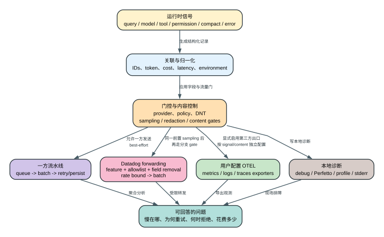

# Claude Code CLI 2.1.235 遥测、日志与诊断能力

本文只记录发布 bundle 中可以静态证实的客户端行为。它覆盖一方事件、OpenTelemetry、Datadog、GrowthBook、错误上报、Perfetto integration surface、启动/查询 profiling、本地 debug/diagnostic 日志，以及对应的门控、字段、队列、重试和隐私控制；“存在 Perfetto bridge”与“本版构造 recorder 并写出 trace 文件”明确分开。

如果你先要理解这些通道在整个请求生命周期中的位置，读 [技术架构导读](technical-architecture.md)；如果你在问 `request_id`、`cache_read_input_tokens`、`comparisonKey` 或 payload spread 是什么意思，读 [机器清单字段指南](inventory-field-guide.md)。

## 60 秒理解遥测通道

**读者问题：** 一次任务“很慢、反复重试、工具被拒绝而且 token 很贵”时，Claude Code 通过哪些通道记录原因；关闭一方遥测是否也会关闭管理员配置的 OTEL 或本地 debug？

**一句话模型：** 运行时先把 query、model、tool、permission、compact 和 error 信号用关联 ID、token、费用与时延字段归一化，再分别经过一方流量门、用户配置的 OTEL 出口和本地诊断路径；这些通道共享部分字段，但门控、目的地、内容控制和失败策略不同。



贯穿场景：一次模型请求首 token 慢，随后 Bash 等待权限，工具完成后又触发 compact。查询级 ID 把模型、permission、tool 和 compact timing 串起来；token/cache 字段解释成本；permission/hook 事件解释等待；一方事件可能被共享流量门和采样阻断，管理员显式启用的 OTEL 按自己的 exporter/content 设置发送，本地 debug/profile 按各自 consumer 记录。Perfetto 在本版只确认 bridge 与 env 读取，不能并入“已写现场文件”的结论。

| 通道 | 所有者/目的地 | 进入前的关键门 | 保留的主要语义 | 失败与隐私边界 |
| --- | --- | --- | --- | --- |
| 一方事件 | Anthropic event pipeline | provider、nonessential traffic、telemetry/policy、killswitch、sampling | 产品事件、环境、token/cost、错误和 timing | queue/batch/retry/persist；不是所有调用点都必然发送 |
| Datadog 分支 | 一方受控日志出口 | first-party、feature、allowlist、字段删除 | allowlist 事件和归一化 tags | 181 项 allowlist 与 26 个删除字段限制转发面 |
| 第三方 OTEL | 用户/管理员配置 exporter | `CLAUDE_CODE_ENABLE_TELEMETRY`、protocol/exporter、content controls | metrics、structured logs、traces | 与一方 telemetry 开关不是同一状态机 |
| 本地诊断 | 本地文件、stderr、profile；另有 Perfetto bridge surface | 对应 debug/profile 环境与运行模式 | 启动、查询阶段、内存/CPU、frame、原始诊断；Perfetto 仅确认 bridge | 不等于远端发送；Perfetto recorder/file 在本版仍是 Boundary，本地敏感材料仍需分别管理 |
| Error/GrowthBook | 专用上报或复用 transport | 登录、provider、feature、policy/compliance、独立关闭开关 | scrub 后异常或 experiment attributes | 各自有额外 gate，不能并入一个“遥测总开关” |

下面先给出机器覆盖，再按通道解释 queue、sampling、batch、retry、storage、auth fallback、字段删除和 prompt 正文门；数量用于证明覆盖，不替代每条通道的运行语义。

完整事件名、调用表达式、payload、环境 schema、默认值和消息模板不在本文手工复制。机器清单是最终证据：

- [一方事件 1,441 项](source-inventory/first-party-events.txt)
- [一方动态事件模板 3 项](source-inventory/first-party-event-templates.txt)
- [一方 `H`/`Fv` 调用点 2,194 项](source-inventory/first-party-event-callsites.jsonl)
- [一方事件到字段映射 1,441 行](source-inventory/first-party-event-fields.tsv)
- [一方事件 schema 34 字段](source-inventory/first-party-event-schema-fields.txt)
- [一方环境 schema 36 字段](source-inventory/first-party-environment-fields.txt)
- [OTEL structured events 26 项](source-inventory/third-party-otel-events.txt)
- [OTEL event 字段映射 26 行](source-inventory/third-party-otel-event-fields.tsv)
- [OTEL metrics 8 项](source-inventory/otel-metrics.tsv)
- [OTEL spans 10 项](source-inventory/otel-spans.txt)
- [OTEL `Nd` 调用点 52 项](source-inventory/otel-event-callsites.jsonl)
- [OTEL 环境变量 77 项](source-inventory/otel-environment-variables.txt)
- [全部环境访问点 2,548 项](source-inventory/environment-access-callsites.jsonl)
- [typed 环境 schema 842 项](source-inventory/environment-schema.jsonl)
- [观测环境 schema 71 项](source-inventory/observability-environment-schema.jsonl)
- [观测环境默认/fallback 23 项](source-inventory/observability-environment-defaults.jsonl)
- [Datadog allowlist 181 项](source-inventory/datadog-forwarded-events.txt)
- [Datadog tag 字段 34 项](source-inventory/datadog-tag-fields.txt)
- [Datadog 删除字段 26 项](source-inventory/datadog-redacted-fields.txt)
- [GrowthBook 事件字段 15 项](source-inventory/growthbook-event-fields.txt)
- [feature `et` 调用点 498 项](source-inventory/feature-flag-callsites.jsonl)
- [GrowthBook `CB` 调用点 12 项](source-inventory/growthbook-callsites.jsonl)
- [观测相关标识 149 项](source-inventory/observability-identifiers.txt)
- [观测模板 166 项](source-inventory/observability-templates.jsonl)
- [error 调用点 4,831 项](source-inventory/error-message-callsites.jsonl) 和 [模板参数 1,526 项](source-inventory/error-message-templates.jsonl)
- [diagnostic 调用点 5,403 项](source-inventory/diagnostic-message-callsites.jsonl) 和 [模板参数 4,438 项](source-inventory/diagnostic-message-templates.jsonl)

## 静态覆盖审计

format v5 提取器使用仓库内置 Acorn `8.15.0` 将完整 `extracted/cli.js` 解析为 AST，而不是依赖全局正则猜测 JavaScript 边界。它排除同名函数声明后，记录每个目标调用的 offset/line/column、所在函数和词法 scope、全部参数、事件名表达式、静态值或模板形状，并在同级或祖先作用域查找最近赋值。

调用覆盖为：`H` 2,162、`Fv` 32、`Nd` 52、`et` 498、`CB` 12。`H` 的第一个参数包含 2,119 个直接字符串、3 个模板、24 个 identifier、9 个 conditional 和 7 个 member/call；`Fv` 的 32 个均为直接字符串。动态/未解析表达式没有被丢弃，而是连同原表达式、长度、SHA-256、作用域解析结果和 unresolved 状态写入 JSONL。

一方和 OTEL payload 解析保留顶层 property、shorthand、computed key、spread，并递归展开能在作用域中解析的 identifier/object spread；不能静态求值的 spread 仍以原表达式和 unresolved 标志保留。`comparisonKey` / `comparisonValue` 是跨版本语义比较字段，line/offset 变化不会单独制造功能变化。

全词法审计还覆盖 260,838 次 quoted-string occurrence（85,095 个唯一值）和 30,114 次 template occurrence（25,187 个唯一值），其中 URL template 236、API/path template 119。过长、凭据形态或用户 home 形态内容只在清单中保留长度、SHA-256 和位置，canonical bundle 本身不改写。

## 通道总览

| 通道 | 默认目的地/出口 | 主要门控 | 数据形态 | 静态证据 |
| --- | --- | --- | --- | --- |
| 一方事件 | `https://api.anthropic.com/api/event_logging/v2/batch` | 一方 provider、共享非必要流量/遥测门、killswitch、采样 | `ClaudeCodeInternalEvent`、`GrowthbookExperimentEvent` 批量 JSON | `reverse/javascript/cli.readable.js` 77436-78100 |
| Datadog 日志 | `https://http-intake.logs.us5.datadoghq.com/api/v2/logs` | 仅一方 provider、`tengu_log_datadog_events`、181 项 allowlist | 归一化 JSON log | 同文件 90690-90900 |
| 第三方 OTEL metrics | console、OTLP、Prometheus | `CLAUDE_CODE_ENABLE_TELEMETRY` 和 exporter 配置 | 8 个 metric instruments | 同文件 361450-361710 |
| 第三方 OTEL logs | console、OTLP | 同上 | 26 个 structured events | 同文件 93720-94360、361450-361710 |
| 第三方 OTEL traces | console、OTLP | OTEL 总开关和 enhanced telemetry beta | 10 类 span | 同文件 93980-94360、361450-361710 |
| GrowthBook experiment | 复用一方批量 transport | GrowthBook/一方遥测门 | experiment/variation 和序列化 attributes | 同文件 77990-78060 |
| 错误上报 | bundle 中的错误上报客户端 | 一方 provider、登录状态、版本、feature、组织 policy、`DISABLE_ERROR_REPORTING` | 异常、上下文、经过 scrub 的属性 | 同文件 73690-73880 |
| Perfetto integration surface | 本版只观察到 env 读取、初始化 debug 消息和一组在 owner 非空时才工作的 span bridge；owner `l4` 在发布物可见路径中保持 `null` | `CLAUDE_CODE_PERFETTO_TRACE` 被读取，但未观察到 recorder 构造 | interaction、LLM、tool 等 bridge API 的声明/调用点 | 同文件 93980-94290；实际本地 trace 文件创建属于 Boundary |
| Profiling/diagnostics | 本地文件或 stderr/debug log | 对应 debug/profile 环境变量 | 启动 checkpoint、查询阶段、内存/CPU、frame timing、JSONL | 同文件 17097、267260-267390 |

## 共享隐私和流量门

`CLAUDE_CODE_DISABLE_NONESSENTIAL_TRAFFIC`、`DISABLE_TELEMETRY`、`DO_NOT_TRACK` 在 bundle 中先被归一化为共享流量级别。前者进入 `essential-traffic`，后两者进入 `no-telemetry`。一方事件通过该门禁用，GrowthBook 和多个非必要网络能力也复用相同判断。

`DISABLE_ERROR_REPORTING` 是独立的错误上报开关。错误上报还要求：

- provider 为 first-party；
- 当前认证/登录状态满足条件；
- 版本不低于内置最低版本；
- `tengu_orford_ness` feature gate 开启；
- 组织 policy 的 `allow_error_reporting` 允许；
- HIPAA/ZDR 等 compliance taint 不阻断；
- API key helper、环境 bearer token、无 scope OAuth 等路径通过单独判断。

第三方 OTEL 是用户/管理员显式配置的出口，以 `CLAUDE_CODE_ENABLE_TELEMETRY` 为总开关。它不等同于 Anthropic 一方事件通道。

环境访问不只做变量名集合：842 条 typed schema 由 `We.str/bool/triBool/int/enum` builder 恢复，类型分布为 string 423、boolean 277、integer 97、tri-state boolean 41、enum 4；其中 71 条属于观测面，类型分布为 string 38、boolean 18、integer 13、tri-state boolean 2。另有 2,548 个实际访问点、143 个动态 `process.env[...]` 和 23 个观测 fallback/default 表达式。每条记录都保留 builder/options、访问形式、动态 key 表达式和默认表达式，不能把 1,300 个环境形态标识全部误称为公开配置。

## 一方事件流水线

### 调用和排队

业务代码通过 `H(event, metadata)` 和 `Fv(event, metadata)` 记录同步/异步事件：

1. analytics sink 尚未安装时进入全局 FIFO；上限 1,000，满时删除最旧项并增加 dropped count。
2. sink 安装后用 microtask 排空全局队列。
3. 一方 logger provider 尚未初始化时进入第二层 `preInitQueue`；上限 1,024，超过上限的新事件不再加入。
4. provider 初始化完成后依序重新提交 pre-init 事件。
5. 运行中批量配置变化时，旧 provider 先 force-flush，再重建 provider；失败则恢复旧 provider/logger。

静态证据见 `reverse/javascript/cli.readable.js` 5310-5352、77970-78100。

### 采样

采样配置 key 为 `tengu_event_sampling_config`，按事件名查 `sample_rate`：

- 缺少配置、类型不对、超出 `[0,1]` 或等于 1：不额外采样，事件正常发送；
- `sample_rate <= 0`：丢弃；
- `0 < sample_rate < 1`：使用 `Math.random()` 判定；
- 被采中的事件会在 metadata 写入实际 `sample_rate`；
- 同一结果同时用于一方 transport 和 Datadog 分支。

### 批量、队列和默认值

远程配置 key 为 `tengu_1p_event_batch_config`。2.1.235 的内置默认值：

| 参数 | 默认值 |
| --- | ---: |
| provider flush interval | 10,000 ms |
| exporter max batch | 200 events |
| provider max queue | 8,192 events |
| HTTP request timeout | 10,000 ms |
| batch 间延迟 | 100 ms |
| 基础 backoff | 500 ms |
| 最大 backoff | 30,000 ms |
| exporter 实例内连续失败周期的最大 attempts | 8 |

endpoint 默认拼接为 `https://api.anthropic.com/api/event_logging/v2/batch`；staging base URL 会切到 staging，同样允许远程 batch config 覆盖 `baseUrl`、`path`、`skipAuth`、`maxAttempts`、batch 和 queue 参数。这里的 attempt counter 属于 exporter 实例当前连续失败周期：一次发送成功会清零，进程重启也会重建内存状态，因此不能解释成某个落盘 batch 跨启动累计最多重试八次。

### 失败持久化和重试

发送失败的剩余 batch 会落盘，文件命名形态为 `1p_failed_events.<session>.<run>.json`，位于 telemetry storage。启用 storage v5 时改用 `namespace=log`、`channel=telemetry`、带 `runId` 的 stream。

启动时会扫描同一 session 的前次 run：

- 旧 JSON batch 在后台重试；
- v5 会枚举历史 telemetry stream；
- legacy flat batch 可以迁移进 v5 stream，并用稳定 record ID 去重；
- 空 batch 删除；
- 当前 exporter 实例的连续失败计数达到上限时删除本轮仍未发送的遗留 batch；重新启动后会重新枚举落盘数据，但不会继承上个进程的内存 attempt counter；
- 部分发送成功时，只把未发送事件重新写回。

backoff 为二次增长：`base * attempts^2`，并限制在 500 ms 至 30 s。当前 batch 的文件/stream 修改通过 promise lock 串行化，避免同进程并发覆盖。

认证请求收到 HTTP 401 时，代码会用基础 headers、不带认证头重试一次。基础 headers 包含 `Content-Type`、`User-Agent` 和 `x-service-name: claude-code`。

### 一方 envelope 和可能字段

一方事件 schema 明确包含：

- event：`event_name`、`event_id`、client/server timestamp；
- session/model：`session_id`、`parent_session_id`、`agent_id`、`agent_type`、`model`、`betas`、entrypoint、client type；
- identity/auth：`device_id`、`email`、account UUID、organization UUID、client-reported auth；
- environment：platform、raw platform、arch、runtime、terminal、shell、package managers、CI、GitHub Actions、WSL、Linux distro/kernel、remote/container/session IDs、deployment environment、build/version；
- process：uptime、RSS、heap、external/arrayBuffers、CPU usage/percent/window 等序列化后放入 `process`；
- extensions：skill、plugin、marketplace、MCP server/tool、team、head SHA；
- event-specific metadata：清理保留字段后编码进 `additional_metadata`。

这表示 schema 具备承载这些字段的能力，不表示每个事件都会填满所有字段。旧式扁平映射 `first-party-event-fields.tsv` 中的 `<no-static-fields>` 只表示没有直接静态顶层字段；完整 `first-party-event-callsites.jsonl` 仍保留变量 payload、computed key、所有 spread、可展开对象、未解析表达式和函数作用域，不再要求靠手工回看 bundle 才知道表达式是什么。静态字符串原值若以空格或 tab 结尾，生成器会写成 `\x20`/`\t`，避免证据被 Git 尾随空白规则改变。

## Datadog 分支

Datadog 分支只在 `Gn() === "firstParty"` 时运行，并且同时要求：

- `tengu_log_datadog_events` feature key 开启；
- 事件名存在 181 项 allowlist；
- Datadog 初始化成功且没有 killswitch。

默认 batch 100，flush 15 s，HTTP timeout 5 s。请求使用内置 public client token 写入 US5 logs intake。

发送前执行的归一化和数据缩减：

- 删除 26 个字段，完整名单见 `datadog-redacted-fields.txt`；
- 34 个稳定字段被转换为 tag，完整名单见 `datadog-tag-fields.txt`；
- `mcp__*` 和动态 MCP tool 折叠成 `mcp`；
- `skill__*` 折叠成 `skill`，具体 skill feature 折叠成通用分类；
- 非 Claude model 不转发；Claude model 归一化到内置 catalog，否则记为 `other`；
- build version 去除临时 build/sha 尾缀；
- HTTP status 同时写入精确值和范围；
- peer-rate-bound 事件按 event/server 每分钟最多转发 10 条，并在下一条中报告中间 dropped 数；
- rate map 最多保留 200 个 key，超过时淘汰最旧 key。

Datadog 的 26 个删除字段不能被解释为整个 Claude Code 遥测系统的统一删除表，它只适用于这个 Datadog forwarding 分支。

## 第三方 OpenTelemetry

### Exporter 和协议

metrics exporter 支持 `console`、`otlp`、`prometheus`；logs 支持 `console`、`otlp`；traces 支持 `console`、`otlp`。OTLP 三类 signal 都支持：

- `grpc`
- `http/json`
- `http/protobuf`

global 与 signal-specific 的 endpoint、headers、protocol、certificate、client certificate/key、compression、timeout 均能从环境读取。完整 77 项见 `otel-environment-variables.txt`。

如果用户没有显式设置 `OTEL_EXPORTER_OTLP_METRICS_TEMPORALITY_PREFERENCE`，Claude Code 在 bootstrap 阶段把它设为 `delta`。显式配置不会被覆盖。

默认 force-flush timeout 为 5,000 ms，shutdown timeout 为 2,000 ms，可分别由 `CLAUDE_CODE_OTEL_FLUSH_TIMEOUT_MS`、`CLAUDE_CODE_OTEL_SHUTDOWN_TIMEOUT_MS` 调整。

traces 除总开关/exporter 外还需要 enhanced telemetry beta。内部 beta tracing 还存在 `BETA_TRACING_ENDPOINT` 委托出口，分别拼接 `/v1/traces` 和 `/v1/logs`。

### Metrics

2.1.235 静态恢复出 8 个 metric：active time、code-edit permission decision、commit count、cost、lines of code、pull request count、session count、token usage。名称、unit 和 description 的原值见 `otel-metrics.tsv`。

resource/attributes 可包含 service name/version、OS/arch、WSL、`OTEL_RESOURCE_ATTRIBUTES`，以及根据隐私配置选择的 user/session/account/entrypoint/version 字段。`OTEL_METRICS_INCLUDE_*` 有内置默认 map，不能把所有可选 attribute 当作默认发送字段。

### Structured logs/events

恢复出 26 个事件：API request/error/refusal/retries、assistant response、user prompt、tool/tool result/tool decision、system prompt、auth、compaction、MCP connection、hook lifecycle、plugin/skill、subagent、retention、feedback 等。逐事件字段见 `third-party-otel-event-fields.tsv`。

内容字段默认收缩：

- user prompt 默认写 `<REDACTED>`；
- `OTEL_LOG_USER_PROMPTS` 才记录 user prompt；
- `OTEL_LOG_ASSISTANT_RESPONSES` 控制 assistant content，并兼容 user-prompt 开关；
- `OTEL_LOG_TOOL_CONTENT` 控制 tool content；
- `OTEL_LOG_TOOL_DETAILS` 扩大 tool 细节；
- `OTEL_LOG_RAW_API_BODIES` 控制原始 API body。

内容长度取 `CLAUDE_CODE_OTEL_CONTENT_MAX_LENGTH`、通用 OTEL attribute limit、log-record attribute limit、span attribute limit 中的最小值。过长内容会被截断，不会因为单独提高其中一个限制就绕过其他限制。

### Prompt 正文门：官方、静态和运行结果如何对齐

当前官方 [Monitoring usage](https://code.claude.com/docs/en/monitoring-usage) 明确区分“发送 user-prompt event”和“发送 prompt 正文”：`OTEL_LOG_USER_PROMPTS` 默认关闭，`user_prompt` 在 gate 未开启时为 `<REDACTED>`。这两句话作为 `public.otel-prompt-redaction` 固定摘录；2.1.235 的 `<REDACTED>` 分支登记为 `telemetry.content-redaction`。

`probe.telemetry-otlp-redaction` 又把静态分支推进到 wire-level：脚本启动本地 `/v1/logs` HTTP/JSON collector，以相同二进制分别运行默认和 `OTEL_LOG_USER_PROMPTS=1` 两个输入。默认导出中存在 user-prompt event，`promptAttribute` 为 `<REDACTED>`，原 marker 不存在；显式开启后原 marker 出现在 collector payload。两次 CLI exit status 都是 0，collector 的 `Content-Type` 均为 `application/json`。

这意味着管理员开启 OTLP logs exporter 后，事件元数据可以默认离开本机，但 prompt 正文仍由单独的 content gate 控制。反过来，一旦开启正文 gate，prompt 会进入管理员指定 collector；这不是“只写本地 debug log”。该 Probe 不覆盖 `OTEL_LOG_RAW_API_BODIES`，后者范围更大，可能包含完整历史，必须单独审计。

同一官方页面还说明 signal-specific endpoint/protocol 覆盖 generic 值，signal-specific headers 与 generic headers 合并，对应 `public.otel-exporter-precedence`。这个规则解释了为什么排障时不能只看 `OTEL_EXPORTER_OTLP_ENDPOINT`：logs、metrics、traces 可能各自走向不同 collector，携带不同合并 header。

### Traces 和 Perfetto 关联

恢复出 10 个 span name：bash subprocess、compaction、hook、interaction、LLM request、MCP RPC、subagent spawn、tool、tool blocked-on-user、tool execution。

interaction、LLM 和 tool span 同时可以关联 Perfetto span ID。LLM 完成时会记录 TTFT、TTLT、prompt/output/cache token、success/error、request setup、attempt start、request ID 和 client request ID；permission unblock 会记录 decision/source。

## GrowthBook experiment events

`GrowthbookExperimentEvent` 复用一方 logger/exporter，不是单独 HTTP 客户端。静态字段包括 event/timestamp、experiment/variation、environment、device/session、account/org auth、serialized user attributes、experiment metadata，以及兼容字段 `variation_key`、`anonymous_id`、`client_reported_auth`、`event_metadata_vars`。

一方 logger 尚未初始化且 batch config 也未知时，GrowthBook 调用返回可接受状态；config 已知但 logger 不可用时返回失败状态，让上层决定是否重试/降级。

## 错误上报、debug 和本地诊断

除 analytics/OTEL 外，bundle 还包含以下可观察性面：

- error reporting：受 `DISABLE_ERROR_REPORTING`、provider、auth、组织 policy、compliance taint、版本和 feature key 多重门控；
- secret scrubber：内置 URL userinfo、JWT、Anthropic/OpenAI/GitHub/GitLab/AWS/GCP/Azure 等 credential-shaped pattern，用于日志/错误内容清理；
- debug log：`CLAUDE_DEBUG`、`DEBUG`、`CLAUDE_CODE_DEBUG_LOG_LEVEL`、`CLAUDE_CODE_DEBUG_LOGS_DIR`；
- diagnostics file：`CLAUDE_CODE_DIAGNOSTICS_FILE`；
- session/SDK/transcript recording：`CLAUDE_CODE_JSONL_TRANSCRIPT`、`CLAUDE_CODE_TEE_SDK_STDOUT`、terminal/PTY recording；`CLAUDE_CODE_SESSION_LOG` 在本版可见 consumer 中只写入 concurrent-session PID metadata 的 `logPath`，未证明它自己启动 recorder；
- frame/repaint timing：frame timing log、sample interval、debug repaints；
- OTEL diagnostics：`CLAUDE_CODE_OTEL_DIAG_STDERR`；
- startup profiling：`CLAUDE_CODE_PROFILE_STARTUP`；
- query profiling：`CLAUDE_CODE_PROFILE_QUERY=1`，记录 context loading、autocompact、query setup、tool schemas、normalization、client creation、network TTFB、tool execution，并关联内存快照；
- Perfetto integration：`CLAUDE_CODE_PERFETTO_TRACE` 被读取并写入初始化 debug 消息，bridge 在 `l4` 非空时才记录 span；本版未观察到 `l4` recorder 构造或本地 trace 文件输出，因此实际 recorder/文件属于 Boundary；
- heap/process telemetry：RSS、heap、external、array buffers、CPU、uptime 等。

消息面不是只保留去重后的 2,248 个 error literal 和 830 个 diagnostic literal：4,831 个 `Error`/`TypeError`/`RangeError` 调用、5,403 个 `T()` 调用，以及其中 1,526/4,438 个模板参数均带调用类型、位置、函数 scope、完整参数和稳定比较值。这样可以直接比较错误分支、插值参数和诊断上下文的版本变化。

这些本地文件类功能是否产生网络流量取决于具体后续 exporter/上传路径。仅看到 `DEBUG`、profile 或 diagnostics 标识，不能推断内容会自动上传。

## 审计和版本比较规则

后续版本必须重新运行：

```bash
python3 skill/claude-code-version-diff/scripts/extract_source_inventory.py .
python3 skill/claude-code-version-diff/scripts/validate_snapshot.py .
```

跨版本比较器会遍历 `analysis/source-inventory/summary.json` 中登记的 71 个文件，输出 count delta、added 和 removed。JSONL 优先比较 `comparisonKey` / `comparisonValue`，忽略纯 offset/line 漂移。任何新增 exporter、endpoint、event、field、redaction、metric、span、环境变量、feature gate、默认值、settings 字段、模型或消息模板都应先出现在机器清单，再更新本文的架构解释。

`summary.json` 的 completion audit 要求所有目标调用点、全部词法字符串/模板、动态表达式、根 settings 结构和模型目录均完成记录，且 `knownStaticExtractionGaps` 必须为空。不可恢复边界只剩发布产物本身不存在的内容：运行时远程配置/API/用户文件/环境值、服务端处理与风控规则，以及构建前被 minification、tree shaking 或缺失 source map 删除的信息。

本专题结构化主张包括 `telemetry.otel-gate-exporters`、`telemetry.content-redaction`、`public.otel-exporter-precedence`、`public.otel-prompt-redaction` 和 `probe.telemetry-otlp-redaction`。Probe 的命令、input、literal output、exit status 和字段读法见 [精确二进制运行证据指南](runtime-probe-index.md)。
