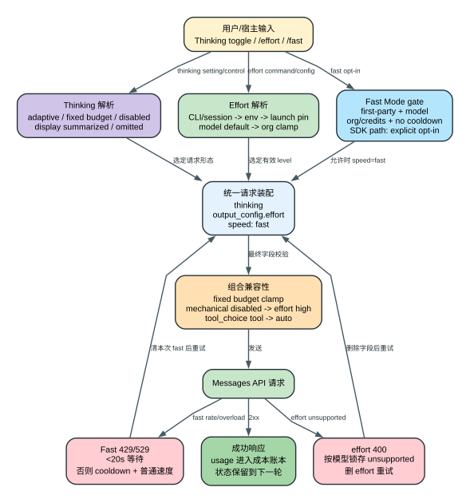

# Claude Code CLI 2.1.235 Thinking、Effort 与 Fast Mode：三条互相耦合但不等价的控制轴

Claude Code 的“想得更多”“输出更多”“返回更快”不是一个开关。2.1.235 至少同时维护三条控制轴：`thinking` 决定是否请求扩展思考以及采用 adaptive 还是固定 token budget；`effort` 决定模型在支持时采用哪一级工作强度；Fast Mode 决定请求是否携带 `speed: "fast"`，并受模型、组织、usage credits 和冷却状态约束。三者会在请求装配时互相校验，但各自拥有独立状态、失败回退和计费含义。

本文只描述 **2.1.235 发布 bundle 中能够恢复的客户端行为**。服务端如何实现 adaptive thinking、每一级 effort 实际改变了多少内部计算、Fast Mode 的实时容量和账号价格，属于服务端或账号状态 `Boundary`；本文会把客户端实际发送的字段、客户端本地估算和不可证明部分分开。

## 60 秒理解三条控制轴

**读者问题：** `/effort max`、Thinking mode 和 `/fast on` 到底分别改变什么，为什么界面显示已开启后请求仍可能降级？

**一句话模型：** Thinking 决定“有没有以及怎样组织扩展思考”，Effort 决定“模型按哪一级强度工作”，Fast Mode 决定“是否请求高速度服务通道”；请求构造器最后统一做模型能力、组织上限、环境变量、运行模式和服务端兼容性校验。



贯穿场景：用户在 Opus 5 会话中关闭 Thinking、设置 `/effort max`，再打开 `/fast on`。

1. Effort 解析器先把 `max` 写入 session state，但组织上限、模型能力和 `CLAUDE_CODE_EFFORT_LEVEL` 仍可能改变最终有效值。
2. Thinking 关闭后，请求构造器尝试发送 `{type:"disabled"}`；若这是机械关闭且 effort 高于 `high`，客户端会把 effort 压到 `high`，因为该组合会被 API 拒绝。
3. Fast Mode 需要 first-party provider、兼容模型、组织状态允许且不在 cooldown；Agent SDK 场景还要求 flag settings 显式 opt-in，交互式 `/fast on` 不以 SDK opt-in 为普遍前提。
4. 服务端若以 400 拒绝 `output_config.effort`，客户端为该模型锁存“不支持 effort”，删字段重试；这不会自动关闭 Thinking 或 Fast Mode。
5. Fast 请求若遇到较长 429/529，客户端关闭本次请求的 fast flag 并进入 cooldown；冷却结束后才重新发送 `speed:"fast"`。

| 控制轴 | 客户端拥有的状态 | 请求字段 | 主要 gate | 失败后的客户端动作 |
| --- | --- | --- | --- | --- |
| Thinking | `thinkingConfig`、`thinkingEnabled`、display | `thinking` | 模型 thinking/adaptive 能力、禁用环境变量、输出模式 | adaptive 改固定 budget、disabled 清洗、必要时省略字段 |
| Effort | `effortValue`、launch pin、org cap | `output_config.effort` | 模型 effort/max/xhigh 能力、组织上限、环境变量 | 400 后按模型锁存 unsupported，删字段重试 |
| Fast Mode | `fastMode`、org status、cooldown | `speed: "fast"` | first-party、模型、组织/credits、cooldown；SDK 另需 opt-in | 短限流等待；长限流进入 cooldown 并以普通速度重试 |

## 1. 先把五个容易混淆的量分开

| 量 | 它回答的问题 | 它不代表什么 |
| --- | --- | --- |
| `max_tokens` | 本次响应最多允许生成多少输出 token | 不等于 thinking budget，也不等于 effort |
| `thinking.type` | 请求是否启用 adaptive/fixed/disabled thinking | 不直接说明推理质量或服务端实际耗时 |
| `thinking.budget_tokens` | fixed thinking 路径最多预留多少 thinking token | adaptive 路径没有这个固定值 |
| `output_config.effort` | 支持该能力的模型采用哪个 effort level | 不是本地价格乘数，也不是 max output token |
| `speed: "fast"` | 请求高速度服务通道 | 不改变模型名称本身，也不保证服务端永不降速 |

`effort_cost_index` 也不能直接当作账单公式。它在本版的可达 consumer 是 effort 选择器里的“相对默认 effort 预计成本”提示，计算方式是 `selectedIndex / defaultIndex` [476816-476826](../reverse/javascript/cli.readable.js#L476816)、[476908-476921](../reverse/javascript/cli.readable.js#L476908)。真正的本地美元成本账本仍按 API 返回的 input/output/cache/web-search usage 和模型价格表计算，详见 [Usage、成本与额度专题](usage-cost-credits-and-limits.md)。

## 2. Thinking 的状态模型

### 2.1 三种请求形态

请求构造器最终可能形成三种 thinking 形态 [409474-409490](../reverse/javascript/cli.readable.js#L409474)：

```text
adaptive -> { type: "adaptive", display? }
fixed    -> { type: "enabled", budget_tokens, display? }
disabled -> { type: "disabled" }
```

客户端内部 fixed 配置使用 `budgetTokens`，真正写 API body 时转换为 `budget_tokens`。请求构造器实际执行 `Math.max(1024, Math.min(max_tokens - 1, requestedBudget))`。在本版 baked 模型的正常输出上限都大于 `1024` 时，它表现为最低 `1024`、最高 `max_tokens - 1`；但若内部调用方把 `maxTokensOverride` 强制到 `1024` 或更低，这个运算顺序会重新抬到 `1024`，客户端此处没有再次保证 `budget_tokens < max_tokens`。因此本文只把公式和正常模型路径列为 `Static`，不把极小 override 的请求合法性包装成已验证结论。

### 2.2 adaptive 的选择不是单看一个 setting

启用 thinking 后，客户端先检查模型是否支持 thinking，再检查 adaptive 能力 [71173-71203](../reverse/javascript/cli.readable.js#L71173)。实际分支是：

1. 模型或环境能力覆盖明确指定 adaptive/fixed 时，采用覆盖结果；
2. 模型目录标记 `adaptive_thinking` 时优先 adaptive；
3. `CLAUDE_CODE_DISABLE_ADAPTIVE_THINKING` 对特定 4.6 模型可迫使其回到 fixed；
4. 不走 adaptive 时使用模型默认 thinking budget，或使用调用方显式 `budgetTokens`；
5. 不支持 thinking 的模型不发送扩展 thinking 请求。

这意味着“Thinking mode 开启”只说明客户端愿意使用扩展 thinking，并不保证请求一定带 fixed `budget_tokens`。在新模型上更常见的是 `type:"adaptive"`。

### 2.3 `set_max_thinking_tokens` 的精确语义

SDK/thin-client control request 接受 `max_thinking_tokens` 和 `thinking_display`。校验要求 token 值只能是整数或 `null`，display 只能是 `summarized`、`omitted` 或 `null` [72388-72405](../reverse/javascript/cli.readable.js#L72388)、[601688-601706](../reverse/javascript/cli.readable.js#L601688)。映射器 `JZg` 的行为是 [603249-603258](../reverse/javascript/cli.readable.js#L603249)：

| 输入 | 结果 |
| --- | --- |
| `null` + 已有非 disabled 配置 | 保留原类型和 budget，只更新 display |
| `null` + 无已有配置 + display 有值 | 在 Thinking 总开关允许时创建 adaptive config |
| `0` | `{type:"disabled"}` |
| 正整数 | `{type:"enabled", budgetTokens:n, display}` |

这里没有把负整数提前拒绝为 schema error；后续请求构造的 `Math.max(1024, ...)` 会把 fixed budget 拉回固定下限。该值是否仍严格小于 `max_tokens` 还取决于输出上限是否大于 `1024`，文档和调用方不应利用这一实现细节传负值或极小 override。

### 2.4 Thinking 总开关与环境变量

`bDe()` 的总开关优先读取 `MAX_THINKING_TOKENS`：其解析结果大于 0 才视为开启；没有该环境变量时，`alwaysThinkingEnabled:false` 才关闭，其他情况默认开启 [71198-71205](../reverse/javascript/cli.readable.js#L71198)。另一个 `CLAUDE_CODE_DISABLE_THINKING` 在请求装配阶段直接把本次 thinking 判为关闭 [409474](../reverse/javascript/cli.readable.js#L409474)。

两个入口的层次不同：

- `MAX_THINKING_TOKENS` 参与产品层“Thinking 是否开启”的判断；
- `CLAUDE_CODE_DISABLE_THINKING` 是请求构造期的硬关闭；
- session control request 可以改变当前 `thinkingConfig`，但不能越过后者。

### 2.5 display 只控制可见形态，不是另一套推理

display 解析器会根据运行方式决定 `summarized`、`omitted` 或不写 [71146-71172](../reverse/javascript/cli.readable.js#L71146)：

- 交互式会话读取 `showThinkingSummaries`，开启时使用 `summarized`；
- 非交互 `text`，以及非 verbose 的 `json`，默认 `omitted`；
- exact-tools、转发 subagent text、async 等路径保留调用方显式选择；
- 非交互且没有显式 display 的普通路径会补 `omitted`。

display 影响 thinking 内容如何返回或展示，不应解读为模型没有执行 thinking。相反，`type:"disabled"` 才是明确请求关闭；而某些模型标记 `rejects_disabled_thinking` 时，客户端甚至不会发送 disabled 形态。

### 2.6 Thinking 对 `tool_choice` 的影响

当扩展 thinking 活跃时，显式 `tool_choice:{type:"tool",name:...}` 会被降为 `{type:"auto"}` [409488-409490](../reverse/javascript/cli.readable.js#L409488)。原因不是权限系统改变，而是 API 组合约束：客户端避免把“必须立即调用指定工具”和扩展 thinking 组合成不兼容请求。

这条降级会影响测试设计：若精确二进制 Probe 想强迫第一个响应调用某个工具，同时又让 thinking 开启，最终 wire body 不一定保留强制 tool choice。

## 3. Effort 的五级模型

2.1.235 的规范 level 顺序是：

```text
low < medium < high < xhigh < max
```

`med` 是 `medium` 的别名；`ultracode` 不是第六级 effort，它映射到 `xhigh`，并额外开启 dynamic workflow orchestration [94691-94715](../reverse/javascript/cli.readable.js#L94691)、[94850-94940](../reverse/javascript/cli.readable.js#L94850)。

### 3.1 模型能力不是统一布尔值

客户端分别判断三层能力 [94660-94708](../reverse/javascript/cli.readable.js#L94660)：

- `effort`：是否支持基础 low/medium/high；
- `max_effort`：是否允许 `max`；
- `xhigh_effort`：是否允许 `xhigh`。

能力来源可以是环境注入的模型 capability、baked model catalog、特定模型兼容规则或 provider 探测。老模型列表被明确排除。`CLAUDE_CODE_ALWAYS_ENABLE_EFFORT` 只强制基础 effort 判断，不会自动证明 `xhigh` 和 `max` 可用。

### 3.2 模型默认值和组织上限

模型目录可以提供 `default_effort`；没有时默认 `high` [94965-94970](../reverse/javascript/cli.readable.js#L94965)。组织模型策略还可以为某个 API model 提供 `maxEffortLevel`。选择超过上限时，客户端用 `MCe` 截到组织上限，并给出“using lower level”提示 [94725-94750](../reverse/javascript/cli.readable.js#L94725)。

最终规范化还有两条兜底：

- 模型不支持 `max` 时，`max` 回退 `high`；
- 模型不支持 `xhigh` 时，`xhigh` 回退 `high`。

因此 UI 中能输入某个字符串，不等于 wire request 一定发送同一字符串。

### 3.3 Effort 的真实优先级

`mQs` 先解析调用方/CLI effort，再读取 settings 中的 `ultracode` 或 `effortLevel` [94429-94434](../reverse/javascript/cli.readable.js#L94429)。真正求有效值的 `TX` 还会加入以下层次 [94795-94825](../reverse/javascript/cli.readable.js#L94795)：

```text
环境变量 CLAUDE_CODE_EFFORT_LEVEL
-> launch-effort pin
-> 当前 session effortValue
-> baked model default_effort
-> 模型能力与组织上限 clamp
```

这里最反直觉的是环境变量：`/effort` 仍可以更新 session state 或保存 user setting，但命令会明确提示 `CLAUDE_CODE_EFFORT_LEVEL=... overrides this session`。也就是说“设置写成功”和“当前请求采用该值”是两个不同结论。

### 3.4 launch-effort pin

Opus 4.7、Opus 4.8 和 Fable 5 存在 launch-effort pin。初始会话可以固定采用模型 launch default，直到交互式 `/effort` 操作把对应 `unpin...LaunchEffort` 状态写入存储 [94788-94818](../reverse/javascript/cli.readable.js#L94788)。

非交互命令若尝试改变被 pin 的 effort，会收到“run /effort ... in an interactive terminal to release the pin”。这解释了为什么相同配置在新启动会话和已交互调整过的会话中可能表现不同。

### 3.5 `/effort` 命令的持久化边界

交互命令可把 low/medium/high/xhigh 保存为 `userSettings.effortLevel`；`max` 是 session-scoped，因为 settings schema 只持久化客户端认可的常规字符串集合。远程 transport 还可能只能改本地 UI state，无法改变远端 process 的 effort，命令会附带说明 [94868-94945](../reverse/javascript/cli.readable.js#L94868)。

`auto` 清除显式 effort，重新回到环境变量、launch pin 和模型默认值。`ultracode` 始终是本 session 行为，并要求 workflows 可用、模型支持 xhigh、组织上限不低于 xhigh。

## 4. Effort 如何进入 Messages 请求

请求 builder 先复制 `CLAUDE_CODE_EXTRA_BODY.output_config`，再调用 `npT` 填 effort [409046-409054](../reverse/javascript/cli.readable.js#L409046)、[409468-409472](../reverse/javascript/cli.readable.js#L409468)：

1. 模型不支持 effort：删除已有 `output_config.effort`；
2. extra body 已显式给出 effort：保留，不再由 app state 覆盖；
3. app effort 是字符串：写入 `output_config.effort`，并加入对应 beta；
4. app effort 未设置：不写字段，但仍可能加入 per-turn effort beta，让中途 system statement 路径工作。

最终 body 的形态是：

```json
{
  "thinking": { "type": "adaptive" },
  "output_config": { "effort": "high" },
  "speed": "fast"
}
```

这三个字段并列，不互相包含 [409519-409531](../reverse/javascript/cli.readable.js#L409519)。

### 4.1 机械关闭 Thinking 时的 effort clamp

如果 `thinkingConfig` 是 `disabled` 且带 `mechanical:true`，API 又会拒绝高于 `high` 的 effort，客户端把 `xhigh/max` 压为 `high` [409488-409491](../reverse/javascript/cli.readable.js#L409488)。普通用户关闭 Thinking 和内部机械禁用路径需要区分：clamp 条件明确检查 `mechanical === true`。

### 4.2 400 兼容性回退是 session latch

服务端若返回可识别的 effort unsupported 400，客户端执行：

```text
记录该 model 不支持 effort
-> 删除 output_config.effort
-> 同一次逻辑请求重试
-> 本 session 后续请求继续省略该字段
```

对应分支位于 [409588-409592](../reverse/javascript/cli.readable.js#L409588)，latch 查询位于 [3784](../reverse/javascript/cli.readable.js#L3784)、[5210](../reverse/javascript/cli.readable.js#L5210)。它是兼容性回退，不代表用户设置被删除；换 session 或 reset latch 后仍可重新探测。

## 5. `effort_cost_index` 到底是什么意思

本版 baked catalog 对部分模型提供相对指数，例如：

| 模型 | low | medium | high | xhigh | max |
| --- | ---: | ---: | ---: | ---: | ---: |
| Sonnet 5 | 0.47 | 0.74 | 1.00 | 2.41 | 5.59 |
| Opus 4.8 | 0.72 | 0.90 | 1.00 | 1.65 | 1.88 |
| Opus 5 | 0.67 | 0.76 | 1.00 | 1.60 | 1.70 |
| Fable 5 | 0.60 | 0.77 | 1.00 | 1.74 | 1.91 |

目录和 schema 位于 [8033-8114](../reverse/javascript/cli.readable.js#L8033)。UI consumer 用“所选 level 指数 / 模型默认 level 指数”展示近似倍数。因此 Opus 4.7 默认 xhigh 时，选择 high 的相对提示要以 xhigh 为分母，而不是固定以 1.0 为分母。

这些指数没有进入 `BWs` 的本地账单公式，不能拿它乘 token 单价得出精确费用。它表达的是产品层预计相对成本，不是 API 计费合同。

## 6. Fast Mode 的资格检查

Fast Mode 的第一层硬门槛是 provider：`Mu()` 仅对 `firstParty` 返回 true，并允许 `CLAUDE_CODE_DISABLE_FAST_MODE` 关闭 [69186-69201](../reverse/javascript/cli.readable.js#L69186)。随后 `pK()` 依次检查 [69216-69258](../reverse/javascript/cli.readable.js#L69216)：

| gate | disabled reason | 用户看到的含义 |
| --- | --- | --- |
| 非 first-party | `not_first_party` | 只有直接 Anthropic API 支持 |
| 环境变量关闭 | `disabled_by_env` | Fast Mode 不可用 |
| 远端 kill switch | `unknown` | 使用远端配置消息或通用不可用 |
| 模型不在 allowlist | `model_not_allowed` | Opus 5 不在组织 allowed models |
| Agent SDK 未 opt-in | `sdk_opt_in_required` | SDK 不默认开启 |
| 组织状态尚未返回 | `pending` | 正在检查可用性 |
| 免费/评估账号 | `free` | 需要付费订阅或 credits |
| 组织偏好关闭 | `preference` | 组织禁用 |
| extra usage 关闭 | `extra_usage_disabled` | 需要 `/usage-credits` |
| 网络获取失败 | `network_error` | 使用缓存/猜测状态并提示网络问题 |

模型 gate 优先读取 baked `fast_mode` capability，也保留 Opus 4.8/Opus 5 字符串兼容路径 [69281-69295](../reverse/javascript/cli.readable.js#L69281)。

### 6.1 per-session opt-in 和 policy

`settings.fastMode:true` 并非所有组织都直接生效。若 `fastModePerSessionOptIn` 开启，只有 flag settings 的显式 opt-in 才能启用；policy 还可以强制每 session 重新 opt-in [69275-69279](../reverse/javascript/cli.readable.js#L69275)。SDK 场景也要求 flag settings 明确传入，避免宿主在不知情时承担更高 usage-credit 消耗。

### 6.2 `/fast on` 可能同时切模型

打开 Fast Mode 时，若当前 model 不支持 fast，客户端会把主模型切到 `opus`/Opus 5 别名，并清空 session-specific model override [364725-364742](../reverse/javascript/cli.readable.js#L364725)。关闭 Fast Mode 不会自动把模型切回先前模型。

这是一项用户可见副作用：`/fast on` 不只是一个 transport flag，也可能改变后续模型质量、上下文上限和普通速度下的价格基线。

## 7. 组织状态的预取、缓存和失败语义

启动阶段会后台调用 `/api/claude_code_penguin_mode` 读取组织 enabled/disabled 状态 [69456-69508](../reverse/javascript/cli.readable.js#L69456)。关键细节：

- 同时只允许一个 inflight prefetch；
- 30 秒内重复调用被抑制；
- OAuth 401 或特定 revoked 403 会刷新 token 后重试一次；
- 成功结果写入本地 `penguinModeOrgEnabled`，服务端关闭时还会删除 user `fastMode` setting；
- 网络失败不会覆盖一个已有的、非网络类 server disabled 结论；
- 没有认证材料时使用持久化状态做 guess，而不是声称已从服务端确认。

因此 `orgStatus.source` 的 `server` 与 `guess` 必须区分。UI 显示可用并不证明刚刚完成在线校验；反过来，网络错误也不应覆盖服务端已经明确下发的组织禁用。

## 8. Fast Mode 如何进入请求

只有下面条件同时成立才写 `speed:"fast"` [409491-409493](../reverse/javascript/cli.readable.js#L409491)：

```text
Fast Mode 代码路径可用
AND 组织/模型资格无 disabled reason
AND 当前不在 cooldown
AND 请求实际模型支持 fast
AND appState.fastMode 为 true
```

`QJ()` 对外报告的状态分三种：`off`、`on`、`cooldown` [69415-69422](../reverse/javascript/cli.readable.js#L69415)。这比一个布尔值更准确：用户仍然选择了 Fast Mode，但 cooldown 期间 wire request 不带 `speed:"fast"`。

## 9. 429/529 后的冷却状态机

Fast 请求遇到 429 或 overload 时，客户端先解析 retry-after [215649-215666](../reverse/javascript/cli.readable.js#L215649)：

1. retry-after 小于 20 秒：原地等待后继续 fast 请求；
2. 更长或缺失：进入 cooldown，时长取 `max(retryAfter 或 30 分钟, 10 分钟)`；
3. 当前 retry context 的 `fastMode` 设为 false，以普通速度继续；
4. cooldown 到期时惰性清除，并只记录一次“re-enabling fast mode”；
5. 模型切换会清空 cooldown，再根据新模型重新计算 fast 是否保留。

常量位于 [215906](../reverse/javascript/cli.readable.js#L215906)：短等待阈值 `20s`、缺省 cooldown `30min`、最小 cooldown `10min`。

如果响应携带 `anthropic-ratelimit-unified-overage-disabled-reason`，客户端走 usage-credit 拒绝分支而不是普通 cooldown。`out_of_credits`、`org_spend_cap_reached` 等只在当前 turn 弹一次通知；不属于临时额度耗尽的原因会删除 Fast Mode user setting，并把组织状态改为 `extra_usage_disabled` [69375-69413](../reverse/javascript/cli.readable.js#L69375)。

## 10. Fast Mode 的本地价格估算

普通模型价格来自 baked catalog。Fast Mode 对 Opus 4.8/Opus 5 使用独立本地费率 [69530-69621](../reverse/javascript/cli.readable.js#L69530)：

| 通道 | input / Mtok | output / Mtok | 5m cache write | 1h cache write | cache read |
| --- | ---: | ---: | ---: | ---: | ---: |
| 普通 Opus 4.8/5 catalog tier | $5 | $25 | $6.25 | $10 | $0.50 |
| `speed:"fast"` 本地估算 | $10 | $50 | $12.50 | $20 | $1.00 |

这套费率用于本地 session cost 和 max-budget 判断。usage credits 的服务端扣减、组织折扣和实际账单仍以服务端为准。客户端不会用 `effort_cost_index` 再乘一次 fast price。

## 11. 组合矩阵：哪些设置会互相影响

| 组合 | 2.1.235 行为 |
| --- | --- |
| adaptive thinking + high effort | 两个字段并列发送，模型支持时正常 |
| fixed thinking + max effort | fixed budget 受 `1024..max_tokens-1` 限制；effort 单独受 org/model cap |
| mechanical disabled thinking + xhigh/max | effort clamp 到 `high` |
| extended thinking + forced tool choice | tool choice 从指定 tool 降为 `auto` |
| Fast Mode + unsupported model | `/fast on` 可切到 Opus 5；直接请求则不写 speed |
| Fast Mode + cooldown | app setting 保持 true，wire request 不写 speed，状态显示 cooldown |
| effort 400 + Fast Mode | 删除 effort 重试；speed 可继续存在，除非同时触发 fast 限流 |
| `CLAUDE_CODE_EFFORT_LEVEL` + `/effort` | setting/session 可更新，但当前有效 effort 仍由 env 控制 |
| extra body 已写 effort | app effort 不覆盖；模型不支持时仍删除 |

## 12. 诊断顺序

当用户说“我已经打开了，为什么没生效”，按下面顺序查，不要只看 UI：

1. **确认实际 model/provider。** Fast 只认 first-party 和兼容模型；effort/thinking 也按规范化后的 model 检查。
2. **确认状态来源。** 分开读取 `thinkingConfig`、`effortValue`、`fastMode`、org status 和 cooldown。
3. **检查环境变量。** `CLAUDE_CODE_DISABLE_THINKING`、`CLAUDE_CODE_EFFORT_LEVEL`、`CLAUDE_CODE_DISABLE_FAST_MODE` 都能覆盖会话操作。
4. **检查组织策略。** `maxEffortLevel`、available models、Fast Mode preference/credits 是独立限制。
5. **查看 wire request。** verbose API detail 会显示 `thinking` 和 `output_config`；完整 request builder 决定是否有 `speed`。
6. **查看回退日志。** `tengu_effort_unsupported_retry` 表示 effort 被删后重试；`tengu_fast_mode_fallback_triggered` 表示进入 cooldown。
7. **不要把 UI cost index 当账单。** 用 `/usage`、SDK `get_session_cost/get_usage` 和 API usage 字段核对真实本地累计。

## 13. 用户影响

### 质量与延迟

- 更高 effort 通常允许模型投入更多工作，但 bundle 不能证明每一级固定增加多少推理 token；
- fixed thinking 明确占用 output budget 的一部分，adaptive 则由服务端决定；
- Fast Mode 优化服务速度，不等价于降低 effort；遇到容量问题会自动回普通速度。

### 成本

- thinking 产生的输出 usage 会进入 output token 计费；
- effort 的相对成本提示是估算，不是本地价格公式；
- Fast Mode 在本地价格表中对 Opus 4.8/5 采用约 2 倍的 input/output/cache 单价；
- cooldown 期间请求按非 fast 费率估算。

### 可恢复性

- effort unsupported latch 和 Fast cooldown 都是进程/session 运行状态，不会改写历史消息；
- `/effort` 的 user setting、launch unpin 和 `/fast` setting 可能持久化；
- 模型切换会清 Fast cooldown，并可能自动关/开 Fast Mode；
- 已完成的模型调用及工具副作用不会因后续降级而回滚。

## 14. 证据与边界

**Static 可证明：** level 集合、优先级、模型 capability、组织 clamp、thinking request 形态、fixed budget 上下界、request 字段、effort 400 latch、Fast Mode gate、组织预取、cooldown 常量和本地价格表。

**Boundary：**

- adaptive thinking 的服务端内部预算和推理算法；
- effort level 对具体任务质量、token 和延迟的真实分布；
- 某账号当前组织开关、usage credits 余额和远端 feature config；
- Fast Mode 的服务端调度、SLA、真实账单折扣；
- baked catalog 中未来模型条目是否在公开 2.1.235 发布环境中对所有账号可选。

## 15. 源码导航

| 机制 | readable JS |
| --- | --- |
| Thinking display、adaptive/disabled capability | [71146-71205](../reverse/javascript/cli.readable.js#L71146) |
| `set_max_thinking_tokens` 校验 | [72388-72405](../reverse/javascript/cli.readable.js#L72388) |
| Effort capability、组织上限、优先级 | [94660-94970](../reverse/javascript/cli.readable.js#L94660) |
| Effort UI 相对成本 consumer | [476816-476921](../reverse/javascript/cli.readable.js#L476816) |
| Thinking/Effort/Fast request assembly | [409468-409531](../reverse/javascript/cli.readable.js#L409468) |
| Effort unsupported 400 retry | [409588-409592](../reverse/javascript/cli.readable.js#L409588) |
| Fast Mode gate、org status、cooldown | [69186-69528](../reverse/javascript/cli.readable.js#L69186) |
| Fast 限流降级 | [215649-215666](../reverse/javascript/cli.readable.js#L215649) |
| `set_max_thinking_tokens` 到内部 config | [601688-601706](../reverse/javascript/cli.readable.js#L601688)、[603249-603258](../reverse/javascript/cli.readable.js#L603249) |
