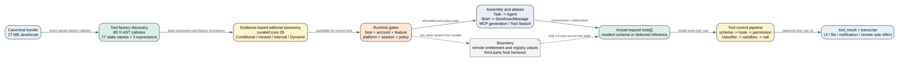

# Claude Code CLI 2.1.235 工具注册调用点、条件工具与宿主表面

**读者问题：** 为什么清单说 Claude Code 有 29 个内置工具，但源码里还能找到 `SendUserMessage`、`TaskStop`、`REPL`、`ReadMcpResourceTool`、`PushNotification`、`DesignSync` 和一组 self-hosted runner 工具？这些名字能否直接算成“模型当前可用工具”？

**一句话模型：** `2.1.235` 的 29 项清单是仓库人工维护、再与 bundle 静态 assignment 取交集的核心参考集合；Acorn 在 canonical bundle 中恢复的是 80 个 `Yi({...})` AST 注册调用点，其中 77 个调用点的 name 可直接静态解析、3 个保留动态 name expression。它们还要经过工厂调用、宿主、账号、feature、session、permission 和动态生成层，最终每次请求的 `tools[]` 才是模型真实看见的集合。

贯穿场景：用户用 `claude --brief` 启动一个终端会话。`SendUserMessage` 的直接 `Yi({...})` 注册定义已经随 bundle 发货，但仅有定义还不够；客户端先验证 brief entitlement，再把 `isBriefOnly` 写入 app state，工具装配器才把它加入当前 session。模型若只输出普通 assistant text，turn-end enforcement 会插入一次 meta reminder；真正进入用户主视图的是后续 `SendUserMessage` 调用。反过来，bundle 中的 `self_hosted_runner_spawn_local` 即使也有直接注册定义，在普通本地终端没有对应 hosted owner 时仍不会自动进入请求。

## 60 秒看懂四个数字

| 数字 | 它实际表示什么 | 不能推出什么 |
| ---: | --- | --- |
| 29 | 提取器维护的 core name allowlist 与 bundle 静态 assignment 的交集；`Task` 在对象层由 `Agent` alias 暴露 | 不是 `_Z()/j7()` 自动恢复出的完整主装配数组，也不是任意时刻的请求工具数 |
| 80 | Acorn 从 canonical bundle 中发现的同一 `Yi({...})` 工具工厂 AST 调用点 | 不是 80 个默认启用工具，也不等于运行时最终实例数 |
| 77 + 3 | 77 个静态可解析 name 调用点 + 3 个动态 name expression 调用点 | “动态表达式”不自动等于“最终名称不可恢复”；还要继续追工厂调用参数 |
| 22 | Desktop/Cowork workspace policy 的 `BUILTIN_TOOL_NAMES` 枚举 | 它是另一个宿主的 policy allow/ask/disable surface，不是终端注册表 |

`known-tool-catalog.txt` 又是更宽的词法 catalog，包含 MCP、兼容名称和内嵌文档；它适合找候选，不能当注册计数。`JavaScript` 出现在 workspace policy 枚举中，但本版终端对象层主要由 `REPL` 透明包装内层 JavaScript/browser/device tool；`WebBrowser` 也由浏览器宿主和 bridge 动态提供，而不是一个静态 `Yi({name:"WebBrowser"})` 对象。因此“字符串出现”“工具对象存在”“当前 request advertised”是三种不同证据。

## 一次工具从发布物走到模型需要七道门

| 阶段 | 所有者 | 状态变化 | 失败或缺席意味着什么 |
| --- | --- | --- | --- |
| 1. 注册定义 | bundle/tool factory | 固化或模板化 name、alias、schema、call、result mapper 和声明式能力 | AST 调用点只能证明代码随版本发货；工厂模板还需追调用参数 |
| 2. 人工产品归属 | CLI、Desktop/Cowork、hosted service、eval harness | 按 consumer 和 host 把调用点分到核心参考、条件 CLI、宿主产品、内部/评测或动态工厂 | 这是证据驱动的编辑分类，不是 bundle 自带 enum；不同宿主不能互相冒充可达性 |
| 3. enable gate | `isEnabled`、feature、env、账号、平台、session mode | 决定对象是否进入候选集合 | 远端 flag/entitlement 的实时值仍是 Boundary |
| 4. 装配和 alias | root tool surface、agent definition、MCP generation、alias map | 选择名称、兼容旧名并去重 | `Task -> Agent`、`Brief -> SendUserMessage` 不应重复计成功能 |
| 5. 请求驻留 | Tool Search、defer、prompt cache、request builder | 决定 schema 直接进 `tools[]`、延迟加载或不发送 | 对象存在不等于本次 request 常驻 schema |
| 6. 调用控制 | parse/schema/custom validation、Hook、permission、Auto Mode、sandbox | 决定是否允许执行以及是否改写 input | `isReadOnly`/`isConcurrencySafe` 是调度声明，不等于无用户可见副作用 |
| 7. result/persistence | tool call、result mapper、transcript、UI/host | 产生 `tool_result`、附件、通知、文件、远端任务或持久状态 | tombstone、abort、resume 不能撤销已完成的外部副作用 |

## 五类注册调用点怎样读

### Core terminal

这 29 项构成既有 `builtin-tools-reference.md` 的人工维护核心合同。它们覆盖文件、搜索、shell、Web、Plan、Task、Cron、Skill、Workflow、Artifact、LSP 和协作消息。提取器不是从 `_Z()/j7()` 自动推导这 29 项，而是用维护的 name allowlist 与 bundle 静态 assignment 取交集；因此它适合保证跨版本参考集合稳定，不应被包装成源码天然给出的“全部主终端装配”。对象名 `Agent` 通过 alias `Task` 对外兼容，所以核心参考保留 `Task`，注册表保留真实对象名和 alias；两者不是矛盾，也不能计成两个工具。

### Conditional CLI

这些对象由本地 CLI 实现，但只在特定模式出现。例如 Brief、Structured Output、Tool Search、MCP resource、REPL、后台通知、memory tool、feedback、goal、connector suggestion 和 PowerShell。它们必须有本版 consumer 和 gate 才能写成客户端机制；账号 entitlement、远端 MCP registry 内容或 hosted upload 成功仍要单列 Boundary。

### Hosted/product

这些对象的 JavaScript wrapper 随同发布，但 owner 可能是 onboarding host、Claude Design/Projects、团队文件通道或 self-hosted runner 管理面。wrapper 能证明输入校验、客户端 permission、请求字段和错误映射；不能证明用户账号拥有对应产品、远端 API 可用、runner 已注册或服务端真的执行成功。

### Internal/eval

`ReportFindings`、`TestingPermission`、`ObserverReport` 和 generic `mcp` wrapper 服务于评测、观察、权限测试或动态协议适配。它们是可恢复代码，不应从清单删除；但也不能被 README 包装成普通用户默认工具。

### Dynamic factory

三条动态 name expression 不是同一种动态性：

1. `CZS(e)` 使用 ``eval_registered__${e.name}``。它的名称和数量取决于运行时 eval registry；只有 registry 输入或 request Probe 能证明最终 schema。
2. `k0f(e)` 透传 `e.name`，但本版调用参数可静态追到 `ListPlugins`、`ListSkills`。
3. `R0f(e)` 同样透传 `e.name`，本版调用参数可静态追到 `SearchPlugins`、`SearchSkills`。

结构化 inventory 选择记录工厂函数体里的 3 个 `Yi({...})` AST 调用点，不执行跨函数调用图，所以后两行仍保留 `e.name`。人类分析必须继续追 `BWa/UWa/jWa/zWa` 的常量参数，不能把“提取器保留动态表达式”误写成“四个最终名称只能靠运行时 registry”。只有 eval factory 保持真正的运行时名称/基数 Boundary。

## 动态注册和内层工具为什么不能靠名字计数

`REPL` 是透明 wrapper：外层 request 可以看到 `REPL`，执行期间事件会再携带 `inner_tool_name`、`inner_tool_input` 和 `inner_tool_use_id`。JavaScript、browser/device tool 因宿主能力和 session 状态被注入内层 registry；它们不一定各自对应一个静态 `Yi` 对象。MCP 同样会把 server tools 转成运行时对象，并随 generation、连接状态和 Tool Search cache 失效而变化。

所以跨版本比较需要同时比较：

1. 直接注册调用点、工厂模板、工厂调用参数与 alias；
2. 每个对象新增/删除的 gate、permission、defer、read-only、concurrency 和 result contract；
3. 真实装配函数怎样选择 host/session tools；
4. exact-binary request 中实际 advertised schema；
5. 动态 registry 的 Boundary，而不是把本次运行值固化成版本事实。

## 80/80 `Yi({...})` 注册调用点精确归属

“注册声明信号”只说明该调用点传入的对象字面量实现了对应方法，例如 `gate` 表示声明 `isEnabled`；它不表示方法在当前状态返回 `true`。表内每个注册键都直接来自 `analysis/source-inventory/tool-registrations.jsonl`，顺序与 canonical AST 定义顺序一致。`Dynamic factory` 行按工厂模板计数，不按工厂被调用后产生的具体名称计数；五类与 29/28/16/4/3 是本文基于 consumer/host 的人工归属，不是发布物自带分类字段。

<!-- TOOL_REGISTRATION_COVERAGE_BEGIN -->
| 注册键 | 名称与 alias | 人工分类 | 注册声明信号 | 深读入口 |
| --- | --- | --- | --- | --- |
| `toolRegistration:ListMcpResourcesTool:1` | `ListMcpResourcesTool`; alias `ListMcpResources` | `Conditional CLI` | defer, read-only, concurrent | [Connector/Catalog/MCP Operator](connectors-catalog-and-mcp-operators.md) |
| `toolRegistration:StructuredOutput:1` | `StructuredOutput`; alias - | `Conditional CLI` | gate, permission, read-only, concurrent | [Structured Output](structured-output-and-schema-contract.md) |
| `toolRegistration:Edit:1` | `Edit`; alias - | `Core terminal` | permission | [核心工具](builtin-tools-reference.md) |
| `toolRegistration:Write:1` | `Write`; alias - | `Core terminal` | permission | [核心工具](builtin-tools-reference.md) |
| `toolRegistration:Glob:1` | `Glob`; alias - | `Core terminal` | permission, read-only, concurrent | [核心工具](builtin-tools-reference.md) |
| `toolRegistration:Grep:1` | `Grep`; alias - | `Core terminal` | permission, read-only, concurrent | [核心工具](builtin-tools-reference.md) |
| `toolRegistration:NotebookEdit:1` | `NotebookEdit`; alias - | `Core terminal` | permission, defer | [核心工具](builtin-tools-reference.md) |
| `toolRegistration:ToolSearch:1` | `ToolSearch`; alias - | `Conditional CLI` | gate, read-only, concurrent | [MCP/Agent](mcp-agents-background.md) |
| `toolRegistration:WebFetch:1` | `WebFetch`; alias - | `Core terminal` | gate, permission, defer, read-only, concurrent | [核心工具](builtin-tools-reference.md) |
| `toolRegistration:ExitPlanMode:1` | `ExitPlanMode`; alias - | `Core terminal` | gate, permission, dialog, defer, read-only, concurrent | [Plan Mode 与人工审批](plan-mode-and-human-approval.md) |
| `toolRegistration:AskUserQuestion:1` | `AskUserQuestion`; alias - | `Core terminal` | gate, permission, dialog, read-only, concurrent | [Plan Mode 与人工审批](plan-mode-and-human-approval.md) |
| `toolRegistration:EnterPlanMode:1` | `EnterPlanMode`; alias - | `Core terminal` | gate, defer, read-only, concurrent | [Plan Mode 与人工审批](plan-mode-and-human-approval.md) |
| `toolRegistration:Skill:1` | `Skill`; alias - | `Core terminal` | gate, permission | [核心工具](builtin-tools-reference.md) |
| `toolRegistration:Workflow:1` | `Workflow`; alias `RunWorkflow` | `Core terminal` | gate, permission | [核心工具](builtin-tools-reference.md) |
| `toolRegistration:Agent:1` | `Agent`; alias `Task` | `Core terminal` | permission, read-only, concurrent | [核心工具](builtin-tools-reference.md) |
| `toolRegistration:ReadNotifications:1` | `ReadNotifications`; alias - | `Conditional CLI` | gate, read-only, concurrent | [Remote/Runner/Notifications](remote-routines-runner-and-notifications.md) |
| `toolRegistration:ShowOnboardingRolePicker:1` | `ShowOnboardingRolePicker`; alias - | `Hosted/product` | gate, permission, dialog, read-only, concurrent | [Onboarding/Trust](onboarding-workspace-trust-and-safe-startup.md) |
| `toolRegistration:TaskStop:1` | `TaskStop`; alias `KillShell`, `KillBash` | `Conditional CLI` | defer, concurrent | [后台/Channels](cloud-background-channels.md) |
| `toolRegistration:SendUserMessage:1` | `SendUserMessage`; alias `Brief` | `Conditional CLI` | gate, brief, read-only, concurrent | [Brief 输出](brief-mode-and-user-visible-output.md) |
| `toolRegistration:{"expressions":["e.name"],"kind":"template","shape":"eval_registered__${}"}:1` | dynamic `eval_registered__${name}` | `Dynamic factory` | gate, permission, read-only, concurrent | [动态与边界](#动态注册和内层工具为什么不能靠名字计数) |
| `toolRegistration:REPL:1` | `REPL`; alias - | `Conditional CLI` | gate, permission, read-only, concurrent | [REPL 程序化工具运行时](repl-programmatic-tool-runtime.md) |
| `toolRegistration:ScheduleWakeup:1` | `ScheduleWakeup`; alias - | `Conditional CLI` | permission, defer | [后台/Channels](cloud-background-channels.md) |
| `toolRegistration:TaskOutput:1` | `TaskOutput`; alias `AgentOutputTool`, `BashOutputTool`, `AgentOutput`, `BashOutput` | `Core terminal` | gate, defer, read-only, concurrent | [核心工具](builtin-tools-reference.md) |
| `toolRegistration:WebSearch:1` | `WebSearch`; alias - | `Core terminal` | gate, permission, defer, read-only, concurrent | [核心工具](builtin-tools-reference.md) |
| `toolRegistration:ReportFindings:1` | `ReportFindings`; alias - | `Internal/eval` | read-only, concurrent | [工具/权限](tools-permissions-hooks.md) |
| `toolRegistration:TodoWrite:1` | `TodoWrite`; alias - | `Core terminal` | gate, permission, defer | [核心工具](builtin-tools-reference.md) |
| `toolRegistration:TestingPermission:1` | `TestingPermission`; alias - | `Internal/eval` | gate, permission, read-only, concurrent | [工具/权限](tools-permissions-hooks.md) |
| `toolRegistration:memory_list:1` | `memory_list`; alias - | `Conditional CLI` | gate, defer, read-only, concurrent | [Session/Memory](sessions-checkpoints-memory.md) |
| `toolRegistration:memory_read:1` | `memory_read`; alias - | `Conditional CLI` | gate, defer, read-only, concurrent | [Session/Memory](sessions-checkpoints-memory.md) |
| `toolRegistration:memory_write:1` | `memory_write`; alias - | `Conditional CLI` | gate, permission, defer | [Session/Memory](sessions-checkpoints-memory.md) |
| `toolRegistration:SendFeedback:1` | `SendFeedback`; alias - | `Conditional CLI` | gate, permission, read-only, concurrent | [后台模型任务](background-model-tasks-and-memory-consolidation.md) |
| `toolRegistration:LSP:1` | `LSP`; alias - | `Core terminal` | gate, permission, defer, read-only, concurrent | [核心工具](builtin-tools-reference.md) |
| `toolRegistration:RefreshMcpTools:1` | `RefreshMcpTools`; alias - | `Conditional CLI` | gate, read-only, concurrent | [Connector/Catalog/MCP Operator](connectors-catalog-and-mcp-operators.md) |
| `toolRegistration:ReadMcpResourceDirTool:1` | `ReadMcpResourceDirTool`; alias `ReadMcpResourceDir` | `Conditional CLI` | defer, read-only, concurrent | [Connector/Catalog/MCP Operator](connectors-catalog-and-mcp-operators.md) |
| `toolRegistration:ReadMcpResourceTool:1` | `ReadMcpResourceTool`; alias `ReadMcpResource` | `Conditional CLI` | defer, read-only, concurrent | [Connector/Catalog/MCP Operator](connectors-catalog-and-mcp-operators.md) |
| `toolRegistration:WaitForMcpServers:1` | `WaitForMcpServers`; alias - | `Conditional CLI` | gate, permission, read-only, concurrent | [Connector/Catalog/MCP Operator](connectors-catalog-and-mcp-operators.md) |
| `toolRegistration:EnterWorktree:1` | `EnterWorktree`; alias - | `Core terminal` | permission, defer | [核心工具](builtin-tools-reference.md) |
| `toolRegistration:ExitWorktree:1` | `ExitWorktree`; alias - | `Core terminal` | defer | [核心工具](builtin-tools-reference.md) |
| `toolRegistration:TaskCreate:1` | `TaskCreate`; alias - | `Core terminal` | gate, defer, concurrent | [核心工具](builtin-tools-reference.md) |
| `toolRegistration:TaskGet:1` | `TaskGet`; alias - | `Core terminal` | gate, defer, read-only, concurrent | [核心工具](builtin-tools-reference.md) |
| `toolRegistration:TaskUpdate:1` | `TaskUpdate`; alias - | `Core terminal` | gate, defer, concurrent | [核心工具](builtin-tools-reference.md) |
| `toolRegistration:TaskList:1` | `TaskList`; alias - | `Core terminal` | gate, defer, read-only, concurrent | [核心工具](builtin-tools-reference.md) |
| `toolRegistration:CronCreate:1` | `CronCreate`; alias - | `Core terminal` | gate, permission, defer | [核心工具](builtin-tools-reference.md) |
| `toolRegistration:CronDelete:1` | `CronDelete`; alias - | `Core terminal` | gate, defer | [核心工具](builtin-tools-reference.md) |
| `toolRegistration:CronList:1` | `CronList`; alias - | `Core terminal` | gate, defer, read-only, concurrent | [核心工具](builtin-tools-reference.md) |
| `toolRegistration:self_hosted_runner_get_pool:1` | `self_hosted_runner_get_pool`; alias - | `Hosted/product` | defer, read-only, concurrent | [Remote/Runner/Notifications](remote-routines-runner-and-notifications.md) |
| `toolRegistration:self_hosted_runner_list_sessions:1` | `self_hosted_runner_list_sessions`; alias - | `Hosted/product` | defer, read-only, concurrent | [Remote/Runner/Notifications](remote-routines-runner-and-notifications.md) |
| `toolRegistration:self_hosted_runner_list_runners:1` | `self_hosted_runner_list_runners`; alias - | `Hosted/product` | defer, read-only, concurrent | [Remote/Runner/Notifications](remote-routines-runner-and-notifications.md) |
| `toolRegistration:self_hosted_runner_list_secrets:1` | `self_hosted_runner_list_secrets`; alias - | `Hosted/product` | defer, read-only, concurrent | [Remote/Runner/Notifications](remote-routines-runner-and-notifications.md) |
| `toolRegistration:self_hosted_runner_read_health:1` | `self_hosted_runner_read_health`; alias - | `Hosted/product` | defer, read-only, concurrent | [Remote/Runner/Notifications](remote-routines-runner-and-notifications.md) |
| `toolRegistration:self_hosted_runner_read_metrics:1` | `self_hosted_runner_read_metrics`; alias - | `Hosted/product` | defer, read-only, concurrent | [Remote/Runner/Notifications](remote-routines-runner-and-notifications.md) |
| `toolRegistration:self_hosted_runner_requeue_session:1` | `self_hosted_runner_requeue_session`; alias - | `Hosted/product` | permission, defer, read-only | [Remote/Runner/Notifications](remote-routines-runner-and-notifications.md) |
| `toolRegistration:self_hosted_runner_spawn_local:1` | `self_hosted_runner_spawn_local`; alias - | `Hosted/product` | permission, defer, read-only | [Remote/Runner/Notifications](remote-routines-runner-and-notifications.md) |
| `toolRegistration:self_hosted_runner_tail_log:1` | `self_hosted_runner_tail_log`; alias - | `Hosted/product` | defer, read-only, concurrent | [Remote/Runner/Notifications](remote-routines-runner-and-notifications.md) |
| `toolRegistration:RemoteTrigger:1` | `RemoteTrigger`; alias - | `Conditional CLI` | gate, permission, defer, read-only, concurrent | [Remote/Runner/Notifications](remote-routines-runner-and-notifications.md) |
| `toolRegistration:SearchMcpRegistry:1` | `SearchMcpRegistry`; alias - | `Conditional CLI` | gate, defer, read-only, concurrent | [Connector/Catalog/MCP Operator](connectors-catalog-and-mcp-operators.md) |
| `toolRegistration:SuggestConnectors:1` | `SuggestConnectors`; alias - | `Conditional CLI` | gate, defer, read-only, concurrent | [Connector/Catalog/MCP Operator](connectors-catalog-and-mcp-operators.md) |
| `toolRegistration:ListConnectors:1` | `ListConnectors`; alias - | `Conditional CLI` | gate, defer, read-only, concurrent | [Connector/Catalog/MCP Operator](connectors-catalog-and-mcp-operators.md) |
| `toolRegistration:{"expression":"e.name","kind":"member-or-call"}:1` | factory `e.name` #1；本版调用展开为 `ListPlugins` / `ListSkills` | `Dynamic factory` | gate, defer, read-only, concurrent | [Connector/Catalog/MCP Operator](connectors-catalog-and-mcp-operators.md) |
| `toolRegistration:{"expression":"e.name","kind":"member-or-call"}:2` | factory `e.name` #2；本版调用展开为 `SearchPlugins` / `SearchSkills` | `Dynamic factory` | gate, defer, read-only, concurrent | [Connector/Catalog/MCP Operator](connectors-catalog-and-mcp-operators.md) |
| `toolRegistration:SuggestPluginInstall:1` | `SuggestPluginInstall`; alias - | `Conditional CLI` | gate, defer, read-only, concurrent | [Connector/Catalog/MCP Operator](connectors-catalog-and-mcp-operators.md) |
| `toolRegistration:SuggestSkills:1` | `SuggestSkills`; alias - | `Conditional CLI` | gate, defer, read-only, concurrent | [Connector/Catalog/MCP Operator](connectors-catalog-and-mcp-operators.md) |
| `toolRegistration:SendUserFile:1` | `SendUserFile`; alias - | `Conditional CLI` | gate, brief, read-only, concurrent | [Brief 输出](brief-mode-and-user-visible-output.md) |
| `toolRegistration:propose_skills:1` | `propose_skills`; alias - | `Conditional CLI` | gate, read-only, concurrent | [Plugin/Skill](plugins-skills-commands-lsp.md) |
| `toolRegistration:ProposeGoal:1` | `ProposeGoal`; alias - | `Conditional CLI` | gate, defer, read-only, concurrent | [Active Goal](active-goal-and-stop-loop.md) |
| `toolRegistration:PushNotification:1` | `PushNotification`; alias - | `Conditional CLI` | gate, defer, read-only, concurrent | [后台/Channels](cloud-background-channels.md) |
| `toolRegistration:DesignSync:1` | `DesignSync`; alias - | `Hosted/product` | gate, permission, defer, read-only, concurrent | [Workflow/Artifact/Design](workflow-artifact-design.md) |
| `toolRegistration:ClaudeDesign:1` | `ClaudeDesign`; alias - | `Hosted/product` | gate, permission, read-only, concurrent | [ClaudeDesign 与 Projects](claude-design-and-projects.md) |
| `toolRegistration:Projects:1` | `Projects`; alias - | `Hosted/product` | gate, read-only, concurrent | [ClaudeDesign 与 Projects](claude-design-and-projects.md) |
| `toolRegistration:EndConversation:1` | `EndConversation`; alias - | `Hosted/product` | gate, permission, defer, read-only, concurrent | [EndConversation 风控状态机](end-conversation-risk-control.md) |
| `toolRegistration:ObserverReport:1` | `ObserverReport`; alias - | `Internal/eval` | gate, permission, read-only | [工具/权限](tools-permissions-hooks.md) |
| `toolRegistration:SendMessage:1` | `SendMessage`; alias - | `Core terminal` | permission, defer, read-only | [核心工具](builtin-tools-reference.md) |
| `toolRegistration:SendFile:1` | `SendFile`; alias - | `Hosted/product` | gate, permission, defer, read-only, concurrent | [后台/Channels](cloud-background-channels.md) |
| `toolRegistration:Artifact:1` | `Artifact`; alias - | `Core terminal` | gate, permission, brief, defer, read-only, concurrent | [核心工具](builtin-tools-reference.md) |
| `toolRegistration:ListAgents:1` | `ListAgents`; alias `ListPeers` | `Conditional CLI` | gate, read-only, concurrent | [后台/Channels](cloud-background-channels.md) |
| `toolRegistration:ShareOnboardingGuide:1` | `ShareOnboardingGuide`; alias - | `Hosted/product` | gate, read-only, concurrent | [Onboarding/Trust](onboarding-workspace-trust-and-safe-startup.md) |
| `toolRegistration:PowerShell:1` | `PowerShell`; alias - | `Conditional CLI` | gate, permission, read-only, concurrent | [工具控制](tools-permissions-hooks.md) |
| `toolRegistration:Read:1` | `Read`; alias - | `Core terminal` | permission, read-only, concurrent | [核心工具](builtin-tools-reference.md) |
| `toolRegistration:mcp:1` | `mcp`; alias - | `Internal/eval` | permission | [MCP/Agent](mcp-agents-background.md) |
| `toolRegistration:Bash:1` | `Bash`; alias - | `Core terminal` | permission, read-only, concurrent | [核心工具](builtin-tools-reference.md) |
<!-- TOOL_REGISTRATION_COVERAGE_END -->

## 成本、隐私与风控影响

- 多一个注册调用点或工厂模板本身不增加 token；只有具体 schema 被装配进 request 才占上下文。Tool Search/defer 可以降低常驻 schema token，但会增加发现步骤和 cache invalidation 复杂度。
- `isReadOnly` 描述工具对其主要业务资源的写入语义，不代表没有日志、遥测、notification、upload 或用户可见输出。`SendUserMessage`、`PushNotification` 和 read-only hosted query 都可能产生网络或呈现副作用。
- `isConcurrencySafe` 只允许调度器与其他 safe tool 重叠；permission、Hook、sandbox 和 host API 仍可失败。多个“safe”远端查询也会叠加延迟、额度和隐私暴露。
- hosted/connector/MCP tool 的 input 与 result 可能进入 transcript、remote service、Hook 和 telemetry；具体内容控制要回到对应专题，不能由注册表字段推断。
- alias 兼容会让日志、permission rule、旧 transcript 与新 UI 名称不一致。排障时应先 canonicalize alias，再按 `tool_use_id` 配对结果。

## 证据边界

| 结论 | 证据 | 强度 |
| --- | --- | --- |
| canonical bundle 有 80 个同工厂 `Yi({...})` AST 注册调用点 | `analysis/source-inventory/tool-registrations.jsonl`；factory 由 Bash/Read/Write/Edit/Glob/Grep 六锚点发现 | Static structured；计数单位是调用点，不是运行时实例 |
| 77 个静态 name 调用点、3 个动态 name expression 调用点 | `summary.json.coverage.toolRegistrations` | Static structured；动态表达式仍需继续追调用图 |
| 两个 `e.name` 工厂在本版展开为四个固定名称 | 常量 `reverse/javascript/cli.readable.js:155538-155542`；调用 `299200-299291` | Static consumer；`ListPlugins`、`ListSkills`、`SearchPlugins`、`SearchSkills` |
| `Brief -> SendUserMessage`、`Task -> Agent` 等 alias | 注册对象 aliases 与 `reverse/javascript/cli.readable.js:40008` | Static consumer/compatibility |
| 22 项 workspace policy 名称 | `reverse/javascript/cli.readable.js:622428-622429` | Static declaration；仅证明该宿主 policy surface |
| 当前一次 request 的真实工具集合 | request body 或 exact-binary Probe | Probe；随账号、feature、MCP、host 和 session 变化 |
| 服务端动态 tool、connector 内容和 entitlement | bundle 不携带实时值 | Boundary |

这份表修正的是“工具数量”口径：29 是人工维护的核心参考合同，80 是 AST 注册调用点合同，运行时 request 是状态相关合同。三层都保留后，跨版本才能回答“新增了直接调用点”“改变了工厂展开或 gate”“只是换了 alias”还是“真实请求表面改变了”。
