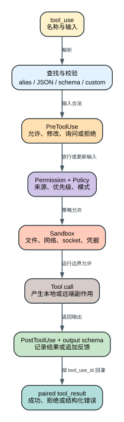

# Claude Code CLI 2.1.235 工具、权限与 Hooks：一次动作为什么要经过十几道关卡

模型生成 `tool_use` 只是在申请执行一个动作，不等于动作已经获准。Claude Code 2.1.235 会把模型给出的名称和 JSON input 依次送入工具查找、schema、自定义校验、hook、permission/policy、sandbox、实际调用和输出校验。每一层管理不同风险，失败也必须转换成模型能理解的 `tool_result`，否则 Agent Loop 会得到一段断裂历史。

本章解释客户端本地执行控制面。它不声称恢复 Anthropic 服务端账户风控、abuse score 或封禁规则；发布 bundle 没有这些服务端内部实现证据。

## 60 秒理解动作控制

**读者问题：** 为什么模型明明“决定执行 Bash”，用户仍可能看到审批、hook 拒绝、sandbox 错误，或者工具失败后模型还能继续回答？

**一句话模型：** `tool_use` 只是动作提案；客户端必须先证明工具和输入合法，再经过可编程 hook、权限与企业 policy；需要 OS 隔离的工具还会在自身 `call` 路径进入 runtime sandbox，执行后再验证输出并把成功或错误按原 ID 回灌给 Agent Loop。



贯穿场景：模型要执行 `Bash("curl https://example.test")`。名称和 JSON 正确并不代表动作能发生：PreToolUse 可以改写命令或拒绝；permission rule 可以 ask/deny；managed policy 可以压过项目设置；sandbox 可以允许进程启动却阻断域名或凭据读取；命令成功后 PostToolUse 还能追加反馈，但不能撤销已经发出的网络请求。

| 阶段 | 所有者 | 输入状态变化 | 失败时是否已产生副作用 | Agent Loop 收到什么 |
| --- | --- | --- | --- | --- |
| 查找与 schema | 工具 registry/validator | 名称、alias、JSON、类型变成可执行输入 | 否 | unknown tool 或 validation error result |
| PreToolUse | hook runner | 允许、修改、询问或拒绝；修改后重新校验 | 否 | hook feedback/deny result |
| Permission/policy | 权限决策器和 managed source | 根据 mode、rule、来源决定 allow/ask/deny | 否 | approval 或 denial reason |
| Tool call / 适用时 Sandbox | 运行时和工具实现 | 真正访问文件、网络、进程或远端系统；Bash 等工具在实现内部应用 sandbox | 可能已经发生 | 成功输出、abort 或结构化错误 |
| PostToolUse/output | hook 和 output validator | 追加反馈、校验返回合同 | 是 | 与原 `tool_use_id` 配对的 result |

关键边界是“前置控制能阻止副作用，后置控制只能影响后续决策”。所以本文会把拒绝、执行失败、后置阻断和 Stop hook 重入分开讲，而不是统称为权限失败。

## 完整控制管线

`2.1.235` 单工具核心路径位于 `reverse/javascript/cli.readable.js` 316092-316487。用可读语义展开如下：

```text
model emits tool_use(name, id, raw input)
  |
  v
1. 按 canonical name / alias 查找工具
  |
2. 检查 abort signal 与 isolation latch
  |
3. 解析或正规化 JSON input
  |
4. 工具 input schema 校验
  |
5. 工具自定义 validateInput
  |
6. 运行 PreToolUse hook
  |      可附加 context、改 input、给 permission decision、阻止/defer
  v
7. 汇合 permission mode、allow/deny rule、managed policy、
   classifier、sandbox eligibility、working directory 与用户审批
  |
8. hook/permission 若返回 updatedInput，再次跑 input schema 与 permission 语义检查
  |
9. 标记 tool in-progress，进入实际 tool.call
  |
10. 进入实际 tool.call；Bash 等适用工具在实现内部应用 OS/sandbox/network/filesystem/credential 约束
  |
11. 把实现返回值映射为标准 tool_result
  |
12. 运行 PostToolUse / PostToolUseFailure
  |
13. updatedToolOutput 再做 output schema 校验
  |
14. 写 result、attachments、context layers、timing，清除 in-progress
```

这条顺序解释了三个常见误区：

- schema 通过不表示权限通过；参数合法仍可能是危险动作。
- permission allow 不表示操作系统一定能执行；对 Bash 等适用工具，sandbox、文件权限和网络仍可拒绝。不是每个内置工具都经过同一个 OS sandbox wrapper。
- `tool.call` 返回不表示结果一定进入下一轮；PostToolUse 和 output schema 仍可能报告问题或回退修改。

## 工具查找：名称本身就是协议

### Canonical name 与 alias

模型输出的是字符串工具名。客户端需要把它解析到当前 turn 的工具对象；工具可能来自内置 catalog、MCP、plugin、skill/command 或 Agent 专用集合。alias 可以兼容旧名或展示名，但最终必须落到一个拥有 input schema、permission 行为和 `call` 方法的实现。

找不到工具时，客户端不会让整个 Agent Loop 抛裸异常，而是生成带原 `tool_use_id` 的 error `tool_result`，并可附相似工具提示。下一轮模型因此能改名重试。

### Deferred tool 的特殊错误

当 Tool Search 把工具标记为 `defer_loading` 时，模型初始可能只知道工具名而没见过完整 schema。如果模型直接猜 input，校验错误会提示先发现/加载工具。这个分支很关键：它把“模型参数错了”与“运行时故意没提供 schema”区分开，避免模型在未知接口上无限试错。

## Input schema 不是形式检查

输入校验至少承担四项职责：

1. 拒绝无法解析的 JSON 和错误基本类型。
2. 检查必填字段、enum、路径/范围等结构约束。
3. 让工具的 `validateInput` 做依赖运行状态的语义检查。
4. 在 hook 或 permission 改写 input 后重新验证结构，并让 permission 规则针对改写值重新裁决。

第四项是安全边界。如果 hook 把一个已验证的只读路径改成另一个路径，而客户端不复验，前面的 schema 与 permission 就失去意义。2.1.235 对 PreToolUse 和 permission 返回的 `updatedInput` 重新跑 input schema，并让 permission 规则/安全检查基于改写值继续裁决；无效结构会成为配置/hook 错误，不会直接进入 `tool.call`。

这里必须保留一个精确边界：通用管线不会在改写后再次调用工具自定义 `validateInput`。它只在原始/coerce 后的输入上运行一次，之后的通用复验是 schema 与 permission 语义；如果某工具把路径存在性、stale state 或其他运行状态只放进 `validateInput`，不能从“updatedInput 过了 schema”推断那组自定义检查又执行了一遍。版本比较必须单独检查该工具是否在 permission 或 `call` 内再次做等价校验。

## PreToolUse：动作前的可编程控制点

PreToolUse 位于实际权限汇合之前，可以：

- 读取 tool name、input、session/query/agent 上下文；
- 输出进度或补充 attachment/context；
- 给出 `allow`、`deny`、`ask`、`defer` 等 permission decision；
- 返回 `updatedInput`；
- 阻止继续并给出模型可读原因；
- 在特定 print/SDK 流程中 defer 单个工具。

`defer` 不是普遍挂起语义。本版在交互模式会忽略 defer；同一模型响应含多个 sibling tools 时也不能安全地只 defer 一个，因为 resume 后可能破坏 `tool_use`/`tool_result` 配对。因此 defer 受运行模式和批次形态门控。

## Permission 决策不是一张 allow/deny 表

### 六种本版权限模式

机器表面恢复出：

| 模式 | 核心意图 | 仍受什么约束 |
| --- | --- | --- |
| `default` | 按默认规则和必要审批执行 | deny rule、policy、sandbox、trust gate |
| `acceptEdits` | 降低常规文件编辑审批摩擦 | 非编辑工具和高风险分支仍单独判断 |
| `plan` | 强制先规划/只读阶段 | 退出计划模式和写动作需要协议/批准 |
| `dontAsk` | 不弹交互审批；未预授权动作不能靠对话放行 | 更容易 fail closed，不等于全部允许 |
| `bypassPermissions` | 跳过常规 permission prompt | 必须显式启用；managed settings 可禁用；OS/sandbox 边界仍独立 |
| `auto` | 由自动分类与规则决定低风险动作 | 未评估动作、长 transcript 等分支可转人工或阻止 |

输入兼容层还接受 `manual`，随后规范化为 `default`；它不是第七种内部决策模式。跨版本比较应分别看用户输入 alias 和内部 enum，避免同一个语义重复计数。

`--dangerously-skip-permissions` 和 `--allow-dangerously-skip-permissions` 属于显式 CLI 表面。bundle 还会在运行时拒绝被 settings 禁止的 `bypassPermissions`，而 `auto` 需要 feature gate 可用。

### 决策输入

最终结果会综合：

- 当前 permission mode；
- `--allowed-tools` / `--disallowed-tools` 和 settings rules；
- 工具自身 `canUseTool`；
- path、working directory、command 和网络目标；
- classifier / safety check；
- PreToolUse 或 PermissionRequest hook；
- managed policy 与 enterprise helper；
- sandbox 是否覆盖该动作；
- 用户本次、会话或持久批准。

机器清单中的 decision sources 包括 `classifier`、`hook`、`mode`、`rule`、`safetyCheck`、`sandboxOverride`、`workingDir`、`asyncAgent` 等。版本比较应关注决策优先级和 fail-closed 语义，而不是只比较 mode 名称。

### 拒绝如何进入 Agent Loop

拒绝不会执行工具。客户端构造同 `tool_use_id` 的 error result，记录 decision reason/source，并把它作为下一轮观察。模型可以改成只读方案、缩小路径、换工具或向用户解释阻塞。若直接丢掉 result，Anthropic message protocol 会留下孤立的 `tool_use`。

`PermissionDenied` Hook 的实际调用面比事件名窄：当前通用工具管线只在 `decisionReason.type=classifier` 且 classifier 为 `auto-mode` 时运行它。普通 rule、mode、hook 或用户 dialog deny 不会经过这条调用点。Hook 返回 `retry:true` 也不会自动重跑原工具；只有 decision 没有 `noVerdict` 时，客户端才追加一条 meta nudge，让下一次模型决策知道可以重新考虑。`noVerdict=true` 会抑制该 nudge，即使 Hook 请求 retry。

## Hooks 与生命周期

本版机器清单恢复出 31 个 hook event。与工具和循环最关键的包括：

| Hook | 发生时机 | 能改变什么 |
| --- | --- | --- |
| `PreToolUse` | input 校验后、permission/call 前 | input、permission decision、上下文、是否继续 |
| `PermissionRequest` | 需要权限决策时 | allow/deny/ask 等审批结果 |
| `PostToolUse` | 单工具成功后 | attachment、上下文、候选 output |
| `PostToolUseFailure` | 单工具失败后 | 诊断与补充反馈 |
| `PostToolBatch` | 一批工具全部 resolve、下一次模型请求前 | 观察整批结果、阻止继续、批量收尾 |
| `Stop` | 主 Agent 即将正常结束时 | 允许结束或用 blocking feedback 让模型继续 |
| `SubagentStop` | 子 Agent 即将结束时 | 同类控制，但作用于子 Agent |
| `PreCompact` | compact 前 | 观察/阻止/准备上下文治理 |
| `Notification` | 通知生命周期 | 外部提醒或集成 |

### PostToolUse 与 PostToolBatch 的并发差异

多个 concurrency-safe 工具可以并行，因此每个工具的 PostToolUse 也可能并发发生。PostToolBatch 在所有 sibling tools 都 resolve 后只执行一次，并拿到整批状态。需要跨工具一致性的审计、汇总或阻止逻辑应放在 batch 层，不能假设多个 PostToolUse 严格按模型输出顺序串行。

它与 Stop hook 的控制语义不同：PostToolBatch 返回 blocking/prevent-continuation 时，当前 Agent Loop 直接以 `hook_stopped` 结束，不会自动再请求模型；只有未阻塞时，additional context 才随 tool results 进入下一轮。若工具以 `endsTurn` 或 MCP meta 结束，本版仍执行 PostToolBatch，但丢弃其 blocking 决定，因为调用方已经决定不再重入模型，只保留观察/清理输出。

该语义在 `schema-descriptions.txt` 中有明确描述：PostToolBatch 在下一次模型请求前触发一次，PostToolUse 则逐工具触发且并行工具可并发。

### Stop hook 能重新打开 Agent Loop

Stop/SubagentStop 返回 blocking error 时，CLI 把 assistant output 和 hook feedback 加回消息图，设置 `stopHookActive`，增加 `turnCount`，再请求模型修正。默认连续阻止 cap 为 8；超过后客户端覆盖 hook，避免坏脚本永久困住会话。

这意味着 Stop hook 是控制流，不只是通知。hook 必须检查 `stop_hook_active`，并在修正条件满足后返回成功。

## PostToolUse 与 output contract

工具实现返回的原始对象会先由 mapper 转成 Anthropic `tool_result`。PostToolUse 可追加 attachment 或提出 `updatedToolOutput`，但修改后的输出仍必须满足工具 output schema。

复验失败时，本版保留原始工具输出，并生成 hook error attachment。这样一个错误 hook 不会把原本成功的结果替换成协议不合法对象，也不会让下一轮 message graph 断裂。

## Sandbox：permission 之后仍有执行边界

### Runtime 开关

本版存在：

- `sandbox.enabled`；
- `sandbox.failIfUnavailable`；
- `sandbox.allowUnsandboxedCommands`；
- `sandbox.autoAllowBashIfSandboxed`；
- `sandbox.enableWeakerNetworkIsolation`。

`failIfUnavailable` 决定 sandbox 无法建立时是启动/执行失败还是降级。`allowUnsandboxedCommands` 控制是否能绕开隔离；它不是 permission mode 的同义词。

### 文件系统

控制面包括 allow/deny read/write paths、managed read paths、filesystem disabled 和 working directory/trust gate。有效规则需要处理路径规范化、symlink、父子目录与附加工作目录，不能只做字符串前缀比较。

### 网络

控制面包括：

- allowed/denied domains；
- strict allowlist；
- managed domains only；
- local binding；
- Unix sockets；
- Mach lookup；
- TLS terminate；
- weaker isolation fallback。

strict 模式无匹配时会 fail closed。域名 allow 不自动等于所有 socket/本地服务都允许，这些维度有独立规则。

官方 [Sandboxing engineering](https://www.anthropic.com/engineering/claude-code-sandboxing) 解释了为什么文件和网络必须同时成立：只有文件隔离时，进程仍可能把可读secret外传；只有网络隔离时，恶意进程可能通过修改宿主配置、socket或其他可执行路径逃出预期边界。两条边界共同约束“能读取什么”和“能把内容送到哪里”。

官方公开架构使用Linux bubblewrap或macOS Seatbelt做OS级进程/文件限制，并让sandbox内网络经过连接到外部代理的Unix domain socket，由代理执行domain policy和新域确认。这个设计解释的是跨版本安全模型；`2.1.235` 具体平台路径、weaker fallback、Mach/socket规则与Windows实现仍由本地bundle决定。

文章披露的“内部使用中permission prompt减少84%”只是Anthropic内部统计，不是本版性能保证。它不能替代当前workspace的命令类型、domain policy、deny路径和真实approval数据。

### 凭据

bundle 中可以看到 env/file credential 的 deny/mask、JWT decode、claim masking、host injection、AWS pair 与 SigV4 等控制面。它们的目的不是替代 secret manager，而是减少把本地凭据原文暴露给工具进程、网络目标或模型上下文的概率。

### 精确运行探针：bypassPermissions 后 sandbox 仍然生效

`probe.sandbox-filesystem-enforcement` 和 `probe.sandbox-network-enforcement` 都显式使用 `bypassPermissions` 与 `--dangerously-skip-permissions`，目的是排除交互式 permission prompt，让测试只观察 sandbox 层。

文件探针先在 workspace 内执行受控 Bash 写入，文件内容成为 `ALLOWED`，tool result 为 success；随后写入 `denyWrite` 目标，CLI 主循环仍 exit 0，但 paired tool result 为 error，目标文件不存在。这里“进程 exit 0”表示 Agent Loop 正常处理了工具失败，不表示被拒绝的写入成功。

网络探针配置严格空域名表并访问受控本地 HTTP server。Bash tool result 为 error，server hit count 为 0，说明请求没有穿透到目标。这个结果和官方 [Sandboxing](https://code.claude.com/docs/en/sandboxing) 的两层说明一致：permission 决定是否允许发起动作，OS sandbox 决定已启动子进程能触及什么。

因此安全审计至少要同时记录 permission decision、tool result、文件/网络副作用和进程 exit status。只看到 `bypassPermissions`、`exit 0` 或“模型最后说成功”都不能推断动作越过 sandbox。

## Workspace trust 与扩展信任

以下 gate 在工具执行前后影响可装载能力：

- workspace trust；
- bare Git repository 与 `gitdir` redirect 检查；
- deep-link argument injection 拒绝；
- credential file permission 检查；
- 未信任 workspace 在读取 MCP headers helper 前阻止执行；
- strict MCP config 和企业 `allowedMcpServers`；
- safe mode / bare mode 对 plugin、hook、skill、MCP 的收缩。

信任项目不等于信任该项目声明的一切扩展。MCP helper、hook command、plugin 和 imported instructions 仍有各自来源与 policy 边界。

## Managed settings 为什么优先级更高

企业治理面包括 `allowManagedPermissionRulesOnly`、`allowedMcpServers`、`availableModels`、`forceLoginOrgUUID`、managed settings、policy helper、process wrapper，以及 managed-only filesystem/network 规则。

它们的共同语义是：普通 user/project/local settings 不能覆盖管理员限定。对逆向报告而言，重要的不只是发现 key，而是验证合并顺序：同名用户配置存在时，最终有效值是否仍由 managed source 决定；解析失败时是忽略、回退还是 fail closed。

## 工具并发如何影响权限与 hook

多个只读工具可能在模型仍流式输出时开始执行。每个工具独立完成 schema、PreToolUse 和 permission；一个工具等待用户审批时，已经获准的 sibling 是否继续取决于调度屏障与具体工具安全性。

非并发安全工具形成顺序屏障：后续工具不能越过它。这个规则既保护共享文件状态，也让审批顺序更可理解。最终结果按 `tool_use_id` 配对，不依赖实际完成顺序；PostToolBatch 等全部 resolve 后再统一收尾。

并发安全还约束 context ownership。工具产生的 `contextLayers` 只有在该工具是非 concurrency-safe 时才合并回共享执行器 context；safe 工具即使返回 layer，也不能靠它改变 sibling 的后续环境。结果扫描按模型顺序进行，但正在执行的 safe 工具不阻挡后面已完成的 safe result，正在执行的 unsafe 工具才形成 drain 屏障。

新用户输入也不是无条件取消工具。默认 `interruptBehavior=block`，函数抛错同样回落 block；只有当前 executing 集合全部为 `cancel`，执行器才报告 `interruptible_tool_in_progress=true`，供界面决定 interrupt 还是 queue。收到普通 interrupt 后也只有 cancel 工具生成 user-interrupted 结果；EndConversation 对自身工具另有豁免。

详见 [Agent Loop](agent-loop.md) 的 streaming executor 和 concurrency barrier。

## 精确二进制：PreToolUse deny 到底阻止了什么

[runtime-controls.json](runtime-probes/runtime-controls.json) 用隔离 settings 注册 PreToolUse/PostToolUse/Stop hooks，并让模型请求读取一个带固定 marker 的本地文件。PreToolUse 对 Read 返回 `permissionDecision=deny`：

1. PreToolUse 事件带到了原 `tool_use_id`；
2. Read 没有读取 fixture，因此回灌内容不包含文件 marker；
3. 下一次 Messages 请求仍有同 ID 的 `tool_result`；
4. 该 result 是 error，并包含 hook 给出的拒绝原因；
5. 模型据此返回 `HOOK_DENY_OK`，进程仍以 success 结束。

这验证了权限链的关键合同：deny 阻止的是 `tool.call`，不是阻止 Agent Loop 继续推理。对用户而言，“工具被拒绝”与“会话失败”是两个不同状态；模型仍能改计划、换工具或解释阻塞。PostToolUse 没有机会撤销动作，PreToolUse 才位于副作用前。

## 失败矩阵

| 失败层 | 是否调用工具 | 下一轮看到什么 | 用户应该查什么 |
| --- | --- | --- | --- |
| 工具不存在 | 否 | unknown tool error result | tool registry、MCP refresh、名称/alias |
| JSON/schema 错误 | 否 | InputValidationError | schema、deferred tool 是否已 discover |
| PreToolUse block | 否 | hook feedback/error result | hook stdout/exit/timeout、匹配器 |
| permission deny | 否 | denial reason/source | mode、rules、managed policy、审批选择 |
| sandbox block | 通常否或进程立即失败 | sandbox/command error | path/domain/socket/availability |
| tool.call exception | 已尝试 | structured tool error | 实现、外部依赖、abort、timeout |
| PostToolUse output 非法 | 工具已成功 | 原 output + hook error attachment | hook 修改和 output schema |
| PostToolBatch block | 一批工具已完成 | `hook_stopped_continuation`，当前循环终止 | 已发生副作用；不会像 Stop hook 一样自动重入模型 |
| Stop hook block | 本轮动作已完成 | hook feedback，Agent Loop 再运行 | cap、maxTurns、stop_hook_active |

后置 hook 阻止的是“继续或结束”，不能撤销前面已完成的 side effect。需要事务性的工具必须自己实现 dry run、幂等键、补偿操作或明确确认点。

## 用户如何判断权限为什么总弹

按顺序检查：

1. 当前 permission mode 是否是预期值。
2. 工具名和 input 是否每次变化，导致已有 rule 无法命中。
3. 项目/user rule 是否被 managed-only policy 排除。
4. hook 是否返回 `ask`、修改 input 或每次产生新 command/path。
5. sandbox 是否覆盖动作；“已 sandbox”可能允许 auto-approve 某些 Bash，未覆盖则继续问。
6. UI 提供的是本次、会话还是持久授权；本次授权不会自动写规则。
7. 子 Agent 是否使用 `permissionMode: bubble`，把审批上浮到主会话。

## 跨版本必须比较什么

- permission mode 集合、CLI flags、启用 gate 与切换拒绝语义；
- rule source、managed source 和决策优先级；
- tool input schema、alias、自定义 validation，以及 updatedInput 只复验 schema/permission 而不自动重跑 custom validation 的边界；
- hook event 集合、字段、timeout、permission decision 与 blocking 语义；
- PostToolUse/PostToolBatch 的并发和调用次数；
- Stop hook cap、maxTurns 交互和 terminal reason；
- sandbox availability fallback、filesystem/network/socket/domain 规则；
- credential mask/deny/inject 行为；
- trust gates、MCP/plugin/helper 的装载边界；
- 失败 result 是否继续保证 `tool_use_id` 配对。

## 证据位置

- 单工具完整管线：`reverse/javascript/cli.readable.js` 316092-316487。
- streaming executor 与并发屏障：`reverse/javascript/cli.readable.js` 267124-267268。
- Stop hook 和默认 cap 8：`reverse/javascript/cli.readable.js` 272253-272264。
- 机器化风控表面：[risk-control-surface.txt](risk-control-surface.txt)。
- hook event：[hook-events.txt](source-inventory/hook-events.txt)。
- hook/permission/schema 字段说明：[schema-descriptions.txt](source-inventory/schema-descriptions.txt)。
- root settings 结构：[root-settings-schema.jsonl](source-inventory/root-settings-schema.jsonl)。

结构化运行主张：`probe.hook-deny-feedback`、`probe.sandbox-filesystem-enforcement`、`probe.sandbox-network-enforcement`。公开主张：`public.permission-order`、`public.sandbox-dimensions`、`public.hook-lifecycle`。命令、受控输入、literal output、exit status 与副作用检查见 [精确二进制运行证据指南](runtime-probe-index.md)。

字段存在只证明客户端认识这个配置。真正的行为结论必须同时查看默认值、来源优先级、feature/platform gate、调用位置和失败分支。
