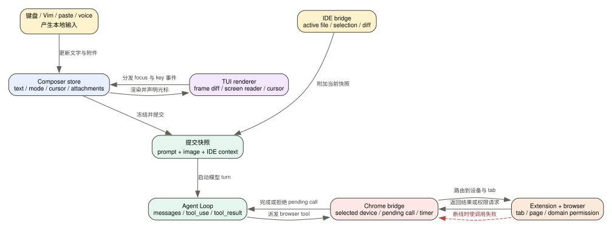

# Claude Code CLI 2.1.235 的输入界面：TUI、无障碍、媒体、IDE 与 Chrome 如何汇入同一次 Agent Loop

> 版本：`2.1.235` | 证据：目标版本可读化 bundle 的 `Static` 路径 + 本版 release note；本文没有把真实麦克风、VS Code extension 或 Chrome extension 连接标成成功 `Probe`。

用户看到的是一个输入框，但客户端实际同时维护五类不同状态：正在编辑的文字、输入法与光标、图片和语音附件、IDE 的编辑器现场，以及 Chrome extension 持有的页面现场。它们最后都能影响同一次 Agent Loop，却不由同一个组件拥有，也不会以同一种方式恢复。

**读者问题：** 一次输入为什么会同时涉及 Vim 光标、拼写子进程、图片压缩、语音转写、IDE selection 和 Chrome 页面权限；其中哪些状态能随 transcript 恢复，哪些断线后必须重新取得？

**一句话模型：** composer 把键盘、Vim、粘贴、图片和语音整理成可提交的 prompt；IDE 把编辑器现场作为附加上下文；Chrome 把浏览器动作作为有等待、权限和断线语义的外部工具调用；TUI 只负责让这些状态可见和可操作，不等于它拥有 Agent Loop 或外部页面。



图中的关键结论是：**输入状态可以被重新渲染，已提交的 turn 可以被持久化，但 IDE selection、麦克风录音进程和 Chrome 当前页面都不是 transcript 的完整副本。**

## 60 秒看懂一次真实操作

贯穿本文的场景如下：

1. 用户在 Vim NORMAL mode 下编辑一个多行 prompt；其中有一个拼错的英文单词和三级 Markdown 列表。
2. 用户拖入一张截图，又按住语音键补充一句要求。
3. 当前 VS Code selection 被附加到输入现场。
4. 提交后，模型要求 Chrome 打开页面、读取可访问性树并点击按钮。
5. 操作途中 extension 断线。

这不是一条“输入框 -> 模型”的直线。正常路径至少跨过四个 ownership 边界：

```text
composer 本地编辑状态
-> 提交时冻结的 prompt / image blocks / IDE context
-> Agent Loop 的消息和 tool_use
-> Chrome bridge pending call
-> extension 持有的 tab / page / permission 状态
```

extension 断线时，CLI 可以保留 transcript 和原始 `tool_use`，但不能把未返回的页面动作伪装成成功；它会拒绝 pending call，让 Agent Loop 看到一个明确失败结果，再决定是否重试。

## 提交前后，哪些对象真的发生了变化

| 对象 | 提交前 | 转换 | 提交后 | 用户可见结果 |
| --- | --- | --- | --- | --- |
| prompt text | 外部 composer store 中的可编辑字符串 | 由输入组件读取并提交 | 进入 user message；输入框可清空 | transcript 出现一条用户消息 |
| Vim mode / cursor | `vimMode` 与 `savedCursorOffset` 独立于组件实例 | panel/transcript 切换时保存，重挂载时恢复 | 仍属于本地编辑状态，不是模型消息 | 返回输入框后仍在 NORMAL mode 和原光标附近 |
| highlight | spellcheck/placeholder/voice 等以文本 offset 表示 | offset 映射到渲染后的多行坐标，再按行拆段 | 只影响 TUI 渲染 | 下划线不应跨行错位 |
| pasted image | 剪贴板 bytes 或拖入路径 | 校验 magic bytes、压缩、编码为 base64 image block | image block 进入本次请求 | 模型能看到图片；原本地路径不是必然的模型字段 |
| voice audio | 录音器产生的 PCM chunk | WebSocket STT 返回 interim/final transcript | 文字被注入 composer；原始音频不是普通 transcript message | 用户看到转写文字，之后再提交 |
| IDE selection | 编辑器进程/extension 持有的活动文件与 selection | IDE bridge 把当前现场交给 CLI | 作为本次输入上下文，而不是文件永久镜像 | 模型能引用当前选区；selection 改变后旧快照会过时 |
| Chrome target | CLI 记录 selected device，extension 持有 tab/page/group | Agent Loop 生成 tool call，bridge 路由并等待结果 | 成功时返回 tool result；断线时 pending call 被拒绝 | 页面动作成功、权限等待、超时和断线是不同状态 |

## 一、TUI renderer 决定“怎么显示”，不决定“任务是否在跑”

### 1. Fullscreen 不是一个简单布尔开关

`2.1.235` 在启动 renderer 时会综合判断 session 类型、screen reader、环境禁用项、`CLAUDE_CODE_NO_FLICKER`、tmux control mode、Windows-over-SSH、`settings.tui` 和 feature gate。源码还把最终原因编码成诸如 `bg_forced_on`、`sr_auto_off`、`tmux_cc_auto_off`、`win_ssh_auto_off`、`settings_on`、`settings_off`、`gb_on`、`gb_off`，再映射到 `fullscreen` 或 `default`。

这意味着两个用户都没有改 `settings.tui`，仍可能落到不同 renderer：

| 条件 | 选择倾向 | 原因 |
| --- | --- | --- |
| background session | 强制 fullscreen 路径 | 后台 worker 需要可控 frame 输出 |
| screen reader | 自动关闭 fullscreen | 避免 alternate-screen 和高频重绘破坏朗读顺序 |
| tmux `-CC` | 自动关闭 fullscreen | iTerm2 integration mode 与重绘模型冲突 |
| Windows over SSH | 自动关闭 fullscreen | ConPTY 重绘兼容性 |
| `settings.tui=fullscreen/default` | 显式选择 | 用户设置覆盖普通 gate |
| `CLAUDE_CODE_NO_FLICKER=true` | 在更早的 screen-reader/disable 兼容 gate 未命中时启用无闪烁/fullscreen 路径 | 环境级强制选择仍受前置兼容性判断约束 |

所以排查“画面闪烁、滚动异常、输入框不刷新”时，第一步不是怀疑 Agent Loop，而是记录 renderer 的**选择原因**。同一会话若 `--output-format=stream-json` 仍持续输出 tool/result，说明执行层在工作，故障位于 TUI 渲染或终端兼容层。

证据：[fullscreen 选择与原因编码](../reverse/javascript/cli.readable.js#L111025)。

### 2. Screen reader 走的是另一套输出算法

普通 TUI 可以维护 front/back frame 并做屏幕级 diff；screen-reader 路径会把语义树转成文本行，比较 `prevScreenReaderLines`，寻找第一个变化行，只重写必要后缀，并维护一个可朗读的 cursor parking 位置。

它还会区分：

- 文本完全未变且 parking 未变：不输出；
- 最后一行只追加字符：尝试只写增量；
- 最后一行发生可安全删除的缩短：发删除序列；
- 中间行变化、锚点破坏或 viewport 已滚动：重写受影响后缀；
- resize、resume、alternate-screen 切换：清空旧 diff state，避免拿旧 frame 继续比较。

这不是“把颜色关掉”那么简单。screen reader 需要稳定的行顺序和光标位置；普通 renderer 追求少闪烁、少字节和视觉正确性，两者的优化目标不同。

证据：[screen-reader 行级 diff 与 cursor parking](../reverse/javascript/cli.readable.js#L177643)、[resume/resize 重置](../reverse/javascript/cli.readable.js#L177392)。

### 3. Accessibility 会改变真实终端光标的隐藏策略

renderer 同时维护逻辑 cursor、display cursor 和 native cursor visibility。普通模式在没有可见输入光标时可以隐藏 native cursor；accessibility 或 screen-reader 模式会保留/恢复它，避免辅助工具失去当前位置。

`nativeCursorEnabled` 的解析也不是固定默认值：显式设置优先；accessibility 和 screen reader 会强制开启；其他终端再根据 capability 判断。

因此“屏幕上多了一个光标”不一定是绘制 bug，它可能是 accessibility contract 的结果。修 renderer 时不能只比较截图，还要检查辅助技术能否定位输入点。

证据：[accessibility/native cursor 状态](../reverse/javascript/cli.readable.js#L177330)、[native cursor resolver](../reverse/javascript/cli.readable.js#L178367)。

### 4. 三级列表修复的是缩进所有权

本版 release note 写明：修复深度 3+ 的 Markdown list 对齐，并为换行项加入 hanging indentation。实现中每个 `list_item` 会先计算 marker，再用 marker 的显示宽度生成正文缩进；首行使用 `marker + space`，后续行统一使用 hanging indent。嵌套 list、code、blockquote、table 等块级子项则走独立缩进路径。

例如：

```markdown
1. 第一层很长的文字，终端换行后正文仍应与首行正文对齐
   - 第二层
     1. 第三层继续换行
```

修复的重点不是多加几个空格，而是用**终端显示宽度**而不是字符串长度计算 marker，之后把该宽度沿嵌套层级传递。宽字符、不同位数的有序列表和深层嵌套才不会逐层漂移。

证据：[list marker 与 hanging indent](../reverse/javascript/cli.readable.js#L452860)、[本版 release note](release-notes.md)。

## 二、Composer 是可恢复的编辑状态机，不是一个 React 文本框

### 1. 为什么打开 panel 后 Vim 状态还能回来

prompt value、active flag、launch warning、Vim mode 和 saved cursor offset 位于组件外部 store。输入组件挂载时读取它们，卸载时保存 cursor offset；重新挂载时再把保存位置映射回 NORMAL mode 的 cursor 语义。

关键状态如下：

```text
value
active
launchWarning
vimMode = INSERT | NORMAL | VISUAL | VISUAL LINE
savedCursorOffset
```

如果这些值只存在于输入组件内部，打开 transcript、task panel 或其他 overlay 导致 composer 重挂载时，组件会回到 INSERT mode，光标也会跳到字符串末尾。本版把“用户正在编辑什么”和“当前 UI 树是否挂载”分开，因而能实现 release note 所说的 NORMAL mode 与 cursor position 恢复。

还存在一个细节：首次挂载如果保存的是 VISUAL/VISUAL LINE，会先恢复为 NORMAL，而不是恢复一个没有稳定 selection anchor 的视觉选择状态。

证据：[外部 composer store](../reverse/javascript/cli.readable.js#L269426)、[Vim input 初始化](../reverse/javascript/cli.readable.js#L519247)、[cursor 保存与恢复](../reverse/javascript/cli.readable.js#L521363)、[本版 release note](release-notes.md)。

### 2. 多行 highlight 为什么容易偏一位

spellcheck、voice interim、placeholder 和其他装饰使用的是原始文本 offset；实际渲染文本可能包含换行、ANSI token、行包装和隐藏片段。如果直接把原 offset 套到渲染字符串，第二行开始就可能多一位或少一位。

本版处理分两步：

1. 用每一行的文本起点建立 `textStart -> renderedStart` 映射；
2. 把 highlight 的 start/end 映射到渲染 offset，再按换行把 segment 拆进独立行数组。

渲染器随后对 ANSI token 做可见字符计数，并在每段前后恢复样式。这样修复的不只是“第二行加 1”，而是让 highlight 坐标从原始文本空间显式转换到可见渲染空间。

证据：[offset 映射](../reverse/javascript/cli.readable.js#L428992)、[跨行 segment 拆分](../reverse/javascript/cli.readable.js#L429101)、[本版 release note](release-notes.md)。

### 3. 快速按“方向键 + Enter”为何曾选错项

React render snapshot 可能落后于连续键盘事件。若方向键先更新 focus，Enter handler 仍闭包捕获旧的 `focusedValue`，就会接受上一项。

本版 navigation 和 accept 都在事件发生时调用 `getFocusedValue()`：

```text
ArrowDown -> focusNextOption()
Enter     -> getFocusedValue() -> 校验 disabled/type -> onChange(current)
```

也就是说，选中动作依赖的是 selection state 的实时读取，而不是屏幕上一次 render 的快照。这个模式同样适用于数字快捷键、分页和 input 型选项。

证据：[实时读取 focused value](../reverse/javascript/cli.readable.js#L429483)、[本版 release note](release-notes.md)。

### 4. Permission comment 是独立 input mode

权限对话并非只有 `Yes/No` 两个枚举。Yes 和 No 都可以切换成 comment 输入项：

- Yes comment：允许一次，同时把反馈交给 Claude；
- No comment：拒绝，同时说明应如何修改；
- session grant：产生 permission updates，扩大后续允许范围。

Shift+Tab 的处理顺序在本版被明确为：

1. 若正在 Yes comment input mode，先关闭该输入模式；
2. 若正在 No comment input mode，先关闭该输入模式；
3. 只有不在 comment mode 时，才寻找 `accept-session` 选项并触发 session grant。

这解释了 release note 中的修复：旧行为把“退出 comment 字段”的快捷键误解释为“批准并授予 session-wide edit permission”。修复的本质是 input mode 优先级高于 permission scope 切换。

证据：[permission options](../reverse/javascript/cli.readable.js#L531443)、[Shift+Tab 优先级](../reverse/javascript/cli.readable.js#L531724)、[本版 release note](release-notes.md)。

## 三、Spellcheck 是受限本地子进程，不是模型纠错

### 1. 启用条件和配置来源

spellcheck 默认关闭，只有 `enabled: true` 才启动。整个 `spellcheck` block 只从 user、flag 和 managed settings 中取最高优先级的一份；project 与 local settings 即使声明也会被忽略。

这项来源限制有直接安全意义：仓库不能通过 `.claude/settings.json` 强迫用户启动某个本地 spellchecker 或指定 dictionary。可配置字段包括：

| 字段 | 含义 | 默认/边界 |
| --- | --- | --- |
| `enabled` | 是否运行拼写检查 | 默认 `false` |
| `checker` | `aspell`、`hunspell`、`ispell` 或 `auto` | `auto` 按前三者顺序寻找 |
| `language` | 传给 checker 的 dictionary 名 | 只接受字母、数字及 `_-. ,` 范围内的普通名称 |
| `color` | 下划线和颜色 | 默认 theme error color |

若最高优先级 block 存在但没有有效的 `enabled: true`，低层 block 不会补齐它；这是“整块覆盖”，不是逐字段 merge。

证据：[settings schema 与来源说明](../reverse/javascript/cli.readable.js#L40285)、[运行时来源诊断](../reverse/javascript/cli.readable.js#L517991)。

### 2. 进程生命周期

checker 状态机为：

```text
idle -> resolving -> starting -> ready
  |         |           |         |
  +---------+-----------+---------+-> unavailable
```

`auto` 会依次查找 `aspell -> hunspell -> ispell`。找到后，客户端在用户 home 目录启动子进程，读取 banner 确认协议，再通过 stdin/stdout 发送单词批次。找不到程序、banner 不合法、协议输出异常、子进程崩溃或持续超时，都会让该会话降级为 unavailable；主输入功能不受阻塞。

### 3. 输入过滤不是“把整段 prompt 发给字典”

候选词抽取会跳过：

- inline code 和未闭合 code span；
- 带数字、路径分隔符、`@/#/=/{}` 等代码形态的 token；
- `.x`、HTML-like、URL/path-like 周边；
- Han、Hiragana、Katakana、Hangul、Thai、Lao、Khmer、Myanmar 等脚本；
- placeholder 覆盖区；
- 光标仍停在词尾、用户可能继续输入的当前单词。

候选抽取阶段只保留长度 2-64 的词；checker queue 还有不超过 128 个 JavaScript string unit 的保护。实际 request budget 用 UTF-8 `Buffer.byteLength` 计算，所以多字节字符不会被错误当成单字节。

### 4. 批处理、缓存和熔断阈值

| 控制项 | `2.1.235` 数值 | 作用 |
| --- | ---: | --- |
| 输入 debounce | 250 ms | 避免每个按键都触发进程请求 |
| checker banner deadline | 3 s | 启动后必须及时完成协议握手 |
| response deadline | 15 s | 一个单词批次的默认等待上限 |
| restart delay | 1 s | 首次 crash/protocol failure 后等待再启 |
| crash restart | 1 次 | 第二次失败后本会话关闭 spellcheck |
| 连续慢响应 | 3 次 | 达到后本会话关闭 spellcheck |
| 单批字节预算 | 4096 bytes | 限制写入 checker stdin 的 payload |
| backend 单批词数 | aspell 256 / hunspell 16 / ispell 256 | 适配不同协议吞吐 |
| verdict cache | 10000 项 | 超限前删除约一半旧项 |
| protocol line cap | 65536 chars | 防止异常 checker 无限输出单行 |

一次 timeout 不会把整段输入标成正确：客户端只把本批已收到的 misspelled verdict 合并进缓存，然后重启/继续；连续三次慢响应才关闭。稳定完成 20 个 batch 后，失败计数会被清零，避免一次很早的错误永久污染长会话。

### 5. 用户影响

- 它不消耗模型 token，也不向模型或远端发送待检查单词。
- 它会启动本地可执行程序，因此路径、dictionary 和 subprocess 稳定性会影响结果。
- checker 不可用时输入框继续工作，只是不再显示下划线。
- 下划线是 UI highlight；它不会自动改写 prompt，也不会把拼写判断写进 transcript。

证据：[checker 解析与启动](../reverse/javascript/cli.readable.js#L517677)、[batch/timeout/restart/cache](../reverse/javascript/cli.readable.js#L517695)、[token 过滤](../reverse/javascript/cli.readable.js#L517935)、[debounce 与 highlight](../reverse/javascript/cli.readable.js#L517991)。

## 四、粘贴图片是一套 gesture classifier

### 1. 同一个 paste 事件可能走四条路

输入层同时处理 bracketed paste、终端一次性送入的超长 key sequence、文件路径拖放和空文本剪贴板手势：

| 输入形态 | 识别 | 后续 |
| --- | --- | --- |
| 普通文本 | paste text 非空且不是图片路径 | 作为 pasted text 进入 composer |
| 拖入图片路径 | 分词后匹配 png/jpeg/gif/webp 路径 | 读取文件、校验、压缩并建立 image attachment |
| macOS/WSL 空 paste | text 为空且支持 image paste | 触发 clipboard image 读取 |
| 超长 key sequence | 单个 key 长度超过 800 | 当成 paste 处理，而不是逐键解释 |

若路径看起来像图片但读取、解码或压缩失败，客户端会把原路径退回普通文本，而不是静默吞掉用户输入。连续拖入多张图片时还会标记 `continuesGesture`，让 UI 把它们视为同一次 gesture。

证据：[paste/image gesture 分流](../reverse/javascript/cli.readable.js#L428889)、[路径识别与读取](../reverse/javascript/cli.readable.js#L292024)。

### 2. 扩展名不能证明它真是图片

本版先看文件路径扩展名来决定是否尝试图片流程，但真正读取后会检查 magic bytes。文件名为 `.png`、内容却是 HTML 登录页时，会明确报“image extension but invalid magic bytes”，并给出检测到的内容类型提示。

支持的主要内容类型是 PNG、JPEG、GIF 和 WebP；clipboard fallback 若得到 BMP，会先转为 PNG。这个设计避免把错误页面、下载失败响应或任意文本仅凭扩展名塞进 image block。

证据：[文件读取 magic-byte 校验](../reverse/javascript/cli.readable.js#L320211)、[pasted path 校验](../reverse/javascript/cli.readable.js#L292042)。

### 3. Native ImageProcessor 的资源边界

JavaScript wrapper 的调用形态类似 sharp：

```text
processImage(bytes)
-> decoded native object
-> resize/jpeg/png/webp mutations
-> metadata() or toBuffer()
-> dispose()
```

`metadata()` 和 `toBuffer()` 都在 `finally` 中调用 `dispose`。这说明 decoded image state 由 native object 持有，JS 不能只依赖 GC 推迟释放；大图或多图会显著占 native memory，消费边界必须及时销毁对象。

若 native module 不可用，客户端可回退到 bundled sharp 路径；若 image processing 整体失败但原图尺寸/大小仍在 API 限制内，可以保留原 bytes，否则返回可解释的降级文本或要求用户手工缩图。

证据：[native image wrapper 与 dispose](../reverse/javascript/cli.readable.js#L198368)、[处理失败分类](../reverse/javascript/cli.readable.js#L201207)。

### 4. 压缩顺序

当原图超过目标 byte/dimension 限制时，客户端按以下顺序尝试：

1. 尺寸和 bytes 都合格：保留原图；
2. 仅 bytes 超限且是 PNG：尝试 palette + compression level 9；
3. 依次尝试 JPEG quality `80 -> 60 -> 40 -> 20`；
4. dimension 超限：按比例缩到 max width/height，再重复 PNG/JPEG 尝试；
5. 仍过大：最长边最多缩到 1000px，并用 JPEG quality 20；
6. 进入最终 image block 前若仍超过单图 byte budget，再做一次有限 quality 搜索。

最终发送给 Messages API 的对象是 base64 image block。base64 本身约增加三分之一体积，因此客户端的 raw-size target 会比 wire-size cap 更保守。压缩可能把 PNG 转成 JPEG，也会牺牲细文字体清晰度；截图中的代码若重要，用户应优先裁剪目标区域而不是只依赖极限压缩。

证据：[resize/quality fallback](../reverse/javascript/cli.readable.js#L201237)、[image block 编码](../reverse/javascript/cli.readable.js#L201310)。

### 5. Clipboard fallback

clipboard 首选 native `hasClipboardImage/readClipboardImage`。失败后才调用平台命令：macOS 使用 AppleScript，Linux 使用 `xclip`/`wl-paste`，Windows 使用 PowerShell。fallback 会写入临时截图文件、读取 bytes、压缩并删除。

所以“粘贴图片”可能涉及：

- 操作系统剪贴板权限；
- native module 可用性；
- 外部命令是否安装；
- 临时目录写入；
- 图片解码和内存预算。

任意一层失败都不应被笼统归为“模型不支持图片”。

证据：[native clipboard 与系统命令 fallback](../reverse/javascript/cli.readable.js#L291963)。

## 五、Voice 是“本地录音 + 远端 STT + 文本注入”

### 1. Voice 不直接把声音作为普通 user message

voice mode 的正常路径是：

```text
按键/焦点触发
-> 本地 microphone recorder
-> 16kHz mono signed 16-bit PCM chunks
-> voice_stream WebSocket
-> interim/final transcript
-> 注入 composer text
-> 用户提交后才进入普通 Agent Loop
```

因此 voice state 与 conversation state 是两层对象。录音取消会丢弃当前 audio/transcript buffer；成功转写只是修改输入框，还没有自动代表模型已经收到，除非当前 voice 配置随后触发提交。

### 2. Gate 顺序

启用 `/voice` 至少经过：

1. Claude.ai account/OAuth 可用；
2. `allow_voice_mode` capability 放行；
3. 不是 remote/cloud 无音频设备环境；
4. native audio 或 SoX recorder 可用；
5. microphone permission 通过；
6. user settings 成功写入 `voice.enabled` 和 `mode`。

remote 环境会直接提示回本地运行，因为该 session 没有可用 microphone。这个判断位于录音前，不会等 WebSocket 连好后才失败。

证据：[voice command gate](../reverse/javascript/cli.readable.js#L362598)、[录音环境检查](../reverse/javascript/cli.readable.js#L362522)。

### 3. 录音后端

客户端优先加载 native `audio-capture` module。native 不可用时，SoX `rec` 的关键参数为：

```text
-t raw
-r 16000
-e signed
-b 16
-c 1
```

也就是 16kHz、mono、signed 16-bit raw PCM。native recorder 与 SoX recorder 共用上层 chunk callback，因此 WebSocket 和转写状态机不需要知道底层设备来自哪个实现。

证据：[native audio bridge](../reverse/javascript/cli.readable.js#L362418)、[SoX 参数](../reverse/javascript/cli.readable.js#L362546)。

### 4. WebSocket、缓冲和 finalize

voice stream 建连时，录音已经可以开始；在 socket ready 前产生的 chunk 放入内存 queue，连接后按不超过约 32 KiB 的 frame 合并发送。连接建立后每 8 秒发送 KeepAlive。

停止录音时会发送 `CloseStream`，同时有两道 finalize deadline：

- 5 秒 safety timeout；
- 1.5 秒 no-data timeout。

若只收到 interim 而没有 endpoint，finalize 会把未上报 interim 提升成 final，避免用户说过的话完全丢失。

证据：[voice stream protocol](../reverse/javascript/cli.readable.js#L362231)、[连接前 buffer 与 flush](../reverse/javascript/cli.readable.js#L525788)。

### 5. Retry 和 circuit breaker

Voice 至少有三种不同恢复：

| 故障 | 恢复 | 保留状态 |
| --- | --- | --- |
| 首次连接在任何 transcript 前失败 | 250 ms 后重连一次 | recorder 继续，尚未发送 chunks 仍在 queue |
| finalize `no_data_timeout`，但检测到音频且缓存有 chunk | 新建连接并重放缓存音频 | 原 PCM chunk buffer |
| 10 秒内累计 3 次早期失败 | circuit breaker 暂停新 session | 不继续无限建连；成功后可解除 |

mid-stream 已有 transcript 后失败时，客户端会尽量 salvage 已累积文字，再结束当前录音；它不会把整个录音从头无限重传。silent-drop replay 也只执行一次，避免服务异常时重复上传同一段音频。

### 6. Hold、tap 和 focus 的时间语义

| 模式/计时 | 数值 | 行为 |
| --- | ---: | --- |
| hold fallback | 600 ms | 没观察到 key auto-repeat 时进入 release fallback |
| release settle | 200 ms | 最后一个按键事件后结束 hold recording |
| focus silence | 5 s | focus-triggered recording 长时间无活动后结束 |
| tap silence | 15 s | tap mode 自动结束 |
| max recording | 120 s | tap mode 达上限自动结束 |

这些计时分别解决键盘 auto-repeat 不一致、松键事件丢失、focus mode 忘记退出和无限录音问题，不能合并解释成一个“语音 timeout”。

证据：[voice state、retry 和计时常量](../reverse/javascript/cli.readable.js#L525658)。

### 7. 隐私与成本边界

- 原始 PCM 会通过 voice WebSocket 发往 STT 服务；这不是纯本地转写。
- 为 silent-drop recovery，客户端会在内存中暂存本次录音 chunk，结束或清理时释放。
- final transcript 会进入 composer，之后与普通文本一样进入模型请求。
- language 和可选 keyterms 会影响 STT 配置；它们不是模型 system prompt。
- bundle 能证明客户端上传和清理路径，不能单独证明服务端音频 retention、训练或删除策略。

## 六、IDE integration 把编辑器现场接进来，但不拥有 prompt

### 1. 进程发现和连接状态是两回事

客户端会在 macOS、Windows 和 Linux 上扫描 VS Code、Cursor、Windsurf/Devin Desktop，以及多种 JetBrains IDE 进程。发现一个进程只说明“可能有 IDE”；实际 connection 还会区分 `pending`、`connected`、`disconnected`，并读取 transport config 中的 `ideName`。

自动安装也有两道 gate：

- `CLAUDE_CODE_IDE_SKIP_AUTO_INSTALL`；
- 用户持久设置 `autoInstallIdeExtension`，默认 true。

所以 `/ide` 显示“检测到 VS Code”不等于 extension 已安装、transport 已认证或 selection 已送到本次 session。

证据：[IDE process detection](../reverse/javascript/cli.readable.js#L180726)、[auto-install gate](../reverse/javascript/cli.readable.js#L180798)。

### 2. IDE transport 不是裸 loopback

本版支持 `sse-ide` 和 `ws-ide` transport。WebSocket IDE transport 在有 auth token 时发送：

```text
X-Claude-Code-Ide-Authorization: <token>
```

并使用 `mcp` subprotocol。也就是说，“只监听本机”不是认证替代品；CLI 仍需要知道自己连的是哪一个 IDE endpoint。

CLI 还可以通过 IDE RPC 关闭 diff tabs，permission dialog 也能标记“changes opened in IDE”，说明 IDE 不只是单向提供 selection，也参与 diff/open/save 的交互闭环。

证据：[IDE WebSocket auth header](../reverse/javascript/cli.readable.js#L385604)、[IDE RPC/status](../reverse/javascript/cli.readable.js#L180768)。

### 3. Selection 的生命周期

composer 接收 `ideSelection` 并把它交给 footer/context surface。正确的状态模型是：

```text
IDE owns active editor + live selection
CLI owns a snapshot attached to this session/turn
transcript owns only what was actually persisted
```

编辑器切到另一个 tab 后，旧 selection snapshot 不会自动变成新文件内容。断线重连也应重新读取权威 IDE state，而不是从 transcript 反向重建 editor selection。

### 4. VS Code 多 panel focus 修复的证据边界

本版 release note 明确写了：恢复或重载包含多个 Claude panel 的窗口时，修复 Claude tab 之间的 focus 跳转。

目标 CLI bundle 可以证明：

- IDE status/selection 是 session state 的一部分；
- composer、overlay 和 focus manager 会随 panel 生命周期重挂载；
- VS Code/Cursor/Windsurf extension 存在发现、安装和连接路径。

但 extension 的完整 panel restoration 源码不在本快照的 CLI readable view 中，本文也没有运行真实多 panel VS Code Probe。因此，**“这个 bug 已在 release note 声明修复”是版本事实；“具体通过某个 extension 内部 panel ID 算法修复”则不能从本 bundle 倒推。**

## 七、Claude in Chrome 是远端页面工具，不是 IDE 的另一种叫法

### 1. 三层 owner

Chrome 路径至少有三层状态：

| 层 | 持有状态 | 退出/断线后 |
| --- | --- | --- |
| CLI | permission mode、allowed domains、selected device ID、pending call、timeout | transcript 可保留；进程内 pending map 消失 |
| bridge/native host | socket/WebSocket、routing、peer roster、pairing | 可重连；不能替代 extension 页面状态 |
| extension | tab、window/group、当前 URL、DOM、site permission | 浏览器继续持有；CLI 只能重新查询 |

这就是为什么 CLI 保存 `selectedDeviceId` 不等于保存“当前打开了哪个 tab”。一个 device 可以重新连接，但原 tab 可能已关闭、跳转或离开原 group。

### 2. Enablement 和产品 gate

本版会检查 OAuth scope、显式 `--chrome/--no-chrome` 或环境设置、用户默认开关、远程/SSH/safe/plan/teammate 等不适合弹出 offer 的场景。UI 还明确显示 WSL 当前不支持，并要求 claude.ai subscription。

native host manifest 只允许固定 extension origin，wrapper script 在本地 Claude 配置目录生成。manifest 安装成功也不等于 extension 已安装或已登录；首次安装后客户端仍可能打开 reconnect 页面等待配对。

证据：[Chrome enablement/setup](../reverse/javascript/cli.readable.js#L469016)、[native host manifest](../reverse/javascript/cli.readable.js#L469077)、[Chrome status UI](../reverse/javascript/cli.readable.js#L469303)。

### 3. Local socket 的安全检查

本地 native-host transport 使用 4-byte little-endian 长度前缀加 JSON payload。连接前在非 Windows 平台验证：

- socket directory mode 必须是 `0700`；
- socket mode 必须是 `0600`；
- directory 和 socket owner 必须是当前 UID；
- 目标必须真的是 socket。

不满足时拒绝连接，而不是带 warning 继续。这阻止同机其他用户替换 socket，截获浏览器工具输入或伪造结果。

连接和请求阈值：

| 项目 | 数值 |
| --- | ---: |
| connect timeout | 5 s |
| ensureConnected timeout | 5 s |
| 默认 request timeout | 30 s |
| connection error 后 request retry | 1 次 |
| reconnect/poll 上限 | 100 次 |
| backoff | `1s * 1.5^(attempt-1)`，上限 30 s |

证据：[local socket transport](../reverse/javascript/cli.readable.js#L21690)。

### 4. WebSocket bridge 的调用状态

WebSocket bridge 用 `pendingCalls: Map<tool_use_id, call state>` 支持按调用 ID 对应结果。每个 call 保存：

- resolve/reject；
- timer；
- tool name 和 args；
- start time / timeout；
- session ID / user message UUID；
- permission callback；
- routing ack 与 pong age 诊断。

默认 tool timeout 是 60 秒。连接发现和辅助等待另有独立阈值：

| 操作 | 数值 |
| --- | ---: |
| bridge ensureConnected | 10 s |
| 等待 extension peer | 10 s |
| list extensions | 5 s |
| external message 默认 | 150 s |
| external message 最大 | 270 s |
| pairing prompt | 120 s |
| switch browser | 120 s |

不要把这些数值合并成“Chrome timeout 是 60 秒”。60 秒只属于普通 tool call；配对、列设备、外部 relay 和人工 permission 都有自己的时钟。

证据：[bridge 常量与 pending state](../reverse/javascript/cli.readable.js#L21906)、[extension discovery/pairing](../reverse/javascript/cli.readable.js#L22078)。

### 5. 权限等待会暂停 tool timer

extension 发来 `permission_request` 时，CLI 会找到对应 pending call，清掉其 timer，等待本地 permission handler，再发送 `permission_response`。处理结束后，为该调用重新创建 timeout timer。

这意味着：

```text
工具执行时间 = 路由/页面动作计时
人工审批时间 = 单独等待，不消耗原 tool timeout
```

否则用户思考 60 秒就会让页面动作无条件超时，即使 extension 尚未真正执行。permission handler 抛错时默认回复 `allowed: false`，属于 fail closed。

证据：[permission timer pause/resume](../reverse/javascript/cli.readable.js#L22367)。

### 6. 断线、超时和迟到结果是三个状态

| 事件 | pending call | Agent Loop 看到什么 | 页面副作用 |
| --- | --- | --- | --- |
| 正常 `tool_result` | 删除并 resolve | 成功/错误 tool result | 可能已发生 |
| tool timeout | 删除并 reject；ID 放入 timed-out map | timeout error | extension 可能稍后完成，不能假设未发生 |
| selected extension 断线 | 全部 pending call 被拒绝 | disconnected-mid-call | 已执行到哪一步取决于 extension，非原子回滚 |
| 迟到 result | 记录 late-result telemetry，不再 resolve 旧 call | 不改写已给模型的 timeout | 外部动作若已发生仍然存在 |

这是浏览器自动化最重要的恢复边界：**超时不是事务回滚。** 重试点击、提交表单、发送消息或购买动作前，必须先重新读取页面，确认第一次是否已经产生副作用。

bridge 关闭时还会清空 selected device、pending discovery、pairing prompt 和 waiters；extension 重新出现后需要重新发现/选择，旧 tab action 不会自动续跑。

证据：[disconnect 与 peer state](../reverse/javascript/cli.readable.js#L22269)、[result/late result/timeout](../reverse/javascript/cli.readable.js#L22396)、[cleanup](../reverse/javascript/cli.readable.js#L22496)。

### 7. Chrome 的权限和第三方输入边界

Chrome tool surface 可以读取 accessibility tree、查找元素、填写表单、执行鼠标键盘动作、截图和在页面上下文执行 JavaScript。对应风险不是“能不能联网”这么简单：

- 当前 URL/domain 可能在动作之间改变；
- 页面文本、DOM、aria label 和 extension notice 都是不可信第三方输入；
- site-level permission 由 extension 设置继承；
- domain transition、category lookup、blocked site 和 JS permission 有独立错误；
- screenshot/page text 会进入 tool result，增加 token 与隐私暴露；
- JavaScript 在页面上下文执行，能触碰该页面已有的 DOM 和 page variables。

CLI bundle 能证明客户端发送的 permission mode、allowed domains、错误分类和断线处理；不能独自证明 extension 当前版本、远端 bridge 部署和站点安全分类服务的实时行为。

## 八、六类状态如何组合

| 状态 | 真正 owner | 是否进入模型上下文 | 是否跨 UI 重挂载 | 是否跨进程恢复 |
| --- | --- | --- | --- | --- |
| prompt value | composer store | 提交后进入 | 是 | 取决于 session/input persistence，不由 UI 本身保证 |
| Vim/cursor | composer store | 否 | 是 | 新进程默认不能从 transcript 完整恢复 |
| spellcheck verdict cache | spellcheck process wrapper | 否 | 同 host/session 可复用 | 否 |
| image attachment | composer/session message | 是，base64 image block | 是 | 已持久化 message 可恢复；本地 decoded object 不恢复 |
| voice PCM buffer | voice hook refs/recorder | 否；只有 transcript 进入 | 录音中重挂载会清理 | 否 |
| IDE selection | IDE + CLI snapshot | 当前 snapshot 可进入 | 可重新读取 | 必须重连 IDE 后重取权威状态 |
| Chrome selected device | CLI bridge | 只作为 tool routing，不是 prompt 文本 | bridge 活着时可用 | 可持久化 device hint，但仍需重新发现 |
| Chrome tab/page | extension/browser | 通过 tool result 部分进入 | 与 TUI 无关 | 浏览器自己可能保留；transcript 不能重建 |

## 九、故障定位矩阵

| 症状 | 首查 owner | 关键判断 | 正确恢复 |
| --- | --- | --- | --- |
| 模型在跑但终端画面不刷新 | TUI renderer | stream-json/tool progress 是否继续 | 记录 renderer reason，切 default/fullscreen 隔离 |
| screen reader 重复朗读整屏 | screen-reader diff state | resize/resume 后是否重置，cursor park 是否稳定 | 重置 frame/diff，不改 Agent Loop |
| 多行拼写下划线错位 | highlight mapping | raw offset 是否先映射 rendered lines | 修坐标转换，不给每行硬加常量 |
| panel 关闭后 Vim 回 INSERT | composer external store | `vimMode/savedCursorOffset` 是否在卸载时保存 | 恢复 store 生命周期 |
| 图片路径原样出现在输入框 | paste/image pipeline | magic bytes、读取权限、native/sharp 是否失败 | 看 fallback 原因，验证真实文件 bytes |
| voice 没文字 | recorder / STT | 是否有 audio signal、WS 是否 connected、是否 no-data | 区分设备、权限、网络和 silent-drop replay |
| IDE 被检测但 selection 缺失 | IDE transport | process detection 与 connected status 是否混淆 | 重连/认证 IDE，重新读取 selection |
| Chrome 工具超时后页面已变化 | extension page owner | 是否收到 late result，第一次动作是否已发生 | 先重新读取页面，再决定是否重试 |
| Chrome 等待权限时 60 秒未超时 | permission state | pending timer 是否 paused | 正常设计；审批后重新计时 |

## 十、成本、延迟、质量、隐私和安全

| 维度 | TUI/input | Spellcheck | Image | Voice | IDE | Chrome |
| --- | --- | --- | --- | --- | --- | --- |
| Token | UI 状态本身不进上下文 | verdict 不进上下文 | base64 image block 占请求 media budget | transcript 变成文本 token | selection/context 增加 prompt | page text/screenshot/tool result 增加上下文 |
| 延迟 | render debounce、terminal I/O | 250 ms debounce + checker response | decode/resize/compress | recorder + WS + STT finalize | process discovery + transport | discovery、permission、page action、bridge round trip |
| 质量 | wrapping/cursor 错会误导输入 | dictionary 误报但不改文本 | 极限 JPEG 会损伤细字 | STT 受设备、语言、网络影响 | stale selection 会误导模型 | stale tab/ref 会对错页面操作 |
| 隐私 | 本地终端内容 | 单词只给本地进程 | 图片 bytes 进入模型请求 | PCM 发往 STT，文字再进 prompt | selection/active file context 可进入 prompt | 页面内容、截图和动作经 extension/bridge |
| 安全 | permission UI 必须正确表达 scope | project 不能强制启用 | magic bytes 防伪装内容 | microphone gate + OAuth/capability | loopback 仍有 auth token | socket owner/mode、domain permission、fail-closed |
| 恢复 | renderer 可重建 | cache/process 不跨进程 | 已提交 block 可随 session 恢复 | 录音进程和 PCM 不恢复 | 重连后重取 editor state | 重连后重查 device/tab；外部副作用不回滚 |

## 十一、本版 release note 与静态实现如何对齐

| Release-note 项 | 本版静态实现能证明什么 | 不能扩大成什么 |
| --- | --- | --- |
| 新增 optional spellcheck | setting、来源限制、backend、subprocess、timeout/cache/highlight 完整可达 | 不证明用户机器安装了 dictionary |
| 深层列表与 hanging indent | marker 显示宽度和嵌套 indent 的实现 | 不证明所有终端字体宽度都一致 |
| 多行 highlight 偏移修复 | raw/rendered offset 映射与逐行 segment | 不证明任意第三方 terminal renderer |
| Shift+Tab permission comment 修复 | comment input mode 优先退出，再处理 session grant | 不代表所有 permission UI 都已 runtime Probe |
| Vim NORMAL/cursor 恢复 | 外部 store、unmount 保存、mount 恢复 | 不代表新进程可恢复未提交输入 |
| 快速方向键 + Enter | handler 即时读取 `getFocusedValue()` | 不代表任意自定义 dialog 都使用相同组件 |
| VS Code 多 panel focus | release note + CLI 的 IDE/focus/session 接口 | 不能重建 extension 内部修复算法 |

## 十二、证据索引与边界

### TUI 与 input

- Fullscreen/default 选择：[111025-111098](../reverse/javascript/cli.readable.js#L111025)
- Renderer、accessibility、screen reader state：[177330-177449](../reverse/javascript/cli.readable.js#L177330)
- Screen-reader diff：[177643-177770](../reverse/javascript/cli.readable.js#L177643)
- Native cursor resolver：[178367-178378](../reverse/javascript/cli.readable.js#L178367)
- Markdown hanging indent：[452860-452935](../reverse/javascript/cli.readable.js#L452860)
- Paste/image gesture：[428889-428977](../reverse/javascript/cli.readable.js#L428889)
- Multi-line highlight：[428992-429151](../reverse/javascript/cli.readable.js#L428992)
- Selection realtime state：[429483-429620](../reverse/javascript/cli.readable.js#L429483)
- Composer/Vim store：[269426-269454](../reverse/javascript/cli.readable.js#L269426)、[519247-519263](../reverse/javascript/cli.readable.js#L519247)、[521363-521380](../reverse/javascript/cli.readable.js#L521363)
- Permission comment/Shift+Tab：[531443-531454](../reverse/javascript/cli.readable.js#L531443)、[531724-531759](../reverse/javascript/cli.readable.js#L531724)

### Spellcheck、voice 与 image

- Spellcheck schema：[40285](../reverse/javascript/cli.readable.js#L40285)
- Spellcheck runtime：[517677-518028](../reverse/javascript/cli.readable.js#L517677)
- Voice stream：[362231-362416](../reverse/javascript/cli.readable.js#L362231)
- Native/SoX recorder 与 voice command：[362418-362646](../reverse/javascript/cli.readable.js#L362418)
- Voice state/retry/timers：[525658-525971](../reverse/javascript/cli.readable.js#L525658)
- Native ImageProcessor：[198368-198425](../reverse/javascript/cli.readable.js#L198368)
- Image compression/block encoding：[201207-201324](../reverse/javascript/cli.readable.js#L201207)
- Clipboard image：[291963-292090](../reverse/javascript/cli.readable.js#L291963)
- File image validation：[320211-320243](../reverse/javascript/cli.readable.js#L320211)

### IDE 与 Chrome

- IDE discovery/auto-install：[180726-180882](../reverse/javascript/cli.readable.js#L180726)
- IDE WebSocket authorization：[385604-385616](../reverse/javascript/cli.readable.js#L385604)
- Local Chrome socket：[21690-21874](../reverse/javascript/cli.readable.js#L21690)
- Chrome WebSocket state、timeouts、pairing、permission、disconnect：[21906-22520](../reverse/javascript/cli.readable.js#L21906)
- Chrome enablement/native host/UI：[469016-469408](../reverse/javascript/cli.readable.js#L469016)
- 本版上游变更说明：[release-notes.md](release-notes.md)

### 明确边界

- 本文没有真实连接 microphone/voice service，不能把设备兼容性和服务端 retention 标为 Probe。
- 本文没有启动 VS Code/Cursor/Windsurf/JetBrains extension，不能证明目标机器的安装、认证、selection 或多 panel focus 结果。
- 本文没有连接 Chrome extension/bridge，不能证明实时站点分类、extension build、账号 entitlement 或某个页面动作成功。
- release note 可以证明上游对修复的版本声明；只有 bundle 可达路径可以解释客户端实现，二者都不能代替未运行的端到端环境验证。
