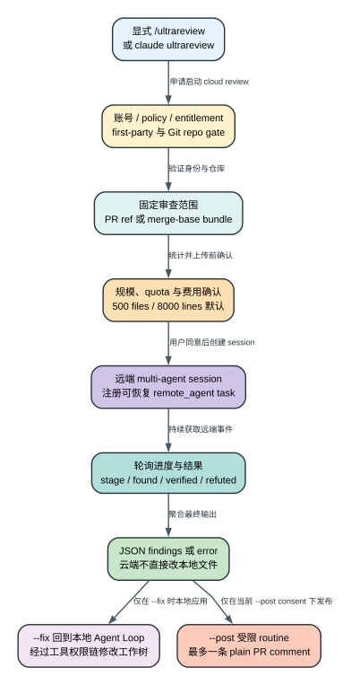

# Claude Code CLI 2.1.235 Ultrareview：本地命令怎样启动、恢复并发布一次云端多 Agent 审查

> 版本：`2.1.235` | 证据：`Static` | 云端审查算法、实际 fleet 行为与计费属于 `Boundary`

## 60 秒理解

**读者问题：** `/ultrareview --fix --post` 是不是在本地多开几个 subagent，边审边改代码，最后直接给 GitHub 提交 review？

**一句话模型：** 客户端先验证账号、策略、Git 仓库、diff 规模与费用，再为 PR ref 或本地 branch bundle 创建远端 session；云端返回 findings 后，`--fix` 才把它们交回本地 Agent Loop改工作树，`--post` 则在当前 session 另启一个受限 routine，最多发布一条 plain PR comment。



贯穿场景：用户在与 GitHub PR #214 对应的 checkout 中执行 `/ultrareview 214 --fix --post`。客户端确认 PR 属于当前仓库、diff 未超过限制、账号与策略允许，并显示预计 `$10-$20`、`~10-20 min`。用户确认后，云端 session 审查 PR ref；findings 返回时，本地 Agent Loop按 findings 修改文件，另一个 posting routine 只允许调用 `get_me` 和一次 `add_issue_comment`，发布一条普通评论，而不是 approve、request changes 或 merge。

## 先把三个“review”入口分开

| 入口 | Owner | 默认执行位置 | 能否由模型文本直接启动 | 主要副作用 |
| --- | --- | --- | --- | --- |
| `/code-review`，alias `/review` | 本地 command/fork | 本地 Agent review | 可以作为普通 slash command 运行 | 读取本地代码；`--comment` 可发 inline comments |
| `/code-review ultra` / `/ultrareview` | twin command | 云端 remote session | 必须用户显式执行 cloud command | 可能上传 bundle、产生云端费用 |
| `claude ultrareview [target]` | 独立 CLI handler | 云端 remote session | 由 shell argv 启动 | 等待并打印 findings，可选一条 PR comment |

`ultra` 是 `/code-review` 的 subcommand 映射，不是 effort level。若主模型把用户自然语言里的 “ultra” 当成普通 review prompt，2.1.235 会明确告诉用户需要显式运行 cloud command，并暂时 fallback 到本地 max-effort review；模型自身不能偷偷启动一次可能收费、上传代码的远端审查。

`--comment` 属于本地 `/code-review` 的 inline-comment 语义；cloud review 的发布开关是 `--post/--no-post`。两者不能互换。

证据：`reverse/javascript/cli.readable.js` 539208-539372、630202-630204。

## 审查前后，哪些状态真的改变

| Object | Before | Transformation | After | User-visible effect |
| --- | --- | --- | --- | --- |
| local Git scope | 当前 checkout、target、refs | 校验 repo，计算 PR ref 或 merge-base diff | 固定一份 review scope | 用户知道审查的是哪段变化 |
| source availability | 代码只在本地或 GitHub PR | PR ref 绑定或生成/upload bundle | cloud session 可读取代码 | 代码进入远端执行边界 |
| task registry | 没有 remote review task | 注册 `remote_agent` 与 session metadata | 可轮询、通知、跨 CLI session恢复 | 退出 TUI 不一定丢失审查 |
| findings | 空 | 云端 fleet 运行并聚合 JSON | findings array 或 error object | CLI/TUI 显示定位和严重度 |
| local worktree | 启动时状态 | `--fix` 在 findings 返回后交给本地 Agent Loop | 文件可能被修改 | 云端本身不直接写本地磁盘 |
| GitHub PR | 无新评论 | `--post` 启动受限 routine | 最多一条 plain issue comment | 不是 GitHub review，不会 approve/merge |
| consent | 当前 invocation 未确认 | preflight/overage/post 分别确认 | 只在当前 session/invocation 有效 | resume 不自动继承发布同意 |

## 阶段 1：命令先经过产品、身份和策略 gate

Ultrareview 的主要 gate 是累积关系，不是“登录了就行”：

1. feature config允许 cloud review；
2. 使用 first-party provider，并且 base URL 仍是 first-party endpoint；
3. 当前不是 remote environment 中再启动 remote review；
4. 账号有 Ultrareview entitlement；
5. 使用 Claude.ai OAuth full-scope token；普通 API key 不满足；
6. managed policy `allow_remote_sessions` 没有禁用 Cloud sessions；
7. 当前目录是可解析的 Git repository；
8. 有匹配的 GitHub remote，或本地 refs 足以生成 bundle。

策略 gate 在独立 CLI handler 最先执行；若 policy cache miss，会先刷新/记录对应状态。认证错误会引导重新执行 `claude auth login`，而不是把 API key静默升级为 cloud 权限。

PR URL/编号还有仓库一致性检查：目标 PR 必须属于当前 checkout 的 repository。这样可避免用户在 A 仓库工作树中误审 B 仓库 PR，随后把 findings 或 comment 关联错对象。

证据：`reverse/javascript/cli.readable.js` 204529-204889、628676-628694。

## 阶段 2：scope builder 决定“云端到底看什么”

### PR 模式

PR target 解析成功后，客户端使用 `refs/pull/<PR>/head` 建立 cloud session，并附带 repository、PR number、base/head 等环境信息。它不会把任意 PR URL 当普通字符串传给模型，而是先验证 remote 与 checkout repository。

### Branch / base 模式

本地 branch review 会：

1. 解析 target base branch；
2. 计算 merge-base；
3. 用 `git diff --shortstat/numstat` 等只读命令统计 changed files 和 lines；
4. 生成包含必要 refs/objects 的 bundle并上传；
5. 把 base SHA、repo identity 和 review config 注入 remote session environment。

若找不到 merge-base，但仓库不是 shallow 且存在可用 refs，客户端可使用 Git empty-tree SHA：

```text
4b825dc642cb6eb9a060e54bf8d69288fbee4904
```

这等于把当前可达内容按“相对空仓库的全量变化”审查。shallow clone 不允许该 fallback，因为历史缺失和“确实是首个提交”无法区分；客户端要求 deepen/unshallow。空 diff、无 commits、detached-only 且无法建立 scope 的状态都会在上传前失败。

证据：`reverse/javascript/cli.readable.js` 204690-205430、362850-363297。

## 阶段 3：规模、配额和价格在远端执行前完成确认

2.1.235 的本地默认 diff 上限是：

- 最多 `500` changed files；
- 最多 `8000` changed lines。

远端 config 可以调整这两个值。超过上限时，客户端要求选择更近的 base 或拆分变化，不会先上传再让云端失败。

随后有两个短请求：

| Endpoint | timeout | 作用 |
| --- | --- | --- |
| `/v1/ultrareview/preflight` | `5s` | 返回 `proceed / confirm / blocked` 与解释、价格/时间信息 |
| `/v1/ultrareview/quota` | `3s` | 检查可用额度/usage 状态 |

默认确认文案显示成本 `$10-$20`、预计 `~10-20 min`，但两者都可被远端 config 改写，不能当成固定账单。preflight 不可用时，交互或受控路径不会默认为免费；它会提示此次可能按 usage credits 计费并要求确认。`blocked` 则终止创建 session。

证据：`reverse/javascript/cli.readable.js` 362850-363297、508681-508823。

## 阶段 4：创建的不是普通 subagent，而是有资源上限的 cloud session

remote session environment 会携带 PR/repository/base SHA、bundle/target信息，以及 fleet 和 timeout 配置。2.1.235 默认与硬上限为：

| Resource | 默认 | 上限 |
| --- | --- | --- |
| fleet size | `5` | `20` |
| max review duration | `10 min` | `25 min` |
| single agent timeout | `600s` | `1800s` |
| total wallclock | `22 min` | `27 min` |

这些值约束客户端创建的远端任务参数；云端内部怎样分工、去重和验证 findings 不在 bundle 内。不能仅凭 fleet=5 推导“固定 5 个相同 reviewer 并行投票”。

interactive 路径把它注册为 `remote_agent` task，并持久化 session/task metadata。task 持久化让另一个 CLI session 有机会恢复 watcher；它不意味着所有 invocation-local consent 都持久化。

证据：`reverse/javascript/cli.readable.js` 363957-363963、508681-508823、404549 附近。

## 阶段 5：轮询、进度与完成判定

TUI/interactive watcher 大约每 `1s` 拉取远端事件，并能解析：

```xml
<bughunter-progress>
  {"stage":"...","bugs_found":N,"bugs_verified":N,"bugs_refuted":N}
</bughunter-progress>
```

UI 因而可以显示当前 stage、found、verified、refuted，而不必重放完整 event stream。连续 `5` 次 idle 可作为完成辅助条件；本地 watcher 对一次 remote review 的终止等待约为 `30` 分钟。

最终有效输出是 JSON findings array；remote orchestrator 失败也可能返回 `{"error":"..."}`。客户端分别格式化为 findings 或错误，而不是把任意最后一段文本都当审查结论。

`Stop ultrareview` 会 kill remote task并产生 task notification。它与独立 CLI 的 Ctrl-C 不同：后者默认只停止本地等待，不会杀死远端 review。

证据：`reverse/javascript/cli.readable.js` 508681-508823、628748-628810。

## 阶段 6：恢复能力保留了 task，但没有保留全部发布同意

remote task schema 会保存 session id、状态、URL 和 watcher 所需 metadata，所以 Claude Code 重启或另一个 CLI session 能重新发现并恢复审查状态。

但 `postReviewTo` 没有写入持久 task schema。结果是：

- 当前 invocation 中的 `--post` 只对这次等待有效；
- session 结束、watcher恢复或轮询失败后，不会仅凭旧 task 自动向 PR 发帖；
- 用户必须在有完整 findings 的新上下文中重新明确决定是否发布。

这是重要的副作用隔离：远端计算可以续跑，外部写操作的 consent 不跨 session静默恢复。

证据：`reverse/javascript/cli.readable.js` 404549、508681-508823、628694-628735。

## 阶段 7：`--fix` 为什么是回到本地以后才发生

云端 Ultrareview 的产物是 findings，不是对本地 working tree 的 edit stream。`/ultrareview --fix` 等 findings 返回后，才把问题描述交给当前本地 Agent Loop；后续 Read/Edit/Bash 仍经过本地工具校验、permission、hooks、sandbox 和 checkpoint 流程。

因此：

- 云端 review 成功不等于代码已修；
- 云端 session 失败不会留下“修到一半”的本地 edit；
- 本地 `--fix` 可能部分成功、测试失败或被用户中断；
- 修复造成的文件变化是本地不可逆副作用，需要 Git/checkpoint 自己恢复。

证据：`reverse/javascript/cli.readable.js` 204529-204586、539208-539372。

## 阶段 8：`--post` 只允许一条普通 PR comment

Cloud post 仅支持 GitHub.com PR target。findings 会先按 severity 排序，并裁剪到最多 `61440` bytes。随后客户端创建或验证一个版本化 posting routine，最多等待 `90s` 进入可用状态。

该 routine 的系统约束非常窄：

1. 调用 `get_me` 确认当前 GitHub 身份；
2. 构造一段总评论；
3. 只调用一次 `add_issue_comment`；
4. 禁止 review、approve、request changes、merge、push、改 PR 标题/正文、回复线程或其他写入。

所以发布结果是 **one plain PR comment, not a review**。routine fire 遇到 404 时会清理缓存、重建并重试，最多 `2` 次。

网络超时有不可逆不确定性：请求可能已经到达 GitHub，但本地没有收到确认，评论可能稍后出现。CLI 因此要求先查看 PR，再手工补发，避免重复评论。post consent 只保存在当前 session；取消等待、轮询失败或恢复旧 task 后，本次 consent 结束。

证据：`reverse/javascript/cli.readable.js` 539208-539372、628676-628838。

## 独立 CLI 的等待语义

`claude ultrareview [target]` 支持 `--json`、`--timeout`、`--post`、`--no-post`：

- 默认总等待 `30` 分钟；
- 每 `3s` poll 一次；
- 最多容忍连续 `5` 个可重试连接错误，之后返回 `poll_connection_lost`；
- review 完成前按 Ctrl-C，只结束本地等待，remote review 继续运行；
- review 已完成、posting 可能已启动时再次中断，会提示先检查 PR；
- `--post` 下若等待取消或轮询失败，本次 post consent 结束，不会在浏览器里完成后自动补发。

JSON 模式打印原始 bugs payload 并以 remote error 映射非零退出；普通模式把 findings 格式化为按 severity 和文件行号排列的文本。

证据：`reverse/javascript/cli.readable.js` 628676-628838、630202-630204。

## 失败、恢复与外部副作用矩阵

| Failure | Detection | Retry/change | State retained | Final user effect |
| --- | --- | --- | --- | --- |
| policy/auth/entitlement 不通过 | launch gates | 不创建 cloud session | 本地 repo 不变 | 显示明确登录、策略或可用性原因 |
| PR 与当前 repo 不匹配 | remote identity check | 终止 scope 构建 | 本地状态保留 | 要求切换正确 checkout |
| shallow clone 无 merge-base | Git scope builder | 不使用 empty-tree；要求 deepen | repo 不变 | 避免误审全仓 |
| diff > 500 files / 8000 lines | pre-upload count | 选择更近 base 或拆分 | 未上传 bundle | 显示实际值和限制 |
| preflight unavailable | 5s request failure | 交互确认可能使用 credits | scope 保留，尚未 launch | 不把未知计费当免费 |
| remote poll 短暂断线 | retryable error | 最多连续 5 次重试 | remote session 继续 | 恢复后继续输出进度 |
| Ctrl-C 独立 CLI | local signal | 停止等待，不 kill remote | remote session 与 URL 保留 | 可在浏览器继续查看 |
| remote 返回 error object | output parser | 标记失败，不进入 fix/post | task/event history保留 | 显示 review failure |
| `--fix` 中本地工具失败 | 原 Agent Loop | 按普通工具恢复/重试 | findings 与已做本地 edit 保留 | 云端成功但修复可不完整 |
| post routine 404 | routine fire | 清缓存重建，最多 2 次 | findings 与 consent 当前仍在 | 可能恢复发布 |
| post timeout/network unknown | 没有确认响应 | 不自动盲目重发 | GitHub 可能已产生评论 | 要求先检查 PR防重复 |

## 成本、延迟、隐私与安全边界

| 维度 | 具体影响 |
| --- | --- |
| 成本 | preflight 会显示估算和 quota 状态；默认 `$10-$20` 只是 config fallback。云端 fleet 消耗与本地主模型 token 分开理解。 |
| 延迟 | 默认预计 `~10-20 min`；客户端 wallclock/agent timeout/CLI wait 又是不同上限，不能混成一个 timeout。 |
| 隐私 | PR ref 由云端读取；branch 模式可能上传 Git bundle。代码与 diff 离开本机，是核心数据边界。 |
| 本地安全 | 云端 findings 不直接写工作树；`--fix` 回到本地工具权限链。 |
| 外部写入 | `--post` 能产生 GitHub comment；timeout 后是否已发布可能不确定，这一副作用不能由本地 rollback 撤销。 |
| 恢复 | remote computation 可跨 session恢复；post consent 故意不恢复，避免后台结果静默发帖。 |

## 证据边界

| Classification | 本章使用方式 | 已证明 | 未证明 |
| --- | --- | --- | --- |
| `Static` | 追踪 2.1.235 command、gate、Git scope、preflight、remote task、poll、fix 与 post path | 阈值、调用顺序、状态持久化和失败分支 | 当前账号真实 entitlement、quota、费用和 findings 质量 |
| `Probe` | 本章没有启动收费 cloud review 或向真实 PR 发帖 | 无 | 实际上传字节、fleet 数、审查时间、comment URL |
| `Public` | 未以当前官网描述替换 release-local 证据 | 无 | 当前服务文档不能自动证明 2.1.235 gate 值 |
| `Boundary` | remote orchestrator、multi-agent 算法、服务端 storage/retention、计费 | 客户端如何创建、轮询和消费 | 云端内部 prompt、去重、验证和资源调度 |

## 可复核源码索引

| 结论 | `reverse/javascript/cli.readable.js` |
| --- | --- |
| `/ultrareview` twin、fix/post 参数与 launch path | 204529-204889 |
| Git scope、merge-base、bundle、empty-tree 与 diff 限制 | 205260-205430、362850-363297 |
| remote config resource cap | 363957-363963 |
| persisted remote task schema | 404549 附近 |
| preflight/quota、remote session 与 watcher | 508681-508823 |
| `/code-review`、ultra 映射、本地 fallback 与 `--comment` 区别 | 539208-539372 |
| 独立 CLI poll、SIGINT、JSON 输出与 posting | 628676-628838 |
| `claude ultrareview` Commander surface | 630202-630204 |

相关机制：[Cloud 与后台 Channels](cloud-background-channels.md)、[MCP、Agents 与后台任务](mcp-agents-background.md)、[恢复与降级](resilience-and-recovery.md)、[CLI Command 参考](cli-command-reference.md)。
