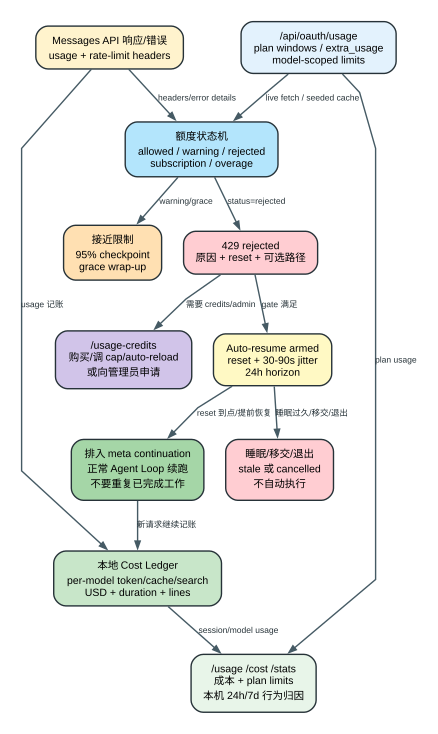

# Claude Code CLI 2.1.235 Usage、Cost、Credits 与 Limits：从每次 token 到自动续跑

Claude Code 的“用量”不是一个数字。2.1.235 同时维护本地 session 成本账本、每模型 token 明细、服务端订阅额度状态、usage credits/overage 状态、额度预警、grace window、自动续跑，以及基于本机 transcript 的行为归因。它们的数据来源、持久化时间和可信边界不同：本地 cost 可以解释当前进程花了多少钱，服务端 headers/API 决定账号还能不能继续，本机行为分析只能解释这台机器上的部分消耗。

本文只描述 **2.1.235 客户端实现和它能够观察到的服务端字段**。余额结算、组织账单、服务端限额算法和跨设备总量属于 `Boundary`。

## 60 秒理解 Usage 系统

**读者问题：** `/usage` 为什么有时显示美元成本，有时显示 session/weekly limit；达到限制后 Claude Code 为什么还能 wrap up，甚至在 reset 后自动继续？

**一句话模型：** 每次 API usage 先进入本地成本账本；响应 headers 和 `/api/oauth/usage` 更新账号额度状态；接近限制时客户端插入 checkpoint 提示，拒绝后可在满足条件时武装 auto-resume，reset 到点后再向同一会话排入一条“继续但不要重复工作”的虚拟用户消息。



贯穿场景：主会话在 weekly limit 接近 95% 时运行一个包含多个 subagent 的任务。

1. 每次响应的 input/output/cache/web-search usage 按 model 和 speed 计算本地美元成本，并累计到 session ledger。
2. rate-limit headers 更新 five-hour、seven-day、model-scoped 和 overage 状态；旧账号或更早时间的观察会被丢弃。
3. five-hour raw utilization 达到 95% 且未进入 overage 时，客户端准备 checkpoint 提示，要求结束当前步骤、列出最多三个剩余事项，并停止启动长任务/subagent。
4. 429 拒绝后，客户端区分 subscription limit、usage credit limit、组织/成员 cap、余额耗尽等原因，决定展示 reset、`/usage-credits` 或管理员路径。
5. auto-resume 满足 gate 时进入 `armed`，reset 后排入 meta continuation；若机器睡眠跨过 reset 太久，则转为 `stale`，避免无上下文地突然执行。
6. `/usage` 还扫描本机最近 transcript，提示 cache miss、long context、subagent-heavy、高并发和 cron 型消耗，但明确不包含其他设备或 claude.ai。

| 层 | 数据来源 | 本地拥有的状态 | 能回答的问题 | 不能回答的问题 |
| --- | --- | --- | --- | --- |
| Session cost | API `usage` + baked prices | cost ledger、modelUsage | 当前会话本地估算花了多少 | 服务端最终账单 |
| Plan limits | response headers、quota probe | `currentLimits`、raw utilization | 当前客户端观察到哪个额度接近/拒绝 | 服务端限额算法 |
| Usage API | `/api/oauth/usage` | 短期缓存、格式化结果 | plan、extra usage、model scoped utilization | 跨账号实时一致性保证 |
| Usage credits | usage API + admin/purchase APIs | UI/dialog 状态、cached reason | 能否开启/购买/申请更多 credits | 支付与扣款内部实现 |
| Auto-resume | limit state + local timer/queue | idle/armed/stale/claim | reset 后是否自动续跑 | 进程退出后的持久定时执行 |
| Behavior attribution | 本机 transcript | 24h/7d aggregate | 哪类本地行为贡献较大 | 其他设备和服务端完整归因 |

## 1. 本地成本账本保存什么

核心 ledger 是一个进程内对象，独立累计 [1750-1845](../reverse/javascript/cli.readable.js#L1750)：

- `totalCostUSD`；
- API 总耗时和去除 retry 的 API 耗时；
- tool 总耗时；
- wall-clock session 时长与逻辑起点；
- added/removed lines；
- 是否出现 unknown-model cost；
- 按原始 model key 分组的 token、cache、web search、cost、context window 和 max output。

`recordCost(cost, modelUsage, model)` 同时更新 per-model row 和总成本。ledger 不从终端显示文本反推数据；它直接在每次 API usage 被归一化后更新。

### 1.1 modelUsage 每个字段是什么意思

| 字段 | 含义 | 单位/来源 |
| --- | --- | --- |
| `inputTokens` | 未命中 prompt cache 的输入 | API usage token |
| `outputTokens` | 模型输出，包含计费的 thinking/output | API usage token |
| `cacheReadInputTokens` | 从 prompt cache 读取的输入 | API usage token |
| `cacheCreationInputTokens` | 写入 prompt cache 的输入 | API usage token |
| `webSearchRequests` | server tool web search 次数 | request count |
| `costUSD` | 客户端按 baked/extra price 计算的累计 | USD estimate |
| `contextWindow` | 该模型当前解析出的上下文上限 | token capacity |
| `maxOutputTokens` | baked model 默认 max output | token capacity |
| `canonicalModel` | 规范化 model ID | catalog identity |
| `provider` | first-party/Bedrock/Vertex 等 | provider selector |

同一 canonical model 如果以不同 provider-specific ID 出现，ledger 先按原始 key 保存；`/usage` 展示时再按 canonical short name 聚合 [163681-163721](../reverse/javascript/cli.readable.js#L163681)。

## 2. 美元成本公式

本地公式位于 [69535-69621](../reverse/javascript/cli.readable.js#L69535)：

```text
cost = input_tokens / 1e6 * input_price
     + output_tokens / 1e6 * output_price
     + cache_read_tokens / 1e6 * cache_read_price
     + cache_write_5m_tokens / 1e6 * cache_write_5m_price
     + cache_write_1h_tokens / 1e6 * cache_write_1h_price
     + web_search_requests * web_search_price
```

`cache_creation_input_tokens` 是总 cache write；其中 `ephemeral_1h_input_tokens` 先按 1h 单价计费，剩余按 5m 单价。客户端用 `min(ephemeral_1h, total_cache_creation)` 防止服务端字段异常导致 1h 数量超过总写入。

### 2.1 价格来源优先级

1. Fast Mode 的特定 model/speed 价格；
2. baked model catalog；
3. `additionalModelCostsCache` 中服务端发现的额外模型价格；
4. 仍未知时记录 `tengu_unknown_model_cost`，标记成本可能不准，并用默认模型价格兜底。

因此 unknown model 不会让成本显示完全中断，但 `/usage` 会附加“costs may be inaccurate”。这是一种可用性回退，不是精确计费证明。

### 2.2 Fast Mode 和 Advisor 的成本

Fast Mode 对 Opus 4.8/5 使用 $10 input / $50 output per Mtok 的独立本地价格，普通 catalog tier 为 $5/$25。Advisor 返回的嵌套 usage 也会被拆出，按 advisor model 单独计算后递归加入总成本，并记录 `tengu_advisor_tool_token_usage` [163722-163763](../reverse/javascript/cli.readable.js#L163722)。

这意味着一个表面上的“主模型请求”可能包含主模型 cost 与 advisor cost 两部分。参见 [Advisor 双模型运行时](advisor-dual-model-runtime.md)。

## 3. 成本何时记录、何时停止

API 完成后，客户端用归一化 usage 更新 model row 和 ledger。Agent Loop 的每个终态都读取同一个 `V0()`，把 `total_cost_usd` 放入 SDK result [597823-597881](../reverse/javascript/cli.readable.js#L597823)。

`maxBudgetUsd` 的判断是 `V0() >= budget` [163650-163655](../reverse/javascript/cli.readable.js#L163650)。因此它有三个精确边界：

1. 这是客户端累计值，不是服务端预授权；
2. 检查发生在已返回 usage 被记账之后，最后一次请求可以把总额推过阈值；
3. 达到后 Agent Loop 产生 `terminal_reason:"budget_exhausted"` 和 `error_max_budget_usd`，不会回滚已经完成的模型调用或工具副作用。

## 4. Session cost 的恢复与持久化

退出/状态保存时，客户端写入 `lastCost`、durations、lines、token totals、web searches、per-model usage 和 `lastSessionId` [163650-163680](../reverse/javascript/cli.readable.js#L163650)。恢复只在目标 session ID 与 `lastSessionId` 相同的情况下发生；否则不会把上一会话成本串到当前会话。

恢复时会用当前模型目录重建 `contextWindow` 和 `maxOutputTokens`，但保留上次记录的 token/cost。也就是说历史 usage 是历史事实，capacity 元数据则按当前客户端解析补齐。

### 4.1 `/usage`、`/cost`、`/stats` 是同一入口

2.1.235 把三个名称注册到同一命令：`usage`，aliases 为 `cost`、`stats` [364410-364433](../reverse/javascript/cli.readable.js#L364410)。

- Claude account 且 plan usage 可用时：显示 subscription/overage、rate limits 和本机行为归因；
- API-key、gateway 或无 plan usage 场景：回退到 session cost、duration、code changes 和 model usage；
- SDK control request 还提供 `get_session_cost` 和结构化 `get_usage` [601716-601728](../reverse/javascript/cli.readable.js#L601716)。

`get_session_cost` 返回格式化文本；`get_usage` 返回结构化对象，包含 session、subscription type、rate limits 和 behaviors。两者不要混用作机器解析合同。

## 5. Plan limit 状态从哪里来

客户端有两条观测路径：

1. **每次 Messages 响应/错误的 headers。** 这是随真实请求更新的主路径；
2. **主动 quota probe。** 向当前模型发送 `max_tokens:1`、内容为 `quota` 的请求，仅在 Claude account、非 SDK/noninteractive 条件满足时使用 [231334-231360](../reverse/javascript/cli.readable.js#L231334)。

核心 headers 包括：

| header family | 解释 |
| --- | --- |
| `...-status` | `allowed`、`allowed_warning`、`rejected` |
| `...-reset` | 主额度 Unix seconds reset time |
| `...-fallback` | 是否有统一额度 fallback |
| `...-representative-claim` | 当前主导额度，如 `five_hour`、`seven_day` |
| `...-overage-status` | credits/overage 的 allowed/rejected 状态 |
| `...-overage-reset` | overage reset time |
| `...-overage-disabled-reason` | 为什么不能使用 credits |
| `...-overage-in-use` | 是否已经在用 overage |
| `...-upgrade-paths` | 服务端提供的升级路径 |
| `...-period-*-utilization` | 月度/channel usage-credit utilization |

解析器把“subscription rejected 但 overage allowed”表示为 `isUsingOverage:true`，而不是简单 `status:allowed` [231381-231387](../reverse/javascript/cli.readable.js#L231381)。这样 UI 既能说明原订阅额度已耗尽，又能显示任务仍靠 credits 继续。

## 6. 多窗口 warning 阈值

服务端可以直接给 `surpassed-threshold`；没有时客户端按 utilization 和时间进度计算 warning [231351-231375](../reverse/javascript/cli.readable.js#L231351)。本版默认规则：

| window | utilization 门槛 | 时间进度上限 | 解释 |
| --- | ---: | ---: | --- |
| five-hour | 90% | 72% | 在窗口较早阶段已用 90%，提示速度过快 |
| seven-day | 75% | 60% | 周期尚未过 60% 已用 75% |
| seven-day | 50% | 35% | 周期尚未过 35% 已用 50% |
| seven-day | 25% | 15% | 周期尚未过 15% 已用 25% |

UI 还有一道噪声过滤：`allowed_warning` 且 utilization 小于 70% 时通常不展示 [231121-231136](../reverse/javascript/cli.readable.js#L231121)。服务端状态和用户可见 warning 不是一回事。

## 7. 状态机如何防止旧数据污染新账号

`hYp` 维护 `accountEpoch`、`lastAppliedObservationAtMs` 和 `limitsObserved` [231430-231548](../reverse/javascript/cli.readable.js#L231430)：

- 登录账号切换时 epoch 自增；旧异步请求返回后因 epoch 不匹配被丢弃；
- 同一账号中，timestamp 早于已应用观察的结果被视为 stale；
- status 变化才发 `statusChanged` 和遥测；
- 429 error 即使 headers 不完整，也会与 error details 中的 `credits_required` 合并；
- gateway 若没有统一 rate-limit headers，不把普通 429误判成 Claude account quota。

这是典型的异步一致性保护：网络响应完成顺序不能覆盖业务发生顺序。

## 8. 接近限制时的 checkpoint 与 grace window

raw five-hour utilization 达到 `0.95`，且没有 overage in use/allowed 时，客户端只在首次进入 zone 时置 `pendingNearLimitWrapUpHint` [231473-231505](../reverse/javascript/cli.readable.js#L231473)。消费后会向模型加入：

```text
[Usage limit approaching. Checkpoint now: finish the current step,
then list up to 3 short bullets of the most impactful remaining work.
Don't start subagents or long-running work.]
```

达到限制但服务端给 grace window 时，有两种提示：普通 wrap-up，或更严格的 checkpoint/next-steps。它们都明确禁止新 subagent 和长任务 [231645-231652](../reverse/javascript/cli.readable.js#L231645)。

客户端使用“进入 zone 一次、消费一次”的 latch，避免每个响应重复插入同一提示。退出 zone 或开始使用 overage 后 latch 重置。

## 9. 拒绝原因不是一个统一的“额度不足”

`A1S` 会组合 subscription limit、overage status、reset time、plan、admin role 和 disabled reason 生成不同提示 [231137-231205](../reverse/javascript/cli.readable.js#L231137)：

| reason/状态 | 含义与动作 |
| --- | --- |
| `out_of_credits` | credits 已耗尽，显示 overage reset 或联系 admin |
| `org_level_disabled_until` | 组织暂时关闭 usage credits |
| `org_spend_cap_reached` | 组织/个人周期 spend cap 达到 |
| `member_level_disabled` | 管理员关闭成员 allocation |
| `member_zero_credit_limit` | 成员 limit 为 0 |
| `group_zero_credit_limit` | group limit 为 0 |
| `seat_tier_level_disabled` | seat 不含 credits |
| `org_service_level_disabled` | 组织禁用该服务 |
| `overage_not_provisioned` | 尚未配置 usage credits |
| `no_limits_configured` | 没有可用 credits limit 配置 |

此外 `rateLimitType` 还能是 session/five-hour、weekly/seven-day、Opus、Sonnet、Fable overage-included 或纯 overage。文案会指向 `/model`、`/effort medium`、`/upgrade` 或 `/usage-credits`，而不是一律建议等待。

## 10. `/api/oauth/usage` 与本地缓存

usage fetch 调用 `GET /api/oauth/usage`，timeout 5 秒，并允许 OAuth 401 刷新后重试 [216437-216447](../reverse/javascript/cli.readable.js#L216437)。客户端校验返回必须是 object，且至少包含已知 usage 字段之一；fieldless body 或 in-band rate-limit envelope 不会当成功数据。

成功数据可包含：

- `five_hour`、`seven_day`；
- OAuth apps、Opus、Sonnet 等 scoped windows；
- `cinder_cove` one-time credit；
- `extra_usage`；
- 通用 `limits[]`，其中 scope 可带 model/surface display name。

持久化缓存的写入节流是 5 分钟，读取有效期是 1 小时 [231401-231416](../reverse/javascript/cli.readable.js#L231401)。live fetch 失败或 429 时，可以用当前 headers 或持久化缓存 seed `/usage`；结果会标为 `seeded`，不能伪装成刚刚在线获取。

## 11. `get_usage` 返回对象怎么读

结构化 control response 由 `IYn` 生成 [364350-364357](../reverse/javascript/cli.readable.js#L364350)：

```text
session
  total_cost_usd
  total_api_duration_ms
  total_duration_ms
  total_lines_added / removed
  model_usage
subscription_type
rate_limits_available
rate_limits
  five_hour / seven_day / ... / model_scoped
behaviors
  day / week
```

`rate_limits_available:false` 不等于账号没有额度；它只说明当前认证/运行条件不能读取 Claude account plan usage。`rate_limits:null` 也可能是 live fetch 和 seed 都不可用。

## 12. 本机行为归因是如何计算的

`/usage` 会扫描本机 transcript 中的 assistant usage 记录，构造最近 24h 和 7d aggregate [364240-364357](../reverse/javascript/cli.readable.js#L364240)。它不是服务端账单分解，而是客户端启发式诊断。

### 12.1 五类行为

| behavior | 判定条件 | 展示门槛 |
| --- | --- | --- |
| `cache_miss` | 单请求 uncached input > 100k token | 该行为 cost 占总 cost >= 10% |
| `long_context` | input + cache read + cache create > 150k token | >= 10% |
| `subagent_heavy` | session subagent count >= 3，或 subagent cost > session cost 50% | >= 10% |
| `high_parallel` | 同一 5 分钟 bucket 内 >= 4 个 session | >= 10% |
| `cron` | 一个 session 活跃跨越 >= 8 个小时 bucket | >= 10% |

它还按 agent/skill/plugin/MCP server 聚合 cost percentage，最多显示前 8 项。attribution 只信任 bundle 中允许记录的名称；第三方或不可安全记录的值会归一化为 custom/third-party。

### 12.2 数据边界

UI 明确写明：近似值、只基于这台机器的 local sessions、不包括其他设备或 claude.ai；各 behavior 是可重叠特征，不是加和为 100% 的互斥账单分类 [364374-364409](../reverse/javascript/cli.readable.js#L364374)。

例如一个 180k-token、含 4 个 subagent、同时有 4 个 session 的请求，可以同时计入 long-context、subagent-heavy 和 high-parallel。

## 13. Usage Credits 的用户流程

`/usage-credits` 是正式命令，隐藏 alias `/extra-usage` 只返回重命名说明 [366901-366938](../reverse/javascript/cli.readable.js#L366901)。

### 13.1 Team/Enterprise 非管理员

客户端先读取 `extra_usage`：

- 组织已耗尽/到 cap：直接提示联系 admin；
- 已经 unlimited：不重复申请；
- eligibility 明确禁止：提示联系 admin；
- 已有 pending request：不重复创建；
- 其他情况展示确认，调用 admin request API 创建 `limit_increase`。

非交互会话不会静默替用户发送管理员申请，只提示必须在 interactive session review 并发送 [366759-366909](../reverse/javascript/cli.readable.js#L366759)。

### 13.2 管理员或个人计划

管理员打开 `claude.ai/admin-settings/usage`，个人计划打开 `claude.ai/settings/usage`。交互式 inline dialog 还可以：

- 启用 usage credits；
- 查看 monthly limit、used credits、currency；
- 调整 limit；
- 购买 preset bundle；
- 配置 auto-reload threshold/reload-to；
- 没有 payment method 时回退浏览器。

这些是客户端可见工作流；实际支付、余额和 admin authorization 由服务端完成。

## 14. Auto-resume 的 gate

额度 reset 后自动继续不是所有 429 都触发。`T$t` 要求 [331940-332045](../reverse/javascript/cli.readable.js#L331940)：

- Claude account/feature 可用，且不是被排除的运行宿主；
- remote config `tengu_marble_heron` enabled；
- billing type 不是 `usage_based`；
- limit 状态为 `rejected`；
- 有有限、合法的 `resetsAt`；
- 当前没有使用 overage，且没有 overage-in-use；
- `autoContinueAtUsageLimit` 的来源允许用户设置；
- auto arm 没被 setting/killswitch 关闭。

自动 arm 还要求 reset 距离不超过 24 小时，并排除与当前 model 不相关的 model-scoped limit [332046-332086](../reverse/javascript/cli.readable.js#L332046)。

## 15. Auto-resume 状态机

初始对象保存的不只是 timer [331907-331936](../reverse/javascript/cli.readable.js#L331907)：

```text
idle
-> armed(resetAt, fireAt, origin)
-> fired -> pending continuation message -> active turn claim -> idle
-> stale -> 等待用户恢复
```

同时维护：

- `consecutiveRearms`；
- arm 前已在队列中的 command UUID；
- 用户 takeover UUID；
- pending continuation UUID；
- active turn claim；
- handoff/relaunch 标志；
- settings presence 扫描与 revocation generation；
- 已处理 reset key 的 dedupe set。

这套字段解决的核心问题是：reset timer、用户手工输入、队列已有命令、会话切换和第二次 quota rejection 会并发发生，必须只让其中一条路径拥有“继续这个 episode”的权利。

### 15.1 fire time 不是 resetAt 原点

默认在 reset 后增加 30-90 秒随机 jitter，避免所有 CLI 同时冲击服务端 [332047-332091](../reverse/javascript/cli.readable.js#L332047)。若 episode rearm，还会叠加递增 backoff。配置数值被限制在 0 到 6 小时。

### 15.2 fired 时真正做了什么

客户端不会直接递归调用当前 Agent Loop。它向主消息队列写入一条 `origin:{kind:"auto-continuation"}` 的 meta prompt [332221-332235](../reverse/javascript/cli.readable.js#L332221)：

```text
Your claude.ai usage limit has reset. Continue the task you were working on
when the limit was reached; do not repeat work that is already complete.
```

这条消息经过正常 input、context、permission 和 Agent Loop。它不是绕过权限的后台重放。

### 15.3 early availability

timer 尚未到，但主动 quota probe 发现额度已经可用时，客户端可以提前 fire，并使用 `usage is available again before the usage-limit reset` 版本的 continuation [332092-332124](../reverse/javascript/cli.readable.js#L332092)。

### 15.4 stale 防止睡眠唤醒后突然执行

如果事件循环在 reset 后停顿超过 grace，状态转为 `stale` 而不是直接排任务 [332209-332221](../reverse/javascript/cli.readable.js#L332209)。默认 grace 是 30 分钟，可配置但限制在 1 分钟到 6 小时。这样笔记本休眠一夜后不会无条件恢复旧任务。

### 15.5 rearm cap

自动 continuation 本身再次撞到 quota 时可以 rearm，最多连续 2 次；超过后产生 `rearm_cap`，清理 episode 并停止自动继续 [332306-332333](../reverse/javascript/cli.readable.js#L332306)。这防止服务端 reset/额度观察异常造成无限 stop-resume loop。

## 16. 哪些动作取消自动续跑

以下动作会结束或移交 episode [332125-332173](../reverse/javascript/cli.readable.js#L332125)：

- `escape`、`ctrl_c`、kill-agents chord：用户显式取消；
- account switch、conversation reset；
- background handoff；
- relaunch/process exit；
- Desktop handoff、cloud handoff；
- setting off、killswitch、horizon exceeded；
- 用户手工 submit/takeover；
- continuation 被队列丢弃。

进程退出后的 auto-resume **不持久执行**。提示明确要求用户 reset 后重新发 prompt。它是当前进程和当前会话队列的恢复功能，不是 durable scheduler。

## 17. 与 session、compact、background 的边界

- auto-resume continuation 依赖同一 session 的 transcript；compact 可能改变上下文，但不会改变 reset timer 的业务含义；
- background/cloud/Desktop handoff 会取消本地 auto-resume，防止两个 owner 同时续跑；
- 已完成的工具调用不会因 quota rejection、stale 或 cancellation 回滚；
- checkpoint 提示只能影响模型后续行为，不能保证远端副作用自动事务化；
- `progress saved` 指 transcript/checkpoint 可续接，不代表外部系统状态可恢复。

## 18. 诊断顺序

### “成本不对”

1. 查看 modelUsage 是否包含多个原始 model/provider key；
2. 检查 `speed:"fast"` 是否采用独立价格；
3. 检查 advisor iterations 是否递归计费；
4. 查看 unknown-model warning 和 `additionalModelCostsCache`；
5. 核对 1h/5m cache creation 拆分；
6. 最终以服务端账单为准，本地值是 estimate。

### “额度明明重置了却没继续”

1. `autoContinueAtUsageLimit` 是否允许且来源为 user setting；
2. 是否为 rejected + finite resetsAt + no overage；
3. reset 是否超过 24h horizon；
4. 是否发生 relaunch/background/Desktop/cloud handoff；
5. 是否进入 stale；
6. rearm 是否已到 2 次 cap；
7. pending continuation 是否被手工 takeover 或队列清理。

### “为什么 `/usage` 没有 plan limit”

1. 是否 Claude account OAuth，而非普通 API key/gateway；
2. profile/usage scope 是否可用；
3. `/api/oauth/usage` 是否返回已知字段；
4. live fetch 失败时 headers/persisted seed 是否存在；
5. `rate_limits_available` 与 `rate_limits` 要分开解释。

## 19. 用户影响

### 成本控制

- prompt cache read/write、Fast Mode、advisor 和 web search 都进入本地成本；
- `maxBudgetUsd` 是事后边界，可能小幅越过；
- `/effort medium`、换模型和减少 cache miss/long context 是不同层面的降本手段。

### 连续性

- 95% checkpoint 和 grace prompt 优先保住可交接状态；
- auto-resume 用 queue message 延续正常 Agent Loop，不绕过权限；
- stale、handoff cancellation 和 rearm cap 防止无人值守的重复执行。

### 隐私

- behavior attribution 扫描本机 transcript usage 与 attribution 元数据；
- `/api/oauth/usage` 读取账号/组织 usage；
- 本地行为报告不会自动等价于服务端全量画像；
- 第三方 attribution 会被归一化，避免任意名称直接进入遥测维度。

## 20. 证据与边界

**Static 可证明：** ledger 字段、价格公式、Fast/Advisor cost、session persistence、rate-limit header parser、warning 阈值、stale observation 防护、checkpoint/grace prompt、usage fetch/cache、behavior heuristics、usage-credit UI 路由、auto-resume gate/state/cancellation/rearm cap。

**Boundary：**

- 服务端最终账单、税费、折扣、credits 换算；
- rate-limit utilization 和 reset 的服务端计算算法；
- 组织管理员审批、支付、auto-reload 的服务端事务；
- 其他设备、claude.ai 和未落入本机 transcript 的 usage；
- 当前账号某一时刻的余额、limit、feature flag 和 admin role。

## 21. 源码导航

| 机制 | readable JS |
| --- | --- |
| Cost ledger | [1750-1845](../reverse/javascript/cli.readable.js#L1750) |
| Session cost 保存/恢复/展示 | [163650-163763](../reverse/javascript/cli.readable.js#L163650) |
| Price formula、cache、Fast price | [69535-69621](../reverse/javascript/cli.readable.js#L69535) |
| Usage API fetch | [216437-216447](../reverse/javascript/cli.readable.js#L216437) |
| Limit 文案、headers、阈值 | [231121-231416](../reverse/javascript/cli.readable.js#L231121) |
| Limit 状态机与 stale observation | [231430-231652](../reverse/javascript/cli.readable.js#L231430) |
| 本机 behavior analyzer 与 `get_usage` | [364240-364433](../reverse/javascript/cli.readable.js#L364240) |
| Usage credits 命令与 admin 路由 | [366759-366938](../reverse/javascript/cli.readable.js#L366759) |
| Auto-resume 状态机 | [331907-332410](../reverse/javascript/cli.readable.js#L331907) |
| SDK get cost/usage | [601716-601728](../reverse/javascript/cli.readable.js#L601716) |
| Max budget terminal result | [597823](../reverse/javascript/cli.readable.js#L597823) |
