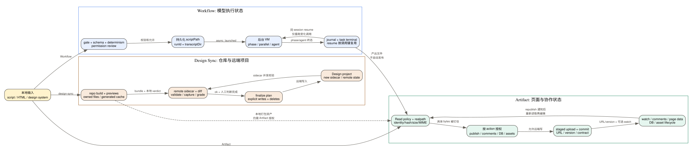

# Claude Code CLI 2.1.235 的 Workflow、Artifact 与 Design 数据链

Workflow、Artifact 和 Design 经常被笼统地归为“生成内容”，但它们控制的是三种不同状态：Workflow 编排模型执行，Artifact 把本地文件发布成可交互网页，Design Sync 把仓库中的设计系统转换并同步到远端项目。三者都可能启动后台任务或网络写入，却没有共享一个可回滚事务。

## 60 秒理解三条链

**读者问题：** 为什么 Workflow 已经返回成功却还没有最终结果？为什么同一路径重新发布会更新原 Artifact，而换一个路径会新建？为什么 Design Sync 既要在本地生成 bundle，又要读取远端 sidecar？

**一句话模型：** Workflow 的返回值只确认编排任务已登记；Artifact 的发布身份由本地源路径、已知 URL、内容版本和授权钉住共同决定；Design Sync 则以本地仓库为源、远端项目为目标，通过 sidecar/hash 把两边状态对齐。



贯穿场景：Claude 先用 Workflow 并行调研和生成报告，把脚本固化到当前 session 目录；报告写成 HTML 后，Artifact 校验文件身份、大小、支持文件和授权，再发布私有 URL 并建立本会话 watch；若报告还要展示团队组件，Design Sync 会从仓库构建设计系统 bundle，与远端 sidecar 做差异验证，再显式上传到 Design 项目。Workflow 完成不能证明 Artifact 已发布，Artifact URL 也不能证明 Design 项目已同步。

| 状态对象 | 所有者 | 成功标志 | 进程退出后 |
| --- | --- | --- | --- |
| Workflow script | session 目录中的持久化脚本 | tool result 返回 `scriptPath` 与 `runId` | 文件可保留；运行中的 JS VM 不保留 |
| Workflow run/journal | task registry、transcript 目录、journal | task 进入终态，phase/agent 结果落 journal | 可按同 session 的 `runId` 恢复已完成调用 |
| Artifact source | 当前工作区文件及 supporting files | 文件读取、hash/identity、大小与 MIME 校验通过 | 本地文件继续存在；远端发布不自动回滚 |
| Artifact page/version | claude.ai Artifact 服务 | 返回 URL、version、title、contract | 客户端退出不会主动撤销已返回的 URL/version；服务端保留期限和版本历史仍是 Boundary；本会话 watch 不随 resume 复活 |
| Artifact interaction | comments、DB、assets、page data、decision state | 各 action 的专属 result | 客户端退出不会主动删除已提交交互；服务端保留/删除保证仍是 Boundary，需按 action 再读，不能由旧 transcript 猜测 |
| Design bundle | `.design-sync/` 与输出目录 | build/diff/validate/capture verdict `ok` | 本地文件保留，缓存与临时产物按目录规则处理 |
| Design project | claude.ai Design 项目 | upload/finalize 返回远端对象与新 sidecar | 客户端退出不会主动删除已返回的远端对象；保留期限、账号权限和项目状态仍是远端 Boundary |

## 一、Workflow 不是“多开几个 Agent”

### 1. 输入先解析成可恢复脚本

`Workflow` 接受三种主入口：

| 入口 | 解析规则 | 适用场景 |
| --- | --- | --- |
| `script` | 直接解析自包含 JavaScript | 一次性编排或首次设计流程 |
| `name` | 从 built-in、`.claude/workflows/` 或 plugin workflow 解析 | 复用受版本管理的流程 |
| `scriptPath` | 从磁盘读取；优先于 `script` 和 `name` | 修改已持久化脚本后迭代 |

脚本必须以纯字面量 `export const meta = { name, description, phases }` 开始，随后才能调用 `agent()`、`parallel()`、`pipeline()`、`phase()`。`args` 以真实 JSON 值暴露给脚本；把数组先 JSON stringify 成字符串会改变脚本类型语义。

每次调用都会把脚本持久化到 session 目录并把 `scriptPath` 返回给模型。这个设计同时解决两个问题：后续轮次无需把完整脚本重新塞进上下文；恢复时可以对脚本内容做 hash 和结构校验，而不是相信 transcript 中一段可能被 compact 的文本。

### 2. Gate 顺序

实际进入执行前至少经过以下决策：

1. server fallback 是否撤回该次 tool dispatch；撤回时返回专用错误，不执行脚本；
2. managed `disableWorkflows` 或 `CLAUDE_CODE_DISABLE_WORKFLOWS` 是否关闭能力；
3. session 的计划/组织/启动 gate 与 `enableWorkflows` 是否让工具可达；
4. named-only 环境是否只允许 `{name,args}`，拒绝 inline script、`scriptPath`、resume 和 remote；
5. name/path 是否能解析，脚本是否通过 meta 与语法校验；
6. inline script 是否使用 `Date.now()`、`Math.random()`、`new Date()` 等破坏确定性恢复的 API；
7. `resumeFromRunId` 指向的旧 run 是否仍在运行；
8. `Workflow(name)` 的 deny/ask/allow permission rule；未命中 allow 时默认要求查看实际展开后的脚本。

named workflow 的 permission rule 绑定名字；permission dialog 展示的是解析后的 script。这样管理员可以允许固定 workflow 名，但脚本内容变化仍会进入内容校验和运行时持久化，而不是只凭名称执行任意字符串。

### 3. `workflowSizeGuideline` 是提示预算，不是硬上限

`2.1.235` 的四档值为：

| 值 | 注入给模型的指导 |
| --- | --- |
| `small` | 尽量少于 5 个 agents |
| `medium` | 默认，尽量少于 15 个 agents |
| `large` | 尽量少于 50 个 agents |
| `unrestricted` | 不注入数量指导 |

源码明确把它称为 guideline。它影响模型写出的脚本规模，但不等于 runtime 的强制 agent cap。运行时仍有自己的 agent/budget 错误，例如 `WorkflowAgentCapError` 和 `WorkflowBudgetExceededError`；不能把“medium 15”解释成第 15 个一定被拒绝，也不能把 unrestricted 解释成没有成本或资源限制。

settings 中显式 `workflowSizeGuideline` 优先于 `/config` 的选择，并隐藏对应配置行。运行中发生变化时，客户端通过 `workflow_size_guideline_change` attachment 把新指导加入后续上下文，已启动 run 不会因此自动重写脚本。

### 4. 启动结果与最终结果是两次状态变化

新 run 获得：

- `taskId`: task registry 的后台任务身份；
- `runId`: `wf_<uuid-prefix>`，用于同 session 恢复；
- `workflowName`、`summary`；
- `transcriptDir`: 子 Agent transcript 目录；
- `scriptPath`: 可编辑的持久化脚本。

工具立即返回 `status: async_launched`，随后后台 VM 执行 phase 和 agent 调用。因此本轮 tool result 只表示“已登记并开始”，最终成功、失败、停止要从 `/workflows`、Task 状态、通知或 journal 判断。把 `async_launched` 当成业务完成会丢失后台失败。

remote workflow 返回 `remote_launched`、`taskType: remote_agent` 和 `sessionUrl`。它在 CCR 的新鲜 clone 上执行，进度在远端 session URL，而不是本地 `/workflows`。源码还会返回本地分支与已推送分支可能分叉的 warning；未提交、未推送状态不能假设出现在远端 clone。

### 5. 恢复为什么要求确定性

`resumeFromRunId` 只在同 session 内成立。恢复时：

1. 先停止旧的 running task；
2. 重新读取当前 `scriptPath`；
3. 校验 adopted script 的 content pin、`scriptSha256`、meta 和可编译性；
4. 用 journal 中的调用键比较 `agent(prompt, opts)`；
5. prompt 与 opts 未变的完成调用直接返回缓存结果；
6. 修改或新增的调用重新执行。

因此禁止时间和随机 API 不是普通 lint 偏好，而是为了让相同调用键可复现。缓存结果本身可能为空；tool result 明确要求先检查 `journal.jsonl`，不能因为命中 cache 就推断存在可展示文本。

失败边界：脚本语法错时 task 可被登记为带 `error` 的结果；运行中 agent 不可用、tool pool 被 policy 清空、structured output retry 达上限、预算耗尽或 journal pin 不一致都会留下不同错误。已经完成的 Agent、文件写入或外部工具副作用不会因为后续 phase 失败而原子回滚。

## 二、Artifact 是发布协议，不是 HTML 预览器

### 1. 基础发布链

Artifact 的主路径是：

```text
HTML/Markdown source
-> Read 权限与真实文件身份检查
-> 读取完整内容和 supporting files
-> 结构、大小、MIME、CSP 与 title 检查
-> Artifact 专属 consent/policy
-> 上传 staged version
-> 远端 commit/rename
-> URL + version + contract
-> 可选 live watch / comments / DB / assets
```

发布不是 `Read` 的同义词。它先读取本地内容，再把 bytes 写到远端；即使 Read permission 已允许，publish、asset upload、comment reply、DB write 仍各有自己的外发或持久化授权。

### 2. 路径、URL 和版本各自负责什么

| 输入/字段 | 作用 | 常见误区 |
| --- | --- | --- |
| `file_path` | 本次本地源文件；同 session 同路径可关联已有 publish | 文件名相同不代表远端对象相同 |
| `url` | 明确更新早先会话的既有 Artifact | 省略 URL 会自动找到用户想要的旧页面 |
| `version` | stale guard/远端版本并发校验 | transcript 里看过 URL 就拥有最新版本 |
| `artifactReadVersions` | 当前 session 已读版本记忆 | resume 后仍保留进程内所有读取状态 |
| `staleGuardSeedBatch` | 批量播种的版本钉住 | 能替代重新读取 live version |

更新早先会话中的 Artifact 时必须先通过 URL、`action:list` 或用户提供的链接恢复远端身份。只用一个新本地路径发布会创建新 Artifact，而不是修改旧 URL。

客户端维护“本会话是否读过 live version”的 stale guard。若试图更新一个未读 live version 的页面，会拒绝 publish，避免用旧本地副本覆盖协作者的新版本。watch 通知也只告诉“发生了变化”，通知不携带正文；编辑前仍要重新读取。

### 3. 文件身份钉住防止批准后被替换

asset upload 与 publish 都不能只在 permission dialog 中显示路径字符串。`2.1.235` 会检查：

- resolved path 是否命中 Read deny；
- symlink 是否跳到允许目录外；
- 是否为 regular file、是否为空；
- 是否位于网络路径、UNC、`/net` automount 或设备式路径；
- volume 是否提供可用 file identity；
- hard link 是否意味着其他路径也能替换同一 inode；
- approval 后文件是否移动、替换或重写。

如果批准时的文件身份和真正上传时不一致，错误文本要求重新发起，让权限检查针对新 bytes 再跑一次。这是典型 TOCTOU 防护：批准的是一份具体文件，而不是一个可被换包的路径标签。

### 4. 大小与文件数量

本版客户端常量给出：

| 对象 | 上限 |
| --- | ---: |
| 渲染后的主页面/raw content | 16 MiB |
| 每个 supporting text file | 16 MiB |
| 每个 supporting binary file | 15 MiB |
| supporting files 数量 | 255 |
| 每个版本 supporting files 总量 | 64 MiB |
| 单个 asset store 文件 | 20 MiB |
| HTML `<title>` 扫描窗口 | 前 8 KiB |
| 单 session webhook trigger | 10 |

主页面中的 data URI 计入 16 MiB。Supporting file 必须逐项列出，source 必须位于 working directory 下；`root` 只改变 source 的解析基准，不改变发布路径。列表形式保留磁盘相对 spelling，map 形式把“发布路径”和“源路径”分开。

### 5. CSP、Mermaid、Highlight 与 Chart 的真实归属

Artifact viewer 采用严格 CSP：普通页面不能从 CDN、外部 stylesheet、remote image、fetch/XHR/WebSocket 拉取资源；Google Fonts stylesheet/font host 是明确例外。下载链接和脚本主动保存也受 viewer sandbox 限制。

Mermaid 是 Artifact 的一方渲染能力：Markdown 的 fenced `mermaid` 和 HTML 的 `<pre class="mermaid">` 由页面包装链处理，不要求页面自己加载外部库。Highlight.js 和 Mermaid 的 bundle embed/block-strip verdict 存在于 Artifact runtime 状态，用来判断依赖是否已经安全嵌入或需要移除重复 block。

Chart.js 等库出现在 bundled payload/依赖面，不等于 Artifact 自动为任意页面注入 Chart 全局对象。页面要使用图表，必须由实际模板或 supporting JS 把所需代码带入发布包，并受总大小/CSP 约束。这个边界能防止把“bundle 里搜到 Chart.js”错误写成“所有 Artifact 原生支持 Chart.js”。

### 6. 一个工具里其实有多组权限合同

| Action | 读/写 | 授权与状态变化 |
| --- | --- | --- |
| publish/update | 远端写 | 读取完整本地文件；更新还要通过 ownership/version/stale guard |
| `list` | 远端读 | 列 mine/shared/all；shared title 是不可信文本 |
| `comments` | 远端读 | 普通命名页面可 scoped read；通知触发的读要求确认第三方文本入口 |
| `reply` | 远端写 | 发布模型生成文本给其他 viewer，始终是显式可见副作用 |
| `resolve` | 远端写 | 改 thread 状态；plan mode 禁止执行，Cowork 无 consent surface 时 fail closed |
| `watch`/`unwatch`/`status` | subscription | watch 首次授权；unwatch/status 只操作本 session 已持有状态 |
| `resume_replies` | live rail | 只恢复本 session 可恢复的自动回复；kill-all/disarm 或 remote 结构性 no-op 会拒绝 |
| `read_page_data` | 远端读 | 只读 schema-validated entries，不读任意页面正文；首次引入第三方数据需确认 |
| `read_db`/`write_db` | 远端读写 | 按 Artifact slug 记 session consent；DB rows 可由 viewer 写入 |
| `upload_asset` | 本地读 + 远端写 | 文件身份钉住、Read policy、20 MiB/MIME/quota、每 Artifact consent |
| `list_assets` | 远端读 | 返回 usage、分页 cursor 和最多 1000 条 schema 数组 |
| `read_asset` | 远端读 + 本地写 | 下载到本地非网络目录；输出 path、size、MIME、SHA-256 |
| `delete_asset` | 远端删除 | 需要 live consent surface；删除后页面引用可能立即失效 |
| `read_decisions` | 远端读 | 读取结构化 open/resolved choice，不等同于任意评论文本 |
| `live-edit` | 远端协作写 | 只在该 build 装入 live-doc implementation 时可用；否则明确 deny |

只读 action 被标成 concurrency-safe；发布、reply、resolve、DB/asset 写与 live-edit 不是。`suppressAlwaysAllowRule` 覆盖大量交互 action，说明这些授权不能简单沉淀成一个永久 `Artifact(*) allow` 后静默复用。

### 7. 结果为什么会被裁剪

Artifact 对 transcript/storage 做内容收缩：

- `db_read.docs[].data` 在持久化版本中可被清成 `{}`；
- comment text、span quote 和 anchor path/file/hash 可从 storage 结果剥离；
- subagent 的 Artifact result 需要保留控制字段，但不让大块第三方内容永久占据上下文；
- `stripToolUseResultAtCreation` 与较小的 tool result budget 防止完整网页/DB 数据重复驻留。

这不等于远端数据被删除，只代表 transcript 不是远端 Artifact 的完整镜像。resume 后需要重新读取权威对象，不能从已裁剪 result 重建协作状态。

### 8. Watch 与自动回复

本地交互会话可以持有 live background connection；远端 session 使用 durable wake subscription。发布后自动 watch 是否成功必须看 result，不能只因 publish 成功就宣称“正在监听”。

watch 的关键边界：

- 通知只说明 republish/comment wake 发生，不携带内容；
- 本地 watch 是 session-local，restart 或 `--resume` 不复活旧 socket；
- trigger 上限为 10；
- `no_originator`、client network policy、无凭据、remote session 不存在、部署未提供都会给出可区分原因；
- 用户明确 stop 后，重新 watch 需要再次确认；
- session-wide auto-reply disarm 不能用 `resume_replies` 逆转，必须新 session。

远端服务的 retention、分享权限传播、评论通知投递保证和服务端冲突算法不在 bundle 内，保持 Boundary。

## 三、Design Sync 是本地编译器加远端项目协议

### 1. 五个命令名，实际有六个运行表面

| 入口 | 作用 |
| --- | --- |
| `/design` bundled prompt hub | 处理 free-form/create/import/export/status；将 sync/login/consent/revoke 映射到专用表面，并通过本版 native Design tool 加载 live instructions |
| `/design` builtin local fallback | 只执行 consent/revoke；当 `HEi()` 为 false 或 bundled-skill kill switch 让 hub 不进入有效候选集时，它才可以成为同名查找结果 |
| `/design-login` | 用 claude.ai 账号授权 Design 访问 |
| `/design-consent` | 管理 Design 数据访问/同步 consent |
| `/design-revoke` | 撤销 Design 授权 |
| 动态 `/design-sync` | 加载 bundled Skill，把 React design system 转换并上传 |

静态 `103` 是唯一 identifier 数，不是 command object 数：两个 `/design` 对象只占一个名字。完整命令装配先放 skill/plugin/bundled prompt，再放 builtin table；解析器返回第一个进入有效候选集的精确同名项，所以 hub 可达时优先，builtin consent/revoke 是候选级后备。但 `skillOverrides.design=off` 是选中 hub 后的执行前禁用：它直接返回 disabled，不会重新搜索 builtin 同名项。`/design-sync` 则由 bundled skill/command loader 动态构造，因此不能因为它没在静态名单中就说本版不存在，也不能把动态命令数量硬加到 `103`。

`Static`：`reverse/javascript/cli.readable.js:334687-334724`、`542350-542373`、`369428-369442`、`156619-156625`、`276526-276539`。

### 2. 本地源与远端目标

Design Sync 的本地 durable tree 以 `.design-sync/` 为中心：

- `config.json`: source shape、component overrides、build contract；
- `previews/`: 用户拥有、应提交的 preview；
- `.cache/previews/`: 自动生成、gitignored 的 preview twin；
- `overrides/`: 显式 fork 的 pipeline module；
- `NOTES.md` 与 `learnings/`: 已吸收和待吸收的经验；
- 生成 bundle、截图、grade 与 `.resync-verdict.json`。

远端项目通过 DesignSync tool/服务维护 component bundle、文件和 `_ds_sync.json` sidecar。sidecar 是上一次成功同步的锚点，不是本地 source of truth；真正的组件代码仍来自当前仓库和构建结果。

### 3. 收口流程

完整 re-sync 顺序是：

1. 识别 Storybook 或 package shape，定位项目依赖；
2. 从远端读取 `_ds_sync.json` 保存到本地 cache；首次同步没有 sidecar；
3. 在 repo root 运行 driver，串联 build -> diff -> validate -> capture；
4. 读取 `.resync-verdict.json`，处理失败 stage、未合并 learnings、pending grade、canary、render warning、removed component；
5. 编写或验证 conventions header；若 header 改变，重新 build 和 verdict；
6. `finalize_plan` 前重新读取 sidecar，发现并发变化就重新 diff；
7. 只在 verdict 允许时上传 writes/deletes；
8. 成功后以新 sidecar 固化远端基线。

这个流程把可机械验证和必须人工判断拆开：文件 shape、hash、CSS/fonts、TypeScript declaration parse 可以自动校验；截图是否忠实、component 是否应删、warning 是否为已知设计例外仍需要判断。

### 4. 三档 render verification

| 变化 | Render 策略 | 原因 |
| --- | --- | --- |
| source、bundle、style 都未变且 anchor 健康 | skip | 重渲染相同 bytes 只是在测试本地 Chromium |
| 文档/guideline/anchor 等不影响 render 的变化 | sample | 保留 canary，降低全量截图成本 |
| component、preview、bundle、style、`.d.ts`/prompt hash 或 anchor 健康度变化 | full | render 输入或发布包已经改变 |

`[RENDER_SKIPPED]` 在“完全未变”时是 driver 宣布的预期结果，不是漏测。显式 `--render-sample`/`--no-render-check` 可以覆盖自动分档，但不能跳过 file-shape、stale 和 bundle header 等非视觉检查。

### 5. Ownership 规则

`.design-sync/previews/<Name>.tsx` 是用户拥有的 durable 文件；`.design-sync/.cache/previews/<Name>.tsx` 是生成 twin。直接编辑 cache twin 不会移动 grade key，且可能在下次生成时失效。要长期修改，应把文件提升到 `previews/` 并去掉 generated marker。

同样，repo-local `overrides/<name>.mjs` 必须在 config 中声明用途。存在未声明 override 或声明但文件缺失都会被诊断；这是防止 pipeline fork 悄悄漂移的版本控制合同。

### 6. 失败与不可逆边界

| 故障 | 已发生状态 | 恢复方式 |
| --- | --- | --- |
| build/parse 失败 | 只改本地输出/cache | 修 source/config，重跑 driver |
| screenshot/grade pending | bundle 可生成但 verdict 不可上传 | 完成人工 grade 或修 preview |
| sidecar 在 finalize 前变化 | 远端有并发更新 | 重新 fetch、diff、validate，禁止盲覆盖 |
| upload 部分成功 | 远端可能已写入部分 component/file | 重新读 sidecar/remote list，再按差异补偿 |
| deletePaths 错误 | 远端对象可能已删除 | 从版本控制重新构建并显式重传；无客户端原子回滚保证 |
| auth/entitlement/project 不可用 | 本地 bundle 仍可保留 | 修登录/项目访问后重新执行远端步骤 |

Design Sync 的工具声明和 bundled workflow 能证明本地 pipeline、校验合同和客户端请求 shape；真实账号能看到哪些项目、服务端如何合并/保留版本、配额与多人冲突最终裁决仍是远端 Boundary。

## 四、三条链如何组合，又如何隔离

### 可组合

- Workflow 可以让多个 Agent 生成 source、测试和报告；
- Artifact 可以发布 Workflow 的最终文件，并用 comments/DB/page data 承接协作；
- Design Sync 可以把仓库组件变成可复用设计项目，Artifact 再引用本地打包后的组件展示结果；
- Task registry、background notification 和 telemetry 能把三者的进度带回主会话。

### 不共享的事务边界

- 停止 Workflow 不删除它已经写出的文件或已发布 Artifact；
- rewind/checkpoint 不撤销 Artifact comment、DB、asset 或 Design upload；
- Artifact watch 不监控 Design project sidecar；
- Workflow journal cache 不能替代 Artifact version/stale guard；
- Design verdict `ok` 不代表远端 upload 已完成，Artifact publish URL 也不代表本地 HTML source 已提交 Git。

## 五、成本、隐私与安全

| 维度 | Workflow | Artifact | Design Sync |
| --- | --- | --- | --- |
| Token | 每个 agent 有独立上下文、工具结果和 structured retry | page/DB/comments 读回会进入上下文，持久化时会裁剪 | Skill 指令、build log、diff 和 component metadata 占上下文 |
| 延迟 | 由 phase barrier、并发、模型重试、工具执行决定 | 本地读取/hash + upload + remote commit + thumbnail/watch | build、browser capture、grade、diff、upload 多阶段 |
| 费用 | 多模型调用和 fallback；后台不等于免费 | 服务端存储/网络不在客户端给出计费保证 | 本地 CPU/浏览器 + 远端存储/服务边界 |
| 隐私 | prompt、subagent transcript、工具输出 | 文件、评论、DB、asset 上传；shared title/comment 是第三方输入 | 仓库组件、截图、文档、sidecar 上传 |
| 安全 | script permission、managed disable、确定性限制 | Read + publish/interaction consent、file identity pin、CSP | 登录/consent、repo ownership、override 声明、stale sidecar |
| 恢复 | journal 按调用键复用；外部副作用不回滚 | 重新读远端权威版本；watch/socket 不随 resume | 重新 fetch sidecar、driver verdict 和补偿上传 |

## 六、字段读法

| 字段 | 正确解释 | 不能推出 |
| --- | --- | --- |
| `status: async_launched` | 本地 workflow task 已登记 | Workflow 最终成功 |
| `runId` | 同 session journal/reuse 身份 | 跨版本、跨 session 永久恢复句柄 |
| `scriptPath` | 当前调用固化的可编辑脚本 | 文件已提交 Git 或远端已采用 |
| `status: remote_launched` | CCR dispatch 返回 session URL | 本地未推送改动存在于远端 clone |
| Artifact `url` | 一个远端页面身份 | 当前 transcript 拥有最新内容 |
| Artifact `version` | 本次远端版本/stale guard 值 | 服务端版本历史和 retention 策略 |
| `contract`/`capabilities` | 页面 runtime 合同与声明 | 所有账号都获得相同能力 |
| `watching`/`connected` | 本 session watch 结果/当前连接状态 | restart/resume 后仍连接 |
| asset `sha256` | 服务端/本地传输内容校验字段 | 文件无恶意内容或已被所有 viewer 信任 |
| Design sidecar hash | 上次远端同步锚点 | 当前本地源码仍与远端一致 |
| verdict `ok` | 本地收口阶段通过 | upload 已发生或远端项目可见 |

## 七、2.1.235 可证范围

| 结论 | 证据 |
| --- | --- |
| Workflow schema、determinism、permission、async task 与 resume | [288600-290160](../reverse/javascript/cli.readable.js#L288600) |
| Workflow size guideline small/medium/large 与默认 medium | [288600-288760](../reverse/javascript/cli.readable.js#L288600) |
| Artifact 主 schema、read-only/concurrency、permission floors | [313240-313590](../reverse/javascript/cli.readable.js#L313240) |
| Artifact page 16 MiB、supporting 255/64 MiB、binary 15 MiB | [261117-261125](../reverse/javascript/cli.readable.js#L261117)、[309665](../reverse/javascript/cli.readable.js#L309665) |
| Asset 20 MiB、ID/MIME/SHA schema 与错误分类 | [309107-309132](../reverse/javascript/cli.readable.js#L309107) |
| Artifact watch/runtime state、stale/read/consent maps | [155795](../reverse/javascript/cli.readable.js#L155795) |
| Design command/login/consent 与动态 design-sync Skill | [333900-334780](../reverse/javascript/cli.readable.js#L333900)、[550181-550193](../reverse/javascript/cli.readable.js#L550181) |
| Design driver、ownership、render tier 与 sidecar contract | [542526-550180](../reverse/javascript/cli.readable.js#L542526) |

这些 Static 证据能证明客户端状态机、输入校验、权限、本地持久化字段和请求边界。精确账号下的 Artifact/Design entitlement、远端成功写入、服务端 retention/quota/冲突合并、分享访问和 CCR 调度结果没有在本轮 exact-binary 正向 Probe 中覆盖，保持 Boundary。它们不能由 schema、帮助文本或当前官网倒灌成 `2.1.235` 已实测事实。
